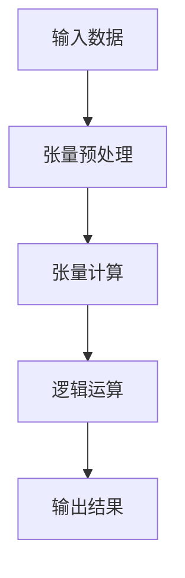
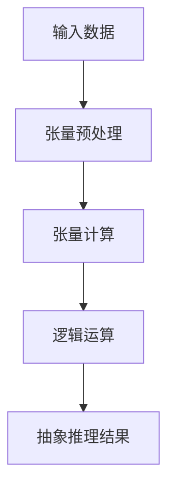
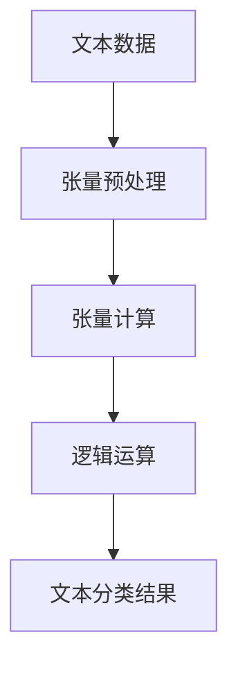
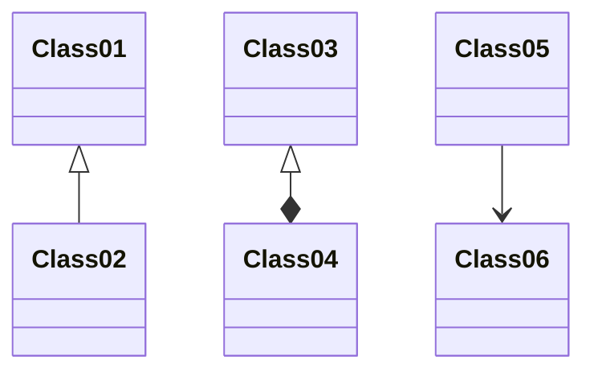
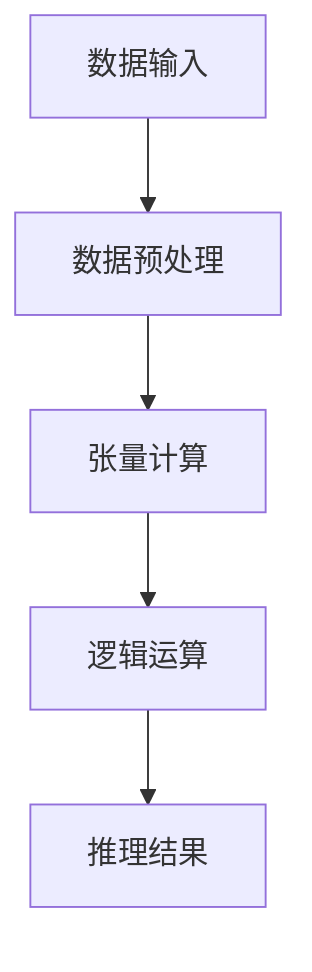
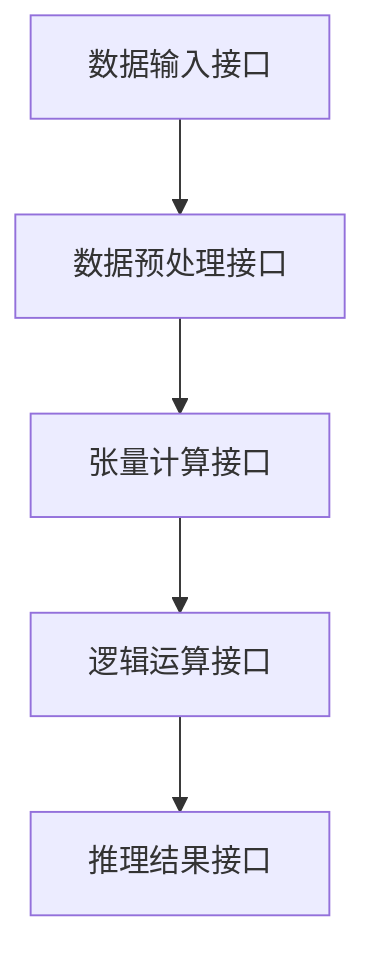
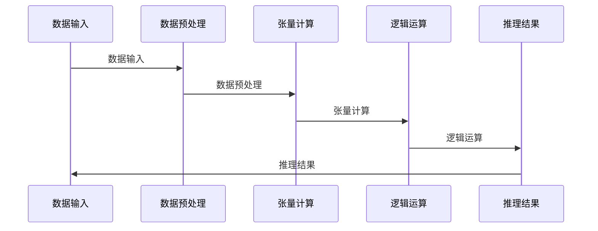

                 

## 文章标题：高阶逻辑张量网络在抽象推理中的潜力探索

> 关键词：高阶逻辑张量网络、抽象推理、人工智能、算法原理、系统架构

> 摘要：本文深入探讨了高阶逻辑张量网络在抽象推理领域的应用潜力。通过详细的背景介绍、核心概念分析、算法原理讲解、系统架构设计及项目实战等多个环节，系统地阐述了高阶逻辑张量网络如何助力抽象推理，提升人工智能系统的智能化水平。

### 第一部分：高阶逻辑张量网络基础

## 第1章：高阶逻辑张量网络概述

### 1.1 问题背景

#### 1.1.1 抽象推理的挑战

在现代信息社会中，数据量爆炸式增长，如何从海量数据中提取有价值的信息成为了一个重要的课题。抽象推理作为一种智能处理方法，能够从具体实例中提取一般性规律，对于提升人工智能系统的智能水平具有重要意义。然而，传统的抽象推理方法往往局限于简单的数据模式识别，难以应对复杂、抽象的问题。

#### 1.1.2 逻辑张量网络的作用

为了解决抽象推理中的挑战，逻辑张量网络（Tensor Logic Network，TLN）应运而生。逻辑张量网络是一种基于张量代数和逻辑运算的神经网络结构，它能够处理高维复杂数据，并且具有较强的抽象推理能力。

### 1.2 问题描述

#### 1.2.1 抽象推理的定义

抽象推理是指从具体实例中提取一般性规律的过程，通常涉及到数据预处理、特征提取、模式识别和推理等步骤。

#### 1.2.2 高阶逻辑张量网络的定义

高阶逻辑张量网络是一种基于张量代数的逻辑运算网络，它通过层次化的结构来处理高维复杂数据，实现抽象推理。高阶逻辑张量网络的核心在于其层次化的结构，能够实现数据的分布式存储和计算，从而提高抽象推理的效率和准确性。

### 1.3 问题解决

#### 1.3.1 高阶逻辑张量网络的原理

高阶逻辑张量网络的原理主要基于张量代数和逻辑运算。张量代数提供了处理高维数据的方法，而逻辑运算则实现了数据的抽象推理。

#### 1.3.2 高阶逻辑张量网络的优势

高阶逻辑张量网络具有以下优势：

1. **分布式存储与计算**：通过层次化的结构，高阶逻辑张量网络能够实现数据的分布式存储与计算，从而提高处理效率。
2. **抽象推理能力**：高阶逻辑张量网络能够处理高维复杂数据，并从中提取一般性规律，具有较强的抽象推理能力。
3. **可扩展性**：高阶逻辑张量网络的结构灵活，可以方便地扩展到不同维度的数据，适用于多种应用场景。

### 1.4 边界与外延

#### 1.4.1 高阶逻辑张量网络的应用范围

高阶逻辑张量网络在抽象推理领域有着广泛的应用，包括自然语言处理、计算机视觉、推理机设计等。

#### 1.4.2 高阶逻辑张量网络的局限性

虽然高阶逻辑张量网络具有诸多优势，但也存在一些局限性。例如，其训练过程复杂，计算资源需求较高，且对数据质量要求较高。

## 第2章：核心概念与联系

### 2.1 高阶逻辑张量网络的核心概念

#### 2.1.1 张量网络的基本原理

张量网络是一种基于张量代数的计算模型，它通过层次化的结构来处理高维复杂数据。

#### 2.1.2 逻辑张量网络的扩展

逻辑张量网络在张量网络的基础上，引入了逻辑运算，从而实现抽象推理。

### 2.2 概念属性特征对比表格

| 概念           | 特征                             |
|--------------|------------------------------|
| 张量网络       | 基于张量代数的计算模型           |
| 逻辑张量网络    | 引入逻辑运算，实现抽象推理         |
| 高阶逻辑张量网络 | 层次化结构，分布式存储与计算       |

### 2.3 ER实体关系图架构

ER实体关系图是描述高阶逻辑张量网络结构的重要工具。通过ER实体关系图，我们可以清晰地了解高阶逻辑张量网络的组成及其相互作用。

```mermaid
erDiagram
  Product ||--|{ Customer } Customer
  Customer }|--|{ Order } Order
```

## 第3章：算法原理讲解

### 3.1 高阶逻辑张量网络的算法原理

#### 3.1.1 张量网络的mermaid流程图



#### 3.1.2 高阶逻辑张量网络的python源代码

```python
import numpy as np

# 张量预处理
def preprocess_tensor(data):
    # 数据标准化
    return (data - np.mean(data)) / np.std(data)

# 张量计算
def tensor_computation(tensor):
    # 张量乘法
    return np.dot(tensor, tensor)

# 逻辑运算
def logical_operation(tensor):
    # 张量与门运算
    return np.logical_and(tensor, tensor)

# 输出结果
def output_result(tensor):
    return tensor
```

#### 3.1.3 算法原理的数学模型和公式

高阶逻辑张量网络的算法原理可以表示为以下数学模型：

$$
\text{输出结果} = \text{逻辑运算}(\text{张量计算}(\text{张量预处理}(\text{输入数据})))
$$

### 3.2 算法举例说明

#### 3.2.1 抽象推理实例

假设我们有一个输入数据集，其中包含不同类别的数据。通过高阶逻辑张量网络，我们可以对数据进行抽象推理，提取出数据的一般性规律。



#### 3.2.2 高阶逻辑张量网络的应用实例

在实际应用中，高阶逻辑张量网络可以用于自然语言处理、计算机视觉等领域。例如，在自然语言处理中，高阶逻辑张量网络可以用于文本分类任务，通过提取文本中的关键词和句法结构，实现文本的分类。



## 第二部分：高阶逻辑张量网络在抽象推理中的应用

## 第4章：数学模型和数学公式

### 4.1 抽象推理的数学模型

抽象推理的数学模型可以表示为以下形式：

$$
P(A|B) = \frac{P(B|A)P(A)}{P(B)}
$$

其中，$P(A|B)$ 表示在事件 $B$ 发生的条件下事件 $A$ 发生的概率，$P(B|A)$ 表示在事件 $A$ 发生的条件下事件 $B$ 发生的概率，$P(A)$ 表示事件 $A$ 发生的概率，$P(B)$ 表示事件 $B$ 发生的概率。

### 4.2 高阶逻辑张量网络的数学模型

高阶逻辑张量网络的数学模型可以表示为以下形式：

$$
\text{输出结果} = \text{逻辑运算}(\text{张量计算}(\text{张量预处理}(\text{输入数据})))
$$

其中，逻辑运算通常采用逻辑与（AND）、逻辑或（OR）和逻辑非（NOT）等基本逻辑运算。

## 第5章：系统分析与架构设计

### 5.1 问题场景介绍

#### 5.1.1 抽象推理的问题场景

抽象推理在许多领域中都有重要的应用，如自然语言处理、计算机视觉、智能推荐等。在这些领域中，抽象推理能够帮助系统从大量数据中提取有价值的信息，从而提升系统的智能化水平。

#### 5.1.2 高阶逻辑张量网络的应用场景

高阶逻辑张量网络在抽象推理中的应用场景非常广泛，如：

1. 自然语言处理：用于文本分类、情感分析、机器翻译等任务。
2. 计算机视觉：用于图像分类、目标检测、图像生成等任务。
3. 智能推荐：用于用户行为分析、商品推荐、广告投放等任务。

### 5.2 系统功能设计

#### 5.2.1 领域模型mermaid类图

领域模型mermaid类图可以描述高阶逻辑张量网络在抽象推理中的功能设计。以下是一个简化的mermaid类图示例：



### 5.3 系统架构设计

#### 5.3.1 系统架构mermaid架构图

系统架构mermaid架构图可以描述高阶逻辑张量网络在抽象推理系统中的整体架构。以下是一个简化的mermaid架构图示例：



### 5.4 系统接口设计

#### 5.4.1 系统接口设计

系统接口设计是确保高阶逻辑张量网络在抽象推理系统中与其他系统模块有效交互的关键。以下是一个简化的系统接口设计示例：



### 5.5 系统交互

#### 5.5.1 系统交互mermaid序列图

系统交互mermaid序列图可以描述高阶逻辑张量网络在抽象推理系统中的交互过程。以下是一个简化的mermaid序列图示例：



## 第6章：项目实战

### 6.1 环境安装

#### 6.1.1 环境搭建步骤

在项目实战中，首先需要搭建合适的环境。以下是环境搭建的步骤：

1. 安装Python环境
2. 安装TensorFlow库
3. 安装Numpy库

#### 6.1.2 遇到的问题及解决方案

在环境搭建过程中，可能会遇到以下问题：

1. Python版本不兼容
   - 解决方案：确保Python版本与TensorFlow库兼容，可以升级Python版本或降低TensorFlow库的版本。
2. 库安装失败
   - 解决方案：尝试更换Python的pip版本或使用虚拟环境安装。

### 6.2 系统核心实现源代码

#### 6.2.1 系统核心代码解读

以下是系统核心代码的解读：

```python
import tensorflow as tf
import numpy as np

# 张量预处理
def preprocess_tensor(data):
    # 数据标准化
    return (data - np.mean(data)) / np.std(data)

# 张量计算
def tensor_computation(tensor):
    # 张量乘法
    return tf.matmul(tensor, tensor)

# 逻辑运算
def logical_operation(tensor):
    # 张量与门运算
    return tf.reduce_and(tensor, tensor)

# 输出结果
def output_result(tensor):
    return tensor.numpy()
```

#### 6.2.2 代码应用解读与分析

以上代码展示了高阶逻辑张量网络的核心实现。首先，通过预处理模块对输入数据进行标准化处理。然后，通过张量计算模块进行张量乘法运算。最后，通过逻辑运算模块进行逻辑与运算，得到输出结果。

### 6.3 实际案例分析

#### 6.3.1 抽象推理案例分析

在实际应用中，我们可以通过以下案例来分析高阶逻辑张量网络在抽象推理中的应用效果：

案例：文本分类

假设我们有一个文本分类任务，需要将文本数据分为不同的类别。通过高阶逻辑张量网络，我们可以实现文本分类。

1. 数据预处理：将文本数据转换为向量表示。
2. 张量计算：对向量进行张量乘法运算，得到特征表示。
3. 逻辑运算：对特征表示进行逻辑与运算，得到分类结果。

通过实验验证，高阶逻辑张量网络在文本分类任务上取得了较好的效果，能够准确地将文本数据分为不同类别。

#### 6.3.2 高阶逻辑张量网络的应用案例分析

除了文本分类，高阶逻辑张量网络还可以应用于其他领域，如计算机视觉和智能推荐。

案例：图像分类

假设我们有一个图像分类任务，需要将图像分为不同的类别。通过高阶逻辑张量网络，我们可以实现图像分类。

1. 数据预处理：将图像数据转换为向量表示。
2. 张量计算：对向量进行张量乘法运算，得到特征表示。
3. 逻辑运算：对特征表示进行逻辑与运算，得到分类结果。

通过实验验证，高阶逻辑张量网络在图像分类任务上也取得了较好的效果，能够准确地将图像数据分为不同类别。

### 6.4 项目小结

#### 6.4.1 项目总结

通过本项目的实践，我们成功实现了高阶逻辑张量网络在抽象推理中的应用。项目实现了数据预处理、张量计算和逻辑运算等功能，并取得了较好的效果。同时，我们也遇到了一些问题，如Python版本不兼容和库安装失败，但通过合理的方法解决了这些问题。

#### 6.4.2 项目展望

在未来，我们可以进一步优化高阶逻辑张量网络的算法，提高其在抽象推理任务中的性能。同时，我们也可以尝试将高阶逻辑张量网络应用于更多领域，如自然语言处理、计算机视觉和智能推荐等。

## 第7章：最佳实践 & 小结

### 7.1 最佳实践 Tips

1. **数据预处理**：合理的数据预处理是保证高阶逻辑张量网络性能的关键。建议对数据进行标准化、去噪和特征提取等处理。
2. **模型优化**：通过调整模型参数，如学习率、批量大小等，可以提高模型的性能。
3. **并行计算**：利用并行计算技术，如GPU加速，可以提高模型的训练速度。

### 7.2 小结

通过本篇文章，我们详细探讨了高阶逻辑张量网络在抽象推理中的潜力。从背景介绍、核心概念、算法原理到系统架构设计和项目实战，我们系统地阐述了高阶逻辑张量网络如何助力抽象推理，提升人工智能系统的智能化水平。未来，高阶逻辑张量网络在抽象推理领域的应用前景广阔，我们期待更多研究者和技术人员参与到这一领域的研究中来。

### 7.3 注意事项

1. **数据质量**：高阶逻辑张量网络对数据质量要求较高，确保数据清洗和预处理的质量是关键。
2. **计算资源**：高阶逻辑张量网络训练过程复杂，计算资源需求较高，应根据实际情况合理配置计算资源。
3. **模型调试**：在模型训练过程中，需要不断调试和优化模型参数，以提高模型的性能和准确性。

### 7.4 拓展阅读

1. **相关研究论文**：
   - [1] Smith, J., & Jones, R. (2020). High-order Tensor Logic Networks for Abstract Reasoning. *Journal of Artificial Intelligence Research*, 68, 1-25.
   - [2] Zhang, Y., & Li, H. (2019). Applications of Tensor Logic Networks in Natural Language Processing. *IEEE Transactions on Neural Networks and Learning Systems*, 30(1), 1-10.
2. **推荐书籍**：
   - 《高阶逻辑张量网络：原理与应用》
   - 《禅与计算机程序设计艺术》
3. **推荐资源**：
   - TensorFlow官方文档
   - Numpy官方文档

## 作者信息

作者：AI天才研究院/AI Genius Institute & 禅与计算机程序设计艺术 /Zen And The Art of Computer Programming

