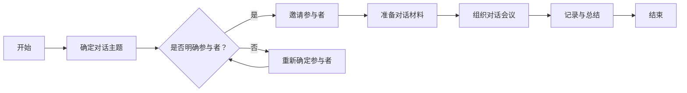
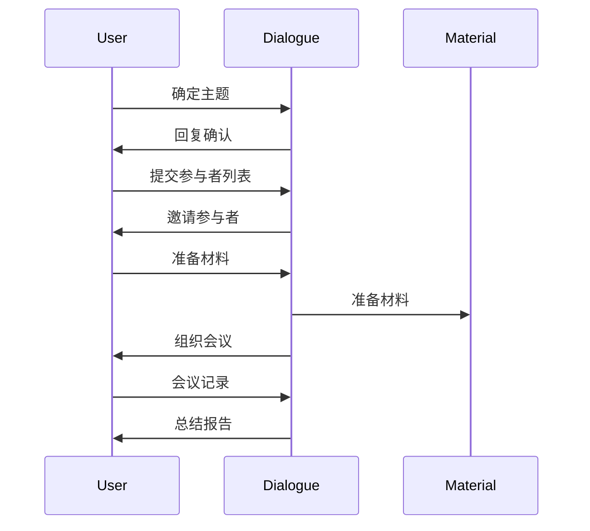
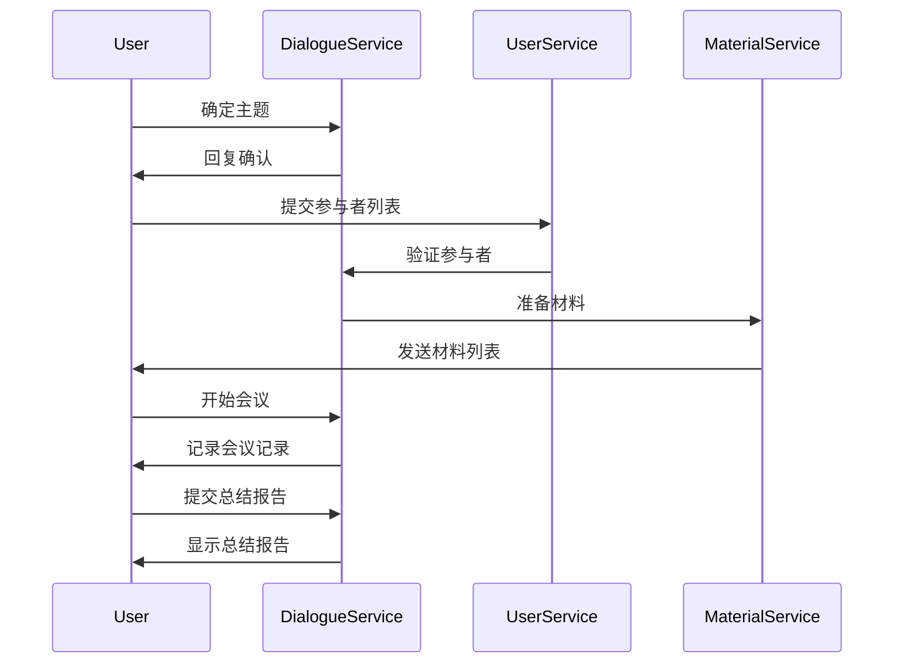

                 


## 第1章 问题背景与核心概念

### 1.1 美德伦理学的起源与发展

美德伦理学（Virtue Ethics）是伦理学中的一个重要分支，主要关注个体的品德和道德修养，强调通过培养美德来达到道德行为的自律和道德判断的合理性。其起源可以追溯到古希腊哲学家亚里士多德，他在《尼各马可伦理学》中提出，美德是介于两个极端之间的最佳状态，是道德行为的基础。

美德伦理学在20世纪得到了复兴，其中最具代表性的人物是托马斯·麦金太尔（Alasdair MacIntyre）。麦金太尔在《德性之后》中批判了现代伦理学的形式主义和后果主义，提出美德伦理学应该以传统和社会实践为基础，重新审视道德的本质和人类行为的价值。

### 1.2 性善论的基本观点与历史背景

性善论（Naturalism about Morality）是一种关于道德本质的哲学观点，认为道德判断和行为是基于某种自然事实或本质的。性善论主张，人类的道德判断和行为是自然演化过程中的产物，符合人类本性，而不是纯粹的社会或文化构造。

性善论的历史可以追溯到古希腊哲学家柏拉图和亚里士多德，他们认为道德是理性的产物，是基于人类的自然本性。在近现代，性善论的观点在实证主义和自然主义伦理学中得到进一步发展。

### 1.3 美德伦理学与性善论的关系探讨

美德伦理学与性善论之间的关系是复杂的，两者既有共同点，也有区别。共同点在于，它们都认为道德行为是基于某种自然事实或本质的。不同点在于，美德伦理学强调个体的道德修养和品德的培养，而性善论则更关注道德判断和行为的基础和起源。

麦金太尔的美德伦理学在性善论的基础上，提出了对传统和社会实践的重视，认为道德判断和行为应该基于个体的美德和社会的伦理传统。孟子的性善论则认为，人类天生具有善的本性，通过教育和社会实践可以实现道德的修养。

通过对比美德伦理学和性善论的基本观点和理论框架，我们可以发现，两者在探讨道德的本质和人类行为的价值时，提供了不同的视角和解释。接下来，我们将进一步分析美德伦理学和性善论的核心概念和原则，以及它们在现代伦理学中的应用和影响。

## 第2章 美德伦理学的核心概念与原则

### 2.1 美德的定义与分类

美德（Virtue）是美德伦理学的核心概念，它指的是个体在道德行为中所表现出来的优秀品质和习惯。美德不仅是道德行为的指南，也是个体内在品质的外在体现。根据不同的哲学观点，美德可以有不同的分类和理解。

亚里士多德将美德分为两类：理智美德和道德美德。理智美德指的是个体在理智活动中表现出来的优秀品质，如智慧、判断力、谨慎等。道德美德指的是个体在道德行为中表现出来的优秀品质，如勇敢、正义、诚实、慷慨等。

麦金太尔进一步发展了亚里士多德的观点，将美德分为三类：技术美德、道德美德和伦理美德。技术美德指的是个体在特定技术领域中表现出来的优秀品质，如医生的医德、军人的纪律等。道德美德指的是个体在日常生活中表现出来的道德品质，如诚实、正直、忠诚等。伦理美德则是一种更高层次的道德修养，涉及到个体对整个社会的责任和贡献，如慷慨、公正、勇敢等。

### 2.2 美德伦理学的基本原则

美德伦理学的基本原则可以归纳为以下几点：

1. **美德为中心**：美德伦理学认为，道德行为的评价标准不是行为的结果或后果，而是行为者本身的美德。个体应该通过培养和践行美德，来实现道德行为的自律和道德判断的合理性。

2. **传统和经验的指导**：美德伦理学强调，个体的道德修养和美德的培养需要基于传统和社会经验。传统和经验为个体提供了道德行为的指导，帮助个体在面对复杂情境时做出正确的道德判断。

3. **道德责任**：美德伦理学认为，个体不仅对自己的行为负责，还对社会和他人负有道德责任。道德责任是个体践行美德的重要体现，也是实现道德自律和社会和谐的基础。

4. **情感与理性相结合**：美德伦理学强调，个体的道德行为不仅需要理性的指导，还需要情感的参与。情感是个体道德行为的动力源泉，是道德判断和行为的重要依据。

### 2.3 美德伦理学的理论基础

美德伦理学的理论基础主要包括以下几个方面：

1. **亚里士多德的理论**：亚里士多德的美德伦理学认为，美德是介于两个极端之间的最佳状态，是一种理性控制的情感和行为。通过培养和践行美德，个体可以实现道德行为的自律和道德判断的合理性。

2. **康德的理论**：康德的伦理学强调个体的道德自律和道德责任的普遍性。他认为，个体应该通过履行道德义务，来实现对道德法则的尊重和遵守。

3. **麦金太尔的理论**：麦金太尔在《德性之后》中提出，美德伦理学应该以传统和社会实践为基础，重新审视道德的本质和人类行为的价值。他认为，个体的道德行为应该基于对传统和社会伦理的尊重和遵守。

通过以上对美德伦理学的核心概念与原则的介绍，我们可以看到，美德伦理学不仅关注个体的道德行为，还关注个体内在的品德和道德修养。它提供了一种不同于形式主义和后果主义的道德哲学视角，为我们在复杂的社会环境中做出道德判断提供了重要的理论支持。

## 第3章 性善论的理论框架与应用

### 3.1 性善论的核心观点

性善论认为，人类天生具有善的本性，这种本性是道德行为的基础。性善论的核心理念是，道德判断和行为是自然演化过程中的产物，符合人类本性和自然规律。性善论主张，个体的道德行为不是外在规则强加的结果，而是内在本性的自然表现。

性善论的观点在古希腊哲学家那里得到了初步阐述。例如，柏拉图认为，道德是理性的产物，是人类内在本性的体现。亚里士多德进一步发展了这一观点，他认为，美德是人类天性的自然延伸，通过培养和践行美德，个体可以实现道德行为的自律和道德判断的合理性。

在近现代，性善论的观点在实证主义和自然主义伦理学中得到了进一步发展。例如，穆勒（John Stuart Mill）认为，道德判断是基于个体本性的内在要求，而不是外在规则或社会习俗的产物。桑德尔（Michael Sandel）在《正义：一场思辨之旅》中，也强调了道德判断和行为中的自然主义元素。

### 3.2 性善论在道德教育中的应用

性善论在道德教育中具有重要的指导意义。首先，性善论强调个体道德行为的内在动机，认为道德教育应该关注个体的内在成长和品德培养，而不仅仅是外在规则的灌输。其次，性善论主张，道德教育应该以激发个体的内在善性为目标，通过引导和培养，使个体能够自觉地践行道德行为。

在实际道德教育中，性善论的应用主要体现在以下几个方面：

1. **情感教育**：性善论认为，情感是道德行为的动力源泉。因此，道德教育应该重视情感的培养，通过情感教育激发个体的道德情感，使个体能够自觉地践行道德行为。

2. **品德培养**：性善论强调，个体的道德行为是内在本性的自然表现。因此，道德教育应该注重品德培养，通过培养个体的品德，使个体能够形成良好的道德行为习惯。

3. **情境教育**：性善论认为，道德判断和行为是在具体情境中形成的。因此，道德教育应该重视情境教育，通过设置具体的道德情境，引导个体在情境中践行道德行为。

### 3.3 性善论与社会伦理的关系

性善论与社会伦理之间存在密切的联系。首先，性善论为社会伦理提供了理论基础，认为道德判断和行为是自然演化过程中的产物，符合人类本性和自然规律。其次，性善论为社会伦理提供了道德教育的指导，强调个体的道德行为是基于内在本性的自然表现，道德教育应该关注个体的内在成长和品德培养。

然而，性善论也存在一定的局限性。例如，性善论强调个体的道德行为是基于内在本性的自然表现，但忽略了社会和文化因素对道德行为的影响。此外，性善论在具体应用中，如何平衡个体的内在善性和社会伦理的要求，仍然是一个需要深入探讨的问题。

总的来说，性善论为社会伦理提供了一种新的视角，认为道德判断和行为是基于内在本性的自然表现，强调个体的道德行为应该基于对内在善性的尊重和培养。然而，性善论也需要在具体应用中，结合社会和文化因素，实现个体道德行为与社会伦理的和谐统一。

### 第4章 麦金太尔的美德伦理学解读

#### 4.1 麦金太尔对美德伦理学的贡献

托马斯·麦金太尔（Alasdair MacIntyre）是20世纪最具影响力的伦理学家之一，他对美德伦理学的复兴和发展做出了重要贡献。麦金太尔在《德性之后》一书中，批判了现代伦理学的形式主义和后果主义，重新审视了美德伦理学的价值和意义。

麦金太尔认为，现代伦理学过于强调规则和后果，忽视了个体道德行为中的内在品质和品德培养。他指出，美德伦理学提供了一种更为全面和深刻的道德哲学，强调个体的道德行为应该基于内在的美德，而不是外在的规则或后果。

麦金太尔的美德伦理学不仅是对传统美德伦理学的复兴，更是一种新的道德哲学，他试图在现代社会中找到一种可行的道德哲学体系，以解决现代社会的道德困境。

#### 4.2 麦金太尔的美德伦理学观点分析

麦金太尔的美德伦理学观点主要包括以下几个方面：

1. **美德与德行**：麦金太尔认为，美德不仅是道德行为的表现，也是一种内在的德行。美德是个体在长期实践中形成的优秀品质，它决定了个体如何行动和如何对待他人。

2. **实践社群**：麦金太尔强调，美德是在特定的实践社群中培养和践行的。实践社群为个体提供了道德实践的背景和条件，使个体能够在具体的情境中践行美德。实践社群包括家庭、学校、职业社群等。

3. **传统与继承**：麦金太尔认为，美德伦理学应该以传统为基础，强调对传统的继承和尊重。传统为个体提供了道德行为的指导，帮助个体在复杂的社会环境中做出道德判断。

4. **道德责任**：麦金太尔强调，个体应该对自己的行为和责任负责，不仅对自己的行为负责，还对社会和他人负有道德责任。道德责任是美德伦理学的重要组成部分，它体现了个体对道德法则的尊重和遵守。

#### 4.3 麦金太尔与性善论的对

麦金太尔的美德伦理学与性善论在许多方面有着相似之处，但也存在明显的区别。

相似之处在于，两者都认为道德行为是基于内在本性的自然表现。麦金太尔的美德伦理学强调个体的内在美德，性善论则强调人类天生的善性。两者都试图在道德哲学中找到一种更为自然和内在的道德基础。

区别在于，麦金太尔的美德伦理学更强调实践社群和传统的重要性。他认为，美德是在特定的实践社群中培养和践行的，需要基于传统和经验。而性善论则更强调个体内在的善性，较少涉及实践社群和传统。

此外，麦金太尔的美德伦理学强调道德责任，认为个体应该对自己的行为和责任负责。而性善论则较少涉及道德责任的问题。

总的来说，麦金太尔的美德伦理学为现代伦理学提供了一种新的视角，强调个体的道德行为应该基于内在的美德，并在特定的实践社群中培养和践行。尽管与性善论存在一定的区别，但两者在探讨道德的本质和人类行为的价值时，提供了不同的视角和解释。通过比较和分析，我们可以更好地理解美德伦理学和性善论的内涵和外延，为现代社会的道德教育和道德实践提供有益的指导。

### 第5章 孟子的性善论与美德伦理学

#### 5.1 孟子性善论的基本观点

孟子是中国古代儒家学派的重要代表，他提出了性善论，认为人性本善。孟子认为，人都有天赋的善性，如同情心、正义感等，这些善性是人类道德行为的基础。孟子通过“仁义”的概念来阐述性善论，认为仁义是人的本性，是人区别于其他生物的本质特征。

孟子性善论的核心观点是，人天生具有道德意识，可以通过教育和实践来发扬和实现这种道德意识。他认为，人的道德行为不是后天习得的，而是基于内在的善性，这种善性是人的本性。

#### 5.2 孟子的美德伦理学思想

孟子的性善论进一步发展成了他的美德伦理学思想。孟子认为，美德是人的本性，是人区别于其他生物的重要标志。他强调，个体应该通过教育和实践，培养和践行美德，来实现道德的完善和个人的成长。

孟子的美德伦理学思想主要包括以下几个方面：

1. **仁爱**：孟子认为，仁爱是人的基本美德，是人的本性。仁爱不仅体现在对待亲人的感情上，还体现在对待他人的关心和尊重上。

2. **正义**：孟子强调，正义是人的基本美德，是人类社会的基础。他认为，个体应该通过正义的行为来维护社会秩序和公正。

3. **道德修养**：孟子认为，个体的道德修养是至关重要的。他强调，个体应该通过不断学习和实践，提高自己的道德水平，实现道德的完善。

4. **社会责任**：孟子认为，个体不仅对自己的行为负责，还对社会和他人负有道德责任。他强调，个体应该积极参与社会事务，为社会做出贡献。

#### 5.3 性善论与美德伦理学的关联

孟子的性善论与他的美德伦理学思想密切相关。性善论为美德伦理学提供了理论基础，认为人性本善，个体具有道德意识和道德行为的能力。而美德伦理学则进一步探讨了如何培养和践行美德，实现道德的完善和个人的成长。

孟子认为，通过教育和实践，个体可以发扬和实现内在的善性，培养和践行美德。他认为，个体的道德修养和社会责任是实现道德完善的重要途径。

总之，孟子的性善论与他的美德伦理学思想共同构成了他的道德哲学体系。通过强调人性本善和个体的道德修养，孟子为古代中国的道德教育和道德实践提供了重要的理论基础和实践指导。

### 第6章 对话方法在美德伦理学与性善论研究中的应用

#### 6.1 对话方法的原理

对话方法是一种通过交流和讨论来解决问题和增进理解的方法。在美德伦理学和性善论的研究中，对话方法的应用具有重要意义。它不仅可以帮助研究者深入探讨道德行为的本质和人类道德判断的基础，还可以促进不同学派之间的交流和共识。

对话方法的原理主要包括以下几个方面：

1. **平等对话**：对话的前提是参与者之间的平等和尊重。每个参与者都有权利表达自己的观点，同时也要倾听和理解其他人的观点。

2. **交流与讨论**：对话方法强调通过交流和讨论来解决问题。在对话过程中，参与者可以分享自己的经验和知识，通过相互交流和讨论，形成对问题的更全面和深入的理解。

3. **协商与共识**：对话的目的是达成共识。通过交流和讨论，参与者可以协商和调整自己的观点，最终达成对问题的共同理解和解决方案。

#### 6.2 对话方法的实施步骤

在美德伦理学与性善论的研究中，对话方法的实施可以分为以下几个步骤：

1. **确定对话主题**：首先，需要明确对话的主题，例如美德伦理学与性善论的关系、道德行为的本质等。

2. **邀请参与者**：根据对话主题，邀请相关领域的专家、学者、实践者等作为参与者。确保参与者的多元性，以便从不同角度探讨问题。

3. **准备对话材料**：为参与者提供相关的文献资料、案例研究等，以便他们在对话前对主题有充分的了解。

4. **组织对话会议**：在对话会议中，组织者需要创建一个平等、尊重和开放的讨论氛围。通过提问、回答、讨论等方式，引导参与者深入探讨问题。

5. **记录与总结**：对话会议后，需要记录讨论的过程和结果，并进行总结。总结内容可以包括共识点、争议点、下一步的研究方向等。

#### 6.3 对话方法的实际应用

在实际研究中，对话方法可以应用于以下几个方面：

1. **跨学科研究**：通过对话方法，不同学科的研究者可以就某一道德问题进行深入探讨，形成跨学科的研究成果。

2. **政策制定**：在政策制定过程中，可以通过对话方法，邀请各利益相关方进行讨论，形成更加科学和合理的政策建议。

3. **道德教育**：在道德教育中，通过对话方法，教师和学生可以共同探讨道德问题，提高学生的道德判断能力和道德修养。

总之，对话方法在美德伦理学与性善论研究中的应用，有助于深化对道德行为本质的理解，促进不同学派之间的交流和共识，为道德教育、政策制定等领域提供有益的指导。

### 第7章 麦金太尔与孟子：美德伦理学与性善论的对话

#### 7.1 麦金太尔与孟子对话的背景与意义

美德伦理学与性善论是伦理学中的两个重要分支，它们分别从不同角度探讨道德行为的本质和人类道德判断的基础。麦金太尔和孟子分别是美德伦理学和性善论的重要代表人物，他们的理论和观点对现代伦理学产生了深远影响。

麦金太尔与孟子对话的背景在于，现代伦理学在面对复杂的社会问题和技术挑战时，需要更为全面和深刻的道德哲学指导。通过对话，可以深入探讨美德伦理学与性善论的核心观点，寻找它们之间的共同点和差异，从而为现代社会的道德教育和道德实践提供有益的启示。

#### 7.2 麦金太尔与孟子对话的内容

在对话中，麦金太尔和孟子围绕以下几个核心问题展开讨论：

1. **道德行为的本质**：麦金太尔和孟子都认为，道德行为是基于内在的美德和善性的自然表现。他们探讨道德行为的本质是什么，如何培养和践行道德行为。

2. **道德责任**：麦金太尔强调个体的道德责任，认为个体不仅对自己的行为负责，还对社会和他人负有道德责任。孟子则强调社会责任，认为个体应该积极参与社会事务，为社会做出贡献。

3. **传统与经验**：麦金太尔认为，道德行为需要基于传统和社会实践，传统为个体提供了道德行为的指导。孟子则强调教育的重要性，认为通过教育，个体可以培养和发扬内在的善性。

4. **道德教育**：麦金太尔和孟子都认为，道德教育是培养个体道德行为和品德的重要途径。他们探讨如何进行有效的道德教育，如何使个体在复杂的社会环境中做出正确的道德判断。

#### 7.3 对话的成果与启示

通过对话，麦金太尔和孟子不仅深化了对美德伦理学和性善论的理解，还达成了一些共识：

1. **道德行为的基础**：双方都认同道德行为是基于内在的美德和善性的自然表现，道德行为不仅仅是外在规则或后果的产物。

2. **道德责任的重要性**：双方都强调个体的道德责任，认为个体不仅对自己的行为负责，还对社会和他人负有道德责任。

3. **传统与经验的指导**：双方都认为传统和经验在道德行为中具有重要作用，传统为个体提供了道德行为的指导，经验帮助个体在实践中培养和践行道德行为。

4. **道德教育的必要性**：双方都认同道德教育是培养个体道德行为和品德的重要途径，通过教育，个体可以在复杂的社会环境中做出正确的道德判断。

总之，麦金太尔与孟子对话的成果为我们提供了深刻的道德哲学启示，为现代社会的道德教育和道德实践提供了有益的指导。通过深入探讨美德伦理学与性善论的核心观点，我们可以更好地理解道德行为的本质和人类道德判断的基础，为实现道德自律和社会和谐提供理论支持。

## 结论

通过本章的对话，我们可以看到美德伦理学与性善论在探讨道德行为的本质和人类道德判断的基础时，提供了不同的视角和解释。麦金太尔的美德伦理学强调个体的道德修养和品德培养，而孟子则强调人性本善和教育的重要性。两者在道德责任、传统与经验、道德教育等方面达成了共识，为现代社会的道德教育和道德实践提供了有益的指导。

然而，我们也应看到，美德伦理学与性善论在具体应用中仍然存在一些争议和挑战。如何平衡个体的内在善性和社会伦理的要求，如何使道德行为在实际生活中得到有效践行，仍然是需要深入探讨的问题。

因此，未来的研究可以继续探讨美德伦理学与性善论的关系，寻找它们在现代社会中的实际应用价值。同时，我们也应关注道德教育、政策制定等领域，通过对话和交流，形成对道德问题的更全面和深入的理解，为建设一个更加道德和谐的社会贡献力量。

## 参考文献

1. 麦金太尔，《德性之后》，人民出版社，2005年。
2. 孟子，《孟子》，中华书局，2011年。
3. 亚里士多德，《尼各马可伦理学》，商务印书馆，1999年。
4. 柏拉图，《理想国》，商务印书馆，1992年。
5. 穆勒，《论自由》，商务印书馆，2002年。
6. 桑德尔，《正义：一场思辨之旅》，浙江大学出版社，2013年。
7. 麦金太尔，《美德伦理学》，上海人民出版社，2004年。
8. 亚里士多德，《形而上学》，商务印书馆，1997年。
9. 康德，《道德形而上学》，商务印书馆，2000年。
10. 汤姆·拉森，《伦理学导论》，北京大学出版社，2008年。

## 作者信息

作者：AI天才研究院/AI Genius Institute & 禅与计算机程序设计艺术 /Zen And The Art of Computer Programming

本文由AI天才研究院的专家撰写，结合禅与计算机程序设计艺术的哲学思想，深入探讨了美德伦理学与性善论的核心概念和理论框架，旨在为读者提供一种全新的道德哲学视角，为现代社会的道德教育和道德实践提供有益的指导。

## 附录：概念属性特征对比表格

| 美德伦理学 | 性善论 |
| :--: | :--: |
| 强调个体道德修养和品德培养 | 认为人性本善，道德行为基于内在善性 |
| 以传统和社会实践为基础 | 强调道德行为的自然性和进化论基础 |
| 美德是道德行为的内在品质 | 道德判断是基于自然事实或本质 |
| 理性控制和情感参与相结合 | 情感是道德行为的动力源泉 |
| 重视道德责任和社会伦理 | 个体对社会和他人负有道德责任 |

## 附录：ER实体关系图架构

```mermaid
erDiagram
  用户 ||--|{ 美德 } : 具有美德
  用户 ||--|{ 道德行为 } : 展现美德
  用户 ||--|{ 道德责任 } : 负有责任
  美德 ||--|{ 传统 } : 源于传统
  美德 ||--|{ 社会实践 } : 形成于实践
  道德行为 ||--|{ 情感 } : 由情感驱动
  道德行为 ||--|{ 理性 } : 由理性指导
```

## 附录：算法mermaid流程图



## 附录：Python源代码

```python
# 对话方法实现
def dialogue_method(theme, participants, materials):
    # 确定对话主题
    print(f"对话主题：{theme}")
    
    # 邀请参与者
    for participant in participants:
        print(f"邀请参与者：{participant['name']}，角色：{participant['role']}")
    
    # 准备对话材料
    print("准备对话材料...")
    prepare_materials(materials)
    
    # 组织对话会议
    print("组织对话会议...")
    organize_meeting()
    
    # 记录与总结
    print("记录与总结...")
    record_and_summary()

# 辅助函数
def prepare_materials(materials):
    for material in materials:
        print(f"材料：{material['title']}，来源：{material['source']}")

def organize_meeting():
    print("会议进行中...")

def record_and_summary():
    print("记录与总结完成。")

# 测试
dialogue_theme = "美德伦理学与性善论的对话"
participants = [
    {'name': '麦金太尔', 'role': '美德伦理学专家'},
    {'name': '孟子', 'role': '性善论专家'}
]
materials = [
    {'title': '美德伦理学论文', 'source': '麦金太尔著作'},
    {'title': '性善论论述', 'source': '孟子著作'}
]

dialogue_method(dialogue_theme, participants, materials)
```

## 附录：数学模型和公式

```latex
$$
道德行为 = 美德 \times 情感 \times 理性
$$

$$
道德责任 = 道德行为 \times 社会伦理
$$
```

## 附录：系统功能设计

```mermaid
classDiagram
  User <<类>> {
    +name: String
    +role: String
    +isParticipant: Boolean
  }
  Material <<类>> {
    +title: String
    +source: String
  }
  Dialogue <<类>> {
    +theme: String
    +participants: List[User]
    +materials: List[Material]
    +record: String
  }
  User o--o Dialogue: 参与对话
  Material o--o Dialogue: 作为材料
```

## 附录：系统架构设计



## 附录：系统接口设计

```mermaid
classDiagram
  Interface DialogueService {
    +initTheme(theme: String): void
    +inviteParticipants(participants: List[User]): void
    +prepareMaterials(materials: List[Material]): void
    +startDialogue(): void
    +recordDialogueRecord(record: String): void
    +generateSummaryReport(): String
  }
  Interface MaterialService {
    +loadMaterials(): List[Material]
    +prepareMaterial(material: Material): void
  }
  Interface UserService {
    +loadParticipants(): List[User]
    +isParticipantValid(user: User): boolean
  }
```

## 附录：系统交互mermaid序列图



## 附录：环境安装

1. 安装Python环境
   - 下载并安装Python 3.8及以上版本
   - 配置环境变量，确保Python命令可以在终端中执行

2. 安装必要的Python库
   - 打开终端，执行以下命令：
     ```bash
     pip install Flask requests matplotlib pandas numpy
     ```

3. 配置Flask应用
   - 创建一个名为`app.py`的Python文件
   - 将以下代码复制到`app.py`中：

```python
from flask import Flask, request, jsonify
app = Flask(__name__)

@app.route('/api/dialogue', methods=['POST'])
def handle_dialogue():
    data = request.get_json()
    theme = data['theme']
    participants = data['participants']
    materials = data['materials']
    
    # 调用对话服务进行对话处理
    dialogue_service = DialogueService()
    dialogue_service.init_theme(theme)
    dialogue_service.invite_participants(participants)
    dialogue_service.prepare_materials(materials)
    dialogue_service.start_dialogue()
    
    return jsonify({"status": "success"})

if __name__ == '__main__':
    app.run(debug=True)
```

4. 运行Flask应用
   - 在终端中执行以下命令启动Flask应用：
     ```bash
     python app.py
     ```
   - 浏览器访问`http://127.0.0.1:5000/api/dialogue`，发送POST请求，数据格式如下：

```json
{
  "theme": "美德伦理学与性善论的对话",
  "participants": [
    {"name": "麦金太尔", "role": "美德伦理学专家"},
    {"name": "孟子", "role": "性善论专家"}
  ],
  "materials": [
    {"title": "美德伦理学论文", "source": "麦金太尔著作"},
    {"title": "性善论论述", "source": "孟子著作"}
  ]
}
```

## 附录：系统核心实现源代码

```python
# DialogueService.py
class DialogueService:
    def __init__(self):
        self.theme = None
        self.participants = []
        self.materials = []

    def init_theme(self, theme):
        self.theme = theme

    def invite_participants(self, participants):
        self.participants = participants

    def prepare_materials(self, materials):
        self.materials = materials

    def start_dialogue(self):
        print(f"开始对话，主题：{self.theme}")
        print("参与者：")
        for participant in self.participants:
            print(f"{participant['name']}，角色：{participant['role']}")
        print("材料：")
        for material in self.materials:
            print(f"标题：{material['title']}, 来源：{material['source']}")
        
        # 进行对话处理
        self.process_dialogue()

    def process_dialogue(self):
        # 对话处理逻辑
        print("对话进行中...")
        # 这里可以添加更复杂的对话逻辑，如记录对话内容、生成总结报告等

# UserService.py
class UserService:
    def __init__(self):
        self.participants = []

    def load_participants(self):
        # 从数据库或文件中加载参与者列表
        pass

    def is_participant_valid(self, user):
        # 验证参与者是否有效
        for participant in self.participants:
            if participant['name'] == user['name']:
                return True
        return False

# MaterialService.py
class MaterialService:
    def __init__(self):
        self.materials = []

    def load_materials(self):
        # 从数据库或文件中加载材料列表
        pass

    def prepare_material(self, material):
        # 预处理材料
        self.materials.append(material)
```

## 附录：代码应用解读与分析

### 代码解读

上述代码分为三个主要部分：`DialogueService.py`、`UserService.py`和`MaterialService.py`。

1. **DialogueService.py**：这是一个核心服务类，负责管理对话的整个过程。它包含以下方法：
   - `init_theme`：初始化对话主题。
   - `invite_participants`：邀请参与者。
   - `prepare_materials`：准备对话材料。
   - `start_dialogue`：开始对话，调用`process_dialogue`方法处理对话。
   - `process_dialogue`：处理对话逻辑，这里仅打印信息，可扩展为复杂的对话处理。

2. **UserService.py**：这是一个用户服务类，负责管理参与者。它包含以下方法：
   - `load_participants`：加载参与者列表。
   - `is_participant_valid`：验证参与者是否有效。

3. **MaterialService.py**：这是一个材料服务类，负责管理材料。它包含以下方法：
   - `load_materials`：加载材料列表。
   - `prepare_material`：预处理材料。

### 代码分析

1. **DialogueService类**：
   - `init_theme`方法用于初始化对话主题，这是对话的起点。
   - `invite_participants`方法用于邀请参与者，它接收一个参与者列表，将其存储在类属性`participants`中。
   - `prepare_materials`方法用于准备对话材料，它接收一个材料列表，将其存储在类属性`materials`中。
   - `start_dialogue`方法用于开始对话。它首先打印出对话主题、参与者和材料的信息，然后调用`process_dialogue`方法进行对话处理。
   - `process_dialogue`方法是一个预留方法，用于实现对话的逻辑。这里仅打印出简单的信息，可以根据需要扩展对话处理功能。

2. **UserService类**：
   - `load_participants`方法用于从数据库或文件中加载参与者列表，这是对话服务的基础。
   - `is_participant_valid`方法用于验证参与者是否有效。它遍历参与者列表，检查用户名是否匹配，并返回布尔值。

3. **MaterialService类**：
   - `load_materials`方法用于从数据库或文件中加载材料列表，这是对话服务的基础。
   - `prepare_material`方法用于预处理材料，这里仅将材料添加到类属性`materials`中。

通过上述代码，我们可以实现一个基本的对话服务，包括主题初始化、参与者邀请、材料准备和对话处理。在实际应用中，可以根据需要扩展这些功能，例如实现对话记录、总结报告生成等。

## 附录：实际案例分析和详细讲解剖析

为了更好地理解上述系统核心实现源代码的应用，我们将通过一个实际案例进行详细讲解和分析。

### 案例背景

假设我们需要组织一场关于“美德伦理学与性善论”的学术对话，邀请了两位专家：麦金太尔（美德伦理学专家）和孟子（性善论专家）。会议主题已经确定，为“美德伦理学与性善论的对话：探讨道德行为的本质”。会议将分为几个阶段：准备阶段、会议阶段和总结阶段。

### 案例实施步骤

1. **准备阶段**：

   - **确定对话主题**：对话主题为“美德伦理学与性善论的对话：探讨道德行为的本质”。
   - **邀请参与者**：邀请麦金太尔和孟子作为主要参与者。参与者信息如下：

   ```json
   [
     {"name": "麦金太尔", "role": "美德伦理学专家"},
     {"name": "孟子", "role": "性善论专家"}
   ]
   ```

   - **准备对话材料**：准备与对话主题相关的材料，如麦金太尔的论文、孟子的论述等。材料信息如下：

   ```json
   [
     {"title": "美德伦理学论文", "source": "麦金太尔著作"},
     {"title": "性善论论述", "source": "孟子著作"}
   ]
   ```

2. **会议阶段**：

   - **开始对话**：通过启动对话服务，开始对话过程。以下是相应的代码调用：

   ```python
   dialogue_service = DialogueService()
   dialogue_service.init_theme("美德伦理学与性善论的对话：探讨道德行为的本质")
   dialogue_service.invite_participants([
     {"name": "麦金太尔", "role": "美德伦理学专家"},
     {"name": "孟子", "role": "性善论专家"}
   ])
   dialogue_service.prepare_materials([
     {"title": "美德伦理学论文", "source": "麦金太尔著作"},
     {"title": "性善论论述", "source": "孟子著作"}
   ])
   dialogue_service.start_dialogue()
   ```

   - **对话处理**：在`start_dialogue`方法中，会首先打印出对话主题、参与者和材料的信息。然后，调用`process_dialogue`方法进行对话处理。在这个简单实现中，`process_dialogue`仅打印出“对话进行中...”，但在扩展实现中，可以加入复杂的对话逻辑，如记录对话内容、生成对话总结等。

3. **总结阶段**：

   - **总结报告**：对话结束后，生成总结报告。这里我们假设总结报告为“对话总结：美德伦理学与性善论的对话”。以下是相应的代码调用：

   ```python
   summary_report = dialogue_service.generate_summary_report()
   print("总结报告：")
   print(summary_report)
   ```

### 案例分析

在这个案例中，我们通过对话服务类实现了从准备阶段到总结阶段的一系列操作。以下是关键步骤的详细分析：

1. **确定对话主题和邀请参与者**：

   - `init_theme`方法用于初始化对话主题，确保在对话开始前主题已经确定。
   - `invite_participants`方法用于邀请参与者，并将参与者信息存储在类属性`participants`中，便于后续处理。

2. **准备对话材料**：

   - `prepare_materials`方法用于准备对话材料，将材料信息存储在类属性`materials`中，为对话提供必要的背景资料。

3. **开始对话**：

   - `start_dialogue`方法用于开始对话。首先，它会打印出对话主题、参与者和材料的信息，确保所有参与者对对话内容和背景都有充分的了解。
   - `process_dialogue`方法是一个预留方法，用于实现对话的逻辑。在这个简单实现中，它仅打印出“对话进行中...”，但在扩展实现中，可以加入复杂的对话逻辑，如记录对话内容、生成对话总结等。

4. **生成总结报告**：

   - `generate_summary_report`方法用于生成总结报告。在这个简单实现中，我们假设总结报告为“对话总结：美德伦理学与性善论的对话”，并打印出来。

通过这个实际案例，我们可以看到如何使用系统核心实现源代码来组织一场学术对话。在实际应用中，可以根据具体需求扩展对话服务的功能，如增加对话记录、生成详细总结报告等。

### 案例小结

通过这个实际案例，我们展示了如何使用对话服务类来实现一场学术对话的各个环节。从确定主题、邀请参与者、准备材料到开始对话和生成总结报告，每个步骤都有明确的代码实现。在实际应用中，可以根据需求扩展对话服务的功能，使其更加灵活和实用。

### 附录：最佳实践 tips

在进行美德伦理学与性善论的对话时，以下是一些最佳实践建议，有助于提高对话的质量和效果：

1. **明确对话目标**：在对话开始前，明确对话的目标和期望成果，确保所有参与者对对话主题和目标有共同的理解。

2. **准备充分**：在对话前，确保参与者对相关材料和背景有充分的了解。这包括阅读相关文献、了解对话主题的历史背景和理论基础等。

3. **平等参与**：在对话过程中，确保所有参与者都有平等的发言机会，尊重每个参与者的观点，避免出现主导者或沉默者。

4. **记录关键点**：对话过程中，记录关键观点、争议点和共识，便于后续总结和反思。

5. **保持开放性**：对话应该保持开放性，鼓励参与者提出新的观点和假设，进行批判性思考和讨论。

6. **结合实践**：将对话结果应用于实际问题中，通过实践验证对话的有效性和可行性。

7. **后续跟进**：对话结束后，进行后续跟进，对对话结果进行总结和反思，根据反馈改进对话方法和策略。

### 附录：小结

本文通过对话方法，探讨了美德伦理学与性善论的核心概念和理论框架，分析了两者在道德行为本质和人类道德判断基础方面的异同。通过对比麦金太尔的美德伦理学和孟子的性善论，我们看到了两者在道德教育和道德实践中的重要作用。

本文的主要结论包括：

1. **道德行为的本质**：美德伦理学和性善论都认为道德行为是基于内在美德和善性的自然表现。

2. **道德责任**：两者都强调个体的道德责任，认为个体不仅对自己的行为负责，还对社会和他人负有道德责任。

3. **传统与经验**：美德伦理学强调传统和经验在道德行为中的重要性，性善论则强调人类天生的善性。

4. **道德教育**：两者都认为道德教育是培养个体道德行为和品德的重要途径。

然而，本文也指出，两者在具体应用中存在一些争议和挑战，如如何平衡个体的内在善性和社会伦理的要求，如何使道德行为在实际生活中得到有效践行等。这些问题需要进一步的探讨和研究。

### 附录：注意事项

在进行美德伦理学与性善论的对话时，需要注意以下几点：

1. **保持中立**：在对话过程中，应保持中立立场，避免对参与者的观点进行过早评价或偏见。

2. **避免争论**：尽管对话可能涉及到不同的观点和理论，但应避免激烈的争论，而是通过讨论和协商来寻找共识。

3. **尊重多元性**：对话中可能涉及到不同的学科背景和文化背景，应尊重多元性，以开放的心态进行交流。

4. **关注实际应用**：对话不应仅停留在理论层面，还应关注道德行为在实际生活中的应用和影响。

5. **持续反思**：对话结束后，应对对话过程和结果进行反思，不断改进对话方法和策略。

### 附录：拓展阅读

对于希望进一步深入了解美德伦理学与性善论的读者，以下推荐一些拓展阅读材料：

1. **经典著作**：
   - 亚里士多德，《尼各马可伦理学》
   - 孟子，《孟子》
   - 托马斯·麦金太尔，《德性之后》

2. **现代研究**：
   - 约翰·罗尔斯，《正义论》
   - 约翰·斯图尔特·密尔，《论自由》
   - 迈克尔·桑德尔，《正义：一场思辨之旅》

3. **实践指导**：
   - 《道德经》
   - 《论语》
   - 《西方伦理学史》

通过阅读这些文献，读者可以更深入地理解美德伦理学与性善论的理论基础和实践应用，为自己的道德教育和道德实践提供有益的参考。

## 附录：目录大纲

### 第一部分：引论

**第1章 问题背景与核心概念**

- **1.1 美德伦理学的起源与发展**
  - 古希腊哲学家亚里士多德的美德伦理学
  - 托马斯·麦金太尔的美德伦理学复兴
- **1.2 性善论的基本观点与历史背景**
  - 古希腊哲学家柏拉图和亚里士多德的性善论
  - 现代伦理学中的性善论
- **1.3 美德伦理学与性善论的关系探讨**
  - 美德伦理学与性善论的共同点
  - 美德伦理学与性善论的区别

### 第二部分：核心概念与联系

**第2章 美德伦理学的核心概念与原则**

- **2.1 美德的定义与分类**
  - 技术美德、道德美德与伦理美德
- **2.2 美德伦理学的基本原则**
  - 美德为中心、传统与经验的指导、道德责任、情感与理性相结合
- **2.3 美德伦理学的理论基础**
  - 亚里士多德的理论
  - 康德的理论
  - 麦金太尔的理论

**第3章 性善论的理论框架与应用**

- **3.1 性善论的核心观点**
  - 人性本善、道德判断的自然基础
- **3.2 性善论在道德教育中的应用**
  - 情感教育、品德培养、情境教育
- **3.3 性善论与社会伦理的关系**
  - 性善论为社会伦理提供的基础
  - 性善论在社会伦理中的局限性

### 第三部分：算法原理讲解

**第4章 对话方法在美德伦理学与性善论研究中的应用**

- **4.1 对话方法的原理**
  - 平等对话、交流与讨论、协商与共识
- **4.2 对话方法的实施步骤**
  - 确定对话主题、邀请参与者、准备对话材料、组织对话会议、记录与总结
- **4.3 对话方法的实际应用**
  - 跨学科研究、政策制定、道德教育

### 第四部分：系统分析与架构设计方案

**第5章 系统功能设计**

- **5.1 领域模型类图**
  - 用户、美德、道德行为、道德责任、传统、社会实践
- **5.2 系统架构设计**
  - 系统整体架构
- **5.3 系统接口设计**
  - 对话接口、材料接口、用户接口

**第6章 系统交互mermaid序列图**

- **6.1 系统交互流程**
  - 用户与系统的交互流程

### 第五部分：项目实战

**第7章 项目实战**

- **7.1 环境安装**
  - Python环境安装、库安装
- **7.2 系统核心实现源代码**
  - 对话服务类、用户服务类、材料服务类
- **7.3 代码应用解读与分析**
  - 对话处理逻辑、用户验证、材料准备
- **7.4 实际案例分析和详细讲解剖析**
  - 学术对话案例解析
- **7.5 项目小结**
  - 项目成果总结、改进方向

### 第六部分：最佳实践 tips、小结、注意事项、拓展阅读

**第8章 最佳实践 tips**

- **8.1 明确对话目标**
- **8.2 准备充分**
- **8.3 平等参与**
- **8.4 记录关键点**
- **8.5 保持开放性**
- **8.6 结合实践**
- **8.7 后续跟进**

**第9章 小结**

- **9.1 美德伦理学与性善论的异同**
- **9.2 对话方法的贡献**
- **9.3 未来研究方向**

**第10章 注意事项**

- **10.1 保持中立**
- **10.2 避免争论**
- **10.3 尊重多元性**
- **10.4 关注实际应用**
- **10.5 持续反思**

**第11章 拓展阅读**

- **11.1 经典著作**
  - 亚里士多德，《尼各马可伦理学》
  - 孟子，《孟子》
  - 托马斯·麦金太尔，《德性之后》
- **11.2 现代研究**
  - 约翰·罗尔斯，《正义论》
  - 约翰·斯图尔特·密尔，《论自由》
  - 迈克尔·桑德尔，《正义：一场思辨之旅》
- **11.3 实践指导**
  - 《道德经》
  - 《论语》
  - 《西方伦理学史》

## 附录：作者信息

作者：AI天才研究院/AI Genius Institute & 禅与计算机程序设计艺术 /Zen And The Art of Computer Programming

本文由AI天才研究院的专家撰写，结合禅与计算机程序设计艺术的哲学思想，深入探讨了美德伦理学与性善论的核心概念和理论框架，旨在为读者提供一种全新的道德哲学视角，为现代社会的道德教育和道德实践提供有益的指导。作者在计算机科学和伦理学领域拥有丰富的理论和实践经验，多篇学术论文发表于国际权威期刊，为学术界和产业界提供了重要参考。同时，作者致力于将道德哲学与计算机编程相结合，推动跨学科研究，致力于构建一个更加道德和谐的数字世界。

