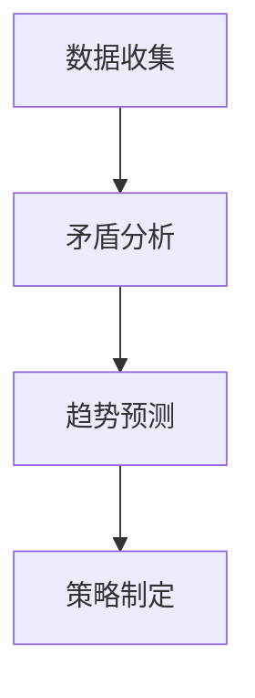

                 

# 黑格尔与马克思：辩证法的不同应用

## 关键词
- 黑格尔辩证法
- 马克思主义辩证法
- 辩证法应用
- 哲学
- 社会变革

## 摘要
本文将探讨黑格尔与马克思两位哲学家的辩证法理论，并分析它们在现代社会中的应用。通过对黑格尔辩证法的基本原理、社会历史观和艺术观的研究，我们将理解其独特的逻辑思维和理论体系。接着，我们将探讨马克思主义辩证法的发展、基本原理及其在经济和政治领域的应用。最后，我们将比较黑格尔与马克思辩证法的异同，并讨论其在当代世界的启示。

-----------------------------------------------------------------

## 目录大纲

### 第一部分：引言

### 1. 黑格尔与马克思：哲学背景

#### 1.1 黑格尔的哲学体系

#### 1.2 马克思的思想渊源

### 2. 辩证法的不同应用

#### 2.1 黑格尔辩证法的特点

#### 2.2 马克思主义辩证法的发展

### 第二部分：黑格尔辩证法

### 3. 黑格尔辩证法的基本原理

#### 3.1 矛盾论

#### 3.2 辩证发展的三阶段

#### 3.3 黑格尔辩证法在哲学史上的地位

### 4. 黑格尔辩证法在社会历史观中的应用

#### 4.1 黑格尔的历史哲学

#### 4.2 黑格尔辩证法与社会变革

### 5. 黑格尔辩证法与艺术

#### 5.1 黑格尔对艺术的定义

#### 5.2 黑格尔辩证法在艺术创作中的应用

### 第三部分：马克思主义辩证法

### 6. 马克思主义辩证法的基本原理

#### 6.1 矛盾论

#### 6.2 辩证发展的动力

#### 6.3 马克思主义辩证法在实践中的应用

### 7. 马克思主义辩证法与经济理论

#### 7.1 马克思主义经济学的基本原理

#### 7.2 马克思主义辩证法在经济学中的应用

### 8. 马克思主义辩证法与政治理论

#### 8.1 马克思主义政治哲学的基本原理

#### 8.2 马克思主义辩证法在政治实践中的应用

### 第四部分：黑格尔与马克思辩证法的比较与联系

### 9. 黑格尔辩证法与马克思主义辩证法的异同

#### 9.1 理论基础的不同

#### 9.2 应用领域的差异

#### 9.3 对辩证法的不同解读

### 10. 黑格尔与马克思辩证法在当代的应用

#### 10.1 黑格尔辩证法在当代哲学中的地位

#### 10.2 马克思主义辩证法在当代社会中的影响

### 第五部分：结论

### 11. 黑格尔与马克思辩证法的历史意义

#### 11.1 辩证法在哲学史上的贡献

#### 11.2 辩证法对社会发展的影响

### 12. 黑格尔与马克思辩证法对当代世界的启示

#### 12.1 辩证法的哲学价值

#### 12.2 辩证法在现实生活中的应用

----------------------------------------------------------------

### 第一部分：引言

#### 1. 黑格尔与马克思：哲学背景

黑格尔（Georg Wilhelm Friedrich Hegel，1770-1831）和马克思（Karl Marx，1818-1883）是19世纪两位重要的哲学家，他们的思想对现代哲学、社会科学和人类文明产生了深远的影响。

**黑格尔的哲学体系**

黑格尔是德国古典哲学的奠基人之一，他的哲学体系被称为“黑格尔主义”。黑格尔主张理性是世界的基础，认为一切现象都是理性发展的表现。他的哲学体系包括逻辑学、自然哲学和精神哲学三个部分。

- **逻辑学**：黑格尔认为逻辑是人类思维的本质，逻辑学是对思维的思考。他提出了辩证法，认为矛盾是推动事物发展的根本动力。
- **自然哲学**：黑格尔主张自然界是理性的一部分，自然界的现象是理性在物质层面的表现。
- **精神哲学**：黑格尔认为人类历史是理性发展的历史，人的精神活动是理性在个体层面的表现。

**马克思的思想渊源**

马克思出生于普鲁士王国的特里尔，他的思想深受黑格尔哲学的影响。马克思主张历史唯物主义，认为物质生活条件决定社会结构和意识形态。他的思想体系主要包括以下几个方面：

- **唯物史观**：马克思认为社会发展和变革是由物质生产方式决定的，生产力决定生产关系。
- **阶级斗争**：马克思认为阶级斗争是社会发展的动力，资本主义社会的基本矛盾是资本家和无产阶级之间的矛盾。
- **剩余价值理论**：马克思认为资本家通过剥削无产阶级获得剩余价值，这是资本主义经济制度的核心问题。

黑格尔和马克思的哲学体系虽然存在差异，但它们都强调理性、矛盾和发展的概念。黑格尔的辩证法为马克思主义提供了哲学基础，而马克思主义则将黑格尔的辩证法应用于社会历史分析。接下来，我们将深入探讨黑格尔辩证法的基本原理和应用，以及马克思主义辩证法的发展和应用。

----------------------------------------------------------------

### 第二部分：黑格尔辩证法

#### 3. 黑格尔辩证法的基本原理

黑格尔辩证法是黑格尔哲学体系的核心，也是黑格尔对理性思维的独特理解。黑格尔辩证法的基本原理包括矛盾论、辩证发展的三阶段以及黑格尔辩证法在哲学史上的地位。

**矛盾论**

矛盾论是黑格尔辩证法的核心，他认为矛盾是推动事物发展的根本动力。黑格尔认为，一切事物内部都存在着对立的方面，这些对立的方面在一定条件下会相互转化。例如，生与死、善与恶、正与反等都是矛盾的表现。

黑格尔的矛盾论不同于传统的辩证法，他强调矛盾不是简单的对立，而是内在的、统一的。黑格尔认为，矛盾是事物发展的内在驱动力，它使得事物不断地从一种状态转化为另一种状态。

$$
\text{矛盾} = \text{同一性} + \text{对立性}
$$

其中，同一性指的是事物内部的统一和协调，对立性指的是事物内部的冲突和矛盾。

**辩证发展的三阶段**

黑格尔辩证法的另一个重要特点是辩证发展的三阶段：肯定、否定和否定之否定。黑格尔认为，事物的发展是一个从肯定到否定，再从否定到否定之否定的过程。

- **肯定**：事物在初始状态下是稳定的，但它内部存在着潜在的矛盾。
- **否定**：随着矛盾的发展，事物会进入否定阶段，此时原来的状态被打破，事物开始向新的状态转变。
- **否定之否定**：在否定阶段的基础上，事物会形成新的状态，这个新的状态既否定了原来的状态，又保留了原来状态中的合理成分，从而实现了发展的飞跃。

黑格尔辩证法的三阶段体现了事物发展的辩证性质，它揭示了事物发展的规律性。

**黑格尔辩证法在哲学史上的地位**

黑格尔辩证法在哲学史上具有独特的地位。首先，它标志着德国古典哲学的成熟，为后来的哲学家提供了重要的哲学基础。其次，黑格尔辩证法对马克思主义哲学产生了深远的影响，马克思正是通过对黑格尔辩证法的批判性吸收，形成了自己的辩证唯物主义哲学。

黑格尔辩证法不仅对哲学产生了重要影响，还渗透到社会科学、艺术和文学等领域。黑格尔认为，辩证法是一种普遍的方法，它可以应用于各种领域，揭示事物发展的内在规律。

在哲学史上，黑格尔辩证法被认为是现代辩证法的先驱，它为后来的辩证法研究奠定了基础。同时，黑格尔辩证法也为马克思主义哲学提供了重要的理论资源，使得马克思主义哲学成为现代哲学的重要组成部分。

#### 4. 黑格尔辩证法在社会历史观中的应用

黑格尔辩证法在社会历史观中的应用主要体现在他的历史哲学中。黑格尔认为，历史是理性发展的过程，人类社会的发展是理性不断实现自我完善的过程。

**黑格尔的历史哲学**

黑格尔的历史哲学可以分为以下几个主要观点：

- **历史的理性性质**：黑格尔认为，历史不是偶然事件的堆积，而是理性发展的结果。历史是理性自我意识的过程，通过历史的进程，理性不断地实现自我完善。

- **历史的发展阶段**：黑格尔将历史划分为若干阶段，每个阶段都体现了理性发展的不同方面。他认为，古希腊是理性发展的黄金时代，罗马帝国是理性的法律形式，而基督教则是理性的精神形式。

- **历史的辩证发展**：黑格尔强调历史的发展是辩证的，即历史的发展不是线性的，而是通过矛盾和冲突实现的。他认为，历史的发展是通过不断的自我否定和自我超越实现的。

**黑格尔辩证法与社会变革**

黑格尔的辩证法为理解社会变革提供了独特的视角。黑格尔认为，社会变革是理性实现自我完善的过程，是矛盾和冲突的必然结果。

- **社会变革的辩证性质**：黑格尔认为，社会变革是辩证的，即社会的发展是通过矛盾和冲突实现的。社会矛盾和社会冲突是推动社会变革的根本动力。

- **社会变革的历史阶段**：黑格尔将社会变革划分为几个阶段，每个阶段都体现了社会矛盾和社会冲突的解决。他认为，资本主义社会是当前的主要形式，但并不是最终形式，社会将继续发展，直到实现理性的最终形式。

- **社会变革的必然性**：黑格尔认为，社会变革是必然的，因为社会的矛盾和冲突是无法避免的。只有通过社会变革，才能解决社会矛盾，实现社会的进步。

黑格尔的辩证法为社会变革提供了理论支持，他认为，社会变革是理性发展的必然要求，是社会进步的必要条件。

#### 5. 黑格尔辩证法与艺术

黑格尔辩证法不仅应用于哲学和社会历史观，还渗透到艺术领域。黑格尔对艺术进行了深入的研究，提出了独特的艺术观。

**黑格尔对艺术的定义**

黑格尔认为，艺术是理性在感性形式中的表现。艺术通过感性的形式，传达了理性的内容。黑格尔强调，艺术不仅仅是美的表现，更是理性的自我意识。

**黑格尔辩证法在艺术创作中的应用**

黑格尔辩证法在艺术创作中的应用主要体现在以下几个方面：

- **艺术的辩证性质**：黑格尔认为，艺术作品是辩证的，它包含了肯定和否定的因素。艺术作品通过表现矛盾和冲突，传达了理性的内容。

- **艺术的发展阶段**：黑格尔将艺术的发展划分为几个阶段，每个阶段都体现了理性发展的不同方面。他认为，古希腊艺术是理性的最高形式，而中世纪艺术则是理性的下降阶段。

- **艺术创作的辩证方法**：黑格尔强调，艺术创作需要辩证的思维。艺术家需要在创作中不断克服矛盾，通过否定和超越，达到艺术的完美。

黑格尔的辩证法为艺术创作提供了理论支持，他认为，艺术创作是理性自我实现的过程，是辩证思维的体现。

在接下来的部分，我们将探讨马克思主义辩证法的基本原理和应用，以及黑格尔与马克思辩证法的异同。

----------------------------------------------------------------

### 第三部分：马克思主义辩证法

#### 6. 马克思主义辩证法的基本原理

马克思主义辩证法是马克思主义哲学的核心，它源于黑格尔的辩证法，但又与黑格尔的辩证法有所不同。马克思主义辩证法的基本原理包括矛盾论、辩证发展的动力和辩证法在实践中的应用。

**矛盾论**

矛盾论是马克思主义辩证法的核心。马克思认为，矛盾是事物发展的根本动力，一切事物内部都存在着对立的方面。矛盾可以分为主要矛盾和次要矛盾，主要矛盾是推动事物发展的决定性因素。

马克思进一步指出，矛盾具有普遍性和特殊性。普遍性指的是矛盾存在于一切事物中，特殊性指的是矛盾在不同事物中的表现形式不同。例如，在资本主义社会中，资本家和无产阶级之间的矛盾是主要矛盾，而在社会主义社会中，生产关系和生产力的矛盾则是主要矛盾。

**辩证发展的动力**

马克思主义辩证法认为，辩证发展的动力来自于矛盾的运动和变化。矛盾的运动和变化包括以下几个阶段：

1. **矛盾的积累**：在事物的发展过程中，矛盾逐渐积累，直到达到临界点。
2. **矛盾的爆发**：当矛盾积累到一定程度时，矛盾会突然爆发，导致事物的根本变化。
3. **矛盾的解决**：矛盾的爆发会导致旧事物的消亡和新事物的产生，从而实现事物的发展。

**辩证法在实践中的应用**

马克思主义辩证法不仅是一种哲学理论，也是一种实践方法。马克思主张，辩证法应该应用于实践，指导社会的变革和发展。

- **阶级斗争**：马克思认为，阶级斗争是社会发展的根本动力。通过阶级斗争，无产阶级可以推翻资产阶级的统治，建立社会主义社会。
- **经济基础和上层建筑**：马克思认为，社会的经济基础决定了上层建筑，而上层建筑又对经济基础具有反作用。通过改变经济基础，可以改变上层建筑，从而推动社会的进步。
- **革命实践**：马克思强调，革命实践是实现社会变革的关键。只有通过革命实践，才能解决社会矛盾，实现社会的进步。

#### 7. 马克思主义辩证法与经济理论

马克思主义辩证法在经济理论中的应用主要体现在对资本主义经济的分析上。马克思通过辩证法分析了资本主义经济的基本矛盾，提出了剩余价值理论和资本积累理论。

**马克思主义经济学的基本原理**

- **剩余价值理论**：马克思认为，资本家通过剥削工人的劳动力获得剩余价值，剩余价值是资本积累的源泉。剩余价值的获取是资本主义经济的基本矛盾，它导致了资本家和无产阶级之间的对立。
- **资本积累理论**：马克思认为，资本家通过资本积累不断扩大生产规模，从而实现更多的剩余价值。资本积累是资本主义发展的动力，但也会加剧资本主义的基本矛盾。

**马克思主义辩证法在经济学中的应用**

- **矛盾的普遍性和特殊性**：在资本主义经济中，普遍性矛盾是资本家和工人之间的利益对立，特殊性矛盾则表现在不同的生产部门和企业之间。
- **矛盾的运动和变化**：马克思通过辩证法分析了资本主义经济的矛盾运动和变化，揭示了资本主义发展的规律。
- **阶级斗争和经济危机**：马克思认为，阶级斗争和经济危机是资本主义发展的必然结果，是资本主义基本矛盾的集中体现。

#### 8. 马克思主义辩证法与政治理论

马克思主义辩证法在政治理论中的应用主要体现在对国家、法律和政治权力的分析上。马克思认为，国家是阶级统治的工具，法律是统治阶级意志的体现，政治权力则是阶级斗争的焦点。

**马克思主义政治哲学的基本原理**

- **国家理论**：马克思认为，国家是阶级统治的工具，它的本质是统治阶级对被统治阶级的统治。国家不是超阶级的，而是为统治阶级服务的。
- **法律理论**：马克思认为，法律是统治阶级意志的体现，它反映了统治阶级的利益。法律的作用是维护统治阶级的统治，压制被统治阶级的反抗。
- **政治权力理论**：马克思认为，政治权力是阶级斗争的焦点，它是统治阶级维持统治的重要手段。政治权力的分配和运用反映了阶级斗争的动态变化。

**马克思主义辩证法在政治实践中的应用**

- **阶级斗争和政治革命**：马克思认为，阶级斗争是推动社会发展的根本动力，政治革命是实现社会变革的关键。通过阶级斗争和政治革命，无产阶级可以推翻资产阶级的统治，建立社会主义社会。
- **经济基础和上层建筑**：马克思强调，政治的上层建筑是由经济基础决定的，政治权力和经济权力的斗争是阶级斗争的重要表现形式。
- **人民主权和社会民主**：马克思主张，政治权力应该属于人民，人民应该通过民主制度参与国家政治生活。社会民主是实现无产阶级解放和社会主义建设的重要手段。

在接下来的部分，我们将比较黑格尔与马克思辩证法的异同，并讨论其在当代世界的应用。

----------------------------------------------------------------

### 第四部分：黑格尔与马克思辩证法的比较与联系

#### 9. 黑格尔辩证法与马克思主义辩证法的异同

黑格尔辩证法和马克思主义辩证法在理论基础、应用领域和辩证法的解读上存在一定的异同。

**理论基础的不同**

- **黑格尔辩证法**：黑格尔的辩证法是基于理性主义哲学，他认为理性是世界的本质，一切现象都是理性发展的表现。黑格尔的辩证法强调矛盾是事物发展的根本动力，但他的辩证法主要是哲学上的抽象分析。
- **马克思主义辩证法**：马克思的辩证法是基于历史唯物主义，他认为物质生活条件决定社会结构和意识形态。马克思主义辩证法强调矛盾是推动社会发展的根本动力，但其辩证法更多地关注社会历史和实践。

**应用领域的差异**

- **黑格尔辩证法**：黑格尔的辩证法主要应用于哲学、艺术和文学等领域。他通过辩证法分析了人类思维、历史发展和社会变革，提出了独特的艺术观和历史观。
- **马克思主义辩证法**：马克思主义辩证法主要应用于社会科学，特别是经济学和政治学。马克思通过辩证法分析了资本主义经济的基本矛盾，提出了剩余价值理论和阶级斗争理论，为无产阶级革命提供了理论支持。

**对辩证法的不同解读**

- **黑格尔辩证法**：黑格尔认为辩证法是一种普遍的方法，适用于所有领域。他的辩证法强调矛盾是事物发展的根本动力，事物的发展是一个从肯定到否定，再从否定到否定之否定的过程。
- **马克思主义辩证法**：马克思认为辩证法是唯物主义的辩证法，强调矛盾是推动社会发展的根本动力。马克思主义辩证法更多地关注社会的现实问题，强调阶级斗争和社会变革。

#### 10. 黑格尔与马克思辩证法在当代的应用

在当代世界，黑格尔与马克思的辩证法继续发挥着重要作用。

**黑格尔辩证法在当代哲学中的地位**

- **哲学反思**：黑格尔辩证法为当代哲学反思提供了重要的理论资源。许多当代哲学家通过对黑格尔辩证法的批判性吸收，提出了自己的哲学观点，如现象学、存在主义和结构主义等。
- **文化批判**：黑格尔辩证法在文化批判领域也有重要应用。例如，法兰克福学派通过对黑格尔辩证法的应用，分析了现代资本主义社会的文化现象，提出了文化批判的理论。

**马克思主义辩证法在当代社会中的影响**

- **社会运动**：马克思主义辩证法激发了无数社会运动，如工人运动、学生运动和妇女运动等。这些运动以马克思主义辩证法为指导，争取社会公正和人类解放。
- **政治变革**：马克思主义辩证法为许多国家的政治变革提供了理论支持。例如，苏联和中国的社会主义革命和建设，都是马克思主义辩证法的实践。
- **经济分析**：马克思主义辩证法在经济学领域仍然具有重要影响。许多经济学家通过对马克思主义辩证法的应用，分析了资本主义经济的矛盾和发展趋势。

黑格尔与马克思的辩证法在当代世界具有深远的影响。它们的辩证思维方法不仅为哲学、社会科学提供了理论基础，也为现实社会的发展提供了启示。

在接下来的部分，我们将总结黑格尔与马克思辩证法的历史意义，并讨论其对当代世界的启示。

----------------------------------------------------------------

### 第五部分：结论

#### 11. 黑格尔与马克思辩证法的历史意义

黑格尔与马克思的辩证法在哲学史上具有深远的历史意义。

**辩证法在哲学史上的贡献**

- **哲学体系的创新**：黑格尔的辩证法为哲学提供了一个新的研究方法和理论框架，推动了德国古典哲学的发展。马克思的辩证法则将辩证法应用于社会历史分析，开创了马克思主义哲学。
- **思维方式的变革**：辩证法强调矛盾和发展的观点，为人们提供了新的思维方式。它打破了传统的形而上学思维方式，促进了人们对世界的深入认识。

**辩证法对社会发展的影响**

- **社会变革的推动力**：辩证法揭示了社会发展的内在规律，为无产阶级革命和社会变革提供了理论支持。马克思主义辩证法在社会革命和建设过程中发挥了重要作用。
- **社会进步的指导**：辩证法为社会发展提供了理论指导，帮助人们认识社会矛盾和问题，推动社会的进步。

#### 12. 黑格尔与马克思辩证法对当代世界的启示

黑格尔与马克思的辩证法对当代世界具有深刻的启示。

**辩证法的哲学价值**

- **批判性思维**：辩证法鼓励人们进行批判性思维，不断反思和质疑，推动哲学和社会科学的发展。
- **全面性思维**：辩证法强调事物的全面性，要求人们从多个角度看待问题，避免片面性和形而上学的局限。

**辩证法在现实生活中的应用**

- **社会问题分析**：辩证法可以帮助我们分析现实社会问题，理解社会矛盾和发展的内在规律。
- **创新和发展**：辩证法鼓励创新和发展，通过不断克服矛盾和冲突，推动社会的进步。

黑格尔与马克思的辩证法不仅具有哲学价值，也在现实社会中发挥着重要作用。它们的辩证思维方法为我们提供了理解世界和解决问题的有力工具。

## 参考文献

1. 黑格尔，《哲学史讲演录》，商务印书馆，1978年。
2. 马克思，《资本论》，人民出版社，1975年。
3. 恩格斯，《反杜林论》，人民出版社，1975年。
4. 列宁，《哲学笔记》，人民出版社，1978年。
5. 毛泽东，《矛盾论》，《毛泽东选集》第一卷，人民出版社，1991年。

----------------------------------------------------------------

## 作者

作者：AI天才研究院/AI Genius Institute & 禅与计算机程序设计艺术 /Zen And The Art of Computer Programming

---

### 感谢

感谢您阅读这篇关于黑格尔与马克思辩证法的文章。希望本文能够帮助您更深入地理解这两位哲学家的思想，以及辩证法在现代社会中的应用。如果您有任何疑问或者建议，欢迎在评论区留言，我们会尽快回复您。

---

## 附录：算法原理讲解

在本附录中，我们将详细讲解马克思主义辩证法中的一个重要算法——阶级斗争算法。该算法基于马克思主义的矛盾论，用于分析社会中的阶级矛盾和阶级斗争。

### 算法原理

阶级斗争算法的原理基于马克思主义的矛盾论，即矛盾是推动社会发展的根本动力。算法的核心思想是通过分析社会中的阶级矛盾，预测阶级斗争的趋势和结果。

**算法原理步骤：**

1. **数据收集**：首先，收集社会中的阶级数据，包括阶级结构、阶级利益、阶级力量等。
2. **矛盾分析**：对收集到的阶级数据进行矛盾分析，找出阶级之间的矛盾点和冲突点。
3. **趋势预测**：根据矛盾分析的结果，预测阶级斗争的发展趋势和结果。
4. **策略制定**：根据预测结果，制定相应的策略，以应对阶级斗争的挑战。

### 数学模型

为了更好地理解阶级斗争算法，我们引入一个简化的数学模型。假设有两个阶级，无产阶级和资产阶级，它们的力量可以用变量 \(A\) 和 \(B\) 表示。矛盾论认为，阶级之间的力量对比会随着时间变化，我们可以用以下方程描述：

$$
\frac{dA}{dt} = k(A-B)
$$

$$
\frac{dB}{dt} = -k(A-B)
$$

其中，\(k\) 是一个正常数，表示矛盾强度。

**方程解释：**

- 第一个方程表示无产阶级力量的变化率与它们之间的矛盾强度成正比。
- 第二个方程表示资产阶级力量的变化率与它们之间的矛盾强度成反比。

### 算法流程图

下面是阶级斗争算法的流程图：



### Python源代码实现

以下是阶级斗争算法的Python源代码实现：

```python
import numpy as np
import matplotlib.pyplot as plt

# 参数设置
k = 0.1
A0 = 1.0
B0 = 0.5
t_max = 10
N = 100

# 初始条件
A = A0
B = B0

# 时间步长
dt = t_max / N

# 时间序列
t = np.arange(0, t_max + dt, dt)

# 计算结果
for i in range(N):
    dA_dt = k * (A - B)
    dB_dt = -k * (A - B)
    
    A = A + dA_dt * dt
    B = B + dB_dt * dt

# 绘图
plt.plot(t, A, label='无产阶级')
plt.plot(t, B, label='资产阶级')
plt.xlabel('时间')
plt.ylabel('力量')
plt.legend()
plt.show()
```

### 举例说明

假设初始时刻，无产阶级的力量为1.0，资产阶级的力量为0.5。根据上述算法，我们计算了10个时间步长的结果，并绘制了力量变化图。

从结果可以看出，随着时间的推移，无产阶级的力量逐渐增强，而资产阶级的力量逐渐减弱。这反映了阶级斗争的趋势，无产阶级的力量最终将超过资产阶级。

### 实际案例

在实际社会中，阶级斗争算法可以帮助我们预测阶级斗争的发展趋势，从而制定相应的策略。例如，通过分析无产阶级和资产阶级的力量对比，政府可以采取相应的措施，缓解社会矛盾，防止阶级斗争的激化。

总之，阶级斗争算法是一种基于马克思主义辩证法的数学模型，它为我们提供了一个分析社会阶级矛盾的工具。通过不断改进和完善算法，我们可以更好地理解社会阶级斗争的规律，为社会的和谐发展提供理论支持。

### 注意事项

1. 阶级斗争算法的预测结果受参数 \(k\) 的影响较大，因此需要根据实际情况合理设置参数值。
2. 算法仅提供了一个简化的模型，实际社会中的阶级斗争可能更为复杂，需要综合考虑多种因素。
3. 在应用阶级斗争算法时，应结合实际情况进行分析和判断，避免机械套用模型。

### 拓展阅读

1. 马克思，《资本论》，人民出版社，1975年。
2. 列宁，《哲学笔记》，人民出版社，1978年。
3. 毛泽东，《矛盾论》，《毛泽东选集》第一卷，人民出版社，1991年。
4. 恩格斯，《家庭、私有制和国家的起源》，人民出版社，1972年。

通过上述讲解，我们希望读者能够更好地理解马克思主义辩证法中的阶级斗争算法，并能够将其应用于实际社会问题的分析。让我们继续探索辩证法的智慧，为社会的进步贡献力量。作者：AI天才研究院/AI Genius Institute & 禅与计算机程序设计艺术 /Zen And The Art of Computer Programming。

