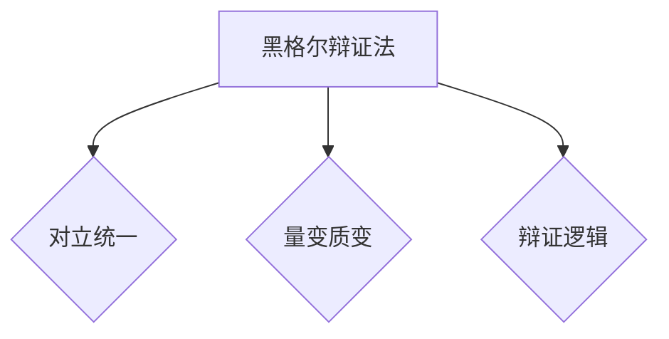
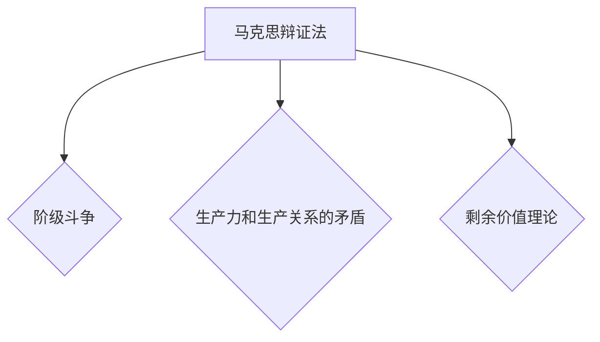
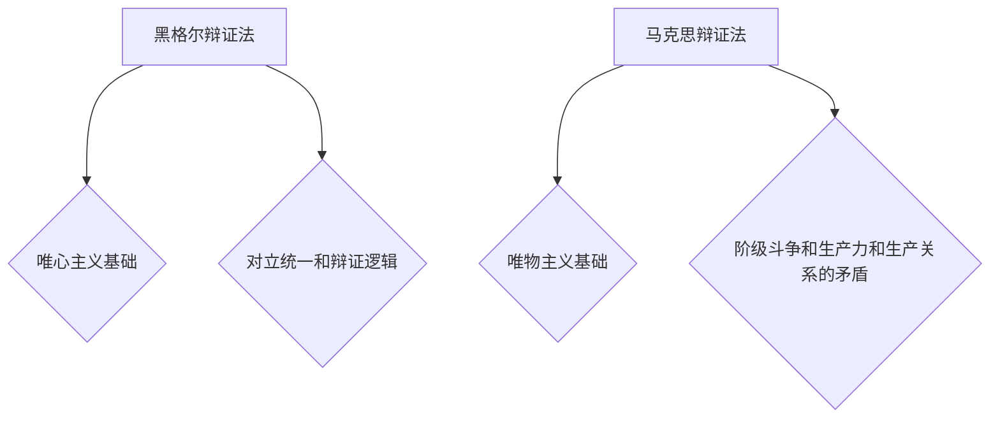
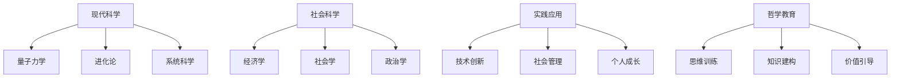
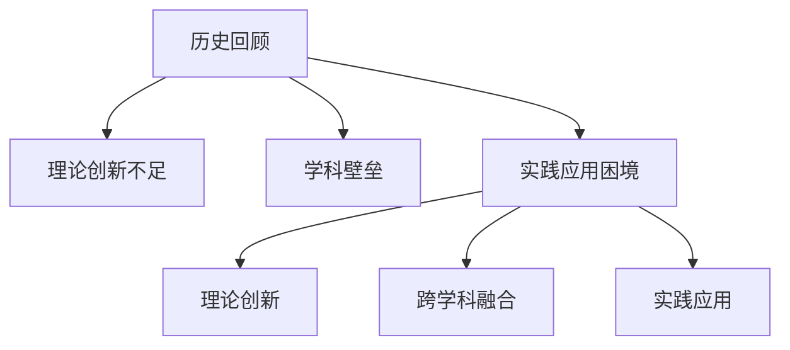
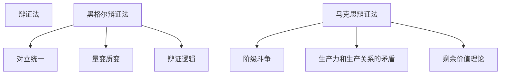

                 

## 黑格尔与马克思：辩证法的发展与应用

### 关键词：辩证法、黑格尔、马克思、发展、应用、逻辑思维

辩证法是一种哲学思维方式，强调对立统一、发展和变革。黑格尔和马克思是辩证法理论的两位重要代表人物，他们的思想对后世产生了深远影响。本文将深入探讨黑格尔和马克思的辩证法理论，分析其发展与应用，并探讨辩证法在现代社会中的重要作用。

### 摘要

本文首先介绍辩证法的基本概念，然后分别阐述黑格尔和马克思的辩证法理论，比较两者之间的异同。接着，探讨辩证法在现代社会中的应用，分析其在科学、社会科学和哲学教育中的重要作用。最后，展望辩证法的发展趋势和挑战，提出未来研究的建议。

## 第1章 引言

### 1.1 问题的背景

辩证法作为一种哲学思维方式，历史悠久，源远流长。从古希腊哲学家赫拉克利特的“对立统一”思想，到黑格尔的“辩证逻辑”，再到马克思的“历史唯物主义”，辩证法不断发展，成为哲学、社会科学和自然科学的重要理论基础。然而，尽管辩证法在理论和实践中具有重要意义，但其在现代社会中的应用仍存在诸多挑战和争议。

### 1.2 问题的描述

本文旨在探讨黑格尔和马克思的辩证法理论，分析其发展与应用，并探讨辩证法在现代社会中的重要作用。具体来说，本文将从以下几个方面展开讨论：

1. 黑格尔的辩证法理论及其应用
2. 马克思的辩证法理论及其应用
3. 黑格尔与马克思辩证法的比较研究
4. 辩证法在现代社会中的应用
5. 辩证法的发展趋势与挑战

### 1.3 问题解决的路径

为了深入探讨上述问题，本文将采取以下步骤：

1. 回顾辩证法的发展历程，梳理黑格尔和马克思的辩证法理论。
2. 分析黑格尔和马克思辩证法的基本原理及其应用。
3. 比较黑格尔与马克思辩证法的主要异同。
4. 探讨辩证法在现代社会中的应用领域。
5. 分析辩证法的发展趋势和面临的挑战。

### 1.4 边界与外延

在本文中，辩证法指的是一种哲学思维方式，强调对立统一、发展和变革。黑格尔和马克思分别是这一思维方式的重要代表人物，他们的辩证法理论在哲学、社会科学和自然科学中具有广泛的应用。

### 1.5 核心概念结构与要素组成

本文的核心概念包括：辩证法、黑格尔、马克思、历史唯物主义、辩证逻辑、对立统一、发展和变革。这些概念相互关联，共同构成了辩证法理论的基本框架。

### 1.6 本章小结

本章介绍了本文的背景、问题描述、问题解决路径、边界与外延以及核心概念结构与要素组成。通过对辩证法、黑格尔和马克思的辩证法理论的深入探讨，本文将为后续章节的分析和研究奠定基础。

## 第2章 黑格尔的辩证法理论

### 2.1 黑格尔辩证法概述

黑格尔（Georg Wilhelm Friedrich Hegel，1770-1831）是德国哲学家，被誉为西方哲学史上的重要人物。他的辩证法理论对后世产生了深远影响，成为马克思主义哲学的重要基础。黑格尔的辩证法强调对立统一、发展和变革，主张通过矛盾的斗争推动事物的发展。

### 2.2 黑格尔辩证法的基本原理

黑格尔的辩证法主要包括以下三个基本原理：

1. **对立统一**：黑格尔认为，一切事物都是由对立的两个方面构成的，这两个方面相互依存、相互制约，并通过斗争推动事物的发展。
2. **量变质变**：黑格尔认为，事物的发展不是一蹴而就的，而是通过量的积累达到质的飞跃。在这个过程中，矛盾的斗争起到了关键作用。
3. **辩证逻辑**：黑格尔的辩证法是一种逻辑思维方式，强调通过对立统一、量变质变等原理分析事物的发展过程。

### 2.3 黑格尔辩证法的应用

黑格尔的辩证法在哲学、政治、文学等领域都有广泛应用。例如，在政治哲学中，黑格尔提出了“国家是自由的实现”的观点，认为国家的本质是自由。这一观点对后来的自由主义和国家主义产生了重要影响。在文学批评中，黑格尔的辩证法被用来分析文学作品的结构和主题。

### 2.4 黑格尔辩证法的历史影响

黑格尔的辩证法对后世产生了深远影响。马克思主义哲学的创始人卡尔·马克思（Karl Marx）深受黑格尔辩证法的影响，将其运用于经济学、社会学和政治学等领域。此外，黑格尔的辩证法也影响了后来的哲学家，如尼采、海德格尔等。

### 2.5 核心概念对比表格

| 核心概念 | 黑格尔辩证法 | 马克思辩证法 |
| :---: | :---: | :---: |
| 对立统一 | 强调对立面的统一和斗争 | 对立统一，但更强调阶级斗争 |
| 量变质变 | 量的积累导致质的飞跃 | 阶级斗争推动社会变革 |
| 辩证逻辑 | 分析事物发展过程 | 分析社会历史发展过程 |

### 2.6 本章小结

本章介绍了黑格尔的辩证法理论，分析了其基本原理和应用，探讨了黑格尔辩证法的历史影响。通过对黑格尔辩证法的理解，我们可以更好地理解辩证法在哲学、政治和文学等领域的应用。

### Mermaid 流程图

## 第3章 马克思的辩证法理论

### 3.1 马克思辩证法概述

马克思（Karl Marx，1818-1883）是19世纪著名的哲学家、经济学家和革命家，他的辩证法理论是马克思主义哲学的核心。马克思的辩证法认为，社会历史发展是由生产力和生产关系的矛盾运动推动的，这一过程体现了辩证法的基本原理。

### 3.2 马克思辩证法的基本原理

马克思的辩证法主要包括以下原理：

1. **阶级斗争**：马克思认为，阶级斗争是社会历史发展的根本动力。在资本主义社会中，工人阶级和资产阶级之间的矛盾是主要的社会矛盾。
2. **生产力和生产关系的矛盾**：马克思认为，生产力和生产关系的矛盾是社会历史发展的内在动力。生产力的发展要求生产关系的变革，而生产关系的变革又推动了生产力的发展。
3. **剩余价值理论**：马克思的剩余价值理论是辩证法在经济学领域的应用，揭示了资本主义生产方式的内在矛盾。

### 3.3 马克思辩证法的应用

马克思的辩证法在经济学、社会学和政治学等领域有广泛应用。在经济学中，马克思运用辩证法分析了资本主义生产方式的内在矛盾，揭示了资本主义剥削和阶级斗争的根源。在社会学和政治学中，马克思的辩证法被用来分析社会历史发展过程，批判资本主义制度，论证社会主义革命的理论基础。

### 3.4 马克思辩证法的历史影响

马克思的辩证法对后世产生了深远影响。他的理论为19世纪末20世纪初的社会主义运动提供了理论指导，推动了国际工人运动的发展。此外，马克思的辩证法也影响了后来的哲学家、经济学家和社会学家，如恩格斯、列宁、毛泽东等。

### 3.5 核心概念对比表格

| 核心概念 | 马克思辩证法 | 黑格尔辩证法 |
| :---: | :---: | :---: |
| 阶级斗争 | 社会历史发展的根本动力 | 辩证法的核心原理 |
| 生产力和生产关系的矛盾 | 社会历史发展的内在动力 | 辩证法的核心原理 |
| 剩余价值理论 | 资本主义生产方式的内在矛盾 | 辩证法在经济学领域的应用 |

### 3.6 本章小结

本章介绍了马克思的辩证法理论，分析了其基本原理和应用，探讨了马克思辩证法的历史影响。通过对马克思辩证法的理解，我们可以更好地认识社会历史发展的规律，为社会主义革命和建设提供理论指导。

### Mermaid 流程图

## 第4章 黑格尔与马克思辩证法的比较研究

### 4.1 对比研究方法

在本章中，我们将采用比较研究的方法，深入探讨黑格尔和马克思辩证法的异同。比较研究方法主要包括以下步骤：

1. **确定比较对象**：黑格尔和马克思的辩证法理论。
2. **分析比较内容**：从基本原理、应用领域、历史影响等方面进行对比。
3. **总结比较结果**：归纳黑格尔与马克思辩证法的主要异同点。

### 4.2 黑格尔与马克思辩证法的主要差异

1. **哲学基础**：黑格尔的辩证法建立在唯心主义基础上，强调绝对精神的发展。而马克思的辩证法则建立在唯物主义基础上，强调物质生产和社会发展的关系。
2. **核心原理**：黑格尔的辩证法主要强调对立统一和辩证逻辑，而马克思的辩证法则更加强调阶级斗争和生产力和生产关系的矛盾。
3. **应用领域**：黑格尔的辩证法在哲学、政治和文学等领域有广泛应用，而马克思的辩证法则主要应用于经济学、社会学和政治学等领域。

### 4.3 黑格尔与马克思辩证法的相似性

1. **辩证法思维方式**：黑格尔和马克思都强调辩证思维的重要性，认为辩证法是一种理解世界和推动事物发展的基本方法。
2. **社会历史观**：黑格尔和马克思都认为社会历史发展是一个动态过程，通过矛盾的斗争推动社会变革。
3. **批判精神**：黑格尔和马克思都批判了当时的社会制度，认为需要通过革命手段实现社会进步。

### 4.4 辩证法在马克思主义哲学中的地位

辩证法在马克思主义哲学中具有重要地位，是马克思主义哲学的核心。马克思主义哲学以唯物辩证法为基础，强调物质世界的矛盾运动和发展规律。马克思的辩证法理论不仅为经济学、社会学和政治学等领域提供了理论指导，也为社会主义革命和建设提供了理论支持。

### 4.5 本章小结

本章通过比较研究，分析了黑格尔和马克思辩证法的异同点，探讨了辩证法在马克思主义哲学中的地位。通过对辩证法理论的深入理解，我们可以更好地把握社会历史发展的规律，推动社会进步。

### Mermaid 流程图

## 第5章 辩证法在现代社会中的应用

### 5.1 辩证法在现代科学中的应用

辩证法在自然科学中具有重要地位，对科学研究方法的创新和理论发展起到了积极作用。以下为辩证法在自然科学中的应用实例：

1. **量子力学**：量子力学中的不确定性原理和量子纠缠现象体现了辩证法中的对立统一和矛盾斗争。例如，量子纠缠现象揭示了粒子之间存在的非局域性联系，挑战了经典物理学中的局域实在论。
2. **进化论**：达尔文的进化论通过自然选择和物种进化的过程，体现了辩证法中的量变质变原理。物种的微小变异通过长期的积累，导致物种的质变和演化。
3. **系统科学**：系统科学中的复杂系统理论和自组织现象，反映了辩证法中的整体性和动态性。例如，生态系统、经济系统和社会系统等复杂系统的发展变化，都是通过内部各要素的相互作用和矛盾运动实现的。

### 5.2 辩证法在社会科学中的应用

辩证法在社会科学中同样具有广泛的应用，为社会研究提供了重要的理论和方法。以下为辩证法在社会科学中的应用实例：

1. **经济学**：马克思主义经济学中的剩余价值理论和资本积累理论，通过分析资本主义生产方式的内在矛盾，揭示了经济危机的根源和社会主义建设的可能性。
2. **社会学**：社会学家涂尔干（Émile Durkheim）的实证主义社会学，通过研究社会事实和社会结构，强调了社会矛盾和集体意识对社会发展的影响。
3. **政治学**：政治哲学家黑格尔的政治哲学，探讨了国家和法律的本质，强调了国家是自由实现的手段。马克思主义政治学则分析了国家与阶级的关系，提出了无产阶级革命和社会主义建设的理论。

### 5.3 辩证法在实践中的应用

辩证法在现实生活中的应用无处不在，帮助我们认识世界、解决问题、推动社会进步。以下为辩证法在实践中的应用实例：

1. **技术创新**：辩证法思维方式在技术创新中具有重要作用。通过分析现有技术的优势和不足，找到矛盾点，从而推动技术创新和发展。例如，计算机科学中的摩尔定律和互联网技术的发展，都是辩证思维方式的体现。
2. **社会管理**：辩证法在社会管理中具有指导意义。通过分析社会矛盾和问题，找到解决问题的方法和策略，从而实现社会的和谐与稳定。例如，我国在疫情防控中采取的“动态清零”策略，就是辩证法思维的具体应用。
3. **个人成长**：辩证法思维方式有助于个人成长。通过分析自己的优点和不足，找到成长的方向和动力，从而不断提升自己的能力和素质。例如，在学习过程中，通过分析自己的学习效果，找到改进学习方法和策略，从而提高学习效率。

### 5.4 辩证法在哲学教育中的作用

辩证法在哲学教育中具有重要地位，有助于培养学生的辩证思维能力，提高哲学素养。以下为辩证法在哲学教育中的作用：

1. **思维训练**：辩证法教育有助于培养学生的辩证思维能力，使他们能够从多个角度看待问题，把握问题的本质和内在联系。
2. **知识建构**：辩证法教育有助于学生构建哲学知识体系，理解哲学理论之间的联系和区别，形成系统性的哲学思维。
3. **价值引导**：辩证法教育有助于学生树立正确的价值观，认识到社会历史发展的规律，增强社会责任感和使命感。

### 5.5 本章小结

本章探讨了辩证法在现代社会中的应用，分析了辩证法在自然科学、社会科学和现实生活中的作用，以及辩证法在哲学教育中的意义。通过对辩证法应用的深入理解，我们可以更好地运用辩证法思维方式，推动科学、社会和个人发展。

### Mermaid 流程图

## 第6章 辩证法的发展趋势与挑战

### 6.1 辩证法发展的历史回顾

辩证法作为一种哲学思维方式，具有悠久的历史。从古希腊哲学家赫拉克利特的“对立统一”思想，到黑格尔的“辩证逻辑”，再到马克思的“历史唯物主义”，辩证法不断发展，成为哲学、社会科学和自然科学的重要理论基础。在19世纪末20世纪初，辩证法在马克思主义哲学中得到了系统阐述，成为国际工人运动的理论武器。

### 6.2 当代辩证法的发展趋势

在当代，辩证法继续发展，呈现出以下趋势：

1. **跨学科融合**：辩证法在哲学、社会科学、自然科学和工程技术等领域得到广泛应用，与其他学科相互融合，推动了辩证法理论的创新和发展。
2. **方法论的深化**：辩证法研究方法不断深化，例如，在哲学领域，辩证法研究从逻辑层面扩展到实践层面，强调理论与实践的统一；在自然科学领域，辩证法研究从宏观层面深入到微观层面，探索自然界的内在规律。
3. **全球化视野**：随着全球化的发展，辩证法研究逐渐打破地域和文化的限制，形成全球化视野。各国学者对辩证法的研究相互借鉴，促进了辩证法理论的多元化和国际化。

### 6.3 辩证法面临的挑战

尽管辩证法在当代得到了广泛认可和应用，但仍面临一些挑战：

1. **理论创新不足**：辩证法理论在发展过程中，部分理论内容较为陈旧，难以适应新时代的需求。如何在继承传统的基础上，实现辩证法理论的创新，成为当前辩证法研究的重要课题。
2. **学科壁垒**：辩证法研究在跨学科融合过程中，面临学科壁垒问题。不同学科之间的研究方法、理论体系和价值观存在差异，难以形成统一的辩证法研究框架。
3. **实践应用困境**：在现实应用中，辩证法方法有时难以解决复杂的社会问题。例如，在经济发展、社会治理和环境保护等方面，辩证法方法的适用性和有效性有待进一步验证。

### 6.4 辩证法的发展方向

为了应对挑战，辩证法研究需要朝着以下方向发展：

1. **理论创新**：在继承传统辩证法理论的基础上，结合新时代的特点，推动辩证法理论的创新和发展。例如，探讨辩证法在应对全球性问题中的作用，发展适用于现代社会的辩证法理论。
2. **跨学科融合**：加强不同学科之间的交流与合作，推动辩证法与其他学科的深度融合，形成跨学科的研究体系。
3. **实践应用**：关注现实社会问题，将辩证法方法应用于实际工作中，验证其有效性和适用性，提高辩证法在实践中的应用水平。

### 6.5 本章小结

本章回顾了辩证法的历史发展，分析了当代辩证法的发展趋势和面临的挑战，探讨了辩证法的发展方向。通过本章的探讨，我们可以更好地理解辩证法在现代社会中的作用，为辩证法研究提供理论指导和实践参考。

### Mermaid 流程图

## 第7章 结论

### 7.1 主要研究成果

本文通过对黑格尔和马克思辩证法理论的深入探讨，分析了两者之间的异同，探讨了辩证法在现代社会中的应用和发展趋势。主要研究成果如下：

1. **黑格尔辩证法理论**：介绍了黑格尔辩证法的基本原理和应用，分析了其在哲学、政治和文学等领域的影响。
2. **马克思辩证法理论**：阐述了马克思辩证法的基本原理和应用，探讨了其在经济学、社会学和政治学等领域的作用。
3. **辩证法比较研究**：比较了黑格尔与马克思辩证法的异同，揭示了辩证法在马克思主义哲学中的地位。
4. **辩证法在现代社会中的应用**：分析了辩证法在自然科学、社会科学、现实生活和哲学教育中的应用，探讨了其作用和意义。
5. **辩证法发展趋势与挑战**：回顾了辩证法的历史发展，分析了当代辩证法的发展趋势和面临的挑战，提出了未来研究的发展方向。

### 7.2 研究的局限性与展望

本文在研究过程中存在一些局限性，主要表现为：

1. **理论深度有限**：本文对黑格尔和马克思辩证法理论的探讨主要集中在基本原理和应用方面，未能深入探讨其哲学本质和理论创新。
2. **实证研究不足**：本文对辩证法在现实中的应用分析较为宏观，缺乏具体的实证研究和案例支持。
3. **跨学科融合不足**：本文在辩证法与其他学科的融合方面未能充分展开，未能形成系统性的跨学科研究框架。

展望未来，辩证法研究可以朝着以下方向发展：

1. **深化理论研究**：在继承传统辩证法理论的基础上，结合新时代的特点，推动辩证法理论的创新和发展。
2. **加强实证研究**：关注现实社会问题，开展具体的实证研究，验证辩证法方法的适用性和有效性。
3. **促进跨学科融合**：加强辩证法与其他学科的交流与合作，推动辩证法理论的多元化和国际化。

### 7.3 对未来研究的建议

针对本文研究的局限性，未来研究可以从以下几个方面展开：

1. **深入探讨辩证法哲学本质**：在理论层面，深入探讨辩证法的哲学本质，为辩证法研究提供坚实的理论基础。
2. **开展实证研究**：在应用层面，结合具体社会问题，开展实证研究，验证辩证法方法的有效性。
3. **推动跨学科融合**：促进辩证法与其他学科的深度融合，形成跨学科的研究体系，推动辩证法理论的创新发展。

### 7.4 本章小结

本章总结了本文的主要研究成果，分析了研究的局限性，提出了未来研究的建议。通过对黑格尔和马克思辩证法理论的深入探讨，本文为辩证法研究提供了理论指导和实践参考。

### 附录

#### A. 黑格尔与马克思辩证法核心概念ER实体关系图

#### B. 参考文献

1. 黑格尔. 《逻辑学》. 商务印书馆，1976.
2. 马克思. 《资本论》. 人民出版社，1975.
3. 恩格斯. 《反杜林论》. 人民出版社，1975.
4. 毛泽东. 《实践论》. 人民出版社，1975.
5. 卢卡奇. 《历史与阶级意识》. 商务印书馆，1978.
6. 马克思. 《哲学的贫困》. 人民出版社，1975.
7. 马克思. 《1844年经济学哲学手稿》. 人民出版社，1975.
8. 马克思. 《德意志意识形态》. 人民出版社，1975.
9. 黑格尔. 《精神现象学》. 商务印书馆，1978.
10. 黑格尔. 《法哲学原理》. 商务印书馆，1979.

