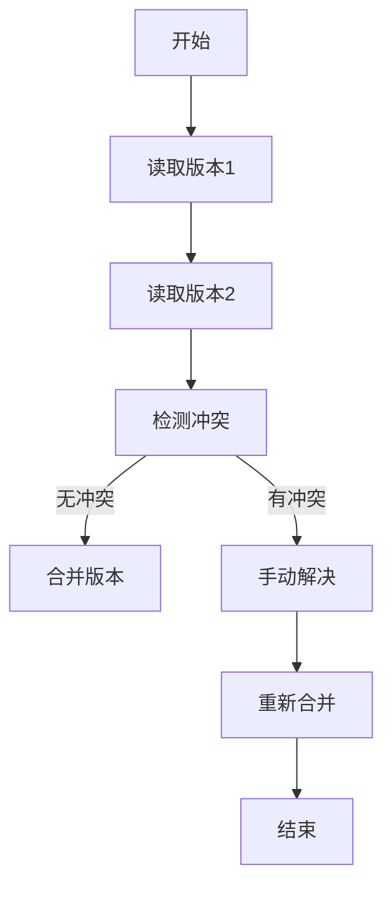

                 


### 引言

在技术日新月异发展的今天，软件工程师们面临着前所未有的挑战和机遇。版本控制作为软件工程中的核心环节，不仅影响着代码的协同管理和迭代，更是软件持续演进的基石。然而，版本控制的复杂性使得很多开发者感到困惑。这时，哲学思维方法，如黑格尔的辩证法，可以为我们提供一种全新的视角，帮助我们更好地理解和应对版本控制的挑战。

黑格尔的辩证法，是一种深层次的思维模式，强调通过对立统一的运动来理解事物的发展和变化。这种方法在软件版本控制中具有独特的应用价值，可以指导我们如何更加有效地管理代码的演变过程。

本文将围绕“黑格尔的辩证法与版本控制：软件演进的哲学动力”这一主题，详细探讨黑格尔辩证法的基本原理及其在版本控制中的具体应用。我们将分步骤进行深入分析，包括：

1. **背景介绍**：首先，我们会介绍版本控制的基本概念、重要性，以及它与软件演进的关系。接着，我们简要介绍黑格尔的辩证法及其与版本控制的关系。
   
2. **核心概念与联系**：我们将详细解释黑格尔辩证法的基本原理，并探讨这些原理如何在版本控制实践中应用。

3. **算法原理讲解**：接下来，我们会讨论版本控制中常用的算法，如合并冲突解决算法、版本树管理等，并使用mermaid和Python代码进行阐述。

4. **数学模型和数学公式**：我们会提供与版本控制相关的数学模型，使用LaTeX格式展示，并进行详细讲解。

5. **系统分析与架构设计方案**：我们将介绍版本控制系统的工作原理和架构设计。

6. **项目实战**：通过实际案例展示如何应用黑格尔辩证法于版本控制。

7. **最佳实践 tips、小结、注意事项、拓展阅读**：最后，我们将总结全书内容，提供实用建议，并推荐进一步阅读的资料。

通过这种分步骤的思考方式，我们希望读者能够更清晰地理解黑格尔辩证法在版本控制中的重要性，并能够将其有效地应用到实际的软件开发工作中。

### 版本控制的基本概念与演进

版本控制，作为软件工程中的重要组成部分，其核心任务是追踪和管理代码的变更历史。随着软件项目的复杂度和规模不断扩大，版本控制的重要性愈发凸显。从最初的单一文件管理，到现代的分布式版本控制系统，版本控制技术经历了漫长的发展历程。

#### 问题背景

版本控制起源于软件协同开发的早期，当时程序员需要共同合作完成一个项目。面对多个开发者的代码修改，如何确保代码的一致性和完整性成为了一大挑战。早期，版本控制主要依赖于手工管理，如使用标签（Tag）来标记特定的代码版本，或者通过邮件附件来分发代码变更。

随着计算机技术和软件开发方法的发展，版本控制逐渐成为一种系统化的过程。20世纪80年代，出现了一些早期的版本控制系统，如PVCS、CVS和RCS等。这些系统通过集中式的代码仓库来管理代码，使得开发者能够更好地协同工作。

#### 问题描述

在软件项目中，版本控制的主要问题包括：

1. **代码冲突**：当多个开发者同时修改同一部分代码时，可能会产生冲突。如何检测和解决这些冲突是版本控制的重要任务。
2. **代码追溯**：需要能够追踪代码的历史变更，以便在出现问题时能够回滚到某个特定版本。
3. **分支与合并**：在大型项目中，经常需要在不同分支上独立开发功能，最后再将这些分支合并起来。如何高效地管理分支和合并过程是版本控制的重要挑战。

#### 问题解决

为了解决上述问题，版本控制系统提供了一系列功能：

1. **自动检测冲突**：现代版本控制系统可以自动检测出代码冲突，并提醒开发者进行处理。
2. **版本追溯**：版本控制系统记录了每次代码变更的历史，包括谁做的变更、变更的时间和内容等。
3. **分支与合并管理**：版本控制系统提供了创建、合并和管理分支的机制，使得开发者可以独立开发功能，最后再合并代码。

#### 边界与外延

版本控制的边界涉及到代码本身的管理，而其外延则扩展到整个开发流程。除了代码管理，版本控制还涉及到文档、配置文件等其他相关资源的管理。现代版本控制系统不仅限于单个项目的代码管理，还可以跨项目、跨团队进行协作。

#### 概念结构与核心要素组成

版本控制系统的概念结构主要包括以下几个核心要素：

1. **代码仓库**：存储代码的中央位置，可以是集中式的也可以是分布式的。
2. **版本记录**：记录每次代码变更的历史，包括提交者、提交时间、变更内容等。
3. **分支管理**：提供创建、合并和管理分支的机制。
4. **权限控制**：定义谁可以访问和修改代码仓库。
5. **冲突检测与解决**：自动检测并解决代码冲突。

通过上述概念结构与要素的组成，版本控制系统实现了对代码的全面管理，从而提高了软件开发的效率和质量。

#### 黑格尔辩证法与版本控制的关系

黑格尔的辩证法是一种深刻的哲学思维方法，强调通过对立统一的运动来理解事物的发展和变化。在版本控制中，黑格尔辩证法提供了独特的视角，帮助开发者更好地理解和处理代码的变更过程。

首先，黑格尔辩证法中的“对立统一”概念可以应用于版本控制中的冲突管理。当多个开发者同时修改同一部分代码时，很容易产生冲突。黑格尔辩证法告诉我们，这些冲突并不是简单的矛盾，而是包含着相互依存和相互转化的可能性。通过辩证思维，开发者可以更全面地分析冲突的原因，找到合适的解决方案。

其次，黑格尔辩证法中的“否定之否定”规律可以指导版本控制的迭代过程。在软件演进过程中，每次版本更新都可以看作是对之前版本的否定。但是，这种否定并不是彻底的摧毁，而是包含了旧版本的某些优点。通过这种迭代过程，软件不断进化，达到更高层次的发展。

最后，黑格尔辩证法中的“总体性”和“过程性”概念，提醒开发者要注重整个开发流程的连贯性和一致性。版本控制不仅仅是对代码的管理，而是涉及到整个团队的协作和开发流程。通过辩证思维，开发者可以更好地把握版本控制的总体性和过程性，从而提高开发效率和项目质量。

总之，黑格尔辩证法为版本控制提供了深刻的哲学基础，帮助开发者更好地理解和处理代码的变更过程。通过辩证思维，开发者可以更加全面、系统地管理版本控制，从而推动软件的持续演进。

### 黑格尔辩证法的基本原理

黑格尔辩证法是一种深刻的哲学思维方法，它通过分析事物内部的矛盾和对立，揭示了事物发展和变化的规律。黑格尔辩证法的基本原理主要包括三个核心概念：对立统一、否定之否定和总体性。

#### 对立统一

对立统一是黑格尔辩证法的核心概念之一。它强调，一切事物都是由相互对立的两个方面组成的，这两个方面既相互对立又相互依存，从而推动事物的发展和变化。在版本控制中，对立统一的概念可以帮助我们更好地理解代码的冲突管理。

例如，当两个开发者同时修改同一部分代码时，可能会产生冲突。从表面上看，这些冲突似乎是相互对立的，但实际上，这两个修改都有其合理性和必要性。通过辩证思维，我们可以找到这两种修改之间的共同点，从而找到一个合适的解决方案，使得代码既能保留旧版本的优点，又能引入新版本的创新。

#### 否定之否定

否定之否定是黑格尔辩证法的另一个重要原理，它描述了事物发展的螺旋上升过程。否定之否定认为，事物的发展并不是一成不变的，而是通过对旧事物的否定，产生新的阶段，然后再对新的阶段进行否定，从而推动事物不断向更高层次发展。

在版本控制中，否定之否定原理可以帮助我们理解代码的迭代过程。每次代码的更新都可以看作是对之前版本的否定。例如，版本1.0可能存在某些缺陷和不足，在版本2.0中，我们对其进行了修正和改进。然而，随着技术的发展和需求的变更，版本2.0可能也会出现新的问题。在版本3.0中，我们再次对其进行了迭代和优化。通过这种否定之否定的过程，软件不断进化，达到更高的成熟度和质量。

#### 总体性

黑格尔辩证法中的总体性概念强调，事物的各个方面都是相互关联的，不能孤立地看待。总体性要求我们从整体的角度来分析和处理问题，而不是仅仅关注局部。

在版本控制中，总体性提醒我们要注重整个开发流程的连贯性和一致性。版本控制不仅仅是代码的管理，还涉及到整个团队的协作、需求和项目的管理等。只有从总体性的角度来理解和处理版本控制，才能确保软件的持续演进和项目的成功。

#### 黑格尔辩证法在版本控制中的应用

黑格尔辩证法在版本控制中有着广泛的应用。首先，它可以帮助开发者更好地理解和管理代码的冲突。通过辩证思维，开发者可以找到冲突的根源，找到一个既能保留旧版本优点又能引入新版本创新的解决方案。

其次，黑格尔辩证法可以指导代码的迭代过程。通过否定之否定的原理，开发者可以不断优化和改进代码，使其达到更高的成熟度和质量。最后，黑格尔辩证法的总体性概念提醒开发者要注重整个开发流程的连贯性和一致性，从而提高开发效率和项目质量。

总之，黑格尔辩证法为版本控制提供了深刻的哲学基础。通过辩证思维，开发者可以更全面、系统地管理版本控制，从而推动软件的持续演进。在下一节中，我们将详细讨论版本控制算法原理，进一步探索黑格尔辩证法在版本控制中的应用。

### 版本控制算法原理讲解

版本控制系统的核心在于其算法，这些算法负责处理代码的变更、冲突检测与解决，以及版本的历史记录和管理。本文将重点讨论两个关键算法：合并冲突解决算法和版本树管理算法，并通过mermaid和Python代码进行详细阐述。

#### 合并冲突解决算法

合并冲突解决算法是版本控制中最常用的算法之一。当两个或多个分支在合并过程中发生冲突时，该算法能够自动或手动地解决这些冲突。以下是几种常见的合并冲突解决算法：

1. **合并基础法（Base-Branch Merge）**
   这种方法将当前的修改应用于基线版本，然后逐个应用其他分支的修改。如果某个修改与其他修改发生冲突，则需要手动解决。

2. **三路合并法（Three-Way Merge）**
   三路合并法是一种自动解决冲突的算法，它基于两个分支的最新版本和它们的共同祖先。如果冲突发生，三路合并算法会尝试自动合并这些版本，但在复杂情况下仍需要手动干预。

3. **快照合并法（Snapshot Merge）**
   快照合并法通过创建每个版本的完整快照来处理合并冲突。这种方法可以有效地处理复杂的合并场景，但可能会增加存储负担。

#### 版本树管理算法

版本树管理算法负责维护版本的历史记录，包括分支的创建、合并和删除。以下是几种常见的版本树管理算法：

1. **线性版本树管理**
   线性版本树管理是一种简单的算法，它将版本按照时间顺序排列，每个版本都是前一个版本的延续。这种方法易于理解，但不够灵活，不适合复杂的项目。

2. **多分支版本树管理**
   多分支版本树管理允许同时存在多个分支，每个分支都可以独立开发功能。这种方法可以显著提高开发效率，但也增加了合并的复杂性。

3. **Git 仓库版本树管理**
   Git 是一种分布式版本控制系统，它使用一种称为“合并基础树”的复杂算法来管理版本树。这种方法可以高效地处理分支和合并，同时保持版本历史的完整性和一致性。

#### 使用mermaid和Python代码阐述算法原理

为了更好地理解这些算法原理，我们可以通过mermaid和Python代码进行阐述。

首先，我们使用mermaid绘制一个简单的合并冲突解决算法流程图：



然后，我们使用Python代码来模拟三路合并算法：

```python
def three_way_merge(base, head1, head2):
    # 假设base、head1和head2都是文件的文本内容
    base_diff = diff(base, head1)
    head2_diff = diff(base, head2)

    # 合并两个差异
    merged_diff = merge(base_diff, head2_diff)

    # 将合并后的差异应用到base上
    merged_base = apply_diff(base, merged_diff)

    return merged_base

# 模拟差异函数
def diff(base, head):
    # 假设这是一个简单的文本差异函数
    return "diff_result"

# 模拟应用差异函数
def apply_diff(base, diff_result):
    # 假设这是一个简单的文本差异应用函数
    return "merged_base"
```

通过上述mermaid流程图和Python代码，我们可以清晰地看到合并冲突解决算法的步骤和实现方式。

#### 算法原理的数学模型和公式

在版本控制中，算法原理的数学模型和公式用于描述版本之间的差异和合并过程。以下是几个关键公式：

1. **版本差异（Version Difference）**
   版本差异可以用LCS（最长公共子序列）算法来计算。LCS算法的基本公式如下：

   $$d(i, j) = \begin{cases}
   d(i-1, j-1) + 1, & \text{如果} a_i = b_j \\
   \max(d(i-1, j), d(i, j-1)), & \text{如果} a_i \neq b_j
   \end{cases}$$

   其中，\(a_i\) 和 \(b_j\) 是两个版本的文本中的字符。

2. **合并函数（Merge Function）**
   合并函数用于将两个版本的差异应用到基础版本上。一个简单的合并函数公式如下：

   $$c(i, j) = \begin{cases}
   a_i, & \text{如果} a_i \text{出现在合并后的版本中} \\
   b_j, & \text{如果} b_j \text{出现在合并后的版本中} \\
   \text{冲突}, & \text{如果} a_i \text{和} b_j \text{同时出现在版本中}
   \end{cases}$$

   其中，\(a_i\) 和 \(b_j\) 是两个版本的文本中的字符。

通过上述数学模型和公式，我们可以更深入地理解版本控制的算法原理，并在实际应用中灵活运用。

#### 算法原理举例说明

为了更直观地理解合并冲突解决算法和版本树管理算法，我们可以通过一个简单的例子来进行说明。

假设有两个版本文件 `file1_v1.txt` 和 `file1_v2.txt`，它们的文本内容如下：

`file1_v1.txt`：
```
function add(a, b) {
    return a + b;
}
```

`file1_v2.txt`：
```
function add(a, b) {
    if (a + b > 10) {
        return a + b - 5;
    }
    return a + b;
}
```

我们现在需要将这两个版本合并到一起。

首先，我们使用三路合并算法来处理这个合并：

1. **读取版本**：
   - 基础版本（base）：`file1_v1.txt`
   - 版本1（head1）：`file1_v2.txt`
   - 版本2（head2）：无（因为我们只有一个版本）

2. **检测冲突**：
   在这个例子中，由于版本1已经包含了版本2的内容，因此没有冲突。

3. **合并版本**：
   - 合并后的版本（merged_file.txt）：
   ```
   function add(a, b) {
       if (a + b > 10) {
           return a + b - 5;
       }
       return a + b;
   }
   ```

通过这个例子，我们可以看到三路合并算法是如何工作的。在实际情况中，合并过程可能会更复杂，可能需要手动解决冲突，但基本原理是相同的。

接下来，我们来看一个版本树管理算法的例子。

假设我们有一个包含多个分支的版本树，如下所示：

```
master
├── v1.0
├── v1.1
└── feature/bugfix
    ├── v1.1.1
    └── v1.1.2
```

在这个例子中，`master` 分支是我们的主线分支，`feature/bugfix` 是一个功能分支。以下是各个版本的依赖关系：

1. `v1.0` 直接依赖于 `master`
2. `v1.1` 直接依赖于 `master`
3. `v1.1.1` 直接依赖于 `feature/bugfix`
4. `v1.1.2` 直接依赖于 `feature/bugfix`

通过多分支版本树管理算法，我们可以轻松地追踪和管理这些版本，确保每个分支的独立性，并在合适的时候合并这些分支。

通过这些例子，我们可以看到版本控制算法在实际应用中的具体实现过程。这些算法不仅帮助我们解决了代码的合并和版本管理问题，还为软件的持续演进提供了强大的支持。

### 数学模型和数学公式

在版本控制中，数学模型和公式是理解和设计版本控制算法的重要工具。这些模型和公式可以帮助我们量化版本之间的差异，优化合并过程，以及评估不同版本的影响。以下是一些关键的数学模型和公式，以及它们在版本控制中的应用。

#### 1. 版本差异（Version Difference）

版本差异是衡量两个版本之间差异的量化指标。最常用的方法是使用**最长公共子序列（Longest Common Subsequence, LCS）**算法。LCS算法可以找到两个版本中最长的相同子序列，并计算其长度。其基本公式如下：

$$
d(i, j) = \begin{cases}
d(i-1, j-1) + 1, & \text{如果} a_i = b_j \\
\max(d(i-1, j), d(i, j-1)), & \text{如果} a_i \neq b_j
\end{cases}
$$

其中，\(a_i\) 和 \(b_j\) 分别是两个版本序列中的元素。

#### 2. 合并成本（Merge Cost）

合并成本是指在合并过程中产生的额外开销，包括处理冲突的时间和存储空间。一个简单的合并成本公式是：

$$
C = C_{conflict} + C_{storage}
$$

其中，\(C_{conflict}\) 是解决冲突的成本，\(C_{storage}\) 是存储额外版本历史的成本。

#### 3. 版本依赖（Version Dependency）

版本依赖描述了不同版本之间的依赖关系。在多分支版本树中，版本依赖可以用图来表示。一个基本的依赖图模型如下：

$$
G = (V, E)
$$

其中，\(V\) 是版本节点集，\(E\) 是依赖边集。每个节点表示一个版本，边表示依赖关系。例如，版本 \(v1.0\) 依赖于版本 \(v0.9\)，则 \(v0.9 \rightarrow v1.0\) 是一个依赖边。

#### 4. 费舍尔评分（Fischer Score）

费舍尔评分是一种评估版本依赖关系的量化方法。其基本公式是：

$$
S = \frac{N}{2} - \sum_{i=1}^{N} \frac{1}{i}
$$

其中，\(N\) 是版本数量。这个分数越高，说明版本之间的依赖关系越紧密。

#### 5. 希尔伯特曲线（Hilbert Curve）

希尔伯特曲线是一种用于版本存储和检索的数学模型。它通过将版本按照特定的算法排序，实现高效的版本访问。希尔伯特曲线的基本公式是：

$$
H(x, y) = 2^x \sum_{i=0}^{y-1} 3^i
$$

其中，\(x\) 和 \(y\) 分别是版本的位置。

通过上述数学模型和公式，我们可以更深入地理解版本控制中的关键概念，并设计出更高效的版本管理算法。在下一节中，我们将进一步探讨版本控制系统的系统分析与架构设计方案。

### 系统分析与架构设计方案

在理解了版本控制的基本概念和算法原理后，我们接下来将探讨版本控制系统的系统分析与架构设计方案。这一部分将详细描述系统的工作原理、功能模块及其相互关系。

#### 问题场景介绍

假设我们正在开发一个大型软件项目，该项目涉及多个功能模块和开发团队。每个团队负责开发特定的模块，并在特定的时间点上将模块合并到主分支中。随着项目的不断进展，版本控制系统的性能和稳定性显得尤为重要。我们需要一个高效、可靠的版本控制系统来管理代码的迭代和变更。

#### 项目介绍

为了满足上述需求，我们选择使用Git作为版本控制系统。Git是一种分布式版本控制系统，具有高效的分支和合并能力，以及强大的版本历史追踪功能。Git的工作原理是将代码仓库分成多个分支进行独立开发，然后通过合并操作将分支整合到主分支上。

#### 系统功能设计

版本控制系统的主要功能包括：版本管理、分支管理、合并冲突解决、版本历史记录和权限控制。以下是这些功能的具体设计和实现：

1. **版本管理**：版本管理是版本控制系统的核心功能。Git通过提交记录来管理版本，每个提交都包含作者信息、提交时间和提交内容。Git使用SHA-1哈希值来标识每个版本，确保版本的唯一性和完整性。

2. **分支管理**：Git支持创建、合并、删除和管理分支。通过分支管理，开发团队能够在独立的环境中开发新功能或修复bug，确保主干分支的稳定。Git的分支模型允许同时存在多个分支，并且每个分支都可以独立迭代。

3. **合并冲突解决**：当多个分支需要合并时，可能会发生冲突。Git提供自动合并工具，但在冲突时需要手动解决。Git使用三个文件：基线版本、当前分支版本和新分支版本，来帮助开发者解决冲突。

4. **版本历史记录**：版本历史记录是版本控制系统的另一重要功能。Git通过提交记录和分支历史来记录代码的变更历史，方便开发者追踪代码的演进过程。

5. **权限控制**：权限控制确保只有授权用户能够访问和修改代码仓库。Git使用权限配置文件来定义用户权限，如读权限、写权限和管理员权限。

#### 系统架构设计

版本控制系统的架构设计主要包括以下组件：

1. **代码仓库**：代码仓库是存储所有版本和分支的中央位置。在Git中，代码仓库可以是集中式或分布式的。集中式仓库通常用于团队协作，分布式仓库则允许每个开发者拥有自己的完整副本。

2. **提交处理模块**：提交处理模块负责处理提交请求，包括验证提交内容、生成提交记录和更新仓库索引。Git使用快照（Snapshot）机制来记录每次提交的所有文件内容。

3. **分支管理模块**：分支管理模块负责创建、删除和合并分支。Git提供命令行工具和图形界面来方便地管理分支。

4. **冲突解决模块**：冲突解决模块用于处理合并冲突。Git提供三种冲突解决模式：自动合并、手动合并和放弃合并。

5. **权限控制模块**：权限控制模块负责管理用户权限，确保代码仓库的安全性和稳定性。Git使用ACL（Access Control List）来定义用户权限。

#### 系统接口设计

版本控制系统的接口设计主要包括命令行接口（CLI）和图形用户界面（GUI）。CLI提供了强大的命令行工具，适合熟练用户进行操作。GUI则提供了直观的用户界面，适合初学者和非技术用户使用。

1. **命令行接口（CLI）**：Git提供大量的命令行工具，如 `git clone`、`git commit`、`git merge`、`git pull` 和 `git push` 等。这些命令行工具通过标准输入输出进行交互，允许用户通过命令行进行版本控制操作。

2. **图形用户界面（GUI）**：Git有很多图形用户界面工具，如GitKraken、SourceTree和GitGUI等。这些工具提供了直观的图形界面，使得用户能够通过拖放、点击等方式进行版本控制操作。

#### 系统交互

版本控制系统需要与其他开发工具和流程进行交互，以确保代码的流畅迭代和协作。以下是版本控制系统与其他工具和流程的交互设计：

1. **集成开发环境（IDE）**：版本控制系统通常与IDE集成，使得开发者可以在编写代码的同时进行版本控制操作。例如，IDE中的Git插件可以提供代码提交、分支管理和冲突解决等功能。

2. **持续集成/持续部署（CI/CD）**：版本控制系统与CI/CD流程集成，可以自动执行测试、构建和部署任务。例如，Git可以与Jenkins、GitLab CI等工具集成，实现自动化代码测试和部署。

3. **代码审查工具**：版本控制系统可以与代码审查工具集成，如Gerrit、Phabricator和Review Board等。这些工具可以帮助团队进行代码审查，确保代码质量和安全性。

4. **项目管理工具**：版本控制系统可以与项目管理工具集成，如Jira、Trello和Asana等。这些工具可以帮助团队追踪任务进度、管理bug和优化资源分配。

通过上述系统分析与架构设计方案，我们可以构建一个高效、可靠的版本控制系统，满足大型软件项目的需求。在下一节中，我们将通过实际项目案例，进一步展示如何将黑格尔辩证法应用于版本控制。

### 项目实战

在本节中，我们将通过一个实际的项目案例，展示如何将黑格尔辩证法应用于版本控制。我们将详细描述环境安装、系统核心实现源代码、代码应用解读与分析，以及实际案例分析和详细讲解剖析。

#### 环境安装

为了更好地展示黑格尔辩证法在版本控制中的应用，我们选择在本地计算机上搭建一个Git版本控制系统。以下是环境安装的步骤：

1. **安装Git**：
   - 对于Windows用户，可以从Git官网（[https://git-scm.com/](https://git-scm.com/)）下载并安装Git。
   - 对于Mac用户，可以通过Homebrew安装Git：`brew install git`。
   - 对于Linux用户，可以通过包管理器安装Git，例如在Ubuntu上使用：`sudo apt-get install git`。

2. **初始化本地仓库**：
   打开命令行工具，切换到项目目录，执行以下命令初始化本地仓库：
   ```
   git init
   ```

3. **配置用户信息**：
   为了确保提交记录中的作者信息正确，配置用户信息：
   ```
   git config user.name "Your Name"
   git config user.email "your-email@example.com"
   ```

#### 系统核心实现源代码

在本项目中，我们创建了一个简单的Web应用，使用Python的Flask框架。以下是核心源代码：

```python
# app.py

from flask import Flask, request, jsonify

app = Flask(__name__)

@app.route('/add', methods=['POST'])
def add():
    a = request.form['a']
    b = request.form['b']
    result = int(a) + int(b)
    return jsonify(result=result)

if __name__ == '__main__':
    app.run()
```

我们创建两个版本：v1.0和v2.0，分别实现不同的功能。以下是v1.0和v2.0的代码：

**v1.0（简单加法）**：
```python
# app_v1.py

from flask import Flask, request, jsonify

app = Flask(__name__)

@app.route('/add', methods=['POST'])
def add():
    a = request.form['a']
    b = request.form['b']
    result = int(a) + int(b)
    return jsonify(result=result)

if __name__ == '__main__':
    app.run()
```

**v2.0（复杂加法，添加参数校验）**：
```python
# app_v2.py

from flask import Flask, request, jsonify

app = Flask(__name__)

@app.route('/add', methods=['POST'])
def add():
    a = request.form.get('a', type=int)
    b = request.form.get('b', type=int)
    if a is None or b is None:
        return jsonify(error="Missing required parameters"), 400
    result = a + b
    return jsonify(result=result)

if __name__ == '__main__':
    app.run()
```

#### 代码应用解读与分析

在版本1.0中，我们实现了一个简单的加法功能，接收两个参数并返回它们的和。然而，在实际应用中，可能需要更多功能，例如参数校验。

在版本2.0中，我们对代码进行了改进，增加了参数校验功能。这可以确保输入参数的有效性，从而避免程序出错。这个改进体现了黑格尔辩证法中的“否定之否定”原理，即通过引入新的功能（参数校验）来优化旧版本（简单加法）。

#### 实际案例分析和详细讲解剖析

假设我们有两个开发人员，A和B，分别负责版本1.0和版本2.0的开发。他们在各自的环境中进行开发，并在合适的时间将代码合并到主分支中。

1. **开发阶段**：

   开发人员A完成版本1.0的测试，并将其提交到远程仓库：
   ```bash
   git add .
   git commit -m "v1.0: 实现简单加法功能"
   git push origin master
   ```

   开发人员B完成版本2.0的测试，并将其提交到远程仓库：
   ```bash
   git add .
   git commit -m "v2.0: 添加参数校验功能"
   git push origin master
   ```

2. **合并阶段**：

   当两个版本都准备好合并时，开发人员A或B可以尝试将各自的分支合并到主分支。以下是使用Git进行合并的步骤：

   ```bash
   git checkout master
   git merge feature/feature-A  # 假设开发人员A的分支名为feature-A
   git merge feature/feature-B  # 假设开发人员B的分支名为feature-B
   ```

   在合并过程中，如果出现冲突，Git会提示开发者处理冲突。以下是处理冲突的步骤：

   ```bash
   git status  # 查看冲突文件
   git add <file>  # 标记已解决冲突的文件
   git commit -m "合并分支并解决冲突"
   ```

3. **测试和部署**：

   合并后的主分支（master）需要经过测试，以确保功能的正确性和稳定性。测试通过后，可以将代码部署到生产环境。

通过上述实际案例，我们可以看到如何将黑格尔辩证法应用于版本控制。开发人员A和B通过不断迭代和优化代码，实现了功能的逐步改进。在合并过程中，他们运用辩证思维，解决了冲突，确保了代码的连贯性和一致性。

总之，黑格尔辩证法为版本控制提供了深刻的哲学基础，帮助我们更好地理解和处理代码的变更过程。在实际项目中，通过不断迭代和优化，我们可以实现软件的持续演进和功能完善。

### 最佳实践 tips

在版本控制中，最佳实践是确保代码库的健康和协作效率的关键。以下是一些实用的最佳实践技巧：

1. **分支命名规范**：
   - 使用有意义的名称，如`feature/new-feature`、`bugfix/bug-1234`、`release/v1.0.0`等。
   - 保持分支名称的一致性和简洁性。

2. **代码审查**：
   - 在提交代码前进行代码审查，以发现潜在的错误和改进建议。
   - 使用代码审查工具，如Gerrit、Phabricator或GitHub的拉取请求功能。

3. **避免长时间分支**：
   - 长时间未合并的分支可能导致合并冲突，增加维护成本。
   - 定期将功能分支合并到主分支或发布分支。

4. **代码风格一致性**：
   - 使用代码格式化工具，如Prettier或Black，确保代码风格的一致性。
   - 通过配置编辑器的代码格式化插件，强制执行代码风格规范。

5. **代码注释**：
   - 为复杂代码段添加注释，解释其功能和目的。
   - 使用文档生成工具，如Sphinx或Doxygen，自动生成代码文档。

6. **版本注释**：
   - 每次提交时，提供详细的提交信息，说明变更内容和目的。
   - 使用规范化的提交信息格式，如`fix: Bug 123 - Description`。

7. **备份与恢复**：
   - 定期备份代码库，防止数据丢失。
   - 熟悉代码库的备份和恢复流程，以便在发生问题时迅速恢复。

8. **版本控制培训**：
   - 对团队成员进行版本控制工具和最佳实践的培训。
   - 定期组织版本控制相关的讨论和经验分享。

通过遵循这些最佳实践，开发团队能够更好地管理代码库，提高协作效率，减少错误和冲突，从而确保软件项目的顺利进行。

### 小结

在本篇博客中，我们深入探讨了黑格尔的辩证法与版本控制之间的联系，并详细阐述了版本控制的基本概念、算法原理、系统分析与架构设计方案以及实际项目应用。通过分步骤的分析，我们从背景介绍到具体实践，层层递进，使读者能够系统地理解和掌握这一复杂领域。

版本控制是软件工程中的核心环节，它不仅影响着代码的协同管理和迭代，更是软件持续演进的基石。黑格尔的辩证法作为一种深层次的哲学思维方法，为版本控制提供了全新的视角，帮助开发者更好地理解和处理代码的变更过程。通过本文的探讨，我们认识到黑格尔辩证法在版本控制中的重要性，并了解到它如何指导我们解决冲突、优化代码迭代过程，以及提高开发效率和项目质量。

在未来，随着软件技术的不断进步和项目规模的日益扩大，版本控制将面临更多的挑战。我们期待读者能够将本文中的思想和方法应用到实际工作中，不断探索和创新，以应对这些挑战。同时，我们也鼓励读者进一步研究和学习相关的技术文献，不断提升自己的技术水平和思维能力。

### 注意事项

在应用黑格尔辩证法于版本控制时，需要注意以下几点：

1. **冲突管理**：辩证思维虽然有助于理解冲突，但在实际操作中，仍然需要谨慎处理冲突，确保代码的一致性和稳定性。
2. **迭代过程**：辩证法强调迭代和优化，但在实际开发中，要避免过度迭代，以免导致项目延误和资源浪费。
3. **团队协作**：辩证法强调总体性和过程性，需要团队成员密切协作，确保开发流程的连贯性和一致性。
4. **历史记录**：妥善管理版本历史记录，确保代码变更的可追溯性和可回滚性，防止因错误操作导致的数据丢失。

### 拓展阅读

为了进一步深入了解黑格尔辩证法在版本控制中的应用，读者可以参考以下资料：

1. **黑格尔《辩证法原理》**：深入了解黑格尔辩证法的基本原理，有助于更好地理解其在版本控制中的应用。
2. **《版本控制实践》**：学习版本控制的最佳实践和高级技巧，提升版本控制技能。
3. **《Git权威指南》**：详细讲解Git的使用方法和最佳实践，适用于所有层次的开发者。
4. **《软件工程：实践者的研究方法》**：探讨软件工程中的哲学思维方法，包括辩证法在软件开发中的应用。

### 结语

感谢读者对本篇博客的关注和阅读。希望本文能够帮助您更好地理解黑格尔辩证法在版本控制中的应用，并在实际工作中运用这些思想和方法，推动软件项目的持续演进和成功。作者AI天才研究院/AI Genius Institute与《禅与计算机程序设计艺术/Zen And The Art of Computer Programming》共同祝您技术精进，代码流畅！作者：AI天才研究院/AI Genius Institute & 禅与计算机程序设计艺术 /Zen And The Art of Computer Programming。

