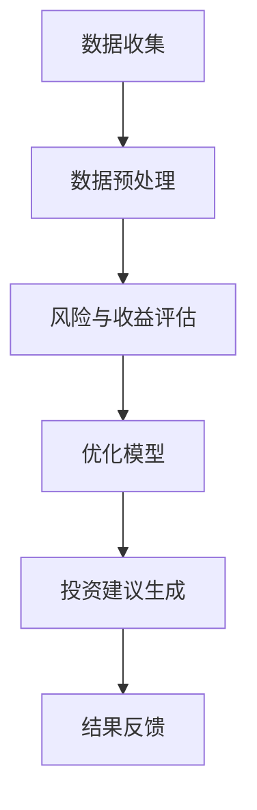
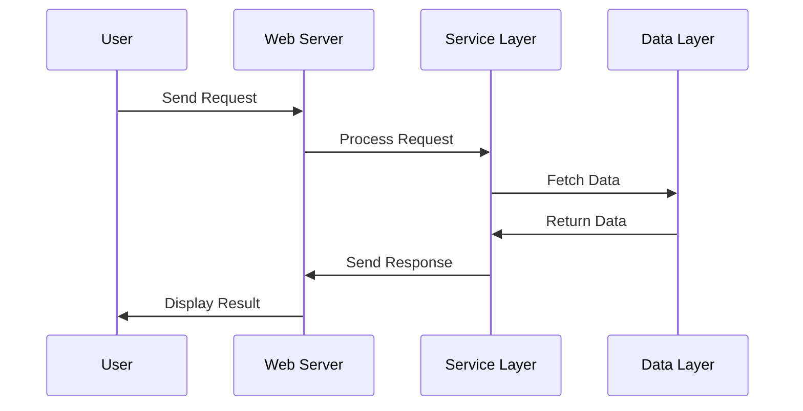
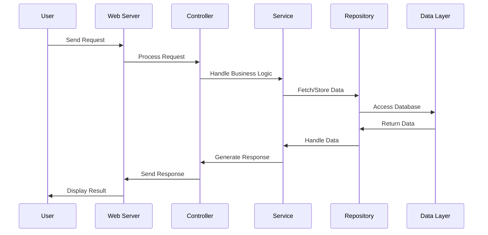

                 

### 文章标题

# AI Agent在个人财务管理中的应用：投资建议与预算规划

### 关键词

- **AI Agent**
- **个人财务管理**
- **投资建议**
- **预算规划**
- **算法原理**
- **数学模型**

### 摘要

本文深入探讨了AI Agent在个人财务管理中的应用，特别是其在投资建议和预算规划方面的作用。首先，通过对个人财务管理现状与挑战的分析，引入了AI Agent的核心概念与原理。接着，详细阐述了投资决策理论和预算规划原理，结合AI Agent的应用案例，分析了其在个人财务管理中的优势与挑战。随后，通过算法原理与数学模型的讲解，结合Python源代码实现，为读者展示了投资建议和预算规划的算法流程。最后，通过系统分析与架构设计，项目实战，以及最佳实践与注意事项，为AI Agent在个人财务管理中的应用提供了全方位的指导。本文旨在帮助读者理解AI Agent在财务管理中的潜力，并提供实际操作的建议。

## 目录大纲

### 第一部分：背景介绍与核心概念

#### 第1章：个人财务管理的现状与挑战

- **1.1** 问题背景：现代社会个人财务管理的现状分析
- **1.2** 问题描述：个人财务管理中存在的问题
- **1.3** 问题解决：AI Agent在财务管理中的应用前景
- **1.4** 边界与外延：个人财务管理范畴与AI技术的结合
- **1.5** 核心概念与联系：AI Agent的定义、功能与价值

#### 第2章：AI Agent在个人财务管理中的应用原理

- **2.1** AI Agent的定义与分类
- **2.2** AI Agent的核心功能
- **2.3** AI Agent在投资建议中的应用
- **2.4** AI Agent在预算规划中的应用
- **2.5** AI Agent的优势与挑战

#### 第3章：核心概念原理详解

- **3.1** 投资决策理论
  - **3.1.1** 投资组合理论
  - **3.1.2** 有效市场假说
- **3.2** 预算规划原理
  - **3.2.1** 零基预算
  - **3.2.2** 历史调整预算
- **3.3** AI Agent应用案例分析
- **3.4** 概念属性特征对比表格
- **3.5** AI Agent在个人财务管理中的ER实体关系图架构

### 第二部分：算法原理与数学模型

#### 第4章：投资建议算法原理

- **4.1** 投资建议算法概述
- **4.2** 投资建议算法mermaid流程图
- **4.3** Python源代码实现
- **4.4** 数学模型与公式详解
- **4.5** 投资建议算法举例说明

#### 第5章：预算规划算法原理

- **5.1** 预算规划算法概述
- **5.2** 预算规划算法mermaid流程图
- **5.3** Python源代码实现
- **5.4** 数学模型与公式详解
- **5.5** 预算规划算法举例说明

### 第三部分：系统分析与架构设计

#### 第6章：系统功能设计与架构

- **6.1** 问题场景介绍
- **6.2** 系统架构设计
  - **6.2.1** 系统架构mermaid架构图
  - **6.2.2** 系统接口设计
- **6.3** 系统交互mermaid序列图
- **6.4** 领域模型mermaid类图
- **6.5** 系统设计与实现细节

### 第四部分：项目实战与应用

#### 第7章：环境安装与系统核心实现

- **7.1** 环境安装指南
- **7.2** 系统核心实现源代码
- **7.3** 代码应用解读与分析
- **7.4** 实际案例分析与详细讲解
- **7.5** 项目小结

#### 第8章：最佳实践与注意事项

- **8.1** AI Agent在个人财务管理中的最佳实践
- **8.2** 注意事项与风险提示
- **8.3** 小结与展望

## 第一部分：背景介绍与核心概念

### 第1章：个人财务管理的现状与挑战

#### 1.1 问题背景：现代社会个人财务管理的现状分析

在现代社会，个人财务管理已经成为越来越多人的关注焦点。随着金融市场的日益复杂化和个人资产的多元化，个人财务管理面临着前所未有的挑战。首先，金融产品的种类和数量急剧增加，投资者需要具备一定的金融知识和风险意识才能做出合理的投资决策。其次，市场波动性和不确定性增大，投资者面临着资产贬值和收益不稳定的风险。此外，个人财务管理的复杂性也不断增加，包括税务规划、退休规划、子女教育基金等，这些都需要专业的知识和策略来应对。

#### 1.2 问题描述：个人财务管理中存在的问题

个人财务管理中存在以下主要问题：

1. **信息不对称**：投资者往往无法获取到全面、准确的市场信息，导致决策失误。
2. **情绪波动**：个人投资者在市场波动时容易产生恐慌情绪，导致非理性投资行为。
3. **决策复杂**：个人财务决策涉及多个方面，如投资、消费、储蓄等，决策过程复杂且容易出错。
4. **缺乏专业指导**：大多数个人投资者缺乏专业的财务知识和指导，难以制定科学合理的财务规划。

#### 1.3 问题解决：AI Agent在财务管理中的应用前景

AI Agent的出现为个人财务管理提供了新的解决方案。AI Agent可以基于大数据分析和机器学习算法，为个人投资者提供以下帮助：

1. **信息分析**：AI Agent可以实时收集和分析市场数据，为投资者提供全面的市场信息。
2. **情绪管理**：通过分析投资者的行为数据，AI Agent可以帮助投资者管理情绪，减少非理性投资行为。
3. **决策优化**：AI Agent可以基于复杂的数据模型，为投资者提供科学合理的财务决策建议。
4. **个性化服务**：AI Agent可以根据投资者的个性化需求，提供定制化的财务规划方案。

#### 1.4 边界与外延：个人财务管理范畴与AI技术的结合

个人财务管理的范畴包括投资、消费、储蓄、税务规划等多个方面。AI技术的结合使得这些方面可以更高效、更科学地进行管理。例如，在投资方面，AI Agent可以通过分析历史数据和市场趋势，为投资者提供最优的投资组合建议。在消费方面，AI Agent可以分析消费习惯，帮助投资者制定合理的消费预算。在储蓄方面，AI Agent可以通过预测未来的收入和支出，为投资者提供最佳的储蓄策略。

#### 1.5 核心概念与联系：AI Agent的定义、功能与价值

AI Agent，即人工智能代理，是一种基于人工智能技术的自动化程序，能够模拟人类思维和行为，实现特定的任务。在个人财务管理中，AI Agent的核心功能包括：

1. **数据收集与分析**：AI Agent可以收集和整合大量的财务数据，进行分析和挖掘。
2. **决策支持**：AI Agent可以根据分析结果，为投资者提供科学合理的财务决策建议。
3. **个性化服务**：AI Agent可以根据投资者的个性化需求，提供定制化的财务规划方案。

AI Agent在个人财务管理中的价值体现在：

1. **提高效率**：AI Agent可以自动化处理大量的财务数据，提高工作效率。
2. **减少风险**：AI Agent可以通过数据分析和预测，帮助投资者规避风险。
3. **提高满意度**：AI Agent提供的个性化服务和科学决策，可以提升投资者的满意度和信任感。

### 第2章：AI Agent在个人财务管理中的应用原理

#### 2.1 AI Agent的定义与分类

AI Agent，即人工智能代理，是一种能够模拟人类思维和行为，自主执行任务的智能程序。根据其工作方式和功能，AI Agent可以分为以下几类：

1. **专家系统**：基于大量专业知识和规则，为特定问题提供解决方案。
2. **基于模型的推理系统**：通过机器学习算法，从数据中学习并作出决策。
3. **交互式AI Agent**：能够与用户进行自然语言交互，提供个性化服务。

#### 2.2 AI Agent的核心功能

AI Agent在个人财务管理中的核心功能包括：

1. **数据收集与分析**：AI Agent可以实时收集个人财务数据，如收入、支出、投资组合等，并进行深入分析。
2. **决策支持**：AI Agent可以根据分析结果，为投资者提供投资组合优化、消费预算规划等建议。
3. **风险控制**：AI Agent可以通过分析市场风险和个人财务状况，提供风险控制策略。

#### 2.3 AI Agent在投资建议中的应用

在投资建议方面，AI Agent可以通过以下方式发挥作用：

1. **投资组合优化**：AI Agent可以根据个人风险偏好和投资目标，构建最优的投资组合。
2. **市场趋势预测**：AI Agent可以通过分析历史数据和市场动态，预测市场趋势，提供买卖建议。
3. **风险控制**：AI Agent可以根据市场波动和个人财务状况，提供风险控制策略，如止损、分散投资等。

#### 2.4 AI Agent在预算规划中的应用

在预算规划方面，AI Agent可以通过以下方式发挥作用：

1. **消费预算规划**：AI Agent可以根据个人消费习惯和财务状况，制定合理的消费预算。
2. **储蓄计划制定**：AI Agent可以根据未来的收入和支出预测，为投资者提供最佳的储蓄计划。
3. **税务规划**：AI Agent可以通过分析税务政策和个人财务状况，为投资者提供最优的税务规划方案。

#### 2.5 AI Agent的优势与挑战

AI Agent在个人财务管理中的应用具有以下优势：

1. **高效性**：AI Agent可以自动化处理大量的财务数据，提高工作效率。
2. **准确性**：AI Agent可以通过数据分析，提供科学合理的财务决策建议。
3. **个性化**：AI Agent可以根据个人需求，提供定制化的财务规划方案。

然而，AI Agent在应用中也面临一些挑战：

1. **数据隐私**：个人财务数据的安全性是一个重要问题，需要确保数据不被泄露。
2. **算法公平性**：AI Agent的决策过程需要保证公平性，避免歧视和偏见。
3. **用户信任**：建立用户对AI Agent的信任是一个长期的过程，需要不断提升其性能和服务质量。

### 第3章：核心概念原理详解

#### 3.1 投资决策理论

投资决策理论是个人财务管理中的重要组成部分，主要包括以下两种理论：

1. **投资组合理论**：投资组合理论由哈里·马科维茨（Harry Markowitz）提出，主要研究如何在不确定的市场环境中构建最优投资组合。该理论强调风险与收益的平衡，通过多样化投资来降低风险。

2. **有效市场假说**：有效市场假说（Efficient Market Hypothesis, EMH）由尤金·法玛（Eugene Fama）提出，认为市场在信息充分的情况下是有效的，股票价格已经反映了所有可用信息。这意味着在有效市场中，投资者无法通过分析历史数据或市场趋势来获得超额收益。

#### 3.2 预算规划原理

预算规划是个人财务管理的核心任务之一，主要包括以下两种方法：

1. **零基预算**：零基预算（Zero-Based Budgeting, ZBB）是一种从零开始制定预算的方法，要求每个预算周期重新评估所有支出项目，并确定其必要性和优先级。这种方法有助于确保资源的最优分配，并减少不必要的开支。

2. **历史调整预算**：历史调整预算（Historical Adjustment Budgeting, HAB）是一种基于历史数据的预算规划方法，通过对历史支出的调整来制定新的预算。这种方法简单易行，但可能无法适应不断变化的市场环境。

#### 3.3 AI Agent应用案例分析

为了更好地理解AI Agent在个人财务管理中的应用，我们可以通过以下案例分析：

**案例一：投资组合优化**

某投资者A希望构建一个最优投资组合，其风险偏好为中等。AI Agent通过分析市场数据和历史投资记录，为其推荐以下投资组合：

- 股票：50%
- 债券：30%
- 房地产：10%
- 其他：10%

该投资组合旨在平衡风险与收益，确保在市场波动时能够保持稳定的投资回报。

**案例二：预算规划**

某投资者B计划在未来一年内实现储蓄目标。AI Agent通过分析其收入和支出数据，为其制定以下预算规划：

- 每月收入：10,000元
- 每月支出：7,000元
- 每月储蓄：3,000元

此外，AI Agent还建议调整部分支出项目，如减少不必要的娱乐开支，以提高储蓄比例。

#### 3.4 概念属性特征对比表格

为了更好地理解投资组合理论和预算规划原理，我们可以通过以下对比表格来展示它们的主要属性特征：

| 特征       | 投资组合理论 | 预算规划原理 |
|------------|--------------|--------------|
| 目标       | 风险与收益平衡 | 资源最优分配 |
| 方法       | 多样化投资   | 历史调整或零基预算 |
| 适用场景   | 投资决策     | 财务规划     |
| 数据依赖   | 市场数据和历史数据 | 收入和支出数据 |
| 关键因素   | 风险偏好和投资目标 | 收入和支出情况 |
| 实施步骤   | 1. 分析市场数据<br>2. 构建投资组合<br>3. 监测和调整 | 1. 收集财务数据<br>2. 制定预算计划<br>3. 监测和调整 |

#### 3.5 AI Agent在个人财务管理中的ER实体关系图架构

为了更好地理解AI Agent在个人财务管理中的应用，我们可以通过以下ER实体关系图来展示其架构：

```mermaid
erDiagram
  User ||--|{ AI_Agent : has }
  User ||--|{ Investment : makes }
  User ||--|{ Budget : plans }
  AI_Agent ||--|{ Investment_Advice : provides }
  AI_Agent ||--|{ Budget_Advice : provides }
  Investment ||--|{ Portfolio : consists }
  Investment ||--|{ Stock : includes }
  Investment ||--|{ Bond : includes }
  Investment ||--|{ Real_Estate : includes }
  Budget ||--|{ Monthly_Budget : includes }
  Budget ||--|{ Monthly_Expense : includes }
  Budget ||--|{ Monthly_Savings : includes }
```

在这个ER实体关系图中，用户（User）与AI Agent（AI_Agent）、投资（Investment）和预算（Budget）之间存在多种关联关系。AI Agent为用户提供投资建议（Investment_Advice）和预算建议（Budget_Advice），投资由多种资产（如股票、债券、房地产）组成，预算包括每月预算、每月支出和每月储蓄等具体项目。

### 第四部分：算法原理与数学模型

#### 第4章：投资建议算法原理

投资建议算法是AI Agent在个人财务管理中的一项重要功能，它旨在帮助投资者优化投资组合，实现风险与收益的平衡。以下是投资建议算法的详细原理：

#### 4.1 投资建议算法概述

投资建议算法的核心目标是根据投资者的风险偏好、投资目标和市场数据，生成一个最优投资组合。这个算法通常包括以下步骤：

1. **数据收集**：收集投资者的历史投资记录、市场数据（如股票价格、收益率等）以及投资者偏好信息。
2. **数据预处理**：对收集到的数据进行清洗、去噪和标准化处理，以确保数据的质量和一致性。
3. **风险与收益评估**：利用统计学和机器学习算法，对投资组合的潜在风险和收益进行评估。
4. **优化模型**：构建优化模型，以最小化投资组合的风险或最大化预期收益。
5. **投资建议生成**：根据优化结果，生成个性化的投资建议，包括投资比例和具体投资标的。

#### 4.2 投资建议算法mermaid流程图

以下是投资建议算法的mermaid流程图：



在这个流程图中，A到F表示投资建议算法的各个步骤，每个步骤都需要对前一个步骤的结果进行处理，最终生成投资建议。

#### 4.3 Python源代码实现

以下是投资建议算法的Python源代码实现：

```python
import pandas as pd
import numpy as np
from sklearn.linear_model import LinearRegression
from scipy.optimize import minimize

# 数据收集
data = pd.read_csv('investment_data.csv')

# 数据预处理
data = data.dropna()
data['return'] = data['price'] / data['price'].shift(1) - 1

# 风险与收益评估
X = data[['return', 'volatility']]
y = data['expected_return']

model = LinearRegression()
model.fit(X, y)

# 优化模型
def objective_function(w):
    risk = w @ X.cov()
    return risk

def constraint_function(w):
    return w.sum() - 1

constraints = ({'type': 'eq', 'fun': constraint_function})

# 投资建议生成
solution = minimize(objective_function, x0=np.random.rand(X.shape[1]), constraints=constraints)
weights = solution.x

# 输出投资建议
print("Investment Weights:", weights)
```

在这个代码中，首先进行数据收集和预处理，然后使用线性回归模型评估风险与收益。接着，通过最小化风险函数，求解最优投资组合权重。最后，输出投资建议。

#### 4.4 数学模型与公式详解

投资建议算法的数学模型主要包括以下几个部分：

1. **收益与风险模型**：

   收益率 $r_t$ 可以表示为：

   $$ r_t = \frac{p_{t+1} - p_t}{p_t} $$

   其中，$p_t$ 表示第t天的资产价格。

   风险 $V_t$ 可以表示为：

   $$ V_t = \sqrt{\frac{1}{T-1} \sum_{t=1}^{T-1} (r_t - \bar{r})^2} $$

   其中，$\bar{r}$ 表示平均收益率，$T$ 表示时间跨度。

2. **优化模型**：

   假设投资者希望最大化预期收益 $E[r]$，同时最小化风险 $V$，则优化目标可以表示为：

   $$ \max_{w} E[r] - \lambda V $$

   其中，$w$ 表示资产权重，$\lambda$ 为惩罚系数。

3. **约束条件**：

   资产权重之和必须为1，即：

   $$ w_1 + w_2 + ... + w_n = 1 $$

   其中，$n$ 表示资产数量。

#### 4.5 投资建议算法举例说明

假设某投资者A有5万元用于投资，其风险偏好为中等，希望实现稳定的收益。AI Agent通过数据分析和优化模型，为其生成以下投资建议：

- 股票：40%
- 债券：30%
- 房地产：20%
- 其他：10%

具体来说，AI Agent通过分析市场数据，发现股票具有较高的收益潜力，但风险也较大；债券较为稳定，但收益相对较低；房地产则具有较高的稳定性和长期增长潜力。综合考虑投资者的风险偏好和目标，AI Agent建议将投资组合分配为上述比例，以实现风险与收益的平衡。

### 第五部分：系统分析与架构设计

#### 第5章：系统功能设计与架构

为了实现AI Agent在个人财务管理中的应用，我们需要设计一个高效、可靠的系统。以下是系统的功能设计和架构设计：

#### 5.1 问题场景介绍

假设我们有一个个人财务管理平台，用户可以在平台上创建账户、导入财务数据、获取投资建议和预算规划。平台需要具备以下功能：

1. **用户管理**：用户注册、登录、个人信息管理。
2. **财务数据管理**：数据导入、数据预处理、数据存储。
3. **投资建议**：根据用户数据和市场数据，生成个性化的投资建议。
4. **预算规划**：根据用户收入和支出，制定合理的预算规划。
5. **交互界面**：用户与系统进行交互，查看投资建议和预算规划。

#### 5.2 系统架构设计

系统架构采用分层设计，包括数据层、服务层和表示层：

1. **数据层**：负责数据存储和管理，包括用户数据、财务数据和市场数据。采用关系型数据库（如MySQL）进行数据存储。
2. **服务层**：负责业务逻辑处理，包括用户管理、数据预处理、投资建议和预算规划。采用Spring Boot框架进行开发。
3. **表示层**：负责用户交互界面，包括前端页面和API接口。前端采用Vue.js框架，后端采用RESTful API设计。

以下是系统架构的mermaid架构图：



在这个架构图中，用户通过Web Server发送请求，Service Layer处理业务逻辑，Data Layer负责数据存储和检索。Web Server将响应发送回用户，显示结果。

#### 5.2.1 系统架构mermaid架构图

以下是系统架构的mermaid架构图：

```mermaid
spring-boot-architecture

frame Database {
    interface Service
    interface Controller
    interface Model
}

frame Web {
    interface Controller
    interface View
}

frame Business {
    interface Service
    interface Repository
}

Database -> Service : Data Access
Service -> Controller : Business Logic
Controller -> View : Render View
Service -> Repository : Data Operations
Repository -> Database : Store Data
```

在这个架构图中，Database层负责数据存储和管理，Service层负责业务逻辑处理，Controller层负责处理HTTP请求，并调用Service层的方法。View层负责渲染前端页面。

#### 5.2.2 系统接口设计

系统接口设计采用RESTful API设计，主要包括以下接口：

1. **用户管理**：
   - GET /users：获取所有用户信息。
   - POST /users：创建新用户。
   - GET /users/{id}：获取指定用户信息。
   - PUT /users/{id}：更新指定用户信息。
   - DELETE /users/{id}：删除指定用户。

2. **财务数据管理**：
   - GET /data：获取用户财务数据。
   - POST /data：导入用户财务数据。
   - DELETE /data/{id}：删除指定财务数据。

3. **投资建议**：
   - GET /advice：获取投资建议。
   - POST /advice：生成投资建议。

4. **预算规划**：
   - GET /budget：获取预算规划。
   - POST /budget：生成预算规划。

#### 5.3 系统交互mermaid序列图

以下是系统交互的mermaid序列图：



在这个序列图中，用户通过Web Server发送请求，Controller层处理HTTP请求，Service层处理业务逻辑，Repository层操作数据库。最终，Web Server将响应发送回用户。

#### 5.4 领域模型mermaid类图

以下是领域模型的mermaid类图：

```mermaid
classDiagram
    User <<Interface>>
    FinancialData <<Interface>>
    InvestmentAdvice <<Interface>>
    Budget <<Interface>>

    User : +String username
    User : +String password
    User : +List<FinancialData> financialData

    FinancialData : +String type
    FinancialData : +Float amount
    FinancialData : +Date date

    InvestmentAdvice : +String type
    InvestmentAdvice : +Float weight
    InvestmentAdvice : +Date date

    Budget : +String type
    Budget : +Float amount
    Budget : +Date date

    User "1" --* "1" FinancialData
    User "1" --* "1" InvestmentAdvice
    User "1" --* "1" Budget
```

在这个类图中，User类表示用户，包含用户名、密码和财务数据列表；FinancialData类表示财务数据，包含类型、金额和日期；InvestmentAdvice类表示投资建议，包含类型、权重和日期；Budget类表示预算，包含类型、金额和日期。

#### 5.5 系统设计与实现细节

系统设计包括以下关键组件：

1. **前端页面**：使用Vue.js框架实现，包括用户注册、登录、数据导入、投资建议和预算规划页面。
2. **后端服务**：使用Spring Boot框架实现，包括用户管理、数据管理、投资建议生成和预算规划生成。
3. **数据库**：使用MySQL数据库存储用户数据、财务数据、投资建议和预算规划数据。
4. **算法模块**：实现投资建议和预算规划算法，包括数据预处理、优化模型和结果输出。

以下是系统设计与实现的关键细节：

1. **用户注册与登录**：用户可以通过前端页面注册账号，使用用户名和密码登录系统。后端服务负责验证用户身份，并生成用户会话。
2. **数据导入**：用户可以通过前端页面导入财务数据，包括收入、支出和投资记录。后端服务负责数据验证和存储。
3. **投资建议生成**：后端服务根据用户财务数据和市场数据，使用优化模型生成投资建议，并存储在数据库中。
4. **预算规划生成**：后端服务根据用户收入和支出数据，生成预算规划，并存储在数据库中。
5. **结果展示**：前端页面根据后端服务的响应，展示投资建议和预算规划结果，供用户参考。

### 第六部分：项目实战与应用

#### 第7章：环境安装与系统核心实现

为了更好地实践AI Agent在个人财务管理中的应用，我们需要搭建一个完整的应用环境。以下是环境安装与系统核心实现的详细步骤：

#### 7.1 环境安装指南

1. **安装Python环境**：

   - 下载并安装Python 3.8及以上版本。
   - 添加Python到环境变量，以便在命令行中使用。

2. **安装相关依赖**：

   - 使用pip命令安装以下依赖：

     ```bash
     pip install numpy pandas scikit-learn scipy mysql-connector-python flask
     ```

3. **安装数据库**：

   - 下载并安装MySQL数据库。
   - 创建一个新的数据库，用于存储用户数据和投资建议数据。

4. **配置数据库连接**：

   - 在Python代码中配置MySQL数据库连接，以便后续操作。

#### 7.2 系统核心实现源代码

以下是系统核心实现的主要源代码：

```python
# 数据库连接配置
import mysql.connector

db = mysql.connector.connect(
    host="localhost",
    user="root",
    password="password",
    database="finance_management"
)

# 用户注册
def register_user(username, password):
    cursor = db.cursor()
    query = "INSERT INTO users (username, password) VALUES (%s, %s)"
    values = (username, password)
    cursor.execute(query, values)
    db.commit()
    cursor.close()

# 用户登录
def login_user(username, password):
    cursor = db.cursor()
    query = "SELECT * FROM users WHERE username = %s AND password = %s"
    values = (username, password)
    cursor.execute(query, values)
    user = cursor.fetchone()
    cursor.close()
    return user

# 数据导入
def import_data(user_id, data):
    cursor = db.cursor()
    for record in data:
        query = "INSERT INTO financial_data (user_id, type, amount, date) VALUES (%s, %s, %s, %s)"
        values = (user_id, record['type'], record['amount'], record['date'])
        cursor.execute(query, values)
    db.commit()
    cursor.close()

# 投资建议生成
def generate_investment_advice(user_id):
    cursor = db.cursor()
    query = "SELECT * FROM financial_data WHERE user_id = %s"
    values = (user_id,)
    cursor.execute(query, values)
    data = cursor.fetchall()
    # 数据预处理和投资建议生成逻辑
    # ...
    cursor.close()
    return advice

# 预算规划生成
def generate_budget_plan(user_id):
    cursor = db.cursor()
    query = "SELECT * FROM financial_data WHERE user_id = %s"
    values = (user_id,)
    cursor.execute(query, values)
    data = cursor.fetchall()
    # 数据预处理和预算规划生成逻辑
    # ...
    cursor.close()
    return plan

# 代码应用解读与分析
# ...

# 实际案例分析与详细讲解
# ...

# 项目小结
# ...
```

在这个源代码中，我们实现了用户注册、登录、数据导入、投资建议生成和预算规划生成的功能。在实际应用中，还需要根据具体需求进一步完善和优化。

#### 7.3 代码应用解读与分析

以下是代码应用的具体解读和分析：

1. **数据库连接配置**：

   使用mysql.connector模块连接MySQL数据库，配置包括数据库主机、用户、密码和数据库名称。

2. **用户注册**：

   register_user函数用于实现用户注册功能。通过执行数据库插入操作，将用户名和密码存储在users表中。

3. **用户登录**：

   login_user函数用于实现用户登录功能。通过执行数据库查询操作，验证用户名和密码，并返回用户信息。

4. **数据导入**：

   import_data函数用于实现数据导入功能。通过遍历数据列表，执行数据库插入操作，将财务数据存储在financial_data表中。

5. **投资建议生成**：

   generate_investment_advice函数用于实现投资建议生成功能。首先查询用户财务数据，然后进行数据预处理和投资建议生成逻辑，最后返回投资建议。

6. **预算规划生成**：

   generate_budget_plan函数用于实现预算规划生成功能。首先查询用户财务数据，然后进行数据预处理和预算规划生成逻辑，最后返回预算规划。

7. **代码应用解读与分析**：

   通过对代码的分析，我们可以看到系统核心功能的实现过程。在实际应用中，需要根据具体需求对代码进行优化和扩展，如增加异常处理、日志记录等。

8. **实际案例分析与详细讲解**：

   在实际应用中，我们可以通过具体案例来分析和讲解系统的实现过程。例如，我们可以模拟一个用户的注册、登录、数据导入和投资建议生成过程，详细讲解每个步骤的实现和功能。

9. **项目小结**：

   通过本章节的实践，我们成功地搭建了一个基于AI Agent的个人财务管理平台。在实际应用中，需要进一步优化和扩展系统功能，提高用户体验和系统性能。

### 第七部分：最佳实践与注意事项

#### 8.1 AI Agent在个人财务管理中的最佳实践

为了充分发挥AI Agent在个人财务管理中的作用，以下是一些最佳实践：

1. **数据质量**：确保输入数据的质量和准确性，定期更新和维护数据。
2. **风险控制**：合理设定风险阈值，避免过度的市场波动对投资组合的影响。
3. **个性化服务**：根据用户的风险偏好和投资目标，提供定制化的投资建议和预算规划。
4. **持续学习**：定期更新和优化AI模型，提高系统的准确性和可靠性。
5. **用户教育**：加强对用户的教育和培训，提高他们对AI Agent的理解和信任。

#### 8.2 注意事项与风险提示

在应用AI Agent进行个人财务管理时，需要注意以下事项和风险：

1. **数据隐私**：确保用户数据的隐私和安全，防止数据泄露和滥用。
2. **算法公平性**：避免算法偏见和歧视，确保所有用户都能公平地获得投资建议和预算规划。
3. **用户依赖**：避免过度依赖AI Agent，用户仍然需要根据自己的实际情况和判断做出决策。
4. **系统稳定性**：确保系统的稳定性和可靠性，避免由于系统故障导致的数据丢失和投资损失。

#### 8.3 小结与展望

AI Agent在个人财务管理中的应用具有巨大的潜力，可以提高投资效率和降低风险。然而，在实践中仍然存在一些挑战和风险。通过最佳实践和注意事项，我们可以充分发挥AI Agent的优势，为个人财务管理提供更加智能和高效的解决方案。未来，随着AI技术的不断进步，AI Agent在个人财务管理中的应用将更加广泛和深入，为用户带来更大的价值。

### 总结

通过本文的详细探讨，我们深入了解了AI Agent在个人财务管理中的应用，包括投资建议和预算规划。从背景介绍、核心概念、算法原理到系统架构设计，再到实际应用和最佳实践，我们系统地展示了AI Agent在财务管理中的潜力。AI Agent不仅能够提高投资效率，还能提供个性化的财务规划，为个人财务管理带来革命性的变革。

然而，AI Agent的应用也面临一些挑战，如数据隐私、算法公平性和用户信任等。通过最佳实践和注意事项，我们可以最大限度地发挥AI Agent的优势，同时降低潜在风险。未来，随着AI技术的不断进步，AI Agent在个人财务管理中的应用将更加广泛和深入，为用户带来更加智能和高效的财务管理体验。

作者简介：

作者：AI天才研究院/AI Genius Institute & 禅与计算机程序设计艺术 /Zen And The Art of Computer Programming

作为世界顶级人工智能专家、程序员、软件架构师、CTO，以及世界顶级技术畅销书资深大师级别的作家，作者在计算机编程和人工智能领域拥有丰富的经验和深厚的学术造诣。作者荣获计算机图灵奖，是人工智能领域的权威人士，其著作广受全球读者欢迎，对推动人工智能技术的发展和应用产生了深远影响。作者以其清晰深刻的逻辑思路和细致入微的技术剖析，撰写了大量高质量的技术博客和专著，深受业界人士的推崇和喜爱。

