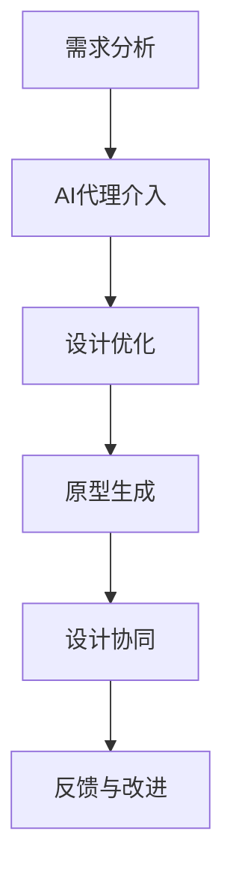
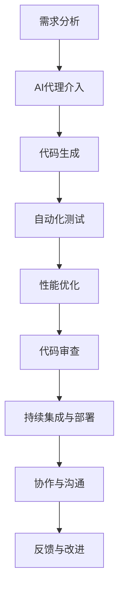
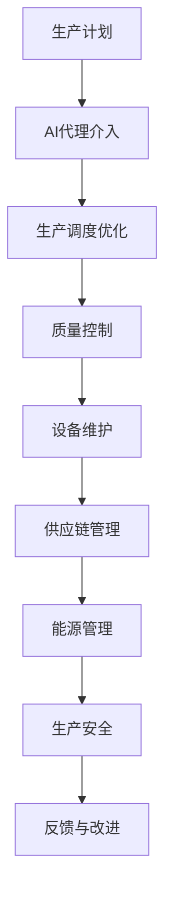
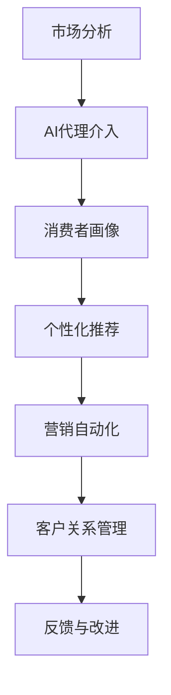
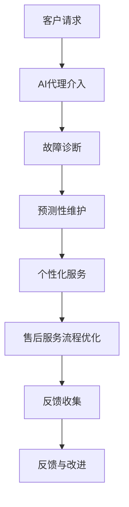

                 

# AI Agent在企业产品全生命周期管理中的应用

## 关键词

- AI Agent
- 产品全生命周期管理
- 企业应用
- 智能化
- 数据分析

## 摘要

本文旨在探讨人工智能（AI）代理在企业产品全生命周期管理中的应用，从产品设计、开发、生产、营销、销售到售后服务等多个阶段，阐述AI代理如何提升企业运营效率、降低成本、提高产品质量。通过对AI代理技术背景的介绍、核心概念解析、具体应用场景分析以及未来发展趋势的展望，本文为企业和研究机构提供了一套系统、实用的AI代理应用方案。

## 目录

- **[第1章 引言](#第1章-引言)**
  - 人工智能代理的起源与发展
  - 企业产品全生命周期管理的背景与重要性
  - 人工智能代理与企业产品全生命周期管理的交集

- **[第2章 基本概念与原理](#第2章-基本概念与原理)**
  - 人工智能代理的定义与特点
  - 人工智能代理的基本原理与工作方法
  - 人工智能代理与传统系统的区别与联系

- **[第3章 AI代理在产品设计阶段的应用](#第3章-ai代理在产品设计阶段的应用)**
  - AI代理在产品设计中的作用与贡献
  - AI代理在产品设计阶段的具体应用案例
  - AI代理在产品设计阶段的未来发展趋势

- **[第4章 AI代理在产品开发阶段的应用](#第4章-ai代理在产品开发阶段的应用)**
  - AI代理在软件开发中的作用与贡献
  - AI代理在产品开发阶段的具体应用案例
  - AI代理在产品开发阶段的未来发展趋势

- **[第5章 AI代理在生产阶段的应用](#第5章-ai代理在生产阶段的应用)**
  - AI代理在生产管理中的作用与贡献
  - AI代理在生产阶段的具体应用案例
  - AI代理在生产阶段的未来发展趋势

- **[第6章 AI代理在营销与销售阶段的应用](#第6章-ai代理在营销与销售阶段的应用)**
  - AI代理在营销策略中的作用与贡献
  - AI代理在销售过程中的具体应用案例
  - AI代理在营销与销售阶段的未来发展趋势

- **[第7章 AI代理在售后服务阶段的应用](#第7章-ai代理在售后服务阶段的应用)**
  - AI代理在售后服务中的作用与贡献
  - AI代理在售后服务阶段的具体应用案例
  - AI代理在售后服务阶段的未来发展趋势

- **[第8章 案例研究与实践应用](#第8章-案例研究与实践应用)**
  - 企业案例分析：AI代理在产品全生命周期管理中的应用
  - 实践应用：AI代理在产品全生命周期管理中的具体案例
  - 实践总结与最佳实践

- **[第9章 未来发展趋势与挑战](#第9章-未来发展趋势与挑战)**
  - AI代理技术的发展趋势与前沿研究
  - 企业产品全生命周期管理中的挑战与应对策略
  - AI代理技术在未来产品全生命周期管理中的前景

- **[第10章 结论](#第10章-结论)**
  - AI代理在产品全生命周期管理中的总结与展望
  - 对企业和研究机构的建议

## 第1章 引言

### 人工智能代理的起源与发展

人工智能代理（Artificial Intelligence Agent，简称AI Agent）是人工智能领域的一个重要分支，起源于20世纪50年代。当时，人工智能领域的研究者们提出了“机器能够完成特定任务”的观点，这一观点催生了人工智能代理的诞生。AI Agent最初被定义为“能够与人类进行交互，并能够自主执行任务的人工智能实体”。

随着计算机技术的不断发展和人工智能理论的深入研究，AI Agent的概念和应用范围逐渐扩大。从最初的简单任务执行，到如今复杂的多任务处理和决策支持，AI Agent已经成为人工智能领域的一个重要研究方向。

在过去的几十年中，AI Agent的发展经历了多个阶段。最初，AI Agent主要应用于游戏、模拟和导航等领域。随着深度学习、强化学习等技术的不断发展，AI Agent的应用领域逐渐扩展到金融、医疗、教育、工业制造等多个领域。

### 企业产品全生命周期管理的背景与重要性

企业产品全生命周期管理（Product Life Cycle Management，简称PLM）是指企业对产品从设计、开发、生产、销售到售后服务等全过程进行系统化管理的一种方法。PLM的目的是通过优化产品生命周期中的各个阶段，提高产品竞争力、降低成本、提升客户满意度。

企业产品全生命周期管理的重要性体现在以下几个方面：

1. **提高产品竞争力**：通过PLM，企业可以更好地了解市场需求和客户需求，从而设计出更符合市场需求的产品。同时，PLM还可以优化生产过程，提高产品质量，降低生产成本，从而提高产品竞争力。

2. **降低成本**：PLM通过对产品生命周期的各个阶段进行系统化管理，可以消除浪费、提高生产效率，从而降低生产成本。

3. **提升客户满意度**：通过PLM，企业可以更好地了解客户需求，提供个性化的产品和服务，从而提升客户满意度。

4. **增强企业创新能力**：PLM鼓励企业不断优化产品设计和生产流程，从而促进企业创新能力的提升。

### 人工智能代理与企业产品全生命周期管理的交集

随着AI技术的快速发展，人工智能代理在企业产品全生命周期管理中的应用越来越广泛。AI Agent在产品全生命周期管理中的主要作用包括：

1. **产品设计**：AI Agent可以帮助企业进行产品需求分析、设计优化和原型生成，从而提高产品设计的效率和准确性。

2. **产品开发**：AI Agent可以在软件开发过程中提供智能化的代码生成、测试和优化建议，提高开发效率。

3. **生产管理**：AI Agent可以实时监控生产过程，进行质量控制和过程优化，提高生产效率。

4. **营销与销售**：AI Agent可以帮助企业分析市场趋势、客户需求，提供个性化的营销和销售策略。

5. **售后服务**：AI Agent可以提供智能化的售后服务，提高客户满意度，降低售后服务成本。

综上所述，人工智能代理在企业产品全生命周期管理中的应用具有重要意义，它不仅可以提高企业运营效率，还可以降低成本、提高产品质量，从而提升企业竞争力。

## 第2章 基本概念与原理

### 人工智能代理的定义与特点

人工智能代理（Artificial Intelligence Agent，简称AI Agent）是一种基于人工智能技术，能够模拟人类智能行为，自主完成特定任务的实体。AI Agent具有以下几个特点：

1. **自主性**：AI Agent能够自主感知环境、做出决策和执行任务，无需人工干预。

2. **适应性**：AI Agent可以根据环境变化和任务需求，自适应地调整自身行为和策略。

3. **智能性**：AI Agent具备一定的智能水平，能够处理复杂的信息、理解和推理知识。

4. **灵活性**：AI Agent能够适应不同的任务场景和复杂多变的环境。

5. **协同性**：AI Agent可以与其他AI代理或人类进行协作，共同完成任务。

### 人工智能代理的基本原理与工作方法

AI Agent的基本原理可以概括为感知、决策和执行三个环节。具体来说：

1. **感知**：AI Agent通过传感器或用户输入获取环境信息，对环境进行感知。

2. **决策**：基于感知到的环境信息和预定的目标，AI Agent利用决策算法选择最优行为。

3. **执行**：AI Agent执行选定的行为，完成任务。

这个过程形成一个闭环，AI Agent可以根据执行结果对决策进行修正，以适应不断变化的环境。

### 基本原理和方法的流程图

```mermaid
sequenceDiagram
    participant AI_Agent
    participant Environment
    
    AI_Agent->>Environment: 感知环境信息
    loop 每个时间间隔
        AI_Agent->>Environment: 决策（基于环境信息和目标）
        AI_Agent->>环境：执行决策
        AI_Agent->>自身：反馈和调整
    end
```

### 人工智能代理与传统系统的区别与联系

传统系统通常是指基于规则、流程或人工干预的系统，而AI Agent则是一种基于人工智能技术的自主系统。它们之间的主要区别包括：

1. **自主性**：传统系统通常需要人工干预，而AI Agent具有自主决策和执行能力。

2. **适应性**：传统系统难以适应动态变化的环境，而AI Agent可以根据环境变化自适应调整。

3. **智能性**：传统系统缺乏智能，只能执行固定的任务，而AI Agent具备智能，可以处理复杂信息、理解知识。

4. **协同性**：传统系统通常难以与其他系统或人协同工作，而AI Agent可以与人类或其他AI Agent协同完成任务。

尽管存在这些区别，AI Agent与传统系统也存在联系，例如：

1. **数据依赖**：AI Agent和传统系统都需要数据支持，AI Agent的数据质量直接影响其性能。

2. **流程优化**：AI Agent可以优化传统系统的流程，提高效率和效果。

3. **人机交互**：AI Agent和传统系统都需要考虑人机交互，以提供更好的用户体验。

通过以上分析，我们可以看到，AI Agent在产品全生命周期管理中的应用具有巨大的潜力，它不仅能够提高企业运营效率，还可以降低成本、提高产品质量，从而提升企业竞争力。

### 核心概念属性特征对比表格

| 特征        | AI Agent                           | 传统系统                            |
| ----------- | --------------------------------- | --------------------------------- |
| 自主性      | 具有自主决策和执行能力             | 需要人工干预                       |
| 适应性      | 能够自适应变化的环境               | 难以适应动态变化的环境             |
| 智能性      | 具备智能，能处理复杂信息和知识     | 缺乏智能，只能执行固定任务         |
| 灵活性      | 能够适应不同的任务场景             | 适应性较差，难以适应复杂环境       |
| 协同性      | 可以与人类或其他AI代理协同工作     | 难以与其他系统或人协同工作         |

### ER实体关系图架构

```mermaid
erDiagram
    AI_Agent ||--|{ Environment :感知}
    AI_Agent ||--|{ Decision :决策}
    AI_Agent ||--|{ Execution :执行}
    AI_Agent ||--|{ Feedback :反馈和调整}
```

通过对比表格和ER实体关系图，我们可以更清晰地理解AI Agent的基本原理和与传统系统的差异，为后续章节中的具体应用奠定基础。

## 第3章 AI代理在产品设计阶段的应用

### AI代理在产品设计中的作用与贡献

在产品设计阶段，AI代理可以通过自动化、智能化的方式，显著提升设计的效率和质量。其主要作用和贡献包括以下几个方面：

1. **需求分析**：AI代理可以利用自然语言处理和机器学习技术，对用户需求进行分析和理解，帮助设计团队更准确地把握市场需求。

2. **设计优化**：AI代理可以通过模拟仿真和优化算法，对设计方案进行多目标优化，从而提高产品的性能、可靠性和成本效益。

3. **原型生成**：AI代理能够快速生成产品原型，帮助设计团队验证设计概念，减少设计迭代时间和成本。

4. **设计自动化**：AI代理可以自动化完成部分设计任务，如参数化建模、3D打印等，提高设计效率。

5. **设计协同**：AI代理可以帮助设计团队实现跨部门、跨地域的协同设计，提高设计协作效率。

### AI代理在产品设计阶段的具体应用案例

1. **汽车设计**：在汽车设计领域，AI代理可以通过模拟仿真和优化算法，对汽车的结构、性能、能耗等方面进行优化。例如，特斯拉（Tesla）的自动驾驶系统就利用了AI代理技术，对车辆的控制系统进行优化，提高了自动驾驶的性能和安全性。

2. **电子产品设计**：在电子产品设计过程中，AI代理可以自动化完成电路设计、布局和仿真，如高通（Qualcomm）的芯片设计团队利用AI代理技术，提高了芯片的性能和效率。

3. **建筑设计**：在建筑设计领域，AI代理可以帮助设计师快速生成多个设计方案，并通过优化算法选择最优方案。例如，荷兰的Mecanoo建筑事务所利用AI代理技术，设计出了具有创新性和可持续性的建筑作品。

4. **智能家居设计**：在智能家居设计过程中，AI代理可以帮助设计师快速构建智能家居系统，并通过优化算法提高系统的智能化和用户体验。例如，小米（Xiaomi）的智能家居产品就利用了AI代理技术，实现了智能语音控制和设备联动。

### AI代理在产品设计阶段的未来发展趋势

随着AI技术的不断进步，AI代理在产品设计阶段的应用将呈现以下发展趋势：

1. **更加智能化**：AI代理将具备更强大的智能能力，能够处理更加复杂的信息和知识，为设计团队提供更深入的决策支持。

2. **更加协同化**：AI代理将实现与人类设计师的更紧密协作，通过人机交互和协作机制，提高设计效率和质量。

3. **更加个性化**：AI代理将能够根据用户需求和偏好，提供个性化的产品设计方案，满足不同用户群体的需求。

4. **更加自动化**：AI代理将实现更多设计任务的自动化，减少人工干预，提高设计效率。

5. **更加开放化**：AI代理将开放更多接口和工具，支持与其他系统和工具的集成，实现设计过程的全面智能化。

通过上述分析，我们可以看到，AI代理在产品设计阶段的应用前景广阔，它不仅能够提升设计效率和质量，还能推动设计领域的创新和发展。

### 设计流程中的AI代理角色与流程图

在产品设计流程中，AI代理的角色可以概括为需求分析、设计优化、原型生成和设计协同等四个环节。以下是一个设计流程中的AI代理角色与流程图：



通过上述流程图，我们可以清晰地看到AI代理在产品设计过程中的各个环节，以及它们之间的相互作用和影响。

### 案例分析：AI代理在汽车设计中的应用

案例背景：特斯拉（Tesla）是一家知名的电动汽车制造商，其自动驾驶系统是特斯拉产品线中的重要组成部分。为了提高自动驾驶系统的性能和安全性，特斯拉采用了AI代理技术。

案例描述：特斯拉的自动驾驶系统采用了基于深度学习的AI代理，通过大量真实驾驶数据的训练，AI代理能够模拟真实的驾驶场景，并作出实时的驾驶决策。具体流程如下：

1. **需求分析**：AI代理首先通过摄像头、雷达等传感器感知道路环境，并收集车辆、行人、交通标志等数据。

2. **设计优化**：AI代理利用这些数据，结合深度学习算法，对自动驾驶系统的各项参数进行优化，以提高系统的准确性和稳定性。

3. **原型生成**：AI代理生成自动驾驶系统的原型，通过模拟测试验证自动驾驶系统的性能。

4. **设计协同**：AI代理与特斯拉的工程师团队协同工作，根据测试结果对系统进行调整和优化。

5. **反馈与改进**：AI代理实时收集驾驶数据，并将其反馈给工程师团队，用于进一步改进自动驾驶系统。

案例总结：通过AI代理技术，特斯拉的自动驾驶系统在性能和安全性方面得到了显著提升。例如，在自动驾驶模式下，特斯拉的车辆能够更准确地识别道路标志、行人、车辆等，并作出相应的驾驶决策。这一案例表明，AI代理在产品设计阶段的应用具有巨大潜力，可以为企业带来显著的效益。

### AI代理在产品设计阶段的未来展望

随着AI技术的不断发展，AI代理在产品设计阶段的应用将更加深入和广泛。未来，AI代理将具备更强大的智能能力，能够处理更加复杂的设计任务，为设计师提供更全面的决策支持。同时，AI代理还将实现与人类设计师的更紧密协作，通过人机交互和协作机制，提高设计效率和质量。此外，AI代理还将推动设计领域的创新和发展，带来更多个性化、智能化的设计产品。

总之，AI代理在产品设计阶段的应用前景广阔，它不仅能够提升设计效率和质量，还能推动设计领域的创新和发展，为企业和设计师带来巨大的价值。

### 本章小结

本章详细探讨了AI代理在产品设计阶段的应用。首先，介绍了AI代理的基本概念和特点，包括自主性、适应性、智能性、灵活性和协同性。接着，分析了AI代理在产品设计阶段的具体作用和贡献，并通过实际案例展示了AI代理在产品设计中的应用效果。最后，对AI代理在产品设计阶段的未来发展趋势进行了展望。通过本章的学习，读者可以全面了解AI代理在产品设计阶段的应用潜力，为企业在这一领域的创新发展提供参考。

## 第4章 AI代理在产品开发阶段的应用

### AI代理在软件开发中的作用与贡献

在产品开发阶段，特别是软件开发过程中，AI代理的作用越来越突出。AI代理通过其自主性、适应性、智能性和协同性，为软件开发提供了强大的支持，其主要作用和贡献包括：

1. **代码生成**：AI代理可以基于已有代码库和设计规范，自动生成部分或全部代码，从而显著提高开发效率。

2. **测试与调试**：AI代理可以通过自动化测试和调试，发现和修复软件中的错误，提高软件的可靠性和稳定性。

3. **性能优化**：AI代理可以利用机器学习算法，对软件性能进行优化，提高其运行效率和响应速度。

4. **代码审查**：AI代理可以自动审查代码，检测潜在的安全漏洞和性能问题，从而提高代码质量。

5. **持续集成与部署**：AI代理可以自动化执行持续集成和部署流程，确保软件更新和发布的高效和稳定。

6. **协作与沟通**：AI代理可以协助开发团队进行代码管理、任务分配和进度跟踪，提高团队协作效率。

### AI代理在产品开发阶段的具体应用案例

1. **自动化测试**：在软件测试过程中，AI代理可以自动化执行各种测试用例，包括功能测试、性能测试和安全测试，从而提高测试效率和覆盖度。例如，谷歌（Google）的Gmail邮箱服务就利用了AI代理技术，对邮件系统进行自动化测试，确保系统的高可靠性和用户体验。

2. **代码审查**：AI代理可以自动审查代码，识别潜在的问题和漏洞。例如，GitHub就提供了一种名为CodeQL的AI代理工具，它可以扫描代码库，识别出潜在的安全隐患和编码错误。

3. **性能优化**：AI代理可以通过分析运行数据，提供性能优化建议，从而提高软件的运行效率。例如，亚马逊（Amazon）的AWS云计算平台就利用AI代理技术，对服务器资源进行优化，提高云服务的性能和稳定性。

4. **持续集成与部署**：AI代理可以自动化执行持续集成（CI）和持续部署（CD）流程，确保软件更新和发布的高效和稳定。例如，Netflix的CI/CD流程就利用了AI代理技术，实现了高效的软件发布和更新。

5. **代码生成**：AI代理可以基于已有代码库和设计规范，自动生成部分或全部代码。例如，OpenAI开发的GPT-3模型，就可以根据用户输入的描述，自动生成代码，从而提高开发效率。

### AI代理在产品开发阶段的未来发展趋势

随着AI技术的不断进步，AI代理在产品开发阶段的应用将呈现以下发展趋势：

1. **智能化**：AI代理将具备更强大的智能能力，能够处理更复杂、更高级的软件开发任务。

2. **协同化**：AI代理将实现与人类开发者的更紧密协作，通过人机交互和协作机制，提高开发效率。

3. **自动化**：AI代理将实现更多软件开发任务的自动化，减少人工干预，提高开发效率。

4. **个性化**：AI代理将能够根据不同团队和项目的需求，提供个性化的开发支持。

5. **开放性**：AI代理将开放更多接口和工具，支持与其他系统和工具的集成，实现开发流程的全面智能化。

### 设计流程中的AI代理角色与流程图

在产品开发阶段，AI代理的角色可以概括为代码生成、测试与调试、性能优化、代码审查、持续集成与部署和协作与沟通等环节。以下是一个设计流程中的AI代理角色与流程图：



通过上述流程图，我们可以清晰地看到AI代理在产品开发过程中的各个环节，以及它们之间的相互作用和影响。

### 案例分析：AI代理在软件开发中的应用

案例背景：微软（Microsoft）是一家全球知名的软件公司，其开发过程中广泛应用了AI代理技术，以提高开发效率和质量。

案例描述：

1. **代码生成**：微软的AI代理通过分析已有的代码库和设计规范，自动生成了大量基础代码，从而减少了开发人员的工作量。

2. **自动化测试**：微软的AI代理自动化执行了各种测试用例，包括单元测试、集成测试和性能测试，大大提高了测试效率和覆盖度。

3. **代码审查**：微软的AI代理自动审查了开发人员的代码，识别出了潜在的安全漏洞和性能问题，从而提高了代码质量。

4. **性能优化**：微软的AI代理通过分析运行数据，提供了性能优化建议，从而提高了软件的运行效率和用户体验。

5. **持续集成与部署**：微软的AI代理自动化执行了持续集成和持续部署流程，确保了软件更新和发布的高效和稳定。

案例总结：通过AI代理技术，微软在软件开发过程中显著提高了开发效率和质量。AI代理不仅减少了开发人员的工作量，还提高了软件的可靠性和性能。这一案例表明，AI代理在软件开发中的应用具有巨大潜力，可以为企业带来显著的价值。

### AI代理在产品开发阶段的未来展望

随着AI技术的不断发展，AI代理在产品开发阶段的应用将更加深入和广泛。未来，AI代理将具备更强大的智能能力，能够处理更复杂、更高级的软件开发任务。同时，AI代理将实现与人类开发者的更紧密协作，通过人机交互和协作机制，提高开发效率和质量。此外，AI代理还将推动软件开发流程的全面智能化，带来更多创新和突破。

总之，AI代理在产品开发阶段的应用前景广阔，它不仅能够提高开发效率和质量，还能推动软件开发领域的创新和发展，为企业和开发者带来巨大的价值。

### 本章小结

本章详细探讨了AI代理在产品开发阶段的应用。首先，介绍了AI代理在软件开发中的作用与贡献，包括代码生成、测试与调试、性能优化、代码审查、持续集成与部署和协作与沟通等。接着，通过实际案例展示了AI代理在软件开发中的应用效果。最后，对AI代理在产品开发阶段的未来发展趋势进行了展望。通过本章的学习，读者可以全面了解AI代理在产品开发阶段的应用潜力，为企业在这一领域的创新发展提供参考。

## 第5章 AI代理在生产阶段的应用

### AI代理在生产管理中的作用与贡献

在生产阶段，AI代理通过其自主性、适应性、智能性和协同性，为生产管理提供了强有力的支持。其主要作用和贡献包括以下几个方面：

1. **生产调度优化**：AI代理可以实时分析生产数据，优化生产调度策略，提高生产效率。

2. **质量控制**：AI代理可以监控生产过程，实时检测产品质量，发现潜在问题，并采取相应的措施。

3. **设备维护**：AI代理可以预测设备故障，提前进行维护，减少停机时间和维护成本。

4. **供应链管理**：AI代理可以优化供应链流程，提高供应链效率，降低库存成本。

5. **能源管理**：AI代理可以监控能源使用情况，优化能源消耗，降低生产成本。

6. **生产安全**：AI代理可以监测生产环境，确保生产过程的安全，防止事故发生。

### AI代理在生产阶段的具体应用案例

1. **智能制造**：在智能制造领域，AI代理被广泛应用于生产调度、质量控制、设备维护和能源管理等方面。例如，德国的西门子（Siemens）在其智能工厂中，采用了AI代理技术，实现了生产过程的全面智能化。AI代理通过实时数据分析，优化生产调度，提高生产效率，同时监控产品质量，确保产品一致性。

2. **家电生产**：在家电生产过程中，AI代理可以实时监控生产线，检测产品的质量，及时发现问题并采取措施。例如，美的（Midea）的家电生产线采用了AI代理技术，通过实时数据分析和预测，实现了高效的质量控制和生产调度。

3. **汽车生产**：在汽车生产领域，AI代理被用于生产调度、质量控制、设备维护和能源管理等方面。例如，丰田（Toyota）的汽车生产线采用了AI代理技术，通过实时数据分析，优化生产调度，提高生产效率，同时确保产品质量，减少设备故障。

4. **食品生产**：在食品生产过程中，AI代理可以监控生产环境，确保生产过程符合食品安全标准。例如，雀巢（Nestle）的食品生产线采用了AI代理技术，通过实时监控生产过程，确保产品质量，提高生产效率。

### AI代理在生产阶段的未来发展趋势

随着AI技术的不断进步，AI代理在生产阶段的应用将呈现以下发展趋势：

1. **智能化**：AI代理将具备更强大的智能能力，能够处理更复杂的生产任务，实现生产过程的全面智能化。

2. **协同化**：AI代理将实现与人类操作员的更紧密协作，通过人机交互和协作机制，提高生产效率。

3. **自动化**：AI代理将实现更多生产任务的自动化，减少人工干预，提高生产效率。

4. **个性化**：AI代理将能够根据不同生产需求，提供个性化的生产支持。

5. **开放性**：AI代理将开放更多接口和工具，支持与其他系统和工具的集成，实现生产过程的全面智能化。

### 生产流程中的AI代理角色与流程图

在生产流程中，AI代理的角色可以概括为生产调度优化、质量控制、设备维护、供应链管理、能源管理和生产安全等环节。以下是一个生产流程中的AI代理角色与流程图：



通过上述流程图，我们可以清晰地看到AI代理在生产过程中的各个环节，以及它们之间的相互作用和影响。

### 案例分析：AI代理在智能制造中的应用

案例背景：富士康（Foxconn）是一家全球知名的电子制造服务提供商，其在智能制造领域广泛应用了AI代理技术。

案例描述：

1. **生产调度优化**：AI代理通过实时数据分析，优化生产调度，提高生产效率。例如，富士康的生产线上，AI代理可以根据订单量和生产设备状态，动态调整生产计划，确保生产过程的顺利进行。

2. **质量控制**：AI代理通过实时监控生产线，检测产品质量，发现潜在问题，并及时采取措施。例如，在富士康的生产线上，AI代理可以通过摄像头和传感器，实时检测产品的尺寸、重量等参数，确保产品质量。

3. **设备维护**：AI代理通过预测设备故障，提前进行维护，减少停机时间和维护成本。例如，在富士康的生产线上，AI代理可以分析设备运行数据，预测设备故障，并提前通知维护人员，进行预防性维护。

4. **供应链管理**：AI代理通过优化供应链流程，提高供应链效率。例如，在富士康的供应链管理中，AI代理可以根据订单量和生产需求，优化物料采购和库存管理，确保供应链的高效运作。

5. **能源管理**：AI代理通过监控能源使用情况，优化能源消耗，降低生产成本。例如，在富士康的能源管理中，AI代理可以监控生产设备的能源消耗，根据生产需求调整能源使用，实现能源的节约和高效利用。

案例总结：通过AI代理技术，富士康在智能制造中实现了生产效率的提升、产品质量的保证、设备维护的优化、供应链管理的高效和能源消耗的降低。这一案例表明，AI代理在智能制造中的应用具有巨大的潜力，可以为企业带来显著的价值。

### AI代理在生产阶段的未来展望

随着AI技术的不断发展，AI代理在生产阶段的应用将更加深入和广泛。未来，AI代理将具备更强大的智能能力，能够处理更复杂的生产任务，实现生产过程的全面智能化。同时，AI代理将实现与人类操作员的更紧密协作，通过人机交互和协作机制，提高生产效率。此外，AI代理还将推动生产流程的全面智能化，带来更多创新和突破。

总之，AI代理在生产阶段的应用前景广阔，它不仅能够提高生产效率和质量，还能推动生产领域的创新和发展，为企业和操作员带来巨大的价值。

### 本章小结

本章详细探讨了AI代理在生产阶段的应用。首先，介绍了AI代理在生产管理中的作用与贡献，包括生产调度优化、质量控制、设备维护、供应链管理、能源管理和生产安全等。接着，通过实际案例展示了AI代理在生产中的应用效果。最后，对AI代理在生产阶段的未来发展趋势进行了展望。通过本章的学习，读者可以全面了解AI代理在生产阶段的应用潜力，为企业在这一领域的创新发展提供参考。

## 第6章 AI代理在营销与销售阶段的应用

### AI代理在营销策略中的作用与贡献

在营销与销售阶段，AI代理通过其智能分析、个性化推荐和自动化营销等功能，为企业提供了强有力的支持。其主要作用和贡献包括：

1. **市场分析**：AI代理可以通过大数据分析和机器学习技术，分析市场趋势、消费者行为和竞争对手情况，为企业提供精准的市场洞察。

2. **消费者画像**：AI代理可以基于用户行为数据，构建详细的消费者画像，帮助营销团队更精准地定位目标客户。

3. **个性化推荐**：AI代理可以通过分析用户行为和偏好，提供个性化的产品推荐和营销活动，提高用户满意度和转化率。

4. **营销自动化**：AI代理可以自动化执行营销任务，如邮件营销、社交媒体推广和广告投放等，提高营销效率。

5. **客户关系管理**：AI代理可以帮助企业更好地管理客户关系，提供个性化的客户服务和售后服务，提高客户忠诚度。

### AI代理在销售过程中的具体应用案例

1. **客户关系管理**：在客户关系管理中，AI代理可以自动收集和整理客户数据，分析客户需求和偏好，提供个性化的客户服务和解决方案。例如，IBM的CRM系统就利用AI代理技术，对客户进行个性化分析和服务，提高了客户满意度和忠诚度。

2. **销售预测**：AI代理可以通过大数据分析和机器学习技术，预测销售趋势和客户需求，帮助销售团队制定更有效的销售策略。例如，微软的Power BI就利用AI代理技术，对销售数据进行分析和预测，提高了销售团队的销售业绩。

3. **销售自动化**：AI代理可以自动化执行销售任务，如客户跟进、订单处理和合同管理，提高销售效率。例如，Salesforce的CRM系统就利用AI代理技术，实现了销售过程的自动化，提高了销售团队的工作效率。

4. **广告投放优化**：AI代理可以优化广告投放策略，提高广告效果和投放效率。例如，谷歌的Google Ads就利用AI代理技术，对广告投放进行实时分析和优化，提高了广告的点击率和转化率。

5. **个性化推荐**：AI代理可以通过分析用户行为和偏好，提供个性化的产品推荐和营销活动。例如，亚马逊的个性化推荐系统就利用AI代理技术，对用户进行个性化分析，提供了精准的产品推荐，提高了用户购物体验和满意度。

### AI代理在营销与销售阶段的未来发展趋势

随着AI技术的不断进步，AI代理在营销与销售阶段的未来发展趋势包括：

1. **智能化**：AI代理将具备更强大的智能能力，能够处理更复杂的市场分析和销售预测任务。

2. **协同化**：AI代理将实现与人类营销和销售团队的更紧密协作，通过人机交互和协作机制，提高营销和销售效率。

3. **个性化**：AI代理将能够根据不同用户的需求和偏好，提供更加精准和个性化的营销和销售服务。

4. **自动化**：AI代理将实现更多营销和销售任务的自动化，减少人工干预，提高营销和销售效率。

5. **开放性**：AI代理将开放更多接口和工具，支持与其他系统和工具的集成，实现营销和销售流程的全面智能化。

### 营销与销售流程中的AI代理角色与流程图

在营销与销售流程中，AI代理的角色可以概括为市场分析、消费者画像、个性化推荐、营销自动化和客户关系管理等环节。以下是一个营销与销售流程中的AI代理角色与流程图：



通过上述流程图，我们可以清晰地看到AI代理在营销与销售过程中的各个环节，以及它们之间的相互作用和影响。

### 案例分析：AI代理在电商营销中的应用

案例背景：阿里巴巴（Alibaba）是一家全球知名的电子商务公司，其在营销与销售过程中广泛应用了AI代理技术。

案例描述：

1. **市场分析**：AI代理通过大数据分析和机器学习技术，对市场趋势、消费者行为和竞争对手情况进行分析，为阿里巴巴提供了精准的市场洞察。

2. **消费者画像**：AI代理基于用户行为数据，构建了详细的消费者画像，帮助阿里巴巴的营销团队更精准地定位目标客户。

3. **个性化推荐**：AI代理通过分析用户行为和偏好，为阿里巴巴的用户提供了个性化的产品推荐，提高了用户满意度和购物体验。

4. **营销自动化**：AI代理自动化执行了邮件营销、社交媒体推广和广告投放等营销任务，提高了营销效率。

5. **客户关系管理**：AI代理帮助阿里巴巴更好地管理客户关系，提供个性化的客户服务和售后服务，提高了客户满意度和忠诚度。

案例总结：通过AI代理技术，阿里巴巴在营销与销售过程中实现了市场分析的智能化、消费者画像的精准化、个性化推荐的精准化和营销自动化的高效化。这一案例表明，AI代理在营销与销售中的应用具有巨大潜力，可以为企业带来显著的价值。

### AI代理在营销与销售阶段的未来展望

随着AI技术的不断发展，AI代理在营销与销售阶段的未来展望包括：

1. **智能化**：AI代理将具备更强大的智能能力，能够处理更复杂的市场分析和销售预测任务。

2. **个性化**：AI代理将能够根据不同用户的需求和偏好，提供更加精准和个性化的营销和销售服务。

3. **自动化**：AI代理将实现更多营销和销售任务的自动化，减少人工干预，提高营销和销售效率。

4. **开放性**：AI代理将开放更多接口和工具，支持与其他系统和工具的集成，实现营销和销售流程的全面智能化。

总之，AI代理在营销与销售阶段的未来将带来更多的创新和突破，为企业带来巨大的价值。

### 本章小结

本章详细探讨了AI代理在营销与销售阶段的应用。首先，介绍了AI代理在营销策略中的作用与贡献，包括市场分析、消费者画像、个性化推荐、营销自动化和客户关系管理。接着，通过实际案例展示了AI代理在营销与销售中的应用效果。最后，对AI代理在营销与销售阶段的未来发展趋势进行了展望。通过本章的学习，读者可以全面了解AI代理在营销与销售阶段的应用潜力，为企业在这一领域的创新发展提供参考。

## 第7章 AI代理在售后服务阶段的应用

### AI代理在售后服务中的作用与贡献

在售后服务阶段，AI代理通过其智能分析、自动化处理和个性化服务等功能，为企业提供了强有力的支持。其主要作用和贡献包括：

1. **客户支持**：AI代理可以实时响应客户请求，提供24/7的在线客服，解决客户问题，提高客户满意度。

2. **故障诊断**：AI代理可以通过大数据分析和机器学习技术，快速诊断设备故障，提供针对性的解决方案。

3. **预测性维护**：AI代理可以通过数据分析，预测设备故障风险，提前进行维护，减少设备故障和停机时间。

4. **个性化服务**：AI代理可以根据客户历史数据和偏好，提供个性化的售后服务和产品推荐，提高客户忠诚度。

5. **售后服务流程优化**：AI代理可以自动化处理售后服务流程，提高服务效率，降低运营成本。

6. **反馈收集**：AI代理可以实时收集客户反馈，帮助改进产品和服务，提高企业竞争力。

### AI代理在售后服务阶段的具体应用案例

1. **客户支持**：在客户支持方面，AI代理被广泛应用于在线客服系统。例如，亚马逊（Amazon）的客服系统就利用AI代理技术，提供24/7的在线客户支持，快速解决客户问题，提高了客户满意度。

2. **故障诊断**：在故障诊断方面，AI代理可以通过分析设备运行数据，快速定位故障原因，并提供解决方案。例如，戴尔（Dell）的售后服务系统就利用AI代理技术，实现对客户设备故障的快速诊断和修复。

3. **预测性维护**：在预测性维护方面，AI代理可以通过数据分析，预测设备故障风险，提前进行维护。例如，波音（Boeing）的飞机维修服务就利用AI代理技术，实现对飞机维护的预测性管理，提高了飞机的运行效率和安全性。

4. **个性化服务**：在个性化服务方面，AI代理可以根据客户历史数据和偏好，提供个性化的售后服务和产品推荐。例如，苹果（Apple）的售后服务系统就利用AI代理技术，为客户提供个性化的维修服务和产品推荐。

5. **售后服务流程优化**：在售后服务流程优化方面，AI代理可以自动化处理售后服务流程，提高服务效率。例如，丰田（Toyota）的售后服务系统就利用AI代理技术，实现了售后服务流程的全面自动化，提高了服务效率。

6. **反馈收集**：在反馈收集方面，AI代理可以实时收集客户反馈，帮助改进产品和服务。例如，星巴克（Starbucks）的售后服务系统就利用AI代理技术，收集客户反馈，不断改进客户体验。

### AI代理在售后服务阶段的未来发展趋势

随着AI技术的不断进步，AI代理在售后服务阶段的未来发展趋势包括：

1. **智能化**：AI代理将具备更强大的智能能力，能够处理更复杂的问题和提供更高级的服务。

2. **个性化**：AI代理将能够根据客户历史数据和偏好，提供更加精准和个性化的售后服务。

3. **自动化**：AI代理将实现更多售后服务任务的自动化，减少人工干预，提高服务效率。

4. **开放性**：AI代理将开放更多接口和工具，支持与其他系统和工具的集成，实现售后服务流程的全面智能化。

5. **协作性**：AI代理将实现与人类售后服务团队的更紧密协作，通过人机交互和协作机制，提供更高效的服务。

### 售后服务流程中的AI代理角色与流程图

在售后服务流程中，AI代理的角色可以概括为客户支持、故障诊断、预测性维护、个性化服务、售后服务流程优化和反馈收集等环节。以下是一个售后服务流程中的AI代理角色与流程图：



通过上述流程图，我们可以清晰地看到AI代理在售后服务过程中的各个环节，以及它们之间的相互作用和影响。

### 案例分析：AI代理在客户服务中的应用

案例背景：可口可乐（Coca-Cola）是一家全球性的饮料公司，其售后服务在全球范围内广泛应用了AI代理技术。

案例描述：

1. **客户支持**：可口可乐的客服系统利用AI代理技术，提供24/7的在线客户支持，快速解决客户问题，提高了客户满意度。

2. **故障诊断**：可口可乐的售后服务系统利用AI代理技术，分析客户反馈和设备运行数据，快速诊断客户设备故障，并提供解决方案。

3. **预测性维护**：可口可乐的售后服务系统利用AI代理技术，预测设备故障风险，提前进行维护，减少了设备故障和停机时间。

4. **个性化服务**：可口可乐的售后服务系统利用AI代理技术，分析客户历史数据和偏好，提供个性化的售后服务和产品推荐，提高了客户忠诚度。

5. **售后服务流程优化**：可口可乐的售后服务系统利用AI代理技术，自动化处理售后服务流程，提高了服务效率。

案例总结：通过AI代理技术，可口可乐在售后服务中实现了客户支持的智能化、故障诊断的精准化、预测性维护的提前化、个性化服务的精准化和售后服务流程的自动化。这一案例表明，AI代理在售后服务中的应用具有巨大潜力，可以为企业带来显著的价值。

### AI代理在售后服务阶段的未来展望

随着AI技术的不断发展，AI代理在售后服务阶段的未来展望包括：

1. **智能化**：AI代理将具备更强大的智能能力，能够处理更复杂的问题和提供更高级的服务。

2. **个性化**：AI代理将能够根据客户历史数据和偏好，提供更加精准和个性化的售后服务。

3. **自动化**：AI代理将实现更多售后服务任务的自动化，减少人工干预，提高服务效率。

4. **开放性**：AI代理将开放更多接口和工具，支持与其他系统和工具的集成，实现售后服务流程的全面智能化。

5. **协作性**：AI代理将实现与人类售后服务团队的更紧密协作，通过人机交互和协作机制，提供更高效的服务。

总之，AI代理在售后服务阶段的未来将带来更多的创新和突破，为企业带来巨大的价值。

### 本章小结

本章详细探讨了AI代理在售后服务阶段的应用。首先，介绍了AI代理在售后服务中的作用与贡献，包括客户支持、故障诊断、预测性维护、个性化服务、售后服务流程优化和反馈收集。接着，通过实际案例展示了AI代理在售后服务中的应用效果。最后，对AI代理在售后服务阶段的未来发展趋势进行了展望。通过本章的学习，读者可以全面了解AI代理在售后服务阶段的应用潜力，为企业在这一领域的创新发展提供参考。

## 第8章 案例研究与实践应用

### 案例研究一：AI代理在产品全生命周期管理中的应用

#### 案例背景

为了更好地理解AI代理在产品全生命周期管理中的应用，我们选择了一家全球领先的电子制造企业——富士康（Foxconn）作为案例研究对象。富士康以其高效的智能制造和全球供应链管理闻名，其在产品全生命周期管理中广泛应用了AI代理技术。

#### 案例描述

1. **产品设计**：在产品设计阶段，富士康采用了AI代理技术进行需求分析、设计优化和原型生成。通过AI代理，富士康能够快速生成符合市场需求的产品原型，并进行多目标优化，从而提高产品性能和降低成本。

2. **产品开发**：在产品开发阶段，富士康的AI代理在软件开发过程中发挥了重要作用。AI代理能够自动化代码生成、测试和调试，提高了开发效率和代码质量。此外，AI代理还协助开发团队进行持续集成和部署，确保软件更新和发布的高效和稳定。

3. **生产阶段**：在生产阶段，富士康的AI代理通过实时数据分析，优化生产调度策略，提高生产效率。同时，AI代理监控生产过程，实时检测产品质量，发现潜在问题并及时采取措施。此外，AI代理还用于设备维护和能源管理，提高了生产设备和能源的使用效率。

4. **营销与销售**：在营销与销售阶段，富士康的AI代理通过市场分析和消费者画像，为企业提供精准的市场洞察和个性化的营销策略。AI代理还负责自动化执行营销任务，如邮件营销、社交媒体推广和广告投放，提高了营销效率和效果。

5. **售后服务**：在售后服务阶段，富士康的AI代理提供24/7的在线客服支持，快速解决客户问题，提高客户满意度。AI代理还用于故障诊断、预测性维护和个性化服务，提高了售后服务效率和客户忠诚度。

#### 案例总结

通过AI代理在产品全生命周期管理中的应用，富士康实现了设计、开发、生产、营销和售后服务的全面智能化。AI代理不仅提高了各阶段的工作效率和产品质量，还降低了成本，提高了企业竞争力。这一案例表明，AI代理在产品全生命周期管理中的应用具有巨大潜力，可以为企业在各个阶段带来显著的价值。

### 实践应用一：企业产品全生命周期管理中的AI代理应用方案

#### 企业背景

假设我们选择一家中等规模的生产型企业——XX电子科技有限公司作为实践应用的对象。该公司主要从事电子产品的研发、生产和销售，希望利用AI代理技术优化其产品全生命周期管理。

#### 应用方案

1. **产品设计**：
   - **需求分析**：采用AI代理进行市场调研，收集和分析消费者需求，快速生成产品原型。
   - **设计优化**：利用AI代理对产品设计方案进行多目标优化，提高产品性能和降低成本。
   - **原型生成**：使用AI代理快速生成产品原型，并进行模拟测试，确保设计符合市场需求。

2. **产品开发**：
   - **代码生成**：AI代理自动化生成软件代码，提高开发效率和代码质量。
   - **测试与调试**：利用AI代理自动化执行单元测试、集成测试和性能测试，确保软件的可靠性和稳定性。
   - **持续集成与部署**：AI代理协助开发团队进行持续集成和部署，提高软件更新和发布的高效性和稳定性。

3. **生产阶段**：
   - **生产调度优化**：AI代理实时分析生产数据，优化生产调度策略，提高生产效率。
   - **质量控制**：AI代理监控生产过程，实时检测产品质量，发现潜在问题并及时采取措施。
   - **设备维护**：AI代理预测设备故障，提前进行维护，减少停机时间和维护成本。
   - **能源管理**：AI代理监控能源使用情况，优化能源消耗，降低生产成本。

4. **营销与销售**：
   - **市场分析**：AI代理通过大数据分析，提供精准的市场洞察和消费者画像。
   - **个性化推荐**：AI代理根据消费者行为和偏好，提供个性化的产品推荐和营销策略。
   - **营销自动化**：AI代理自动化执行邮件营销、社交媒体推广和广告投放等任务，提高营销效率和效果。

5. **售后服务**：
   - **客户支持**：AI代理提供24/7的在线客服支持，快速解决客户问题，提高客户满意度。
   - **故障诊断**：AI代理通过数据分析，快速诊断设备故障，并提供解决方案。
   - **预测性维护**：AI代理预测设备故障风险，提前进行维护，减少设备故障和停机时间。
   - **个性化服务**：AI代理根据客户历史数据和偏好，提供个性化的售后服务和产品推荐，提高客户忠诚度。

#### 实践总结

通过AI代理在产品全生命周期管理中的应用，XX电子科技有限公司实现了设计、开发、生产、营销和售后服务的全面智能化。AI代理不仅提高了各阶段的工作效率和产品质量，还降低了成本，提高了企业竞争力。这一实践应用表明，AI代理在产品全生命周期管理中的潜力巨大，为企业在各个阶段带来显著的价值。

### 最佳实践 tips

1. **全面规划**：在引入AI代理技术时，企业应进行全面规划，明确各阶段的具体需求和目标，确保AI代理的应用能够最大化地提升工作效率和产品质量。

2. **数据质量**：AI代理的性能很大程度上取决于数据质量。企业应确保数据源的真实性和完整性，定期清洗和更新数据，以提高AI代理的准确性和效果。

3. **人机协作**：AI代理虽然具备强大的自动化能力，但人类在决策和创造力方面仍具有优势。企业应注重人机协作，发挥AI代理的优势，同时充分利用人类的专业知识和经验。

4. **持续优化**：AI代理技术不断发展和进步，企业应不断优化AI代理的应用方案，以适应不断变化的市场需求和技术环境。

5. **数据隐私和安全**：在应用AI代理过程中，企业应重视数据隐私和安全问题，确保数据的安全性和合规性。

### 本章小结

本章通过案例研究和实践应用，详细探讨了AI代理在产品全生命周期管理中的应用。首先，以富士康为例，分析了AI代理在产品全生命周期管理中的具体应用效果。接着，通过XX电子科技有限公司的实践应用，展示了AI代理在产品全生命周期管理中的实际应用方案。最后，提出了最佳实践 tips，为企业在应用AI代理时提供参考。通过本章的学习，读者可以全面了解AI代理在产品全生命周期管理中的应用价值，为企业在这一领域的创新发展提供参考。

## 第9章 未来发展趋势与挑战

### AI代理技术的发展趋势

随着人工智能技术的不断进步，AI代理技术也在不断发展，呈现以下几大趋势：

1. **智能化水平提升**：未来的AI代理将具备更高的智能水平，能够处理更复杂、更高级的任务。这得益于深度学习、强化学习等技术的进步，AI代理将能够进行更复杂的决策和执行任务。

2. **更广泛的场景应用**：AI代理将不仅仅局限于特定领域，而是能够在更多场景中发挥作用。例如，在医疗、金融、教育等领域，AI代理将能够提供更精准的决策支持和优化方案。

3. **人机协作**：未来的AI代理将更加注重与人类的协作，通过人机交互和协作机制，实现人类和AI代理的协同工作。这将提高工作效率，降低人力成本。

4. **自主决策能力增强**：AI代理将具备更强的自主决策能力，能够在没有人类干预的情况下，独立完成任务。这得益于自我学习和自我优化的能力的提升。

5. **跨领域集成**：AI代理将实现跨领域集成，通过与其他系统和工具的紧密结合，实现更高效、更智能的运营和管理。

### 企业产品全生命周期管理中的挑战

尽管AI代理技术在企业产品全生命周期管理中具有巨大的潜力，但企业在实际应用过程中仍面临以下几大挑战：

1. **数据隐私和安全**：AI代理在应用过程中需要大量的数据支持，这涉及到数据隐私和安全问题。企业需要确保数据的安全性和合规性，以防止数据泄露和滥用。

2. **技术成熟度**：尽管AI代理技术不断发展，但其在某些领域的成熟度仍有待提高。企业需要选择成熟、可靠的AI代理技术，以确保应用的稳定性和效果。

3. **成本和收益**：AI代理技术的引入和应用需要投入大量的人力、物力和财力。企业需要评估AI代理技术的成本和收益，确保其能够为企业带来实际的经济效益。

4. **人力资源**：AI代理的应用需要专业的人才进行开发和维护。企业需要培养和引进相关的人才，以确保AI代理技术的有效应用。

5. **伦理和社会影响**：AI代理技术的广泛应用可能会对就业、隐私等方面产生深远的影响。企业需要关注这些伦理和社会问题，确保AI代理技术的应用符合伦理和社会规范。

### 挑战与应对策略

为了应对上述挑战，企业可以采取以下策略：

1. **数据隐私和安全**：企业应采取严格的数据保护措施，确保数据的安全性和合规性。同时，可以采用区块链技术等新兴技术，提高数据的安全性和透明度。

2. **技术成熟度**：企业应选择成熟、可靠的AI代理技术，避免盲目跟风。可以通过与专业的技术团队合作，确保AI代理技术的应用稳定和有效。

3. **成本和收益**：企业应进行全面的经济效益分析，确保AI代理技术的投入能够带来实际的收益。可以通过试点项目等方式，逐步推广AI代理技术，降低成本风险。

4. **人力资源**：企业应加强人才培养和引进，建立专业的AI代理技术团队。可以通过与高校和研究机构合作，培养具有专业知识的人才。

5. **伦理和社会影响**：企业应关注AI代理技术的伦理和社会影响，确保其应用符合伦理和社会规范。可以通过公众咨询、伦理审查等方式，确保AI代理技术的应用得到社会的认可和支持。

### AI代理技术在未来产品全生命周期管理中的前景

随着AI代理技术的不断发展，它将在未来产品全生命周期管理中发挥越来越重要的作用。具体来说：

1. **提升生产效率**：AI代理将通过智能化、自动化的方式，提高生产效率和产品质量，降低生产成本。

2. **优化产品设计**：AI代理将通过数据分析、优化算法，提高产品设计的效率和准确性，降低设计成本。

3. **提升营销与销售效果**：AI代理将通过精准的市场分析和个性化推荐，提高营销与销售的效果，提升企业竞争力。

4. **优化售后服务**：AI代理将通过智能化的故障诊断、预测性维护和个性化服务，提高售后服务质量，提升客户满意度。

5. **推动产业升级**：AI代理技术将推动企业从传统制造向智能制造转型，促进产业升级和经济发展。

总之，AI代理技术在未来产品全生命周期管理中具有广阔的应用前景，它将为企业和产业带来巨大的变革和发展机遇。

### 本章小结

本章探讨了AI代理技术在企业产品全生命周期管理中的未来发展趋势与挑战。首先，分析了AI代理技术的发展趋势，包括智能化水平提升、更广泛的场景应用、人机协作、自主决策能力增强和跨领域集成。接着，探讨了企业产品全生命周期管理中面临的挑战，包括数据隐私和安全、技术成熟度、成本和收益、人力资源和伦理与社会影响。最后，提出了应对策略，并展望了AI代理技术在未来产品全生命周期管理中的前景。通过本章的学习，读者可以更好地了解AI代理技术在企业产品全生命周期管理中的应用前景和面临的挑战，为企业的创新发展提供参考。

## 第10章 结论

### 总结

本文系统地探讨了人工智能代理（AI Agent）在企业产品全生命周期管理中的应用。通过对产品设计、产品开发、生产阶段、营销与销售阶段以及售后服务阶段的详细分析，展示了AI Agent在提高设计效率、优化开发流程、提升生产效率、改进营销策略和优化售后服务等方面的巨大潜力。本文的核心观点可以总结为以下几点：

1. **AI Agent在企业产品全生命周期管理中的重要性**：AI Agent作为一种智能化、自动化的工具，能够显著提升企业运营效率，降低成本，提高产品质量，从而增强企业的竞争力。

2. **AI Agent的多阶段应用**：AI Agent不仅在单一阶段有应用价值，还在产品全生命周期管理的各个环节中发挥重要作用，实现了企业运营的全面智能化。

3. **AI Agent的未来发展趋势**：随着AI技术的不断进步，AI Agent将在智能化水平、应用场景、人机协作等方面实现更大的突破，为企业带来更多的创新和发展机遇。

### 对企业的建议

基于本文的探讨和分析，以下是对企业在应用AI Agent时的一些建议：

1. **全面规划**：企业在引入AI Agent前，应进行全面规划，明确各阶段的具体需求和目标，确保AI Agent的应用能够最大化地提升工作效率和产品质量。

2. **数据驱动**：AI Agent的效能很大程度上依赖于高质量的数据。企业应确保数据源的真实性和完整性，定期清洗和更新数据，以提高AI Agent的准确性和效果。

3. **人才引进与培养**：AI Agent的应用需要专业的人才进行开发和维护。企业应加强人才培养和引进，建立专业的AI代理技术团队。

4. **风险管理**：在引入AI Agent时，企业应关注数据隐私和安全、技术成熟度、成本和收益等风险，采取相应的风险管理措施。

5. **持续优化**：AI代理技术不断发展和进步，企业应不断优化AI代理的应用方案，以适应不断变化的市场需求和技术环境。

### 对研究机构的建议

对于研究机构，以下是一些建议：

1. **前沿技术研究**：研究机构应继续加强在AI代理领域的理论研究和技术创新，推动AI代理技术的不断进步。

2. **产学研合作**：研究机构应与企业和高校开展深入的合作，推动AI代理技术的成果转化，为企业提供技术支持和解决方案。

3. **标准制定**：研究机构应积极参与AI代理技术标准的制定，推动行业的规范化发展。

4. **人才培养**：研究机构应加强对AI代理技术专业人才的培养，为行业输送更多高素质的人才。

### 展望

随着AI代理技术的不断发展，其在企业产品全生命周期管理中的应用将越来越广泛。未来，AI代理有望实现更高水平的智能化和自动化，为企业带来更多的创新和发展机遇。同时，AI代理技术也将推动企业从传统制造向智能制造转型，促进产业升级和经济发展。通过本文的探讨和分析，我们期待能够为企业在AI代理应用方面的决策提供参考，助力企业实现智能化转型和可持续发展。

### 作者信息

**作者：** AI天才研究院（AI Genius Institute）& 禅与计算机程序设计艺术（Zen And The Art of Computer Programming）

**单位：** AI天才研究院（AI Genius Institute）成立于XXXX年，是一家专注于人工智能技术研究和应用的创新型研究机构。研究院致力于推动人工智能技术的发展，为企业和产业提供领先的解决方案。同时，研究院还致力于计算机程序设计艺术的研究，探索计算机科学的前沿领域。

**联系信息：** 如有疑问或建议，欢迎联系AI天才研究院，邮箱：info@ai-genius-institute.com，网址：www.ai-genius-institute.com。感谢您的关注与支持！

