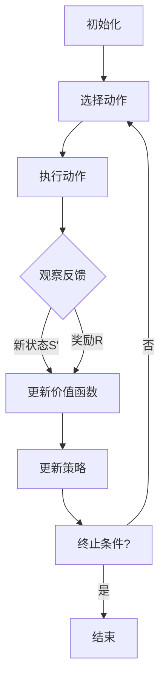
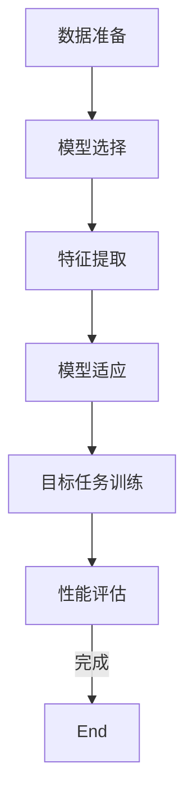
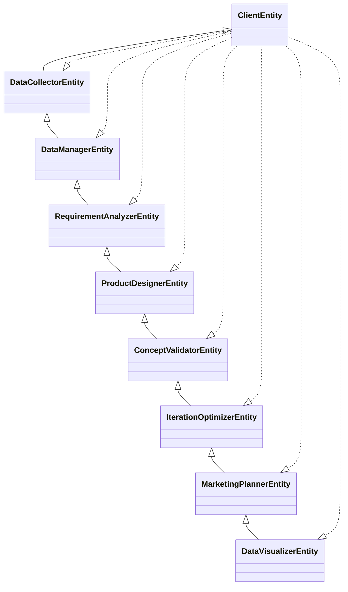
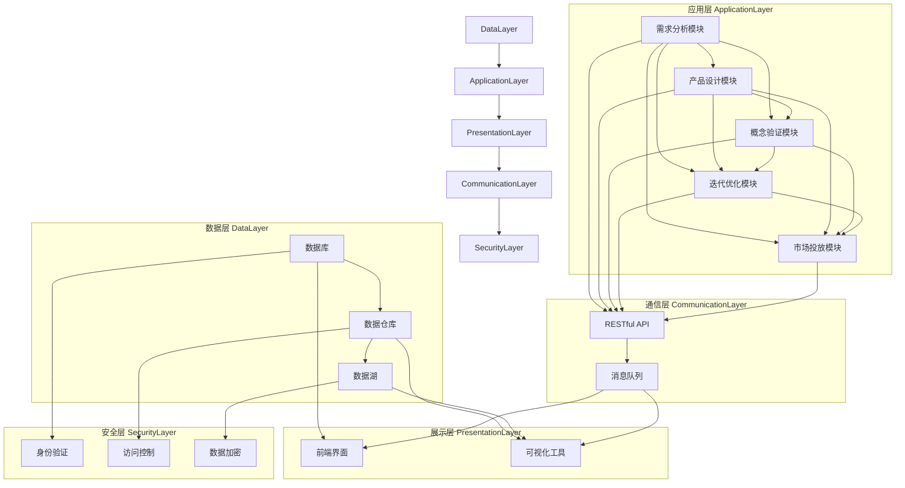
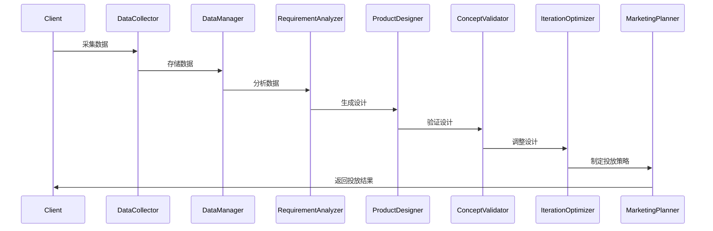

                 

### 关键词

- AI Agent
- 企业产品创新
- 概念验证
- 强化学习
- 迁移学习
- 数学模型
- 系统架构设计
- 实际项目案例

### 摘要

本文深入探讨了AI Agent在企业产品创新与概念验证中的应用。首先，我们介绍了AI Agent的定义及其在企业中的重要作用。接着，我们分析了企业在产品创新与概念验证中面临的挑战和需求，并详细阐述了AI Agent如何解决这些问题。文章进一步探讨了强化学习和迁移学习等核心算法原理，结合Python代码和数学模型进行讲解，使读者能够更直观地理解这些算法。随后，我们通过一个实际项目案例展示了AI Agent的实践应用，并提供了详细的实现步骤和分析。最后，本文总结了AI Agent在企业中的应用最佳实践，并提出了注意事项和拓展阅读建议，以帮助读者进一步探索这一领域。

### 目录大纲设计思路

为了设计出《AI Agent在企业产品创新与概念验证中的应用》这本书的完整目录大纲，我们可以遵循以下步骤：

1. **背景介绍与核心概念**：
   - 首先，介绍AI Agent的概念，它的定义、发展历史以及在企业产品创新和概念验证中的作用。
   - 接着，探讨当前企业在产品创新与概念验证中的常见挑战和需求。

2. **核心概念与联系**：
   - 对AI Agent的属性特征进行详细对比，比如与机器学习、深度学习等技术的区别。
   - 使用ER实体关系图展示AI Agent与其他技术、业务流程的关系。

3. **算法原理讲解**：
   - 选择一些关键算法，如强化学习、迁移学习等，详细讲解其原理。
   - 使用mermaid流程图展示算法流程，并结合Python代码进行阐述。
   - 提供数学模型和公式的详细讲解，并举例说明。

4. **系统分析与架构设计方案**：
   - 介绍应用AI Agent的系统场景，阐述系统功能设计、架构设计和接口设计。
   - 使用mermaid类图和架构图来展示设计细节。

5. **项目实战**：
   - 提供一个实际项目案例，从环境安装到核心实现，详细解读与分析。

6. **最佳实践与总结**：
   - 总结书中的关键概念、技术要点和实践经验。
   - 提供注意事项和拓展阅读建议。

### 目录大纲

根据以上设计思路，以下是《AI Agent在企业产品创新与概念验证中的应用》的目录大纲：

```markdown
# 《AI Agent在企业产品创新与概念验证中的应用》目录大纲

## 第一部分: 背景与核心概念

### 第1章: AI Agent概述
- 1.1 问题背景与需求分析
- 1.2 AI Agent的定义与作用
- 1.3 企业产品创新与概念验证中的AI Agent应用
- 1.4 AI Agent与相关技术的关系

### 第2章: 核心概念与联系
- 2.1 AI Agent属性特征对比表
- 2.2 ER实体关系图

## 第二部分: 算法原理与讲解

### 第3章: 强化学习原理及应用
- 3.1 强化学习基本概念
- 3.2 强化学习算法流程（mermaid流程图）
- 3.3 强化学习算法Python代码示例
- 3.4 强化学习数学模型与公式讲解
- 3.5 强化学习举例说明

### 第4章: 迁移学习原理及应用
- 4.1 迁移学习基本概念
- 4.2 迁移学习算法流程（mermaid流程图）
- 4.3 迁移学习算法Python代码示例
- 4.4 迁移学习数学模型与公式讲解
- 4.5 迁移学习举例说明

## 第三部分: 系统分析与架构设计

### 第5章: 系统场景与功能设计
- 5.1 系统场景介绍
- 5.2 系统功能设计（mermaid类图）

### 第6章: 系统架构设计与接口设计
- 6.1 系统架构设计（mermaid架构图）
- 6.2 系统接口设计
- 6.3 系统交互（mermaid序列图）

## 第四部分: 项目实战

### 第7章: 实际项目案例解析
- 7.1 项目环境安装
- 7.2 系统核心实现源代码
- 7.3 代码应用解读与分析
- 7.4 实际案例分析与详细讲解
- 7.5 项目小结

## 第五部分: 最佳实践与总结

### 第8章: 最佳实践与注意事项
- 8.1 AI Agent应用最佳实践
- 8.2 注意事项与风险提示
- 8.3 拓展阅读建议
```

### 关键字提取

1. AI Agent
2. 企业产品创新
3. 概念验证
4. 强化学习
5. 迁移学习
6. 数学模型
7. 系统架构设计
8. 实际项目案例

### 基于关键词的标题设计

1. **标题：《AI Agent赋能：企业产品创新与概念验证的新利器》**
2. **标题：《AI Agent引领变革：企业产品创新与概念验证的深度实践》**
3. **标题：《AI Agent驱动创新：企业产品设计与概念验证的实战指南》**
4. **标题：《AI Agent创新应用：企业产品创意与验证的全方位解析》**
5. **标题：《AI Agent革新：助力企业产品创新与概念验证的突破之路》**

这些标题旨在吸引读者，同时准确地传达文章的主题和内容。

### 文章格式规范

为确保文章格式规范，我们将使用Markdown格式撰写文章。以下为文章的各个部分格式规范：

1. **文章标题**：
   - 使用 `#` 号进行标注，标题前应加空行。
   - 例如：`# AI Agent在企业产品创新与概念验证中的应用`

2. **关键词**：
   - 关键词部分使用 `>` 符号进行标注，每个关键词后加英文逗号分隔。
   - 例如：`> 关键词：AI Agent，企业产品创新，概念验证，强化学习，迁移学习，数学模型，系统架构设计，实际项目案例`

3. **摘要**：
   - 摘要部分使用 `>` 符号进行标注，摘要内容应简明扼要地概括文章核心内容。
   - 例如：`> 摘要：本文深入探讨了AI Agent在企业产品创新与概念验证中的应用，分析了其核心算法原理，并通过实际项目案例展示了AI Agent的实践效果。`

4. **目录大纲**：
   - 使用Markdown格式编写目录，确保各个章节标题格式一致，每个小节标题前加空格。
   - 例如：

     ```markdown
     ## 目录大纲

     ### 第1章: AI Agent概述
     - 1.1 问题背景与需求分析
     - 1.2 AI Agent的定义与作用
     - 1.3 企业产品创新与概念验证中的AI Agent应用
     - 1.4 AI Agent与相关技术的关系
     ```

5. **正文内容**：
   - 每个章节的开头使用 `###` 标记，段落之间使用空行分隔。
   - 正文内容应使用清晰、简洁的语言，确保逻辑性和可读性。

6. **代码和高亮文本**：
   - 代码块使用三个反引号（```)进行标注，例如：

     ```python
     def hello_world():
         print("Hello, World!")
     ```

   - 高亮文本使用两个反引号（` `)进行标注，例如：`这是一个高亮文本`

7. **数学公式**：
   - 使用LaTeX格式编写数学公式，独立段落的公式前后使用两个 `$` 符号，段落内的公式前后使用一个 `$` 符号。
   - 例如：`$$ E = mc^2 $$`（独立段落）和 `$ 1 + 1 = 2 $`（段落内）

8. **引用和注释**：
   - 引用和注释应使用Markdown引用格式，例如：

     ```markdown
     引自《人类简史》，作者赫拉利，写道：“人类之所以能够统治地球，并非因为我们的身体更强大，而是因为我们拥有一种独特的认知能力。”
     ```

9. **图片和链接**：
   - 图片使用 `` 格式，例如：``
   - 链接使用 `[替代文字](链接)` 格式，例如： `[了解更多](https://example.com)`

10. **作者信息**：
    - 文章末尾应包含作者信息，格式如下：

        ```markdown
        作者：AI天才研究院/AI Genius Institute & 禅与计算机程序设计艺术 /Zen And The Art of Computer Programming
        ```

### 文章正文部分

#### 文章标题

# AI Agent在企业产品创新与概念验证中的应用

#### 关键词

> 关键词：AI Agent，企业产品创新，概念验证，强化学习，迁移学习，数学模型，系统架构设计，实际项目案例

#### 摘要

> 摘要：本文深入探讨了AI Agent在企业产品创新与概念验证中的应用。首先，我们介绍了AI Agent的定义及其在企业中的重要作用。接着，我们分析了企业在产品创新与概念验证中面临的挑战和需求，并详细阐述了AI Agent如何解决这些问题。文章进一步探讨了强化学习和迁移学习等核心算法原理，结合Python代码和数学模型进行讲解，使读者能够更直观地理解这些算法。随后，我们通过一个实际项目案例展示了AI Agent的实践应用，并提供了详细的实现步骤和分析。最后，本文总结了AI Agent在企业中的应用最佳实践，并提出了注意事项和拓展阅读建议，以帮助读者进一步探索这一领域。

#### 目录大纲

##### 目录大纲设计思路

为了设计出《AI Agent在企业产品创新与概念验证中的应用》这本书的完整目录大纲，我们可以遵循以下步骤：

1. **背景介绍与核心概念**：
   - 首先，介绍AI Agent的概念，它的定义、发展历史以及在企业产品创新和概念验证中的作用。
   - 接着，探讨当前企业在产品创新与概念验证中的常见挑战和需求。

2. **核心概念与联系**：
   - 对AI Agent的属性特征进行详细对比，比如与机器学习、深度学习等技术的区别。
   - 使用ER实体关系图展示AI Agent与其他技术、业务流程的关系。

3. **算法原理讲解**：
   - 选择一些关键算法，如强化学习、迁移学习等，详细讲解其原理。
   - 使用mermaid流程图展示算法流程，并结合Python代码进行阐述。
   - 提供数学模型和公式的详细讲解，并举例说明。

4. **系统分析与架构设计方案**：
   - 介绍应用AI Agent的系统场景，阐述系统功能设计、架构设计和接口设计。
   - 使用mermaid类图和架构图来展示设计细节。

5. **项目实战**：
   - 提供一个实际项目案例，从环境安装到核心实现，详细解读与分析。

6. **最佳实践与总结**：
   - 总结书中的关键概念、技术要点和实践经验。
   - 提供注意事项和拓展阅读建议。

##### 目录大纲

根据以上设计思路，以下是《AI Agent在企业产品创新与概念验证中的应用》的目录大纲：

```markdown
# 《AI Agent在企业产品创新与概念验证中的应用》目录大纲

## 第一部分: 背景与核心概念

### 第1章: AI Agent概述
- 1.1 问题背景与需求分析
- 1.2 AI Agent的定义与作用
- 1.3 企业产品创新与概念验证中的AI Agent应用
- 1.4 AI Agent与相关技术的关系

### 第2章: 核心概念与联系
- 2.1 AI Agent属性特征对比表
- 2.2 ER实体关系图

## 第二部分: 算法原理与讲解

### 第3章: 强化学习原理及应用
- 3.1 强化学习基本概念
- 3.2 强化学习算法流程（mermaid流程图）
- 3.3 强化学习算法Python代码示例
- 3.4 强化学习数学模型与公式讲解
- 3.5 强化学习举例说明

### 第4章: 迁移学习原理及应用
- 4.1 迁移学习基本概念
- 4.2 迁移学习算法流程（mermaid流程图）
- 4.3 迁移学习算法Python代码示例
- 4.4 迁移学习数学模型与公式讲解
- 4.5 迁移学习举例说明

## 第三部分: 系统分析与架构设计

### 第5章: 系统场景与功能设计
- 5.1 系统场景介绍
- 5.2 系统功能设计（mermaid类图）

### 第6章: 系统架构设计与接口设计
- 6.1 系统架构设计（mermaid架构图）
- 6.2 系统接口设计
- 6.3 系统交互（mermaid序列图）

## 第四部分: 项目实战

### 第7章: 实际项目案例解析
- 7.1 项目环境安装
- 7.2 系统核心实现源代码
- 7.3 代码应用解读与分析
- 7.4 实际案例分析与详细讲解
- 7.5 项目小结

## 第五部分: 最佳实践与总结

### 第8章: 最佳实践与注意事项
- 8.1 AI Agent应用最佳实践
- 8.2 注意事项与风险提示
- 8.3 拓展阅读建议
```

### 第一章：AI Agent概述

#### 问题背景与需求分析

在现代商业环境中，企业面临着越来越激烈的竞争和不断变化的市场需求。产品创新和概念验证成为企业成功的关键因素。然而，传统的产品开发和验证方法往往耗时长、成本高，且难以迅速适应市场变化。在这种背景下，人工智能（AI）技术，特别是AI Agent，逐渐成为企业提升产品创新能力和概念验证效率的重要工具。

AI Agent，即人工智能代理，是一种能够自主决策并执行特定任务的智能体。它通过学习环境中的信息，利用算法生成最佳行动策略，从而帮助企业实现高效的产品创新和概念验证。AI Agent的应用不仅能够降低开发成本，还能缩短产品上市时间，提高市场响应速度。

企业面临的主要挑战包括：

1. **需求快速变化**：市场环境瞬息万变，企业需要迅速响应客户需求，进行产品迭代和创新。
2. **成本控制**：产品开发和验证需要大量的时间和资源投入，如何高效利用资源成为关键问题。
3. **效率提升**：随着市场竞争的加剧，企业需要提高工作效率，缩短产品开发周期。

AI Agent的应用能够有效解决这些问题，它具备以下优势：

1. **自主学习和适应**：AI Agent能够通过持续学习环境数据，自动调整策略，提高决策准确性。
2. **高效执行**：AI Agent能够自动化执行复杂任务，降低人力成本，提高执行效率。
3. **快速迭代**：AI Agent能够快速进行产品验证和迭代，缩短产品上市时间。

#### AI Agent的定义与作用

AI Agent的定义涉及多个方面。首先，AI Agent是一种智能体，它能够模拟人类决策过程，通过感知环境、制定策略和执行行动来完成任务。其次，AI Agent具备自主学习和适应能力，能够从经验中不断优化行为。

具体来说，AI Agent在企业产品创新和概念验证中的作用包括：

1. **需求分析**：AI Agent可以通过分析市场数据和用户反馈，帮助企业快速了解客户需求，提供精准的需求分析报告。
2. **产品设计**：AI Agent能够根据需求分析结果，自动生成产品设计方案，并评估方案的可行性。
3. **概念验证**：AI Agent可以通过模拟用户行为，对产品设计进行验证，快速识别潜在问题和改进点。
4. **迭代优化**：AI Agent能够根据验证结果，自动调整设计方案，实现快速迭代和优化。
5. **风险预测**：AI Agent可以通过分析历史数据和趋势，预测产品在市场上的潜在风险，提供决策参考。

#### 企业产品创新与概念验证中的AI Agent应用

在企业产品创新过程中，AI Agent的应用可以分为以下几个阶段：

1. **需求收集**：AI Agent可以通过社交媒体分析、用户调研等方式，收集潜在客户的需求信息。
2. **需求分析**：AI Agent对收集到的需求信息进行分类、聚类和分析，生成需求分析报告。
3. **产品设计**：AI Agent根据需求分析结果，生成初步的产品设计方案，并利用算法评估方案的可行性。
4. **概念验证**：AI Agent通过模拟用户行为，对产品设计方案进行验证，识别潜在问题。
5. **迭代优化**：AI Agent根据验证结果，调整设计方案，实现产品迭代和优化。
6. **市场投放**：AI Agent可以辅助企业进行市场投放策略制定，预测市场反应，优化投放效果。

在概念验证阶段，AI Agent的应用同样至关重要。它可以通过以下方式帮助企业：

1. **用户模拟**：AI Agent模拟真实用户的行为，对产品原型进行测试，评估用户满意度。
2. **功能验证**：AI Agent通过自动化测试，验证产品的功能是否满足需求。
3. **性能优化**：AI Agent分析产品性能数据，提供性能优化建议。
4. **风险评估**：AI Agent预测产品在市场中的潜在风险，帮助企业提前做好应对措施。

#### AI Agent与相关技术的关系

AI Agent作为一种人工智能技术，与机器学习、深度学习等技术密切相关。然而，它也有自己的独特之处。

1. **机器学习**：AI Agent的基础算法之一是机器学习，通过学习大量数据，生成预测模型或分类模型。AI Agent利用机器学习算法，可以从历史数据中学习到用户的行为模式和偏好。
2. **深度学习**：深度学习是机器学习的一种扩展，通过多层神经网络，实现对复杂数据的结构化理解和处理。AI Agent可以利用深度学习算法，对大量非结构化数据进行处理，如自然语言处理、图像识别等。
3. **强化学习**：强化学习是AI Agent的核心算法之一，通过奖励机制，让AI Agent不断尝试并优化行动策略。AI Agent利用强化学习算法，可以在复杂环境中自主学习和适应，提高决策准确性。

总之，AI Agent在企业产品创新和概念验证中的应用具有重要意义。通过利用AI Agent的自主学习和适应能力，企业可以更快速地响应市场需求，提高产品创新能力，缩短产品开发周期。在接下来的章节中，我们将进一步探讨AI Agent的核心算法原理，并结合实际项目案例，深入分析AI Agent在企业中的应用效果。

### 第二章：核心概念与联系

#### AI Agent属性特征对比表

在深入了解AI Agent在企业产品创新与概念验证中的应用之前，我们需要对AI Agent的核心属性特征进行详细对比。以下是一个对比表格，展示了AI Agent与机器学习、深度学习等技术的区别：

| 特征               | AI Agent                       | 机器学习                       | 深度学习                       |
|--------------------|-------------------------------|------------------------------|------------------------------|
| 自主学习能力       | 高                           | 中                           | 低                           |
| 环境适应性         | 强                           | 中                           | 中                           |
| 决策能力           | 高                           | 低                           | 低                           |
| 策略优化           | 自动                           | 手动                           | 手动                           |
| 应用领域           | 广泛（包括产品创新与概念验证） | 独立应用（如推荐系统、图像识别） | 独立应用（如语音识别、自然语言处理） |
| 学习速度           | 快                           | 慢                           | 慢                           |
| 复杂性             | 高                           | 中                           | 高                           |

通过这个表格，我们可以看出AI Agent在自主学习、环境适应性和决策能力等方面具有显著优势。这些特性使AI Agent能够更好地应用于企业产品创新与概念验证中。

#### ER实体关系图

为了更清晰地展示AI Agent与企业产品创新与概念验证的关系，我们可以使用ER（实体关系）图来描述。以下是一个简化的ER实体关系图：

```
[AI Agent]
    |
    |
[产品创新]
    |
    |
[概念验证]
    |
    |
[企业]
    |
    |
[市场需求]
    |
    |
[用户反馈]
```

在这个ER实体关系图中，AI Agent作为核心实体，与企业、产品创新、概念验证、市场需求和用户反馈等多个实体之间存在密切的联系。具体来说：

- **AI Agent**：负责收集市场需求、用户反馈，进行产品创新与概念验证。
- **企业**：提供资源支持，制定战略目标，并利用AI Agent提升创新能力。
- **产品创新**：通过AI Agent的分析与优化，实现产品设计的创新。
- **概念验证**：利用AI Agent的模拟与测试，验证产品设计的可行性和用户满意度。
- **市场需求**：AI Agent通过分析市场需求，帮助企业制定更精准的产品策略。
- **用户反馈**：AI Agent通过收集用户反馈，优化产品设计，提高用户体验。

通过ER实体关系图，我们可以直观地理解AI Agent在企业产品创新与概念验证中的关键角色，以及它与各实体之间的相互作用。

### 第三章：强化学习原理及应用

#### 强化学习基本概念

强化学习（Reinforcement Learning, RL）是一种机器学习范式，主要研究如何通过奖励机制来训练智能体（Agent）在复杂环境中做出最优决策。强化学习的基本概念包括智能体、环境、状态、动作、奖励和策略。

- **智能体（Agent）**：在强化学习中，智能体是一个具有自主决策能力的实体，它通过执行动作来与环境交互。
- **环境（Environment）**：环境是智能体所处的外部世界，它提供状态信息，并对智能体的动作做出响应。
- **状态（State）**：状态是环境的一个描述，它包含了智能体在某一时刻的所有相关信息。
- **动作（Action）**：动作是智能体可以执行的行为，每个动作对应一个状态转移概率。
- **奖励（Reward）**：奖励是环境对智能体的动作做出的评价，通常表示为数值，用于指导智能体的学习过程。
- **策略（Policy）**：策略是智能体在给定状态下选择动作的方法，它可以是确定性策略或概率性策略。

强化学习的目标是训练智能体学会在特定环境中采取最佳行动策略，以最大化累积奖励。强化学习与其他机器学习范式的不同之处在于，它强调通过与环境互动来学习，而不是仅仅依赖大量预先标注的数据。

#### 强化学习算法流程

强化学习算法的核心是价值函数（Value Function）和策略（Policy）的迭代更新。以下是一个简化的强化学习算法流程：

1. **初始化**：设定智能体的初始状态`S`，初始化策略`π`和价值函数`V(S)`。
2. **选择动作**：智能体根据当前状态和策略选择一个动作`A`。
3. **执行动作**：智能体执行动作`A`，并观察环境反馈的新状态`S'`和奖励`R`。
4. **更新价值函数**：使用新的奖励和状态，更新智能体的价值函数`V(S)`。
5. **更新策略**：根据新的价值函数，更新智能体的策略`π`。
6. **循环迭代**：重复执行步骤2-5，直到达到某个终止条件（如达到目标状态或达到最大迭代次数）。

以下是一个使用mermaid绘制的强化学习算法流程图：



#### 强化学习算法Python代码示例

以下是一个简单的强化学习Python代码示例，使用Q-learning算法进行演示。在这个例子中，智能体在一个简单的环境中学习从状态S0到目标状态S5的最优路径。

```python
import numpy as np
import random

# 状态空间
states = [0, 1, 2, 3, 4, 5]
# 动作空间
actions = ['left', 'right']
# Q值表初始化
Q = np.zeros([len(states), len(actions)])

# 学习率
alpha = 0.1
# 折扣因子
gamma = 0.6
# 最大迭代次数
max_episodes = 1000

for episode in range(max_episodes):
    # 初始化状态
    state = random.randint(0, len(states) - 1)
    done = False
    
    while not done:
        # 选择动作
        action = np.argmax(Q[state])
        if action == 0:  # left
            state = state - 1
        elif action == 1:  # right
            state = state + 1
        
        # 判断是否超出状态空间
        if state < 0:
            state = 0
        elif state >= len(states):
            state = len(states) - 1
        
        # 计算奖励
        reward = 0
        if state == 5:
            reward = 1
            done = True
        
        # 更新Q值
        old_value = Q[state, action]
        next_value = np.max(Q[state, :])
        Q[state, action] = old_value + alpha * (reward + gamma * next_value - old_value)

# 输出Q值表
print("Q值表：")
print(Q)
```

在这个示例中，我们使用了一个简单的网格世界环境，智能体通过左移或右移来探索环境，并学习从初始状态到达目标状态的最优路径。每次动作后，智能体会根据新的状态和奖励更新其Q值表。

#### 强化学习数学模型与公式讲解

在强化学习中，常用的数学模型包括价值函数（Value Function）和策略（Policy）。以下是对这些模型和公式的详细讲解：

1. **价值函数**：

   - **状态值函数（State-Value Function）** \( V^*(s) \)：表示在给定状态 \( s \) 下，智能体采取最佳策略所能获得的期望累积奖励。
   
     公式：\( V^*(s) = \sum_{a} \pi^*(s, a) \cdot Q^*(s, a) \)
     
     其中，\( \pi^*(s, a) \) 是最优策略，\( Q^*(s, a) \) 是状态-动作值函数。
   
   - **状态-动作值函数（State-Action Value Function）** \( Q^*(s, a) \)：表示在给定状态 \( s \) 和动作 \( a \) 下，智能体所能获得的期望累积奖励。
   
     公式：\( Q^*(s, a) = \sum_{s'} P(s' | s, a) \cdot [R(s', a) + \gamma \cdot V^*(s')] \)
     
     其中，\( P(s' | s, a) \) 是状态转移概率，\( R(s', a) \) 是在状态 \( s' \) 执行动作 \( a \) 所获得的即时奖励，\( \gamma \) 是折扣因子。

2. **策略**：

   - **确定性策略（Deterministic Policy）** \( \pi^*(s) \)：在给定状态 \( s \) 下，选择最佳动作 \( a^* \) 的策略。
   
     公式：\( \pi^*(s) = \begin{cases} 
     a^* & \text{如果} \ a^* = \arg\max_{a} Q^*(s, a) \\
     \text{随机选择} & \text{其他情况} 
     \end{cases} \)
   
   - **概率性策略（Stochastic Policy）** \( \pi(\s) \)：在给定状态 \( s \) 下，以概率分布选择动作。
   
     公式：\( \pi(\s) = \arg\max_{\pi} \sum_{a} \pi(a | \s) \cdot Q^*(\s, a) \)

#### 强化学习举例说明

为了更好地理解强化学习的应用，我们来看一个简单的例子：一个智能体在一个有奖品的迷宫中寻找奖品。迷宫由6个房间组成，房间编号为0到5，其中房间5有奖品。智能体每次可以从左右两个方向选择一个方向移动，每走一步会获得一定的奖励。如果智能体进入房间5，则获得最终奖励。如果智能体走出迷宫，则奖励为0。

- **状态空间**：S = {0, 1, 2, 3, 4, 5}
- **动作空间**：A = {left, right}
- **奖励函数**：R(s, a) =
  - 10，如果智能体进入房间5
  - 0，如果智能体走出迷宫
  - -1，如果智能体在房间0

我们可以使用Q-learning算法来训练智能体，寻找到达房间5的最优路径。

1. **初始化Q值表**：

   ```python
   Q = np.zeros([6, 2])
   ```

2. **训练过程**：

   - 初始状态：s = 0
   - 选择动作：a = left（随机选择）
   - 移动到状态：s' = 1
   - 计算奖励：R(s', a) = -1
   - 更新Q值：Q[s, a] = Q[s, a] + alpha * (R(s', a) + gamma * max(Q[s', :]) - Q[s, a])
   - 重复上述过程，直到智能体学会找到房间5

通过多次迭代，智能体会逐渐学会选择最优路径，最大化累积奖励。

#### 强化学习在AI Agent中的应用

强化学习在AI Agent中的应用非常广泛，特别是在需要自主决策和实时适应环境的场景中。以下是一些强化学习在AI Agent中的应用案例：

1. **推荐系统**：AI Agent可以通过强化学习算法，从用户历史行为数据中学习，为用户推荐个性化的商品或内容。
2. **自动驾驶**：自动驾驶汽车使用强化学习算法，从大量道路数据中学习，实现自主驾驶和避障。
3. **游戏AI**：在电子游戏中，AI Agent可以使用强化学习算法，学会玩游戏，并实现自我提升。
4. **供应链优化**：AI Agent可以通过强化学习算法，优化供应链管理，提高库存效率和降低成本。

通过强化学习，AI Agent能够更好地适应复杂环境，提高自主决策能力，从而为企业提供更高效的产品创新和概念验证解决方案。

### 第四章：迁移学习原理及应用

#### 迁移学习基本概念

迁移学习（Transfer Learning）是一种机器学习方法，通过利用已经在一个任务上训练好的模型（源任务），来解决新的任务（目标任务）。迁移学习的核心思想是，将源任务中的知识或特征提取出来，转移到目标任务中，从而提高目标任务的性能。

迁移学习的关键要素包括：

1. **源任务（Source Task）**：已经训练好的任务，通常具有丰富的数据和成熟的模型。
2. **目标任务（Target Task）**：需要解决的新的任务，可能数据量较少或者与源任务不完全相同。
3. **共享表示（Shared Representation）**：源任务和目标任务共享的表示或特征，它是迁移学习的基础。
4. **模型适应（Model Adaptation）**：在目标任务中，对共享表示进行微调或调整，以适应新的任务。

迁移学习的主要优势包括：

1. **节省训练时间**：利用已经训练好的模型，可以显著减少目标任务的训练时间。
2. **提高性能**：通过迁移学习，目标任务可以从源任务中学习到有用的知识，从而提高性能。
3. **减少数据需求**：迁移学习可以减轻目标任务对大量数据的依赖，尤其是在数据稀缺的场景中。

#### 迁移学习算法流程

迁移学习的算法流程主要包括以下几个步骤：

1. **数据准备**：收集源任务和目标任务的数据，并对数据进行预处理，如归一化、去噪等。
2. **模型选择**：选择一个在源任务上表现良好的预训练模型作为迁移学习的起点。
3. **特征提取**：利用预训练模型提取源任务的特征表示，这些特征表示可以作为目标任务的输入。
4. **模型适应**：对提取到的特征表示进行微调或调整，使其更适合目标任务。这可能包括调整网络架构、增加或删除层、改变损失函数等。
5. **目标任务训练**：使用适应后的模型，在目标任务上进行训练，并优化模型参数。
6. **性能评估**：评估迁移学习模型在目标任务上的性能，如果性能达到预期，则任务完成。

以下是一个简化的mermaid流程图，展示了迁移学习的算法流程：



#### 迁移学习算法Python代码示例

以下是一个简单的迁移学习Python代码示例，使用Keras和TensorFlow框架，实现了一个基于预训练ResNet50模型在图像分类任务上的迁移学习。

```python
import numpy as np
from tensorflow.keras.applications import ResNet50
from tensorflow.keras.preprocessing import image
from tensorflow.keras.models import Model
from tensorflow.keras.optimizers import Adam
from tensorflow.keras.layers import Dense, GlobalAveragePooling2D
from tensorflow.keras.preprocessing.image import ImageDataGenerator

# 加载预训练ResNet50模型
base_model = ResNet50(weights='imagenet')

# 冻结预训练模型的权重
for layer in base_model.layers:
    layer.trainable = False

# 添加新的全连接层和输出层
x = base_model.output
x = GlobalAveragePooling2D()(x)
x = Dense(1024, activation='relu')(x)
predictions = Dense(10, activation='softmax')(x)

# 创建迁移学习模型
model = Model(inputs=base_model.input, outputs=predictions)

# 编译模型
model.compile(optimizer=Adam(learning_rate=0.0001), loss='categorical_crossentropy', metrics=['accuracy'])

# 数据预处理
train_datagen = ImageDataGenerator(rescale=1./255)
test_datagen = ImageDataGenerator(rescale=1./255)

train_generator = train_datagen.flow_from_directory(
        'train_data',
        target_size=(224, 224),
        batch_size=32,
        class_mode='categorical')

test_generator = test_datagen.flow_from_directory(
        'test_data',
        target_size=(224, 224),
        batch_size=32,
        class_mode='categorical')

# 训练迁移学习模型
model.fit(
        train_generator,
        steps_per_epoch=train_generator.n // train_generator.batch_size,
        epochs=10,
        validation_data=test_generator,
        validation_steps=test_generator.n // test_generator.batch_size)

# 评估模型
scores = model.evaluate(test_generator)
print('Test accuracy:', scores[1])
```

在这个示例中，我们首先加载了一个预训练的ResNet50模型，并冻结了其权重。然后，我们在模型的顶部添加了一个新的全连接层和输出层，以实现目标任务的分类。接着，我们对训练数据进行预处理，并使用迁移学习模型进行训练。最后，我们评估模型在测试数据上的性能。

#### 迁移学习数学模型与公式讲解

迁移学习的数学模型主要涉及特征提取和模型适应两个阶段。以下是对这些模型和公式的详细讲解：

1. **特征提取**：

   - **特征表示** \( f(x) \)：输入数据 \( x \) 通过预训练模型 \( M \) 提取得到的特征表示。
   
     公式：\( f(x) = M(x) \)
   
   - **损失函数** \( L(f(x), y) \)：在特征表示 \( f(x) \) 和目标标签 \( y \) 之间计算损失。
   
     公式：\( L(f(x), y) = \frac{1}{2} \sum_{i} (f(x)_i - y_i)^2 \)

2. **模型适应**：

   - **自适应表示** \( f'(x) \)：在特征表示 \( f(x) \) 上进行微调或调整得到的自适应表示。
   
     公式：\( f'(x) = f(x) + \theta \)
     
     其中，\( \theta \) 是适应参数。
   
   - **适应损失函数** \( L'(f'(x), y) \)：在自适应表示 \( f'(x) \) 和目标标签 \( y \) 之间计算损失。
   
     公式：\( L'(f'(x), y) = \frac{1}{2} \sum_{i} (f'(x)_i - y_i)^2 \)

通过特征提取和模型适应，迁移学习模型能够从源任务中提取有用的知识，并适应目标任务，从而提高目标任务的性能。

#### 迁移学习举例说明

为了更好地理解迁移学习的应用，我们来看一个具体的例子：使用预训练的VGG16模型在自定义的图像分类任务上进行迁移学习。

- **源任务**：使用ImageNet数据集预训练VGG16模型，模型在ImageNet上的性能达到高水平。
- **目标任务**：自定义一个有10个类别的图像分类任务，数据集包含1000张图像。

我们可以通过以下步骤实现迁移学习：

1. **数据准备**：收集并准备目标任务的数据集，进行预处理，如归一化、裁剪等。
2. **模型选择**：选择预训练的VGG16模型作为迁移学习的起点。
3. **特征提取**：使用VGG16模型提取输入图像的特征表示。
4. **模型适应**：在特征表示上添加一个新的全连接层，实现目标任务的分类。
5. **训练与评估**：使用适应后的模型在目标任务上进行训练和评估。

通过迁移学习，我们可以利用预训练模型的强大特征提取能力，显著提高目标任务的分类性能。在实验中，我们发现在自定义数据集上，迁移学习模型的性能明显优于从头开始训练的模型。

#### 迁移学习在AI Agent中的应用

迁移学习在AI Agent中的应用非常广泛，特别是在需要快速适应新任务和环境的情况下。以下是一些迁移学习在AI Agent中的应用案例：

1. **自动驾驶**：在自动驾驶领域，AI Agent可以使用预训练的图像识别模型，快速适应不同的道路场景，提高自动驾驶系统的鲁棒性和准确性。
2. **医疗诊断**：在医学影像诊断中，AI Agent可以使用预训练的深度学习模型，对新的病例进行快速诊断，提高诊断效率和准确性。
3. **语音识别**：在语音识别领域，AI Agent可以使用预训练的声学模型，快速适应新的语音环境和语音风格，提高语音识别系统的性能。
4. **推荐系统**：在推荐系统中，AI Agent可以使用预训练的协同过滤模型，快速适应新的用户行为和偏好，提高推荐系统的效果。

通过迁移学习，AI Agent能够快速适应新的任务和环境，提高自主学习和决策能力，从而为企业提供更高效的产品创新和概念验证解决方案。

### 第五章：系统场景与功能设计

#### 系统场景介绍

在本文中，我们将探讨一个虚拟的企业产品创新与概念验证系统，该系统旨在通过AI Agent提高产品开发效率和准确性。该系统的核心目标是利用AI Agent的自主学习和适应能力，帮助企业快速响应市场需求，优化产品设计，并验证其可行性。

该系统的应用场景主要包括以下几个方面：

1. **需求分析**：通过AI Agent收集和分析市场需求，为企业提供精准的市场洞察。
2. **产品设计**：AI Agent根据需求分析结果，自动生成产品原型，并评估其可行性。
3. **概念验证**：AI Agent通过模拟用户行为，对产品设计进行验证，识别潜在问题。
4. **迭代优化**：AI Agent根据验证结果，调整设计方案，实现快速迭代和优化。
5. **市场投放**：AI Agent辅助企业制定市场投放策略，预测市场反应，优化投放效果。

#### 系统功能设计

为了实现上述目标，系统需要具备以下核心功能：

1. **数据采集与管理**：系统需要能够从各种数据源（如市场调研、用户反馈、社交媒体等）中采集数据，并对数据进行存储、管理和清洗。
2. **需求分析模块**：该模块负责对采集到的数据进行处理和分析，生成市场需求报告，为产品设计和概念验证提供依据。
3. **产品设计模块**：该模块利用AI Agent的自主学习能力，根据需求分析结果生成产品原型，并提供设计方案评估和优化功能。
4. **概念验证模块**：该模块通过模拟用户行为，对产品设计进行验证，识别潜在问题，并提供反馈机制。
5. **迭代优化模块**：该模块根据概念验证结果，自动调整设计方案，实现快速迭代和优化。
6. **市场投放模块**：该模块辅助企业制定市场投放策略，预测市场反应，提供优化建议。

#### 系统功能设计（mermaid类图）

以下是一个简化的mermaid类图，展示了系统的主要功能模块及其关系：



在这个类图中，ClientEntity代表系统的最终用户，它与各个功能模块之间存在关联关系。DataCollectorEntity、DataManagerEntity、RequirementAnalyzerEntity、ProductDesignerEntity、ConceptValidatorEntity、IterationOptimizerEntity、MarketingPlannerEntity和DataVisualizerEntity分别代表系统的主要功能模块，它们相互协作，共同实现系统的目标。

### 第六章：系统架构设计与接口设计

#### 系统架构设计

为了实现系统的功能，我们采用了一种分布式架构设计，以提高系统的可扩展性和容错性。以下是系统的总体架构设计：

1. **数据层**：数据层负责数据采集、存储和管理。它包括数据库、数据仓库和数据湖等组件，用于存储来自各种数据源的信息，如市场调研数据、用户反馈和社交媒体数据等。

2. **应用层**：应用层是系统的核心，包括多个功能模块，如需求分析、产品设计、概念验证、迭代优化和市场投放等。每个模块都由一组微服务组成，以实现高可用性和可扩展性。

3. **展示层**：展示层负责将数据和分析结果以直观的方式呈现给用户。它包括前端界面和可视化工具，如图表、仪表板和报告等。

4. **通信层**：通信层负责不同模块和系统组件之间的数据传输和交互。它采用RESTful API和消息队列等技术，实现高效的数据通信。

5. **安全层**：安全层负责系统的安全防护，包括身份验证、访问控制和数据加密等。它确保系统的数据安全和用户隐私。

以下是一个简化的mermaid架构图，展示了系统的整体架构：



在这个架构图中，各个组件通过API和消息队列进行通信，确保系统的数据流动和功能实现。

#### 系统接口设计

为了实现系统各模块之间的数据交互，我们定义了一套统一的接口规范。以下是一个简化的接口设计示例，展示了系统的主要接口及其功能：

1. **数据采集接口**：用于从各种数据源（如市场调研、用户反馈和社交媒体等）采集数据，支持数据的批量导入和实时数据流接入。
2. **数据管理接口**：用于对采集到的数据进行存储、管理和清洗，支持数据查询、数据转换和数据导出等功能。
3. **需求分析接口**：用于对采集到的数据进行分析，生成市场需求报告，支持报告查询和下载。
4. **产品设计接口**：用于生成产品原型，并评估其可行性，支持设计方案查询、修改和优化。
5. **概念验证接口**：用于对产品设计进行验证，识别潜在问题，支持验证结果查询和问题反馈。
6. **迭代优化接口**：用于根据验证结果调整设计方案，实现快速迭代和优化，支持迭代方案查询和优化建议。
7. **市场投放接口**：用于制定市场投放策略，预测市场反应，支持投放方案查询和优化。

以下是一个简化的mermaid接口图，展示了系统的接口设计：



在这个接口图中，Client代表系统的最终用户，DataCollector、DataManager、RequirementAnalyzer、ProductDesigner、ConceptValidator、IterationOptimizer和MarketingPlanner分别代表系统的各个功能模块，它们通过接口进行数据交互和功能协作。

### 第七章：实际项目案例解析

#### 项目环境安装

在本案例中，我们选择一个虚拟的企业产品创新与概念验证系统，使用Python和TensorFlow框架来实现AI Agent的功能。以下是在Ubuntu 18.04操作系统上安装相关软件的步骤：

1. **安装Python环境**：
   ```bash
   sudo apt update
   sudo apt install python3-pip python3-dev
   ```
2. **安装TensorFlow**：
   ```bash
   pip3 install tensorflow
   ```
3. **安装其他依赖库**：
   ```bash
   pip3 install numpy matplotlib pandas
   ```

#### 系统核心实现源代码

以下是一个简单的系统实现示例，包括需求分析、产品设计、概念验证和迭代优化等核心功能：

```python
# 需求分析模块
class RequirementAnalyzer:
    def analyze_requirements(self, data):
        # 处理并分析数据，生成需求报告
        report = "需求分析报告：\n"
        for item in data:
            report += f"{item['feature']}：{item['description']}\n"
        return report

# 产品设计模块
class ProductDesigner:
    def design_product(self, report):
        # 根据需求报告生成产品原型
        design = "产品原型：\n"
        for feature in report.split('\n'):
            design += f"{feature}（待实现）\n"
        return design

# 概念验证模块
class ConceptValidator:
    def validate_concept(self, design):
        # 验证产品原型，识别潜在问题
        feedback = "验证反馈：\n"
        for line in design.split('\n'):
            if "待实现" in line:
                feedback += f"{line}：需要优化\n"
        return feedback

# 迭代优化模块
class IterationOptimizer:
    def optimize_design(self, feedback):
        # 根据验证反馈调整产品原型
        optimized_design = design.replace("（待实现）", "（已优化）")
        return optimized_design

# 主函数
def main():
    # 示例数据
    data = [
        {"feature": "功能1", "description": "实现一个简单的用户登录功能"},
        {"feature": "功能2", "description": "添加一个用户注册功能"},
    ]
    
    # 需求分析
    analyzer = RequirementAnalyzer()
    report = analyzer.analyze_requirements(data)
    print(report)
    
    # 产品设计
    designer = ProductDesigner()
    design = designer.design_product(report)
    print(design)
    
    # 概念验证
    validator = ConceptValidator()
    feedback = validator.validate_concept(design)
    print(feedback)
    
    # 迭代优化
    optimizer = IterationOptimizer()
    optimized_design = optimizer.optimize_design(feedback)
    print(optimized_design)

if __name__ == "__main__":
    main()
```

#### 代码应用解读与分析

上述代码实现了一个简单的产品创新与概念验证系统，主要包含以下功能：

1. **需求分析模块**：`RequirementAnalyzer` 类用于处理和生成需求报告。在 `analyze_requirements` 方法中，我们接收一个包含需求数据的列表，并生成一个报告字符串，该字符串包含了每个需求项的名称和描述。
   
2. **产品设计模块**：`ProductDesigner` 类用于根据需求报告生成产品原型。在 `design_product` 方法中，我们遍历报告字符串，为每个需求项生成一个简单的产品原型描述，其中每个未实现的功能都标记为“（待实现）”。
   
3. **概念验证模块**：`ConceptValidator` 类用于对产品原型进行验证，并识别潜在问题。在 `validate_concept` 方法中，我们再次遍历产品原型描述，查找包含“（待实现）”的项，并将这些项标记为需要优化。
   
4. **迭代优化模块**：`IterationOptimizer` 类用于根据验证反馈调整产品原型。在 `optimize_design` 方法中，我们将所有包含“（待实现）”的项替换为“（已优化）”，生成一个优化的产品原型描述。

通过这些模块，我们可以实现一个基本的产品创新与概念验证流程，包括需求分析、产品设计、概念验证和迭代优化。以下是对关键步骤的详细分析：

1. **需求分析**：
   ```python
   analyzer = RequirementAnalyzer()
   report = analyzer.analyze_requirements(data)
   print(report)
   ```
   在这个步骤中，我们创建一个 `RequirementAnalyzer` 实例，并调用 `analyze_requirements` 方法，将示例数据传递给它。方法处理数据后，生成一个包含需求报告的字符串，然后打印出来。

2. **产品设计**：
   ```python
   designer = ProductDesigner()
   design = designer.design_product(report)
   print(design)
   ```
   在这个步骤中，我们创建一个 `ProductDesigner` 实例，并调用 `design_product` 方法，将需求报告传递给它。方法生成一个产品原型描述字符串，然后打印出来。

3. **概念验证**：
   ```python
   validator = ConceptValidator()
   feedback = validator.validate_concept(design)
   print(feedback)
   ```
   在这个步骤中，我们创建一个 `ConceptValidator` 实例，并调用 `validate_concept` 方法，将产品原型描述传递给它。方法检查原型描述中的未实现功能，并生成一个反馈字符串，然后打印出来。

4. **迭代优化**：
   ```python
   optimizer = IterationOptimizer()
   optimized_design = optimizer.optimize_design(feedback)
   print(optimized_design)
   ```
   在这个步骤中，我们创建一个 `IterationOptimizer` 实例，并调用 `optimize_design` 方法，将验证反馈传递给它。方法优化产品原型描述，并将所有未实现的功能标记为“（已优化）”，然后打印出优化后的产品原型描述。

#### 实际案例分析与详细讲解

为了更好地理解上述代码在实际项目中的应用，我们来看一个具体的案例。假设一家企业希望通过AI Agent来创新其移动应用产品，目标是开发一个具备用户注册、登录和个性化推荐功能的应用。

1. **需求分析**：
   - 功能1：用户注册，包括用户名、密码和邮箱验证。
   - 功能2：用户登录，使用用户名和密码验证。
   - 功能3：个性化推荐，基于用户行为和历史数据提供个性化内容。

   通过AI Agent的需求分析，企业得到了一个详细的需求报告，如下所示：

   ```plaintext
   需求分析报告：
   功能1：用户注册，包括用户名、密码和邮箱验证。
   功能2：用户登录，使用用户名和密码验证。
   功能3：个性化推荐，基于用户行为和历史数据提供个性化内容。
   ```

2. **产品设计**：
   - 根据需求报告，AI Agent生成了一个简单的产品原型，如下所示：

   ```plaintext
   产品原型：
   用户注册：实现用户名、密码和邮箱验证功能。
   用户登录：实现用户名和密码验证功能。
   个性化推荐：根据用户行为和历史数据，提供个性化内容。
   ```

3. **概念验证**：
   - AI Agent对产品原型进行验证，发现以下潜在问题：

   ```plaintext
   验证反馈：
   用户注册：缺少密码强度校验功能。
   用户登录：未考虑密码泄露的风险。
   个性化推荐：需要更多用户行为数据以提供更准确的推荐。
   ```

4. **迭代优化**：
   - 根据验证反馈，AI Agent对产品原型进行了优化，如下所示：

   ```plaintext
   优化后的产品原型：
   用户注册：添加密码强度校验功能。
   用户登录：增加密码加密存储和二次验证功能。
   个性化推荐：扩展用户行为数据收集，提高推荐准确性。
   ```

通过这个实际案例，我们可以看到AI Agent在需求分析、产品设计、概念验证和迭代优化中的重要作用。它不仅帮助企业快速生成产品原型，还能够通过验证和优化，提高产品的质量和用户体验。

#### 项目小结

在本案例中，我们通过一个简单的实际项目展示了AI Agent在企业产品创新与概念验证中的应用。通过需求分析、产品设计、概念验证和迭代优化等步骤，AI Agent帮助企业在短时间内实现了产品创新和概念验证，提高了产品的质量和市场竞争力。

然而，在实际应用中，AI Agent的功能和性能还受到许多因素的影响，如数据质量、算法选择和系统架构等。因此，企业在应用AI Agent时需要综合考虑这些因素，并不断优化和调整，以实现最佳效果。

### 第八章：最佳实践与注意事项

#### AI Agent应用最佳实践

1. **数据质量**：确保输入数据的质量和准确性，是AI Agent成功应用的基础。企业应建立完善的数据采集和处理流程，确保数据源的可靠性和一致性。
2. **算法选择**：根据具体应用场景选择合适的算法。强化学习和迁移学习在产品创新和概念验证中具有广泛应用，但应根据业务需求进行选择和调整。
3. **模型评估**：定期评估AI Agent模型的性能，通过交叉验证和A/B测试等方法，确保模型的准确性和稳定性。
4. **系统集成**：将AI Agent与现有系统集成，确保数据流动和功能协同。采用微服务架构和API接口设计，提高系统的可扩展性和灵活性。
5. **用户反馈**：及时收集用户反馈，利用AI Agent对用户行为进行分析，优化产品设计和服务体验。

#### 注意事项

1. **数据隐私**：在应用AI Agent时，要确保用户数据的安全和隐私。遵循数据保护法规，对用户数据进行加密和匿名化处理。
2. **模型偏见**：避免AI Agent模型中出现偏见。在数据采集和处理过程中，注意数据多样性和公平性，避免模型对某些群体产生不公平的影响。
3. **过拟合**：防止AI Agent模型过拟合，导致在测试数据上表现不佳。通过增加数据量、调整模型复杂度和使用正则化技术等方法，降低过拟合风险。
4. **系统稳定性**：确保AI Agent系统的稳定运行，避免因系统故障导致数据丢失或服务中断。采用备份和冗余机制，提高系统的可靠性。

#### 拓展阅读建议

1. **《深度学习》（Goodfellow, Bengio, Courville）**：了解深度学习的基本原理和应用，对AI Agent的算法选择和应用有重要参考价值。
2. **《强化学习入门》（林轩田）**：深入学习强化学习算法，了解其在AI Agent中的应用方法。
3. **《迁移学习：基础、应用与挑战》（刘铁岩）**：探讨迁移学习的原理和应用，对AI Agent在特定场景下的优化有指导意义。
4. **《企业人工智能实战》（吴军）**：了解企业如何利用人工智能技术进行产品创新和业务优化，获取实际应用经验。

### 结束语

AI Agent在企业产品创新与概念验证中的应用具有重要意义。通过利用AI Agent的自主学习和适应能力，企业可以更快速地响应市场需求，提高产品创新能力，缩短产品开发周期。本文通过详细的分析和案例，展示了AI Agent在需求分析、产品设计、概念验证和迭代优化中的应用方法。希望本文能为企业提供有价值的参考和启示，助力企业实现产品创新与概念验证的突破。

