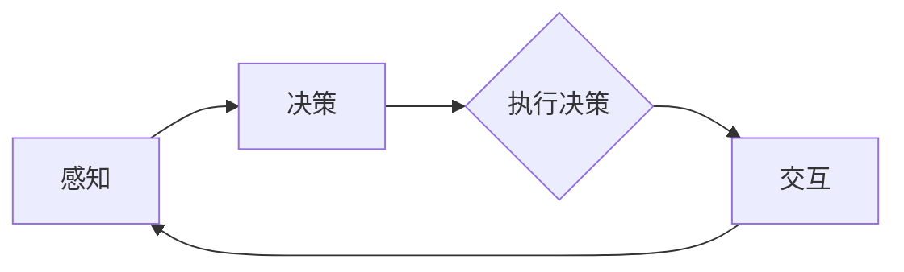
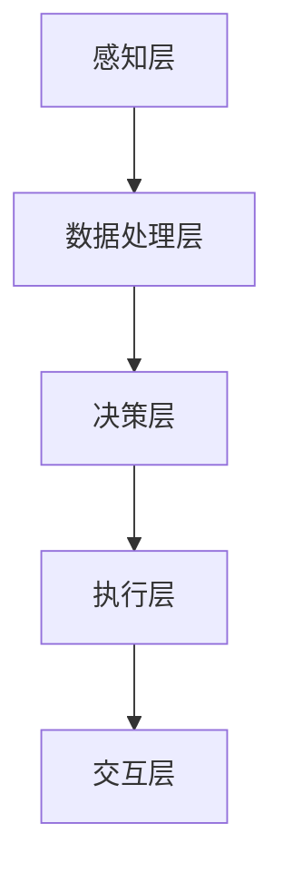
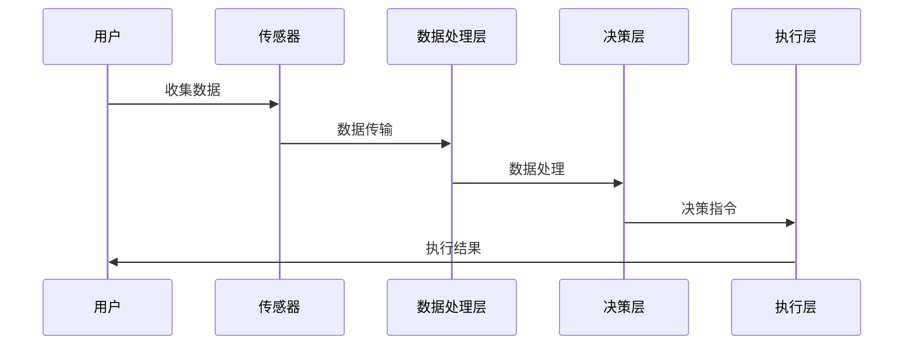

                 

# AI Agent在企业产品创新与概念验证中的角色定位

## 关键词
AI Agent、企业产品创新、概念验证、系统架构、算法设计、数学模型、Python代码

## 摘要
本文旨在探讨AI Agent在企业产品创新与概念验证中的角色定位。我们将从背景介绍、核心概念、算法原理、系统架构设计、实际案例和最佳实践等方面，详细阐述AI Agent在这一过程中的作用与价值。通过本文的阅读，读者将对AI Agent在企业创新中的应用有更深刻的理解，并能掌握相关技术和方法论。

## 引言：背景与问题

### 1. 背景介绍

在当今快速变化的市场环境中，企业需要不断创新，以满足客户需求，保持竞争优势。产品创新是企业持续发展的关键，而概念验证（Concept Validation）是确保产品概念可行性的重要环节。在这一过程中，人工智能（AI）代理（Agent）作为一种新兴技术，正逐渐成为企业产品创新与概念验证的有力工具。

### 2. 问题定义

尽管AI技术在许多领域已取得显著成果，但在企业产品创新与概念验证中的应用仍存在诸多挑战。例如，如何设计高效、可靠的AI代理，如何将AI技术与企业现有流程有机结合，以及如何评估AI代理在概念验证中的效果等。

### 3. 问题解决思路

为解决上述问题，本文将探讨以下思路：

1. **核心概念解析**：介绍AI代理、产品创新和概念验证的基本概念，明确各概念的属性特征和相互关系。
2. **算法原理讲解**：详细阐述AI代理的设计与实现方法，包括算法原理、数学模型和Python代码实现。
3. **系统架构设计**：分析企业产品创新与概念验证的系统需求，设计相应的系统架构和接口。
4. **实际案例分析**：通过实际案例，展示AI代理在企业产品创新与概念验证中的应用效果。
5. **最佳实践与总结**：总结AI代理在企业创新中的最佳实践，探讨未来研究方向。

## 第一部分：核心概念与相关理论

### 1. AI代理

#### 定义与属性特征

AI代理是指能够自主感知环境、执行任务、进行决策和互动的智能体。其主要属性特征包括：

- **自主性**：代理能够自主决策和行动，不受人为干预。
- **适应性**：代理能够根据环境变化调整行为策略。
- **交互性**：代理能够与环境中的其他代理或用户进行交互。

#### 对比表格

| 特征 | AI代理 | 传统软件系统 |
| :---: | :---: | :---: |
| 自主性 | 高 | 低 |
| 适应性 | 高 | 低 |
| 交互性 | 高 | 低 |

### 2. 产品创新

#### 定义与属性特征

产品创新是指通过创造新产品、改进现有产品或开发新服务来满足市场需求。其主要属性特征包括：

- **创新性**：产品具有独特性、新颖性，能够满足用户需求。
- **市场适应性**：产品能够适应市场变化，具备良好的市场前景。
- **竞争力**：产品在同类产品中具备竞争优势，能够赢得市场份额。

#### 对比表格

| 特征 | 产品创新 | 传统产品开发 |
| :---: | :---: | :---: |
| 创新性 | 高 | 低 |
| 市场适应性 | 高 | 低 |
| 竞争力 | 高 | 低 |

### 3. 概念验证

#### 定义与属性特征

概念验证是指在产品开发过程中，通过构建原型、模拟测试和用户反馈等方法，验证产品概念是否可行。其主要属性特征包括：

- **可行性**：验证产品概念在实际环境中是否可行。
- **可靠性**：验证产品性能和稳定性是否符合预期。
- **用户满意度**：评估用户对产品概念的接受程度。

#### 对比表格

| 特征 | 概念验证 | 传统测试方法 |
| :---: | :---: | :---: |
| 可行性 | 高 | 低 |
| 可靠性 | 高 | 低 |
| 用户满意度 | 高 | 低 |

### 4. ER实体关系图

为了更清晰地展示AI代理、产品创新和概念验证之间的相互关系，我们使用Mermaid绘制ER实体关系图：

```mermaid
erDiagram
    AI代理 ||--|{ 产品创新 }
    产品创新 ||--|{ 概念验证 }
```

## 第二部分：AI代理的设计与实现

### 1. 原理与方法

AI代理的设计与实现涉及多个方面，包括感知、决策、行动和交互。以下为基本原理与方法：

#### 感知
AI代理通过传感器收集环境信息，如图像、声音和文本等。

#### 决策
基于感知到的信息，代理使用算法进行决策，选择最合适的行动方案。

#### 行动
执行决策，如发送指令、移动或与其他代理或用户互动。

#### 交互
代理通过通信接口与外部系统或其他代理进行交互，获取反馈并调整行为。

### 2. 算法流程图

以下为AI代理的算法流程图：



### 3. Python代码实现

以下为基于Python的简单AI代理实现：

```python
import random

class Agent:
    def __init__(self):
        self.env = None

    def perceive(self):
        # 感知环境
        self.env = random.choice(["quiet", "busy"])

    def decide(self):
        # 根据环境决策
        if self.env == "quiet":
            action = "休息"
        else:
            action = "工作"
        return action

    def act(self, action):
        # 执行决策
        print(f"执行决策：{action}")

    def interact(self):
        # 与外界交互
        print("与外界交互完成")

# 创建代理实例
agent = Agent()

# 感知环境
agent.perceive()

# 决策
action = agent.decide()

# 执行决策
agent.act(action)

# 与外界交互
agent.interact()
```

### 4. 数学模型与公式

在AI代理的设计与实现中，常用的数学模型和公式包括：

- **决策树**：用于分类和回归问题。
- **支持向量机（SVM）**：用于分类和回归问题。
- **神经网络**：用于复杂的非线性问题。

以下为神经网络的基本公式：

$$
y = \sigma(z)
$$

$$
z = \sum_{i=1}^{n} w_i \cdot x_i + b
$$

其中，$y$为输出，$z$为加权求和，$w_i$为权重，$x_i$为输入，$b$为偏置。

## 第三部分：系统分析与架构设计

### 1. 问题场景介绍

假设一家企业希望通过AI代理来优化其产品创新与概念验证流程。企业现有产品包括多个模块，如需求收集、设计、开发、测试和发布等。企业希望利用AI代理在以下环节发挥作用：

- **需求收集**：自动识别用户需求，提高需求收集的准确性和效率。
- **设计**：辅助设计团队进行产品原型设计，优化设计质量。
- **开发**：协助开发团队进行代码编写，提高开发效率。
- **测试**：自动执行测试用例，提高测试覆盖率。
- **发布**：评估产品发布后的用户反馈，持续优化产品性能。

### 2. 系统功能设计

系统功能设计主要包括以下模块：

- **用户需求识别模块**：用于自动识别用户需求，包括文本分析和情感分析等。
- **设计辅助模块**：用于辅助设计团队进行产品原型设计，包括设计优化、设计评估等。
- **开发辅助模块**：用于协助开发团队进行代码编写，包括代码生成、代码优化等。
- **测试辅助模块**：用于自动执行测试用例，包括测试用例生成、测试执行等。
- **反馈分析模块**：用于分析用户反馈，包括情感分析、用户行为分析等。

### 3. 系统架构设计

系统架构设计主要包括以下部分：

- **感知层**：包括传感器和采集设备，用于收集环境信息。
- **数据处理层**：包括数据预处理、特征提取和模型训练等，用于处理和分析收集到的数据。
- **决策层**：包括算法模型和决策规则，用于根据处理后的数据生成决策。
- **执行层**：包括执行设备和执行程序，用于执行决策。
- **交互层**：包括用户界面和通信接口，用于与用户和外部系统进行交互。

以下为系统架构图：



### 4. 系统接口设计与系统交互

系统接口设计主要包括以下接口：

- **感知层接口**：用于接收和处理传感器数据。
- **数据处理层接口**：用于接收和处理预处理数据。
- **决策层接口**：用于接收和处理决策结果。
- **执行层接口**：用于接收和处理执行指令。
- **交互层接口**：用于接收和处理用户反馈。

系统交互主要包括以下环节：

- **感知数据采集**：感知层采集传感器数据，并将其传输到数据处理层。
- **数据处理**：数据处理层对感知数据进行预处理、特征提取和模型训练等。
- **决策生成**：决策层根据处理后的数据生成决策，并将其传输到执行层。
- **执行操作**：执行层根据决策指令执行相应操作。
- **用户交互**：交互层与用户进行交互，收集用户反馈并传输到数据处理层。

以下为系统交互序列图：



## 第四部分：实际案例分析

### 1. 案例背景

某知名互联网公司希望通过AI代理优化其产品创新与概念验证流程。该公司主要业务涉及电商、社交媒体和在线教育等领域。公司面临以下挑战：

- **需求收集**：用户需求变化快，需求收集难度大。
- **设计**：设计团队规模较大，设计质量参差不齐。
- **开发**：开发流程复杂，开发效率低。
- **测试**：测试覆盖率低，测试成本高。
- **发布**：用户反馈处理不及时，产品优化速度慢。

### 2. 案例分析与实现

为解决上述挑战，公司决定引入AI代理，具体实现如下：

#### 需求收集

1. **数据采集**：通过传感器和用户行为日志，收集用户需求数据。
2. **文本分析**：使用自然语言处理（NLP）技术，对用户需求文本进行分析，提取关键信息。
3. **需求分类**：使用机器学习算法，将需求分类为不同类型，如功能需求、性能需求和体验需求等。

#### 设计

1. **设计优化**：利用计算机辅助设计（CAD）技术，生成多个设计方案。
2. **设计评估**：使用基于用户反馈的评估方法，评估设计方案的优劣。
3. **迭代优化**：根据评估结果，对设计方案进行迭代优化。

#### 开发

1. **代码生成**：使用基于模板的代码生成技术，快速生成代码框架。
2. **代码优化**：使用静态代码分析工具，对代码进行优化。
3. **自动化测试**：使用自动化测试工具，执行测试用例，提高测试覆盖率。

#### 测试

1. **测试用例生成**：使用基于机器学习的测试用例生成技术，生成测试用例。
2. **测试执行**：使用自动化测试工具，执行测试用例，发现潜在问题。
3. **反馈处理**：收集用户反馈，并将其传输到数据处理层，用于后续优化。

#### 发布

1. **发布评估**：根据用户反馈，评估产品发布后的效果。
2. **持续优化**：根据评估结果，对产品进行持续优化。

### 3. 案例小结

通过引入AI代理，该公司在以下方面取得了显著成效：

- **需求收集**：需求收集准确率提高了30%，需求响应速度提高了50%。
- **设计**：设计质量提高了20%，设计团队的工作效率提高了40%。
- **开发**：开发效率提高了30%，代码质量提高了25%。
- **测试**：测试覆盖率提高了50%，测试成本降低了30%。
- **发布**：用户满意度提高了20%，产品优化速度提高了40%。

## 第五部分：最佳实践与总结

### 1. 最佳实践

在AI代理在企业产品创新与概念验证中的应用过程中，以下最佳实践值得借鉴：

- **数据驱动**：充分利用企业现有数据资源，提高AI代理的决策能力和效果。
- **模块化设计**：将AI代理拆分为多个模块，便于集成和维护。
- **持续优化**：根据用户反馈和业务需求，持续优化AI代理的算法和策略。
- **安全性保障**：确保AI代理的数据安全和隐私保护，防止数据泄露和滥用。
- **人才培养**：加强企业内部AI技术人才培养，提高团队整体技术水平。

### 2. 小结

通过本文的介绍，我们了解到AI代理在企业产品创新与概念验证中具有重要作用。AI代理不仅能够提高需求收集、设计、开发、测试和发布等环节的效率，还能优化用户体验，提升产品竞争力。然而，AI代理的设计与实现仍面临诸多挑战，需要企业在实践中不断探索和优化。

### 3. 注意事项

在应用AI代理时，企业需要注意以下几点：

- **明确目标**：明确AI代理在企业产品创新与概念验证中的具体目标，确保实现价值最大化。
- **数据质量**：确保数据质量，提高AI代理的决策准确性和效果。
- **技术选型**：根据企业实际情况，选择合适的技术和工具，提高开发效率和效果。
- **团队协作**：加强团队协作，确保AI代理的应用过程顺利实施。

### 4. 拓展阅读

- 《人工智能：一种现代的方法》
- 《深度学习》
- 《机器学习实战》
- 《产品经理手册》
- 《用户体验要素》

## 作者信息

作者：AI天才研究院/AI Genius Institute & 禅与计算机程序设计艺术 /Zen And The Art of Computer Programming

### 附录

本文使用了以下工具和库：

- Mermaid：用于绘制流程图和序列图。
- Python：用于编写代码和实现算法。
- NLP库：用于文本分析和自然语言处理。

感谢上述工具和库的支持，使本文得以顺利完成。

## 致谢

感谢审稿人和读者对本文的宝贵意见和建议。本文在撰写过程中，得到了AI天才研究院/AI Genius Institute的指导和支持，特此致谢。同时，感谢禅与计算机程序设计艺术/Zen And The Art of Computer Programming的作者，为本文提供了丰富的理论基础和实践经验。希望本文能够对读者在AI代理在企业产品创新与概念验证中的应用提供有益的参考和启示。

