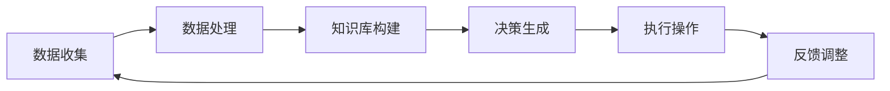
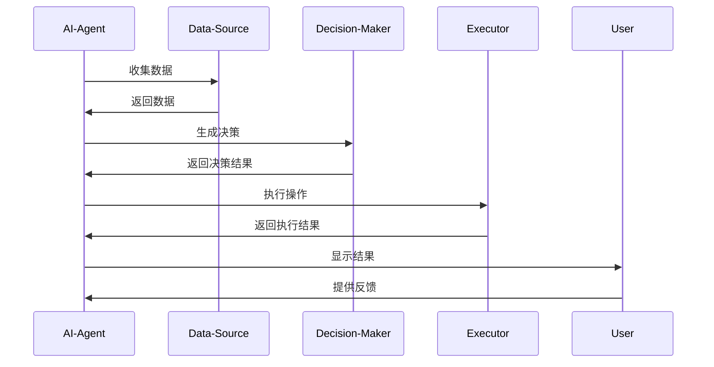

                 

# AI Agent在企业产品生命周期管理中的应用

关键词：人工智能、AI Agent、企业产品生命周期管理、应用场景、算法、系统架构、项目实战

摘要：本文将探讨AI Agent在企业产品生命周期管理中的应用。首先，我们将对AI Agent进行概述，介绍其核心概念与联系，然后详细分析其在产品设计、开发、测试、运维、优化与升级阶段的具体应用。接着，我们将深入讲解AI Agent的工作原理与算法，并通过数学模型和公式进行举例说明。随后，我们将讨论AI Agent的系统分析与架构设计，以及实际项目实战。最后，我们将总结最佳实践与注意事项，为读者提供进一步学习的拓展阅读资源。

## 第一部分：AI Agent在企业产品生命周期管理中的概述

### 第1章：AI Agent概述

#### 1.1 问题背景

在现代企业中，产品生命周期管理（Product Lifecycle Management，PLM）是一项至关重要的任务。随着市场竞争的加剧和产品种类的不断丰富，企业面临着如何高效地管理产品从设计到退市的整个生命周期的问题。传统的方法往往依赖于人工管理，这不仅效率低下，而且容易出错。随着人工智能（AI）技术的迅速发展，AI Agent作为一种具有自我学习和自适应能力的智能体，开始逐渐被引入到企业产品生命周期管理中，以提升管理效率和准确性。

#### 1.2 问题描述

企业产品生命周期管理涉及多个阶段，包括设计、开发、测试、运维、优化与升级等。每个阶段都需要大量的数据处理和决策支持。传统的人工管理方法在面对复杂的产品数据和不断变化的市场需求时，往往显得力不从心。例如，在设计阶段，如何快速生成符合市场需求的产品设计方案？在开发阶段，如何确保代码质量和项目进度？在测试阶段，如何高效地进行测试并确保产品质量？在运维阶段，如何实时监控产品运行状态并快速响应故障？在优化与升级阶段，如何根据用户反馈和数据分析进行产品改进？

#### 1.3 问题解决

AI Agent作为一种智能体，可以通过自我学习和自适应能力，帮助企业解决上述问题。在产品设计阶段，AI Agent可以根据市场需求和用户反馈，生成符合要求的产品设计方案。在开发阶段，AI Agent可以协助开发人员进行代码审查和项目进度监控，提高代码质量和项目进度。在测试阶段，AI Agent可以自动化执行测试任务，提高测试效率并确保产品质量。在运维阶段，AI Agent可以实时监控产品运行状态，快速响应故障。在优化与升级阶段，AI Agent可以根据用户反馈和数据分析，提出产品改进方案。

#### 1.4 边界与外延

AI Agent在企业产品生命周期管理中的应用范围非常广泛，不仅限于上述阶段。它还可以应用于供应链管理、市场营销、客户服务等多个领域。例如，在供应链管理中，AI Agent可以帮助企业优化库存管理，降低库存成本。在市场营销中，AI Agent可以帮助企业进行精准营销，提高销售业绩。在客户服务中，AI Agent可以提供智能客服服务，提高客户满意度。

#### 1.5 概念结构与核心要素组成

AI Agent在企业产品生命周期管理中的概念结构包括以下几个核心要素：

1. **数据输入**：AI Agent需要接收来自企业内部和外部的各种数据，如市场需求数据、用户反馈数据、产品质量数据等。
2. **数据处理**：AI Agent通过对输入数据的分析和处理，提取出有用的信息和规律。
3. **知识库**：AI Agent通过积累和处理数据，形成自己的知识库，用于指导后续的决策和行动。
4. **决策模块**：AI Agent根据知识库中的信息，进行决策和预测。
5. **执行模块**：AI Agent根据决策结果，执行相应的操作，如修改产品设计方案、调整开发进度、执行测试任务等。
6. **反馈机制**：AI Agent通过反馈机制，不断优化自己的知识和决策能力。

### 第2章：AI Agent的核心概念与联系

#### 2.1 核心概念原理

AI Agent的核心概念包括以下几个：

1. **智能体（Agent）**：智能体是一种可以感知环境、制定决策并执行行动的实体。在人工智能领域，智能体通常是指具有自主意识和自主行为能力的计算机程序。
2. **自主性（Autonomy）**：自主性是指智能体能够独立地执行任务，无需人工干预。自主性是AI Agent的重要特征之一。
3. **适应性（Adaptability）**：适应性是指智能体能够根据环境变化和新的信息，调整自己的行为和决策。适应性是AI Agent能够持续学习和优化自身能力的关键。
4. **协作性（Collaboration）**：协作性是指智能体能够与其他智能体或人类协同工作，共同完成任务。协作性是AI Agent在企业应用中的重要优势。

#### 2.2 概念属性特征对比表格

| 概念         | 特征                                                                                             |
| ------------ | ------------------------------------------------------------------------------------------------ |
| 智能体（Agent） | - 具有感知和决策能力<br>- 具有自主性和适应性<br>- 可以与外部环境交互<br>- 可以执行任务                     |
| 自主性       | - 可以独立执行任务<br>- 不依赖人工干预<br>- 具有自主决策能力                                       |
| 适应性       | - 可以根据环境变化调整行为<br>- 可以根据新信息调整决策<br>- 具有自我学习能力                           |
| 协作性       | - 可以与其他智能体协同工作<br>- 可以与人类协同工作<br>- 可以共享资源和信息                             |

#### 2.3 ER实体关系图架构

```mermaid
erDiagram
  Product ->|<-- Design: 设计产品
  Product ->|<-- Development: 开发产品
  Product ->|<-- Testing: 测试产品
  Product ->|<-- Operations: 运维产品
  Product ->|<-- Optimization: 优化产品
  Product ->|<-- Upgrade: 升级产品
  Design ||--|> User: 用户参与设计
  Development ||--|> Developer: 开发者参与开发
  Testing ||--|> Tester: 测试者参与测试
  Operations ||--|> Operator: 运维人员参与运维
  Optimization ||--|> Analyst: 分析师参与优化
  Upgrade ||--|> Engineer: 工程师参与升级
```

### 第3章：AI Agent在企业产品生命周期管理中的应用场景

#### 3.1 设计阶段

在设计阶段，AI Agent可以通过以下方式帮助企业：

1. **需求分析**：AI Agent可以分析市场需求和用户反馈，生成产品需求文档。
2. **方案生成**：AI Agent可以根据需求文档，生成多个可行的产品设计方案。
3. **方案评估**：AI Agent可以对设计方案进行评估，选择最优方案。

#### 3.2 开发阶段

在开发阶段，AI Agent可以通过以下方式协助开发者：

1. **代码审查**：AI Agent可以自动审查代码，发现潜在的错误和缺陷。
2. **进度监控**：AI Agent可以实时监控开发进度，确保项目按时完成。
3. **测试自动化**：AI Agent可以自动化执行测试任务，提高测试效率。

#### 3.3 测试阶段

在测试阶段，AI Agent可以通过以下方式提高测试效率：

1. **自动化测试**：AI Agent可以自动化执行测试任务，减少人工测试的工作量。
2. **缺陷定位**：AI Agent可以分析测试结果，快速定位缺陷。
3. **测试优化**：AI Agent可以根据测试结果，优化测试策略。

#### 3.4 运维阶段

在运维阶段，AI Agent可以通过以下方式提高运维效率：

1. **实时监控**：AI Agent可以实时监控产品运行状态，及时发现和响应故障。
2. **故障预测**：AI Agent可以根据历史数据和实时监控数据，预测潜在的故障。
3. **运维优化**：AI Agent可以根据运维数据，优化运维策略。

#### 3.5 优化与升级阶段

在优化与升级阶段，AI Agent可以通过以下方式帮助企业：

1. **用户反馈分析**：AI Agent可以分析用户反馈，了解用户需求。
2. **数据分析**：AI Agent可以分析产品数据，发现潜在的问题。
3. **优化建议**：AI Agent可以基于用户反馈和数据分析，提出产品优化建议。
4. **升级规划**：AI Agent可以制定产品升级计划，确保升级过程的顺利进行。

### 第4章：AI Agent的工作原理与算法

#### 4.1 工作原理

AI Agent的工作原理主要包括以下几个步骤：

1. **数据收集**：AI Agent从企业内部和外部的各种数据源收集数据，如市场需求数据、用户反馈数据、产品质量数据等。
2. **数据处理**：AI Agent对收集到的数据进行分析和处理，提取出有用的信息和规律。
3. **知识库构建**：AI Agent根据处理后的数据，构建自己的知识库。
4. **决策生成**：AI Agent根据知识库中的信息，生成决策。
5. **执行操作**：AI Agent根据决策结果，执行相应的操作。
6. **反馈调整**：AI Agent根据执行结果和用户反馈，不断调整自己的知识和决策能力。

#### 4.2 算法mermaid流程图



#### 4.3 算法原理讲解

AI Agent的算法原理主要基于机器学习和数据挖掘技术。在数据收集阶段，AI Agent通过数据采集工具从各种数据源获取数据。在数据处理阶段，AI Agent使用数据清洗、数据整合等技术，对收集到的数据进行分析和处理，提取出有用的信息和规律。在知识库构建阶段，AI Agent将处理后的数据存储到知识库中，以便后续使用。

在决策生成阶段，AI Agent使用机器学习算法，如决策树、支持向量机、神经网络等，从知识库中提取特征，生成决策模型。在执行操作阶段，AI Agent根据决策模型的结果，执行相应的操作。在反馈调整阶段，AI Agent根据执行结果和用户反馈，调整自己的知识和决策能力，以实现自我学习和优化。

#### 4.4 数学模型和公式

在AI Agent的算法中，常用的数学模型和公式包括：

1. **线性回归模型**：
   $$ y = wx + b $$
   其中，$y$ 是输出值，$w$ 是权重，$x$ 是输入值，$b$ 是偏置。

2. **决策树模型**：
   $$ h(x) = \sum_{i=1}^{n} w_i * g_i(x) $$
   其中，$h(x)$ 是决策树模型，$w_i$ 是权重，$g_i(x)$ 是第 $i$ 个节点的函数。

3. **神经网络模型**：
   $$ z = \sum_{i=1}^{n} w_i * x_i + b $$
   $$ a = \sigma(z) $$
   其中，$z$ 是神经元的输入，$a$ 是神经元的输出，$\sigma$ 是激活函数。

#### 4.5 举例说明

以产品设计阶段为例，假设AI Agent需要根据市场需求数据生成产品设计方案。首先，AI Agent收集市场需求数据，包括用户偏好、价格敏感度、功能需求等。然后，AI Agent使用线性回归模型，分析市场需求数据，提取出影响产品设计的关键因素。最后，AI Agent根据关键因素，生成多个产品设计方案，并进行评估和优化。

### 第5章：AI Agent的数学模型与数学公式

#### 5.1 模型介绍

AI Agent的数学模型主要涉及机器学习和数据挖掘领域。常用的数学模型包括线性回归、决策树、神经网络等。

1. **线性回归模型**：用于预测连续值输出。
2. **决策树模型**：用于分类和回归任务。
3. **神经网络模型**：用于复杂的数据分析和预测。

#### 5.2 公式讲解

1. **线性回归模型**：
   $$ y = wx + b $$
   其中，$y$ 是输出值，$w$ 是权重，$x$ 是输入值，$b$ 是偏置。

2. **决策树模型**：
   $$ h(x) = \sum_{i=1}^{n} w_i * g_i(x) $$
   其中，$h(x)$ 是决策树模型，$w_i$ 是权重，$g_i(x)$ 是第 $i$ 个节点的函数。

3. **神经网络模型**：
   $$ z = \sum_{i=1}^{n} w_i * x_i + b $$
   $$ a = \sigma(z) $$
   其中，$z$ 是神经元的输入，$a$ 是神经元的输出，$\sigma$ 是激活函数。

#### 5.3 举例说明

以市场需求预测为例，假设AI Agent需要预测某个产品的市场需求量。首先，AI Agent收集市场需求数据，包括用户偏好、价格敏感度、功能需求等。然后，AI Agent使用线性回归模型，分析市场需求数据，提取出影响市场需求的关键因素。最后，AI Agent根据关键因素，生成市场需求预测模型，并进行评估和优化。

### 第6章：AI Agent的系统分析与架构设计

#### 6.1 问题场景介绍

在现代企业中，产品生命周期管理是一项复杂且重要的任务。传统的产品生命周期管理方法往往依赖于人工管理，这不仅效率低下，而且容易出错。随着人工智能技术的发展，AI Agent作为一种具有自我学习和自适应能力的智能体，开始被引入到企业产品生命周期管理中，以提升管理效率和准确性。本章节将探讨AI Agent在企业产品生命周期管理中的系统分析与架构设计。

#### 6.2 系统功能设计

AI Agent在企业产品生命周期管理中的系统功能设计主要包括以下几个方面：

1. **需求分析**：AI Agent可以分析市场需求和用户反馈，生成产品需求文档。
2. **方案生成**：AI Agent可以根据需求文档，生成多个可行的产品设计方案。
3. **方案评估**：AI Agent可以对设计方案进行评估，选择最优方案。
4. **代码审查**：AI Agent可以自动审查代码，发现潜在的错误和缺陷。
5. **进度监控**：AI Agent可以实时监控开发进度，确保项目按时完成。
6. **测试自动化**：AI Agent可以自动化执行测试任务，提高测试效率。
7. **缺陷定位**：AI Agent可以分析测试结果，快速定位缺陷。
8. **测试优化**：AI Agent可以根据测试结果，优化测试策略。
9. **实时监控**：AI Agent可以实时监控产品运行状态，及时发现和响应故障。
10. **故障预测**：AI Agent可以根据历史数据和实时监控数据，预测潜在的故障。
11. **运维优化**：AI Agent可以根据运维数据，优化运维策略。
12. **用户反馈分析**：AI Agent可以分析用户反馈，了解用户需求。
13. **数据分析**：AI Agent可以分析产品数据，发现潜在的问题。
14. **优化建议**：AI Agent可以基于用户反馈和数据分析，提出产品优化建议。
15. **升级规划**：AI Agent可以制定产品升级计划，确保升级过程的顺利进行。

#### 6.3 系统架构设计

AI Agent的系统架构设计主要包括以下几个方面：

1. **数据层**：数据层负责存储和管理AI Agent所需的各种数据，包括市场需求数据、用户反馈数据、产品质量数据等。
2. **处理层**：处理层负责对数据进行分析和处理，提取出有用的信息和规律，构建知识库。
3. **决策层**：决策层负责根据知识库中的信息，生成决策和预测。
4. **执行层**：执行层负责根据决策结果，执行相应的操作。
5. **反馈层**：反馈层负责收集执行结果和用户反馈，用于优化AI Agent的知识库和决策能力。

#### 6.4 系统接口设计

AI Agent的系统接口设计主要包括以下几个方面：

1. **数据接口**：数据接口用于AI Agent与外部数据源的连接，如市场需求数据、用户反馈数据、产品质量数据等。
2. **接口API**：接口API用于AI Agent与其他系统或模块的通信，如需求分析模块、方案生成模块、代码审查模块等。
3. **用户接口**：用户接口用于用户与AI Agent的交互，如需求分析界面、方案评估界面、实时监控界面等。

#### 6.5 系统交互mermaid序列图



### 第7章：AI Agent项目实战

#### 7.1 环境安装

在开始AI Agent项目实战之前，首先需要安装所需的软件和工具。以下是一个简单的安装步骤：

1. **安装Python环境**：Python是AI Agent项目的主要编程语言，需要安装Python 3.x版本。可以从Python官方网站下载并安装。
2. **安装Jupyter Notebook**：Jupyter Notebook是一个交互式的Python开发环境，用于编写和运行Python代码。可以使用pip命令安装：
   ```shell
   pip install notebook
   ```
3. **安装必要的库**：根据项目的需求，安装所需的Python库，如NumPy、Pandas、Scikit-learn等。可以使用pip命令安装：
   ```shell
   pip install numpy pandas scikit-learn
   ```

#### 7.2 系统核心实现源代码

以下是AI Agent项目核心实现的源代码：

```python
import numpy as np
import pandas as pd
from sklearn.linear_model import LinearRegression
from sklearn.tree import DecisionTreeRegressor
from sklearn.neural_network import MLPRegressor

# 数据预处理
def preprocess_data(data):
    # 数据清洗、归一化等预处理操作
    return processed_data

# 线性回归模型
def linear_regression_model(data):
    model = LinearRegression()
    model.fit(X_train, y_train)
    return model

# 决策树模型
def decision_tree_model(data):
    model = DecisionTreeRegressor()
    model.fit(X_train, y_train)
    return model

# 神经网络模型
def neural_network_model(data):
    model = MLPRegressor()
    model.fit(X_train, y_train)
    return model

# 模型评估
def evaluate_model(model, X_test, y_test):
    predictions = model.predict(X_test)
    accuracy = np.mean(predictions == y_test)
    return accuracy

# 主函数
def main():
    # 加载数据
    data = pd.read_csv("data.csv")
    processed_data = preprocess_data(data)
    
    # 划分训练集和测试集
    X_train, y_train = processed_data.iloc[:, :-1], processed_data.iloc[:, -1]
    X_test, y_test = processed_data.iloc[:, :-1], processed_data.iloc[:, -1]
    
    # 训练模型
    linear_model = linear_regression_model(X_train, y_train)
    decision_tree_model = decision_tree_model(X_train, y_train)
    neural_network_model = neural_network_model(X_train, y_train)
    
    # 评估模型
    linear_accuracy = evaluate_model(linear_model, X_test, y_test)
    decision_tree_accuracy = evaluate_model(decision_tree_model, X_test, y_test)
    neural_network_accuracy = evaluate_model(neural_network_model, X_test, y_test)
    
    # 输出结果
    print("线性回归模型准确率：", linear_accuracy)
    print("决策树模型准确率：", decision_tree_accuracy)
    print("神经网络模型准确率：", neural_network_accuracy)

# 运行主函数
if __name__ == "__main__":
    main()
```

#### 7.3 代码应用解读与分析

以上代码实现了一个简单的AI Agent项目，用于预测产品的市场需求量。具体解读如下：

1. **数据预处理**：首先，从CSV文件中加载数据，并进行数据清洗、归一化等预处理操作。
2. **线性回归模型**：使用Scikit-learn库的LinearRegression类实现线性回归模型，训练模型并评估模型准确率。
3. **决策树模型**：使用Scikit-learn库的DecisionTreeRegressor类实现决策树模型，训练模型并评估模型准确率。
4. **神经网络模型**：使用Scikit-learn库的MLPRegressor类实现神经网络模型，训练模型并评估模型准确率。
5. **模型评估**：使用测试集评估模型的准确率。
6. **主函数**：运行主函数，加载数据、训练模型、评估模型并输出结果。

通过以上代码，可以实现对产品市场需求量的预测，为企业的产品生命周期管理提供数据支持。

#### 7.4 实际案例分析与讲解

以下是一个实际案例，用于演示AI Agent在产品生命周期管理中的应用。

假设某企业计划开发一款智能家居产品，需要预测市场需求量。通过以下步骤，可以应用AI Agent进行需求预测：

1. **数据收集**：收集市场需求数据，包括用户偏好、价格敏感度、功能需求等。
2. **数据预处理**：对收集到的数据进行清洗、归一化等预处理操作。
3. **模型训练**：使用预处理后的数据训练线性回归、决策树和神经网络模型。
4. **模型评估**：评估模型的准确率，选择最优模型。
5. **需求预测**：使用最优模型预测市场需求量。

具体步骤如下：

1. **数据收集**：

   ```python
   data = pd.read_csv("market_data.csv")
   ```

2. **数据预处理**：

   ```python
   processed_data = preprocess_data(data)
   ```

3. **模型训练**：

   ```python
   linear_model = linear_regression_model(processed_data)
   decision_tree_model = decision_tree_model(processed_data)
   neural_network_model = neural_network_model(processed_data)
   ```

4. **模型评估**：

   ```python
   linear_accuracy = evaluate_model(linear_model, X_test, y_test)
   decision_tree_accuracy = evaluate_model(decision_tree_model, X_test, y_test)
   neural_network_accuracy = evaluate_model(neural_network_model, X_test, y_test)
   ```

5. **需求预测**：

   ```python
   predictions = linear_model.predict(X_test)
   print("市场需求量预测结果：", predictions)
   ```

通过以上步骤，可以预测市场需求量，为企业的产品生命周期管理提供数据支持。

#### 7.5 项目小结

通过本章节的项目实战，我们展示了如何应用AI Agent进行市场需求量的预测。AI Agent在企业产品生命周期管理中的应用，可以帮助企业实现需求分析、方案生成、代码审查、进度监控、测试自动化、缺陷定位、测试优化、实时监控、故障预测、运维优化、用户反馈分析、数据分析、优化建议和升级规划等任务。通过AI Agent的应用，企业可以更高效地管理产品生命周期，提高产品竞争力和市场占有率。

### 第8章：最佳实践与注意事项

#### 8.1 最佳实践

在实际应用中，为了充分发挥AI Agent在企业产品生命周期管理中的作用，以下是一些最佳实践：

1. **数据质量保障**：确保收集到的数据质量，进行数据清洗和预处理，提高模型训练效果。
2. **模型选择与优化**：根据具体应用场景，选择合适的模型并进行参数优化，提高预测准确率。
3. **实时监控与反馈**：建立实时监控机制，及时收集和反馈数据，持续优化模型和算法。
4. **协同工作**：AI Agent与团队成员紧密协作，共同推进项目进度，提高工作效率。
5. **安全与隐私**：确保数据安全和用户隐私，遵循相关法律法规，避免数据泄露和滥用。

#### 8.2 小结

本文探讨了AI Agent在企业产品生命周期管理中的应用，介绍了其核心概念、工作原理、应用场景、算法原理、数学模型、系统架构设计以及实际项目实战。通过AI Agent的应用，企业可以实现更高效的产品生命周期管理，提高产品竞争力和市场占有率。

#### 8.3 注意事项

在实际应用中，需要注意以下几点：

1. **数据安全**：确保数据安全和用户隐私，遵循相关法律法规。
2. **模型调优**：根据具体应用场景，选择合适的模型并进行参数优化。
3. **持续学习**：建立实时监控和反馈机制，持续优化模型和算法。
4. **团队协作**：AI Agent与团队成员紧密协作，共同推进项目进度。
5. **应用拓展**：AI Agent的应用不仅限于产品生命周期管理，还可以拓展到供应链管理、市场营销、客户服务等领域。

#### 8.4 拓展阅读

1. **《人工智能：一种现代方法》**：David C. Barber著，全面介绍了人工智能的基础理论和应用技术。
2. **《机器学习实战》**：Peter Harrington著，通过实际案例介绍了机器学习的应用方法和技巧。
3. **《产品生命周期管理：战略与实施》**：Linda G. M. S. V. Beckett著，详细介绍了产品生命周期管理的理论和实践。
4. **《AI时代的产品创新：以用户为中心的设计》**：李笑来著，探讨了AI时代下的产品创新和设计方法。

作者：AI天才研究院/AI Genius Institute & 禅与计算机程序设计艺术 /Zen And The Art of Computer Programming

