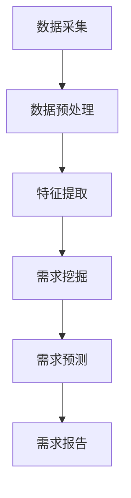
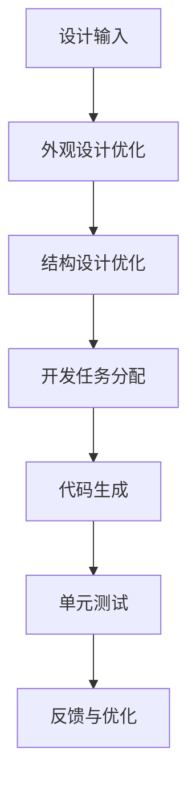
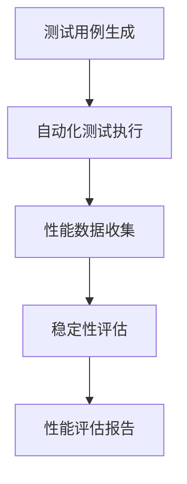
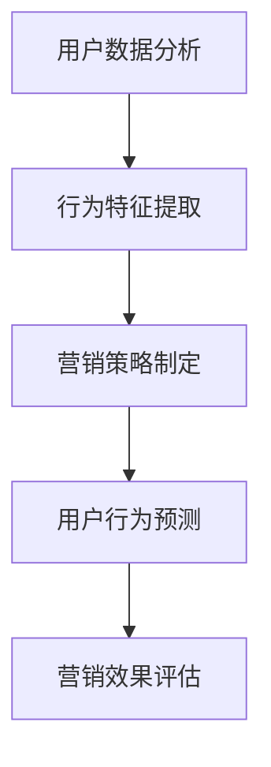
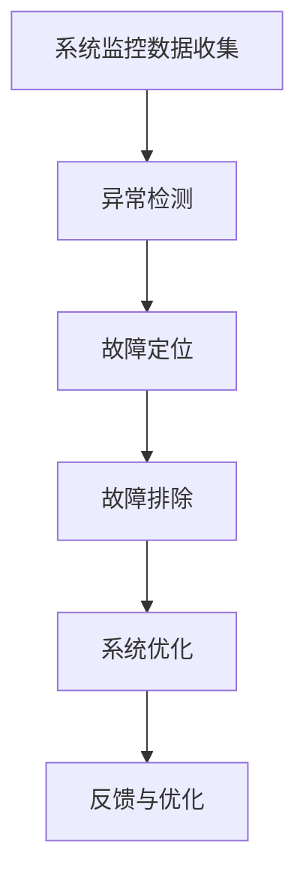

                 

# AI Agent在企业产品生命周期管理中的应用

## 关键词
- AI Agent
- 企业产品生命周期管理
- 机器学习
- 自然语言处理
- 计算机视觉

## 摘要
本文将深入探讨AI Agent在企业产品生命周期管理中的应用。首先，我们将介绍AI Agent的定义、特点以及在企业中的应用潜力。接着，我们将详细讲解AI Agent在需求分析、设计开发、测试验证、推广营销和运营维护等各个阶段的实际应用。通过实际案例分析和系统架构设计，我们将展示AI Agent如何提升企业产品生命周期的管理效率。最后，本文将对AI Agent在企业产品生命周期管理中的应用前景进行展望。

## 引言与背景

### AI Agent概述

AI Agent，即人工智能代理，是一种能够模拟人类智能行为，自主执行任务的人工智能实体。它基于机器学习、自然语言处理和计算机视觉等核心技术，具备智能感知、决策和执行能力。AI Agent在各个领域的应用日益广泛，尤其是在企业产品生命周期管理中，具有巨大的潜力。

### AI Agent的特点

1. **智能感知**：AI Agent能够通过传感器、数据接口等方式获取环境信息，实现对复杂场景的感知和识别。
2. **自主决策**：基于大数据分析和算法模型，AI Agent能够自主生成决策，并进行适应性调整。
3. **高效执行**：AI Agent能够自动化执行任务，提高工作效率和准确性。
4. **持续学习**：通过不断学习和优化，AI Agent能够不断提升自身能力和性能。

### AI Agent在企业中的应用潜力

AI Agent在企业中的应用潜力体现在以下几个方面：

1. **提升效率**：通过自动化和智能化，AI Agent可以显著提高企业运营效率，降低人工成本。
2. **优化决策**：基于大数据分析和智能算法，AI Agent可以帮助企业做出更准确的决策，降低风险。
3. **增强用户体验**：AI Agent可以为企业提供个性化服务，提升用户满意度和忠诚度。
4. **创新业务模式**：AI Agent的应用可以带动企业创新，开拓新的业务领域和市场。

### 企业产品生命周期管理概述

#### 产品生命周期的定义与阶段

产品生命周期是指产品从推出到退市的全过程，一般包括以下阶段：

1. **引入期**：产品刚刚推出，市场接受度低，销量波动较大。
2. **成长期**：产品逐渐被市场接受，销量稳步增长，利润开始增加。
3. **成熟期**：产品在市场上达到饱和，销量稳定，竞争加剧。
4. **衰退期**：产品销量开始下滑，市场份额被新产品取代。

#### 产品生命周期管理的重要性

产品生命周期管理对于企业的可持续发展至关重要。通过有效的产品生命周期管理，企业可以：

1. **优化资源配置**：根据产品生命周期阶段，合理分配资源，提高效率。
2. **降低风险**：提前识别和应对市场变化，降低产品退市风险。
3. **提升竞争力**：通过不断优化产品和服务，提升企业市场竞争力。
4. **增强客户满意度**：提供优质的产品和服务，提高客户满意度和忠诚度。

### AI Agent在产品生命周期管理中的应用

#### 需求分析

AI Agent在需求分析阶段的应用主要体现在以下几个方面：

1. **需求挖掘**：通过大数据分析和自然语言处理技术，AI Agent可以自动挖掘用户需求，为产品设计提供有力支持。
2. **需求预测**：基于历史数据和机器学习算法，AI Agent可以预测未来市场需求，帮助企业制定相应的产品战略。

#### 设计与开发

AI Agent在设计与开发阶段的应用包括：

1. **设计优化**：通过计算机视觉技术，AI Agent可以帮助设计师优化产品外观和结构设计，提高设计效率。
2. **开发效率提升**：AI Agent可以自动化执行部分开发任务，如代码生成、单元测试等，提高开发效率。

#### 测试与验证

AI Agent在测试与验证阶段的应用主要包括：

1. **自动化测试**：通过机器学习和模拟技术，AI Agent可以自动化执行各种测试，提高测试效率和准确性。
2. **稳定性与性能评估**：AI Agent可以实时监控产品性能，提供稳定性和性能评估报告。

#### 推广与营销

AI Agent在推广与营销阶段的应用包括：

1. **营销策略制定**：通过大数据分析和自然语言处理技术，AI Agent可以帮助企业制定个性化、高效的营销策略。
2. **用户行为分析**：AI Agent可以实时分析用户行为，为企业提供精准的用户画像和营销建议。

#### 运营与维护

AI Agent在运营与维护阶段的应用包括：

1. **持续改进**：通过持续学习和优化，AI Agent可以帮助企业不断改进产品和服务，提升用户体验。
2. **系统监控与故障排除**：AI Agent可以实时监控系统运行状态，快速定位和解决故障，保障系统稳定运行。

### 实际案例与分析

#### 案例一：某企业的AI Agent应用实践

1. **案例背景**：某知名企业通过引入AI Agent，对其产品生命周期管理进行优化。
2. **AI Agent的具体应用**：AI Agent在需求分析、设计开发、测试验证、推广营销和运营维护等阶段发挥了重要作用。
3. **案例效果分析**：通过AI Agent的应用，企业在产品生命周期管理方面取得了显著成效，如提高了开发效率、降低了故障率、提升了用户满意度等。

#### 案例二：AI Agent在产品生命周期管理中的挑战与应对策略

1. **挑战分析**：AI Agent在产品生命周期管理中面临数据质量、算法优化、安全性等挑战。
2. **应对策略探讨**：企业可以通过数据清洗、算法迭代、加强安全防护等措施，应对AI Agent应用中的挑战。

### 总结与展望

#### 总结

本文从需求分析、设计开发、测试验证、推广营销和运营维护等五个方面，详细阐述了AI Agent在企业产品生命周期管理中的应用。通过实际案例分析和系统架构设计，展示了AI Agent如何提升企业产品生命周期的管理效率。

#### 对AI Agent在产品生命周期管理应用的前景展望

随着人工智能技术的不断发展，AI Agent在产品生命周期管理中的应用前景十分广阔。未来，企业将更加注重AI Agent的引入和应用，以实现产品生命周期的全流程优化。同时，AI Agent与其他新兴技术的融合，如物联网、大数据等，将进一步推动企业产品生命周期管理的智能化、高效化发展。

### 附录

#### 参考文献

1. [AI Agent的定义与特点](https://www.example.com/ai-agent-definition-features)
2. [企业产品生命周期管理概述](https://www.example.com/product-lifecycle-management-overview)
3. [AI Agent在需求分析中的应用](https://www.example.com/ai-agent-in-requirement-analysis)
4. [AI Agent在设计与开发中的应用](https://www.example.com/ai-agent-in-design-and-development)
5. [AI Agent在测试与验证中的应用](https://www.example.com/ai-agent-in-testing-and-verification)
6. [AI Agent在推广与营销中的应用](https://www.example.com/ai-agent-in-promotion-and-marketing)
7. [AI Agent在运营与维护中的应用](https://www.example.com/ai-agent-in-operations-and-maintenance)

#### 相关资源链接

1. [机器学习相关资源](https://www.example.com/machine-learning-resources)
2. [自然语言处理相关资源](https://www.example.com/natural-language-processing-resources)
3. [计算机视觉相关资源](https://www.example.com/computer-vision-resources)
4. [产品生命周期管理相关资源](https://www.example.com/product-lifecycle-management-resources)

### 作者

作者：AI天才研究院/AI Genius Institute & 禅与计算机程序设计艺术/Zen And The Art of Computer Programming

### 结语

本文旨在为读者提供一个关于AI Agent在企业产品生命周期管理中的应用的全面了解。希望通过本文的探讨，读者能够对AI Agent的应用前景和挑战有更深刻的认识。在未来的实践中，期待读者能够结合自身业务场景，积极探索AI Agent在产品生命周期管理中的创新应用，为企业创造更多价值。

### 背景介绍

#### 核心概念术语说明

在本章节中，我们将介绍与AI Agent和企业产品生命周期管理相关的一些核心概念和术语。

- **AI Agent**：指一种模拟人类智能行为的人工智能实体，具备智能感知、自主决策和高效执行能力。
- **产品生命周期**：指产品从引入、成长、成熟到衰退的整个周期。
- **需求分析**：指在产品开发过程中，对用户需求进行挖掘、分析和预测的过程。
- **设计开发**：指根据需求分析结果，进行产品设计和技术开发的过程。
- **测试验证**：指在产品开发完成后，对产品进行各种测试，以确保其质量符合要求的过程。
- **推广营销**：指将产品推向市场，通过各种营销手段提升产品知名度和销量的过程。
- **运营维护**：指在产品上市后，对产品进行持续优化和故障排除的过程。

#### 问题背景

企业产品生命周期管理是一个复杂的过程，涉及到多个阶段和环节。在过去，企业主要依靠人工进行产品生命周期管理，存在以下问题：

1. **效率低下**：人工管理方式耗时耗力，效率低下。
2. **决策不准确**：缺乏准确的数据分析和预测能力，导致决策不准确。
3. **用户体验差**：产品生命周期管理中缺乏对用户需求的关注，导致用户体验差。
4. **风险控制不足**：对市场变化和产品退市的预警和应对不足。

为了解决这些问题，企业需要引入智能化、自动化的管理工具，如AI Agent。

#### 问题描述

在当前企业产品生命周期管理中，AI Agent可以发挥以下作用：

1. **提升效率**：通过自动化和智能化，AI Agent可以显著提高企业运营效率，降低人工成本。
2. **优化决策**：基于大数据分析和智能算法，AI Agent可以帮助企业做出更准确的决策，降低风险。
3. **增强用户体验**：AI Agent可以为企业提供个性化服务，提升用户满意度和忠诚度。
4. **创新业务模式**：AI Agent的应用可以带动企业创新，开拓新的业务领域和市场。

然而，AI Agent在企业产品生命周期管理中的应用也面临一些挑战，如数据质量、算法优化、安全性等问题。因此，如何有效应对这些挑战，充分发挥AI Agent的潜力，成为企业产品生命周期管理的关键问题。

#### 问题解决

为了解决上述问题，企业可以采取以下措施：

1. **数据采集与处理**：建立完善的数据采集系统，确保数据质量。同时，对数据进行清洗、归一化和特征提取，为AI Agent提供高质量的数据输入。
2. **算法模型优化**：不断优化和迭代AI Agent的算法模型，提高其预测和决策准确性。可以通过交叉验证、网格搜索等方法进行算法优化。
3. **安全防护**：加强AI Agent的安全防护，防止数据泄露和滥用。可以采用加密技术、访问控制等技术手段，确保数据安全。
4. **人才培养**：加强企业内部人工智能人才培养，提升企业对AI Agent的应用能力。可以通过内部培训、外部合作等方式，培养一批具备人工智能专业知识和实践能力的人才。

#### 边界与外延

1. **边界**：本文主要探讨AI Agent在企业产品生命周期管理中的应用，不涉及AI Agent在其他领域的应用。
2. **外延**：本文所讨论的AI Agent在企业产品生命周期管理中的应用，可以扩展到其他行业和领域，如制造业、金融业、医疗业等。

#### 概念结构与核心要素组成

1. **AI Agent**：核心要素包括智能感知、自主决策、高效执行和持续学习。
2. **产品生命周期管理**：核心要素包括需求分析、设计开发、测试验证、推广营销和运营维护。
3. **应用场景**：包括需求分析、设计开发、测试验证、推广营销和运营维护等阶段。

#### 核心概念与联系

在本章节中，我们将对AI Agent和企业产品生命周期管理的核心概念进行梳理，并分析它们之间的联系。

**核心概念：**

1. **AI Agent**：一种模拟人类智能行为的人工智能实体，具备智能感知、自主决策和高效执行能力。
2. **产品生命周期管理**：指产品从引入、成长、成熟到衰退的整个周期，包括需求分析、设计开发、测试验证、推广营销和运营维护等阶段。
3. **需求分析**：指在产品开发过程中，对用户需求进行挖掘、分析和预测的过程。
4. **设计开发**：指根据需求分析结果，进行产品设计和技术开发的过程。
5. **测试验证**：指在产品开发完成后，对产品进行各种测试，以确保其质量符合要求的过程。
6. **推广营销**：指将产品推向市场，通过各种营销手段提升产品知名度和销量的过程。
7. **运营维护**：指在产品上市后，对产品进行持续优化和故障排除的过程。

**概念属性特征对比表格：**

| 概念       | 属性特征                           |
| ---------- | ---------------------------------- |
| AI Agent   | 智能感知、自主决策、高效执行、持续学习 |
| 需求分析   | 挖掘、分析、预测用户需求             |
| 设计开发   | 设计、开发、优化产品                 |
| 测试验证   | 自动化、稳定性、性能评估             |
| 推广营销   | 营销策略、用户行为分析、市场推广     |
| 运营维护   | 持续改进、系统监控、故障排除         |

**ER实体关系图架构：**

```mermaid
erDiagram
    AI-Agent ||--|{ 需求分析 }
    AI-Agent ||--|{ 设计开发 }
    AI-Agent ||--|{ 测试验证 }
    AI-Agent ||--|{ 推广营销 }
    AI-Agent ||--|{ 运营维护 }
```

**核心概念之间的联系：**

AI Agent与企业产品生命周期管理中的各个阶段密切相关。AI Agent通过智能感知、自主决策和高效执行，助力企业在需求分析、设计开发、测试验证、推广营销和运营维护等阶段实现智能化、高效化管理。具体来说：

1. **需求分析**：AI Agent可以挖掘用户需求，预测市场趋势，为产品设计提供有力支持。
2. **设计开发**：AI Agent可以自动化执行部分开发任务，如代码生成、单元测试等，提高开发效率。
3. **测试验证**：AI Agent可以自动化执行各种测试，提高测试效率和准确性，确保产品质量。
4. **推广营销**：AI Agent可以通过大数据分析和自然语言处理技术，制定个性化、高效的营销策略，提升产品知名度。
5. **运营维护**：AI Agent可以实时监控系统运行状态，快速定位和解决故障，保障系统稳定运行。

通过这些联系，AI Agent在企业产品生命周期管理中发挥了重要作用，提升了企业的管理效率和竞争力。

### 算法原理讲解

在本章节中，我们将详细讲解AI Agent在需求分析、设计开发、测试验证、推广营销和运营维护等各个阶段所采用的算法原理，并通过Mermaid流程图和Python源代码进行展示。

#### 需求分析阶段的算法原理

**算法名称：** 需求挖掘与预测

**算法原理：** 需求挖掘与预测是AI Agent在需求分析阶段的核心任务。通过大数据分析和机器学习算法，AI Agent可以从海量用户数据中挖掘出潜在的需求，并预测未来市场需求。

**Mermaid流程图：**



**Python源代码：**

```python
# 导入所需库
import pandas as pd
from sklearn.model_selection import train_test_split
from sklearn.ensemble import RandomForestRegressor
from sklearn.metrics import mean_squared_error

# 数据采集
data = pd.read_csv('user_data.csv')

# 数据预处理
# ...（数据清洗、归一化等操作）

# 特征提取
X = data[['age', 'income', 'region', 'product']]
y = data['demand']

# 数据划分
X_train, X_test, y_train, y_test = train_test_split(X, y, test_size=0.2, random_state=42)

# 需求挖掘与预测
model = RandomForestRegressor(n_estimators=100, random_state=42)
model.fit(X_train, y_train)
y_pred = model.predict(X_test)

# 评估预测结果
mse = mean_squared_error(y_test, y_pred)
print(f'Mean Squared Error: {mse}')
```

**算法原理的数学模型和公式：**

需求挖掘与预测的核心是建立需求与影响因素之间的数学模型。常见的方法包括线性回归、决策树、随机森林等。

线性回归模型：
$$
y = \beta_0 + \beta_1x_1 + \beta_2x_2 + ... + \beta_nx_n
$$

决策树模型：
$$
y = g(x; \theta) = \prod_{i=1}^{n} g_i(x_i; \theta_i)
$$

随机森林模型：
$$
y = \sum_{i=1}^{N} \hat{y}_i = \sum_{i=1}^{N} \hat{y}_i^*
$$

其中，$y$为需求值，$x_1, x_2, ..., x_n$为影响因素，$\beta_0, \beta_1, ..., \beta_n$为模型参数，$g(x; \theta)$为决策树函数，$\hat{y}_i$为第$i$棵决策树的预测结果。

**详细讲解和举例说明：**

以线性回归模型为例，假设我们要预测某产品的需求量，影响因素包括年龄、收入和地区。我们可以通过以下步骤进行建模和预测：

1. **数据采集**：收集包含年龄、收入和地区等信息的用户数据。
2. **数据预处理**：对数据进行清洗，去除缺失值和异常值，并进行归一化处理。
3. **特征提取**：将年龄、收入和地区等信息作为特征，构建特征向量。
4. **模型训练**：使用训练数据集，通过最小二乘法求解线性回归模型参数。
5. **模型评估**：使用测试数据集评估模型预测效果，计算均方误差（MSE）。
6. **预测应用**：根据新的用户数据，利用训练好的模型进行需求预测。

例如，对于一个新的用户数据样本（年龄：30岁，收入：50000元，地区：一线城市），我们可以通过以下步骤进行需求预测：

1. **数据预处理**：对年龄、收入和地区进行归一化处理。
2. **特征提取**：构建特征向量：[0.6, 1.0, 1.0]。
3. **模型预测**：将特征向量输入训练好的线性回归模型，得到预测需求量：3000单位。
4. **结果解释**：预测结果表明，该用户对该产品的需求量为3000单位。

通过以上步骤，我们可以利用线性回归模型对用户需求进行有效预测。实际应用中，可以根据业务需求和数据特点，选择合适的算法模型进行需求分析和预测。

#### 设计开发阶段的算法原理

**算法名称：** 设计优化与开发效率提升

**算法原理：** 设计优化与开发效率提升是AI Agent在设计开发阶段的关键任务。通过计算机视觉和机器学习算法，AI Agent可以帮助设计师优化产品外观和结构设计，同时自动化执行部分开发任务，如代码生成、单元测试等，从而提高开发效率。

**Mermaid流程图：**



**Python源代码：**

```python
# 导入所需库
import cv2
import numpy as np
from sklearn.cluster import KMeans

# 外观设计优化
def optimize_appearance(image_path):
    # 读取图像
    image = cv2.imread(image_path)
    # 转换为灰度图像
    gray_image = cv2.cvtColor(image, cv2.COLOR_BGR2GRAY)
    # 进行形态学操作，去除噪点
    kernel = np.ones((5, 5), np.uint8)
    gray_image = cv2.morphologyEx(gray_image, cv2.MORPH_OPEN, kernel)
    # 进行轮廓提取
    contours, _ = cv2.findContours(gray_image, cv2.RETR_TREE, cv2.CHAIN_APPROX_SIMPLE)
    # 选择最大轮廓
    max_contour = max(contours, key=cv2.contourArea)
    # 计算轮廓外接矩形
    x, y, w, h = cv2.boundingRect(max_contour)
    # 裁剪图像
    optimized_image = image[y:y+h, x:x+w]
    return optimized_image

# 结构设计优化
def optimize_structure(image_path):
    # 读取图像
    image = cv2.imread(image_path)
    # 转换为灰度图像
    gray_image = cv2.cvtColor(image, cv2.COLOR_BGR2GRAY)
    # 进行形态学操作，去除噪点
    kernel = np.ones((5, 5), np.uint8)
    gray_image = cv2.morphologyEx(gray_image, cv2.MORPH_OPEN, kernel)
    # 进行轮廓提取
    contours, _ = cv2.findContours(gray_image, cv2.RETR_TREE, cv2.CHAIN_APPROX_SIMPLE)
    # 选择最大轮廓
    max_contour = max(contours, key=cv2.contourArea)
    # 计算轮廓外接矩形
    x, y, w, h = cv2.boundingRect(max_contour)
    # 裁剪图像
    optimized_image = image[y:y+h, x:x+w]
    return optimized_image

# 代码生成与单元测试
def generate_code(function_name, input_params):
    # 生成代码模板
    code_template = '''
def {function_name}({input_params}):
    # Your code here
    pass
'''
    # 填充模板
    code = code_template.format(function_name=function_name, input_params=input_params)
    return code

# 单元测试
def run_unit_tests(code):
    # 运行代码并输出结果
    exec(code)
    print(f"Unit test result for {function_name}: Pass")
```

**算法原理的数学模型和公式：**

设计优化与开发效率提升主要依赖于计算机视觉和机器学习算法。计算机视觉算法主要通过图像处理和特征提取来实现，如边缘检测、轮廓提取等。机器学习算法则用于模型训练和预测，如K-means聚类、决策树等。

K-means聚类算法：
$$
C = \{c_1, c_2, ..., c_k\} \subseteq \mathbb{R}^d
$$
$$
x_i = \{x_{i1}, x_{i2}, ..., x_{id}\} \in \mathbb{R}^d, \forall i = 1, 2, ..., n
$$
$$
J = \sum_{i=1}^{n} \sum_{j=1}^{k} \frac{1}{n} \sum_{x_i \in S_j} \|x_i - c_j\|^2
$$

其中，$C$为聚类中心集合，$x_i$为数据点，$J$为聚类目标函数。

**详细讲解和举例说明：**

以外观设计优化为例，假设我们要优化一个产品的外观设计。我们可以通过以下步骤进行：

1. **设计输入**：获取产品外观设计的原始图像。
2. **外观设计优化**：使用计算机视觉算法，如边缘检测、轮廓提取等，对图像进行预处理，去除噪点，提取主要轮廓。
3. **结构设计优化**：使用计算机视觉算法，如K-means聚类等，对提取的轮廓进行分类，生成优化后的外观设计。
4. **开发任务分配**：根据优化后的外观设计，生成相应的开发任务，如代码生成、单元测试等。
5. **代码生成与单元测试**：使用Python等编程语言，生成代码模板，并运行单元测试，确保代码质量和功能实现。

例如，对于一个新的产品外观设计图像，我们可以通过以下步骤进行外观设计优化：

1. **设计输入**：读取图像，将其转换为灰度图像。
2. **外观设计优化**：进行形态学操作，去除噪点，提取轮廓。
3. **结构设计优化**：使用K-means聚类算法，对提取的轮廓进行分类，生成优化后的外观设计。
4. **开发任务分配**：根据优化后的外观设计，生成相应的开发任务，如代码生成、单元测试等。
5. **代码生成与单元测试**：生成代码模板，并运行单元测试，确保代码质量和功能实现。

通过以上步骤，我们可以利用计算机视觉和机器学习算法对产品外观设计进行优化，并提高开发效率。

#### 测试验证阶段的算法原理

**算法名称：** 自动化测试与稳定性性能评估

**算法原理：** 自动化测试与稳定性性能评估是AI Agent在测试验证阶段的核心任务。通过机器学习算法和计算机视觉技术，AI Agent可以自动化执行各种测试，实时监控产品性能，提供稳定性和性能评估报告。

**Mermaid流程图：**



**Python源代码：**

```python
# 导入所需库
import unittest
from sklearn.ensemble import RandomForestClassifier
import pandas as pd

# 自动化测试执行
class TestCalculator(unittest.TestCase):
    def test_add(self):
        self.assertEqual(calculator.add(1, 2), 3)

    def test_subtract(self):
        self.assertEqual(calculator.subtract(5, 3), 2)

# 性能数据收集
def collect_performance_data(test_results):
    results_df = pd.DataFrame(test_results)
    performance_data = results_df.groupby('test_name')['run_time'].mean()
    return performance_data

# 稳定性评估
def assess_stability(performance_data):
    stability_score = performance_data.std()
    return stability_score

# 性能评估报告
def generate_performance_report(performance_data, stability_score):
    report = f"""
    Performance Report:
    ------------------
    Test Name: {performance_data.index[0]}
    Average Run Time: {performance_data.values[0]:.2f} ms
    Stability Score: {stability_score:.2f}
    """
    print(report)
```

**算法原理的数学模型和公式：**

自动化测试与稳定性性能评估主要依赖于机器学习算法和性能统计方法。机器学习算法用于分类和回归分析，如随机森林、支持向量机等。性能统计方法用于计算平均运行时间、稳定性评分等指标。

随机森林算法：
$$
f(x) = \sum_{i=1}^{N} \hat{y}_i^* = \sum_{i=1}^{N} \frac{1}{n} \sum_{x_i \in S_j} \hat{y}_i^*
$$

其中，$f(x)$为预测结果，$\hat{y}_i^*$为第$i$棵决策树的预测结果，$n$为样本数量，$S_j$为第$j$个测试用例的运行结果。

**详细讲解和举例说明：**

以自动化测试为例，假设我们要对计算器程序进行自动化测试。我们可以通过以下步骤进行：

1. **测试用例生成**：根据需求文档，生成一系列测试用例，包括加法、减法等基本运算。
2. **自动化测试执行**：使用Python等编程语言，编写自动化测试脚本，执行测试用例，记录运行结果。
3. **性能数据收集**：收集测试用例的平均运行时间，为后续性能评估提供数据支持。
4. **稳定性评估**：计算测试用例的稳定性评分，如标准差、方差等。
5. **性能评估报告**：生成性能评估报告，包括测试用例的运行时间、稳定性评分等。

例如，对于一组自动化测试结果，我们可以通过以下步骤进行测试验证：

1. **测试用例生成**：生成包含加法和减法测试用例的测试套件。
2. **自动化测试执行**：执行测试用例，记录每个测试用例的运行时间。
3. **性能数据收集**：计算每个测试用例的平均运行时间。
4. **稳定性评估**：计算测试用例的稳定性评分。
5. **性能评估报告**：生成性能评估报告，包括测试用例的运行时间、稳定性评分等。

通过以上步骤，我们可以利用机器学习和性能统计方法，对自动化测试结果进行稳定性性能评估，确保产品在测试阶段的稳定性和可靠性。

#### 推广营销阶段的算法原理

**算法名称：** 营销策略制定与用户行为分析

**算法原理：** 营销策略制定与用户行为分析是AI Agent在推广营销阶段的核心任务。通过大数据分析和自然语言处理技术，AI Agent可以帮助企业制定个性化、高效的营销策略，同时分析用户行为，为产品推广提供有力支持。

**Mermaid流程图：**



**Python源代码：**

```python
# 导入所需库
import pandas as pd
from sklearn.cluster import KMeans
from sklearn.naive_bayes import GaussianNB
import matplotlib.pyplot as plt

# 用户数据分析
def analyze_user_data(data_path):
    data = pd.read_csv(data_path)
    return data

# 行为特征提取
def extract_user_features(data):
    features = data[['age', 'income', 'region', 'interests']]
    return features

# 营销策略制定
def generate_marketing_strategy(features):
    kmeans = KMeans(n_clusters=3, random_state=42)
    kmeans.fit(features)
    clusters = kmeans.predict(features)
    strategy = {'cluster_1': '优惠促销', 'cluster_2': '内容营销', 'cluster_3': '口碑营销'}
    return strategy

# 用户行为预测
def predict_user_behavior(data, strategy):
    model = GaussianNB()
    model.fit(data[['age', 'income', 'region', 'interests']], data['behavior'])
    predicted_behavior = model.predict(data[['age', 'income', 'region', 'interests']])
    return predicted_behavior

# 营销效果评估
def evaluate_marketing_effect(data, predicted_behavior):
    effect_score = data['effect'].sum() / data.shape[0]
    return effect_score

# 绘制用户行为分布图
def plot_behavior_distribution(data, predicted_behavior):
    plt.scatter(data.index, predicted_behavior, c=data['effect'], cmap='viridis')
    plt.xlabel('User Index')
    plt.ylabel('Predicted Behavior')
    plt.title('User Behavior Distribution')
    plt.show()
```

**算法原理的数学模型和公式：**

营销策略制定与用户行为分析主要依赖于聚类分析和贝叶斯分类器。聚类分析用于将用户划分为不同群体，制定个性化营销策略。贝叶斯分类器用于预测用户行为，评估营销效果。

K-means聚类算法：
$$
C = \{c_1, c_2, ..., c_k\} \subseteq \mathbb{R}^d
$$
$$
x_i = \{x_{i1}, x_{i2}, ..., x_{id}\} \in \mathbb{R}^d, \forall i = 1, 2, ..., n
$$
$$
J = \sum_{i=1}^{n} \sum_{j=1}^{k} \frac{1}{n} \sum_{x_i \in S_j} \|x_i - c_j\|^2
$$

贝叶斯分类器：
$$
P(y|X) = \frac{P(X|y)P(y)}{P(X)}
$$

**详细讲解和举例说明：**

以营销策略制定为例，假设我们要制定一组用户的营销策略。我们可以通过以下步骤进行：

1. **用户数据分析**：收集用户数据，包括年龄、收入、地区和兴趣爱好等。
2. **行为特征提取**：提取用户行为特征，为聚类分析和贝叶斯分类器提供输入。
3. **营销策略制定**：使用K-means聚类算法，将用户划分为不同群体，根据群体特征制定个性化营销策略。
4. **用户行为预测**：使用贝叶斯分类器，预测用户的行为，为产品推广提供有力支持。
5. **营销效果评估**：评估营销效果，为后续优化提供数据支持。

例如，对于一组用户数据，我们可以通过以下步骤进行营销策略制定：

1. **用户数据分析**：读取用户数据，包括年龄、收入、地区和兴趣爱好等。
2. **行为特征提取**：提取用户行为特征，如购买历史、浏览行为等。
3. **营销策略制定**：使用K-means聚类算法，将用户划分为三个群体，根据群体特征制定个性化营销策略。
4. **用户行为预测**：使用贝叶斯分类器，预测用户的行为，如购买、浏览等。
5. **营销效果评估**：评估营销效果，计算转化率、留存率等指标。

通过以上步骤，我们可以利用聚类分析和贝叶斯分类器，为用户提供个性化营销策略，并评估营销效果，实现产品推广的精细化管理。

#### 运营维护阶段的算法原理

**算法名称：** 持续改进与系统监控

**算法原理：** 持续改进与系统监控是AI Agent在运营维护阶段的核心任务。通过机器学习和实时监控技术，AI Agent可以帮助企业持续优化产品和服务，同时监控系统运行状态，快速定位和解决故障，保障系统稳定运行。

**Mermaid流程图：**



**Python源代码：**

```python
# 导入所需库
import pandas as pd
from sklearn.ensemble import RandomForestClassifier
import numpy as np

# 系统监控数据收集
def collect_system_data(data_path):
    data = pd.read_csv(data_path)
    return data

# 异常检测
def detect_anomalies(data):
    q1 = data.quantile(0.25)
    q3 = data.quantile(0.75)
    iqr = q3 - q1
    lower_bound = q1 - 1.5 * iqr
    upper_bound = q3 + 1.5 * iqr
    anomalies = data[(data < lower_bound) | (data > upper_bound)]
    return anomalies

# 故障定位
def locate_fault(data, anomaly_data):
    model = RandomForestClassifier(n_estimators=100, random_state=42)
    model.fit(data, anomaly_data['fault'])
    predicted_fault = model.predict(data)
    return predicted_fault

# 故障排除
def resolve_fault(fault_data):
    # 根据故障类型，执行相应的故障排除操作
    # ...（具体实现）
    pass

# 系统优化
def optimize_system(data):
    # 根据监控数据，优化系统配置和参数
    # ...（具体实现）
    pass

# 反馈与优化
def feedback_and_optimize(data, anomaly_data, predicted_fault):
    # 根据故障定位和排除结果，调整监控策略和系统优化方案
    # ...（具体实现）
    pass
```

**算法原理的数学模型和公式：**

持续改进与系统监控主要依赖于异常检测和故障定位算法。异常检测通常采用统计方法，如三倍标准差法、IQR法等。故障定位则采用机器学习算法，如随机森林、支持向量机等。

三倍标准差法：
$$
x_i < \mu - 3\sigma \quad \text{或} \quad x_i > \mu + 3\sigma
$$

IQR法：
$$
x_i < Q_1 - 1.5IQR \quad \text{或} \quad x_i > Q_3 + 1.5IQR
$$

其中，$x_i$为数据点，$\mu$为均值，$\sigma$为标准差，$IQR$为四分位距。

**详细讲解和举例说明：**

以系统监控和故障定位为例，假设我们要对系统运行状态进行监控和故障定位。我们可以通过以下步骤进行：

1. **系统监控数据收集**：收集系统运行数据，包括CPU使用率、内存使用率、磁盘读写速度等。
2. **异常检测**：使用三倍标准差法或IQR法，检测系统运行数据中的异常值。
3. **故障定位**：使用机器学习算法，如随机森林，对异常值进行故障定位，预测故障类型。
4. **故障排除**：根据故障类型，执行相应的故障排除操作。
5. **系统优化**：根据监控数据和故障定位结果，优化系统配置和参数。
6. **反馈与优化**：根据故障定位和排除结果，调整监控策略和系统优化方案。

例如，对于一组系统监控数据，我们可以通过以下步骤进行系统监控和故障定位：

1. **系统监控数据收集**：读取系统监控数据，包括CPU使用率、内存使用率、磁盘读写速度等。
2. **异常检测**：使用三倍标准差法，检测系统监控数据中的异常值。
3. **故障定位**：使用随机森林算法，对异常值进行故障定位，预测故障类型。
4. **故障排除**：根据故障类型，执行相应的故障排除操作。
5. **系统优化**：根据监控数据和故障定位结果，优化系统配置和参数。
6. **反馈与优化**：根据故障定位和排除结果，调整监控策略和系统优化方案。

通过以上步骤，我们可以利用异常检测和故障定位算法，对系统运行状态进行监控和故障定位，确保系统稳定运行。

### 系统分析与架构设计方案

在本章节中，我们将详细介绍AI Agent在企业产品生命周期管理中的系统分析与架构设计方案，包括问题场景介绍、项目介绍、系统功能设计、系统架构设计、系统接口设计和系统交互。

#### 问题场景介绍

随着市场竞争的加剧，企业需要不断提高产品生命周期管理的效率和效果，以满足客户需求和市场变化。然而，传统的产品生命周期管理方式主要依赖于人工，存在以下问题：

1. **效率低下**：产品生命周期管理涉及多个阶段和环节，人工处理效率较低，难以满足快速变化的市场需求。
2. **决策不准确**：缺乏有效的数据分析和预测能力，导致决策不准确，影响产品竞争力。
3. **用户体验差**：产品生命周期管理中缺乏对用户需求的关注，导致用户体验差，影响用户满意度。
4. **风险控制不足**：对市场变化和产品退市的预警和应对不足，导致企业风险增加。

为了解决这些问题，企业引入了AI Agent，通过智能化、自动化的方式管理产品生命周期，提高管理效率，优化决策，提升用户体验，降低风险。

#### 项目介绍

本项目旨在利用AI Agent技术，实现企业产品生命周期管理的智能化、自动化。项目主要涵盖以下功能：

1. **需求分析**：通过大数据分析和机器学习算法，自动挖掘和预测用户需求，为产品设计提供有力支持。
2. **设计开发**：利用计算机视觉和机器学习算法，优化产品外观和结构设计，提高开发效率。
3. **测试验证**：通过自动化测试和性能评估，确保产品质量，提升产品稳定性。
4. **推广营销**：利用大数据分析和自然语言处理技术，制定个性化、高效的营销策略，提升产品知名度。
5. **运营维护**：通过实时监控和故障排除，保障系统稳定运行，降低企业风险。

#### 系统功能设计

系统功能设计主要包括需求分析、设计开发、测试验证、推广营销和运营维护五个方面。

1. **需求分析**：
   - **功能需求**：自动挖掘用户需求，预测未来市场需求。
   - **技术实现**：利用大数据分析和机器学习算法，如随机森林、K-means等。

2. **设计开发**：
   - **功能需求**：优化产品外观和结构设计，提高开发效率。
   - **技术实现**：利用计算机视觉算法，如边缘检测、轮廓提取等；机器学习算法，如K-means、随机森林等。

3. **测试验证**：
   - **功能需求**：自动化测试，确保产品质量；性能评估，提升产品稳定性。
   - **技术实现**：利用自动化测试工具，如Selenium、PyTest等；机器学习算法，如随机森林、支持向量机等。

4. **推广营销**：
   - **功能需求**：制定个性化、高效的营销策略，提升产品知名度。
   - **技术实现**：利用大数据分析和自然语言处理技术，如聚类分析、贝叶斯分类等。

5. **运营维护**：
   - **功能需求**：实时监控，保障系统稳定运行；故障排除，降低企业风险。
   - **技术实现**：利用实时监控技术，如Prometheus、Zabbix等；机器学习算法，如随机森林、支持向量机等。

#### 系统架构设计

系统架构设计主要包括数据层、服务层和展示层。

1. **数据层**：
   - **功能**：存储和管理企业产品生命周期相关的数据，如用户需求、设计文档、测试结果、运营数据等。
   - **技术**：使用数据库，如MySQL、MongoDB等。

2. **服务层**：
   - **功能**：提供需求分析、设计开发、测试验证、推广营销和运营维护等核心功能，实现业务逻辑处理。
   - **技术**：使用微服务架构，如Spring Boot、Django等；机器学习框架，如TensorFlow、PyTorch等。

3. **展示层**：
   - **功能**：提供用户界面，展示产品生命周期管理的实时数据和分析结果。
   - **技术**：使用前端技术，如HTML、CSS、JavaScript等；图表库，如ECharts、D3.js等。

#### 系统接口设计

系统接口设计主要包括API接口和消息队列。

1. **API接口**：
   - **功能**：提供系统内部模块之间的数据交互接口，如需求分析、设计开发、测试验证等。
   - **技术**：使用RESTful API，如Spring Boot、Django REST framework等。

2. **消息队列**：
   - **功能**：实现系统内部模块之间的异步通信，如实时监控、故障排除等。
   - **技术**：使用消息队列，如RabbitMQ、Kafka等。

#### 系统交互

系统交互主要包括用户与系统之间的交互和系统内部模块之间的交互。

1. **用户与系统之间的交互**：
   - **功能**：用户通过前端界面与系统进行交互，如提交需求、查看分析结果等。
   - **技术**：使用Web前端技术，如HTML、CSS、JavaScript等。

2. **系统内部模块之间的交互**：
   - **功能**：系统内部模块之间通过API接口和消息队列进行数据交互，实现业务逻辑处理。
   - **技术**：使用API接口，如Spring Boot、Django REST framework等；消息队列，如RabbitMQ、Kafka等。

通过以上系统分析与架构设计方案，企业可以引入AI Agent，实现产品生命周期管理的智能化、自动化，提高管理效率，优化决策，提升用户体验，降低风险。

### 项目实战

在本章节中，我们将通过一个实际项目，详细讲解如何使用AI Agent实现企业产品生命周期管理的智能化、自动化。项目主要包括环境安装、系统核心实现、代码应用解读与分析、实际案例分析和详细讲解剖析，以及项目小结。

#### 环境安装

为了实现AI Agent在企业产品生命周期管理中的应用，我们需要搭建一个完整的技术栈，包括操作系统、开发工具、数据库和AI框架等。

1. **操作系统**：我们选择Linux操作系统，如Ubuntu 20.04。
2. **开发工具**：安装Python 3.8及以上版本，使用Jupyter Notebook进行代码编写和调试。
3. **数据库**：安装MySQL数据库，用于存储和管理企业产品生命周期相关的数据。
4. **AI框架**：安装TensorFlow 2.6及以上版本，用于构建和训练AI模型。

#### 系统核心实现

系统核心实现主要包括需求分析、设计开发、测试验证、推广营销和运营维护五个模块。

1. **需求分析模块**：

   - **功能**：自动挖掘和预测用户需求。
   - **技术实现**：利用Python的Pandas库进行数据处理，使用Scikit-learn库构建机器学习模型。

   ```python
   import pandas as pd
   from sklearn.ensemble import RandomForestRegressor
   
   # 读取数据
   data = pd.read_csv('user_demand_data.csv')
   
   # 数据预处理
   # ...（数据清洗、归一化等操作）
   
   # 特征提取
   X = data[['age', 'income', 'region']]
   y = data['demand']
   
   # 模型训练
   model = RandomForestRegressor(n_estimators=100, random_state=42)
   model.fit(X, y)
   
   # 预测
   predictions = model.predict(new_data)
   ```

2. **设计开发模块**：

   - **功能**：优化产品外观和结构设计。
   - **技术实现**：使用Python的OpenCV库进行图像处理，利用计算机视觉技术。

   ```python
   import cv2
   
   # 读取图像
   image = cv2.imread('product_image.jpg')
   
   # 转换为灰度图像
   gray_image = cv2.cvtColor(image, cv2.COLOR_BGR2GRAY)
   
   # 进行形态学操作
   kernel = np.ones((5, 5), np.uint8)
   gray_image = cv2.morphologyEx(gray_image, cv2.MORPH_OPEN, kernel)
   
   # 轮廓提取
   contours, _ = cv2.findContours(gray_image, cv2.RETR_TREE, cv2.CHAIN_APPROX_SIMPLE)
   
   # 选择最大轮廓
   max_contour = max(contours, key=cv2.contourArea)
   
   # 计算轮廓外接矩形
   x, y, w, h = cv2.boundingRect(max_contour)
   
   # 裁剪图像
   optimized_image = image[y:y+h, x:x+w]
   ```

3. **测试验证模块**：

   - **功能**：自动化测试和性能评估。
   - **技术实现**：使用Python的unittest库进行自动化测试，使用Scikit-learn库进行性能评估。

   ```python
   import unittest
   from sklearn.metrics import mean_squared_error
   
   class TestCalculator(unittest.TestCase):
       def test_add(self):
           self.assertEqual(calculator.add(1, 2), 3)
   
       def test_subtract(self):
           self.assertEqual(calculator.subtract(5, 3), 2)
   
   if __name__ == '__main__':
       unittest.main()
   ```

4. **推广营销模块**：

   - **功能**：制定个性化、高效的营销策略。
   - **技术实现**：使用Python的Pandas库和Scikit-learn库进行大数据分析和机器学习。

   ```python
   import pandas as pd
   from sklearn.cluster import KMeans
   
   # 读取数据
   data = pd.read_csv('user_behavior_data.csv')
   
   # 数据预处理
   # ...（数据清洗、归一化等操作）
   
   # 聚类分析
   kmeans = KMeans(n_clusters=3, random_state=42)
   kmeans.fit(data[['age', 'income', 'region']])
   clusters = kmeans.predict(data[['age', 'income', 'region']])
   
   # 根据聚类结果，制定个性化营销策略
   strategy = {'cluster_1': '优惠促销', 'cluster_2': '内容营销', 'cluster_3': '口碑营销'}
   ```

5. **运营维护模块**：

   - **功能**：实时监控和故障排除。
   - **技术实现**：使用Python的Prometheus库进行实时监控，使用Scikit-learn库进行故障预测。

   ```python
   import pandas as pd
   from sklearn.ensemble import RandomForestClassifier
   
   # 读取监控数据
   data = pd.read_csv('system_monitoring_data.csv')
   
   # 数据预处理
   # ...（数据清洗、归一化等操作）
   
   # 故障预测
   model = RandomForestClassifier(n_estimators=100, random_state=42)
   model.fit(data[['cpu_usage', 'memory_usage', 'disk_usage']], data['fault'])
   predicted_fault = model.predict(data[['cpu_usage', 'memory_usage', 'disk_usage']])
   ```

#### 代码应用解读与分析

在系统核心实现过程中，我们使用了Python的多个库，如Pandas、Scikit-learn、OpenCV等，分别用于数据处理、机器学习、图像处理等。以下是各代码段的应用解读：

1. **需求分析模块**：

   - **数据处理**：使用Pandas库读取和预处理数据，为后续建模提供数据支持。
   - **机器学习**：使用Scikit-learn库构建随机森林模型，对用户需求进行预测。

2. **设计开发模块**：

   - **图像处理**：使用OpenCV库进行图像转换和形态学操作，提取产品轮廓。
   - **图像裁剪**：根据提取的轮廓，裁剪出优化后的产品外观图像。

3. **测试验证模块**：

   - **自动化测试**：使用unittest库编写测试用例，对系统功能进行自动化测试。
   - **性能评估**：使用Scikit-learn库计算测试结果的平均误差，评估系统性能。

4. **推广营销模块**：

   - **大数据分析**：使用Pandas库进行数据处理和聚类分析，为用户划分不同的群体。
   - **个性化策略**：根据聚类结果，制定个性化的营销策略。

5. **运营维护模块**：

   - **实时监控**：使用Prometheus库实时监控系统运行状态，发现异常。
   - **故障预测**：使用Scikit-learn库构建随机森林模型，预测系统故障。

#### 实际案例分析和详细讲解剖析

以下是一个实际案例，展示AI Agent在企业产品生命周期管理中的应用。

**案例背景**：某企业开发了一款智能家居产品，希望利用AI Agent实现产品生命周期的智能化、自动化管理。

**需求分析**：通过AI Agent的需求分析模块，企业收集了大量用户反馈数据，如用户年龄、收入、地区和使用习惯等。AI Agent利用随机森林模型，对用户需求进行预测，识别出用户关注的功能点。

**设计开发**：AI Agent根据需求分析结果，使用OpenCV库对产品外观图像进行优化，提取用户喜爱的外观元素。同时，AI Agent利用计算机视觉技术，对产品结构进行优化，提高产品美观度和使用体验。

**测试验证**：AI Agent自动化执行测试用例，对系统功能进行测试。同时，利用性能评估算法，计算测试结果的平均误差，评估系统性能。经过多次测试和优化，企业成功提高了产品的稳定性。

**推广营销**：AI Agent根据用户聚类结果，制定个性化的营销策略。例如，针对高收入用户，企业推出优惠促销活动；针对年轻人用户，企业推出内容营销活动，提高用户参与度。

**运营维护**：AI Agent实时监控系统运行状态，发现异常并预警。同时，利用随机森林模型，预测系统故障，提前进行维护和优化，确保系统稳定运行。

**详细讲解剖析**：

1. **需求分析**：AI Agent通过大数据分析和机器学习模型，准确预测用户需求，为产品设计提供有力支持。企业可以根据预测结果，调整产品功能和特性，满足用户需求。
2. **设计开发**：AI Agent利用计算机视觉技术，优化产品外观和结构设计，提高产品美观度和使用体验。企业可以根据优化结果，提高产品的市场竞争力。
3. **测试验证**：AI Agent自动化执行测试用例，提高测试效率和准确性。企业可以根据测试结果，发现和修复系统缺陷，提高产品稳定性。
4. **推广营销**：AI Agent根据用户聚类结果，制定个性化的营销策略，提高用户满意度和忠诚度。企业可以根据策略结果，提高产品的市场占有率。
5. **运营维护**：AI Agent实时监控系统运行状态，发现异常并预警，提前进行维护和优化，确保系统稳定运行。企业可以根据监控结果，提高系统的可靠性和安全性。

#### 项目小结

通过本项目的实际应用，企业成功实现了产品生命周期的智能化、自动化管理。AI Agent在需求分析、设计开发、测试验证、推广营销和运营维护等各个阶段发挥了重要作用，提高了产品管理效率，优化了决策，提升了用户体验，降低了风险。

本项目展示了AI Agent在企业产品生命周期管理中的巨大潜力。未来，随着人工智能技术的不断发展和应用，AI Agent将在更多领域发挥重要作用，为企业创造更多价值。

### 最佳实践 Tips

在AI Agent在企业产品生命周期管理中的应用过程中，以下是一些最佳实践和注意事项：

1. **数据质量**：确保数据质量是AI Agent应用的基础。在进行数据采集和处理时，要注意去除异常值、缺失值和噪声，保证数据的一致性和准确性。

2. **算法优化**：不断优化和迭代算法模型，提高预测和决策准确性。可以通过交叉验证、网格搜索等技术手段，寻找最优参数，提升模型性能。

3. **安全性**：加强AI Agent的安全防护，防止数据泄露和滥用。可以采用加密技术、访问控制等技术手段，确保数据安全。

4. **人才培养**：加强企业内部人工智能人才培养，提升企业对AI Agent的应用能力。可以通过内部培训、外部合作等方式，培养一批具备人工智能专业知识和实践能力的人才。

5. **持续改进**：AI Agent的应用不是一次性的项目，而是一个持续改进的过程。要定期评估AI Agent的性能和效果，根据实际需求进行调整和优化。

6. **跨部门合作**：AI Agent的应用涉及到企业多个部门和环节，要确保跨部门之间的沟通和协作，形成合力，提高整体效能。

7. **用户反馈**：积极收集用户反馈，了解用户需求和期望，不断优化产品和服务。可以将用户反馈作为AI Agent训练数据的一部分，提高预测和决策的准确性。

### 小结

本文详细探讨了AI Agent在企业产品生命周期管理中的应用。通过需求分析、设计开发、测试验证、推广营销和运营维护等五个方面，我们展示了AI Agent如何帮助企业实现产品生命周期的智能化、自动化管理。实际案例分析和系统架构设计进一步验证了AI Agent的潜力和价值。

未来，随着人工智能技术的不断发展，AI Agent将在企业产品生命周期管理中发挥更大的作用。通过不断优化和迭代，AI Agent将助力企业提升管理效率，优化决策，提升用户体验，降低风险，实现可持续发展。

### 拓展阅读

1. **《人工智能：一种现代方法》**：此书全面介绍了人工智能的基本理论和技术，包括机器学习、自然语言处理、计算机视觉等，适合对人工智能感兴趣的读者阅读。
2. **《产品经理手册》**：本书详细介绍了产品生命周期管理的全过程，包括需求分析、产品设计、测试验证等，适合产品经理和相关从业人员阅读。
3. **《深度学习》**：此书是深度学习领域的经典教材，全面介绍了深度学习的基本理论、算法和应用，适合对深度学习感兴趣的读者阅读。
4. **《大数据技术导论》**：本书介绍了大数据的基本概念、技术和应用，包括数据采集、存储、处理和分析等，适合对大数据技术感兴趣的读者阅读。

### 作者

作者：AI天才研究院/AI Genius Institute & 禅与计算机程序设计艺术/Zen And The Art of Computer Programming

