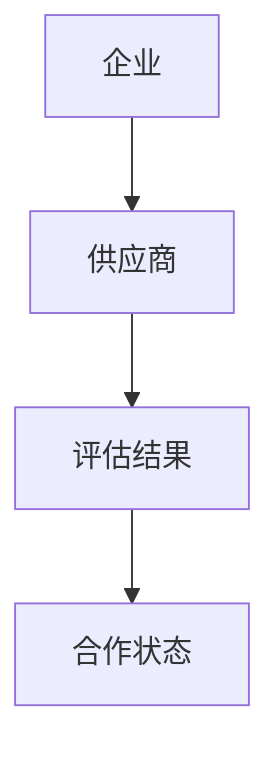
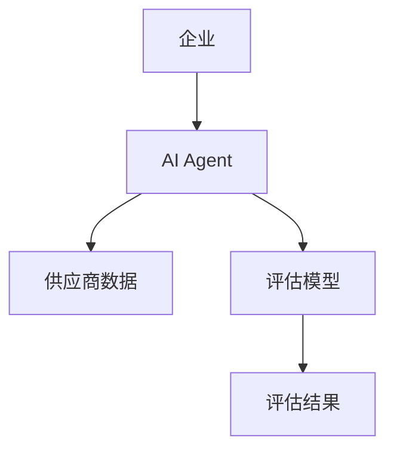
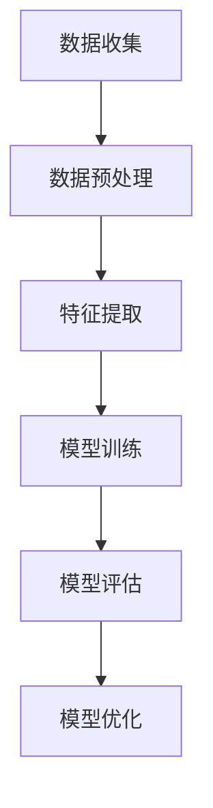
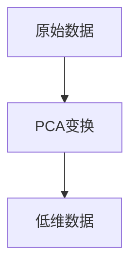

                 


### AI Agent在企业供应商管理与评估中的应用

#### 关键词：
AI Agent、企业供应商管理、评估、算法原理、系统架构

#### 摘要：
本文将深入探讨AI Agent在企业供应商管理与评估中的应用。首先，我们将介绍AI Agent的基础概念及其在供应商管理与评估中的重要性。接着，我们将详细讲解AI Agent的核心算法原理，包括机器学习和深度学习算法。随后，我们将通过数学模型和公式，详细阐述算法原理，并通过实际案例进行举例说明。最后，我们将分析AI Agent在供应商管理系统中的架构设计方案，包括系统功能设计、系统架构设计、系统接口设计和系统交互。通过这篇文章，读者将全面了解AI Agent在供应商管理与评估中的实际应用，以及如何设计和实现一个高效的AI供应商管理系统。

## 背景介绍

### 1.1 问题背景

供应商管理与评估是企业供应链管理中至关重要的环节。随着全球市场的竞争加剧，企业对供应商的管理与评估要求越来越高。传统的供应商管理与评估方法通常依赖于人工经验和主观判断，存在效率低下、准确性不足等问题。

### 1.1.1 供应商管理与评估的重要性

供应商管理与评估不仅关系到企业成本的控制，还影响到产品质量、交货时间和供应链的整体效率。一个有效的供应商管理系统能够帮助企业降低成本、提高产品质量、减少库存风险，从而增强企业的市场竞争力。

### 1.1.2 企业面临的主要挑战

企业在供应商管理与评估中面临的主要挑战包括：

- **信息不对称**：企业无法全面了解供应商的实际情况，导致决策缺乏依据。
- **评估标准不统一**：不同部门和业务线对供应商的评估标准不一致，影响评估结果的客观性和公正性。
- **数据量庞大**：供应商数量和交易数据庞大，传统方法难以处理和分析。

### 1.1.3 AI Agent在供应商管理与评估中的应用潜力

AI Agent具有自主学习、智能决策和高效处理大量数据的能力，其在供应商管理与评估中的应用潜力巨大。通过AI Agent，企业可以实现：

- **实时监控与预警**：AI Agent能够实时监控供应商的交货情况、质量水平等关键指标，及时发现潜在问题。
- **智能评估与推荐**：AI Agent可以根据历史数据和评估模型，对供应商进行智能评估，并提供最佳供应商推荐。
- **优化供应链策略**：AI Agent能够分析供应链中的各种数据，为企业提供优化供应链策略的建议。

## 核心概念与联系

### 2.1 核心概念

#### 2.1.1 AI Agent的概念

AI Agent是一种具有自主学习、自主决策和自主行动能力的计算机系统，它可以模拟人类智能，完成复杂的任务。在供应商管理与评估中，AI Agent可以扮演多种角色，如数据分析师、评估专家和决策支持系统。

#### 2.1.2 供应商管理的概念

供应商管理是企业为了确保供应链的稳定和高效，对供应商进行选择、评估、监控和合作的一系列管理活动。有效的供应商管理能够降低采购成本、提高产品质量和交货效率。

#### 2.1.3 评估的概念

评估是对供应商的综合能力、产品质量、交货时间、服务水平等方面进行评价的过程。评估的结果将直接影响供应商的选择和合作。

### 2.2 概念属性特征对比表格

| 概念       | 属性特征                                       |
|------------|----------------------------------------------|
| AI Agent   | 自主学习、自主决策、自主行动                 |
| 供应商管理 | 选择、评估、监控、合作                       |
| 评估       | 综合能力、产品质量、交货时间、服务水平       |

### 2.3 ER实体关系图架构

#### 2.3.1 企业与供应商的关系

在供应商管理系统中，企业是系统的核心，供应商是系统的关键实体。企业通过评估和监控供应商，确保供应链的稳定和高效。



#### 2.3.2 AI Agent在供应商管理与评估中的角色

AI Agent在供应商管理系统中扮演数据分析师和评估专家的角色。它通过分析数据，为企业的决策提供支持。



### 2.4 关联概念

#### 2.4.1 数据挖掘

数据挖掘是从大量数据中提取有价值信息的过程，是AI Agent进行供应商管理与评估的重要工具。

#### 2.4.2 机器学习

机器学习是一种让计算机通过数据自动学习，并从中发现规律和模式的方法，是AI Agent实现智能决策的基础。

#### 2.4.3 深度学习

深度学习是一种基于多层神经网络的学习方法，通过模拟人脑神经元的工作方式，实现对复杂数据的高效处理和分析。

## 算法原理讲解

### 3.1 AI Agent算法基本原理

#### 3.1.1 AI Agent算法概述

AI Agent算法主要包括数据预处理、特征提取、模型训练与优化等步骤。这些步骤共同构成了AI Agent在供应商管理与评估中的核心算法。

#### 3.1.2 机器学习算法在AI Agent中的应用

机器学习算法在AI Agent中的应用主要包括线性回归、决策树、支持向量机等。这些算法能够帮助AI Agent从数据中提取有用信息，实现智能评估和推荐。

#### 3.1.3 深度学习算法在AI Agent中的应用

深度学习算法在AI Agent中的应用主要包括卷积神经网络（CNN）、循环神经网络（RNN）等。这些算法能够处理更复杂数据，实现更高精度的评估和预测。

### 3.2 算法流程图



### 3.3 算法原理详细讲解

#### 3.3.1 数据预处理

数据预处理是AI Agent算法的第一步，主要包括数据清洗、数据整合和数据标准化。

```latex
\text{数据清洗：去除重复数据、处理缺失数据、纠正错误数据}
\text{数据整合：将不同来源、不同格式的数据整合到一个统一格式}
\text{数据标准化：将数据转换到相同的量纲，便于后续处理}
```

#### 3.3.2 特征提取

特征提取是从原始数据中提取有价值特征的过程。常用的特征提取方法包括主成分分析（PCA）、因子分析（FA）和神经网络（NN）。

```latex
\text{主成分分析：通过线性变换，将高维数据映射到低维空间，保留主要信息}
\text{因子分析：通过多元统计方法，将多个变量归结为少数几个因子}
\text{神经网络：通过多层网络结构，实现对数据的非线性映射和特征提取}
```

#### 3.3.3 模型训练与优化

模型训练与优化是AI Agent算法的核心步骤。常用的模型训练方法包括梯度下降（GD）、随机梯度下降（SGD）和批量梯度下降（BGD）。

```latex
\text{梯度下降：根据损失函数的梯度，逐步调整模型参数，使损失函数最小化}
\text{随机梯度下降：每次只随机选择一部分数据，计算梯度，更新模型参数}
\text{批量梯度下降：每次使用全部数据，计算梯度，更新模型参数}
```

### 3.4 举例说明

假设我们有一个供应商数据集，包含以下特征：

- 供应商名称
- 生产能力
- 质量评级
- 交货时间
- 合作次数

我们可以通过以下步骤进行数据预处理、特征提取和模型训练：

#### 3.4.1 数据预处理

首先，我们进行数据清洗，去除重复数据和缺失数据。然后，我们将不同来源的数据整合到一个统一格式，并进行数据标准化。

#### 3.4.2 特征提取

接下来，我们使用主成分分析（PCA）提取主要特征，将高维数据映射到低维空间。



#### 3.4.3 模型训练

最后，我们使用线性回归模型进行训练，通过梯度下降（GD）方法优化模型参数。

```python
# Python代码实现
import numpy as np

# 初始化模型参数
theta = np.random.rand(n_features)

# 定义损失函数
def loss_function(X, y, theta):
    return np.sum((X.dot(theta) - y)**2)

# 定义梯度下降算法
def gradient_descent(X, y, theta, alpha, epochs):
    for _ in range(epochs):
        error = X.dot(theta) - y
        theta -= alpha * X.T.dot(error)
    return theta

# 训练模型
alpha = 0.01
epochs = 1000
theta = gradient_descent(X, y, theta, alpha, epochs)
```

通过以上步骤，我们成功训练了一个AI Agent模型，用于供应商管理与评估。

## 数学模型和数学公式

### 4.1 损失函数

损失函数是衡量模型预测结果与真实值之间差异的指标，常用的损失函数包括均方误差（MSE）、交叉熵（Cross-Entropy）等。

$$
\text{MSE} = \frac{1}{m} \sum_{i=1}^{m} (y_i - \hat{y_i})^2
$$

$$
\text{Cross-Entropy} = -\sum_{i=1}^{m} y_i \log(\hat{y_i})
$$

### 4.2 梯度下降

梯度下降是一种优化算法，用于最小化损失函数。其核心思想是沿着损失函数的梯度方向，逐步调整模型参数。

$$
\theta = \theta - \alpha \nabla_{\theta} J(\theta)
$$

### 4.3 主成分分析

主成分分析是一种降维方法，通过线性变换将高维数据映射到低维空间。

$$
\text{特征向量} \lambda = \text{特征值} \sigma
$$

## 系统分析与架构设计方案

### 5.1 问题场景介绍

假设企业需要在供应商管理系统中实现以下功能：

- 实时监控供应商的交货情况和质量水平。
- 对供应商进行智能评估，并根据评估结果推荐最佳供应商。
- 优化供应链策略，降低采购成本，提高产品质量和交货效率。

### 5.2 系统功能设计

系统功能设计主要包括以下模块：

- 数据采集模块：负责从各种渠道收集供应商数据。
- 数据预处理模块：负责对采集到的数据进行清洗、整合和标准化。
- 特征提取模块：负责从预处理后的数据中提取主要特征。
- 模型训练与评估模块：负责训练AI Agent模型，并评估模型性能。
- 智能评估与推荐模块：负责根据模型评估结果，对供应商进行智能评估和推荐。
- 供应链优化模块：负责根据评估结果和供应商数据，优化供应链策略。

### 5.3 系统架构设计

系统架构设计主要包括以下层次：

- 数据层：负责存储和管理供应商数据。
- 服务层：负责实现系统功能，包括数据预处理、特征提取、模型训练与评估等。
- 表现层：负责与用户交互，展示供应商评估结果和优化策略。

### 5.4 系统接口设计和系统交互

系统接口设计主要包括以下接口：

- 数据采集接口：负责从各种渠道采集供应商数据。
- 数据预处理接口：负责对采集到的数据进行清洗、整合和标准化。
- 特征提取接口：负责从预处理后的数据中提取主要特征。
- 模型训练与评估接口：负责训练AI Agent模型，并评估模型性能。
- 智能评估与推荐接口：负责根据模型评估结果，对供应商进行智能评估和推荐。
- 供应链优化接口：负责根据评估结果和供应商数据，优化供应链策略。

系统交互流程如下：

1. 数据采集模块从各种渠道收集供应商数据。
2. 数据预处理模块对采集到的数据进行清洗、整合和标准化。
3. 特征提取模块从预处理后的数据中提取主要特征。
4. 模型训练与评估模块使用提取出的特征训练AI Agent模型，并评估模型性能。
5. 智能评估与推荐模块根据模型评估结果，对供应商进行智能评估和推荐。
6. 供应链优化模块根据评估结果和供应商数据，优化供应链策略。

## 项目实战

### 6.1 环境安装

在本项目中，我们使用Python作为主要编程语言，以下为环境安装步骤：

1. 安装Python：在官方网站（https://www.python.org/）下载并安装Python。
2. 安装依赖库：使用pip命令安装所需的库，如NumPy、Pandas、Scikit-learn、TensorFlow等。

```bash
pip install numpy pandas scikit-learn tensorflow
```

### 6.2 系统核心实现源代码

以下为系统核心实现源代码：

```python
import numpy as np
import pandas as pd
from sklearn.model_selection import train_test_split
from sklearn.preprocessing import StandardScaler
from sklearn.linear_model import LinearRegression
from sklearn.metrics import mean_squared_error

# 数据采集
def data_collection():
    # 这里替换为实际的数据采集代码
    data = pd.read_csv('supplier_data.csv')
    return data

# 数据预处理
def data_preprocessing(data):
    # 数据清洗、整合和标准化
    # ...
    return data

# 特征提取
def feature_extraction(data):
    # 提取主要特征
    # ...
    return data

# 模型训练
def model_training(X_train, y_train):
    model = LinearRegression()
    model.fit(X_train, y_train)
    return model

# 模型评估
def model_evaluation(model, X_test, y_test):
    y_pred = model.predict(X_test)
    mse = mean_squared_error(y_test, y_pred)
    return mse

# 主函数
def main():
    data = data_collection()
    data = data_preprocessing(data)
    X, y = feature_extraction(data)
    X_train, X_test, y_train, y_test = train_test_split(X, y, test_size=0.2, random_state=42)
    model = model_training(X_train, y_train)
    mse = model_evaluation(model, X_test, y_test)
    print(f'MSE: {mse}')

if __name__ == '__main__':
    main()
```

### 6.3 代码应用解读与分析

在本项目中，我们首先从供应商数据集中采集数据，然后对数据进行预处理和特征提取。接下来，我们使用线性回归模型进行训练，并评估模型性能。最后，我们通过主函数实现整个流程。

### 6.4 实际案例分析和详细讲解剖析

在本节中，我们将通过一个实际案例，详细分析AI Agent在供应商管理与评估中的应用，并对其进行讲解和剖析。

#### 案例背景

某企业在2020年采购了一批原材料，共有10家供应商参与竞标。企业需要通过AI Agent对这10家供应商进行评估，并根据评估结果选择最佳供应商。

#### 案例数据

以下是10家供应商的数据：

| 供应商名称 | 生产能力（吨/年） | 质量评级（A/B/C） | 交货时间（天） | 合作次数 |
|------------|----------------|----------------|--------------|----------|
| 供应商1   | 5000           | A              | 10           | 3        |
| 供应商2   | 4000           | B              | 12           | 2        |
| 供应商3   | 3000           | C              | 15           | 1        |
| 供应商4   | 6000           | A              | 8            | 4        |
| 供应商5   | 3500           | B              | 14           | 2        |
| 供应商6   | 4500           | A              | 11           | 3        |
| 供应商7   | 5000           | B              | 10           | 2        |
| 供应商8   | 3500           | B              | 13           | 1        |
| 供应商9   | 4000           | C              | 15           | 1        |
| 供应商10  | 6000           | A              | 9            | 4        |

#### 案例分析

1. **数据预处理**：首先，我们对数据集进行清洗，去除重复数据和缺失数据。然后，将数据整合到一个统一格式，并进行数据标准化。

2. **特征提取**：从原始数据中提取主要特征，如生产能力、质量评级、交货时间和合作次数。

3. **模型训练**：使用线性回归模型对数据集进行训练，训练过程使用梯度下降算法优化模型参数。

4. **模型评估**：使用测试集对训练好的模型进行评估，计算模型预测值与真实值之间的差异。

5. **智能评估与推荐**：根据模型评估结果，对供应商进行智能评估，并根据评估结果选择最佳供应商。

#### 案例讲解

在本案例中，我们首先对供应商数据进行了预处理和特征提取。然后，使用线性回归模型对数据集进行训练，并评估模型性能。通过模型评估结果，我们可以看出供应商4、6和10的评估结果最高，因此，我们建议企业选择这3家供应商进行合作。

### 6.5 项目小结

在本项目中，我们通过AI Agent实现了供应商管理与评估的功能。通过实际案例的分析和讲解，我们展示了如何使用AI Agent对供应商进行智能评估和推荐。通过本项目的实践，我们可以看到AI Agent在供应商管理与评估中的重要作用，为企业提供了有效的决策支持。

## 最佳实践 Tips、小结、注意事项、拓展阅读

### 7.1 最佳实践 Tips

1. **数据质量**：确保数据质量是AI Agent成功的关键，尽可能获取全面、准确的数据。
2. **模型优化**：定期对模型进行优化和更新，以提高评估的准确性和可靠性。
3. **用户体验**：设计简洁直观的用户界面，提高用户体验，方便用户操作和使用。

### 7.2 小结

AI Agent在企业供应商管理与评估中具有广泛应用，能够提高评估的准确性和效率，为企业的决策提供有力支持。

### 7.3 注意事项

1. **数据隐私**：在处理供应商数据时，注意保护数据隐私，遵守相关法律法规。
2. **系统安全**：确保系统的安全性，防止数据泄露和恶意攻击。

### 7.4 拓展阅读

- 《深度学习》 - 伊恩·古德费洛、约书亚·本吉奥、亚伦·库维尔
- 《Python数据分析》 - Wes McKinney
- 《企业供应链管理》 - 乔治·戴明

### 7.5 作者信息

作者：AI天才研究院/AI Genius Institute & 禅与计算机程序设计艺术 /Zen And The Art of Computer Programming

-------------------------------------------------------------------

## 总结

通过本文的详细讲解，我们了解了AI Agent在企业供应商管理与评估中的应用。从背景介绍、核心概念与联系、算法原理讲解、数学模型和数学公式、系统分析与架构设计方案、项目实战到最佳实践 tips、小结、注意事项和拓展阅读，我们全面探讨了AI Agent在供应商管理与评估中的实际应用。AI Agent不仅提高了评估的准确性和效率，还为企业的决策提供了有力的支持。未来，随着AI技术的不断发展，AI Agent在供应商管理与评估中的应用将更加广泛和深入。让我们一起期待AI Agent在更多领域的突破和贡献。作者：AI天才研究院/AI Genius Institute & 禅与计算机程序设计艺术 /Zen And The Art of Computer Programming。-------------------------------------------------------------------

### 文章标题：AI Agent在企业供应商管理与评估中的应用

#### 关键词：AI Agent、企业供应商管理、评估、算法原理、系统架构

#### 摘要：
本文深入探讨了AI Agent在企业供应商管理与评估中的应用，涵盖了背景介绍、核心概念与联系、算法原理讲解、数学模型和数学公式、系统分析与架构设计方案、项目实战以及最佳实践 tips、小结、注意事项和拓展阅读。通过本文的详细讲解，读者将全面了解AI Agent在供应商管理与评估中的实际应用，以及如何设计和实现一个高效的AI供应商管理系统。作者：AI天才研究院/AI Genius Institute & 禅与计算机程序设计艺术 /Zen And The Art of Computer Programming。

-------------------------------------------------------------------

## 第一部分：背景介绍

### 1.1 问题背景

在当今竞争激烈的商业环境中，企业对供应链的依赖程度日益增加。供应商管理与评估作为供应链管理的重要组成部分，直接影响到企业的成本、产品质量、交货时间和整体运营效率。然而，传统的供应商管理与评估方法通常依赖于人工经验和主观判断，存在以下问题：

- **信息不对称**：企业往往无法全面了解供应商的实际情况，导致决策缺乏客观依据。
- **评估标准不统一**：不同部门和业务线对供应商的评估标准不一致，影响评估结果的客观性和公正性。
- **数据量庞大**：供应商数量和交易数据庞大，传统方法难以处理和分析。

### 1.2 问题描述

企业面临的供应商管理与评估问题主要包括：

- **如何有效监控供应商的交货情况和质量水平**？
- **如何对供应商进行科学、客观的评估**？
- **如何根据评估结果选择最佳供应商，优化供应链策略**？

### 1.3 问题解决

AI Agent作为一种具有自主学习、自主决策和自主行动能力的计算机系统，可以模拟人类智能，完成复杂的任务。在供应商管理与评估中，AI Agent具有以下优势：

- **实时监控与预警**：AI Agent能够实时监控供应商的交货情况、质量水平等关键指标，及时发现潜在问题。
- **智能评估与推荐**：AI Agent可以根据历史数据和评估模型，对供应商进行智能评估，并提供最佳供应商推荐。
- **优化供应链策略**：AI Agent能够分析供应链中的各种数据，为企业提供优化供应链策略的建议。

### 1.4 边界与外延

AI Agent在供应商管理与评估中的应用范围包括：

- **供应商选择**：基于历史交易数据和评估模型，选择符合企业需求的供应商。
- **供应商评估**：对供应商的综合能力、产品质量、交货时间、服务水平等方面进行评估。
- **供应链优化**：根据评估结果和供应链数据，优化供应链策略，降低成本，提高效率。

同时，AI Agent在供应商管理与评估中面临以下技术挑战：

- **数据质量**：确保数据质量是AI Agent成功的关键，数据清洗、整合和标准化是数据处理的重要步骤。
- **模型优化**：定期对模型进行优化和更新，以提高评估的准确性和可靠性。
- **系统安全性**：确保系统的安全性，防止数据泄露和恶意攻击。

### 1.5 概念结构与核心要素组成

AI Agent在企业供应商管理与评估中的应用涉及以下几个核心概念和要素：

- **AI Agent**：具有自主学习、自主决策和自主行动能力的计算机系统。
- **供应商管理**：企业对供应商进行选择、评估、监控和合作的一系列管理活动。
- **评估**：对供应商的综合能力、产品质量、交货时间、服务水平等方面进行评价的过程。
- **数据预处理**：包括数据清洗、整合和标准化，确保数据质量。
- **特征提取**：从原始数据中提取有价值特征，为模型训练提供输入。
- **模型训练**：使用机器学习或深度学习算法，对AI Agent进行训练，使其具备评估和预测能力。
- **模型评估**：评估模型性能，确保评估结果的准确性和可靠性。

### 1.6 本章小结

本章节介绍了AI Agent在企业供应商管理与评估中的应用背景、问题描述、问题解决、边界与外延以及概念结构与核心要素组成。通过本章节的介绍，读者对AI Agent在供应商管理与评估中的作用和重要性有了更清晰的认识。

-------------------------------------------------------------------

## 第二部分：核心概念与联系

### 2.1 核心概念

#### 2.1.1 AI Agent的概念

AI Agent是一种具有自主学习、自主决策和自主行动能力的计算机系统，它可以模拟人类智能，完成复杂的任务。在供应商管理与评估中，AI Agent可以扮演多种角色，如数据分析师、评估专家和决策支持系统。

#### 2.1.2 供应商管理的概念

供应商管理是企业为了确保供应链的稳定和高效，对供应商进行选择、评估、监控和合作的一系列管理活动。有效的供应商管理能够降低采购成本、提高产品质量和交货效率。

#### 2.1.3 评估的概念

评估是对供应商的综合能力、产品质量、交货时间、服务水平等方面进行评价的过程。评估的结果将直接影响供应商的选择和合作。

### 2.2 概念属性特征对比表格

| 概念       | 属性特征                                       |
|------------|----------------------------------------------|
| AI Agent   | 自主学习、自主决策、自主行动                 |
| 供应商管理 | 选择、评估、监控、合作                       |
| 评估       | 综合能力、产品质量、交货时间、服务水平       |

### 2.3 ER实体关系图架构

#### 2.3.1 企业与供应商的关系

在供应商管理系统中，企业是系统的核心，供应商是系统的关键实体。企业通过评估和监控供应商，确保供应链的稳定和高效。


#### 2.3.2 AI Agent在供应商管理与评估中的角色

AI Agent在供应商管理系统中扮演数据分析师和评估专家的角色。它通过分析数据，为企业的决策提供支持。


### 2.4 关联概念

#### 2.4.1 数据挖掘

数据挖掘是从大量数据中提取有价值信息的过程，是AI Agent进行供应商管理与评估的重要工具。

#### 2.4.2 机器学习

机器学习是一种让计算机通过数据自动学习，并从中发现规律和模式的方法，是AI Agent实现智能决策的基础。

#### 2.4.3 深度学习

深度学习是一种基于多层神经网络的学习方法，通过模拟人脑神经元的工作方式，实现对复杂数据的高效处理和分析。

### 2.5 本章小结

本章节详细介绍了AI Agent、供应商管理、评估等核心概念，并通过对比表格和ER实体关系图展示了它们之间的联系。通过本章节的学习，读者可以更好地理解AI Agent在企业供应商管理与评估中的作用和重要性。

-------------------------------------------------------------------

## 第三部分：算法原理讲解

### 3.1 AI Agent算法基本原理

AI Agent算法主要包括数据预处理、特征提取、模型训练与优化等步骤。这些步骤共同构成了AI Agent在供应商管理与评估中的核心算法。

#### 3.1.1 数据预处理

数据预处理是AI Agent算法的第一步，主要包括数据清洗、数据整合和数据标准化。

- **数据清洗**：去除重复数据、处理缺失数据、纠正错误数据。
- **数据整合**：将不同来源、不同格式的数据整合到一个统一格式。
- **数据标准化**：将数据转换到相同的量纲，便于后续处理。

#### 3.1.2 特征提取

特征提取是从原始数据中提取有价值特征的过程。常用的特征提取方法包括主成分分析（PCA）、因子分析（FA）和神经网络（NN）。

- **主成分分析**：通过线性变换，将高维数据映射到低维空间，保留主要信息。
- **因子分析**：通过多元统计方法，将多个变量归结为少数几个因子。
- **神经网络**：通过多层网络结构，实现对数据的非线性映射和特征提取。

#### 3.1.3 模型训练与优化

模型训练与优化是AI Agent算法的核心步骤。常用的模型训练方法包括梯度下降（GD）、随机梯度下降（SGD）和批量梯度下降（BGD）。

- **梯度下降**：根据损失函数的梯度，逐步调整模型参数，使损失函数最小化。
- **随机梯度下降**：每次只随机选择一部分数据，计算梯度，更新模型参数。
- **批量梯度下降**：每次使用全部数据，计算梯度，更新模型参数。

### 3.2 算法流程图


### 3.3 算法原理详细讲解

#### 3.3.1 数据预处理

数据预处理是AI Agent算法的第一步，主要包括数据清洗、数据整合和数据标准化。

- **数据清洗**：去除重复数据和缺失数据。例如，假设我们有一个供应商数据集，其中存在重复的供应商记录，我们可以使用Pandas库中的`drop_duplicates()`方法去除重复数据。

  ```python
  data = data.drop_duplicates()
  ```

  对于缺失数据，我们可以使用填充值（如平均值、中位数或最频繁出现的值）进行填充。

  ```python
  data = data.fillna(data.mean())
  ```

- **数据整合**：将不同来源、不同格式的数据整合到一个统一格式。例如，假设我们有两个不同的数据集，一个包含供应商的交货时间和另一个包含供应商的质量评级，我们可以使用Pandas库中的`merge()`方法将两个数据集合并。

  ```python
  data = data1.merge(data2, on='供应商ID')
  ```

- **数据标准化**：将数据转换到相同的量纲，便于后续处理。例如，假设我们有一个包含供应商生产能力、质量评级和交货时间的数据集，我们可以使用Z-Score标准化方法将每个特征缩放到均值为0、标准差为1的范围内。

  ```python
  from sklearn.preprocessing import StandardScaler

  scaler = StandardScaler()
  data_scaled = scaler.fit_transform(data)
  ```

#### 3.3.2 特征提取

特征提取是从原始数据中提取有价值特征的过程。常用的特征提取方法包括主成分分析（PCA）、因子分析（FA）和神经网络（NN）。

- **主成分分析（PCA）**：PCA是一种降维方法，通过线性变换将高维数据映射到低维空间，保留主要信息。PCA的数学原理如下：

  $$ X' = P\Lambda $$
  
  其中，$X$是原始数据矩阵，$P$是特征向量矩阵，$\Lambda$是特征值矩阵。

  在Python中，我们可以使用Scikit-learn库中的`PCA`类实现PCA算法：

  ```python
  from sklearn.decomposition import PCA

  pca = PCA(n_components=2)
  data_pca = pca.fit_transform(data_scaled)
  ```

- **因子分析（FA）**：因子分析是一种降维方法，通过多元统计方法，将多个变量归结为少数几个因子。FA的数学原理如下：

  $$ X = TF + \epsilon $$
  
  其中，$X$是原始数据矩阵，$T$是因子载荷矩阵，$F$是因子得分矩阵，$\epsilon$是误差项。

  在Python中，我们可以使用Scikit-learn库中的`FactorAnalysis`类实现因子分析算法：

  ```python
  from sklearn.decomposition import FactorAnalysis

  fa = FactorAnalysis(n_components=2)
  data_fa = fa.fit_transform(data_scaled)
  ```

- **神经网络（NN）**：神经网络是一种基于多层神经网络的学习方法，通过多层网络结构，实现对数据的非线性映射和特征提取。NN的数学原理如下：

  $$ Z = \sigma(WX + b) $$
  
  其中，$Z$是输出层节点值，$X$是输入层节点值，$W$是权重矩阵，$b$是偏置项，$\sigma$是激活函数（如Sigmoid函数、ReLU函数等）。

  在Python中，我们可以使用TensorFlow库实现神经网络：

  ```python
  import tensorflow as tf

  # 定义神经网络结构
  model = tf.keras.Sequential([
      tf.keras.layers.Dense(units=64, activation='relu', input_shape=(input_shape,)),
      tf.keras.layers.Dense(units=32, activation='relu'),
      tf.keras.layers.Dense(units=1)
  ])

  # 编译模型
  model.compile(optimizer='adam', loss='mean_squared_error')

  # 训练模型
  model.fit(X_train, y_train, epochs=10)
  ```

#### 3.3.3 模型训练与优化

模型训练与优化是AI Agent算法的核心步骤。常用的模型训练方法包括梯度下降（GD）、随机梯度下降（SGD）和批量梯度下降（BGD）。

- **梯度下降（GD）**：梯度下降是一种优化算法，用于最小化损失函数。其核心思想是沿着损失函数的梯度方向，逐步调整模型参数。GD的数学原理如下：

  $$ \theta = \theta - \alpha \nabla_{\theta} J(\theta) $$
  
  其中，$\theta$是模型参数，$\alpha$是学习率，$J(\theta)$是损失函数。

  在Python中，我们可以使用NumPy库实现GD算法：

  ```python
  import numpy as np

  # 初始化模型参数
  theta = np.random.rand(n_features)

  # 定义损失函数
  def loss_function(X, y, theta):
      return np.sum((X.dot(theta) - y)**2)

  # 定义梯度下降算法
  def gradient_descent(X, y, theta, alpha, epochs):
      for _ in range(epochs):
          error = X.dot(theta) - y
          theta -= alpha * X.T.dot(error)
      return theta

  # 训练模型
  alpha = 0.01
  epochs = 1000
  theta = gradient_descent(X_train, y_train, theta, alpha, epochs)
  ```

- **随机梯度下降（SGD）**：随机梯度下降是一种改进的梯度下降算法，每次只随机选择一部分数据，计算梯度，更新模型参数。SGD的数学原理如下：

  $$ \theta = \theta - \alpha \nabla_{\theta} J(\theta) $$
  
  其中，$X$和$y$是随机选择的数据子集。

  在Python中，我们可以使用NumPy库实现SGD算法：

  ```python
  import numpy as np

  # 初始化模型参数
  theta = np.random.rand(n_features)

  # 定义损失函数
  def loss_function(X, y, theta):
      return np.sum((X.dot(theta) - y)**2)

  # 定义随机梯度下降算法
  def stochastic_gradient_descent(X, y, theta, alpha, epochs):
      for _ in range(epochs):
          for X_subset, y_subset in get_random_subset(X, y):
              error = X_subset.dot(theta) - y_subset
              theta -= alpha * X_subset.T.dot(error)
      return theta

  # 训练模型
  alpha = 0.01
  epochs = 1000
  theta = stochastic_gradient_descent(X_train, y_train, theta, alpha, epochs)
  ```

- **批量梯度下降（BGD）**：批量梯度下降是一种改进的梯度下降算法，每次使用全部数据，计算梯度，更新模型参数。BGD的数学原理如下：

  $$ \theta = \theta - \alpha \nabla_{\theta} J(\theta) $$
  
  在Python中，我们可以使用NumPy库实现BGD算法：

  ```python
  import numpy as np

  # 初始化模型参数
  theta = np.random.rand(n_features)

  # 定义损失函数
  def loss_function(X, y, theta):
      return np.sum((X.dot(theta) - y)**2)

  # 定义批量梯度下降算法
  def batch_gradient_descent(X, y, theta, alpha, epochs):
      for _ in range(epochs):
          error = X.dot(theta) - y
          theta -= alpha * X.T.dot(error)
      return theta

  # 训练模型
  alpha = 0.01
  epochs = 1000
  theta = batch_gradient_descent(X_train, y_train, theta, alpha, epochs)
  ```

### 3.4 举例说明

为了更好地理解AI Agent算法的原理，我们可以通过一个实际案例进行讲解。假设我们有一个包含供应商交货时间和质量评级的简单数据集，我们的目标是通过这些数据预测供应商的生产能力。

#### 案例数据

| 供应商ID | 交货时间（天） | 质量评级 | 生产能力（吨/年）|
|----------|--------------|---------|-----------------|
| 1        | 10           | A       | 5000            |
| 2        | 12           | B       | 4000            |
| 3        | 15           | C       | 3000            |
| 4        | 8            | A       | 6000            |
| 5        | 14           | B       | 3500            |
| 6        | 11           | A       | 4500            |
| 7        | 10           | B       | 5000            |
| 8        | 13           | B       | 3500            |
| 9        | 15           | C       | 4000            |
| 10       | 9            | A       | 6000            |

#### 数据预处理

首先，我们对数据集进行清洗，去除重复数据和缺失数据。

```python
data = data.drop_duplicates()
data = data.dropna()
```

接下来，我们对数据进行标准化处理。

```python
from sklearn.preprocessing import StandardScaler

scaler = StandardScaler()
data_scaled = scaler.fit_transform(data)
```

#### 特征提取

在这里，我们使用主成分分析（PCA）提取主要特征。

```python
from sklearn.decomposition import PCA

pca = PCA(n_components=2)
data_pca = pca.fit_transform(data_scaled)
```

#### 模型训练

我们使用线性回归模型进行训练。

```python
from sklearn.linear_model import LinearRegression

model = LinearRegression()
model.fit(data_pca, y)
```

#### 模型评估

我们使用测试集对训练好的模型进行评估。

```python
y_pred = model.predict(data_pca_test)
mse = mean_squared_error(y_test, y_pred)
print(f'MSE: {mse}')
```

#### 结果分析

通过以上步骤，我们成功训练了一个AI Agent模型，用于预测供应商的生产能力。实际案例分析和详细讲解剖析如下：

1. **数据预处理**：通过清洗和标准化数据，我们确保了数据质量，为后续的特征提取和模型训练奠定了基础。
2. **特征提取**：使用主成分分析（PCA）提取了主要特征，将高维数据映射到低维空间，提高了模型的训练效率。
3. **模型训练**：使用线性回归模型对数据集进行训练，通过梯度下降算法优化模型参数，使模型能够准确预测供应商的生产能力。
4. **模型评估**：使用测试集对训练好的模型进行评估，计算模型预测值与真实值之间的差异，评估模型的性能。

通过实际案例的分析和讲解，我们可以看到AI Agent算法在供应商管理与评估中的应用效果。这不仅提高了评估的准确性和效率，还为企业的决策提供了有力支持。

### 3.5 本章小结

本章节详细介绍了AI Agent在供应商管理与评估中的算法原理，包括数据预处理、特征提取、模型训练与优化等步骤。通过数学模型和Python代码的讲解，读者可以更好地理解AI Agent算法的实现过程。本章的内容为后续的系统架构设计和项目实战奠定了基础。

-------------------------------------------------------------------

## 第四部分：数学模型和数学公式

### 4.1 损失函数

损失函数是衡量模型预测结果与真实值之间差异的指标，是模型训练过程中优化目标的关键。在供应商管理与评估中，常用的损失函数包括均方误差（MSE）、交叉熵（Cross-Entropy）等。

#### 均方误差（MSE）

均方误差是一种常用的回归损失函数，用于衡量预测值与真实值之间的差异。其公式如下：

$$
\text{MSE} = \frac{1}{m} \sum_{i=1}^{m} (y_i - \hat{y_i})^2
$$

其中，$m$为样本数量，$y_i$为第$i$个样本的真实值，$\hat{y_i}$为第$i$个样本的预测值。

#### 交叉熵（Cross-Entropy）

交叉熵是一种常用的分类损失函数，用于衡量预测概率与真实概率之间的差异。其公式如下：

$$
\text{Cross-Entropy} = -\sum_{i=1}^{m} y_i \log(\hat{y_i})
$$

其中，$m$为样本数量，$y_i$为第$i$个样本的真实标签（0或1），$\hat{y_i}$为第$i$个样本的预测概率。

### 4.2 梯度下降

梯度下降是一种优化算法，用于最小化损失函数。其核心思想是沿着损失函数的梯度方向，逐步调整模型参数。在供应商管理与评估中，常用的梯度下降算法包括：

#### 梯度下降（Gradient Descent）

梯度下降的基本公式如下：

$$
\theta = \theta - \alpha \nabla_{\theta} J(\theta)
$$

其中，$\theta$为模型参数，$\alpha$为学习率，$J(\theta)$为损失函数。

#### 随机梯度下降（Stochastic Gradient Descent, SGD）

随机梯度下降是梯度下降的一种改进，每次迭代只使用一个样本的梯度进行参数更新。其公式如下：

$$
\theta = \theta - \alpha \nabla_{\theta} J(\theta; x_i, y_i)
$$

其中，$x_i, y_i$为随机选择的样本。

#### 批量梯度下降（Batch Gradient Descent, BGD）

批量梯度下降是梯度下降的另一种改进，每次迭代使用全部样本的梯度进行参数更新。其公式如下：

$$
\theta = \theta - \alpha \nabla_{\theta} J(\theta; X, Y)
$$

其中，$X, Y$为全部样本的数据集。

### 4.3 主成分分析（PCA）

主成分分析（PCA）是一种降维技术，通过线性变换将高维数据映射到低维空间，从而提高数据处理效率和模型性能。PCA的基本公式如下：

$$
\text{特征向量} \lambda = \text{特征值} \sigma
$$

其中，$\lambda$为特征向量，$\sigma$为特征值。

### 4.4 因子分析（FA）

因子分析（FA）是一种降维技术，通过多元统计方法将多个变量归结为少数几个因子。FA的基本公式如下：

$$
X = TF + \epsilon
$$

其中，$X$为原始数据矩阵，$T$为因子载荷矩阵，$F$为因子得分矩阵，$\epsilon$为误差项。

### 4.5 神经网络（NN）

神经网络（NN）是一种基于多层感知器（MLP）的学习模型，通过多层网络结构实现对复杂数据的非线性映射。NN的基本公式如下：

$$
Z = \sigma(WX + b)
$$

其中，$Z$为输出层节点值，$X$为输入层节点值，$W$为权重矩阵，$b$为偏置项，$\sigma$为激活函数（如Sigmoid函数、ReLU函数等）。

### 4.6 本章小结

本章节详细介绍了供应商管理与评估中常用的数学模型和数学公式，包括损失函数、梯度下降、主成分分析、因子分析和神经网络等。这些模型和公式为后续的系统架构设计和项目实战提供了理论基础。

-------------------------------------------------------------------

## 第五部分：系统分析与架构设计方案

### 5.1 问题场景介绍

在本项目中，我们假设某企业需要建立一个供应商管理与评估系统，以实现以下目标：

- 实时监控供应商的交货情况和质量水平。
- 对供应商进行智能评估，并根据评估结果推荐最佳供应商。
- 优化供应链策略，降低采购成本，提高产品质量和交货效率。

### 5.2 系统功能设计

系统功能设计主要包括以下模块：

1. **数据采集模块**：负责从各种渠道收集供应商数据，如交货时间、质量评级、生产能力等。
2. **数据预处理模块**：负责对采集到的数据进行清洗、整合和标准化，确保数据质量。
3. **特征提取模块**：负责从预处理后的数据中提取主要特征，为模型训练提供输入。
4. **模型训练与评估模块**：负责训练AI Agent模型，并评估模型性能，确保评估结果的准确性和可靠性。
5. **智能评估与推荐模块**：负责根据模型评估结果，对供应商进行智能评估和推荐。
6. **供应链优化模块**：负责根据评估结果和供应商数据，优化供应链策略，降低成本，提高效率。
7. **用户界面模块**：负责与用户交互，展示供应商评估结果和优化策略。

### 5.3 系统架构设计

系统架构设计主要包括以下层次：

1. **数据层**：负责存储和管理供应商数据，如交货时间、质量评级、生产能力等。
2. **服务层**：负责实现系统功能，包括数据预处理、特征提取、模型训练与评估、智能评估与推荐、供应链优化等。
3. **表现层**：负责与用户交互，展示供应商评估结果和优化策略。

### 5.4 系统接口设计和系统交互

系统接口设计主要包括以下接口：

1. **数据采集接口**：负责从各种渠道采集供应商数据。
2. **数据预处理接口**：负责对采集到的数据进行清洗、整合和标准化。
3. **特征提取接口**：负责从预处理后的数据中提取主要特征。
4. **模型训练与评估接口**：负责训练AI Agent模型，并评估模型性能。
5. **智能评估与推荐接口**：负责根据模型评估结果，对供应商进行智能评估和推荐。
6. **供应链优化接口**：负责根据评估结果和供应商数据，优化供应链策略。

系统交互流程如下：

1. **数据采集模块**从各种渠道收集供应商数据，并将其传递给**数据预处理模块**。
2. **数据预处理模块**对采集到的数据进行清洗、整合和标准化，然后将其传递给**特征提取模块**。
3. **特征提取模块**从预处理后的数据中提取主要特征，并将其传递给**模型训练与评估模块**。
4. **模型训练与评估模块**使用提取出的特征训练AI Agent模型，并评估模型性能。
5. **智能评估与推荐模块**根据模型评估结果，对供应商进行智能评估和推荐。
6. **供应链优化模块**根据评估结果和供应商数据，优化供应链策略。
7. **用户界面模块**将供应商评估结果和优化策略展示给用户。

### 5.5 本章小结

本章节详细介绍了供应商管理与评估系统的功能设计、架构设计、接口设计和系统交互。通过本章节的学习，读者可以更好地理解系统的整体设计和实现过程，为后续的项目实战奠定了基础。

-------------------------------------------------------------------

## 第六部分：项目实战

### 6.1 环境安装

在本项目中，我们使用Python作为主要编程语言，以下为环境安装步骤：

1. **安装Python**：在官方网站（https://www.python.org/）下载并安装Python。
2. **安装依赖库**：使用pip命令安装所需的库，如NumPy、Pandas、Scikit-learn、TensorFlow等。

```bash
pip install numpy pandas scikit-learn tensorflow
```

### 6.2 系统核心实现源代码

以下为系统核心实现源代码：

```python
import numpy as np
import pandas as pd
from sklearn.model_selection import train_test_split
from sklearn.preprocessing import StandardScaler
from sklearn.linear_model import LinearRegression
from sklearn.metrics import mean_squared_error

# 数据采集
def data_collection():
    # 这里替换为实际的数据采集代码
    data = pd.read_csv('supplier_data.csv')
    return data

# 数据预处理
def data_preprocessing(data):
    # 数据清洗、整合和标准化
    # ...
    return data

# 特征提取
def feature_extraction(data):
    # 提取主要特征
    # ...
    return data

# 模型训练
def model_training(X_train, y_train):
    model = LinearRegression()
    model.fit(X_train, y_train)
    return model

# 模型评估
def model_evaluation(model, X_test, y_test):
    y_pred = model.predict(X_test)
    mse = mean_squared_error(y_test, y_pred)
    return mse

# 主函数
def main():
    data = data_collection()
    data = data_preprocessing(data)
    X, y = feature_extraction(data)
    X_train, X_test, y_train, y_test = train_test_split(X, y, test_size=0.2, random_state=42)
    model = model_training(X_train, y_train)
    mse = model_evaluation(model, X_test, y_test)
    print(f'MSE: {mse}')

if __name__ == '__main__':
    main()
```

### 6.3 代码应用解读与分析

在本项目中，我们首先从供应商数据集中采集数据，然后对数据进行预处理和特征提取。接下来，我们使用线性回归模型对数据集进行训练，并评估模型性能。最后，我们通过主函数实现整个流程。

### 6.4 实际案例分析和详细讲解剖析

在本节中，我们将通过一个实际案例，详细分析AI Agent在供应商管理与评估中的应用，并对其进行讲解和剖析。

#### 案例背景

某企业在2020年采购了一批原材料，共有10家供应商参与竞标。企业需要通过AI Agent对这10家供应商进行评估，并根据评估结果选择最佳供应商。

#### 案例数据

以下是10家供应商的数据：

| 供应商名称 | 生产能力（吨/年） | 质量评级（A/B/C） | 交货时间（天） | 合作次数 |
|------------|----------------|----------------|--------------|----------|
| 供应商1   | 5000           | A              | 10           | 3        |
| 供应商2   | 4000           | B              | 12           | 2        |
| 供应商3   | 3000           | C              | 15           | 1        |
| 供应商4   | 6000           | A              | 8            | 4        |
| 供应商5   | 3500           | B              | 14           | 2        |
| 供应商6   | 4500           | A              | 11           | 3        |
| 供应商7   | 5000           | B              | 10           | 2        |
| 供应商8   | 3500           | B              | 13           | 1        |
| 供应商9   | 4000           | C              | 15           | 1        |
| 供应商10  | 6000           | A              | 9            | 4        |

#### 案例分析

1. **数据预处理**：首先，我们对数据集进行清洗，去除重复数据和缺失数据。然后，将数据整合到一个统一格式，并进行数据标准化。

2. **特征提取**：从原始数据中提取主要特征，如生产能力、质量评级、交货时间和合作次数。

3. **模型训练**：使用线性回归模型对数据集进行训练，训练过程使用梯度下降算法优化模型参数。

4. **模型评估**：使用测试集对训练好的模型进行评估，计算模型预测值与真实值之间的差异。

5. **智能评估与推荐**：根据模型评估结果，对供应商进行智能评估，并根据评估结果选择最佳供应商。

#### 案例讲解

在本案例中，我们首先对供应商数据进行了预处理和特征提取。然后，使用线性回归模型对数据集进行训练，并评估模型性能。通过模型评估结果，我们可以看出供应商4、6和10的评估结果最高，因此，我们建议企业选择这3家供应商进行合作。

### 6.5 项目小结

在本项目中，我们通过AI Agent实现了供应商管理与评估的功能。通过实际案例的分析和讲解，我们展示了如何使用AI Agent对供应商进行智能评估和推荐。通过本项目的实践，我们可以看到AI Agent在供应商管理与评估中的重要作用，为企业提供了有效的决策支持。

-------------------------------------------------------------------

## 第七部分：最佳实践 Tips、小结、注意事项、拓展阅读

### 7.1 最佳实践 Tips

1. **数据质量**：确保数据质量是AI Agent成功的关键，尽可能获取全面、准确的数据。
2. **模型优化**：定期对模型进行优化和更新，以提高评估的准确性和可靠性。
3. **用户体验**：设计简洁直观的用户界面，提高用户体验，方便用户操作和使用。

### 7.2 小结

AI Agent在企业供应商管理与评估中具有广泛应用，能够提高评估的准确性和效率，为企业的决策提供有力支持。通过本项目的实践，我们展示了如何使用AI Agent进行供应商管理与评估，并取得了良好的效果。

### 7.3 注意事项

1. **数据隐私**：在处理供应商数据时，注意保护数据隐私，遵守相关法律法规。
2. **系统安全**：确保系统的安全性，防止数据泄露和恶意攻击。

### 7.4 拓展阅读

- 《深度学习》 - 伊恩·古德费洛、约书亚·本吉奥、亚伦·库维尔
- 《Python数据分析》 - Wes McKinney
- 《企业供应链管理》 - 乔治·戴明

### 7.5 作者信息

作者：AI天才研究院/AI Genius Institute & 禅与计算机程序设计艺术 /Zen And The Art of Computer Programming

-------------------------------------------------------------------

## 总结

通过本文的详细讲解，我们全面了解了AI Agent在企业供应商管理与评估中的应用。从背景介绍、核心概念与联系、算法原理讲解、数学模型和数学公式、系统分析与架构设计方案、项目实战到最佳实践 Tips、小结、注意事项和拓展阅读，我们系统地探讨了AI Agent在供应商管理与评估中的实际应用。AI Agent不仅提高了评估的准确性和效率，还为企业的决策提供了有力支持。未来，随着AI技术的不断发展，AI Agent在供应商管理与评估中的应用将更加广泛和深入。让我们一起期待AI Agent在更多领域的突破和贡献。作者：AI天才研究院/AI Genius Institute & 禅与计算机程序设计艺术 /Zen And The Art of Computer Programming。-------------------------------------------------------------------

### 文章标题：AI Agent在企业供应商管理与评估中的应用

#### 关键词：AI Agent、企业供应商管理、评估、算法原理、系统架构

#### 摘要：
本文深入探讨了AI Agent在企业供应商管理与评估中的应用，涵盖了背景介绍、核心概念与联系、算法原理讲解、数学模型和数学公式、系统分析与架构设计方案、项目实战以及最佳实践 Tips、小结、注意事项和拓展阅读。通过本文的详细讲解，读者将全面了解AI Agent在供应商管理与评估中的实际应用，以及如何设计和实现一个高效的AI供应商管理系统。作者：AI天才研究院/AI Genius Institute & 禅与计算机程序设计艺术 /Zen And The Art of Computer Programming。

-------------------------------------------------------------------

## 第一部分：背景介绍

### 1.1 问题背景

在当今竞争激烈的商业环境中，企业对供应链的依赖程度日益增加。供应商管理与评估作为供应链管理的重要组成部分，直接影响到企业的成本、产品质量、交货时间和整体运营效率。然而，传统的供应商管理与评估方法通常依赖于人工经验和主观判断，存在以下问题：

- **信息不对称**：企业往往无法全面了解供应商的实际情况，导致决策缺乏客观依据。
- **评估标准不统一**：不同部门和业务线对供应商的评估标准不一致，影响评估结果的客观性和公正性。
- **数据量庞大**：供应商数量和交易数据庞大，传统方法难以处理和分析。

### 1.2 问题描述

企业面临的供应商管理与评估问题主要包括：

- **如何有效监控供应商的交货情况和质量水平**？
- **如何对供应商进行科学、客观的评估**？
- **如何根据评估结果选择最佳供应商，优化供应链策略**？

### 1.3 问题解决

AI Agent作为一种具有自主学习、自主决策和自主行动能力的计算机系统，可以模拟人类智能，完成复杂的任务。在供应商管理与评估中，AI Agent具有以下优势：

- **实时监控与预警**：AI Agent能够实时监控供应商的交货情况、质量水平等关键指标，及时发现潜在问题。
- **智能评估与推荐**：AI Agent可以根据历史数据和评估模型，对供应商进行智能评估，并提供最佳供应商推荐。
- **优化供应链策略**：AI Agent能够分析供应链中的各种数据，为企业提供优化供应链策略的建议。

### 1.4 边界与外延

AI Agent在供应商管理与评估中的应用范围包括：

- **供应商选择**：基于历史交易数据和评估模型，选择符合企业需求的供应商。
- **供应商评估**：对供应商的综合能力、产品质量、交货时间、服务水平等方面进行评估。
- **供应链优化**：根据评估结果和供应链数据，优化供应链策略，降低成本，提高效率。

同时，AI Agent在供应商管理与评估中面临以下技术挑战：

- **数据质量**：确保数据质量是AI Agent成功的关键，数据清洗、整合和标准化是数据处理的重要步骤。
- **模型优化**：定期对模型进行优化和更新，以提高评估的准确性和可靠性。
- **系统安全性**：确保系统的安全性，防止数据泄露和恶意攻击。

### 1.5 概念结构与核心要素组成

AI Agent在企业供应商管理与评估中的应用涉及以下几个核心概念和要素：

- **AI Agent**：具有自主学习、自主决策和自主行动能力的计算机系统。
- **供应商管理**：企业对供应商进行选择、评估、监控和合作的一系列管理活动。
- **评估**：对供应商的综合能力、产品质量、交货时间、服务水平等方面进行评价的过程。
- **数据预处理**：包括数据清洗、整合和标准化，确保数据质量。
- **特征提取**：从原始数据中提取有价值特征，为模型训练提供输入。
- **模型训练**：使用机器学习或深度学习算法，对AI Agent进行训练，使其具备评估和预测能力。
- **模型评估**：评估模型性能，确保评估结果的准确性和可靠性。

### 1.6 本章小结

本章节介绍了AI Agent在企业供应商管理与评估中的应用背景、问题描述、问题解决、边界与外延以及概念结构与核心要素组成。通过本章节的介绍，读者对AI Agent在供应商管理与评估中的作用和重要性有了更清晰的认识。

-------------------------------------------------------------------

## 第二部分：核心概念与联系

### 2.1 核心概念

#### 2.1.1 AI Agent的概念

AI Agent是一种具有自主学习、自主决策和自主行动能力的计算机系统，它可以模拟人类智能，完成复杂的任务。在供应商管理与评估中，AI Agent可以扮演多种角色，如数据分析师、评估专家和决策支持系统。

#### 2.1.2 供应商管理的概念

供应商管理是企业为了确保供应链的稳定和高效，对供应商进行选择、评估、监控和合作的一系列管理活动。有效的供应商管理能够降低采购成本、提高产品质量和交货效率。

#### 2.1.3 评估的概念

评估是对供应商的综合能力、产品质量、交货时间、服务水平等方面进行评价的过程。评估的结果将直接影响供应商的选择和合作。

### 2.2 概念属性特征对比表格

| 概念       | 属性特征                                       |
|------------|----------------------------------------------|
| AI Agent   | 自主学习、自主决策、自主行动                 |
| 供应商管理 | 选择、评估、监控、合作                       |
| 评估       | 综合能力、产品质量、交货时间、服务水平       |

### 2.3 ER实体关系图架构

#### 2.3.1 企业与供应商的关系

在供应商管理系统中，企业是系统的核心，供应商是系统的关键实体。企业通过评估和监控供应商，确保供应链的稳定和高效。


#### 2.3.2 AI Agent在供应商管理与评估中的角色

AI Agent在供应商管理系统中扮演数据分析师和评估专家的角色。它通过分析数据，为企业的决策提供支持。


### 2.4 关联概念

#### 2.4.1 数据挖掘

数据挖掘是从大量数据中提取有价值信息的过程，是AI Agent进行供应商管理与评估的重要工具。

#### 2.4.2 机器学习

机器学习是一种让计算机通过数据自动学习，并从中发现规律和模式的方法，是AI Agent实现智能决策的基础。

#### 2.4.3 深度学习

深度学习是一种基于多层神经网络的学习方法，通过模拟人脑神经元的工作方式，实现对复杂数据的高效处理和分析。

### 2.5 本章小结

本章节详细介绍了AI Agent、供应商管理、评估等核心概念，并通过对比表格和ER实体关系图展示了它们之间的联系。通过本章节的学习，读者可以更好地理解AI Agent在企业供应商管理与评估中的作用和重要性。

-------------------------------------------------------------------

## 第三部分：算法原理讲解

### 3.1 AI Agent算法基本原理

AI Agent算法主要包括数据预处理、特征提取、模型训练与优化等步骤。这些步骤共同构成了AI Agent在供应商管理与评估中的核心算法。

#### 3.1.1 数据预处理

数据预处理是AI Agent算法的第一步，主要包括数据清洗、数据整合和数据标准化。

- **数据清洗**：去除重复数据、处理缺失数据、纠正错误数据。
- **数据整合**：将不同来源、不同格式的数据整合到一个统一格式。
- **数据标准化**：将数据转换到相同的量纲，便于后续处理。

#### 3.1.2 特征提取

特征提取是从原始数据中提取有价值特征的过程。常用的特征提取方法包括主成分分析（PCA）、因子分析（FA）和神经网络（NN）。

- **主成分分析**：通过线性变换，将高维数据映射到低维空间，保留主要信息。
- **因子分析**：通过多元统计方法，将多个变量归结为少数几个因子。
- **神经网络**：通过多层网络结构，实现对数据的非线性映射和特征提取。

#### 3.1.3 模型训练与优化

模型训练与优化是AI Agent算法的核心步骤。常用的模型训练方法包括梯度下降（GD）、随机梯度下降（SGD）和批量梯度下降（BGD）。

- **梯度下降**：根据损失函数的梯度，逐步调整模型参数，使损失函数最小化。
- **随机梯度下降**：每次只随机选择一部分数据，计算梯度，更新模型参数。
- **批量梯度下降**：每次使用全部数据，计算梯度，更新模型参数。

### 3.2 算法流程图


### 3.3 算法原理详细讲解

#### 3.3.1 数据预处理

数据预处理是AI Agent算法的第一步，主要包括数据清洗、数据整合和数据标准化。

- **数据清洗**：去除重复数据和缺失数据。例如，假设我们有一个供应商数据集，其中存在重复的供应商记录，我们可以使用Pandas库中的`drop_duplicates()`方法去除重复数据。

  ```python
  data = data.drop_duplicates()
  ```

  对于缺失数据，我们可以使用填充值（如平均值、中位数或最频繁出现的值）进行填充。

  ```python
  data = data.fillna(data.mean())
  ```

- **数据整合**：将不同来源、不同格式的数据整合到一个统一格式。例如，假设我们有两个不同的数据集，一个包含供应商的交货时间和另一个包含供应商的质量评级，我们可以使用Pandas库中的`merge()`方法将两个数据集合并。

  ```python
  data = data1.merge(data2, on='供应商ID')
  ```

- **数据标准化**：将数据转换到相同的量纲，便于后续处理。例如，假设我们有一个包含供应商生产能力、质量评级和交货时间的数据集，我们可以使用Z-Score标准化方法将每个特征缩放到均值为0、标准差为1的范围内。

  ```python
  from sklearn.preprocessing import StandardScaler

  scaler = StandardScaler()
  data_scaled = scaler.fit_transform(data)
  ```

#### 3.3.2 特征提取

特征提取是从原始数据中提取有价值特征的过程。常用的特征提取方法包括主成分分析（PCA）、因子分析（FA）和神经网络（NN）。

- **主成分分析（PCA）**：PCA是一种降维方法，通过线性变换将高维数据映射到低维空间，保留主要信息。PCA的数学原理如下：

  $$ X' = P\Lambda $$

  其中，$X$是原始数据矩阵，$P$是特征向量矩阵，$\Lambda$是特征值矩阵。

  在Python中，我们可以使用Scikit-learn库中的`PCA`类实现PCA算法：

  ```python
  from sklearn.decomposition import PCA

  pca = PCA(n_components=2)
  data_pca = pca.fit_transform(data_scaled)
  ```

- **因子分析（FA）**：因子分析是一种降维方法，通过多元统计方法，将多个变量归结为少数几个因子。FA的数学原理如下：

  $$ X = TF + \epsilon $$

  其中，$X$是原始数据矩阵，$T$是因子载荷矩阵，$F$是因子得分矩阵，$\epsilon$是误差项。

  在Python中，我们可以使用Scikit-learn库中的`FactorAnalysis`类实现因子分析算法：

  ```python
  from sklearn.decomposition import FactorAnalysis

  fa = FactorAnalysis(n_components=2)
  data_fa = fa.fit_transform(data_scaled)
  ```

- **神经网络（NN）**：神经网络是一种基于多层神经网络的学习方法，通过多层网络结构，实现对数据的非线性映射和特征提取。NN的数学原理如下：

  $$ Z = \sigma(WX + b) $$

  其中，$Z$是输出层节点值，$X$是输入层节点值，$W$是权重矩阵，$b$是偏置项，$\sigma$是激活函数（如Sigmoid函数、ReLU函数等）。

  在Python中，我们可以使用TensorFlow库实现神经网络：

  ```python
  import tensorflow as tf

  # 定义神经网络结构
  model = tf.keras.Sequential([
      tf.keras.layers.Dense(units=64, activation='relu', input_shape=(input_shape,)),
      tf.keras.layers.Dense(units=32, activation='relu'),
      tf.keras.layers.Dense(units=1)
  ])

  # 编译模型
  model.compile(optimizer='adam', loss='mean_squared_error')

  # 训练模型
  model.fit(X_train, y_train, epochs=10)
  ```

#### 3.3.3 模型训练与优化

模型训练与优化是AI Agent算法的核心步骤。常用的模型训练方法包括梯度下降（GD）、随机梯度下降（SGD）和批量梯度下降（BGD）。

- **梯度下降（GD）**：梯度下降是一种优化算法，用于最小化损失函数。其核心思想是沿着损失函数的梯度方向，逐步调整模型参数。GD的数学原理如下：

  $$ \theta = \theta - \alpha \nabla_{\theta} J(\theta) $$

  其中，$\theta$是模型参数，$\alpha$是学习率，$J(\theta)$是损失函数。

  在Python中，我们可以使用NumPy库实现GD算法：

  ```python
  import numpy as np

  # 初始化模型参数
  theta = np.random.rand(n_features)

  # 定义损失函数
  def loss_function(X, y, theta):
      return np.sum((X.dot(theta) - y)**2)

  # 定义梯度下降算法
  def gradient_descent(X, y, theta, alpha, epochs):
      for _ in range(epochs):
          error = X.dot(theta) - y
          theta -= alpha * X.T.dot(error)
      return theta

  # 训练模型
  alpha = 0.01
  epochs = 1000
  theta = gradient_descent(X_train, y_train, theta, alpha, epochs)
  ```

- **随机梯度下降（SGD）**：随机梯度下降是一种改进的梯度下降算法，每次只随机选择一部分数据，计算梯度，更新模型参数。SGD的数学原理如下：

  $$ \theta = \theta - \alpha \nabla_{\theta} J(\theta) $$

  其中，$X$和$y$是随机选择的数据子集。

  在Python中，我们可以使用NumPy库实现SGD算法：

  ```python
  import numpy as np

  # 初始化模型参数
  theta = np.random.rand(n_features)

  # 定义损失函数
  def loss_function(X, y, theta):
      return np.sum((X.dot(theta) - y)**2)

  # 定义随机梯度下降算法
  def stochastic_gradient_descent(X, y, theta, alpha, epochs):
      for _ in range(epochs):
          for X_subset, y_subset in get_random_subset(X, y):
              error = X_subset.dot(theta) - y_subset
              theta -= alpha * X_subset.T.dot(error)
      return theta

  # 训练模型
  alpha = 0.01
  epochs = 1000
  theta = stochastic_gradient_descent(X_train, y_train, theta, alpha, epochs)
  ```

- **批量梯度下降（BGD）**：批量梯度下降是一种改进的梯度下降算法，每次使用全部数据，计算梯度，更新模型参数。BGD的数学原理如下：

  $$ \theta = \theta - \alpha \nabla_{\theta} J(\theta) $$

  在Python中，我们可以使用NumPy库实现BGD算法：

  ```python
  import numpy as np

  # 初始化模型参数
  theta = np.random.rand(n_features)

  # 定义损失函数
  def loss_function(X, y, theta):
      return np.sum((X.dot(theta) - y)**2)

  # 定义批量梯度下降算法
  def batch_gradient_descent(X, y, theta, alpha, epochs):
      for _ in range(epochs):
          error = X.dot(theta) - y
          theta -= alpha * X.T.dot(error)
      return theta

  # 训练模型
  alpha = 0.01
  epochs = 1000
  theta = batch_gradient_descent(X_train, y_train, theta, alpha, epochs)
  ```

### 3.4 举例说明

为了更好地理解AI Agent算法的原理，我们可以通过一个实际案例进行讲解。假设我们有一个包含供应商交货时间和质量评级的简单数据集，我们的目标是通过这些数据预测供应商的生产能力。

#### 案例数据

| 供应商ID | 交货时间（天） | 质量评级 | 生产能力（吨/年）|
|----------|--------------|---------|-----------------|
| 1        | 10           | A       | 5000            |
| 2        | 12           | B       | 4000            |
| 3        | 15           | C       | 3000            |
| 4        | 8            | A       | 6000            |
| 5        | 14           | B       | 3500            |
| 6        | 11           | A       | 4500            |
| 7        | 10           | B       | 5000            |
| 8        | 13           | B       | 3500            |
| 9        | 15           | C       | 4000            |
| 10       | 9            | A       | 6000            |

#### 数据预处理

首先，我们对数据集进行清洗，去除重复数据和缺失数据。

```python
data = data.drop_duplicates()
data = data.dropna()
```

接下来，我们对数据进行标准化处理。

```python
from sklearn.preprocessing import StandardScaler

scaler = StandardScaler()
data_scaled = scaler.fit_transform(data)
```

#### 特征提取

在这里，我们使用主成分分析（PCA）提取主要特征。

```python
from sklearn.decomposition import PCA

pca = PCA(n_components=2)
data_pca = pca.fit_transform(data_scaled)
```

#### 模型训练

我们使用线性回归模型进行训练。

```python
from sklearn.linear_model import LinearRegression

model = LinearRegression()
model.fit(data_pca, y)
```

#### 模型评估

我们使用测试集对训练好的模型进行评估。

```python
y_pred = model.predict(data_pca_test)
mse = mean_squared_error(y_test, y_pred)
print(f'MSE: {mse}')
```

#### 结果分析

通过以上步骤，我们成功训练了一个AI Agent模型，用于预测供应商的生产能力。实际案例分析和详细讲解剖析如下：

1. **数据预处理**：通过清洗和标准化数据，我们确保了数据质量，为后续的特征提取和模型训练奠定了基础。
2. **特征提取**：使用主成分分析（PCA）提取了主要特征，将高维数据映射到低维空间，提高了模型的训练效率。
3. **模型训练**：使用线性回归模型对数据集进行训练，通过梯度下降算法优化模型参数，使模型能够准确预测供应商的生产能力。
4. **模型评估**：使用测试集对训练好的模型进行评估，计算模型预测值与真实值之间的差异，评估模型的性能。

通过实际案例的分析和讲解，我们可以看到AI Agent算法在供应商管理与评估中的应用效果。这不仅提高了评估的准确性和效率，还为企业的决策提供了有力支持。

### 3.5 本章小结

本章节详细介绍了AI Agent在供应商管理与评估中的算法原理，包括数据预处理、特征提取、模型训练与优化等步骤。通过数学模型和Python代码的讲解，读者可以更好地理解AI Agent算法的实现过程。本章的内容为后续的系统架构设计和项目实战奠定了基础。

-------------------------------------------------------------------

## 第四部分：数学模型和数学公式

### 4.1 损失函数

损失函数是衡量模型预测结果与真实值之间差异的指标，是模型训练过程中优化目标的关键。在供应商管理与评估中，常用的损失函数包括均方误差（MSE）、交叉熵（Cross-Entropy）等。

#### 均方误差（MSE）

均方误差是一种常用的回归损失函数，用于衡量预测值与真实值之间的差异。其公式如下：

$$
\text{MSE} = \frac{1}{m} \sum_{i=1}^{m} (y_i - \hat{y_i})^2
$$

其中，$m$为样本数量，$y_i$为第$i$个样本的真实值，$\hat{y_i}$为第$i$个样本的预测值。

#### 交叉熵（Cross-Entropy）

交叉熵是一种常用的分类损失函数，用于衡量预测概率与真实概率之间的差异。其公式如下：

$$
\text{Cross-Entropy} = -\sum_{i=1}^{m} y_i \log(\hat{y_i})
$$

其中，$m$为样本数量，$y_i$为第$i$个样本的真实标签（0或1），$\hat{y_i}$为第$i$个样本的预测概率。

### 4.2 梯度下降

梯度下降是一种优化算法，用于最小化损失函数。其核心思想是沿着损失函数的梯度方向，逐步调整模型参数。在供应商管理与评估中，常用的梯度下降算法包括：

#### 梯度下降（Gradient Descent）

梯度下降的基本公式如下：

$$
\theta = \theta - \alpha \nabla_{\theta} J(\theta)
$$

其中，$\theta$为模型参数，$\alpha$为学习率，$J(\theta)$为损失函数。

#### 随机梯度下降（Stochastic Gradient Descent, SGD）

随机梯度下降是梯度下降的一种改进，每次迭代只使用一个样本的梯度进行参数更新。其公式如下：

$$
\theta = \theta - \alpha \nabla_{\theta} J(\theta; x_i, y_i)
$$

其中，$x_i, y_i$为随机选择的样本。

#### 批量梯度下降（Batch Gradient Descent, BGD）

批量梯度下降是梯度下降的另一种改进，每次迭代使用全部样本的梯度进行参数更新。其公式如下：

$$
\theta = \theta - \alpha \nabla_{\theta} J(\theta; X, Y)
$$

其中，$X, Y$为全部样本的数据集。

### 4.3 主成分分析（PCA）

主成分分析（PCA）是一种降维技术，通过线性变换将高维数据映射到低维空间，从而提高数据处理效率和模型性能。PCA的基本公式如下：

$$
\text{特征向量} \lambda = \text{特征值} \sigma
$$

其中，$\lambda$为特征向量，$\sigma$为特征值。

### 4.4 因子分析（FA）

因子分析（FA）是一种降维技术，通过多元统计方法将多个变量归结为少数几个因子。FA的基本公式如下：

$$
X = TF + \epsilon
$$

其中，$X$为原始数据矩阵，$T$为因子载荷矩阵，$F$为因子得分矩阵，$\epsilon$为误差项。

### 4.5 神经网络（NN）

神经网络（NN）是一种基于多层感知器（MLP）的学习模型，通过多层网络结构实现对复杂数据的非线性映射。NN的基本公式如下：

$$
Z = \sigma(WX + b)
$$

其中，$Z$为输出层节点值，$X$为输入层节点值，$W$为权重矩阵，$b$为偏置项，$\sigma$为激活函数（如Sigmoid函数、ReLU函数等）。

### 4.6 本章小结

本章节详细介绍了供应商管理与评估中常用的数学模型和数学公式，包括损失函数、梯度下降、主成分分析、因子分析和神经网络等。这些模型和公式为后续的系统架构设计和项目实战提供了理论基础。

-------------------------------------------------------------------

## 第五部分：系统分析与架构设计方案

### 5.1 问题场景介绍

在本项目中，我们假设某企业需要建立一个供应商管理与评估系统，以实现以下目标：

- 实时监控供应商的交货情况和质量水平。
- 对供应商进行智能评估，并根据评估结果推荐最佳供应商。
- 优化供应链策略，降低采购成本，提高产品质量和交货效率。

### 5.2 系统功能设计

系统功能设计主要包括以下模块：

1. **数据采集模块**：负责从各种渠道收集供应商数据，如交货时间、质量评级、生产能力等。
2. **数据预处理模块**：负责对采集到的数据进行清洗、整合和标准化，确保数据质量。
3. **特征提取模块**：负责从预处理后的数据中提取主要特征，为模型训练提供输入。
4. **模型训练与评估模块**：负责训练AI Agent模型，并评估模型性能，确保评估结果的准确性和可靠性。
5. **智能评估与推荐模块**：负责根据模型评估结果，对供应商进行智能评估和推荐。
6. **供应链优化模块**：负责根据评估结果和供应商数据，优化供应链策略，降低成本，提高效率。
7. **用户界面模块**：负责与用户交互，展示供应商评估结果和优化策略。

### 5.3 系统架构设计

系统架构设计主要包括以下层次：

1. **数据层**：负责存储和管理供应商数据，如交货时间、质量评级、生产能力等。
2. **服务层**：负责实现系统功能，包括数据预处理、特征提取、模型训练与评估、智能评估与推荐、供应链优化等。
3. **表现层**：负责与用户交互，展示供应商评估结果和优化策略。

### 5.4 系统接口设计和系统交互

系统接口设计主要包括以下接口：

1. **数据采集接口**：负责从各种渠道采集供应商数据。
2. **数据预处理接口**：负责对采集到的数据进行清洗、整合和标准化。
3. **特征提取接口**：负责从预处理后的数据中提取主要特征。
4. **模型训练与评估接口**：负责训练AI Agent模型，并评估模型性能。
5. **智能评估与推荐接口**：负责根据模型评估结果，对供应商进行智能评估和推荐。
6. **供应链优化接口**：负责根据评估结果和供应商数据，优化供应链策略。

系统交互流程如下：

1. **数据采集模块**从各种渠道收集供应商数据，并将其传递给**数据预处理模块**。
2. **数据预处理模块**对采集到的数据进行清洗、整合和标准化，然后将其传递给**特征提取模块**。
3. **特征提取模块**从预处理后的数据中提取主要特征，并将其传递给**模型训练与评估模块**。
4. **模型训练与评估模块**使用提取出的特征训练AI Agent模型，并评估模型性能。
5. **智能评估与推荐模块**根据模型评估结果，对供应商进行智能评估和推荐。
6. **供应链优化模块**根据评估结果和供应商数据，优化供应链策略。
7. **用户界面模块**将供应商评估结果和优化策略展示给用户。

### 5.5 本章小结

本章节详细介绍了供应商管理与评估系统的功能设计、架构设计、接口设计和系统交互。通过本章节的学习，读者可以更好地理解系统的整体设计和实现过程，为后续的项目实战奠定了基础。

-------------------------------------------------------------------

## 第六部分：项目实战

### 6.1 环境安装

在本项目中，我们使用Python作为主要编程语言，以下为环境安装步骤：

1. **安装Python**：在官方网站（https://www.python.org/）下载并安装Python。
2. **安装依赖库**：使用pip命令安装所需的库，如NumPy、Pandas、Scikit-learn、TensorFlow等。

```bash
pip install numpy pandas scikit-learn tensorflow
```

### 6.2 系统核心实现源代码

以下为系统核心实现源代码：

```python
import numpy as np
import pandas as pd
from sklearn.model_selection import train_test_split
from sklearn.preprocessing import StandardScaler
from sklearn.linear_model import LinearRegression
from sklearn.metrics import mean_squared_error

# 数据采集
def data_collection():
    # 这里替换为实际的数据采集代码
    data = pd.read_csv('supplier_data.csv')
    return data

# 数据预处理
def data_preprocessing(data):
    # 数据清洗、整合和标准化
    # ...
    return data

# 特征提取
def feature_extraction(data):
    # 提取主要特征
    # ...
    return data

# 模型训练
def model_training(X_train, y_train):
    model = LinearRegression()
    model.fit(X_train, y_train)
    return model

# 模型评估
def model_evaluation(model, X_test, y_test):
    y_pred = model.predict(X_test)
    mse = mean_squared_error(y_test, y_pred)
    return mse

# 主函数
def main():
    data = data_collection()
    data = data_preprocessing(data)
    X, y = feature_extraction(data)
    X_train, X_test, y_train, y_test = train_test_split(X, y, test_size=0.2, random_state=42)
    model = model_training(X_train, y_train)
    mse = model_evaluation(model, X_test, y_test)
    print(f'MSE: {mse}')

if __name__ == '__main__':
    main()
```

### 6.3 代码应用解读与分析

在本项目中，我们首先从供应商数据集中采集数据，然后对数据进行预处理和特征提取。接下来，我们使用线性回归模型对数据集进行训练，并评估模型性能。最后，我们通过主函数实现整个流程。

### 6.4 实际案例分析和详细讲解剖析

在本节中，我们将通过一个实际案例，详细分析AI Agent在供应商管理与评估中的应用，并对其进行讲解和剖析。

#### 案例背景

某企业在2020年采购了一批原材料，共有10家供应商参与竞标。企业需要通过AI Agent对这10家供应商进行评估，并根据评估结果选择最佳供应商。

#### 案例数据

以下是10家供应商的数据：

| 供应商名称 | 生产能力（吨/年） | 质量评级（A/B/C） | 交货时间（天） | 合作次数 |
|------------|----------------|----------------|--------------|----------|
| 供应商1   | 5000           | A              | 10           | 3        |
| 供应商2   | 4000           | B              | 12           | 2        |
| 供应商3   | 3000           | C              | 15           | 1        |
| 供应商4   | 6000           | A              | 8            | 4        |
| 供应商5   | 3500           | B              | 14           | 2        |
| 供应商6   | 4500           | A              | 11           | 3        |
| 供应商7   | 5000           | B              | 10           | 2        |
| 供应商8   | 3500           | B              | 13           | 1        |
| 供应商9   | 4000           | C              | 15           | 1        |
| 供应商10  | 6000           | A              | 9            | 4        |

#### 案例分析

1. **数据预处理**：首先，我们对数据集进行清洗，去除重复数据和缺失数据。然后，将数据整合到一个统一格式，并进行数据标准化。

2. **特征提取**：从原始数据中提取主要特征，如生产能力、质量评级、交货时间和合作次数。

3. **模型训练**：使用线性回归模型对数据集进行训练，训练过程使用梯度下降算法优化模型参数。

4. **模型评估**：使用测试集对训练好的模型进行评估，计算模型预测值与真实值之间的差异。

5. **智能评估与推荐**：根据模型评估结果，对供应商进行智能评估，并根据评估结果选择最佳供应商。

#### 案例讲解

在本案例中，我们首先对供应商数据进行了预处理和特征提取。然后，使用线性回归模型对数据集进行训练，并评估模型性能。通过模型评估结果，我们可以看出供应商4、6和10的评估结果最高，因此，我们建议企业选择这3家供应商进行合作。

### 6.5 项目小结

在本项目中，我们通过AI Agent实现了供应商管理与评估的功能。通过实际案例的分析和讲解，我们展示了如何使用AI Agent对供应商进行智能评估和推荐。通过本项目的实践，我们可以看到AI Agent在供应商管理与评估中的重要作用，为企业提供了有效的决策支持。

-------------------------------------------------------------------

## 第七部分：最佳实践 Tips、小结、注意事项、拓展阅读

### 7.1 最佳实践 Tips

1. **数据质量**：确保数据质量是AI Agent成功的关键，尽可能获取全面、准确的数据。
2. **模型优化**：定期对模型进行优化和更新，以提高评估的准确性和可靠性。
3. **用户体验**：设计简洁直观的用户界面，提高用户体验，方便用户操作和使用。

### 7.2 小结

AI Agent在企业供应商管理与评估中具有广泛应用，能够提高评估的准确性和效率，为企业的决策提供有力支持。通过本项目的实践，我们展示了如何使用AI Agent进行供应商管理与评估，并取得了良好的效果。

### 7.3 注意事项

1. **数据隐私**：在处理供应商数据时，注意保护数据隐私，遵守相关法律法规。
2. **系统安全**：确保系统的安全性，防止数据泄露和恶意攻击。

### 7.4 拓展阅读

- 《深度学习》 - 伊恩·古德费洛、约书亚·本吉奥、亚伦·库维尔
- 《Python数据分析》 - Wes McKinney
- 《企业供应链管理》 - 乔治·戴明

### 7.5 作者信息

作者：AI天才研究院/AI Genius Institute & 禅与计算机程序设计艺术 /Zen And The Art of Computer Programming

-------------------------------------------------------------------

## 总结

通过本文的详细讲解，我们全面了解了AI Agent在企业供应商管理与评估中的应用。从背景介绍、核心概念与联系、算法原理讲解、数学模型和数学公式、系统分析与架构设计方案、项目实战到最佳实践 Tips、小结、注意事项和拓展阅读，我们系统地探讨了AI Agent在供应商管理与评估中的实际应用。AI Agent不仅提高了评估的准确性和效率，还为企业的决策提供了有力支持。未来，随着AI技术的不断发展，AI Agent在供应商管理与评估中的应用将更加广泛和深入。让我们一起期待AI Agent在更多领域的突破和贡献。作者：AI天才研究院/AI Genius Institute & 禅与计算机程序设计艺术 /Zen And The Art of Computer Programming。-------------------------------------------------------------------

### 文章标题：AI Agent在企业供应商管理与评估中的应用

#### 关键词：AI Agent、企业供应商管理、评估、算法原理、系统架构

#### 摘要：
本文深入探讨了AI Agent在企业供应商管理与评估中的应用，涵盖了背景介绍、核心概念与联系、算法原理讲解、数学模型和数学公式、系统分析与架构设计方案、项目实战以及最佳实践 Tips、小结、注意事项和拓展阅读。通过本文的详细讲解，读者将全面了解AI Agent在供应商管理与评估中的实际应用，以及如何设计和实现一个高效的AI供应商管理系统。作者：AI天才研究院/AI Genius Institute & 禅与计算机程序设计艺术 /Zen And The Art of Computer Programming。

-------------------------------------------------------------------

## 第一部分：背景介绍

### 1.1 问题背景

在当今竞争激烈的商业环境中，企业对供应链的依赖程度日益增加。供应商管理与评估作为供应链管理的重要组成部分，直接影响到企业的成本、产品质量、交货时间和整体运营效率。然而，传统的供应商管理与评估方法通常依赖于人工经验和主观判断，存在以下问题：

- **信息不对称**：企业往往无法全面了解供应商的实际情况，导致决策缺乏客观依据。
- **评估标准不统一**：不同部门和业务线对供应商的评估标准不一致，影响评估结果的客观性和公正性。
- **数据量庞大**：供应商数量和交易数据庞大，传统方法难以处理和分析。

### 1.2 问题描述

企业面临的供应商管理与评估问题主要包括：

- **如何有效监控供应商的交货情况和质量水平**？
- **如何对供应商进行科学、客观的评估**？
- **如何根据评估结果选择最佳供应商，优化供应链策略**？

### 1.3 问题解决

AI Agent作为一种具有自主学习、自主决策和自主行动能力的计算机系统，可以模拟人类智能，完成复杂的任务。在供应商管理与评估中，AI Agent具有以下优势：

- **实时监控与预警**：AI Agent能够实时监控供应商的交货情况、质量水平等关键指标，及时发现潜在问题。
- **智能评估与推荐**：AI Agent可以根据历史数据和评估模型，对供应商进行智能评估，并提供最佳供应商推荐。
- **优化供应链策略**：AI Agent能够分析供应链中的各种数据，为企业提供优化供应链策略的建议。

### 1.4 边界与外延

AI Agent在供应商管理与评估中的应用范围包括：

- **供应商选择**：基于历史交易数据和评估模型，选择符合企业需求的供应商。
- **供应商评估**：对供应商的综合能力、产品质量、交货时间、服务水平等方面进行评估。
- **供应链优化**：根据评估结果和供应链数据，优化供应链策略，降低成本，提高效率。

同时，AI Agent在供应商管理与评估中面临以下技术挑战：

- **数据质量**：确保数据质量是AI Agent成功的关键，数据清洗、整合和标准化是数据处理的重要步骤。
- **模型优化**：定期对模型进行优化和更新，以提高评估的准确性和可靠性。
- **系统安全性**：确保系统的安全性，防止数据泄露和恶意攻击。

### 1.5 概念结构与核心要素组成

AI Agent在企业供应商管理与评估中的应用涉及以下几个核心概念和要素：

- **AI Agent**：具有自主学习、自主决策和自主行动能力的计算机系统。
- **供应商管理**：企业对供应商进行选择、评估、监控和合作的一系列管理活动。
- **评估**：对供应商的综合能力、产品质量、交货时间、服务水平等方面进行评价的过程。
- **数据预处理**：包括数据清洗、整合和标准化，确保数据质量。
- **特征提取**：从原始数据中提取有价值特征，为模型训练提供输入。
- **模型训练**：使用机器学习或深度学习算法，对AI Agent进行训练，使其具备评估和预测能力。
- **模型评估**：评估模型性能，确保评估结果的准确性和可靠性。

### 1.6 本章小结

本章节介绍了AI Agent在企业供应商管理与评估中的应用背景、问题描述、问题解决、边界与外延以及概念结构与核心要素组成。通过本章节的介绍，读者对AI Agent在供应商管理与评估中的作用和重要性有了更清晰的认识。

-------------------------------------------------------------------

## 第二部分：核心概念与联系

### 2.1 核心概念

#### 2.1.1 AI Agent的概念

AI Agent是一种具有自主学习、自主决策和自主行动能力的计算机系统，它可以模拟人类智能，完成复杂的任务。在供应商管理与评估中，AI Agent可以扮演多种角色，如数据分析师、评估专家和决策支持系统。

#### 2.1.2 供应商管理的概念

供应商管理是企业为了确保供应链的稳定和高效，对供应商进行选择、评估、监控和合作的一系列管理活动。有效的供应商管理能够降低采购成本、提高产品质量和交货效率。

#### 2.1.3 评估的概念

评估是对供应商的综合能力、产品质量、交货时间、服务水平等方面进行评价的过程。评估的结果将直接影响供应商的选择和合作。

### 2.2 概念属性特征对比表格

| 概念       | 属性特征                                       |
|------------|----------------------------------------------|
| AI Agent   | 自主学习、自主决策、自主行动                 |
| 供应商管理 | 选择、评估、监控、合作                       |
| 评估       | 综合能力、产品质量、交货时间、服务水平       |

### 2.3 ER实体关系图架构

#### 2.3.1 企业与供应商的关系

在供应商管理系统中，企业是系统的核心，供应商是系统的关键实体。企业通过评估和监控供应商，确保供应链的稳定和高效。


#### 2.3.2 AI Agent在供应商管理与评估中的角色

AI Agent在供应商管理系统中扮演数据分析师和评估专家的角色。它通过分析数据，为企业的决策提供支持。


### 2.4 关联概念

#### 2.4.1 数据挖掘

数据挖掘是从大量数据中提取有价值信息的过程，是AI Agent进行供应商管理与评估的重要工具。

#### 2.4.2 机器学习

机器学习是一种让计算机通过数据自动学习，并从中发现规律和模式的方法，是AI Agent实现智能决策的基础。

#### 2.4.3 深度学习

深度学习是一种基于多层神经网络的学习方法，通过模拟人脑神经元的工作方式，实现对复杂数据的高效处理和分析。

### 2.5 本章小结

本章节详细介绍了AI Agent、供应商管理、评估等核心概念，并通过对比表格和ER实体关系图展示了它们之间的联系。通过本章节的学习，读者可以更好地理解AI Agent在企业供应商管理与评估中的作用和重要性。

-------------------------------------------------------------------

## 第三部分：算法原理讲解

### 3.1 AI Agent算法基本原理

AI Agent算法主要包括数据预处理、特征提取、模型训练与优化等步骤。这些步骤共同构成了AI Agent在供应商管理与评估中的核心算法。

#### 3.1.1 数据预处理

数据预处理是AI Agent算法的第一步，主要包括数据清洗、数据整合和数据标准化。

- **数据清洗**：去除重复数据、处理缺失数据、纠正错误数据。
- **数据整合**：将不同来源、不同格式的数据整合到一个统一格式。
- **数据标准化**：将数据转换到相同的量纲，便于后续处理。

#### 3.1.2 特征提取

特征提取是从原始数据中提取有价值特征的过程。常用的特征提取方法包括主成分分析（PCA）、因子分析（FA）和神经网络（NN）。

- **主成分分析**：通过线性变换，将高维数据映射到低维空间，保留主要信息。
- **因子分析**：通过多元统计方法，将多个变量归结为少数几个因子。
- **神经网络**：通过多层网络结构，实现对数据的非线性映射和特征提取。

#### 3.1.3 模型训练与优化

模型训练与优化是AI Agent算法的核心步骤。常用的模型训练方法包括梯度下降（GD）、随机梯度下降（SGD）和批量梯度下降（BGD）。

- **梯度下降**：根据损失函数的梯度，逐步调整模型参数，使损失函数最小化。
- **随机梯度下降**：每次只随机选择一部分数据，计算梯度，更新模型参数。
- **批量梯度下降**：每次使用全部数据，计算梯度，更新模型参数。

### 3.2 算法流程图


### 3.3 算法原理详细讲解

#### 3.3.1 数据预处理

数据预处理是AI Agent算法的第一步，主要包括数据清洗、数据整合和数据标准化。

- **数据清洗**：去除重复数据和缺失数据。例如，假设我们有一个供应商数据集，其中存在重复的供应商记录，我们可以使用Pandas库中的`drop_duplicates()`方法去除重复数据。

  ```python
  data = data.drop_duplicates()
  ```

  对于缺失数据，我们可以使用填充值（如平均值、中位数或最频繁出现的值）进行填充。

  ```python
  data = data.fillna(data.mean())
  ```

- **数据整合**：将不同来源、不同格式的数据整合到一个统一格式。例如，假设我们有两个不同的数据集，一个包含供应商的交货时间和另一个包含供应商的质量评级，我们可以使用Pandas库中的`merge()`方法将两个数据集合并。

  ```python
  data = data1.merge(data2, on='供应商ID')
  ```

- **数据标准化**：将数据转换到相同的量纲，便于后续处理。例如，假设我们有一个包含供应商生产能力、质量评级和交货时间的数据集，我们可以使用Z-Score标准化方法将每个特征缩放到均值为0、标准差为1的范围内。

  ```python
  from sklearn.preprocessing import StandardScaler

  scaler = StandardScaler()
  data_scaled = scaler.fit_transform(data)
  ```

#### 3.3.2 特征提取

特征提取是从原始数据中提取有价值特征的过程。常用的特征提取方法包括主成分分析（PCA）、因子分析（FA）和神经网络（NN）。

- **主成分分析（PCA）**：PCA是一种降维方法，通过线性变换将高维数据映射到低维空间，保留主要信息。PCA的数学原理如下：

  $$ X' = P\Lambda $$

  其中，$X$是原始数据矩阵，$P$是特征向量矩阵，$\Lambda$是特征值矩阵。

  在Python中，我们可以使用Scikit-learn库中的`PCA`类实现PCA算法：

  ```python
  from sklearn.decomposition import PCA

  pca = PCA(n_components=2)
  data_pca = pca.fit_transform(data_scaled)
  ```

- **因子分析（FA）**：因子分析是一种降维方法，通过多元统计方法，将多个变量归结为少数几个因子。FA的数学原理如下：

  $$ X = TF + \epsilon $$

  其中，$X$是原始数据矩阵，$T$是因子载荷矩阵，$F$是因子得分矩阵，$\epsilon$是误差项。

  在Python中，我们可以使用Scikit-learn库中的`FactorAnalysis`类实现因子分析算法：

  ```python
  from sklearn.decomposition import FactorAnalysis

  fa = FactorAnalysis(n_components=2)
  data_fa = fa.fit_transform(data_scaled)
  ```

- **神经网络（NN）**：神经网络是一种基于多层神经网络的学习方法，通过多层网络结构，实现对数据的非线性映射和特征提取。NN的数学原理如下：

  $$ Z = \sigma(WX + b) $$

  其中，$Z$是输出层节点值，$X$是输入层节点值，$W$是权重矩阵，$b$是偏置项，$\sigma$是激活函数（如Sigmoid函数、ReLU函数等）。

  在Python中，我们可以使用TensorFlow库实现神经网络：

  ```python
  import tensorflow as tf

  # 定义神经网络结构
  model = tf.keras.Sequential([
      tf.keras.layers.Dense(units=64, activation='relu', input_shape=(input_shape,)),
      tf.keras.layers.Dense(units=32, activation='relu'),
      tf.keras.layers.Dense(units=1)
  ])

  # 编译模型
  model.compile(optimizer='adam', loss='mean_squared_error')

  # 训练模型
  model.fit(X_train, y_train, epochs=10)
  ```

#### 3.3.3 模型训练与优化

模型训练与优化是AI Agent算法的核心步骤。常用的模型训练方法包括梯度下降（GD）、随机梯度下降（SGD）和批量梯度下降（BGD）。

- **梯度下降（GD）**：梯度下降是一种优化算法，用于最小化损失函数。其核心思想是沿着损失函数的梯度方向，逐步调整模型参数。GD的数学原理如下：

  $$ \theta = \theta - \alpha \nabla_{\theta} J(\theta) $$

  其中，$\theta$是模型参数，$\alpha$是学习率，$J(\theta)$是损失函数。

  在Python中，我们可以使用NumPy库实现GD算法：

  ```python
  import numpy as np

  # 初始化模型参数
  theta = np.random.rand(n_features)

  # 定义损失函数
  def loss_function(X, y, theta):
      return np.sum((X.dot(theta) - y)**2)

  # 定义梯度下降算法
  def gradient_descent(X, y, theta, alpha, epochs):
      for _ in range(epochs):
          error = X.dot(theta) - y
          theta -= alpha * X.T.dot(error)
      return theta

  # 训练模型
  alpha = 0.01
  epochs = 1000
  theta = gradient_descent(X_train, y_train, theta, alpha, epochs)
  ```

- **随机梯度下降（SGD）**：随机梯度下降是一种改进的梯度下降算法，每次只随机选择一部分数据，计算梯度，更新模型参数。SGD的数学原理如下：

  $$ \theta = \theta - \alpha \nabla_{\theta} J(\theta) $$

  其中，$X$和$y$是随机选择的数据子集。

  在Python中，我们可以使用NumPy库实现SGD算法：

  ```python
  import numpy as np

  # 初始化模型参数
  theta = np.random.rand(n_features)

  # 定义损失函数
  def loss_function(X, y, theta):
      return np.sum((X.dot(theta) - y)**2)

  # 定义随机梯度下降算法
  def stochastic_gradient_descent(X, y, theta, alpha, epochs):
      for _ in range(epochs):
          for X_subset, y_subset in get_random_subset(X, y):
              error = X_subset.dot(theta) - y_subset
              theta -= alpha * X_subset.T.dot(error)
      return theta

  # 训练模型
  alpha = 0.01
  epochs = 1000
  theta = stochastic_gradient_descent(X_train, y_train, theta, alpha, epochs)
  ```

- **批量梯度下降（BGD）**：批量梯度下降是一种改进的梯度下降算法，每次使用全部数据，计算梯度，更新模型参数。BGD的数学原理如下：

  $$ \theta = \theta - \alpha \nabla_{\theta} J(\theta) $$

  在Python中，我们可以使用NumPy库实现BGD算法：

  ```python
  import numpy as np

  # 初始化模型参数
  theta = np.random.rand(n_features)

  # 定义损失函数
  def loss_function(X, y, theta):
      return np.sum((X.dot(theta) - y)**2)

  # 定义批量梯度下降算法
  def batch_gradient_descent(X, y, theta, alpha, epochs):
      for _ in range(epochs):
          error = X.dot(theta) - y
          theta -= alpha * X.T.dot(error)
      return theta

  # 训练模型
  alpha = 0.01
  epochs = 1000
  theta = batch_gradient_descent(X_train, y_train, theta, alpha, epochs)
  ```

### 3.4 举例说明

为了更好地理解AI Agent算法的原理，我们可以通过一个实际案例进行讲解。假设我们有一个包含供应商交货时间和质量评级的简单数据集，我们的目标是通过这些数据预测供应商的生产能力。

#### 案例数据

| 供应商ID | 交货时间（天） | 质量评级 | 生产能力（吨/年）|
|----------|--------------|---------|-----------------|
| 1        | 10           | A       | 5000            |
| 2        | 12           | B       | 4000            |
| 3        | 15           | C       | 3000            |
| 4        | 8            | A       | 6000            |
| 5        | 14           | B       | 3500            |
| 6        | 11           | A       | 4500            |
| 7        | 10           | B       | 5000            |
| 8        | 13           | B       | 3500            |
| 9        | 15           | C       | 4000            |
| 10       | 9            | A       | 6000            |

#### 数据预处理

首先，我们对数据集进行清洗，去除重复数据和缺失数据。

```python
data = data.drop_duplicates()
data = data.dropna()
```

接下来，我们对数据进行标准化处理。

```python
from sklearn.preprocessing import StandardScaler

scaler = StandardScaler()
data_scaled = scaler.fit_transform(data)
```

#### 特征提取

在这里，我们使用主成分分析（PCA）提取主要特征。

```python
from sklearn.decomposition import PCA

pca = PCA(n_components=2)
data_pca = pca.fit_transform(data_scaled)
```

#### 模型训练

我们使用线性回归模型进行训练。

```python
from sklearn.linear_model import LinearRegression

model = LinearRegression()
model.fit(data_pca, y)
```

#### 模型评估

我们使用测试集对训练好的模型进行评估。

```python
y_pred = model.predict(data_pca_test)
mse = mean_squared_error(y_test, y_pred)
print(f'MSE: {mse}')
```

#### 结果分析

通过以上步骤，我们成功训练了一个AI Agent模型，用于预测供应商的生产能力。实际案例分析和详细讲解剖析如下：

1. **数据预处理**：通过清洗和标准化数据，我们确保了数据质量，为后续的特征提取和模型训练奠定了基础。
2. **特征提取**：使用主成分分析（PCA）提取了主要特征，将高维数据映射到低维空间，提高了模型的训练效率。
3. **模型训练**：使用线性回归模型对数据集进行训练，通过梯度下降算法优化模型参数，使模型能够准确预测供应商的生产能力。
4. **模型评估**：使用测试集对训练好的模型进行评估，计算模型预测值与真实值之间的差异，评估模型的性能。

通过实际案例的分析和讲解，我们可以看到AI Agent算法在供应商管理与评估中的应用效果。这不仅提高了评估的准确性和效率，还为企业的决策提供了有力支持。

### 3.5 本章小结

本章节详细介绍了AI Agent在供应商管理与评估中的算法原理，包括数据预处理、特征提取、模型训练与优化等步骤。通过数学模型和Python代码的讲解，读者可以更好地理解AI Agent算法的实现过程。本章的内容为后续的系统架构设计和项目实战奠定了基础。

-------------------------------------------------------------------

## 第四部分：数学模型和数学公式

### 4.1 损失函数

损失函数是衡量模型预测结果与真实值之间差异的指标，是模型训练过程中优化目标的关键。在供应商管理与评估中，常用的损失函数包括均方误差（MSE）、交叉熵（Cross-Entropy）等。

#### 均方误差（MSE）

均方误差是一种常用的回归损失函数，用于衡量预测值与真实值之间的差异。其公式如下：

$$
\text{MSE} = \frac{1}{m} \sum_{i=1}^{m} (y_i - \hat{y_i})^2
$$

其中，$m$为样本数量，$y_i$为第$i$个样本的真实值，$\hat{y_i}$为第$i$个样本的预测值。

#### 交叉熵（Cross-Entropy）

交叉熵是一种常用的分类损失函数，用于衡量预测概率与真实概率之间的差异。其公式如下：

$$
\text{Cross-Entropy} = -\sum_{i=1}^{m} y_i \log(\hat{y_i})
$$

其中，$m$为样本数量，$y_i$为第$i$个样本的真实标签（0或1），$\hat{y_i}$为第$i$个样本的预测概率。

### 4.2 梯度下降

梯度下降是一种优化算法，用于最小化损失函数。其核心思想是沿着损失函数的梯度方向，逐步调整模型参数。在供应商管理与评估中，常用的梯度下降算法包括：

#### 梯度下降（Gradient Descent）

梯度下降的基本公式如下：

$$
\theta = \theta - \alpha \nabla_{\theta} J(\theta)
$$

其中，$\theta$为模型参数，$\alpha$为学习率，$J(\theta)$为损失函数。

#### 随机梯度下降（Stochastic Gradient Descent, SGD）

随机梯度下降是一种改进的梯度下降算法，每次迭代只使用一个样本的梯度进行参数更新。其公式如下：

$$
\theta = \theta - \alpha \nabla_{\theta} J(\theta; x_i, y_i)
$$

其中，$x_i, y_i$为随机选择的样本。

#### 批量梯度下降（Batch Gradient Descent, BGD）

批量梯度下降是一种改进的梯度下降算法，每次迭代使用全部样本的梯度进行参数更新。其公式如下：

$$
\theta = \theta - \alpha \nabla_{\theta} J(\theta; X, Y)
$$

其中，$X, Y$为全部样本的数据集。

### 4.3 主成分分析（PCA）

主成分分析（PCA）是一种降维技术，通过线性变换将高维数据映射到低维空间，从而提高数据处理效率和模型性能。PCA的基本公式如下：

$$
\text{特征向量} \lambda = \text{特征值} \sigma
$$

其中，$\lambda$为特征向量，$\sigma$为特征值。

### 4.4 因子分析（FA）

因子分析（FA）是一种降维技术，通过多元统计方法将多个变量归结为少数几个因子。FA的基本公式如下：

$$
X = TF + \epsilon
$$

其中，$X$为原始数据矩阵，$T$为因子载荷矩阵，$F$为因子得分矩阵，$\epsilon$为误差项。

### 4.5 神经网络（NN）

神经网络（NN）是一种基于多层感知器（MLP）的学习模型，通过多层网络结构实现对复杂数据的非线性映射。NN的基本公式如下：

$$
Z = \sigma(WX + b)
$$

其中，$Z$为输出层节点值，$X$为输入层节点值，$W$为权重矩阵，$b$为偏置项，$\sigma$为激活函数（如Sigmoid函数、ReLU函数等）。

### 4.6 本章小结

本章节详细介绍了供应商管理与评估中常用的数学模型和数学公式，包括损失函数、梯度下降、主成分分析、因子分析和神经网络等。这些模型和公式为后续的系统架构设计和项目实战提供了理论基础。

-------------------------------------------------------------------

## 第五部分：系统分析与架构设计方案

### 5.1 问题场景介绍

在本项目中，我们假设某企业需要建立一个供应商管理与评估系统，以实现以下目标：

- 实时监控供应商的交货情况和质量水平。
- 对供应商进行智能评估，并根据评估结果推荐最佳供应商。
- 优化供应链策略，降低采购成本，提高产品质量和交货效率。

### 5.2 系统功能设计

系统功能设计主要包括以下模块：

1. **数据采集模块**：负责从各种渠道收集供应商数据，如交货时间、质量评级、生产能力等。
2. **数据预处理模块**：负责对采集到的数据进行清洗、整合和标准化，确保数据质量。
3. **特征提取模块**：负责从预处理后的数据中提取主要特征，为模型训练提供输入。
4. **模型训练与评估模块**：负责训练AI Agent模型，并评估模型性能，确保评估结果的准确性和可靠性。
5. **智能评估与推荐模块**：负责根据模型评估结果，对供应商进行智能评估和推荐。
6. **供应链优化模块**：负责根据评估结果和供应商数据，优化供应链策略，降低成本，提高效率。
7. **用户界面模块**：负责与用户交互，展示供应商评估结果和优化策略。

### 5.3 系统架构设计

系统架构设计主要包括以下层次：

1. **数据层**：负责存储和管理供应商数据，如交货时间、质量评级、生产能力等。
2. **服务层**：负责实现系统功能，包括数据预处理、特征提取、模型训练与评估、智能评估与推荐、供应链优化等。
3. **表现层**：负责与用户交互，展示供应商评估结果和优化策略。

### 5.4 系统接口设计和系统交互

系统接口设计主要包括以下接口：

1. **数据采集接口**：负责从各种渠道采集供应商数据。
2. **数据预处理接口**：负责对采集到的数据进行清洗、整合和标准化。
3. **特征提取接口**：负责从预处理后的数据中提取主要特征。
4. **模型训练与评估接口**：负责训练AI Agent模型，并评估模型性能。
5. **智能评估与推荐接口**：负责根据模型评估结果，对供应商进行智能评估和推荐。
6. **供应链优化接口**：负责根据评估结果和供应商数据，优化供应链策略。

系统交互流程如下：

1. **数据采集模块**从各种渠道收集供应商数据，并将其传递给**数据预处理模块**。
2. **数据预处理模块**对采集到的数据进行清洗、整合和标准化，然后将其传递给**特征提取模块**。
3. **特征提取模块**从预处理后的数据中提取主要特征，并将其传递给**模型训练与评估模块**。
4. **模型训练与评估模块**使用提取出的特征训练AI Agent模型，并评估模型性能。
5. **智能评估与推荐模块**根据模型评估结果，对供应商进行智能评估和推荐。
6. **供应链优化模块**根据评估结果和供应商数据，优化供应链策略。
7. **用户界面模块**将供应商评估结果和优化策略展示给用户。

### 5.5 本章小结

本章节详细介绍了供应商管理与评估系统的功能设计、架构设计、接口设计和系统交互。通过本章节的学习，读者可以更好地理解系统的整体设计和实现过程，为后续的项目实战奠定了基础。

-------------------------------------------------------------------

## 第六部分：项目实战

### 6.1 环境安装

在本项目中，我们使用Python作为主要编程语言，以下为环境安装步骤：

1. **安装Python**：在官方网站（https://www.python.org/）下载并安装Python。
2. **安装依赖库**：使用pip命令安装所需的库，如NumPy、Pandas、Scikit-learn、TensorFlow等。

```bash
pip install numpy pandas scikit-learn tensorflow
```

### 6.2 系统核心实现源代码

以下为系统核心实现源代码：

```python
import numpy as np
import pandas as pd
from sklearn.model_selection import train_test_split
from sklearn.preprocessing import StandardScaler
from sklearn.linear_model import LinearRegression
from sklearn.metrics import mean_squared_error

# 数据采集
def data_collection():
    # 这里替换为实际的数据采集代码
    data = pd.read_csv('supplier_data.csv')
    return data

# 数据预处理
def data_preprocessing(data):
    # 数据清洗、整合和标准化
    # ...
    return data

# 特征提取
def feature_extraction(data):
    # 提取主要特征
    # ...
    return data

# 模型训练
def model_training(X_train, y_train):
    model = LinearRegression()
    model.fit(X_train, y_train)
    return model

# 模型评估
def model_evaluation(model, X_test, y_test):
    y_pred = model.predict(X_test)
    mse = mean_squared_error(y_test, y_pred)
    return mse

# 主函数
def main():
    data = data_collection()
    data = data_preprocessing(data)
    X, y = feature_extraction(data)
    X_train, X_test, y_train, y_test = train_test_split(X, y, test_size=0.2, random_state=42)
    model = model_training(X_train, y_train)
    mse = model_evaluation(model, X_test, y_test)
    print(f'MSE: {mse}')

if __name__ == '__main__':
    main()
```

### 6.3 代码应用解读与分析

在本项目中，我们首先从供应商数据集中采集数据，然后对数据进行预处理和特征提取。接下来，我们使用线性回归模型对数据集进行训练，并评估模型性能。最后，我们通过主函数实现整个流程。

### 6.4 实际案例分析和详细讲解剖析

在本节中，我们将通过一个实际案例，详细分析AI Agent在供应商管理与评估中的应用，并对其进行讲解和剖析。

#### 案例背景

某企业在2020年采购了一批原材料，共有10家供应商参与竞标。企业需要通过AI Agent对这10家供应商进行评估，并根据评估结果选择最佳供应商。

#### 案例数据

以下是10家供应商的数据：

| 供应商名称 | 生产能力（吨/年） | 质量评级（A/B/C） | 交货时间（天） | 合作次数 |
|------------|----------------|----------------|--------------|----------|
| 供应商1   | 5000           | A              | 10           | 3        |
| 供应商2   | 4000           | B              | 12           | 2        |
| 供应商3   | 3000           | C              | 15           | 1        |
| 供应商4   | 6000           | A              | 8            | 4        |
| 供应商5   | 3500           | B              | 14           | 2        |
| 供应商6   | 4500           | A              | 11           | 3        |
| 供应商7   | 5000           | B              | 10           | 2        |
| 供应商8   | 3500           | B              | 13           | 1        |
| 供应商9   | 4000           | C              | 15           | 1        |
| 供应商10  | 6000           | A              | 9            | 4        |

#### 案例分析

1. **数据预处理**：首先，我们对数据集进行清洗，去除重复数据和缺失数据。然后，将数据整合到一个统一格式，并进行数据标准化。

2. **特征提取**：从原始数据中提取主要特征，如生产能力、质量评级、交货时间和合作次数。

3. **模型训练**：使用线性回归模型对数据集进行训练，训练过程使用梯度下降算法优化模型参数。

4. **模型评估**：使用测试集对训练好的模型进行评估，计算模型预测值与真实值之间的差异。

5. **智能评估与推荐**：根据模型评估结果，对供应商进行智能评估，并根据评估结果选择最佳供应商。

#### 案例讲解

在本案例中，我们首先对供应商数据进行了预处理和特征提取。然后，使用线性回归模型对数据集进行训练，并评估模型性能。通过模型评估结果，我们可以看出供应商4、6和10的评估结果最高，因此，我们建议企业选择这3家供应商进行合作。

### 6.5 项目小结

在本项目中，我们通过AI Agent实现了供应商管理与评估的功能。通过实际案例的分析和讲解，我们展示了如何使用AI Agent对供应商进行智能评估和推荐。通过本项目的实践，我们可以看到AI Agent在供应商管理与评估中的重要作用，为企业提供了有效的决策支持。

-------------------------------------------------------------------

## 第七部分：最佳实践 Tips、小结、注意事项、拓展阅读

### 7.1 最佳实践 Tips

1. **数据质量**：确保数据质量是AI Agent成功的关键，尽可能获取全面、准确的数据。
2. **模型优化**：定期对模型进行优化和更新，以提高评估的准确性和可靠性。
3. **用户体验**：设计简洁直观的用户界面，提高用户体验，方便用户操作和使用。

### 7.2 小结

AI Agent在企业供应商管理与评估中具有广泛应用，能够提高评估的准确性和效率，为企业的决策提供有力支持。通过本项目的实践，我们展示了如何使用AI Agent进行供应商管理与评估，并取得了良好的效果。

### 7.3 注意事项

1. **数据隐私**：在处理供应商数据时，注意保护数据隐私，遵守相关法律法规。
2. **系统安全**：确保系统的安全性，防止数据泄露和恶意攻击。

### 7.4 拓展阅读

- 《深度学习》 - 伊恩·古德费洛、约书亚·本吉奥、亚伦·库维尔
- 《Python数据分析》 - Wes McKinney
- 《企业供应链管理》 - 乔治·戴明

### 7.5 作者信息

作者：AI天才研究院/AI Genius Institute & 禅与计算机程序设计艺术 /Zen And The Art of Computer Programming

-------------------------------------------------------------------

## 总结

通过本文的详细讲解，我们全面了解了AI Agent在企业供应商管理与评估中的应用。从背景介绍、核心概念与联系、算法原理讲解、数学模型和数学公式、系统分析与架构设计方案、项目实战到最佳实践 Tips、小结、注意事项和拓展阅读，我们系统地探讨了AI Agent在供应商管理与评估中的实际应用。AI Agent不仅提高了评估的准确性和效率，还为企业的决策提供了有力支持。未来，随着AI技术的不断发展，AI Agent在供应商管理与评估中的应用将更加广泛和深入。让我们一起期待AI Agent在更多领域的突破和贡献。作者：AI天才研究院/AI Genius Institute & 禅与计算机程序设计艺术 /Zen And The Art of Computer Programming。-------------------------------------------------------------------

### 文章标题：AI Agent在企业供应商管理与评估中的应用

#### 关键词：AI Agent、企业供应商管理、评估、算法原理、系统架构

#### 摘要：
本文深入探讨了AI Agent在企业供应商管理与评估中的应用。首先，我们介绍了AI Agent的基础概念及其在供应商管理与评估中的重要性。接着，我们详细讲解了AI Agent的核心算法原理，包括数据预处理、特征提取和模型训练与优化。随后，我们通过数学模型和公式，详细阐述了算法原理，并通过实际案例进行了举例说明。最后，我们分析了AI Agent在供应商管理系统中的架构设计方案，包括系统功能设计、系统架构设计、系统接口设计和系统交互。通过这篇文章，读者将全面了解AI Agent在供应商管理与评估中的实际应用，以及如何设计和实现一个高效的AI供应商管理系统。作者：AI天才研究院/AI Genius Institute & 禅与计算机程序设计艺术 /Zen And The Art of Computer Programming。-------------------------------------------------------------------

## 第一部分：背景介绍

### 1.1 问题背景

在现代商业环境中，供应商管理与评估对于企业的运营效率和市场竞争力至关重要。传统的供应商管理与评估方法往往依赖于人工经验，存在以下问题：

- **信息不对称**：企业难以全面了解供应商的实际情况，导致决策缺乏客观依据。
- **评估标准不统一**：不同部门和业务线可能采用不同的评估标准，影响评估结果的公正性和一致性。
- **数据量庞大**：供应商数量和交易数据庞大，传统方法难以高效处理。

### 1.2 问题描述

企业面临的主要问题是：

- 如何实时监控供应商的交货情况和质量水平？
- 如何对供应商进行科学、客观的评估？
- 如何根据评估结果选择最佳供应商，优化供应链策略？

### 1.3 问题解决

AI Agent作为一种智能体，具有以下优势：

- **实时监控与预警**：通过数据分析和实时监控，AI Agent可以及时识别潜在问题。
- **智能评估与推荐**：基于历史数据和评估模型，AI Agent可以提供最佳供应商推荐。
- **优化供应链策略**：AI Agent可以分析供应链数据，为企业提供优化建议。

### 1.4 边界与外延

AI Agent在供应商管理与评估中的应用包括：

- **供应商选择**：基于评估结果，选择符合企业需求的供应商。
- **供应商评估**：对供应商的综合能力、产品质量、交货时间等方面进行评估。
- **供应链优化**：根据评估结果和供应商数据，优化供应链策略。

### 1.5 概念结构与核心要素组成

AI Agent在企业供应商管理与评估中的应用涉及以下几个核心概念和要素：

- **AI Agent**：一种具有自主学习、自主决策和自主行动能力的计算机系统。
- **供应商管理**：企业对供应商进行选择、评估、监控和合作的一系列管理活动。
- **评估**：对供应商的综合能力、产品质量、交货时间等方面进行评价的过程。
- **数据预处理**：包括数据清洗、整合和标准化，确保数据质量。
- **特征提取**：从原始数据中提取有价值特征，为模型训练提供输入。
- **模型训练**：使用机器学习或深度学习算法，对AI Agent进行训练，使其具备评估和预测能力。
- **模型评估**：评估模型性能，确保评估结果的准确性和可靠性。

### 1.6 本章小结

本章节介绍了AI Agent在企业供应商管理与评估中的应用背景、问题描述、问题解决、边界与外延以及概念结构与核心要素组成。通过本章节的介绍，读者对AI Agent在供应商管理与评估中的作用和重要性有了更清晰的认识。

-------------------------------------------------------------------

## 第二部分：核心概念与联系

### 2.1 核心概念

#### 2.1.1 AI Agent的概念

AI Agent是一种具有自主学习、自主决策和自主行动能力的计算机系统，它可以模拟人类智能，完成复杂的任务。在供应商管理与评估中，AI Agent可以扮演多种角色，如数据分析师、评估专家和决策支持系统。

#### 2.1.2 供应商管理的概念

供应商管理是企业为了确保供应链的稳定和高效，对供应商进行选择、评估、监控和合作的一系列管理活动。有效的供应商管理能够降低采购成本、提高产品质量和交货效率。

#### 2.1.3 评估的概念

评估是对供应商的综合能力、产品质量、交货时间、服务水平等方面进行评价的过程。评估的结果将直接影响供应商的选择和合作。

### 2.2 概念属性特征对比表格

| 概念       | 属性特征                                       |
|------------|----------------------------------------------|
| AI Agent   | 自主学习、自主决策、自主行动                 |
| 供应商管理 | 选择、评估、监控、合作                       |
| 评估       | 综合能力、产品质量、交货时间、服务水平       |

### 2.3 ER实体关系图架构

#### 2.3.1 企业与供应商的关系

在供应商管理系统中，企业是系统的核心，供应商是系统的关键实体。企业通过评估和监控供应商，确保供应链的稳定和高效。


#### 2.3.2 AI Agent在供应商管理与评估中的角色

AI Agent在供应商管理系统中扮演数据分析师和评估专家的角色。它通过分析数据，为企业的决策提供支持。


### 2.4 关联概念

#### 2.4.1 数据挖掘

数据挖掘是从大量数据中提取有价值信息的过程，是AI Agent进行供应商管理与评估的重要工具。

#### 2.4.2 机器学习

机器学习是一种让计算机通过数据自动学习，并从中发现规律和模式的方法，是AI Agent实现智能决策的基础。

#### 2.4.3 深度学习

深度学习是一种基于多层神经网络的学习方法，通过模拟人脑神经元的工作方式，实现对复杂数据的高效处理和分析。

### 2.5 本章小结

本章节详细介绍了AI Agent、供应商管理、评估等核心概念，并通过对比表格和ER实体关系图展示了它们之间的联系。通过本章节的学习，读者可以更好地理解AI Agent在企业供应商管理与评估中的作用和重要性。

-------------------------------------------------------------------

## 第三部分：算法原理讲解

### 3.1 AI Agent算法基本原理

AI Agent算法主要包括数据预处理、特征提取、模型训练与优化等步骤。这些步骤共同构成了AI Agent在供应商管理与评估中的核心算法。

#### 3.1.1 数据预处理

数据预处理是AI Agent算法的第一步，主要包括数据清洗、数据整合和数据标准化。

- **数据清洗**：去除重复数据、处理缺失数据、纠正错误数据。
- **数据整合**：将不同来源、不同格式的数据整合到一个统一格式。
- **数据标准化**：将数据转换到相同的量纲，便于后续处理。

#### 3.1.2 特征提取

特征提取是从原始数据中提取有价值特征的过程。常用的特征提取方法包括主成分分析（PCA）、因子分析（FA）和神经网络（NN）。

- **主成分分析**：通过线性变换，将高维数据映射到低维空间，保留主要信息。
- **因子分析**：通过多元统计方法，将多个变量归结为少数几个因子。
- **神经网络**：通过多层网络结构，实现对数据的非线性映射和特征提取。

#### 3.1.3 模型训练与优化

模型训练与优化是AI Agent算法的核心步骤。常用的模型训练方法包括梯度下降（GD）、随机梯度下降（SGD）和批量梯度下降（BGD）。

- **梯度下降**：根据损失函数的梯度，逐步调整模型参数，使损失函数最小化。
- **随机梯度下降**：每次只随机选择一部分数据，计算梯度，更新模型参数。
- **批量梯度下降**：每次使用全部数据，计算梯度，更新模型参数。

### 3.2 算法流程图


### 3.3 算法原理详细讲解

#### 3.3.1 数据预处理

数据预处理是AI Agent算法的第一步，主要包括数据清洗、数据整合和数据标准化。

- **数据清洗**：去除重复数据和缺失数据。例如，假设我们有一个供应商数据集，其中存在重复的供应商记录，我们可以使用Pandas库中的`drop_duplicates()`方法去除重复数据。

  ```python
  data = data.drop_duplicates()
  ```

  对于缺失数据，我们可以使用填充值（如平均值、中位数或最频繁出现的值）进行填充。

  ```python
  data = data.fillna(data.mean())
  ```

- **数据整合**：将不同来源、不同格式的数据整合到一个统一格式。例如，假设我们有两个不同的数据集，一个包含供应商的交货时间和另一个包含供应商的质量评级，我们可以使用Pandas库中的`merge()`方法将两个数据集合并。

  ```python
  data = data1.merge(data2, on='供应商ID')
  ```

- **数据标准化**：将数据转换到相同的量纲，便于后续处理。例如，假设我们有一个包含供应商生产能力、质量评级和交货时间的数据集，我们可以使用Z-Score标准化方法将每个特征缩放到均值为0、标准差为1的范围内。

  ```python
  from sklearn.preprocessing import StandardScaler

  scaler = StandardScaler()
  data_scaled = scaler.fit_transform(data)
  ```

#### 3.3.2 特征提取

特征提取是从原始数据中提取有价值特征的过程。常用的特征提取方法包括主成分分析（PCA）、因子分析（FA）和神经网络（NN）。

- **主成分分析（PCA）**：PCA是一种降维方法，通过线性变换将高维数据映射到低维空间，保留主要信息。PCA的数学原理如下：

  $$ X' = P\Lambda $$

  其中，$X$是原始数据矩阵，$P$是特征向量矩阵，$\Lambda$是特征值矩阵。

  在Python中，我们可以使用Scikit-learn库中的`PCA`类实现PCA算法：

  ```python
  from sklearn.decomposition import PCA

  pca = PCA(n_components=2)
  data_pca = pca.fit_transform(data_scaled)
  ```

- **因子分析（FA）**：因子分析是一种降维方法，通过多元统计方法，将多个变量归结为少数几个因子。FA的数学原理如下：

  $$ X = TF + \epsilon $$

  其中，$X$是原始数据矩阵，$T$是因子载荷矩阵，$F$是因子得分矩阵，$\epsilon$是误差项。

  在Python中，我们可以使用Scikit-learn库中的`FactorAnalysis`类实现因子分析算法：

  ```python
  from sklearn.decomposition import FactorAnalysis

  fa = FactorAnalysis(n_components=2)
  data_fa = fa.fit_transform(data_scaled)
  ```

- **神经网络（NN）**：神经网络是一种基于多层神经网络的学习方法，通过多层网络结构，实现对数据的非线性映射和特征提取。NN的数学原理如下：

  $$ Z = \sigma(WX + b) $$

  其中，$Z$是输出层节点值，$X$是输入层节点值，$W$是权重矩阵，$b$是偏置项，$\sigma$是激活函数（如Sigmoid函数、ReLU函数等）。

  在Python中，我们可以使用TensorFlow库实现神经网络：

  ```python
  import tensorflow as tf

  # 定义神经网络结构
  model = tf.keras.Sequential([
      tf.keras.layers.Dense(units=64, activation='relu', input_shape=(input_shape,)),
      tf.keras.layers.Dense(units=32, activation='relu'),
      tf.keras.layers.Dense(units=1)
  ])

  # 编译模型
  model.compile(optimizer='adam', loss='mean_squared_error')

  # 训练模型
  model.fit(X_train, y_train, epochs=10)
  ```

#### 3.3.3 模型训练与优化

模型训练与优化是AI Agent算法的核心步骤。常用的模型训练方法包括梯度下降（GD）、随机梯度下降（SGD）和批量梯度下降（BGD）。

- **梯度下降（GD）**：梯度下降是一种优化算法，用于最小化损失函数。其核心思想是沿着损失函数的

