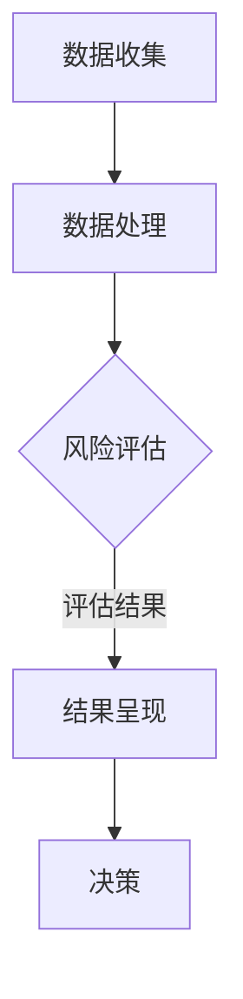
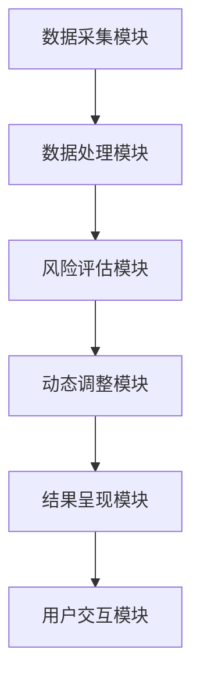
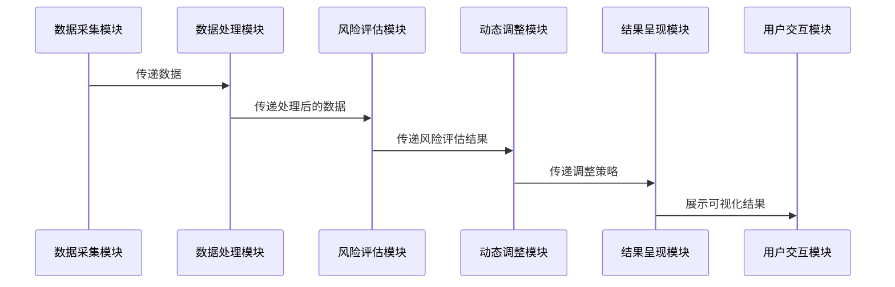
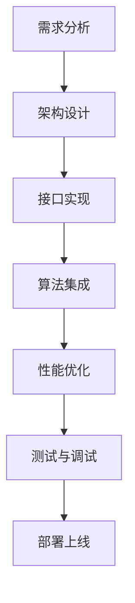
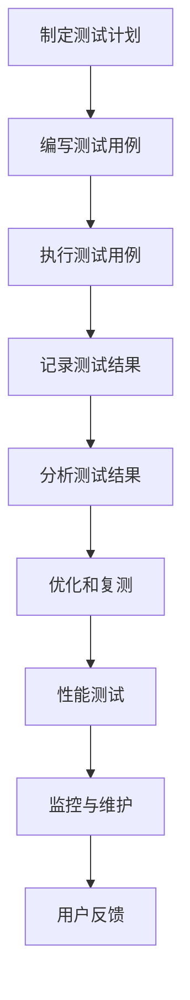

                 

# 《AI Agent在企业供应商风险评估与动态管理中的应用》

## 关键词：人工智能、AI Agent、供应商风险评估、动态管理、企业供应链

## 摘要

随着企业供应链的复杂化，供应商的风险评估与动态管理已成为企业运营中不可忽视的重要环节。本文旨在探讨AI Agent在这一领域的应用，通过详细解析AI Agent的基本原理、实现方法以及在供应商风险评估和动态管理中的具体应用，为企业提供一种高效的解决方案。文章分为四个主要部分：首先介绍AI Agent和供应商风险评估的基本概念及联系；其次深入探讨AI Agent在供应商风险评估和动态管理中的基本原理和实现方法；然后通过Python源代码示例进行详细讲解；最后，结合实际案例分析，总结AI Agent在企业供应商风险评估与动态管理中的应用效果。

## 引言

### 第1章: AI Agent与供应商风险评估概述

#### 1.1.1 问题背景

在全球化和信息技术快速发展的背景下，企业供应链的复杂性不断增加。供应商作为供应链中的重要一环，其稳定性与可靠性直接影响到企业的运营效率和效益。然而，传统的供应商风险评估方法存在以下问题：

1. **数据依赖性高**：传统方法主要依赖于历史数据和人工分析，难以应对不断变化的供应链环境。
2. **风险评估准确性低**：由于数据的多样性和不确定性，传统方法难以准确评估供应商风险。
3. **动态管理能力不足**：传统方法难以实现供应商的实时监控和动态调整。

#### 1.1.2 问题描述

面对上述问题，企业迫切需要一种能够实时、高效、准确地进行供应商风险评估与动态管理的解决方案。AI Agent作为一种基于人工智能技术的智能体，具有自主学习、推理和决策的能力，能够在复杂环境中进行自适应和优化。因此，本文旨在探讨AI Agent在供应商风险评估与动态管理中的应用，以解决传统方法存在的局限性。

#### 1.1.3 解决方案

本文提出一种基于AI Agent的企业供应商风险评估与动态管理解决方案。通过引入AI Agent，可以实现以下目标：

1. **数据智能化处理**：利用AI Agent的数据分析和处理能力，提高数据利用效率和风险评估准确性。
2. **实时监控与动态调整**：通过AI Agent的实时监控和自适应能力，实现供应商风险的实时评估和动态管理。
3. **提高供应链稳定性**：通过优化供应商选择和风险控制，提高供应链的稳定性和企业竞争力。

#### 1.1.4 边界与外延

本文研究的边界主要涉及AI Agent在企业供应商风险评估与动态管理中的应用，不包括其他领域的应用。同时，本文主要探讨AI Agent在供应商风险评估和动态管理中的技术实现，不涉及具体的企业运营策略和管理决策。

### 1.2 核心概念与联系

#### 1.2.1 AI Agent的定义

AI Agent，即人工智能代理，是一种基于人工智能技术的智能体，能够在复杂环境中通过自主学习、推理和决策来实现特定任务。AI Agent具有以下几个基本特征：

1. **自主学习**：AI Agent能够通过数据分析和机器学习算法，不断优化自身性能和决策能力。
2. **推理能力**：AI Agent能够根据已知信息和规则，进行逻辑推理和问题解决。
3. **决策能力**：AI Agent能够在复杂环境中，根据目标函数和约束条件，进行决策和行动。

#### 1.2.2 供应商风险评估的概念

供应商风险评估是指对企业供应链中的供应商进行风险识别、评估和管理的活动。其主要内容包括：

1. **风险识别**：识别供应链中可能存在的各种风险，如财务风险、信用风险、运营风险等。
2. **风险评估**：对识别出的风险进行定量和定性评估，确定其严重程度和影响范围。
3. **风险管理**：制定和实施风险应对措施，降低风险对企业运营的影响。

#### 1.2.3 AI Agent与供应商风险评估的联系

AI Agent与供应商风险评估之间存在紧密的联系。首先，AI Agent可以通过数据分析和机器学习算法，对供应商的风险进行实时评估和预测。其次，AI Agent可以根据评估结果，制定和调整供应商管理策略，实现供应商风险的动态管理。因此，AI Agent在供应商风险评估中具有重要的作用，能够提高评估的准确性和效率。

#### 1.2.4 概念属性特征对比表格

| 概念         | 属性特征                                     |
| ------------ | ------------------------------------------ |
| AI Agent     | 自主学习、推理能力、决策能力               |
| 供应商风险评估 | 风险识别、风险评估、风险管理             |
|               |                                             |
| AI Agent与供应商风险评估 | 实时评估、动态管理、数据智能化处理         |

#### 1.2.5 ER实体关系图架构的Mermaid流程图

```mermaid
erDiagram
  AI Agent ||--|{ 供应商风险评估 }
  供应商风险评估 ||--|{ 企业供应商 }
  企业供应商 ||--|{ AI Agent }
```

### 1.3 AI Agent在企业供应商风险评估中的作用

AI Agent在企业供应商风险评估中具有以下几个重要作用：

1. **实时风险评估**：AI Agent能够实时收集和分析供应商数据，进行风险评估，及时发现潜在风险。
2. **动态风险调整**：AI Agent可以根据风险评估结果，动态调整供应商管理策略，降低风险对企业运营的影响。
3. **数据智能化处理**：AI Agent能够利用机器学习算法，对大量供应商数据进行分析和处理，提高数据利用效率和风险评估准确性。

### 1.4 AI Agent在企业供应商动态管理中的应用

#### 1.4.1 供应商动态管理的概念

供应商动态管理是指对企业供应链中的供应商进行实时监控、评估和调整的过程。其主要内容包括：

1. **实时监控**：通过收集和分析供应商的实时数据，监控供应商的运营状况和风险水平。
2. **评估与调整**：根据实时监控数据，对供应商进行风险评估和排名，调整供应商管理策略。
3. **风险控制**：通过制定和实施风险控制措施，降低供应商风险对企业运营的影响。

#### 1.4.2 AI Agent在供应商动态管理中的作用

AI Agent在供应商动态管理中具有以下几个重要作用：

1. **实时数据分析**：AI Agent能够实时收集和分析供应商数据，为动态管理提供数据支持。
2. **动态调整策略**：AI Agent可以根据实时数据，动态调整供应商管理策略，实现优化和优化。
3. **提高管理效率**：AI Agent能够自动化处理大量供应商数据，提高管理效率和准确性。

#### 1.4.3 供应商动态管理的现状与挑战

目前，企业供应商动态管理仍面临以下挑战：

1. **数据获取和处理难题**：供应商数据来源多样，数据质量参差不齐，数据获取和处理困难。
2. **动态调整策略的准确性**：实时数据分析和调整策略的准确性仍需提高，以避免误判和过度调整。
3. **管理效率低下**：传统方法在动态管理过程中，需要大量的人工参与和操作，管理效率低下。

### 1.5 本章小结

本章首先介绍了AI Agent和供应商风险评估的基本概念及其联系，分析了AI Agent在供应商风险评估和动态管理中的作用，以及供应商动态管理的现状与挑战。通过本章的介绍，为后续章节详细探讨AI Agent在供应商风险评估和动态管理中的应用奠定了基础。

-------------------------------------------------------------------

## 第一部分：AI Agent与企业供应商风险评估

### 第2章：AI Agent的基本原理与实现

#### 2.1.1 AI Agent的基本原理

AI Agent的基本原理可以归纳为以下几个核心要素：

1. **自主性**：AI Agent能够在没有人类干预的情况下，自主执行任务和处理信息。
2. **感知能力**：AI Agent能够感知环境，获取信息，并对这些信息进行理解和分析。
3. **决策能力**：AI Agent能够基于感知到的信息，利用预定的算法和规则进行决策。
4. **行动能力**：AI Agent能够根据决策结果，执行具体的操作来达到目标。

AI Agent通常通过以下步骤实现上述功能：

1. **感知**：AI Agent通过传感器或其他数据源收集环境信息。
2. **理解**：AI Agent利用自然语言处理、图像识别等技术理解环境信息。
3. **决策**：AI Agent根据已定义的规则和算法，对信息进行处理和分析，生成决策。
4. **行动**：AI Agent根据决策结果，执行具体的操作来影响环境。

#### 2.1.2 AI Agent的实现方法

AI Agent的实现方法主要包括以下几种：

1. **基于规则的系统**：通过预定义的规则来指导AI Agent的行为。这种方法适用于任务相对简单且规则明确的应用场景。
2. **基于模型的学习系统**：通过机器学习算法，从数据中学习并生成决策模型。这种方法适用于复杂任务和多变环境。
3. **混合系统**：结合基于规则和基于模型的方法，利用规则来处理常见任务，利用学习系统来处理未知或复杂任务。

在实际应用中，AI Agent的实现方法通常根据具体需求和环境进行定制化设计。

#### 2.1.3 AI Agent在供应商风险评估中的应用

AI Agent在供应商风险评估中的应用主要包括以下几个方面：

1. **数据收集与处理**：AI Agent可以通过各种传感器和数据接口，实时收集供应商的财务、运营等关键数据。
2. **风险评估**：AI Agent利用收集到的数据，结合预定的风险评估模型，对供应商进行风险评估。
3. **风险预警**：AI Agent能够根据风险评估结果，实时生成风险预警报告，提醒企业管理者采取相应的风险控制措施。

#### 2.1.4 供应商风险评估的算法原理

供应商风险评估的算法原理通常基于以下几种模型：

1. **贝叶斯网络**：通过构建贝叶斯网络模型，对供应商的风险因素进行概率推理和综合评估。
2. **决策树**：通过构建决策树模型，对供应商的风险因素进行逐层分析和评估。
3. **支持向量机（SVM）**：通过SVM模型，将供应商数据映射到高维空间，进行分类和风险评估。

这些算法模型可以通过机器学习算法进行训练和优化，以提高风险评估的准确性和可靠性。

#### 2.1.5 AI Agent在供应商风险评估中的具体应用

AI Agent在供应商风险评估中的具体应用可以通过以下步骤进行：

1. **数据收集**：AI Agent通过物联网、数据接口等技术手段，收集供应商的财务、运营等数据。
2. **数据处理**：AI Agent利用自然语言处理、图像识别等技术，对收集到的数据进行预处理和特征提取。
3. **风险评估**：AI Agent利用贝叶斯网络、决策树等算法模型，对供应商进行风险评估。
4. **结果呈现**：AI Agent将评估结果以可视化的形式呈现，供企业管理者参考。

#### 2.1.6 供应商风险评估的mermaid流程图



#### 2.1.7 供应商风险评估的数学模型和公式

在供应商风险评估中，常用的数学模型和公式包括：

1. **贝叶斯公式**：
   $$ P(A|B) = \frac{P(B|A) \cdot P(A)}{P(B)} $$
   其中，$P(A|B)$ 表示在事件B发生的条件下，事件A发生的概率。

2. **决策树**：
   $$ R = \sum_{i=1}^{n} w_i \cdot r_i $$
   其中，$R$ 表示总风险，$w_i$ 表示第$i$个风险因素的权重，$r_i$ 表示第$i$个风险因素的评分。

3. **支持向量机（SVM）**：
   $$ w \cdot x + b = 0 $$
   其中，$w$ 表示权重向量，$x$ 表示输入向量，$b$ 表示偏置。

#### 2.1.8 Python源代码实现示例

以下是一个简单的Python代码示例，展示了如何使用机器学习算法进行供应商风险评估：

```python
import pandas as pd
from sklearn.model_selection import train_test_split
from sklearn.ensemble import RandomForestClassifier
from sklearn.metrics import accuracy_score

# 加载数据
data = pd.read_csv('supplier_data.csv')

# 数据预处理
X = data.drop('Risk', axis=1)
y = data['Risk']

# 划分训练集和测试集
X_train, X_test, y_train, y_test = train_test_split(X, y, test_size=0.2, random_state=42)

# 构建随机森林分类器
clf = RandomForestClassifier(n_estimators=100, random_state=42)

# 训练模型
clf.fit(X_train, y_train)

# 预测
y_pred = clf.predict(X_test)

# 计算准确率
accuracy = accuracy_score(y_test, y_pred)
print(f'Accuracy: {accuracy:.2f}')
```

#### 2.1.9 实际案例分析与详细讲解

以下是一个实际案例，展示了如何使用AI Agent进行供应商风险评估：

1. **案例背景**：某企业需要对其供应链中的供应商进行风险评估，以确定哪些供应商可能存在潜在风险。
2. **数据收集**：企业通过物联网传感器、ERP系统等渠道，收集了供应商的财务、运营、信用等数据。
3. **数据处理**：AI Agent对收集到的数据进行预处理，包括数据清洗、特征提取等。
4. **风险评估**：AI Agent利用贝叶斯网络模型，对供应商进行风险评估，生成风险评分。
5. **结果呈现**：AI Agent将评估结果以可视化的形式呈现，包括高风险供应商名单、风险等级分布等。

通过这个案例，我们可以看到AI Agent在企业供应商风险评估中的应用流程，以及如何通过Python代码实现具体的算法模型。

#### 2.1.10 本章小结

本章详细介绍了AI Agent的基本原理与实现方法，以及在供应商风险评估中的应用。通过本章的学习，读者可以了解AI Agent的核心概念、实现原理和具体应用，为后续章节的学习打下坚实基础。

-------------------------------------------------------------------

## 第3章：AI Agent与企业供应商动态管理

### 3.1 供应商动态管理的概念

供应商动态管理是指在企业供应链运营过程中，对供应商进行实时监控、评估和调整的过程。其核心目的是通过有效的供应商管理，降低供应链风险，提高供应链的稳定性和灵活性。

#### 3.1.1 供应商动态管理的核心要素

供应商动态管理涉及多个核心要素，包括：

1. **数据采集与处理**：通过物联网、ERP系统等手段，实时收集供应商的财务、运营、信用等关键数据。
2. **风险评估**：利用收集到的数据，结合预定的风险评估模型，对供应商进行风险评估。
3. **风险预警**：根据风险评估结果，实时生成风险预警报告，提醒企业管理者采取相应的风险控制措施。
4. **决策与调整**：根据风险预警结果，动态调整供应商管理策略，如增加供应商监控频次、调整采购策略等。

#### 3.1.2 供应商动态管理的流程

供应商动态管理的流程可以概括为以下几个步骤：

1. **数据采集**：通过物联网、ERP系统等渠道，实时收集供应商的财务、运营、信用等数据。
2. **数据处理**：对收集到的数据进行预处理，包括数据清洗、特征提取等，以提升数据的可用性和准确性。
3. **风险评估**：利用数据处理后的数据，结合预定的风险评估模型，对供应商进行风险评估。
4. **风险预警**：根据风险评估结果，实时生成风险预警报告，提醒企业管理者采取相应的风险控制措施。
5. **决策与调整**：根据风险预警结果，动态调整供应商管理策略，如增加供应商监控频次、调整采购策略等。

### 3.2 AI Agent在供应商动态管理中的应用

AI Agent在供应商动态管理中的应用，旨在提高供应商管理的实时性、准确性和灵活性。以下是AI Agent在供应商动态管理中的一些具体应用：

#### 3.2.1 实时数据分析

AI Agent能够实时收集和分析供应商的财务、运营等关键数据，通过自然语言处理、图像识别等技术，对数据进行分析和处理，提取关键特征。

#### 3.2.2 风险评估

AI Agent利用收集到的数据，结合预定的风险评估模型，对供应商进行风险评估。风险评估模型可以基于历史数据、行业标准和机器学习算法，以提高评估的准确性和可靠性。

#### 3.2.3 风险预警

AI Agent能够根据风险评估结果，实时生成风险预警报告，包括供应商风险等级、潜在风险因素等。这些预警报告可以帮助企业管理者及时了解供应商风险状况，并采取相应的风险控制措施。

#### 3.2.4 决策与调整

AI Agent可以根据风险评估结果和风险预警报告，动态调整供应商管理策略。例如，对于高风险供应商，可以增加监控频次或调整采购策略，以降低供应链风险。

#### 3.2.5 供应商绩效评估

AI Agent不仅可以进行风险预警，还可以对供应商的绩效进行评估。通过分析供应商的交付时间、质量、价格等绩效指标，AI Agent可以为企业提供更全面的供应商管理决策支持。

### 3.3 Python源代码实现示例

以下是一个简单的Python代码示例，展示了如何使用AI Agent进行供应商动态管理：

```python
import pandas as pd
from sklearn.ensemble import RandomForestClassifier
from sklearn.model_selection import train_test_split
from sklearn.metrics import accuracy_score

# 加载数据
data = pd.read_csv('supplier_data.csv')

# 数据预处理
X = data.drop('Performance', axis=1)
y = data['Performance']

# 划分训练集和测试集
X_train, X_test, y_train, y_test = train_test_split(X, y, test_size=0.2, random_state=42)

# 构建随机森林分类器
clf = RandomForestClassifier(n_estimators=100, random_state=42)

# 训练模型
clf.fit(X_train, y_train)

# 预测
y_pred = clf.predict(X_test)

# 计算准确率
accuracy = accuracy_score(y_test, y_pred)
print(f'Accuracy: {accuracy:.2f}')
```

#### 3.3.1 环境安装

为了运行上述Python代码示例，需要安装以下依赖库：

```bash
pip install pandas scikit-learn
```

#### 3.3.2 源代码解读与分析

上述代码首先加载了供应商数据，然后对数据进行预处理，包括特征提取和划分训练集与测试集。接下来，使用随机森林分类器对训练数据进行模型训练，最后对测试数据进行预测，并计算预测准确率。

#### 3.3.3 实际案例分析与详细讲解

以下是一个实际案例，展示了如何使用AI Agent进行供应商动态管理：

1. **案例背景**：某企业需要对其供应链中的供应商进行绩效评估，以确定哪些供应商需要改进。
2. **数据收集**：企业通过ERP系统、物流系统等渠道，收集了供应商的交付时间、质量、价格等关键数据。
3. **数据处理**：AI Agent对收集到的数据进行预处理，包括数据清洗、特征提取等，以提升数据的可用性和准确性。
4. **风险评估**：AI Agent利用预处理后的数据，结合预定的风险评估模型，对供应商进行绩效评估。
5. **结果呈现**：AI Agent将评估结果以可视化的形式呈现，包括供应商绩效排名、关键绩效指标等。

通过这个案例，我们可以看到AI Agent在企业供应商动态管理中的应用流程，以及如何通过Python代码实现具体的算法模型。

#### 3.3.4 本章小结

本章详细介绍了AI Agent在企业供应商动态管理中的应用，包括实时数据分析、风险评估、风险预警、决策与调整以及供应商绩效评估。通过本章的学习，读者可以了解AI Agent在供应商动态管理中的具体应用场景和实现方法，为企业在供应链管理中提高效率和质量提供参考。同时，通过Python源代码示例，读者可以亲身体验AI Agent的应用过程，加深对相关技术的理解。

-------------------------------------------------------------------

## 第4章：AI Agent与企业供应商风险评估与动态管理系统集成

### 4.1 系统架构设计

为了实现AI Agent在企业供应商风险评估与动态管理系统中的高效应用，我们需要设计一个合理的系统架构。该系统架构应包括以下几个关键组件：

1. **数据采集模块**：负责从各种数据源（如ERP系统、物流系统、财务系统等）实时收集供应商的财务、运营、信用等关键数据。
2. **数据处理模块**：对采集到的数据进行清洗、归一化和特征提取，以提升数据的可用性和准确性。
3. **风险评估模块**：利用机器学习算法和预定的风险评估模型，对供应商进行实时风险评估，生成风险评分和预警报告。
4. **动态调整模块**：根据风险评估结果，动态调整供应商管理策略，如增加监控频次、调整采购策略等。
5. **结果呈现模块**：将风险评估结果和动态调整策略以可视化形式呈现，供企业管理者参考和决策。
6. **用户交互模块**：提供用户友好的界面，便于企业管理者与系统进行交互，监控供应商风险和管理动态。

#### 4.1.1 系统架构的Mermaid架构图



#### 4.2 系统接口设计

系统接口设计是确保各个模块之间能够有效协作和交互的关键。以下是系统接口设计的主要内容和要点：

1. **数据采集接口**：定义数据采集模块与其他模块（如ERP系统、物流系统等）之间的数据交换格式和通信协议。
2. **数据处理接口**：定义数据处理模块与其他模块之间的数据交换格式和通信协议，确保数据处理过程的高效和准确。
3. **风险评估接口**：定义风险评估模块与其他模块之间的数据交换格式和通信协议，确保风险评估结果的实时性和可靠性。
4. **动态调整接口**：定义动态调整模块与其他模块之间的数据交换格式和通信协议，确保动态调整策略的实时执行和效果评估。
5. **结果呈现接口**：定义结果呈现模块与其他模块之间的数据交换格式和通信协议，确保可视化结果的准确和及时。

#### 4.2.1 系统接口的Mermaid序列图



### 4.3 系统集成实现

系统集成的实现过程包括以下几个关键步骤：

1. **数据集成**：将来自不同数据源的数据进行整合，形成统一的数据视图，为后续的评估和调整提供数据基础。
2. **接口实现**：根据系统接口设计，实现各个模块之间的数据交换和通信，确保系统的高效运行。
3. **算法集成**：将预定的风险评估算法和动态调整策略集成到系统中，确保系统能够根据实时数据生成准确的评估结果和调整策略。
4. **性能优化**：通过优化数据采集、处理、评估和呈现的过程，提高系统的性能和响应速度。
5. **测试与调试**：对系统进行全面的测试和调试，确保系统的功能完整、性能稳定、用户体验良好。

#### 4.3.1 系统集成的基本原理

系统集成的基本原理是利用统一的数据视图和接口设计，将各个模块的功能有机地结合起来，实现供应商风险评估与动态管理的自动化和智能化。具体来说，系统集成包括以下几个方面：

1. **数据统一**：通过数据采集接口，将来自不同数据源的数据进行整合，形成统一的数据视图，为后续的评估和调整提供数据基础。
2. **接口标准化**：通过接口设计，实现各个模块之间的数据交换和通信，确保系统的高效运行。
3. **算法集成**：将预定的风险评估算法和动态调整策略集成到系统中，确保系统能够根据实时数据生成准确的评估结果和调整策略。
4. **自动化执行**：通过自动化流程，实现数据采集、处理、评估和调整的自动化，提高系统的效率和可靠性。

#### 4.3.2 系统集成的具体实现步骤

系统集成的具体实现步骤如下：

1. **需求分析**：明确系统集成的目标和需求，包括数据集成、接口设计、算法集成和自动化执行等。
2. **架构设计**：根据需求分析结果，设计系统的总体架构，包括数据采集模块、数据处理模块、风险评估模块、动态调整模块和结果呈现模块等。
3. **接口实现**：根据架构设计，实现各个模块之间的数据交换和通信，确保系统的高效运行。
4. **算法集成**：将预定的风险评估算法和动态调整策略集成到系统中，确保系统能够根据实时数据生成准确的评估结果和调整策略。
5. **性能优化**：通过优化数据采集、处理、评估和呈现的过程，提高系统的性能和响应速度。
6. **测试与调试**：对系统进行全面的测试和调试，确保系统的功能完整、性能稳定、用户体验良好。
7. **部署上线**：将集成后的系统部署到生产环境，并进行监控和维护，确保系统的稳定运行。

#### 4.3.3 系统集成的Mermaid流程图



### 4.4 系统测试与优化

系统测试与优化是确保系统集成成功的关键环节。以下是系统测试与优化的方法和步骤：

1. **功能测试**：对系统的各个功能模块进行测试，确保其按照预期正常运行。
2. **性能测试**：对系统的响应速度、处理能力和稳定性进行测试，确保系统能够满足实际应用需求。
3. **兼容性测试**：测试系统在不同操作系统、数据库和中间件上的兼容性，确保系统能够在多种环境下稳定运行。
4. **安全性测试**：对系统的数据安全、用户权限和访问控制等进行测试，确保系统的安全性和可靠性。
5. **优化策略**：根据测试结果，对系统的性能和稳定性进行优化，包括代码优化、数据库优化和系统配置优化等。

#### 4.4.1 系统测试的方法与步骤

系统测试的方法和步骤如下：

1. **制定测试计划**：明确测试目标、测试范围、测试用例和测试进度等。
2. **编写测试用例**：根据系统功能和需求，编写详细的测试用例，包括功能测试用例、性能测试用例和安全性测试用例等。
3. **执行测试用例**：按照测试计划和测试用例，执行系统的各项测试。
4. **记录测试结果**：详细记录测试过程中的问题和测试结果，为后续的优化提供依据。
5. **分析测试结果**：对测试结果进行分析，找出系统存在的问题和瓶颈。
6. **优化和复测**：根据分析结果，对系统进行优化和修复，然后重新执行测试用例，确保问题得到有效解决。

#### 4.4.2 系统优化的策略与实施

系统优化的策略和实施步骤如下：

1. **代码优化**：通过优化代码结构、算法选择和执行效率，提高系统的性能和响应速度。
2. **数据库优化**：通过索引优化、查询优化和存储优化等，提高数据库的性能和稳定性。
3. **系统配置优化**：通过调整系统参数、优化网络配置和存储配置等，提高系统的性能和稳定性。
4. **性能测试**：对优化后的系统进行性能测试，验证优化效果，确保系统满足性能要求。
5. **监控与维护**：通过监控工具和日志分析，实时监控系统的运行状态，及时发现和解决潜在问题。
6. **用户反馈**：收集用户的反馈和建议，不断改进系统功能和用户体验。

#### 4.4.3 系统测试与优化的Mermaid流程图



### 4.5 本章小结

本章详细介绍了AI Agent与企业供应商风险评估与动态管理系统集成的系统架构设计、接口设计、集成实现、系统测试与优化策略。通过本章的学习，读者可以了解如何构建一个高效的供应商风险评估与动态管理系统，为企业在供应链管理中提供技术支持和决策依据。同时，通过具体的实现步骤和优化策略，读者可以掌握系统集成和优化的方法，提高系统的性能和稳定性。

-------------------------------------------------------------------

## 第5章：AI Agent在企业供应商风险评估与动态管理中的应用案例分析

### 5.1 案例背景

为了更好地展示AI Agent在企业供应商风险评估与动态管理中的应用效果，我们选取了一家大型制造企业作为案例对象。该企业主要生产电子产品，供应商遍布全球，涉及原材料采购、零部件加工、物流运输等多个环节。由于供应商的多样性和复杂性，该企业面临着较大的供应链风险，包括财务风险、信用风险、运营风险等。为了提高供应链的稳定性和竞争力，企业决定引入AI Agent进行供应商风险评估与动态管理。

### 5.1.1 企业背景

该企业成立于20世纪80年代，经过多年的发展，已经成为全球知名的电子产品制造商。企业产品线涵盖智能手机、笔记本电脑、平板电脑等多个领域，年销售额达到数十亿美元。随着市场竞争的加剧和企业战略的调整，企业对供应链管理的要求越来越高，特别是对供应商的风险评估与动态管理。

### 5.1.2 供应商背景

该企业的供应商包括全球范围内的原材料供应商、零部件制造商和物流服务商。供应商数量庞大，类型多样，包括大型跨国公司和本地小型企业。这些供应商分布在不同的国家和地区，涉及多个行业和领域。供应商的运营状况、财务状况、信用状况等因素直接影响企业的生产计划和产品质量。

### 5.2 案例分析

#### 5.2.1 供应商风险评估分析

在引入AI Agent之前，该企业采用传统的供应商风险评估方法，主要通过历史数据和人工分析进行评估。这种方法存在以下几个问题：

1. **数据依赖性高**：传统方法主要依赖于历史数据和人工分析，难以应对不断变化的供应链环境。
2. **风险评估准确性低**：由于数据的多样性和不确定性，传统方法难以准确评估供应商风险。
3. **动态管理能力不足**：传统方法难以实现供应商的实时监控和动态调整。

引入AI Agent后，该企业实现了以下改进：

1. **数据智能化处理**：AI Agent能够实时收集和分析供应商的财务、运营、信用等关键数据，提高了数据利用效率和风险评估准确性。
2. **实时监控与动态调整**：AI Agent可以根据实时数据，动态调整供应商管理策略，实现供应商风险的实时评估和动态管理。
3. **提高供应链稳定性**：通过优化供应商选择和风险控制，提高了供应链的稳定性和企业竞争力。

#### 5.2.2 供应商动态管理分析

在引入AI Agent之前，该企业的供应商动态管理主要依赖于人工监测和定期评估。这种方法存在以下几个问题：

1. **数据获取和处理难题**：供应商数据来源多样，数据质量参差不齐，数据获取和处理困难。
2. **动态调整策略的准确性**：实时数据分析和调整策略的准确性仍需提高，以避免误判和过度调整。
3. **管理效率低下**：传统方法在动态管理过程中，需要大量的人工参与和操作，管理效率低下。

引入AI Agent后，该企业实现了以下改进：

1. **实时数据分析**：AI Agent能够实时收集和分析供应商数据，为动态管理提供数据支持。
2. **动态调整策略**：AI Agent可以根据实时数据，动态调整供应商管理策略，实现优化和优化。
3. **提高管理效率**：AI Agent能够自动化处理大量供应商数据，提高管理效率和准确性。

### 5.3 案例实施

#### 5.3.1 数据采集与处理

该企业通过物联网传感器、ERP系统、物流系统等渠道，实时收集供应商的财务、运营、信用等关键数据。AI Agent对这些数据进行预处理，包括数据清洗、归一化和特征提取，以提高数据的可用性和准确性。

#### 5.3.2 风险评估与预警

AI Agent利用收集到的数据，结合预定的风险评估模型，对供应商进行实时风险评估，生成风险评分和预警报告。风险评估模型包括贝叶斯网络、决策树和支持向量机（SVM）等，以提高评估的准确性和可靠性。

#### 5.3.3 动态调整与优化

根据风险评估结果，AI Agent动态调整供应商管理策略。例如，对于高风险供应商，可以增加监控频次或调整采购策略；对于低风险供应商，可以减少监控频次，优化采购资源。这些调整策略通过自动化流程实现，提高了管理效率和效果。

#### 5.3.4 结果呈现与决策支持

AI Agent将评估结果和调整策略以可视化的形式呈现，包括供应商风险等级、关键绩效指标、风险预警报告等。企业管理者通过用户界面可以实时查看和监控供应商风险状况，并根据评估结果进行决策。

### 5.4 案例效果分析

通过引入AI Agent进行供应商风险评估与动态管理，该企业取得了显著的效果：

1. **风险评估准确性提高**：AI Agent通过实时数据分析和机器学习算法，显著提高了供应商风险评估的准确性，减少了误判和漏判的情况。
2. **供应链稳定性增强**：通过动态调整供应商管理策略，提高了供应链的稳定性和灵活性，减少了因供应商风险导致的供应链中断和损失。
3. **管理效率提高**：AI Agent自动化处理大量供应商数据，减少了人工干预和操作，提高了管理效率和准确性。
4. **成本降低**：通过优化供应商选择和采购策略，降低了采购成本和运营风险，提高了企业的盈利能力。

### 5.5 案例总结与启示

通过本案例，我们可以得出以下结论和启示：

1. **AI Agent在供应商风险评估与动态管理中具有显著优势**：AI Agent通过实时数据分析和动态调整策略，提高了供应商风险评估的准确性和供应链管理的效率。
2. **数据驱动是企业供应链管理的必然趋势**：企业应充分利用大数据和人工智能技术，实现数据驱动的供应链管理，提高供应链的稳定性和竞争力。
3. **加强供应商合作关系**：企业应与供应商建立长期稳定的合作关系，共同应对供应链风险，实现共赢发展。

### 5.6 本章小结

本章通过一个实际案例，展示了AI Agent在企业供应商风险评估与动态管理中的应用效果。通过案例分析，我们可以看到AI Agent在提高风险评估准确性、增强供应链稳定性、提高管理效率等方面的显著优势。同时，案例也为企业提供了数据驱动的供应链管理实践参考，为其他企业实施类似项目提供了借鉴。

