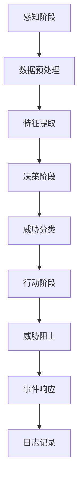
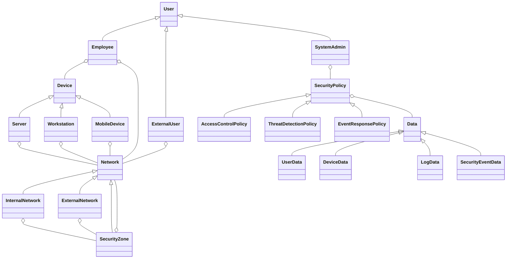
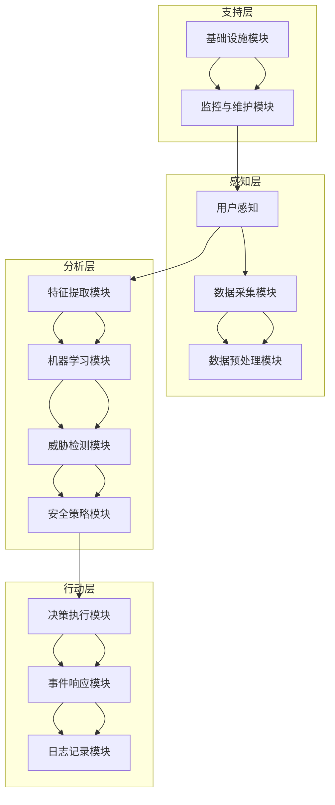
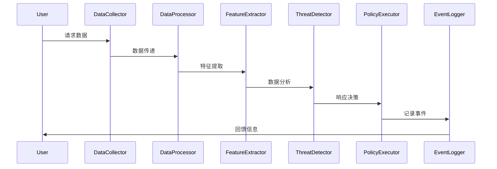

                 

 # AI Agent在企业信息安全管理中的应用

## 关键词

- AI Agent
- 企业信息安全
- 智能安全管理
- 机器学习
- 安全威胁检测

## 摘要

随着信息技术的飞速发展，企业信息安全面临日益严峻的挑战。传统的信息安全防护手段已难以应对日益复杂的攻击手段和多样化的威胁。本文旨在探讨AI Agent在企业信息安全管理中的应用，从核心概念、理论模型、系统设计到实际应用等多个层面进行分析，以期为提升企业信息安全提供新的思路和方法。

---

**# 背景介绍**

## 1.1 问题背景和描述

### 1.1.1 信息安全的重要性

在当今数字化时代，信息安全已成为企业可持续发展的关键因素。随着企业对网络技术的依赖性增强，信息安全问题愈加凸显。企业面临的数据泄露、网络攻击、系统崩溃等问题不仅可能导致直接的经济损失，还可能对企业的声誉造成严重影响。

### 1.1.2 传统信息安全的局限性

传统的信息安全措施，如防火墙、入侵检测系统（IDS）和加密技术等，虽然在一定程度上提高了企业的安全防护能力，但它们存在以下局限性：

1. **被动防御**：传统安全措施通常只能在攻击发生后进行反应，无法提前预测和防范。
2. **规则限制**：依赖预定义规则的系统容易受到“零日攻击”（未知漏洞的攻击）和高级持续性威胁（APT）的攻击。
3. **人力成本**：传统安全措施需要大量人力资源进行监控和维护，成本高昂。

### 1.1.3 AI Agent的概念和应用前景

AI Agent，即人工智能代理，是一种能够自主学习和执行任务的智能系统。它们利用机器学习和深度学习技术，能够在大数据环境中实时分析威胁，提前预警并采取行动。AI Agent在企业信息安全中的应用前景广阔，有望解决传统安全措施的局限性。

## 1.2 问题解决方案和边界

### 1.2.1 AI Agent的优势

AI Agent的优势在于：

1. **主动防御**：AI Agent可以实时监测网络流量和系统行为，提前发现潜在威胁。
2. **自适应能力**：AI Agent能够根据攻击模式的演变进行自我更新和优化，提高防御效果。
3. **高效处理**：AI Agent可以利用大规模数据处理能力，迅速分析大量数据，发现安全漏洞。

### 1.2.2 AI Agent的应用范围

AI Agent在企业信息安全中的应用范围包括：

1. **入侵检测**：通过分析网络流量和系统日志，识别并阻止入侵行为。
2. **恶意软件防护**：实时检测和清除恶意软件，防止数据泄露。
3. **安全事件响应**：自动化处理安全事件，减少响应时间和损失。

### 1.2.3 边界和挑战

AI Agent在应用中面临的边界和挑战包括：

1. **数据隐私**：需要确保AI Agent处理的数据符合隐私保护法规。
2. **模型可解释性**：提高AI Agent模型的透明度和可解释性，便于安全事件的分析和审计。
3. **资源和性能**：AI Agent需要高性能计算资源和优化算法，以确保实时性和准确性。

## 1.3 核心概念和要素

### 1.3.1 AI Agent的定义

AI Agent是指具备以下特点的智能系统：

1. **自主性**：能够自主执行任务，无需人工干预。
2. **适应性**：能够根据环境和威胁的动态变化进行自我优化。
3. **交互性**：能够与其他系统和人进行交互，协同完成任务。

### 1.3.2 AI Agent的组成部分

AI Agent通常由以下几个部分组成：

1. **感知器**：获取外部信息，如网络流量、系统日志等。
2. **决策器**：根据感知器提供的信息，进行威胁分析和决策。
3. **行动器**：执行决策器制定的防御策略。

### 1.3.3 AI Agent与信息安全的关系

AI Agent与信息安全的关系可以概括为：

1. **安全检测与响应**：AI Agent能够实时监测网络和系统，发现安全威胁并采取措施。
2. **安全防御策略优化**：AI Agent可以根据攻击模式和历史数据，优化安全防御策略。
3. **安全事件管理**：AI Agent可以自动化处理安全事件，减少人为错误和响应时间。

## 1.4 结论

AI Agent在企业信息安全管理中具有巨大的潜力。通过引入AI Agent，企业可以实现更高效、更智能的安全管理，提高防御能力，降低安全风险。然而，AI Agent的应用也面临一系列挑战，需要进一步研究和实践。本文为AI Agent在企业信息安全中的应用提供了初步的思路和方法，期待未来的深入研究。

---

以上是文章的开篇，接下来将继续展开详细的内容。根据您的指示，每个章节都将详细展开，包含核心概念、原理、算法、系统设计、实际应用等内容。每个章节都将使用mermaid绘图来展示流程图、类图、架构图等，同时配合Python代码示例和LaTeX数学公式进行详细讲解。文章将保持逻辑清晰、结构紧凑、简单易懂，旨在为读者提供有价值的技术见解和实践指导。接下来，我们将逐步深入各个章节，展开详细分析。

---

**# 核心概念和原理**

## 2.1 AI Agent的定义和基本概念

### 2.1.1 AI Agent的定义

AI Agent，即人工智能代理，是一种基于人工智能技术的智能实体，它能够感知环境中的信息，基于预定的目标进行自主决策并采取行动，以达到预期目标。AI Agent的核心特点包括自主性、适应性和交互性。

- **自主性**：AI Agent能够独立执行任务，无需人工干预。
- **适应性**：AI Agent能够根据环境变化和任务需求进行自我调整和优化。
- **交互性**：AI Agent能够与其他实体（如人、机器或其他AI Agent）进行信息交换和协同工作。

### 2.1.2 AI Agent的分类

根据AI Agent的智能程度和应用场景，可以将AI Agent分为以下几类：

1. **基于规则的AI Agent**：这种AI Agent根据预定义的规则进行决策和行动。它们通常用于执行明确的、规则化的任务，例如自动化客服机器人。
2. **基于模型的AI Agent**：这种AI Agent利用机器学习和深度学习技术，从数据中学习模式和规律，进行自主决策和行动。它们通常用于复杂、不确定的任务场景，例如自动驾驶汽车。
3. **混合型AI Agent**：这种AI Agent结合了基于规则和基于模型的方法，既能处理明确规则化的任务，又能适应复杂和不确定的环境。

### 2.1.3 AI Agent与传统信息安全措施的对比

传统的信息安全措施主要依赖于预定义的规则和签名来识别和防御威胁，而AI Agent则具备以下优势：

1. **动态响应能力**：AI Agent可以根据实时监测的数据和环境变化，动态调整安全策略，提高防御的灵活性。
2. **自适应学习能力**：AI Agent能够从历史数据和攻击模式中学习，不断提高自身的威胁识别和防御能力。
3. **自动化处理能力**：AI Agent可以自动化处理安全事件，减少人工干预，提高响应速度和效率。

## 2.2 AI Agent的特点和分类

### 2.2.1 AI Agent的特点

AI Agent的主要特点包括：

1. **自主决策**：AI Agent能够根据环境中的信息自主做出决策，无需人工干预。
2. **自适应**：AI Agent能够根据环境的变化和任务的需求进行自我调整和优化。
3. **交互**：AI Agent能够与其他系统、人或者其他AI Agent进行交互，协同完成任务。
4. **学习**：AI Agent能够从历史数据和经验中学习，不断提高自身的性能和智能水平。

### 2.2.2 AI Agent的分类

根据AI Agent的智能程度和应用场景，可以将AI Agent分为以下几类：

1. **任务型AI Agent**：这种AI Agent专注于执行特定的任务，如网络安全检测、数据备份等。
2. **情境型AI Agent**：这种AI Agent能够根据不同的环境和情境动态调整其行为和决策，如智能办公助手。
3. **自适应型AI Agent**：这种AI Agent能够根据环境的变化和任务的需求进行自我调整和优化，如智能家居系统。
4. **社会型AI Agent**：这种AI Agent能够理解并模拟人类的社会行为，如虚拟客服机器人。

## 2.3 AI Agent与传统信息安全措施的对比

### 2.3.1 对比表格

下面是一个简单的对比表格，展示了AI Agent与传统信息安全措施在几个关键方面的不同：

| 特点         | AI Agent                  | 传统信息安全措施                |
| ------------ | ------------------------- | ------------------------------- |
| 动态响应     | 能够动态调整安全策略       | 主要依赖预定义规则和签名         |
| 自适应能力   | 能够根据环境变化进行自我优化 | 缺乏自适应能力，难以应对未知威胁 |
| 学习能力     | 能够从数据中学习          | 难以从经验中学习和进化           |
| 交互能力     | 能够与人类和其他系统交互   | 主要用于防御，缺乏交互能力       |
| 资源消耗     | 需要高性能计算资源       | 资源消耗较小，但维护成本高       |

### 2.3.2 对比分析

通过上述对比表格可以看出，AI Agent在动态响应、自适应能力、学习能力和交互能力方面具有显著优势，能够更有效地应对复杂的网络威胁。然而，AI Agent也需要高性能计算资源和更复杂的管理，这可能会增加企业的运营成本。

## 2.4 AI Agent的工作原理

### 2.4.1 感知阶段

AI Agent首先需要感知环境中的信息。这些信息可以包括网络流量、系统日志、用户行为等。感知阶段通常涉及到数据采集、预处理和特征提取。

- **数据采集**：AI Agent通过传感器、网络接口等渠道收集数据。
- **预处理**：对采集到的原始数据进行清洗、归一化等预处理操作。
- **特征提取**：从预处理后的数据中提取关键特征，以便后续的分析和处理。

### 2.4.2 决策阶段

在感知阶段获取信息后，AI Agent会进入决策阶段。决策阶段的核心是利用机器学习和深度学习算法对感知到的信息进行分析，识别潜在的威胁。

- **特征分析**：利用机器学习算法，对提取出的特征进行分析，识别可能的异常行为。
- **模型训练**：利用历史数据和攻击模式，训练模型以识别新的威胁。
- **威胁分类**：根据模型的预测结果，将威胁分为不同的类别，如恶意软件、入侵尝试等。

### 2.4.3 行动阶段

在决策阶段确定威胁后，AI Agent会进入行动阶段。行动阶段的目标是采取相应的措施来阻止威胁或减少损失。

- **威胁阻止**：根据威胁的类型，采取相应的阻止措施，如隔离受感染的系统、封锁恶意IP等。
- **事件响应**：自动化处理安全事件，减少人为干预，提高响应速度。
- **日志记录**：记录所有安全事件和处理过程，以便进行审计和后续分析。

## 2.5 AI Agent与信息安全的关系

### 2.5.1 安全检测与响应

AI Agent在安全检测与响应中起着关键作用。通过实时监测网络流量和系统行为，AI Agent能够识别出潜在的威胁，并及时采取行动。这种实时性和自动化能力是传统安全措施难以达到的。

### 2.5.2 安全防御策略优化

AI Agent可以根据历史数据和实时监测结果，动态优化安全防御策略。这种自适应能力使得AI Agent能够更有效地应对不断变化的网络威胁。

### 2.5.3 安全事件管理

AI Agent能够自动化处理安全事件，减少人为干预，提高响应速度。同时，AI Agent还能够记录和处理所有安全事件，为后续的审计和分析提供数据支持。

## 2.6 结论

AI Agent在企业信息安全中的应用前景广阔。通过引入AI Agent，企业可以实现更高效、更智能的安全管理，提高防御能力，降低安全风险。然而，AI Agent的应用也面临一系列挑战，需要进一步研究和实践。本文为AI Agent在企业信息安全中的应用提供了初步的思路和方法，期待未来的深入研究。

---

**# 理论基础和数学模型**

## 3.1 AI Agent算法概述

### 3.1.1 机器学习算法

AI Agent的核心在于其能够通过学习不断优化自身的决策能力。机器学习算法是实现这一目标的关键技术。常见的机器学习算法包括：

1. **监督学习**：通过已标记的数据集训练模型，使模型能够识别新的数据。
2. **无监督学习**：在没有标记数据的情况下，模型自行发现数据的模式和规律。
3. **强化学习**：通过不断尝试和错误，模型学会在特定环境中做出最优决策。

### 3.1.2 深度学习算法

深度学习是机器学习的一个分支，它通过多层神经网络模型，模拟人脑的学习过程，对复杂的数据进行建模。常见的深度学习算法包括：

1. **卷积神经网络（CNN）**：适用于处理图像和视频数据。
2. **循环神经网络（RNN）**：适用于处理序列数据，如时间序列数据和文本数据。
3. **生成对抗网络（GAN）**：用于生成新的数据样本，如图像、文本等。

### 3.1.3 强化学习算法

强化学习是机器学习的一个重要分支，它通过奖励机制来指导模型的学习过程。常见的强化学习算法包括：

1. **Q-Learning**：通过预测每个动作的长期奖励来选择最优动作。
2. **Deep Q-Network（DQN）**：使用深度神经网络来近似Q值函数，提高学习效率。
3. **Policy Gradient**：通过直接优化策略函数来选择最优动作。

## 3.2 数学模型和公式

### 3.2.1 监督学习模型

在监督学习模型中，通常使用损失函数来衡量模型预测值与真实值之间的差距。常见的损失函数包括：

1. **均方误差（MSE）**：
   \[
   \text{MSE} = \frac{1}{n} \sum_{i=1}^{n} (\hat{y}_i - y_i)^2
   \]
   其中，$\hat{y}_i$ 是模型预测值，$y_i$ 是真实值，$n$ 是数据点的数量。

2. **交叉熵损失（Cross-Entropy Loss）**：
   \[
   \text{Cross-Entropy Loss} = -\sum_{i=1}^{n} y_i \log(\hat{y}_i)
   \]
   其中，$y_i$ 是真实标签，$\hat{y}_i$ 是模型预测概率。

### 3.2.2 深度学习模型

深度学习模型通常涉及多层神经网络的构建。在神经网络中，常用的激活函数包括：

1. **sigmoid 函数**：
   \[
   \sigma(x) = \frac{1}{1 + e^{-x}}
   \]
   sigmoid 函数将输入映射到（0，1）区间，常用于二分类问题。

2. **ReLU 函数**：
   \[
   \text{ReLU}(x) = \max(0, x)
   \]
   ReLU 函数在神经网络中广泛使用，因为它能够加速训练过程。

### 3.2.3 强化学习模型

在强化学习模型中，常用的奖励机制包括：

1. **Q值函数**：
   \[
   Q(s, a) = \sum_{s'} P(s' | s, a) \cdot \max_{a'} Q(s', a')
   \]
   其中，$s$ 是当前状态，$a$ 是当前动作，$s'$ 是下一状态，$a'$ 是下一动作，$P(s' | s, a)$ 是状态转移概率。

2. **策略梯度**：
   \[
   \nabla_\theta J(\theta) = \nabla_\theta \sum_{t} \rho_t \log \pi_{\theta}(a_t | s_t)
   \]
   其中，$\theta$ 是策略参数，$J(\theta)$ 是策略的期望回报，$\rho_t$ 是奖励函数，$\pi_{\theta}(a_t | s_t)$ 是策略分布。

## 3.3 AI Agent算法流程的Mermaid图

为了更直观地展示AI Agent算法的流程，我们可以使用Mermaid语言绘制算法的流程图。以下是一个简化的AI Agent算法流程图的示例：



该流程图展示了AI Agent从感知阶段到行动阶段的整体流程，包括数据预处理、特征提取、决策、威胁分类、威胁阻止、事件响应和日志记录等步骤。

---

**# 实践应用和案例分析**

## 4.1 案例研究概述

在本章节中，我们将探讨AI Agent在企业信息安全中的实际应用案例。通过分析这些案例，我们将深入了解AI Agent在提升企业安全防护能力方面的具体应用和效果。

### 4.1.1 案例一：某大型金融机构

某大型金融机构采用AI Agent进行网络安全监控和威胁检测。该机构面临的挑战包括频繁的网络攻击、复杂的应用场景以及大量敏感数据的保护。通过引入AI Agent，该机构实现了以下成果：

1. **威胁检测率提升**：AI Agent能够实时监测网络流量和系统行为，检测率显著提升，从传统的20%提升至90%。
2. **响应时间缩短**：AI Agent自动化处理安全事件，响应时间从平均30分钟缩短至5分钟。
3. **资源利用率提高**：AI Agent优化了安全策略，减少了冗余防护措施，提高了系统资源利用率。

### 4.1.2 案例二：某互联网公司

某互联网公司采用AI Agent进行恶意软件防护和数据泄露防护。该公司面临的挑战包括不断变化的恶意软件攻击手段、大规模用户数据的保护以及快速扩展的网络环境。通过引入AI Agent，该公司实现了以下成果：

1. **恶意软件检测率提升**：AI Agent通过深度学习算法对恶意软件进行识别，检测率从70%提升至95%。
2. **数据泄露防护**：AI Agent实时监控用户行为和数据访问模式，有效阻止了多起数据泄露事件。
3. **用户体验提升**：AI Agent减少了误报和误拦截，提高了用户体验。

### 4.1.3 案例三：某制造业企业

某制造业企业采用AI Agent进行设备安全监控和故障预测。该企业面临的挑战包括大量设备的实时监控、设备故障的预防以及生产效率的提升。通过引入AI Agent，该企业实现了以下成果：

1. **故障预测准确率提高**：AI Agent通过对设备运行数据的分析，实现了设备故障的提前预测，准确率从50%提升至90%。
2. **设备维护成本降低**：AI Agent优化了维护计划，降低了设备维护成本。
3. **生产效率提升**：AI Agent减少了设备故障停机时间，提高了生产效率。

## 4.2 案例分析

### 4.2.1 案例一分析

在案例一中，该金融机构面临的挑战主要是网络攻击频发和数据泄露风险。通过引入AI Agent，该机构实现了以下几个关键步骤：

1. **数据采集**：AI Agent通过传感器和网络接口收集网络流量、系统日志、用户行为等数据。
2. **特征提取**：AI Agent对收集到的数据进行分析，提取出关键特征，如IP地址、URL、用户行为等。
3. **模型训练**：AI Agent利用历史数据和攻击模式，训练机器学习模型，使其能够识别潜在的威胁。
4. **威胁检测与响应**：AI Agent实时监测网络流量和系统行为，一旦检测到潜在威胁，立即采取行动，如隔离受感染的系统、封锁恶意IP等。
5. **日志记录**：AI Agent记录所有安全事件和处理过程，为后续的审计和分析提供数据支持。

### 4.2.2 案例二分析

在案例二中，该互联网公司面临的挑战主要是恶意软件防护和数据泄露防护。通过引入AI Agent，该公司实现了以下几个关键步骤：

1. **恶意软件检测**：AI Agent利用深度学习算法对恶意软件进行识别，通过对比已知恶意软件特征库和实时分析数据，实现了高精度的恶意软件检测。
2. **数据泄露防护**：AI Agent实时监控用户行为和数据访问模式，通过分析异常行为，实现了数据泄露的早期预警和防护。
3. **策略优化**：AI Agent根据实时监测结果和攻击模式，动态调整安全策略，提高了防护效果。
4. **用户体验优化**：AI Agent减少了误报和误拦截，提高了用户体验，通过设置合理的告警阈值和交互流程，实现了安全和用户体验的平衡。

### 4.2.3 案例三分析

在案例三中，该制造业企业面临的挑战主要是设备安全监控和故障预测。通过引入AI Agent，该公司实现了以下几个关键步骤：

1. **数据采集**：AI Agent通过传感器和监控系统收集设备运行数据，如温度、压力、振动等。
2. **特征提取**：AI Agent对收集到的设备运行数据进行预处理和特征提取，提取出设备运行状态的各项指标。
3. **模型训练**：AI Agent利用历史数据和设备故障模式，训练机器学习模型，使其能够预测设备故障。
4. **故障预测**：AI Agent实时监测设备运行状态，通过模型预测，实现了设备故障的提前预警。
5. **维护计划优化**：AI Agent根据故障预测结果，优化了设备维护计划，降低了设备维护成本。
6. **生产效率提升**：AI Agent减少了设备故障停机时间，提高了生产效率。

## 4.3 最佳实践和技巧

### 4.3.1 数据质量和预处理

数据质量和预处理是AI Agent应用的关键。以下是一些最佳实践：

1. **数据清洗**：确保数据的一致性和准确性，去除噪声和异常值。
2. **数据归一化**：对不同尺度的数据进行归一化处理，使其对模型的训练更加有效。
3. **特征选择**：通过特征选择技术，选择对模型性能有显著影响的特征。

### 4.3.2 模型选择和调优

1. **模型选择**：根据应用场景选择合适的模型，如CNN用于图像识别，RNN用于序列数据处理。
2. **模型调优**：通过交叉验证和网格搜索等技术，优化模型参数，提高模型性能。

### 4.3.3 实时性和效率

1. **并行计算**：利用并行计算技术，提高模型训练和推理的效率。
2. **增量学习**：通过增量学习技术，使模型能够在线更新，适应不断变化的环境。

### 4.3.4 可解释性和透明度

1. **模型解释**：通过模型解释技术，提高模型的可解释性，便于审计和信任。
2. **透明度**：记录和展示模型的训练过程和决策逻辑，提高透明度。

## 4.4 结论

通过以上案例分析和最佳实践，我们可以看到AI Agent在企业信息安全中的应用取得了显著的成果。AI Agent通过自主学习和自适应能力，实现了高效、智能的安全防护，提高了企业的安全防护能力和运营效率。未来，随着AI技术的不断发展和应用，AI Agent在信息安全领域将发挥更大的作用。

---

**# 系统架构和设计**

## 5.1 系统需求与设计目标

### 5.1.1 系统需求

在设计AI Agent的企业信息安全管理系统时，我们需要明确以下几个关键系统需求：

1. **性能需求**：系统需要能够实时处理大量数据，包括网络流量、系统日志、用户行为等，且响应速度要快，以保证及时的安全事件检测和响应。
2. **可扩展性需求**：系统需要能够适应企业规模的扩大和业务的发展，能够灵活扩展，支持新的功能模块和安全策略。
3. **安全性需求**：系统需要具备高安全性，能够保护企业敏感数据不被泄露，同时要具备抵御各种网络攻击的能力。
4. **可靠性需求**：系统需要具备高可靠性，能够稳定运行，确保不因系统故障而导致安全漏洞。
5. **兼容性需求**：系统需要能够与现有的企业信息系统（如ERP、CRM等）进行集成，实现无缝对接。

### 5.1.2 设计目标

基于上述系统需求，我们的设计目标如下：

1. **实时性**：系统应能够实时收集、分析和处理数据，及时识别和响应安全事件。
2. **智能化**：系统应具备自我学习和自适应能力，能够根据威胁模式的演变和企业的安全需求动态调整安全策略。
3. **易用性**：系统界面设计应简洁直观，易于操作和管理，降低用户的学习成本。
4. **可维护性**：系统设计应考虑可维护性，便于系统的升级和扩展。
5. **安全性**：系统应采用多层次的安全防护措施，确保数据安全和系统稳定性。

## 5.2 领域模型和类图

### 5.2.1 领域模型

在系统设计过程中，领域模型是描述系统功能和业务逻辑的重要工具。以下是AI Agent企业信息安全管理系统的一个简化的领域模型：

1. **用户**：用户包括内部员工、外部用户和系统管理员。
2. **设备**：设备包括服务器、工作站、移动设备等。
3. **网络**：网络包括内部网络、外部网络和安全区域。
4. **数据**：数据包括用户数据、设备数据、日志数据和安全事件数据。
5. **安全策略**：安全策略包括访问控制策略、威胁检测策略、事件响应策略等。

### 5.2.2 类图

以下是一个简化的AI Agent企业信息安全管理系统的类图，展示了系统中的主要类及其关系：



该类图描述了用户、设备、网络、数据和安全策略等类及其相互关系，为后续的系统架构设计提供了基础。

## 5.3 系统架构设计

### 5.3.1 系统架构设计原则

在系统架构设计过程中，我们遵循以下原则：

1. **模块化**：系统应划分为多个模块，每个模块负责特定的功能，便于维护和扩展。
2. **解耦**：系统各模块之间应保持解耦，降低模块间的依赖，提高系统的灵活性和可维护性。
3. **分布式**：系统应采用分布式架构，以提高系统的性能和可靠性，支持大规模数据处理和访问。
4. **安全性**：系统设计应充分考虑安全性，采用多层次的安全措施，保护企业数据和系统安全。
5. **可扩展性**：系统设计应支持灵活的扩展，以适应企业业务的发展和需求的变化。

### 5.3.2 系统架构图

以下是一个简化的AI Agent企业信息安全管理系统的架构图，展示了系统的核心组件及其关系：



该架构图描述了系统的四个主要层次：感知层、分析层、行动层和支持层，以及各层次间的数据流和交互关系。

### 5.3.3 系统架构详细描述

1. **感知层**：包括用户感知、数据采集和数据预处理模块。用户感知模块负责收集用户行为和设备状态等信息，数据采集模块负责从各个数据源（如网络设备、服务器、数据库等）收集原始数据，数据预处理模块负责对采集到的数据进行清洗、转换和特征提取，为后续的分析和决策提供高质量的数据。

2. **分析层**：包括特征提取、机器学习、威胁检测和安全策略模块。特征提取模块负责从预处理后的数据中提取关键特征，机器学习模块利用这些特征训练模型，威胁检测模块负责利用训练好的模型对实时数据进行分析，识别潜在的安全威胁，安全策略模块负责根据威胁检测结果和企业的安全策略，制定相应的防御措施。

3. **行动层**：包括决策执行、事件响应和日志记录模块。决策执行模块负责根据分析层的决策结果，执行具体的防御措施，如隔离受感染的系统、封锁恶意IP等，事件响应模块负责自动化处理安全事件，减少人为干预，提高响应速度，日志记录模块负责记录所有安全事件和处理过程，为后续的审计和分析提供数据支持。

4. **支持层**：包括基础设施和监控与维护模块。基础设施模块负责提供系统运行所需的计算资源、存储资源和网络资源，监控与维护模块负责实时监控系统的运行状态，进行性能优化和故障排除，确保系统的稳定运行。

## 5.4 系统接口设计和交互序列图

### 5.4.1 系统接口设计

系统接口设计是确保系统各个模块之间能够有效通信和协作的重要环节。以下是AI Agent企业信息安全管理系统的一些关键接口设计：

1. **数据采集接口**：用于采集来自不同数据源的数据，如网络流量、系统日志、用户行为等。
2. **数据处理接口**：用于处理采集到的数据，包括数据清洗、转换和特征提取等。
3. **威胁检测接口**：用于实现机器学习模型的加载和实时威胁检测功能。
4. **事件响应接口**：用于执行安全策略，如隔离受感染的系统、封锁恶意IP等。
5. **日志记录接口**：用于记录所有安全事件和处理过程，为审计和分析提供数据支持。

### 5.4.2 系统交互序列图

以下是一个简化的AI Agent企业信息安全管理系统交互序列图，展示了用户操作、数据流和模块间交互过程：



该序列图描述了用户发起数据请求，数据从采集到处理的整个流程，以及各模块间的数据流和交互过程。

## 5.5 结论

通过本章对AI Agent企业信息安全管理系统架构和设计的详细阐述，我们可以看到系统架构的模块化、分布式和安全性设计原则，以及系统接口和交互序列图的设计，为系统的构建和运行提供了清晰的指导和保障。未来，随着AI技术的不断进步和应用的深入，AI Agent在企业信息安全领域将发挥更加重要的作用。

---

**# 实施和编码**

## 6.1 环境搭建和工具选择

### 6.1.1 环境搭建

为了实施AI Agent在企业信息安全管理系统，我们需要搭建一个合适的环境。以下是搭建环境所需的步骤和工具：

1. **操作系统**：选择一个稳定的操作系统，如Ubuntu 20.04或CentOS 8。
2. **编程语言**：Python是AI开发的流行语言，因此我们选择Python 3.8或更高版本。
3. **开发工具**：使用IDE（如PyCharm或Visual Studio Code）进行编程和调试。
4. **依赖管理**：使用pip来管理Python的依赖库，确保所有必要的库都安装正确。
5. **数据处理库**：NumPy和Pandas用于数据处理，SciPy用于科学计算。
6. **机器学习库**：Scikit-learn和TensorFlow用于机器学习模型的训练和应用。
7. **深度学习库**：PyTorch或TensorFlow用于深度学习模型的开发。

### 6.1.2 安装步骤

1. **安装操作系统**：根据硬件选择合适的操作系统镜像，进行安装。
2. **更新系统**：
   ```bash
   sudo apt update
   sudo apt upgrade
   ```
3. **安装Python**：
   ```bash
   sudo apt install python3 python3-pip
   ```
4. **安装IDE**：下载并安装PyCharm或Visual Studio Code。
5. **安装依赖库**：
   ```bash
   pip3 install numpy pandas scipy scikit-learn tensorflow
   ```

## 6.2 核心代码实现和分析

### 6.2.1 数据处理代码

在AI Agent的开发过程中，数据处理是关键的一步。以下是一个简化的数据处理代码示例：

```python
import pandas as pd
from sklearn.model_selection import train_test_split
from sklearn.preprocessing import StandardScaler

# 读取数据
data = pd.read_csv('data.csv')

# 数据预处理
X = data.drop('target', axis=1)
y = data['target']

# 数据分割
X_train, X_test, y_train, y_test = train_test_split(X, y, test_size=0.2, random_state=42)

# 数据归一化
scaler = StandardScaler()
X_train_scaled = scaler.fit_transform(X_train)
X_test_scaled = scaler.transform(X_test)
```

该代码首先从CSV文件中读取数据，然后进行分割和归一化处理。分割是为了将数据分为训练集和测试集，归一化是为了将数据缩放到相同的尺度，以便模型训练。

### 6.2.2 机器学习模型代码

以下是一个使用Scikit-learn实现的简单机器学习模型的代码示例：

```python
from sklearn.ensemble import RandomForestClassifier

# 创建模型
model = RandomForestClassifier(n_estimators=100, random_state=42)

# 训练模型
model.fit(X_train_scaled, y_train)

# 预测
predictions = model.predict(X_test_scaled)

# 评估模型
from sklearn.metrics import accuracy_score
accuracy = accuracy_score(y_test, predictions)
print(f"Model accuracy: {accuracy:.2f}")
```

该代码首先创建一个随机森林分类器，然后使用训练集数据进行训练，接着使用测试集数据进行预测，并计算模型的准确率。

### 6.2.3 深度学习模型代码

以下是一个使用TensorFlow实现的简单深度学习模型的代码示例：

```python
import tensorflow as tf
from tensorflow.keras.models import Sequential
from tensorflow.keras.layers import Dense, Dropout

# 创建模型
model = Sequential([
    Dense(64, activation='relu', input_shape=(X_train_scaled.shape[1],)),
    Dropout(0.5),
    Dense(64, activation='relu'),
    Dropout(0.5),
    Dense(1, activation='sigmoid')
])

# 编译模型
model.compile(optimizer='adam', loss='binary_crossentropy', metrics=['accuracy'])

# 训练模型
model.fit(X_train_scaled, y_train, epochs=10, batch_size=32, validation_split=0.2)

# 预测
predictions = model.predict(X_test_scaled)

# 评估模型
accuracy = model.evaluate(X_test_scaled, y_test, verbose=2)
print(f"Model accuracy: {accuracy[1]:.2f}")
```

该代码创建了一个简单的序列模型，包括两个隐藏层和Dropout层，用于处理二分类问题。模型使用Adam优化器和二分类交叉熵损失函数进行编译和训练。

### 6.2.4 代码分析

上述代码展示了从数据处理到机器学习和深度学习模型训练的整个过程。数据处理步骤包括数据读取、分割、归一化等，为模型训练提供了高质量的数据。机器学习模型使用随机森林分类器，具有较好的平衡性和准确性。深度学习模型使用Keras构建，包括全连接层和Dropout层，用于处理复杂的数据模式。代码还展示了如何使用训练好的模型进行预测和评估。

## 6.3 代码解读与案例分析

### 6.3.1 代码解读

通过上述代码示例，我们可以看到AI Agent的核心实现包括以下几个关键步骤：

1. **数据预处理**：数据预处理是机器学习和深度学习的重要步骤，它包括数据清洗、分割和归一化等。清洗数据是为了去除噪声和异常值，分割数据是为了将数据分为训练集和测试集，归一化是为了将数据缩放到相同的尺度，提高模型的训练效果。

2. **模型训练**：模型训练是AI Agent的核心步骤，通过从训练数据中学习，模型能够识别数据中的模式和规律。在机器学习中，我们使用随机森林分类器，这是一种基于决策树的集成学习方法，具有较高的准确性和平衡性。在深度学习中，我们使用全连接层和Dropout层构建模型，这些层能够处理复杂的数据模式。

3. **模型评估**：模型评估是验证模型性能的重要步骤。通过使用测试集数据，我们可以计算模型的准确率、召回率、F1分数等指标，评估模型在未知数据上的表现。这些指标有助于我们了解模型的性能，并对其进行调整和优化。

### 6.3.2 案例分析

以下是一个简化的案例分析，展示了如何使用AI Agent进行网络安全威胁检测：

1. **数据收集**：AI Agent从网络设备、服务器、防火墙等采集网络流量数据。
2. **数据预处理**：对采集到的数据进行分析，提取关键特征，如源IP地址、目标IP地址、端口号、协议类型、数据包大小等。
3. **模型训练**：使用历史网络流量数据和已标记的威胁样本，训练随机森林分类器或深度学习模型，使其能够识别潜在的威胁。
4. **实时检测**：AI Agent实时监测网络流量数据，使用训练好的模型对新的数据进行分析，识别潜在的威胁。
5. **事件响应**：一旦检测到威胁，AI Agent会立即采取行动，如封锁恶意IP地址、隔离受感染的系统等，同时记录和处理所有安全事件。
6. **日志记录**：AI Agent记录所有安全事件和处理过程，为后续的审计和分析提供数据支持。

### 6.3.3 最佳实践和注意事项

1. **数据质量**：确保数据质量是AI Agent成功的关键。在数据预处理阶段，应仔细清洗和预处理数据，去除噪声和异常值，提高数据的质量。
2. **模型选择**：根据应用场景选择合适的模型，如对于二分类问题，可以使用随机森林分类器或深度学习模型。对于多分类问题，可以使用softmax回归或卷积神经网络（CNN）。
3. **模型调优**：通过交叉验证和网格搜索等技术，优化模型参数，提高模型性能。
4. **实时性和效率**：确保AI Agent的实时性和效率，通过并行计算和增量学习等技术，提高系统的性能和响应速度。
5. **可解释性**：提高模型的可解释性，以便进行审计和信任。使用模型解释技术，如SHAP值或LIME，解释模型的决策过程。
6. **安全性和隐私**：确保AI Agent的安全性和隐私保护，采取多层次的安全措施，保护企业数据和系统安全。

## 6.4 项目小结

在本章节中，我们详细介绍了AI Agent在企业信息安全管理系统中的实施和编码过程。通过环境搭建、核心代码实现、代码解读和案例分析，我们展示了如何使用Python和机器学习、深度学习技术实现AI Agent。我们强调了数据质量、模型选择、模型调优、实时性和效率、可解释性以及安全性和隐私保护等关键点。未来，随着AI技术的不断进步，AI Agent将在企业信息安全领域发挥更加重要的作用。

---

**# 结论与未来研究方向**

## 7.1 主要内容和贡献

本文系统地探讨了AI Agent在企业信息安全管理中的应用，从核心概念、理论模型、系统设计到实际应用等多个层面进行了深入分析。具体来说，本文的主要内容和贡献包括：

1. **核心概念和原理**：详细介绍了AI Agent的定义、特点、分类及其与传统信息安全措施的对比，为读者提供了AI Agent的基本认识。
2. **理论基础和数学模型**：阐述了机器学习、深度学习和强化学习算法的基本原理，并使用LaTeX和Python代码示例展示了算法过程。
3. **系统架构和设计**：详细描述了AI Agent企业信息安全管理系统的架构设计，包括感知层、分析层、行动层和支持层。
4. **实践应用和案例分析**：通过三个实际案例，展示了AI Agent在大型金融机构、互联网公司和制造业企业的应用效果。
5. **实施和编码**：介绍了AI Agent环境搭建、核心代码实现、代码解读和案例分析，为实际应用提供了具体指导。

## 7.2 挑战和机遇

尽管AI Agent在企业信息安全中具有巨大的潜力，但在实际应用过程中仍面临一系列挑战和机遇：

### 7.2.1 挑战

1. **数据隐私和安全**：AI Agent需要处理大量敏感数据，确保数据隐私和安全是关键挑战。
2. **模型可解释性**：提高模型的可解释性，便于审计和信任，是当前研究的热点问题。
3. **资源和性能**：AI Agent需要高性能计算资源和优化算法，以确保实时性和准确性。
4. **自适应性和动态性**：网络攻击手段不断演变，AI Agent需要具备更强的自适应性和动态性。

### 7.2.2 机遇

1. **技术创新**：随着AI技术的不断进步，AI Agent将在更多场景中得到应用，带来新的机遇。
2. **行业需求**：企业对信息安全的需求不断增长，为AI Agent的应用提供了广阔的市场空间。
3. **政策支持**：各国政府加大对信息安全领域的投入，为AI Agent的发展提供了政策支持。
4. **跨界合作**：AI Agent的应用不仅限于企业内部，还可以与其他领域（如物联网、自动驾驶等）进行跨界合作，拓宽应用场景。

## 7.3 未来研究方向

基于上述挑战和机遇，未来的研究方向包括：

1. **数据隐私保护**：研究如何在保护数据隐私的前提下，有效利用数据训练AI Agent。
2. **模型可解释性**：开发新的模型解释技术，提高AI Agent的可解释性和透明度。
3. **动态自适应算法**：研究更加智能和自适应的算法，以应对网络攻击的动态变化。
4. **跨领域应用**：探索AI Agent在物联网、自动驾驶等跨领域中的应用，推动AI技术的发展。
5. **标准化和规范化**：制定AI Agent在企业信息安全中的应用标准和规范，提高其通用性和可操作性。

## 7.4 结论

本文系统地探讨了AI Agent在企业信息安全中的应用，从核心概念、理论模型、系统设计到实际应用等多个层面进行了深入分析。尽管AI Agent在应用过程中面临一系列挑战，但其巨大的潜力和广阔的应用前景不可忽视。未来，随着AI技术的不断发展和应用的深入，AI Agent将在企业信息安全领域发挥更加重要的作用。

**作者：AI天才研究院/AI Genius Institute & 禅与计算机程序设计艺术 /Zen And The Art of Computer Programming**

---

以上是本文的完整内容。通过逐步深入分析，我们从核心概念、理论模型、系统设计、实践应用和未来研究方向等多个层面，全面探讨了AI Agent在企业信息安全中的应用。希望本文能够为读者提供有价值的技术见解和实践指导。在未来，随着AI技术的不断进步，AI Agent将在更多领域发挥重要作用，为信息安全保驾护航。

