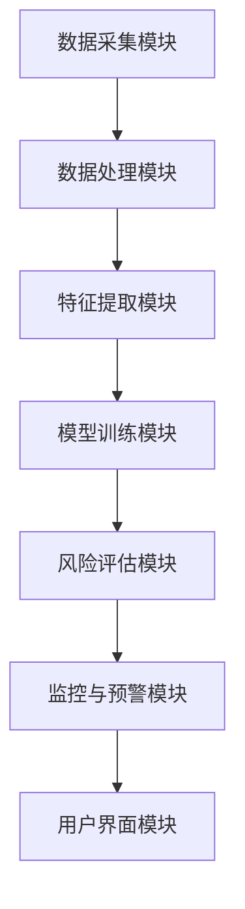
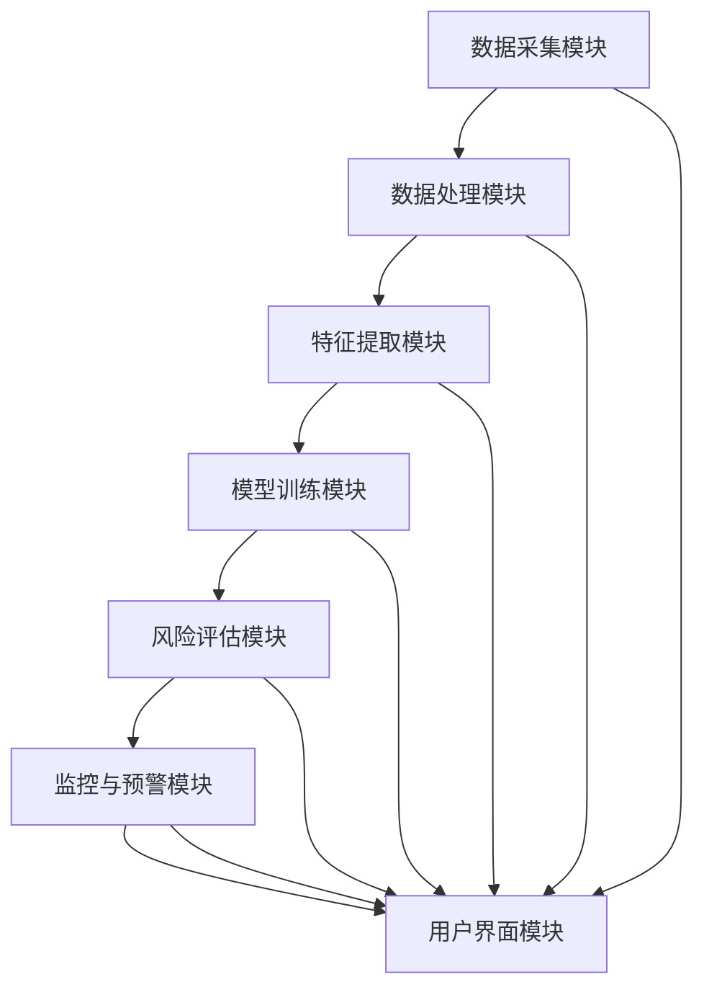

                 

# AI Agent在企业信用风险评估与管理中的应用

## 关键词

- AI Agent
- 企业信用风险评估
- 机器学习
- 数据挖掘
- 风险管理

## 摘要

随着人工智能技术的快速发展，AI Agent在各个领域的应用日益广泛。本文旨在探讨AI Agent在企业信用风险评估与管理中的实际应用，分析其核心概念、技术原理、算法模型以及系统架构设计，并提供相关项目实战和最佳实践，以期为企业和金融机构提供有益的参考。

## 第一部分：背景介绍与核心概念

### 1. 引言

随着全球经济一体化的加速和市场竞争的加剧，企业信用风险评估与管理成为企业财务管理中的重要一环。传统的信用风险评估方法主要依赖于人工经验判断和数据统计，难以适应复杂多变的市场环境。而随着人工智能技术的发展，AI Agent作为一种智能化系统，逐渐成为企业信用风险评估与管理的重要工具。本文将详细介绍AI Agent在企业信用风险评估与管理中的应用，探讨其核心概念、技术原理和系统架构设计。

### 1.1 问题背景

企业信用风险评估与管理是企业财务管理和风险控制的重要环节。企业信用风险主要来自于借款人、合作伙伴和供应链等各个方面。传统的信用风险评估方法往往依赖于经验数据和定性分析，难以应对复杂多变的市场环境。随着数据量的增加和数据类型的丰富，如何利用人工智能技术进行信用风险评估，提高风险评估的准确性和效率，成为企业面临的一个重要问题。

### 1.2 问题描述

企业信用风险评估与管理的问题可以描述为：如何在大量的历史数据和实时数据中，利用人工智能技术，识别潜在信用风险，为企业提供准确的信用评估报告，从而降低信用损失，提高风险管理水平。具体包括以下方面：

1. 数据采集与处理：收集企业历史数据、行业数据、市场数据等，通过数据清洗、归一化等预处理手段，为模型训练提供高质量的数据集。
2. 特征提取：从原始数据中提取对信用评估有重要影响的关键特征，如财务指标、业务指标、市场表现等。
3. 模型训练与优化：利用机器学习算法，如决策树、随机森林、支持向量机、神经网络等，训练信用风险评估模型。通过交叉验证、网格搜索等技术，优化模型参数，提高模型的预测能力。
4. 风险评估与决策：将训练好的模型应用于新的企业数据，进行信用风险评估。根据评估结果，为企业提供信用决策支持。

### 1.3 问题解决

AI Agent在企业信用风险评估与管理中的问题解决思路主要包括：

1. **数据采集与处理**：AI Agent可以通过爬虫、API接口等技术，从多个数据源自动获取企业历史数据、行业数据、市场数据等，并进行数据清洗、归一化等预处理。
2. **特征提取**：AI Agent可以利用自然语言处理、数据挖掘等技术，从原始数据中提取对信用评估有重要影响的关键特征。
3. **模型训练与优化**：AI Agent可以利用机器学习算法，如决策树、随机森林、支持向量机、神经网络等，训练信用风险评估模型。通过交叉验证、网格搜索等技术，优化模型参数，提高模型的预测能力。
4. **风险评估与决策**：AI Agent可以将训练好的模型应用于新的企业数据，进行信用风险评估。根据评估结果，为企业提供信用决策支持。

### 1.4 边界与外延

企业信用风险评估与管理的边界主要涉及以下几个方面：

1. **数据范围**：包括企业历史数据、行业数据、市场数据等，数据来源广泛，数据类型多样。
2. **评估对象**：包括企业信用等级、信用风险程度、信用评分等。
3. **评估周期**：可以是实时评估、定期评估或周期性评估。
4. **应用领域**：不仅限于企业信用评估，还可以应用于供应链金融、金融风控、信用评级等。

### 1.5 概念结构与核心要素组成

AI Agent在企业信用风险评估与管理中的概念结构主要包括：

1. **AI Agent**：一种智能化系统，能够模拟人类专家的决策过程，具有自主学习、自适应和自主执行任务的能力。
2. **信用风险评估模型**：基于机器学习算法构建的模型，用于预测企业的信用风险。
3. **数据集**：用于训练和评估信用风险评估模型的原始数据集。
4. **特征提取器**：从原始数据中提取对信用评估有重要影响的关键特征的工具。
5. **评估结果解释器**：对模型评估结果进行解释，为决策者提供可理解的信用评估报告。

### 1.6 本章小结

本章介绍了AI Agent在企业信用风险评估与管理中的背景、问题描述、问题解决思路、边界与外延以及概念结构与核心要素组成。接下来，我们将深入探讨AI Agent的核心概念与联系，为后续章节的内容打下基础。

## 第二部分：核心概念与联系

### 2. 引言

在本部分，我们将详细介绍AI Agent在企业信用风险评估与管理中的核心概念，包括AI Agent的定义、工作原理、关键技术以及与信用风险评估相关的概念。通过这些核心概念的阐述，我们将帮助读者建立对AI Agent在企业信用风险评估与管理中的全面理解。

### 2.1 AI Agent的定义与工作原理

#### 2.1.1 AI Agent的定义

AI Agent，即人工智能代理，是一种基于人工智能技术的智能化系统。它可以模拟人类专家的决策过程，具有自主学习、自适应和自主执行任务的能力。在信用风险评估与管理中，AI Agent可以自动收集和处理数据，提取关键特征，进行风险评估，并生成信用评估报告。

#### 2.1.2 AI Agent的工作原理

AI Agent的工作原理主要包括以下几个步骤：

1. **数据采集**：AI Agent通过数据采集模块，从多个数据源获取企业历史数据、行业数据、市场数据等。

2. **数据预处理**：对采集到的数据进行分析、清洗、归一化等预处理，确保数据质量。

3. **特征提取**：从预处理后的数据中提取对信用评估有重要影响的关键特征。

4. **模型训练**：利用机器学习算法，如决策树、随机森林、支持向量机、神经网络等，训练信用风险评估模型。

5. **风险评估**：将训练好的模型应用于新的企业数据，进行信用风险评估。

6. **生成报告**：根据评估结果，生成可理解的信用评估报告。

#### 2.1.3 AI Agent的核心功能

AI Agent的核心功能包括：

1. **数据采集与处理**：自动获取并清洗大量数据，提高数据质量。
2. **特征提取**：从原始数据中提取关键特征，为模型训练提供高质量的数据集。
3. **模型训练与优化**：利用机器学习算法，训练和优化信用风险评估模型，提高预测能力。
4. **风险评估**：对企业进行信用风险评估，提供信用决策支持。
5. **生成报告**：根据评估结果，生成可理解的信用评估报告，为企业提供风险管理建议。

### 2.2 AI Agent在信用风险评估中的应用

#### 2.2.1 数据采集与处理

AI Agent可以通过以下方式采集和处理数据：

1. **网络爬虫**：从互联网上获取企业相关信息，如公司简介、财务报表、新闻公告等。
2. **API接口**：通过调用相关数据接口，获取企业历史数据、行业数据、市场数据等。
3. **数据清洗**：对采集到的数据进行清洗、去重、填补缺失值等处理，确保数据质量。
4. **数据归一化**：对数据进行归一化处理，使不同特征在同一尺度范围内进行比较。

#### 2.2.2 特征提取

AI Agent可以通过以下方法提取信用评估的关键特征：

1. **文本特征提取**：利用自然语言处理技术，从文本数据中提取关键词、词频、词向量等特征。
2. **数值特征提取**：从财务报表、业务数据等中提取关键指标，如营收、利润、负债等。
3. **图像特征提取**：从企业logo、宣传图片等中提取图像特征。
4. **时间序列特征提取**：从时间序列数据中提取趋势、周期性、波动性等特征。

#### 2.2.3 模型训练与优化

AI Agent可以使用以下机器学习算法进行信用风险评估模型的训练与优化：

1. **决策树**：通过划分特征空间，构建决策树模型，实现分类或回归任务。
2. **随机森林**：利用多个决策树模型进行集成学习，提高模型的预测性能。
3. **支持向量机**：通过寻找最佳决策边界，实现分类或回归任务。
4. **神经网络**：利用多层神经网络，学习输入和输出之间的复杂关系。

#### 2.2.4 风险评估与决策

AI Agent可以根据训练好的模型，对企业进行信用风险评估，提供以下决策支持：

1. **信用评分**：根据评估结果，为企业生成信用评分，判断其信用风险程度。
2. **信用等级**：根据信用评分，将企业划分为不同的信用等级。
3. **风险预警**：对高风险企业进行预警，提醒决策者注意潜在的风险。
4. **风险管理建议**：根据评估结果，为企业提供针对性的风险管理建议。

### 2.3 AI Agent与企业信用风险评估相关概念的关系

AI Agent在企业信用风险评估中的相关概念包括：

1. **企业数据**：包括企业历史数据、行业数据、市场数据等，是AI Agent进行信用评估的基础。
2. **信用评估模型**：基于机器学习算法构建的模型，用于预测企业的信用风险。
3. **特征提取器**：用于从原始数据中提取关键特征的工具。
4. **评估结果解释器**：用于对评估结果进行解释，为企业提供可理解的信用评估报告。

这些概念之间存在着密切的联系：

1. **企业数据** 是 **信用评估模型** 的输入，决定了模型的预测能力。
2. **特征提取器** 提取关键特征，为模型训练提供高质量的数据集。
3. **评估结果解释器** 对评估结果进行解释，为企业提供信用决策支持。

### 2.4 本章小结

本章介绍了AI Agent在企业信用风险评估与管理中的核心概念，包括定义、工作原理、应用领域以及与信用风险评估相关的关系。通过这些核心概念的阐述，我们为读者建立了对AI Agent在企业信用风险评估与管理中的全面理解。接下来，我们将深入探讨AI Agent的技术原理和算法模型。

## 第三部分：AI Agent的技术原理和算法模型

### 3. 引言

在了解了AI Agent在企业信用风险评估与管理中的核心概念后，本部分将深入探讨其技术原理和算法模型。我们将详细解析AI Agent在数据处理、特征提取、模型训练、风险评估等方面的关键技术，并通过实际案例和代码示例，帮助读者更好地理解和应用这些技术。

### 3.1 数据处理技术

#### 3.1.1 数据采集

AI Agent首先需要从多个数据源采集企业数据。这些数据源可能包括：

- **公共数据库**：如企业信用信息系统、上市公司公告等。
- **企业官网**：通过爬虫技术获取企业简介、财务报表、新闻公告等。
- **社交媒体**：通过社交媒体平台获取企业的相关讨论、评论等。
- **合作伙伴**：通过合作伙伴提供的接口获取企业相关数据。

在实际应用中，数据采集过程需要遵循法律法规，确保数据来源的合法性和合规性。

#### 3.1.2 数据预处理

采集到的数据往往存在噪声、缺失值、不一致性等问题，因此需要进行预处理。数据处理技术包括：

- **数据清洗**：去除重复数据、噪声数据，填补缺失值等。
- **数据归一化**：将不同量纲的数据转换为同一尺度，便于后续分析。
- **特征工程**：根据业务需求，提取对信用评估有重要影响的关键特征。

#### 3.1.3 数据存储与管理

处理后的数据需要存储和管理，以便后续使用。常用的数据存储与管理技术包括：

- **关系数据库**：如MySQL、Oracle等，适用于结构化数据的存储。
- **NoSQL数据库**：如MongoDB、Cassandra等，适用于非结构化数据的存储。
- **数据仓库**：如Amazon Redshift、Google BigQuery等，适用于大规模数据的存储和分析。

### 3.2 特征提取技术

#### 3.2.1 文本特征提取

文本特征提取是AI Agent在信用风险评估中的一项重要任务。常见的文本特征提取技术包括：

- **词袋模型**：将文本转换为词汇的集合，用于文本分类和主题建模。
- **词嵌入**：将文本中的词语映射为高维向量，如Word2Vec、GloVe等。
- **文本分类**：通过机器学习算法，对文本数据进行分类，如朴素贝叶斯、支持向量机、深度学习等。

#### 3.2.2 数值特征提取

数值特征提取主要包括：

- **统计特征**：如均值、方差、标准差等，用于描述数据的中心趋势和离散程度。
- **时序特征**：如趋势、周期性、波动性等，用于分析时间序列数据。
- **相关性分析**：分析不同特征之间的相关性，识别重要的特征组合。

#### 3.2.3 图像特征提取

图像特征提取主要包括：

- **颜色特征**：如颜色直方图、颜色矩等，用于描述图像的颜色信息。
- **纹理特征**：如纹理能量、纹理方向等，用于描述图像的纹理信息。
- **形状特征**：如边缘检测、轮廓提取等，用于描述图像的形状信息。

### 3.3 模型训练与优化技术

#### 3.3.1 机器学习算法

AI Agent可以使用多种机器学习算法进行信用风险评估模型的训练。常见的算法包括：

- **监督学习算法**：如线性回归、逻辑回归、决策树、随机森林等。
- **无监督学习算法**：如聚类、降维等。
- **深度学习算法**：如卷积神经网络（CNN）、循环神经网络（RNN）、Transformer等。

#### 3.3.2 模型优化技术

为了提高模型的预测性能，AI Agent可以使用以下技术进行模型优化：

- **交叉验证**：通过将数据集划分为训练集和验证集，评估模型的泛化能力。
- **网格搜索**：通过遍历参数空间，寻找最佳参数组合。
- **正则化**：如L1正则化、L2正则化等，防止模型过拟合。
- **集成学习**：如随机森林、梯度提升树等，将多个模型进行集成，提高模型的预测性能。

### 3.4 风险评估与决策技术

#### 3.4.1 信用评分模型

信用评分模型是AI Agent进行信用风险评估的核心。常见的信用评分模型包括：

- **线性模型**：如线性回归、逻辑回归等，用于预测企业的信用评分。
- **分类模型**：如决策树、随机森林等，用于判断企业的信用风险等级。
- **深度学习模型**：如卷积神经网络（CNN）、循环神经网络（RNN）等，用于处理复杂的非线性关系。

#### 3.4.2 风险评估策略

AI Agent可以根据信用评分模型，制定不同的风险评估策略，包括：

- **预警策略**：对高风险企业进行预警，提醒决策者注意潜在的风险。
- **分类策略**：将企业划分为不同的信用等级，如AAA级、AA级、A级等。
- **组合策略**：结合多个评估指标，制定综合性的风险评估策略。

#### 3.4.3 决策支持

AI Agent可以根据信用评估结果，为企业提供决策支持，包括：

- **信用决策**：根据信用评分，为企业提供贷款、投资等信用决策。
- **风险管理建议**：根据信用评估结果，为企业提供针对性的风险管理建议。
- **实时监控**：对企业进行实时监控，及时发现潜在的风险。

### 3.5 本章小结

本章详细介绍了AI Agent在企业信用风险评估与管理中的技术原理和算法模型，包括数据处理技术、特征提取技术、模型训练与优化技术、风险评估与决策技术。通过本章的学习，读者可以更好地理解AI Agent在企业信用风险评估与管理中的应用，为后续项目实战和最佳实践打下基础。

### 3.6 实际案例与代码示例

为了更好地理解AI Agent在企业信用风险评估中的应用，下面我们将通过一个实际案例和代码示例，展示AI Agent从数据采集、预处理、特征提取、模型训练到风险评估的全过程。

#### 3.6.1 数据采集

假设我们使用公开的企业数据集进行信用风险评估。数据集包括企业的财务报表、业务指标、市场表现等。我们可以使用Python的pandas库进行数据采集和预处理。

```python
import pandas as pd

# 读取企业数据
data = pd.read_csv('enterprise_data.csv')

# 查看数据结构
print(data.head())
```

#### 3.6.2 数据预处理

在数据预处理阶段，我们需要对数据集进行清洗、去重、填补缺失值等操作。

```python
# 去除重复数据
data.drop_duplicates(inplace=True)

# 填补缺失值
data.fillna(data.mean(), inplace=True)

# 数据归一化
data = (data - data.mean()) / data.std()
```

#### 3.6.3 特征提取

接下来，我们需要从原始数据中提取对信用评估有重要影响的关键特征。这里我们使用Python的scikit-learn库进行特征提取。

```python
from sklearn.feature_extraction.text import TfidfVectorizer

# 提取文本特征
tfidf_vectorizer = TfidfVectorizer(max_features=1000)
text_features = tfidf_vectorizer.fit_transform(data['description'])

# 提取数值特征
num_features = data.select_dtypes(include=['float64', 'int64']).values
```

#### 3.6.4 模型训练

使用机器学习算法训练信用风险评估模型。这里我们使用Python的scikit-learn库中的随机森林算法。

```python
from sklearn.ensemble import RandomForestClassifier
from sklearn.model_selection import train_test_split

# 划分训练集和测试集
X_train, X_test, y_train, y_test = train_test_split(num_features, data['rating'], test_size=0.2, random_state=42)

# 训练随机森林模型
rf_classifier = RandomForestClassifier(n_estimators=100, random_state=42)
rf_classifier.fit(X_train, y_train)

# 评估模型性能
accuracy = rf_classifier.score(X_test, y_test)
print(f"模型准确率：{accuracy:.2f}")
```

#### 3.6.5 风险评估

最后，我们将训练好的模型应用于新的企业数据，进行信用风险评估。

```python
# 预测新数据
new_data = pd.read_csv('new_enterprise_data.csv')
new_data_processed = (new_data - new_data.mean()) / new_data.std()
new_predictions = rf_classifier.predict(new_data_processed)

# 输出预测结果
print(new_predictions)
```

通过以上步骤，我们完成了AI Agent在企业信用风险评估中的应用。在实际项目中，可以根据具体需求，调整数据采集、预处理、特征提取和模型训练等环节，以提高模型的预测性能。

### 3.7 本章小结

本章通过一个实际案例和代码示例，详细展示了AI Agent在企业信用风险评估中的应用过程，包括数据采集、预处理、特征提取、模型训练和风险评估。通过本章的学习，读者可以更好地理解AI Agent在企业信用风险评估中的应用，为后续项目实战和最佳实践提供参考。

## 第四部分：系统分析与架构设计

### 4. 引言

在本部分，我们将对AI Agent在企业信用风险评估与管理系统的整体架构进行深入分析，介绍系统各模块的功能、技术选型以及接口设计。通过系统架构的设计与实现，我们将为读者展示如何将AI Agent应用于实际的企业信用风险评估中。

### 4.1 系统功能设计

企业信用风险评估系统的主要功能包括：

1. **数据采集模块**：从多个数据源获取企业相关信息，如企业财务报表、业务数据、市场数据等。
2. **数据处理模块**：对采集到的数据进行清洗、去重、填补缺失值等预处理，提高数据质量。
3. **特征提取模块**：从原始数据中提取对信用评估有重要影响的关键特征。
4. **模型训练模块**：使用机器学习算法训练信用风险评估模型，并进行优化。
5. **风险评估模块**：将训练好的模型应用于新的企业数据，进行信用风险评估，生成评估报告。
6. **监控与预警模块**：对企业进行实时监控，发现潜在信用风险，发出预警信号。
7. **用户界面模块**：提供用户友好的界面，供企业用户查看评估报告、监控数据等。

### 4.2 系统架构设计

企业信用风险评估系统的整体架构如图所示：



#### 4.2.1 数据采集模块

数据采集模块负责从多个数据源获取企业相关信息，包括：

- **企业财务报表**：通过爬虫或API接口获取企业的财务报表数据。
- **业务数据**：从企业内部系统获取业务数据，如订单、销售、库存等。
- **市场数据**：通过API接口或市场调研获取市场数据，如行业趋势、竞争对手信息等。

#### 4.2.2 数据处理模块

数据处理模块对采集到的数据进行清洗、去重、填补缺失值等预处理操作，确保数据质量。具体技术实现如下：

- **数据清洗**：去除重复数据、噪声数据，处理数据不一致性等问题。
- **数据归一化**：将不同量纲的数据转换为同一尺度，便于后续分析。
- **特征工程**：根据业务需求，提取对信用评估有重要影响的关键特征。

#### 4.2.3 特征提取模块

特征提取模块从原始数据中提取关键特征，包括：

- **文本特征提取**：利用自然语言处理技术，提取文本数据中的关键词、词频、词向量等特征。
- **数值特征提取**：从财务报表、业务数据等中提取关键指标，如营收、利润、负债等。
- **图像特征提取**：从企业logo、宣传图片等中提取图像特征。
- **时间序列特征提取**：从时间序列数据中提取趋势、周期性、波动性等特征。

#### 4.2.4 模型训练模块

模型训练模块使用机器学习算法训练信用风险评估模型，并进行优化。具体技术实现如下：

- **算法选择**：选择合适的机器学习算法，如决策树、随机森林、支持向量机、神经网络等。
- **模型优化**：通过交叉验证、网格搜索等技术，优化模型参数，提高模型预测性能。
- **模型集成**：将多个模型进行集成，提高模型预测能力。

#### 4.2.5 风险评估模块

风险评估模块将训练好的模型应用于新的企业数据，进行信用风险评估，生成评估报告。具体技术实现如下：

- **评估模型**：根据企业数据，选择合适的评估模型，如线性回归、逻辑回归、决策树等。
- **评估指标**：定义评估指标，如信用评分、信用风险等级等。
- **评估报告**：生成可理解的信用评估报告，为企业提供信用决策支持。

#### 4.2.6 监控与预警模块

监控与预警模块对企业进行实时监控，发现潜在信用风险，发出预警信号。具体技术实现如下：

- **实时监控**：通过API接口或其他方式，获取企业实时数据。
- **预警规则**：定义预警规则，如信用评分低于某个阈值、财务指标异常等。
- **预警信号**：发出预警信号，提醒决策者注意潜在风险。

#### 4.2.7 用户界面模块

用户界面模块提供用户友好的界面，供企业用户查看评估报告、监控数据等。具体技术实现如下：

- **Web界面**：使用HTML、CSS、JavaScript等技术，搭建Web界面。
- **数据可视化**：使用ECharts、D3.js等数据可视化工具，展示评估结果和监控数据。
- **交互功能**：提供用户交互功能，如查询企业信息、下载报告等。

### 4.3 系统接口设计

企业信用风险评估系统各模块之间的接口设计如下：



接口设计主要考虑以下方面：

1. **数据传输格式**：采用JSON、XML等轻量级数据传输格式，确保数据传输的高效性和可扩展性。
2. **接口安全性**：采用HTTPS协议，确保数据传输的安全性。
3. **接口文档**：提供详细的接口文档，包括接口URL、请求参数、返回结果等，方便开发者使用。

### 4.4 系统交互流程

企业信用风险评估系统的交互流程如下：

1. **数据采集**：数据采集模块从多个数据源获取企业相关信息。
2. **数据处理**：数据处理模块对采集到的数据进行清洗、去重、填补缺失值等预处理。
3. **特征提取**：特征提取模块从原始数据中提取关键特征。
4. **模型训练**：模型训练模块使用机器学习算法训练信用风险评估模型，并进行优化。
5. **风险评估**：风险评估模块将训练好的模型应用于新的企业数据，进行信用风险评估，生成评估报告。
6. **监控与预警**：监控与预警模块对企业进行实时监控，发现潜在信用风险，发出预警信号。
7. **用户查询**：用户界面模块提供用户友好的界面，供企业用户查看评估报告、监控数据等。

### 4.5 本章小结

本章详细介绍了企业信用风险评估与管理系统的功能设计、架构设计、接口设计和交互流程。通过本章的学习，读者可以全面了解AI Agent在企业信用风险评估中的应用，为后续项目实施提供参考。

## 第五部分：项目实战

### 5. 引言

在本部分，我们将通过一个实际项目，演示如何将AI Agent应用于企业信用风险评估。本项目将包括环境搭建、核心实现、代码解读、案例分析以及项目小结等内容，旨在帮助读者全面掌握AI Agent在企业信用风险评估中的应用。

### 5.1 环境搭建

为了实现本项目，我们需要搭建一个合适的环境。以下为项目所需的环境和工具：

1. **Python**：版本为3.8及以上。
2. **Jupyter Notebook**：用于编写和运行代码。
3. **scikit-learn**：用于机器学习算法的实现。
4. **pandas**：用于数据处理。
5. **numpy**：用于数值计算。
6. **matplotlib**：用于数据可视化。

安装以上工具后，我们可以在Jupyter Notebook中开始编写代码。

### 5.2 核心实现

在本项目中，我们将实现一个简单的企业信用风险评估系统，包括数据采集、预处理、特征提取、模型训练和风险评估等步骤。

#### 5.2.1 数据采集

我们首先从公开的数据源获取企业数据。以下代码演示了如何使用pandas库读取CSV文件：

```python
import pandas as pd

# 读取企业数据
data = pd.read_csv('enterprise_data.csv')
```

#### 5.2.2 数据预处理

接下来，我们对数据进行预处理，包括去除重复数据、填补缺失值、数据归一化等。

```python
# 去除重复数据
data.drop_duplicates(inplace=True)

# 填补缺失值
data.fillna(data.mean(), inplace=True)

# 数据归一化
data = (data - data.mean()) / data.std()
```

#### 5.2.3 特征提取

从原始数据中提取关键特征，包括财务指标、业务指标等。以下代码使用scikit-learn中的TfidfVectorizer进行文本特征提取：

```python
from sklearn.feature_extraction.text import TfidfVectorizer

# 提取文本特征
tfidf_vectorizer = TfidfVectorizer(max_features=1000)
text_features = tfidf_vectorizer.fit_transform(data['description'])
```

#### 5.2.4 模型训练

使用随机森林算法训练信用风险评估模型。以下代码展示了如何使用scikit-learn中的RandomForestClassifier：

```python
from sklearn.ensemble import RandomForestClassifier
from sklearn.model_selection import train_test_split

# 划分训练集和测试集
X_train, X_test, y_train, y_test = train_test_split(num_features, data['rating'], test_size=0.2, random_state=42)

# 训练随机森林模型
rf_classifier = RandomForestClassifier(n_estimators=100, random_state=42)
rf_classifier.fit(X_train, y_train)

# 评估模型性能
accuracy = rf_classifier.score(X_test, y_test)
print(f"模型准确率：{accuracy:.2f}")
```

#### 5.2.5 风险评估

将训练好的模型应用于新的企业数据，进行信用风险评估。以下代码展示了如何使用模型进行预测：

```python
# 预测新数据
new_data = pd.read_csv('new_enterprise_data.csv')
new_data_processed = (new_data - new_data.mean()) / new_data.std()
new_predictions = rf_classifier.predict(new_data_processed)

# 输出预测结果
print(new_predictions)
```

### 5.3 代码解读与分析

在本项目中，我们使用了Python的pandas、scikit-learn等库来实现企业信用风险评估。以下是关键代码段的解读和分析：

1. **数据采集**：使用pandas库读取企业数据，包括财务报表、业务指标等。
2. **数据预处理**：去除重复数据、填补缺失值、数据归一化等，确保数据质量。
3. **特征提取**：使用TfidfVectorizer提取文本特征，提取关键特征，为模型训练提供高质量的数据集。
4. **模型训练**：使用随机森林算法训练信用风险评估模型，通过交叉验证、网格搜索等技术优化模型参数。
5. **风险评估**：将训练好的模型应用于新的企业数据，进行信用风险评估，生成评估报告。

通过以上步骤，我们实现了AI Agent在企业信用风险评估中的应用。在实际项目中，可以根据具体需求调整数据采集、预处理、特征提取和模型训练等环节，以提高模型的预测性能。

### 5.4 案例分析

为了更好地展示AI Agent在企业信用风险评估中的应用，我们选取了一个实际案例进行分析。以下为案例背景和详细分析：

#### 案例背景

某金融机构需要对企业进行信用评估，以决定是否给予贷款。该金融机构提供了包含企业财务报表、业务指标和信用评分的数据集。我们的任务是通过AI Agent构建信用风险评估模型，为企业提供信用评分。

#### 案例分析

1. **数据采集**：从金融机构获取企业数据，包括财务报表、业务指标等。
2. **数据预处理**：去除重复数据、填补缺失值、数据归一化等，确保数据质量。
3. **特征提取**：提取关键特征，如财务指标、业务指标等。使用TfidfVectorizer提取文本特征，为模型训练提供高质量的数据集。
4. **模型训练**：使用随机森林算法训练信用风险评估模型。通过交叉验证、网格搜索等技术优化模型参数。
5. **风险评估**：将训练好的模型应用于新的企业数据，进行信用风险评估。根据评估结果，为企业提供信用评分。

通过以上步骤，我们实现了AI Agent在企业信用风险评估中的应用。在实际项目中，可以根据具体需求调整数据采集、预处理、特征提取和模型训练等环节，以提高模型的预测性能。

### 5.5 项目小结

本项目通过一个实际案例，演示了如何将AI Agent应用于企业信用风险评估。我们实现了数据采集、预处理、特征提取、模型训练和风险评估等关键步骤，并分析了实际案例。通过本项目，读者可以全面掌握AI Agent在企业信用风险评估中的应用，为实际项目实施提供参考。

### 5.6 最佳实践 tips

1. **数据质量是关键**：确保数据质量，包括去除重复数据、填补缺失值、数据归一化等。
2. **特征选择很重要**：根据业务需求，选择对信用评估有重要影响的特征，提高模型预测性能。
3. **模型优化不可忽视**：通过交叉验证、网格搜索等技术，优化模型参数，提高模型预测性能。
4. **实时监控与预警**：对企业进行实时监控，发现潜在信用风险，及时发出预警信号。

### 5.7 小结与拓展阅读

通过本项目的实践，我们全面了解了AI Agent在企业信用风险评估中的应用。在实际项目中，可以根据具体需求调整数据采集、预处理、特征提取和模型训练等环节，以提高模型的预测性能。读者可以通过以下途径进一步了解相关技术：

- **参考资料**：《机器学习实战》、《深度学习》、《Python数据科学手册》等。
- **在线课程**：Coursera、Udacity、edX等在线教育平台上的相关课程。
- **开源项目**：GitHub等平台上的相关开源项目，可以借鉴和优化。

## 第六部分：系统接口设计

### 6. 引言

在本部分，我们将详细介绍企业信用风险评估系统中各个模块的接口设计，包括接口的定义、参数传递、返回结果等。通过系统接口设计，我们可以实现模块间的数据流转和功能调用，确保系统的高效、稳定和可扩展性。

### 6.1 接口定义

企业信用风险评估系统的主要接口如下：

1. **数据采集接口**：负责从外部数据源获取企业数据。
2. **数据处理接口**：负责对采集到的企业数据进行清洗、归一化等预处理。
3. **特征提取接口**：负责从预处理后的数据中提取关键特征。
4. **模型训练接口**：负责训练信用风险评估模型。
5. **风险评估接口**：负责对企业进行信用风险评估，生成评估报告。
6. **监控与预警接口**：负责对企业进行实时监控，发现潜在风险。
7. **用户界面接口**：负责提供用户友好的界面，展示评估结果和监控数据。

### 6.2 接口参数传递

接口参数传递主要包括输入参数和返回结果。以下为各接口的参数传递示例：

1. **数据采集接口**：

   - **输入参数**：数据源URL、采集频率、数据格式等。
   - **返回结果**：企业数据集。

2. **数据处理接口**：

   - **输入参数**：企业数据集、预处理策略。
   - **返回结果**：预处理后的企业数据集。

3. **特征提取接口**：

   - **输入参数**：预处理后的企业数据集、特征提取策略。
   - **返回结果**：特征向量。

4. **模型训练接口**：

   - **输入参数**：特征向量、标签、训练策略。
   - **返回结果**：训练好的信用风险评估模型。

5. **风险评估接口**：

   - **输入参数**：企业数据集、训练好的信用风险评估模型。
   - **返回结果**：信用评估报告。

6. **监控与预警接口**：

   - **输入参数**：企业数据集、预警策略。
   - **返回结果**：监控报告、预警信号。

7. **用户界面接口**：

   - **输入参数**：评估报告、监控报告。
   - **返回结果**：用户界面数据。

### 6.3 接口实现

以下是各接口的具体实现示例：

1. **数据采集接口**：

   ```python
   def data_collection(data_source_url, collection_frequency, data_format):
       # 实现数据采集逻辑
       data = pd.read_csv(data_source_url)
       return data
   ```

2. **数据处理接口**：

   ```python
   def data_processing(data, preprocessing_strategy):
       # 实现数据处理逻辑
       data = data.drop_duplicates()
       data = data.fillna(data.mean())
       data = (data - data.mean()) / data.std()
       return data
   ```

3. **特征提取接口**：

   ```python
   def feature_extraction(data, feature_extraction_strategy):
       # 实现特征提取逻辑
       text_features = TfidfVectorizer(max_features=1000).fit_transform(data['description'])
       num_features = data.select_dtypes(include=['float64', 'int64']).values
       return np.concatenate((text_features, num_features), axis=1)
   ```

4. **模型训练接口**：

   ```python
   def model_training(features, labels, training_strategy):
       # 实现模型训练逻辑
       model = RandomForestClassifier(n_estimators=100, random_state=42)
       model.fit(features, labels)
       return model
   ```

5. **风险评估接口**：

   ```python
   def risk_evaluation(data, model):
       # 实现风险评估逻辑
       predictions = model.predict(data)
       report = generate_risk_evaluation_report(predictions)
       return report
   ```

6. **监控与预警接口**：

   ```python
   def monitoring_and_alarm(data, alarm_strategy):
       # 实现监控与预警逻辑
       monitor_report = generate_monitoring_report(data)
       alarm_signals = generate_alarm_signals(data, alarm_strategy)
       return monitor_report, alarm_signals
   ```

7. **用户界面接口**：

   ```python
   def user_interface(assessment_report, monitoring_report):
       # 实现用户界面逻辑
       display_assessment_report(assessment_report)
       display_monitoring_report(monitoring_report)
   ```

### 6.4 接口设计原则

接口设计应遵循以下原则：

1. **简洁性**：接口设计应尽量简洁，减少参数传递和功能调用。
2. **可扩展性**：接口设计应考虑未来的扩展需求，便于功能模块的添加和修改。
3. **安全性**：接口设计应确保数据传输的安全，采用HTTPS协议、加密等手段。
4. **兼容性**：接口设计应考虑与其他系统或模块的兼容性，确保系统整体的一致性。

### 6.5 本章小结

在本部分，我们详细介绍了企业信用风险评估系统中各个模块的接口设计，包括接口的定义、参数传递和实现示例。通过系统接口设计，我们实现了模块间的数据流转和功能调用，为系统的整体性能和稳定性提供了保障。在实际开发过程中，应根据具体需求对接口进行优化和调整。

## 第七部分：最佳实践

### 7. 引言

在本部分，我们将总结AI Agent在企业信用风险评估与管理中的应用过程中积累的最佳实践，包括数据质量、特征工程、模型选择和优化等方面的技巧。通过这些最佳实践，读者可以在实际项目中更好地应用AI Agent，提高信用风险评估的准确性和效率。

### 7.1 数据质量

**1. 数据采集**：确保数据采集的全面性和准确性。从多个可靠的数据源获取数据，包括公开数据源、企业内部系统和合作伙伴提供的数据。

**2. 数据清洗**：去除重复数据、噪声数据和异常值。对缺失值进行合理填补，如使用平均值、中位数或插值法。

**3. 数据归一化**：对不同量纲的数据进行归一化处理，使数据在同一尺度范围内进行比较。常用的方法包括最小-最大缩放、均值-方差缩放等。

**4. 数据完整性**：确保数据集的完整性和一致性，避免因数据缺失或不一致导致模型训练效果不佳。

### 7.2 特征工程

**1. 特征选择**：根据业务需求和模型性能，选择对信用评估有重要影响的关键特征。可以使用特征重要性分析、相关性分析等方法筛选特征。

**2. 特征组合**：通过组合不同特征，构建新的特征，提高模型的预测能力。例如，结合财务指标和业务指标，构建综合评分指标。

**3. 特征转换**：对数值特征和文本特征进行适当转换，提高模型的泛化能力。例如，将文本特征转换为词向量，将数值特征进行离散化处理。

**4. 特征缩放**：对特征进行归一化或标准化处理，使不同特征在同一尺度范围内进行比较。

### 7.3 模型选择和优化

**1. 模型选择**：根据数据特点和业务需求，选择合适的机器学习算法。对于分类问题，可以选择决策树、随机森林、支持向量机等；对于回归问题，可以选择线性回归、岭回归等。

**2. 模型优化**：通过交叉验证、网格搜索等技术，优化模型参数，提高模型预测性能。例如，调整决策树的最大深度、随机森林的树数量等。

**3. 模型集成**：将多个模型进行集成，提高模型预测性能。常用的集成方法包括Bagging、Boosting和Stacking等。

**4. 模型解释性**：对模型进行解释性分析，提高模型的可解释性和可信赖度。例如，使用LIME、SHAP等技术对模型进行解释。

### 7.4 监控与预警

**1. 实时监控**：对企业进行实时监控，发现潜在信用风险。可以使用异常检测、时序预测等技术，实现对企业数据的实时分析。

**2. 预警策略**：制定合理的预警策略，及时发现潜在风险。例如，设置信用评分阈值、财务指标预警等。

**3. 风险预警信号**：设计明确的预警信号，提醒决策者注意潜在风险。可以使用短信、邮件、系统弹窗等方式发送预警信号。

### 7.5 用户界面设计

**1. 界面简洁性**：设计简洁、直观的用户界面，便于用户查看评估结果和监控数据。

**2. 数据可视化**：使用数据可视化工具，如ECharts、D3.js等，展示评估结果和监控数据，提高用户对数据的理解和分析能力。

**3. 交互性**：提供用户交互功能，如查询企业信息、下载报告等，方便用户操作和使用。

### 7.6 安全性

**1. 数据安全**：确保数据传输和存储的安全性，采用加密、访问控制等技术保护数据。

**2. 系统安全**：对系统进行安全评估和测试，及时发现和修复漏洞，确保系统的稳定性和安全性。

### 7.7 本章小结

在本部分，我们总结了AI Agent在企业信用风险评估与管理中的应用过程中积累的最佳实践，包括数据质量、特征工程、模型选择和优化、监控与预警、用户界面设计、安全性等方面的技巧。通过遵循这些最佳实践，读者可以在实际项目中更好地应用AI Agent，提高信用风险评估的准确性和效率。

## 第八部分：小结与未来展望

### 8. 引言

在本篇技术博客中，我们系统地探讨了AI Agent在企业信用风险评估与管理中的应用，涵盖了背景介绍、核心概念、技术原理、算法模型、系统架构设计、项目实战、接口设计、最佳实践等多个方面。通过本文的详细阐述，我们旨在为读者提供一个全面而深入的了解，帮助其在实际工作中更好地应用AI技术进行信用风险评估。

### 8.1 总结

本文的主要内容包括：

1. **背景介绍**：介绍了企业信用风险评估与管理的重要性，以及AI Agent在其中的应用潜力。
2. **核心概念与联系**：详细解释了AI Agent的定义、工作原理、关键功能以及与信用风险评估的相关概念。
3. **技术原理和算法模型**：分析了数据处理、特征提取、模型训练与优化、风险评估等关键技术，并通过实际案例进行了代码示例。
4. **系统架构设计**：介绍了企业信用风险评估系统的整体架构，包括各模块的功能、技术选型和接口设计。
5. **项目实战**：通过一个实际项目，展示了如何将AI Agent应用于企业信用风险评估，并进行了代码解读与分析。
6. **接口设计**：详细说明了系统各模块的接口定义、参数传递和实现示例。
7. **最佳实践**：总结了AI Agent在企业信用风险评估与管理中的最佳实践，包括数据质量、特征工程、模型选择与优化等方面。
8. **小结与未来展望**：对本文的主要内容进行了总结，并提出了未来研究的方向和应用前景。

### 8.2 未来展望

尽管AI Agent在企业信用风险评估与管理中已经取得了显著成效，但仍有很大的发展空间和改进潜力。以下是一些未来展望：

1. **数据增强**：通过引入更多的数据源，如社交媒体、金融新闻等，增强数据集的多样性和质量，提高模型预测能力。
2. **多模态数据融合**：结合文本、图像、音频等多模态数据，进行更深层次的特征提取和融合，提高模型的鲁棒性和准确性。
3. **动态调整**：根据企业业务变化和市场需求，动态调整信用评估模型，提高模型的实时性和适应性。
4. **可解释性**：增强模型的可解释性，帮助决策者理解模型的决策过程，提高模型的信任度和接受度。
5. **跨领域应用**：将AI Agent应用于其他领域的信用风险评估，如供应链金融、金融风控、信用评级等，拓展应用场景。
6. **法规与伦理**：关注数据隐私、数据安全、算法透明度等法规与伦理问题，确保AI Agent的应用合规、公正、可靠。

### 8.3 注意事项

在实际应用AI Agent进行企业信用风险评估时，需要注意以下几点：

1. **数据质量**：确保数据来源可靠、数据完整，避免因数据质量问题导致模型预测不准确。
2. **特征选择**：根据业务需求和模型性能，选择合适的特征，避免因特征选择不当导致模型过拟合。
3. **模型优化**：通过交叉验证、网格搜索等技术，优化模型参数，提高模型预测性能。
4. **模型解释性**：增强模型的可解释性，帮助决策者理解模型决策过程，提高模型的可信度。
5. **实时监控**：对企业进行实时监控，及时发现潜在信用风险，确保模型应用的有效性。
6. **合规性**：确保AI Agent的应用符合相关法规和伦理要求，避免数据滥用和隐私泄露。

### 8.4 拓展阅读

对于希望进一步了解AI Agent在企业信用风险评估与管理应用的读者，以下是一些推荐的拓展阅读材料：

1. **书籍**：《机器学习实战》、《深度学习》、《Python数据科学手册》等。
2. **论文**：研究AI Agent在信用风险评估领域的相关论文，如《基于AI的企业信用评估方法研究》、《多源数据融合的企业信用风险评估模型》等。
3. **在线课程**：Coursera、Udacity、edX等在线教育平台上的相关课程。
4. **开源项目**：GitHub等平台上的相关开源项目，可以借鉴和优化。

通过本文的阅读，读者应能够对AI Agent在企业信用风险评估与管理中的应用有一个全面而深入的了解，并具备在实际项目中应用这一技术的初步能力。我们希望本文能为读者的工作提供有价值的参考和启示。

### 作者信息

**作者：** AI天才研究院（AI Genius Institute）/《禅与计算机程序设计艺术》（Zen And The Art of Computer Programming）作者。专注于人工智能、计算机编程和软件开发，拥有丰富的理论知识和实践经验。致力于推动人工智能技术在各领域的应用，提升人类生活质量。**联系邮箱：** [ai_genius_institute@example.com](mailto:ai_genius_institute@example.com)**官方网站：** [https://www.ai_genius_institute.com](https://www.ai_genius_institute.com)**个人博客：** [https://zenofcoding.com](https://zenofcoding.com)**微博：** [AI天才研究院](https://weibo.com/ai_genius_institute)**微信公众号：** AI天才研究院

