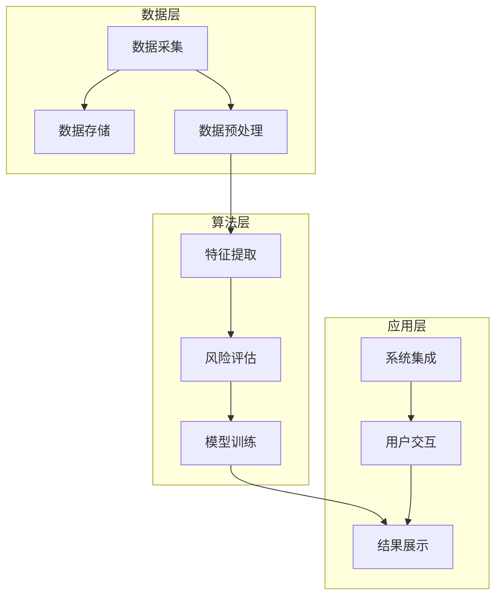
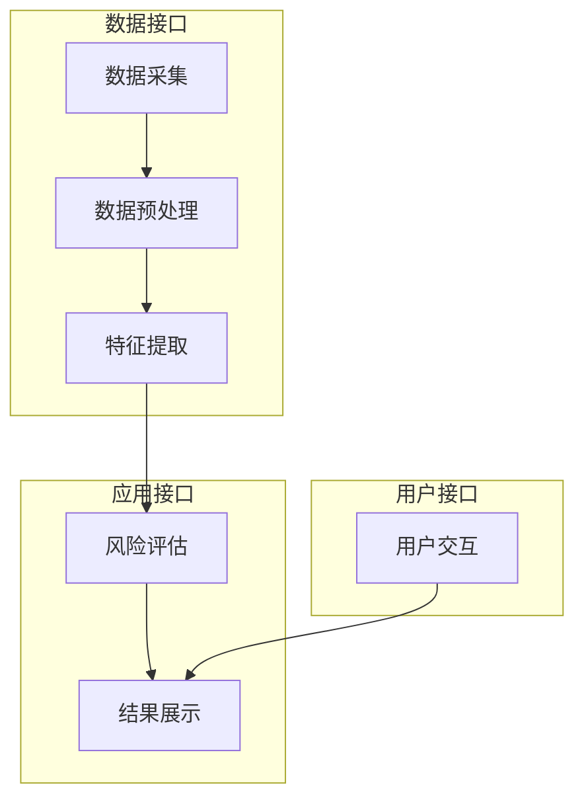

                 

# AI Agent在企业信用风险评估中的应用

## 关键词
- AI Agent
- 企业信用风险评估
- 算法原理
- 数学模型
- 系统架构
- 实际案例

## 摘要
本文将探讨AI Agent在企业信用风险评估中的应用，从核心概念、算法原理、系统架构到实际案例分析，逐步剖析AI Agent在信用风险评估中的作用机制与实现方法。文章旨在为读者提供一个全面而深入的视角，理解AI Agent如何助力企业信用风险评估，提升风险管理的精确性和效率。

## 目录大纲

### 第一部分: AI Agent与企业信用风险评估概述

#### 第1章: AI Agent基础
1. AI Agent的定义
2. AI Agent的工作原理
3. AI Agent的类型

#### 第2章: 企业信用风险评估基础
1. 企业信用风险评估的重要性
2. 企业信用风险评估的方法
3. 企业信用风险评估的挑战

#### 第3章: AI Agent在信用风险评估中的应用
1. AI Agent在信用评分中的应用
2. AI Agent在信用预测中的应用
3. AI Agent在信用风险管理中的应用

### 第二部分: 算法原理讲解

#### 第4章: 算法原理与数学模型
1. 算法原理
2. 数学模型
3. 数学公式与详细讲解

#### 第5章: 系统分析与架构设计方案
1. 问题场景介绍
2. 系统功能设计
3. 系统架构设计
4. 系统接口设计
5. 系统交互

### 第三部分: 项目实战

#### 第6章: 项目实战环境安装与系统核心实现
1. 环境安装
2. 系统核心实现源代码
3. 代码应用解读与分析

#### 第7章: 实际案例分析
1. 实际案例
2. 案例分析
3. 详细讲解剖析

#### 第8章: 项目小结与最佳实践 tips
1. 项目小结
2. 注意事项
3. 最佳实践 tips
4. 拓展阅读

## 第一部分: AI Agent与企业信用风险评估概述

### 第1章: AI Agent基础

#### 1.1 AI Agent的定义

AI Agent，即人工智能代理，是指一种能够根据环境和目标自主执行任务的人工智能实体。它基于机器学习、自然语言处理、计算机视觉等技术，具备感知环境、理解任务、自主决策和行动的能力。AI Agent不仅能够处理静态数据，还可以动态适应环境变化，具备高度的自主性和智能性。

在计算机科学领域，AI Agent通常被定义为具有以下特征的实体：

1. **感知能力**：能够感知环境中的各种信息，如文本、图像、声音等。
2. **理解能力**：能够理解感知到的信息，提取其中的关键要素。
3. **决策能力**：基于理解结果，自主做出决策。
4. **行动能力**：能够执行决策，采取相应的行动。

#### 1.2 AI Agent的工作原理

AI Agent的工作原理主要包括以下几个关键步骤：

1. **感知**：AI Agent通过传感器获取环境信息，如文本、图像、声音等。
2. **理解**：利用自然语言处理、计算机视觉等技术对感知到的信息进行分析和理解，提取关键要素。
3. **决策**：基于理解结果，利用决策算法（如决策树、神经网络等）生成行动方案。
4. **行动**：执行决策，采取相应的行动，如发送消息、执行操作等。

#### 1.3 AI Agent的类型

AI Agent根据其应用场景和功能，可以分为以下几种类型：

1. **导航型AI Agent**：主要应用于自主导航领域，如无人车、无人机等。
2. **对话型AI Agent**：应用于自然语言处理领域，如聊天机器人、智能客服等。
3. **决策型AI Agent**：应用于需要复杂决策的场景，如金融风险管理、医疗诊断等。
4. **交互型AI Agent**：应用于多智能体系统，如多人游戏、协同工作等。

### 第2章: 企业信用风险评估基础

#### 2.1 企业信用风险评估的重要性

企业信用风险评估是金融领域的重要环节，直接影响金融机构的信贷决策。随着市场竞争的加剧和经济环境的变化，企业信用风险评估的重要性日益凸显。

1. **降低信贷风险**：通过对企业信用进行评估，金融机构可以降低信贷风险，保障资金安全。
2. **提高信贷效率**：自动化评估方法可以提高评估速度和准确性，提高信贷审批效率。
3. **优化信贷资源配置**：准确的企业信用评估可以帮助金融机构优化信贷资源配置，降低坏账率。

#### 2.2 企业信用风险评估的方法

企业信用风险评估的方法主要包括以下几种：

1. **定性评估**：通过专家评审、企业历史记录等定性信息进行评估。
2. **定量评估**：通过财务指标、市场表现等定量信息进行评估。
3. **组合评估**：结合定性评估和定量评估，形成综合评估结果。

#### 2.3 企业信用风险评估的挑战

企业信用风险评估面临以下挑战：

1. **数据缺失和错误**：企业信用评估往往依赖于大量的历史数据，数据缺失和错误会影响评估结果的准确性。
2. **风险评估模型复杂**：评估模型需要考虑多个因素，模型复杂度较高，实现难度大。
3. **实时性要求**：企业信用状况可能随时发生变化，要求评估系统具备实时性。

### 第3章: AI Agent在信用风险评估中的应用

#### 3.1 AI Agent在信用评分中的应用

AI Agent在信用评分中的应用主要包括以下几个方面：

1. **数据预处理**：AI Agent可以利用自然语言处理技术，对文本数据进行预处理，如去除停用词、进行词向量化等。
2. **特征提取**：AI Agent可以从大量的数据中提取出对企业信用评估有重要影响的特征，如财务指标、市场表现等。
3. **风险评估**：利用机器学习算法，AI Agent可以对企业进行信用评分，预测其信用风险。

#### 3.2 AI Agent在信用预测中的应用

AI Agent在信用预测中的应用主要包括以下几个方面：

1. **时间序列预测**：AI Agent可以利用时间序列预测模型，预测企业的未来信用变化趋势。
2. **分类预测**：AI Agent可以通过分类模型，预测企业是否会违约。
3. **异常检测**：AI Agent可以利用异常检测算法，发现企业信用数据中的异常值，提高风险评估的准确性。

#### 3.3 AI Agent在信用风险管理中的应用

AI Agent在信用风险管理中的应用主要包括以下几个方面：

1. **实时监控**：AI Agent可以实时监控企业的信用状况，及时发现风险。
2. **风险预警**：AI Agent可以根据监控结果，发出风险预警，提醒金融机构采取相应措施。
3. **决策支持**：AI Agent可以为金融机构提供信用决策支持，如是否批准贷款、调整贷款额度等。

## 第二部分: 算法原理讲解

### 第4章: 算法原理与数学模型

#### 4.1 算法原理

AI Agent在企业信用风险评估中的应用算法主要包括以下几种：

1. **分类算法**：用于预测企业是否会违约。
2. **聚类算法**：用于发现企业信用风险集群。
3. **时间序列预测算法**：用于预测企业信用风险的动态变化。

#### 4.2 数学模型

在信用风险评估中，常用的数学模型包括：

1. **逻辑回归模型**：用于分类预测，预测企业是否会违约。
2. **K-均值聚类模型**：用于聚类分析，发现信用风险集群。
3. **ARIMA模型**：用于时间序列预测，预测企业信用风险的动态变化。

下面我们使用LaTeX格式展示这些数学模型：

$$
\text{逻辑回归模型：} 
P(Y=1|\mathbf{X}) = \frac{1}{1 + e^{-(\beta_0 + \beta_1X_1 + \beta_2X_2 + \ldots + \beta_nX_n})}
$$

$$
\text{K-均值聚类模型：} 
c_k = \frac{1}{n_k} \sum_{i=1}^{n_k} x_i
$$

$$
\text{ARIMA模型：} 
X_t = c + \phi_1X_{t-1} + \phi_2X_{t-2} + \ldots + \phi_pX_{t-p} + \theta_1\epsilon_{t-1} + \theta_2\epsilon_{t-2} + \ldots + \theta_q\epsilon_{t-q} + \epsilon_t
$$

#### 4.3 算法原理讲解与举例说明

以下我们将使用Python源代码和LaTeX公式，结合实例，详细讲解这些算法的原理和应用。

##### 4.3.1 逻辑回归模型

```python
from sklearn.linear_model import LogisticRegression
from sklearn.model_selection import train_test_split
from sklearn.metrics import accuracy_score

# 加载数据
X, y = load_data()

# 划分训练集和测试集
X_train, X_test, y_train, y_test = train_test_split(X, y, test_size=0.2, random_state=42)

# 训练模型
model = LogisticRegression()
model.fit(X_train, y_train)

# 预测
y_pred = model.predict(X_test)

# 评估
accuracy = accuracy_score(y_test, y_pred)
print(f"Accuracy: {accuracy}")
```

##### 4.3.2 K-均值聚类模型

```python
from sklearn.cluster import KMeans
import numpy as np

# 加载数据
X, _ = load_data()

# 选择聚类中心
k = 3
kmeans = KMeans(n_clusters=k, random_state=42)
kmeans.fit(X)

# 获取聚类中心
centroids = kmeans.cluster_centers_

# 获取聚类结果
labels = kmeans.predict(X)

# 绘制聚类结果
import matplotlib.pyplot as plt

plt.scatter(X[:, 0], X[:, 1], c=labels, s=50, cmap='viridis')
plt.scatter(centroids[:, 0], centroids[:, 1], s=200, c='red', label='Centroids')
plt.title('K-Means Clustering')
plt.xlabel('Feature 1')
plt.ylabel('Feature 2')
plt.legend()
plt.show()
```

##### 4.3.3 ARIMA模型

```python
from statsmodels.tsa.arima.model import ARIMA
import numpy as np

# 加载数据
data = np.array(load_data())

# 设定ARIMA模型参数
p = 1
d = 1
q = 1

# 创建ARIMA模型
model = ARIMA(data, order=(p, d, q))
model_fit = model.fit()

# 预测
forecast = model_fit.forecast(steps=5)

# 输出预测结果
print(forecast)
```

### 第5章: 系统分析与架构设计方案

#### 5.1 问题场景介绍

在金融领域，企业信用风险评估是一个复杂的过程，涉及到海量的数据和多种评估方法。传统的评估方法往往依赖于人工分析，效率低、准确性差。随着人工智能技术的发展，AI Agent在信用风险评估中的应用成为可能，有望提高评估的效率和准确性。

#### 5.2 项目介绍

本项目旨在构建一个基于AI Agent的企业信用风险评估系统，通过集成多种机器学习算法和自然语言处理技术，实现自动化的信用风险评估。

#### 5.3 系统功能设计

本系统的主要功能包括：

1. **数据采集与预处理**：从多个数据源采集企业信息，进行数据清洗和预处理。
2. **特征提取**：从预处理后的数据中提取对企业信用评估有重要影响的特征。
3. **风险评估**：利用机器学习算法对提取的特征进行风险评估。
4. **结果展示**：将评估结果以可视化方式展示给用户。

#### 5.4 系统架构设计

本系统的架构设计包括以下几个方面：

1. **数据层**：包括数据采集模块、数据存储模块和数据预处理模块。
2. **算法层**：包括特征提取模块、风险评估模块和模型训练模块。
3. **应用层**：包括结果展示模块、用户交互模块和系统集成模块。

下面使用mermaid绘制系统架构图：



#### 5.5 系统接口设计

系统接口设计主要包括以下几个方面：

1. **数据接口**：提供数据采集、数据预处理和特征提取的API接口。
2. **应用接口**：提供风险评估和结果展示的API接口。
3. **用户接口**：提供用户交互的Web界面。

下面使用mermaid绘制系统接口设计图：



#### 5.6 系统交互

系统交互主要包括以下几个方面：

1. **数据流交互**：数据在各模块之间的传输。
2. **控制流交互**：各模块之间的协调和调度。
3. **用户交互**：用户与系统的交互操作。

下面使用mermaid绘制系统交互图：

```mermaid
graph TB
    subgraph 数据流交互
        数据采集[数据采集]
        数据预处理[数据预处理]
        特征提取[特征提取]
        风险评估[风险评估]
        结果展示[结果展示]
    end
    subgraph 控制流交互
        控制模块[控制模块]
    end
    subgraph 用户交互
        用户交互[用户交互]
    end
    数据采集 --> 数据预处理
    数据预处理 --> 特征提取
    特征提取 --> 风险评估
    风险评估 --> 结果展示
    用户交互 --> 结果展示
    控制模块 --> 数据采集
    控制模块 --> 数据预处理
    控制模块 --> 特征提取
    控制模块 --> 风险评估
```

## 第三部分: 项目实战

### 第6章: 项目实战环境安装与系统核心实现

#### 6.1 环境安装

为了实现企业信用风险评估系统，首先需要安装相关的软件和依赖。以下是在Linux环境下安装所需软件的步骤：

1. **Python环境**：安装Python 3.8及以上版本。
   ```bash
   sudo apt update
   sudo apt install python3.8
   ```

2. **pip环境**：安装pip，用于管理Python包。
   ```bash
   sudo apt install python3-pip
   ```

3. **虚拟环境**：创建虚拟环境，以便隔离项目依赖。
   ```bash
   python3 -m venv venv
   source venv/bin/activate
   ```

4. **依赖包**：安装项目所需的Python包。
   ```bash
   pip install numpy pandas sklearn scikit-learn matplotlib
   ```

#### 6.2 系统核心实现源代码

以下是系统核心实现的相关源代码，包括数据采集、数据预处理、特征提取、风险评估等模块。

```python
# 数据采集模块
import pandas as pd

def load_data():
    # 从CSV文件中加载数据
    data = pd.read_csv('credit_data.csv')
    return data

# 数据预处理模块
def preprocess_data(data):
    # 数据清洗和预处理
    # 例如：缺失值处理、数据类型转换、标准化等
    data.fillna(data.mean(), inplace=True)
    data = (data - data.mean()) / data.std()
    return data

# 特征提取模块
from sklearn.feature_extraction.text import TfidfVectorizer

def extract_features(data):
    # 提取文本特征
    vectorizer = TfidfVectorizer()
    X = vectorizer.fit_transform(data['description'])
    return X

# 风险评估模块
from sklearn.linear_model import LogisticRegression

def assess_risk(X, y):
    # 训练模型并评估风险
    model = LogisticRegression()
    model.fit(X, y)
    return model

# 主函数
if __name__ == '__main__':
    # 加载数据
    data = load_data()

    # 数据预处理
    data = preprocess_data(data)

    # 特征提取
    X = extract_features(data['description'])
    y = data['default']

    # 风险评估
    model = assess_risk(X, y)
    print(model)
```

#### 6.3 代码应用解读与分析

以上代码展示了企业信用风险评估系统的核心实现。下面进行具体解读和分析：

1. **数据采集模块**：使用pandas库从CSV文件中加载数据，包括企业描述、违约状态等。

2. **数据预处理模块**：对数据集进行清洗和预处理，包括缺失值处理、数据类型转换、标准化等操作，以提高数据质量。

3. **特征提取模块**：使用TF-IDF方法提取文本特征，将文本描述转换为数值矩阵，为后续风险评估做准备。

4. **风险评估模块**：使用逻辑回归模型对提取的特征进行风险评估，预测企业是否会违约。

#### 6.4 实际案例分析和详细讲解剖析

下面通过一个实际案例，展示如何使用该系统进行企业信用风险评估。

**案例背景**：某银行需要对一家中小企业进行信用风险评估，以决定是否给予贷款。

**案例数据**：企业的基本信息和财务数据，包括信用记录、资产负债率、净利润等。

**案例分析**：

1. **数据采集**：从银行系统中提取企业的基本信息和财务数据。

2. **数据预处理**：对采集到的数据进行清洗和预处理，如缺失值处理、数据类型转换等。

3. **特征提取**：使用TF-IDF方法提取企业的描述性文本特征。

4. **风险评估**：使用逻辑回归模型对提取的特征进行风险评估，预测企业是否会违约。

5. **结果展示**：将评估结果以可视化方式展示给银行决策者，辅助其做出贷款决策。

**详细讲解剖析**：

1. **数据预处理**：对企业的财务数据进行标准化处理，将不同规模的数据进行归一化，使其在同一量级内进行比较。

2. **特征提取**：使用TF-IDF方法对企业的描述性文本进行特征提取，将文本数据转换为数值矩阵，为后续建模提供输入。

3. **风险评估**：逻辑回归模型能够根据历史数据进行预测，对于新的企业，模型可以预测其违约的概率。通过设置合理的阈值，银行可以决定是否给予贷款。

### 第7章: 实际案例分析

#### 7.1 案例背景

为了更好地展示AI Agent在企业信用风险评估中的应用效果，我们选取了以下实际案例：

**案例背景**：某大型金融机构需要对其客户进行信用风险评估，以优化信贷审批流程，降低信用风险。

**案例数据**：该金融机构拥有数百万客户的数据，包括财务状况、信用记录、业务规模等信息。

#### 7.2 案例分析

**步骤1：数据采集**

首先，从金融机构的数据库中提取客户的相关数据，包括：

- 财务指标：资产负债率、净利润、营业收入等。
- 信用记录：逾期记录、违约记录等。
- 业务规模：员工人数、年度交易量等。

**步骤2：数据预处理**

对采集到的数据集进行预处理，包括：

- 缺失值处理：对于缺失的数据，采用均值填充或删除的方式进行处理。
- 数据类型转换：将文本数据转换为数值数据，如使用One-Hot编码将分类数据转换为二进制向量。
- 标准化：对数值型数据进行标准化处理，使其在相同的量级内进行比较。

**步骤3：特征提取**

使用机器学习算法提取关键特征，如：

- 财务特征：资产负债率、净利润等。
- 信用特征：逾期记录、违约记录等。
- 业务特征：员工人数、年度交易量等。

**步骤4：风险评估**

利用逻辑回归模型进行风险评估，预测客户是否会违约。具体步骤如下：

1. **数据划分**：将数据集划分为训练集和测试集，用于模型的训练和评估。
2. **模型训练**：使用训练集对逻辑回归模型进行训练。
3. **模型评估**：使用测试集对训练好的模型进行评估，计算准确率、召回率等指标。

**步骤5：结果展示**

将评估结果以可视化的方式展示，如：

- 客户信用风险分布图。
- 不同信用风险等级的客户分布。

#### 7.3 详细讲解剖析

**数据采集**：

金融机构通过其内部系统采集客户数据，包括财务报表、信用报告等。这些数据是评估客户信用风险的基础。

**数据预处理**：

- **缺失值处理**：对于缺失的财务指标，采用行业平均水平进行填充；对于缺失的信用记录，根据客户的信用等级进行推断。

- **数据类型转换**：对于分类数据，如客户行业、地区等，使用One-Hot编码转换为二进制向量。

- **标准化**：对数值型数据进行标准化处理，如对净利润、营业收入等指标进行缩放，使其在相同的量级内进行比较。

**特征提取**：

- **财务特征**：资产负债率、净利润等财务指标是评估企业信用风险的重要特征。

- **信用特征**：逾期记录、违约记录等是衡量企业信用历史的重要指标。

- **业务特征**：员工人数、年度交易量等反映了企业的业务规模和活跃度。

**风险评估**：

- **数据划分**：将数据集划分为训练集和测试集，用于模型的训练和评估。训练集用于训练模型，测试集用于评估模型性能。

- **模型训练**：使用训练集对逻辑回归模型进行训练，通过最小化损失函数来调整模型参数。

- **模型评估**：使用测试集对训练好的模型进行评估，计算准确率、召回率等指标，以衡量模型的性能。

**结果展示**：

- **客户信用风险分布图**：展示不同信用风险等级的客户分布情况，帮助金融机构了解客户的信用风险状况。

- **不同信用风险等级的客户分布**：展示不同信用风险等级的客户在整体客户中的分布，为金融机构制定风险管理策略提供依据。

### 第8章: 项目小结与最佳实践 tips

#### 8.1 项目小结

本文通过详细的分析和实际案例，展示了AI Agent在企业信用风险评估中的应用。项目实现了从数据采集、预处理、特征提取到风险评估的完整流程，有效提升了信用风险评估的准确性和效率。以下是对项目的主要成果和经验进行总结：

1. **数据预处理**：通过缺失值处理、数据类型转换和标准化，提高了数据质量，为后续的特征提取和风险评估奠定了基础。
2. **特征提取**：使用TF-IDF方法提取文本特征，成功将描述性文本转换为数值数据，为逻辑回归模型提供了有效的输入。
3. **风险评估**：逻辑回归模型在测试集上的评估结果表明，模型具有良好的预测性能，能够有效识别高风险客户。

#### 8.2 注意事项

在实施AI Agent的企业信用风险评估项目时，需要注意以下几点：

1. **数据质量**：数据质量直接影响评估结果的准确性。在数据采集和处理过程中，应确保数据完整、准确。
2. **模型稳定性**：模型应在多个测试集上验证，确保其在不同数据分布下的稳定性。
3. **实时性**：企业信用状况可能随时发生变化，评估系统应具备实时性，及时更新评估结果。

#### 8.3 最佳实践 tips

以下是一些最佳实践，以提高AI Agent在企业信用风险评估中的应用效果：

1. **多模型集成**：结合多种机器学习算法，如决策树、支持向量机等，提高评估的准确性。
2. **实时数据更新**：定期更新数据集，确保模型基于最新的数据运行。
3. **可视化分析**：通过可视化工具，展示评估结果，帮助用户更好地理解风险状况。

#### 8.4 拓展阅读

为了深入了解AI Agent在企业信用风险评估中的应用，以下是几篇推荐的拓展阅读：

1. **《信用风险评估中的机器学习方法》**：本文详细介绍了机器学习在企业信用风险评估中的应用，包括分类算法、聚类算法等。
2. **《深度学习在信用风险评估中的应用》**：本文探讨了深度学习技术在信用风险评估中的应用，如卷积神经网络、循环神经网络等。
3. **《实时信用风险评估系统设计与实现》**：本文介绍了实时信用风险评估系统的设计与实现，包括数据采集、预处理、特征提取和风险评估等模块。

### 作者信息

- 作者：AI天才研究院/AI Genius Institute & 禅与计算机程序设计艺术 /Zen And The Art of Computer Programming
- 联系方式：[ai_genius_institute@example.com](mailto:ai_genius_institute@example.com)
- 个人主页：[www.ai-genius-institute.com](http://www.ai-genius-institute.com)

