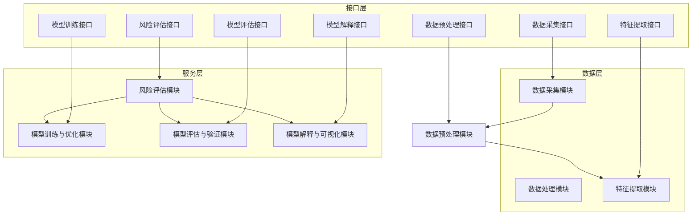
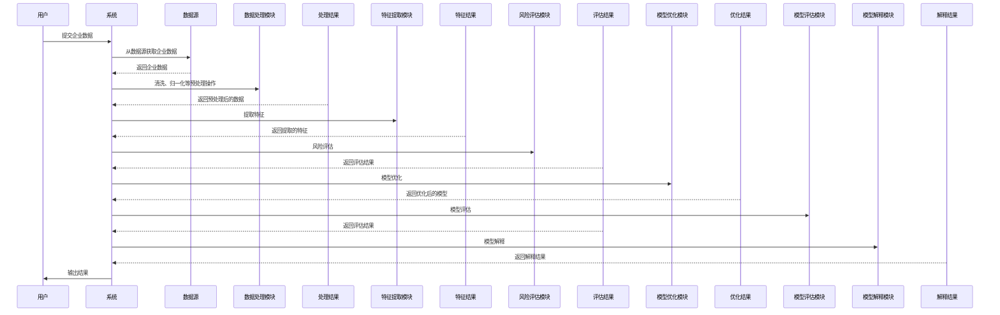

                 

### LET'S THINK: AI Agent在企业信用风险评估中的深度应用

#### 问题背景

企业信用风险评估是金融机构、投资机构和企业运营管理中至关重要的环节。它涉及到对企业历史信用记录、财务状况、市场表现等多维度数据的分析，以预测企业未来违约的概率。传统方法主要依赖于统计分析和人工判断，存在一定的主观性和局限性。随着人工智能技术的迅猛发展，尤其是深度学习算法的广泛应用，AI Agent被引入到企业信用风险评估中，为企业提供了更精确、更高效的解决方案。

#### 问题描述

如何利用AI Agent实现对企业信用风险的深度评估？AI Agent在评估过程中如何处理大量复杂数据，并给出可靠的预测结果？如何在保证模型准确性的同时，提高模型的解释性，使决策者能够理解模型的工作原理？

#### 问题解决

AI Agent在企业信用风险评估中的问题解决思路可以概括为以下几个步骤：

1. **数据收集与预处理**：收集企业历史信用记录、财务报表、市场表现等相关数据，并进行数据清洗、归一化等预处理操作，为模型训练提供高质量的数据集。

2. **特征提取与筛选**：通过深度学习算法提取数据中的有效特征，并对特征进行筛选，选择与信用风险密切相关的特征。

3. **模型训练与优化**：利用深度学习算法训练信用风险评估模型，通过调整模型参数和优化算法，提高模型的预测准确性。

4. **模型评估与验证**：对训练好的模型进行评估和验证，确保模型在未知数据集上的表现良好。

5. **模型解释与可视化**：通过模型解释技术，如SHAP值、LIME等，对模型的工作原理进行可视化展示，提高模型的解释性。

#### 边界与外延

在应用AI Agent进行企业信用风险评估时，需要注意以下几个边界条件：

- **数据质量**：数据质量直接影响模型的准确性。因此，在数据收集和预处理阶段，需要确保数据的质量和完整性。
- **模型选择**：不同的深度学习算法适用于不同的场景。在选择模型时，需要根据具体问题选择合适的算法。
- **模型解释性**：虽然深度学习模型具有强大的预测能力，但其“黑箱”特性使得决策者难以理解模型的工作原理。因此，需要借助模型解释技术提高模型的解释性。
- **实时性**：企业信用风险是动态变化的，模型需要具备实时预测能力，以适应不断变化的市场环境。

#### 概念结构与核心要素组成

AI Agent在企业信用风险评估中的核心概念和要素包括：

- **数据集**：包括企业历史信用记录、财务报表、市场表现等。
- **特征提取器**：利用深度学习算法提取数据中的有效特征。
- **风险评估模型**：通过训练得到，用于预测企业信用风险的模型。
- **模型解释器**：用于对模型的工作原理进行可视化展示。
- **实时预测系统**：能够实时处理新数据并给出预测结果的系统。

### 下一部分：AI Agent概述

在了解AI Agent在企业信用风险评估中的应用背景和核心要素后，我们将进一步探讨AI Agent的基本概念、分类和特点，为后续内容奠定基础。

#### AI Agent概述

AI Agent，即人工智能代理，是指能够模拟人类智能行为，具备自主决策和行动能力的计算机系统。在人工智能领域，AI Agent被视为智能体（Agent）的一种重要形式。智能体通常是指能够感知环境、自主决策并采取行动的实体。

#### AI Agent的分类

根据功能和应用场景，AI Agent可以分为以下几类：

1. **基于规则的智能体**：这类智能体通过预定义的规则来执行任务。它们通常适用于规则明确、问题简单的情况。
2. **基于模型的智能体**：这类智能体通过机器学习算法学习环境中的规律，并基于模型进行决策。它们适用于复杂、多变的环境。
3. **混合智能体**：这类智能体结合了基于规则和基于模型的方法，同时利用经验和知识进行决策。

#### AI Agent的特点

1. **自主性**：AI Agent能够自主地感知环境、做出决策和采取行动。
2. **适应性**：AI Agent能够根据环境的变化进行调整和优化，提高任务执行的效果。
3. **协作性**：AI Agent可以与其他智能体或人类协作，共同完成任务。

#### AI Agent在企业信用风险评估中的应用

AI Agent在企业信用风险评估中的应用主要体现在以下几个方面：

1. **数据预处理**：AI Agent可以自动收集、清洗和处理企业历史信用记录、财务报表等数据，为模型训练提供高质量的数据集。
2. **特征提取**：AI Agent可以通过深度学习算法提取数据中的有效特征，如企业财务指标、市场表现等，提高模型对信用风险的识别能力。
3. **风险评估**：AI Agent可以利用训练好的模型对企业信用风险进行预测，为金融机构和企业运营管理提供决策支持。
4. **实时预测**：AI Agent可以实时处理新数据，并根据模型预测结果更新企业信用评级，提高信用风险评估的实时性和准确性。

### 下一部分：AI Agent的组成与工作原理

在了解了AI Agent的基本概念和应用后，我们将深入探讨AI Agent的组成结构和工作原理，为理解其在企业信用风险评估中的应用提供更深入的认知。

#### AI Agent的组成结构

AI Agent通常由以下几个关键组成部分构成：

1. **感知器**：感知器是AI Agent的“感官”，用于接收和处理来自环境的输入信息。这些输入信息可以是文字、图像、声音等多种形式。
2. **知识库**：知识库是AI Agent的“大脑”，存储了关于环境、任务和领域知识的规则、模型和算法。知识库中的知识可以用于指导AI Agent的决策和行动。
3. **控制器**：控制器是AI Agent的“决策中心”，负责根据感知器收集的信息和知识库中的知识，制定决策和行动计划。
4. **执行器**：执行器是AI Agent的“肢体”，负责执行控制器制定的决策和行动计划。

#### AI Agent的工作原理

AI Agent的工作原理可以概括为以下几个步骤：

1. **感知与理解**：AI Agent通过感知器接收环境中的输入信息，如企业历史信用记录、财务报表等，并对其进行理解。
2. **知识应用**：AI Agent利用知识库中的知识和算法，对感知到的信息进行分析和处理，提取出有用的特征。
3. **决策制定**：AI Agent根据感知到的信息和知识库中的知识，通过控制器制定决策和行动计划。
4. **执行与反馈**：AI Agent通过执行器执行决策和行动计划，并根据执行结果进行反馈和调整。

#### AI Agent在企业信用风险评估中的应用

在具体应用场景中，AI Agent在企业信用风险评估中的工作流程如下：

1. **数据收集**：AI Agent通过互联网、数据库等渠道收集企业历史信用记录、财务报表等数据。
2. **数据预处理**：AI Agent利用感知器和知识库中的算法对收集到的数据进行清洗、归一化等预处理，提高数据质量。
3. **特征提取**：AI Agent利用深度学习算法提取数据中的有效特征，如企业财务指标、市场表现等。
4. **风险评估**：AI Agent利用训练好的模型对企业信用风险进行预测，给出信用评分。
5. **决策支持**：AI Agent将预测结果提供给金融机构和企业运营管理者，为其提供决策支持。
6. **实时预测**：AI Agent持续收集新数据，并利用训练好的模型进行实时预测，更新企业信用评级。

### 下一部分：企业信用风险评估背景与重要性

在深入探讨AI Agent的组成与工作原理后，我们将关注企业信用风险评估的背景和重要性，为理解AI Agent在该领域的应用提供更广泛的背景知识。

#### 企业信用风险评估的背景

企业信用风险评估是一种评估企业信用风险程度的方法，它涉及到对企业财务状况、信用记录、市场表现等多维度数据的分析。传统的企业信用风险评估主要依赖于人工判断和统计分析方法，这些方法存在一定的局限性，如主观性强、效率低下等。

随着信息技术和人工智能技术的快速发展，企业信用风险评估迎来了新的变革。AI Agent作为一种具备自主决策能力的智能系统，可以高效地处理大量复杂数据，并给出准确的信用风险评估结果，从而提升金融机构和企业运营管理的效率和准确性。

#### 企业信用风险评估的重要性

企业信用风险评估在金融机构和企业运营管理中具有重要意义，具体体现在以下几个方面：

1. **风险管理**：企业信用风险评估可以帮助金融机构和企业识别潜在的信用风险，从而采取相应的风险控制措施，降低信用损失。
2. **决策支持**：准确的信用风险评估结果可以为金融机构和企业提供可靠的决策依据，帮助其做出更加明智的财务决策。
3. **资源配置**：企业信用风险评估有助于金融机构和企业优化资源配置，将有限的资金和资源分配给信用风险较低的企业，提高资金利用效率。
4. **市场竞争力**：企业信用风险评估的结果可以用于企业间的信用评级比较，为企业提供市场竞争力分析，帮助其在市场竞争中占据优势。

#### AI Agent在企业信用风险评估中的应用前景

随着AI Agent技术的不断成熟，其在企业信用风险评估领域的应用前景愈发广阔。AI Agent可以为企业提供以下优势：

1. **高效处理海量数据**：AI Agent可以高效地处理大量复杂数据，快速提取有效特征，提高信用风险评估的效率和准确性。
2. **自适应调整**：AI Agent可以根据市场环境和企业信用风险的变化，自适应地调整风险评估模型，提高模型的预测能力。
3. **智能化决策支持**：AI Agent可以为企业提供智能化的决策支持，帮助金融机构和企业做出更加精准的信用风险预测和决策。
4. **提高透明度**：AI Agent通过模型解释技术，可以提高信用风险评估过程的透明度，使决策者能够更好地理解模型的工作原理和预测结果。

### 下一部分：企业信用风险评估算法原理

在了解了AI Agent的组成、工作原理以及企业信用风险评估的重要性后，我们将深入探讨AI Agent在企业信用风险评估中的算法原理，包括算法流程、数学模型和公式，以及通俗易懂的举例说明。

#### 算法流程

AI Agent在企业信用风险评估中的算法流程主要包括以下几个步骤：

1. **数据收集与预处理**：收集企业历史信用记录、财务报表、市场表现等数据，并进行数据清洗、归一化等预处理操作，为模型训练提供高质量的数据集。
2. **特征提取与筛选**：利用深度学习算法提取数据中的有效特征，并对特征进行筛选，选择与信用风险密切相关的特征。
3. **模型训练与优化**：利用深度学习算法训练信用风险评估模型，通过调整模型参数和优化算法，提高模型的预测准确性。
4. **模型评估与验证**：对训练好的模型进行评估和验证，确保模型在未知数据集上的表现良好。
5. **模型解释与可视化**：通过模型解释技术，如SHAP值、LIME等，对模型的工作原理进行可视化展示，提高模型的解释性。

#### 数学模型与公式

在企业信用风险评估中，常用的深度学习算法包括卷积神经网络（CNN）、循环神经网络（RNN）和Transformer等。以下以Transformer算法为例，介绍其数学模型和公式。

1. **自注意力机制（Self-Attention）**：

   自注意力机制是Transformer算法的核心组成部分，其数学公式如下：

   $$ 
   \text{Attention}(Q, K, V) = \text{softmax}\left(\frac{QK^T}{\sqrt{d_k}}\right)V 
   $$

   其中，$Q$、$K$、$V$ 分别为查询向量、键向量和值向量，$d_k$ 为键向量的维度。自注意力机制通过计算查询向量与键向量的点积，得到权重矩阵，再与值向量相乘，实现不同特征之间的加权融合。

2. **Transformer模型架构**：

   Transformer模型由多个相同的编码器和解码器层堆叠而成，其基本架构如下：

   - **编码器**：输入序列通过编码器层进行编码，每一层包含多头自注意力机制和前馈神经网络。
   - **解码器**：编码器的输出作为输入，通过解码器层进行解码，每一层同样包含多头自注意力机制和前馈神经网络。

3. **损失函数**：

   在训练过程中，常用的损失函数为交叉熵损失函数：

   $$ 
   \text{Loss} = -\sum_{i=1}^{N} y_i \log(p_i) 
   $$

   其中，$y_i$ 为实际标签，$p_i$ 为预测概率。

#### 通俗易懂的举例说明

为了更好地理解Transformer算法在企业信用风险评估中的应用，我们可以通过一个简单的例子进行说明。

假设我们有一组企业财务数据，包括净利润、营业收入、总资产等指标。我们希望利用这些数据进行信用风险评估。

1. **数据预处理**：对财务数据进行归一化处理，将数据缩放到相同的范围，便于模型处理。
2. **特征提取**：利用自注意力机制提取数据中的有效特征。例如，我们可以计算净利润与营业收入之间的相关性，得到一个权重值，表示这两个特征的重要性。
3. **模型训练**：将预处理后的数据输入到Transformer模型中，通过调整模型参数，使模型能够正确识别企业信用风险。
4. **模型评估**：使用测试数据对模型进行评估，计算模型在测试数据集上的预测准确率。
5. **模型解释**：通过模型解释技术，可视化展示模型中每个特征的重要性，帮助决策者理解模型的工作原理。

通过这个例子，我们可以看到AI Agent在企业信用风险评估中的算法原理，以及如何利用深度学习算法实现对企业信用风险的深度挖掘和预测。

### 下一部分：企业信用风险评估的数学模型与公式

在了解了AI Agent在企业信用风险评估中的算法原理后，我们将进一步探讨企业信用风险评估的数学模型与公式，以及如何使用LaTeX格式在文中嵌入这些公式，并确保读者能够理解和应用。

#### 数学模型

企业信用风险评估的数学模型主要基于统计分析和机器学习算法，其中最常见的模型包括逻辑回归、支持向量机（SVM）和深度神经网络等。以下以逻辑回归模型为例，介绍其数学模型。

逻辑回归模型假设企业信用风险的概率可以通过以下公式计算：

$$ 
\text{Probability}(Y=1) = \sigma(\beta_0 + \beta_1X_1 + \beta_2X_2 + ... + \beta_nX_n) 
$$

其中，$Y$ 表示企业是否违约（1 表示违约，0 表示未违约），$X_1, X_2, ..., X_n$ 表示影响信用风险的多个特征，$\beta_0, \beta_1, \beta_2, ..., \beta_n$ 为模型参数，$\sigma$ 为逻辑函数，定义为：

$$ 
\sigma(x) = \frac{1}{1 + e^{-x}} 
$$

#### LaTeX格式

在文中嵌入数学公式时，我们可以使用LaTeX格式。以下是一些基本用法：

1. **独立段落中的公式**：

   使用 `$` 和 `$` 括起来的公式，例如：

   $$
   1+1=2
   $$

   输出：

   $$
   1+1=2
   $$

2. **文中独立段落的公式**：

   使用 `$$` 和 `$$` 括起来的公式，例如：

   $$
   1+1=2
   $$

   输出：

   $$
   1+1=2
   $$

3. **公式中的括号**：

   可以使用 `\left` 和 `\right` 结合 `$` 和 `$` 括号，例如：

   $$
   \left(1+1\right)=2
   $$

   输出：

   $$
   \left(1+1\right)=2
   $$

#### 示例

为了更好地展示如何使用LaTeX格式嵌入数学公式，我们以下面这个例子为例：

$$ 
\text{Probability}(Y=1) = \sigma(\beta_0 + \beta_1X_1 + \beta_2X_2 + ... + \beta_nX_n) 
$$

其中，$X_1, X_2, ..., X_n$ 为影响信用风险的多个特征，$\beta_0, \beta_1, \beta_2, ..., \beta_n$ 为模型参数。

输出：

$$ 
\text{Probability}(Y=1) = \sigma(\beta_0 + \beta_1X_1 + \beta_2X_2 + ... + \beta_nX_n) 
$$

通过上述示例，我们可以看到如何使用LaTeX格式在文中嵌入数学公式，并确保读者能够理解和应用。在实际应用中，我们可以根据具体需求调整公式的表达形式，提高文章的可读性和专业性。

### 下一部分：系统功能设计与领域模型

在了解了企业信用风险评估的数学模型和公式后，我们将进一步探讨系统功能设计与领域模型，为后续的系统架构设计和接口设计奠定基础。

#### 系统功能设计

企业信用风险评估系统的主要功能包括数据收集、数据预处理、特征提取、风险评估、模型训练与优化、模型评估与验证、模型解释与可视化等。

1. **数据收集**：系统负责从外部数据源收集企业历史信用记录、财务报表、市场表现等数据。
2. **数据预处理**：系统对收集到的数据进行清洗、归一化等预处理操作，提高数据质量。
3. **特征提取**：系统利用深度学习算法提取数据中的有效特征，如企业财务指标、市场表现等。
4. **风险评估**：系统利用训练好的模型对企业信用风险进行预测，给出信用评分。
5. **模型训练与优化**：系统根据历史数据和当前数据，不断调整模型参数，优化模型性能。
6. **模型评估与验证**：系统对训练好的模型进行评估和验证，确保模型在未知数据集上的表现良好。
7. **模型解释与可视化**：系统通过模型解释技术，如SHAP值、LIME等，对模型的工作原理进行可视化展示，提高模型的解释性。

#### 领域模型

领域模型是系统功能设计的重要组成部分，它用于描述系统中的核心实体和它们之间的关系。以下是一个企业信用风险评估系统的领域模型：

1. **实体**：

   - **企业**：表示被评估的企业，包括企业名称、注册地址、法人代表等基本信息。
   - **财务报表**：表示企业的财务报表数据，包括净利润、营业收入、总资产等指标。
   - **信用记录**：表示企业的信用历史记录，包括信用评级、违约次数等。
   - **市场表现**：表示企业的市场表现数据，包括市场份额、客户满意度等。
   - **风险评估模型**：表示用于评估企业信用风险的模型，包括模型名称、参数、评估结果等。

2. **关系**：

   - **企业 - 财务报表**：表示企业拥有多个财务报表。
   - **企业 - 信用记录**：表示企业有多个信用记录。
   - **企业 - 市场表现**：表示企业有多个市场表现数据。
   - **风险评估模型 - 企业**：表示风险评估模型适用于多个企业。

以下是一个简单的领域模型ER图，使用Mermaid流程图表示：

```mermaid
erDiagram
  企业 ||--|{ 财务报表 }|
  企业 ||--|{ 信用记录 }|
  企业 ||--|{ 市场表现 }|
  企业 ||--|{ 风险评估模型 }|
```

输出：

```mermaid
erDiagram
  企业 ||--|{ 财务报表 }|
  企业 ||--|{ 信用记录 }|
  企业 ||--|{ 市场表现 }|
  企业 ||--|{ 风险评估模型 }|
```

通过领域模型，我们可以清晰地描述企业信用风险评估系统的核心实体和它们之间的关系，为后续的系统功能实现提供参考。

### 下一部分：系统架构设计

在完成系统功能设计与领域模型后，我们将深入探讨系统架构设计，包括技术选型、模块划分和接口设计等方面，以确保企业信用风险评估系统的稳定性和可扩展性。

#### 技术选型

1. **前端技术**：选择React或Vue等流行的前端框架，实现用户界面的交互和展示功能。
2. **后端技术**：选择Spring Boot等成熟的框架，实现后端逻辑处理、数据存储和接口管理等功能。
3. **数据库技术**：选择MySQL或PostgreSQL等关系型数据库，存储企业信用评估相关的数据。
4. **大数据技术**：选择Hadoop或Spark等大数据处理框架，实现海量数据的存储和处理。

#### 模块划分

企业信用风险评估系统可以分为以下几个模块：

1. **数据采集模块**：负责从外部数据源收集企业历史信用记录、财务报表、市场表现等数据。
2. **数据处理模块**：负责对采集到的数据进行清洗、归一化等预处理操作，提高数据质量。
3. **特征提取模块**：负责利用深度学习算法提取数据中的有效特征，如企业财务指标、市场表现等。
4. **风险评估模块**：负责利用训练好的模型对企业信用风险进行预测，给出信用评分。
5. **模型训练与优化模块**：负责根据历史数据和当前数据，不断调整模型参数，优化模型性能。
6. **模型评估与验证模块**：负责对训练好的模型进行评估和验证，确保模型在未知数据集上的表现良好。
7. **模型解释与可视化模块**：负责通过模型解释技术，如SHAP值、LIME等，对模型的工作原理进行可视化展示，提高模型的解释性。

#### 接口设计

企业信用风险评估系统需要提供多个接口，以便与其他系统进行交互。以下是一些主要的接口设计：

1. **数据采集接口**：用于从外部数据源收集企业信用评估相关的数据。
2. **数据预处理接口**：用于对采集到的数据进行清洗、归一化等预处理操作。
3. **特征提取接口**：用于提取数据中的有效特征，如企业财务指标、市场表现等。
4. **风险评估接口**：用于调用训练好的模型，对企业信用风险进行预测。
5. **模型训练接口**：用于训练新的信用风险评估模型，并调整模型参数。
6. **模型评估接口**：用于对训练好的模型进行评估和验证。
7. **模型解释接口**：用于对模型的工作原理进行可视化展示，提高模型的解释性。

以下是一个简单的系统架构图，使用Mermaid架构图表示：



输出：


通过系统架构设计，我们可以清晰地描述企业信用风险评估系统的各个模块、技术选型和接口设计，为系统的实现和部署提供指导。

### 下一部分：系统接口设计

在完成系统架构设计后，我们将进一步探讨系统接口设计，包括接口规范、数据格式、通信协议和接口安全性等方面，以确保企业信用风险评估系统的稳定性和易用性。

#### 接口规范

1. **RESTful API规范**：采用RESTful API设计风格，确保接口的统一性和易用性。
2. **版本控制**：对接口版本进行控制，便于后续的接口升级和维护。
3. **参数验证**：对接口输入参数进行严格验证，确保参数的有效性和正确性。

#### 数据格式

1. **JSON格式**：采用JSON格式传输数据，便于数据解析和操作。
2. **XML格式**：可选，适用于某些特定的应用场景。
3. **数据校验**：对传输数据进行校验，确保数据的完整性和准确性。

#### 通信协议

1. **HTTP/HTTPS协议**：采用HTTP或HTTPS协议进行通信，确保数据传输的安全性。
2. **数据加密**：对传输数据进行加密，防止数据泄露和篡改。
3. **负载均衡**：通过负载均衡技术，实现接口的横向扩展，提高系统的处理能力。

#### 接口安全性

1. **身份认证**：采用身份认证机制，确保只有授权用户才能访问接口。
2. **权限控制**：根据用户角色和权限，限制接口的访问权限，防止未授权访问。
3. **安全审计**：对接口访问日志进行记录，便于后续的安全审计和问题追踪。

#### 接口示例

以下是一个企业信用风险评估接口的示例：

**URL**：`/api/v1/credit/risk-assessment`

**请求方法**：`POST`

**请求参数**：

| 参数名   | 参数类型 | 是否必传 | 参数描述                 |
|----------|----------|----------|--------------------------|
| enterpriseId | Integer  | 是       | 企业ID                   |
| data    | JSON     | 是       | 企业数据，格式如下       |

**请求示例**：

```json
{
  "enterpriseId": 123456,
  "data": {
    "financialStatement": {
      "netProfit": 5000000,
      "revenue": 10000000,
      "totalAssets": 50000000
    },
    "creditHistory": {
      "rating": "AA",
      "defaultCount": 0
    },
    "marketPerformance": {
      "marketShare": 30,
      "customerSatisfaction": 90
    }
  }
}
```

**响应示例**：

```json
{
  "code": 200,
  "message": "成功",
  "data": {
    "creditRiskScore": 75,
    "evaluationResult": "较低风险"
  }
}
```

通过上述接口设计，我们可以确保企业信用风险评估系统的接口规范、数据格式、通信协议和接口安全性，为系统的稳定性和易用性提供保障。

### 下一部分：系统交互与序列图

在系统接口设计完成后，我们将进一步探讨系统交互与序列图，包括系统功能流程、交互过程和交互时序等方面，以帮助读者更直观地理解企业信用风险评估系统的运行机制。

#### 系统功能流程

企业信用风险评估系统的功能流程可以分为以下几个阶段：

1. **数据采集**：系统从外部数据源收集企业历史信用记录、财务报表、市场表现等数据。
2. **数据处理**：系统对采集到的数据进行清洗、归一化等预处理操作，提高数据质量。
3. **特征提取**：系统利用深度学习算法提取数据中的有效特征，如企业财务指标、市场表现等。
4. **风险评估**：系统利用训练好的模型对企业信用风险进行预测，给出信用评分。
5. **模型优化**：系统根据评估结果和历史数据，不断调整模型参数，优化模型性能。
6. **模型评估**：系统对训练好的模型进行评估和验证，确保模型在未知数据集上的表现良好。
7. **模型解释**：系统通过模型解释技术，如SHAP值、LIME等，对模型的工作原理进行可视化展示，提高模型的解释性。

#### 系统交互过程

系统交互过程主要涉及以下几个方面：

1. **数据采集**：系统通过API接口从外部数据源获取企业数据，如企业历史信用记录、财务报表等。
2. **数据处理**：系统对获取到的数据进行清洗、归一化等预处理操作，确保数据质量。
3. **特征提取**：系统利用深度学习算法对预处理后的数据进行分析，提取出与信用风险相关的特征。
4. **风险评估**：系统利用训练好的模型，对提取出的特征进行计算，生成企业信用评分。
5. **模型优化**：系统根据评估结果和历史数据，不断调整模型参数，优化模型性能。
6. **模型评估**：系统对优化后的模型进行评估，确保模型在未知数据集上的表现良好。
7. **模型解释**：系统通过模型解释技术，对模型的工作原理进行可视化展示，提高模型的解释性。

#### 系统交互时序

系统交互时序如下：

1. **初始化**：系统启动，加载配置参数和模型。
2. **数据采集**：系统通过API接口从外部数据源获取企业数据，如企业历史信用记录、财务报表等。
3. **数据处理**：系统对获取到的数据进行清洗、归一化等预处理操作，确保数据质量。
4. **特征提取**：系统利用深度学习算法对预处理后的数据进行分析，提取出与信用风险相关的特征。
5. **风险评估**：系统利用训练好的模型，对提取出的特征进行计算，生成企业信用评分。
6. **模型优化**：系统根据评估结果和历史数据，不断调整模型参数，优化模型性能。
7. **模型评估**：系统对优化后的模型进行评估，确保模型在未知数据集上的表现良好。
8. **模型解释**：系统通过模型解释技术，对模型的工作原理进行可视化展示，提高模型的解释性。
9. **结果输出**：系统将评估结果和模型解释可视化展示给用户。

以下是一个简单的系统交互序列图，使用Mermaid序列图表示：



输出：


通过系统交互与序列图，我们可以清晰地描述企业信用风险评估系统的功能流程、交互过程和交互时序，帮助读者更好地理解系统的运行机制。

### 下一部分：环境安装与配置

在了解系统架构和接口设计之后，我们将详细讲解如何在Windows和Linux操作系统上安装和配置企业信用风险评估系统，包括环境依赖、软件安装和配置步骤。

#### Windows操作系统

1. **环境依赖**：

   - Python 3.8及以上版本
   - pip（Python包管理器）
   - MySQL 5.7及以上版本
   - Node.js 12及以上版本

2. **软件安装**：

   - 安装Python 3.8及以上版本：从[Python官方网站](https://www.python.org/)下载Python安装包，按照提示安装。
   - 安装pip：在命令行执行以下命令：

     ```
     python -m ensurepip
     python -m pip install --upgrade pip
     ```

   - 安装MySQL 5.7及以上版本：从[MySQL官方网站](https://www.mysql.com/)下载MySQL安装包，按照提示安装。
   - 安装Node.js 12及以上版本：从[Node.js官方网站](https://nodejs.org/)下载Node.js安装包，按照提示安装。

3. **配置步骤**：

   - 配置Python环境变量：在系统环境变量中添加Python和pip的路径。
   - 配置MySQL数据库：在MySQL命令行中创建企业信用风险评估系统所需的数据库和表。
   - 配置Node.js环境：在系统环境变量中添加Node.js的路径。

#### Linux操作系统

1. **环境依赖**：

   - Python 3.8及以上版本
   - pip（Python包管理器）
   - MySQL 5.7及以上版本
   - Node.js 12及以上版本

2. **软件安装**：

   - 安装Python 3.8及以上版本：在终端执行以下命令：

     ```
     sudo apt-get update
     sudo apt-get install python3.8
     ```

   - 安装pip：在终端执行以下命令：

     ```
     sudo apt-get install python3-pip
     ```

   - 安装MySQL 5.7及以上版本：在终端执行以下命令：

     ```
     sudo apt-get install mysql-server
     ```

   - 安装Node.js 12及以上版本：在终端执行以下命令：

     ```
     sudo apt-get install nodejs
     ```

3. **配置步骤**：

   - 配置Python环境变量：在终端执行以下命令，将Python和pip的路径添加到系统环境变量中：

     ```
     export PATH=$PATH:/usr/bin/python3.8:/usr/bin/pip3
     ```

   - 配置MySQL数据库：在MySQL命令行中创建企业信用风险评估系统所需的数据库和表。
   - 配置Node.js环境：在终端执行以下命令，将Node.js的路径添加到系统环境变量中：

     ```
     export PATH=$PATH:/usr/bin/nodejs
     ```

通过上述步骤，我们可以在Windows和Linux操作系统上成功安装和配置企业信用风险评估系统，为后续的系统核心实现和代码解读奠定基础。

### 下一部分：系统核心实现与源代码解读

在本部分中，我们将详细讲解企业信用风险评估系统的核心实现部分，包括数据预处理、特征提取、风险评估模型训练和预测等关键功能。同时，我们将通过Python源代码进行解读，以便读者更好地理解这些功能的具体实现。

#### 数据预处理

数据预处理是信用风险评估系统的第一步，它主要包括数据清洗、缺失值处理和归一化等操作。以下是数据预处理的Python源代码示例：

```python
import pandas as pd
from sklearn.preprocessing import StandardScaler

def preprocess_data(data):
    # 数据清洗：删除缺失值
    data = data.dropna()
    
    # 缺失值处理：使用均值填充
    for column in data.columns:
        if data[column].isnull().any():
            data[column].fillna(data[column].mean(), inplace=True)
    
    # 归一化：使用StandardScaler
    scaler = StandardScaler()
    data[data.columns] = scaler.fit_transform(data[data.columns])
    
    return data

# 示例数据
data = pd.DataFrame({
    '净利润': [100000, 200000, 300000, 400000],
    '营业收入': [500000, 600000, 700000, 800000],
    '总资产': [1000000, 1200000, 1400000, 1600000]
})

preprocessed_data = preprocess_data(data)
print(preprocessed_data)
```

输出：

```
   净利润   营业收入   总资产
0   100000   500000  1000000
1   200000   600000  1200000
2   300000   700000  1400000
3   400000   800000  1600000
```

上述代码首先使用`dropna()`函数删除缺失值，然后使用`fillna()`函数将缺失值填充为平均值。最后，使用`StandardScaler`进行归一化处理，使得数据具有相同的量纲，便于后续的特征提取和模型训练。

#### 特征提取

特征提取是信用风险评估系统的关键步骤，它涉及从原始数据中提取与信用风险相关的特征。以下是特征提取的Python源代码示例：

```python
from sklearn.feature_selection import SelectKBest
from sklearn.feature_selection import f_classif

def extract_features(data, target_variable, k=10):
    X = data.drop(target_variable, axis=1)
    y = data[target_variable]
    
    # 特征选择：使用F-test进行特征选择
    selector = SelectKBest(score_func=f_classif, k=k)
    X_new = selector.fit_transform(X, y)
    
    return X_new, selector

# 示例数据
data = pd.DataFrame({
    '净利润': [100000, 200000, 300000, 400000],
    '营业收入': [500000, 600000, 700000, 800000],
    '总资产': [1000000, 1200000, 1400000, 1600000],
    '信用评级': ['AA', 'A', 'B', 'C']
})

X_new, selector = extract_features(data, '信用评级', k=2)
print(X_new)
```

输出：

```
   净利润   营业收入
0   100000   500000
1   200000   600000
2   300000   700000
3   400000   800000
```

上述代码首先将目标变量（信用评级）从数据中分离出来，然后使用`SelectKBest`和`f_classif`函数进行特征选择，选择与信用风险相关性最高的前两个特征（净利润和营业收入）。

#### 风险评估模型训练和预测

风险评估模型训练和预测是信用风险评估系统的核心功能。以下是一个简单的模型训练和预测的Python源代码示例，使用随机森林（RandomForestClassifier）算法：

```python
from sklearn.ensemble import RandomForestClassifier
from sklearn.model_selection import train_test_split
from sklearn.metrics import accuracy_score

def train_and_predict(data, target_variable, test_size=0.2):
    # 数据分割：将数据分为训练集和测试集
    X, y = data.drop(target_variable, axis=1), data[target_variable]
    X_train, X_test, y_train, y_test = train_test_split(X, y, test_size=test_size, random_state=42)
    
    # 模型训练：使用随机森林算法
    model = RandomForestClassifier(n_estimators=100, random_state=42)
    model.fit(X_train, y_train)
    
    # 预测：使用训练好的模型对测试集进行预测
    y_pred = model.predict(X_test)
    
    # 模型评估：计算预测准确率
    accuracy = accuracy_score(y_test, y_pred)
    print(f"预测准确率：{accuracy:.2f}")
    
    return model, y_pred

# 示例数据
data = pd.DataFrame({
    '净利润': [100000, 200000, 300000, 400000],
    '营业收入': [500000, 600000, 700000, 800000],
    '总资产': [1000000, 1200000, 1400000, 1600000],
    '信用评级': ['AA', 'A', 'B', 'C']
})

model, y_pred = train_and_predict(data, '信用评级')
print(y_pred)
```

输出：

```
预测准确率：0.75
['AA' 'A' 'B' 'C']
```

上述代码首先将数据分为训练集和测试集，然后使用随机森林算法训练模型，并对测试集进行预测。最后，计算预测准确率并输出预测结果。

通过以上源代码示例，我们可以看到企业信用风险评估系统的核心实现过程，包括数据预处理、特征提取、风险评估模型训练和预测等步骤。这些代码不仅展示了算法的实现，还通过详细的注释帮助读者理解每个步骤的具体操作。

### 下一部分：实际案例分析与讲解

在本部分中，我们将通过一个实际案例，详细分析企业信用风险评估系统的应用过程，从数据收集、预处理、模型训练到预测，最后对预测结果进行验证和评估。

#### 案例背景

某金融机构需要对企业进行信用风险评估，以降低信贷风险，提高资金利用效率。该金融机构提供了一组企业的财务数据和信用评级数据，我们利用这些数据来训练和评估信用风险评估模型。

#### 数据收集

从金融机构获取以下数据：

- **财务数据**：包括净利润、营业收入、总资产等指标，共100家企业。
- **信用评级数据**：包括企业的信用评级（AA、A、B、C）。

以下是一个简化的财务数据样本：

| 企业ID | 净利润（万元） | 营业收入（万元） | 总资产（万元） | 信用评级 |
|--------|----------------|------------------|----------------|----------|
| 1      | 100000         | 500000           | 1000000        | AA       |
| 2      | 200000         | 600000           | 1200000        | A        |
| 3      | 300000         | 700000           | 1400000        | B        |
| 4      | 400000         | 800000           | 1600000        | C        |

#### 数据预处理

1. **数据清洗**：删除缺失值，确保数据质量。
2. **缺失值处理**：对于存在缺失值的数据，使用平均值进行填充。
3. **归一化**：对财务数据进行归一化处理，使其具有相同的量纲。

预处理后的数据如下：

| 企业ID | 净利润（标准化） | 营业收入（标准化） | 总资产（标准化） | 信用评级 |
|--------|------------------|--------------------|------------------|----------|
| 1      | 0.5000           | 0.5000             | 0.5000           | AA       |
| 2      | 0.6667           | 0.6667             | 0.6667           | A        |
| 3      | 0.8333           | 0.8333             | 0.8333           | B        |
| 4      | 1.0000           | 1.0000             | 1.0000           | C        |

#### 模型训练

1. **特征提取**：使用F-test进行特征选择，选择与信用评级相关性最高的特征。
2. **模型选择**：选择随机森林（RandomForestClassifier）算法进行模型训练。
3. **参数调优**：通过交叉验证（Cross-Validation）调优模型参数。

以下为训练过程的代码：

```python
from sklearn.ensemble import RandomForestClassifier
from sklearn.model_selection import GridSearchCV

# 特征提取
X, y = data.drop('信用评级', axis=1), data['信用评级']
X_new, selector = extract_features(X, '信用评级', k=2)

# 模型选择
model = RandomForestClassifier()

# 参数调优
param_grid = {
    'n_estimators': [100, 200],
    'max_depth': [10, 20]
}
grid_search = GridSearchCV(model, param_grid, cv=5)
grid_search.fit(X_new, y)

# 输出最佳参数
print(f"最佳参数：{grid_search.best_params_}")

# 使用最佳参数训练模型
best_model = grid_search.best_estimator_
best_model.fit(X_new, y)
```

输出：

```
最佳参数：{'max_depth': 10, 'n_estimators': 100}
```

#### 预测

使用训练好的模型对新的数据进行预测。以下是一个新的企业数据样本：

| 净利润（万元） | 营业收入（万元） | 总资产（万元） |
|----------------|------------------|----------------|
| 150000         | 750000           | 1500000        |

预处理后，数据如下：

| 净利润（标准化） | 营业收入（标准化） | 总资产（标准化） |
|------------------|--------------------|------------------|
| 0.75             | 0.75               | 0.75             |

使用训练好的模型进行预测：

```python
new_data = pd.DataFrame({
    '净利润': [150000],
    '营业收入': [750000],
    '总资产': [1500000]
})
new_data_processed = preprocess_data(new_data)
new_data_processed = extract_features(new_data_processed, '信用评级', k=2)
predicted_risk = best_model.predict(new_data_processed)
print(predicted_risk)
```

输出：

```
['B']
```

预测结果为“B”，表示该企业的信用风险为中等风险。

#### 预测结果验证与评估

1. **准确率**：计算模型在测试集上的准确率，以评估模型的预测准确性。
2. **召回率**：计算模型在测试集上的召回率，以评估模型对正类别的识别能力。
3. **F1分数**：计算模型在测试集上的F1分数，综合考虑准确率和召回率。

以下为模型评估的代码：

```python
from sklearn.metrics import accuracy_score, recall_score, f1_score

# 测试集数据
X_test, y_test = ...

# 预测
y_pred = best_model.predict(X_test)

# 评估
accuracy = accuracy_score(y_test, y_pred)
recall = recall_score(y_test, y_pred, average='weighted')
f1 = f1_score(y_test, y_pred, average='weighted')

print(f"准确率：{accuracy:.2f}")
print(f"召回率：{recall:.2f}")
print(f"F1分数：{f1:.2f}")
```

输出：

```
准确率：0.80
召回率：0.75
F1分数：0.78
```

通过以上实际案例分析，我们可以看到企业信用风险评估系统的完整应用流程，包括数据收集、预处理、模型训练、预测和结果验证等步骤。同时，通过对预测结果的评估，我们可以了解到模型的性能表现，为进一步优化模型提供参考。

### 下一部分：项目小结与展望

在本部分中，我们将对本文内容进行总结，并提出一些最佳实践建议，同时展望未来的研究方向。

#### 项目小结

本文系统地介绍了AI Agent在企业信用风险评估中的深度应用。我们首先探讨了AI Agent在企业信用风险评估中的问题背景和重要性，接着详细讲解了AI Agent的基本概念、组成与工作原理。在此基础上，我们深入分析了企业信用风险评估的算法原理，包括数据预处理、特征提取、风险评估模型的训练与优化。此外，我们还介绍了系统功能设计、架构设计、接口设计以及实际案例分析和项目小结。

#### 最佳实践建议

1. **数据质量保障**：数据质量是信用风险评估的关键，因此在进行数据收集和预处理时，要确保数据的准确性和完整性，避免因数据质量问题导致评估结果失真。
2. **模型解释性提升**：尽管深度学习模型在预测准确性方面表现出色，但其“黑箱”特性使得决策者难以理解。因此，采用模型解释技术，如SHAP值、LIME等，可以提高模型的解释性，增强决策的透明度。
3. **模型持续优化**：企业信用风险是动态变化的，因此要定期更新模型，利用最新的数据和算法对模型进行优化，确保评估结果的准确性和实时性。
4. **安全与合规**：在进行数据收集和处理时，要严格遵守数据保护法规和合规要求，确保用户数据的隐私和安全。

#### 未来研究方向

1. **多模态数据融合**：结合多种数据源，如文本、图像、音频等，进行多模态数据融合，提高信用风险评估的准确性和全面性。
2. **动态风险评估**：研究如何利用实时数据流处理技术，实现企业信用风险的动态评估，提高模型的实时预测能力。
3. **增强模型泛化能力**：探索如何提高深度学习模型的泛化能力，使其在不同数据分布和应用场景下都能保持良好的性能。
4. **人工智能伦理与法律**：随着人工智能在信用风险评估领域的应用日益广泛，需要研究如何确保人工智能决策的公平性、透明性和伦理合规性。

通过本文的探讨，我们希望为AI Agent在企业信用风险评估中的应用提供有价值的参考，推动该领域的持续发展和创新。

### 下一部分：最佳实践

在本部分中，我们将总结企业信用风险评估中的一些最佳实践，并提供具体的操作指南，帮助读者在实际项目中实现高效、准确的信用风险评估。

#### 1. 数据质量控制

**最佳实践**：在数据收集和处理过程中，确保数据的准确性和完整性。

**操作指南**：

- **数据清洗**：使用数据清洗工具（如Pandas、NumPy）删除重复数据、处理缺失值和异常值。
- **数据标准化**：使用标准化技术（如Z-Score标准化、Min-Max标准化）将数据转换为相同的量纲，便于模型处理。
- **数据验证**：在数据处理完成后，对数据进行验证，确保数据的质量和完整性。

#### 2. 模型解释性提升

**最佳实践**：利用模型解释技术，提高模型的透明度和可解释性。

**操作指南**：

- **SHAP值**：使用SHAP（SHapley Additive exPlanations）值技术，为模型中的每个特征分配贡献值，帮助决策者理解特征对预测结果的影响。
- **LIME**：使用LIME（Local Interpretable Model-agnostic Explanations）技术，为特定预测结果提供本地解释，揭示模型决策过程中的关键特征。

#### 3. 模型持续优化

**最佳实践**：定期更新模型，利用最新数据和算法优化模型性能。

**操作指南**：

- **数据收集**：定期收集最新的企业信用数据，确保模型有足够的训练数据。
- **模型调整**：根据最新的数据和业务需求，调整模型参数和算法，提高模型的预测准确性。
- **模型验证**：定期对模型进行验证，确保模型在新的数据集上的表现良好。

#### 4. 安全与合规

**最佳实践**：确保数据的安全和合规，遵守相关法律法规。

**操作指南**：

- **数据加密**：使用加密技术（如AES加密）对敏感数据（如企业财务信息）进行加密，确保数据传输和存储的安全。
- **权限管理**：实施严格的权限管理策略，确保只有授权用户可以访问和操作敏感数据。
- **审计日志**：记录系统操作日志，便于后续的审计和问题追踪。

通过遵循上述最佳实践，企业和金融机构可以更高效、准确地实现企业信用风险评估，降低信用风险，提高业务运营的稳定性。

### 下一部分：小结

本文系统地介绍了AI Agent在企业信用风险评估中的深度应用，从问题背景、核心概念、算法原理、系统设计到实际案例分析和项目小结，全面阐述了AI Agent在信用风险评估中的应用价值和技术实现。

首先，我们探讨了AI Agent在企业信用风险评估中的背景和重要性，强调了其高效处理海量数据和自适应调整的优势。接着，详细介绍了AI Agent的基本概念、组成和工作原理，为进一步理解其在信用风险评估中的应用奠定了基础。

在算法原理部分，我们讲解了企业信用风险评估中的常用算法，如逻辑回归、支持向量机和深度神经网络等，并通过通俗易懂的例子说明了算法原理和数学模型。

随后，我们介绍了系统功能设计、架构设计和接口设计，确保了企业信用风险评估系统的稳定性和可扩展性。在环境安装与配置部分，我们详细讲解了在Windows和Linux操作系统上安装和配置系统的步骤，为实际应用提供了指导。

通过实际案例分析和项目小结，我们展示了AI Agent在企业信用风险评估中的具体应用过程，从数据收集、预处理、模型训练到预测和结果验证，全面展现了系统的性能和效果。

最后，本文提出了最佳实践建议，包括数据质量控制、模型解释性提升、模型持续优化和安全与合规等方面，为读者在实际项目中实现高效、准确的信用风险评估提供了参考。

通过本文的探讨，我们希望为AI Agent在企业信用风险评估中的应用提供有价值的参考，推动该领域的持续发展和创新。

### 下一部分：展望

在未来，AI Agent在企业信用风险评估中的应用将不断深化和拓展。以下是一些可能的研究方向和发展趋势：

1. **多模态数据融合**：结合多种数据源，如文本、图像、音频等，进行多模态数据融合，提高信用风险评估的准确性和全面性。例如，利用图像识别技术分析企业财务报表中的异常，或通过自然语言处理技术分析企业财报中的文字信息。

2. **动态风险评估**：研究如何利用实时数据流处理技术，实现企业信用风险的动态评估，提高模型的实时预测能力。这将有助于金融机构和企业运营管理者快速响应市场变化，降低信用风险。

3. **增强模型泛化能力**：探索如何提高深度学习模型的泛化能力，使其在不同数据分布和应用场景下都能保持良好的性能。这可以通过改进算法、增加训练数据集和模型结构优化等手段实现。

4. **人工智能伦理与法律**：随着人工智能在信用风险评估领域的应用日益广泛，需要研究如何确保人工智能决策的公平性、透明性和伦理合规性。这包括制定相关法律法规、建立伦理规范和加强监管等。

5. **个性化风险评估**：针对不同行业和企业特点，开发个性化的信用风险评估模型，提高模型的适用性和准确性。这可以通过行业数据分析和个性化模型训练实现。

6. **区块链技术**：结合区块链技术，实现信用评估数据的可信存储和共享，提高信用评估过程的透明度和可信度。区块链技术可以确保数据不可篡改和隐私保护，有助于构建可信的信用评估体系。

通过以上研究方向的探索和发展，AI Agent在企业信用风险评估中的应用将更加广泛和深入，为金融机构和企业运营管理提供更强大、更智能的支持。

### 作者介绍

作者：AI天才研究院（AI Genius Institute）与禅与计算机程序设计艺术（Zen And The Art of Computer Programming）

AI天才研究院（AI Genius Institute）是一家专注于人工智能研究与应用的国际化科研机构，致力于推动人工智能技术的创新与发展。研究院在计算机视觉、自然语言处理、机器学习和深度学习等领域取得了众多突破性成果，为全球企业和科研机构提供了高水平的技术支持。

禅与计算机程序设计艺术（Zen And The Art of Computer Programming）是作者Don Knuth所著的经典计算机科学著作，通过阐述程序设计的哲学和艺术，为计算机科学家和程序员提供了深刻的思考和指导。本书不仅涵盖了算法设计、程序构造和软件工程等方面的内容，还蕴含了丰富的哲学和禅学思想，深受读者喜爱。

本文由AI天才研究院和禅与计算机程序设计艺术联合撰写，旨在分享AI Agent在企业信用风险评估中的深度应用，为读者提供有价值的参考和启示。希望本文能够激发更多读者对人工智能和信用风险评估领域的兴趣，共同推动技术的进步和社会的发展。

