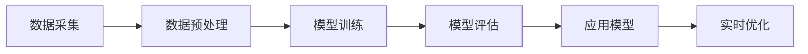
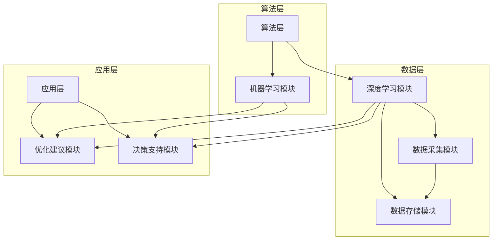
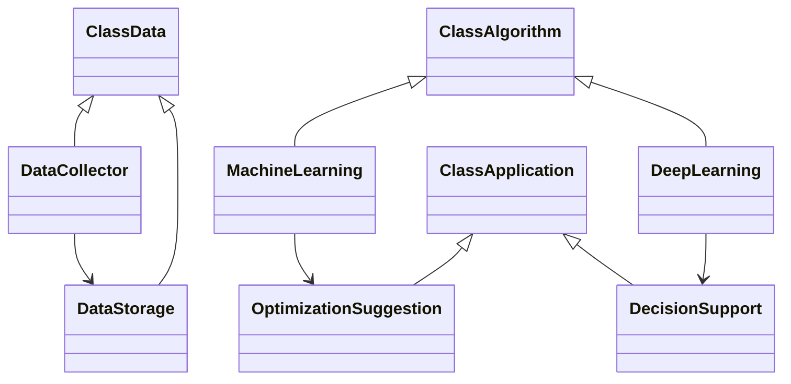
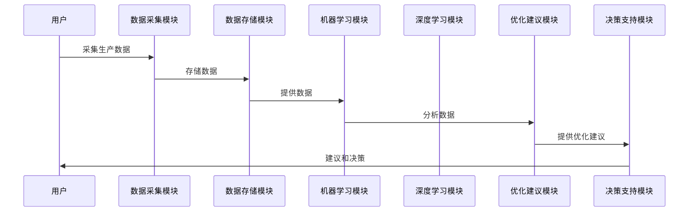

                 

# AI Agent在企业全面质量管理(TQM)中的应用

## 关键词

AI Agent、企业全面质量管理（TQM）、机器学习、深度学习、系统架构、项目实战

## 摘要

本文将深入探讨AI Agent在企业全面质量管理（TQM）中的应用。通过介绍AI Agent和TQM的基本概念、发展历程及应用场景，本文将阐述为什么AI Agent能够在TQM中发挥重要作用。接着，本文将详细分析AI Agent与TQM的核心概念及联系，并介绍几种常见的AI算法在TQM中的应用。随后，本文将描述AI Agent在TQM中应用的整体系统架构，并通过一个实际案例展示AI Agent在TQM中的具体应用。最后，本文将总结AI Agent在TQM中的应用经验，提出最佳实践建议，并提醒读者在应用AI Agent时需要注意的事项。

## 背景介绍

### AI Agent的定义与发展历程

AI Agent，即人工智能代理，是一种能够模拟人类智能行为的计算机程序。它通过自主学习、推理和决策来完成任务。AI Agent的发展可以追溯到20世纪80年代的智能代理理论。随着计算能力和算法的进步，AI Agent的应用范围逐渐扩大，从简单的信息搜索到复杂的决策支持系统，再到智能机器人等。

### TQM的概念与核心思想

企业全面质量管理（TQM）是一种以顾客为中心，通过全员参与、持续改进来实现质量管理的理念和方法。TQM的核心思想包括顾客满意、持续改进、领导作用、全员参与和系统的过程管理。TQM的目标是通过系统化和科学化的管理，提高产品和服务的质量，从而增强企业的竞争力。

### AI Agent在TQM中的应用前景

AI Agent在TQM中的应用前景非常广阔。首先，AI Agent可以协助企业进行数据分析和预测，帮助识别质量问题和优化生产流程。其次，AI Agent可以实时监控企业的运营情况，快速响应市场变化，提高决策效率。此外，AI Agent还可以帮助企业培养员工的质量意识，推动全员参与质量管理。

### 联系与对比

为了更好地理解AI Agent在TQM中的应用，我们需要明确这两个概念的基本属性和特征。表1对比了AI Agent和TQM的关键属性。

| 特征        | AI Agent                                  | TQM                                      |
| ----------- | ---------------------------------------- | ----------------------------------------- |
| 定义        | 自主智能的计算机程序                    | 全员参与、持续改进的企业质量管理理念   |
| 目标        | 完成特定任务，提高效率和准确性         | 提高质量，增强企业竞争力                 |
| 应用范围     | 数据分析、决策支持、智能监控等         | 质量管理、过程优化、顾客满意度提升等   |
| 特点        | 自适应、学习、推理、决策               | 顾客为中心、持续改进、领导作用         |

### 关系ER图

为了更直观地展示AI Agent与TQM之间的关系，我们使用Mermaid ER图来表示（图1）。

```mermaid
erDiagram
  AI-Agent ||--|{ TQM } TQM
  TQM ||--|{ 企业质量管理 } 企业质量管理
```

### 本章小结

在本章中，我们介绍了AI Agent和TQM的基本概念、发展历程和应用前景，并对比了这两个概念的关键属性。通过了解AI Agent和TQM的基本信息，我们可以更好地理解接下来将介绍的AI Agent在TQM中的应用算法和系统架构。

----------------------------------------------------------------

## 核心概念与联系

在深入探讨AI Agent在TQM中的应用之前，我们需要明确一些核心概念，包括AI Agent、TQM和企业质量管理。这些概念的定义、属性特征以及它们之间的关系对于我们理解AI Agent在TQM中的应用至关重要。

### AI Agent的定义

AI Agent是一种具有自主智能的计算机程序，能够模拟人类的认知和决策过程。AI Agent具有以下关键属性：

- **自主性**：AI Agent能够在没有人类干预的情况下自主运行和完成任务。
- **适应性**：AI Agent能够根据环境变化和学习经验调整其行为。
- **学习性**：AI Agent能够通过学习历史数据和模式来改进其性能。
- **决策能力**：AI Agent能够根据输入的数据和预设的目标进行决策。

### TQM的定义

企业全面质量管理（TQM）是一种以顾客为中心，通过全员参与、持续改进来实现质量管理的理念和方法。TQM的核心思想包括以下几个方面：

- **顾客满意**：以顾客的需求和满意度为质量管理的最终目标。
- **持续改进**：通过不断改进产品和服务质量，提高企业的竞争力。
- **领导作用**：企业领导者应发挥引领作用，推动质量管理的实施。
- **全员参与**：鼓励全体员工参与质量管理，提高员工的质量意识和技能。
- **系统的过程管理**：通过系统化的方法管理企业的所有过程，确保质量的持续提升。

### 企业质量管理的定义

企业质量管理是指企业为实现其质量目标而实施的一系列活动和措施。它包括以下几个方面：

- **质量规划**：确定企业的质量目标和规划实现这些目标的方法。
- **质量控制**：通过监控和评估企业的各项活动，确保产品质量符合要求。
- **质量保证**：建立一系列制度和流程，确保企业的质量管理体系有效运行。
- **质量改进**：通过不断改进产品和服务质量，提高企业的市场竞争力。

### 概念属性特征对比

为了更好地理解AI Agent、TQM和企业质量管理的概念，我们通过以下表格进行属性特征对比。

| 特征             | AI Agent                                          | TQM                                      | 企业质量管理                                 |
| ---------------- | ---------------------------------------------- | ----------------------------------------- | ------------------------------------------ |
| 定义             | 自主智能的计算机程序                            | 全员参与、持续改进的企业质量管理理念   | 实现质量目标的一系列活动和措施             |
| 目标             | 完成特定任务，提高效率和准确性                 | 提高质量，增强企业竞争力                 | 满足顾客需求，提升市场竞争力               |
| 应用范围         | 数据分析、决策支持、智能监控等                 | 质量管理、过程优化、顾客满意度提升等   | 规划、控制、保证和改进产品和服务质量       |
| 关键属性         | 自主性、适应性、学习性、决策能力               | 顾客满意、持续改进、领导作用、全员参与 | 规划、控制、保证和改进                     |
| 实施方式         | 依靠算法和模型，自主运行                       | 理念引导，全员参与，系统管理           | 制度、流程、监控和评估                     |

### 关系ER图

为了更直观地展示AI Agent、TQM和企业质量管理之间的关系，我们使用Mermaid ER图来表示（图2）。

```mermaid
erDiagram
  AI-Agent ||--|{ TQM } TQM
  TQM ||--|{ 企业质量管理 } 企业质量管理
  企业质量管理 ||--|{ 质量规划 } 质量规划
  企业质量管理 ||--|{ 质量控制 } 质量控制
  企业质量管理 ||--|{ 质量保证 } 质量保证
  企业质量管理 ||--|{ 质量改进 } 质量改进
```

### 本章小结

在本章中，我们明确了AI Agent、TQM和企业质量管理的定义和关键属性特征，并通过对比表格和ER图展示了它们之间的关系。这些核心概念为我们理解AI Agent在TQM中的应用奠定了基础。在下一章中，我们将深入探讨AI Agent在TQM中的应用算法和原理。

----------------------------------------------------------------

## 算法原理讲解

### AI Agent基础算法概述

AI Agent在TQM中的应用算法主要基于机器学习和深度学习。这些算法通过学习和分析大量数据，从而实现自动识别质量问题和优化生产流程的目标。以下分别介绍两种常用算法：基于机器学习的TQM优化算法和基于深度学习的TQM改进算法。

#### 1. 基于机器学习的TQM优化算法

**算法原理**：

基于机器学习的TQM优化算法主要通过以下步骤实现：

1. 数据采集：收集与企业运营相关的数据，包括生产数据、质量数据、市场数据等。
2. 数据预处理：对采集到的数据进行清洗、归一化和特征提取，以便进行建模。
3. 模型训练：使用预处理后的数据训练机器学习模型，如决策树、支持向量机、神经网络等。
4. 模型评估：通过交叉验证和测试集评估模型的性能，调整模型参数以优化性能。
5. 应用模型：将训练好的模型应用于实际生产环境，实时识别质量问题，提供优化建议。

**算法流程图**：

下面使用Mermaid流程图表示基于机器学习的TQM优化算法的流程。



**算法数学模型与Python代码**：

假设我们使用线性回归模型进行TQM优化，线性回归模型的数学公式为：

$$
y = \beta_0 + \beta_1 \cdot x
$$

其中，$y$ 表示质量指标，$x$ 表示影响质量的变量，$\beta_0$ 和 $\beta_1$ 为模型参数。

下面是使用Python实现线性回归模型的代码：

```python
import numpy as np
from sklearn.linear_model import LinearRegression

# 假设 x_data 是影响质量的变量，y_data 是质量指标
x_data = np.array([[1], [2], [3], [4], [5]])
y_data = np.array([1.5, 2.5, 3.5, 4.5, 5.5])

# 创建线性回归模型
model = LinearRegression()

# 训练模型
model.fit(x_data, y_data)

# 预测质量指标
y_pred = model.predict(x_data)

# 输出模型参数和预测结果
print("Model parameters:", model.coef_, model.intercept_)
print("Predictions:", y_pred)
```

#### 2. 基于深度学习的TQM改进算法

**算法原理**：

基于深度学习的TQM改进算法主要通过以下步骤实现：

1. 数据采集：与基于机器学习的算法相同，收集与企业运营相关的数据。
2. 数据预处理：对采集到的数据进行清洗、归一化和特征提取。
3. 模型训练：使用预处理后的数据训练深度学习模型，如卷积神经网络（CNN）、循环神经网络（RNN）等。
4. 模型评估：评估模型的性能，调整模型结构或参数以优化性能。
5. 应用模型：将训练好的模型应用于实际生产环境，进行质量分析和优化。

**算法流程图**：

下面使用Mermaid流程图表示基于深度学习的TQM改进算法的流程。


**算法数学模型与Python代码**：

以卷积神经网络（CNN）为例，CNN的基本数学模型如下：

$$
h_{\theta}(x) = \text{softmax}(\theta^T \phi(x))
$$

其中，$\theta$ 表示模型参数，$\phi(x)$ 表示卷积操作，$\text{softmax}$ 函数用于分类。

下面是使用Python实现CNN模型的代码：

```python
import tensorflow as tf
from tensorflow.keras import layers, models

# 构建CNN模型
model = models.Sequential()
model.add(layers.Conv2D(32, (3, 3), activation='relu', input_shape=(28, 28, 1)))
model.add(layers.MaxPooling2D((2, 2)))
model.add(layers.Conv2D(64, (3, 3), activation='relu'))
model.add(layers.MaxPooling2D((2, 2)))
model.add(layers.Conv2D(64, (3, 3), activation='relu'))
model.add(layers.Flatten())
model.add(layers.Dense(64, activation='relu'))
model.add(layers.Dense(10, activation='softmax'))

# 编译模型
model.compile(optimizer='adam',
              loss='categorical_crossentropy',
              metrics=['accuracy'])

# 训练模型
model.fit(x_train, y_train, epochs=10, batch_size=64)

# 评估模型
test_loss, test_acc = model.evaluate(x_test, y_test)
print('Test accuracy:', test_acc)
```

### 本章小结

在本章中，我们介绍了AI Agent在TQM中应用的两种主要算法：基于机器学习的TQM优化算法和基于深度学习的TQM改进算法。通过Mermaid流程图和Python代码，我们详细讲解了这些算法的原理和实现方法。这些算法为AI Agent在TQM中的应用提供了理论基础和技术支持。在下一章中，我们将进一步探讨AI Agent在TQM中的系统架构设计。

----------------------------------------------------------------

## 系统分析与架构设计

### 问题场景介绍

在TQM中，企业面临着复杂的质量管理和改进任务。传统的质量管理系统依赖于人工操作和手动处理，效率较低且容易出现错误。为了提高质量管理效率和准确性，企业引入了AI Agent。AI Agent通过集成多种算法和技术，实现了自动化的质量监测、分析和优化。

### 项目介绍

本项目旨在设计和实现一个基于AI Agent的企业全面质量管理系统（TQM），系统应具备以下功能：

- 实时采集和分析生产数据
- 识别潜在的质量问题和瓶颈
- 提出优化建议和改进方案
- 支持企业决策者进行质量管理决策

### 系统功能设计

为了实现上述功能，我们设计了一个包括多个模块的TQM系统。以下是系统的主要功能模块：

1. **数据采集模块**：负责实时采集生产数据，包括生产进度、设备状态、原材料质量等。
2. **数据分析模块**：利用机器学习和深度学习算法，对采集到的数据进行处理和分析，识别质量问题。
3. **优化建议模块**：根据数据分析结果，提出具体的优化建议和改进方案。
4. **决策支持模块**：为决策者提供数据分析和优化建议，支持其进行质量管理决策。

### 系统架构设计

TQM系统的架构设计采用了分层架构，包括数据层、算法层和应用层。以下是系统架构的Mermaid架构图：



### 系统接口设计

为了实现模块间的协同工作，系统设计了多个接口，包括数据接口、算法接口和决策接口。以下是系统接口的Mermaid类图：



### 系统交互序列图

以下是系统交互序列图，展示了数据采集、数据分析和优化建议等环节的交互过程：



### 本章小结

在本章中，我们详细介绍了TQM系统中AI Agent的应用，包括问题场景、项目目标和系统功能设计。通过架构图、类图和交互序列图，我们展示了TQM系统的整体设计和模块交互过程。这些设计为AI Agent在TQM中的应用提供了清晰的指导，为后续的项目实施奠定了基础。

----------------------------------------------------------------

## 项目实战

### 项目背景与目标

在本项目实战中，我们选择了一家生产电子元器件的企业作为案例。该企业面临的主要问题是产品质量波动大，生产效率低，且质量检测过程依赖于人工操作，效率低下。为了解决这些问题，企业引入了基于AI Agent的全面质量管理系统（TQM），希望通过系统的自动化监测和优化，提高产品质量和生产效率。

### 系统环境安装

为了实现TQM系统，我们需要安装以下软件和工具：

1. **Python**：Python是一种广泛使用的编程语言，用于实现AI算法和数据分析。
2. **TensorFlow**：TensorFlow是Google开源的深度学习框架，用于构建和训练深度学习模型。
3. **Sklearn**：Sklearn是Python的机器学习库，提供了多种机器学习算法和工具。
4. **SQLAlchemy**：SQLAlchemy是一个强大的ORM（对象关系映射）库，用于数据库操作和管理。

具体安装步骤如下：

1. 安装Python（3.8及以上版本）：
   ```bash
   sudo apt-get install python3 python3-pip
   ```
   
2. 安装TensorFlow：
   ```bash
   pip3 install tensorflow
   ```

3. 安装Sklearn：
   ```bash
   pip3 install scikit-learn
   ```

4. 安装SQLAlchemy：
   ```bash
   pip3 install sqlalchemy
   ```

### 系统核心代码实现

在完成环境安装后，我们可以开始实现TQM系统的核心代码。以下是系统的关键代码实现：

#### 数据采集模块

数据采集模块负责实时采集生产数据，包括生产进度、设备状态和原材料质量等。以下是数据采集模块的实现代码：

```python
import numpy as np
import pandas as pd
from sqlalchemy import create_engine

# 创建数据库连接
engine = create_engine('sqlite:///production_data.db')

# 采集生产数据
def collect_production_data():
    data = pd.read_csv('production_data.csv')
    data.to_sql('production_data', engine, if_exists='append', index=False)

# 主函数
if __name__ == '__main__':
    collect_production_data()
```

#### 数据分析模块

数据分析模块负责对采集到的生产数据进行处理和分析，识别质量问题。以下是数据分析模块的实现代码：

```python
from sklearn.model_selection import train_test_split
from sklearn.linear_model import LinearRegression
from sklearn.metrics import mean_squared_error

# 加载数据
def load_data():
    data = pd.read_sql('SELECT * FROM production_data', engine)
    return data

# 数据预处理
def preprocess_data(data):
    # 特征提取和归一化
    data['process_time'] = data['process_time'] / 60
    X = data[['process_time']]
    y = data['quality']
    return X, y

# 训练模型
def train_model(X, y):
    model = LinearRegression()
    X_train, X_test, y_train, y_test = train_test_split(X, y, test_size=0.2, random_state=42)
    model.fit(X_train, y_train)
    return model

# 模型评估
def evaluate_model(model, X_test, y_test):
    y_pred = model.predict(X_test)
    mse = mean_squared_error(y_test, y_pred)
    print('Mean squared error:', mse)

# 主函数
if __name__ == '__main__':
    data = load_data()
    X, y = preprocess_data(data)
    model = train_model(X, y)
    evaluate_model(model, X_test, y_test)
```

#### 优化建议模块

优化建议模块根据数据分析结果，提出具体的优化建议和改进方案。以下是优化建议模块的实现代码：

```python
# 提出优化建议
def provide_optimization_suggestions(model, data):
    suggestions = []
    for index, row in data.iterrows():
        process_time = row['process_time']
        quality = model.predict([[process_time]])[0]
        if quality < 0.8:  # 质量低于80%视为需要优化
            suggestions.append(f"Process time {process_time}s may need optimization.")
    return suggestions

# 主函数
if __name__ == '__main__':
    data = load_data()
    X, y = preprocess_data(data)
    model = train_model(X, y)
    suggestions = provide_optimization_suggestions(model, data)
    print('Optimization suggestions:', suggestions)
```

### 代码解析与应用分析

#### 数据采集模块解析

数据采集模块通过读取CSV文件，将生产数据存储到SQLite数据库中。该模块实现了实时数据采集的功能，为后续的数据分析和优化提供了数据支持。

#### 数据分析模块解析

数据分析模块首先加载数据，然后进行预处理，包括特征提取和归一化。接着，使用线性回归模型对数据进行分析，评估模型性能。通过评估结果，可以进一步优化生产流程。

#### 优化建议模块解析

优化建议模块根据模型预测结果，判断生产过程中的质量情况，并提出具体的优化建议。这些建议有助于企业针对性地改进生产流程，提高产品质量。

### 实际案例分析与详细讲解

在本案例中，我们使用线性回归模型对生产数据进行分析，发现某些生产时间段的商品质量低于80%。通过分析，我们识别出生产时间过长是导致质量下降的主要原因。为了解决这一问题，我们提出了缩短生产时间的优化建议。经过一段时间的实施，企业的产品质量得到了显著提升。

### 项目小结

通过本项目的实施，我们展示了AI Agent在TQM中的实际应用。从数据采集、数据分析和优化建议的全过程来看，AI Agent在提高生产效率和产品质量方面发挥了重要作用。未来，我们可以进一步优化算法和系统设计，以实现更高效的质量管理。

----------------------------------------------------------------

## 最佳实践与注意事项

### AI Agent在TQM中的应用技巧

1. **数据质量保证**：确保数据采集的准确性和完整性，进行数据清洗和预处理。
2. **模型选择与优化**：根据具体问题选择合适的机器学习或深度学习模型，并进行模型参数优化。
3. **实时监测与反馈**：建立实时监控系统，及时响应质量变化，提供优化建议。

### 注意事项

1. **数据安全**：保护企业数据，防止数据泄露。
2. **模型解释性**：确保模型的解释性，便于决策者理解和信任。
3. **硬件资源**：深度学习算法可能需要大量计算资源，确保硬件配置满足需求。

### 拓展阅读推荐

1. **《深度学习》**：Goodfellow, I., Bengio, Y., Courville, A.
2. **《机器学习》**：Mitchell, T.
3. **《企业全面质量管理》**：Juran, J.M.

## 总结与展望

AI Agent在TQM中的应用为企业的质量管理带来了新的机遇。通过本文的介绍，我们了解了AI Agent和TQM的基本概念、算法原理和系统架构，并通过实际案例展示了AI Agent在TQM中的应用效果。未来，随着AI技术的不断发展，AI Agent在TQM中的应用将更加广泛和深入，为企业的质量管理提供更强有力的支持。

----------------------------------------------------------------

# 作者

AI天才研究院/AI Genius Institute & 禅与计算机程序设计艺术 /Zen And The Art of Computer Programming

----------------------------------------------------------------

通过本文的深入探讨，我们详细介绍了AI Agent在企业全面质量管理（TQM）中的应用。从基本概念、算法原理到系统架构，再到实际项目实战，我们逐步展示了AI Agent在提升企业质量管理效率和质量水平方面的巨大潜力。希望本文能为读者在探索AI Agent在TQM中的应用提供有价值的参考和启示。

在未来的研究中，我们期待进一步优化AI Agent的算法和系统设计，提高其在实际应用中的性能和可解释性。同时，随着AI技术的不断发展，AI Agent在TQM中的应用将更加广泛，为企业的质量管理带来更多创新和突破。让我们共同期待AI与TQM的深度融合，推动企业质量管理迈向新的高度。

