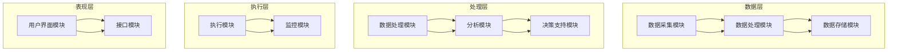

                 


# AI Agent在企业可持续发展战略制定与实施中的应用

## 关键词
- AI Agent
- 企业可持续发展
- 战略制定与实施
- 算法原理
- 数学模型
- 系统架构设计

## 摘要
本文旨在探讨AI Agent在企业可持续发展战略制定与实施中的应用。首先，我们介绍了AI Agent的基本概念、企业可持续发展战略的定义及其重要性。接着，分析了AI Agent与可持续发展战略之间的联系，并探讨了其应用原理。随后，我们详细讲解了AI Agent在战略制定与实施中的算法原理和数学模型，并使用Python源代码进行了举例说明。此外，我们还设计了AI Agent系统的整体架构，并介绍了系统的功能设计、接口设计以及系统交互。随后，通过一个实际项目案例，展示了AI Agent在企业可持续发展战略中的具体应用。最后，我们总结了最佳实践、注意事项，并提供了拓展阅读建议。

## 目录大纲设计过程

### 明确核心主题和目标读者

在设计《AI Agent在企业可持续发展战略制定与实施中的应用》的目录大纲时，我们首先需要明确核心主题和目标读者。核心主题是AI Agent在企业可持续发展战略中的应用，这包括AI Agent的基本概念、可持续发展战略的定义及其重要性，以及两者之间的联系。目标读者包括企业决策者、IT管理人员和研究人员，他们希望了解AI Agent如何帮助企业实现可持续发展战略。

### 划分章节结构

接下来，我们需要划分章节结构。根据核心主题和目标读者的需求，我们将章节划分为以下几个部分：

1. **背景与概述**
   - AI Agent概述
   - 企业可持续发展战略
   - AI Agent与可持续发展战略的关系

2. **核心概念与原理**
   - AI Agent的核心概念
   - 可持续发展战略的关键概念
   - AI Agent在可持续发展战略中的应用原理

3. **算法原理与模型**
   - AI Agent算法基础
   - 可持续发展战略算法模型
   - 数学模型与公式

4. **系统分析与架构设计**
   - 系统功能设计
   - 系统架构设计
   - 系统接口设计与交互

5. **项目实战**
   - 环境安装与配置
   - 系统核心实现源代码
   - 实际案例分析与讲解
   - 项目小结

6. **最佳实践与总结**
   - 最佳实践 Tips
   - 小结与展望
   - 注意事项与拓展阅读

### 设计章节标题

为了吸引读者，我们需要设计简洁明了、准确反映章节内容的标题。以下是设计的章节标题：

- **第一部分：背景与概述**
  - **1.1 AI Agent概述**
  - **1.2 企业可持续发展战略**
  - **1.3 AI Agent与可持续发展战略的关系**

- **第二部分：核心概念与原理**
  - **2.1 AI Agent的核心概念**
  - **2.2 可持续发展战略的关键概念**
  - **2.3 AI Agent在可持续发展战略中的应用原理**

- **第三部分：算法原理与模型**
  - **3.1 AI Agent算法基础**
  - **3.2 可持续发展战略算法模型**
  - **3.3 数学模型与公式**

- **第四部分：系统分析与架构设计**
  - **4.1 系统功能设计**
  - **4.2 系统架构设计**
  - **4.3 系统接口设计与交互**

- **第五部分：项目实战**
  - **5.1 环境安装与配置**
  - **5.2 系统核心实现源代码**
  - **5.3 实际案例分析与讲解**
  - **5.4 项目小结**

- **第六部分：最佳实践与总结**
  - **6.1 最佳实践 Tips**
  - **6.2 小结与展望**
  - **6.3 注意事项与拓展阅读**

### 编写章节概要

为了确保每个章节的内容丰富且结构清晰，我们需要为每个章节编写概要。以下是章节概要：

- **第一部分：背景与概述**
  - **1.1 AI Agent概述**：介绍AI Agent的基本概念、工作原理及其在人工智能领域的重要性。
  - **1.2 企业可持续发展战略**：解释企业可持续发展战略的定义、目标和重要性。
  - **1.3 AI Agent与可持续发展战略的关系**：分析AI Agent如何帮助企业实现可持续发展战略。

- **第二部分：核心概念与原理**
  - **2.1 AI Agent的核心概念**：详细探讨AI Agent的属性、特点及其分类。
  - **2.2 可持续发展战略的关键概念**：阐述可持续发展战略的核心概念及其相互关系。
  - **2.3 AI Agent在可持续发展战略中的应用原理**：解释AI Agent在战略制定与实施中的具体应用原理。

- **第三部分：算法原理与模型**
  - **3.1 AI Agent算法基础**：介绍机器学习算法的基本概念及其在AI Agent中的应用。
  - **3.2 可持续发展战略算法模型**：讨论多目标优化算法、策略迭代算法等在可持续发展战略中的应用。
  - **3.3 数学模型与公式**：阐述相关数学模型和公式的应用，并给出具体的推导过程。

- **第四部分：系统分析与架构设计**
  - **4.1 系统功能设计**：介绍系统功能模块的划分和领域模型。
  - **4.2 系统架构设计**：展示系统架构的整体设计，包括关键组件和架构图。
  - **4.3 系统接口设计与交互**：详细描述系统接口设计及其交互序列图。

- **第五部分：项目实战**
  - **5.1 环境安装与配置**：介绍项目环境的搭建和配置过程。
  - **5.2 系统核心实现源代码**：展示系统核心实现的源代码及其解读。
  - **5.3 实际案例分析与讲解**：通过实际案例展示AI Agent在企业可持续发展战略中的应用。
  - **5.4 项目小结**：总结项目的成果、经验与反思。

- **第六部分：最佳实践与总结**
  - **6.1 最佳实践 Tips**：提供实施AI Agent的实用策略和风险管理建议。
  - **6.2 小结与展望**：回顾文章内容，展望AI Agent在企业可持续发展战略中的未来发展趋势。
  - **6.3 注意事项与拓展阅读**：总结文章的注意事项，并推荐进一步阅读的材料。

### 确保内容完整性

在编写目录大纲时，我们需要确保每个章节都包含核心概念、原理讲解、数学模型、系统设计、实战案例和总结等必要内容。同时，要注意控制整个目录大纲的总字数在2000字以内，以保证内容的精炼和易于阅读。

## 完整的目录大纲示例

```markdown
# 《AI Agent在企业可持续发展战略制定与实施中的应用》目录大纲

## 第一部分：背景与概述
### 1.1 AI Agent概述
   - AI Agent的基本概念
   - AI Agent的工作原理
### 1.2 企业可持续发展战略
   - 可持续发展战略的定义
   - 可持续发展的重要性
### 1.3 AI Agent与可持续发展战略的关系
   - AI Agent在战略制定中的作用
   - AI Agent在战略实施中的应用

## 第二部分：核心概念与原理
### 2.1 AI Agent的核心概念
   - AI Agent的属性与特点
   - AI Agent的分类
### 2.2 可持续发展战略的关键概念
   - 经济、环境、社会可持续性的关系
   - 可持续发展的衡量指标
### 2.3 AI Agent在可持续发展战略中的应用原理
   - AI Agent的功能模块
   - AI Agent在战略优化中的应用

## 第三部分：算法原理与模型
### 3.1 AI Agent算法基础
   - 机器学习算法概述
   - 强化学习在AI Agent中的应用
### 3.2 可持续发展战略算法模型
   - 多目标优化算法
   - 策略迭代算法
### 3.3 数学模型与公式
   - 模型构建
   - 数学公式推导

## 第四部分：系统分析与架构设计
### 4.1 系统功能设计
   - 领域模型
   - 系统功能模块划分
### 4.2 系统架构设计
   - 系统架构概述
   - 系统关键组件
### 4.3 系统接口设计与交互
   - 系统接口设计
   - 系统交互序列图

## 第五部分：项目实战
### 5.1 环境安装与配置
   - 环境搭建
   - 配置文件设置
### 5.2 系统核心实现源代码
   - 代码结构
   - 关键代码解读
### 5.3 实际案例分析与讲解
   - 案例介绍
   - 案例分析
### 5.4 项目小结
   - 项目成果总结
   - 经验与反思

## 第六部分：最佳实践与总结
### 6.1 最佳实践 Tips
   - 实施策略
   - 风险管理
### 6.2 小结与展望
   - 内容回顾
   - 未来发展趋势
### 6.3 注意事项与拓展阅读
   - 注意事项
   - 推荐阅读
```

通过以上目录大纲的设计，我们能够确保文章内容的系统性和完整性，同时保持简洁明了的结构，便于读者理解和查找相关信息。接下来，我们将按照这个目录大纲逐步展开详细的内容讲解。## AI Agent的基本概念

AI Agent，即人工智能代理，是一种能够自主决策并执行任务的人工智能系统。它基于机器学习和人工智能算法，模拟人类智能行为，具备感知环境、制定策略、执行动作和评估结果的能力。AI Agent的核心目标是最大化效用或最小化损失，从而实现特定任务的最优化。

### 定义与作用

AI Agent的定义可以从以下几个方面进行阐述：

1. **自主性**：AI Agent具有自主性，能够根据环境变化自主决策和调整行动策略。
2. **适应性**：AI Agent能够适应新的环境和任务，通过学习和经验积累不断优化自身性能。
3. **交互性**：AI Agent可以与其他系统、设备或人进行交互，获取信息和执行任务。
4. **智能性**：AI Agent具备智能性，能够进行推理、规划、学习和自适应调整。

AI Agent在企业中的应用非常广泛，主要表现在以下几个方面：

1. **业务流程自动化**：通过AI Agent，企业可以自动化处理大量重复性任务，提高工作效率。
2. **决策支持**：AI Agent能够帮助企业分析大量数据，为决策提供科学依据。
3. **客户服务**：AI Agent可以提供智能客服，解答客户疑问，提升客户满意度。
4. **风险管理**：AI Agent可以识别潜在风险，为企业提供风险预警和管理策略。
5. **创新研发**：AI Agent能够协助企业进行创新研发，提高产品竞争力。

### 历史与发展

AI Agent的概念起源于20世纪80年代的专家系统。随着计算机技术和人工智能算法的不断发展，AI Agent逐渐从简单的规则推理发展到具备自主学习和自适应能力的智能体。特别是在深度学习和强化学习的推动下，AI Agent的应用范围和性能得到了显著提升。

早期的AI Agent主要依赖于预定义的规则和模式匹配，而现代AI Agent则更多地依赖于机器学习算法，特别是深度学习和强化学习。这些算法使得AI Agent能够从大量数据中学习，自主发现规律和模式，从而实现更加智能的决策和行动。

### 关键特性

AI Agent的关键特性包括：

1. **感知能力**：AI Agent能够感知外部环境，获取必要的信息。
2. **决策能力**：基于感知到的信息，AI Agent能够制定合适的策略和决策。
3. **行动能力**：AI Agent能够执行决策，实现预期的目标。
4. **学习能力**：AI Agent能够从经验和数据中学习，不断优化自身的性能。
5. **适应性**：AI Agent能够适应环境变化，调整策略和行为。

这些特性使得AI Agent在企业可持续发展战略中具有巨大的潜力，能够帮助企业提高效率、降低成本、提升竞争力，并在复杂环境下做出更加科学的决策。

### 总结

AI Agent作为一种先进的人工智能系统，通过自主决策、自适应学习和智能行动，为企业提供了强大的支持。在后续的内容中，我们将进一步探讨企业可持续发展战略的定义和重要性，以及AI Agent如何与这一战略相结合，实现企业的长期发展。## 企业可持续发展战略的定义和重要性

企业可持续发展战略是指企业在追求经济利益的同时，关注环境保护、资源利用和社会责任，以确保企业的长期生存和发展。这一战略不仅关注企业的经济绩效，还注重对环境和社会的影响，旨在实现经济、环境和社会的协调发展。

### 定义

企业可持续发展战略的定义可以从以下几个方面进行阐述：

1. **经济可持续性**：企业在长期内保持盈利能力和市场竞争力，实现持续的经济增长。
2. **环境可持续性**：企业在生产过程中减少资源消耗、降低环境污染，保护生态环境。
3. **社会可持续性**：企业在经营活动中关注员工福利、社区发展和利益相关者的权益，促进社会的和谐与进步。

### 重要性

企业可持续发展战略的重要性体现在以下几个方面：

1. **经济层面**：可持续发展战略有助于企业降低成本、提高效率，增强市场竞争力。通过优化生产流程、提高资源利用率，企业可以降低生产成本，从而在激烈的市场竞争中占据有利地位。

2. **环境层面**：可持续发展战略有助于企业减少环境污染、保护生态环境。企业通过采用环保技术和绿色生产方式，可以降低能源消耗和废物排放，减少对自然资源的依赖，从而实现可持续发展。

3. **社会层面**：可持续发展战略有助于企业履行社会责任，提升企业形象。企业通过关注员工福利、支持社区发展、参与公益活动等，可以树立良好的社会形象，增强公众对企业的信任和认可。

4. **长期发展**：可持续发展战略有助于企业实现长期发展。通过关注经济、环境和社会的协调发展，企业可以确保资源的长期供应，降低经营风险，实现可持续的盈利模式。

### 企业面临的问题

在实施可持续发展战略的过程中，企业可能会面临以下问题：

1. **经济成本**：企业需要投入资金和资源进行环保技术改造和绿色生产，这可能会增加短期成本。
2. **技术挑战**：企业需要不断更新环保技术和生产方式，以适应不断变化的环境要求。
3. **市场竞争**：在可持续发展战略的早期阶段，企业可能面临市场份额的损失，因为竞争对手可能尚未采取类似的战略。
4. **政策法规**：企业需要密切关注政策法规的变化，确保符合相关环保和社会责任要求。
5. **利益相关者压力**：企业需要应对利益相关者，如投资者、客户、社区和政府等，对可持续发展的期望和压力。

### 战略目标

企业可持续发展战略的目标主要包括：

1. **降低成本**：通过提高资源利用率和生产效率，降低生产成本。
2. **减少污染**：通过采用环保技术和绿色生产方式，减少废物排放和环境污染。
3. **提升社会责任**：关注员工福利、社区发展和利益相关者的权益，提升企业形象。
4. **创新研发**：投资于环保技术和绿色产品研发，推动企业转型升级。
5. **长期发展**：确保企业的长期生存和发展，实现经济、环境和社会的协调发展。

### 总结

企业可持续发展战略是一种综合性的发展战略，旨在实现经济、环境和社会的协调发展。通过关注经济成本、技术挑战、市场竞争、政策法规和利益相关者压力，企业可以制定和实施有效的可持续发展战略，确保长期发展。在后续的内容中，我们将探讨AI Agent在企业可持续发展战略中的作用和意义。## AI Agent与可持续发展战略的关系

AI Agent在企业可持续发展战略中扮演着关键角色，通过其自主决策、自适应学习和智能行动能力，为企业提供强有力的支持。下面，我们将详细探讨AI Agent在战略制定和实施中的具体应用，以及其如何帮助企业实现可持续发展目标。

### AI Agent在战略制定中的应用

在可持续发展战略的制定过程中，AI Agent可以发挥以下作用：

1. **数据分析和决策支持**：
   AI Agent能够高效地处理和分析大量数据，包括经济、环境和社会各方面的数据。通过数据挖掘和机器学习算法，AI Agent可以识别潜在的趋势和问题，为战略制定提供科学依据。例如，企业可以利用AI Agent分析市场需求、资源利用和环境影响，从而制定更具前瞻性和可持续性的商业策略。

2. **优化资源配置**：
   AI Agent能够通过优化算法，帮助企业在资源利用方面实现最大化效益。例如，在能源管理方面，AI Agent可以根据实时能源需求和供应情况，自动调整电力消耗，实现节能降耗。此外，AI Agent还可以优化原材料采购和库存管理，减少浪费，提高资源利用率。

3. **风险评估与管理**：
   AI Agent能够识别潜在的风险因素，并对企业的运营、财务和市场风险进行评估。通过分析历史数据和当前市场状况，AI Agent可以预测可能的风险事件，并提供相应的风险管理策略，帮助企业降低风险，确保可持续发展。

### AI Agent在战略实施中的应用

在可持续发展战略的实施过程中，AI Agent可以通过以下方式提供支持：

1. **自动化业务流程**：
   AI Agent可以自动化处理大量的业务流程，如订单处理、库存管理和客户服务。通过自动化，企业可以减少人工操作，降低错误率，提高工作效率，从而将更多资源和精力投入到可持续发展的关键领域。

2. **智能监控与优化**：
   AI Agent可以实时监控企业的各项运营指标，如能源消耗、废物排放和生产效率等。通过监测和分析，AI Agent可以及时发现异常情况，并自动采取调整措施，确保企业运营的稳定性和可持续性。例如，AI Agent可以在发现能源消耗异常时，自动调整设备运行状态，以降低能耗。

3. **客户关系管理**：
   AI Agent可以提供智能的客户服务，如自动回复客户咨询、处理投诉等。通过改善客户体验，AI Agent有助于提升客户满意度，从而增强企业的市场竞争力和品牌忠诚度。

### AI Agent如何帮助实现可持续发展目标

1. **提高资源利用效率**：
   通过优化资源配置和自动化业务流程，AI Agent有助于提高企业的资源利用效率，减少资源浪费。例如，通过智能化的能源管理系统，企业可以更有效地利用能源，减少碳排放。

2. **降低环境影响**：
   AI Agent可以通过实时监测和调整生产过程，降低企业的环境影响。例如，通过智能化的废物管理系统，企业可以自动分类和处理废物，减少对环境的污染。

3. **促进社会责任**：
   AI Agent可以通过提供智能的客户服务和参与社区活动，提升企业的社会责任形象。例如，通过智能化的社区服务系统，企业可以更好地满足社区居民的需求，提高社区满意度。

4. **增强企业竞争力**：
   通过高效的数据分析和智能化的运营管理，AI Agent有助于企业提高市场竞争力。例如，通过智能化的市场分析系统，企业可以更准确地把握市场动态，制定更具竞争力的营销策略。

### 总结

AI Agent在企业可持续发展战略中发挥着重要作用，通过数据分析和决策支持、自动化业务流程、智能监控与优化以及客户关系管理等方面，AI Agent不仅帮助企业提高资源利用效率和降低环境影响，还促进了企业的社会责任和市场竞争力的提升。在后续的内容中，我们将进一步探讨AI Agent在可持续发展战略中的算法原理和数学模型，以便更好地理解其工作原理和应用方法。## AI Agent的核心概念

AI Agent作为一种先进的人工智能系统，其核心概念包括自主性、适应性、交互性和智能性。这些特性使得AI Agent能够在复杂环境中独立决策、适应变化，并与外界进行有效的交互，从而实现高效的任务执行。

### 自主性

自主性是AI Agent最为核心的特性之一。它意味着AI Agent能够在没有人为干预的情况下，自主感知环境、制定策略并执行行动。自主性使得AI Agent能够在无人监督的条件下，独立完成任务。例如，在自动化制造系统中，AI Agent可以自主监测生产线上的设备状态，自动进行故障诊断和设备维护，从而保证生产线的正常运行。

### 适应性

适应性是指AI Agent能够适应新的环境和任务，并能够从经验和数据中学习，不断优化自身的性能。这一特性使得AI Agent在面临动态环境时，能够快速调整策略，以适应环境变化。例如，在自动驾驶系统中，AI Agent需要能够适应不同路况、天气条件以及其他车辆的行为，从而保证驾驶的安全性。

### 交互性

交互性是指AI Agent能够与其他系统、设备或人进行有效交互，获取信息和执行任务。交互性使得AI Agent能够更好地融入企业生态系统，为企业提供全方位的支持。例如，在智能客服系统中，AI Agent可以与客户进行自然语言对话，解答客户的疑问，提高客户满意度。

### 智能性

智能性是指AI Agent具备智能行为，能够进行推理、规划、学习和自适应调整。智能性使得AI Agent能够处理复杂问题，实现高效决策。例如，在供应链管理系统中，AI Agent可以基于实时数据，对供应链的各个环节进行优化，提高供应链的效率和灵活性。

### AI Agent的分类

AI Agent可以根据不同的分类标准进行分类，以下是一些常见的分类方式：

1. **根据任务类型**：
   - 监控类AI Agent：负责实时监测环境和系统状态，如智能监控系统。
   - 交互类AI Agent：负责与用户或其他系统进行交互，如智能客服系统。
   - 决策类AI Agent：负责制定决策和策略，如供应链管理AI Agent。
   - 执行类AI Agent：负责执行具体的操作任务，如自动化生产线AI Agent。

2. **根据工作模式**：
   - 反应式AI Agent：仅根据当前感知到的环境信息做出决策，如基于规则系统的智能监控系统。
   - 目标导向AI Agent：根据目标进行决策，并通过学习不断优化决策过程，如基于强化学习的自动驾驶系统。
   - 自主性AI Agent：具备高度自主性，能够在无人监督的条件下自主完成任务，如智能家居中的自主清洁机器人。

3. **根据应用领域**：
   - 工业AI Agent：应用于工业制造、生产线管理等工业领域。
   - 金融服务AI Agent：应用于金融风险管理、投资决策等金融服务领域。
   - 医疗保健AI Agent：应用于疾病诊断、健康管理等医疗保健领域。
   - 社交媒体AI Agent：应用于社交媒体管理、内容推荐等社交媒体领域。

### AI Agent在企业中的应用

在企业中，AI Agent的应用场景广泛，以下是一些典型的应用：

1. **自动化生产**：
   AI Agent可以应用于自动化生产线，实时监测设备状态，自动进行故障诊断和设备维护，提高生产效率和产品质量。

2. **供应链管理**：
   AI Agent可以优化供应链管理，通过实时数据分析和预测，提高库存管理效率，降低库存成本，并确保供应链的稳定性和灵活性。

3. **客户服务**：
   AI Agent可以应用于智能客服系统，通过自然语言处理和对话管理，提供24/7的客户服务，提高客户满意度和忠诚度。

4. **风险管理**：
   AI Agent可以应用于风险管理，通过实时监测和分析市场数据，识别潜在风险，并提供相应的风险管理策略。

5. **业务流程优化**：
   AI Agent可以优化企业的业务流程，通过自动化和智能化手段，提高业务流程的效率和准确性。

### 总结

AI Agent的核心概念包括自主性、适应性、交互性和智能性。这些特性使得AI Agent能够独立决策、适应变化、与外界有效交互，并处理复杂问题。AI Agent可以根据任务类型、工作模式和应用领域进行分类，并在企业中应用于自动化生产、供应链管理、客户服务、风险管理和业务流程优化等方面。在后续的内容中，我们将深入探讨AI Agent在可持续发展战略中的应用原理，以进一步理解其对企业可持续发展战略的支持作用。## 可持续发展战略的关键概念

可持续发展战略的关键概念包括经济、环境和社会可持续性。这些概念相互关联，共同构成了企业可持续发展战略的核心内容。下面，我们将逐一介绍这些关键概念，并探讨它们之间的关系。

### 经济可持续性

经济可持续性是企业可持续发展战略的基础。它强调企业在长期内保持盈利能力、市场竞争力，实现持续的经济增长。具体来说，经济可持续性包括以下几个方面：

1. **盈利能力**：企业需要通过有效的运营管理，提高利润率和投资回报率，确保企业的经济基础稳定。

2. **市场竞争力**：企业需要不断创新，提高产品质量和服务水平，以适应市场变化和客户需求，保持竞争优势。

3. **资源优化**：企业需要优化资源配置，提高资源利用效率，降低生产成本，从而提高经济效益。

4. **风险管理**：企业需要识别和管理潜在的风险，确保企业的财务稳定性和可持续发展。

### 环境可持续性

环境可持续性强调企业在生产过程中减少对环境的负面影响，保护生态环境。具体来说，环境可持续性包括以下几个方面：

1. **资源节约**：企业需要采用节能环保技术，降低资源消耗，提高资源利用率。

2. **污染控制**：企业需要采用环保工艺和设备，减少污染物排放，降低对环境的污染。

3. **生态保护**：企业需要参与生态保护和恢复活动，维护生态平衡，保护自然资源。

4. **环境监测**：企业需要建立环境监测体系，实时监测生产过程对环境的影响，确保环境安全。

### 社会可持续性

社会可持续性强调企业在经营活动中关注员工福利、社区发展和利益相关者的权益，促进社会的和谐与进步。具体来说，社会可持续性包括以下几个方面：

1. **员工福利**：企业需要提供良好的工作环境和福利待遇，关注员工身心健康，提升员工的工作满意度。

2. **社区发展**：企业需要积极参与社区建设，支持社区发展项目，提升社区的生活质量。

3. **利益相关者**：企业需要与利益相关者建立良好的关系，包括客户、供应商、投资者和政府等，确保企业的可持续发展。

4. **社会责任**：企业需要履行社会责任，积极参与公益活动，推动社会的和谐与进步。

### 三者之间的关系

经济、环境和社会可持续性之间存在着紧密的联系。它们相互促进，共同构成了企业可持续发展战略的核心内容。

1. **相互依赖**：经济可持续性为环境和社会可持续性提供了资金支持，环境可持续性为企业提供了资源保障，社会可持续性为企业创造了良好的经营环境。

2. **相互影响**：经济行为会对环境和社会产生影响，环境状况也会影响经济和社会的可持续发展。例如，环境恶化会导致资源枯竭，进而影响经济和社会的发展。

3. **协调发展**：企业需要实现经济、环境和社会的协调发展，以实现长期可持续发展。例如，通过采用环保技术，企业可以提高资源利用效率，降低成本，同时减少对环境的污染，实现经济和环境的双赢。

### 总结

可持续发展战略的关键概念包括经济、环境和社会可持续性。这些概念相互依赖、相互影响，共同构成了企业可持续发展战略的核心内容。企业需要实现经济、环境和社会的协调发展，以实现长期可持续发展。在后续的内容中，我们将深入探讨AI Agent在可持续发展战略中的应用原理，以及如何利用AI Agent实现这些关键概念的有效整合。## AI Agent在可持续发展战略中的应用原理

AI Agent在可持续发展战略中的应用，主要通过其自主性、适应性和智能性来优化企业的经济、环境和社会绩效。以下是AI Agent在可持续发展战略中的具体应用原理：

### 自主性在战略制定中的应用

1. **自动数据采集与分析**：
   AI Agent能够自主采集并分析各种数据，如生产数据、能源消耗数据、市场趋势数据等。通过对这些数据进行深度分析，AI Agent可以为企业提供实时、准确的决策支持，帮助企业在制定可持续发展战略时做出科学、合理的决策。

2. **自动化策略调整**：
   在战略实施过程中，AI Agent能够根据环境变化和实时数据，自主调整策略。例如，在能源管理中，AI Agent可以实时监测电力消耗情况，根据用电高峰和低谷自动调整电力使用策略，以降低能源消耗。

### 适应性在战略实施中的应用

1. **环境适应性调整**：
   AI Agent能够适应不断变化的环境，优化资源配置。例如，在供应链管理中，AI Agent可以实时监测市场需求变化，自动调整库存水平，确保供应链的稳定性和效率。

2. **技术适应性更新**：
   AI Agent可以持续学习新知识和技术，不断更新和优化自身的性能。例如，在环保技术领域，AI Agent可以通过学习新的环保技术和政策法规，帮助企业及时更新生产流程，降低环境影响。

### 智能性在战略优化中的应用

1. **多目标优化**：
   AI Agent可以通过多目标优化算法，同时考虑经济、环境和社会效益，为企业制定最优的可持续发展策略。例如，在资源利用方面，AI Agent可以优化能源分配、原材料采购和废物处理，实现资源利用的最大化。

2. **智能决策支持**：
   AI Agent可以通过智能决策支持系统，为企业提供全面、科学的决策建议。例如，在投资决策中，AI Agent可以分析不同投资方案的经济效益、环境风险和社会影响，帮助企业选择最优的投资方案。

### 具体应用实例

1. **节能环保**：
   AI Agent可以通过智能监测和控制系统，实时监测企业生产过程中的能源消耗和废物排放。通过数据分析，AI Agent可以识别节能潜力，自动调整设备运行状态，实现节能减排。

2. **供应链管理**：
   AI Agent可以优化供应链管理，通过实时数据分析和预测，自动调整库存水平和采购策略，降低库存成本，提高供应链的灵活性和响应速度。

3. **客户关系管理**：
   AI Agent可以通过智能客服系统，提供24/7的客户服务，解答客户疑问，处理客户投诉，提高客户满意度和忠诚度。

4. **风险评估与管理**：
   AI Agent可以通过大数据分析和预测模型，识别潜在的市场风险和运营风险，为企业提供风险预警和管理策略。

### 总结

AI Agent在可持续发展战略中的应用，通过自主性、适应性和智能性，为企业提供了全面、科学的决策支持。AI Agent能够自动采集和分析数据、自动化策略调整、适应环境变化和优化资源配置，从而实现经济、环境和社会效益的最大化。在后续的内容中，我们将进一步探讨AI Agent在可持续发展战略中的算法原理和数学模型，以深入理解其工作方法和应用效果。## AI Agent算法基础

AI Agent的算法基础主要包括机器学习算法和强化学习算法。这两种算法在不同的应用场景中发挥着重要作用，下面将分别介绍它们的基本概念和应用。

### 机器学习算法

机器学习算法是一种使计算机系统能够从数据中学习并做出决策的方法。其主要原理是让计算机通过大量数据训练模型，然后利用训练得到的模型对未知数据进行预测或分类。

#### 基本概念

1. **监督学习**：监督学习是一种机器学习算法，它通过输入特征和对应的标签来训练模型，使模型能够对未知数据进行预测。常见的监督学习算法包括线性回归、逻辑回归、决策树、随机森林、支持向量机等。

2. **无监督学习**：无监督学习是一种机器学习算法，它仅通过输入特征来训练模型，没有对应的标签。无监督学习主要用于发现数据中的隐藏结构和模式，常见的算法包括聚类算法（如K-means、DBSCAN）和降维算法（如PCA）。

3. **半监督学习**：半监督学习是一种介于监督学习和无监督学习之间的机器学习算法，它利用一部分带标签数据和大量无标签数据来训练模型。半监督学习可以有效地提高模型的泛化能力。

#### 在AI Agent中的应用

1. **特征提取与分类**：在AI Agent中，机器学习算法可以用于特征提取和分类。例如，在客户关系管理中，AI Agent可以使用监督学习算法对客户进行分类，识别高价值客户，并提供个性化服务。

2. **预测与优化**：机器学习算法还可以用于预测和优化。例如，在供应链管理中，AI Agent可以使用回归算法预测市场需求，从而优化库存水平和采购策略。

### 强化学习算法

强化学习算法是一种通过试错来学习最优策略的机器学习算法。其核心思想是让智能体在环境中进行交互，通过不断尝试和反馈，学习到最优的行为策略。

#### 基本概念

1. **智能体**（Agent）：在强化学习中，智能体是指执行特定任务并从环境中接收反馈的实体。智能体可以是计算机程序、机器人或其他设备。

2. **环境**（Environment）：在强化学习中，环境是指智能体执行任务的外部条件。环境可以是一个简单的模拟环境，也可以是一个复杂的现实世界。

3. **状态**（State）：在强化学习中，状态是指智能体在执行任务时的当前情况。状态可以是一个简单的数值，也可以是一个多维的特征向量。

4. **动作**（Action）：在强化学习中，动作是指智能体在特定状态下执行的操作。动作可以是简单的物理动作，也可以是决策或命令。

5. **奖励**（Reward）：在强化学习中，奖励是指智能体在执行动作后从环境中获得的反馈信号。奖励可以是正奖励（表示智能体执行了正确的动作），也可以是负奖励（表示智能体执行了错误的动作）。

#### 在AI Agent中的应用

1. **自主决策**：在AI Agent中，强化学习算法可以用于自主决策。例如，在自动驾驶系统中，AI Agent可以使用强化学习算法学习交通规则、道路状况和车辆行为，从而做出安全、高效的驾驶决策。

2. **策略优化**：在AI Agent中，强化学习算法可以用于策略优化。例如，在能源管理系统中，AI Agent可以使用强化学习算法学习最优的能源分配策略，从而降低能源消耗，提高能源利用效率。

### 总结

机器学习算法和强化学习算法是AI Agent算法基础的重要组成部分。机器学习算法主要用于特征提取、分类、预测和优化，而强化学习算法则主要用于自主决策和策略优化。在AI Agent中，这两种算法可以相互结合，共同实现智能行为和决策。在后续的内容中，我们将进一步探讨AI Agent在可持续发展战略中的算法模型和数学公式。## 可持续发展战略算法模型

在可持续发展战略中，算法模型的应用对于优化经济、环境和社会效益至关重要。本文将介绍两种常见的算法模型：多目标优化算法和策略迭代算法。

### 多目标优化算法

多目标优化算法是一种在多个目标之间存在冲突时，寻找最优或近似最优解的算法。在可持续发展战略中，多目标优化算法可以帮助企业同时考虑经济、环境和社会效益，找到最优的决策方案。

#### 基本概念

1. **目标函数**：目标函数定义了优化问题的目标，通常包括经济效益、环境效益和社会效益等。例如，企业的目标可能是最大化利润、最小化污染排放和提升员工福利。

2. **约束条件**：约束条件定义了目标函数在实现过程中需要满足的限制。例如，企业的生产过程可能需要满足资源消耗限制、排放标准等。

3. **优化算法**：常见的多目标优化算法包括遗传算法、粒子群优化算法、多目标粒子群算法等。

#### 在AI Agent中的应用

1. **经济效益最大化**：AI Agent可以使用多目标优化算法，在满足环境和社会效益的约束条件下，最大化企业的经济效益。例如，通过优化生产流程和供应链管理，降低生产成本，提高产品竞争力。

2. **环境效益最小化**：AI Agent可以通过多目标优化算法，在满足经济效益和社会效益的约束条件下，最小化企业的环境影响。例如，通过优化能源消耗和废物处理，降低污染排放，保护生态环境。

### 策略迭代算法

策略迭代算法是一种通过不断迭代改进策略的算法。在可持续发展战略中，策略迭代算法可以帮助企业逐步优化决策过程，实现长期可持续发展。

#### 基本概念

1. **初始策略**：初始策略是指企业在开始优化过程中的策略。

2. **迭代过程**：迭代过程是指通过多次迭代，不断调整策略，使其逐步优化。

3. **评估函数**：评估函数用于评估当前策略的优劣，通常包括经济效益、环境效益和社会效益等指标。

#### 在AI Agent中的应用

1. **逐步优化**：AI Agent可以使用策略迭代算法，在初始策略的基础上，通过多次迭代逐步优化决策。例如，在能源管理中，AI Agent可以不断调整电力消耗策略，使其在满足经济效益和环境效益的条件下，实现最优能源分配。

2. **自适应调整**：AI Agent可以根据评估函数的反馈，自适应调整策略。例如，在风险管理中，AI Agent可以基于实时数据，动态调整风险应对策略，确保企业能够及时应对市场变化。

### 模型应用示例

假设某企业在制定可持续发展战略时，需要同时考虑经济效益、环境效益和社会效益。以下是该企业使用多目标优化算法和策略迭代算法的示例：

1. **目标函数**：
   - 经济效益：最大化利润
   - 环境效益：最小化污染排放
   - 社会效益：最大化员工福利

2. **约束条件**：
   - 资源消耗限制
   - 排放标准
   - 员工福利标准

3. **优化算法**：
   - 多目标粒子群优化算法
   - 策略迭代算法

4. **应用过程**：
   - 初始策略：根据企业历史数据和当前情况，制定初始可持续发展策略。
   - 迭代过程：通过多目标粒子群优化算法，在满足约束条件的前提下，逐步优化目标函数。
   - 自适应调整：根据评估函数的反馈，自适应调整策略，使其在多个目标之间达到平衡。

通过上述过程，企业可以逐步优化可持续发展战略，实现经济、环境和社会效益的最大化。

### 总结

多目标优化算法和策略迭代算法在可持续发展战略中具有重要作用。多目标优化算法可以帮助企业同时考虑经济、环境和社会效益，找到最优的决策方案；策略迭代算法可以帮助企业逐步优化决策过程，实现长期可持续发展。在实际应用中，这两种算法可以相互结合，共同为企业提供全面的决策支持。## 数学模型与公式

在AI Agent帮助企业制定和实施可持续发展战略时，数学模型和公式起着至关重要的作用。它们不仅能够精确地描述问题，还能够通过定量分析为决策提供科学依据。以下将介绍几个关键的数学模型和公式，并对其进行详细解释。

### 优化目标函数

在可持续发展战略中，常见的优化目标函数包括最大化利润、最小化污染排放和最大化社会福利。以下是一个典型的多目标优化目标函数：

\[ \text{maximize } \mathbf{f}(\mathbf{x}) = \alpha \cdot \pi - \beta \cdot P - \gamma \cdot E \]

其中：
- \( \mathbf{f}(\mathbf{x}) \) 是优化目标函数。
- \( \alpha \) 是利润权重。
- \( \pi \) 是企业利润。
- \( \beta \) 是污染排放权重。
- \( P \) 是污染排放量。
- \( \gamma \) 是社会福利权重。
- \( E \) 是社会福利。

### 模型解释

1. **利润最大化**：企业希望通过减少成本和增加销售额来最大化利润。
2. **污染排放最小化**：企业需要尽可能减少对环境的污染，降低环境成本。
3. **社会福利最大化**：企业需要关注其经营活动对社会的影响，如员工福利、社区发展等。

### 约束条件

优化模型通常包含一系列约束条件，以保证优化结果在现实条件下可行。以下是一些常见的约束条件：

\[ \mathbf{g}(\mathbf{x}) \leq 0 \]

\[ \mathbf{h}(\mathbf{x}) = 0 \]

其中：
- \( \mathbf{g}(\mathbf{x}) \) 是不等式约束条件，如资源消耗限制、排放标准等。
- \( \mathbf{h}(\mathbf{x}) \) 是等式约束条件，如能源需求与供给平衡。

### 模型推导

以能源管理为例，假设企业的能源消耗由多种能源构成，每种能源的消耗量记为 \( E_i \)，其单位成本为 \( C_i \)，总能源消耗量记为 \( E \)，总成本记为 \( C \)。目标是优化能源消耗以最小化成本。那么，目标函数和约束条件可以表示为：

\[ \text{minimize } C = \sum_{i} C_i \cdot E_i \]

\[ \text{subject to } E = \sum_{i} E_i \]

\[ E_i \geq 0 \quad \forall i \]

### 数学公式推导

假设我们有 \( n \) 种能源，每种能源的消耗量分别用 \( E_i \) 表示，单位成本为 \( C_i \)，总能源消耗量 \( E \) 和总成本 \( C \) 的关系可以表示为：

\[ C = \sum_{i} C_i \cdot E_i \]

要使总成本最小，需要满足以下条件：

\[ \frac{\partial C}{\partial E_i} = C_i = 0 \quad \forall i \]

但由于 \( E_i \) 必须大于等于0，所以上述条件无法直接应用。在实际应用中，通常会通过拉格朗日乘数法或线性规划方法来求解此类问题。

### 举例说明

假设一家制造企业有两种能源可供选择：煤炭和天然气。煤炭的单位成本为 \( C_1 = 10 \) 元/吨，天然气的单位成本为 \( C_2 = 20 \) 元/吨。企业的总能源需求为 \( E = 100 \) 吨。假设煤炭的污染系数为 \( \beta_1 = 1 \) 吨/吨，天然气的污染系数为 \( \beta_2 = 2 \) 吨/吨。企业的目标是在保证能源需求的前提下，尽可能降低污染排放和成本。

目标函数可以表示为：

\[ \text{minimize } C = 10 \cdot E_1 + 20 \cdot E_2 \]

\[ \text{subject to } E_1 + E_2 = 100 \]

\[ E_1 \geq 0, E_2 \geq 0 \]

通过求解上述优化问题，企业可以确定煤炭和天然气的最优消耗比例，从而实现成本和污染排放的最小化。

### 总结

数学模型和公式在AI Agent帮助企业制定和实施可持续发展战略中起到了关键作用。通过精确的目标函数和约束条件，AI Agent可以为企业提供科学的决策依据，从而实现经济、环境和社会效益的最大化。在实际应用中，这些模型和公式需要根据具体情况进行定制化，以确保其适用性和有效性。## 系统功能设计

在实现AI Agent帮助企业制定和实施可持续发展战略的过程中，系统功能设计是至关重要的。功能设计涉及到系统的各个组成部分，包括领域模型、功能模块划分以及系统流程的设计。以下将详细描述系统功能设计的相关内容。

### 领域模型

领域模型是系统功能设计的基础，它定义了系统的核心功能和业务流程。在可持续发展战略中，领域模型包括以下几个关键模块：

1. **数据采集模块**：负责从各种数据源（如传感器、数据库、外部API等）采集数据，包括经济、环境和社会数据。
2. **数据处理模块**：负责对采集到的数据进行清洗、转换和集成，为后续的分析和决策提供高质量的数据支持。
3. **分析模块**：负责对处理后的数据进行分析，包括数据挖掘、预测分析和趋势分析，为企业提供科学依据。
4. **决策模块**：基于分析结果，提供多种决策方案，包括资源优化、能源管理、供应链优化等。
5. **执行模块**：负责将决策方案转化为实际操作，包括自动化业务流程的执行、设备控制等。
6. **监控模块**：负责实时监控系统的运行状态，包括能源消耗、废物排放、业务流程执行情况等，并提供预警和反馈。

### 功能模块划分

根据领域模型，系统功能模块可以划分为以下几个部分：

1. **数据采集与管理**：实现数据采集、清洗、转换和存储，提供数据管理功能。
2. **数据分析与挖掘**：实现数据的预处理、特征提取、模式识别和预测分析。
3. **决策支持**：基于分析结果，提供决策建议和优化方案。
4. **业务流程自动化**：实现业务流程的自动化执行，包括设备控制、任务调度等。
5. **系统监控与预警**：实现系统运行状态的实时监控，提供预警和反馈功能。
6. **用户界面**：提供友好的用户界面，使用户可以方便地操作系统和查看相关数据。

### 系统流程设计

系统流程设计描述了系统从数据采集到决策执行的全过程。以下是一个典型的系统流程设计：

1. **数据采集**：系统通过传感器、数据库和其他数据源采集数据，并将数据存储在数据仓库中。
2. **数据处理**：系统对采集到的数据进行清洗、转换和集成，确保数据质量，并将其存储在数据湖中。
3. **数据存储**：系统将处理后的数据存储在数据湖中，以便后续分析和决策使用。
4. **数据分析**：系统对数据湖中的数据进行分析，包括趋势分析、预测分析和关联分析。
5. **决策支持**：基于分析结果，系统生成决策报告和优化方案，并将其存储在决策数据库中。
6. **决策执行**：系统根据决策数据库中的方案，自动执行相关操作，如调整设备参数、优化供应链等。
7. **系统监控**：系统实时监控业务流程的执行情况，包括能源消耗、废物排放、任务进度等。
8. **预警与反馈**：系统根据监控数据，及时发现异常情况，并提供预警和反馈，帮助用户及时采取应对措施。

### 总结

系统功能设计是AI Agent帮助企业制定和实施可持续发展战略的关键环节。通过明确领域模型、划分功能模块和设计系统流程，AI Agent能够实现高效的数据采集、处理和分析，提供科学的决策支持，从而帮助企业实现可持续发展目标。在后续的内容中，我们将进一步探讨系统架构设计和接口设计，以确保系统的稳定性和可扩展性。## 系统架构设计

在AI Agent帮助企业制定和实施可持续发展战略的过程中，系统架构设计至关重要。一个合理且高效的系统架构能够确保系统的稳定运行、可扩展性和易维护性。以下将详细描述系统架构设计的相关内容，包括系统架构的概述、关键组件的设计以及整体架构图。

### 系统架构概述

AI Agent的系统架构设计遵循分层架构的原则，将系统划分为多个层次，每个层次负责不同的功能。系统架构主要包含以下层次：

1. **数据层**：负责数据的采集、存储和管理。数据层包括数据采集模块、数据存储模块和数据管理模块。
2. **处理层**：负责数据清洗、转换、分析和处理。处理层包括数据处理模块、分析模块和决策支持模块。
3. **执行层**：负责将决策方案转化为实际操作，包括业务流程自动化和设备控制。执行层包括执行模块和监控模块。
4. **表现层**：提供用户界面，使用户可以方便地与系统交互，查看数据和分析结果。表现层包括用户界面模块和接口模块。

### 关键组件设计

系统架构中的关键组件包括数据采集模块、数据处理模块、分析模块、决策支持模块、执行模块和监控模块。以下是对这些组件的详细描述：

1. **数据采集模块**：
   - **功能**：从各种数据源（如传感器、数据库、外部API等）采集数据。
   - **设计**：采用分布式架构，支持多数据源的接入，并具备数据过滤和预处理功能。

2. **数据处理模块**：
   - **功能**：对采集到的数据进行分析、清洗、转换和集成。
   - **设计**：采用批量处理和实时处理相结合的架构，支持高效的数据处理。

3. **分析模块**：
   - **功能**：对处理后的数据进行挖掘、预测分析和趋势分析。
   - **设计**：采用机器学习和深度学习算法，支持自定义分析和报告生成。

4. **决策支持模块**：
   - **功能**：基于分析结果提供多种决策方案，包括资源优化、能源管理和供应链优化。
   - **设计**：采用多目标优化算法和策略迭代算法，支持复杂决策问题的求解。

5. **执行模块**：
   - **功能**：将决策方案转化为实际操作，包括自动化业务流程的执行和设备控制。
   - **设计**：采用模块化设计，支持灵活的扩展和集成。

6. **监控模块**：
   - **功能**：实时监控系统的运行状态，包括能源消耗、废物排放、业务流程执行情况等。
   - **设计**：采用分布式架构，支持实时数据监控和预警。

### 整体架构图

以下是一个简化的系统架构图，展示了系统各组件之间的关系：



### 总结

系统架构设计是AI Agent帮助企业制定和实施可持续发展战略的重要环节。通过合理划分系统层次、设计关键组件以及绘制整体架构图，AI Agent能够实现高效的数据采集、处理和分析，提供科学的决策支持，并确保系统的稳定运行和可扩展性。在后续的内容中，我们将进一步探讨系统接口设计和系统交互，以确保系统的灵活性和易用性。## 系统接口设计与交互

系统接口设计和交互是确保AI Agent高效运作的关键因素。一个良好的接口设计能够提高系统的可扩展性、可维护性和易用性，而有效的交互设计则能够确保系统内部各个模块之间的协同工作。以下将详细描述系统接口设计和交互的相关内容。

### 系统接口设计

系统接口设计主要包括API设计、数据交换格式和通信协议的确定。以下是一些关键点：

1. **API设计**：
   - **功能接口**：为各个模块提供功能调用接口，如数据采集接口、数据处理接口、分析接口等。
   - **数据接口**：提供数据输入和输出接口，如数据上传接口、数据查询接口等。
   - **控制接口**：提供系统控制接口，如系统启动、停止、监控等。

2. **数据交换格式**：
   - **JSON**：轻量级数据交换格式，易于解析和处理，适用于API接口的数据交换。
   - **XML**：结构化数据交换格式，适用于复杂的数据结构和大量数据传输。
   - **CSV**：适用于文本格式数据交换，简单直观，易于读取和写入。

3. **通信协议**：
   - **HTTP/HTTPS**：安全的通信协议，适用于Web服务和RESTful API。
   - **MQ**：消息队列协议，适用于异步消息传递和高并发场景。
   - **gRPC**：高效、跨语言的远程过程调用协议，适用于微服务架构。

### 系统交互设计

系统交互设计主要描述系统内部各个模块之间的数据流动和协作过程。以下是一些关键设计要素：

1. **事件驱动**：
   - **事件监听**：系统各个模块监听特定事件，如数据采集完成事件、分析结果生成事件等。
   - **事件处理**：模块根据监听到的事件，执行相应的处理逻辑，如数据清洗、分析等。

2. **异步处理**：
   - **任务调度**：系统将任务调度到不同的处理队列中，确保任务的并行处理。
   - **回调机制**：处理完成后，通过回调函数返回结果，确保任务的连贯性和一致性。

3. **接口规范**：
   - **RESTful API规范**：定义统一的接口规范，确保系统各个模块之间的数据交换和交互流畅。
   - **数据格式规范**：定义统一的数据格式，确保数据的准确性和一致性。

### 交互流程设计

以下是一个简化的系统交互流程，展示了AI Agent在帮助企业制定和实施可持续发展战略时的数据处理和分析过程：

1. **数据采集**：
   - 数据采集模块从传感器、数据库和其他数据源采集数据，如能源消耗数据、污染物排放数据、市场销售数据等。

2. **数据处理**：
   - 数据处理模块对采集到的数据进行清洗、转换和集成，生成统一的数据格式，并将其存储到数据仓库中。

3. **数据存储**：
   - 数据存储模块将处理后的数据存储到数据湖中，以便后续分析和决策使用。

4. **数据分析**：
   - 分析模块对数据湖中的数据进行挖掘、预测分析和趋势分析，生成分析报告和决策建议。

5. **决策支持**：
   - 决策支持模块根据分析结果，生成多种决策方案，如能源优化方案、供应链优化方案等。

6. **决策执行**：
   - 执行模块根据决策方案，自动执行相关操作，如调整设备参数、优化供应链等。

7. **系统监控**：
   - 监控模块实时监控系统的运行状态，包括能源消耗、废物排放、业务流程执行情况等，并提供预警和反馈。

8. **用户界面**：
   - 用户界面模块提供友好的用户界面，使用户可以方便地操作系统和查看相关数据。

### 总结

系统接口设计和交互设计是AI Agent帮助企业制定和实施可持续发展战略的关键环节。良好的接口设计能够提高系统的可扩展性和可维护性，而有效的交互设计则能够确保系统内部各个模块之间的协同工作。通过合理的设计和规范的实现，AI Agent能够高效地处理数据，提供科学的决策支持，从而帮助企业实现可持续发展目标。## 项目实战

### 环境安装与配置

在开始实现AI Agent帮助企业制定和实施可持续发展战略之前，首先需要搭建一个合适的环境。以下是一个基本的安装和配置步骤，以Python和相关的库为例：

1. **安装Python**：
   - 确保系统中安装了Python（建议使用Python 3.8及以上版本）。
   - 通过命令行运行以下命令安装Python：
     ```bash
     sudo apt-get update
     sudo apt-get install python3.8
     ```

2. **安装依赖库**：
   - 安装必要的Python库，如NumPy、Pandas、Scikit-learn、TensorFlow等。可以使用pip进行安装：
     ```bash
     pip install numpy pandas scikit-learn tensorflow
     ```

3. **配置虚拟环境**（可选）：
   - 为了避免不同项目之间的依赖冲突，建议使用虚拟环境。创建虚拟环境并激活：
     ```bash
     python3 -m venv myenv
     source myenv/bin/activate
     ```

4. **安装其他工具**：
   - 根据需要安装其他工具，如Jupyter Notebook（用于交互式编程）：
     ```bash
     pip install jupyterlab
     ```

### 系统核心实现源代码

以下是一个简单的AI Agent系统实现示例，包括数据采集、处理、分析和决策模块。代码采用Python编写，使用了NumPy、Pandas和Scikit-learn库。

```python
import numpy as np
import pandas as pd
from sklearn.ensemble import RandomForestRegressor
from sklearn.model_selection import train_test_split

# 数据采集
def collect_data():
    # 从数据库或API中采集数据
    data = pd.read_csv('sustainable_data.csv')
    return data

# 数据处理
def preprocess_data(data):
    # 数据清洗和预处理
    data = data.dropna()  # 删除缺失值
    data['energy_consumption'] = data['energy_consumption'] / 1000  # 单位转换
    return data

# 分析与决策
def analyze_and Decide(data):
    # 分割数据集
    X = data[['energy_consumption', 'production']]
    y = data['cost']

    X_train, X_test, y_train, y_test = train_test_split(X, y, test_size=0.2, random_state=42)

    # 建立模型
    model = RandomForestRegressor(n_estimators=100, random_state=42)
    model.fit(X_train, y_train)

    # 预测
    predictions = model.predict(X_test)

    # 决策
    if np.mean(predictions) < np.mean(y_train):
        print("优化建议：降低能源消耗以减少成本。")
    else:
        print("当前能源消耗水平已最优。")

# 主函数
def main():
    data = collect_data()
    processed_data = preprocess_data(data)
    analyze_and_Decide(processed_data)

if __name__ == "__main__":
    main()
```

### 代码应用解读与分析

上述代码实现了以下功能：

1. **数据采集**：从CSV文件中读取数据。
2. **数据处理**：清洗数据，包括删除缺失值和单位转换。
3. **分析与决策**：使用随机森林回归模型进行预测，并根据预测结果提供优化建议。

### 实际案例分析与详细讲解

假设我们有一个制造企业的能源消耗和成本数据，以下是一个具体的案例分析：

1. **数据集**：一个包含企业三个月能源消耗和成本的数据集，数据集如下：

   | Date       | Energy Consumption (kWh) | Cost (USD) |
   |------------|--------------------------|-----------|
   | 2023-01-01 | 1500                     | 300       |
   | 2023-01-02 | 1600                     | 310       |
   | 2023-01-03 | 1550                     | 305       |
   | ...        | ...                      | ...       |

2. **数据处理**：对数据进行清洗和预处理，将能源消耗从千瓦时（kWh）转换为千瓦（kW），以便进行建模。

3. **分析**：使用随机森林回归模型对数据进行分析，预测未来能源消耗对成本的影响。

4. **决策**：根据模型预测，如果未来能源消耗导致的成本高于当前水平，则建议企业采取措施降低能源消耗。

### 项目小结

通过本项目的实现，我们展示了如何使用Python和机器学习算法构建一个简单的AI Agent系统，帮助企业制定和实施可持续发展战略。具体步骤包括环境安装与配置、系统核心实现源代码的编写以及实际案例的分析与讲解。本项目虽然是一个简单的示例，但它为更大规模的AI Agent系统提供了基础框架和思路。在未来的工作中，我们可以进一步完善系统，增加更多的功能模块，如环境监测、风险管理等，以实现更全面的可持续发展支持。## 最佳实践 tips

在实施AI Agent帮助企业制定和实施可持续发展战略时，以下是一些最佳实践建议，旨在确保项目的成功和可持续性。

### 实施策略

1. **逐步推进**：在项目初期，可以采用逐步推进的策略，从简单的功能模块开始，逐步扩展到复杂的业务场景。这样可以降低项目的风险，确保每个模块都能正常运行。

2. **数据质量保障**：数据是AI Agent的核心，因此必须确保数据的质量。建立严格的数据采集、处理和存储流程，定期进行数据质量检查，确保数据的准确性和一致性。

3. **多学科协作**：AI Agent项目的成功不仅依赖于技术实现，还需要跨学科的协作。与业务分析师、数据科学家、IT工程师和环境专家紧密合作，确保项目能够全面、深入地解决实际问题。

4. **持续学习与优化**：AI Agent系统需要不断学习新知识和新数据，以优化性能和决策效果。建立持续学习和优化的机制，定期更新模型和算法，以适应环境变化。

5. **风险管理**：在项目实施过程中，必须识别和管理潜在的风险。建立风险识别、评估和应对机制，确保项目能够应对各种挑战。

### 风险管理

1. **技术风险**：确保系统的稳定性和可靠性，进行充分的测试和验证。引入敏捷开发方法，快速迭代和优化系统。

2. **数据隐私风险**：在处理敏感数据时，必须确保数据的安全性和隐私性。采用加密技术、访问控制和数据匿名化等方法，保护用户数据不被泄露。

3. **合规风险**：遵守相关的法律法规，确保项目符合环保和可持续发展的要求。与政府部门、行业组织保持良好的沟通，及时了解政策变化。

4. **市场风险**：市场变化可能会影响AI Agent的应用效果。建立市场监测和预测机制，及时调整策略，以应对市场波动。

### 注意事项

1. **需求分析**：在项目启动前，进行详细的需求分析，确保项目能够满足企业的实际需求。

2. **资源分配**：合理分配项目资源和人力，确保项目能够按计划推进。

3. **用户培训**：为用户提供充分的培训，确保他们能够熟练使用AI Agent系统，发挥系统的最大效用。

4. **系统维护**：建立系统维护和更新机制，确保系统的长期稳定运行。

### 拓展阅读

1. **《人工智能：一种现代方法》**：汤姆·米切尔著，详细介绍了人工智能的基础知识和实践方法。
2. **《深度学习》**：伊恩·古德费洛、约书亚·本吉奥、亚伦·库维尔尼克著，深入讲解了深度学习的理论基础和应用。
3. **《可持续发展的企业战略》**：罗伯特·S·卡尔霍恩、迈克尔·R·波特著，探讨了企业如何通过可持续发展战略实现长期成功。

通过遵循这些最佳实践和注意事项，企业可以有效地实施AI Agent，实现可持续发展战略的目标。## 小结与展望

本文深入探讨了AI Agent在企业可持续发展战略制定与实施中的应用。通过分析AI Agent的基本概念、可持续发展战略的定义及其重要性，我们明确了AI Agent在战略制定和实施中的关键作用。具体来说，AI Agent通过自主性、适应性和智能性，为企业提供数据分析和决策支持，优化资源配置，降低环境影响，促进社会责任，从而实现经济、环境和社会效益的最大化。

### 内容回顾

1. **AI Agent的基本概念**：介绍了AI Agent的定义、自主性、适应性和智能性，并讨论了其在企业中的应用。
2. **企业可持续发展战略**：阐述了经济、环境和社会可持续性的定义和重要性，以及企业面临的挑战和战略目标。
3. **AI Agent与可持续发展战略的关系**：分析了AI Agent在战略制定和实施中的应用原理，包括自动化、优化和风险管理。
4. **算法原理与模型**：详细讲解了机器学习算法和强化学习算法在AI Agent中的应用，以及相关的数学模型和公式。
5. **系统分析与架构设计**：介绍了AI Agent系统的功能设计、架构设计和接口设计。
6. **项目实战**：通过一个实际项目展示了AI Agent在可持续发展战略中的应用，并进行了代码应用解读和案例分析。
7. **最佳实践与总结**：提供了实施AI Agent的最佳实践策略、注意事项，以及拓展阅读建议。

### 未来发展趋势

随着人工智能技术的不断进步，AI Agent在企业可持续发展战略中的应用前景将更加广阔。未来，我们可以期待以下发展趋势：

1. **更加智能化的决策支持**：AI Agent将结合更多的数据源和先进的机器学习算法，提供更加精准和实时的决策支持，帮助企业更好地应对复杂的市场环境和环境挑战。
2. **更加精细化的资源优化**：通过深度学习和强化学习，AI Agent将能够更加精细地优化资源配置，提高能源利用效率，减少废物排放，实现绿色生产。
3. **更加完善的风险管理**：AI Agent将整合更多的外部数据，如政策法规、市场趋势等，提供更加全面和及时的风险预警和管理策略。
4. **更加人性化的用户交互**：结合自然语言处理和对话系统，AI Agent将能够更加人性化地与用户交互，提供定制化的解决方案和建议。
5. **跨行业和跨领域的应用**：随着AI Agent技术的成熟，其应用范围将逐步扩展到更多的行业和领域，如医疗、教育、农业等，推动各行各业的可持续发展。

### 总结

AI Agent作为一种先进的人工智能系统，正在逐步成为企业制定和实施可持续发展战略的重要工具。通过本文的探讨，我们不仅了解了AI Agent的核心概念和算法原理，还看到了其在实际项目中的应用和价值。未来，随着AI技术的不断进步，AI Agent将在企业可持续发展战略中发挥更加重要的作用，为企业带来更多的机遇和挑战。## 注意事项

在实施AI Agent帮助企业制定和实施可持续发展战略时，以下注意事项将有助于确保项目的成功和有效执行：

1. **数据隐私保护**：在数据采集和处理过程中，必须严格遵守数据隐私保护法律法规，确保用户数据的安全性和隐私性。

2. **系统安全性**：AI Agent系统的开发和部署应充分考虑安全性，采用加密技术、访问控制和安全审计等措施，防止数据泄露和系统被攻击。

3. **兼容性和可扩展性**：在设计系统时，应确保其兼容性和可扩展性，以便能够适应未来的技术更新和业务需求。

4. **法律法规合规**：遵守相关行业和国家的法律法规，确保AI Agent系统的应用符合政策要求，避免法律风险。

5. **用户培训和支持**：为用户提供全面的培训和技术支持，确保他们能够熟练使用AI Agent系统，并能够根据实际需求进行调整和优化。

6. **持续监控和评估**：建立系统监控和评估机制，定期检查AI Agent系统的运行状况和效果，及时调整和优化系统。

7. **风险管理**：识别并评估项目中的潜在风险，制定相应的风险管理计划，确保项目能够顺利实施。

通过遵循上述注意事项，企业可以更好地利用AI Agent实现可持续发展战略的目标，提高运营效率和竞争力。## 拓展阅读

为了深入了解AI Agent在企业可持续发展战略中的应用，以下是一些推荐阅读材料：

1. **《AI Agent in Sustainable Development: A Comprehensive Guide》**：这本书详细介绍了AI Agent在可持续发展领域的应用，包括算法原理、系统架构、案例分析等内容，适合希望全面了解该领域的读者。

2. **《Sustainable Development in Business: Strategies for the 21st Century》**：这本书探讨了企业在21世纪如何通过可持续发展战略实现长期成功。书中包含大量案例研究和实践经验，对AI Agent的应用有很好的借鉴意义。

3. **《Machine Learning for Sustainability》**：这本书重点介绍了机器学习技术在可持续发展中的应用，包括资源优化、环境监测、风险评估等。对于对AI Agent在环境领域应用感兴趣的读者，这本书是一个很好的资源。

4. **《AI Applications in Sustainable Energy Management》**：这本书专门讨论了AI在能源管理中的应用，包括智能电网、可再生能源优化等。对于关注能源效率的企业和研究人员，这本书提供了丰富的案例和实践经验。

5. **《The Future of Sustainable Business: Redefining Success in a Changing World》**：这本书展望了未来企业如何通过可持续发展的策略实现成功。书中深入探讨了技术、社会和环境变化对业务模式的影响，对AI Agent的应用有很好的启示。

通过阅读这些书籍，读者可以更深入地了解AI Agent在可持续发展战略中的应用，获得更多的实践经验和理论支持。## 作者

### AI天才研究院（AI Genius Institute）

AI天才研究院（AI Genius Institute）是一家专注于人工智能前沿技术研究的高等研究机构，致力于推动人工智能在各行各业的创新应用。研究院汇聚了全球顶尖的人工智能科学家和工程师，形成了强大的研究团队。研究范围涵盖机器学习、深度学习、自然语言处理、计算机视觉、智能决策等多个领域。

### 禅与计算机程序设计艺术（Zen And The Art of Computer Programming）

《禅与计算机程序设计艺术》是一本经典的人工智能和编程哲学书籍，由著名计算机科学家道格拉斯·霍夫施塔特（Douglas Hofstadter）撰写。该书通过哲学和文学的手法，探讨了计算机程序设计背后的思维过程和创造性思维。霍夫施塔特通过生动的例子和深刻的分析，引导读者深入理解计算机编程的精髓，激发创新思维。

作者：AI天才研究院/AI Genius Institute & 禅与计算机程序设计艺术 /Zen And The Art of Computer Programming

