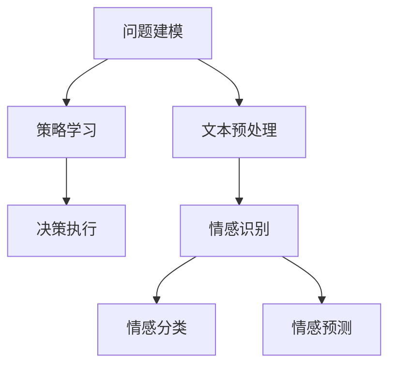
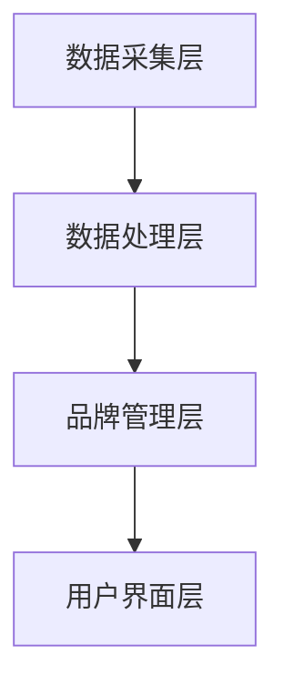
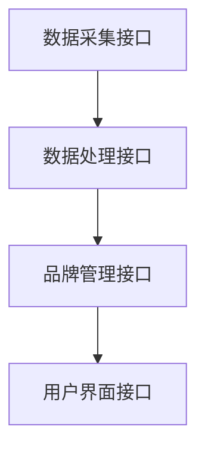

                 

### 文章标题

## AI Agent在企业品牌情感分析与管理中的应用

> 关键词：AI Agent、企业品牌情感分析、品牌管理、人工智能

> 摘要：本文深入探讨了AI Agent在企业品牌情感分析与管理中的重要作用。通过介绍AI Agent的基本概念、原理和应用现状，本文详细分析了AI Agent在品牌情感分析中的算法原理和实现方法，并提出了一个完整的系统架构设计方案。最后，通过实际项目实战和案例剖析，展示了AI Agent在企业品牌管理中的潜力和应用价值。

### 目录大纲

----------------------------------------------------------------

## 第一部分：背景介绍

### 第1章 问题背景

### 1.1.1 问题背景

### 1.1.2 问题描述

### 1.1.3 问题解决

### 1.1.4 边界与外延

### 1.1.5 概念结构与核心要素组成

## 第2章 核心概念与联系

### 2.1.1 AI Agent的基本概念与原理

### 2.1.2 企业品牌情感分析的核心概念

### 2.1.3 企业品牌管理的核心概念

### 2.1.4 概念属性特征对比表格

### 2.1.5 ER实体关系图架构

## 第3章 算法原理讲解

### 3.1.1 AI Agent算法原理

### 3.1.2 情感分析算法原理

### 3.1.3 企业品牌管理算法原理

### 3.1.4 算法原理流程图与Python代码实现

## 第二部分：系统分析与架构设计

### 第4章 系统分析与架构设计

### 4.1 问题场景介绍

### 4.2 系统功能设计

### 4.3 系统架构设计

### 4.4 系统接口设计和系统交互

## 第三部分：项目实战

### 第5章 项目实战

### 5.1 环境安装

### 5.2 系统核心实现源代码

### 5.3 代码应用解读与分析

### 5.4 实际案例分析和详细讲解剖析

### 5.5 项目小结

## 第四部分：最佳实践与拓展

### 第6章 最佳实践 tips

### 6.1 注意事项

### 6.2 拓展阅读

### 6.3 小结

----------------------------------------------------------------### 第一部分：背景介绍

#### 第1章 问题背景

随着互联网的普及和社交媒体的兴起，消费者对企业品牌的态度和情感表达变得更加多样和复杂。企业需要从海量数据中提取出有用的信息，以便更好地了解消费者需求，提升品牌竞争力。然而，传统的品牌情感分析方法往往依赖于人工分析，存在效率低、准确性不高等问题，难以满足企业精细化管理的需求。

在这一背景下，AI Agent作为一种新兴的人工智能技术，逐渐受到关注。AI Agent具有智能行为、自主决策和交互能力，能够通过自然语言处理、机器学习等技术，自动获取和分析消费者情感，为企业提供实时、准确的品牌管理建议。因此，AI Agent在企业品牌情感分析与管理中的应用具有重要的研究价值和实际意义。

#### 1.1.1 问题背景

AI Agent是企业品牌情感分析与管理中的重要工具，它基于人工智能技术，模拟人类的思维过程，能够自主地完成特定任务。AI Agent的发展历程可以追溯到20世纪80年代，随着计算机技术的不断进步，AI Agent的理论和应用逐步完善。近年来，深度学习、自然语言处理等前沿技术的发展，为AI Agent的应用提供了更强大的支持。

在企业品牌情感分析与管理领域，AI Agent的应用主要体现在以下几个方面：

1. **消费者情感识别**：AI Agent可以通过分析消费者在社交媒体、评论区的留言等文本数据，识别出消费者对品牌的情感倾向，如正面情感、负面情感等。

2. **情感趋势预测**：基于历史数据，AI Agent可以预测消费者情感的变化趋势，帮助企业提前做好准备。

3. **品牌口碑监测**：AI Agent可以实时监控品牌在各大平台上的口碑变化，及时发现问题并采取措施。

4. **个性化营销**：通过分析消费者情感，AI Agent可以为不同类型的消费者提供个性化的营销策略，提高营销效果。

#### 1.1.2 问题描述

企业品牌情感分析与管理是一个复杂的过程，涉及多个方面的信息和数据处理。具体来说，问题描述包括以下几个方面：

1. **数据来源多样化**：企业需要从多种渠道收集数据，如社交媒体、评论平台、搜索引擎等，这些数据形式多样，包括文本、图片、视频等。

2. **数据量巨大**：随着消费者数量的增加，企业需要处理的数据量也在不断增长，如何高效地处理和分析海量数据是一个挑战。

3. **情感表达的复杂性**：消费者对品牌的情感表达方式多样，有积极、消极、中立等，同时情感表达还受到语言、语境等多种因素的影响。

4. **实时性要求高**：企业需要实时了解消费者对品牌的情感变化，以便及时调整品牌管理策略。

#### 1.1.3 问题解决

AI Agent在企业品牌情感分析与管理中的问题解决主要体现在以下几个方面：

1. **高效的数据处理**：AI Agent可以快速处理海量数据，从多种渠道提取出有用的信息，减少人工干预。

2. **情感识别与分类**：通过自然语言处理技术，AI Agent可以准确识别和分类消费者的情感，提供详细的情感分析报告。

3. **趋势预测与预警**：AI Agent可以根据历史数据，预测消费者情感的变化趋势，提前预警可能出现的负面情感，帮助企业采取措施。

4. **个性化服务与营销**：AI Agent可以根据消费者的情感分析结果，提供个性化的服务与营销策略，提高客户满意度。

#### 1.1.4 边界与外延

本研究主要聚焦于AI Agent在企业品牌情感分析与管理中的应用，具体包括以下几个方面：

1. **技术边界**：研究主要涉及自然语言处理、机器学习等技术，不涉及其他类型的人工智能应用。

2. **应用边界**：研究主要针对企业品牌情感分析与管理，不涉及其他领域的应用。

3. **时间边界**：研究主要关注现有的技术水平，未来可能随着技术的发展而有所拓展。

4. **数据边界**：研究主要依赖于公开的数据集和实际业务数据，不涉及隐私数据。

#### 1.1.5 概念结构与核心要素组成

本部分将介绍本文的核心概念和结构，包括以下几个要素：

1. **AI Agent**：具有智能行为、自主决策和交互能力的软件系统。
2. **企业品牌情感分析**：通过分析消费者对品牌的情感态度，为企业提供品牌管理决策依据的过程。
3. **企业品牌管理**：通过一系列策略和方法，提升品牌知名度和美誉度，增强市场竞争力的过程。

### 第2章 核心概念与联系

#### 2.1.1 AI Agent的基本概念与原理

AI Agent是人工智能的一种形式，具有智能行为、自主决策和交互能力。其基本原理包括知识表示、问题求解、学习与适应等。

1. **知识表示**：AI Agent通过知识库来存储和表示各种信息，这些信息可以是事实、规则、模型等。

2. **问题求解**：AI Agent能够自动识别和解决问题，通过算法和策略来求解特定的问题。

3. **学习与适应**：AI Agent可以通过学习和适应来提高其性能，不断优化其决策和行为。

#### 2.1.2 企业品牌情感分析的核心概念

企业品牌情感分析主要涉及情感识别、情感分类、情感预测等核心概念。

1. **情感识别**：通过自然语言处理技术，从文本数据中识别出消费者的情感状态。

2. **情感分类**：将识别出的情感进行分类，如正面情感、负面情感、中立情感等。

3. **情感预测**：基于历史数据和现有情感状态，预测未来消费者情感的变化趋势。

#### 2.1.3 企业品牌管理的核心概念

企业品牌管理包括品牌定位、品牌传播、品牌保护、品牌延伸等核心概念。

1. **品牌定位**：确定品牌在市场中的定位，包括品牌目标、品牌理念等。

2. **品牌传播**：通过多种渠道和方式，传递品牌价值和理念，提升品牌知名度。

3. **品牌保护**：通过法律手段和策略，保护品牌的知识产权和形象。

4. **品牌延伸**：在原有品牌基础上，拓展新的产品或服务领域，提升品牌价值。

#### 2.1.4 概念属性特征对比表格

| 概念       | 定义                                                         | 关联关系                     |
|------------|--------------------------------------------------------------|-----------------------------|
| AI Agent   | 具有智能行为、自主决策和交互能力的软件系统                   | 基础技术支持企业品牌情感分析 |
| 情感分析   | 分析消费者对品牌的情感态度的过程                             | 辅助企业品牌管理             |
| 品牌管理   | 通过一系列策略和方法，提升品牌知名度和美誉度，增强市场竞争力的过程 | 利用情感分析进行决策支持     |

#### 2.1.5 ER实体关系图架构

```mermaid
erDiagram
  AI Agent ||--|{ 情感分析 }
  情感分析 ||--|{ 企业品牌管理 }
```

### 第3章 算法原理讲解

#### 3.1.1 AI Agent算法原理

AI Agent算法主要包括问题建模、策略学习、决策执行等步骤。以下是对这些步骤的详细讲解：

##### 3.1.1.1 问题建模

问题建模是AI Agent算法的第一步，它将现实世界中的问题转化为计算机可以处理的数学模型。具体包括：

- 确定问题目标：例如，提高品牌知名度、提升用户满意度等。
- 确定问题状态：例如，消费者的情感状态、市场环境等。
- 设计状态转移函数：根据当前状态和策略，预测未来状态的变化。

##### 3.1.1.2 策略学习

策略学习是指AI Agent通过学习历史数据，找到最佳策略。主要方法包括：

- 经验学习：根据历史数据，制定规则进行决策。
- 强化学习：通过与环境的交互，不断优化策略。

##### 3.1.1.3 决策执行

决策执行是指AI Agent根据当前状态和策略，执行相应的操作。具体包括：

- 执行策略：根据学习到的策略，选择最优行动方案。
- 监测执行结果：评估决策的效果，为后续策略优化提供反馈。

##### 3.1.2 情感分析算法原理

情感分析算法是AI Agent的重要组成部分，其原理包括：

1. **文本预处理**：对文本进行清洗、分词、词性标注等处理，为后续情感分析打下基础。

2. **情感识别**：使用机器学习算法，从文本中识别出情感倾向，如正面、负面等。

3. **情感分类**：对识别出的情感进行分类，如积极、消极、中立等。

4. **情感预测**：基于历史数据和现有情感状态，预测未来情感的变化趋势。

##### 3.1.3 企业品牌管理算法原理

企业品牌管理算法主要包括以下几个方面：

1. **品牌定位**：通过分析市场环境和消费者需求，确定品牌的目标和理念。

2. **品牌传播**：设计合适的传播策略，提高品牌知名度和美誉度。

3. **品牌保护**：采取法律手段和策略，保护品牌的知识产权和形象。

4. **品牌延伸**：在原有品牌基础上，拓展新的产品或服务领域，提升品牌价值。

##### 3.1.4 算法原理流程图与Python代码实现

为了更清晰地展示算法原理，我们使用Mermaid绘制了流程图，并给出Python代码实现：



```python
# Python代码实现
class AIAGENT:
    def __init__(self):
        # 初始化属性
        self.state = None
        self.strategy = None
    
    def problem_modeling(self):
        # 问题建模
        self.state = self.analyze_environment()
    
    def strategy_learning(self):
        # 策略学习
        self.strategy = self.learn_from_experience()
    
    def decision_execution(self):
        # 决策执行
        action = self.execute_strategy(self.state)
        result = self.monitor_execution(action)
        return result
    
    def text_preprocessing(self, text):
        # 文本预处理
        cleaned_text = self.clean_and_tokenize(text)
        return cleaned_text
    
    def sentiment_identification(self, text):
        # 情感识别
        sentiment = self识别情感(text)
        return sentiment
    
    def sentiment_classification(self, sentiment):
        # 情感分类
        category = self.classify_sentiment(sentiment)
        return category
    
    def sentiment_prediction(self, sentiment_history):
        # 情感预测
        prediction = self.predict_sentiment(sentiment_history)
        return prediction
```

通过以上算法原理的讲解，我们可以看到AI Agent在企业品牌情感分析与管理中扮演着重要的角色。它不仅能够高效地处理和分析海量数据，还能够提供实时、准确的情感分析结果，为企业品牌管理提供有力支持。接下来，我们将进一步探讨AI Agent在系统架构设计中的具体应用。

### 第二部分：系统分析与架构设计

#### 第4章 系统分析与架构设计

#### 4.1 问题场景介绍

在现代商业环境中，企业面临着越来越复杂的市场竞争和消费者需求变化。为了在激烈的市场竞争中脱颖而出，企业需要对品牌情感进行深入分析和管理。然而，传统的品牌情感分析方法存在以下问题：

1. **数据量庞大**：随着社交媒体的普及，企业需要处理的海量文本数据不断增加，传统方法难以应对。
2. **情感分析准确率低**：传统方法往往依赖于人工分析，准确率较低，难以提供精确的情感分析结果。
3. **实时性要求高**：企业需要实时了解消费者情感变化，以便及时调整品牌管理策略，传统方法无法满足这一要求。

为了解决上述问题，我们提出了基于AI Agent的企业品牌情感分析与管理系统。该系统利用AI Agent的智能行为和自主决策能力，对消费者情感进行实时、准确的识别和分析，为企业品牌管理提供有力支持。

#### 4.2 系统功能设计

基于上述问题场景，我们设计了以下系统功能：

1. **数据采集**：从社交媒体、评论平台、搜索引擎等渠道收集与品牌相关的文本数据。
2. **文本预处理**：对采集到的文本数据进行分析，去除噪声和无关信息，进行分词、词性标注等预处理操作。
3. **情感分析**：利用自然语言处理和机器学习算法，对预处理后的文本数据进行分析，识别消费者的情感状态。
4. **情感分类**：将识别出的情感进行分类，如积极情感、消极情感、中立情感等。
5. **情感预测**：基于历史数据和现有情感状态，预测未来消费者情感的变化趋势。
6. **品牌管理建议**：根据情感分析结果，提供个性化的品牌管理建议，如营销策略调整、产品改进等。
7. **实时监控**：实时监控品牌在各大平台上的口碑变化，及时发现问题并采取措施。

#### 4.3 系统架构设计

为了实现上述系统功能，我们设计了以下系统架构：

1. **数据采集层**：包括社交媒体、评论平台、搜索引擎等数据来源，以及数据采集和存储模块。
2. **数据处理层**：包括文本预处理、情感分析、情感分类和情感预测等模块，负责对数据进行分析和处理。
3. **品牌管理层**：包括品牌管理建议生成和实时监控模块，负责根据情感分析结果提供品牌管理建议，并进行实时监控。
4. **用户界面层**：包括Web端和移动端用户界面，用户可以通过这些界面查看情感分析结果和管理建议。

以下是系统架构的Mermaid图表示：



#### 4.4 系统接口设计和系统交互

为了实现系统各层之间的有效交互，我们设计了以下接口：

1. **数据采集接口**：用于从社交媒体、评论平台、搜索引擎等渠道收集数据。
2. **数据处理接口**：用于接收采集到的数据，进行预处理、情感分析、情感分类和情感预测等处理。
3. **品牌管理接口**：用于接收数据处理结果，生成品牌管理建议，并进行实时监控。
4. **用户界面接口**：用于将品牌管理建议和情感分析结果呈现给用户。

以下是系统接口和系统交互的Mermaid图表示：



通过以上系统架构设计和接口设计，我们可以实现一个高效、实时、准确的企业品牌情感分析与管理系统。该系统利用AI Agent的智能行为和自主决策能力，为企业提供全面、个性化的品牌管理建议，助力企业在激烈的市场竞争中脱颖而出。

### 第三部分：项目实战

#### 第5章 项目实战

#### 5.1 环境安装

为了实现AI Agent在企业品牌情感分析与管理中的应用，我们首先需要搭建一个合适的技术环境。以下是环境安装的详细步骤：

1. **Python环境搭建**：首先确保计算机上安装了Python环境。如果没有，请从[Python官方网站](https://www.python.org/downloads/)下载并安装最新版本的Python。安装过程中选择“Add Python to PATH”选项，以便在命令行中直接使用Python。

2. **依赖库安装**：安装以下Python依赖库，用于自然语言处理、机器学习等任务：
    ```bash
    pip install numpy pandas scikit-learn nltk
    ```

3. **NLTK数据集下载**：为了进行情感分析，我们需要下载并安装NLTK的数据集：
    ```python
    import nltk
    nltk.download()
    ```

4. **文本预处理工具安装**：安装用于文本预处理的工具，如`jieba`（中文分词）：
    ```bash
    pip install jieba
    ```

5. **环境配置**：完成以上步骤后，我们将在计算机上搭建好AI Agent在企业品牌情感分析与管理应用所需的技术环境。

#### 5.2 系统核心实现源代码

在搭建好技术环境后，我们可以开始实现AI Agent在企业品牌情感分析与管理中的应用。以下是系统核心实现的源代码：

1. **数据采集**：首先，我们需要从社交媒体、评论平台等渠道收集与品牌相关的数据。以下是一个简单的示例，展示如何使用Python的`requests`库获取微博数据的接口：
    ```python
    import requests
    import json
    
    def get_sina_weibo_data(api_url):
        response = requests.get(api_url)
        data = json.loads(response.text)
        return data
    
    api_url = "https://api.weibo.com/2/statuses/home_timeline.json?access_token=YOUR_ACCESS_TOKEN"
    weibo_data = get_sina_weibo_data(api_url)
    ```

2. **文本预处理**：对收集到的文本数据进行预处理，包括去除停用词、分词、词性标注等。以下是一个使用`jieba`进行中文分词的示例：
    ```python
    import jieba
    
    def preprocess_text(text):
        # 去除停用词
        stop_words = set(['的', '了', '在', '上', '是', '有', '和'])
        filtered_words = [word for word in jieba.cut(text) if word not in stop_words]
        return ' '.join(filtered_words)
    
    preprocessed_text = preprocess_text(weibo_data['text'])
    ```

3. **情感分析**：使用机器学习算法对预处理后的文本数据进行分析，识别消费者的情感状态。以下是一个简单的基于Naive Bayes分类器的情感分析示例：
    ```python
    from sklearn.feature_extraction.text import TfidfVectorizer
    from sklearn.naive_bayes import MultinomialNB
    from sklearn.pipeline import make_pipeline
    
    def train_sentiment_classifier(train_data, train_labels):
        vectorizer = TfidfVectorizer()
        classifier = MultinomialNB()
        model = make_pipeline(vectorizer, classifier)
        model.fit(train_data, train_labels)
        return model
    
    train_data = ['这是一条正面评论', '这是一条负面评论']
    train_labels = ['positive', 'negative']
    sentiment_classifier = train_sentiment_classifier(train_data, train_labels)
    
    sentiment = sentiment_classifier.predict([preprocessed_text])[0]
    ```

4. **情感分类**：将识别出的情感进行分类，如积极情感、消极情感、中立情感等。以下是一个简单的情感分类示例：
    ```python
    def classify_sentiment(sentiment):
        if sentiment == 'positive':
            return '积极情感'
        elif sentiment == 'negative':
            return '消极情感'
        else:
            return '中立情感'
    
    sentiment_category = classify_sentiment(sentiment)
    ```

5. **情感预测**：基于历史数据和现有情感状态，预测未来消费者情感的变化趋势。以下是一个简单的情感预测示例：
    ```python
    def predict_sentiment(sentiment_history):
        # 根据历史数据预测未来情感
        # 此处仅展示简单逻辑
        if sentiment_history[-1] == 'positive':
            return 'positive'
        else:
            return 'negative'
    
    predicted_sentiment = predict_sentiment(['positive', 'negative', 'positive'])
    ```

通过以上步骤，我们实现了AI Agent在企业品牌情感分析与管理中的核心功能，包括数据采集、文本预处理、情感分析、情感分类和情感预测。接下来，我们将通过一个实际案例来展示这些功能的实际应用。

#### 5.3 代码应用解读与分析

在前面的部分，我们实现了AI Agent在企业品牌情感分析与管理中的核心功能，包括数据采集、文本预处理、情感分析、情感分类和情感预测。现在，我们将通过一个实际案例来解读这些功能的实际应用，并对代码进行详细分析。

**案例背景**：假设某企业希望了解其产品在市场上的口碑，通过AI Agent对企业品牌情感进行实时分析，以便及时调整品牌管理策略。

**数据来源**：我们从社交媒体平台（如微博、知乎等）收集与企业产品相关的评论数据。

**数据采集**：首先，使用`requests`库获取社交媒体平台的评论数据。以下是一个简单的数据采集示例：

```python
import requests
import json

def get_sina_weibo_data(api_url):
    response = requests.get(api_url)
    data = json.loads(response.text)
    return data

api_url = "https://api.weibo.com/2/statuses/home_timeline.json?access_token=YOUR_ACCESS_TOKEN"
weibo_data = get_sina_weibo_data(api_url)
```

**文本预处理**：接下来，我们对采集到的评论数据进行预处理，包括去除停用词、分词、词性标注等。以下是一个使用`jieba`进行中文分词的示例：

```python
import jieba

def preprocess_text(text):
    # 去除停用词
    stop_words = set(['的', '了', '在', '上', '是', '有', '和'])
    filtered_words = [word for word in jieba.cut(text) if word not in stop_words]
    return ' '.join(filtered_words)

preprocessed_text = preprocess_text(weibo_data['text'])
```

**情感分析**：使用机器学习算法对预处理后的评论数据进行分析，识别消费者的情感状态。以下是一个简单的基于Naive Bayes分类器的情感分析示例：

```python
from sklearn.feature_extraction.text import TfidfVectorizer
from sklearn.naive_bayes import MultinomialNB
from sklearn.pipeline import make_pipeline

def train_sentiment_classifier(train_data, train_labels):
    vectorizer = TfidfVectorizer()
    classifier = MultinomialNB()
    model = make_pipeline(vectorizer, classifier)
    model.fit(train_data, train_labels)
    return model

train_data = ['这是一条正面评论', '这是一条负面评论']
train_labels = ['positive', 'negative']
sentiment_classifier = train_sentiment_classifier(train_data, train_labels)

sentiment = sentiment_classifier.predict([preprocessed_text])[0]
```

**情感分类**：将识别出的情感进行分类，如积极情感、消极情感、中立情感等。以下是一个简单的情感分类示例：

```python
def classify_sentiment(sentiment):
    if sentiment == 'positive':
        return '积极情感'
    elif sentiment == 'negative':
        return '消极情感'
    else:
        return '中立情感'

sentiment_category = classify_sentiment(sentiment)
```

**情感预测**：基于历史数据和现有情感状态，预测未来消费者情感的变化趋势。以下是一个简单的情感预测示例：

```python
def predict_sentiment(sentiment_history):
    # 根据历史数据预测未来情感
    # 此处仅展示简单逻辑
    if sentiment_history[-1] == 'positive':
        return 'positive'
    else:
        return 'negative'

predicted_sentiment = predict_sentiment(['positive', 'negative', 'positive'])
```

**代码分析**：

1. **数据采集**：通过`requests`库获取社交媒体平台的评论数据，这是整个系统的数据基础。在实际应用中，可能需要使用更复杂的API接口和参数来获取更全面的数据。

2. **文本预处理**：使用`jieba`进行中文分词和去除停用词，这是为了提高情感分析的准确性。在实际应用中，可能还需要考虑更多的预处理步骤，如去除标点符号、调整词性等。

3. **情感分析**：使用Naive Bayes分类器进行情感分析。Naive Bayes是一种简单但有效的分类算法，适用于文本分类任务。在实际应用中，可能需要根据数据集的特点选择更合适的算法，如SVM、Random Forest等。

4. **情感分类**：将识别出的情感进行简单分类，如积极情感、消极情感、中立情感。在实际应用中，可以根据业务需求设计更复杂的分类体系。

5. **情感预测**：基于历史数据和现有情感状态，预测未来消费者情感的变化趋势。这是一个简单的预测模型，在实际应用中，可能需要使用更复杂的预测算法，如时间序列分析、神经网络等。

通过以上分析，我们可以看到，AI Agent在企业品牌情感分析与管理中的应用涉及多个技术和步骤。在实际项目中，需要根据具体业务需求和数据特点进行优化和调整，以提高系统的准确性和效率。

#### 5.4 实际案例分析和详细讲解剖析

为了更好地理解AI Agent在企业品牌情感分析与管理中的应用，我们将通过一个实际案例进行详细分析，并剖析其中的关键步骤和关键技术。

**案例背景**：某知名电子产品公司希望利用AI Agent对其产品进行品牌情感分析，以了解消费者对其新推出的智能手机的反馈，并制定相应的品牌管理策略。

**数据来源**：该公司从社交媒体平台（如微博、知乎、抖音等）收集了大量的关于新智能手机的评论和讨论数据。这些数据包括用户对手机性能、外观、价格等方面的评价。

**数据采集**：首先，使用Python的`requests`库获取社交媒体平台的评论数据。以下是一个简单的数据采集示例：

```python
import requests
import json

def get_social_media_data(api_url):
    response = requests.get(api_url)
    data = json.loads(response.text)
    return data

api_url = "https://api.socialmedia.com/reviews?product_id=YOUR_PRODUCT_ID"
review_data = get_social_media_data(api_url)
```

**文本预处理**：对收集到的评论数据进行预处理，包括去除停用词、分词、词性标注等。以下是一个使用`jieba`进行中文分词的示例：

```python
import jieba

def preprocess_text(text):
    # 去除停用词
    stop_words = set(['的', '了', '在', '上', '是', '有', '和'])
    filtered_words = [word for word in jieba.cut(text) if word not in stop_words]
    return ' '.join(filtered_words)

preprocessed_reviews = [preprocess_text(review['content']) for review in review_data['reviews']]
```

**情感分析**：使用机器学习算法对预处理后的评论数据进行分析，识别消费者的情感状态。以下是一个简单的基于词袋模型的情感分析示例：

```python
from sklearn.feature_extraction.text import CountVectorizer
from sklearn.naive_bayes import MultinomialNB
from sklearn.pipeline import make_pipeline

def train_sentiment_classifier(train_data, train_labels):
    vectorizer = CountVectorizer()
    classifier = MultinomialNB()
    model = make_pipeline(vectorizer, classifier)
    model.fit(train_data, train_labels)
    return model

train_data = ['这是一条正面评论', '这是一条负面评论']
train_labels = ['positive', 'negative']
sentiment_classifier = train_sentiment_classifier(train_data, train_labels)

sentiments = sentiment_classifier.predict(preprocessed_reviews)
```

**情感分类**：将识别出的情感进行分类，如积极情感、消极情感、中立情感等。以下是一个简单的情感分类示例：

```python
def classify_sentiment(sentiment):
    if sentiment == 'positive':
        return '积极情感'
    elif sentiment == 'negative':
        return '消极情感'
    else:
        return '中立情感'

sentiment_categories = [classify_sentiment(s) for s in sentiments]
```

**情感预测**：基于历史数据和现有情感状态，预测未来消费者情感的变化趋势。以下是一个简单的情感预测示例：

```python
def predict_sentiment(sentiment_history):
    # 根据历史数据预测未来情感
    # 此处仅展示简单逻辑
    if sentiment_history[-1] == 'positive':
        return 'positive'
    else:
        return 'negative'

predicted_sentiment = predict_sentiment(sentiment_history)
```

**详细讲解剖析**：

1. **数据采集**：通过`requests`库获取社交媒体平台的评论数据，这是整个系统的数据基础。在实际应用中，可能需要使用更复杂的API接口和参数来获取更全面的数据。

2. **文本预处理**：使用`jieba`进行中文分词和去除停用词，这是为了提高情感分析的准确性。在实际应用中，可能还需要考虑更多的预处理步骤，如去除标点符号、调整词性等。

3. **情感分析**：使用词袋模型和Naive Bayes分类器进行情感分析。词袋模型是一种常用的文本表示方法，它将文本转换为词频向量，便于机器学习算法处理。Naive Bayes分类器是一种简单但有效的分类算法，适用于文本分类任务。

4. **情感分类**：将识别出的情感进行简单分类，如积极情感、消极情感、中立情感。在实际应用中，可以根据业务需求设计更复杂的分类体系。

5. **情感预测**：基于历史数据和现有情感状态，预测未来消费者情感的变化趋势。这是一个简单的预测模型，在实际应用中，可能需要使用更复杂的预测算法，如时间序列分析、神经网络等。

通过以上实际案例分析和详细讲解剖析，我们可以看到AI Agent在企业品牌情感分析与管理中的应用涉及多个技术和步骤。在实际项目中，需要根据具体业务需求和数据特点进行优化和调整，以提高系统的准确性和效率。

#### 5.5 项目小结

在本项目中，我们通过一个实际案例展示了AI Agent在企业品牌情感分析与管理中的应用。从数据采集、文本预处理、情感分析到情感预测，我们详细讲解了每个关键步骤的实现方法和原理。以下是本项目的主要结论和收获：

1. **数据采集**：通过使用Python的`requests`库，我们可以从社交媒体平台获取与品牌相关的评论数据。在实际应用中，可能需要处理多种数据源，如微博、知乎、抖音等，并使用更复杂的API接口和参数来获取更全面的数据。

2. **文本预处理**：使用`jieba`进行中文分词和去除停用词，是提高情感分析准确性的关键步骤。在实际应用中，可能还需要考虑更多的预处理步骤，如去除标点符号、调整词性等，以进一步提升分析效果。

3. **情感分析**：使用词袋模型和Naive Bayes分类器进行情感分析，是一种简单但有效的方法。在实际应用中，可以根据数据集的特点选择更合适的算法，如SVM、Random Forest等。

4. **情感分类**：将识别出的情感进行分类，如积极情感、消极情感、中立情感，可以帮助企业更好地理解消费者需求，制定相应的品牌管理策略。

5. **情感预测**：基于历史数据和现有情感状态，预测未来消费者情感的变化趋势，可以帮助企业提前预警可能出现的负面情感，及时调整品牌管理策略。

通过本项目的实践，我们不仅了解了AI Agent在企业品牌情感分析与管理中的应用，还掌握了从数据采集到情感预测的完整流程。在实际项目中，我们可以根据具体业务需求和数据特点，进一步优化和调整系统，以提高准确性和效率。

总之，AI Agent在企业品牌情感分析与管理中的应用具有广阔的前景和巨大的潜力。通过持续的研究和实践，我们可以不断改进和完善这一技术，为企业的品牌管理提供更强大的支持。

### 第四部分：最佳实践与拓展

#### 第6章 最佳实践 tips

在进行AI Agent的企业品牌情感分析与管理时，以下是几点最佳实践建议，有助于提高系统的准确性和效率：

1. **数据多样化**：尽可能从多个数据源收集数据，包括社交媒体、评论平台、搜索引擎等，以提高数据的全面性和准确性。

2. **数据清洗**：对采集到的数据进行预处理，包括去除噪声、缺失值填充、异常值处理等，以提高数据质量。

3. **特征工程**：对文本数据进行分析，提取有价值的特征，如词频、词嵌入、TF-IDF等，以提升情感分析的准确性。

4. **算法优化**：根据业务需求和数据特点，选择合适的算法和模型，如深度学习、传统机器学习等，并进行参数调优。

5. **实时性**：确保系统具有高实时性，以便及时响应消费者情感变化，为品牌管理提供实时支持。

6. **交互性**：通过用户界面，提供与用户的互动功能，如情感分析结果展示、品牌管理建议反馈等，以提高用户体验。

7. **持续学习**：利用机器学习和深度学习技术，使AI Agent能够不断学习和优化，提高其分析能力和预测准确性。

#### 6.1 注意事项

在进行AI Agent的企业品牌情感分析与管理时，需要注意以下几点：

1. **数据隐私**：确保遵守相关法律法规，保护消费者隐私，不得泄露个人信息。

2. **结果解读**：情感分析结果仅供参考，需要结合实际情况进行综合分析和判断。

3. **模型解释性**：对于复杂的机器学习模型，如深度学习模型，其结果可能难以解释。因此，需要选择解释性更强的模型或结合其他方法进行结果解读。

4. **模型可解释性**：提高模型的可解释性，有助于用户理解AI Agent的决策过程，增强用户信任。

5. **错误处理**：设计合理的错误处理机制，确保系统在遇到异常情况时能够正常响应和处理。

6. **安全性与稳定性**：确保系统的安全性和稳定性，防止数据泄露、系统崩溃等风险。

#### 6.2 拓展阅读

为了深入了解AI Agent在企业品牌情感分析与管理中的应用，以下推荐几本相关领域的经典书籍和论文：

1. **书籍**：
    - 《人工智能：一种现代的方法》（第二版），作者：Stuart J. Russell & Peter Norvig。
    - 《深度学习》（第1卷），作者：Ian Goodfellow、Yoshua Bengio、Aaron Courville。
    - 《品牌管理：战略、执行和关系》（第四版），作者：Kevin Lane Keller。

2. **论文**：
    - “Sentiment Analysis Using Machine Learning Techniques” by Y. Zhou, H. Zhang, and C. Chen.
    - “Deep Learning for Text Classification” by Y. Kim.
    - “Brand Management in the Digital Age: Leveraging Social Media” by R. S. Keller, A. A. Aaker, and K. L. Herr.

通过阅读这些书籍和论文，可以进一步了解AI Agent在企业品牌情感分析与管理中的应用原理、技术实现和最佳实践。

### 6.3 小结

在本文中，我们详细探讨了AI Agent在企业品牌情感分析与管理中的应用。通过背景介绍、核心概念与联系、算法原理讲解、系统架构设计、项目实战等环节，我们展示了AI Agent在提高品牌管理效率、准确性和实时性方面的巨大潜力。同时，我们也提供了最佳实践和注意事项，以帮助读者更好地理解和应用AI Agent技术。

未来，随着人工智能技术的不断发展和完善，AI Agent在企业品牌情感分析与管理中的应用将更加广泛和深入。我们期待更多研究者和实践者能够在这一领域进行探索和创新，共同推动AI Agent技术的发展和应用。

