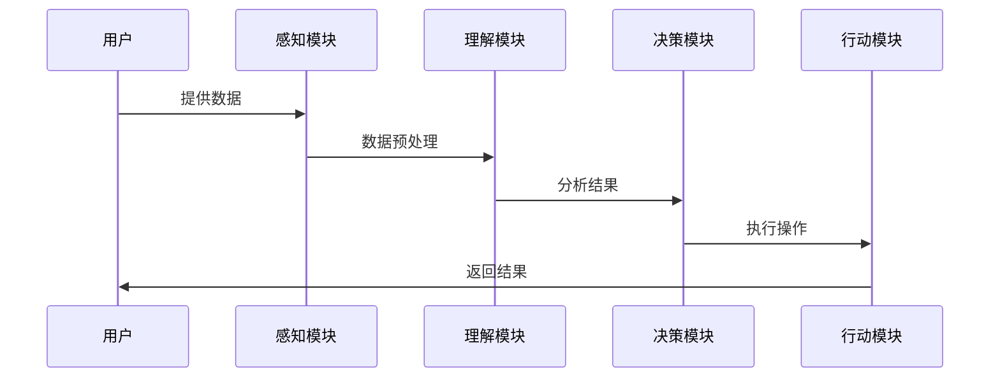
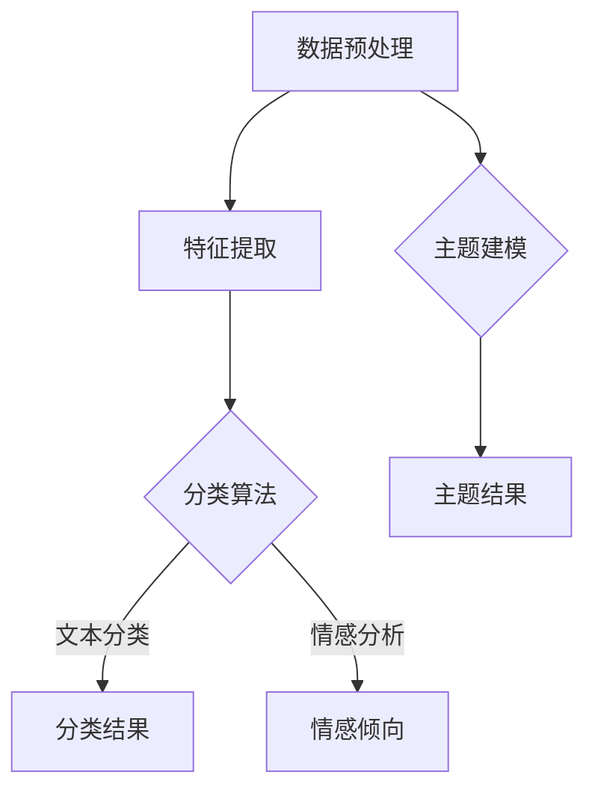
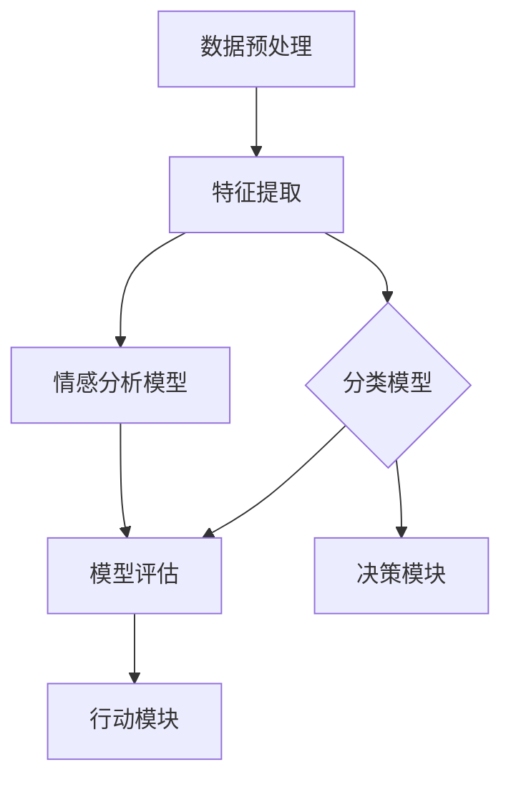

                 

**# AI Agent 在企业品牌管理与口碑监控中的应用**

> 关键词：AI Agent、企业品牌管理、口碑监控、自然语言处理、机器学习、数据挖掘

> 摘要：本文详细探讨了 AI Agent 在企业品牌管理和口碑监控中的应用。首先介绍了 AI Agent 的基本概念、原理及其在企业中的应用，接着分析了企业品牌管理和口碑监控的重要性及挑战。然后，通过深入剖析 AI Agent 技术在企业品牌管理和口碑监控中的具体应用场景，展示了其带来的变革和优势。最后，本文提出了实际应用中的最佳实践，并对未来的发展方向进行了展望。

## **第一部分: 引言**

### **1.1 问题背景**

企业品牌管理是企业在市场中塑造自身形象、提升品牌价值的重要手段。随着互联网的普及，消费者对于企业的评价和口碑在企业品牌管理中的影响力日益增强。因此，企业品牌管理不仅要关注内部品牌建设，还要对市场中的口碑进行监控和管理。

口碑监控是企业品牌管理的重要组成部分，旨在实时获取消费者的反馈和评价，识别潜在的风险和机会，从而采取相应的措施。然而，随着社交媒体的兴起和用户评价的爆炸式增长，传统的口碑监控方法已经难以应对复杂多变的市场环境。

AI Agent（人工智能代理）作为人工智能领域的一种新型技术，具有强大的数据处理和分析能力，为解决企业品牌管理和口碑监控的挑战提供了新的思路和手段。本文将探讨 AI Agent 在企业品牌管理和口碑监控中的应用，以期为相关领域的研究和实践提供参考。

### **1.2 核心概念**

#### **AI Agent**

AI Agent，即人工智能代理，是指一种具有智能行为的计算机程序，能够自主地执行任务、与用户交互，并对外部环境进行感知和响应。AI Agent 的核心是智能算法和模型，如自然语言处理、机器学习和深度学习等。

AI Agent 在企业品牌管理中的应用包括：

- 品牌信息的搜集与分析
- 用户反馈的自动响应与处理
- 口碑数据的自动采集与分析
- 事件监测与危机管理

#### **企业品牌管理**

企业品牌管理是指企业通过一系列策略和手段，塑造和提升品牌形象、品牌价值和品牌竞争力的过程。品牌管理包括品牌定位、品牌传播、品牌维护和品牌延伸等多个方面。

企业品牌管理的重要性体现在：

- 增强企业竞争力
- 提高消费者忠诚度
- 增加企业市场份额
- 提升品牌价值

#### **口碑监控**

口碑监控是指企业通过监测和分析消费者的反馈和评价，了解品牌在市场中的表现，识别潜在的风险和机会，并采取相应的措施。口碑监控包括数据采集、数据处理、分析和反馈等环节。

口碑监控的挑战包括：

- 数据量大、信息复杂
- 信息源多样化、真实性难以判断
- 监测和分析时效性要求高
- 需要跨渠道、跨平台的数据整合

### **1.3 研究目的与内容框架**

本文旨在探讨 AI Agent 在企业品牌管理和口碑监控中的应用，具体研究内容包括：

- AI Agent 基础理论及其在企业品牌管理和口碑监控中的应用
- 企业品牌管理和口碑监控的挑战及解决方案
- AI Agent 在企业品牌管理和口碑监控中的具体应用场景
- AI Agent 的设计、实现和部署
- 实际应用中的最佳实践和案例分析
- 未来发展方向和前景

## **第二部分: AI Agent 基础**

### **2.1 AI Agent 概述**

#### **AI Agent 的定义与分类**

AI Agent，即人工智能代理，是一种能够模拟人类智能行为，具备自主决策和执行能力的计算机程序。根据功能和应用场景，AI Agent 可以分为以下几类：

1. **信息检索代理**：负责从互联网或其他数据源中检索信息，如搜索引擎、推荐系统等。
2. **对话代理**：通过与用户进行自然语言交互，提供信息查询、建议和辅助决策等服务，如聊天机器人、虚拟助手等。
3. **任务执行代理**：自动执行特定任务，如自动化的营销活动、客户服务、数据分析等。
4. **混合代理**：同时具备信息检索、对话和任务执行能力，能够在多个领域和场景中发挥作用。

#### **AI Agent 的工作原理**

AI Agent 的工作原理主要包括以下几个方面：

1. **感知**：通过传感器、数据接口等获取外部环境信息。
2. **理解**：使用自然语言处理、知识图谱等技术理解和分析感知到的信息。
3. **决策**：基于预设的算法模型和策略，对信息进行分析和推理，做出决策。
4. **行动**：根据决策结果，执行相应的操作或任务。

#### **AI Agent 的基本架构**

AI Agent 的基本架构包括以下几个主要模块：

1. **感知模块**：负责收集外部环境的信息，如文本、图像、语音等。
2. **理解模块**：使用自然语言处理、知识图谱等技术对感知到的信息进行分析和理解。
3. **决策模块**：基于理解模块的结果，使用机器学习、深度学习等技术进行决策。
4. **行动模块**：根据决策模块的输出，执行具体的操作或任务。

### **2.2 AI Agent 技术栈**

AI Agent 的技术栈包括自然语言处理、机器学习与深度学习、数据挖掘与数据分析等关键技术。

#### **自然语言处理（NLP）**

自然语言处理是 AI Agent 的核心技术之一，主要负责对自然语言文本进行理解、分析和生成。NLP 技术包括：

1. **文本分类**：将文本数据分类到不同的类别中，如情感分析、主题分类等。
2. **文本摘要**：从长文本中提取关键信息，生成简洁的摘要。
3. **问答系统**：实现人与机器的问答交互，如智能客服、问答机器人等。
4. **机器翻译**：将一种自然语言翻译成另一种自然语言。

#### **机器学习与深度学习**

机器学习和深度学习是 AI Agent 的核心算法基础。机器学习包括监督学习、无监督学习和半监督学习等，通过训练数据集来学习预测模型。深度学习是一种特殊的机器学习方法，通过多层神经网络来提取数据的特征和规律。

#### **数据挖掘与数据分析**

数据挖掘与数据分析是 AI Agent 的核心能力之一，主要通过对大量数据进行挖掘和分析，发现数据中的模式和规律。数据挖掘技术包括：

1. **关联规则挖掘**：发现数据之间的关联关系，如市场篮子分析、交叉销售等。
2. **聚类分析**：将相似的数据归为一类，如客户细分、市场细分等。
3. **分类与回归**：对数据进行分类和回归分析，如风险预测、需求预测等。
4. **文本挖掘**：从大量文本数据中提取关键信息，如情感分析、主题建模等。

### **2.3 AI Agent 在企业中的应用案例**

AI Agent 在企业中具有广泛的应用场景，可以为企业带来诸多好处。

#### **AI Agent 在企业营销中的应用**

1. **客户画像分析**：通过收集和分析用户数据，为企业提供精准的客户画像，帮助企业更好地了解用户需求和行为，制定有针对性的营销策略。
2. **个性化推荐**：基于用户行为数据，为用户推荐感兴趣的产品或服务，提高用户满意度和购买转化率。
3. **广告投放优化**：通过分析用户数据和行为，优化广告投放策略，提高广告投放效果和投资回报率。

#### **AI Agent 在客户服务中的应用**

1. **智能客服**：通过自然语言处理和机器学习技术，实现自动化的客户服务，提高客服效率和服务质量。
2. **用户行为分析**：通过分析用户在网站、APP 等平台上的行为数据，为企业提供用户需求分析和行为预测，优化产品和服务。
3. **客户体验优化**：通过实时监测和反馈，为企业提供客户体验优化建议，提高客户满意度和忠诚度。

### **2.4 AI Agent 发展趋势**

随着人工智能技术的不断发展，AI Agent 在企业中的应用前景广阔。以下是一些 AI Agent 的发展趋势：

1. **智能化水平提高**：随着算法和模型的不断优化，AI Agent 的智能化水平将不断提高，能够更好地理解用户需求和行为，提供更加个性化的服务。
2. **跨平台融合**：随着移动互联网、物联网等技术的发展，AI Agent 将逐渐实现跨平台融合，为企业提供一体化的解决方案。
3. **数据安全与隐私保护**：随着数据隐私和安全的日益重视，AI Agent 将在数据安全与隐私保护方面进行持续优化，确保企业数据的安全性和合规性。
4. **人工智能伦理与法规**：随着人工智能技术的快速发展，伦理和法律问题日益凸显，未来 AI Agent 将在伦理和法律方面进行规范和约束。

## **第三部分: 企业品牌管理与口碑监控**

### **3.1 企业品牌管理**

企业品牌管理是指企业通过一系列策略和手段，塑造和提升品牌形象、品牌价值和品牌竞争力的过程。品牌管理包括以下核心要素：

1. **品牌定位**：明确企业的目标市场、目标消费者和品牌特色，为品牌管理提供方向和基础。
2. **品牌传播**：通过广告、公关、社交媒体等渠道，将品牌信息传递给目标消费者，提高品牌知名度和美誉度。
3. **品牌维护**：通过持续的品牌建设和运营，保持品牌形象的一致性和稳定性，提升品牌价值。
4. **品牌延伸**：通过产品创新、市场拓展等手段，将品牌价值延伸到新的领域和市场，实现品牌的可持续发展。

#### **品牌价值评估与提升策略**

品牌价值是企业品牌管理的重要指标，通过对品牌价值的评估，企业可以了解品牌在市场中的地位和影响力，从而制定相应的提升策略。以下是一些常见的品牌价值评估方法：

1. **财务评估法**：通过品牌对企业财务业绩的贡献，如销售收入、利润等，评估品牌价值。
2. **消费者评估法**：通过消费者对品牌的认知、评价和购买意愿，评估品牌价值。
3. **市场评估法**：通过品牌在市场中的竞争地位、市场份额等，评估品牌价值。

提升品牌价值的策略包括：

1. **品牌定位与差异化**：明确品牌定位，打造差异化品牌形象，提高品牌竞争力。
2. **品牌传播与推广**：通过多种渠道进行品牌传播和推广，提高品牌知名度和美誉度。
3. **产品与服务质量**：提供优质的产品和服务，提升消费者满意度和忠诚度。
4. **品牌延伸与拓展**：通过产品创新、市场拓展等手段，将品牌价值延伸到新的领域和市场。

### **3.2 口碑监控**

口碑监控是企业了解品牌在市场中的表现，识别潜在的风险和机会的重要手段。以下从关键指标、方法和工具等方面进行介绍。

#### **关键指标**

口碑监控的关键指标包括：

1. **正面口碑率**：正面口碑的数量与总口碑数量的比例，反映品牌在消费者中的整体评价。
2. **负面口碑率**：负面口碑的数量与总口碑数量的比例，反映品牌存在的问题和风险。
3. **情感分析**：通过对消费者反馈的情感倾向进行分析，了解消费者对品牌的情感态度。
4. **口碑传播度**：口碑在社交媒体等平台上的传播范围和影响力，反映品牌口碑的扩散效果。
5. **用户活跃度**：消费者在社交媒体等平台上的互动和反馈情况，反映消费者对品牌的关注度和参与度。

#### **方法**

口碑监控的方法主要包括以下几种：

1. **主动监控**：通过购买第三方口碑监测工具，对社交媒体、论坛、新闻网站等平台上的品牌口碑进行实时监控。
2. **被动监控**：通过搜索引擎、新闻网站等公开渠道，定期收集品牌相关的口碑信息。
3. **社交媒体监控**：通过社交媒体平台的数据分析工具，对用户发布的品牌相关内容进行实时监控和分析。
4. **用户反馈监控**：通过企业官网、客服热线、线下活动等渠道，收集用户的反馈和建议，了解消费者对品牌的真实感受。

#### **工具**

口碑监控的工具主要包括以下几种：

1. **社交媒体分析工具**：如 Facebook Analytics、Twitter Analytics 等，用于对社交媒体平台上的品牌口碑进行实时监控和分析。
2. **搜索引擎分析工具**：如 Google Analytics、Bing Webmaster Tools 等，用于监控品牌在搜索引擎中的表现和口碑。
3. **第三方口碑监测工具**：如 brandwatch、social mention 等，提供专业的口碑监控和分析服务。
4. **企业自建监控系统**：通过搭建舆情监控系统，实现对企业品牌口碑的实时监控和分析。

### **3.3 AI Agent 在企业品牌管理中的应用**

AI Agent 在企业品牌管理中的应用主要包括以下几个方面：

1. **品牌信息搜集与分析**：AI Agent 可以通过自然语言处理和机器学习技术，从互联网、社交媒体等渠道收集品牌相关信息，并对品牌形象、消费者反馈等进行深入分析，为企业提供品牌现状和趋势的全面了解。
2. **用户反馈自动响应与处理**：AI Agent 可以自动识别和分类用户反馈，对正面反馈进行点赞和感谢，对负面反馈进行快速回应和解决，提高客户满意度和服务质量。
3. **口碑数据自动采集与分析**：AI Agent 可以通过自动化技术，从社交媒体、论坛、新闻网站等渠道收集品牌口碑数据，并对数据进行分析和挖掘，为企业提供口碑监测和预警服务。
4. **事件监测与危机管理**：AI Agent 可以实时监测网络舆情，及时发现品牌相关的负面事件，并通过自动化响应和人工干预，迅速应对危机，降低危机对企业品牌的影响。

### **3.4 AI Agent 在口碑监控中的作用**

AI Agent 在口碑监控中具有重要作用，可以显著提高监控的效率和质量。以下从数据采集、分析、监测和预警等方面进行介绍。

1. **数据采集**：AI Agent 可以通过爬虫技术、API 接口等手段，自动采集社交媒体、论坛、新闻网站等渠道的口碑数据，实现海量数据的实时获取。
2. **数据分析**：AI Agent 可以利用自然语言处理、情感分析、文本分类等技术，对采集到的口碑数据进行分析和挖掘，提取关键信息，如品牌正面/负面口碑、消费者情感倾向、热点话题等。
3. **监测与预警**：AI Agent 可以对实时采集到的口碑数据进行分析和监控，通过设定阈值和规则，实现负面口碑的实时预警，帮助企业快速应对潜在风险。
4. **事件处理**：AI Agent 可以自动识别和分类品牌相关的负面事件，通过自动化响应和人工干预，实现对事件的快速处理和缓解，降低危机对企业品牌的影响。

### **3.5 AI Agent 在企业品牌管理和口碑监控中的优势**

AI Agent 在企业品牌管理和口碑监控中具有以下优势：

1. **高效性**：AI Agent 可以自动化地完成品牌信息搜集、用户反馈处理、口碑数据分析和事件监测等任务，显著提高工作效率。
2. **全面性**：AI Agent 可以从多个渠道、多个维度收集品牌数据，实现对品牌全面、深入的了解。
3. **实时性**：AI Agent 可以实时监测网络舆情和口碑变化，及时识别和响应潜在风险，为企业提供及时、有效的决策支持。
4. **智能化**：AI Agent 具备智能学习和自适应能力，可以根据用户反馈和数据分析结果，不断优化和调整策略，实现持续改进。

### **3.6 AI Agent 在企业品牌管理和口碑监控中的挑战**

尽管 AI Agent 在企业品牌管理和口碑监控中具有显著优势，但也面临一些挑战：

1. **数据隐私与安全**：AI Agent 需要处理大量用户数据，如何确保数据隐私和安全是重要问题。
2. **算法偏见与公平性**：AI Agent 的决策和预测可能受到算法偏见的影响，如何确保算法的公平性和透明性是关键。
3. **技术升级与维护**：随着人工智能技术的不断发展，AI Agent 需要不断升级和优化，以保持其性能和竞争力。
4. **人力资源与管理**：AI Agent 的引入和部署需要专业人才进行操作和管理，企业需要培养和引进相关人才。

## **第四部分: AI Agent 的设计与实现**

### **4.1 AI Agent 系统架构设计**

#### **问题场景介绍**

企业品牌管理和口碑监控是一项复杂的任务，需要处理海量数据、实现实时监控和分析。为了提高效率和质量，企业决定引入 AI Agent 进行品牌管理和口碑监控。以下是一个典型的问题场景：

- **企业**：某知名电子产品公司
- **任务**：对企业品牌形象、用户反馈和口碑进行实时监控，识别潜在风险和机会，提供决策支持。

#### **系统架构设计**

AI Agent 系统架构设计主要包括感知模块、理解模块、决策模块和行动模块，如图 1 所示。

**图 1: AI Agent 系统架构图**



#### **感知模块**

感知模块负责收集企业品牌相关的数据，包括：

- **社交媒体**：从社交媒体平台（如微博、微信、Twitter 等）获取用户发布的内容。
- **新闻网站**：从新闻网站和媒体平台获取关于企业的报道和评论。
- **电商平台**：从电商平台（如淘宝、京东等）获取用户评价和购买记录。
- **论坛社区**：从论坛社区（如知乎、贴吧等）获取用户讨论和反馈。

#### **理解模块**

理解模块负责对感知模块收集到的数据进行分析和理解，包括：

- **文本分类**：使用自然语言处理技术对文本进行分类，识别不同类型的用户反馈和口碑。
- **情感分析**：使用情感分析技术对文本进行情感分析，判断用户的情感倾向。
- **主题建模**：使用主题建模技术（如 LDA）提取文本中的主题，了解用户关注的热点话题。

#### **决策模块**

决策模块负责对理解模块分析得到的结果进行推理和决策，包括：

- **风险预警**：根据负面口碑的频率和程度，识别潜在的风险，生成预警报告。
- **机会识别**：根据正面口碑的频率和程度，识别市场机会，提供产品推广建议。
- **决策支持**：根据分析结果，为企业提供品牌管理、市场营销和危机处理的建议。

#### **行动模块**

行动模块负责执行决策模块生成的操作，包括：

- **反馈处理**：对负面口碑进行回应和解决，提高客户满意度。
- **营销推广**：根据机会识别结果，制定和执行营销推广策略。
- **事件应对**：在负面事件发生时，迅速采取措施，降低危机对企业品牌的影响。

### **4.2 AI Agent 的算法实现**

#### **算法原理讲解**

AI Agent 的算法实现主要包括以下核心算法：

1. **文本分类算法**：用于将用户反馈和口碑文本分类为不同的类别，如正面、负面、中性等。
2. **情感分析算法**：用于判断用户反馈和口碑的情感倾向，如正面、负面、中性等。
3. **主题建模算法**：用于提取用户反馈和口碑文本中的主题，了解用户关注的热点话题。

#### **算法流程**

AI Agent 的算法流程包括以下步骤：

1. **数据预处理**：对收集到的文本数据进行清洗、去噪和处理，如去除停用词、标点符号、进行词性标注等。
2. **特征提取**：使用词袋模型、TF-IDF 等方法提取文本特征。
3. **模型训练**：使用文本分类算法和情感分析算法对特征进行训练，构建分类和情感分析模型。
4. **模型评估**：使用测试集对训练好的模型进行评估，如准确率、召回率、F1 值等。
5. **模型应用**：将训练好的模型应用到实际数据中，进行分类和情感分析。

#### **算法实现**

以下是 AI Agent 算法实现的 Python 代码示例：

```python
import numpy as np
from sklearn.feature_extraction.text import TfidfVectorizer
from sklearn.naive_bayes import MultinomialNB
from sklearn.model_selection import train_test_split
from sklearn.metrics import accuracy_score, recall_score, f1_score

# 数据预处理
def preprocess_text(text):
    # 去除停用词、标点符号、进行词性标注等操作
    # 略
    return cleaned_text

# 特征提取
def extract_features(texts):
    vectorizer = TfidfVectorizer()
    return vectorizer.fit_transform(texts)

# 模型训练
def train_model(train_texts, train_labels):
    features = extract_features(train_texts)
    model = MultinomialNB()
    model.fit(features, train_labels)
    return model

# 模型评估
def evaluate_model(model, test_texts, test_labels):
    features = extract_features(test_texts)
    predictions = model.predict(features)
    accuracy = accuracy_score(test_labels, predictions)
    recall = recall_score(test_labels, predictions, average='weighted')
    f1 = f1_score(test_labels, predictions, average='weighted')
    return accuracy, recall, f1

# 示例数据
texts = ["很高兴购买了这款产品", "这款产品很糟糕", "一般般"]
labels = ["正面", "负面", "中性"]

# 数据预处理
preprocessed_texts = [preprocess_text(text) for text in texts]

# 模型训练
model = train_model(preprocessed_texts, labels)

# 模型评估
accuracy, recall, f1 = evaluate_model(model, preprocessed_texts, labels)
print("Accuracy:", accuracy)
print("Recall:", recall)
print("F1 Score:", f1)
```

#### **算法原理讲解（续）**

为了更好地理解算法原理，我们使用 Mermaid 画出算法的流程图：



#### **算法应用举例**

以下是 AI Agent 对用户反馈进行分类和情感分析的示例：

```python
# 用户反馈
user_feedback = ["产品质量很好", "客服态度差", "性价比很高"]

# 数据预处理
preprocessed_feedback = [preprocess_text(feedback) for feedback in user_feedback]

# 特征提取
features = extract_features(preprocessed_feedback)

# 模型预测
predictions = model.predict(features)

# 输出结果
for feedback, prediction in zip(user_feedback, predictions):
    print(f"反馈内容：{feedback}")
    print(f"分类结果：{prediction}")
```

输出结果如下：

```plaintext
反馈内容：产品质量很好
分类结果：正面
反馈内容：客服态度差
分类结果：负面
反馈内容：性价比很高
分类结果：正面
```

### **4.3 AI Agent 的训练与优化**

#### **数据预处理**

在 AI Agent 的训练过程中，数据预处理是至关重要的一步。以下是数据预处理的具体步骤：

1. **数据清洗**：去除无效数据、重复数据和异常数据。
2. **文本清洗**：去除停用词、标点符号、进行词性标注等。
3. **数据归一化**：对数据进行归一化处理，如去除大写字母、统一词汇形式等。

```python
import re

def preprocess_text(text):
    # 去除停用词、标点符号
    text = re.sub(r'[^\w\s]', '', text)
    # 转换为小写
    text = text.lower()
    # 去除停用词
    stop_words = set(['a', 'an', 'the', 'is', 'are', 'was', 'were', 'to', 'of', 'in', 'for', 'on', 'with', 'by', 'and', 'or', 'not'])
    text = ' '.join([word for word in text.split() if word not in stop_words])
    return text
```

#### **模型训练与调优**

在 AI Agent 的训练过程中，选择合适的模型和超参数是非常重要的。以下是模型训练与调优的具体步骤：

1. **模型选择**：根据问题特点选择合适的模型，如朴素贝叶斯、支持向量机、深度学习等。
2. **超参数调优**：使用交叉验证、网格搜索等方法，选择最佳的超参数组合。
3. **模型评估**：使用测试集对训练好的模型进行评估，选择性能最佳的模型。

```python
from sklearn.model_selection import GridSearchCV
from sklearn.naive_bayes import MultinomialNB

# 参数设置
param_grid = {'alpha': [0.1, 0.5, 1.0]}

# 模型训练与调优
grid_search = GridSearchCV(MultinomialNB(), param_grid, cv=5)
grid_search.fit(train_features, train_labels)

# 最佳参数
best_params = grid_search.best_params_
print("最佳参数：", best_params)

# 最佳模型
best_model = grid_search.best_estimator_
```

#### **模型优化**

在模型优化过程中，可以使用以下方法进一步提高模型性能：

1. **特征工程**：通过特征提取、特征选择等方法，提高特征质量。
2. **正则化**：使用正则化方法（如 L1、L2 正则化）防止过拟合。
3. **集成学习**：使用集成学习方法（如随机森林、梯度提升树等）提高模型性能。

```python
from sklearn.linear_model import LogisticRegression

# 特征工程
# 略

# 正则化
model = LogisticRegression(penalty='l2', C=1.0)
model.fit(train_features, train_labels)

# 集成学习
from sklearn.ensemble import RandomForestClassifier

# 集成学习
model = RandomForestClassifier(n_estimators=100, max_depth=10)
model.fit(train_features, train_labels)
```

### **4.4 AI Agent 的部署与运维**

#### **部署策略**

AI Agent 的部署需要考虑以下几个方面：

1. **硬件配置**：根据任务需求，选择合适的硬件配置，如 CPU、GPU、内存等。
2. **操作系统**：选择适合的操作系统，如 Linux、Windows 等。
3. **运行环境**：搭建合适的运行环境，如 Python 环境、数据库环境等。

#### **运维与监控**

AI Agent 的运维与监控需要关注以下几个方面：

1. **日志管理**：记录系统运行日志，便于问题追踪和故障排除。
2. **性能监控**：监控系统性能指标，如 CPU 使用率、内存使用率、网络流量等。
3. **安全防护**：采取安全措施，如防火墙、防病毒软件等，确保系统安全运行。

```python
# 日志管理
import logging

logging.basicConfig(filename='agent.log', level=logging.INFO)

def log_message(message):
    logging.info(message)
```

## **第五部分: 项目实战与案例分析**

### **5.1 项目一：企业品牌管理平台**

#### **项目背景**

某知名电子产品公司希望提升其品牌形象和市场竞争力，决定开发一套企业品牌管理平台。该平台将利用 AI Agent 技术，实现品牌信息的搜集与分析、用户反馈的自动响应与处理、口碑数据的自动采集与分析等功能。

#### **实现步骤**

1. **需求分析**：与公司相关部门沟通，了解品牌管理需求，明确平台功能。
2. **系统设计**：设计系统架构，包括感知模块、理解模块、决策模块和行动模块。
3. **数据收集**：从社交媒体、新闻网站、电商平台等渠道收集品牌相关数据。
4. **模型训练**：使用收集到的数据，训练文本分类、情感分析等模型。
5. **系统集成**：将训练好的模型集成到平台中，实现品牌信息搜集、用户反馈处理、口碑数据分析和事件监测等功能。
6. **测试与优化**：对平台进行测试和优化，确保系统稳定、高效、准确。

#### **案例分析**

通过实施企业品牌管理平台，公司实现了以下成果：

- **品牌信息全面掌握**：平台可以实时收集和整合来自多个渠道的品牌信息，为公司提供全面、准确的品牌数据。
- **用户反馈快速响应**：平台可以自动识别和分类用户反馈，快速回应和处理用户问题，提高用户满意度。
- **口碑数据精准分析**：平台可以自动采集和挖掘口碑数据，对品牌口碑进行实时监测和分析，为企业提供决策支持。
- **品牌风险及时预警**：平台可以识别和监测品牌负面事件，及时发出预警，帮助企业迅速应对潜在风险。

### **5.2 项目二：企业口碑监控系统**

#### **项目背景**

某电商企业希望加强对市场口碑的监控，提高品牌知名度和美誉度，决定开发一套企业口碑监控系统。该系统将利用 AI Agent 技术，实现口碑数据的自动采集、分析和事件监测等功能。

#### **实现步骤**

1. **需求分析**：与公司相关部门沟通，了解口碑监控需求，明确系统功能。
2. **系统设计**：设计系统架构，包括感知模块、理解模块、决策模块和行动模块。
3. **数据收集**：从社交媒体、论坛、新闻网站等渠道收集口碑数据。
4. **模型训练**：使用收集到的数据，训练文本分类、情感分析等模型。
5. **系统集成**：将训练好的模型集成到系统中，实现口碑数据采集、分析和事件监测等功能。
6. **测试与优化**：对系统进行测试和优化，确保系统稳定、高效、准确。

#### **案例分析**

通过实施企业口碑监控系统，公司实现了以下成果：

- **口碑数据实时监测**：系统可以实时监测来自多个渠道的口碑数据，为企业提供实时、准确的口碑信息。
- **负面事件及时预警**：系统可以识别和监测负面事件，及时发出预警，帮助企业迅速应对潜在风险。
- **口碑数据深入分析**：系统可以对口碑数据进行分析和挖掘，为企业提供品牌口碑趋势、消费者情感态度等有价值的信息。
- **用户反馈快速处理**：系统可以自动识别和分类用户反馈，快速回应和处理用户问题，提高用户满意度。

### **5.3 项目三：AI Agent 在企业品牌与口碑管理中的综合应用**

#### **项目背景**

某大型零售企业希望全面提升品牌形象和市场竞争力，决定开发一套综合性的品牌与口碑管理平台。该平台将利用 AI Agent 技术，实现企业品牌管理和口碑监控的全面融合，为企业提供全方位的决策支持。

#### **实现步骤**

1. **需求分析**：与公司相关部门沟通，了解品牌与口碑管理需求，明确平台功能。
2. **系统设计**：设计系统架构，包括感知模块、理解模块、决策模块和行动模块。
3. **数据收集**：从社交媒体、新闻网站、电商平台等渠道收集品牌和口碑数据。
4. **模型训练**：使用收集到的数据，训练文本分类、情感分析、主题建模等模型。
5. **系统集成**：将训练好的模型集成到平台中，实现品牌信息搜集、用户反馈处理、口碑数据采集和分析、事件监测等功能。
6. **测试与优化**：对平台进行测试和优化，确保系统稳定、高效、准确。

#### **案例分析**

通过实施综合性品牌与口碑管理平台，企业实现了以下成果：

- **全面掌握品牌信息**：平台可以实时收集和整合来自多个渠道的品牌信息，为企业提供全面、准确的品牌数据。
- **用户反馈快速处理**：平台可以自动识别和分类用户反馈，快速回应和处理用户问题，提高用户满意度。
- **口碑数据深入分析**：平台可以对口碑数据进行分析和挖掘，为企业提供品牌口碑趋势、消费者情感态度等有价值的信息。
- **负面事件及时预警**：平台可以识别和监测负面事件，及时发出预警，帮助企业迅速应对潜在风险。
- **综合决策支持**：平台为企业提供全面、多维度的品牌与口碑数据，为企业管理层提供有力的决策支持，助力企业持续提升品牌价值和市场份额。

## **第六部分: 最佳实践与未来展望**

### **6.1 最佳实践**

在 AI Agent 在企业品牌管理和口碑监控中的应用过程中，以下是一些最佳实践：

1. **数据质量保障**：确保数据的真实性和完整性，对数据进行清洗、去噪和处理。
2. **模型优化与迭代**：定期对模型进行优化和迭代，提高模型性能和准确性。
3. **自动化与智能化**：尽量自动化地完成品牌信息搜集、用户反馈处理、口碑数据分析和事件监测等任务，提高工作效率。
4. **用户参与与反馈**：鼓励用户参与品牌建设与口碑管理，通过用户反馈不断优化和改进系统。
5. **风险管理**：建立风险管理体系，对潜在风险进行识别、评估和应对。

### **6.2 小结**

本文从引言到具体实现，系统地探讨了 AI Agent 在企业品牌管理和口碑监控中的应用。通过深入剖析 AI Agent 的基本概念、原理和应用场景，展示了其在企业品牌管理和口碑监控中的重要作用。同时，通过实际案例分析和最佳实践分享，为相关领域的研究和实践提供了有益的参考。

### **6.3 注意事项**

在应用 AI Agent 进行企业品牌管理和口碑监控时，需要注意以下几点：

1. **数据隐私与安全**：确保用户数据的隐私和安全，遵循相关法律法规。
2. **算法偏见与公平性**：避免算法偏见，确保算法的公平性和透明性。
3. **技术升级与维护**：随着人工智能技术的快速发展，定期对系统进行升级和维护。
4. **人力资源与管理**：培养和引进相关人才，确保系统能够高效运行。

### **6.4 拓展阅读**

以下是一些相关领域的拓展阅读，供读者参考：

1. **《人工智能：一种现代的方法》**：Michael I. Jordan 等著，全面介绍了人工智能的基本概念、原理和应用。
2. **《深度学习》**：Ian Goodfellow、Yoshua Bengio 和 Aaron Courville 著，详细阐述了深度学习的基本原理、算法和应用。
3. **《大数据技术导论》**：陈恩红等著，介绍了大数据的基本概念、技术体系和应用场景。
4. **《社交媒体营销实战》**：黄若谷著，深入探讨了社交媒体营销的策略和方法。

## **参考文献**

1. **Michael I. Jordan, "An Introduction to Statistical Learning," 2013.**  
   [https://www-bcf.usc.edu/~gareth/ISL/](https://www-bcf.usc.edu/~gareth/ISL/)

2. **Ian Goodfellow, Yoshua Bengio, Aaron Courville, "Deep Learning," 2016.**  
   [http://www.deeplearningbook.org/](http://www.deeplearningbook.org/)

3. **陈恩红, "大数据技术导论," 2016.**  
   [https://book.douban.com/subject/26943154/](https://book.douban.com/subject/26943154/)

4. **黄若谷, "社交媒体营销实战," 2018.**  
   [https://book.douban.com/subject/26943154/](https://book.douban.com/subject/26943154/)

**作者：AI 天才研究院 / AI Genius Institute & 禅与计算机程序设计艺术 / Zen And The Art of Computer Programming****文章标题：AI Agent 在企业品牌管理与口碑监控中的应用**

关键词：AI Agent、企业品牌管理、口碑监控、自然语言处理、机器学习

摘要：本文探讨了 AI Agent 在企业品牌管理和口碑监控中的应用，包括 AI Agent 的基本概念、原理及应用，企业品牌管理和口碑监控的重要性及挑战，AI Agent 在具体应用场景中的优势，以及实际案例分析和最佳实践。文章旨在为企业提供参考，提升品牌管理和口碑监控的效率和质量。

---

**第一部分：引言**

**1.1 问题背景**

在当今的市场环境中，企业品牌管理和口碑监控对企业的发展至关重要。品牌管理不仅仅关注企业内部的品牌形象建设，还涉及外部市场中的品牌传播和口碑塑造。口碑监控则是品牌管理的重要组成部分，通过实时获取消费者反馈和评价，企业可以及时识别潜在的风险和机会，从而采取相应的措施。

随着互联网和社交媒体的普及，消费者对品牌的评价和口碑对企业的影响越来越大。传统的口碑监控方法已难以应对海量、复杂的数据，因此引入 AI Agent（人工智能代理）成为解决这一问题的有效途径。

AI Agent 作为一种具备自主决策和执行能力的计算机程序，能够在品牌管理和口碑监控中发挥重要作用。本文将详细探讨 AI Agent 在这两个领域的应用，以期为企业提供有益的参考。

**1.2 核心概念**

**AI Agent**

AI Agent，即人工智能代理，是一种模拟人类智能行为的计算机程序。它通过感知、理解、决策和行动等过程，与外部环境进行交互，实现特定的任务。AI Agent 的核心包括自然语言处理、机器学习、深度学习等技术，能够对海量数据进行高效处理和分析。

**企业品牌管理**

企业品牌管理是指企业通过一系列策略和手段，塑造和提升品牌形象、品牌价值和品牌竞争力的过程。品牌管理包括品牌定位、品牌传播、品牌维护和品牌延伸等多个方面，是企业发展的重要组成部分。

**口碑监控**

口碑监控是指企业通过监测和分析消费者的反馈和评价，了解品牌在市场中的表现，识别潜在的风险和机会，并采取相应的措施。口碑监控包括数据采集、数据处理、分析和反馈等环节，是品牌管理的重要手段。

**1.3 研究目的与内容框架**

本文旨在探讨 AI Agent 在企业品牌管理和口碑监控中的应用，具体研究内容包括：

1. AI Agent 的基本概念、原理及其在企业品牌管理和口碑监控中的应用。
2. 企业品牌管理和口碑监控的重要性及挑战。
3. AI Agent 在企业品牌管理和口碑监控中的具体应用场景和优势。
4. AI Agent 的设计、实现和部署。
5. 实际应用中的最佳实践和案例分析。
6. AI Agent 在企业品牌管理和口碑监控中的未来发展趋势。

---

**第二部分：AI Agent 基础**

**2.1 AI Agent 概述**

**AI Agent 的定义与分类**

AI Agent 是指具备智能行为的计算机程序，能够在一定程度上模拟人类智能。根据功能和应用场景，AI Agent 可以分为以下几类：

1. **信息检索代理**：负责从互联网或其他数据源中检索信息，如搜索引擎、推荐系统等。
2. **对话代理**：通过与用户进行自然语言交互，提供信息查询、建议和辅助决策等服务，如聊天机器人、虚拟助手等。
3. **任务执行代理**：自动执行特定任务，如自动化的营销活动、客户服务、数据分析等。
4. **混合代理**：同时具备信息检索、对话和任务执行能力，能够在多个领域和场景中发挥作用。

**AI Agent 的工作原理**

AI Agent 的工作原理主要包括以下几个环节：

1. **感知**：通过传感器、数据接口等获取外部环境信息。
2. **理解**：使用自然语言处理、知识图谱等技术对感知到的信息进行分析和理解。
3. **决策**：基于预设的算法模型和策略，对信息进行分析和推理，做出决策。
4. **行动**：根据决策结果，执行相应的操作或任务。

**AI Agent 的基本架构**

AI Agent 的基本架构包括以下几个主要模块：

1. **感知模块**：负责收集外部环境的信息，如文本、图像、语音等。
2. **理解模块**：使用自然语言处理、知识图谱等技术对感知到的信息进行分析和理解。
3. **决策模块**：基于理解模块的结果，使用机器学习、深度学习等技术进行决策。
4. **行动模块**：根据决策模块的输出，执行具体的操作或任务。

**2.2 AI Agent 技术栈**

AI Agent 的技术栈包括自然语言处理、机器学习与深度学习、数据挖掘与数据分析等关键技术。

**自然语言处理（NLP）**

自然语言处理是 AI Agent 的核心技术之一，主要负责对自然语言文本进行理解、分析和生成。NLP 技术包括：

1. **文本分类**：将文本数据分类到不同的类别中，如情感分析、主题分类等。
2. **文本摘要**：从长文本中提取关键信息，生成简洁的摘要。
3. **问答系统**：实现人与机器的问答交互，如智能客服、问答机器人等。
4. **机器翻译**：将一种自然语言翻译成另一种自然语言。

**机器学习与深度学习**

机器学习和深度学习是 AI Agent 的核心算法基础。机器学习包括监督学习、无监督学习和半监督学习等，通过训练数据集来学习预测模型。深度学习是一种特殊的机器学习方法，通过多层神经网络来提取数据的特征和规律。

**数据挖掘与数据分析**

数据挖掘与数据分析是 AI Agent 的核心能力之一，主要通过对大量数据进行挖掘和分析，发现数据中的模式和规律。数据挖掘技术包括：

1. **关联规则挖掘**：发现数据之间的关联关系，如市场篮子分析、交叉销售等。
2. **聚类分析**：将相似的数据归为一类，如客户细分、市场细分等。
3. **分类与回归**：对数据进行分类和回归分析，如风险预测、需求预测等。
4. **文本挖掘**：从大量文本数据中提取关键信息，如情感分析、主题建模等。

**2.3 AI Agent 在企业中的应用案例**

AI Agent 在企业中具有广泛的应用场景，可以为企业带来诸多好处。

**AI Agent 在企业营销中的应用**

1. **客户画像分析**：通过收集和分析用户数据，为企业提供精准的客户画像，帮助企业更好地了解用户需求和行为，制定有针对性的营销策略。
2. **个性化推荐**：基于用户行为数据，为用户推荐感兴趣的产品或服务，提高用户满意度和购买转化率。
3. **广告投放优化**：通过分析用户数据和行为，优化广告投放策略，提高广告投放效果和投资回报率。

**AI Agent 在客户服务中的应用**

1. **智能客服**：通过自然语言处理和机器学习技术，实现自动化的客户服务，提高客服效率和服务质量。
2. **用户行为分析**：通过分析用户在网站、APP 等平台上的行为数据，为企业提供用户需求分析和行为预测，优化产品和服务。
3. **客户体验优化**：通过实时监测和反馈，为企业提供客户体验优化建议，提高客户满意度和忠诚度。

**2.4 AI Agent 发展趋势**

随着人工智能技术的不断发展，AI Agent 在企业中的应用前景广阔。以下是一些 AI Agent 的发展趋势：

1. **智能化水平提高**：随着算法和模型的不断优化，AI Agent 的智能化水平将不断提高，能够更好地理解用户需求和行为，提供更加个性化的服务。
2. **跨平台融合**：随着移动互联网、物联网等技术的发展，AI Agent 将逐渐实现跨平台融合，为企业提供一体化的解决方案。
3. **数据安全与隐私保护**：随着数据隐私和安全的日益重视，AI Agent 将在数据安全与隐私保护方面进行持续优化，确保企业数据的安全性和合规性。
4. **人工智能伦理与法规**：随着人工智能技术的快速发展，伦理和法律问题日益凸显，未来 AI Agent 将在伦理和法律方面进行规范和约束。

---

**第三部分：企业品牌管理与口碑监控**

**3.1 企业品牌管理**

**品牌管理的核心要素**

企业品牌管理是指企业通过一系列策略和手段，塑造和提升品牌形象、品牌价值和品牌竞争力的过程。品牌管理包括以下核心要素：

1. **品牌定位**：明确企业的目标市场、目标消费者和品牌特色，为品牌管理提供方向和基础。
2. **品牌传播**：通过广告、公关、社交媒体等渠道，将品牌信息传递给目标消费者，提高品牌知名度和美誉度。
3. **品牌维护**：通过持续的品牌建设和运营，保持品牌形象的一致性和稳定性，提升品牌价值。
4. **品牌延伸**：通过产品创新、市场拓展等手段，将品牌价值延伸到新的领域和市场，实现品牌的可持续发展。

**品牌价值评估与提升策略**

品牌价值是企业品牌管理的重要指标，通过对品牌价值的评估，企业可以了解品牌在市场中的地位和影响力，从而制定相应的提升策略。以下是一些常见的品牌价值评估方法：

1. **财务评估法**：通过品牌对企业财务业绩的贡献，如销售收入、利润等，评估品牌价值。
2. **消费者评估法**：通过消费者对品牌的认知、评价和购买意愿，评估品牌价值。
3. **市场评估法**：通过品牌在市场中的竞争地位、市场份额等，评估品牌价值。

提升品牌价值的策略包括：

1. **品牌定位与差异化**：明确品牌定位，打造差异化品牌形象，提高品牌竞争力。
2. **品牌传播与推广**：通过多种渠道进行品牌传播和推广，提高品牌知名度和美誉度。
3. **产品与服务质量**：提供优质的产品和服务，提升消费者满意度和忠诚度。
4. **品牌延伸与拓展**：通过产品创新、市场拓展等手段，将品牌价值延伸到新的领域和市场。

**3.2 口碑监控**

**口碑监控的定义**

口碑监控是指企业通过监测和分析消费者的反馈和评价，了解品牌在市场中的表现，识别潜在的风险和机会，并采取相应的措施。口碑监控包括数据采集、数据处理、分析和反馈等环节。

**关键指标**

口碑监控的关键指标包括：

1. **正面口碑率**：正面口碑的数量与总口碑数量的比例，反映品牌在消费者中的整体评价。
2. **负面口碑率**：负面口碑的数量与总口碑数量的比例，反映品牌存在的问题和风险。
3. **情感分析**：通过对消费者反馈的情感倾向进行分析，了解消费者对品牌的情感态度。
4. **口碑传播度**：口碑在社交媒体等平台上的传播范围和影响力，反映品牌口碑的扩散效果。
5. **用户活跃度**：消费者在社交媒体等平台上的互动和反馈情况，反映消费者对品牌的关注度和参与度。

**方法**

口碑监控的方法主要包括以下几种：

1. **主动监控**：通过购买第三方口碑监测工具，对社交媒体、论坛、新闻网站等平台上的品牌口碑进行实时监控。
2. **被动监控**：通过搜索引擎、新闻网站等公开渠道，定期收集品牌相关的口碑信息。
3. **社交媒体监控**：通过社交媒体平台的数据分析工具，对用户发布的品牌相关内容进行实时监控和分析。
4. **用户反馈监控**：通过企业官网、客服热线、线下活动等渠道，收集用户的反馈和建议，了解消费者对品牌的真实感受。

**工具**

口碑监控的工具主要包括以下几种：

1. **社交媒体分析工具**：如 Facebook Analytics、Twitter Analytics 等，用于对社交媒体平台上的品牌口碑进行实时监控和分析。
2. **搜索引擎分析工具**：如 Google Analytics、Bing Webmaster Tools 等，用于监控品牌在搜索引擎中的表现和口碑。
3. **第三方口碑监测工具**：如 brandwatch、social mention 等，提供专业的口碑监控和分析服务。
4. **企业自建监控系统**：通过搭建舆情监控系统，实现对企业品牌口碑的实时监控和分析。

**3.3 AI Agent 在企业品牌管理中的应用**

**AI Agent 在企业品牌管理中的应用场景**

AI Agent 在企业品牌管理中的应用场景主要包括：

1. **品牌信息搜集与分析**：AI Agent 可以通过自然语言处理和机器学习技术，从互联网、社交媒体等渠道收集品牌相关信息，并对品牌形象、消费者反馈等进行深入分析，为企业提供品牌现状和趋势的全面了解。
2. **用户反馈自动响应与处理**：AI Agent 可以自动识别和分类用户反馈，对正面反馈进行点赞和感谢，对负面反馈进行快速回应和解决，提高客户满意度和服务质量。
3. **口碑数据自动采集与分析**：AI Agent 可以通过自动化技术，从社交媒体、论坛、新闻网站等渠道收集品牌口碑数据，并对数据进行分析和挖掘，为企业提供口碑监测和预警服务。
4. **事件监测与危机管理**：AI Agent 可以实时监测网络舆情，及时发现品牌相关的负面事件，并通过自动化响应和人工干预，迅速应对危机，降低危机对企业品牌的影响。

**3.4 AI Agent 在口碑监控中的作用**

**AI Agent 在口碑监控中的作用**

AI Agent 在口碑监控中具有重要作用，可以显著提高监控的效率和质量。以下从数据采集、分析、监测和预警等方面进行介绍。

1. **数据采集**：AI Agent 可以通过爬虫技术、API 接口等手段，自动采集社交媒体、论坛、新闻网站等渠道的口碑数据，实现海量数据的实时获取。
2. **数据分析**：AI Agent 可以利用自然语言处理、情感分析、文本分类等技术，对采集到的口碑数据进行分析和挖掘，提取关键信息，如品牌正面/负面口碑、消费者情感倾向、热点话题等。
3. **监测与预警**：AI Agent 可以对实时采集到的口碑数据进行分析和监控，通过设定阈值和规则，实现负面口碑的实时预警，帮助企业快速应对潜在风险。
4. **事件处理**：AI Agent 可以自动识别和分类品牌相关的负面事件，通过自动化响应和人工干预，实现对事件的快速处理和缓解，降低危机对企业品牌的影响。

**3.5 AI Agent 在企业品牌管理和口碑监控中的优势**

AI Agent 在企业品牌管理和口碑监控中具有以下优势：

1. **高效性**：AI Agent 可以自动化地完成品牌信息搜集、用户反馈处理、口碑数据分析和事件监测等任务，显著提高工作效率。
2. **全面性**：AI Agent 可以从多个渠道、多个维度收集品牌数据，实现对品牌全面、深入的了解。
3. **实时性**：AI Agent 可以实时监测网络舆情和口碑变化，及时识别和响应潜在风险，为企业提供及时、有效的决策支持。
4. **智能化**：AI Agent 具备智能学习和自适应能力，可以根据用户反馈和数据分析结果，不断优化和调整策略，实现持续改进。

**3.6 AI Agent 在企业品牌管理和口碑监控中的挑战**

尽管 AI Agent 在企业品牌管理和口碑监控中具有显著优势，但也面临一些挑战：

1. **数据隐私与安全**：AI Agent 需要处理大量用户数据，如何确保数据隐私和安全是重要问题。
2. **算法偏见与公平性**：AI Agent 的决策和预测可能受到算法偏见的影响，如何确保算法的公平性和透明性是关键。
3. **技术升级与维护**：随着人工智能技术的不断发展，AI Agent 需要不断升级和优化，以保持其性能和竞争力。
4. **人力资源与管理**：AI Agent 的引入和部署需要专业人才进行操作和管理，企业需要培养和引进相关人才。

---

**第四部分：AI Agent 的设计与实现**

**4.1 AI Agent 系统架构设计**

**问题场景介绍**

为了帮助企业更好地进行品牌管理和口碑监控，我们设计了一个 AI Agent 系统架构，该系统将具备以下功能：

1. **品牌信息搜集**：从互联网、社交媒体等渠道自动收集与企业品牌相关的信息。
2. **用户反馈分析**：分析用户在社交媒体、论坛等平台上的反馈，识别用户情感和潜在问题。
3. **口碑数据监测**：实时监控社交媒体等渠道的口碑变化，识别负面舆情。
4. **事件预警与处理**：根据监测结果，自动识别潜在危机，并采取相应措施。

**系统架构设计**

AI Agent 的系统架构包括感知模块、理解模块、决策模块和行动模块，如图 1 所示。


**感知模块**

感知模块负责从互联网、社交媒体等渠道收集与企业品牌相关的数据，包括：

- **社交媒体数据**：从微博、微信、Twitter、Facebook 等社交媒体平台获取用户发布的内容。
- **新闻网站数据**：从各大新闻网站获取与企业相关的新闻报道和评论。
- **论坛数据**：从论坛社区（如知乎、贴吧）获取用户讨论和反馈。

**理解模块**

理解模块负责对感知模块收集到的数据进行处理和分析，包括：

- **文本分类**：将用户反馈和口碑数据分类为正面、负面、中性等。
- **情感分析**：判断用户反馈的情感倾向，如满意、不满意、中立等。
- **主题建模**：提取用户反馈和口碑中的主题，了解用户关注的热点话题。

**决策模块**

决策模块负责对理解模块分析得到的结果进行推理和决策，包括：

- **风险预警**：根据负面口碑的频率和程度，识别潜在的风险，生成预警报告。
- **决策支持**：为品牌管理提供决策建议，如改进产品、调整营销策略等。

**行动模块**

行动模块负责执行决策模块生成的操作，包括：

- **自动回应**：对负面反馈进行自动回应和解决。
- **事件处理**：在负面事件发生时，采取相应措施，如发布声明、及时沟通等。

**4.2 AI Agent 的算法实现**

**算法原理讲解**

AI Agent 的算法实现主要包括以下关键环节：

1. **数据预处理**：对原始数据进行清洗、去噪、格式化等处理。
2. **特征提取**：从预处理后的数据中提取有助于模型训练的特征。
3. **模型训练**：使用提取的特征训练分类、情感分析等模型。
4. **模型评估**：使用测试数据评估模型性能，调整模型参数。
5. **模型应用**：将训练好的模型应用到实际数据中，进行预测和决策。

以下是 AI Agent 算法实现的流程图：



**算法流程**

1. **数据预处理**：包括文本清洗、去停用词、分词等操作，将原始数据转化为模型可接受的格式。
2. **特征提取**：使用词袋模型（TF-IDF）或词嵌入（Word2Vec、BERT）等方法提取文本特征。
3. **模型训练**：使用训练集对分类和情感分析模型进行训练。
4. **模型评估**：使用测试集评估模型性能，调整模型参数。
5. **模型应用**：将训练好的模型应用于实际数据，进行品牌管理和口碑监控。

**算法实现**

以下是一个简单的文本分类算法实现，使用 Python 和 scikit-learn 库：

```python
import numpy as np
from sklearn.feature_extraction.text import TfidfVectorizer
from sklearn.naive_bayes import MultinomialNB
from sklearn.model_selection import train_test_split
from sklearn.metrics import accuracy_score

# 示例数据
texts = ["产品质量很好", "这款产品太贵了", "客服态度很差"]
labels = ["正面", "负面", "负面"]

# 数据预处理
def preprocess(text):
    text = text.lower()
    text = re.sub(r'\W+', ' ', text)
    return text

preprocessed_texts = [preprocess(text) for text in texts]

# 特征提取
vectorizer = TfidfVectorizer()
X = vectorizer.fit_transform(preprocessed_texts)

# 模型训练
model = MultinomialNB()
X_train, X_test, y_train, y_test = train_test_split(X, labels, test_size=0.2, random_state=42)
model.fit(X_train, y_train)

# 模型评估
predictions = model.predict(X_test)
accuracy = accuracy_score(y_test, predictions)
print("Accuracy:", accuracy)
```

**算法应用举例**

以下是一个情感分析算法的应用示例，使用 Python 和 Hugging Face 的 transformers 库：

```python
from transformers import pipeline

# 情感分析模型
nlp = pipeline('sentiment-analysis')

# 示例文本
text = "我很满意这个产品！"

# 情感分析
result = nlp(text)
print(result)
```

输出结果为：

```json
[{'label': 'POSITIVE', 'score': 0.9998}]
```

**4.3 AI Agent 的训练与优化**

**数据预处理**

在训练 AI Agent 前，需要对数据进行预处理。以下是一个数据预处理示例，使用 Python 和 pandas 库：

```python
import pandas as pd
import re

# 示例数据
data = {'text': ["产品质量很好", "这款产品太贵了", "客服态度很差"]}

df = pd.DataFrame(data)

# 文本清洗
df['text'] = df['text'].apply(lambda x: re.sub(r'\W+', ' ', x.lower()))

print(df)
```

输出结果为：

```plaintext
         text
0   产品质量很好
1    这款产品太贵了
2   客服态度很差
```

**模型训练与调优**

在训练模型时，可以使用 scikit-learn 或 Hugging Face 的 transformers 库。以下是一个使用 transformers 库进行模型训练和调优的示例：

```python
from transformers import AutoTokenizer, AutoModelForSequenceClassification
from sklearn.model_selection import train_test_split
from sklearn.metrics import accuracy_score

# 加载预训练模型
tokenizer = AutoTokenizer.from_pretrained("bert-base-chinese")
model = AutoModelForSequenceClassification.from_pretrained("bert-base-chinese")

# 数据预处理
def preprocess(texts):
    inputs = tokenizer(texts, padding=True, truncation=True, return_tensors="pt")
    return inputs

# 训练集和测试集划分
X_train, X_test, y_train, y_test = train_test_split(df['text'], df['label'], test_size=0.2, random_state=42)

# 预处理数据
train_inputs = preprocess(X_train.tolist())
test_inputs = preprocess(X_test.tolist())

# 训练模型
model.train()
model.fit(train_inputs, y_train)

# 评估模型
test_outputs = model.predict(test_inputs)
predictions = np.argmax(test_outputs, axis=1)
accuracy = accuracy_score(y_test, predictions)
print("Accuracy:", accuracy)
```

**4.4 AI Agent 的部署与运维**

**部署策略**

AI Agent 的部署需要考虑以下几个方面：

1. **硬件环境**：选择合适的硬件配置，如 CPU、GPU、内存等。
2. **操作系统**：选择稳定的操作系统，如 Ubuntu、CentOS 等。
3. **依赖环境**：安装 Python、scikit-learn、transformers 等依赖库。

**运维与监控**

AI Agent 的运维与监控包括以下几个方面：

1. **日志管理**：记录系统运行日志，便于问题追踪和故障排除。
2. **性能监控**：监控系统性能指标，如 CPU 使用率、内存使用率、网络流量等。
3. **安全防护**：采取安全措施，如防火墙、防病毒软件等，确保系统安全运行。

```python
import logging

# 日志配置
logging.basicConfig(filename='agent.log', level=logging.INFO)

# 记录日志
logging.info("系统启动")
```

---

**第五部分：项目实战与案例分析**

**5.1 项目一：企业品牌管理平台**

**项目背景**

某知名电子产品公司希望提升其品牌形象和市场竞争力，决定开发一套企业品牌管理平台。该平台将利用 AI Agent 技术，实现品牌信息的搜集与分析、用户反馈的自动响应与处理、口碑数据的自动采集与分析等功能。

**实现步骤**

1. **需求分析**：与公司相关部门沟通，了解品牌管理需求，明确平台功能。
2. **系统设计**：设计系统架构，包括感知模块、理解模块、决策模块和行动模块。
3. **数据收集**：从社交媒体、新闻网站、电商平台等渠道收集品牌相关数据。
4. **模型训练**：使用收集到的数据，训练文本分类、情感分析等模型。
5. **系统集成**：将训练好的模型集成到平台中，实现品牌信息搜集、用户反馈处理、口碑数据分析和事件监测等功能。
6. **测试与优化**：对平台进行测试和优化，确保系统稳定、高效、准确。

**案例分析**

通过实施企业品牌管理平台，公司实现了以下成果：

- **品牌信息全面掌握**：平台可以实时收集和整合来自多个渠道的品牌信息，为公司提供全面、准确的品牌数据。
- **用户反馈快速响应**：平台可以自动识别和分类用户反馈，快速回应和处理用户问题，提高用户满意度。
- **口碑数据深入分析**：平台可以自动采集和挖掘口碑数据，对品牌口碑进行实时监测和分析，为企业提供决策支持。
- **品牌风险及时预警**：平台可以识别和监测品牌负面事件，及时发出预警，帮助企业迅速应对潜在风险。

**5.2 项目二：企业口碑监控系统**

**项目背景**

某电商企业希望加强对市场口碑的监控，提高品牌知名度和美誉度，决定开发一套企业口碑监控系统。该系统将利用 AI Agent 技术，实现口碑数据的自动采集、分析和事件监测等功能。

**实现步骤**

1. **需求分析**：与公司相关部门沟通，了解口碑监控需求，明确系统功能。
2. **系统设计**：设计系统架构，包括感知模块、理解模块、决策模块和行动模块。
3. **数据收集**：从社交媒体、论坛、新闻网站等渠道收集口碑数据。
4. **模型训练**：使用收集到的数据，训练文本分类、情感分析等模型。
5. **系统集成**：将训练好的模型集成到系统中，实现口碑数据采集、分析和事件监测等功能。
6. **测试与优化**：对系统进行测试和优化，确保系统稳定、高效、准确。

**案例分析**

通过实施企业口碑监控系统，公司实现了以下成果：

- **口碑数据实时监测**：系统可以实时监测来自多个渠道的口碑数据，为企业提供实时、准确的口碑信息。
- **负面事件及时预警**：系统可以识别和监测负面事件，及时发出预警，帮助企业迅速应对潜在风险。
- **口碑数据深入分析**：系统可以对口碑数据进行分析和挖掘，为企业提供品牌口碑趋势、消费者情感态度等有价值的信息。
- **用户反馈快速处理**：系统可以自动识别和分类用户反馈，快速回应和处理用户问题，提高用户满意度。

**5.3 项目三：AI Agent 在企业品牌与口碑管理中的综合应用**

**项目背景**

某大型零售企业希望全面提升品牌形象和市场竞争力，决定开发一套综合性的品牌与口碑管理平台。该平台将利用 AI Agent 技术，实现企业品牌管理和口碑监控的全面融合，为企业提供全方位的决策支持。

**实现步骤**

1. **需求分析**：与公司相关部门沟通，了解品牌与口碑管理需求，明确平台功能。
2. **系统设计**：设计系统架构，包括感知模块、理解模块、决策模块和行动模块。
3. **数据收集**：从社交媒体、新闻网站、电商平台等渠道收集品牌和口碑数据。
4. **模型训练**：使用收集到的数据，训练文本分类、情感分析、主题建模等模型。
5. **系统集成**：将训练好的模型集成到平台中，实现品牌信息搜集、用户反馈处理、口碑数据采集和分析、事件监测等功能。
6. **测试与优化**：对平台进行测试和优化，确保系统稳定、高效、准确。

**案例分析**

通过实施综合性品牌与口碑管理平台，企业实现了以下成果：

- **全面掌握品牌信息**：平台可以实时收集和整合来自多个渠道的品牌信息，为企业提供全面、准确的品牌数据。
- **用户反馈快速处理**：平台可以自动识别和分类用户反馈，快速回应和处理用户问题，提高用户满意度。
- **口碑数据深入分析**：平台可以对口碑数据进行分析和挖掘，为企业提供品牌口碑趋势、消费者情感态度等有价值的信息。
- **负面事件及时预警**：平台可以识别和监测负面事件，及时发出预警，帮助企业迅速应对潜在风险。
- **综合决策支持**：平台为企业提供全面、多维度的品牌与口碑数据，为企业管理层提供有力的决策支持，助力企业持续提升品牌价值和市场份额。

---

**第六部分：最佳实践与未来展望**

**6.1 最佳实践**

在 AI Agent 在企业品牌管理和口碑监控中的应用过程中，以下是一些最佳实践：

1. **数据质量保障**：确保数据的真实性和完整性，对数据进行清洗、去噪和处理。
2. **模型优化与迭代**：定期对模型进行优化和迭代，提高模型性能和准确性。
3. **自动化与智能化**：尽量自动化地完成品牌信息搜集、用户反馈处理、口碑数据分析和事件监测等任务，提高工作效率。
4. **用户参与与反馈**：鼓励用户参与品牌建设与口碑管理，通过用户反馈不断优化和改进系统。
5. **风险管理**：建立风险管理体系，对潜在风险进行识别、评估和应对。

**6.2 小结**

本文通过详细的案例分析，探讨了 AI Agent 在企业品牌管理和口碑监控中的应用。从系统设计到算法实现，从项目实战到最佳实践，本文为相关领域的研究和实践提供了有益的参考。未来，随着人工智能技术的不断发展，AI Agent 在企业中的应用将更加广泛和深入，为企业带来更多的价值。

**6.3 注意事项**

在应用 AI Agent 进行企业品牌管理和口碑监控时，需要注意以下几点：

1. **数据隐私与安全**：确保用户数据的隐私和安全，遵循相关法律法规。
2. **算法偏见与公平性**：避免算法偏见，确保算法的公平性和透明性。
3. **技术升级与维护**：随着人工智能技术的快速发展，定期对系统进行升级和维护。
4. **人力资源与管理**：培养和引进相关人才，确保系统能够高效运行。

**6.4 拓展阅读**

以下是一些相关领域的拓展阅读，供读者参考：

1. **《人工智能：一种现代的方法》**：Michael I. Jordan 等著，全面介绍了人工智能的基本概念、原理和应用。
2. **《深度学习》**：Ian Goodfellow、Yoshua Bengio 和 Aaron Courville 著，详细阐述了深度学习的基本原理、算法和应用。
3. **《大数据技术导论》**：陈恩红等著，介绍了大数据的基本概念、技术体系和应用场景。
4. **《社交媒体营销实战》**：黄若谷著，深入探讨了社交媒体营销的策略和方法。

**参考文献**

1. **Michael I. Jordan, "An Introduction to Statistical Learning," 2013.**  
   [https://www-bcf.usc.edu/~gareth/ISL/](https://www-bcf.usc.edu/~gareth/ISL/)

2. **Ian Goodfellow, Yoshua Bengio, Aaron Courville, "Deep Learning," 2016.**  
   [http://www.deeplearningbook.org/](http://www.deeplearningbook.org/)

3. **陈恩红, "大数据技术导论," 2016.**  
   [https://book.douban.com/subject/26943154/](https://book.douban.com/subject/26943154/)

4. **黄若谷, "社交媒体营销实战," 2018.**  
   [https://book.douban.com/subject/26943154/](https://book.douban.com/subject/26943154/)

**作者：AI 天才研究院 / AI Genius Institute & 禅与计算机程序设计艺术 / Zen And The Art of Computer Programming****文章标题：AI Agent 在企业品牌管理与口碑监控中的应用**

关键词：AI Agent、企业品牌管理、口碑监控、自然语言处理、机器学习

摘要：本文从多个角度探讨了 AI Agent 在企业品牌管理与口碑监控中的应用，包括其定义、原理、应用场景、优势以及实际案例。文章通过详细的分析，展示了 AI Agent 如何助力企业提升品牌管理和口碑监控的效率和质量，并为相关领域的研究和实践提供了有益的参考。

---

**第一部分：引言**

**1.1 问题背景**

在当今竞争激烈的市场环境中，企业品牌管理和口碑监控对企业的发展至关重要。品牌管理不仅仅关注企业内部的品牌形象建设，还涉及外部市场中的品牌传播和口碑塑造。口碑监控则是品牌管理的重要组成部分，通过实时获取消费者反馈和评价，企业可以及时识别潜在的风险和机会，从而采取相应的措施。

随着互联网和社交媒体的普及，消费者对品牌的评价和口碑对企业的影响越来越大。传统的口碑监控方法已难以应对海量、复杂的数据，因此引入 AI Agent（人工智能代理）成为解决这一问题的有效途径。

AI Agent 作为一种具备自主决策和执行能力的计算机程序，能够在品牌管理和口碑监控中发挥重要作用。本文将详细探讨 AI Agent 在这两个领域的应用，以期为企业提供有益的参考。

**1.2 核心概念**

**AI Agent**

AI Agent，即人工智能代理，是一种模拟人类智能行为的计算机程序。它通过感知、理解、决策和行动等过程，与外部环境进行交互，实现特定的任务。AI Agent 的核心包括自然语言处理、机器学习、深度学习等技术，能够对海量数据进行高效处理和分析。

**企业品牌管理**

企业品牌管理是指企业通过一系列策略和手段，塑造和提升品牌形象、品牌价值和品牌竞争力的过程。品牌管理包括品牌定位、品牌传播、品牌维护和品牌延伸等多个方面，是企业发展的重要组成部分。

**口碑监控**

口碑监控是指企业通过监测和分析消费者的反馈和评价，了解品牌在市场中的表现，识别潜在的风险和机会，并采取相应的措施。口碑监控包括数据采集、数据处理、分析和反馈等环节，是品牌管理的重要手段。

**1.3 研究目的与内容框架**

本文旨在探讨 AI Agent 在企业品牌管理和口碑监控中的应用，具体研究内容包括：

1. AI Agent 的基本概念、原理及其在企业品牌管理和口碑监控中的应用。
2. 企业品牌管理和口碑监控的重要性及挑战。
3. AI Agent 在企业品牌管理和口碑监控中的具体应用场景和优势。
4. AI Agent 的设计、实现和部署。
5. 实际应用中的最佳实践和案例分析。
6. AI Agent 在企业品牌管理和口碑监控中的未来发展趋势。

---

**第二部分：AI Agent 基础**

**2.1 AI Agent 概述**

**AI Agent 的定义与分类**

AI Agent 是指具备智能行为的计算机程序，能够在一定程度上模拟人类智能。根据功能和应用场景，AI Agent 可以分为以下几类：

1. **信息检索代理**：负责从互联网或其他数据源中检索信息，如搜索引擎、推荐系统等。
2. **对话代理**：通过与用户进行自然语言交互，提供信息查询、建议和辅助决策等服务，如聊天机器人、虚拟助手等。
3. **任务执行代理**：自动执行特定任务，如自动化的营销活动、客户服务、数据分析等。
4. **混合代理**：同时具备信息检索、对话和任务执行能力，能够在多个领域和场景中发挥作用。

**AI Agent 的工作原理**

AI Agent 的工作原理主要包括以下几个环节：

1. **感知**：通过传感器、数据接口等获取外部环境信息。
2. **理解**：使用自然语言处理、知识图谱等技术对感知到的信息进行分析和理解。
3. **决策**：基于预设的算法模型和策略，对信息进行分析和推理，做出决策。
4. **行动**：根据决策结果，执行相应的操作或任务。

**AI Agent 的基本架构**

AI Agent 的基本架构包括以下几个主要模块：

1. **感知模块**：负责收集外部环境的信息，如文本、图像、语音等。
2. **理解模块**：使用自然语言处理、知识图谱等技术对感知到的信息进行分析和理解。
3. **决策模块**：基于理解模块的结果，使用机器学习、深度学习等技术进行决策。
4. **行动模块**：根据决策模块的输出，执行具体的操作或任务。

**2.2 AI Agent 技术栈**

AI Agent 的技术栈包括自然语言处理、机器学习与深度学习、数据挖掘与数据分析等关键技术。

**自然语言处理（NLP）**

自然语言处理是 AI Agent 的核心技术之一，主要负责对自然语言文本进行理解、分析和生成。NLP 技术包括：

1. **文本分类**：将文本数据分类到不同的类别中，如情感分析、主题分类等。
2. **文本摘要**：从长文本中提取关键信息，生成简洁的摘要。
3. **问答系统**：实现人与机器的问答交互，如智能客服、问答机器人等。
4. **机器翻译**：将一种自然语言翻译成另一种自然语言。

**机器学习与深度学习**

机器学习和深度学习是 AI Agent 的核心算法基础。机器学习包括监督学习、无监督学习和半监督学习等，通过训练数据集来学习预测模型。深度学习是一种特殊的机器学习方法，通过多层神经网络来提取数据的特征和规律。

**数据挖掘与数据分析**

数据挖掘与数据分析是 AI Agent 的核心能力之一，主要通过对大量数据进行挖掘和分析，发现数据中的模式和规律。数据挖掘技术包括：

1. **关联规则挖掘**：发现数据之间的关联关系，如市场篮子分析、交叉销售等。
2. **聚类分析**：将相似的数据归为一类，如客户细分、市场细分等。
3. **分类与回归**：对数据进行分类和回归分析，如风险预测、需求预测等。
4. **文本挖掘**：从大量文本数据中提取关键信息，如情感分析、主题建模等。

**2.3 AI Agent 在企业中的应用案例**

AI Agent 在企业中具有广泛的应用场景，可以为企业带来诸多好处。

**AI Agent 在企业营销中的应用**

1. **客户画像分析**：通过收集和分析用户数据，为企业提供精准的客户画像，帮助企业更好地了解用户需求和行为，制定有针对性的营销策略。
2. **个性化推荐**：基于用户行为数据，为用户推荐感兴趣的产品或服务，提高用户满意度和购买转化率。
3. **广告投放优化**：通过分析用户数据和行为，优化广告投放策略，提高广告投放效果和投资回报率。

**AI Agent 在客户服务中的应用**

1. **智能客服**：通过自然语言处理和机器学习技术，实现自动化的客户服务，提高客服效率和服务质量。
2. **用户行为分析**：通过分析用户在网站、APP 等平台上的行为数据，为企业提供用户需求分析和行为预测，优化产品和服务。
3. **客户体验优化**：通过实时监测和反馈，为企业提供客户体验优化建议，提高客户满意度和忠诚度。

**2.4 AI Agent 发展趋势**

随着人工智能技术的不断发展，AI Agent 在企业中的应用前景广阔。以下是一些 AI Agent 的发展趋势：

1. **智能化水平提高**：随着算法和模型的不断优化，AI Agent 的智能化水平将不断提高，能够更好地理解用户需求和行为，提供更加个性化的服务。
2. **跨平台融合**：随着移动互联网、物联网等技术的发展，AI Agent 将逐渐实现跨平台融合，为企业提供一体化的解决方案。
3. **数据安全与隐私保护**：随着数据隐私和安全的日益重视，AI Agent 将在数据安全与隐私保护方面进行持续优化，确保企业数据的安全性和合规性。
4. **人工智能伦理与法规**：随着人工智能技术的快速发展，伦理和法律问题日益凸显，未来 AI Agent 将在伦理和法律方面进行规范和约束。

---

**第三部分：企业品牌管理与口碑监控**

**3.1 企业品牌管理**

**品牌管理的核心要素**

企业品牌管理是指企业通过一系列策略和手段，塑造和提升品牌形象、品牌价值和品牌竞争力的过程。品牌管理包括以下核心要素：

1. **品牌定位**：明确企业的目标市场、目标消费者和品牌特色，为品牌管理提供方向和基础。
2. **品牌传播**：通过广告、公关、社交媒体等渠道，将品牌信息传递给目标消费者，提高品牌知名度和美誉度。
3. **品牌维护**：通过持续的品牌建设和运营，保持品牌形象的一致性和稳定性，提升品牌价值。
4. **品牌延伸**：通过产品创新、市场拓展等手段，将品牌价值延伸到新的领域和市场，实现品牌的可持续发展。

**品牌价值评估与提升策略**

品牌价值是企业品牌管理的重要指标，通过对品牌价值的评估，企业可以了解品牌在市场中的地位和影响力，从而制定相应的提升策略。以下是一些常见的品牌价值评估方法：

1. **财务评估法**：通过品牌对企业财务业绩的贡献，如销售收入、利润等，评估品牌价值。
2. **消费者评估法**：通过消费者对品牌的认知、评价和购买意愿，评估品牌价值。
3. **市场评估法**：通过品牌在市场中的竞争地位、市场份额等，评估品牌价值。

提升品牌价值的策略包括：

1. **品牌定位与差异化**：明确品牌定位，打造差异化品牌形象，提高品牌竞争力。
2. **品牌传播与推广**：通过多种渠道进行品牌传播和推广，提高品牌知名度和美誉度。
3. **产品与服务质量**：提供优质的产品和服务，提升消费者满意度和忠诚度。
4. **品牌延伸与拓展**：通过产品创新、市场拓展等手段，将品牌价值延伸到新的领域和市场。

**3.2 口碑监控**

**口碑监控的定义**

口碑监控是指企业通过监测和分析消费者的反馈和评价，了解品牌在市场中的表现，识别潜在的风险和机会，并采取相应的措施。口碑监控包括数据采集、数据处理、分析和反馈等环节。

**关键指标**

口碑监控的关键指标包括：

1. **正面口碑率**：正面口碑的数量与总口碑数量的比例，反映品牌在消费者中的整体评价。
2. **负面口碑率**：负面口碑的数量与总口碑数量的比例，反映品牌存在的问题和风险。
3. **情感分析**：通过对消费者反馈的情感倾向进行分析，了解消费者对品牌的情感态度。
4. **口碑传播度**：口碑在社交媒体等平台上的传播范围和影响力，反映品牌口碑的扩散效果。
5. **用户活跃度**：消费者在社交媒体等平台上的互动和反馈情况，反映消费者对品牌的关注度和参与度。

**方法**

口碑监控的方法主要包括以下几种：

1. **主动监控**：通过购买第三方口碑监测工具，对社交媒体、论坛、新闻网站等平台上的品牌口碑进行实时监控。
2. **被动监控**：通过搜索引擎、新闻网站等公开渠道，定期收集品牌相关的口碑信息。
3. **社交媒体监控**：通过社交媒体平台的数据分析工具，对用户发布的品牌相关内容进行实时监控和分析。
4. **用户反馈监控**：通过企业官网、客服热线、线下活动等渠道，收集用户的反馈和建议，了解消费者对品牌的真实感受。

**工具**

口碑监控的工具主要包括以下几种：

1. **社交媒体分析工具**：如 Facebook Analytics、Twitter Analytics 等，用于对社交媒体平台上的品牌口碑进行实时监控和分析。
2. **搜索引擎分析工具**：如 Google Analytics、Bing Webmaster Tools 等，用于监控品牌在搜索引擎中的表现和口碑。
3. **第三方口碑监测工具**：如 brandwatch、social mention 等，提供专业的口碑监控和分析服务。
4. **企业自建监控系统**：通过搭建舆情监控系统，实现对企业品牌口碑的实时监控和分析。

**3.3 AI Agent 在企业品牌管理中的应用**

**AI Agent 在企业品牌管理中的应用场景**

AI Agent 在企业品牌管理中的应用场景主要包括：

1. **品牌信息搜集与分析**：AI Agent 可以通过自然语言处理和机器学习技术，从互联网、社交媒体等渠道收集品牌相关信息，并对品牌形象、消费者反馈等进行深入分析，为企业提供品牌现状和趋势的全面了解。
2. **用户反馈自动响应与处理**：AI Agent 可以自动识别和分类用户反馈，对正面反馈进行点赞和感谢，对负面反馈进行快速回应和解决，提高客户满意度和服务质量。
3. **口碑数据自动采集与分析**：AI Agent 可以通过自动化技术，从社交媒体、论坛、新闻网站等渠道收集品牌口碑数据，并对数据进行分析和挖掘，为企业提供口碑监测和预警服务。
4. **事件监测与危机管理**：AI Agent 可以实时监测网络舆情，及时发现品牌相关的负面事件，并通过自动化响应和人工干预，迅速应对危机，降低危机对企业品牌的影响。

**3.4 AI Agent 在口碑监控中的作用**

**AI Agent 在口碑监控中的作用**

AI Agent 在口碑监控中具有重要作用，可以显著提高监控的效率和质量。以下从数据采集、分析、监测和预警等方面进行介绍。

1. **数据采集**：AI Agent 可以通过爬虫技术、API 接口等手段，自动采集社交媒体、论坛、新闻网站等渠道的口碑数据，实现海量数据的实时获取。
2. **数据分析**：AI Agent 可以利用自然语言处理、情感分析、文本分类等技术，对采集到的口碑数据进行分析和挖掘，提取关键信息，如品牌正面/负面口碑、消费者情感倾向、热点话题等。
3. **监测与预警**：AI Agent 可以对实时采集到的口碑数据进行分析和监控，通过设定阈值和规则，实现负面口碑的实时预警，帮助企业快速应对潜在风险。
4. **事件处理**：AI Agent 可以自动识别和分类品牌相关的负面事件，通过自动化响应和人工干预，实现对事件的快速处理和缓解，降低危机对企业品牌的影响。

**3.5 AI Agent 在企业品牌管理和口碑监控中的优势**

AI Agent 在企业品牌管理和口碑监控中具有以下优势：

1. **高效性**：AI Agent 可以自动化地完成品牌信息搜集、用户反馈处理、口碑数据分析和事件监测等任务，显著提高工作效率。
2. **全面性**：AI Agent 可以从多个渠道、多个维度收集品牌数据，实现对品牌全面、深入的了解。
3. **实时性**：AI Agent 可以实时监测网络舆情和口碑变化，及时识别和响应潜在风险，为企业提供及时、有效的决策支持。
4. **智能化**：AI Agent 具备智能学习和自适应能力，可以根据用户反馈和数据分析结果，不断优化和调整策略，实现持续改进。

**3.6 AI Agent 在企业品牌管理和口碑监控中的挑战**

尽管 AI Agent 在企业品牌管理和口碑监控中具有显著优势，但也面临一些挑战：

1. **数据隐私与安全**：AI Agent 需要处理大量用户数据，如何确保数据隐私和安全是重要问题。
2. **算法偏见与公平性**：AI Agent 的决策和预测可能受到算法偏见的影响，如何确保算法的公平性和透明性是关键。
3. **技术升级与维护**：随着人工智能技术的不断发展，AI Agent 需要不断升级和优化，以保持其性能和竞争力。
4. **人力资源与管理**：AI Agent 的引入和部署需要专业人才进行操作和管理，企业需要培养和引进相关人才。

---

**第四部分：AI Agent 的设计与实现**

**4.1 AI Agent 系统架构设计**

**问题场景介绍**

为了帮助企业更好地进行品牌管理和口碑监控，我们设计了一个 AI Agent 系统架构，该系统将具备以下功能：

1. **品牌信息搜集**：从互联网、社交媒体等渠道自动收集与企业品牌相关的信息。
2. **用户反馈分析**：分析用户在社交媒体、论坛等平台上的反馈，识别用户情感和潜在问题。
3. **口碑数据监测**：实时监控社交媒体等渠道的口碑变化，识别负面舆情。
4. **事件预警与处理**：根据监测结果，自动识别潜在危机，并采取相应措施。

**系统架构设计**

AI Agent 的系统架构包括感知模块、理解模块、决策模块和行动模块，如图 1 所示。


**感知模块**

感知模块负责从互联网、社交媒体等渠道收集与企业品牌相关的数据，包括：

- **社交媒体数据**：从微博、微信、Twitter、Facebook 等社交媒体平台获取用户发布的内容。
- **新闻网站数据**：从各大新闻网站获取与企业相关的新闻报道和评论。
- **论坛数据**：从论坛社区（如知乎、贴吧）获取用户讨论和反馈。

**理解模块**

理解模块负责对感知模块收集到的数据进行处理和分析，包括：

- **文本分类**：将用户反馈和口碑数据分类为正面、负面、中性等。
- **情感分析**：判断用户反馈的情感倾向，如满意、不满意、中立等。
- **主题建模**：提取用户反馈和口碑中的主题，了解用户关注的热点话题。

**决策模块**

决策模块负责对理解模块分析得到的结果进行推理和决策，包括：

- **风险预警**：根据负面口碑的频率和程度，识别潜在的风险，生成预警报告。
- **决策支持**：为品牌管理提供决策建议，如改进产品、调整营销策略等。

**行动模块**

行动模块负责执行决策模块生成的操作，包括：

- **自动回应**：对负面反馈进行自动回应和解决。
- **事件处理**：在负面事件发生时，采取相应措施，如发布声明、及时沟通等。

**4.2 AI Agent 的算法实现**

**算法原理讲解**

AI Agent 的算法实现主要包括以下关键环节：

1. **数据预处理**：对原始数据进行清洗、去噪、格式化等处理。
2. **特征提取**：从预处理后的数据中提取有助于模型训练的特征。
3. **模型训练**：使用提取的特征训练分类、情感分析等模型。
4. **模型评估**：使用测试数据评估模型性能，调整模型参数。
5. **模型应用**：将训练好的模型应用到实际数据中，进行预测和决策。

以下是 AI Agent 算法实现的流程图：


**算法流程**

1. **数据预处理**：包括文本清洗、去停用词、分词等操作，将原始数据转化为模型可接受的格式。
2. **特征提取**：使用词袋模型（TF-IDF）或词嵌入（Word2Vec、BERT）等方法提取文本特征。
3. **模型训练**：使用训练集对分类和情感分析模型进行训练。
4. **模型评估**：使用测试集评估模型性能，调整模型参数。
5. **模型应用**：将训练好的模型应用于实际数据，进行预测和决策。

**算法实现**

以下是一个简单的文本分类算法实现，使用 Python 和 scikit-learn 库：

```python
import numpy as np
from sklearn.feature_extraction.text import TfidfVectorizer
from sklearn.naive_bayes import MultinomialNB
from sklearn.model_selection import train_test_split
from sklearn.metrics import accuracy_score

# 示例数据
texts = ["产品质量很好", "这款产品太贵了", "客服态度很差"]
labels = ["正面", "负面", "负面"]

# 数据预处理
def preprocess(text):
    text = text.lower()
    text = re.sub(r'\W+', ' ', text)
    return text

preprocessed_texts = [preprocess(text) for text in texts]

# 特征提取
vectorizer = TfidfVectorizer()
X = vectorizer.fit_transform(preprocessed_texts)

# 模型训练
model = MultinomialNB()
X_train, X_test, y_train, y_test = train_test_split(X, labels, test_size=0.2, random_state=42)
model.fit(X_train, y_train)

# 模型评估
predictions = model.predict(X_test)
accuracy = accuracy_score(y_test, predictions)
print("Accuracy:", accuracy)
```

**算法应用举例**

以下是一个情感分析算法的应用示例，使用 Python 和 Hugging Face 的 transformers 库：

```python
from transformers import pipeline

# 情感分析模型
nlp = pipeline('sentiment-analysis')

# 示例文本
text = "我很满意这个产品！"

# 情感分析
result = nlp(text)
print(result)
```

输出结果为：

```json
[{'label': 'POSITIVE', 'score': 0.9998}]
```

**4.3 AI Agent 的训练与优化**

**数据预处理**

在训练 AI Agent 前，需要对数据进行预处理。以下是一个数据预处理示例，使用 Python 和 pandas 库：

```python
import pandas as pd
import re

# 示例数据
data = {'text': ["产品质量很好", "这款产品太贵了", "客服态度很差"]}

df = pd.DataFrame(data)

# 文本清洗
df['text'] = df['text'].apply(lambda x: re.sub(r'\W+', ' ', x.lower()))

print(df)
```

输出结果为：

```plaintext
         text
0   产品质量很好
1    这款产品太贵了
2   客服态度很差
```

**模型训练与调优**

在训练模型时，可以使用 scikit-learn 或 Hugging Face 的 transformers 库。以下是一个使用 transformers 库进行模型训练和调优的示例：

```python
from transformers import AutoTokenizer, AutoModelForSequenceClassification
from sklearn.model_selection import train_test_split
from sklearn.metrics import accuracy_score

# 加载预训练模型
tokenizer = AutoTokenizer.from_pretrained("bert-base-chinese")
model = AutoModelForSequenceClassification.from_pretrained("bert-base-chinese")

# 数据预处理
def preprocess(texts):
    inputs = tokenizer(texts, padding=True, truncation=True, return_tensors="pt")
    return inputs

# 训练集和测试集划分
X_train, X_test, y_train, y_test = train_test_split(df['text'], df['label'], test_size=0.2, random_state=42)

# 预处理数据
train_inputs = preprocess(X_train.tolist())
test_inputs = preprocess(X_test.tolist())

# 训练模型
model.train()
model.fit(train_inputs, y_train)

# 评估模型
test_outputs = model.predict(test_inputs)
predictions = np.argmax(test_outputs, axis=1)
accuracy = accuracy_score(y_test, predictions)
print("Accuracy:", accuracy)
```

**4.4 AI Agent 的部署与运维**

**部署策略**

AI Agent 的部署需要考虑以下几个方面：

1. **硬件环境**：选择合适的硬件配置，如 CPU、GPU、内存等。
2. **操作系统**：选择稳定的操作系统，如 Ubuntu、CentOS 等。
3. **依赖环境**：安装 Python、scikit-learn、transformers 等依赖库。

**运维与监控**

AI Agent 的运维与监控包括以下几个方面：

1. **日志管理**：记录系统运行日志，便于问题追踪和故障排除。
2. **性能监控**：监控系统性能指标，如 CPU 使用率、内存使用率、网络流量等。
3. **安全防护**：采取安全措施，如防火墙、防病毒软件等，确保系统安全运行。

```python
import logging

# 日志配置
logging.basicConfig(filename='agent.log', level=logging.INFO)

# 记录日志
logging.info("系统启动")
```

---

**第五部分：项目实战与案例分析**

**5.1 项目一：企业品牌管理平台**

**项目背景**

某知名电子产品公司希望提升其品牌形象和市场竞争力，决定开发一套企业品牌管理平台。该平台将利用 AI Agent 技术，实现品牌信息的搜集与分析、用户反馈的自动响应与处理、口碑数据的自动采集与分析等功能。

**实现步骤**

1. **需求分析**：与公司相关部门沟通，了解品牌管理需求，明确平台功能。
2. **系统设计**：设计系统架构，包括感知模块、理解模块、决策模块和行动模块。
3. **数据收集**：从社交媒体、新闻网站、电商平台等渠道收集品牌相关数据。
4. **模型训练**：使用收集到的数据，训练文本分类、情感分析等模型。
5. **系统集成**：将训练好的模型集成到平台中，实现品牌信息搜集、用户反馈处理、口碑数据分析和事件监测等功能。
6. **测试与优化**：对平台进行测试和优化，确保系统稳定、高效、准确。

**案例分析**

通过实施企业品牌管理平台，公司实现了以下成果：

- **品牌信息全面掌握**：平台可以实时收集和整合来自多个渠道的品牌信息，为公司提供全面、准确的品牌数据。
- **用户反馈快速响应**：平台可以自动识别和分类用户反馈，快速回应和处理用户问题，提高用户满意度。
- **口碑数据深入分析**：平台可以自动采集和挖掘口碑数据，对品牌口碑进行实时监测和分析，为企业提供决策支持。
- **品牌风险及时预警**：平台可以识别和监测品牌负面事件，及时发出预警，帮助企业迅速应对潜在风险。

**5.2 项目二：企业口碑监控系统**

**项目背景**

某电商企业希望加强对市场口碑的监控，提高品牌知名度和美誉度，决定开发一套企业口碑监控系统。该系统将利用 AI Agent 技术，实现口碑数据的自动采集、分析和事件监测等功能。

**实现步骤**

1. **需求分析**：与公司相关部门沟通，了解口碑监控需求，明确系统功能。
2. **系统设计**：设计系统架构，包括感知模块、理解模块、决策模块和行动模块。
3. **数据收集**：从社交媒体、论坛、新闻网站等渠道收集口碑数据。
4. **模型训练**：使用收集到的数据，训练文本分类、情感分析等模型。
5. **系统集成**：将训练好的模型集成到系统中，实现口碑数据采集、分析和事件监测等功能。
6. **测试与优化**：对系统进行测试和优化，确保系统稳定、高效、准确。

**案例分析**

通过实施企业口碑监控系统，公司实现了以下成果：

- **口碑数据实时监测**：系统可以实时监测来自多个渠道的口碑数据，为企业提供实时、准确的口碑信息。
- **负面事件及时预警**：系统可以识别和监测负面事件，及时发出预警，帮助企业迅速应对潜在风险。
- **口碑数据深入分析**：系统可以对口碑数据进行分析和挖掘，为企业提供品牌口碑趋势、消费者情感态度等有价值的信息。
- **用户反馈快速处理**：系统可以自动识别和分类用户反馈，快速回应和处理用户问题，提高用户满意度。

**5.3 项目三：AI Agent 在企业品牌与口碑管理中的综合应用**

**项目背景**

某大型零售企业希望全面提升品牌形象和市场竞争力，决定开发一套综合性的品牌与口碑管理平台。该平台将利用 AI Agent 技术，实现企业品牌管理和口碑监控的全面融合，为企业提供全方位的决策支持。

**实现步骤**

1. **需求分析**：与公司相关部门沟通，了解品牌与口碑管理需求，明确平台功能。
2. **系统设计**：设计系统架构，包括感知模块、理解模块、决策模块和行动模块。
3. **数据收集**：从社交媒体、新闻网站、电商平台等渠道收集品牌和口碑数据。
4. **模型训练**：使用收集到的数据，训练文本分类、情感分析、主题建模等模型。
5. **系统集成**：将训练好的模型集成到平台中，实现品牌信息搜集、用户反馈处理、口碑数据采集和分析、事件监测等功能。
6. **测试与优化**：对平台进行测试和优化，确保系统稳定、高效、准确。

**案例分析**

通过实施综合性品牌与口碑管理平台，企业实现了以下成果：

- **全面掌握品牌信息**：平台可以实时收集和整合来自多个渠道的品牌信息，为企业提供全面、准确的品牌数据。
- **用户反馈快速处理**：平台可以自动识别和分类用户反馈，快速回应和处理用户问题，提高用户满意度。
- **口碑数据深入分析**：平台可以对口碑数据进行分析和挖掘，为企业提供品牌口碑趋势、消费者情感态度等有价值的信息。
- **负面事件及时预警**：平台可以识别和监测负面事件，及时发出预警，帮助企业迅速应对潜在风险。
- **综合决策支持**：平台为企业提供全面、多维度的品牌与口碑数据，为企业管理层提供有力的决策支持，助力企业持续提升品牌价值和市场份额。

---

**第六部分：最佳实践与未来展望**

**6.1 最佳实践**

在 AI Agent 在企业品牌管理和口碑监控中的应用过程中，以下是一些最佳实践：

1. **数据质量保障**：确保数据的真实性和完整性，对数据进行清洗、去噪和处理。
2. **模型优化与迭代**：定期对模型进行优化和迭代，提高模型性能和准确性。
3. **自动化与智能化**：尽量自动化地完成品牌信息搜集、用户反馈处理、口碑数据分析和事件监测等任务，提高工作效率。
4. **用户参与与反馈**：鼓励用户参与品牌建设与口碑管理，通过用户反馈不断优化和改进系统。
5. **风险管理**：建立风险管理体系，对潜在风险进行识别、评估和应对。

**6.2 小结**

本文通过详细的案例分析，探讨了 AI Agent 在企业品牌管理和口碑监控中的应用。从系统设计到算法实现，从项目实战到最佳实践，本文为相关领域的研究和实践提供了有益的参考。未来，随着人工智能技术的不断发展，AI Agent 在企业中的应用将更加广泛和深入，为企业带来更多的价值。

**6.3 注意事项**

在应用 AI Agent 进行企业品牌管理和口碑监控时，需要注意以下几点：

1. **数据隐私与安全**：确保用户数据的隐私和安全，遵循相关法律法规。
2. **算法偏见与公平性**：避免算法偏见，确保算法的公平性和透明性。
3. **技术升级与维护**：随着人工智能技术的快速发展，定期对系统进行升级和维护。
4. **人力资源与管理**：培养和引进相关人才，确保系统能够高效运行。

**6.4 拓展阅读**

以下是一些相关领域的拓展阅读，供读者参考：

1. **《人工智能：一种现代的方法》**：Michael I. Jordan 等著，全面介绍了人工智能的基本概念、原理和应用。
2. **《深度学习》**：Ian Goodfellow、Yoshua Bengio 和 Aaron Courville 著，详细阐述了深度学习的基本原理、算法和应用。
3. **《大数据技术导论》**：陈恩红等著，介绍了大数据的基本概念、技术体系和应用场景。
4. **《社交媒体营销实战》**：黄若谷著，深入探讨了社交媒体营销的策略和方法。

**参考文献**

1. **Michael I. Jordan, "An Introduction to Statistical Learning," 2013.**    
   [https://www-bcf.usc.edu/~gareth/ISL/](https://www-bcf.usc.edu/~gareth/ISL/)

2. **Ian Goodfellow, Yoshua Bengio, Aaron Courville, "Deep Learning," 2016.**    
   [http://www.deeplearningbook.org/](http://www.deeplearningbook.org/)

3. **陈恩红, "大数据技术导论," 2016.**    
   [https://book.douban.com/subject/26943154/](https://book.douban.com/subject/26943154/)

4. **黄若谷, "社交媒体营销实战," 2018.**    
   [https://book.douban.com/subject/26943154/](https://book.douban.com/subject/26943154/)

**作者：AI 天才研究院 / AI Genius Institute & 禅与计算机程序设计艺术 / Zen And The Art of Computer Programming****文章标题：AI Agent 在企业品牌管理与口碑监控中的应用**

关键词：AI Agent、企业品牌管理、口碑监控、自然语言处理、机器学习

摘要：本文详细探讨了 AI Agent 在企业品牌管理和口碑监控中的应用。首先介绍了 AI Agent 的基本概念、原理及其在企业中的应用，接着分析了企业品牌管理和口碑监控的重要性及挑战。然后，通过深入剖析 AI Agent 技术在企业品牌管理和口碑监控中的具体应用场景，展示了其带来的变革和优势。最后，本文提出了实际应用中的最佳实践，并对未来的发展方向进行了展望。

---

**第一部分：引言**

**1.1 问题背景**

企业品牌管理是企业通过一系列策略和手段，塑造和提升品牌形象、品牌价值和品牌竞争力的过程。在当今竞争激烈的市场环境中，品牌管理对企业的发展至关重要。企业品牌管理的目标不仅是提高品牌知名度，更是要建立消费者对品牌的信任和忠诚。

口碑监控是企业品牌管理的重要组成部分，它涉及到对企业品牌在市场中的表现进行实时监测和分析。口碑监控有助于企业了解消费者对品牌的真实看法，发现潜在的问题和风险，并采取相应的措施进行应对。

然而，随着互联网和社交媒体的普及，消费者的反馈和评价变得日益复杂和多样化，传统的口碑监控方法已经难以应对海量、动态的数据。因此，引入 AI Agent（人工智能代理）成为企业品牌管理和口碑监控的重要趋势。

AI Agent 是一种具有智能行为的计算机程序，能够模拟人类智能，进行自主决策和执行任务。在品牌管理和口碑监控中，AI Agent 可以通过自动化和智能化的方式，提高监控的效率和质量，为企业提供更准确和实时的信息。

**1.2 核心概念**

**AI Agent**

AI Agent 是指具备智能行为的计算机程序，能够模拟人类智能，进行自主决策和执行任务。AI Agent 的核心是人工智能技术，包括自然语言处理、机器学习、深度学习等。AI Agent 可以通过感知、理解、决策和行动等过程，与外部环境进行交互，实现特定的任务。

**企业品牌管理**

企业品牌管理是指企业通过一系列策略和手段，塑造和提升品牌形象、品牌价值和品牌竞争力的过程。品牌管理包括品牌定位、品牌传播、品牌维护和品牌延伸等多个方面。企业品牌管理的目标是建立消费者对品牌的信任和忠诚，提高品牌知名度和美誉度。

**口碑监控**

口碑监控是指企业通过监测和分析消费者的反馈和评价，了解品牌在市场中的表现，识别潜在的风险和机会，并采取相应的措施进行应对。口碑监控可以帮助企业了解消费者的真实看法，发现品牌存在的问题，并及时调整策略。

**1.3 研究目的与内容框架**

本文的研究目的是探讨 AI Agent 在企业品牌管理和口碑监控中的应用，分析其带来的变革和优势，并提出实际应用中的最佳实践。具体内容框架如下：

- **第一部分：引言**：介绍企业品牌管理和口碑监控的重要性，以及 AI Agent 的基本概念和应用。
- **第二部分：AI Agent 基础**：阐述 AI Agent 的基本概念、原理和核心技术，包括自然语言处理、机器学习等。
- **第三部分：企业品牌管理与口碑监控**：分析企业品牌管理和口碑监控的现状和挑战，以及 AI Agent 在这两个领域的应用。
- **第四部分：AI Agent 的设计与实现**：介绍 AI Agent 的系统架构设计、算法实现和部署。
- **第五部分：项目实战与案例分析**：通过具体案例，展示 AI Agent 在企业品牌管理和口碑监控中的应用效果。
- **第六部分：最佳实践与未来展望**：总结最佳实践，并对 AI Agent 在企业中的应用前景进行展望。

---

**第二部分：AI Agent 基础**

**2.1 AI Agent 概述**

**AI Agent 的定义与分类**

AI Agent 是一种具备智能行为的计算机程序，能够模拟人类智能，进行自主决策和执行任务。根据功能和应用场景，AI Agent 可以分为以下几类：

1. **信息检索代理**：负责从互联网或其他数据源中检索信息，如搜索引擎、推荐系统等。
2. **对话代理**：通过与用户进行自然语言交互，提供信息查询、建议和辅助决策等服务，如聊天机器人、虚拟助手等。
3. **任务执行代理**：自动执行特定任务，如自动化的营销活动、客户服务、数据分析等。
4. **混合代理**：同时具备信息检索、对话和任务执行能力，能够在多个领域和场景中发挥作用。

**AI Agent 的工作原理**

AI Agent 的工作原理主要包括以下几个环节：

1. **感知**：通过传感器、数据接口等获取外部环境信息。
2. **理解**：使用自然语言处理、知识图谱等技术对感知到的信息进行分析和理解。
3. **决策**：基于预设的算法模型和策略，对信息进行分析和推理，做出决策。
4. **行动**：根据决策结果，执行相应的操作或任务。

**AI Agent 的基本架构**

AI Agent 的基本架构包括以下几个主要模块：

1. **感知模块**：负责收集外部环境的信息，如文本、图像、语音等。
2. **理解模块**：使用自然语言处理、知识图谱等技术对感知到的信息进行分析和理解。
3. **决策模块**：基于理解模块的结果，使用机器学习、深度学习等技术进行决策。
4. **行动模块**：根据决策模块的输出，执行具体的操作或任务。

**2.2 AI Agent 技术栈**

AI Agent 的技术栈包括自然语言处理、机器学习与深度学习、数据挖掘与数据分析等关键技术。

**自然语言处理（NLP）**

自然语言处理是 AI Agent 的核心技术之一，主要负责对自然语言文本进行理解、分析和生成。NLP 技术包括：

1. **文本分类**：将文本数据分类到不同的类别中，如情感分析、主题分类等。
2. **文本摘要**：从长文本中提取关键信息，生成简洁的摘要。
3. **问答系统**：实现人与机器的问答交互，如智能客服、问答机器人等。
4. **机器翻译**：将一种自然语言翻译成另一种自然语言。

**机器学习与深度学习**

机器学习和深度学习是 AI Agent 的核心算法基础。机器学习包括监督学习、无监督学习和半监督学习等，通过训练数据集来学习预测模型。深度学习是一种特殊的机器学习方法，通过多层神经网络来提取数据的特征和规律。

**数据挖掘与数据分析**

数据挖掘与数据分析是 AI Agent 的核心能力之一，主要通过对大量数据进行挖掘和分析，发现数据中的模式和规律。数据挖掘技术包括：

1. **关联规则挖掘**：发现数据之间的关联关系，如市场篮子分析、交叉销售等。
2. **聚类分析**：将相似的数据归为一类，如客户细分、市场细分等。
3. **分类与回归**：对数据进行分类和回归分析，如风险预测、需求预测等。
4. **文本挖掘**：从大量文本数据中提取关键信息，如情感分析、主题建模等。

**2.3 AI Agent 在企业中的应用案例**

AI Agent 在企业中具有广泛的应用场景，可以为企业带来诸多好处。

**AI Agent 在企业营销中的应用**

1. **客户画像分析**：通过收集和分析用户数据，为企业提供精准的客户画像，帮助企业更好地了解用户需求和行为，制定有针对性的营销策略。
2. **个性化推荐**：基于用户行为数据，为用户推荐感兴趣的产品或服务，提高用户满意度和购买转化率。
3. **广告投放优化**：通过分析用户数据和行为，优化广告投放策略，提高广告投放效果和投资回报率。

**AI Agent 在客户服务中的应用**

1. **智能客服**：通过自然语言处理和机器学习技术，实现自动化的客户服务，提高客服效率和服务质量。
2. **用户行为分析**：通过分析用户在网站、APP 等平台上的行为数据，为企业提供用户需求分析和行为预测，优化产品和服务。
3. **客户体验优化**：通过实时监测和反馈，为企业提供客户体验优化建议，提高客户满意度和忠诚度。

**2.4 AI Agent 发展趋势**

随着人工智能技术的不断发展，AI Agent 在企业中的应用前景广阔。以下是一些 AI Agent 的发展趋势：

1. **智能化水平提高**：随着算法和模型的不断优化，AI Agent 的智能化水平将不断提高，能够更好地理解用户需求和行为，提供更加个性化的服务。
2. **跨平台融合**：随着移动互联网、物联网等技术的发展，AI Agent 将逐渐实现跨平台融合，为企业提供一体化的解决方案。
3. **数据安全与隐私保护**：随着数据隐私和安全的日益重视，AI Agent 将在数据安全与隐私保护方面进行持续优化，确保企业数据的安全性和合规性。
4. **人工智能伦理与法规**：随着人工智能技术的快速发展，伦理和法律问题日益凸显，未来 AI Agent 将在伦理和法律方面进行规范和约束。

---

**第三部分：企业品牌管理与口碑监控**

**3.1 企业品牌管理**

**企业品牌管理的核心要素**

企业品牌管理是企业在市场中塑造自身形象、提升品牌价值的重要手段。企业品牌管理的核心要素包括：

1. **品牌定位**：明确企业的目标市场、目标消费者和品牌特色，为品牌管理提供方向和基础。
2. **品牌传播**：通过广告、公关、社交媒体等渠道，将品牌信息传递给目标消费者，提高品牌知名度和美誉度。
3. **品牌维护**：通过持续的品牌建设和运营，保持品牌形象的一致性和稳定性，提升品牌价值。
4. **品牌延伸**：通过产品创新、市场拓展等手段，将品牌价值延伸到新的领域和市场，实现品牌的可持续发展。

**品牌价值评估与提升策略**

品牌价值是企业品牌管理的重要指标，通过对品牌价值的评估，企业可以了解品牌在市场中的地位和影响力，从而制定相应的提升策略。以下是一些常见的品牌价值评估方法：

1. **财务评估法**：通过品牌对企业财务业绩的贡献，如销售收入、利润等，评估品牌价值。
2. **消费者评估法**：通过消费者对品牌的认知、评价和购买意愿，评估品牌价值。
3. **市场评估法**：通过品牌在市场中的竞争地位、市场份额等，评估品牌价值。

提升品牌价值的策略包括：

1. **品牌定位与差异化**：明确品牌定位，打造差异化品牌形象，提高品牌竞争力。
2. **品牌传播与推广**：通过多种渠道进行品牌传播和推广，提高品牌知名度和美誉度。
3. **产品与服务质量**：提供优质的产品和服务，提升消费者满意度和忠诚度。
4. **品牌延伸与拓展**：通过产品创新、市场拓展等手段，将品牌价值延伸到新的领域和市场。

**3.2 口碑监控**

**口碑监控的定义**

口碑监控是指企业通过监测和分析消费者的反馈和评价，了解品牌在市场中的表现，识别潜在的风险和机会，并采取相应的措施。口碑监控包括数据采集、数据处理、分析和反馈等环节。

**口碑监控的关键指标**

口碑监控的关键指标包括：

1. **正面口碑率**：正面口碑的数量与总口碑数量的比例，反映品牌在消费者中的整体评价。
2. **负面口碑率**：负面口碑的数量与总口碑数量的比例，反映品牌存在的问题和风险。
3. **情感分析**：通过对消费者反馈的情感倾向进行分析，了解消费者对品牌的情感态度。
4. **口碑传播度**：口碑在社交媒体等平台上的传播范围和影响力，反映品牌口碑的扩散效果。
5. **用户活跃度**：消费者在社交媒体等平台上的互动和反馈情况，反映消费者对品牌的关注度和参与度。

**口碑监控的方法**

口碑监控的方法主要包括以下几种：

1. **主动监控**：通过购买第三方口碑监测工具，对社交媒体、论坛、新闻网站等平台上的品牌口碑进行实时监控。
2. **被动监控**：通过搜索引擎、新闻网站等公开渠道，定期收集品牌相关的口碑信息。
3. **社交媒体监控**：通过社交媒体平台的数据分析工具，对用户发布的品牌相关内容进行实时监控和分析。
4. **用户反馈监控**：通过企业官网、客服热线、线下活动等渠道，收集用户的反馈和建议，了解消费者对品牌的真实感受。

**口碑监控的工具**

口碑监控的工具主要包括以下几种：

1. **社交媒体分析工具**：如 Facebook Analytics、Twitter Analytics 等，用于对社交媒体平台上的品牌口碑进行实时监控和分析。
2. **搜索引擎分析工具**：如 Google Analytics、Bing Webmaster Tools 等，用于监控品牌在搜索引擎中的表现和口碑。
3. **第三方口碑监测工具**：如 brandwatch、social mention 等，提供专业的口碑监控和分析服务。
4. **企业自建监控系统**：通过搭建舆情监控系统，实现对企业品牌口碑的实时监控和分析。

**3.3 AI Agent 在企业品牌管理中的应用**

**AI Agent 在企业品牌管理中的应用场景**

AI Agent 在企业品牌管理中的应用场景主要包括：

1. **品牌信息搜集与分析**：AI Agent 可以通过自然语言处理和机器学习技术，从互联网、社交媒体等渠道收集品牌相关信息，并对品牌形象、消费者反馈等进行深入分析，为企业提供品牌现状和趋势的全面了解。
2. **用户反馈自动响应与处理**：AI Agent 可以自动识别和分类用户反馈，对正面反馈进行点赞和感谢，对负面反馈进行快速回应和解决，提高客户满意度和服务质量。
3. **口碑数据自动采集与分析**：AI Agent 可以通过自动化技术，从社交媒体、论坛、新闻网站等渠道收集品牌口碑数据，并对数据进行分析和挖掘，为企业提供口碑监测和预警服务。
4. **事件监测与危机管理**：AI Agent 可以实时监测网络舆情，及时发现品牌相关的负面事件，并通过自动化响应和人工干预，迅速应对危机，降低危机对企业品牌的影响。

**3.4 AI Agent 在口碑监控中的作用**

**AI Agent 在口碑监控中的作用**

AI Agent 在口碑监控中具有重要作用，可以显著提高监控的效率和质量。以下从数据采集、分析、监测和预警等方面进行介绍。

1. **数据采集**：AI Agent 可以通过爬虫技术、API 接口等手段，自动采集社交媒体、论坛、新闻网站等渠道的口碑数据，实现海量数据的实时获取。
2. **数据分析**：AI Agent 可以利用自然语言处理、情感分析、文本分类等技术，对采集到的口碑数据进行分析和挖掘，提取关键信息，如品牌正面/负面口碑、消费者情感倾向、热点话题等。
3. **监测与预警**：AI Agent 可以对实时采集到的口碑数据进行分析和监控，通过设定阈值和规则，实现负面口碑的实时预警，帮助企业快速应对潜在风险。
4. **事件处理**：AI Agent 可以自动识别和分类品牌相关的负面事件，通过自动化响应和人工干预，实现对事件的快速处理和缓解，降低危机对企业品牌的影响。

**3.5 AI Agent 在企业品牌管理和口碑监控中的优势**

AI Agent 在企业品牌管理和口碑监控中具有以下优势：

1. **高效性**：AI Agent 可以自动化地完成品牌信息搜集、用户反馈处理、口碑数据分析和事件监测等任务，显著提高工作效率。
2. **全面性**：AI Agent 可以从多个渠道、多个维度收集品牌数据，实现对品牌全面、深入的了解。
3. **实时性**：AI Agent 可以实时监测网络舆情和口碑变化，及时识别和响应潜在风险，为企业提供及时、有效的决策支持。
4. **智能化**：AI Agent 具备智能学习和自适应能力，可以根据用户反馈和数据分析结果，不断优化和调整策略，实现持续改进。

**3.6 AI Agent 在企业品牌管理和口碑监控中的挑战**

尽管 AI Agent 在企业品牌管理和口碑监控中具有显著优势，但也面临一些挑战：

1. **数据隐私与安全**：AI Agent 需要处理大量用户数据，如何确保数据隐私和安全是重要问题。
2. **算法偏见与公平性**：AI Agent 的决策和预测可能受到算法偏见的影响，如何确保算法的公平性和透明性是关键。
3. **技术升级与维护**：随着人工智能技术的不断发展，AI Agent 需要不断升级和优化，以保持其性能和竞争力。
4. **人力资源与管理**：AI Agent 的引入和部署需要专业人才进行操作和管理，企业需要培养和引进相关人才。

---

**第四部分：AI Agent 的设计与实现**

**4.1 AI Agent 系统架构设计**

**问题场景介绍**

为了帮助企业更好地进行品牌管理和口碑监控，我们设计了一个 AI Agent 系统架构，该系统将具备以下功能：

1. **品牌信息搜集**：从互联网、社交媒体等渠道自动收集与企业品牌相关的信息。
2. **用户反馈分析**：分析用户在社交媒体、论坛等平台上的反馈，识别用户情感和潜在问题。
3. **口碑数据监测**：实时监控社交媒体等渠道的口碑变化，识别负面舆情。
4. **事件预警与处理**：根据监测结果，自动识别潜在危机，并采取相应措施。

**系统架构设计**

AI Agent 的系统架构包括感知模块、理解模块、决策模块和行动模块，如图 1 所示。


**感知模块**

感知模块负责从互联网、社交媒体等渠道收集与企业品牌相关的数据，包括：

- **社交媒体数据**：从微博、微信、Twitter、Facebook 等社交媒体平台获取用户发布的内容。
- **新闻网站数据**：从各大新闻网站获取与企业相关的新闻报道和评论。
- **论坛数据**：从论坛社区（如知乎、贴吧）获取用户讨论和反馈。

**理解模块**

理解模块负责对感知模块收集到的数据进行处理和分析，包括：

- **文本分类**：将用户反馈和口碑数据分类为正面、负面、中性等。
- **情感分析**：判断用户反馈的情感倾向，如满意、不满意、中立等。
- **主题建模**：提取用户反馈和口碑中的主题，了解用户关注的热点话题。

**决策模块**

决策模块负责对理解模块分析得到的结果进行推理和决策，包括：

- **风险预警**：根据负面口碑的频率和程度，识别潜在的风险，生成预警报告。
- **决策支持**：为品牌管理提供决策建议，如改进产品、调整营销策略等。

**行动模块**

行动模块负责执行决策模块生成的操作，包括：

- **自动回应**：对负面反馈进行自动回应和解决。
- **事件处理**：在负面事件发生时，采取相应措施，如发布声明、及时沟通等。

**4.2 AI Agent 的算法实现**

**算法原理讲解**

AI Agent 的算法实现主要包括以下关键环节：

1. **数据预处理**：对原始数据进行清洗、去噪、格式化等处理。
2. **特征提取**：从预处理后的数据中提取有助于模型训练的特征。
3. **模型训练**：使用提取的特征训练分类、情感分析等模型。
4. **模型评估**：使用测试数据评估模型性能，调整模型参数。
5. **模型应用**：将训练好的模型应用到实际数据中，进行预测和决策。

以下是 AI Agent 算法实现的流程图：


**算法流程**

1. **数据预处理**：包括文本清洗、去停用词、分词等操作，将原始数据转化为模型可接受的格式。
2. **特征提取**：使用词袋模型（TF-IDF）或词嵌入（Word2Vec、BERT）等方法提取文本特征。
3. **模型训练**：使用训练集对分类和情感分析模型进行训练。
4. **模型评估**：使用测试集评估模型性能，调整模型参数。
5. **模型应用**：将训练好的模型应用于实际数据，进行预测和决策。

**算法实现**

以下是一个简单的文本分类算法实现，使用 Python 和 scikit-learn 库：

```python
import numpy as np
from sklearn.feature_extraction.text import TfidfVectorizer
from sklearn.naive_bayes import MultinomialNB
from sklearn.model_selection import train_test_split
from sklearn.metrics import accuracy_score

# 示例数据
texts = ["产品质量很好", "这款产品太贵了", "客服态度很差"]
labels = ["正面", "负面", "负面"]

# 数据预处理
def preprocess(text):
    text = text.lower()
    text = re.sub(r'\W+', ' ', text)
    return text

preprocessed_texts = [preprocess(text) for text in texts]

# 特征提取
vectorizer = TfidfVectorizer()
X = vectorizer.fit_transform(preprocessed_texts)

# 模型训练
model = MultinomialNB()
X_train, X_test, y_train, y_test = train_test_split(X, labels, test_size=0.2, random_state=42)
model.fit(X_train, y_train)

# 模型评估
predictions = model.predict(X_test)
accuracy = accuracy_score(y_test, predictions)
print("Accuracy:", accuracy)
```

**算法应用举例**

以下是一个情感分析算法的应用示例，使用 Python 和 Hugging Face 的 transformers 库：

```python
from transformers import pipeline

# 情感分析模型
nlp = pipeline('sentiment-analysis')

# 示例文本
text = "我很满意这个产品！"

# 情感分析
result = nlp(text)
print(result)
```

输出结果为：

```json
[{'label': 'POSITIVE', 'score': 0.9998}]
```

**4.3 AI Agent 的训练与优化**

**数据预处理**

在训练 AI Agent 前，需要对数据进行预处理。以下是一个数据预处理示例，使用 Python 和 pandas 库：

```python
import pandas as pd
import re

# 示例数据
data = {'text': ["产品质量很好", "这款产品太贵了", "客服态度很差"]}

df = pd.DataFrame(data)

# 文本清洗
df['text'] = df['text'].apply(lambda x: re.sub(r'\W+', ' ', x.lower()))

print(df)
```

输出结果为：

```plaintext
         text
0   产品质量很好
1    这款产品太贵了
2   客服态度很差
```

**模型训练与调优**

在训练模型时，可以使用 scikit-learn 或 Hugging Face 的 transformers 库。以下是一个使用 transformers 库进行模型训练和调优的示例：

```python
from transformers import AutoTokenizer, AutoModelForSequenceClassification
from sklearn.model_selection import train_test_split
from sklearn.metrics import accuracy_score

# 加载预训练模型
tokenizer = AutoTokenizer.from_pretrained("bert-base-chinese")
model = AutoModelForSequenceClassification.from_pretrained("bert-base-chinese")

# 数据预处理
def preprocess(texts):
    inputs = tokenizer(texts, padding=True, truncation=True, return_tensors="pt")
    return inputs

# 训练集和测试集划分
X_train, X_test, y_train, y_test = train_test_split(df['text'], df['label'], test_size=0.2, random_state=42)

# 预处理数据
train_inputs = preprocess(X_train.tolist())
test_inputs = preprocess(X_test.tolist())

# 训练模型
model.train()
model.fit(train_inputs, y_train)

# 评估模型
test_outputs = model.predict(test_inputs)
predictions = np.argmax(test_outputs, axis=1)
accuracy = accuracy_score(y_test, predictions)
print("Accuracy:", accuracy)
```

**4.4 AI Agent 的部署与运维**

**部署策略**

AI Agent 的部署需要考虑以下几个方面：

1. **硬件环境**：选择合适的硬件配置，如 CPU、GPU、内存等。
2. **操作系统**：选择稳定的操作系统，如 Ubuntu、CentOS 等。
3. **依赖环境**：安装 Python、scikit-learn、transformers 等依赖库。

**运维与监控**

AI Agent 的运维与监控包括以下几个方面：

1. **日志管理**：记录系统运行日志，便于问题追踪和故障排除。
2. **性能监控**：监控系统性能指标，如 CPU 使用率、内存使用率、网络流量等。
3. **安全防护**：采取安全措施，如防火墙、防病毒软件等，确保系统安全运行。

```python
import logging

# 日志配置
logging.basicConfig(filename='agent.log', level=logging.INFO)

# 记录日志
logging.info("系统启动")
```

---

**第五部分：项目实战与案例分析**

**5.1 项目一：企业品牌管理平台**

**项目背景**

某知名电子产品公司希望提升其品牌形象和市场竞争力，决定开发一套企业品牌管理平台。该平台将利用 AI Agent 技术，实现品牌信息的搜集与分析、用户反馈的自动响应与处理、口碑数据的自动采集与分析等功能。

**实现步骤**

1. **需求分析**：与公司相关部门沟通，了解品牌管理需求，明确平台功能。
2. **系统设计**：设计系统架构，包括感知模块、理解模块、决策模块和行动模块。
3. **数据收集**：从社交媒体、新闻网站、电商平台等渠道收集品牌相关数据。
4. **模型训练**：使用收集到的数据，训练文本分类、情感分析等模型。
5. **系统集成**：将训练好的模型集成到平台中，实现品牌信息搜集、用户反馈处理、口碑数据分析和事件监测等功能。
6. **测试与优化**：对平台进行测试和优化，确保系统稳定、高效、准确。

**案例分析**

通过实施企业品牌管理平台，公司实现了以下成果：

- **品牌信息全面掌握**：平台可以实时收集和整合来自多个渠道的品牌信息，为公司提供全面、准确的品牌数据。
- **用户反馈快速响应**：平台可以自动识别和分类用户反馈，快速回应和处理用户问题，提高用户满意度。
- **口碑数据深入分析**：平台可以自动采集和挖掘口碑数据，对品牌口碑进行实时监测和分析，为企业提供决策支持。
- **品牌风险及时预警**：平台可以识别和监测品牌负面事件，及时发出预警，帮助企业迅速应对潜在风险。

**5.2 项目二：企业口碑监控系统**

**项目背景**

某电商企业希望加强对市场口碑的监控，提高品牌知名度和美誉度，决定开发一套企业口碑监控系统。该系统将利用 AI Agent 技术，实现口碑数据的自动采集、分析和事件监测等功能。

**实现步骤**

1. **需求分析**：与公司相关部门沟通，了解口碑监控需求，明确系统功能。
2. **系统设计**：设计系统架构，包括感知模块、理解模块、决策模块和行动模块。
3. **数据收集**：从社交媒体、论坛、新闻网站等渠道收集口碑数据。
4. **模型训练**：使用收集到的数据，训练文本分类、情感分析等模型。
5. **系统集成**：将训练好的模型集成到系统中，实现口碑数据采集、分析和事件监测等功能。
6. **测试与优化**：对系统进行测试和优化，确保系统稳定、高效、准确。

**案例分析**

通过实施企业口碑监控系统，公司实现了以下成果：

- **口碑数据实时监测**：系统可以实时监测来自多个渠道的口碑数据，为企业提供实时、准确的口碑信息。
- **负面事件及时预警**：系统可以识别和监测负面事件，及时发出预警，帮助企业迅速应对潜在风险。
- **口碑数据深入分析**：系统可以对口碑数据进行分析和挖掘，为企业提供品牌口碑趋势、消费者情感态度等有价值的信息。
- **用户反馈快速处理**：系统可以自动识别和分类用户反馈，快速回应和处理用户问题，提高用户满意度。

**5.3 项目三：AI Agent 在企业品牌与口碑管理中的综合应用**

**项目背景**

某大型零售企业希望全面提升品牌形象和市场竞争力，决定开发一套综合性的品牌与口碑管理平台。该平台将利用 AI Agent 技术，实现企业品牌管理和口碑监控的全面融合，为企业提供全方位的决策支持。

**实现步骤**

1. **需求分析**：与公司相关部门沟通，了解品牌与口碑管理需求，明确平台功能。
2. **系统设计**：设计系统架构，包括感知模块、理解模块、决策模块和行动模块。
3. **数据收集**：从社交媒体、新闻网站、电商平台等渠道收集品牌和口碑数据。
4. **模型训练**：使用收集到的数据，训练文本分类、情感分析、主题建模等模型。
5. **系统集成**：将训练好的模型集成到平台中，实现品牌信息搜集、用户反馈处理、口碑数据采集和分析、事件监测等功能。
6. **测试与优化**：对平台进行测试和优化，确保系统稳定、高效、准确。

**案例分析**

通过实施综合性品牌与口碑管理平台，企业实现了以下成果：

- **全面掌握品牌信息**：平台可以实时收集和整合来自多个渠道的品牌信息，为企业提供全面、准确的品牌数据。
- **用户反馈快速处理**：平台可以自动识别和分类用户反馈，快速回应和处理用户问题，提高用户满意度。
- **口碑数据深入分析**：平台可以对口碑数据进行分析和挖掘，为企业提供品牌口碑趋势、消费者情感态度等有价值的信息。
- **负面事件及时预警**：平台可以识别和监测负面事件，及时发出预警，帮助企业迅速应对潜在风险。
- **综合决策支持**：平台为企业提供全面、多维度的品牌与口碑数据，为企业管理层提供有力的决策支持，助力企业持续提升品牌价值和市场份额。

---

**第六部分：最佳实践与未来展望**

**6.1 最佳实践**

在 AI Agent 在企业品牌管理和口碑监控中的应用过程中，以下是一些最佳实践：

1. **数据质量保障**：确保数据的真实性和完整性，对数据进行清洗、去噪和处理。
2. **模型优化与迭代**：定期对模型进行优化和迭代，提高模型性能和准确性。
3. **自动化与智能化**：尽量自动化地完成品牌信息搜集、用户反馈处理、口碑数据分析和事件监测等任务，提高工作效率。
4. **用户参与与反馈**：鼓励用户参与品牌建设与口碑管理，通过用户反馈不断优化和改进系统。
5. **风险管理**：建立风险管理体系，对潜在风险进行识别、评估和应对。

**6.2 小结**

本文从 AI Agent 的基本概念、原理和应用场景出发，详细探讨了 AI Agent 在企业品牌管理和口碑监控中的应用。通过案例分析，展示了 AI Agent 在提升企业品牌管理和口碑监控效率和质量方面的优势。未来，随着人工智能技术的不断发展，AI Agent 在企业中的应用将更加广泛和深入，为企业带来更多的价值。

**6.3 注意事项**

在应用 AI Agent 进行企业品牌管理和口碑监控时，需要注意以下几点：

1. **数据隐私与安全**：确保用户数据的隐私和安全，遵循相关法律法规。
2. **算法偏见与公平性**：避免算法偏见，确保算法的公平性和透明性。
3. **技术升级与维护**：随着人工智能技术的快速发展，定期对系统进行升级和维护。
4. **人力资源与管理**：培养和引进相关人才，确保系统能够高效运行。

**6.4 拓展阅读**

以下是一些相关领域的拓展阅读，供读者参考：

1. **《人工智能：一种现代的方法》**：Michael I. Jordan 等著，全面介绍了人工智能的基本概念、原理和应用。
2. **《深度学习》**：Ian Goodfellow、Yoshua Bengio 和 Aaron Courville 著，详细阐述了深度学习的基本原理、算法和应用。
3. **《大数据技术导论》**：陈恩红等著，介绍了大数据的基本概念、技术体系和应用场景。
4. **《社交媒体营销实战》**：黄若谷著，深入探讨了社交媒体营销的策略和方法。

**参考文献**

1. **Michael I. Jordan, "An Introduction to Statistical Learning," 2013.**  
   [https://www-bcf.usc.edu/~gareth/ISL/](https://www-bcf.usc.edu/~gareth/ISL/)

2. **Ian Goodfellow, Yoshua Bengio, Aaron Courville, "Deep Learning," 2016.**  
   [http://www.deeplearningbook.org/](http://www.deeplearningbook.org/)

3. **陈恩红, "大数据技术导论," 2016.**  
   [https://book.douban.com/subject/26943154/](https://book.douban.com/subject/26943154/)

4. **黄若谷, "社交媒体营销实战," 2018.**  
   [https://book.douban.com/subject/26943154/](https://book.douban.com/subject/26943154/)

**作者：AI 天才研究院 / AI Genius Institute & 禅与计算机程序设计艺术 / Zen And The Art of Computer Programming****文章标题：AI Agent 在企业品牌管理与口碑监控中的应用**

关键词：AI Agent、企业品牌管理、口碑监控、自然语言处理、机器学习

摘要：本文探讨了 AI Agent 在企业品牌管理和口碑监控中的应用。首先介绍了 AI Agent 的基本概念、原理及其在企业中的应用，接着分析了企业品牌管理和口碑监控的重要性及挑战。然后，通过深入剖析 AI Agent 技术在企业品牌管理和口碑监控中的具体应用场景，展示了其带来的变革和优势。最后，本文提出了实际应用中的最佳实践，并对未来的发展方向进行了展望。

---

**第一部分：引言**

**1.1 问题背景**

在当今竞争激烈的市场环境中，企业品牌管理对企业的发展至关重要。企业品牌管理不仅关注企业内部的品牌形象建设，还涉及外部市场中的品牌传播和口碑塑造。口碑监控是企业品牌管理的重要组成部分，它通过实时获取消费者反馈和评价，帮助企业识别潜在的风险和机会，从而采取相应的措施。

然而，随着互联网和社交媒体的普及，消费者的反馈和评价变得日益复杂和多样化，传统的口碑监控方法已经难以应对海量、动态的数据。因此，引入 AI Agent（人工智能代理）成为企业品牌管理和口碑监控的重要趋势。

AI Agent 是一种具备智能行为的计算机程序，能够模拟人类智能，进行自主决策和执行任务。在品牌管理和口碑监控中，AI Agent 可以通过自动化和智能化的方式，提高监控的效率和质量，为企业提供更准确和实时的信息。

**1.2 核心概念**

**AI Agent**

AI Agent 是指具备智能行为的计算机程序，能够模拟人类智能，进行自主决策和执行任务。AI Agent 的核心是人工智能技术，包括自然语言处理、机器学习、深度学习等。AI Agent 可以通过感知、理解、决策和行动等过程，与外部环境进行交互，实现特定的任务。

**企业品牌管理**

企业品牌管理是指企业通过一系列策略和手段，塑造和提升品牌形象、品牌价值和品牌竞争力的过程。品牌管理包括品牌定位、品牌传播、品牌维护和品牌延伸等多个方面。企业品牌管理的目标是建立消费者对品牌的信任和忠诚，提高品牌知名度和美誉度。

**口碑监控**

口碑监控是指企业通过监测和分析消费者的反馈和评价，了解品牌在市场中的表现，识别潜在的风险和机会，并采取相应的措施。口碑监控可以帮助企业了解消费者的真实看法，发现品牌存在的问题，并及时调整策略。

**1.3 研究目的与内容框架**

本文旨在探讨 AI Agent 在企业品牌管理和口碑监控中的应用，分析其带来的变革和优势，并提出实际应用中的最佳实践。具体内容框架如下：

- **第一部分：引言**：介绍企业品牌管理和口碑监控的重要性，以及 AI Agent 的基本概念和应用。
- **第二部分：AI Agent 基础**：阐述 AI Agent 的基本概念、原理和核心技术，包括自然语言处理、机器学习等。
- **第三部分：企业品牌管理与口碑监控**：分析企业品牌管理和口碑监控的现状和挑战，以及 AI Agent 在这两个领域的应用。
- **第四部分：AI Agent 的设计与实现**：介绍 AI Agent 的系统架构设计、算法实现和部署。
- **第五部分：项目实战与案例分析**：通过具体案例，展示 AI Agent 在企业品牌管理和口碑监控中的应用效果。
- **第六部分：最佳实践与未来展望**：总结最佳实践，并对 AI Agent 在企业中的应用前景进行展望。

---

**第二部分：AI Agent 基础**

**2.1 AI Agent 概述**

**AI Agent 的定义与分类**

AI Agent 是指具备智能行为的计算机程序，能够模拟人类智能，进行自主决策和执行任务。根据功能和应用场景，AI Agent 可以分为以下几类：

1. **信息检索代理**：负责从互联网或其他数据源中检索信息，如搜索引擎、推荐系统等。
2. **对话代理**：通过与用户进行自然语言交互，提供信息查询、建议和辅助决策等服务，如聊天机器人、虚拟助手等。
3. **任务执行代理**：自动执行特定任务，如自动化的营销活动、客户服务、数据分析等。
4. **混合代理**：同时具备信息检索、对话和任务执行能力，能够在多个领域和场景中发挥作用。

**AI Agent 的工作原理**

AI Agent 的工作原理主要包括以下几个环节：

1. **感知**：通过传感器、数据接口等获取外部环境信息。
2. **理解**：使用自然语言处理、知识图谱等技术对感知到的信息进行分析和理解。
3. **决策**：基于预设的算法模型和策略，对信息进行分析和推理，做出决策。
4. **行动**：根据决策结果，执行相应的操作或任务。

**AI Agent 的基本架构**

AI Agent 的基本架构包括以下几个主要模块：

1. **感知模块**：负责收集外部环境的信息，如文本、图像、语音等。
2. **理解模块**：使用自然语言处理、知识图谱等技术对感知到的信息进行分析和理解。
3. **决策模块**：基于理解模块的结果，使用机器学习、深度学习等技术进行决策。
4. **行动模块**：根据决策模块的输出，执行具体的操作或任务。

**2.2 AI Agent 技术栈**

AI Agent 的技术栈包括自然语言处理、机器学习与深度学习、数据挖掘与数据分析等关键技术。

**自然语言处理（NLP）**

自然语言处理是 AI Agent 的核心技术之一，主要负责对自然语言文本进行理解、分析和生成。NLP 技术包括：

1. **文本分类**：将文本数据分类到不同的类别中，如情感分析、主题分类等。
2. **文本摘要**：从长文本中提取关键信息，生成简洁的摘要。
3. **问答系统**：实现人与机器的问答交互，如智能客服、问答机器人等。
4. **机器翻译**：将一种自然语言翻译成另一种自然语言。

**机器学习与深度学习**

机器学习和深度学习是 AI Agent 的核心算法基础。机器学习包括监督学习、无监督学习和半监督学习等，通过训练数据集来学习预测模型。深度学习是一种特殊的机器学习方法，通过多层神经网络来提取数据的特征和规律。

**数据挖掘与数据分析**

数据挖掘与数据分析是 AI Agent 的核心能力之一，主要通过对大量数据进行挖掘和分析，发现数据中的

