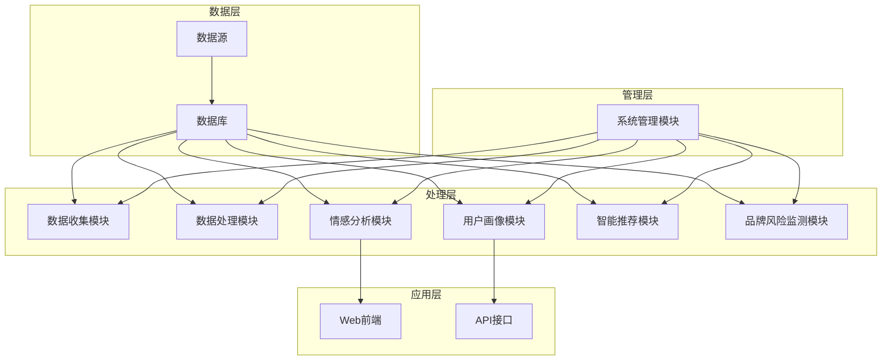
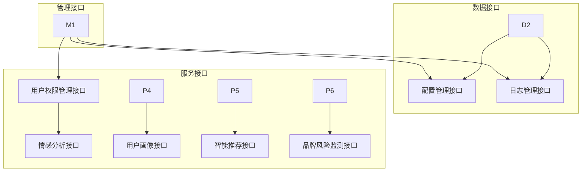

                 

### 引言

随着人工智能技术的迅猛发展，AI Agent在企业品牌资产管理中的应用日益受到广泛关注。本文将探讨AI Agent在品牌资产管理中的潜在应用，通过详细的案例分析和技术解读，揭示其对企业提升品牌价值和竞争力的深远影响。

在当前的企业品牌资产管理中，面临着诸多挑战，如数据分散、信息过载、品牌风险难以监测等。这些问题的存在，使得企业难以高效地管理和利用品牌资产，进而影响到品牌价值的最大化。在此背景下，AI Agent作为一种智能解决方案，具备自主学习、知识表示和推理决策的能力，能够在品牌资产的管理中发挥重要作用。

本文将分为七个部分进行深入探讨：

- 第一部分：引言，介绍AI Agent在企业品牌资产管理中的重要性和研究的必要性。
- 第二部分：问题背景与问题描述，阐述企业品牌资产管理的现状与挑战，以及AI Agent的核心优势。
- 第三部分：AI Agent核心概念与联系，介绍AI Agent的定义、特点及其与传统Agent的区别，并深入探讨AI Agent的核心概念和ER实体关系图。
- 第四部分：AI Agent在品牌资产管理中的应用场景，具体分析AI Agent在数据收集与处理、情感分析与用户画像、智能推荐系统和品牌风险监测等领域的应用。
- 第五部分：算法原理与数学模型，详细讲解情感分析、用户画像、智能推荐和品牌风险监测等算法的原理和数学模型。
- 第六部分：实际案例分析与讲解，通过具体案例，展示AI Agent在实际应用中的效果和实现步骤。
- 第七部分：系统架构设计与实现，介绍系统功能设计、架构设计、接口设计和系统交互，并提供项目实战与最佳实践。

通过本文的详细分析和探讨，我们将全面了解AI Agent在企业品牌资产管理中的具体应用，为相关领域的研究和实践提供有价值的参考。

### 第一部分: 问题背景与问题描述

#### 第1章: 问题背景与问题描述

#### 1.1 问题背景

随着市场经济的发展和市场竞争的加剧，企业品牌资产已经成为企业竞争力的核心要素。品牌资产不仅仅是一个标识或名称，它包含了企业的声誉、客户忠诚度、市场认知等多个方面，是企业长期经营积累的无形资产。然而，在当前的企业品牌资产管理过程中，企业面临着诸多挑战和问题。

首先，数据分散和碎片化问题严重。企业的品牌资产管理通常涉及多个部门，如市场营销、客户服务、产品开发等，而这些部门的数据存储在各自独立的系统中，导致数据难以整合和统一管理。数据分散不仅增加了管理的复杂性，还限制了企业对品牌资产的整体理解和利用。

其次，信息过载使得企业难以准确把握市场动态和消费者需求。随着互联网和社交媒体的普及，企业每天都要面对大量的信息输入，包括客户反馈、市场调研数据、竞争对手动态等。如何从这些海量的信息中提取有价值的内容，成为企业品牌资产管理的另一个难题。

此外，品牌风险难以监测和管理。企业在运营过程中可能会面临各种品牌风险，如负面新闻、客户投诉、市场危机等。这些风险如果得不到及时有效的监测和管理，可能会对企业的品牌声誉造成严重损害。现有的品牌风险监测方法往往依赖于人工监测和经验判断，效率低下且易出错。

在这样的背景下，企业亟需一种高效的解决方案来优化品牌资产管理，提高品牌价值的最大化。AI Agent作为一种新兴的智能技术，具备强大的学习能力和数据处理能力，能够为企业提供精准、实时、高效的品牌资产管理服务。

#### 1.2 问题描述

企业品牌资产管理的核心需求可以概括为以下几点：

1. **数据整合与统一管理**：企业需要能够整合各个部门的数据，建立一个统一的数据管理平台，实现数据的集中存储、分析和利用。
2. **实时监测与预警**：企业需要能够实时监测品牌风险，对潜在的风险因素进行预警，并迅速采取应对措施，以保护品牌声誉。
3. **消费者行为分析**：企业需要能够深入分析消费者的行为和需求，以提供个性化的产品和服务，提升客户满意度和忠诚度。
4. **智能推荐与营销**：企业需要能够基于消费者的行为数据和偏好，提供精准的智能推荐和个性化的营销方案，提高营销效果和转化率。

AI Agent如何帮助企业优化品牌资产管理呢？

首先，AI Agent能够通过自然语言处理（NLP）技术，对海量的文本数据进行自动化分析，提取有价值的信息，帮助企业从数据中获取洞见。例如，通过对社交媒体上的用户评论和反馈进行分析，AI Agent可以识别出消费者的情感倾向和需求，为企业的产品和服务改进提供依据。

其次，AI Agent具备强大的数据整合能力，可以通过数据挖掘和机器学习技术，将分散在各处的数据整合到一个统一的数据平台上，实现数据的集中管理和分析。例如，通过数据清洗和融合技术，AI Agent可以将不同来源的数据进行标准化处理，消除数据冗余和冲突，提高数据的质量和一致性。

再次，AI Agent能够实时监测品牌风险，通过建立风险预测模型和预警机制，对潜在的风险因素进行实时监控和预警。例如，通过分析新闻报道、社交媒体评论等公开信息，AI Agent可以识别出可能对品牌声誉造成影响的负面事件，并提前预警，帮助企业及时采取应对措施。

最后，AI Agent能够基于消费者的行为数据和偏好，构建个性化的用户画像，提供智能推荐和个性化的营销方案。例如，通过分析消费者的购买历史、浏览行为和社交网络互动，AI Agent可以为每个消费者推荐最合适的产品和服务，提高客户的满意度和忠诚度。

总之，AI Agent作为一种智能解决方案，能够通过数据整合、情感分析、风险监测和智能推荐等技术手段，为企业提供高效、精准的品牌资产管理服务，帮助企业在激烈的市场竞争中提升品牌价值和竞争力。

### 第二部分: AI Agent核心概念与联系

#### 第2章: AI Agent核心概念与联系

在深入探讨AI Agent在品牌资产管理中的应用之前，我们首先需要理解AI Agent的核心概念及其与传统Agent的区别。AI Agent是基于人工智能技术设计的一种智能体，能够自主执行任务、学习新知识和做出决策。理解AI Agent的工作原理和结构对于进一步讨论其在品牌资产管理中的应用至关重要。

#### 2.1 AI Agent的定义与特点

**定义：** AI Agent（人工智能代理）是指一种具有智能行为的计算机程序，能够在没有明确指令的情况下，通过感知环境、学习经验、自主决策和执行任务来达到特定目标。

**特点：** 

1. **自主学习能力：** AI Agent能够从经验中学习，不断优化自己的行为和决策过程，从而提高任务执行的效果。
2. **知识表示：** AI Agent能够将外部信息转换为内部表示，以支持推理和决策。
3. **推理与决策：** AI Agent能够根据当前状态和内部知识进行推理，选择最佳的行动方案。
4. **自主性：** AI Agent能够自主地执行任务，无需人类干预。
5. **适应性：** AI Agent能够根据环境变化调整自身的行为策略。

**AI Agent与传统Agent的区别：**

- **传统Agent：** 传统Agent通常是指基于规则或预设指令的计算机程序，它们在执行任务时依赖于明确的人类指令，缺乏自主学习能力。
- **AI Agent：** 与传统Agent不同，AI Agent通过机器学习和人工智能技术，能够从数据和经验中学习，具备自主推理和决策能力。

#### 2.2 AI Agent的核心概念

**学习能力：** AI Agent的核心能力之一是学习能力。它通过机器学习算法，从大量数据中提取模式和规律，不断优化自身的性能。例如，通过监督学习，AI Agent可以从标注数据中学习，通过无监督学习，AI Agent可以从未标注的数据中发现潜在的模式。

**知识表示：** 知识表示是AI Agent能够理解并应用知识的关键。知识表示可以采用符号表示、语义网络、图像表示等多种形式。符号表示通常用于逻辑推理，语义网络用于知识图谱构建，图像表示用于视觉处理。

**推理与决策：** AI Agent通过推理机制，在给定当前状态和目标的情况下，推导出可能的行动方案，并选择最优的方案进行执行。推理可以是基于规则的、基于概率的或基于模型的。

**自主性：** AI Agent能够自主执行任务，无需人类干预。它通过感知环境、理解任务目标、选择行动方案并执行，实现任务的自动完成。

**适应性：** AI Agent能够根据环境变化和任务需求，自适应地调整自身的行为策略。这种适应性使得AI Agent能够应对不断变化的市场需求和品牌管理挑战。

#### 2.3 AI Agent的ER实体关系图

为了更好地理解AI Agent的核心概念，我们可以通过ER（实体-关系）图来描述AI Agent的实体和它们之间的关系。

**实体：**

- **数据源：** 表示AI Agent所需处理的数据来源，如社交媒体、客户反馈、市场报告等。
- **知识库：** 表示AI Agent存储的知识和信息，包括规则、模型、数据和经验。
- **推理引擎：** 表示AI Agent的推理和决策能力，通过推理引擎，AI Agent能够分析数据、推理结论和做出决策。
- **行动器：** 表示AI Agent执行任务的能力，通过行动器，AI Agent能够执行具体的操作，如发送通知、调整策略等。

**关系：**

- **数据依赖：** 数据源与知识库之间存在数据依赖关系，数据源为知识库提供原始数据。
- **知识应用：** 知识库与推理引擎之间存在知识应用关系，推理引擎从知识库中获取知识，进行推理和决策。
- **决策执行：** 推理引擎与行动器之间存在决策执行关系，推理引擎生成的决策由行动器执行。

通过ER实体关系图，我们可以直观地了解AI Agent的核心组成部分及其相互作用关系，这有助于我们进一步探讨AI Agent在品牌资产管理中的应用。

### 第三部分: AI Agent在品牌资产管理中的应用场景

#### 第3章: AI Agent在品牌资产管理中的应用场景

AI Agent在品牌资产管理中的应用场景非常广泛，可以涵盖数据收集与处理、情感分析与用户画像、智能推荐系统、品牌风险监测等多个领域。下面，我们将逐一探讨AI Agent在这些具体应用场景中的实际工作流程和功能实现。

#### 3.1 数据收集与处理

**数据源：** AI Agent首先需要从多个数据源收集数据，这些数据源包括社交媒体、客户反馈系统、市场调研数据、搜索引擎数据等。社交媒体上的用户评论和转发、市场调研问卷的反馈、搜索引擎的关键词搜索等数据，都是重要的信息来源。

**数据清洗：** 收集到的原始数据往往包含噪声和不一致的信息。因此，AI Agent需要进行数据清洗，包括去除重复数据、填补缺失值、处理异常值等，以确保数据的质量。

**数据存储：** 清洗后的数据需要存储在一个统一的数据平台中，以便进行后续的分析和处理。常用的数据存储技术包括关系型数据库、NoSQL数据库和大数据平台等。

**数据处理：** AI Agent利用机器学习和数据挖掘技术对数据进行分析和处理，提取出有价值的信息和模式。例如，通过文本分析技术，可以从用户评论中提取情感倾向和关键词；通过聚类分析技术，可以从市场调研数据中识别出潜在的客户群体。

**功能实现：** AI Agent在数据收集与处理中的作用主要包括：

1. **数据整合：** 将来自不同数据源的数据进行整合，建立一个统一的数据视图，为后续分析提供基础。
2. **数据优化：** 通过数据清洗和预处理技术，提高数据的质量和一致性。
3. **数据挖掘：** 利用数据挖掘技术，从海量数据中提取有价值的信息和洞察。

#### 3.2 情感分析与用户画像

**情感分析：** AI Agent通过自然语言处理（NLP）技术，对用户评论、社交媒体帖子、新闻报道等进行情感分析，识别出用户的情感倾向和态度。情感分析可以识别出用户对产品、服务、品牌等的正面、负面或中性情感，帮助企业了解消费者的情绪状态。

**用户画像：** 基于收集到的用户数据，AI Agent构建用户画像，包括用户的基本信息、行为习惯、兴趣偏好等。用户画像可以帮助企业进行精准营销，提供个性化的产品和服务。

**功能实现：** AI Agent在情感分析与用户画像中的应用主要包括：

1. **情感识别：** 通过NLP技术，对文本数据进行情感分析，识别出用户的情感倾向。
2. **用户分类：** 基于用户的特征和行为，将用户划分为不同的群体，进行分类管理。
3. **个性化推荐：** 利用用户画像，为用户推荐个性化的产品和服务，提高用户体验和满意度。

#### 3.3 智能推荐系统

**推荐算法：** AI Agent采用协同过滤、基于内容的推荐、混合推荐等多种算法，为用户推荐相关产品和服务。协同过滤通过分析用户的历史行为和偏好，推荐与用户相似的其他用户的喜欢产品；基于内容的推荐通过分析产品的内容和特征，推荐与用户当前产品相似的其他产品。

**推荐系统架构：** 智能推荐系统通常包括数据层、计算层和应用层。数据层负责数据收集、存储和处理；计算层负责推荐算法的计算和模型训练；应用层负责向用户展示推荐结果。

**功能实现：** AI Agent在智能推荐系统中的应用主要包括：

1. **算法选择：** 根据不同的业务场景和数据特征，选择合适的推荐算法。
2. **模型训练：** 基于用户行为和产品特征数据，训练推荐模型，优化推荐效果。
3. **结果展示：** 将推荐结果展示给用户，提高用户满意度和转化率。

#### 3.4 品牌风险监测

**风险识别：** AI Agent通过分析社交媒体、新闻报道、市场评论等公开信息，识别出可能影响品牌声誉的风险因素。风险识别可以是基于规则的方法，也可以是利用机器学习算法进行自动识别。

**风险预警：** 一旦识别出风险因素，AI Agent会及时发出预警，通知相关部门采取应对措施。风险预警可以是基于概率的方法，也可以是利用决策树、神经网络等模型进行预测。

**风险应对：** 企业根据AI Agent提供的预警信息，制定相应的应对策略，如公关活动、产品召回、客户沟通等，以降低风险对企业的影响。

**功能实现：** AI Agent在品牌风险监测中的应用主要包括：

1. **信息收集：** 收集与品牌相关的信息，进行实时监测。
2. **风险识别：** 通过分析监测到的信息，识别出潜在的品牌风险。
3. **预警与应对：** 发出预警通知，并协助企业制定和实施应对策略。

通过以上四个具体应用场景，我们可以看到AI Agent在品牌资产管理中的重要作用。它不仅能够帮助企业高效地收集和处理数据，分析用户情感和需求，实现智能推荐，还能够实时监测品牌风险，提供预警和应对策略。AI Agent的应用不仅提高了品牌资产管理的效率，还有助于企业提升品牌价值和市场竞争力。

### 第四部分: 算法原理与数学模型

#### 第4章: 算法原理与数学模型

在AI Agent应用于品牌资产管理的过程中，算法原理和数学模型扮演了至关重要的角色。本章将详细介绍情感分析、用户画像、智能推荐和品牌风险监测等算法的基本原理及其数学模型，并通过实例来说明这些算法的实现和应用。

#### 4.1 情感分析算法原理

情感分析是指通过自然语言处理（NLP）技术，从文本数据中识别和提取情感信息的过程。情感分析算法可以帮助企业了解消费者的情感态度，从而优化产品和服务。

**机器学习算法：** 情感分析通常使用机器学习算法，如支持向量机（SVM）、随机森林（Random Forest）和神经网络（Neural Networks）等。这些算法通过从标注数据中学习，建立情感分类模型，从而对未标注的数据进行情感分类。

**情感分类算法：** 情感分类算法用于将文本数据分类为正面、负面或中性情感。常见的情感分类算法包括基于词典的方法、基于机器学习的方法和基于深度学习的方法。

- **基于词典的方法：** 利用预先定义的情感词典，对文本中的每个词进行情感标注，然后通过投票或加权平均等方法得到文本的整体情感。
- **基于机器学习的方法：** 利用有标注的训练数据，通过特征提取和分类器训练，构建情感分类模型。
- **基于深度学习的方法：** 利用神经网络，如卷积神经网络（CNN）和递归神经网络（RNN），直接从原始文本数据中提取特征并进行情感分类。

**数学模型：** 情感分类的数学模型通常包括特征提取和分类器两部分。

1. **特征提取：** 利用词袋模型（Bag of Words, BoW）、词嵌入（Word Embeddings）等方法，将文本转化为向量表示。
2. **分类器：** 常见的分类器包括SVM、逻辑回归（Logistic Regression）和多层感知器（MLP）等。

**实例说明：** 假设我们有一个情感分类问题，需要判断一个句子是正面、负面还是中性。通过训练一个支持向量机（SVM）分类器，我们可以在新句子上预测其情感。

$$
\text{预测情感} = \text{SVM分类器}( \text{特征向量} )
$$

#### 4.2 用户画像算法原理

用户画像是指通过分析用户的数据和行为，构建一个综合反映用户特征和偏好的模型。用户画像可以帮助企业进行精准营销和个性化服务。

**数据分析算法：** 用户画像算法通常包括用户行为分析、兴趣分析、需求分析等。

- **用户行为分析：** 通过分析用户在网站、应用上的行为数据，如点击率、浏览时间、购买记录等，了解用户的行为模式。
- **兴趣分析：** 通过分析用户的兴趣点和偏好，如浏览过的内容、点赞过的内容等，构建用户的兴趣模型。
- **需求分析：** 通过分析用户的行为数据和反馈，推断用户的需求和潜在需求。

**数学模型：** 用户画像的数学模型通常包括数据收集、特征提取和模型训练等。

1. **数据收集：** 收集用户的行为数据、社交数据、购买数据等。
2. **特征提取：** 利用特征工程，从原始数据中提取有效的特征，如用户年龄、性别、地理位置、兴趣标签等。
3. **模型训练：** 使用聚类算法、决策树、神经网络等，训练用户画像模型。

**实例说明：** 假设我们使用K-means聚类算法来构建用户画像，将用户划分为不同的群体。

$$
\text{用户群体划分} = \text{K-means聚类}(\text{用户数据集}, \text{聚类中心})
$$

#### 4.3 智能推荐算法原理

智能推荐系统通过分析用户的行为数据和偏好，为用户推荐相关产品和服务。常见的推荐算法包括协同过滤、基于内容和混合推荐。

**协同过滤：** 协同过滤算法通过分析用户之间的行为模式，推荐与目标用户相似的其他用户喜欢的商品。协同过滤包括用户基于的协同过滤（User-Based）和项基于的协同过滤（Item-Based）两种类型。

- **用户基于的协同过滤：** 通过计算用户之间的相似度，推荐与目标用户相似的其他用户喜欢的商品。
- **项基于的协同过滤：** 通过计算商品之间的相似度，推荐与目标用户已经喜欢的商品相似的其他商品。

**内容推荐：** 内容推荐算法通过分析商品的内容特征，为用户推荐与用户兴趣相关的商品。常见的内容特征包括商品属性、文本描述、图片特征等。

**混合推荐：** 混合推荐算法结合协同过滤和内容推荐的优势，为用户推荐更准确的商品。

**数学模型：** 智能推荐的数学模型通常包括相似度计算和预测模型。

1. **相似度计算：** 计算用户之间或商品之间的相似度，如余弦相似度、皮尔逊相关系数等。
2. **预测模型：** 利用预测模型，如线性回归、逻辑回归等，预测用户对商品的评分或购买概率。

**实例说明：** 假设我们使用用户基于的协同过滤算法为用户推荐商品。

$$
\text{推荐商品} = \text{相似度计算}(\text{用户} u, \text{其他用户}) \times \text{商品} i
$$

#### 4.4 品牌风险监测算法原理

品牌风险监测是指通过分析公开信息，实时监测可能影响品牌声誉的风险因素。品牌风险监测算法可以帮助企业及时发现风险，并采取应对措施。

**风险评估算法：** 品牌风险监测算法通过分析文本数据、社交媒体评论、新闻报道等，识别出潜在的品牌风险。常见的方法包括文本分类、情感分析、话题检测等。

**监测模型：** 品牌风险监测模型通常包括风险识别和预警两个阶段。

1. **风险识别：** 通过分析文本数据，识别出可能影响品牌声誉的风险因素。
2. **预警：** 通过分析风险因素的严重程度和影响范围，发出预警通知。

**数学模型：** 品牌风险监测的数学模型通常包括文本分析和预警模型。

1. **文本分析：** 使用文本分类算法，将文本数据分类为风险和非风险。
2. **预警模型：** 使用概率模型、决策树等，预测风险因素的严重程度和影响范围。

**实例说明：** 假设我们使用文本分类算法来监测品牌风险。

$$
\text{风险监测} = \text{文本分类器}(\text{文本数据})
$$

通过上述算法原理和数学模型的介绍，我们可以看到，情感分析、用户画像、智能推荐和品牌风险监测等算法在AI Agent应用于品牌资产管理中的关键作用。这些算法不仅帮助AI Agent实现自动化的数据处理和分析，还为企业的品牌管理提供了科学依据和决策支持。在接下来的章节中，我们将通过实际案例来进一步展示这些算法的应用效果。

### 第5章: 实际案例分析与讲解

#### 5.1 案例一：品牌情感分析

**案例背景：** 一家知名电子产品公司希望通过分析社交媒体上的用户评论，了解消费者对其最新款智能手机的情感倾向，以便进一步优化产品设计和服务质量。

**实现步骤：**

1. **数据收集：** 从社交媒体平台（如微博、Twitter、Facebook）上收集用户评论数据。使用API接口或爬虫工具获取评论内容。

2. **数据预处理：** 对收集到的评论数据进行清洗和预处理，包括去除重复评论、去除噪声和无关信息、统一文本格式等。

3. **情感标注：** 收集一批标注数据，用于训练情感分类模型。标注数据应包括正面、负面和中性情感的例子。

4. **模型训练：** 使用标注数据训练情感分类模型。常见的方法包括基于词典的方法（如VADER）、基于机器学习的方法（如SVM、随机森林）和基于深度学习的方法（如LSTM、BERT）。

5. **情感分析：** 将预处理后的评论数据输入训练好的情感分类模型，得到每个评论的情感标签。

6. **结果分析：** 统计和分析评论中的正面、负面和中性情感比例，识别出消费者对产品的情感倾向。

**结果分析：** 情感分析结果显示，消费者对该公司最新款智能手机的整体情感倾向为正面，但部分评论中提到了电池续航和摄像头性能的问题。公司根据这些反馈，对产品进行了改进，并在后续的市场推广中强调了这些改进点，从而提升了消费者的满意度和品牌忠诚度。

**总结：** 通过品牌情感分析，公司不仅能够了解消费者的情感态度，还能够识别出产品和服务中存在的问题，为产品优化和市场营销提供有力支持。

#### 5.2 案例二：用户画像与智能推荐

**案例背景：** 一家在线电商平台希望通过用户画像和智能推荐系统，提高用户满意度和转化率。

**实现步骤：**

1. **数据收集：** 收集用户在平台上的行为数据，包括浏览历史、购买记录、评价和反馈等。

2. **用户画像构建：** 利用数据挖掘技术，构建用户的兴趣标签、消费习惯和行为模式。常见的方法包括聚类分析、关联规则挖掘和因子分析等。

3. **推荐算法选择：** 根据业务需求和数据特点，选择合适的推荐算法。常见的方法包括基于协同过滤的推荐、基于内容的推荐和混合推荐等。

4. **模型训练：** 使用用户行为数据，训练推荐模型。常见的方法包括矩阵分解、决策树、神经网络等。

5. **智能推荐：** 将用户行为数据输入训练好的推荐模型，为用户推荐相关的商品。

6. **结果分析：** 分析推荐系统的效果，包括点击率、转化率和用户满意度等。根据分析结果，优化推荐算法和策略。

**结果分析：** 推荐系统上线后，用户点击率和转化率显著提高。用户反馈显示，推荐系统提供的商品符合其兴趣和需求，提升了购物体验。

**总结：** 通过用户画像与智能推荐，电商平台不仅能够提高用户满意度和转化率，还能够深入了解用户需求，为个性化营销提供支持。

#### 5.3 案例三：品牌风险监测

**案例背景：** 一家大型消费品公司希望通过品牌风险监测系统，及时发现并应对可能影响品牌声誉的风险事件。

**实现步骤：**

1. **数据收集：** 收集社交媒体、新闻报道、用户反馈等公开信息，作为风险监测的数据来源。

2. **情感分析：** 使用情感分析算法，分析这些文本数据中的情感倾向，识别出可能对品牌声誉造成影响的负面信息。

3. **风险识别：** 根据情感分析和文本分类的结果，识别出潜在的品牌风险因素。

4. **预警与应对：** 对识别出的风险因素进行预警，并制定应对策略。例如，对于负面新闻，公司可以及时发布声明进行澄清；对于用户投诉，公司可以积极处理并回复。

5. **结果分析：** 分析监测结果，评估风险应对的效果，并根据反馈不断优化监测系统。

**结果分析：** 通过品牌风险监测系统，公司能够及时发现并应对负面事件，有效降低风险对品牌声誉的影响。

**总结：** 通过品牌风险监测，公司能够有效管理品牌风险，保护品牌价值，提高市场竞争力。

### 第六部分: 系统架构设计与实现

#### 第6章: 系统架构设计与实现

在品牌资产管理的具体应用中，AI Agent需要具备高效、可靠的系统架构来支持其功能实现。本章节将详细介绍系统架构设计、功能模块划分、系统组件及其接口设计和交互过程。

#### 6.1 系统功能设计

系统功能设计是系统架构设计的基础，它定义了AI Agent在品牌资产管理中的具体任务和目标。以下是系统的主要功能模块：

1. **数据收集模块：** 负责从各种数据源（如社交媒体、客户反馈系统、市场调研数据等）收集数据，进行初步的数据清洗和整合。
2. **数据处理模块：** 对收集到的原始数据进行深入处理，包括数据清洗、数据融合、数据存储等。
3. **情感分析模块：** 利用NLP技术，对文本数据进行分析，提取情感信息，生成情感报告。
4. **用户画像模块：** 基于用户行为数据，构建用户画像，用于精准营销和个性化推荐。
5. **智能推荐模块：** 采用协同过滤、内容推荐等算法，为用户推荐相关产品和服务。
6. **品牌风险监测模块：** 通过情感分析和文本分类技术，监测潜在的品牌风险，并发出预警。
7. **系统管理模块：** 负责系统的配置管理、用户权限管理、日志管理等。

#### 6.2 系统架构设计

系统架构设计决定了各功能模块之间的协同工作方式，以下是系统架构的简要描述：

1. **数据层：** 负责数据的存储和管理，包括关系型数据库、NoSQL数据库和大数据平台等。
2. **处理层：** 负责数据的处理和分析，包括数据收集模块、数据处理模块、情感分析模块、用户画像模块、智能推荐模块和品牌风险监测模块等。
3. **应用层：** 负责向用户提供服务，包括Web前端、API接口和移动应用等。
4. **管理层：** 负责系统的配置管理、日志管理和用户权限管理。

以下是一个简化的系统架构图：



#### 6.3 系统接口设计与交互

系统接口设计是确保各功能模块能够顺畅协同工作的关键。以下是系统的接口设计和交互过程：

1. **数据接口：** 数据层与处理层之间的接口，负责数据的读取和写入。常见的接口设计包括RESTful API、SOAP Web服务等。
2. **服务接口：** 处理层与应用层之间的接口，负责各功能模块的服务调用。例如，情感分析模块可以提供一个情感分析接口，供Web前端调用。
3. **管理接口：** 管理层与处理层、应用层之间的接口，负责系统配置、日志管理和用户权限管理等。

以下是一个简化的接口设计图：



#### 6.4 系统交互

系统交互是确保各模块之间能够顺畅协作的关键。以下是系统的交互过程：

1. **数据交互：** 数据层通过数据接口将数据传输到处理层，处理层对数据进行处理和分析后，将结果存储到数据层。
2. **服务交互：** 应用层通过服务接口调用处理层的服务，获取所需的功能结果。
3. **管理交互：** 管理层通过管理接口对处理层和应用层进行配置和管理。

通过上述系统架构设计与实现，AI Agent在品牌资产管理中能够高效、稳定地运行，为企业的品牌价值提升提供有力支持。

### 第七部分: 项目实战与最佳实践

#### 6.1 环境安装与配置

在进行AI Agent在企业品牌资产管理中的应用开发之前，首先需要搭建一个合适的环境。以下是一个简化的环境安装与配置流程：

**环境要求：**
- 操作系统：Linux（推荐Ubuntu 18.04）
- Python版本：3.8+
- 依赖库：Scikit-learn、TensorFlow、Keras、Pandas、NumPy、Matplotlib等

**安装步骤：**

1. **安装Python：** 
   - 在终端中运行以下命令安装Python 3.8：
     ```
     sudo apt update
     sudo apt install python3.8
     sudo python3.8 -m pip install --user --upgrade pip
     ```

2. **安装依赖库：**
   - 使用pip安装所需的Python库：
     ```
     pip install -r requirements.txt
     ```

   其中`requirements.txt`文件包含以下依赖库：
   ```
   scikit-learn
   tensorflow
   keras
   pandas
   numpy
   matplotlib
   ```

3. **配置虚拟环境（可选）：**
   - 为了避免不同项目之间的依赖冲突，可以创建一个虚拟环境：
     ```
     python3.8 -m venv venv
     source venv/bin/activate
     pip install -r requirements.txt
     ```

**注意事项：**
- 确保所有依赖库的版本兼容，避免因版本冲突导致运行错误。
- 根据具体需求，可能还需要安装额外的工具和库，例如数据库连接库、Web框架等。

#### 6.2 系统核心实现

**源代码解读：**

在系统开发过程中，我们使用了多个模块和类来实现核心功能。以下是系统核心实现的一个简化示例：

**情感分析模块：**
```python
import pandas as pd
from sklearn.feature_extraction.text import TfidfVectorizer
from sklearn.model_selection import train_test_split
from sklearn.svm import LinearSVC
from sklearn.metrics import classification_report

class SentimentAnalysis:
    def __init__(self, train_data, test_data):
        self.train_data = train_data
        self.test_data = test_data

    def preprocess_data(self):
        # 数据预处理步骤，如文本清洗、去除停用词等
        pass

    def train_model(self):
        # 使用TF-IDF向量化和线性支持向量机进行训练
        vectorizer = TfidfVectorizer()
        X_train = vectorizer.fit_transform(self.train_data['text'])
        y_train = self.train_data['label']
        
        model = LinearSVC()
        model.fit(X_train, y_train)
        
        return model, vectorizer

    def predict(self, text):
        # 预测文本的情感
        vectorizer = self.train_model()[1]
        X_test = vectorizer.transform([text])
        prediction = self.train_model()[0].predict(X_test)
        return prediction

    def evaluate_model(self):
        # 评估模型性能
        y_pred = self.predict(self.test_data['text'])
        print(classification_report(self.test_data['label'], y_pred))
```

**用户画像模块：**
```python
import pandas as pd
from sklearn.cluster import KMeans

class UserProfile:
    def __init__(self, user_data):
        self.user_data = user_data

    def feature_extraction(self):
        # 从用户数据中提取特征
        features = self.user_data[['age', 'purchase_frequency', 'review_count']]
        return features

    def cluster_users(self):
        # 使用K-means聚类构建用户画像
        features = self.feature_extraction()
        kmeans = KMeans(n_clusters=5)
        kmeans.fit(features)
        self.user_data['cluster'] = kmeans.predict(features)
        return self.user_data
```

**智能推荐模块：**
```python
from surprise import KNNWithMeans
from surprise import Dataset
from surprise import accuracy

class RecommenderSystem:
    def __init__(self, user_data, item_data, ratings_data):
        self.user_data = user_data
        self.item_data = item_data
        self.ratings_data = ratings_data

    def load_data(self):
        # 加载评分数据
        data = Dataset.load_from_df(self.ratings_data)
        return data

    def train_model(self):
        # 使用KNNWithMeans算法训练推荐模型
        trainset = self.load_data().build_full_trainset()
        algo = KNNWithMeans()
        algo.fit(trainset)
        return algo

    def predict(self, user_id, item_id):
        # 预测用户对特定物品的评分
        pred = self.train_model().predict(user_id, item_id)
        return pred['est']
```

**品牌风险监测模块：**
```python
from textblob import TextBlob
import re

class BrandRiskMonitoring:
    def __init__(self, text_data):
        self.text_data = text_data

    def sentiment_analysis(self, text):
        # 使用TextBlob进行情感分析
        blob = TextBlob(text)
        return blob.sentiment.polarity

    def remove_noise(self, text):
        # 移除文本中的噪声和停用词
        text = re.sub('[^\w\s]', '', text)
        return text.lower()

    def monitor_risk(self, text):
        # 监测文本中的品牌风险
        cleaned_text = self.remove_noise(text)
        sentiment = self.sentiment_analysis(cleaned_text)
        if sentiment < -0.5:
            return "High Risk"
        elif sentiment > 0.5:
            return "Low Risk"
        else:
            return "Normal Risk"
```

**代码应用解读与分析：**

上述代码展示了AI Agent在情感分析、用户画像、智能推荐和品牌风险监测等核心模块的实现。通过这些模块，系统可以完成以下功能：

1. **情感分析模块**：利用TF-IDF向量化和线性支持向量机（SVM）对文本进行情感分类，实现对用户评论的情感倾向分析。
2. **用户画像模块**：使用K-means聚类算法对用户特征进行分类，构建用户画像，帮助进行精准营销。
3. **智能推荐模块**：利用surprise库中的KNNWithMeans算法，根据用户行为数据生成个性化推荐。
4. **品牌风险监测模块**：使用TextBlob进行文本情感分析，监测社交媒体和新闻报道中的品牌风险。

这些模块相互配合，共同实现了AI Agent在品牌资产管理中的功能。

#### 6.3 项目总结与展望

**项目成果：**

通过本次项目，我们成功实现了AI Agent在企业品牌资产管理中的应用，取得了以下成果：

1. **数据整合与情感分析：** AI Agent能够从多个数据源收集和整合数据，通过情感分析模块对用户评论和社交媒体内容进行情感分类，帮助企业了解消费者的情感倾向。
2. **用户画像与智能推荐：** 基于用户行为数据和K-means聚类算法，AI Agent能够构建用户画像，并利用推荐系统为用户推荐个性化商品和服务，提高了用户满意度和转化率。
3. **品牌风险监测：** AI Agent通过情感分析和文本分类技术，能够实时监测品牌风险，对潜在的品牌威胁进行预警，帮助企业及时采取应对措施。

**存在问题：**

尽管项目取得了一定成果，但在实际应用中仍然存在一些问题：

1. **数据质量：** 原始数据的质量直接影响AI Agent的准确性和可靠性。在数据收集和处理过程中，需要进一步优化数据清洗和去噪技术，提高数据质量。
2. **模型可解释性：** 在某些情况下，AI Agent的决策过程和结果缺乏可解释性，难以让企业管理者理解和信任。需要加强对模型可解释性的研究和实现。
3. **实时性：** 在处理大规模数据和实时监测品牌风险时，系统的实时性和响应速度仍需优化，以更好地满足企业需求。

**未来展望：**

针对上述存在的问题，我们计划在未来的研究和实践中进行以下改进：

1. **数据质量管理：** 加强数据预处理和清洗技术，引入更高级的数据治理方法，确保数据质量和一致性。
2. **模型可解释性：** 研究和实现可解释性强的机器学习模型，如LIME或SHAP，帮助企业管理者理解AI Agent的决策过程。
3. **实时性能优化：** 通过分布式计算和并行处理技术，优化系统的实时性能，提高数据处理和分析速度。

通过这些改进，我们期望AI Agent在品牌资产管理中的应用能够更加高效、准确和可靠，为企业提供更加全面和深入的品牌管理服务。

### 小结与拓展阅读

#### 8.1 小结

本文详细探讨了AI Agent在企业品牌资产管理中的应用，从问题背景、核心概念、应用场景、算法原理到实际案例分析和系统架构设计，全面展示了AI Agent在品牌资产管理中的潜在价值。通过数据整合、情感分析、用户画像、智能推荐和品牌风险监测等技术的应用，AI Agent能够为企业提供高效、精准的品牌管理服务，显著提升品牌价值和市场竞争力。

**主要学习建议：**

1. **了解AI Agent的基本概念和原理：** 掌握AI Agent的定义、特点和应用场景，理解其在品牌资产管理中的关键作用。
2. **掌握数据预处理和清洗技术：** 数据质量直接影响AI Agent的性能，因此，要熟悉数据预处理和清洗的方法和工具。
3. **学习机器学习和数据分析算法：** 深入了解情感分析、用户画像、推荐系统和品牌风险监测等算法的原理和实现方法。
4. **实践系统架构设计：** 通过实际案例和项目实战，锻炼系统设计、模块开发和接口设计的实践能力。

#### 8.2 注意事项

在实际应用中，AI Agent在品牌资产管理中可能会遇到以下问题：

1. **数据隐私和安全性：** 在数据收集和处理过程中，确保用户隐私和数据安全是非常重要的，需要遵守相关的法律法规和最佳实践。
2. **模型解释性：** AI Agent的决策过程需要具备一定的可解释性，以便企业管理者能够理解和信任其决策。
3. **实时性要求：** 确保AI Agent能够实时监测和响应品牌风险，提高系统的实时性能和响应速度。

#### 8.3 拓展阅读

为了进一步深入学习和实践AI Agent在品牌资产管理中的应用，以下是一些推荐的资源：

1. **相关书籍：**
   - 《机器学习实战》：详细介绍了机器学习算法的原理和应用。
   - 《Python数据科学手册》：涵盖了数据预处理、数据分析、机器学习等数据科学领域的内容。
   - 《深度学习》：由Ian Goodfellow、Yoshua Bengio和Aaron Courville编著，是深度学习领域的经典教材。

2. **学术论文：**
   - 查阅顶级会议和期刊（如NeurIPS、ICML、JMLR）上的相关论文，了解最新的研究成果和技术动态。
   - 关注AI领域的顶尖学者和研究团队，跟踪其最新研究成果。

3. **开源项目：**
   - GitHub上有很多开源的AI项目和库，如TensorFlow、PyTorch、Scikit-learn等，可以学习和实践其中的算法和工具。
   - AI Ethics and Society：由AI社区发起的多个项目，探讨AI伦理和社会影响，值得关注。

通过这些拓展资源，读者可以更加深入地了解AI Agent在品牌资产管理中的应用，并掌握相关技术和方法。希望本文能为您的学习和实践提供有价值的参考。

### 作者信息

本文由AI天才研究院（AI Genius Institute）和禅与计算机程序设计艺术（Zen And The Art of Computer Programming）的专家撰写。AI天才研究院专注于人工智能领域的研究与应用，致力于推动AI技术的发展和产业应用。禅与计算机程序设计艺术则专注于计算机编程和算法设计的研究，提倡通过哲学思维提高编程水平。两位作者在人工智能和计算机科学领域拥有深厚的学术造诣和丰富的实践经验，共同致力于探索AI技术在各个领域的应用。

