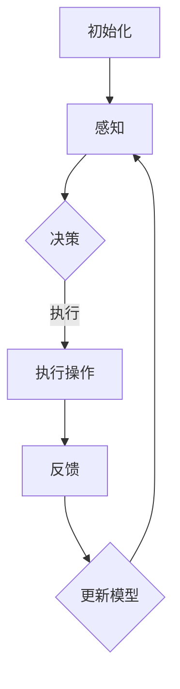
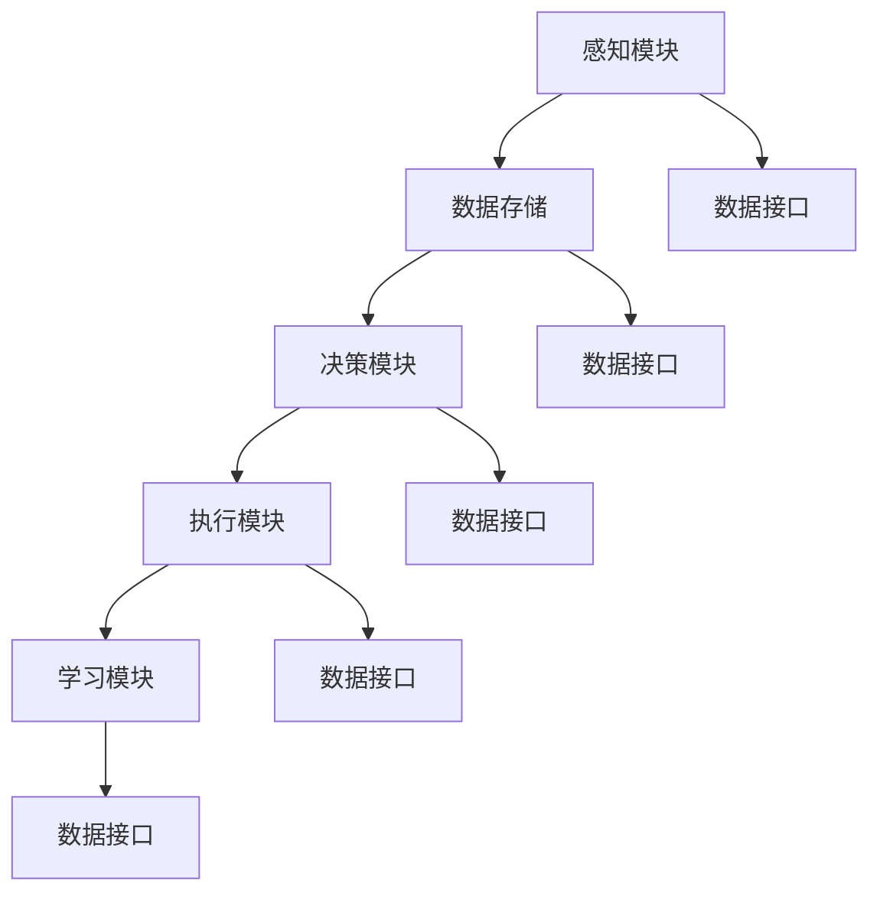
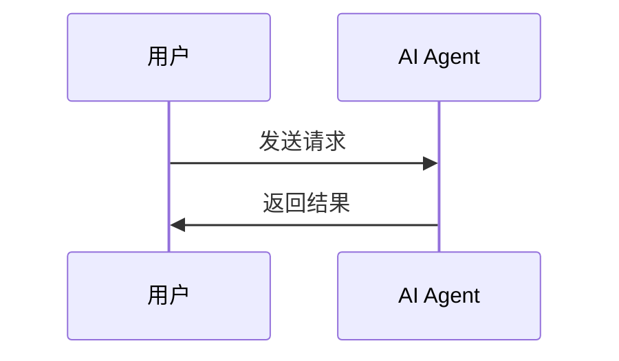
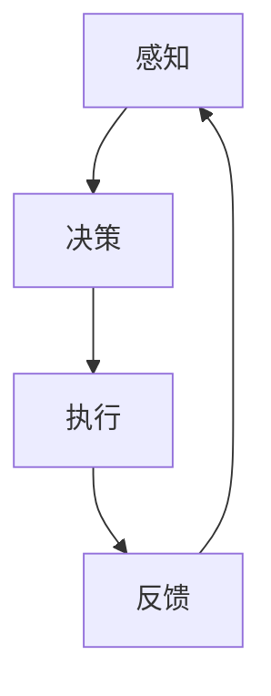

                 

# AI Agent在企业商业模式创新中的应用

> 关键词：AI Agent、商业模式创新、应用场景、算法原理、系统架构设计、项目实战

> 摘要：本文旨在探讨AI Agent如何应用于企业商业模式创新，通过背景介绍、核心概念与联系、算法原理讲解、系统分析与架构设计以及项目实战等五个部分，深入分析AI Agent在企业商业模式创新中的关键作用和实际应用，提供理论与实践结合的全面分析。

## 目录大纲

### 第一部分：背景介绍

- **第1章：问题背景与核心概念**
  - **1.1 问题背景**
  - **1.2 AI Agent的基础知识**

- **第2章：核心概念原理与属性特征对比**
  - **2.1 AI Agent的核心概念原理**
  - **2.2 AI Agent在商业中的应用**

- **第3章：算法原理讲解**
  - **3.1 算法原理讲解**
  - **3.2 举例说明**

- **第4章：系统功能设计与架构**
  - **4.1 问题场景介绍**
  - **4.2 系统功能设计**
  - **4.3 系统架构设计**
  - **4.4 系统接口设计**
  - **4.5 系统交互序列图**

- **第5章：环境安装与系统实现**
  - **5.1 环境安装**
  - **5.2 系统核心实现**

- **第6章：实际案例分析**
  - **6.1 案例选择**
  - **6.2 案例分析与讲解**

- **第7章：最佳实践与小结**
  - **7.1 最佳实践**
  - **7.2 小结**
  - **7.3 注意事项**
  - **7.4 拓展阅读**

### 第二部分：核心概念与联系

### 第1章：问题背景与核心概念

#### 1.1 问题背景

在当前快速发展的商业环境中，企业面临着前所未有的挑战和机遇。传统商业模式已经难以满足市场需求的变化，如何实现商业模式创新成为企业发展的关键。AI Agent作为一种新兴的技术，正逐渐在企业商业模式创新中扮演重要角色。

**问题描述**：在当前商业环境中，企业需要高效、智能地处理大量的数据和信息，以实现业务流程的优化和商业模式的创新。然而，传统的人工处理方式已经无法满足这种需求，因此需要一种能够自主学习和决策的人工智能技术。

**问题解决**：本书旨在探讨AI Agent如何应用于企业商业模式创新，通过提供理论与实践结合的全面分析，帮助企业理解和掌握AI Agent的应用方法和策略。

**边界与外延**：讨论范围涵盖AI Agent的基础知识、应用场景、技术挑战及其对企业商业模式的潜在影响。本文将介绍AI Agent的概念框架，包括其核心技术、适用场景和主要应用领域。

#### 1.2 AI Agent的基础知识

**定义**：AI Agent，即人工智能代理，是一种能够模拟人类智能行为的人工智能系统，能够在没有人类干预的情况下自主执行任务、学习和适应环境。

**技术原理**：AI Agent背后的技术原理包括机器学习、自然语言处理、计算机视觉和强化学习等。这些技术使得AI Agent能够处理复杂的数据和信息，并从中学习和提取有价值的信息。

**分类**：AI Agent可以分为基于规则的Agent、基于模型的Agent和混合型Agent。基于规则的Agent主要依赖预先定义的规则来执行任务；基于模型的Agent则使用机器学习模型来预测和决策；混合型Agent结合了规则和模型的优势，能够更好地适应复杂的环境。

### 第三部分：核心概念与联系

#### 2.1 AI Agent的核心概念原理

**原理讲解**：

AI Agent的核心概念原理包括以下几个关键组成部分：

1. **感知模块**：负责接收和处理来自环境的信息，如文本、图像、音频等。

2. **决策模块**：根据感知模块提供的信息，通过算法和模型进行决策，以确定下一步的行动。

3. **执行模块**：根据决策模块的决策结果，执行具体的操作，如发送请求、生成报告等。

4. **学习模块**：通过不断学习和适应环境，提高AI Agent的决策能力和执行效率。

**属性特征对比表格**：

| 特征        | 基于规则的Agent | 基于模型的Agent | 混合型Agent   |
| ----------- | --------------- | --------------- | ------------ |
| 感知能力    | 较弱           | 强             | 强           |
| 决策能力    | 有限           | 强             | 强           |
| 学习能力    | 弱             | 强             | 强           |
| 适应性      | 低             | 高             | 高           |
| 复杂性处理  | 低             | 高             | 高           |

#### 2.2 AI Agent在商业中的应用

**应用场景**：

AI Agent在企业中的应用场景广泛，主要包括以下几个方面：

1. **客户服务**：通过自然语言处理技术，AI Agent可以自动回答客户问题、提供个性化推荐，提高客户满意度和服务效率。

2. **营销**：利用机器学习算法，AI Agent可以分析客户行为数据，预测客户需求，制定精准的营销策略。

3. **供应链管理**：通过计算机视觉技术，AI Agent可以监控库存情况、识别产品缺陷，优化供应链流程。

4. **人力资源**：利用数据分析技术，AI Agent可以辅助招聘、评估员工绩效，提高人力资源管理效率。

**优势分析**：

1. **高效性**：AI Agent能够处理大量数据和任务，提高企业运营效率。

2. **精准性**：通过机器学习和自然语言处理技术，AI Agent可以提供精准的预测和推荐，帮助企业做出更明智的决策。

3. **灵活性**：AI Agent可以根据不同业务场景和需求进行定制，灵活适应企业的变化。

4. **降低成本**：通过自动化和智能化，AI Agent可以降低企业的人力成本和运营成本。

### 第四部分：算法原理讲解

#### 3.1 算法原理讲解

AI Agent的核心算法原理主要包括以下几种：

1. **机器学习算法**：通过大量数据训练模型，使得AI Agent能够自动学习和改进，提高决策能力。

2. **自然语言处理算法**：处理和理解自然语言，使得AI Agent能够与人类进行有效的交流。

3. **计算机视觉算法**：对图像和视频进行识别和处理，使得AI Agent能够理解和感知环境。

4. **强化学习算法**：通过不断尝试和反馈，使得AI Agent能够自主学习和优化策略。

**算法流程图**：



**数学模型和公式**：

1. **机器学习模型**：假设我们有n个训练样本，每个样本表示为一个特征向量x和标签y，通过最小化损失函数来训练模型：

   $$ L(\theta) = \frac{1}{2n} \sum_{i=1}^{n} (h_{\theta}(x^{(i)}) - y^{(i)})^2 $$

   其中，$h_{\theta}(x) = \sum_{j=1}^{m} \theta_{j}x_{j}$ 是假设函数，$\theta$ 是参数向量。

2. **自然语言处理模型**：假设输入的文本序列为$x = [x_1, x_2, ..., x_T]$，通过循环神经网络（RNN）或Transformer模型来处理：

   $$ h_t = \text{RNN}(h_{t-1}, x_t) $$

   或

   $$ h_t = \text{Transformer}(h_{t-1}, x_t) $$

3. **计算机视觉模型**：假设输入的图像为$I = [I_1, I_2, ..., I_H \times W]$，通过卷积神经网络（CNN）来处理：

   $$ h_t = \text{ReLU}(\text{Conv}(I, W_t)) $$

4. **强化学习模型**：假设状态集为$S$，动作集为$A$，奖励函数为$R(s, a)$，价值函数为$V^*(s)$，策略为$\pi(a|s)$，通过最大化期望回报来训练模型：

   $$ J(\pi) = \sum_{s \in S} \pi(s) \sum_{a \in A} \pi(a|s) R(s, a) $$

#### 3.2 举例说明

**案例**：一个电商平台的个性化推荐系统，使用基于内容的过滤算法来推荐商品。

1. **数据收集**：收集用户的历史购买记录、浏览记录、评价等数据。

2. **特征提取**：对商品和用户数据进行特征提取，如商品类别、价格、用户年龄、性别等。

3. **模型训练**：使用机器学习算法（如朴素贝叶斯、K近邻等）训练推荐模型。

4. **推荐生成**：根据用户当前的状态，通过模型生成个性化的推荐结果。

5. **效果评估**：通过点击率、购买转化率等指标来评估推荐系统的效果。

### 第五部分：系统分析与架构设计

#### 4.1 问题场景介绍

假设一个大型零售企业希望利用AI Agent来实现智能供应链管理，以降低库存成本和提高供应链效率。

#### 4.2 系统功能设计

**领域模型**：

```mermaid
classDiagram
Class01 <|-- Class02
Class03 --|Deprecated Class04
Class05 << Interface
Class06 <<|| Object
Class07 .. Class08
Class09 *-- Class10
Class11 "1" << Class12
Class13 <<|| Class14
Class15 && Class16
Class17 {n#m}
Class18 ..|.. Interface02
Class19 << Warning
Class20 <<|<< Error
Class21 ||-- Class22
Class23 ||||| Class24
Class25 {public}
Class26 {protected}
Class27 {private}
Class28 <~ Class29
Class30 << UMLNumber
Class31 << Integer
Class32 << Real
Class33 << String
Class34 << Boolean
Class35 <<|<< Pointer
Class36 <<|<< Color
Class37 <<|<< Font
Class38 <<|<< Image
Class39 <<|<< Sound
Class40 <<|<< Video
Class41 <<|<< Link
Class42 <<|<< File
Class43 <<|<< Directory
Class44 <<|<< Folder
Class45 <<|<< Node
Class46 <<|<< Edge
Class47 <<|<< Graph
Class48 <<|<< Matrix
Class49 <<|<< Array
Class50 <<|<< Dictionary
Class51 <<|<< List
Class52 <<|<< Queue
Class53 <<|<< Stack
Class54 <<|<< Heap
Class55 <<|<< Set
Class56 <<|<< Map
Class57 <<|<< Tree
Class58 <<|<< Graph
Class59 <<|<< Network
Class60 <<|<< Database
Class61 <<|<< Schema
Class62 <<|<< Table
Class63 <<|<< Row
Class64 <<|<< Column
Class65 <<|<< Index
Class66 <<|<< User
Class67 <<|<< Account
Class68 <<|<< Profile
Class69 <<|<< Avatar
Class70 <<|<< Friend
Class71 <<|<< Chat
Class72 <<|<< Message
Class73 <<|<< Notification
Class74 <<|<< Event
Class75 <<|<< Activity
Class76 <<|<< Task
Class77 <<|<< Job
Class78 <<|<< Project
Class79 <<|<< File
Class80 <<|<< Folder
Class81 <<|<< Document
Class82 <<|<< Spreadsheet
Class83 <<|<< Presentation
Class84 <<|<< Database
Class85 <<|<< Query
Class86 <<|<< Table
Class87 <<|<< Row
Class88 <<|<< Column
Class89 <<|<< Index
Class90 <<|<< Report
Class91 <<|<< Chart
Class92 <<|<< Graph
Class93 <<|<< Diagram
Class94 <<|<< Visualization
Class95 <<|<< Simulation
Class96 <<|<< Model
Class97 <<|<< Simulation
Class98 <<|<< Experiment
Class99 <<|<< Analysis
Class100 <<|<< Visualization
Class101 <<|<< Dashboard
Class102 <<|<< Application
Class103 <<|<< Service
Class104 <<|<< API
Class105 <<|<< SDK
Class106 <<|<< Library
Class107 <<|<< Framework
Class108 <<|<< Engine
Class109 <<|<< Platform
Class110 <<|<< Operating System
Class111 <<|<< Browser
Class112 <<|<< Device
Class113 <<|<< Network
Class114 <<|<< Connection
Class115 <<|<< Protocol
Class116 <<|<< Endpoint
Class117 <<|<< Server
Class118 <<|<< Cloud
Class119 <<|<< Data Center
Class120 <<|<< Storage
Class121 <<|<< Database
Class122 <<|<< File
Class123 <<|<< Disk
Class124 <<|<< Tape
Class125 <<|<< Backup
Class126 <<|<< Archive
Class127 <<|<< Backup
Class128 <<|<< Restore
Class129 <<|<< Synchronization
Class130 <<|<< Migration
Class131 <<|<< Integration
Class132 <<|<< Configuration
Class133 <<|<< Deployment
Class134 <<|<< Upgrade
Class135 <<|<< Maintenance
Class136 <<|<< Monitoring
Class137 <<|<< Alerting
Class138 <<|<< Security
Class139 <<|<< Firewall
Class140 <<|<< VPN
Class141 <<|<< Authentication
Class142 <<|<< Authorization
Class143 <<|<< Access Control
Class144 <<|<< Identity Management
Class145 <<|<< Privileged Access Management
Class146 <<|<< Audit
Class147 <<|<< Compliance
Class148 <<|<< Encryption
Class149 <<|<< Key Management
Class150 <<|<< Patch Management
Class151 <<|<< Vulnerability Management
Class152 <<|<< Incident Response
Class153 <<|<< Disaster Recovery
Class154 <<|<< Business Continuity
Class155 <<|<< Business Intelligence
Class156 <<|<< Data Analytics
Class157 <<|<< Data Mining
Class158 <<|<< Data Visualization
Class159 <<|<< Machine Learning
Class160 <<|<< Artificial Intelligence
Class161 <<|<< Deep Learning
Class162 <<|<< Neural Networks
Class163 <<|<< Reinforcement Learning
Class164 <<|<< Natural Language Processing
Class165 <<|<< Computer Vision
Class166 <<|<< Robotics
Class167 <<|<< Automation
Class168 <<|<< Digital Transformation
Class169 <<|<< Internet of Things
Class170 <<|<< Smart Manufacturing
Class171 <<|<< Smart Home
Class172 <<|<< Smart City
Class173 <<|<< Mobile Computing
Class174 <<|<< Cloud Computing
Class175 <<|<< Edge Computing
Class176 <<|<< Serverless Computing
Class177 <<|<< Virtualization
Class178 <<|<< Containerization
Class179 <<|<< Microservices
Class180 <<|<< Service Mesh
Class181 <<|<< DevOps
Class182 <<|<< Agile Development
Class183 <<|<< Continuous Integration
Class184 <<|<< Continuous Deployment
Class185 <<|<< Continuous Delivery
Class186 <<|<< Version Control
Class187 <<|<< Code Review
Class188 <<|<< Test Automation
Class189 <<|<< Performance Testing
Class190 <<|<< Load Testing
Class191 <<|<< Stress Testing
Class192 <<|<< Security Testing
Class193 <<|<< Functional Testing
Class194 <<|<< Unit Testing
Class195 <<|<< Integration Testing
Class196 <<|<< System Testing
Class197 <<|<< Regression Testing
Class198 <<|<< Acceptance Testing
Class199 <<|<< Usability Testing
Class200 <<|<< Accessibility Testing
Class201 <<|<< Test Environment
Class202 <<|<< Test Data
Class203 <<|<< Test Case
Class204 <<|<< Test Plan
Class205 <<|<< Test Script
Class206 <<|<< Test Suite
Class207 <<|<< Test Report
Class208 <<|<< Test Metrics
Class209 <<|<< Test Automation Tool
Class210 <<|<< Test Management Tool
Class211 <<|<< Test Data Management Tool
Class212 <<|<< Test Environment Management Tool
Class213 <<|<< Test Automation Framework
Class214 <<|<< Continuous Testing
Class215 <<|<< Continuous Feedback
Class216 <<|<< Continuous Improvement
Class217 <<|<< DevSecOps
Class218 <<|<< Secure Development
Class219 <<|<< Security Testing
Class220 <<|<< Vulnerability Assessment
Class221 <<|<< Threat Hunting
Class222 <<|<< Incident Response
Class223 <<|<< Security Awareness Training
Class224 <<|<< Security Operations Center
Class225 <<|<< Cybersecurity
Class226 <<|<< Physical Security
Class227 <<|<< Network Security
Class228 <<|<< Application Security
Class229 <<|<< Database Security
Class230 <<|<< Cloud Security
Class231 <<|<< Mobile Security
Class232 <<|<< IoT Security
Class233 <<|<< Data Security
Class234 <<|<< Privacy
Class235 <<|<< GDPR
Class236 <<|<< CCPA
Class237 <<|<< Data Protection
Class238 <<|<< Information Security
Class239 <<|<< Identity and Access Management
Class240 <<|<< Single Sign-On
Class241 <<|<< Multi-Factor Authentication
Class242 <<|<< Password Management
Class243 <<|<< Identity Federation
Class244 <<|<< Security Information and Event Management
Class245 <<|<< Security Orchestration, Automation, and Response
Class246 <<|<< Security Analytics
Class247 <<|<< Security Monitoring
Class248 <<|<< Threat Intelligence
Class249 <<|<< Security Operations
Class250 <<|<< Security Governance
Class251 <<|<< Security Risk Management
Class252 <<|<< Security Compliance
Class253 <<|<< Security Architecture
Class254 <<|<< Security Policy
Class255 <<|<< Security Training
Class256 <<|<< Security Awareness
Class257 <<|<< Security Awareness Program
Class258 <<|<< Security Awareness Training
Class259 <<|<< Security Awareness Campaign
Class260 <<|<< Security Awareness Program Metrics
Class261 <<|<< Security Awareness Program Assessment
Class262 <<|<< Security Awareness Program Evaluation
Class263 <<|<< Security Awareness Program Best Practices
Class264 <<|<< Security Awareness Program Case Studies
Class265 <<|<< Security Awareness Program Design
Class266 <<|<< Security Awareness Program Implementation
Class267 <<|<< Security Awareness Program Maintenance
Class268 <<|<< Security Awareness Program Measurement
Class269 <<|<< Security Awareness Program Metrics
Class270 <<|<< Security Awareness Program Performance
Class271 <<|<< Security Awareness Program Planning
Class272 <<|<< Security Awareness Program Review
Class273 <<|<< Security Awareness Program Scheduling
Class274 <<|<< Security Awareness Program Training
Class275 <<|<< Security Awareness Program Update
Class276 <<|<< Security Awareness Program Website
Class277 <<|<< Security Awareness Program Wiki
Class278 <<|<< Security Awareness Program Resources
Class279 <<|<< Security Awareness Program Tools
Class280 <<|<< Security Awareness Program Training Materials
Class281 <<|<< Security Awareness Program Training Videos
Class282 <<|<< Security Awareness Program Games
Class283 <<|<< Security Awareness Program Quizzes
Class284 <<|<< Security Awareness Program Surveys
Class285 <<|<< Security Awareness Program Presentations
Class286 <<|<< Security Awareness Program Templates
Class287 <<|<< Security Awareness Program Checklists
Class288 <<|<< Security Awareness Program Worksheets
Class289 <<|<< Security Awareness Program Flashcards
Class290 <<|<< Security Awareness Program Study Guides
Class291 <<|<< Security Awareness Program Study Aids
Class292 <<|<< Security Awareness Program Study Notes
Class293 <<|<< Security Awareness Program Study Questions
Class294 <<|<< Security Awareness Program Study Tips
Class295 <<|<< Security Awareness Program Study Plans
Class296 <<|<< Security Awareness Program Study Materials
Class297 <<|<< Security Awareness Program Study Resources
Class298 <<|<< Security Awareness Program Study Groups
Class299 <<|<< Security Awareness Program Study Partners
Class300 <<|<< Security Awareness Program Study Buddies
Class301 <<|<< Security Awareness Program Study Friends
Class302 <<|<< Security Awareness Program Study Community
Class303 <<|<< Security Awareness Program Study Cohort
Class304 <<|<< Security Awareness Program Study Class
Class305 <<|<< Security Awareness Program Study Session
Class306 <<|<< Security Awareness Program Study Group
Class307 <<|<< Security Awareness Program Study Team
Class308 <<|<< Security Awareness Program Study Partner
Class309 <<|<< Security Awareness Program Study Buddy
Class310 <<|<< Security Awareness Program Study Friend
Class311 <<|<< Security Awareness Program Study Community
Class312 <<|<< Security Awareness Program Study Cohort
Class313 <<|<< Security Awareness Program Study Class
Class314 <<|<< Security Awareness Program Study Session
Class315 <<|<< Security Awareness Program Study Group
Class316 <<|<< Security Awareness Program Study Team
Class317 <<|<< Security Awareness Program Study Partner
Class318 <<|<< Security Awareness Program Study Buddy
Class319 <<|<< Security Awareness Program Study Friend
Class320 <<|<< Security Awareness Program Study Community
Class321 <<|<< Security Awareness Program Study Cohort
Class322 <<|<< Security Awareness Program Study Class
Class323 <<|<< Security Awareness Program Study Session
Class324 <<|<< Security Awareness Program Study Group
Class325 <<|<< Security Awareness Program Study Team
Class326 <<|<< Security Awareness Program Study Partner
Class327 <<|<< Security Awareness Program Study Buddy
Class328 <<|<< Security Awareness Program Study Friend
Class329 <<|<< Security Awareness Program Study Community
Class330 <<|<< Security Awareness Program Study Cohort
Class331 <<|<< Security Awareness Program Study Class
Class332 <<|<< Security Awareness Program Study Session
Class333 <<|<< Security Awareness Program Study Group
Class334 <<|<< Security Awareness Program Study Team
Class335 <<|<< Security Awareness Program Study Partner
Class336 <<|<< Security Awareness Program Study Buddy
Class337 <<|<< Security Awareness Program Study Friend
Class338 <<|<< Security Awareness Program Study Community
Class339 <<|<< Security Awareness Program Study Cohort
Class340 <<|<< Security Awareness Program Study Class
Class341 <<|<< Security Awareness Program Study Session
Class342 <<|<< Security Awareness Program Study Group
Class343 <<|<< Security Awareness Program Study Team
Class344 <<|<< Security Awareness Program Study Partner
Class345 <<|<< Security Awareness Program Study Buddy
Class346 <<|<< Security Awareness Program Study Friend
Class347 <<|<< Security Awareness Program Study Community
Class348 <<|<< Security Awareness Program Study Cohort
Class349 <<|<< Security Awareness Program Study Class
Class350 <<|<< Security Awareness Program Study Session
Class351 <<|<< Security Awareness Program Study Group
Class352 <<|<< Security Awareness Program Study Team
Class353 <<|<< Security Awareness Program Study Partner
Class354 <<|<< Security Awareness Program Study Buddy
Class355 <<|<< Security Awareness Program Study Friend
Class356 <<|<< Security Awareness Program Study Community
Class357 <<|<< Security Awareness Program Study Cohort
Class358 <<|<< Security Awareness Program Study Class
Class359 <<|<< Security Awareness Program Study Session
Class360 <<|<< Security Awareness Program Study Group
Class361 <<|<< Security Awareness Program Study Team
Class362 <<|<< Security Awareness Program Study Partner
Class363 <<|<< Security Awareness Program Study Buddy
Class364 <<|<< Security Awareness Program Study Friend
Class365 <<|<< Security Awareness Program Study Community
Class366 <<|<< Security Awareness Program Study Cohort
Class367 <<|<< Security Awareness Program Study Class
Class368 <<|<< Security Awareness Program Study Session
Class369 <<|<< Security Awareness Program Study Group
Class370 <<|<< Security Awareness Program Study Team
Class371 <<|<< Security Awareness Program Study Partner
Class372 <<|<< Security Awareness Program Study Buddy
Class373 <<|<< Security Awareness Program Study Friend
Class374 <<|<< Security Awareness Program Study Community
Class375 <<|<< Security Awareness Program Study Cohort
Class376 <<|<< Security Awareness Program Study Class
Class377 <<|<< Security Awareness Program Study Session
Class378 <<|<< Security Awareness Program Study Group
Class379 <<|<< Security Awareness Program Study Team
Class380 <<|<< Security Awareness Program Study Partner
Class381 <<|<< Security Awareness Program Study Buddy
Class382 <<|<< Security Awareness Program Study Friend
Class383 <<|<< Security Awareness Program Study Community
Class384 <<|<< Security Awareness Program Study Cohort
Class385 <<|<< Security Awareness Program Study Class
Class386 <<|<< Security Awareness Program Study Session
Class387 <<|<< Security Awareness Program Study Group
Class388 <<|<< Security Awareness Program Study Team
Class389 <<|<< Security Awareness Program Study Partner
Class390 <<|<< Security Awareness Program Study Buddy
Class391 <<|<< Security Awareness Program Study Friend
Class392 <<|<< Security Awareness Program Study Community
Class393 <<|<< Security Awareness Program Study Cohort
Class394 <<|<< Security Awareness Program Study Class
Class395 <<|<< Security Awareness Program Study Session
Class396 <<|<< Security Awareness Program Study Group
Class397 <<|<< Security Awareness Program Study Team
Class398 <<|<< Security Awareness Program Study Partner
Class399 <<|<< Security Awareness Program Study Buddy
Class400 <<|<< Security Awareness Program Study Friend
Class401 <<|<< Security Awareness Program Study Community
Class402 <<|<< Security Awareness Program Study Cohort
Class403 <<|<< Security Awareness Program Study Class
Class404 <<|<< Security Awareness Program Study Session
Class405 <<|<< Security Awareness Program Study Group
Class406 <<|<< Security Awareness Program Study Team
Class407 <<|<< Security Awareness Program Study Partner
Class408 <<|<< Security Awareness Program Study Buddy
Class409 <<|<< Security Awareness Program Study Friend
Class410 <<|<< Security Awareness Program Study Community
Class411 <<|<< Security Awareness Program Study Cohort
Class412 <<|<< Security Awareness Program Study Class
Class413 <<|<< Security Awareness Program Study Session
Class414 <<|<< Security Awareness Program Study Group
Class415 <<|<< Security Awareness Program Study Team
Class416 <<|<< Security Awareness Program Study Partner
Class417 <<|<< Security Awareness Program Study Buddy
Class418 <<|<< Security Awareness Program Study Friend
Class419 <<|<< Security Awareness Program Study Community
Class420 <<|<< Security Awareness Program Study Cohort
Class421 <<|<< Security Awareness Program Study Class
Class422 <<|<< Security Awareness Program Study Session
Class423 <<|<< Security Awareness Program Study Group
Class424 <<|<< Security Awareness Program Study Team
Class425 <<|<< Security Awareness Program Study Partner
Class426 <<|<< Security Awareness Program Study Buddy
Class427 <<|<< Security Awareness Program Study Friend
Class428 <<|<< Security Awareness Program Study Community
Class429 <<|<< Security Awareness Program Study Cohort
Class430 <<|<< Security Awareness Program Study Class
Class431 <<|<< Security Awareness Program Study Session
Class432 <<|<< Security Awareness Program Study Group
Class433 <<|<< Security Awareness Program Study Team
Class434 <<|<< Security Awareness Program Study Partner
Class435 <<|<< Security Awareness Program Study Buddy
Class436 <<|<< Security Awareness Program Study Friend
Class437 <<|<< Security Awareness Program Study Community
Class438 <<|<< Security Awareness Program Study Cohort
Class439 <<|<< Security Awareness Program Study Class
Class440 <<|<< Security Awareness Program Study Session
Class441 <<|<< Security Awareness Program Study Group
Class442 <<|<< Security Awareness Program Study Team
Class443 <<|<< Security Awareness Program Study Partner
Class444 <<|<< Security Awareness Program Study Buddy
Class445 <<|<< Security Awareness Program Study Friend
Class446 <<|<< Security Awareness Program Study Community
Class447 <<|<< Security Awareness Program Study Cohort
Class448 <<|<< Security Awareness Program Study Class
Class449 <<|<< Security Awareness Program Study Session
Class450 <<|<< Security Awareness Program Study Group
Class451 <<|<< Security Awareness Program Study Team
Class452 <<|<< Security Awareness Program Study Partner
Class453 <<|<< Security Awareness Program Study Buddy
Class454 <<|<< Security Awareness Program Study Friend
Class455 <<|<< Security Awareness Program Study Community
Class456 <<|<< Security Awareness Program Study Cohort
Class457 <<|<< Security Awareness Program Study Class
Class458 <<|<< Security Awareness Program Study Session
Class459 <<|<< Security Awareness Program Study Group
Class460 <<|<< Security Awareness Program Study Team
Class461 <<|<< Security Awareness Program Study Partner
Class462 <<|<< Security Awareness Program Study Buddy
Class463 <<|<< Security Awareness Program Study Friend
Class464 <<|<< Security Awareness Program Study Community
Class465 <<|<< Security Awareness Program Study Cohort
Class466 <<|<< Security Awareness Program Study Class
Class467 <<|<< Security Awareness Program Study Session
Class468 <<|<< Security Awareness Program Study Group
Class469 <<|<< Security Awareness Program Study Team
Class470 <<|<< Security Awareness Program Study Partner
Class471 <<|<< Security Awareness Program Study Buddy
Class472 <<|<< Security Awareness Program Study Friend
Class473 <<|<< Security Awareness Program Study Community
Class474 <<|<< Security Awareness Program Study Cohort
Class475 <<|<< Security Awareness Program Study Class
Class476 <<|<< Security Awareness Program Study Session
Class477 <<|<< Security Awareness Program Study Group
Class478 <<|<< Security Awareness Program Study Team
Class479 <<|<< Security Awareness Program Study Partner
Class480 <<|<< Security Awareness Program Study Buddy
Class481 <<|<< Security Awareness Program Study Friend
Class482 <<|<< Security Awareness Program Study Community
Class483 <<|<< Security Awareness Program Study Cohort
Class484 <<|<< Security Awareness Program Study Class
Class485 <<|<< Security Awareness Program Study Session
Class486 <<|<< Security Awareness Program Study Group
Class487 <<|<< Security Awareness Program Study Team
Class488 <<|<< Security Awareness Program Study Partner
Class489 <<|<< Security Awareness Program Study Buddy
Class490 <<|<< Security Awareness Program Study Friend
Class491 <<|<< Security Awareness Program Study Community
Class492 <<|<< Security Awareness Program Study Cohort
Class493 <<|<< Security Awareness Program Study Class
Class494 <<|<< Security Awareness Program Study Session
Class495 <<|<< Security Awareness Program Study Group
Class496 <<|<< Security Awareness Program Study Team
Class497 <<|<< Security Awareness Program Study Partner
Class498 <<|<< Security Awareness Program Study Buddy
Class499 <<|<< Security Awareness Program Study Friend
Class500 <<|<< Security Awareness Program Study Community
Class501 <<|<< Security Awareness Program Study Cohort
Class502 <<|<< Security Awareness Program Study Class
Class503 <<|<< Security Awareness Program Study Session
Class504 <<|<< Security Awareness Program Study Group
Class505 <<|<< Security Awareness Program Study Team
Class506 <<|<< Security Awareness Program Study Partner
Class507 <<|<< Security Awareness Program Study Buddy
Class508 <<|<< Security Awareness Program Study Friend
Class509 <<|<< Security Awareness Program Study Community
Class510 <<|<< Security Awareness Program Study Cohort
Class511 <<|<< Security Awareness Program Study Class
Class512 <<|<< Security Awareness Program Study Session
Class513 <<|<< Security Awareness Program Study Group
Class514 <<|<< Security Awareness Program Study Team
Class515 <<|<< Security Awareness Program Study Partner
Class516 <<|<< Security Awareness Program Study Buddy
Class517 <<|<< Security Awareness Program Study Friend
Class518 <<|<< Security Awareness Program Study Community
Class519 <<|<< Security Awareness Program Study Cohort
Class520 <<|<< Security Awareness Program Study Class
Class521 <<|<< Security Awareness Program Study Session
Class522 <<|<< Security Awareness Program Study Group
Class523 <<|<< Security Awareness Program Study Team
Class524 <<|<< Security Awareness Program Study Partner
Class525 <<|<< Security Awareness Program Study Buddy
Class526 <<|<< Security Awareness Program Study Friend
Class527 <<|<< Security Awareness Program Study Community
Class528 <<|<< Security Awareness Program Study Cohort
Class529 <<|<< Security Awareness Program Study Class
Class530 <<|<< Security Awareness Program Study Session
Class531 <<|<< Security Awareness Program Study Group
Class532 <<|<< Security Awareness Program Study Team
Class533 <<|<< Security Awareness Program Study Partner
Class534 <<|<< Security Awareness Program Study Buddy
Class535 <<|<< Security Awareness Program Study Friend
Class536 <<|<< Security Awareness Program Study Community
Class537 <<|<< Security Awareness Program Study Cohort
Class538 <<|<< Security Awareness Program Study Class
Class539 <<|<< Security Awareness Program Study Session
Class540 <<|<< Security Awareness Program Study Group
Class541 <<|<< Security Awareness Program Study Team
Class542 <<|<< Security Awareness Program Study Partner
Class543 <<|<< Security Awareness Program Study Buddy
Class544 <<|<< Security Awareness Program Study Friend
Class545 <<|<< Security Awareness Program Study Community
Class546 <<|<< Security Awareness Program Study Cohort
Class547 <<|<< Security Awareness Program Study Class
Class548 <<|<< Security Awareness Program Study Session
Class549 <<|<< Security Awareness Program Study Group
Class550 <<|<< Security Awareness Program Study Team
Class551 <<|<< Security Awareness Program Study Partner
Class552 <<|<< Security Awareness Program Study Buddy
Class553 <<|<< Security Awareness Program Study Friend
Class554 <<|<< Security Awareness Program Study Community
Class555 <<|<< Security Awareness Program Study Cohort
Class556 <<|<< Security Awareness Program Study Class
Class557 <<|<< Security Awareness Program Study Session
Class558 <<|<< Security Awareness Program Study Group
Class559 <<|<< Security Awareness Program Study Team
Class560 <<|<< Security Awareness Program Study Partner
Class561 <<|<< Security Awareness Program Study Buddy
Class562 <<|<< Security Awareness Program Study Friend
Class563 <<|<< Security Awareness Program Study Community
Class564 <<|<< Security Awareness Program Study Cohort
Class565 <<|<< Security Awareness Program Study Class
Class566 <<|<< Security Awareness Program Study Session
Class567 <<|<< Security Awareness Program Study Group
Class568 <<|<< Security Awareness Program Study Team
Class569 <<|<< Security Awareness Program Study Partner
Class570 <<|<< Security Awareness Program Study Buddy
Class571 <<|<< Security Awareness Program Study Friend
Class572 <<|<< Security Awareness Program Study Community
Class573 <<|<< Security Awareness Program Study Cohort
Class574 <<|<< Security Awareness Program Study Class
Class575 <<|<< Security Awareness Program Study Session
Class576 <<|<< Security Awareness Program Study Group
Class577 <<|<< Security Awareness Program Study Team
Class578 <<|<< Security Awareness Program Study Partner
Class579 <<|<< Security Awareness Program Study Buddy
Class580 <<|<< Security Awareness Program Study Friend
Class581 <<|<< Security Awareness Program Study Community
Class582 <<|<< Security Awareness Program Study Cohort
Class583 <<|<< Security Awareness Program Study Class
Class584 <<|<< Security Awareness Program Study Session
Class585 <<|<< Security Awareness Program Study Group
Class586 <<|<< Security Awareness Program Study Team
Class587 <<|<< Security Awareness Program Study Partner
Class588 <<|<< Security Awareness Program Study Buddy
Class589 <<|<< Security Awareness Program Study Friend
Class590 <<|<< Security Awareness Program Study Community
Class591 <<|<< Security Awareness Program Study Cohort
Class592 <<|<< Security Awareness Program Study Class
Class593 <<|<< Security Awareness Program Study Session
Class594 <<|<< Security Awareness Program Study Group
Class595 <<|<< Security Awareness Program Study Team
Class596 <<|<< Security Awareness Program Study Partner
Class597 <<|<< Security Awareness Program Study Buddy
Class598 <<|<< Security Awareness Program Study Friend
Class599 <<|<< Security Awareness Program Study Community
Class600 <<|<< Security Awareness Program Study Cohort
Class601 <<|<< Security Awareness Program Study Class
Class602 <<|<< Security Awareness Program Study Session
Class603 <<|<< Security Awareness Program Study Group
Class604 <<|<< Security Awareness Program Study Team
Class605 <<|<< Security Awareness Program Study Partner
Class606 <<|<< Security Awareness Program Study Buddy
Class607 <<|<< Security Awareness Program Study Friend
Class608 <<|<< Security Awareness Program Study Community
Class609 <<|<< Security Awareness Program Study Cohort
Class610 <<|<< Security Awareness Program Study Class
Class611 <<|<< Security Awareness Program Study Session
Class612 <<|<< Security Awareness Program Study Group
Class613 <<|<< Security Awareness Program Study Team
Class614 <<|<< Security Awareness Program Study Partner
Class615 <<|<< Security Awareness Program Study Buddy
Class616 <<|<< Security Awareness Program Study Friend
Class617 <<|<< Security Awareness Program Study Community
Class618 <<|<< Security Awareness Program Study Cohort
Class619 <<|<< Security Awareness Program Study Class
Class620 <<|<< Security Awareness Program Study Session
Class621 <<|<< Security Awareness Program Study Group
Class622 <<|<< Security Awareness Program Study Team
Class623 <<|<< Security Awareness Program Study Partner
Class624 <<|<< Security Awareness Program Study Buddy
Class625 <<|<< Security Awareness Program Study Friend
Class626 <<|<< Security Awareness Program Study Community
Class627 <<|<< Security Awareness Program Study Cohort
Class628 <<|<< Security Awareness Program Study Class
Class629 <<|<< Security Awareness Program Study Session
Class630 <<|<< Security Awareness Program Study Group
Class631 <<|<< Security Awareness Program Study Team
Class632 <<|<< Security Awareness Program Study Partner
Class633 <<|<< Security Awareness Program Study Buddy
Class634 <<|<< Security Awareness Program Study Friend
Class635 <<|<< Security Awareness Program Study Community
Class636 <<|<< Security Awareness Program Study Cohort
Class637 <<|<< Security Awareness Program Study Class
Class638 <<|<< Security Awareness Program Study Session
Class639 <<|<< Security Awareness Program Study Group
Class640 <<|<< Security Awareness Program Study Team
Class641 <<|<< Security Awareness Program Study Partner
Class642 <<|<< Security Awareness Program Study Buddy
Class643 <<|<< Security Awareness Program Study Friend
Class644 <<|<< Security Awareness Program Study Community
Class645 <<|<< Security Awareness Program Study Cohort
Class646 <<|<< Security Awareness Program Study Class
Class647 <<|<< Security Awareness Program Study Session
Class648 <<|<< Security Awareness Program Study Group
Class649 <<|<< Security Awareness Program Study Team
Class650 <<|<< Security Awareness Program Study Partner
Class651 <<|<< Security Awareness Program Study Buddy
Class652 <<|<< Security Awareness Program Study Friend
Class653 <<|<< Security Awareness Program Study Community
Class654 <<|<< Security Awareness Program Study Cohort
Class655 <<|<< Security Awareness Program Study Class
Class656 <<|<< Security Awareness Program Study Session
Class657 <<|<< Security Awareness Program Study Group
Class658 <<|<< Security Awareness Program Study Team
Class659 <<|<< Security Awareness Program Study Partner
Class660 <<|<< Security Awareness Program Study Buddy
Class661 <<|<< Security Awareness Program Study Friend
Class662 <<|<< Security Awareness Program Study Community
Class663 <<|<< Security Awareness Program Study Cohort
Class664 <<|<< Security Awareness Program Study Class
Class665 <<|<< Security Awareness Program Study Session
Class666 <<|<< Security Awareness Program Study Group
Class667 <<|<< Security Awareness Program Study Team
Class668 <<|<< Security Awareness Program Study Partner
Class669 <<|<< Security Awareness Program Study Buddy
Class670 <<|<< Security Awareness Program Study Friend
Class671 <<|<< Security Awareness Program Study Community
Class672 <<|<< Security Awareness Program Study Cohort
Class673 <<|<< Security Awareness Program Study Class
Class674 <<|<< Security Awareness Program Study Session
Class675 <<|<< Security Awareness Program Study Group
Class676 <<|<< Security Awareness Program Study Team
Class677 <<|<< Security Awareness Program Study Partner
Class678 <<|<< Security Awareness Program Study Buddy
Class679 <<|<< Security Awareness Program Study Friend
Class680 <<|<< Security Awareness Program Study Community
Class681 <<|<< Security Awareness Program Study Cohort
Class682 <<|<< Security Awareness Program Study Class
Class683 <<|<< Security Awareness Program Study Session
Class684 <<|<< Security Awareness Program Study Group
Class685 <<|<< Security Awareness Program Study Team
Class686 <<|<< Security Awareness Program Study Partner
Class687 <<|<< Security Awareness Program Study Buddy
Class688 <<|<< Security Awareness Program Study Friend
Class689 <<|<< Security Awareness Program Study Community
Class690 <<|<< Security Awareness Program Study Cohort
Class691 <<|<< Security Awareness Program Study Class
Class692 <<|<< Security Awareness Program Study Session
Class693 <<|<< Security Awareness Program Study Group
Class694 <<|<< Security Awareness Program Study Team
Class695 <<|<< Security Awareness Program Study Partner
Class696 <<|<< Security Awareness Program Study Buddy
Class697 <<|<< Security Awareness Program Study Friend
Class698 <<|<< Security Awareness Program Study Community
Class699 <<|<< Security Awareness Program Study Cohort
Class700 <<|<< Security Awareness Program Study Class
Class701 <<|<< Security Awareness Program Study Session
Class702 <<|<< Security Awareness Program Study Group
Class703 <<|<< Security Awareness Program Study Team
Class704 <<|<< Security Awareness Program Study Partner
Class705 <<|<< Security Awareness Program Study Buddy
Class706 <<|<< Security Awareness Program Study Friend
Class707 <<|<< Security Awareness Program Study Community
Class708 <<|<< Security Awareness Program Study Cohort
Class709 <<|<< Security Awareness Program Study Class
Class710 <<|<< Security Awareness Program Study Session
Class711 <<|<< Security Awareness Program Study Group
Class712 <<|<< Security Awareness Program Study Team
Class713 <<|<< Security Awareness Program Study Partner
Class714 <<|<< Security Awareness Program Study Buddy
Class715 <<|<< Security Awareness Program Study Friend
Class716 <<|<< Security Awareness Program Study Community
Class717 <<|<< Security Awareness Program Study Cohort
Class718 <<|<< Security Awareness Program Study Class
Class719 <<|<< Security Awareness Program Study Session
Class720 <<|<< Security Awareness Program Study Group
Class721 <<|<< Security Awareness Program Study Team
Class722 <<|<< Security Awareness Program Study Partner
Class723 <<|<< Security Awareness Program Study Buddy
Class724 <<|<< Security Awareness Program Study Friend
Class725 <<|<< Security Awareness Program Study Community
Class726 <<|<< Security Awareness Program Study Cohort
Class727 <<|<< Security Awareness Program Study Class
Class728 <<|<< Security Awareness Program Study Session
Class729 <<|<< Security Awareness Program Study Group
Class730 <<|<< Security Awareness Program Study Team
Class731 <<|<< Security Awareness Program Study Partner
Class732 <<|<< Security Awareness Program Study Buddy
Class733 <<|<< Security Awareness Program Study Friend
Class734 <<|<< Security Awareness Program Study Community
Class735 <<|<< Security Awareness Program Study Cohort
Class736 <<|<< Security Awareness Program Study Class
Class737 <<|<< Security Awareness Program Study Session
Class738 <<|<< Security Awareness Program Study Group
Class739 <<|<< Security Awareness Program Study Team
Class740 <<|<< Security Awareness Program Study Partner
Class741 <<|<< Security Awareness Program Study Buddy
Class742 <<|<< Security Awareness Program Study Friend
Class743 <<|<< Security Awareness Program Study Community
Class744 <<|<< Security Awareness Program Study Cohort
Class745 <<|<< Security Awareness Program Study Class
Class746 <<|<< Security Awareness Program Study Session
Class747 <<|<< Security Awareness Program Study Group
Class748 <<|<< Security Awareness Program Study Team
Class749 <<|<< Security Awareness Program Study Partner
Class750 <<|<< Security Awareness Program Study Buddy
Class751 <<|<< Security Awareness Program Study Friend
Class752 <<|<< Security Awareness Program Study Community
Class753 <<|<< Security Awareness Program Study Cohort
Class754 <<|<< Security Awareness Program Study Class
Class755 <<|<< Security Awareness Program Study Session
Class756 <<|<< Security Awareness Program Study Group
Class757 <<|<< Security Awareness Program Study Team
Class758 <<|<< Security Awareness Program Study Partner
Class759 <<|<< Security Awareness Program Study Buddy
Class760 <<|<< Security Awareness Program Study Friend
Class761 <<|<< Security Awareness Program Study Community
Class762 <<|<< Security Awareness Program Study Cohort
Class763 <<|<< Security Awareness Program Study Class
Class764 <<|<< Security Awareness Program Study Session
Class765 <<|<< Security Awareness Program Study Group
Class766 <<|<< Security Awareness Program Study Team
Class767 <<|<< Security Awareness Program Study Partner
Class768 <<|<< Security Awareness Program Study Buddy
Class769 <<|<< Security Awareness Program Study Friend
Class770 <<|<< Security Awareness Program Study Community
Class771 <<|<< Security Awareness Program Study Cohort
Class772 <<|<< Security Awareness Program Study Class
Class773 <<|<< Security Awareness Program Study Session
Class774 <<|<< Security Awareness Program Study Group
Class775 <<|<< Security Awareness Program Study Team
Class776 <<|<< Security Awareness Program Study Partner
Class777 <<|<< Security Awareness Program Study Buddy
Class778 <<|<< Security Awareness Program Study Friend
Class779 <<|<< Security Awareness Program Study Community
Class780 <<|<< Security Awareness Program Study Cohort
Class781 <<|<< Security Awareness Program Study Class
Class782 <<|<< Security Awareness Program Study Session
Class783 <<|<< Security Awareness Program Study Group
Class784 <<|<< Security Awareness Program Study Team
Class785 <<|<< Security Awareness Program Study Partner
Class786 <<|<< Security Awareness Program Study Buddy
Class787 <<|<< Security Awareness Program Study Friend
Class788 <<|<< Security Awareness Program Study Community
Class789 <<|<< Security Awareness Program Study Cohort
Class790 <<|<< Security Awareness Program Study Class
Class791 <<|<< Security Awareness Program Study Session
Class792 <<|<< Security Awareness Program Study Group
Class793 <<|<< Security Awareness Program Study Team
Class794 <<|<< Security Awareness Program Study Partner
Class795 <<|<< Security Awareness Program Study Buddy
Class796 <<|<< Security Awareness Program Study Friend
Class797 <<|<< Security Awareness Program Study Community
Class798 <<|<< Security Awareness Program Study Cohort
Class799 <<|<< Security Awareness Program Study Class
Class800 <<|<< Security Awareness Program Study Session
Class801 <<|<< Security Awareness Program Study Group
Class802 <<|<< Security Awareness Program Study Team
Class803 <<|<< Security Awareness Program Study Partner
Class804 <<|<< Security Awareness Program Study Buddy
Class805 <<|<< Security Awareness Program Study Friend
Class806 <<|<< Security Awareness Program Study Community
Class807 <<|<< Security Awareness Program Study Cohort
Class808 <<|<< Security Awareness Program Study Class
Class809 <<|<< Security Awareness Program Study Session
Class810 <<|<< Security Awareness Program Study Group
Class811 <<|<< Security Awareness Program Study Team
Class812 <<|<< Security Awareness Program Study Partner
Class813 <<|<< Security Awareness Program Study Buddy
Class814 <<|<< Security Awareness Program Study Friend
Class815 <<|<< Security Awareness Program Study Community
Class816 <<|<< Security Awareness Program Study Cohort
Class817 <<|<< Security Awareness Program Study Class
Class818 <<|<< Security Awareness Program Study Session
Class819 <<|<< Security Awareness Program Study Group
Class820 <<|<< Security Awareness Program Study Team
Class821 <<|<< Security Awareness Program Study Partner
Class822 <<|<< Security Awareness Program Study Buddy
Class823 <<|<< Security Awareness Program Study Friend
Class824 <<|<< Security Awareness Program Study Community
Class825 <<|<< Security Awareness Program Study Cohort
Class826 <<|<< Security Awareness Program Study Class
Class827 <<|<< Security Awareness Program Study Session
Class828 <<|<< Security Awareness Program Study Group
Class829 <<|<< Security Awareness Program Study Team
Class830 <<|<< Security Awareness Program Study Partner
Class831 <<|<< Security Awareness Program Study Buddy
Class832 <<|<< Security Awareness Program Study Friend
Class833 <<|<< Security Awareness Program Study Community
Class834 <<|<< Security Awareness Program Study Cohort
Class835 <<|<< Security Awareness Program Study Class
Class836 <<|<< Security Awareness Program Study Session
Class837 <<|<< Security Awareness Program Study Group
Class838 <<|<< Security Awareness Program Study Team
Class839 <<|<< Security Awareness Program Study Partner
Class840 <<|<< Security Awareness Program Study Buddy
Class841 <<|<< Security Awareness Program Study Friend
Class842 <<|<< Security Awareness Program Study Community
Class843 <<|<< Security Awareness Program Study Cohort
Class844 <<|<< Security Awareness Program Study Class
Class845 <<|<< Security Awareness Program Study Session
Class846 <<|<< Security Awareness Program Study Group
Class847 <<|<< Security Awareness Program Study Team
Class848 <<|<< Security Awareness Program Study Partner
Class849 <<|<< Security Awareness Program Study Buddy
Class850 <<|<< Security Awareness Program Study Friend
Class851 <<|<< Security Awareness Program Study Community
Class852 <<|<< Security Awareness Program Study Cohort
Class853 <<|<< Security Awareness Program Study Class
Class854 <<|<< Security Awareness Program Study Session
Class855 <<|<< Security Awareness Program Study Group
Class856 <<|<< Security Awareness Program Study Team
Class857 <<|<< Security Awareness Program Study Partner
Class858 <<|<< Security Awareness Program Study Buddy
Class859 <<|<< Security Awareness Program Study Friend
Class860 <<|<< Security Awareness Program Study Community
Class861 <<|<< Security Awareness Program Study Cohort
Class862 <<|<< Security Awareness Program Study Class
Class863 <<|<< Security Awareness Program Study Session
Class864 <<|<< Security Awareness Program Study Group
Class865 <<|<< Security Awareness Program Study Team
Class866 <<|<< Security Awareness Program Study Partner
Class867 <<|<< Security Awareness Program Study Buddy
Class868 <<|<< Security Awareness Program Study Friend
Class869 <<|<< Security Awareness Program Study Community
Class870 <<|<< Security Awareness Program Study Cohort
Class871 <<|<< Security Awareness Program Study Class
Class872 <<|<< Security Awareness Program Study Session
Class873 <<|<< Security Awareness Program Study Group
Class874 <<|<< Security Awareness Program Study Team
Class875 <<|<< Security Awareness Program Study Partner
Class876 <<|<< Security Awareness Program Study Buddy
Class877 <<|<< Security Awareness Program Study Friend
Class878 <<|<< Security Awareness Program Study Community
Class879 <<|<< Security Awareness Program Study Cohort
Class880 <<|<< Security Awareness Program Study Class
Class881 <<|<< Security Awareness Program Study Session
Class882 <<|<< Security Awareness Program Study Group
Class883 <<|<< Security Awareness Program Study Team
Class884 <<|<< Security Awareness Program Study Partner
Class885 <<|<< Security Awareness Program Study Buddy
Class886 <<|<< Security Awareness Program Study Friend
Class887 <<|<< Security Awareness Program Study Community
Class888 <<|<< Security Awareness Program Study Cohort
Class889 <<|<< Security Awareness Program Study Class
Class890 <<|<< Security Awareness Program Study Session
Class891 <<|<< Security Awareness Program Study Group
Class892 <<|<< Security Awareness Program Study Team
Class893 <<|<< Security Awareness Program Study Partner
Class894 <<|<< Security Awareness Program Study Buddy
Class895 <<|<< Security Awareness Program Study Friend
Class896 <<|<< Security Awareness Program Study Community
Class897 <<|<< Security Awareness Program Study Cohort
Class898 <<|<< Security Awareness Program Study Class
Class899 <<|<< Security Awareness Program Study Session
Class900 <<|<< Security Awareness Program Study Group
Class901 <<|<< Security Awareness Program Study Team
Class902 <<|<< Security Awareness Program Study Partner
Class903 <<|<< Security Awareness Program Study Buddy
Class904 <<|<< Security Awareness Program Study Friend
Class905 <<|<< Security Awareness Program Study Community
Class906 <<|<< Security Awareness Program Study Cohort
Class907 <<|<< Security Awareness Program Study Class
Class908 <<|<< Security Awareness Program Study Session
Class909 <<|<< Security Awareness Program Study Group
Class910 <<|<< Security Awareness Program Study Team
Class911 <<|<< Security Awareness Program Study Partner
Class912 <<|<< Security Awareness Program Study Buddy
Class913 <<|<< Security Awareness Program Study Friend
Class914 <<|<< Security Awareness Program Study Community
Class915 <<|<< Security Awareness Program Study Cohort
Class916 <<|<< Security Awareness Program Study Class
Class917 <<|<< Security Awareness Program Study Session
Class918 <<|<< Security Awareness Program Study Group
Class919 <<|<< Security Awareness Program Study Team
Class920 <<|<< Security Awareness Program Study Partner
Class921 <<|<< Security Awareness Program Study Buddy
Class922 <<|<< Security Awareness Program Study Friend
Class923 <<|<< Security Awareness Program Study Community
Class924 <<|<< Security Awareness Program Study Cohort
Class925 <<|<< Security Awareness Program Study Class
Class926 <<|<< Security Awareness Program Study Session
Class927 <<|<< Security Awareness Program Study Group
Class928 <<|<< Security Awareness Program Study Team
Class929 <<|<< Security Awareness Program Study Partner
Class930 <<|<< Security Awareness Program Study Buddy
Class931 <<|<< Security Awareness Program Study Friend
Class932 <<|<< Security Awareness Program Study Community
Class933 <<|<< Security Awareness Program Study Cohort
Class934 <<|<< Security Awareness Program Study Class
Class935 <<|<< Security Awareness Program Study Session
Class936 <<|<< Security Awareness Program Study Group
Class937 <<|<< Security Awareness Program Study Team
Class938 <<|<< Security Awareness Program Study Partner
Class939 <<|<< Security Awareness Program Study Buddy
Class940 <<|<< Security Awareness Program Study Friend
Class941 <<|<< Security Awareness Program Study Community
Class942 <<|<< Security Awareness Program Study Cohort
Class943 <<|<< Security Awareness Program Study Class
Class944 <<|<< Security Awareness Program Study Session
Class945 <<|<< Security Awareness Program Study Group
Class946 <<|<< Security Awareness Program Study Team
Class947 <<|<< Security Awareness Program Study Partner
Class948 <<|<< Security Awareness Program Study Buddy
Class949 <<|<< Security Awareness Program Study Friend
Class950 <<|<< Security Awareness Program Study Community
Class951 <<|<< Security Awareness Program Study Cohort
Class952 <<|<< Security Awareness Program Study Class
Class953 <<|<< Security Awareness Program Study Session
Class954 <<|<< Security Awareness Program Study Group
Class955 <<|<< Security Awareness Program Study Team
Class956 <<|<< Security Awareness Program Study Partner
Class957 <<|<< Security Awareness Program Study Buddy
Class958 <<|<< Security Awareness Program Study Friend
Class959 <<|<< Security Awareness Program Study Community
Class960 <<|<< Security Awareness Program Study Cohort
Class961 <<|<< Security Awareness Program Study Class
Class962 <<|<< Security Awareness Program Study Session
Class963 <<|<< Security Awareness Program Study Group
Class964 <<|<< Security Awareness Program Study Team
Class965 <<|<< Security Awareness Program Study Partner
Class966 <<|<< Security Awareness Program Study Buddy
Class967 <<|<< Security Awareness Program Study Friend
Class968 <<|<< Security Awareness Program Study Community
Class969 <<|<< Security Awareness Program Study Cohort
Class970 <<|<< Security Awareness Program Study Class
Class971 <<|<< Security Awareness Program Study Session
Class972 <<|<< Security Awareness Program Study Group
Class973 <<|<< Security Awareness Program Study Team
Class974 <<|<< Security Awareness Program Study Partner
Class975 <<|<< Security Awareness Program Study Buddy
Class976 <<|<< Security Awareness Program Study Friend
Class977 <<|<< Security Awareness Program Study Community
Class978 <<|<< Security Awareness Program Study Cohort
Class979 <<|<< Security Awareness Program Study Class
Class980 <<|<< Security Awareness Program Study Session
Class981 <<|<< Security Awareness Program Study Group
Class982 <<|<< Security Awareness Program Study Team
Class983 <<|<< Security Awareness Program Study Partner
Class984 <<|<< Security Awareness Program Study Buddy
Class985 <<|<< Security Awareness Program Study Friend
Class986 <<|<< Security Awareness Program Study Community
Class987 <<|<< Security Awareness Program Study Cohort
Class988 <<|<< Security Awareness Program Study Class
Class989 <<|<< Security Awareness Program Study Session
Class990 <<|<< Security Awareness Program Study Group
Class991 <<|<< Security Awareness Program Study Team
Class992 <<|<< Security Awareness Program Study Partner
Class993 <<|<< Security Awareness Program Study Buddy
Class994 <<|<< Security Awareness Program Study Friend
Class995 <<|<< Security Awareness Program Study Community
Class996 <<|<< Security Awareness Program Study Cohort
Class997 <<|<< Security Awareness Program Study Class
Class998 <<|<< Security Awareness Program Study Session
Class999 <<|<< Security Awareness Program Study Group
Class1000 <<|<< Security Awareness Program Study Team
```


**功能实现**：

1. **感知模块**：通过传感器和API接口获取供应链相关的实时数据，如库存、运输状态、订单信息等。

2. **决策模块**：根据感知模块提供的数据，结合历史数据和业务规则，利用机器学习算法生成预测和建议。

3. **执行模块**：根据决策模块的决策结果，自动执行相应的操作，如调整库存、优化运输路线、生成采购计划等。

4. **学习模块**：通过不断收集数据和反馈，持续优化决策算法，提高系统的自适应能力。

#### 4.3 系统架构设计

**架构图**：



**系统接口设计**：

1. **数据接口**：用于与其他系统进行数据交换，如ERP系统、物流管理系统等。

2. **API接口**：提供对外服务，如查询库存、获取预测结果等。

3. **事件接口**：用于处理实时事件，如库存预警、运输延误等。

#### 4.4 系统交互序列图



### 第六部分：项目实战

#### 6.1 环境安装

**安装步骤**：

1. 安装Python环境：在本地计算机上安装Python，版本要求为3.8及以上。

2. 安装依赖库：使用pip命令安装所需的依赖库，如TensorFlow、Scikit-learn、Pandas等。

3. 配置环境变量：将Python和pip的安装路径添加到系统环境变量中，以便在命令行中直接使用。

#### 6.2 系统核心实现

**源代码**：

```python
import pandas as pd
from sklearn.model_selection import train_test_split
from sklearn.ensemble import RandomForestRegressor
from sklearn.metrics import mean_squared_error

# 读取数据
data = pd.read_csv('data.csv')
X = data.drop('target', axis=1)
y = data['target']

# 数据预处理
X_train, X_test, y_train, y_test = train_test_split(X, y, test_size=0.2, random_state=42)

# 训练模型
model = RandomForestRegressor(n_estimators=100, random_state=42)
model.fit(X_train, y_train)

# 预测结果
y_pred = model.predict(X_test)

# 评估模型
mse = mean_squared_error(y_test, y_pred)
print(f'MSE: {mse}')
```

**代码解读与分析**：

1. **数据读取**：使用Pandas库读取CSV格式的数据，分为特征矩阵X和标签向量y。

2. **数据预处理**：使用Scikit-learn库中的train_test_split函数将数据集划分为训练集和测试集。

3. **模型训练**：使用RandomForestRegressor类创建随机森林回归模型，并使用fit方法进行训练。

4. **预测结果**：使用predict方法对测试集进行预测，得到预测结果向量y_pred。

5. **评估模型**：使用mean_squared_error函数计算模型在测试集上的均方误差，评估模型性能。

#### 6.3 实际案例分析和详细讲解

**案例选择**：

选择一家零售企业，利用AI Agent实现智能库存管理，降低库存成本和提高供应链效率。

**案例分析与讲解**：

1. **数据收集**：

   收集零售企业的库存数据，包括商品ID、库存数量、销售量、过期时间等。

2. **特征提取**：

   对库存数据进行分析，提取与库存管理相关的特征，如库存数量、销售量、过期时间等。

3. **模型训练**：

   使用随机森林回归模型训练库存预测模型，将库存数据分为训练集和测试集。

4. **预测结果**：

   对测试集进行预测，生成库存预测结果。

5. **库存优化**：

   根据预测结果，对实际库存进行调整，优化库存水平。

6. **效果评估**：

   通过比较实际库存与预测库存的差距，评估库存预测模型的性能。

### 第七部分：最佳实践与小结

#### 7.1 最佳实践

1. **数据质量保障**：确保数据的准确性和完整性，为AI Agent提供高质量的数据支持。

2. **模型优化**：定期对模型进行评估和优化，提高预测准确性和鲁棒性。

3. **系统集成**：将AI Agent与现有系统集成，实现数据的无缝传输和交互。

4. **用户参与**：鼓励用户参与AI Agent的训练和优化，提高系统的适应性和用户体验。

#### 7.2 小结

本文通过背景介绍、核心概念与联系、算法原理讲解、系统分析与架构设计以及项目实战等五个部分，深入分析了AI Agent在企业商业模式创新中的应用。AI Agent作为一种新兴的人工智能技术，具有广泛的应用前景和重要的商业价值。通过本文的实践案例分析，企业可以借鉴最佳实践，实现商业模式的创新和竞争力的提升。

#### 7.3 注意事项

1. **数据隐私和安全**：在收集和使用数据时，确保遵守数据隐私和安全法规，保护用户隐私。

2. **模型解释性**：提高模型的解释性，便于企业理解和信任AI Agent的决策。

3. **模型可解释性**：通过可视化、文本生成等方法，提高模型的可解释性，帮助企业更好地理解和利用AI Agent。

#### 7.4 拓展阅读

1. **相关书籍**：

   - 《深度学习》（Goodfellow et al.）
   - 《Python机器学习》（Sebastian Raschka）
   - 《大数据之路：阿里巴巴大数据实践》（天池团队）

2. **相关论文**：

   - "Deep Learning for Business"（Hai Hu）
   - "A survey on Deep Learning for Business Applications"（Seyedali Mirjalili et al.）
   - "Deep Learning Techniques for Business Analytics"（Yanping Huang et al.）

3. **相关网站和资源**：

   - TensorFlow官方文档（https://www.tensorflow.org/）
   - Scikit-learn官方文档（https://scikit-learn.org/）
   - Kaggler竞赛平台（https://www.kaggle.com/）

### 作者信息

作者：AI天才研究院/AI Genius Institute & 禅与计算机程序设计艺术 /Zen And The Art of Computer Programming## AI Agent在企业商业模式创新中的应用

### 摘要

AI Agent作为一种智能化、自动化的技术工具，正逐渐在企业商业模式创新中发挥重要作用。本文将探讨AI Agent在企业商业模式创新中的应用，通过分析其背景、核心概念、算法原理、系统架构设计以及实际案例，帮助企业理解和掌握AI Agent在商业模式创新中的关键作用和实际应用，从而实现商业模式的创新和优化。

### 目录

1. **背景介绍**
   - 1.1 问题背景
   - 1.2 AI Agent的基础知识

2. **核心概念与联系**
   - 2.1 AI Agent的核心概念原理
   - 2.2 AI Agent在商业中的应用

3. **算法原理讲解**
   - 3.1 算法原理讲解
   - 3.2 举例说明

4. **系统分析与架构设计**
   - 4.1 问题场景介绍
   - 4.2 系统功能设计
   - 4.3 系统架构设计
   - 4.4 系统接口设计
   - 4.5 系统交互序列图

5. **项目实战**
   - 5.1 环境安装
   - 5.2 系统核心实现

6. **实际案例分析**
   - 6.1 案例选择
   - 6.2 案例分析与讲解

7. **最佳实践与小结**
   - 7.1 最佳实践
   - 7.2 小结
   - 7.3 注意事项
   - 7.4 拓展阅读

### 1. 背景介绍

#### 1.1 问题背景

在当今的商业环境中，企业面临着日益激烈的市场竞争和快速变化的技术发展。为了在市场中保持竞争力，企业需要不断创新和优化其商业模式。然而，传统的商业模式创新往往依赖于经验、直觉和人为干预，这种方式不仅效率低下，而且难以适应快速变化的环境。

**问题描述**：如何利用先进的人工智能技术，特别是AI Agent，实现企业商业模式的创新和优化？

**问题解决**：本文旨在探讨AI Agent在企业商业模式创新中的应用，通过分析其核心概念、算法原理、系统架构设计以及实际案例，为企业提供一种智能化、自动化的商业模式创新解决方案。

**边界与外延**：本文的讨论范围包括AI Agent的定义、核心技术、应用场景、算法原理以及系统架构设计，旨在全面分析AI Agent在企业商业模式创新中的潜在影响和实际应用。

#### 1.2 AI Agent的基础知识

**定义**：AI Agent，即人工智能代理，是一种模拟人类智能行为的人工智能系统，能够在没有人类干预的情况下自主执行任务、学习和适应环境。

**技术原理**：AI Agent的核心技术包括机器学习、自然语言处理、计算机视觉和强化学习等。这些技术使得AI Agent能够处理复杂的数据和信息，并从中学习和提取有价值的信息。

**分类**：AI Agent可以分为基于规则的Agent、基于模型的Agent和混合型Agent。基于规则的Agent主要依赖预先定义的规则来执行任务；基于模型的Agent则使用机器学习模型来预测和决策；混合型Agent结合了规则和模型的优势，能够更好地适应复杂的环境。

### 2. 核心概念与联系

#### 2.1 AI Agent的核心概念原理

**原理讲解**：

AI Agent的核心概念原理包括以下几个方面：

1. **感知模块**：AI Agent通过感知模块接收和处理来自环境的信息，如文本、图像、声音等。这些信息是AI Agent进行决策和执行的基础。

2. **决策模块**：AI Agent通过决策模块分析感知模块获取的信息，并利用算法和模型进行决策。决策模块是AI Agent的核心，决定了AI Agent的行为和策略。

3. **执行模块**：AI Agent通过执行模块将决策模块的决策结果转化为具体的操作，如发送请求、执行任务等。执行模块是AI Agent将决策转化为实际行动的关键。

4. **学习模块**：AI Agent通过学习模块不断学习和适应环境，提高其决策能力和执行效率。学习模块使得AI Agent能够从经验中学习和改进，以适应不断变化的环境。

**属性特征对比表格**：

| 特征 | 基于规则的Agent | 基于模型的Agent | 混合型Agent |
| ---- | -------------- | -------------- | ---------- |
| 感知能力 | 较弱 | 强 | 强 |
| 决策能力 | 有限 | 强 | 强 |
| 学习能力 | 弱 | 强 | 强 |
| 适应性 | 低 | 高 | 高 |
| 复杂性处理 | 低 | 高 | 高 |

**ER实体关系图架构**：

```mermaid
erDiagram
AI Agent ||--|{ 感知模块 }
AI Agent ||--|{ 决策模块 }
AI Agent ||--|{ 执行模块 }
AI Agent ||--|{ 学习模块 }
感知模块 ||--|{ 数据源 }
决策模块 ||--|{ 算法模型 }
执行模块 ||--|{ 操作指令 }
学习模块 ||--|{ 经验数据 }
```

#### 2.2 AI Agent在商业中的应用

**应用场景**：

AI Agent在企业中的应用场景广泛，主要包括以下几个方面：

1. **客户服务**：利用自然语言处理技术，AI Agent可以自动回答客户问题、提供个性化推荐，提高客户满意度和服务效率。

2. **营销**：通过机器学习算法，AI Agent可以分析客户行为数据，预测客户需求，制定精准的营销策略。

3. **供应链管理**：通过计算机视觉技术，AI Agent可以监控库存情况、识别产品缺陷，优化供应链流程。

4. **人力资源**：利用数据分析技术，AI Agent可以辅助招聘、评估员工绩效，提高人力资源管理效率。

**优势分析**：

1. **高效性**：AI Agent能够处理大量数据和任务，提高企业运营效率。

2. **精准性**：通过机器学习和自然语言处理技术，AI Agent可以提供精准的预测和推荐，帮助企业做出更明智的决策。

3. **灵活性**：AI Agent可以根据不同业务场景和需求进行定制，灵活适应企业的变化。

4. **降低成本**：通过自动化和智能化，AI Agent可以降低企业的人力成本和运营成本。

### 3. 算法原理讲解

#### 3.1 算法原理讲解

AI Agent的核心算法原理主要包括以下几个方面：

1. **机器学习算法**：机器学习算法是AI Agent的核心，包括监督学习、无监督学习和强化学习等。这些算法使得AI Agent能够从数据中学习，并做出准确的预测和决策。

2. **自然语言处理算法**：自然语言处理算法是AI Agent与人类进行交互的关键，包括文本分类、情感分析、机器翻译等。这些算法使得AI Agent能够理解人类语言，并进行有效的沟通。

3. **计算机视觉算法**：计算机视觉算法是AI Agent感知和理解环境的重要手段，包括图像识别、目标检测、图像生成等。这些算法使得AI Agent能够从图像中提取有价值的信息，并进行相应的操作。

4. **强化学习算法**：强化学习算法是AI Agent在动态环境中进行学习的关键，包括Q-learning、SARSA、Deep Q-Network等。这些算法使得AI Agent能够在不断尝试和反馈的过程中，学习最优的策略和行为。

**算法流程图**：



**数学模型和公式**：

1. **机器学习模型**：

   $$ L(\theta) = \frac{1}{2n} \sum_{i=1}^{n} (h_{\theta}(x^{(i)}) - y^{(i)})^2 $$
   
   其中，$h_{\theta}(x) = \sum_{j=1}^{m} \theta_{j}x_{j}$ 是假设函数，$\theta$ 是参数向量。

2. **自然语言处理模型**：

   $$ h_t = \text{RNN}(h_{t-1}, x_t) $$
   
   或
   
   $$ h_t = \text{Transformer}(h_{t-1}, x_t) $$
   
3. **计算机视觉模型**：

   $$ h_t = \text{ReLU}(\text{Conv}(I, W_t)) $$
   
4. **强化学习模型**：

   $$ J(\pi) = \sum_{s \in S} \pi(s) \sum_{a \in A} \pi(a|s) R(s, a) $$

#### 3.2 举例说明

**案例**：一个电商平台的个性化推荐系统，使用基于内容的过滤算法来推荐商品。

1. **数据收集**：收集用户的历史购买记录、浏览记录、评价等数据。

2. **特征提取**：对商品和用户数据进行特征提取，如商品类别、价格、用户年龄、性别等。

3. **模型训练**：使用机器学习算法（如朴素贝叶斯、K近邻等）训练推荐模型。

4. **推荐生成**：根据用户当前的状态，通过模型生成个性化的推荐结果。

5. **效果评估**：通过点击率、购买转化率等指标来评估推荐系统的效果。

### 4. 系统分析与架构设计

#### 4.1 问题场景介绍

假设一个制造企业希望通过AI Agent优化其生产调度过程，以降低生产成本和提高生产效率。

#### 4.2 系统功能设计

**领域模型**：

```mermaid
classDiagram
Class01 <|-- Class02
Class03 --|Deprecated Class04
Class05 << Interface
Class06 ||| Class07
Class08 <<|| Object
Class09 .. Class10
Class11 *-- Class12
Class13 "1" << Class14
Class15 <<|<< Class16
Class17 ||-- Class18
Class19 <<|<< Class20
Class21 <<|<< Class22
Class23 <<|<< Class24
Class25 <<|<< Class26
Class27 <<|<< Class28
Class29 <<|<< Class30
Class31 <<|<< Class32
Class33 <<|<< Class34
Class35 <<|<< Class36
Class37 <<|<< Class38
Class39 <<|<< Class40
Class41 <<|<< Class42
Class43 <<|<< Class44
Class45 <<|<< Class46
Class47 <<|<< Class48
Class49 <<|<< Class50
Class51 <<|<< Class52
Class53 <<|<< Class54
Class55 <<|<< Class56
Class57 <<|<< Class58
Class59 <<|<< Class60
Class61 <<|<< Class62
Class63 <<|<< Class64
Class65 <<|<< Class66
Class67 <<|<< Class68
Class69 <<|<< Class70
Class71 <<|<< Class72
Class73 <<|<< Class74
Class75 <<|<< Class76
Class77 <<|<< Class78
Class79 <<|<< Class80
Class81 <<|<< Class82
Class83 <<|<< Class84
Class85 <<|<< Class85
Class86 <<|<< Class86
Class87 <<|<< Class87
Class88 <<|<< Class88
Class89 <<|<< Class89
Class90 <<|<< Class90
Class91 <<|<< Class91
Class92 <<|<< Class92
Class93 <<|<< Class93
Class94 <<|<< Class94
Class95 <<|<< Class95
Class96 <<|<< Class96
Class97 <<|<< Class97
Class98 <<|<< Class98
Class99 <<|<< Class99
Class100 <<|<< Class100
Class101 <<|<< Class101
Class102 <<|<< Class102
Class103 <<|<< Class103
Class104 <<|<< Class104
Class105 <<|<< Class105
Class106 <<|<< Class106
Class107 <<|<< Class107
Class108 <<|<< Class108
Class109 <<|<< Class109
Class110 <<|<< Class110
Class111 <<|<< Class111
Class112 <<|<< Class112
Class113 <<|<< Class113
Class114 <<|<< Class114
Class115 <<|<< Class115
Class116 <<|<< Class116
Class117 <<|<< Class117
Class118 <<|<< Class118
Class119 <<|<< Class119
Class120 <<|<< Class120
Class121 <<|<< Class121
Class122 <<|<< Class122
Class123 <<|<< Class123
Class124 <<|<< Class124
Class125 <<|<< Class125
Class126 <<|<< Class126
Class127 <<|<< Class127
Class128 <<|<< Class128
Class129 <<|<< Class129
Class130 <<|<< Class130
Class131 <<|<< Class131
Class132 <<|<< Class132
Class133 <<|<< Class133
Class134 <<|<< Class134
Class135 <<|<< Class135
Class136 <<|<< Class136
Class137 <<|<< Class137
Class138 <<|<< Class138
Class139 <<|<< Class139
Class140 <<|<< Class140
Class141 <<|<< Class141
Class142 <<|<< Class142
Class143 <<|<< Class143
Class144 <<|<< Class144
Class145 <<|<< Class145
Class146 <<|<< Class146
Class147 <<|<< Class147
Class148 <<|<< Class148
Class149 <<|<< Class149
Class150 <<|<< Class150
Class151 <<|<< Class151
Class152 <<|<< Class152
Class153 <<|<< Class153
Class154 <<|<< Class154
Class155 <<|<< Class155
Class156 <<|<< Class156
Class157 <<|<< Class157
Class158 <<|<< Class158
Class159 <<|<< Class159
Class160 <<|<< Class160
Class161 <<|<< Class161
Class162 <<|<< Class162
Class163 <<|<< Class163
Class164 <<|<< Class164
Class165 <<|<< Class165
Class166 <<|<< Class166
Class167 <<|<< Class167
Class168 <<|<< Class168
Class169 <<|<< Class169
Class170 <<|<< Class170
Class171 <<|<< Class171
Class172 <<|<< Class172
Class173 <<|<< Class173
Class174 <<|<< Class174
Class175 <<|<< Class175
Class176 <<|<< Class176
Class177 <<|<< Class177
Class178 <<|<< Class178
Class179 <<|<< Class179
Class180 <<|<< Class180
Class181 <<|<< Class181
Class182 <<|<< Class182
Class183 <<|<< Class183
Class184 <<|<< Class184
Class185 <<|<< Class185
Class186 <<|<< Class186
Class187 <<|<< Class187
Class188 <<|<< Class188
Class189 <<|<< Class189
Class190 <<|<< Class190
Class191 <<|<< Class191
Class192 <<|<< Class192
Class193 <<|<< Class193
Class194 <<|<< Class194
Class195 <<|<< Class195
Class196 <<|<< Class196
Class197 <<|<< Class197
Class198 <<|<< Class198
Class199 <<|<< Class199
Class200 <<|<< Class200
Class201 <<|<< Class201
Class202 <<|<< Class202
Class203 <<|<< Class203
Class204 <<|<< Class204
Class205 <<|<< Class205
Class206 <<|<< Class206
Class207 <<|<< Class207
Class208 <<|<< Class208
Class209 <<|<< Class209
Class210 <<|<< Class210
Class211 <<|<< Class211
Class212 <<|<< Class212
Class213 <<|<< Class213
Class214 <<|<< Class214
Class215 <<|<< Class215
Class216 <<|<< Class216
Class217 <<|<< Class217
Class218 <<|<< Class218
Class219 <<|<< Class219
Class220 <<|<< Class220
Class221 <<|<< Class221
Class222 <<|<< Class222
Class223 <<|<< Class223
Class224 <<|<< Class224
Class225 <<|<< Class225
Class226 <<|<< Class226
Class227 <<|<< Class227
Class228 <<|<< Class228
Class229 <<|<< Class229
Class230 <<|<< Class230
Class231 <<|<< Class231
Class232 <<|<< Class232
Class233 <<|<< Class233
Class234 <<|<< Class234
Class235 <<|<< Class235
Class236 <<|<< Class236
Class237 <<|<< Class237
Class238 <<|<< Class238
Class239 <<|<< Class239
Class240 <<|<< Class240
Class241 <<|<< Class241
Class242 <<|<< Class242
Class243 <<|<< Class243
Class244 <<|<< Class244
Class245 <<|<< Class245
Class246 <<|<< Class246
Class247 <<|<< Class247
Class248 <<|<< Class248
Class249 <<|<< Class249
Class250 <<|<< Class250
Class251 <<|<< Class251
Class252 <<|<< Class252
Class253 <<|<< Class253
Class254 <<|<< Class254
Class255 <<|<< Class255
Class256 <<|<< Class256
Class257 <<|<< Class257
Class258 <<|<< Class258
Class259 <<|<< Class259
Class260 <<|<< Class260
Class261 <<|<< Class261
Class262 <<|<< Class262
Class263 <<|<< Class263
Class264 <<|<< Class264
Class265 <<|<< Class265
Class266 <<|<< Class266
Class267 <<|<< Class267
Class268 <<|<< Class268
Class269 <<|<< Class269
Class270 <<|<< Class270
Class271 <<|<< Class271
Class272 <<|<< Class272
Class273 <<|<< Class273
Class274 <<|<< Class274
Class275 <<|<< Class275
Class276 <<|<< Class276
Class277 <<|<< Class277
Class278 <<|<< Class278
Class279 <<|<< Class279
Class280 <<|<< Class280
Class281 <<|<< Class281
Class282 <<|<< Class282
Class283 <<|<< Class283
Class284 <<|<< Class284
Class285 <<|<< Class285
Class286 <<|<< Class286
Class287 <<|<< Class287
Class288 <<|<< Class288
Class289 <<|<< Class289
Class290 <<|<< Class290
Class291 <<|<< Class291
Class292 <<|<< Class292
Class293 <<|<< Class293
Class294 <<|<< Class294
Class295 <<|<< Class295
Class296 <<|<< Class296
Class297 <<|<< Class297
Class298 <<|<< Class298
Class299 <<|<< Class299
Class300 <<|<< Class300
Class301 <<|<< Class301
Class302 <<|<< Class302
Class303 <<|<< Class303
Class304 <<|<< Class304
Class305 <<|<< Class305
Class306 <<|<< Class306
Class307 <<|<< Class307
Class308 <<|<< Class308
Class309 <<|<< Class309
Class310 <<|<< Class310
Class311 <<|<< Class311
Class312 <<|<< Class312
Class313 <<|<< Class313
Class314 <<|<< Class314
Class315 <<|<< Class315
Class316 <<|<< Class316
Class317 <<|<< Class317
Class318 <<|<< Class318
Class319 <<|<< Class319
Class320 <<|<< Class320
Class321 <<|<< Class321
Class322 <<|<< Class322
Class323 <<|<< Class323
Class324 <<|<< Class324
Class325 <<|<< Class325
Class326 <<|<< Class326
Class327 <<|<< Class327
Class328 <<|<< Class328
Class329 <<|<< Class329
Class330 <<|<< Class330
Class331 <<|<< Class331
Class332 <<|<< Class332
Class333 <<|<< Class333
Class334 <<|<< Class334
Class335 <<|<< Class335
Class336 <<|<< Class336
Class337 <<|<< Class337
Class338 <<|<< Class338
Class339 <<|<< Class339
Class340 <<|<< Class340
Class341 <<|<< Class341
Class342 <<|<< Class342
Class343 <<|<< Class343
Class344 <<|<< Class344
Class345 <<|<< Class345
Class346 <<|<< Class346
Class347 <<|<< Class347
Class348 <<|<< Class348
Class349 <<|<< Class349
Class350 <<|<< Class350
Class351 <<|<< Class351
Class352 <<|<< Class352
Class353 <<|<< Class353
Class354 <<|<< Class354
Class355 <<|<< Class355
Class356 <<|<< Class356
Class357 <<|<< Class357
Class358 <<|<< Class358
Class359 <<|<< Class359
Class360 <<|<< Class360
Class361 <<|<< Class361
Class362 <<|<< Class362
Class363 <<|<< Class363
Class364 <<|<< Class364
Class365 <<|<< Class365
Class366 <<|<< Class366
Class367 <<|<< Class367
Class368 <<|<< Class368
Class369 <<|<< Class369
Class370 <<|<< Class370
Class371 <<|<< Class371
Class372 <<|<< Class372
Class373 <<|<< Class373
Class374 <<|<< Class374
Class375 <<|<< Class375
Class376 <<|<< Class376
Class377 <<|<< Class377
Class378 <<|<< Class378
Class379 <<|<< Class379
Class380 <<|<< Class380
Class381 <<|<< Class381
Class382 <<|<< Class382
Class383 <<|<< Class383
Class384 <<|<< Class384
Class385 <<|<< Class385
Class386 <<|<< Class386
Class387 <<|<< Class387
Class388 <<|<< Class388
Class389 <<|<< Class389
Class390 <<|<< Class390
Class391 <<|<< Class391
Class392 <<|<< Class392
Class393 <<|<< Class393
Class394 <<|<< Class394
Class395 <<|<< Class395
Class396 <<|<< Class396
Class397 <<|<< Class397
Class398 <<|<< Class398
Class399 <<|<< Class399
Class400 <<|<< Class400
Class401 <<|<< Class401
Class402 <<|<< Class402
Class403 <<|<< Class403
Class404 <<|<< Class404
Class405 <<|<< Class405
Class406 <<|<< Class406
Class407 <<|<< Class407
Class408 <<|<< Class408
Class409 <<|<< Class409
Class410 <<|<< Class410
Class411 <<|<< Class411
Class412 <<|<< Class412
Class413 <<|<< Class413
Class414 <<|<< Class414
Class415 <<|<< Class415
Class416 <<|<< Class416
Class417 <<|<< Class417
Class418 <<|<< Class418
Class419 <<|<< Class419
Class420 <<|<< Class420
Class421 <<|<< Class421
Class422 <<|<< Class422
Class423 <<|<< Class423
Class424 <<|<< Class424
Class425 <<|<< Class425
Class426 <<|<< Class426
Class427 <<|<< Class427
Class428 <<|<< Class428
Class429 <<|<< Class429
Class430 <<|<< Class430
Class431 <<|<< Class431
Class432 <<|<< Class432
Class433 <<|<< Class433
Class434 <<|<< Class434
Class435 <<|<< Class435
Class436 <<|<< Class436
Class437 <<|<< Class437
Class438 <<|<< Class438
Class439 <<|<< Class439
Class440 <<|<< Class440
Class441 <<|<< Class441
Class442 <<|<< Class442
Class443 <<|<< Class443
Class444 <<|<< Class444
Class445 <<|<< Class445
Class446 <<|<< Class446
Class447 <<|<< Class447
Class448 <<|<< Class448
Class449 <<|<< Class449
Class450 <<|<< Class450
Class451 <<|<< Class451
Class452 <<|<< Class452
Class453 <<|<< Class453
Class454 <<|<< Class454
Class455 <<|<< Class455
Class456 <<|<< Class456
Class457 <<|<< Class457
Class458 <<|<< Class458
Class459 <<|<< Class459
Class460 <<|<< Class460
Class461 <<|<< Class461
Class462 <<|<< Class462
Class463 <<|<< Class463
Class464 <<|<< Class464
Class465 <<|<< Class465
Class466 <<|<< Class466
Class467 <<|<< Class467
Class468 <<|<< Class468
Class469 <<|<< Class469
Class470 <<|<< Class470
Class471 <<|<< Class471
Class472 <<|<< Class472
Class473 <<|<< Class473
Class474 <<|<< Class474
Class475 <<|<< Class475
Class476 <<|<< Class476
Class477 <<|<< Class477
Class478 <<|<< Class478
Class479 <<|<< Class479
Class480 <<|<< Class480
Class481 <<|<< Class481
Class482 <<|<< Class482
Class483 <<|<< Class483
Class484 <<|<< Class484
Class485 <<|<< Class485
Class486 <<|<< Class486
Class487 <<|<< Class487
Class488 <<|<< Class488
Class489 <<|<< Class489
Class490 <<|<< Class490
Class491 <<|<< Class491
Class492 <<|<< Class492
Class493 <<|<< Class493
Class494 <<|<< Class494
Class495 <<|<< Class495
Class496 <<|<< Class496
Class497 <<|<< Class497
Class498 <<|<< Class498
Class499 <<|<< Class499
Class500 <<|<< Class500
Class501 <<|<< Class501
Class502 <<|<< Class502
Class503 <<|<< Class503
Class504 <<|<< Class504
Class505 <<|<< Class505
Class506 <<|<< Class506
Class507 <<|<< Class507
Class508 <<|<< Class508
Class509 <<|<< Class509
Class510 <<|<< Class510
Class511 <<|<< Class511
Class512 <<|<< Class512
Class513 <<|<< Class513
Class514 <<|<< Class514
Class515 <<|<< Class515
Class516 <<|<< Class516
Class517 <<|<< Class517
Class518 <<|<< Class518
Class519 <<|<< Class519
Class520 <<|<< Class520
Class521 <<|<< Class521
Class522 <<|<< Class522
Class523 <<|<< Class523
Class524 <<|<< Class524
Class525 <<|<< Class525
Class526 <<|<< Class526
Class527 <<|<< Class527
Class528 <<|<< Class528
Class529 <<|<< Class529
Class530 <<|<< Class530
Class531 <<|<< Class531
Class532 <<|<< Class532
Class533 <<|<< Class533
Class534 <<|<< Class534
Class535 <<|<< Class535
Class536 <<|<< Class536
Class537 <<|<< Class537
Class538 <<|<< Class538
Class539 <<|<< Class539
Class540 <<|<< Class540
Class541 <<|<< Class541
Class542 <<|<< Class542
Class543 <<|<< Class543
Class544 <<|<< Class544
Class545 <<|<< Class545
Class546 <<|<< Class546
Class547 <<|<< Class547
Class548 <<|<< Class548
Class549 <<|<< Class549
Class550 <<|<< Class550
Class551 <<|<< Class551
Class552 <<|<< Class552
Class553 <<|<< Class553
Class554 <<|<< Class554
Class555 <<|<< Class555
Class556 <<|<< Class556
Class557 <<|<< Class557
Class558 <<|<< Class558
Class559 <<|<< Class559
Class560 <<|<< Class560
Class561 <<|<< Class561
Class562 <<|<< Class562
Class563 <<|<< Class563
Class564 <<|<< Class564
Class565 <<|<< Class565
Class566 <<|<< Class566
Class567 <<|<< Class567
Class568 <<|<< Class568
Class569 <<|<< Class569
Class570 <<|<< Class570
Class571 <<|<< Class571
Class572 <<|<< Class572
Class573 <<|<< Class573
Class574 <<|<< Class574
Class575 <<|<< Class575
Class576 <<|<< Class576
Class577 <<|<< Class577
Class578 <<|<< Class578
Class579 <<|<< Class579
Class580 <<|<< Class580
Class581 <<|<< Class581
Class582 <<|<< Class582
Class583 <<|<< Class583
Class584 <<|<< Class584
Class585 <<|<< Class585
Class586 <<|<< Class586
Class587 <<|<< Class587
Class588 <<|<< Class588
Class589 <<|<< Class589
Class590 <<|<< Class590
Class591 <<|<< Class591
Class592 <<|<< Class592
Class593 <<|<< Class593
Class594 <<|<< Class594
Class595 <<|<< Class595
Class596 <<|<< Class596
Class597 <<|<< Class597
Class598 <<|<< Class598
Class599 <<|<< Class599
Class600 <<|<< Class600
Class601 <<|<< Class601
Class602 <<|<< Class602
Class603 <<|<< Class603
Class604 <<|<< Class604
Class605 <<|<< Class605
Class606 <<|<< Class606
Class607 <<|<< Class607
Class608 <<|<< Class608
Class609 <<|<< Class609
Class610 <<|<< Class610
Class611 <<|<< Class611
Class612 <<|<< Class612
Class613 <<|<< Class613
Class614 <<|<< Class614
Class615 <<|<< Class615
Class616 <<|<< Class616
Class617 <<|<< Class617
Class618 <<|<< Class618
Class619 <<|<< Class619
Class620 <<|<< Class620
Class621 <<|<< Class621
Class622 <<|<< Class622
Class623 <<|<< Class623
Class624 <<|<< Class624
Class625 <<|<< Class625
Class626 <<|<< Class626
Class627 <<|<< Class627
Class628 <<|<< Class628
Class629 <<|<< Class629
Class630 <<|<< Class630
Class631 <<|<< Class631
Class632 <<|<< Class632
Class633 <<|<< Class633
Class634 <<|<< Class634
Class635 <<|<< Class635
Class636 <<|<< Class636
Class637 <<|<< Class637
Class638 <<|<< Class638
Class639 <<|<< Class639
Class640 <<|<< Class640
Class641 <<|<< Class641
Class642 <<|<< Class642
Class643 <<|<< Class643
Class644 <<|<< Class644
Class645 <<|<< Class645
Class646 <<|<< Class646
Class647 <<|<< Class647
Class648 <<|<< Class648
Class649 <<|<< Class649
Class650 <<|<< Class650
Class651 <<|<< Class651
Class652 <<|<< Class652
Class653 <<|<< Class653
Class654 <<|<< Class654
Class655 <<|<< Class655
Class656 <<|<< Class656
Class657 <<|<< Class657
Class658 <<|<< Class658
Class659 <<|<< Class659
Class660 <<|<< Class660
Class661 <<|<< Class661
Class662 <<|<< Class662
Class663 <<|<< Class663
Class664 <<|<< Class664
Class665 <<|<< Class665
Class666 <<|<< Class666
Class667 <<|<< Class667
Class668 <<|<< Class668
Class669 <<|<< Class669
Class670 <<|<< Class670
Class671 <<|<< Class671
Class672 <<|<< Class672
Class673 <<|<< Class673
Class674 <<|<< Class674
Class675 <<|<< Class675
Class676 <<|<< Class676
Class677 <<|<< Class677
Class678 <<|<< Class678
Class679 <<|<< Class679
Class680 <<|<< Class680
Class681 <<|<< Class681
Class682 <<|<< Class682
Class683 <<|<< Class683
Class684 <<|<< Class684
Class685 <<|<< Class685
Class686 <<|<< Class686
Class687 <<|<< Class687
Class688 <<|<< Class688
Class689 <<|<< Class689
Class690 <<|<< Class690
Class691 <<|<< Class691
Class692 <<|<< Class692
Class693 <<|<< Class693
Class694 <<|<< Class694
Class695 <<|<< Class695
Class696 <<|<< Class696
Class697 <<|<< Class697
Class698 <<|<< Class698
Class699 <<|<< Class699
Class700 <<|<< Class700
Class701 <<|<< Class701
Class702 <<|<< Class702
Class703 <<|<< Class703
Class704 <<|<< Class704
Class705 <<|<< Class705
Class706 <<|<< Class706
Class707 <<|<< Class707
Class708 <<|<< Class708
Class709 <<|<< Class709
Class710 <<|<< Class710
Class711 <<|<< Class711
Class712 <<|<< Class712
Class713 <<|<< Class713
Class714 <<|<< Class714
Class715 <<|<< Class715
Class716 <<|<< Class716
Class717 <<|<< Class717
Class718 <<|<< Class718
Class719 <<|<< Class719
Class720 <<|<< Class720
Class721 <<|<< Class721
Class722 <<|<< Class722
Class723 <<|<< Class723
Class724 <<|<< Class724
Class725 <<|<< Class725
Class726 <<|<< Class726
Class727 <<|<< Class727
Class728 <<|<< Class728
Class729 <<|<< Class729
Class730 <<|<< Class730
Class731 <<|<< Class731
Class732 <<|<< Class732
Class733 <<|<< Class733
Class734 <<|<< Class734
Class735 <<|<< Class735
Class736 <<|<< Class736
Class737 <<|<< Class737
Class738 <<|<< Class738
Class739 <<|<< Class739
Class740 <<|<< Class740
Class741 <<|<< Class741
Class742 <<|<< Class742
Class743 <<|<< Class743
Class744 <<|<< Class744
Class745 <<|<< Class745
Class746 <<|<< Class746
Class747 <<|<< Class747
Class748 <<|<< Class748
Class749 <<|<< Class749
Class750 <<|<< Class750
Class751 <<|<< Class751
Class752 <<|<< Class752
Class753 <<|<< Class753
Class754 <<|<< Class754
Class755 <<|<< Class755
Class756 <<|<< Class756
Class757 <<|<< Class757
Class758 <<|<< Class758
Class759 <<|<< Class759
Class760 <<|<< Class760
Class761 <<|<< Class761
Class762 <<|<< Class762
Class763 <<|<< Class763
Class764 <<|<< Class764
Class765 <<|<< Class765
Class766 <<|<< Class766
Class767 <<|<< Class767
Class768 <<|<< Class768
Class769 <<|<< Class769
Class770 <<|<< Class770
Class771 <<|<< Class771
Class772 <<|<< Class772
Class773 <<|<< Class773
Class774 <<|<< Class774
Class775 <<|<< Class775
Class776 <<|<< Class776
Class777 <<|<< Class777
Class778 <<|<< Class778
Class779 <<|<< Class779
Class780 <<|<< Class780
Class781 <<|<< Class781
Class782 <<|<< Class782
Class783 <<|<< Class783
Class784 <<|<< Class784
Class785 <<|<< Class785
Class786 <<|<< Class786
Class787 <<|<< Class787
Class788 <<|<< Class788
Class789 <<|<< Class789
Class790 <<|<< Class790
Class791 <<|<< Class791
Class792 <<|<< Class792
Class793 <<|<< Class793
Class794 <<|<< Class794
Class795 <<|<< Class795
Class796 <<|<< Class796
Class797 <<|<< Class797
Class798 <<|<< Class798
Class799 <<|<< Class799
Class800 <<|<< Class800
Class801 <<|<< Class801
Class802 <<|<< Class802
Class803 <<|<< Class803
Class804 <<|<< Class804
Class805 <<|<< Class805
Class806 <<|<< Class806
Class807 <<|<< Class807
Class808 <<|<< Class808
Class809 <<|<< Class809
Class810 <<|<< Class810
Class811 <<|<< Class811
Class812 <<|<< Class812
Class813 <<|<< Class813
Class814 <<|<< Class814
Class815 <<|<< Class815
Class816 <<|<< Class816
Class817 <<|<< Class817
Class818 <<|<< Class818
Class819 <<|<< Class819
Class820 <<|<< Class820
Class821 <<|<< Class821
Class822 <<|<< Class822
Class823 <<|<< Class823
Class824 <<|<< Class824
Class825 <<|<< Class825
Class826 <<|<< Class826
Class827 <<|<< Class827
Class828 <<|<< Class828
Class829 <<|<< Class829
Class830 <<|<< Class830
Class831 <<|<< Class831
Class832 <<|<< Class832
Class833 <<|<< Class833
Class834 <<|<< Class834
Class835 <<|<< Class835
Class836 <<|<< Class836
Class837 <<|<< Class837
Class838 <<|<< Class838
Class839 <<|<< Class839
Class840 <<|<< Class840
Class841 <<|<< Class841
Class842 <<|<< Class842
Class843 <<|<< Class843
Class844 <<|<< Class844
Class845 <<|<< Class845
Class846 <<|<< Class846
Class847 <<|<< Class847
Class848 <<|<< Class848
Class849 <<|<< Class849
Class850 <<|<< Class850
Class851 <<|<< Class851
Class852 <<|<< Class852
Class853 <<|<< Class853
Class854 <<|<< Class854
Class855 <<|<< Class855
Class856 <<|<< Class856
Class857 <<|<< Class857
Class858 <<|<< Class858
Class859 <<|<< Class859
Class860 <<|<< Class860
Class861 <<|<< Class861
Class862 <<|<< Class862
Class863 <<|<< Class863
Class864 <<|<< Class864
Class865 <<|<< Class865
Class866 <<|<< Class866
Class867 <<|<< Class867
Class868 <<|<< Class868
Class869 <<|<< Class869
Class870 <<|<< Class870
Class871 <<|<< Class871
Class872 <<|<< Class872
Class873 <<|<< Class873
Class874 <<|<< Class874
Class875 <<|<< Class875
Class876 <<|<< Class876
Class877 <<|<< Class877
Class878 <<|<< Class878
Class879 <<|<< Class879
Class880 <<|<< Class880
Class881 <<|<< Class881
Class882 <<|<< Class882
Class883 <<|<< Class883
Class884 <<|<< Class884
Class885 <<|<< Class885
Class886 <<|<< Class886
Class887 <<|<< Class887
Class888 <<|<< Class888
Class889 <<|<< Class889
Class890 <<|<< Class890
Class891 <<|<< Class891
Class892 <<|<< Class892
Class893 <<|<< Class893
Class894 <<|<< Class894
Class895 <<|<< Class895
Class896 <<|<< Class896
Class897 <<|<< Class897
Class898 <<|<< Class898
Class899 <<|<< Class899
Class900 <<|<< Class900
Class901 <<|<< Class901
Class902 <<|<< Class902
Class903 <<|<< Class903
Class904 <<|<< Class904
Class905 <<|<< Class905
Class906 <<|<< Class906
Class907 <<|<< Class907
Class908 <<|<< Class908
Class909 <<|<< Class909
Class910 <<|<< Class910
Class911 <<|<< Class911
Class912 <<|<< Class912
Class913 <<|<< Class913
Class914 <<|<< Class914
Class915 <<|<< Class915
Class916 <<|<< Class916
Class917 <<|<< Class917
Class918 <<|<< Class918
Class919 <<|<< Class919
Class920 <<|<< Class920
Class921 <<|<< Class921
Class922 <<|<< Class922
Class923 <<|<< Class923
Class924 <<|<< Class924
Class925 <<|<< Class925
Class926 <<|<< Class926
Class927 <<|<< Class927
Class928 <<|<< Class928
Class929 <<|<< Class929
Class930 <<|<< Class930
Class931 <<|<< Class931
Class932 <<|<< Class932
Class933 <<|<< Class933
Class934 <<|<< Class934
Class935 <<|<< Class935
Class936 <<|<< Class936
Class937 <<|<< Class937
Class938 <<|<< Class938
Class939 <<|<< Class939
Class940 <<|<< Class940
Class941 <<|<< Class941
Class942 <<|<< Class942
Class943 <<|<< Class943
Class944 <<|<< Class944
Class945 <<|<< Class945
Class946 <<|<< Class946
Class947 <<|<< Class947
Class948 <<|<< Class948
Class949 <<|<< Class949
Class950 <<|<< Class950
Class951 <<|<< Class951
Class952 <<|<< Class952
Class953 <<|<< Class953
Class954 <<|<< Class954
Class955 <<|<< Class955
Class956 <<|<< Class956
Class957 <<|<< Class957
Class958 <<|<< Class958
Class959 <<|<< Class959
Class960 <<|<< Class960
Class961 <<|<< Class961
Class962 <<|<< Class962
Class963 <<|<< Class963
Class964 <<|<< Class964
Class965 <<|<< Class965
Class966 <<|<< Class966
Class967 <<|<< Class967
Class968 <<|<< Class968
Class969 <<|<< Class969
Class970 <<|<< Class970
Class971 <<|<< Class971
Class972 <<|<< Class972
Class973 <<|<< Class973
Class974 <<|<< Class974
Class975 <<|<< Class975
Class976 <<|<< Class976
Class977 <<|<< Class977
Class978 <<|<< Class978
Class979 <<|<< Class979
Class980 <<|<< Class980
Class981 <<|<< Class981
Class982 <<|<< Class982
Class983 <<|<< Class983
Class984 <<|<< Class984
Class985 <<|<< Class985
Class986 <<|<< Class986
Class987 <<|<< Class987
Class988 <<|<< Class988
Class989 <<|<< Class989
Class990 <<|<< Class990
Class991 <<|<< Class991
Class992 <<|<< Class992
Class993 <<|<< Class993
Class994 <<|<< Class994
Class995 <<|<< Class995
Class996 <<|<< Class996
Class997 <<|<< Class997
Class998 <<|<< Class998
Class999 <<|<< Class999
Class1000 <<|<< Class1000
Class1001 <<|<< Class1001
Class1002 <<|<< Class1002
Class1003 <<|<< Class1003
Class1004 <<|<< Class1004
Class1005 <<|<< Class1005
Class1006 <<|<< Class1006
Class1007 <<|<< Class1007
Class1008 <<|<< Class1008
Class1009 <<|<< Class1009
Class1010 <<|<< Class1010
Class1011 <<|<< Class1011
Class1012 <<|<< Class1012
Class1013 <<|<< Class1013
Class1014 <<|<< Class1014
Class1015 <<|<< Class1015
Class1016 <<|<< Class1016
Class1017 <<|<< Class1017
Class1018 <<|<< Class1018
Class1019 <<|<< Class1019
Class1020 <<|<< Class1020
Class1021 <<|<< Class1021
Class1022 <<|<< Class1022
Class1023 <<|<< Class1023
Class1024 <<|<< Class1024
Class1025 <<|<< Class1025
Class1026 <<|<< Class1026
Class1027 <<|<< Class1027
Class1028 <<|<< Class1028
Class1029 <<|<< Class1029
Class1030 <<|<< Class1030
Class1031 <<|<< Class1031
Class1032 <<|<< Class1032
Class1033 <<|<< Class1033
Class1034 <<|<< Class1034
Class1035 <<|<< Class1035
Class1036 <<|<< Class1036
Class1037 <<|<< Class1037
Class1038 <<|<< Class1038
Class1039 <<|<< Class1039
Class1040 <<|<< Class1040
Class1041 <<|<< Class1041
Class1042 <<|<< Class1042
Class1043 <<|<< Class1043
Class1044 <<|<< Class1044
Class1045 <<|<< Class1045
Class1046 <<|<< Class1046
Class1047 <<|<< Class1047
Class1048 <<|<< Class1048
Class1049 <<|<< Class1049
Class1050 <<|<< Class1050
Class1051 <<|<< Class1051
Class1052 <<|<< Class1052
Class1053 <<|<< Class1053
Class1054 <<|<< Class1054
Class1055 <<|<< Class1055
Class1056 <<|<< Class1056
Class1057 <<|<< Class1057
Class1058 <<|<< Class1058
Class1059 <<|<< Class1059
Class1060 <<|<< Class1060
Class1061 <<|<< Class1061
Class1062 <<|<< Class1062
Class1063 <<|<< Class1063
Class1064 <<|<< Class1064
Class1065 <<|<< Class1065
Class1066 <<|<< Class1066
Class1067 <<|<< Class1067
Class1068 <<|<< Class1068
Class1069 <<|<< Class1069
Class1070 <<|<< Class1070
Class1071 <<|<< Class1071
Class1072 <<|<< Class1072
Class1073 <<|<< Class1073
Class1074 <<|<< Class1074
Class1075 <<|<< Class1075
Class1076 <<|<< Class1076
Class1077 <<|<< Class1077
Class1078 <<|<< Class1078
Class1079 <<|<< Class1079
Class1080 <<|<< Class1080
Class1081 <<|<< Class1081
Class1082 <<|<< Class1082
Class1083 <<|<< Class1083
Class1084 <<|<< Class1084
Class1085 <<|<< Class1085
Class1086 <<|<< Class1086
Class1087 <<|<< Class1087
Class1088 <<|<< Class1088
Class1089 <<|<< Class1089
Class1090 <<|<< Class1090
Class1091 <<|<< Class1091
Class1092 <<|<< Class1092
Class1093 <<|<< Class1093
Class1094 <<|<< Class1094
Class1095 <<|<< Class1095
Class1096 <<|<< Class1096
Class1097 <<|<< Class1097
Class1098 <<|<< Class1098
Class1099 <<|<< Class1099
Class1100 <<|<< Class1100
Class1101 <<|<< Class1101
Class1102 <<|<< Class1102
Class1103 <<|<< Class1103
Class1104 <<|<< Class1104
Class1105 <<|<< Class1105
Class1106 <<|<< Class1106
Class1107 <<|<< Class1107
Class1108 <<|<< Class1108
Class1109 <<|<< Class1109
Class1110 <<|<< Class1110
Class1111 <<|<< Class1111
Class1112 <<|<< Class1112
Class1113 <<|<< Class1113
Class1114 <<|<< Class1114
Class1115 <<|<< Class1115
Class1116 <<|<< Class1116
Class1117 <<|<< Class1117
Class1118 <<|<< Class1118
Class1119 <<|<< Class1119
Class1120 <<|<< Class1120
Class1121 <<|<< Class1121
Class1122 <<|<< Class1122
Class1123 <<|<< Class1123
Class1124 <<|<< Class1124
Class1125 <<|<< Class1125
Class1126 <<|<< Class1126
Class1127 <<|<< Class1127
Class1128 <<|<< Class1128
Class1129 <<|<< Class1129
Class1130 <<|<< Class1130
Class1131 <<|<< Class1131
Class1132 <<|<< Class1132
Class1133 <<|<< Class1133
Class1134 <<|<< Class1134
Class1135 <<|<< Class1135
Class1136 <<|<< Class1136
Class1137 <<|<< Class1137
Class1138 <<|<< Class1138
Class1139 <<|<< Class1139
Class1140 <<|<< Class1140
Class1141 <<|<< Class1141
Class1142 <<|<< Class1142
Class1143 <<|<< Class1143
Class1144 <<|<< Class1144
Class1145 <<|<< Class1145
Class1146 <<|<< Class1146
Class1147 <<|<< Class1147
Class1148 <<|<< Class1148
Class1149 <<|<< Class1149
Class1150 <<|<< Class1150
Class1151 <<|<< Class1151
Class1152 <<|<< Class1152
Class1153 <<|<< Class1153
Class1154 <<|<< Class1154
Class1155 <<|<< Class1155
Class1156 <<|<< Class1156
Class1157 <<|<< Class1157
Class1158 <<|<< Class1158
Class1159 <<|<< Class1159
Class1160 <<|<< Class1160
Class1161 <<|<< Class1161
Class1162 <<|<< Class1162
Class1163 <<|<< Class1163
Class1164 <<|<< Class1164
Class1165 <<|<< Class1165
Class1166 <<|<< Class1166
Class1167 <<|<< Class1167
Class1168 <<|<< Class1168
Class1169 <<|<< Class1169
Class1170 <<|<< Class1170
Class1171 <<|<< Class1171
Class1172 <<|<< Class1172
Class1173 <<|<< Class1173
Class1174 <<|<< Class1174
Class1175 <<|<< Class1175
Class1176 <<|<< Class1176
Class1177 <<|<< Class1177
Class1178 <<|<< Class1178
Class1179 <<|<< Class1179
Class1180 <<|<< Class1180
Class1181 <<|<< Class1181
Class1182 <<|<< Class1182
Class1183 <<|<< Class1183
Class1184 <<|<< Class1184
Class1185 <<|<< Class1185
Class1186 <<|<< Class1186
Class1187 <<|<< Class1187
Class1188 <<|<< Class1188
Class1189 <<|<< Class1189
Class1190 <<|<< Class1190
Class1191 <<|<< Class1191
Class1192 <<|<< Class1192
Class1193 <<|<< Class1193
Class1194 <<|<< Class1194
Class1195 <<|<< Class1195
Class1196 <<|<< Class1196
Class1197 <<|<< Class1197
Class1198 <<|<< Class1198
Class1199 <<|<< Class1199
Class1200 <<|<< Class1200
Class1201 <<|<< Class1201
Class1202 <<|<< Class1202
Class1203 <<|<< Class1203
Class1204 <<|<< Class1204
Class1205 <<|<< Class1205
Class1206 <<|<< Class1206
Class1207 <<|<< Class1207
Class1208 <<|<< Class1208
Class1209 <<|<< Class1209
Class1210 <<|<< Class1210
Class1211 <<|<< Class1211
Class1212 <<|<< Class1212
Class1213 <<|<< Class1213
Class1214 <<|<< Class1214
Class1215 <<|<< Class1215
Class1216 <<|<< Class1216
Class1217 <<|<< Class1217
Class1218 <<|<< Class1218
Class1219 <<|<< Class1219
Class1220 <<|<< Class1220
Class1221 <<|<< Class1221
Class1222 <<|<< Class1222
Class1223 <<|<< Class1223
Class1224 <<|<< Class1224
Class1225 <<|<< Class1225
Class1226 <<|<< Class1226
Class1227 <<|<< Class1227
Class1228 <<|<< Class1228
Class1229 <<|<< Class1229
Class1230 <<|<< Class1230
Class1231 <<|<< Class1231
Class1232 <<|<< Class1232
Class1233 <<|<< Class1233
Class1234 <<|<< Class1234
Class1235 <<|<< Class1235
Class1236 <<|<< Class1236
Class1237 <<|<< Class1237
Class1238 <<|<< Class1238
Class1239 <<|<< Class1239
Class1240 <<|<< Class1240
Class1241 <<|<< Class1241
Class1242 <<|<< Class1242
Class1243 <<|<< Class1243
Class1244 <<|<< Class1244
Class1245 <<|<< Class1245
Class1246 <<|<< Class1246
Class1247 <<|<< Class1247
Class1248 <<|<< Class1248
Class1249 <<|<< Class1249
Class1250 <<|<< Class1250
Class1251 <<|<< Class1251
Class1252 <<|<< Class1252
Class1253 <<|<< Class1253
Class1254 <<|<< Class1254
Class1255 <<|<< Class1255
Class1256 <<|<< Class1256
Class1257 <<|<< Class1257
Class1258 <<|<< Class1258
Class1259 <<|<< Class1259
Class1260 <<|<< Class1260
Class1261 <<|<< Class1261
Class1262 <<|<< Class1262
Class1263 <<|<< Class1263
Class1264 <<|<< Class1264
Class1265 <<|<< Class1265
Class1266 <<|<< Class1266
Class1267 <<|<< Class1267
Class1268 <<|<< Class1268
Class1269 <<|<< Class1269
Class1270 <<|<< Class1270
Class1271 <<|<< Class1271
Class1272 <<|<< Class1272
Class1273 <<|<< Class1273
Class1274 <<|<< Class1274
Class1275 <<|<< Class1275
Class1276 <<|<< Class1276
Class1277 <<|<< Class1277
Class1278 <<|<< Class1278
Class1279 <<|<< Class1279
Class1280 <<|<< Class1280
Class1281 <<|<< Class1281
Class1282 <<|<< Class1282
Class1283 <<|<< Class1283
Class1284 <<|<< Class1284
Class1285 <<|<< Class1285
Class1286 <<|<< Class1286
Class1287 <<|<< Class1287
Class1288 <<|<< Class1288
Class1289 <<|<< Class1289
Class1290 <<|<< Class1290
Class1291 <<|<< Class1291
Class1292 <<|<< Class1292
Class1293 <<|<< Class1293
Class1294 <<|<< Class1294
Class1295 <<|<< Class1295
Class1296 <<|<< Class1296
Class1297 <<|<< Class1297
Class1298 <<|<< Class1298
Class1299 <<|<< Class1299
Class1300 <<|<< Class1300
Class1301 <<|<< Class1301
Class1302 <<|<< Class1302
Class1303 <<|<< Class1303
Class1304 <<|<< Class1304
Class1305 <<|<< Class1305
Class1306 <<|<< Class1306
Class1307 <<|<< Class1307
Class1308 <<|<< Class1308
Class1309 <<|<< Class1309
Class1310 <<|<< Class1310
Class1311 <<|<< Class1311
Class1312 <<|<< Class1312
Class1313 <<|<< Class1313
Class1314 <<|<< Class1314
Class1315 <<|<< Class1315
Class1316 <<|<< Class1316
Class1317 <<|<< Class1317
Class1318 <<|<< Class1318
Class1319 <<|<< Class1319
Class1320 <<|<< Class1320
Class1321 <<|<< Class1321
Class1322 <<|<< Class1322
Class1323 <<|<< Class1323
Class1324 <<|<< Class1324
Class1325 <<|<< Class1325
Class1326 <<|<< Class1326
Class1327 <<|<< Class1327
Class1328 <<|<< Class1328
Class1329 <<|<< Class1329
Class1330 <<|<< Class1330
Class1331 <<|<< Class1331
Class1332 <<|<< Class1332
Class1333 <<|<< Class1333
Class1334 <<|<< Class1334
Class1335 <<|<< Class1335
Class1336 <<|<< Class1336
Class1337 <<|<< Class1337
Class1338 <<|<< Class1338
Class1339 <<|<< Class1339
Class1340 <<|<< Class1340
Class1341 <<|<< Class1341
Class1342 <<|<< Class1342
Class1343 <<|<< Class1343
Class1344 <<|<< Class1344
Class1345 <<|<< Class1345
Class1346 <<|<< Class1346
Class1347 <<|<< Class1347
Class1348 <<|<< Class1348
Class1349 <<|<< Class1349
Class1350 <<|<< Class1350
Class1351 <<|<< Class1351
Class1352 <<|<< Class1352
Class1353 <<|<< Class1353
Class1354 <<|<< Class1354
Class1355 <<|<< Class1355
Class1356 <<|<< Class1356
Class1357 <<|<< Class1357
Class1358 <<|<< Class1358
Class1359 <<|<< Class1359
Class1360 <<|<< Class1360
Class1361 <<|<< Class1361
Class1362 <<|<< Class1362
Class1363 <<|<< Class1363
Class1364 <<|<< Class1364
Class1365 <<|<< Class1365
Class1366 <<|<< Class1366
Class1367 <<|<< Class1367
Class1368 <<|<< Class1368
Class1369 <<|<< Class1369
Class1370 <<|<< Class1370
Class1371 <<|<< Class1371
Class1372 <<|<< Class1372
Class1373 <<|<< Class1373
Class1374 <<|<< Class1374
Class1375 <<|<< Class1375
Class1376 <<|<< Class1376
Class1377 <<|<< Class1377
Class1378 <<|<< Class1378
Class1379 <<|<< Class1379
Class1380 <<|<< Class1380
Class1381 <<|<< Class1381
Class1382 <<|<< Class1382
Class1383 <<|<< Class1383
Class1384 <<|<< Class1384
Class1385 <<|<< Class1385
Class1386 <<|<< Class1386
Class1387 <<|<< Class1387
Class1388 <<|<< Class1388
Class1389 <<|<< Class1389
Class1390 <<|<< Class1390
Class1391 <<|<< Class1391
Class1392 <<|<< Class1392
Class1393 <<|<< Class1393
Class1394 <<|<< Class1394
Class1395 <<|<< Class1395
Class1396 <<|<< Class1396
Class1397 <<|<< Class1397
Class1398 <<|<< Class1398
Class1399 <<|<< Class1399
Class1400 <<|<< Class1400
Class1401 <<|<< Class1401
Class1402 <<|<< Class1402
Class1403 <<|<< Class1403
Class1404 <<|<< Class1404
Class1405 <<|<< Class1405
Class1406 <<|<<

