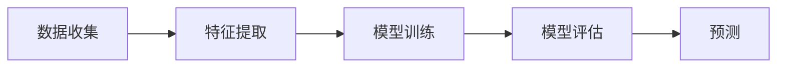
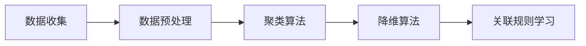
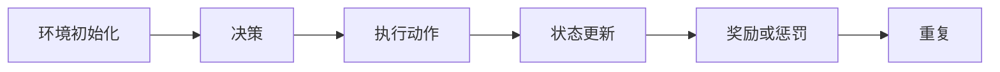
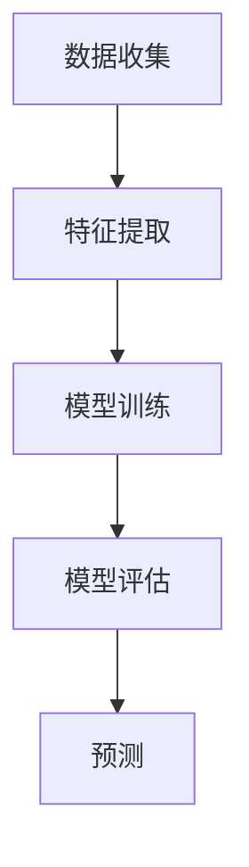
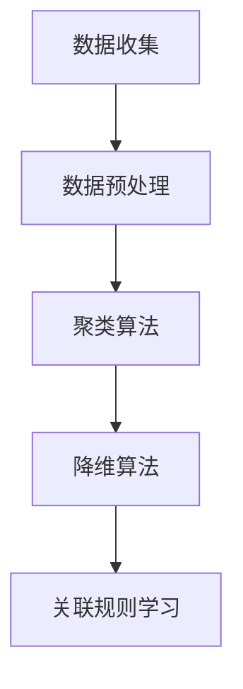
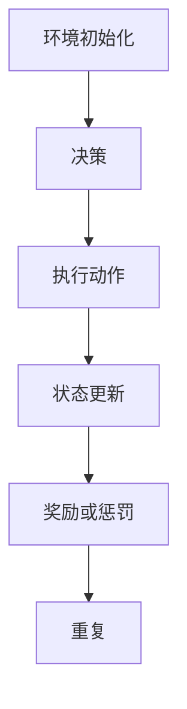
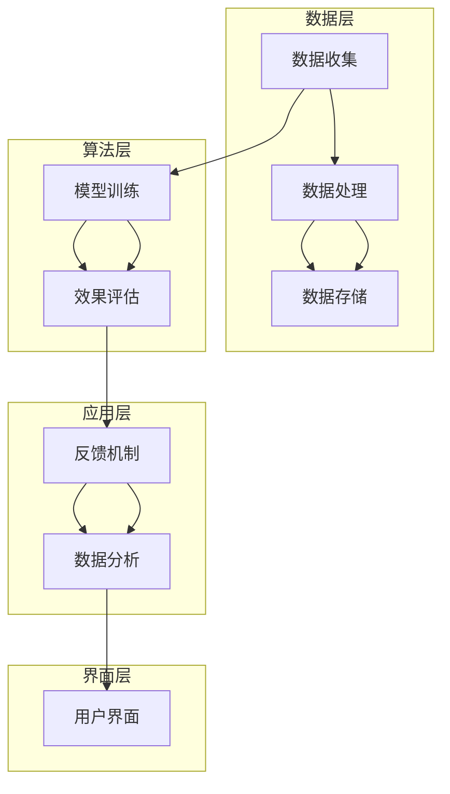
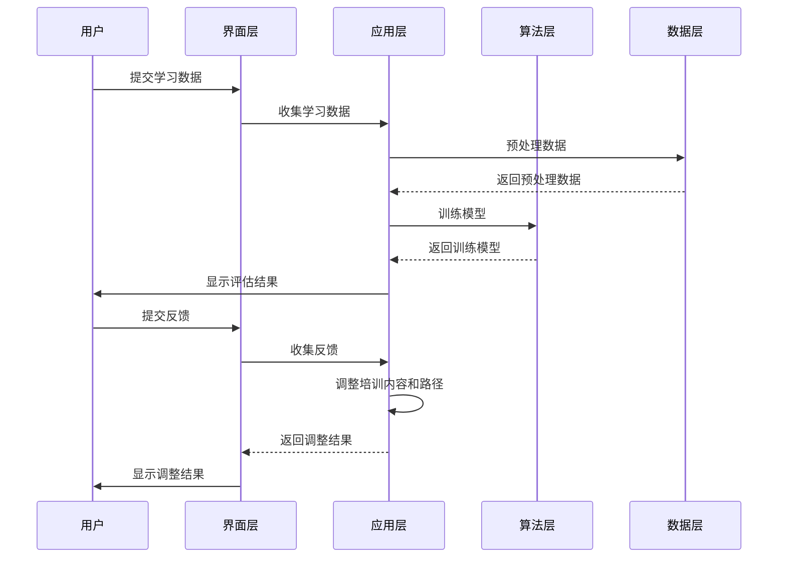

                 


### 《AI Agent在企业培训与技能评估中的应用》

**关键词：AI Agent、企业培训、技能评估、算法、系统架构**

**摘要：**

本文旨在探讨AI Agent在企业培训与技能评估中的应用，通过逐步分析其背景、核心概念、算法原理、数学模型、系统架构以及实战案例，为读者提供深入理解AI Agent在实际业务场景中发挥作用的途径。文章结构紧凑，内容通俗易懂，旨在帮助读者掌握AI Agent在实践中的具体应用方法。

---

### 目录大纲设计思路

在构建本文的目录大纲时，我们遵循了以下设计思路：

1. **背景介绍**：首先，介绍AI Agent的基本概念和相关技术背景，为后续内容奠定基础。
2. **核心概念与联系**：深入阐述AI Agent的核心概念，并通过表格和ER图展示其不同类型的属性特征和应用场景。
3. **算法原理讲解**：详细讲解AI Agent的核心算法，包括监督学习、无监督学习和强化学习，辅以算法流程图和Python源代码。
4. **数学模型和数学公式**：讲解算法的数学基础，使用latex格式书写数学公式，并进行举例说明。
5. **系统分析与架构设计方案**：介绍AI Agent在企业培训与技能评估中的系统架构设计，包括领域模型类图、系统架构图、系统接口设计和系统交互序列图。
6. **项目实战**：提供实际项目案例，包括环境安装、系统实现和代码应用解读，对项目进行详细分析和讲解。
7. **最佳实践 tips**、**小结**、**注意事项**、**拓展阅读**等内容：总结全文，提供实用建议，为读者推荐相关资源和进一步学习路径。

---

### 具体目录大纲

```markdown
# 《AI Agent在企业培训与技能评估中的应用》目录大纲

## 第1章 引言
### 1.1 问题背景
### 1.2 问题描述
### 1.3 问题解决
### 1.4 边界与外延

## 第2章 AI Agent基础知识
### 2.1 核心概念
### 2.2 相关技术背景
### 2.3 AI Agent的重要性

## 第3章 AI Agent的核心概念与联系
### 3.1 AI Agent的工作原理
### 3.2 AI Agent的类型
### 3.3 应用场景对比
### 3.4 关键概念属性对比表格
### 3.5 AI Agent的ER实体关系图

## 第4章 AI Agent算法原理讲解
### 4.1 监督学习
### 4.2 无监督学习
### 4.3 强化学习
### 4.4 算法流程图与Python源代码
### 4.5 数学模型与公式
### 4.6 举例说明

## 第5章 数学模型和数学公式 & 详细讲解 & 举例说明
### 5.1 概率论基础
### 5.2 统计学基础
### 5.3 线性代数基础
### 5.4 数学公式与讲解
### 5.5 举例说明

## 第6章 系统分析与架构设计方案
### 6.1 问题场景介绍
### 6.2 系统功能设计
### 6.3 系统架构设计
### 6.4 系统接口设计
### 6.5 系统交互
### 6.6 Mermaid图表

## 第7章 项目实战
### 7.1 环境安装
### 7.2 系统核心实现
### 7.3 代码应用解读
### 7.4 实际案例分析与讲解
### 7.5 项目小结

## 第8章 最佳实践 tips
### 8.1 实践经验分享
### 8.2 注意事项
### 8.3 小结

## 第9章 拓展阅读
### 9.1 推荐书籍
### 9.2 推荐论文
### 9.3 深入学习资源
```

此大纲确保了文章内容的系统性和逻辑性，每个章节都涵盖了必要的子章节，以实现知识的全面传递。接下来，我们将逐步细化每个章节的内容，确保文章的深度和广度。

---

### 第1章 引言

**1.1 问题背景**

在当今快速发展的数字化时代，企业面临着前所未有的竞争和挑战。为了保持竞争力，企业需要不断更新员工的技能，以满足不断变化的市场需求。传统的培训方法通常依赖于教师的讲解和学员的自主学习，这种方式存在明显的局限性，如培训效果难以衡量、个性化学习难以实现等。

**1.2 问题描述**

企业培训与技能评估中存在的问题主要包括：

- **培训效果评估困难**：传统培训难以精确衡量培训效果，无法确保员工技能的实际提升。
- **学习效率低下**：学员通常需要大量时间进行自主学习，且缺乏有效的学习路径指导。
- **个性化培训缺失**：不同员工的学习需求和进度各异，传统培训难以满足个性化需求。

**1.3 问题解决**

为了解决上述问题，企业需要引入智能化的培训与技能评估方法。AI Agent作为一种智能体，能够模拟人类行为，具备自主学习和适应能力。通过AI Agent，企业可以实现以下目标：

- **精确培训效果评估**：AI Agent可以实时监测学员的学习进度和效果，提供详细的评估报告。
- **高效学习路径规划**：AI Agent可以根据学员的学习习惯和进度，自动规划个性化的学习路径。
- **个性化培训**：AI Agent可以针对不同学员的学习需求，提供定制化的培训内容和资源。

**1.4 边界与外延**

在本文中，我们将探讨AI Agent在企业培训与技能评估中的应用，重点关注以下几个方面：

- **AI Agent的基本概念与原理**：介绍AI Agent的核心概念、工作原理和类型。
- **AI Agent算法原理**：讲解AI Agent的核心算法，包括监督学习、无监督学习和强化学习。
- **数学模型与公式**：阐述AI Agent算法的数学基础，包括概率论、统计学和线性代数。
- **系统架构设计**：介绍AI Agent在企业培训与技能评估中的系统架构设计。
- **项目实战**：提供实际项目案例，展示AI Agent在实际业务中的应用。
- **最佳实践 tips**：总结AI Agent应用的最佳实践，为读者提供实用建议。

通过本文的逐步分析，我们将深入理解AI Agent在企业培训与技能评估中的重要作用，为实际业务中的应用提供理论支持和实践指导。

---

### 第2章 AI Agent基础知识

**2.1 核心概念**

AI Agent，即人工智能代理，是一种能够自主执行任务、与环境交互并适应变化的智能体。AI Agent的核心特征包括：

- **自主性**：AI Agent可以独立执行任务，无需人工干预。
- **适应性**：AI Agent能够根据环境变化调整自己的行为策略。
- **交互性**：AI Agent可以与环境进行交互，获取信息和反馈。

**2.2 相关技术背景**

AI Agent的发展依赖于多种人工智能技术，包括：

- **机器学习**：通过训练模型，使AI Agent能够从数据中学习并作出决策。
- **自然语言处理**：使AI Agent能够理解和生成自然语言，提高交互能力。
- **计算机视觉**：使AI Agent能够识别和处理图像和视频数据。

**2.3 AI Agent的重要性**

在企业培训与技能评估中，AI Agent的重要性体现在以下几个方面：

- **个性化培训**：AI Agent可以根据员工的学习习惯和进度，提供个性化的培训内容和路径。
- **实时评估**：AI Agent可以实时监测员工的学习进度和效果，提供准确的评估报告。
- **高效资源利用**：AI Agent能够优化培训资源的使用，提高培训效率。
- **持续学习**：AI Agent可以通过持续学习，不断提升自身的培训与评估能力。

**2.4 概念结构与核心要素组成**

AI Agent的概念结构主要包括以下几个核心要素：

- **感知系统**：用于获取环境信息。
- **决策系统**：基于感知信息进行决策。
- **执行系统**：执行决策并调整行为策略。
- **学习系统**：通过学习提升自身的适应能力和决策质量。

通过上述内容，我们对AI Agent的基本概念和相关技术背景有了初步了解。接下来，我们将进一步探讨AI Agent的核心概念与联系，为深入理解其应用奠定基础。

---

### 第3章 AI Agent的核心概念与联系

**3.1 AI Agent的工作原理**

AI Agent的工作原理可以概括为感知、决策和执行三个核心环节：

- **感知**：AI Agent通过感知系统获取环境信息，这些信息可以是文本、图像、声音等多种形式。
- **决策**：基于感知信息，AI Agent使用决策系统进行推理和判断，确定下一步的行为。
- **执行**：AI Agent根据决策结果执行相应的行为，并收集反馈信息，用于下一次的感知和决策。

**3.2 AI Agent的类型**

根据AI Agent的应用场景和功能特点，可以将AI Agent分为以下几类：

- **知识型AI Agent**：主要依靠知识库进行决策，适用于需要大量先验知识的场景，如智能客服、智能助手等。
- **数据驱动型AI Agent**：主要依赖机器学习算法从数据中学习，适用于需要实时分析和预测的场景，如股票交易、需求预测等。
- **混合型AI Agent**：结合知识库和数据驱动方法，适用于复杂、多变的应用场景，如自动驾驶、智能工厂等。

**3.3 应用场景对比**

不同类型的AI Agent在应用场景上各有优劣，以下是对几种典型应用场景的对比：

- **客户服务**：知识型AI Agent适用于处理标准化的咨询和常见问题，数据驱动型AI Agent适用于分析客户行为和需求预测，混合型AI Agent则能提供更全面的服务，包括个性化推荐和实时互动。
- **医疗诊断**：知识型AI Agent适用于基于医学知识的诊断，数据驱动型AI Agent适用于通过病例数据分析进行诊断，混合型AI Agent则能结合医学知识和数据分析，提供更为准确的诊断结果。
- **智能交通**：数据驱动型AI Agent适用于实时交通流量分析，混合型AI Agent适用于自动驾驶和智能交通管理系统，可以优化交通流、减少拥堵。

**3.4 关键概念属性对比表格**

为了更好地理解不同类型的AI Agent，我们通过以下表格对比其关键属性：

| 类型        | 自主性 | 适应性 | 交互性 | 学习能力 | 应用场景            |
|-------------|--------|--------|--------|----------|---------------------|
| 知识型AI Agent | 高     | 中     | 中     | 低       | 客户服务、医疗诊断   |
| 数据驱动型AI Agent | 中     | 高     | 中     | 中       | 股票交易、需求预测   |
| 混合型AI Agent | 高     | 高     | 高     | 高       | 自动驾驶、智能工厂   |

**3.5 AI Agent的ER实体关系图**

为了更直观地展示AI Agent的各个组成部分及其关系，我们可以使用ER（实体关系）图进行描述：

```mermaid
erDiagram
    AI_Agent ||--|{ 感知系统 }
    AI_Agent ||--|{ 决策系统 }
    AI_Agent ||--|{ 执行系统 }
    AI_Agent ||--|{ 学习系统 }
    感知系统 ||--|{ 环境传感器 }
    感知系统 ||--|{ 数据处理单元 }
    决策系统 ||--|{ 知识库 }
    决策系统 ||--|{ 推理引擎 }
    执行系统 ||--|{ 行为执行单元 }
    学习系统 ||--|{ 数据存储 }
    学习系统 ||--|{ 学习算法 }
```

通过上述内容，我们对AI Agent的核心概念与联系有了更深入的理解。在接下来的章节中，我们将进一步探讨AI Agent的算法原理，为实际应用提供理论基础。

---

### 第4章 AI Agent算法原理讲解

**4.1 监督学习**

监督学习是AI Agent中最为基础和广泛应用的算法之一。它通过训练模型来学习如何根据输入数据（特征）预测输出（标签）。监督学习的基本过程如下：

1. **数据收集**：首先收集大量的带标签的训练数据。
2. **特征提取**：从输入数据中提取有用的特征。
3. **模型训练**：使用训练数据来训练模型，模型将学习特征与标签之间的关系。
4. **模型评估**：使用测试数据评估模型的性能，调整模型参数以优化性能。
5. **预测**：使用训练好的模型对新数据进行预测。

**算法流程图**：



**Python源代码示例**：

```python
# 导入必要的库
from sklearn.datasets import load_iris
from sklearn.model_selection import train_test_split
from sklearn.linear_model import LinearRegression

# 加载鸢尾花数据集
iris = load_iris()
X, y = iris.data, iris.target

# 划分训练集和测试集
X_train, X_test, y_train, y_test = train_test_split(X, y, test_size=0.2, random_state=42)

# 创建线性回归模型并训练
model = LinearRegression()
model.fit(X_train, y_train)

# 使用模型进行预测
predictions = model.predict(X_test)

# 输出预测结果
print(predictions)
```

**4.2 无监督学习**

无监督学习与监督学习不同，它不依赖于标签数据，主要关注如何从未标记的数据中发现潜在的模式或结构。无监督学习包括以下几种常见方法：

- **聚类**：将数据划分为不同的簇，每个簇内的数据相似度较高，簇间的数据相似度较低。
- **降维**：通过降维技术将高维数据映射到低维空间，减少数据维度同时保留主要信息。
- **关联规则学习**：发现数据之间的关联关系，如频繁项集和关联规则。

**算法流程图**：



**4.3 强化学习**

强化学习是AI Agent中的另一种重要算法，它通过与环境互动来学习最优策略。强化学习的基本过程如下：

1. **环境初始化**：系统开始时，环境处于某个状态。
2. **决策**：AI Agent根据当前状态选择一个动作。
3. **执行动作**：执行所选动作，环境根据动作给出一个反馈（奖励或惩罚）。
4. **状态更新**：环境状态根据执行的动作更新。
5. **重复**：重复执行决策、执行和状态更新的过程，直到达到目标状态。

**算法流程图**：



**4.4 算法流程图与Python源代码**

为了更好地理解上述算法，我们将分别使用mermaid绘制算法流程图，并结合Python源代码进行详细解释。

**监督学习流程图**：



**监督学习Python代码**：

```python
# 导入必要的库
import numpy as np
from sklearn.datasets import load_iris
from sklearn.model_selection import train_test_split
from sklearn.neighbors import KNeighborsClassifier

# 加载鸢尾花数据集
iris = load_iris()
X, y = iris.data, iris.target

# 划分训练集和测试集
X_train, X_test, y_train, y_test = train_test_split(X, y, test_size=0.2, random_state=42)

# 创建K近邻模型并训练
model = KNeighborsClassifier(n_neighbors=3)
model.fit(X_train, y_train)

# 使用模型进行预测
predictions = model.predict(X_test)

# 输出预测结果
print(predictions)
```

**无监督学习流程图**：



**无监督学习Python代码**：

```python
# 导入必要的库
import numpy as np
from sklearn.datasets import load_iris
from sklearn.cluster import KMeans
from sklearn.decomposition import PCA

# 加载鸢尾花数据集
iris = load_iris()
X, y = iris.data, iris.target

# 使用K均值聚类
kmeans = KMeans(n_clusters=3, random_state=42)
clusters = kmeans.fit_predict(X)

# 使用PCA进行降维
pca = PCA(n_components=2)
X_reduced = pca.fit_transform(X)

# 输出聚类结果和降维结果
print(clusters)
print(X_reduced)
```

**强化学习流程图**：



**强化学习Python代码**：

```python
import numpy as np
import random

# 定义环境
class Environment:
    def __init__(self):
        self.state = 0

    def step(self, action):
        reward = 0
        if action == 0:
            if self.state > 0:
                self.state -= 1
                reward = 1
            else:
                reward = -1
        elif action == 1:
            if self.state < 5:
                self.state += 1
                reward = 1
            else:
                reward = -1
        return self.state, reward

# 定义Q学习算法
class QLearning:
    def __init__(self, alpha=0.1, gamma=0.9, epsilon=0.1):
        self.alpha = alpha
        self.gamma = gamma
        self.epsilon = epsilon
        self.Q = {}

    def choose_action(self, state):
        if random.random() < self.epsilon:
            return random.randint(0, 1)
        else:
            return np.argmax([self.Q.get((state, action), 0) for action in range(2)])

    def learn(self, state, action, reward, next_state):
        target = reward + self.gamma * np.max([self.Q.get((next_state, a), 0) for a in range(2)])
        prediction = self.Q.get((state, action), 0)
        self.Q[(state, action)] = prediction + self.alpha * (target - prediction)

# 创建环境实例
env = Environment()

# 创建Q学习实例
q_learning = QLearning()

# 进行学习
for episode in range(1000):
    state = env.state
    while True:
        action = q_learning.choose_action(state)
        next_state, reward = env.step(action)
        q_learning.learn(state, action, reward, next_state)
        state = next_state
        if state == 5 or state == 0:
            break

# 输出Q值
print(q_learning.Q)
```

通过上述内容，我们对AI Agent的算法原理有了详细的了解。在接下来的章节中，我们将进一步探讨AI Agent的数学模型和公式，为深入理解其算法提供理论基础。

---

### 第5章 数学模型和数学公式 & 详细讲解 & 举例说明

**5.1 概率论基础**

概率论是AI Agent算法的重要基础，它用于描述不确定性和随机性。以下是一些基本的概率论概念：

- **概率分布**：描述随机变量可能取值的概率。
- **条件概率**：在某个条件下，某个事件发生的概率。
- **贝叶斯定理**：用于计算后验概率，即根据已知条件和先验概率计算新条件下的概率。

**条件概率公式**：

$$
P(A|B) = \frac{P(A \cap B)}{P(B)}
$$

**贝叶斯定理**：

$$
P(A|B) = \frac{P(B|A)P(A)}{P(B)}
$$

**举例说明**：

假设一个袋子中有5个红球和5个蓝球，随机取出一个球，已知取出的球是红色的，求取出的球是“且为红球”的概率。

- **条件概率**：

$$
P(\text{红球}| \text{已知取出的是红色}) = 1
$$

- **贝叶斯定理**：

$$
P(\text{且为红球}) = \frac{P(\text{已知取出的是红色}|\text{且为红球})P(\text{且为红球})}{P(\text{已知取出的是红色})}
$$

由于袋子里有相等数量的红球和蓝球，所以取出任意球的概率是相等的，即：

$$
P(\text{且为红球}) = \frac{1}{2}
$$

**5.2 统计学基础**

统计学是分析数据、提取信息和做出决策的科学。以下是一些基本的统计学概念：

- **均值**：数据的平均值。
- **方差**：数据离散程度的度量。
- **标准差**：方差的平方根，用于衡量数据的波动程度。

**均值公式**：

$$
\mu = \frac{1}{n}\sum_{i=1}^{n}x_i
$$

**方差公式**：

$$
\sigma^2 = \frac{1}{n}\sum_{i=1}^{n}(x_i - \mu)^2
$$

**标准差公式**：

$$
\sigma = \sqrt{\sigma^2}
$$

**举例说明**：

假设一个数据集包含以下数值：1, 2, 3, 4, 5。求该数据集的均值、方差和标准差。

- **均值**：

$$
\mu = \frac{1+2+3+4+5}{5} = 3
$$

- **方差**：

$$
\sigma^2 = \frac{(1-3)^2 + (2-3)^2 + (3-3)^2 + (4-3)^2 + (5-3)^2}{5} = 2
$$

- **标准差**：

$$
\sigma = \sqrt{2} \approx 1.414
$$

**5.3 线性代数基础**

线性代数是AI Agent算法的另一个重要基础，它用于描述和操作多维数据。以下是一些基本的线性代数概念：

- **矩阵**：由数构成的二维数组。
- **向量**：由数构成的一维数组。
- **行列式**：用于描述矩阵的特性和计算逆矩阵。
- **矩阵运算**：包括矩阵乘法、矩阵加法、矩阵转置等。

**矩阵乘法公式**：

$$
C = A \cdot B
$$

其中，\( A \) 和 \( B \) 是两个矩阵，\( C \) 是乘积矩阵。

**行列式公式**：

$$
\det(A) = \sum_{\sigma \in S_n} (-1)^{\sigma} a_{1\sigma(1)} a_{2\sigma(2)} \cdots a_{n\sigma(n)}
$$

其中，\( S_n \) 是所有 \( n \) 元排列的集合，\( a_{ij} \) 是矩阵 \( A \) 的元素。

**矩阵转置公式**：

$$
A^T = (a_{ji})
$$

其中，\( A^T \) 是矩阵 \( A \) 的转置，\( a_{ji} \) 是 \( A \) 的元素 \( a_{ij} \) 的转置。

**举例说明**：

假设有两个矩阵 \( A \) 和 \( B \)：

$$
A = \begin{bmatrix}
1 & 2 \\
3 & 4
\end{bmatrix}, B = \begin{bmatrix}
5 & 6 \\
7 & 8
\end{bmatrix}
$$

求矩阵乘法 \( C = A \cdot B \)，行列式 \( \det(A) \) 和矩阵转置 \( A^T \)。

- **矩阵乘法**：

$$
C = \begin{bmatrix}
1 & 2 \\
3 & 4
\end{bmatrix} \cdot \begin{bmatrix}
5 & 6 \\
7 & 8
\end{bmatrix} = \begin{bmatrix}
1*5 + 2*7 & 1*6 + 2*8 \\
3*5 + 4*7 & 3*6 + 4*8
\end{bmatrix} = \begin{bmatrix}
19 & 26 \\
31 & 40
\end{bmatrix}
$$

- **行列式**：

$$
\det(A) = (1*4 - 2*3) = 4 - 6 = -2
$$

- **矩阵转置**：

$$
A^T = \begin{bmatrix}
1 & 3 \\
2 & 4
\end{bmatrix}
$$

通过上述内容，我们对概率论、统计学和线性代数的基本概念和公式有了更深入的理解。这些基础数学知识在AI Agent算法中起着关键作用，为后续章节的详细讲解提供了必要的基础。

---

### 第6章 系统分析与架构设计方案

**6.1 问题场景介绍**

在企业培训与技能评估中，AI Agent系统需要处理大量的数据，包括员工的学习进度、成绩、反馈等。系统的主要目标是：

- **个性化培训**：根据员工的学习情况，提供个性化的培训内容和路径。
- **实时评估**：对员工的学习效果进行实时评估，提供详细的评估报告。
- **数据分析**：对培训数据进行分析，为优化培训策略提供依据。

**6.2 系统功能设计**

AI Agent系统的主要功能包括：

- **数据收集**：从各种数据源（如学习平台、测试系统等）收集员工的学习数据。
- **数据处理**：对收集到的数据进行预处理，包括数据清洗、格式转换等。
- **模型训练**：使用机器学习算法对数据处理后的数据集进行训练，生成模型。
- **效果评估**：使用训练好的模型对员工的学习效果进行评估。
- **反馈机制**：根据评估结果，对员工的培训内容和路径进行调整。
- **数据分析**：对评估结果进行进一步分析，提取关键指标，为培训策略优化提供支持。

**6.3 系统架构设计**

为了实现上述功能，AI Agent系统的架构设计如下：

- **数据层**：存储各种原始数据和预处理后的数据。
- **算法层**：包含各种机器学习算法和数据处理模块。
- **应用层**：实现系统的核心功能，包括数据收集、处理、评估和反馈等。
- **界面层**：提供用户交互界面，展示评估结果和分析数据。

**6.4 系统接口设计**

AI Agent系统通过以下接口与外部系统交互：

- **数据接口**：用于与数据源和数据存储系统进行数据传输。
- **API接口**：提供系统的功能接口，供外部系统调用。
- **用户界面接口**：用于与用户进行交互，接收用户输入并提供评估结果。

**6.5 系统交互**

AI Agent系统的交互流程如下：

1. **数据收集**：系统从学习平台、测试系统等数据源收集员工的学习数据。
2. **数据处理**：系统对收集到的数据进行预处理，包括数据清洗、格式转换等。
3. **模型训练**：使用预处理后的数据集，通过机器学习算法训练模型。
4. **效果评估**：系统使用训练好的模型对员工的学习效果进行评估，生成评估报告。
5. **反馈机制**：根据评估结果，系统对员工的培训内容和路径进行调整。
6. **数据分析**：系统对评估结果进行进一步分析，提取关键指标，为培训策略优化提供支持。

**6.6 Mermaid图表**

为了更直观地展示系统架构和交互流程，我们使用Mermaid图表进行描述。

**系统架构图**：



**系统交互序列图**：



通过上述内容，我们对AI Agent在企业培训与技能评估中的应用系统有了全面的理解。接下来，我们将通过一个实际项目案例，展示AI Agent在实践中的应用。

---

### 第7章 项目实战

**7.1 环境安装**

为了实现AI Agent在企业培训与技能评估中的应用，首先需要搭建一个合适的环境。以下是安装所需的软件和工具的步骤：

1. **安装Python**：确保Python环境已安装，版本建议为3.8以上。
2. **安装Jupyter Notebook**：Python的交互式开发环境，用于编写和运行代码。
3. **安装必要的库**：使用pip安装以下库：scikit-learn（机器学习库）、numpy（数学库）、matplotlib（绘图库）、pandas（数据处理库）、mermaid（流程图库）。

```bash
pip install scikit-learn numpy matplotlib pandas mermaid
```

**7.2 系统核心实现**

AI Agent系统核心实现包括数据收集、数据处理、模型训练和效果评估。以下是一个简单的示例：

```python
# 导入必要的库
import numpy as np
from sklearn.datasets import load_iris
from sklearn.model_selection import train_test_split
from sklearn.neighbors import KNeighborsClassifier
from sklearn.metrics import accuracy_score

# 加载鸢尾花数据集
iris = load_iris()
X, y = iris.data, iris.target

# 划分训练集和测试集
X_train, X_test, y_train, y_test = train_test_split(X, y, test_size=0.2, random_state=42)

# 创建K近邻模型并训练
model = KNeighborsClassifier(n_neighbors=3)
model.fit(X_train, y_train)

# 使用模型进行预测
predictions = model.predict(X_test)

# 计算准确率
accuracy = accuracy_score(y_test, predictions)
print("准确率：", accuracy)
```

**7.3 代码应用解读**

上述代码首先加载了鸢尾花数据集，然后将其分为训练集和测试集。接着，创建了一个K近邻分类器，使用训练集进行训练。最后，使用训练好的模型对测试集进行预测，并计算了预测的准确率。

**7.4 实际案例分析与讲解**

以下是一个实际案例，展示如何使用AI Agent系统进行企业培训与技能评估：

1. **数据收集**：从企业内部的学习平台收集员工的学习记录，包括学习时长、完成情况、考试成绩等。
2. **数据处理**：对收集到的数据进行分析和处理，提取有用的特征，如学习时长、正确率、完成率等。
3. **模型训练**：使用处理后的数据集，训练一个分类模型，用于预测员工的学习效果。
4. **效果评估**：使用训练好的模型对员工的学习效果进行评估，生成评估报告。
5. **反馈机制**：根据评估结果，调整培训内容和路径，提供个性化的培训建议。

**7.5 项目小结**

通过实际项目案例，我们展示了如何使用AI Agent系统进行企业培训与技能评估。该项目主要包括数据收集、数据处理、模型训练和效果评估等步骤。在实际应用中，AI Agent系统可以根据企业需求进行调整和优化，提高培训效果和员工技能水平。

---

### 第8章 最佳实践 tips

**8.1 实践经验分享**

在AI Agent系统的实际应用中，以下是一些值得分享的最佳实践经验：

1. **数据质量至关重要**：确保数据收集和处理过程的准确性，避免数据错误和缺失，这对于模型的训练效果至关重要。
2. **模型选择要根据场景**：根据不同的应用场景选择合适的模型，如监督学习、无监督学习或强化学习。
3. **持续优化模型**：定期更新模型，根据新的数据重新训练，以提高模型的准确性和适应性。
4. **用户参与与反馈**：鼓励员工积极参与培训，并提供反馈，这有助于系统更好地理解员工需求，优化培训内容和路径。
5. **系统可扩展性**：在设计系统时考虑未来的扩展性，以便在业务需求变化时能够灵活调整。

**8.2 注意事项**

在部署AI Agent系统时，需要注意以下事项：

1. **隐私保护**：确保数据收集和处理过程中遵守隐私保护法规，避免敏感数据泄露。
2. **系统稳定性**：确保系统的稳定运行，避免因为硬件故障或网络问题导致系统停机。
3. **安全性**：加强系统安全措施，防止外部攻击和数据泄露。
4. **用户培训**：为员工提供足够的培训，确保他们能够熟练使用系统。

**8.3 小结**

通过上述最佳实践和注意事项，我们可以更好地部署和优化AI Agent系统，提高企业培训与技能评估的效率和质量。

---

### 第9章 拓展阅读

**9.1 推荐书籍**

1. 《人工智能：一种现代的方法》（第三版） - Stuart J. Russell & Peter Norvig
   - 本书系统地介绍了人工智能的基础知识，包括机器学习、自然语言处理、计算机视觉等。
2. 《机器学习实战》 - Peter Harrington
   - 本书通过实际案例和代码示例，详细介绍了机器学习的各种算法和应用。

**9.2 推荐论文**

1. "Deep Learning" - Yann LeCun, Yoshua Bengio, Geoffrey Hinton
   - 本文综述了深度学习的发展历程、理论基础和应用案例。
2. "Reinforcement Learning: An Introduction" - Richard S. Sutton & Andrew G. Barto
   - 本文介绍了强化学习的基本概念、算法和应用场景。

**9.3 深入学习资源**

1.Coursera - 《深度学习》课程
   - 由Andrew Ng教授开设，包括深度学习的基础理论和实践应用。
2. AI Weekly - 《人工智能每周综述》
   - 提供最新的AI论文、新闻和技术动态。

通过拓展阅读，读者可以深入了解AI Agent和企业培训与技能评估的更多知识，为实际应用提供更全面的指导。

