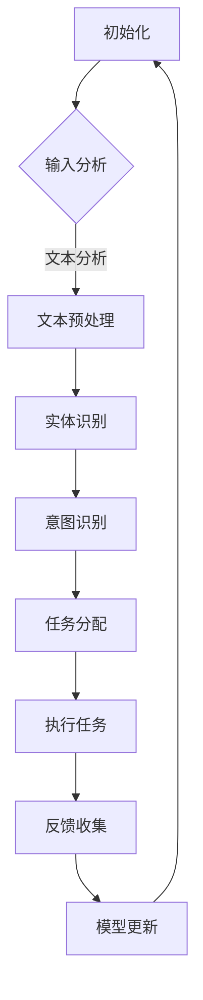
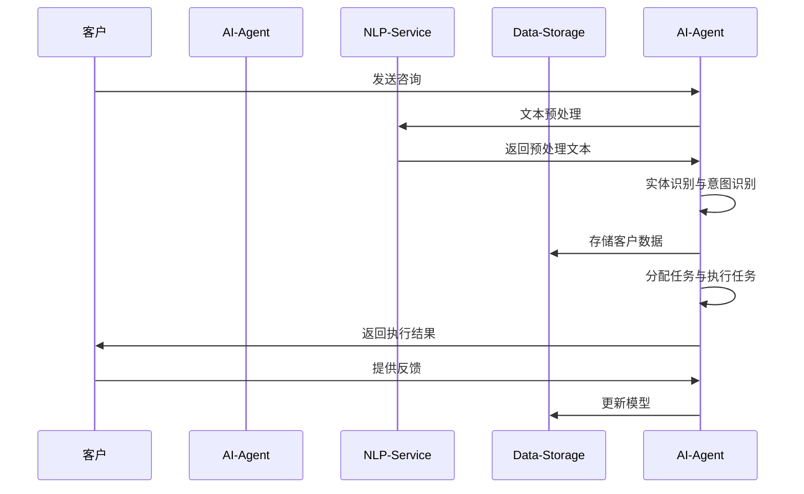

                 

# AI Agent在企业客户体验优化中的角色

## 关键词
AI Agent、客户体验、自然语言处理、机器学习、自动化服务、智能化客服

## 摘要
本文将探讨AI Agent在企业客户体验优化中的关键角色，通过详细分析其工作原理、算法实现和实际应用，帮助企业理解和利用AI Agent技术提升客户服务水平。本文将从背景介绍、核心概念与联系、算法原理讲解、系统分析与架构设计方案、项目实战及最佳实践等多个方面进行论述。

### 1. 背景介绍

#### 问题背景
随着人工智能技术的快速发展，AI Agent（人工智能代理）已经成为企业优化客户体验的重要工具。客户体验的优化不仅关乎企业的市场竞争力，更是客户忠诚度和满意度的关键因素。在激烈的市场竞争中，企业需要利用先进的技术手段，提升客户服务水平，增强客户粘性，从而实现业务的持续增长。

#### 问题解决
AI Agent作为智能客服的代表，通过自然语言处理、机器学习等技术，能够提供高效的客户服务，实现与客户的实时互动，从而优化客户体验。本书旨在探讨AI Agent在企业客户体验优化中的角色，帮助企业和IT专业人员了解如何利用AI Agent技术提升客户服务水平。

#### 边界与外延
AI Agent的应用范围广泛，包括但不限于客户服务、营销、数据分析等领域。本书主要关注AI Agent在客户服务中的应用，旨在通过深入分析AI Agent的工作原理和实施方法，为企业提供实用的指导。

### 2. 核心概念与联系

#### 核心概念原理

- **AI Agent**：一种能够模拟人类智能行为，独立执行任务的计算机程序。AI Agent能够通过学习和适应环境，实现自主决策和执行。

- **客户体验**：客户在接触和使用企业的产品或服务过程中所感受到的整体体验。良好的客户体验能够提升客户的满意度和忠诚度。

- **自然语言处理（NLP）**：使计算机能够理解、处理和生成自然语言的技术。NLP是实现AI Agent与客户互动的核心技术之一。

- **机器学习**：通过数据驱动的方式，让计算机系统从数据中学习，进而对新的数据做出预测或决策的技术。

#### 概念属性特征对比表格

| 概念      | 定义                                                         | 关键特性                                                                                                     |
| --------- | ------------------------------------------------------------ | ---------------------------------------------------------------------------------------------------------- |
| AI Agent  | 能够模拟人类智能行为，独立执行任务的计算机程序               | 自主决策、自适应环境、高效交互                                                           |
| 客户体验  | 客户在接触和使用企业的产品或服务过程中所感受到的整体体验   | 满意度、忠诚度、客户粘性                                                               |
| NLP       | 使计算机能够理解、处理和生成自然语言的技术                 | 语言理解、语言生成、情感分析                                                             |
| 机器学习  | 通过数据驱动的方式，让计算机系统从数据中学习，进而对新的数据做出预测或决策的技术 | 自动化学习、数据依赖、可解释性                                                         |

#### ER实体关系图架构

```mermaid
erDiagram
  AI_Agent ||--|{ 客户体验 }|| Customer_experience
  AI_Agent ||--|{ 自然语言处理 }|| NLP
  AI_Agent ||--|{ 机器学习 }|| Machine_learning
  Customer_experience ||--|{ 客户 }|| Customer
  Customer_experience ||--|{ 服务 }|| Service
```

### 3. 算法原理讲解

#### 算法mermaid流程图



#### 算法原理详细讲解

AI Agent的工作原理可以概括为以下几个步骤：

1. **初始化**：AI Agent启动并加载预训练模型和参数。

2. **输入分析**：接收客户输入的信息，如文本、语音等。

3. **文本预处理**：对输入文本进行清洗、分词、词性标注等处理。

4. **实体识别**：使用NLP技术识别文本中的关键实体，如人名、地名、产品名称等。

5. **意图识别**：分析客户输入的意图，如查询信息、提出问题、投诉反馈等。

6. **任务分配**：根据意图识别的结果，将任务分配给不同的模块或接口进行处理。

7. **执行任务**：根据任务分配的结果，执行相应的操作，如查询数据库、调用API接口等。

8. **反馈收集**：收集客户对执行结果的反馈。

9. **模型更新**：根据反馈信息对模型进行更新，提高后续服务的准确性。

下面是一个简化的算法流程：

```python
def ai_agent(input_text):
    # 初始化
    model = load_pretrained_model()
    
    # 输入分析
    input_data = preprocess_text(input_text)
    
    # 文本预处理
    preprocessed_text = preprocess_text(input_data)
    
    # 实体识别
    entities = entity_recognition(preprocessed_text)
    
    # 意图识别
    intent = intent_recognition(preprocessed_text)
    
    # 任务分配
    task = assign_task(intent)
    
    # 执行任务
    result = execute_task(task, entities)
    
    # 反馈收集
    feedback = collect_feedback(result)
    
    # 模型更新
    update_model(model, feedback)
    
    return result
```

### 4. 系统分析与架构设计方案

#### 问题场景介绍
在企业客户服务中，客户经常遇到各种问题，如产品咨询、售后服务、投诉反馈等。传统的客服方式效率低下，难以满足客户的需求。因此，企业需要引入AI Agent来提升客户服务效率和质量。

#### 项目介绍
本项目旨在构建一个基于AI Agent的智能客服系统，通过自然语言处理和机器学习技术，实现与客户的实时互动，提供高效、准确的客户服务。

#### 系统功能设计
系统功能主要包括：
- 客户咨询处理
- 售后服务管理
- 投诉反馈处理
- 客户数据分析与优化

#### 系统架构设计
系统架构采用微服务架构，包括以下模块：
- AI Agent核心服务
- 自然语言处理服务
- 数据存储服务
- 客户服务接口

#### 系统接口设计和系统交互



### 5. 项目实战

#### 环境安装
- 安装Python环境：`pip install python`
- 安装依赖库：`pip install nltk sklearn tensorflow`

#### 系统核心实现源代码

```python
import nltk
from nltk.tokenize import word_tokenize
from sklearn.feature_extraction.text import TfidfVectorizer
from sklearn.model_selection import train_test_split
from sklearn.naive_bayes import MultinomialNB
from sklearn.pipeline import make_pipeline

# 加载并预处理数据
nltk.download('punkt')
nltk.download('stopwords')

def preprocess_text(text):
    # 分词
    tokens = word_tokenize(text)
    # 去除停用词
    tokens = [token for token in tokens if token not in nltk.corpus.stopwords.words('english')]
    return ' '.join(tokens)

# 加载数据集
data = [...]
X = [preprocess_text(text) for text in data['query']]
y = data['label']

# 划分训练集和测试集
X_train, X_test, y_train, y_test = train_test_split(X, y, test_size=0.2, random_state=42)

# 构建模型
model = make_pipeline(TfidfVectorizer(), MultinomialNB())

# 训练模型
model.fit(X_train, y_train)

# 预测
def predict(query):
    preprocessed_query = preprocess_text(query)
    prediction = model.predict([preprocessed_query])
    return prediction[0]

# 测试
print(predict("How can I return a product?"))

```

#### 代码应用解读与分析
以上代码实现了一个基于朴素贝叶斯分类器的AI Agent，用于处理客户咨询。首先，代码加载并预处理数据集，然后使用TF-IDF向量器进行特征提取，最后使用朴素贝叶斯分类器进行训练。在实际应用中，AI Agent通过预处理客户输入的查询文本，提取关键特征，并根据训练好的模型进行分类预测，从而提供相应的回答。

#### 实际案例分析和详细讲解剖析
假设有一个客户咨询：“How can I return a product?”，AI Agent将按照以下步骤进行处理：
1. **初始化**：加载预训练模型和参数。
2. **输入分析**：接收客户输入的信息。
3. **文本预处理**：对输入文本进行分词和去除停用词处理。
4. **实体识别与意图识别**：识别文本中的关键实体（如“return a product”）和意图（如“查询退货流程”）。
5. **任务分配**：将任务分配给相应的模块或接口。
6. **执行任务**：查询数据库或调用API接口，获取退货流程信息。
7. **反馈收集**：收集客户对执行结果的反馈。
8. **模型更新**：根据反馈信息对模型进行更新。

通过实际案例的分析，可以看到AI Agent能够高效地处理客户咨询，提供准确的回答。在实际应用中，AI Agent还可以根据客户反馈不断优化模型，提高服务质量。

#### 项目小结
本项目通过引入AI Agent技术，实现了智能客服系统，提高了客户服务效率和质量。在实际应用中，AI Agent可以通过不断学习和优化，进一步提升客户体验。未来，随着人工智能技术的不断发展，AI Agent将在更多领域发挥重要作用，为企业带来更多价值。

### 6. 最佳实践 tips

1. **数据质量**：确保输入数据的质量，对数据进行清洗和预处理，以提高模型性能。

2. **模型优化**：定期更新和优化模型，使其适应不断变化的环境。

3. **用户体验**：关注用户反馈，优化交互界面和回答质量，提升用户体验。

4. **安全与隐私**：保护客户隐私，确保数据安全和合规。

5. **持续学习**：鼓励AI Agent不断学习，提高智能化水平。

### 7. 小结与注意事项

本文介绍了AI Agent在企业客户体验优化中的角色，通过深入分析其工作原理和实际应用，展示了AI Agent在提升客户服务效率和质量方面的优势。企业在实施AI Agent时，需要注意数据质量、模型优化和用户体验等方面，确保AI Agent能够真正发挥其价值。

### 8. 拓展阅读

- [《人工智能：一种现代方法》](https://book.douban.com/subject/25873511/)
- [《机器学习实战》](https://book.douban.com/subject/24744443/)
- [《自然语言处理原理与汉语语法》](https://book.douban.com/subject/26367215/)

### 作者信息

作者：AI天才研究院/AI Genius Institute & 禅与计算机程序设计艺术 /Zen And The Art of Computer Programming

