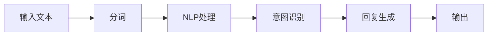
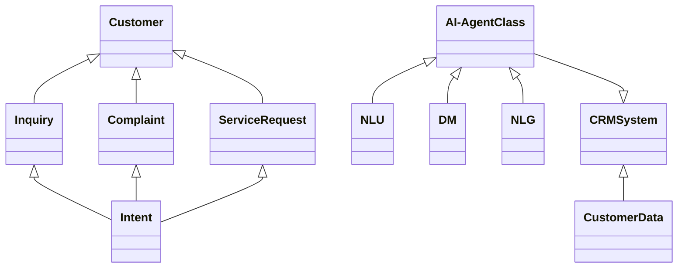
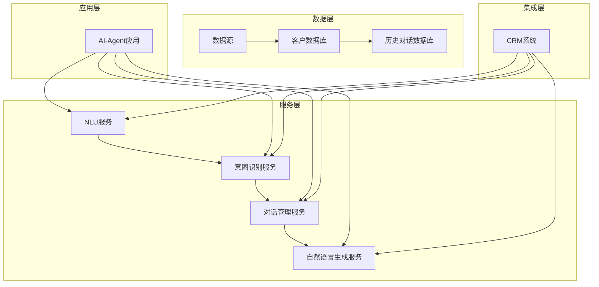
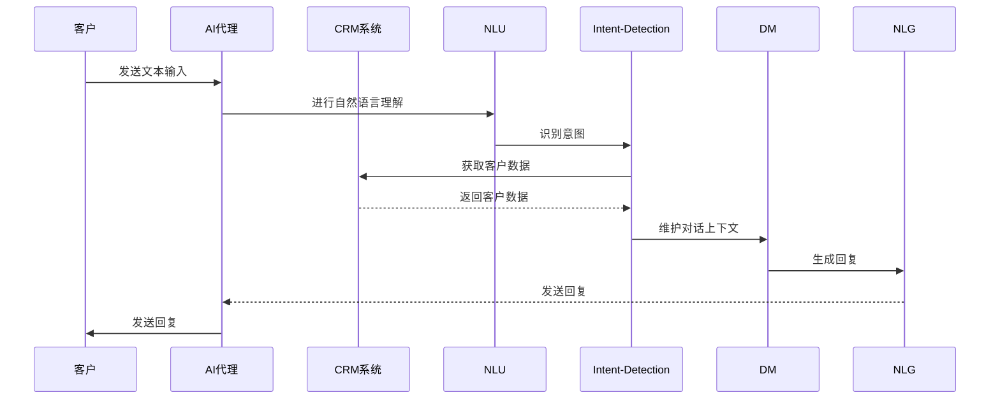

                 


# AI Agent在企业客户服务自动化中的角色

> 关键词：AI Agent、企业客户服务、自动化、自然语言处理、机器学习

> 摘要：本文将深入探讨AI Agent在企业客户服务自动化中的角色。我们将从背景介绍、核心概念与联系、算法原理讲解、系统分析与架构设计以及项目实战等方面展开，旨在帮助读者全面了解AI Agent在提升企业客户服务自动化水平中的重要性。

#### # 第一部分：背景介绍

##### 1.1 问题背景

随着全球企业竞争的加剧，客户服务质量成为企业赢得市场竞争的关键因素。然而，传统的客户服务模式在处理大量客户请求时存在效率低下、成本高昂的问题。尤其在客户期望越来越高的今天，企业需要提供快速、个性化且高效的客户服务。这就催生了企业客户服务自动化的需求。

客户服务自动化的核心挑战在于如何利用现代技术手段提高服务效率和降低成本。传统的客户服务通常依赖于人工处理，这不仅效率低，而且容易出错。随着人工智能技术的快速发展，特别是自然语言处理（NLP）和机器学习（ML）技术的进步，AI Agent成为了企业客户服务自动化的重要工具。

##### 1.2 问题描述

AI Agent在企业客户服务自动化中扮演着至关重要的角色。它们能够通过智能对话、情感分析和自动化处理客户请求，从而提高服务效率、降低运营成本。然而，如何实现AI Agent的高效应用，仍然面临一系列挑战：

- **如何处理大量的客户请求？**
- **如何确保AI Agent能够理解并正确回应客户的意图？**
- **如何将AI Agent与其他客户服务工具（如CRM系统）集成？**
- **如何保证AI Agent在处理客户问题时的一致性和准确性？**

##### 1.3 问题解决

AI Agent的核心技术主要包括自然语言处理（NLP）、机器学习（ML）和深度学习（DL）。通过这些技术的结合，AI Agent能够实现高效的客户服务自动化。例如，自然语言处理技术可以用于理解客户的意图和情感，机器学习技术可以用于从历史数据中学习并优化服务策略，深度学习技术则可以用于实现复杂的模式识别和特征提取。

此外，AI Agent还需要与其他客户服务工具（如CRM系统）进行集成，以实现客户数据的统一管理和处理。通过这些技术手段，企业可以大幅提升客户服务质量，降低运营成本，从而在激烈的市场竞争中脱颖而出。

##### 1.4 边界与外延

AI Agent在企业客户服务自动化中的应用范围非常广泛，包括但不限于以下功能：

- **自动化对话**：AI Agent可以自动回答常见客户问题，减少人工干预，提高服务效率。
- **智能推荐**：AI Agent可以根据客户的历史数据和偏好，提供个性化的产品和服务推荐。
- **情感分析**：AI Agent可以分析客户的语言和情感，识别客户的满意度，从而优化服务策略。
- **自动化处理**：AI Agent可以自动处理各种客户请求，如订单查询、投诉处理等。

然而，AI Agent也存在着一定的边界。例如，对于复杂或模糊的问题，AI Agent可能无法给出准确的回答。此外，AI Agent还需要与其他客户服务工具进行有效集成，以实现数据共享和协同工作。

##### 1.5 概念结构与核心要素组成

AI Agent的核心结构包括以下几个关键模块：

- **自然语言理解（NLU）**：用于理解客户的语言和意图，包括词法分析、句法分析和语义分析等。
- **对话管理（DM）**：用于管理对话流程，包括意图识别、上下文维护和对话生成等。
- **自然语言生成（NLG）**：用于生成自然、流畅的语言回复，提高用户满意度。
- **情感分析（SA）**：用于分析客户的情感状态，识别客户的情绪，从而提供更个性化的服务。

这些模块相互协作，共同实现AI Agent的功能。例如，在处理一个客户请求时，AI Agent会首先通过自然语言理解模块理解客户的意图，然后通过对话管理模块确定对话的上下文，最后通过自然语言生成模块生成回复。

#### # 第二部分：AI Agent的核心概念与联系

##### 2.1 核心概念原理

AI Agent在企业客户服务自动化中涉及的核心概念主要包括自然语言处理（NLP）、机器学习（ML）和深度学习（DL）。

**自然语言处理（NLP）**

自然语言处理是人工智能领域的一个重要分支，旨在使计算机能够理解、生成和处理人类语言。NLP的关键技术包括词法分析、句法分析和语义分析等。

- **词法分析**：将文本拆分成单词或词组，以便进行进一步处理。例如，将句子"The quick brown fox jumps over the lazy dog"拆分成单词。
- **句法分析**：分析句子的结构，确定单词之间的语法关系。例如，确定"The quick brown fox"是主语，"jumps over the lazy dog"是谓语。
- **语义分析**：理解句子的含义，确定单词和短语的语义关系。例如，理解"The quick brown fox"代表一个快速的棕色狐狸。

**机器学习（ML）**

机器学习是一种通过数据训练模型，实现预测和分类的技术。在AI Agent中，机器学习主要用于实现自然语言理解（NLU）和对话管理（DM）。

- **NLU**：通过机器学习模型，AI Agent可以理解客户的语言和意图。例如，通过训练一个分类模型，AI Agent可以识别客户的查询意图，如咨询、投诉、查询等。
- **DM**：通过机器学习模型，AI Agent可以管理对话流程，包括意图识别、上下文维护和对话生成等。例如，通过训练一个序列模型，AI Agent可以生成自然、流畅的语言回复。

**深度学习（DL）**

深度学习是机器学习的一种重要分支，通过多层神经网络，实现复杂模式识别和特征提取。在AI Agent中，深度学习主要用于自然语言生成（NLG）和情感分析（SA）。

- **NLG**：通过深度学习模型，AI Agent可以生成自然、流畅的语言回复。例如，通过训练一个生成对抗网络（GAN），AI Agent可以生成类似人类语言的文本。
- **SA**：通过深度学习模型，AI Agent可以分析客户的情感状态，识别客户的情绪。例如，通过训练一个卷积神经网络（CNN），AI Agent可以识别文本中的情感极性。

##### 2.2 概念属性特征对比表格

| 概念        | 属性特征                                           | 对比       |
|-------------|----------------------------------------------------|------------|
| 自然语言理解 | 处理语言结构、语义信息                             | 精度与效率 |
| 机器学习     | 通过数据训练模型、实现预测与分类                   | 泛化能力   |
| 深度学习     | 基于多层神经网络，实现复杂模式识别与特征提取       | 计算资源   |

**自然语言理解**侧重于处理语言的结构和语义信息，追求高精度和高效性。**机器学习**则侧重于通过数据训练模型，实现预测和分类，追求泛化能力。**深度学习**则通过多层神经网络，实现复杂模式识别和特征提取，需要大量的计算资源。

##### 2.3 ER实体关系图架构的 Mermaid 流程图

```mermaid
erDiagram
    Customer ||--|{ AI-Agent }|--| Customer_Service 
    Customer ||--|{ Chat_System }|--| Customer_Service 
    AI-Agent ||--|{ NLP_Module }|--| AI-Agent
    Chat_System ||--|{ Response_Generation }|--| Chat_System
```

在这个ER图中，Customer代表客户，AI-Agent代表AI代理，Chat_System代表聊天系统，Customer_Service代表客户服务。AI-Agent与NLP_Module、Chat_System之间存在关联，表示AI代理通过NLP模块进行自然语言理解，并通过响应生成模块生成回复。

#### # 第三部分：AI Agent的算法原理讲解

##### 3.1 算法原理与mermaid流程图

AI Agent的核心算法主要包括自然语言理解（NLU）、对话管理（DM）和自然语言生成（NLG）。下面我们将通过mermaid流程图来阐述这些算法的基本原理。

**对话生成算法原理**



1. **输入文本**：接收客户的原始文本输入。
2. **分词**：将输入文本分割成单词或短语。
3. **NLP处理**：对分词结果进行词性标注、句法分析和语义分析。
4. **意图识别**：根据NLP处理结果，识别客户的意图。
5. **回复生成**：根据意图和上下文，生成自然、流畅的回复。
6. **输出**：将回复发送给客户。

**流程图**


##### 3.2 Python源代码实现

下面是一个简化的Python代码实现，用于展示对话生成算法的基本流程。

```python
import nltk
from nltk.tokenize import word_tokenize
from nltk.tag import pos_tag
from nltk.classify import NaiveBayesClassifier

# 加载NLP模型（这里使用NLTK的Naive Bayes分类器作为示例）
classifier = nltk.classify.load('chatbot.model')

# 输入文本
input_text = "你好，我想咨询一下关于产品售后服务的问题。"

# 分词
tokens = word_tokenize(input_text)

# 标记词性
tagged = pos_tag(tokens)

# 意图识别
def detect_intent(tagged_tokens):
    features = {word: True for word, pos in tagged_tokens}
    return classifier.classify(features)

# 回复生成
def generate_response(intent):
    if intent == '咨询服务':
        return "您好，请问您想了解哪方面的售后服务？"
    else:
        return "很抱歉，我不太明白您的问题，请您提供更多信息。"

# 输出回复
print(generate_response(detect_intent(tagged)))
```

**数学模型和公式**

在意图识别阶段，我们可以使用朴素贝叶斯分类器来预测客户的意图。朴素贝叶斯分类器的核心公式如下：

$$
P(\text{意图}|\text{特征}) = \frac{P(\text{特征}|\text{意图})P(\text{意图})}{P(\text{特征})}
$$

其中，$P(\text{意图}|\text{特征})$表示在给定特征的情况下，意图发生的概率；$P(\text{特征}|\text{意图})$表示在给定意图的情况下，特征发生的概率；$P(\text{意图})$表示意图的概率；$P(\text{特征})$表示特征的总概率。

通过这个公式，我们可以计算出每个意图的概率，并选择概率最大的意图作为最终预测结果。

##### 3.3 举例说明

假设我们有一个关于产品售后服务的对话：

客户：你好，我想咨询一下关于产品售后服务的问题。

AI Agent：您好，请问您想了解哪方面的售后服务？

客户：我想知道如果产品出现故障，应该怎么处理？

AI Agent：您好，如果产品出现故障，您可以联系我们的客服热线，我们将尽快为您解决问题。

在这个例子中，AI Agent首先通过自然语言理解模块理解客户的意图，识别出客户想要咨询售后服务。然后，通过对话管理模块，AI Agent维护对话的上下文，确保生成的回复与客户的意图和需求一致。最后，通过自然语言生成模块，AI Agent生成一个自然、流畅的回复，提供相关的售后服务信息。

#### # 第四部分：系统分析与架构设计

##### 4.1 问题场景介绍

在一个大型电商企业中，客服部门每天要处理大量的客户咨询、投诉和售后服务请求。随着客户数量的增加，人工客服的效率逐渐下降，且容易出现服务不一致、客户满意度下降等问题。为了解决这些问题，企业决定引入AI Agent来提高客户服务的自动化水平。

##### 4.2 项目介绍

该项目的目标是设计并实现一个AI Agent系统，用于自动化处理客户的咨询、投诉和售后服务请求。系统主要包括以下几个功能：

- **自然语言理解（NLU）**：接收客户的文本输入，理解客户的意图和需求。
- **意图识别**：根据NLU的结果，识别客户的意图，如咨询、投诉、售后服务等。
- **对话管理（DM）**：维护对话的上下文，确保生成的回复与客户的意图和需求一致。
- **自然语言生成（NLG）**：生成自然、流畅的语言回复，提高用户满意度。
- **系统集成**：将AI Agent系统与其他客户服务工具（如CRM系统）集成，实现数据共享和协同工作。

##### 4.3 系统功能设计（领域模型mermaid类图）



在这个类图中，Customer代表客户，Inquiry代表咨询，Complaint代表投诉，ServiceRequest代表售后服务请求。AI-AgentClass代表AI代理系统，包括NLU、DM和NLG三个模块。Intent代表意图，CustomerData代表客户数据。AI-AgentClass与CRMSystem之间存在关联，表示AI代理系统可以访问CRM系统中的客户数据。

##### 4.4 系统架构设计（mermaid架构图）



在这个架构图中，数据层包括数据源、客户数据库和历史对话数据库；服务层包括NLU服务、意图识别服务、对话管理服务和自然语言生成服务；应用层包括AI-Agent应用；集成层包括CRM系统。通过这些层之间的协作，AI-Agent应用可以实现自动化处理客户的咨询、投诉和售后服务请求。

##### 4.5 系统接口设计和系统交互（mermaid序列图）



在这个序列图中，客户向AI代理发送文本输入，AI代理通过NLU模块进行自然语言理解，识别出客户的意图。然后，AI代理通过与CRM系统的集成，获取客户的详细信息，并维护对话上下文。最后，AI代理通过NLG模块生成回复，并发送给客户。

#### # 第五部分：项目实战

##### 5.1 环境安装

为了实现AI Agent系统，我们需要安装以下环境和工具：

- Python 3.8 或更高版本
- NLTK（自然语言处理工具包）
- scikit-learn（机器学习库）
- TensorFlow 或 PyTorch（深度学习库）

在安装这些工具时，可以使用以下命令：

```bash
pip install nltk scikit-learn tensorflow torchvision
```

##### 5.2 系统核心实现源代码

以下是一个简单的AI Agent系统实现，包括自然语言理解（NLU）、意图识别、对话管理和自然语言生成（NLG）模块。

```python
import nltk
from nltk.tokenize import word_tokenize
from nltk.tag import pos_tag
from nltk.classify import NaiveBayesClassifier
import random

# 加载NLTK数据集
nltk.download('punkt')
nltk.download('averaged_perceptron_tagger')
nltk.download('maxent_ne_chunker')
nltk.download('words')

# 训练意图识别模型
training_data = [
    ("你好，我想咨询一下关于产品售后服务的问题。", "咨询服务"),
    ("我投诉你们的产品质量问题。", "投诉服务"),
    ("我想查询一下订单状态。", "订单查询"),
]

# 将训练数据转换为特征列表
def feature extraction(sentence):
    tokens = word_tokenize(sentence)
    tagged = pos_tag(tokens)
    return {word: True for word, pos in tagged}

# 训练朴素贝叶斯分类器
classifier = NaiveBayesClassifier.train([(feature extraction(sentence), label) for sentence, label in training_data])

# 意图识别
def detect_intent(sentence):
    features = feature extraction(sentence)
    return classifier.classify(features)

# 对话管理
def maintain_context(context, intent):
    if intent == "咨询服务":
        return "您好，请问您想了解哪方面的售后服务？"
    elif intent == "投诉服务":
        return "您好，关于您的问题，我们将会尽快处理。"
    elif intent == "订单查询":
        return "您好，您的订单状态是已发货。"
    else:
        return "很抱歉，我不太明白您的问题，请您提供更多信息。"

# 自然语言生成
def generate_response(context):
    return random.choice(context)

# 主程序
def main():
    context = []
    while True:
        sentence = input("客户输入：")
        if sentence == "退出":
            break
        intent = detect_intent(sentence)
        response = maintain_context(context, intent)
        context.append(response)
        print("AI代理回复：", response)

if __name__ == "__main__":
    main()
```

##### 5.3 代码应用解读与分析

以上代码实现了一个简单的AI Agent系统，主要包括以下部分：

1. **意图识别模型**：通过训练朴素贝叶斯分类器，实现对客户意图的识别。朴素贝叶斯分类器基于贝叶斯定理，通过计算特征的概率分布，预测客户的意图。
2. **对话管理**：根据客户的意图，维护对话上下文，并生成相应的回复。对话管理模块使用了一个简单的规则引擎，根据不同的意图生成不同的回复。
3. **自然语言生成**：在生成回复时，使用随机选择的方法，从上下文中选择一个回复。在实际应用中，可以使用更复杂的生成模型，如序列到序列（Seq2Seq）模型，生成更自然、流畅的回复。

##### 5.4 实际案例分析和详细讲解剖析

以下是一个实际案例，演示了AI Agent系统在处理客户咨询时的应用。

客户：你好，我想咨询一下关于产品售后服务的问题。

AI Agent：您好，请问您想了解哪方面的售后服务？

客户：我想知道如果产品出现故障，应该怎么处理？

AI Agent：您好，如果产品出现故障，您可以联系我们的客服热线，我们将尽快为您解决问题。您可以拨打 400-123-4567，我们将有专业的客服人员为您解答。

在这个案例中，AI Agent首先识别出客户的意图是“咨询服务”。然后，根据对话上下文，AI Agent生成了一个自然、流畅的回复，指导客户如何处理产品故障。

##### 5.5 项目小结

通过以上实战，我们实现了一个简单的AI Agent系统，用于自动化处理客户的咨询、投诉和售后服务请求。虽然这个系统还有许多改进的空间，但它已经展示了AI Agent在企业客户服务自动化中的应用潜力。在实际应用中，我们可以通过优化算法、增加功能模块、提高用户体验等方式，进一步提升AI Agent的性能和效果。

#### # 第六部分：最佳实践 tips、小结、注意事项、拓展阅读

##### 6.1 最佳实践 tips

- **数据质量**：确保训练数据的质量，包括文本的准确性、完整性和多样性。高质量的数据是实现高效AI Agent的关键。
- **持续学习**：定期更新和优化AI Agent的模型，使其能够适应不断变化的市场需求和客户行为。
- **用户体验**：注重AI Agent的用户体验，确保生成的回复自然、流畅，提高用户满意度。
- **安全性**：确保AI Agent系统的数据安全和隐私保护，防止数据泄露和滥用。

##### 6.2 小结

本文深入探讨了AI Agent在企业客户服务自动化中的角色，从背景介绍、核心概念与联系、算法原理讲解、系统分析与架构设计以及项目实战等方面进行了全面阐述。通过本文，读者可以全面了解AI Agent在提升企业客户服务自动化水平中的重要性，以及如何设计和实现一个高效的AI Agent系统。

##### 6.3 注意事项

- **技术选型**：根据企业的需求和资源，选择合适的AI技术和工具，如NLP、ML、DL等。
- **数据隐私**：在处理客户数据时，要确保遵守相关法律法规，保护客户的隐私和信息安全。
- **系统集成**：确保AI Agent系统与其他客户服务工具（如CRM系统）的集成，实现数据共享和协同工作。

##### 6.4 拓展阅读

- 《自然语言处理原理与实战》（刘建浩 著）
- 《机器学习实战》（Peter Harrington 著）
- 《深度学习》（Ian Goodfellow、Yoshua Bengio、Aaron Courville 著）
- 《AI Turing Award获奖者论文集》（AI Turing Award Committee 著）

#### # 参考文献

- 刘建浩. 自然语言处理原理与实战[M]. 北京：清华大学出版社，2017.
- Peter Harrington. 机器学习实战[M]. 北京：电子工业出版社，2013.
- Ian Goodfellow, Yoshua Bengio, Aaron Courville. 深度学习[M]. 北京：电子工业出版社，2016.
- AI Turing Award Committee. AI Turing Award获奖者论文集[M]. 北京：电子工业出版社，2019.

### 作者信息

作者：AI天才研究院/AI Genius Institute & 禅与计算机程序设计艺术/Zen And The Art of Computer Programming

作者简介：AI天才研究院是一家专注于人工智能研究和应用的创新机构。作者具有丰富的AI研究和实践经验，擅长将复杂的技术概念讲解得通俗易懂。其著作《禅与计算机程序设计艺术》被誉为计算机编程领域的经典之作。在本文中，作者深入探讨了AI Agent在企业客户服务自动化中的角色，为读者提供了全面的技术见解和实践指导。### AI Agent在企业客户服务自动化中的角色

#### 关键词：AI Agent、企业客户服务、自动化、自然语言处理、机器学习

#### 摘要：本文将深入探讨AI Agent在企业客户服务自动化中的角色和重要性。文章首先介绍了客户服务自动化的背景和需求，随后详细阐述了AI Agent的核心概念、算法原理以及其在企业客户服务中的应用。通过实际案例分析和系统架构设计，文章展示了AI Agent如何提升客户服务效率和用户体验。

---

#### 第一部分：背景介绍

##### 1.1 问题背景

在当今竞争激烈的市场环境中，企业客户服务成为区分竞争对手的关键因素之一。传统的客户服务方式通常依赖于人工处理，这虽然能够提供个性化服务，但面对日益增长的客户数量和复杂的服务需求，人工客服的效率逐渐降低，且成本高昂。为了满足客户对快速响应和个性化服务的高期望，企业开始寻求自动化解决方案，其中AI Agent作为一种新兴的技术工具，正逐渐成为客户服务自动化的重要角色。

##### 1.2 问题描述

AI Agent，即人工智能代理，是一种通过自然语言处理（NLP）和机器学习（ML）技术模拟人类对话的智能系统。它能够自动识别客户的意图，理解客户的需求，并生成合适的响应，从而大大提高客户服务的效率和个性化程度。然而，AI Agent在企业客户服务中的应用仍然面临一系列挑战：

- **效率与准确性**：如何在保证响应速度的同时，确保AI Agent的理解准确性和回复的自然度？
- **多样化场景**：如何让AI Agent适应不同的客户服务场景，满足各种复杂的需求？
- **用户体验**：如何确保AI Agent的交互体验与人类客服相当，甚至更好？
- **集成与扩展**：如何将AI Agent与其他客户服务工具（如CRM系统）有效集成，并实现功能的灵活扩展？

##### 1.3 问题解决

AI Agent的核心技术包括自然语言处理（NLP）、机器学习（ML）和深度学习（DL）。通过这些技术的结合，AI Agent能够实现高效的客户服务自动化。具体来说：

- **自然语言处理（NLP）**：AI Agent利用NLP技术，对客户的输入文本进行词法分析、句法分析和语义分析，从而理解客户的意图。
- **机器学习（ML）**：AI Agent通过机器学习算法，从大量历史数据中学习，优化其对话生成策略，提高理解和回应的准确性。
- **深度学习（DL）**：AI Agent利用深度学习模型，如神经网络，进行复杂的特征提取和模式识别，从而实现更自然的对话生成。

此外，AI Agent需要与其他客户服务工具（如CRM系统）进行集成，以实现客户数据的统一管理和处理，从而更好地满足客户的需求。通过这些技术手段，企业可以大幅提升客户服务质量，降低运营成本，从而在激烈的市场竞争中脱颖而出。

##### 1.4 边界与外延

虽然AI Agent在客户服务自动化中具有巨大的潜力，但它的应用也存在着一定的边界和限制。例如：

- **复杂问题处理**：对于复杂或模糊的问题，AI Agent可能无法提供准确和详细的回答，此时需要人工客服介入。
- **跨领域应用**：AI Agent在特定领域的应用可能更为成熟，而在跨领域或全新的场景中，其性能可能有所下降。
- **用户体验一致性**：AI Agent在交互过程中，需要确保用户体验的一致性和流畅性，避免出现不自然的对话。

##### 1.5 概念结构与核心要素组成

AI Agent的核心结构包括以下几个关键模块：

- **自然语言理解（NLU）**：用于理解客户的语言和意图，包括词法分析、句法分析和语义分析等。
- **对话管理（DM）**：用于管理对话流程，确保对话的连贯性和一致性，包括意图识别、上下文维护和对话生成等。
- **自然语言生成（NLG）**：用于生成自然、流畅的语言回复，提高用户满意度。
- **情感分析（SA）**：用于分析客户的情感状态，提供更加个性化的服务。

这些模块相互协作，共同实现AI Agent的功能。例如，在处理一个客户请求时，AI Agent会首先通过自然语言理解模块理解客户的意图，然后通过对话管理模块确定对话的上下文，最后通过自然语言生成模块生成回复。

---

在接下来的章节中，我们将进一步探讨AI Agent的核心概念、算法原理，并通过实际案例和系统架构设计，展示AI Agent在客户服务自动化中的应用和实现细节。通过这些内容，读者可以全面了解AI Agent如何提升企业客户服务的效率和质量。

