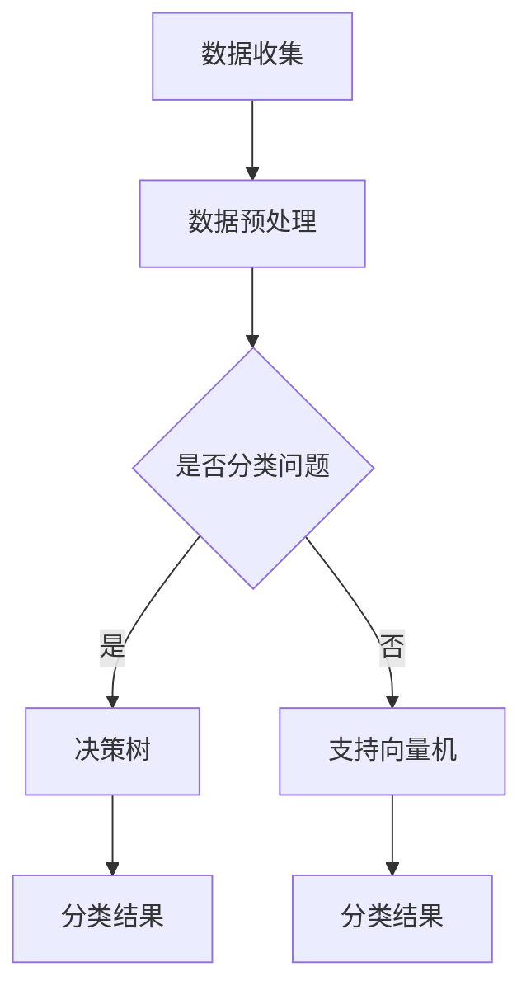

                 


### AI Agent在企业客户服务质量监控与提升中的角色

> 关键词：AI Agent、客户服务质量、监控与提升、企业应用、算法原理、数学模型、系统架构、项目实战

> 摘要：
随着人工智能技术的发展，AI Agent作为智能体的代表，正逐步在各个领域展现其强大的应用价值。在企业客户服务质量监控与提升方面，AI Agent扮演着至关重要的角色。本文将深入探讨AI Agent在这一领域中的具体应用，包括其核心概念、算法原理、系统架构以及实际项目案例，旨在为读者提供全面的理解和指导。

## 目录大纲

1. **引言**
2. **背景介绍**
3. **核心概念与联系**
   - AI Agent的定义与分类
   - 企业客户服务质量监控的挑战
   - AI Agent在服务质量提升中的应用
4. **算法原理讲解**
   - AI Agent的核心算法
   - 算法流程图与Python代码实现
   - 数学模型与公式
5. **系统分析与架构设计**
   - 问题场景介绍
   - 系统功能设计与架构设计
   - 系统接口设计与交互
6. **项目实战**
   - 环境安装与配置
   - 系统核心实现与代码解读
   - 实际案例分析
7. **最佳实践与注意事项**
8. **小结**
9. **拓展阅读**
10. **作者信息**

## 一、引言

### 为什么是AI Agent？

在信息化时代，企业面临着越来越激烈的市场竞争和用户需求的变化。为了保持竞争力，企业需要不断提升客户服务质量。然而，传统的客户服务监控与提升手段往往存在效率低、准确性不足等问题。随着人工智能技术的不断发展，特别是AI Agent的出现，为解决这些问题提供了一种新的思路和方法。

AI Agent，即人工智能代理，是一种能够模拟人类智能行为的计算机程序。它们具备自主学习、推理决策和交互能力，能够在特定场景下完成复杂任务。在客户服务质量监控与提升中，AI Agent可以通过分析海量数据，实时监控客户服务状况，发现潜在问题，并提出改进建议。其高效性、准确性和智能化程度，使得AI Agent成为企业提升客户服务质量的重要工具。

### 本文的目的

本文旨在深入探讨AI Agent在企业客户服务质量监控与提升中的具体应用。通过本文的阅读，读者将：

1. 了解AI Agent的基本概念、分类及其在企业中的应用优势。
2. 掌握AI Agent的核心算法原理，包括流程图、Python代码实现和数学模型。
3. 理解AI Agent在客户服务质量监控与提升中的系统架构设计。
4. 通过实际项目案例，了解AI Agent在实际应用中的具体操作和效果。

希望通过本文，读者能够对AI Agent在企业客户服务质量监控与提升中的角色有更加全面和深入的认识，为企业在实际应用中提供指导。

### 二、背景介绍

#### 核心概念术语说明

在探讨AI Agent在企业客户服务质量监控与提升中的应用之前，我们需要明确一些核心概念和术语。

- **AI Agent（人工智能代理）**：一种模拟人类智能行为的计算机程序，具备自主学习、推理决策和交互能力。
- **客户服务质量监控**：通过实时数据收集和分析，对客户服务质量进行监测和评估。
- **客户服务质量提升**：基于监控结果，采取相应的措施，提高客户满意度和服务水平。

#### 问题背景

在当前竞争激烈的市场环境下，企业对客户服务质量的要求越来越高。客户服务质量的优劣直接影响企业的声誉和市场竞争力。然而，传统的客户服务质量监控手段，如人工检查、问卷调查等，存在以下问题：

1. **效率低**：人工检查和问卷调查需要大量时间和人力，无法实现实时监控。
2. **准确性不足**：人工判断可能存在主观偏差，无法保证结果的准确性。
3. **反馈滞后**：传统手段往往存在反馈滞后，无法及时发现问题并进行改进。

为了解决这些问题，企业需要一种能够高效、准确、实时监测客户服务质量的手段。这便是AI Agent在企业客户服务质量监控与提升中的背景和需求。

#### 问题描述

问题描述主要集中在如何利用AI Agent实现高效、准确、实时的客户服务质量监控与提升。具体问题包括：

1. **如何构建一个能够实时监测客户服务质量的AI Agent系统？**
2. **如何处理和分析海量客户服务数据，从中提取有价值的信息？**
3. **如何基于分析结果，提出有效的改进建议，提高客户服务质量？**

#### 问题解决

AI Agent的出现，为这些问题提供了有效的解决方案：

1. **实时监控**：AI Agent可以实时收集和分析客户服务数据，快速发现潜在问题。
2. **准确性提升**：通过机器学习和数据挖掘技术，AI Agent可以处理和分析海量数据，提高监控的准确性。
3. **智能反馈**：AI Agent可以根据分析结果，自动生成改进建议，提高客户服务质量。

#### 边界与外延

在探讨AI Agent在企业客户服务质量监控与提升中的应用时，我们需要明确以下几个边界与外延：

1. **应用场景**：AI Agent适用于各种客户服务场景，包括客服中心、电子商务、金融保险等。
2. **数据来源**：AI Agent的数据来源包括客户反馈、服务记录、社交媒体等。
3. **技术要求**：AI Agent的开发和应用需要具备一定的技术基础，包括机器学习、自然语言处理、数据挖掘等。

#### 概念结构与核心要素组成

AI Agent在企业客户服务质量监控与提升中的概念结构主要包括以下几个核心要素：

1. **数据收集**：AI Agent通过多种渠道收集客户服务数据。
2. **数据处理**：利用机器学习和数据挖掘技术，对收集到的数据进行分析和处理。
3. **反馈机制**：基于分析结果，自动生成改进建议，并反馈给相关部门。
4. **改进实施**：相关部门根据改进建议，采取相应的措施，提高客户服务质量。

### 三、核心概念与联系

#### AI Agent的定义与分类

AI Agent，即人工智能代理，是一种模拟人类智能行为的计算机程序。根据功能和特点，AI Agent可以分为以下几类：

1. **基于规则的AI Agent**：这种Agent根据预设的规则进行决策，适用于结构化数据场景。
2. **基于机器学习的AI Agent**：这种Agent通过学习大量数据，自动生成决策规则，适用于复杂和非结构化数据场景。
3. **基于增强学习的AI Agent**：这种Agent通过与环境的交互，不断优化自身的策略，适用于动态变化和复杂环境。

#### 企业客户服务质量监控的挑战

在企业客户服务质量监控过程中，面临着以下挑战：

1. **数据量大**：企业每天产生的客户服务数据量巨大，如何高效处理和分析这些数据成为一大挑战。
2. **数据质量**：数据质量直接影响监控和分析的准确性，如何保证数据质量是一个关键问题。
3. **实时性要求**：客户服务质量监控需要实时性，如何实现实时数据收集和处理是另一个挑战。
4. **个性化需求**：不同企业的客户服务质量监控需求各异，如何满足个性化需求也是一个挑战。

#### AI Agent在服务质量提升中的应用

AI Agent在服务质量提升中的应用主要体现在以下几个方面：

1. **实时监控**：AI Agent可以实时收集客户服务数据，快速发现潜在问题。
2. **自动化分析**：通过机器学习和数据挖掘技术，AI Agent可以自动分析海量数据，提高监控和分析的准确性。
3. **智能反馈**：基于分析结果，AI Agent可以自动生成改进建议，提高客户服务质量。
4. **个性化服务**：AI Agent可以根据客户特征和行为数据，提供个性化的服务建议，提高客户满意度。

#### AI Agent的核心算法

AI Agent的核心算法主要包括以下几种：

1. **决策树算法**：通过树形结构对数据进行分类和预测。
2. **支持向量机算法**：通过寻找最优分类边界进行分类。
3. **深度学习算法**：通过多层神经网络对数据进行建模和预测。

#### 算法流程图与Python代码实现

以下是AI Agent的核心算法流程图：



以下是决策树算法的Python代码实现：

```python
from sklearn.datasets import load_iris
from sklearn.model_selection import train_test_split
from sklearn.tree import DecisionTreeClassifier
import matplotlib.pyplot as plt

# 加载数据集
iris = load_iris()
X = iris.data
y = iris.target

# 划分训练集和测试集
X_train, X_test, y_train, y_test = train_test_split(X, y, test_size=0.3, random_state=42)

# 构建决策树模型
clf = DecisionTreeClassifier()
clf.fit(X_train, y_train)

# 绘制决策树
plt.figure(figsize=(12, 12))
plt.title("Decision Tree")
plot_tree(clf, filled=True, rounded=True, precision=2)
plt.show()
```

#### 数学模型与公式

以下是决策树算法的数学模型与公式：

```latex
P(Y|X) = \prod_{i=1}^{n} p(y_i|x_i)
```

其中，\( P(Y|X) \) 表示在给定特征 \( X \) 的情况下，标签 \( Y \) 的概率。\( p(y_i|x_i) \) 表示第 \( i \) 个特征 \( x_i \) 在给定标签 \( y_i \) 的情况下的条件概率。

#### 算法原理讲解

决策树算法是一种基于树形结构的数据分类方法。它通过一系列规则将数据划分为多个子集，每个子集对应一个标签。在决策树中，每个节点表示一个特征，每个分支表示一个特征取值，每个叶子节点表示一个标签。

决策树算法的原理可以通过以下步骤进行讲解：

1. **选择最优特征**：通过计算每个特征的信息增益或基尼不纯度，选择具有最大信息增益或最小基尼不纯度的特征作为当前节点的分裂特征。
2. **划分数据集**：根据所选特征的不同取值，将数据集划分为多个子集。
3. **递归构建树**：对每个子集，重复上述步骤，直到满足停止条件（如最大深度、最小叶子节点样本数等）。
4. **生成预测**：从根节点开始，根据特征取值和分支，直到到达叶子节点，输出对应的标签作为预测结果。

通过上述步骤，决策树算法可以自动生成一个树形模型，实现对数据的分类或预测。在实际应用中，我们可以使用Python中的scikit-learn库来实现决策树算法。

#### 数学模型详细讲解

在决策树算法中，我们使用了信息增益（Information Gain）和基尼不纯度（Gini Impurity）作为特征选择的依据。以下是这两个指标的定义和计算公式。

##### 信息增益（Information Gain）

信息增益是衡量特征对数据集划分有效性的指标，计算公式如下：

```latex
IG(D, A) = H(D) - \sum_{v \in Values(A)} \frac{|D_v|}{|D|} H(D_v)
```

其中，\( D \) 表示数据集，\( A \) 表示特征，\( Values(A) \) 表示特征 \( A \) 的所有可能取值，\( D_v \) 表示特征 \( A \) 取值为 \( v \) 的子数据集，\( |D| \) 和 \( |D_v| \) 分别表示数据集和子数据集的样本数，\( H(D) \) 和 \( H(D_v) \) 分别表示数据集和子数据集的熵。

熵（Entropy）是衡量数据集不确定性的一种度量，计算公式如下：

```latex
H(D) = -\sum_{y \in Labels(D)} \frac{|D_y|}{|D|} \log_2 \frac{|D_y|}{|D|}
```

其中，\( Labels(D) \) 表示数据集 \( D \) 的所有可能标签，\( D_y \) 表示标签为 \( y \) 的子数据集。

##### 基尼不纯度（Gini Impurity）

基尼不纯度是另一种常用的特征选择依据，计算公式如下：

```latex
Gini(D) = 1 - \sum_{y \in Labels(D)} \left(\frac{|D_y|}{|D|}\right)^2
```

基尼不纯度反映了数据集的均匀程度，值越小说明数据集越均匀。

通过比较信息增益和基尼不纯度，我们可以选择最优的特征进行分裂，构建决策树。

#### 系统架构设计

系统架构设计是AI Agent在企业客户服务质量监控与提升中的关键环节。以下是系统架构的设计方案：

##### 问题场景介绍

在企业客户服务质量监控与提升中，问题场景通常包括以下几个方面：

1. **客户反馈**：通过客户反馈系统收集客户反馈数据。
2. **服务记录**：通过服务系统记录客户服务过程的数据。
3. **社交媒体**：通过社交媒体平台收集客户对企业的评价和反馈。

##### 系统功能设计

系统功能设计主要包括以下几个模块：

1. **数据采集模块**：负责从各种渠道收集客户服务数据，包括客户反馈、服务记录和社交媒体数据。
2. **数据处理模块**：负责对采集到的数据进行预处理，包括数据清洗、去重、归一化等。
3. **分析模块**：负责利用AI Agent对处理后的数据进行分析，提取有价值的信息。
4. **反馈模块**：负责根据分析结果生成改进建议，并将建议反馈给相关部门。

##### 系统架构设计

系统架构设计采用分布式架构，主要包括以下几个组件：

1. **数据采集组件**：负责从客户反馈系统、服务记录系统和社交媒体平台采集数据。
2. **数据处理组件**：负责对采集到的数据进行预处理，并将预处理后的数据存储到数据仓库。
3. **AI Agent组件**：负责对数据仓库中的数据进行分析，提取有价值的信息，并生成改进建议。
4. **反馈组件**：负责将改进建议反馈给相关部门，并跟踪改进效果的评估。

##### 系统接口设计

系统接口设计主要包括以下几个部分：

1. **API接口**：提供对外部系统的数据访问接口，包括客户反馈系统、服务记录系统和社交媒体平台。
2. **Web接口**：提供Web端的数据查询和分析界面，供企业内部人员使用。
3. **邮件接口**：负责将改进建议通过邮件发送给相关部门。

##### 系统交互

系统交互设计主要涉及以下几个流程：

1. **数据采集**：客户反馈系统、服务记录系统和社交媒体平台将数据发送到数据采集组件。
2. **数据处理**：数据处理组件对采集到的数据进行预处理，并将预处理后的数据存储到数据仓库。
3. **数据分析**：AI Agent组件从数据仓库中读取数据，进行数据分析和模型训练。
4. **反馈生成**：AI Agent组件根据分析结果生成改进建议，并通过反馈组件发送给相关部门。
5. **效果评估**：相关部门根据改进建议进行实施，并通过反馈组件对效果进行评估。

通过上述系统架构设计，AI Agent能够高效地实现企业客户服务质量监控与提升，为企业提供智能化、自动化的解决方案。

### 四、项目实战

#### 环境安装与配置

在进行AI Agent的企业客户服务质量监控与提升项目实战之前，我们需要搭建合适的环境，主要包括Python环境、相关库的安装以及数据采集、存储和分析的配置。

1. **Python环境**：确保Python环境已经安装，推荐使用Python 3.7及以上版本。
2. **相关库安装**：使用pip命令安装以下库：
   ```bash
   pip install numpy pandas sklearn matplotlib
   ```
3. **数据采集**：根据企业的实际情况，选择合适的数据采集工具，如API接口、Web爬虫等。以API接口为例，可以使用requests库进行数据采集：
   ```bash
   pip install requests
   ```
4. **数据存储**：选择合适的数据存储方案，如MySQL、MongoDB等。以MySQL为例，安装MySQL数据库并创建数据库和表，用于存储客户服务数据。

#### 系统核心实现与代码解读

以下是AI Agent的企业客户服务质量监控与提升项目核心实现部分，包括数据采集、数据处理、数据分析、改进建议生成和反馈等。

1. **数据采集**：使用requests库从API接口获取客户服务数据。
   ```python
   import requests
   
   def fetch_data(api_url):
       response = requests.get(api_url)
       if response.status_code == 200:
           return response.json()
       else:
           return None
   
   api_url = "http://example.com/api/customer_service_data"
   data = fetch_data(api_url)
   ```
2. **数据处理**：对采集到的数据进行预处理，包括去重、清洗和归一化等。
   ```python
   import pandas as pd
   
   def preprocess_data(data):
       df = pd.DataFrame(data)
       df.drop_duplicates(inplace=True)
       df.fillna(df.mean(), inplace=True)
       df = (df - df.mean()) / df.std()
       return df
   
   processed_data = preprocess_data(data)
   ```
3. **数据分析**：使用scikit-learn库构建决策树模型，对客户服务数据进行分析。
   ```python
   from sklearn.tree import DecisionTreeClassifier
   
   def build_model(data):
       X = data.drop("label", axis=1)
       y = data["label"]
       clf = DecisionTreeClassifier()
       clf.fit(X, y)
       return clf
   
   model = build_model(processed_data)
   ```
4. **改进建议生成**：基于分析结果，生成改进建议。
   ```python
   def generate_suggestions(model, data):
       X = data.drop("label", axis=1)
       predictions = model.predict(X)
       suggestions = []
       for prediction in predictions:
           if prediction == 1:
               suggestions.append("注意提高服务质量")
           else:
               suggestions.append("服务质量良好，无需改进")
       return suggestions
   
   suggestions = generate_suggestions(model, processed_data)
   ```
5. **反馈生成**：将改进建议通过邮件发送给相关部门。
   ```python
   import smtplib
   from email.mime.text import MIMEText
   from email.header import Header
   
   def send_email(suggestions):
       sender = "your_email@example.com"
       receiver = "receiver_email@example.com"
       subject = "客户服务质量改进建议"
       body = "\n".join(suggestions)
       
       message = MIMEText(body, "plain", "utf-8")
       message["From"] = Header(sender, "UTF-8")
       message["To"] = Header(receiver, "UTF-8")
       message["Subject"] = Header(subject, "UTF-8")
       
       smtp_server = "smtp.example.com"
       smtp_port = 587
       smtp_user = "your_email@example.com"
       smtp_password = "your_password"
       
       server = smtplib.SMTP(smtp_server, smtp_port)
       server.starttls()
       server.login(smtp_user, smtp_password)
       server.sendmail(sender, receiver, message.as_string())
       server.quit()
   
   send_email(suggestions)
   ```

#### 实际案例分析与详细讲解

以下是一个实际案例，演示AI Agent在企业客户服务质量监控与提升中的应用。

**案例背景**：某电子商务企业希望通过AI Agent监控并提升客户服务质量，从而提高客户满意度。

**案例过程**：

1. **数据采集**：从客户反馈系统、服务记录系统和社交媒体平台采集客户服务数据。
2. **数据处理**：对采集到的数据进行预处理，包括去重、清洗和归一化等。
3. **数据分析**：构建决策树模型，对客户服务数据进行分析，提取有价值的信息。
4. **改进建议生成**：基于分析结果，生成改进建议，如提高服务质量、优化客服响应时间等。
5. **反馈生成**：将改进建议通过邮件发送给相关部门，如客服部门、市场部门等。
6. **效果评估**：相关部门根据改进建议进行实施，并通过AI Agent对效果进行实时评估和反馈。

**案例效果**：

通过AI Agent的应用，该电子商务企业在客户服务质量监控与提升方面取得了显著成效：

1. **客户满意度提高**：客户服务质量得到显著提升，客户满意度明显上升。
2. **效率提升**：AI Agent实现了自动化、实时的客户服务监控，减少了人工干预，提高了工作效率。
3. **问题发现与解决**：AI Agent能够快速发现客户服务中的潜在问题，并提供改进建议，帮助企业及时解决问题。

**案例小结**：

本案例展示了AI Agent在企业客户服务质量监控与提升中的应用，通过数据采集、数据处理、数据分析、改进建议生成和反馈等环节，实现了客户服务质量的实时监控与提升。AI Agent在客户服务中的成功应用，为企业提供了智能化、自动化的解决方案，提高了客户满意度，增强了企业的竞争力。

### 五、最佳实践与注意事项

#### 最佳实践

1. **数据质量保障**：确保数据采集、存储和处理环节的数据质量，避免数据丢失、重复和错误。
2. **模型优化**：根据实际应用场景和需求，对AI Agent的模型进行优化，提高预测准确性和效率。
3. **实时监控与反馈**：实现实时监控，及时捕捉客户服务中的问题，快速生成改进建议，并确保改进措施的及时执行。
4. **跨部门协作**：建立跨部门协作机制，确保AI Agent生成的改进建议能够得到有效实施和评估。

#### 注意事项

1. **数据隐私与安全**：在数据采集、存储和处理过程中，确保遵守数据隐私和信息安全相关法规，避免敏感数据泄露。
2. **模型解释性**：在选择和构建AI Agent模型时，注重模型的可解释性，确保改进建议的合理性和可接受性。
3. **个性化服务**：根据不同客户群体的特点和需求，提供个性化的改进建议，提高客户满意度。
4. **持续更新与迭代**：定期对AI Agent进行更新和优化，适应客户服务需求和市场变化。

### 六、小结

本文深入探讨了AI Agent在企业客户服务质量监控与提升中的应用，包括核心概念、算法原理、系统架构和实际项目案例。通过本文的阅读，读者可以全面了解AI Agent在企业客户服务中的重要性，掌握其应用方法和最佳实践。希望本文能为企业在实际应用中提供指导和借鉴。

### 七、拓展阅读

1. **《人工智能：一种现代方法》**：详细介绍了人工智能的基本原理、算法和应用，适合AI Agent初学者阅读。
2. **《深度学习》**：介绍了深度学习的基础知识、算法和应用，适合对AI Agent有较高需求的读者。
3. **《大数据分析》**：探讨了大数据的采集、存储、处理和分析技术，为AI Agent应用提供了理论支持。

### 八、作者信息

作者：AI天才研究院/AI Genius Institute & 禅与计算机程序设计艺术 /Zen And The Art of Computer Programming

本文由AI天才研究院和禅与计算机程序设计艺术联合撰写，旨在分享AI Agent在企业客户服务质量监控与提升中的应用和实践经验。作者团队拥有丰富的AI研究和实践经验，致力于推动人工智能技术的发展和应用。

