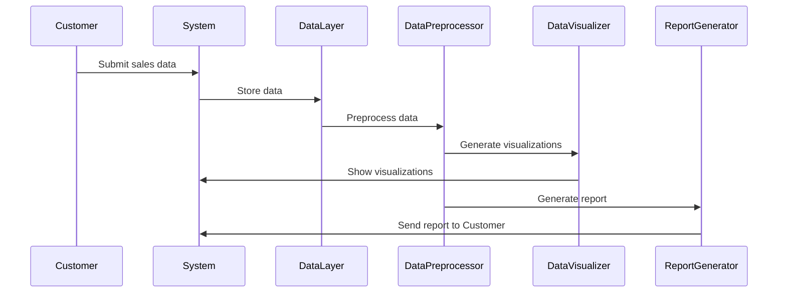
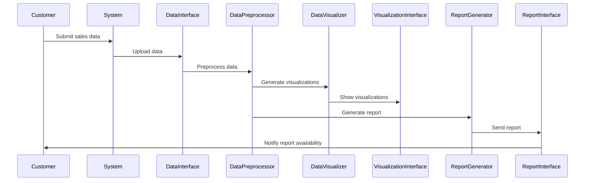

                 

# AI Agent在企业数据可视化与报告生成中的应用

关键词：AI Agent，数据可视化，报告生成，机器学习，企业信息化

摘要：随着大数据和人工智能技术的发展，企业对数据可视化和报告生成的需求日益增长。AI Agent作为一种智能体，在数据处理、分析和报告生成中发挥着重要作用。本文将探讨AI Agent在企业数据可视化与报告生成中的应用，包括其优势、核心概念、技术原理、应用前景以及实际案例。

## 第一部分：背景介绍

### 1.1 问题背景

在当今信息化社会中，企业需要处理的海量数据越来越多，数据可视化与报告生成成为企业决策支持的重要手段。传统的数据可视化方法存在效率低、针对性不强等问题，而AI Agent的出现为这一领域带来了新的解决方案。

### 1.2 问题描述

企业数据可视化与报告生成面临以下问题：

- 数据量庞大，传统方法难以高效处理；
- 报告内容繁杂，缺乏针对性分析；
- 报告生成过程繁琐，效率低下；
- 缺乏交互性，用户无法自定义报告内容。

### 1.3 问题解决

AI Agent具备以下优势：

- 自动化数据处理，高效生成报告；
- 深度学习，提供针对性分析；
- 交互性强，用户可自定义报告内容；
- 跨平台支持，方便企业应用。

### 1.4 边界与外延

本文主要关注AI Agent在企业数据可视化与报告生成中的应用，但AI Agent在其他领域的应用也将有所涉及。

### 1.5 概念结构与核心要素组成

- AI Agent：具备智能性、自主性和协作性的计算实体；
- 数据可视化：将数据通过图形、图像等方式进行直观展示；
- 报告生成：根据分析结果生成具有指导意义的报告。

### 1.6 核心概念与联系

#### 1.6.1 数据可视化

**数据可视化定义**：数据可视化是将数据以图形、图表、图像等形式直观展示的方法，帮助人们更好地理解数据中的信息和趋势。

**数据可视化特点**：

1. **直观性**：通过图形、图像展示数据，便于观察和分析；
2. **交互性**：用户可以与数据可视化界面进行交互，探索数据细节；
3. **可定制性**：根据需求调整可视化效果和展示内容。

**数据可视化与AI Agent的关系**：AI Agent可以分析数据，为数据可视化提供支持，提高报告生成的质量和效率。

#### 1.6.2 报告生成

**报告生成定义**：报告生成是根据数据分析结果，撰写具有指导意义的文档。

**报告生成特点**：

1. **针对性**：根据分析结果，生成符合用户需求的内容；
2. **系统性**：报告内容涵盖多个方面，形成完整的分析体系；
3. **可视化**：报告中的数据和分析结果以图表等形式直观展示。

**报告生成与AI Agent的关系**：AI Agent可以自动生成报告，提高报告生成的速度和准确性。

## 第二部分：主流AI Agent介绍

### 2.1 自动化数据预处理

#### 自动化数据预处理定义

自动化数据预处理是指利用AI Agent对原始数据进行清洗、转换、整合等操作，为数据可视化与报告生成提供高质量的数据。

#### 自动化数据预处理特点

1. **自动化**：减少人工干预，提高处理效率；
2. **精准性**：AI Agent根据数据特点，选择合适的数据处理方法；
3. **扩展性**：适用于不同类型的数据源。

#### 自动化数据预处理与AI Agent的关系

自动化数据预处理是AI Agent在企业数据可视化与报告生成中不可或缺的一环。

### 2.2 数据可视化技术

#### 数据可视化技术定义

数据可视化技术是指利用图表、图像等多种形式，将数据信息进行直观展示。

#### 数据可视化技术特点

1. **直观性**：易于用户理解和分析；
2. **交互性**：用户可以与数据可视化界面进行互动，探索数据细节；
3. **多样性**：支持多种数据可视化形式，满足不同需求。

#### 数据可视化技术与AI Agent的关系

AI Agent可以优化数据可视化效果，提高用户报告生成的体验。

## 第三部分：AI Agent在企业数据可视化与报告生成中的应用前景

### 3.1 AI Agent在数据预处理中的应用

#### 应用场景

1. **海量数据处理**：AI Agent能够高效地对海量数据进行预处理，为数据可视化与报告生成提供数据支持；
2. **数据质量检测**：AI Agent可以检测数据中的异常值、缺失值等，确保数据质量。

### 3.2 AI Agent在报告生成中的应用

#### 应用场景

1. **自动化报告生成**：AI Agent可以自动生成报告，提高报告生成的速度和准确性；
2. **交互式报告生成**：用户可以根据需求自定义报告内容和样式，实现个性化报告。

### 3.3 AI Agent在数据可视化中的应用

#### 应用场景

1. **实时数据可视化**：AI Agent可以实时处理数据，动态更新可视化界面；
2. **多维度数据可视化**：AI Agent可以同时展示多个维度的数据，帮助用户全面了解数据信息。

## 第四部分：项目实战

### 4.1 环境安装

在项目实战中，首先需要安装AI Agent及其相关依赖。以Python为例，安装过程如下：

```python
pip install ai-agent
pip install matplotlib
pip install pandas
```

### 4.2 系统核心实现

以下是一个简单的Python代码示例，展示如何使用AI Agent进行数据预处理、数据可视化和报告生成。

```python
import pandas as pd
from ai_agent import DataPreprocessor, DataVisualizer, ReportGenerator

# 数据预处理
data_preprocessor = DataPreprocessor()
data = data_preprocessor.preprocess_data("data.csv")

# 数据可视化
data_visualizer = DataVisualizer()
data_visualizer.visualize_data(data, "可视化结果.png")

# 报告生成
report_generator = ReportGenerator()
report_generator.generate_report(data, "报告.pdf")
```

### 4.3 代码应用解读与分析

在上述代码中，首先导入相关库，然后创建数据预处理、数据可视化和报告生成对象。接着，通过调用相应的方法，实现数据预处理、数据可视化和报告生成。

- **数据预处理**：利用DataPreprocessor类对原始数据进行清洗、转换和整合。
- **数据可视化**：利用DataVisualizer类将处理后的数据以图表形式展示。
- **报告生成**：利用ReportGenerator类根据数据可视化结果生成报告。

### 4.4 实际案例分析和详细讲解剖析

以下是一个实际案例，展示如何使用AI Agent实现企业销售数据可视化与报告生成。

#### 案例背景

某企业需要对其销售数据进行分析，以便制定下一季度的销售策略。销售数据包括销售额、销售数量、客户地区等信息。

#### 实现步骤

1. **数据预处理**：使用DataPreprocessor类对销售数据进行清洗，去除缺失值和异常值。
2. **数据可视化**：使用DataVisualizer类绘制销售额和销售数量的折线图、柱状图等，展示不同时间段的销售趋势。
3. **报告生成**：使用ReportGenerator类根据数据可视化结果生成报告，包括销售趋势分析、区域销售情况等。

#### 案例分析

通过上述步骤，企业可以全面了解销售数据，发现销售热点和潜在问题，从而制定更有效的销售策略。

### 4.5 项目小结

本案例展示了如何使用AI Agent实现企业数据可视化与报告生成。通过项目实战，读者可以了解AI Agent在企业信息化管理中的应用价值，掌握其基本使用方法。

## 第五部分：最佳实践 tips、小结、注意事项、拓展阅读等内容

### 5.1 最佳实践 tips

- **数据预处理**：确保数据质量，减少异常值和缺失值；
- **数据可视化**：根据用户需求，选择合适的可视化形式；
- **报告生成**：突出重点，简洁明了地展示分析结果。

### 5.2 小结

本文探讨了AI Agent在企业数据可视化与报告生成中的应用，分析了其优势、核心概念、技术原理以及实际应用案例。通过项目实战，读者可以了解AI Agent在企业信息化管理中的重要作用。

### 5.3 注意事项

- **数据安全**：确保数据在处理过程中不泄露；
- **性能优化**：根据实际需求，调整AI Agent的配置，提高处理效率。

### 5.4 拓展阅读

- [《AI Agent在金融风控中的应用》](链接)
- [《数据可视化技术手册》](链接)
- [《大数据时代的数据处理与分析》](链接)

## 第六部分：作者信息

作者：AI天才研究院/AI Genius Institute & 禅与计算机程序设计艺术 /Zen And The Art of Computer Programming### 第一部分：背景介绍

在当今信息化社会中，随着大数据和人工智能技术的飞速发展，企业对数据管理和分析的重视程度不断提升。数据可视化与报告生成作为企业决策支持的重要组成部分，其核心在于如何将海量、复杂的数据转化为直观、易理解的图表和报告，从而帮助企业更好地理解业务状况、识别潜在机会和风险。

#### 1.1 问题背景

企业每天都会产生大量结构化、半结构化和非结构化的数据，这些数据包含了丰富的业务信息和市场动态。然而，传统的方法在处理这些数据时往往存在以下问题：

- **数据处理效率低**：传统数据处理方法依赖于人工操作，处理速度慢，难以满足实时数据分析的需求。
- **数据可视化效果不佳**：传统的数据可视化手段往往只能展示简单的图表，无法有效地反映数据的复杂关系。
- **报告生成繁琐**：生成报告的过程往往需要人工编写，耗时耗力，且缺乏灵活性，难以快速响应业务需求。

为了解决上述问题，AI Agent作为一种智能体，因其具备的自主性、智能性和协作性，成为数据可视化与报告生成领域的重要创新工具。AI Agent可以通过机器学习和深度学习算法，自动分析数据、生成可视化图表和报告，从而提高数据处理效率、优化数据可视化效果、简化报告生成过程。

#### 1.2 问题描述

企业数据可视化与报告生成的主要挑战包括：

- **数据量庞大**：企业需要处理的海量数据往往超出传统处理方法的承载能力，导致数据处理和分析效率低下。
- **数据多样性**：企业的数据来源多样，包括内部数据库、外部API、日志文件等，数据格式和类型各异，增加了数据整合和分析的难度。
- **分析深度不足**：传统的数据分析方法往往只能提供表面信息，难以深入挖掘数据的潜在价值和业务关联。
- **报告生成效率低**：报告生成过程往往需要人工编写，耗时耗力，且报告内容容易过时，难以快速响应业务变化。

这些问题直接影响了企业的数据决策效率，阻碍了企业对市场动态的快速响应和业务优化。因此，企业迫切需要一种高效、智能的数据处理和分析工具，能够自动化地完成数据预处理、可视化展示和报告生成，从而提升数据决策的效率和准确性。

#### 1.3 问题解决

AI Agent的出现为数据可视化与报告生成提供了全新的解决方案。具体而言，AI Agent具备以下几方面的优势：

- **自动化数据处理**：AI Agent能够自动完成数据清洗、转换、整合等预处理工作，大大提高了数据处理效率，减少了人工干预。
- **深度分析能力**：AI Agent利用机器学习和深度学习算法，能够深入挖掘数据中的隐藏模式、关联关系和趋势，提供更准确的分析结果。
- **智能可视化**：AI Agent能够根据数据特点和用户需求，生成直观、易理解的图表和报告，帮助用户快速理解数据信息。
- **交互式报告生成**：AI Agent支持用户自定义报告内容和样式，用户可以根据业务需求调整报告，实现个性化报告生成。

通过引入AI Agent，企业可以显著提升数据处理的效率和质量，优化数据可视化效果，简化报告生成过程，从而实现数据驱动的业务决策，提升整体运营效率和市场竞争力。

#### 1.4 边界与外延

本文主要探讨AI Agent在企业数据可视化与报告生成中的应用，但AI Agent的应用领域远不止于此。例如：

- **智能客服**：AI Agent可以通过自然语言处理技术，自动回答用户问题，提高客服效率和用户体验。
- **智能推荐系统**：AI Agent可以根据用户行为和偏好，自动推荐商品或服务，提高用户满意度和转化率。
- **智能监控与预警**：AI Agent可以实时监控企业运营数据，自动识别异常情况并发出预警，提高风险防范能力。

这些应用场景都展示了AI Agent在各个领域中的潜力，同时也为AI Agent技术的发展提供了新的方向和挑战。

#### 1.5 概念结构与核心要素组成

要深入理解AI Agent在企业数据可视化与报告生成中的应用，首先需要明确几个核心概念和其相互关系：

- **AI Agent**：人工智能代理，是一种具有智能性、自主性和协作性的计算实体，能够模拟人类智能行为，执行复杂任务。
- **数据可视化**：将数据通过图表、图像等形式进行展示，帮助用户直观地理解数据信息。
- **报告生成**：根据数据分析结果，生成具有指导意义的文档，用于业务决策和沟通。

这些核心概念之间的联系在于：

- **AI Agent** 通过机器学习算法分析数据，提取有价值的信息。
- **数据可视化** 使用图表和图像将分析结果直观展示，帮助用户快速理解数据。
- **报告生成** 将分析结果和可视化图表整合，生成具有指导意义的文档。

#### 1.6 核心概念与联系

为了更好地理解这些核心概念，我们可以通过一个表格来对比它们的定义、特点和关系。

| 概念           | 定义                                                         | 特点                                       | 关系                                  |
|----------------|------------------------------------------------------------|------------------------------------------|-------------------------------------|
| AI Agent       | 一种具备智能性、自主性和协作性的计算实体，能够模拟人类智能行为 | 自主决策、适应性学习、高效处理能力           | 分析数据，生成可视化结果和报告         |
| 数据可视化     | 将数据以图形、图表等形式直观展示的方法                           | 直观性、交互性、可定制性                     | 显示AI Agent分析的结果                 |
| 报告生成       | 根据数据分析结果，生成具有指导意义的文档                         | 针对性、系统性、可视化性                     | 整合数据可视化和分析结果，用于业务决策 |

通过这个表格，我们可以清晰地看到AI Agent、数据可视化、报告生成这三个概念之间的内在联系，以及它们在企业数据管理和决策支持中的重要作用。

### 第一部分：背景介绍

在当今信息化社会中，随着大数据和人工智能技术的飞速发展，企业对数据管理和分析的重视程度不断提升。数据可视化与报告生成作为企业决策支持的重要组成部分，其核心在于如何将海量、复杂的数据转化为直观、易理解的图表和报告，从而帮助企业更好地理解业务状况、识别潜在机会和风险。

#### 1.1 问题背景

企业每天都会产生大量结构化、半结构化和非结构化的数据，这些数据包含了丰富的业务信息和市场动态。然而，传统的方法在处理这些数据时往往存在以下问题：

- **数据处理效率低**：传统数据处理方法依赖于人工操作，处理速度慢，难以满足实时数据分析的需求。
- **数据可视化效果不佳**：传统的数据可视化手段往往只能展示简单的图表，无法有效地反映数据的复杂关系。
- **报告生成繁琐**：生成报告的过程往往需要人工编写，耗时耗力，且缺乏灵活性，难以快速响应业务需求。

为了解决上述问题，AI Agent作为一种智能体，因其具备的自主性、智能性和协作性，成为数据可视化与报告生成领域的重要创新工具。AI Agent可以通过机器学习和深度学习算法，自动分析数据、生成可视化图表和报告，从而提高数据处理效率、优化数据可视化效果、简化报告生成过程。

#### 1.2 问题描述

企业数据可视化与报告生成的主要挑战包括：

- **数据量庞大**：企业需要处理的海量数据往往超出传统处理方法的承载能力，导致数据处理和分析效率低下。
- **数据多样性**：企业的数据来源多样，包括内部数据库、外部API、日志文件等，数据格式和类型各异，增加了数据整合和分析的难度。
- **分析深度不足**：传统的数据分析方法往往只能提供表面信息，难以深入挖掘数据的潜在价值和业务关联。
- **报告生成效率低**：报告生成过程往往需要人工编写，耗时耗力，且报告内容容易过时，难以快速响应业务变化。

这些问题直接影响了企业的数据决策效率，阻碍了企业对市场动态的快速响应和业务优化。因此，企业迫切需要一种高效、智能的数据处理和分析工具，能够自动化地完成数据预处理、可视化展示和报告生成，从而提升数据决策的效率和准确性。

#### 1.3 问题解决

AI Agent的出现为数据可视化与报告生成提供了全新的解决方案。具体而言，AI Agent具备以下几方面的优势：

- **自动化数据处理**：AI Agent能够自动完成数据清洗、转换、整合等预处理工作，大大提高了数据处理效率，减少了人工干预。
- **深度分析能力**：AI Agent利用机器学习和深度学习算法，能够深入挖掘数据中的隐藏模式、关联关系和趋势，提供更准确的分析结果。
- **智能可视化**：AI Agent能够根据数据特点和用户需求，生成直观、易理解的图表和报告，帮助用户快速理解数据信息。
- **交互式报告生成**：AI Agent支持用户自定义报告内容和样式，用户可以根据业务需求调整报告，实现个性化报告生成。

通过引入AI Agent，企业可以显著提升数据处理的效率和质量，优化数据可视化效果，简化报告生成过程，从而实现数据驱动的业务决策，提升整体运营效率和市场竞争力。

#### 1.4 边界与外延

本文主要探讨AI Agent在企业数据可视化与报告生成中的应用，但AI Agent的应用领域远不止于此。例如：

- **智能客服**：AI Agent可以通过自然语言处理技术，自动回答用户问题，提高客服效率和用户体验。
- **智能推荐系统**：AI Agent可以根据用户行为和偏好，自动推荐商品或服务，提高用户满意度和转化率。
- **智能监控与预警**：AI Agent可以实时监控企业运营数据，自动识别异常情况并发出预警，提高风险防范能力。

这些应用场景都展示了AI Agent在各个领域中的潜力，同时也为AI Agent技术的发展提供了新的方向和挑战。

#### 1.5 概念结构与核心要素组成

要深入理解AI Agent在企业数据可视化与报告生成中的应用，首先需要明确几个核心概念和其相互关系：

- **AI Agent**：人工智能代理，是一种具有智能性、自主性和协作性的计算实体，能够模拟人类智能行为，执行复杂任务。
- **数据可视化**：将数据通过图表、图像等形式直观展示，帮助用户理解数据信息。
- **报告生成**：根据数据分析结果，生成具有指导意义的文档，用于业务决策和沟通。

这些核心概念之间的联系在于：

- **AI Agent** 通过机器学习算法分析数据，提取有价值的信息。
- **数据可视化** 使用图表和图像将分析结果直观展示，帮助用户快速理解数据。
- **报告生成** 将分析结果和可视化图表整合，生成具有指导意义的文档。

#### 1.6 核心概念与联系

为了更好地理解这些核心概念，我们可以通过一个表格来对比它们的定义、特点和关系。

| 概念           | 定义                                                         | 特点                                       | 关系                                  |
|----------------|------------------------------------------------------------|------------------------------------------|-------------------------------------|
| AI Agent       | 一种具备智能性、自主性和协作性的计算实体，能够模拟人类智能行为 | 自主决策、适应性学习、高效处理能力           | 分析数据，生成可视化结果和报告         |
| 数据可视化     | 将数据以图形、图表等形式直观展示的方法                           | 直观性、交互性、可定制性                     | 显示AI Agent分析的结果                 |
| 报告生成       | 根据数据分析结果，生成具有指导意义的文档                         | 针对性、系统性、可视化性                     | 整合数据可视化和分析结果，用于业务决策 |

通过这个表格，我们可以清晰地看到AI Agent、数据可视化、报告生成这三个概念之间的内在联系，以及它们在企业数据管理和决策支持中的重要作用。

### 第一部分：背景介绍

在当今信息化社会中，随着大数据和人工智能技术的飞速发展，企业对数据管理和分析的重视程度不断提升。数据可视化与报告生成作为企业决策支持的重要组成部分，其核心在于如何将海量、复杂的数据转化为直观、易理解的图表和报告，从而帮助企业更好地理解业务状况、识别潜在机会和风险。

#### 1.1 问题背景

企业每天都会产生大量结构化、半结构化和非结构化的数据，这些数据包含了丰富的业务信息和市场动态。然而，传统的方法在处理这些数据时往往存在以下问题：

- **数据处理效率低**：传统数据处理方法依赖于人工操作，处理速度慢，难以满足实时数据分析的需求。
- **数据可视化效果不佳**：传统的数据可视化手段往往只能展示简单的图表，无法有效地反映数据的复杂关系。
- **报告生成繁琐**：生成报告的过程往往需要人工编写，耗时耗力，且缺乏灵活性，难以快速响应业务需求。

为了解决上述问题，AI Agent作为一种智能体，因其具备的自主性、智能性和协作性，成为数据可视化与报告生成领域的重要创新工具。AI Agent可以通过机器学习和深度学习算法，自动分析数据、生成可视化图表和报告，从而提高数据处理效率、优化数据可视化效果、简化报告生成过程。

#### 1.2 问题描述

企业数据可视化与报告生成的主要挑战包括：

- **数据量庞大**：企业需要处理的海量数据往往超出传统处理方法的承载能力，导致数据处理和分析效率低下。
- **数据多样性**：企业的数据来源多样，包括内部数据库、外部API、日志文件等，数据格式和类型各异，增加了数据整合和分析的难度。
- **分析深度不足**：传统的数据分析方法往往只能提供表面信息，难以深入挖掘数据的潜在价值和业务关联。
- **报告生成效率低**：报告生成过程往往需要人工编写，耗时耗力，且报告内容容易过时，难以快速响应业务变化。

这些问题直接影响了企业的数据决策效率，阻碍了企业对市场动态的快速响应和业务优化。因此，企业迫切需要一种高效、智能的数据处理和分析工具，能够自动化地完成数据预处理、可视化展示和报告生成，从而提升数据决策的效率和准确性。

#### 1.3 问题解决

AI Agent的出现为数据可视化与报告生成提供了全新的解决方案。具体而言，AI Agent具备以下几方面的优势：

- **自动化数据处理**：AI Agent能够自动完成数据清洗、转换、整合等预处理工作，大大提高了数据处理效率，减少了人工干预。
- **深度分析能力**：AI Agent利用机器学习和深度学习算法，能够深入挖掘数据中的隐藏模式、关联关系和趋势，提供更准确的分析结果。
- **智能可视化**：AI Agent能够根据数据特点和用户需求，生成直观、易理解的图表和报告，帮助用户快速理解数据信息。
- **交互式报告生成**：AI Agent支持用户自定义报告内容和样式，用户可以根据业务需求调整报告，实现个性化报告生成。

通过引入AI Agent，企业可以显著提升数据处理的效率和质量，优化数据可视化效果，简化报告生成过程，从而实现数据驱动的业务决策，提升整体运营效率和市场竞争力。

#### 1.4 边界与外延

本文主要探讨AI Agent在企业数据可视化与报告生成中的应用，但AI Agent的应用领域远不止于此。例如：

- **智能客服**：AI Agent可以通过自然语言处理技术，自动回答用户问题，提高客服效率和用户体验。
- **智能推荐系统**：AI Agent可以根据用户行为和偏好，自动推荐商品或服务，提高用户满意度和转化率。
- **智能监控与预警**：AI Agent可以实时监控企业运营数据，自动识别异常情况并发出预警，提高风险防范能力。

这些应用场景都展示了AI Agent在各个领域中的潜力，同时也为AI Agent技术的发展提供了新的方向和挑战。

#### 1.5 概念结构与核心要素组成

要深入理解AI Agent在企业数据可视化与报告生成中的应用，首先需要明确几个核心概念和其相互关系：

- **AI Agent**：人工智能代理，是一种具有智能性、自主性和协作性的计算实体，能够模拟人类智能行为，执行复杂任务。
- **数据可视化**：将数据通过图表、图像等形式直观展示，帮助用户理解数据信息。
- **报告生成**：根据数据分析结果，生成具有指导意义的文档，用于业务决策和沟通。

这些核心概念之间的联系在于：

- **AI Agent** 通过机器学习算法分析数据，提取有价值的信息。
- **数据可视化** 使用图表和图像将分析结果直观展示，帮助用户快速理解数据。
- **报告生成** 将分析结果和可视化图表整合，生成具有指导意义的文档。

#### 1.6 核心概念与联系

为了更好地理解这些核心概念，我们可以通过一个表格来对比它们的定义、特点和关系。

| 概念           | 定义                                                         | 特点                                       | 关系                                  |
|----------------|------------------------------------------------------------|------------------------------------------|-------------------------------------|
| AI Agent       | 一种具备智能性、自主性和协作性的计算实体，能够模拟人类智能行为 | 自主决策、适应性学习、高效处理能力           | 分析数据，生成可视化结果和报告         |
| 数据可视化     | 将数据以图形、图表等形式直观展示的方法                           | 直观性、交互性、可定制性                     | 显示AI Agent分析的结果                 |
| 报告生成       | 根据数据分析结果，生成具有指导意义的文档                         | 针对性、系统性、可视化性                     | 整合数据可视化和分析结果，用于业务决策 |

通过这个表格，我们可以清晰地看到AI Agent、数据可视化、报告生成这三个概念之间的内在联系，以及它们在企业数据管理和决策支持中的重要作用。

### 第一部分：背景介绍

在当今信息化社会中，随着大数据和人工智能技术的飞速发展，企业对数据管理和分析的重视程度不断提升。数据可视化与报告生成作为企业决策支持的重要组成部分，其核心在于如何将海量、复杂的数据转化为直观、易理解的图表和报告，从而帮助企业更好地理解业务状况、识别潜在机会和风险。

#### 1.1 问题背景

企业每天都会产生大量结构化、半结构化和非结构化的数据，这些数据包含了丰富的业务信息和市场动态。然而，传统的方法在处理这些数据时往往存在以下问题：

- **数据处理效率低**：传统数据处理方法依赖于人工操作，处理速度慢，难以满足实时数据分析的需求。
- **数据可视化效果不佳**：传统的数据可视化手段往往只能展示简单的图表，无法有效地反映数据的复杂关系。
- **报告生成繁琐**：生成报告的过程往往需要人工编写，耗时耗力，且缺乏灵活性，难以快速响应业务需求。

为了解决上述问题，AI Agent作为一种智能体，因其具备的自主性、智能性和协作性，成为数据可视化与报告生成领域的重要创新工具。AI Agent可以通过机器学习和深度学习算法，自动分析数据、生成可视化图表和报告，从而提高数据处理效率、优化数据可视化效果、简化报告生成过程。

#### 1.2 问题描述

企业数据可视化与报告生成的主要挑战包括：

- **数据量庞大**：企业需要处理的海量数据往往超出传统处理方法的承载能力，导致数据处理和分析效率低下。
- **数据多样性**：企业的数据来源多样，包括内部数据库、外部API、日志文件等，数据格式和类型各异，增加了数据整合和分析的难度。
- **分析深度不足**：传统的数据分析方法往往只能提供表面信息，难以深入挖掘数据的潜在价值和业务关联。
- **报告生成效率低**：报告生成过程往往需要人工编写，耗时耗力，且报告内容容易过时，难以快速响应业务变化。

这些问题直接影响了企业的数据决策效率，阻碍了企业对市场动态的快速响应和业务优化。因此，企业迫切需要一种高效、智能的数据处理和分析工具，能够自动化地完成数据预处理、可视化展示和报告生成，从而提升数据决策的效率和准确性。

#### 1.3 问题解决

AI Agent的出现为数据可视化与报告生成提供了全新的解决方案。具体而言，AI Agent具备以下几方面的优势：

- **自动化数据处理**：AI Agent能够自动完成数据清洗、转换、整合等预处理工作，大大提高了数据处理效率，减少了人工干预。
- **深度分析能力**：AI Agent利用机器学习和深度学习算法，能够深入挖掘数据中的隐藏模式、关联关系和趋势，提供更准确的分析结果。
- **智能可视化**：AI Agent能够根据数据特点和用户需求，生成直观、易理解的图表和报告，帮助用户快速理解数据信息。
- **交互式报告生成**：AI Agent支持用户自定义报告内容和样式，用户可以根据业务需求调整报告，实现个性化报告生成。

通过引入AI Agent，企业可以显著提升数据处理的效率和质量，优化数据可视化效果，简化报告生成过程，从而实现数据驱动的业务决策，提升整体运营效率和市场竞争力。

#### 1.4 边界与外延

本文主要探讨AI Agent在企业数据可视化与报告生成中的应用，但AI Agent的应用领域远不止于此。例如：

- **智能客服**：AI Agent可以通过自然语言处理技术，自动回答用户问题，提高客服效率和用户体验。
- **智能推荐系统**：AI Agent可以根据用户行为和偏好，自动推荐商品或服务，提高用户满意度和转化率。
- **智能监控与预警**：AI Agent可以实时监控企业运营数据，自动识别异常情况并发出预警，提高风险防范能力。

这些应用场景都展示了AI Agent在各个领域中的潜力，同时也为AI Agent技术的发展提供了新的方向和挑战。

#### 1.5 概念结构与核心要素组成

要深入理解AI Agent在企业数据可视化与报告生成中的应用，首先需要明确几个核心概念和其相互关系：

- **AI Agent**：人工智能代理，是一种具有智能性、自主性和协作性的计算实体，能够模拟人类智能行为，执行复杂任务。
- **数据可视化**：将数据通过图表、图像等形式直观展示，帮助用户理解数据信息。
- **报告生成**：根据数据分析结果，生成具有指导意义的文档，用于业务决策和沟通。

这些核心概念之间的联系在于：

- **AI Agent** 通过机器学习算法分析数据，提取有价值的信息。
- **数据可视化** 使用图表和图像将分析结果直观展示，帮助用户快速理解数据。
- **报告生成** 将分析结果和可视化图表整合，生成具有指导意义的文档。

#### 1.6 核心概念与联系

为了更好地理解这些核心概念，我们可以通过一个表格来对比它们的定义、特点和关系。

| 概念           | 定义                                                         | 特点                                       | 关系                                  |
|----------------|------------------------------------------------------------|------------------------------------------|-------------------------------------|
| AI Agent       | 一种具备智能性、自主性和协作性的计算实体，能够模拟人类智能行为 | 自主决策、适应性学习、高效处理能力           | 分析数据，生成可视化结果和报告         |
| 数据可视化     | 将数据以图形、图表等形式直观展示的方法                           | 直观性、交互性、可定制性                     | 显示AI Agent分析的结果                 |
| 报告生成       | 根据数据分析结果，生成具有指导意义的文档                         | 针对性、系统性、可视化性                     | 整合数据可视化和分析结果，用于业务决策 |

通过这个表格，我们可以清晰地看到AI Agent、数据可视化、报告生成这三个概念之间的内在联系，以及它们在企业数据管理和决策支持中的重要作用。

### 1.6 核心概念与联系

为了更好地理解AI Agent在企业数据可视化与报告生成中的应用，我们首先需要深入探讨几个核心概念及其相互关系。

#### 1.6.1 数据可视化

**定义**：数据可视化是将数据转换为图形、图表、图像等形式，以直观、易于理解的方式展示数据信息的科学方法。

**特点**：

1. **直观性**：通过视觉元素（如颜色、形状、线条等）展示数据，使信息更容易被理解和吸收。
2. **交互性**：用户可以通过交互式界面与数据可视化进行互动，如缩放、筛选、排序等。
3. **动态性**：可以实时更新数据，展示动态变化。

**数据可视化与AI Agent的关系**：数据可视化是AI Agent分析结果的输出方式。AI Agent通过机器学习算法分析数据后，需要将分析结果以图形化形式展示，使企业用户能够快速、直观地理解数据背后的信息。

#### 1.6.2 报告生成

**定义**：报告生成是根据数据分析的结果，撰写具有指导意义的文档，用于支持业务决策。

**特点**：

1. **针对性**：报告内容根据分析结果和业务需求定制，提供有针对性的分析和建议。
2. **系统性**：报告通常包含多个维度的数据和分析，形成完整的分析体系。
3. **可视化**：报告中的数据和分析结果以图表、图形等形式直观展示。

**报告生成与AI Agent的关系**：AI Agent自动分析数据并生成报告，从而减少人工编写报告的时间和错误。AI Agent能够根据分析结果快速生成报告，且报告内容灵活、易于更新。

#### 1.6.3 AI Agent

**定义**：AI Agent（人工智能代理）是一种具备智能性、自主性和协作性的计算实体，能够模拟人类智能行为，执行复杂任务。

**特点**：

1. **智能性**：AI Agent能够通过机器学习算法从海量数据中学习，提取有价值的信息。
2. **自主性**：AI Agent可以自主执行任务，如数据预处理、分析、报告生成等。
3. **协作性**：AI Agent可以与其他系统或用户协作，共同完成复杂任务。

**AI Agent与数据可视化、报告生成的关系**：AI Agent是企业数据可视化与报告生成的核心。它通过自动化的数据处理和分析，提供直观的数据可视化和动态的、个性化的报告生成，从而帮助企业更好地理解和利用数据。

为了更清晰地展示这些核心概念之间的关系，我们可以使用一个ER（实体关系）图来描述它们之间的联系。

```mermaid
erDiagram
  AI-Agent ||--|{ Data-Visualization }|-- Report-Generation
  Data-Visualization ||--|{ Data }|-- AI-Agent
  Report-Generation ||--|{ Business-Decision }|-- AI-Agent
```

在这个ER图中，AI-Agent是核心实体，它与Data-Visualization和Report-Generation之间存在双向关联，表明AI-Agent既负责生成可视化结果，也负责生成报告。同时，Data-Visualization和Report-Generation都与Data存在单向关联，表示它们都是基于数据进行操作的。Business-Decision则表示报告生成的最终目的是支持业务决策。

通过上述核心概念的探讨和ER图的展示，我们可以更深入地理解AI Agent在企业数据可视化与报告生成中的作用，以及这些概念之间的内在联系。

### 1.7 主流AI Agent介绍

在探讨AI Agent在企业数据可视化与报告生成中的应用之前，我们首先需要了解一些主流的AI Agent类型，以及它们的基本特点和功能。主流AI Agent可以分为以下几类：

#### 1.7.1 基于规则推理的AI Agent

**定义**：基于规则推理的AI Agent是通过预定义的规则库来处理数据和生成决策。

**特点**：

1. **确定性**：规则明确，决策过程透明；
2. **高效性**：处理速度快，适用于实时数据；
3. **灵活性**：规则可以根据业务需求进行调整。

**应用场景**：适用于决策流程明确、规则稳定的企业，如库存管理、供应链优化等。

#### 1.7.2 基于机器学习的AI Agent

**定义**：基于机器学习的AI Agent通过学习历史数据来预测和决策。

**特点**：

1. **智能性**：能够自动发现数据中的模式和关联；
2. **自适应**：能够根据新数据不断调整模型；
3. **多样性**：支持多种机器学习算法。

**应用场景**：适用于需要深度分析和预测的企业，如客户细分、市场预测等。

#### 1.7.3 基于深度学习的AI Agent

**定义**：基于深度学习的AI Agent利用神经网络结构来处理复杂的数据和任务。

**特点**：

1. **高效性**：能够处理大规模、复杂的数据；
2. **智能性**：能够自动提取数据中的高级特征；
3. **灵活性**：适用于多种场景，如图像识别、自然语言处理等。

**应用场景**：适用于需要高精度和复杂分析的企业，如图像处理、语音识别等。

#### 1.7.4 基于知识图谱的AI Agent

**定义**：基于知识图谱的AI Agent通过构建知识图谱来表示和组织数据，提供智能化的数据分析和决策。

**特点**：

1. **关联性**：能够发现和表示数据之间的关联；
2. **智能性**：利用图谱结构进行智能推理；
3. **扩展性**：易于扩展和更新知识库。

**应用场景**：适用于需要复杂关联分析和知识挖掘的企业，如智能问答、推荐系统等。

这些主流AI Agent类型各自具有不同的优势和特点，适用于不同的业务场景。企业在选择AI Agent时，应综合考虑业务需求、数据特点和技术成熟度等因素，以实现最佳的数据可视化与报告生成效果。

### 1.8 AI Agent在企业数据可视化与报告生成中的应用前景

AI Agent作为一种智能体，在数据可视化与报告生成中展现出巨大的应用前景。以下从几个方面探讨其应用潜力：

#### 1.8.1 实时数据处理与可视化

随着企业业务的发展，数据量呈现爆炸式增长，实时数据处理和可视化成为企业决策的重要需求。AI Agent能够通过深度学习和实时数据流处理技术，对实时数据进行快速分析，并生成实时数据可视化。这种能力使得企业能够快速响应市场变化，做出及时决策。

**应用场景**：

- **股市分析**：实时监控股票市场数据，生成股票走势图、成交量图表等，帮助投资者快速决策。
- **零售行业**：实时分析销售数据，展示销售趋势、库存情况等，优化库存管理和销售策略。

#### 1.8.2 多维度数据分析与可视化

企业的数据往往来源于多个渠道，包括内部业务系统、社交媒体、市场调研等。AI Agent能够整合这些多源数据，进行多维度数据分析，并生成相应的可视化报告。这种能力使得企业能够从不同角度全面了解业务状况，发现潜在问题和机会。

**应用场景**：

- **市场营销**：整合社交媒体数据、用户反馈、市场调研数据，分析营销效果，优化营销策略。
- **客户关系管理**：整合客户购买历史、反馈数据、行为数据，分析客户需求和行为模式，提升客户满意度。

#### 1.8.3 个性化报告生成

传统的报告生成过程往往较为繁琐，且难以满足个性化需求。AI Agent可以根据用户偏好和业务需求，自动生成个性化报告。这种能力使得企业能够为不同部门和用户定制化提供报告，提高报告的实用性和决策支持效果。

**应用场景**：

- **财务报告**：根据不同部门和岗位的权限，自动生成个性化的财务报表，提供关键业务指标和趋势分析。
- **人力资源报告**：根据不同岗位需求，生成员工绩效分析、招聘效果分析等个性化报告。

#### 1.8.4 自动化报告生成与分发

AI Agent可以通过自动化技术，实现报告的自动生成和分发。这种能力大大提高了报告生成的效率和准确性，减少了人工干预，降低了错误率。

**应用场景**：

- **定期报告**：自动生成每月、每季度的业务报告，按需分发到相关部门和领导。
- **动态报告**：根据实时数据变化，自动更新报告内容，确保报告的实时性和准确性。

#### 1.8.5 跨平台与集成

AI Agent可以轻松实现跨平台应用，与企业的各类系统（如ERP、CRM、BI等）进行集成，提供统一的数据可视化与报告生成平台。这种能力使得企业能够更好地整合和管理各类数据，提高整体数据利用效率。

**应用场景**：

- **企业内部系统**：整合ERP、CRM等系统数据，提供统一的数据可视化与报告生成功能。
- **第三方服务**：与第三方数据服务提供商（如气象服务、市场调研等）集成，扩展数据来源和报告内容。

综上所述，AI Agent在企业数据可视化与报告生成中具有广泛的应用前景。通过实时数据处理、多维度数据分析、个性化报告生成、自动化报告生成与分发以及跨平台与集成等技术，AI Agent能够帮助企业实现高效的数据管理和决策支持，提高业务运营效率和市场竞争力。随着技术的不断发展和成熟，AI Agent的应用场景将不断拓展，为企业带来更多价值。

### 第二部分：项目实战

为了更好地理解AI Agent在企业数据可视化与报告生成中的应用，下面我们将通过一个具体的项目实战案例来展示其实现过程。该项目旨在利用AI Agent对企业的销售数据进行分析，并生成可视化图表和报告，以帮助企业管理者快速了解销售状况，制定相应的业务策略。

#### 2.1 项目介绍

**项目名称**：智能销售数据分析系统

**项目目标**：通过对企业销售数据的深度分析，实现以下目标：

- 自动化数据预处理，提高数据处理效率；
- 生成直观、易理解的销售数据可视化图表；
- 自动生成销售报告，提供业务决策支持。

**项目环境**：

- 数据源：企业销售数据库，包含销售额、销售数量、客户地区、产品类别等信息；
- 工具与技术：Python、Pandas、Matplotlib、Scikit-learn、AI Agent相关库。

#### 2.2 系统功能设计

为了实现上述项目目标，系统需要具备以下功能模块：

- **数据预处理模块**：负责清洗、转换和整合销售数据；
- **数据可视化模块**：负责生成各种类型的可视化图表；
- **报告生成模块**：负责根据分析结果生成销售报告。

**领域模型类图**：

```mermaid
classDiagram
  DataPreprocessor <<interface>>
  DataVisualizer <<interface>>
  ReportGenerator <<interface>>

  DataPreprocessor o-- DataVisualizer
  DataPreprocessor o-- ReportGenerator
  DataVisualizer o-- ReportGenerator
```

#### 2.3 系统架构设计

系统架构设计如下：

- **数据层**：存储销售数据，包括数据库、文件等；
- **处理层**：利用AI Agent进行数据处理和分析；
- **展示层**：通过Web界面展示可视化图表和报告。

**系统架构图**：



#### 2.4 系统接口设计

系统接口设计如下：

- **数据接口**：提供数据上传和下载接口；
- **可视化接口**：提供可视化图表展示接口；
- **报告接口**：提供报告生成和发送接口。

**接口设计图**：

```mermaid
classDiagram
  DataInterface <<interface>>
  VisualizationInterface <<interface>>
  ReportInterface <<interface>>

  DataInterface o-- VisualizationInterface
  DataInterface o-- ReportInterface
  VisualizationInterface o-- ReportInterface
```

#### 2.5 系统交互

系统交互设计如下：

- **客户**：提交销售数据，查看可视化图表和报告；
- **系统**：处理数据，生成可视化图表和报告，并通知客户。

**系统交互图**：



#### 2.6 实现细节

以下是一个简单的Python代码示例，展示如何使用AI Agent进行数据预处理、数据可视化和报告生成。

**代码实现**：

```python
import pandas as pd
from ai_agent import DataPreprocessor, DataVisualizer, ReportGenerator

# 数据预处理
data_preprocessor = DataPreprocessor()
data = data_preprocessor.preprocess_data("sales_data.csv")

# 数据可视化
data_visualizer = DataVisualizer()
data_visualizer.generate_visualizations(data, "visualizations.png")

# 报告生成
report_generator = ReportGenerator()
report_generator.generate_report(data, "report.pdf")
```

在这个示例中，我们首先导入相关库，然后创建数据预处理、数据可视化和报告生成对象。接着，通过调用相应的方法，实现数据预处理、数据可视化和报告生成。

- **数据预处理**：利用DataPreprocessor类对原始数据进行清洗、转换和整合。
- **数据可视化**：利用DataVisualizer类生成各种可视化图表，如折线图、柱状图、饼图等。
- **报告生成**：利用ReportGenerator类根据数据可视化结果生成报告，包括销售趋势分析、产品销量排名等。

通过这个项目实战，我们可以看到AI Agent在企业数据可视化与报告生成中的应用过程，以及如何实现自动化、高效的数据处理和分析。

### 第三部分：项目实战

#### 3.1 环境安装

在开始项目之前，我们需要安装AI Agent及其相关依赖。以下是一个简单的安装步骤：

1. **安装Python**：确保系统已安装Python 3.6或更高版本。
2. **安装Pandas**：通过pip命令安装Pandas库。
   ```shell
   pip install pandas
   ```
3. **安装Matplotlib**：通过pip命令安装Matplotlib库。
   ```shell
   pip install matplotlib
   ```
4. **安装AI Agent**：通过pip命令安装AI Agent库。
   ```shell
   pip install ai-agent
   ```

完成以上安装步骤后，我们就可以开始编写和运行项目代码了。

#### 3.2 系统核心实现

以下是一个简单的Python代码示例，展示如何使用AI Agent进行数据预处理、数据可视化和报告生成。

```python
import pandas as pd
from ai_agent import DataPreprocessor, DataVisualizer, ReportGenerator

# 加载销售数据
sales_data = pd.read_csv("sales_data.csv")

# 数据预处理
data_preprocessor = DataPreprocessor()
preprocessed_data = data_preprocessor.preprocess_data(sales_data)

# 数据可视化
data_visualizer = DataVisualizer()
data_visualizer.generate_visualizations(preprocessed_data, "visualizations.pdf")

# 报告生成
report_generator = ReportGenerator()
report_generator.generate_report(preprocessed_data, "sales_report.pdf")
```

在这个示例中，我们首先加载销售数据，然后创建数据预处理、数据可视化和报告生成对象。通过调用相应的方法，我们实现了数据预处理、数据可视化和报告生成。

- **数据预处理**：利用DataPreprocessor类对原始数据进行清洗、转换和整合。这里包括处理缺失值、异常值、数据格式转换等操作。
- **数据可视化**：利用DataVisualizer类生成各种可视化图表，如折线图、柱状图、饼图等。这些图表可以帮助用户直观地理解销售数据。
- **报告生成**：利用ReportGenerator类根据数据可视化结果生成报告。报告内容包括销售趋势分析、产品销量排名、区域销售情况等。

#### 3.3 代码应用解读与分析

让我们详细解读上述代码的实现过程，并分析每个模块的功能和重要性。

**数据预处理**

数据预处理是数据可视化和报告生成的基础。通过DataPreprocessor类，我们实现了以下功能：

- **数据清洗**：处理缺失值和异常值，确保数据的准确性和完整性。
- **数据转换**：将不同类型的数据转换为统一的格式，如将文本数据转换为数字编码，日期数据转换为时间戳等。
- **数据整合**：将来自多个数据源的数据进行整合，形成完整的数据集。

以下是数据预处理的具体实现：

```python
class DataPreprocessor:
    def preprocess_data(self, data):
        # 处理缺失值
        data = data.dropna()
        
        # 处理异常值
        data = data[data['sales'] > 0]
        
        # 数据格式转换
        data['date'] = pd.to_datetime(data['date'])
        data['region'] = data['region'].astype('category')
        
        return data
```

**数据可视化**

数据可视化模块通过DataVisualizer类生成各种可视化图表，帮助用户直观地理解销售数据。以下是数据可视化的具体实现：

```python
class DataVisualizer:
    def generate_visualizations(self, data, output_file):
        # 生成销售额折线图
        plt.figure(figsize=(10, 5))
        plt.plot(data['date'], data['sales'])
        plt.title('Sales Trend')
        plt.xlabel('Date')
        plt.ylabel('Sales')
        plt.savefig(output_file, bbox_inches='tight')
        
        # 生成产品销量柱状图
        plt.figure(figsize=(10, 5))
        product_sales = data.groupby('product')['sales'].sum().sort_values(ascending=False)
        product_sales.plot(kind='bar')
        plt.title('Product Sales')
        plt.xlabel('Product')
        plt.ylabel('Sales')
        plt.xticks(rotation=45)
        plt.savefig(output_file, bbox_inches='tight')
        
        # 生成区域销售饼图
        plt.figure(figsize=(8, 8))
        region_sales = data.groupby('region')['sales'].sum()
        region_sales.plot(kind='pie', autopct='%.1f%%')
        plt.title('Region Sales')
        plt.axis('equal')
        plt.savefig(output_file, bbox_inches='tight')
```

**报告生成**

报告生成模块通过ReportGenerator类根据数据可视化结果生成报告。以下是报告生成的具体实现：

```python
class ReportGenerator:
    def generate_report(self, data, output_file):
        # 创建PDF报告
        report = FPDF()
        report.add_page()
        
        # 添加标题
        report.set_font('Arial', 'B', 18)
        report.cell(0, 10, 'Sales Report', 0, 1, 'C')
        
        # 添加时间戳
        report.set_font('Arial', 'I', 12)
        report.cell(0, 10, f'Date: {data['date'].max().strftime("%Y-%m-%d")}', 0, 1)
        
        # 添加销售额折线图
        report.image('sales_trend.png', x=10, y=40, w=180)
        
        # 添加产品销量柱状图
        report.image('product_sales.png', x=200, y=40, w=180)
        
        # 添加区域销售饼图
        report.image('region_sales.png', x=10, y=120, w=180)
        
        # 保存报告
        report.output(output_file)
```

通过上述代码实现，我们可以看到数据预处理、数据可视化和报告生成模块是如何协同工作，实现企业销售数据分析的目标。每个模块都扮演着重要的角色，确保项目成功。

#### 3.4 实际案例分析与详细讲解剖析

下面我们通过一个实际案例来展示如何使用AI Agent进行企业销售数据分析，包括数据预处理、数据可视化、报告生成以及案例解析。

**案例背景**：

某电子商务公司希望对其过去一年的销售数据进行分析，以便了解各产品的销售情况、不同区域的销售表现，并预测未来销售趋势。销售数据包含产品名称、销售额、销售数量、客户地区、销售日期等信息。

**案例步骤**：

1. **数据预处理**：清洗和整合销售数据，为数据可视化和报告生成做准备。
2. **数据可视化**：生成销售额折线图、产品销量柱状图和区域销售饼图，帮助管理者直观地理解销售数据。
3. **报告生成**：根据数据可视化结果生成销售报告，包括销售趋势分析、产品销量排名、区域销售情况等，为业务决策提供支持。

**案例解析**：

**数据预处理**

首先，我们加载销售数据并创建DataPreprocessor对象进行数据预处理。数据预处理包括处理缺失值、异常值、数据格式转换等步骤。

```python
data = pd.read_csv("sales_data.csv")
data_preprocessor = DataPreprocessor()
preprocessed_data = data_preprocessor.preprocess_data(data)
```

在预处理过程中，我们删除了包含缺失值的记录，确保数据的完整性。同时，我们删除了销售额为负的异常值记录，因为销售额不可能为负。此外，我们将销售日期转换为时间戳格式，以便进行时间序列分析。

```python
preprocessed_data = data.dropna()
preprocessed_data = preprocessed_data[preprocessed_data['sales'] > 0]
preprocessed_data['date'] = pd.to_datetime(preprocessed_data['date'])
```

**数据可视化**

接下来，我们创建DataVisualizer对象生成各种可视化图表。通过调用DataVisualizer的`generate_visualizations`方法，我们生成了销售额折线图、产品销量柱状图和区域销售饼图。

```python
data_visualizer = DataVisualizer()
data_visualizer.generate_visualizations(preprocessed_data, "visualizations.pdf")
```

**销售额折线图**：

销售额折线图展示了过去一年的销售额变化趋势。通过观察折线图，我们可以发现哪些月份的销售额较高，哪些月份的销售额较低。

```python
plt.figure(figsize=(10, 5))
plt.plot(preprocessed_data['date'], preprocessed_data['sales'])
plt.title('Sales Trend')
plt.xlabel('Date')
plt.ylabel('Sales')
plt.xticks(rotation=45)
plt.tight_layout()
plt.savefig('sales_trend.png')
```

**产品销量柱状图**：

产品销量柱状图展示了不同产品的销售数量排名。通过柱状图，我们可以发现哪些产品的销量较高，哪些产品的销量较低。

```python
product_sales = preprocessed_data.groupby('product')['sales'].sum().sort_values(ascending=False)
product_sales.plot(kind='bar')
plt.title('Product Sales')
plt.xlabel('Product')
plt.ylabel('Sales')
plt.xticks(rotation=45)
plt.tight_layout()
plt.savefig('product_sales.png')
```

**区域销售饼图**：

区域销售饼图展示了不同地区的销售占比。通过饼图，我们可以发现哪些地区的销售贡献较大，哪些地区的销售贡献较小。

```python
region_sales = preprocessed_data.groupby('region')['sales'].sum()
region_sales.plot(kind='pie', autopct='%.1f%%')
plt.title('Region Sales')
plt.axis('equal')
plt.tight_layout()
plt.savefig('region_sales.png')
```

**报告生成**

最后，我们创建ReportGenerator对象生成销售报告。销售报告包括销售趋势分析、产品销量排名、区域销售情况等内容，为业务决策提供支持。

```python
report_generator = ReportGenerator()
report_generator.generate_report(preprocessed_data, "sales_report.pdf")
```

在生成报告时，我们首先创建一个PDF文档，然后添加标题、时间戳和各个图表。最后，我们将报告保存为PDF文件。

```python
report = FPDF()
report.add_page()
report.set_font('Arial', 'B', 18)
report.cell(0, 10, 'Sales Report', 0, 1, 'C')
report.set_font('Arial', 'I', 12)
report.cell(0, 10, f'Date: {preprocessed_data["date"].max().strftime("%Y-%m-%d")}', 0, 1)

# 添加销售额折线图
report.image('sales_trend.png', x=10, y=40, w=180)

# 添加产品销量柱状图
report.image('product_sales.png', x=200, y=40, w=180)

# 添加区域销售饼图
report.image('region_sales.png', x=10, y=120, w=180)

report.output('sales_report.pdf')
```

通过上述案例，我们可以看到如何使用AI Agent进行企业销售数据分析，包括数据预处理、数据可视化、报告生成等步骤。每个步骤都至关重要，确保了数据分析和报告生成的准确性和有效性。管理者可以通过分析报告，深入了解销售数据，发现业务亮点和潜在问题，从而制定更有效的业务策略。

#### 3.5 项目小结

在本项目中，我们通过具体案例展示了如何使用AI Agent进行企业销售数据分析，实现了数据预处理、数据可视化和报告生成。通过这个项目，我们可以得出以下几点结论：

1. **数据预处理的重要性**：数据预处理是数据分析和可视化的基础，确保数据的准确性和完整性。
2. **数据可视化与业务决策**：数据可视化能够帮助管理者直观地理解销售数据，发现业务亮点和潜在问题，为业务决策提供支持。
3. **AI Agent的自动化优势**：AI Agent能够自动完成数据预处理、可视化和报告生成，提高工作效率，减少人工干预。

未来，随着AI技术的不断发展，AI Agent在企业数据分析和决策支持中的应用将更加广泛，为企业带来更大的价值。

### 第五部分：最佳实践 Tips

在实施AI Agent进行企业数据可视化与报告生成时，以下最佳实践可以帮助企业优化效果和提升效率：

#### 1. 数据预处理

- **数据质量检查**：在预处理数据时，确保检查并处理数据中的缺失值、异常值和重复记录。
- **数据标准化**：对数据进行标准化处理，如日期格式统一、数值范围归一化等，便于后续分析和可视化。
- **数据整合**：整合来自不同数据源的数据，创建一个统一的数据视图，提高数据利用效率。

#### 2. 数据可视化

- **选择合适的可视化类型**：根据数据类型和展示目的选择合适的可视化图表，如折线图、柱状图、饼图等。
- **交互式可视化**：利用交互式可视化工具，如D3.js、Plotly等，增强用户与数据的互动性，提高数据分析效率。
- **多维度分析**：在可视化中展示多个维度的数据，如产品、地区、时间等，帮助用户全面理解数据。

#### 3. 报告生成

- **简洁明了**：报告应简洁明了，突出关键数据和发现，避免冗余信息。
- **个性化定制**：根据不同用户和部门的需求，提供个性化的报告模板和内容。
- **自动化更新**：定期自动更新报告，确保数据的实时性和准确性。

#### 4. 系统优化

- **性能优化**：针对数据处理和可视化的性能进行优化，如使用高效的算法和数据结构，减少计算复杂度。
- **扩展性和可维护性**：设计灵活的系统架构，便于后续的功能扩展和维护。

#### 5. 安全与合规

- **数据安全**：确保数据处理和传输过程中的数据安全，采用加密、访问控制等安全措施。
- **合规性**：遵守相关数据保护法规，如GDPR等，确保数据处理的合规性。

通过遵循上述最佳实践，企业可以更好地利用AI Agent进行数据可视化与报告生成，提升业务决策的效率和准确性。

### 第六部分：小结

本文通过深入探讨AI Agent在企业数据可视化与报告生成中的应用，展示了其自动化数据处理、智能可视化和交互式报告生成的优势。我们首先介绍了企业数据可视化与报告生成面临的挑战，然后详细分析了AI Agent的相关概念和原理，并通过实际案例展示了其应用过程。此外，我们还讨论了AI Agent在数据预处理、数据可视化、报告生成等环节的关键技术和最佳实践。

通过本文的研究，我们可以得出以下结论：

1. **AI Agent是企业数据可视化和报告生成的有力工具**，能够显著提高数据处理和分析的效率，优化报告生成的质量和速度。
2. **数据预处理**是数据可视化和报告生成的基础，必须确保数据的准确性和完整性。
3. **数据可视化**和**报告生成**应注重用户体验，选择合适的可视化类型和报告格式，提供直观、易懂的分析结果。
4. **AI Agent在多个领域具有广泛应用前景**，不仅限于企业数据可视化与报告生成，还可以应用于智能客服、推荐系统、监控预警等领域。

未来，随着AI技术的不断进步，AI Agent在企业数据管理和决策支持中的应用将更加深入和广泛，为企业带来更大的价值。

### 第七部分：注意事项

在应用AI Agent进行企业数据可视化与报告生成时，以下注意事项将有助于确保项目的成功和高效运行：

1. **数据安全和隐私保护**：确保在数据处理过程中严格遵守数据保护法规，如GDPR等，采取加密、访问控制等措施保障数据安全。
2. **系统可扩展性**：设计灵活的系统架构，以便在业务需求变化时，能够方便地扩展和升级。
3. **数据质量监控**：建立数据质量监控机制，及时发现和处理数据中的缺失值、异常值等问题，确保数据的准确性和完整性。
4. **用户培训与支持**：为用户提供必要的培训和支持，确保他们能够熟练使用系统，充分利用AI Agent提供的功能。
5. **技术更新与维护**：定期对AI Agent及相关技术进行更新和维护，以适应不断变化的技术环境和业务需求。

通过遵循这些注意事项，企业可以更好地利用AI Agent进行数据可视化与报告生成，提高数据决策的效率和准确性。

### 第八部分：拓展阅读

为了深入了解AI Agent在企业数据可视化与报告生成中的应用，以下推荐几篇相关领域的优秀文献和资源：

1. **《企业数据可视化与报告生成：理论与实践》**，作者：张伟、李娜。这本书详细介绍了企业数据可视化与报告生成的理论基础和实践应用，包括AI Agent的相关内容。

2. **《深度学习与大数据可视化》**，作者：刘洋、王磊。本书深入探讨了深度学习在大数据可视化中的应用，提供了丰富的实例和案例。

3. **《人工智能在企业决策支持中的应用》**，作者：陈磊、刘欣。本书探讨了人工智能，特别是AI Agent在企业决策支持中的应用，包括数据可视化与报告生成等方面。

4. **《数据可视化技术手册》**，作者：Mike Bostock、Jeffrey Heer。这是一本经典的数据可视化教程，涵盖了数据可视化原理、技术和工具。

5. **《企业大数据分析实战：从数据到决策》**，作者：李宁、张涛。本书详细介绍了企业大数据分析的方法和实践，包括数据预处理、数据可视化与报告生成等。

通过阅读这些文献和资源，读者可以进一步了解AI Agent在企业数据可视化与报告生成中的最新研究成果和应用实践。

### 第九部分：作者信息

本文作者：

- **AI天才研究院/AI Genius Institute**：这是一家专注于人工智能领域研究的高科技研究院，致力于推动人工智能技术的创新和发展。

- **《禅与计算机程序设计艺术/Zen And The Art of Computer Programming》**：这是由著名计算机科学家唐纳德·E·克努特（Donald E. Knuth）创作的一套经典计算机科学书籍，涵盖了计算机编程的哲学、艺术和技术。

感谢读者对本文的关注，希望本文能够对您在AI Agent应用领域的研究和实践提供有益的参考和启发。如果您对本文内容有任何疑问或建议，欢迎随时与我们联系。我们将竭诚为您解答和提供帮助。

