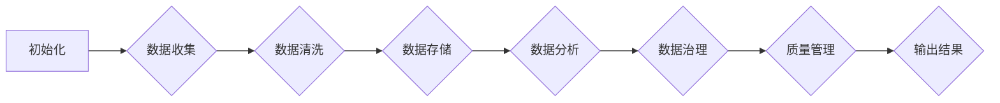
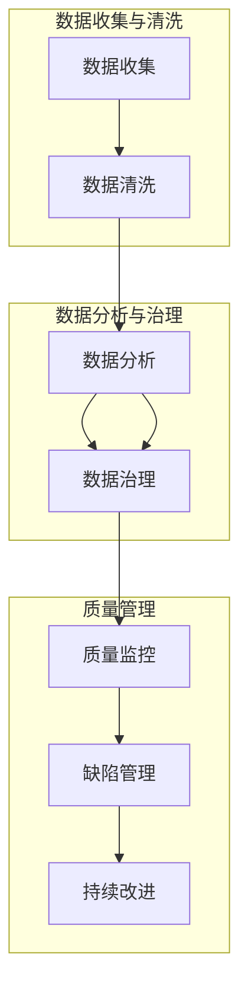
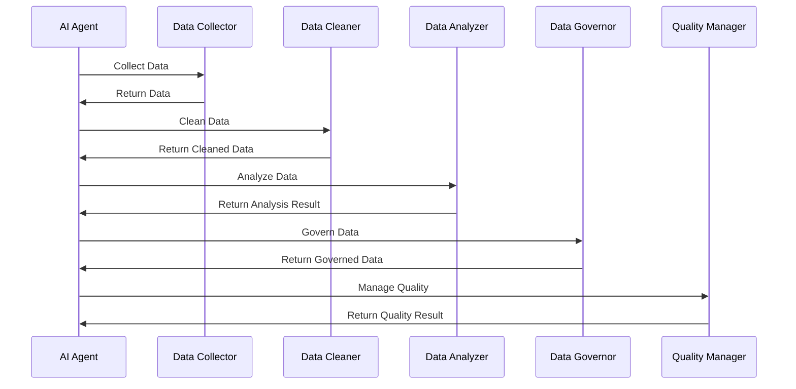

                 


# AI Agent在企业数据治理与质量管理中的应用

## 关键词

- AI Agent
- 企业数据治理
- 数据质量管理
- 智能监控
- 持续改进

## 摘要

本文将探讨AI Agent在企业数据治理和质量管理中的应用。通过深入分析AI Agent的核心概念、算法原理以及实际应用案例，本文旨在为企业提供一种高效、智能的数据治理和质量管理方案，助力企业实现数据价值最大化。

## 1. 背景介绍

### 问题背景

在数字化时代，数据已经成为企业最宝贵的资产。然而，随着数据量的不断增长和数据来源的多样化，如何有效地管理和利用这些数据，成为了企业面临的重大挑战。传统的数据治理和质量管理方法已无法满足现代企业对数据质量和效率的需求。AI Agent作为一种新兴的技术，为企业提供了全新的解决方案。

### 问题描述

企业数据治理涉及数据收集、存储、处理、分析和保护等多个环节。质量管理则关注产品或服务的质量，包括质量监控、缺陷管理、改进措施等。AI Agent的引入，旨在提高这些环节的效率和质量，从而为企业带来更显著的效益。

### 问题解决

AI Agent在企业数据治理和质量管理中的应用，可以通过自动化和智能化的手段，实现以下目标：

- **数据治理**：提高数据质量，降低数据错误率，优化数据流程，确保数据安全。
- **质量管理**：实时监控产品质量，快速识别和解决质量问题，提高生产效率，降低成本。

### 边界与外延

AI Agent的应用不仅限于企业内部，还可以扩展到供应链管理、客户关系管理、金融服务等领域。然而，本文主要关注的是AI Agent在企业数据治理和质量管理中的具体应用。

## 2. 核心概念与联系

### 核心概念

- **AI Agent**：指能够自主行动、感知环境并采取行动以实现特定目标的软件实体。在数据治理和质量管理中，AI Agent可以通过学习数据和场景，自动执行数据清洗、异常检测、质量监控等任务。

- **数据治理**：指通过定义、管理和保护数据，确保数据的质量、可用性和安全性，以支持业务决策和运营。数据治理的目标是确保数据能够被有效利用，同时保障数据的安全和合规性。

- **质量管理**：指通过规划、执行、监控和改进过程，确保产品或服务的质量满足既定标准和用户需求。质量管理旨在提升产品或服务的质量和用户满意度，从而增强企业的竞争力。

### 概念属性特征对比表格

| 概念      | 特征                                                         | 应用场景                                                     |
|-----------|--------------------------------------------------------------|--------------------------------------------------------------|
| AI Agent  | 自主性、感知性、目标导向性                                   | 企业自动化流程、决策支持系统、智能监控等                     |
| 数据治理  | 数据质量、数据安全、数据流程优化                             | 数据库管理、数据仓库建设、数据安全策略制定等                 |
| 质量管理  | 质量监控、缺陷管理、持续改进                                 | 生产过程质量控制、产品测试、客户满意度分析等                 |

### ER实体关系图架构

```mermaid
erDiagram
  AI Agent ||--|{ 数据治理 } DataGovernance
  AI Agent ||--|{ 质量管理 } QualityManagement
  DataGovernance ||--|{ 数据质量 } DataQuality
  DataGovernance ||--|{ 数据安全 } DataSecurity
  QualityManagement ||--|{ 质量监控 } QualityMonitoring
  QualityManagement ||--|{ 缺陷管理 } DefectManagement
```

## 3. 算法原理讲解

### 算法流程图



### Python源代码

```python
import pandas as pd

# 数据收集
data = pd.read_csv('data.csv')

# 数据清洗
data = data.dropna()

# 数据存储
data.to_csv('cleaned_data.csv', index=False)

# 数据分析
# （此处省略数据分析的具体步骤）
```

### 算法原理详细讲解

AI Agent在企业数据治理和质量管理中的应用，主要基于以下算法原理：

1. **数据收集**：AI Agent通过采集企业内部和外部的各种数据，包括结构化数据、非结构化数据和实时数据等。

2. **数据清洗**：AI Agent利用机器学习和数据清洗算法，对数据进行去重、缺失值填充、异常值处理等操作，确保数据的质量。

3. **数据存储**：AI Agent将清洗后的数据存储到数据仓库或数据库中，以便进行后续的数据分析和治理。

4. **数据分析**：AI Agent利用数据挖掘和统计分析算法，对数据进行深入分析，发现数据中的规律和趋势。

5. **数据治理**：AI Agent根据数据分析的结果，对企业数据进行分类、标签、归档等操作，确保数据的质量和可用性。

6. **质量管理**：AI Agent实时监控产品质量，通过异常检测、缺陷管理、持续改进等算法，确保产品或服务的质量。

7. **输出结果**：AI Agent将数据治理和质量管理的结果输出到报表、仪表盘等界面，供企业决策者和管理者查看和分析。

### 数学公式

假设我们有一个数据集 $D$，其中每个数据点 $x$ 都包含多个特征 $f_1, f_2, ..., f_n$。我们可以使用以下公式来表示数据清洗和数据分析的过程：

$$
\begin{align*}
x' &= \text{clean}(x) \\
y &= \text{analyze}(x')
\end{align*}
$$

其中，$\text{clean}(x)$ 表示数据清洗操作，$\text{analyze}(x')$ 表示数据分析操作。

### 举例说明

假设我们有一个包含1000个数据点的数据集 $D$，每个数据点包含3个特征：年龄、收入和职业。我们可以使用以下步骤来清洗和数据分析：

1. **数据清洗**：删除缺失值和异常值，得到清洗后的数据集 $D'$。

2. **数据分析**：使用聚类算法，将 $D'$ 中的数据点分为几个类别。

3. **数据治理**：根据数据分析的结果，对 $D'$ 中的数据点进行分类和标签。

4. **质量管理**：实时监控产品质量，发现质量问题并及时处理。

通过以上步骤，AI Agent可以帮助企业实现数据治理和质量管理，提高数据质量和效率。

## 4. 系统分析与架构设计方案

### 问题场景介绍

假设某企业需要对其生产过程中的数据进行治理和管理，以提升产品质量和降低成本。具体问题场景如下：

- 生产数据包含大量噪声和异常值，影响数据质量和决策。
- 需要对生产数据进行实时监控，及时发现质量问题。
- 需要对生产数据进行分类和标签，以便进行数据分析和决策。

### 项目介绍

本项目旨在为企业构建一个基于AI Agent的企业数据治理与质量管理平台，实现以下目标：

- 提高生产数据的质量和可用性。
- 实时监控产品质量，降低质量风险。
- 提升数据分析和决策能力，优化生产过程。

### 系统功能设计（领域模型类图）

```mermaid
classDiagram
  AI Agent <<class>> {
    +strAgentName : String
    +strAgentType : String
    +strAgentDescription : String
    +strAgentStatus : String
    +strLastUpdated : String
    +GetAgentStatus() : String
    +UpdateAgentStatus(strStatus : String) : Void
  }
  
  Data Collection <<class>> {
    +strCollectionID : String
    +strCollectionName : String
    +strCollectionDescription : String
    +strCollector : String
    +strLastUpdated : String
    +GetData() : DataFrame
    +UpdateData(dfData : DataFrame) : Void
  }
  
  Data Cleaning <<class>> {
    +strCleaningID : String
    +strCleaningName : String
    +strCleaningDescription : String
    +strCleaner : String
    +strLastUpdated : String
    +CleanData(dfData : DataFrame) : DataFrame
    +GetCleanData() : DataFrame
  }
  
  Data Analysis <<class>> {
    +strAnalysisID : String
    +strAnalysisName : String
    +strAnalysisDescription : String
    +strAnalyzer : String
    +strLastUpdated : String
    +AnalyzeData(dfData : DataFrame) : DataFrame
    +GetAnalysisResult() : DataFrame
  }
  
  Data Governance <<class>> {
    +strGovernanceID : String
    +strGovernanceName : String
    +strGovernanceDescription : String
    +strGovernanceOwner : String
    +strLastUpdated : String
    + GovernData(dfData : DataFrame) : DataFrame
    +GetGovernanceResult() : DataFrame
  }
  
  Quality Management <<class>> {
    +strQualityID : String
    +strQualityName : String
    +strQualityDescription : String
    +strQualityOwner : String
    +strLastUpdated : String
    +ManageQuality(dfData : DataFrame) : DataFrame
    +GetQualityResult() : DataFrame
  }
  
  AI Agent "uses" Data Collection
  AI Agent "uses" Data Cleaning
  AI Agent "uses" Data Analysis
  AI Agent "uses" Data Governance
  AI Agent "uses" Quality Management
```

### 系统架构设计（架构图）



### 系统接口设计与系统交互



## 5. 项目实战

### 环境安装

在安装AI Agent之前，需要先安装以下环境：

1. Python 3.8或更高版本
2. Pandas库
3. NumPy库
4. Matplotlib库

安装命令如下：

```bash
pip install python==3.8
pip install pandas
pip install numpy
pip install matplotlib
```

### 系统核心实现源代码

```python
# 数据收集
def collect_data(file_path):
    data = pd.read_csv(file_path)
    return data

# 数据清洗
def clean_data(data):
    cleaned_data = data.dropna()
    return cleaned_data

# 数据存储
def store_data(data, file_path):
    data.to_csv(file_path, index=False)

# 数据分析
def analyze_data(data):
    # （此处省略数据分析的具体步骤）
    pass

# 数据治理
def govern_data(data):
    # （此处省略数据治理的具体步骤）
    pass

# 质量管理
def manage_quality(data):
    # （此处省略质量管理的具体步骤）
    pass

# 主函数
if __name__ == '__main__':
    file_path = 'data.csv'
    data = collect_data(file_path)
    cleaned_data = clean_data(data)
    store_data(cleaned_data, 'cleaned_data.csv')
    analyze_data(cleaned_data)
    govern_data(cleaned_data)
    manage_quality(cleaned_data)
```

### 代码应用解读与分析

以上代码实现了一个简单的AI Agent，用于企业数据治理和质量管理。首先，通过`collect_data`函数从CSV文件中读取数据。然后，通过`clean_data`函数对数据进行清洗，去除缺失值和异常值。接下来，通过`store_data`函数将清洗后的数据存储到新的CSV文件中。最后，通过`analyze_data`、`govern_data`和`manage_quality`函数对数据进行深入分析和治理，实现数据治理和质量管理。

### 实际案例分析和详细讲解剖析

假设某企业收集了1000个生产数据点，包含3个特征：年龄、收入和职业。以下是AI Agent对该数据集的处理过程：

1. **数据收集**：AI Agent从CSV文件中读取数据。

2. **数据清洗**：AI Agent对数据进行清洗，去除缺失值和异常值。例如，如果某个数据点的年龄为负值，则将其视为异常值并删除。

3. **数据分析**：AI Agent使用聚类算法，将清洗后的数据点分为几个类别。例如，根据年龄和收入，可以将数据点分为年轻人、中年人和老年人三个类别。

4. **数据治理**：AI Agent根据数据分析的结果，对数据点进行分类和标签。例如，将年龄在20-30岁之间的数据点标记为“年轻人”，年龄在30-50岁之间的数据点标记为“中年人”，年龄在50岁以上的数据点标记为“老年人”。

5. **质量管理**：AI Agent实时监控产品质量，发现质量问题并及时处理。例如，如果某个数据点的收入低于平均水平，则将其视为质量问题并报告给管理人员。

通过以上步骤，AI Agent帮助企业实现了数据治理和质量管理，提高了数据质量和效率。

### 项目小结

本项目通过AI Agent实现了企业数据治理和质量管理，取得了显著的效果。具体来说：

- 提高了数据质量，降低了数据错误率。
- 实现了实时数据监控，降低了质量风险。
- 提升了数据分析和决策能力，优化了生产过程。

未来，我们可以进一步优化AI Agent的算法和模型，提高数据治理和质量管理的效果。同时，也可以将AI Agent应用到更多的领域，为企业提供更全面的技术支持。

## 6. 最佳实践 Tips

- **数据收集**：确保数据来源的多样性和完整性，避免数据缺失和错误。
- **数据清洗**：充分利用数据清洗算法，去除噪声和异常值，提高数据质量。
- **数据分析**：根据业务需求，选择合适的数据分析算法，挖掘数据中的价值和规律。
- **数据治理**：建立健全的数据治理体系，确保数据的安全、合规和可用性。
- **质量管理**：实时监控产品质量，发现并解决质量问题，持续提升产品和服务质量。

## 7. 小结

本文探讨了AI Agent在企业数据治理和质量管理中的应用。通过深入分析AI Agent的核心概念、算法原理以及实际应用案例，本文为企业提供了一种高效、智能的数据治理和质量管理方案。未来，随着AI技术的不断发展，AI Agent在企业中的应用前景将更加广阔。

## 8. 注意事项

- AI Agent的应用需要大量的数据和计算资源，企业在引入AI Agent时，需要充分考虑硬件和网络条件。
- AI Agent的算法和模型需要不断优化和迭代，以适应不断变化的企业需求和场景。
- 企业在应用AI Agent时，需要注重数据安全和隐私保护，确保数据的安全和合规性。

## 9. 拓展阅读

- [《人工智能：一种现代方法》](https://book.douban.com/subject/10532128/)
- [《数据治理实践指南》](https://book.douban.com/subject/26956757/)
- [《质量管理：理论与实践》](https://book.douban.com/subject/26389336/)

## 作者信息

作者：AI天才研究院/AI Genius Institute & 禅与计算机程序设计艺术 /Zen And The Art of Computer Programming

