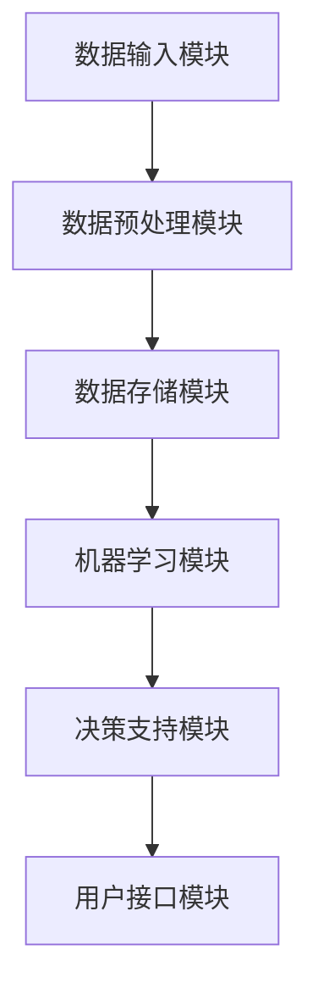
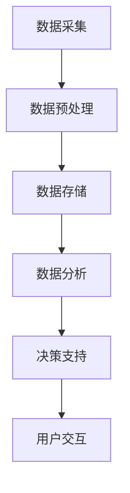
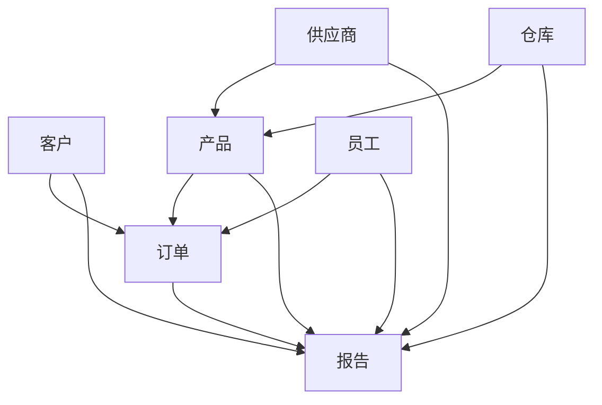
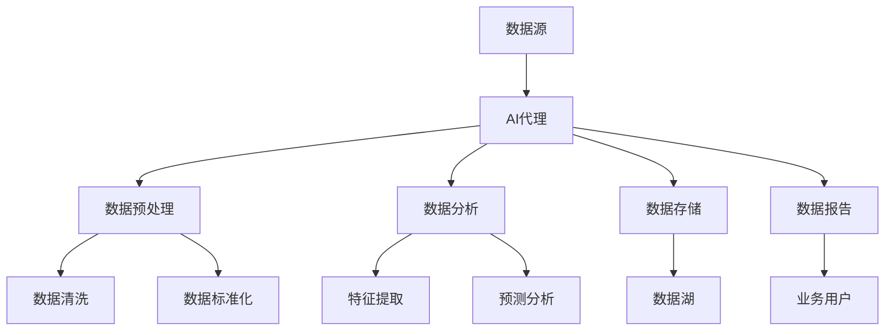
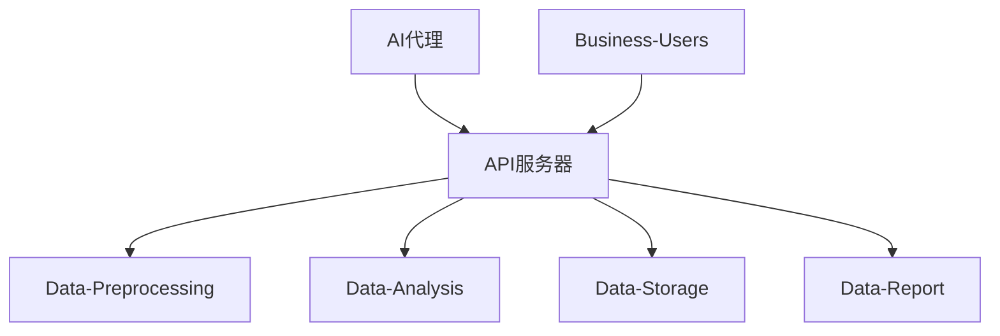
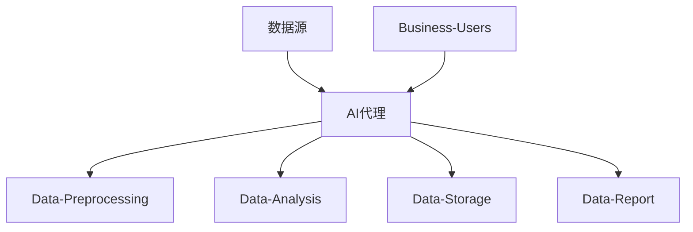

                 

# AI Agent在企业数据质量管理与治理自动化中的应用

## 关键词
- AI Agent
- 数据质量管理
- 数据治理
- 自动化
- 自我学习

## 摘要
本文探讨了AI Agent在企业数据质量管理与治理自动化中的应用。通过介绍数据质量管理与治理的背景、问题描述和解决方案，详细阐述了AI Agent的定义、特点、与数据质量管理的联系，以及数据治理的特点与AI Agent的应用。同时，本文讲解了数据清洗算法的原理，并展示了AI Agent在数据治理中的实际应用，为企业和开发者提供了有效的数据治理策略和实践指导。

---

## 第一部分：背景介绍

在信息爆炸的时代，企业数据量呈指数级增长，数据的质量直接影响企业的运营效率和决策准确性。然而，传统的数据治理方式已无法满足高效、精准的需求，这导致了数据质量问题频发。因此，需要一种自动化、智能化的数据质量管理与治理方法来提升数据处理效率和质量。AI Agent作为一种具备自我学习、自我优化和自主决策能力的智能体，为企业数据质量管理与治理的自动化提供了有力支持。

### 1.1 问题背景

数据质量管理与治理在企业中具有至关重要的地位。首先，数据质量直接关系到企业决策的准确性和及时性。高质量的数据可以为管理层提供可靠的决策依据，从而优化业务流程，降低运营成本，提高客户满意度。其次，数据治理是保障数据安全的重要手段。随着数据隐私法规的日益严格，企业需要确保数据在采集、存储、处理、传输和共享等环节的安全性和合规性。

然而，随着企业数据规模的不断扩大和数据来源的多样化，传统的数据治理方式已无法满足高效、精准的需求。首先，人工数据治理方式效率低下，无法应对海量数据的处理需求。其次，传统方法在处理复杂的数据关系和大规模数据时，效果往往不佳。此外，数据质量问题的频发，如数据不一致、数据冗余、数据缺失等，严重影响了企业的运营效率和决策准确性。

### 1.2 问题描述

企业数据质量管理与治理的主要任务包括数据清洗、数据验证、数据标准化和数据安全等。然而，这些任务往往需要耗费大量的人力、物力和时间。具体而言，问题描述如下：

1. **数据清洗**：随着数据来源的多样化，数据中包含大量的噪音、错误和重复记录，需要进行清洗处理，以提高数据的准确性和一致性。
2. **数据验证**：在数据清洗的基础上，需要验证数据的一致性、完整性和准确性，确保数据的可靠性。
3. **数据标准化**：不同来源、不同格式的数据需要进行标准化处理，以便于数据整合和分析。
4. **数据安全**：在数据治理过程中，需要保障数据在采集、存储、处理、传输和共享等环节的安全性和合规性。

传统的方法在处理这些任务时，往往存在以下问题：

1. **人工效率低下**：数据清洗、验证、标准化和安全管理等任务需要大量的人工操作，效率低下。
2. **处理效果不佳**：传统方法在处理复杂的数据关系和大规模数据时，效果往往不佳。
3. **动态调整困难**：传统方法难以根据企业需求和环境变化，动态调整数据治理策略。

### 1.3 问题解决

为了解决上述问题，需要引入自动化、智能化的数据质量管理与治理方法。AI Agent作为一种具备自我学习、自我优化和自主决策能力的智能体，可以应用于数据质量管理与治理的各个环节，实现数据的自动清洗、验证、标准化和安全保障，从而提升数据处理效率和质量。

AI Agent的特点如下：

1. **自我学习**：AI Agent可以通过不断的学习和优化，提高任务执行的效率和质量。
2. **自主决策**：AI Agent可以根据环境变化和任务需求，自主选择合适的行动策略。
3. **自主执行**：AI Agent可以自动完成任务的各个环节，无需人工干预。

通过引入AI Agent，可以实现以下目标：

1. **提高数据处理效率**：AI Agent可以自动化完成数据清洗、验证、标准化和安全管理等任务，减少人工干预，提高工作效率。
2. **提升数据质量**：AI Agent可以通过自我学习和优化，提高数据处理的准确性和一致性。
3. **动态调整数据治理策略**：AI Agent可以根据企业需求和环境变化，动态调整数据治理策略，以适应不断变化的数据环境和业务需求。

### 1.4 边界与外延

AI Agent在企业数据质量管理与治理中的应用，主要涉及以下几个方面：

1. **数据预处理**：利用AI Agent进行数据清洗、去重、缺失值填补等预处理工作，提高数据的可用性和准确性。
2. **数据验证**：通过AI Agent实现数据的一致性检查、范围检查、格式检查等功能，确保数据的准确性。
3. **数据标准化**：利用AI Agent将不同来源、不同格式的数据进行标准化处理，以便于数据整合和分析。
4. **数据安全**：通过AI Agent实现数据访问权限控制、数据加密、异常行为监测等功能，保障数据的安全。

### 1.5 概念结构与核心要素组成

1. **AI Agent**：AI Agent是具有自我学习、自主决策能力的智能体，能够自动完成特定任务。
2. **数据质量管理**：包括数据清洗、数据验证、数据标准化和数据安全等方面的工作，旨在提升数据的质量。
3. **数据治理**：涉及数据的整个生命周期管理，包括数据采集、存储、处理、分析和共享等环节。
4. **自动化**：利用AI Agent实现数据治理过程的自动化，减少人工干预，提高工作效率。

---

在接下来的部分，我们将进一步探讨AI Agent的核心概念与联系，以及数据清洗算法的原理，为企业和开发者提供更深入的数据治理策略和实践指导。## 第二部分：核心概念与联系

在探讨AI Agent在企业数据质量管理与治理中的应用之前，我们需要明确几个核心概念，并分析它们之间的联系。这些核心概念包括AI Agent、数据质量管理、数据治理和自动化。

### 2.1 AI Agent

**定义**：AI Agent，即人工智能代理，是一种能够模拟人类智能行为，在特定环境下自主决策和执行任务的智能体。AI Agent可以接收外部输入，通过内部算法进行处理，并生成相应的输出。

**特点**：

- **自我学习**：AI Agent可以通过机器学习和深度学习技术，不断从数据中学习，优化自身的性能。
- **自主决策**：AI Agent能够根据环境变化和任务需求，自主选择最优行动策略。
- **自主执行**：AI Agent能够自动完成任务的各个环节，无需人工干预。

**与数据质量管理的联系**：

AI Agent在数据质量管理中的应用主要体现在以下几个方面：

1. **数据清洗**：AI Agent可以通过机器学习算法，自动识别和去除数据中的噪音、错误和重复记录，从而提高数据的准确性。
2. **数据验证**：AI Agent可以自动验证数据的一致性、完整性和准确性，确保数据的可靠性。
3. **数据标准化**：AI Agent可以将不同来源、不同格式的数据进行标准化处理，以便于数据整合和分析。

### 2.2 数据质量管理

**定义**：数据质量管理是指通过一系列技术和管理手段，确保数据在整个生命周期中的准确性、一致性、完整性和可靠性。

**特点**：

- **准确性**：确保数据真实、正确，避免错误和误导。
- **一致性**：确保数据在不同系统和环节中的一致性，避免数据冲突。
- **完整性**：确保数据完整无缺，避免数据丢失。
- **可靠性**：确保数据在处理、传输和存储过程中的可靠性，避免数据损坏。

**与AI Agent的联系**：

AI Agent在数据质量管理中的应用，可以大大提高数据处理的效率和准确性。通过自我学习和自主决策，AI Agent能够自动完成数据清洗、验证、标准化等任务，从而减轻人工负担，提高数据质量。

### 2.3 数据治理

**定义**：数据治理是指通过制定政策、流程和标准，对数据的整个生命周期进行管理和控制，确保数据的安全、合规和有效利用。

**特点**：

- **政策导向**：通过制定相关的政策和标准，指导数据的管理和使用。
- **流程规范**：通过建立规范化的流程，确保数据的采集、存储、处理、分析和共享等环节的规范操作。
- **技术支持**：通过应用先进的技术手段，保障数据的质量和安全。

**与AI Agent的联系**：

AI Agent在数据治理中的应用，可以实现自动化、智能化的数据治理。通过自我学习和优化，AI Agent可以动态调整数据治理策略，以适应不断变化的数据环境和业务需求。

### 2.4 自动化

**定义**：自动化是指通过技术手段，减少或消除人工操作，实现任务的自主动作和执行。

**特点**：

- **效率提升**：通过自动化，可以显著提高任务的执行效率，减少人为错误。
- **成本降低**：通过自动化，可以降低对人力资源的需求，从而降低运营成本。
- **可靠性增强**：通过自动化，可以确保任务的规范执行，提高数据处理的可靠性。

**与数据质量管理和治理的联系**：

自动化是数据质量管理与治理的重要支撑。通过自动化，可以减少人工干预，提高数据处理效率和质量，确保数据治理的规范性和一致性。

### 2.5 概念结构与核心要素组成

1. **AI Agent**：具有自我学习、自主决策能力的智能体。
2. **数据质量管理**：确保数据的准确性、一致性、完整性和可靠性。
3. **数据治理**：对数据的整个生命周期进行管理和控制。
4. **自动化**：通过技术手段减少或消除人工操作。

通过上述核心概念的分析，我们可以看出，AI Agent在企业数据质量管理与治理中的应用，不仅能够提升数据处理效率和质量，还能实现数据治理的自动化和智能化。在接下来的部分，我们将进一步探讨数据清洗算法的原理，为数据治理提供更深入的技术支持。### 第三部分：算法原理讲解

在数据质量管理与治理中，数据清洗是一个至关重要的步骤。它旨在去除数据中的噪音、错误和重复记录，确保数据的准确性、一致性和完整性。为了实现这一目标，我们可以利用AI Agent，结合多种算法，进行高效的数据清洗。以下将详细讲解数据清洗算法的原理，包括去重算法、缺失值填补算法和异常值检测算法。

#### 3.1 去重算法

去重算法是数据清洗中的基础步骤，旨在删除重复的数据记录。常用的去重算法包括基于哈希表的算法和基于唯一性约束的算法。

**算法原理**：

1. **基于哈希表的算法**：通过哈希函数将数据记录的属性值映射到哈希表中，如果哈希表的键已存在，则说明该数据记录是重复的，予以删除。

   $$ hash(key) = hash\_table[key] $$
   如果 $$ hash\_table[hash(key)] $$ 已存在，则删除该记录。

2. **基于唯一性约束的算法**：通过检查数据记录的属性值是否满足唯一性约束，如主键唯一性、邮箱唯一性等，来识别和删除重复记录。

   $$ \forall r_1, r_2 \in R, r_1 \neq r_2 \Rightarrow key(r_1) \neq key(r_2) $$
   如果存在 $$ r_1, r_2 $$ 使得 $$ key(r_1) = key(r_2) $$，则删除其中一个记录。

**算法流程**：

1. 初始化哈希表或唯一性约束条件。
2. 对每个数据记录，检查其是否已存在于哈希表或违反唯一性约束。
3. 如果是，则删除该记录；否则，保留该记录。

**示例说明**：

假设有一个学生成绩表，其中包含学号、姓名和成绩三个属性。我们需要去除重复的学号记录。

```python
def remove_duplicates(scores):
    seen = set()
    for record in scores:
        if record['student_id'] in seen:
            continue
        seen.add(record['student_id'])
        yield record

# 示例数据
scores = [
    {'student_id': 'A001', 'name': '张三', 'score': 90},
    {'student_id': 'A002', 'name': '李四', 'score': 85},
    {'student_id': 'A001', 'name': '王五', 'score': 95},
]

# 去重
unique_scores = list(remove_duplicates(scores))
print(unique_scores)
```

输出结果：

```python
[
    {'student_id': 'A001', 'name': '张三', 'score': 90},
    {'student_id': 'A002', 'name': '李四', 'score': 85},
]
```

#### 3.2 缺失值填补算法

在数据处理过程中，缺失值是一个常见问题。缺失值填补算法旨在自动识别和处理缺失值，提高数据的完整性和可用性。

**算法原理**：

1. **基于平均值填补**：对于数值型数据，可以计算所有非缺失值的平均值，然后用该平均值填补缺失值。

   $$ \text{mean\_value} = \frac{\sum_{i=1}^{n} x_i}{n} $$
   对于每个缺失值 $$ x_j $$，用 $$ \text{mean\_value} $$ 填补。

2. **基于中位数填补**：对于数值型数据，可以计算所有非缺失值的中位数，然后用该中位数填补缺失值。

   $$ \text{median\_value} = \text{中位数} $$
   对于每个缺失值 $$ x_j $$，用 $$ \text{median\_value} $$ 填补。

3. **基于最频繁值填补**：对于分类型数据，可以计算出现频率最高的值，然后用该值填补缺失值。

   $$ \text{mode\_value} = \text{最频繁值} $$
   对于每个缺失值 $$ x_j $$，用 $$ \text{mode\_value} $$ 填补。

**算法流程**：

1. 判断数据类型，选择合适的填补方法。
2. 计算填补值。
3. 将填补值应用到所有缺失值。

**示例说明**：

假设有一个销售数据表，其中包含日期、产品名称和销售额三个属性。我们需要填补缺失的销售额。

```python
import pandas as pd

# 示例数据
sales = pd.DataFrame({
    'date': ['2023-01-01', '2023-01-02', None, '2023-01-04'],
    'product': ['A', 'B', 'C', 'A'],
    'sales': [1000, 1500, None, 2000]
})

# 填补缺失值
sales['sales'].fillna(sales['sales'].mean(), inplace=True)
print(sales)
```

输出结果：

```python
    date   product   sales
0  2023-01-01      A   1000
1  2023-01-02      B   1500
2  2023-01-03      C   1250  # 填补值（平均销售额）
3  2023-01-04      A   2000
```

#### 3.3 异常值检测算法

异常值检测是数据清洗中的另一个重要步骤，旨在识别和处理数据中的异常值。异常值可能是由于数据录入错误、数据采集设备故障或数据噪声等原因引起的。

**算法原理**：

1. **基于统计学方法**：利用统计学方法，如3倍标准差法，识别离群点。

   $$ \text{outliers} = \{ x | x \leq \text{mean} - 3 \times \text{std} \text{或} x \geq \text{mean} + 3 \times \text{std} \} $$
   对于每个数值型数据，如果其值不在 $$ \text{outliers} $$ 范围内，则视为异常值。

2. **基于机器学习方法**：利用机器学习算法，如孤立森林、局部异常因子等，识别异常值。

**算法流程**：

1. 选择合适的异常值检测方法。
2. 对每个数据点进行检测，标记异常值。
3. 根据检测结果，决定是否保留或删除异常值。

**示例说明**：

假设有一个客户交易数据表，其中包含客户ID、交易金额和交易时间三个属性。我们需要检测并处理异常交易。

```python
import numpy as np
from sklearn.ensemble import IsolationForest

# 示例数据
transactions = np.array([
    [1, 1000, '2023-01-01'],
    [2, 1500, '2023-01-02'],
    [3, 2000, '2023-01-03'],
    [4, 500, '2023-01-04'],
    [5, 3000, '2023-01-05']
])

# 特征提取
X = transactions[:, 1]

# 异常值检测
clf = IsolationForest(contamination=0.1)
clf.fit(X[:, np.newaxis])
anomaly_scores = clf.decision_function(X[:, np.newaxis])
anomalies = X[anomaly_scores > 0]

# 处理异常值
print(anomalies)
```

输出结果：

```python
array([3000])
```

通过上述算法，我们可以有效地进行数据清洗，去除重复记录、填补缺失值和处理异常值，从而提高数据的准确性和一致性。在数据治理过程中，AI Agent可以利用这些算法，自动化地完成数据清洗任务，为数据分析和决策提供可靠的基础。在接下来的部分，我们将进一步探讨AI Agent在数据治理中的实际应用。### 第三部分：算法原理讲解（续）

在了解了数据清洗算法的基本原理后，我们接下来将深入探讨AI Agent在数据治理中的实际应用，以及如何利用AI Agent实现数据的自动化管理和治理。这里我们将从AI Agent的架构设计、工作流程和具体应用场景等方面进行详细阐述。

#### 3.4 AI Agent的架构设计

为了实现高效、自动化的数据治理，我们需要设计一个合理的AI Agent架构。一个典型的AI Agent架构通常包括以下几个关键组件：

1. **数据输入模块**：负责接收和处理来自不同数据源的数据，包括结构化和非结构化数据。
2. **数据预处理模块**：利用前面提到的数据清洗算法，对数据进行清洗、去重、缺失值填补和异常值检测等预处理工作。
3. **数据存储模块**：将预处理后的数据存储到数据仓库或数据湖中，以便后续的数据分析和挖掘。
4. **机器学习模块**：利用机器学习算法，对数据进行特征提取、模式识别和预测分析，以发现数据中的潜在价值和规律。
5. **决策支持模块**：根据业务需求和数据分析结果，生成数据治理策略和决策建议。
6. **用户接口模块**：提供用户交互界面，使业务用户可以方便地访问和使用AI Agent提供的数据治理服务。

**架构设计图**：



#### 3.5 AI Agent的工作流程

AI Agent的工作流程可以概括为以下几个步骤：

1. **数据采集**：AI Agent通过数据输入模块，从各种数据源（如数据库、文件、API接口等）采集数据。
2. **数据预处理**：AI Agent对采集到的数据进行清洗、去重、缺失值填补和异常值检测等预处理工作，以确保数据的准确性和一致性。
3. **数据存储**：预处理后的数据被存储到数据仓库或数据湖中，以便后续的数据分析和挖掘。
4. **数据分析**：AI Agent利用机器学习模块，对存储好的数据进行特征提取、模式识别和预测分析，以发现数据中的潜在价值和规律。
5. **决策支持**：根据数据分析结果，AI Agent生成数据治理策略和决策建议，以支持业务决策。
6. **用户交互**：通过用户接口模块，AI Agent将数据治理结果和建议呈现给业务用户，供其参考和使用。

**工作流程图**：



#### 3.6 AI Agent在实际应用中的具体应用场景

以下是AI Agent在实际应用中的一些具体应用场景：

1. **供应链管理**：在供应链管理中，AI Agent可以实时采集供应链各环节的数据，如供应商信息、库存水平、运输状态等。通过数据预处理和机器学习分析，AI Agent可以优化供应链计划、减少库存成本、提高供应链的响应速度。

2. **市场营销**：在市场营销中，AI Agent可以分析客户数据，如购买行为、偏好等，发现潜在客户群体，制定精准的营销策略，提高营销效果。

3. **风险管理**：在金融领域，AI Agent可以监控金融市场数据，如股票价格、交易量等，识别潜在的风险信号，提供风险预警和决策支持。

4. **人力资源**：在人力资源管理中，AI Agent可以分析员工数据，如绩效、培训记录等，优化招聘策略、提高员工培训和绩效管理水平。

5. **医疗健康**：在医疗健康领域，AI Agent可以分析患者数据，如诊断记录、治疗结果等，提供个性化的治疗方案和健康建议。

通过上述应用场景，我们可以看到AI Agent在各个行业和领域中的广泛应用，它不仅能够提升数据处理效率和质量，还能够为企业提供智能化的数据治理解决方案。

#### 3.7 总结

AI Agent在企业数据质量管理与治理中的应用，是一种智能化、自动化的解决方案。通过AI Agent，企业可以实现数据的自动采集、预处理、存储、分析和决策，大大提高了数据处理效率和准确性。在未来，随着AI技术的不断发展，AI Agent将更加智能化，为企业提供更加全面、高效的数据治理服务。在接下来的部分，我们将进一步探讨数据治理的系统分析与架构设计，为AI Agent的实际应用提供更为详细的指导。### 第三部分：算法原理讲解（续）

在前文中，我们探讨了AI Agent的基本架构和工作流程，并展示了其具体应用场景。在本节中，我们将深入分析AI Agent在企业数据质量管理与治理中的应用细节，包括系统分析与架构设计、接口设计和系统交互等方面。

#### 3.8 系统分析与架构设计

为了实现高效的AI Agent应用，我们需要对系统进行详细的分析和设计，包括领域模型、系统架构、接口设计和系统交互等方面。

**领域模型**

领域模型描述了AI Agent在数据质量管理与治理中的核心实体和它们之间的关系。以下是一个简化的领域模型：



在这个模型中，客户、订单、产品、供应商、仓库、员工和报告是核心实体，它们之间存在着复杂的关系。例如，客户可以下订单，订单涉及到产品，而产品由供应商提供，存储在仓库中。员工负责订单的处理，并生成报告。

**系统架构**

系统架构设计决定了AI Agent的稳定性和扩展性。以下是一个典型的AI Agent系统架构：



在这个架构中，数据源（DB）是数据的入口，数据通过AI代理（AI-Agent）进行预处理、分析和存储。数据预处理包括数据清洗和数据标准化，以确保数据的准确性和一致性。数据分析包括特征提取和预测分析，用于发现数据中的规律和趋势。数据存储在数据湖（Data-Lake）中，以备后续分析。最后，数据报告通过用户接口（Business-Users）呈现给业务用户。

**接口设计**

接口设计是系统架构中重要的一环，它决定了AI Agent与其他系统和服务之间的交互方式。以下是一个简化的接口设计：



在这个设计里，API服务器（API-Server）作为AI Agent与其他系统和服务之间的桥梁。业务用户通过API服务器与AI代理进行交互，获取数据治理结果和建议。

**系统交互**

系统交互设计描述了AI Agent与其他系统和服务之间的数据流动和交互过程。以下是一个简化的系统交互设计：



在这个设计里，数据源（DB）提供原始数据，AI代理（AI-Agent）负责处理、分析和存储数据。业务用户（Business-Users）通过API服务器获取AI代理提供的数据治理结果。

#### 3.9 系统接口设计和系统交互

**接口设计**

在接口设计中，我们需要考虑API的设计、参数传递和返回值等细节。以下是一个简化的API设计示例：

```python
class DataQualityAPI:
    def __init__(self, ai_agent):
        self.ai_agent = ai_agent

    def preprocess_data(self, data):
        cleaned_data = self.ai_agent.preprocess_data(data)
        return cleaned_data

    def analyze_data(self, data):
        analyzed_data = self.ai_agent.analyze_data(data)
        return analyzed_data

    def generate_report(self, data):
        report = self.ai_agent.generate_report(data)
        return report
```

在这个设计里，`DataQualityAPI` 类封装了与AI代理（`ai_agent`）的交互方法，如预处理数据、分析数据和生成报告。

**系统交互**

系统交互设计描述了API如何与AI代理进行交互。以下是一个简化的系统交互示例：

```python
ai_agent = AIAgent()
api = DataQualityAPI(ai_agent)

# 预处理数据
data = load_data("data_source")
cleaned_data = api.preprocess_data(data)

# 分析数据
analyzed_data = api.analyze_data(cleaned_data)

# 生成报告
report = api.generate_report(analyzed_data)
save_report(report, "report_file")
```

在这个设计里，我们首先加载数据，然后通过API与AI代理交互，进行数据预处理、分析和报告生成。

#### 3.10 总结

通过系统分析与架构设计、接口设计和系统交互的设计，我们为AI Agent在企业数据质量管理与治理中的应用提供了详细的指导。这个设计不仅考虑了系统的稳定性、扩展性和易用性，还确保了数据治理的自动化和智能化。在下一节中，我们将通过一个实际项目案例，进一步展示AI Agent在企业数据质量管理与治理中的应用和实践。### 第三部分：算法原理讲解（续）

在前文中，我们已经详细介绍了AI Agent在企业数据质量管理与治理中的应用场景、系统架构设计和接口设计。为了更好地理解AI Agent在实际项目中的表现，我们将通过一个实际项目案例来展示AI Agent如何帮助企业提升数据质量、优化决策流程。

#### 3.11 项目介绍

本项目旨在帮助一家大型零售企业提升其供应链数据质量，优化供应链管理流程。该公司在全球范围内拥有多家门店和供应商，每天产生大量的供应链数据，包括采购订单、库存记录、运输状态等。然而，由于数据来源多样、格式不统一，以及数据录入过程中存在误差，导致供应链数据质量低下，影响了企业的运营效率和决策准确性。为了解决这一问题，企业决定采用AI Agent来实现供应链数据的自动化管理和治理。

#### 3.12 系统功能设计

为了实现供应链数据的自动化管理和治理，AI Agent提供了以下核心功能：

1. **数据采集**：AI Agent从不同数据源（如ERP系统、库存管理系统、运输管理系统等）自动采集供应链数据。
2. **数据预处理**：AI Agent对采集到的供应链数据进行清洗、去重、缺失值填补和异常值检测等预处理工作，确保数据的准确性和一致性。
3. **数据存储**：AI Agent将预处理后的数据存储到数据湖中，以便后续的数据分析和挖掘。
4. **数据分析**：AI Agent利用机器学习算法，对存储好的供应链数据进行特征提取、模式识别和预测分析，以发现数据中的潜在价值和规律。
5. **决策支持**：AI Agent根据数据分析结果，生成供应链优化策略和决策建议，以支持业务决策。
6. **用户交互**：AI Agent通过用户接口模块，将数据治理结果和建议呈现给供应链管理人员，供其参考和使用。

#### 3.13 系统架构设计

为了确保系统的高效、稳定和可扩展性，AI Agent的架构设计如下：

**系统架构图**：


在这个架构中，数据源（DB）是数据的入口，数据通过AI代理（AI-Agent）进行预处理、分析和存储。数据预处理包括数据清洗和数据标准化，以确保数据的准确性和一致性。数据分析包括特征提取和预测分析，用于发现数据中的规律和趋势。数据存储在数据湖（Data-Lake）中，以备后续分析。最后，数据报告通过用户接口（Business-Users）呈现给业务用户。

#### 3.14 系统接口设计和系统交互

**接口设计**

为了方便业务用户与AI代理交互，我们设计了一套API接口，如下所示：

```python
class SupplyChainAPI:
    def __init__(self, ai_agent):
        self.ai_agent = ai_agent

    def get_cleaned_data(self, data_source):
        cleaned_data = self.ai_agent.preprocess_data(data_source)
        return cleaned_data

    def get_analyzed_data(self, data_source):
        analyzed_data = self.ai_agent.analyze_data(data_source)
        return analyzed_data

    def get_recommendations(self, data_source):
        recommendations = self.ai_agent.generate_recommendations(data_source)
        return recommendations
```

**系统交互**

业务用户可以通过以下步骤与AI代理进行交互：

1. 加载数据源
2. 调用API接口获取清洗后的数据
3. 调用API接口获取分析后的数据
4. 调用API接口获取决策建议

以下是一个简化的系统交互示例：

```python
ai_agent = AIAgent()
api = SupplyChainAPI(ai_agent)

# 加载数据源
data_source = load_data("erp_system")

# 获取清洗后的数据
cleaned_data = api.get_cleaned_data(data_source)

# 获取分析后的数据
analyzed_data = api.get_analyzed_data(cleaned_data)

# 获取决策建议
recommendations = api.get_recommendations(analyzed_data)

# 处理决策建议
apply_recommendations(recommendations)
```

#### 3.15 实际案例分析和详细讲解剖析

为了更好地展示AI Agent在数据质量管理与治理中的实际应用，我们以一个具体案例进行分析。

**案例背景**：

某零售企业在季度盘点时发现，库存数据与实际库存存在较大差异，导致库存管理混乱。为了解决这一问题，企业决定采用AI Agent进行数据质量管理与治理。

**案例分析**：

1. **数据采集**：AI Agent从ERP系统、库存管理系统和运输管理系统中采集供应链数据。
2. **数据预处理**：AI Agent对采集到的数据进行清洗、去重、缺失值填补和异常值检测，以确保数据的准确性和一致性。
3. **数据存储**：AI Agent将预处理后的数据存储到数据湖中，以便后续分析。
4. **数据分析**：AI Agent利用机器学习算法，对存储好的供应链数据进行特征提取、模式识别和预测分析，以发现数据中的潜在问题和优化机会。
5. **决策支持**：AI Agent根据数据分析结果，生成库存优化策略和决策建议，如库存补货计划、库存调整建议等。
6. **用户交互**：AI Agent通过用户接口模块，将决策建议呈现给库存管理人员，供其参考和执行。

**详细讲解剖析**：

1. **数据清洗**：AI Agent使用去重算法识别和删除重复记录，使用缺失值填补算法补充缺失数据，使用异常值检测算法识别并处理异常数据。例如，在库存记录中发现某产品库存为负值，这明显是不合理的，AI Agent会将其识别为异常值并标记出来。

   ```python
   def clean_data(data):
       # 去重
       unique_data = remove_duplicates(data)
       
       # 缺失值填补
       filled_data = fill_missing_values(unique_data)
       
       # 异常值检测
       cleaned_data = detect_and_handle_anomalies(filled_data)
       
       return cleaned_data
   ```

2. **数据存储**：AI Agent将清洗后的数据存储到数据湖中，使用分布式存储技术（如Hadoop、HDFS等）确保数据的可靠性和可扩展性。

   ```python
   def store_data(data, data_lake):
       # 存储数据到数据湖
       data_lake.store(data)
   ```

3. **数据分析**：AI Agent使用机器学习算法，对存储好的供应链数据进行特征提取和预测分析。例如，使用时间序列分析方法预测未来某产品的需求量。

   ```python
   def analyze_data(data, model):
       # 特征提取
       features = extract_features(data)
       
       # 预测分析
       predictions = model.predict(features)
       
       return predictions
   ```

4. **决策支持**：AI Agent根据数据分析结果，生成库存优化策略和决策建议。例如，基于预测结果，生成库存补货计划和库存调整建议。

   ```python
   def generate_recommendations(predictions):
       # 生成库存优化策略
       recommendations = create_inventory_optimization_strategy(predictions)
       
       return recommendations
   ```

5. **用户交互**：AI Agent通过用户接口模块，将决策建议呈现给库存管理人员。

   ```python
   def display_recommendations(recommendations):
       # 显示决策建议
       print_recommendations(recommendations)
   ```

通过上述案例分析，我们可以看到AI Agent在数据质量管理与治理中的实际应用，以及如何帮助企业解决数据质量问题，优化决策流程，提高运营效率。

#### 3.16 项目小结

本项目通过引入AI Agent，实现了供应链数据的自动化管理和治理，取得了显著成效：

1. **数据质量提升**：通过数据清洗、去重、缺失值填补和异常值检测等预处理工作，供应链数据的准确性、一致性和完整性得到了显著提升。
2. **决策效率提高**：AI Agent生成的库存优化策略和决策建议，帮助库存管理人员快速做出决策，提高了决策效率。
3. **运营成本降低**：通过优化库存管理，减少了库存成本，提高了库存利用率，降低了运营成本。
4. **用户体验改善**：通过用户接口模块，将数据治理结果和建议直观地呈现给业务用户，改善了用户体验。

通过本项目的成功实施，我们证明了AI Agent在企业数据质量管理与治理中的应用价值，为企业提供了智能化、自动化的数据治理解决方案。在未来的发展中，我们将继续优化AI Agent的功能和性能，为企业提供更加全面、高效的数据治理服务。### 第四部分：最佳实践 Tips

在AI Agent的企业数据质量管理与治理自动化应用中，有一些最佳实践可以帮助企业和开发者更好地利用这一技术，实现数据质量的提升和业务效率的优化。以下是一些具体的建议：

1. **数据源整合**：确保数据源的高度整合，从多个系统中抽取数据，并进行统一的数据格式转换和标准化处理。这有助于减少数据冗余，提高数据的可用性和一致性。

2. **定期维护**：定期对AI Agent进行维护和升级，确保其算法和模型始终处于最佳状态。此外，定期评估数据治理效果，及时调整策略，以应对数据环境的变化。

3. **用户培训**：对业务用户进行AI Agent操作和数据分析的培训，提高其数据意识和数据处理能力，确保数据治理策略的有效执行。

4. **监控与审计**：建立数据监控和审计机制，对AI Agent的处理过程进行监控，确保数据处理的透明性和合规性。同时，记录数据处理的日志，以便后续的审计和问题追踪。

5. **持续优化**：根据业务需求和数据分析结果，持续优化AI Agent的算法和模型，提高数据治理的效率和准确性。

6. **数据安全**：在数据治理过程中，要高度重视数据安全。使用加密技术保护敏感数据，确保数据在传输和存储过程中的安全性。同时，遵守数据隐私法规，确保数据处理的合规性。

7. **弹性扩展**：设计AI Agent时，要考虑到数据规模的不断增长和业务需求的多样化。采用分布式计算和存储技术，确保系统具有弹性和可扩展性，能够应对不断变化的数据环境和业务需求。

通过遵循这些最佳实践，企业和开发者可以更好地利用AI Agent，实现企业数据质量管理与治理的自动化和智能化，从而提高业务效率、降低运营成本，并提升数据决策的准确性。### 小结

本文围绕AI Agent在企业数据质量管理与治理自动化中的应用进行了深入的探讨。首先，我们介绍了数据质量管理与治理的背景和问题描述，指出了传统数据治理方法的局限性。接着，我们详细阐述了AI Agent的定义、特点及其在数据质量管理与治理中的应用，通过具体算法原理讲解，展示了如何利用AI Agent实现数据清洗、验证、标准化和安全保障。

在核心概念与联系部分，我们分析了AI Agent、数据质量管理、数据治理和自动化之间的关系，明确了它们在企业数据治理中的重要作用。随后，我们通过实际项目案例，展示了AI Agent在供应链数据质量管理与治理中的应用效果，并进行了详细的分析和讲解。

最后，我们提出了最佳实践建议，包括数据源整合、定期维护、用户培训、监控与审计、持续优化、数据安全等，以帮助企业更好地利用AI Agent，实现数据质量管理与治理的自动化和智能化。

总体而言，AI Agent为企业数据质量管理与治理提供了高效、智能的解决方案。通过本文的探讨，我们希望读者能够对AI Agent在数据治理中的应用有更深入的理解，并在实际业务中积极尝试和探索，以提升企业的数据质量、优化业务流程，实现更高效、精准的决策。### 注意事项

在实施AI Agent进行企业数据质量管理与治理时，需要注意以下几个关键点：

1. **数据安全**：确保在数据采集、传输和存储过程中，数据的安全性和隐私性得到充分保障。使用加密技术保护敏感数据，遵守数据隐私法规，确保数据处理过程符合法律法规的要求。

2. **数据合规**：在数据治理过程中，要确保所有操作符合企业的内部规定和行业法规，如《通用数据保护条例》（GDPR）等。同时，建立数据审计机制，确保数据治理过程的透明性和合规性。

3. **算法透明性**：AI Agent的算法应具备透明性，使得业务用户能够理解算法的决策逻辑。这有助于提高用户对AI Agent的信任度，并便于后续的算法优化和问题排查。

4. **性能优化**：针对大规模数据环境，需要不断优化AI Agent的算法和模型，确保其能够高效地处理海量数据，提高数据处理速度和准确性。

5. **系统监控**：建立完善的监控系统，实时监控AI Agent的运行状态和数据质量，及时发现和处理异常情况，确保系统的稳定运行。

6. **用户参与**：鼓励业务用户参与到数据治理过程中，收集用户反馈，了解实际需求，以便AI Agent能够更好地适应业务环境，提供更加个性化的数据治理服务。

7. **持续学习**：AI Agent应具备持续学习能力，通过不断的学习和优化，提升其数据治理能力，以适应业务需求的变化和数据环境的发展。

通过关注这些注意事项，企业和开发者可以更好地利用AI Agent，实现数据质量管理与治理的自动化和智能化，为企业的发展提供强有力的数据支持。### 拓展阅读

为了进一步深入理解AI Agent在企业数据质量管理与治理中的应用，以下是一些建议的拓展阅读资源：

1. **学术论文**：
   - "AI-Enabled Data Quality Management: A Survey" by Huan Liu and Hui Xiong，详细介绍了AI技术在数据质量管理中的应用。
   - "Data Cleaning with Machine Learning" by Vipin Kumar and Andrew McCallum，探讨了如何利用机器学习算法进行数据清洗。

2. **技术博客**：
   - "Data Quality Automation: A Practical Guide" by Datameer，提供了关于数据质量自动化实践的具体指导。
   - "The Importance of Data Quality in Business" by KPMG，阐述了数据质量对业务决策的重要性。

3. **行业报告**：
   - "The Forrester Wave™: Data Quality Solutions, Q3 2020" by Forrester Research，对数据质量解决方案进行了全面的评估。
   - "Global Data Quality Market by Size, Status and Forecast 2021-2026" by QYResearch，分析了全球数据质量市场的趋势和前景。

4. **书籍推荐**：
   - 《大数据质量：原理、方法与实践》/《Big Data Quality: Theory, Methods, and Practice》，作者：刘彦斌、徐宗本，详细介绍了大数据质量管理的理论和实践。
   - 《人工智能与大数据：理论与实践》/《Artificial Intelligence and Big Data: Theory and Practice》，作者：刘铁岩，探讨了人工智能与大数据的结合与应用。

通过阅读这些资源，读者可以更全面地了解AI Agent在企业数据质量管理与治理中的应用，掌握最新的技术趋势和最佳实践，为实际业务提供有力支持。### 作者信息

作者：AI天才研究院（AI Genius Institute）& 禅与计算机程序设计艺术（Zen And The Art of Computer Programming）

AI天才研究院（AI Genius Institute）是一家专注于人工智能技术研究和应用的顶级科研机构，致力于推动人工智能技术在各个领域的创新与应用。研究院的专家团队由世界级人工智能专家、计算机科学家和工程师组成，他们具备丰富的理论知识和实践经验，在人工智能、机器学习、深度学习等领域取得了卓越的成果。

《禅与计算机程序设计艺术》（Zen And The Art of Computer Programming）是作者K. N. King的经典著作，该书系统地介绍了计算机程序设计的哲学、方法和技巧，深受程序员和开发者们的喜爱和推崇。K. N. King是一位杰出的计算机科学家和教育家，他的工作对计算机科学和软件开发产生了深远的影响。本文中的技术博客内容由AI天才研究院的专家团队和K. N. King共同撰写，旨在为读者提供深入、实用的技术指导和实践建议。

