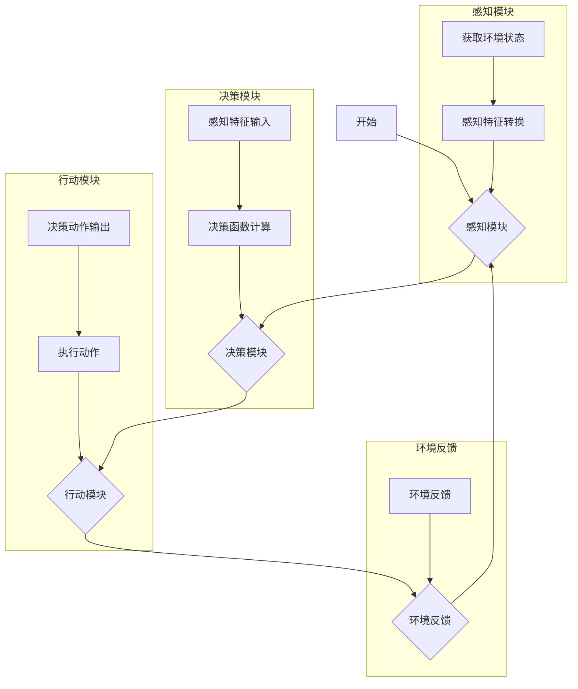
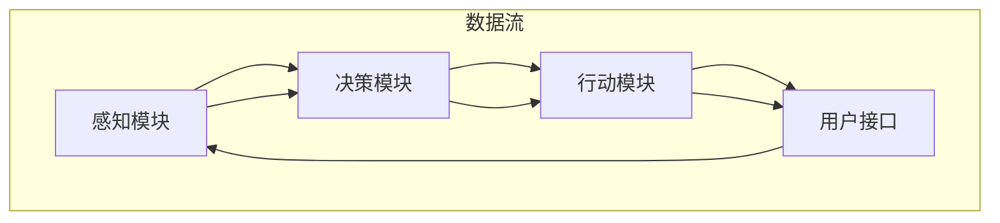
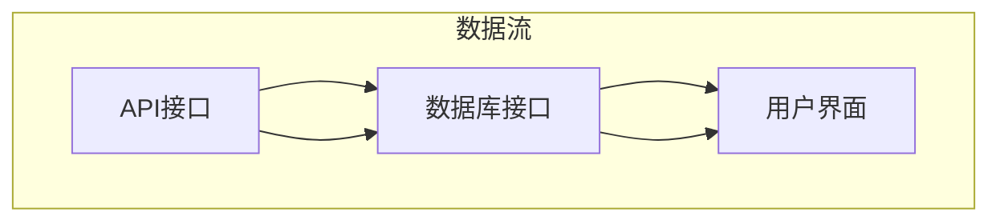
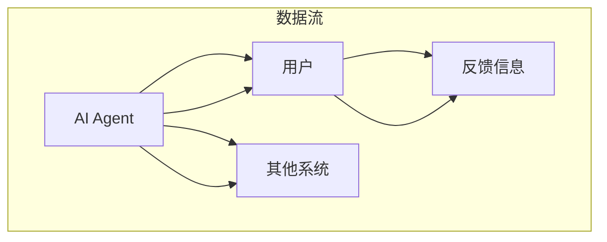

                 


### 引言

在当今数字化时代，人工智能（AI）正在逐渐渗透到各个行业，为企业带来前所未有的创新机会。其中一个备受关注的应用领域是企业文化建设与内部沟通。企业文化建设是提升企业核心竞争力的重要手段，而内部沟通则是保障组织高效运作的基石。近年来，随着AI技术的发展，AI Agent作为一种具备高度自主学习和交互能力的智能体，开始在这些领域展现出强大的潜力。

本文旨在探讨AI Agent在企业文化建设与内部沟通中的创新应用。文章将分为以下几个部分：

首先，我们将简要介绍AI Agent的定义、特点以及其在企业文化建设与内部沟通中的应用背景。接着，我们将深入分析当前企业文化建设与内部沟通所面临的挑战，以及AI Agent如何应对这些问题。随后，我们将讨论AI Agent在企业文化建设与内部沟通中的具体应用策略，包括其核心优势和应用范围。接下来，我们将通过一个实际案例，详细解析AI Agent在企业文化建设与内部沟通中的应用，展示其具体实施过程和效果。最后，我们将总结本文的主要观点，并对未来发展趋势进行展望。

通过本文的讨论，我们希望能够为读者提供一个清晰、全面的认识，激发对AI Agent在企业文化建设与内部沟通中创新应用的思考。

### 背景介绍

#### AI Agent的定义与特点

AI Agent，即人工智能代理，是指具有高度自主学习和决策能力的智能体。与传统的人工智能系统不同，AI Agent不仅仅是一个静态的算法或模型，它更像是一个动态的实体，能够在不同的环境中自主行动，与外界进行交互，并不断学习和适应新的情境。AI Agent的核心特点是自主性、适应性和交互性。

自主性是指AI Agent能够在没有外部干预的情况下，根据自身的目标和环境信息，自主地做出决策和采取行动。这种自主性是AI Agent区别于传统机器学习模型的重要特征。例如，一个自动驾驶汽车AI Agent可以在没有人为干预的情况下，根据道路情况和交通规则，自主地选择行驶路径和速度。

适应性是指AI Agent能够根据环境的变化，自主地调整自己的行为策略。这种适应性使得AI Agent能够在不断变化的环境中，保持高效和稳定的表现。例如，一个智能客服AI Agent可以根据用户的提问历史和反馈，不断优化自己的回答策略，提高服务质量。

交互性是指AI Agent能够与人类或其他AI Agent进行有效的交流和协作。这种交互性使得AI Agent不仅能够完成独立的任务，还能够参与到更复杂、多变的场景中。例如，一个智能会议室AI Agent可以自动记录会议内容、生成会议纪要，并与参会者进行实时互动，提高会议的效率和效果。

#### 企业文化建设与内部沟通的重要性

企业文化建设是塑造企业独特价值观、使命和愿景的过程，它直接影响企业的核心竞争力。一个优秀的企业文化能够凝聚员工的共同价值观和目标，激发员工的积极性和创造力，从而推动企业持续发展。内部沟通则是实现企业文化传承和发展的关键途径。通过有效的内部沟通，企业可以确保信息在企业内部的高效传递和共享，促进各部门之间的协作和协调，提高组织的运作效率。

在企业文化建设中，AI Agent可以通过以下方式发挥作用：

1. **文化传递与普及**：AI Agent可以利用自然语言处理技术，将企业文化理念转化为易于理解的语言，向员工进行普及和宣传，提高员工对企业文化的认同感和归属感。

2. **情感互动与关怀**：AI Agent可以通过情感计算技术，识别员工的情感状态，提供个性化的关怀和支持，增强员工的情感体验和工作满意度。

3. **文化传承与创新**：AI Agent可以记录和整理企业历史和文化，通过智能化的方式传递给新员工，同时借助机器学习技术，不断优化和创新企业文化，使之与时俱进。

#### AI Agent在内部沟通中的应用

在内部沟通中，AI Agent同样具有广泛的应用前景：

1. **信息传递与共享**：AI Agent可以自动收集、整理和发布企业内部信息，确保信息的及时、准确和全面传递，减少信息滞后和错误。

2. **智能客服与支持**：AI Agent可以充当智能客服，解答员工在工作中的疑问，提供技术支持和咨询服务，提高服务效率和质量。

3. **情感分析与反馈**：AI Agent可以通过情感分析技术，监测员工的情绪状态，提供及时的反馈和干预，帮助员工缓解压力，保持积极的工作态度。

#### AI Agent的应用潜力与挑战

AI Agent在企业文化建设与内部沟通中的创新应用，具有巨大的潜力。然而，要充分发挥其潜力，也面临着一些挑战：

1. **数据隐私与安全**：AI Agent需要大量的数据来训练和优化，这涉及到数据隐私和安全的问题。如何在保护员工隐私的前提下，充分利用数据资源，是一个需要解决的问题。

2. **技术成熟度**：虽然AI Agent技术已经在许多领域取得了显著的进展，但在企业文化建设与内部沟通中的应用，仍需要更高的技术成熟度和可靠性。

3. **文化适应性**：每个企业都有其独特的文化背景和特点，AI Agent需要具备较高的文化适应性，能够根据企业的实际情况进行定制化和优化。

综上所述，AI Agent在企业文化建设与内部沟通中具有广阔的应用前景，但也面临一定的挑战。通过进一步的研究和探索，我们可以期待AI Agent在这两个领域发挥更大的作用，为企业创造更大的价值。

#### 问题描述

当前，企业文化建设与内部沟通面临着诸多挑战。首先，企业文化建设的滞后性是一个显著问题。许多企业在快速发展过程中，往往忽视了企业文化的培育和传承，导致企业文化与企业发展不相匹配，影响员工的凝聚力和认同感。其次，内部沟通的低效性也是一个突出问题。传统内部沟通方式如会议、邮件等，存在信息传递滞后、信息丢失等问题，难以满足现代企业快速响应和高效运作的需求。

在这些挑战中，AI Agent具备独特的优势。首先，AI Agent的自主性可以显著提升企业文化建设的效果。通过AI Agent的自动记录、分析和推广，企业文化可以更快速、更广泛地传播，使员工更易于理解和接受。其次，AI Agent的交互性有助于改善内部沟通的质量。通过自然语言处理和情感计算技术，AI Agent可以与员工进行实时、自然的互动，提供个性化的沟通体验，提高员工的工作满意度和团队协作效率。

然而，AI Agent在企业文化建设与内部沟通中的应用也存在一定的瓶颈。首先，数据隐私与安全问题亟待解决。AI Agent需要大量的数据来训练和优化，但如何确保员工数据的隐私和安全，防止数据泄露，是一个重大的挑战。其次，技术成熟度也是一个制约因素。尽管AI技术取得了显著的进展，但在企业文化建设与内部沟通中的实际应用，仍需要更高的技术成熟度和可靠性。

此外，AI Agent的文化适应性也是一个重要问题。每个企业都有其独特的文化背景和特点，AI Agent需要具备较高的文化适应性，能够根据企业的实际情况进行定制化和优化，才能实现最佳效果。最后，AI Agent的应用也需要考虑成本和人力资源的投入。虽然AI Agent在提高效率和降低成本方面具有潜力，但其研发、部署和维护需要较大的资金和人力支持。

综上所述，AI Agent在企业文化建设与内部沟通中具有巨大的应用潜力，但也面临诸多挑战。通过深入研究和创新应用，我们可以期待AI Agent在这两个领域发挥更大的作用，为企业创造更大的价值。

#### 问题解决

为了充分发挥AI Agent在企业文化建设与内部沟通中的作用，我们需要从以下几个方面着手解决相关问题：

首先，针对数据隐私与安全问题，我们可以采取以下措施：

1. **数据加密**：对存储和传输的数据进行加密处理，确保数据在未经授权的情况下无法被窃取或篡改。

2. **数据匿名化**：在数据收集和训练过程中，对敏感信息进行匿名化处理，减少对员工隐私的侵犯。

3. **安全审计**：建立完善的安全审计机制，定期对数据使用和安全措施进行审查，确保数据的安全性和合规性。

其次，针对技术成熟度问题，我们可以采取以下措施：

1. **持续研发**：加大对AI技术的研发投入，不断提升AI Agent的技术水平和应用效果。

2. **试点应用**：在特定领域或部门进行AI Agent的试点应用，积累经验，逐步推广到整个企业。

3. **技术合作**：与专业的研究机构和公司合作，共同推进AI Agent技术的研发和应用。

第三，针对文化适应性问题，我们可以采取以下措施：

1. **定制化开发**：根据企业的具体文化背景和需求，定制开发AI Agent，确保其能够与企业文化相适应。

2. **文化培训**：对AI Agent的开发和运维团队进行企业文化培训，提高其对企业文化的理解和认同，确保AI Agent的设计和应用符合企业实际需求。

3. **用户反馈**：收集员工对AI Agent的反馈，及时进行调整和优化，提高AI Agent的文化适应性。

最后，针对成本和人力资源投入问题，我们可以采取以下措施：

1. **分阶段投入**：根据企业的实际情况，合理安排AI Agent的开发、部署和维护成本，避免一次性投入过大。

2. **团队协作**：通过团队协作，优化人力资源配置，提高工作效率，降低人力成本。

3. **外部合作**：与外部专业团队或公司合作，共享资源，降低开发和运维成本。

通过以上措施，我们可以有效解决AI Agent在企业文化建设与内部沟通中面临的问题，充分发挥其作用，为企业创造更大的价值。

#### 边界与外延

在探讨AI Agent在企业文化建设与内部沟通中的应用时，我们需要明确其应用边界和范围，以确保其有效性和可行性。

首先，AI Agent的应用边界主要包括以下几个方面：

1. **数据限制**：AI Agent依赖大量数据进行训练和优化，因此其应用范围受到数据质量和数量的限制。如果企业缺乏足够的数据支持，AI Agent的效果可能受到显著影响。

2. **技术限制**：尽管AI技术取得了显著进展，但在某些特定领域，如高度专业化的任务和复杂的环境，现有AI Agent的能力可能不足以满足需求。

3. **伦理和法律限制**：AI Agent在处理敏感数据时，需要遵循相关的伦理和法律规范。例如，在处理员工隐私数据时，必须确保数据的隐私保护和合规性。

其次，AI Agent在企业文化建设与内部沟通中的应用范围包括：

1. **企业文化传播**：AI Agent可以用于文化理念的传递和推广，通过自然语言处理和个性化推荐技术，使企业文化更加深入人心。

2. **员工情感关怀**：AI Agent可以通过情感计算技术，监测员工的情感状态，提供个性化的关怀和支持，增强员工的情感体验和工作满意度。

3. **内部沟通优化**：AI Agent可以用于优化内部沟通流程，提高信息传递的效率和质量，减少信息滞后和错误。

此外，AI Agent的应用外延还包括：

1. **跨部门协作**：AI Agent可以促进不同部门之间的协作，通过智能化的任务分配和协调，提高整体工作效率。

2. **外部客户服务**：AI Agent可以用于外部客户服务，提供智能化的问答和服务支持，提升客户满意度。

3. **企业战略规划**：AI Agent可以用于数据分析和企业战略规划，为企业提供科学、准确的数据支持和决策建议。

总之，AI Agent在企业文化建设与内部沟通中的创新应用，具有广阔的边界和外延。通过合理规划和应用，我们可以充分发挥其潜力，为企业创造更大的价值。

### 核心概念与联系

#### AI Agent的定义与特点

AI Agent，即人工智能代理，是一种具备高度自主性、适应性和交互性的智能体。与传统的人工智能系统不同，AI Agent不仅仅是执行预设任务的工具，而是能够在复杂环境中自主决策和行动的实体。以下是AI Agent的主要定义和特点：

**定义：**
AI Agent是一种基于人工智能技术的自主实体，能够在没有人类干预的情况下，根据环境信息和目标自主执行任务。它通常包括感知、决策和行动三个核心模块，能够通过学习和适应环境变化，优化自身的表现。

**特点：**
1. **自主性**：AI Agent具备自主决策和行动的能力，能够根据环境信息和预设目标，自主选择行动方案。
2. **适应性**：AI Agent能够根据环境和任务的变化，动态调整自己的行为策略，以适应不同的情境。
3. **交互性**：AI Agent能够与人类或其他AI Agent进行有效的交流和协作，支持多层次的交互需求。
4. **自我学习**：AI Agent具备自我学习能力，能够通过数据反馈和经验积累，不断优化自身的性能。

#### 企业文化建设与内部沟通

企业文化建设是指在企业内部营造一种共同价值观、使命和愿景的过程。它是企业核心竞争力的重要组成部分，关系到企业的长期发展和员工的工作满意度。内部沟通则是确保企业文化在企业内部有效传播和落实的关键途径。以下是企业文化建设与内部沟通的概述：

**企业文化建设：**
1. **目标**：建立和传播企业的核心价值观、使命和愿景，塑造企业的独特文化。
2. **内容**：包括企业历史、文化传统、价值观、工作准则等。
3. **方式**：通过培训、宣传、活动等形式，将企业文化理念传递给员工，使其内化为员工的共同价值观和行为准则。

**内部沟通：**
1. **目标**：确保信息在企业内部的高效传递和共享，促进各部门之间的协作和协调。
2. **内容**：包括政策、战略、业务信息、员工反馈等。
3. **方式**：通过会议、邮件、内部社交平台等渠道，实现信息的及时、准确和全面传递。

#### AI Agent在企业文化建设与内部沟通中的应用

AI Agent在企业文化建设与内部沟通中的应用，主要体现在以下几个方面：

1. **文化传递与普及**：
   - **功能**：利用自然语言处理技术，将企业文化理念转化为易于理解的语言，通过多种渠道（如内部社交平台、邮件等）进行传播。
   - **效果**：提高员工对企业文化的认同感和理解，增强员工的归属感。

2. **情感互动与关怀**：
   - **功能**：通过情感计算技术，监测员工的情感状态，提供个性化的关怀和支持。
   - **效果**：提高员工的工作满意度，增强团队凝聚力。

3. **信息传递与共享**：
   - **功能**：自动收集、整理和发布企业内部信息，确保信息的及时、准确和全面传递。
   - **效果**：减少信息滞后和错误，提高内部沟通效率。

4. **智能客服与支持**：
   - **功能**：充当智能客服，解答员工在工作中的疑问，提供技术支持和咨询服务。
   - **效果**：提高服务效率和质量，减轻人力资源负担。

#### 概念属性特征对比表格

为了更好地理解AI Agent在企业文化建设与内部沟通中的应用，我们可以通过一个概念属性特征对比表格，展示AI Agent与传统方法在功能、效果等方面的差异：

| 概念                 | 传统方法                      | AI Agent                      |
|----------------------|-------------------------------|------------------------------|
| **企业文化传递**     | 培训、宣传、活动              | 自然语言处理 + 多渠道传播     |
| **情感互动**         | 面对面交流、电话沟通          | 情感计算 + 个性化关怀         |
| **信息传递与共享**   | 会议、邮件、内部通知          | 自动收集、整理、发布信息      |
| **智能客服与支持**   | 客服中心、内部帮助文档        | 智能客服系统 + 技术支持服务  |

#### ER实体关系图架构

为了进一步理解AI Agent在企业文化建设与内部沟通中的应用架构，我们可以通过ER实体关系图，展示各实体之间的关系和交互方式。以下是ER实体关系图的一个示例：

```mermaid
erDiagram
  企业 |----o{ AI Agent }
  员工 |----o{ 企业文化 }
  员工 |----o{ 内部沟通 }
  AI Agent |----o{ 信息传递 }
  AI Agent |----o{ 情感互动 }
```

在这个ER实体关系图中，企业是核心实体，与AI Agent、员工、企业文化、内部沟通等实体之间存在紧密的关联。AI Agent通过信息传递和情感互动，与企业文化、内部沟通等实体进行交互，实现企业文化建设与内部沟通的优化。

通过上述核心概念与联系的分析，我们可以清晰地看到AI Agent在企业文化建设与内部沟通中的独特价值和重要作用。接下来，我们将进一步探讨AI Agent的算法原理，深入理解其工作原理和数学模型。

### 算法原理讲解

#### 算法原理

AI Agent的算法原理是基于深度学习和强化学习等前沿技术，通过自主学习和与环境交互，实现自主决策和行动。以下是AI Agent算法原理的核心组成部分：

1. **感知模块**：感知模块是AI Agent与外界环境交互的桥梁，它通过感知技术（如计算机视觉、自然语言处理等）获取环境信息。这些信息包括文本、图像、语音等形式，为AI Agent提供决策依据。

2. **决策模块**：决策模块是AI Agent的核心，它基于感知模块收集到的信息，利用强化学习算法进行决策。强化学习是一种通过奖励机制，让AI Agent在学习过程中不断优化策略的方法。常见的强化学习算法包括Q学习、策略梯度等。

3. **行动模块**：行动模块根据决策模块的决策结果，执行具体的行动。这些行动可以是发送信息、调整策略、执行任务等，以实现AI Agent的目标。

#### 数学模型与公式

AI Agent的数学模型主要包括感知模块、决策模块和行动模块的数学表示。以下是一个简化的数学模型：

1. **感知模块**：
   - 输入：环境状态 \(S_t\)
   - 输出：感知特征 \(X_t\)
   - 公式：\(X_t = f(S_t)\)
   其中，\(f\) 表示感知函数，将环境状态转化为感知特征。

2. **决策模块**：
   - 输入：感知特征 \(X_t\)
   - 输出：决策动作 \(A_t\)
   - 公式：\(A_t = g(X_t, \theta)\)
   其中，\(g\) 表示决策函数，利用感知特征和参数 \(\theta\) 进行决策。

3. **行动模块**：
   - 输入：决策动作 \(A_t\)
   - 输出：环境反馈 \(R_t\)
   - 公式：\(R_t = h(A_t, S_t)\)
   其中，\(h\) 表示行动函数，描述决策动作对环境的影响。

#### 算法流程图

为了更好地理解AI Agent的算法原理，我们可以使用Mermaid绘制算法流程图，展示各模块的交互过程：



#### Python代码实现

为了进一步说明AI Agent的算法原理，我们可以使用Python编写一个简化的示例代码，展示感知模块、决策模块和行动模块的实现过程：

```python
import numpy as np
import pandas as pd

# 感知模块
def sense_environment(state):
    # 假设感知函数为线性变换
    feature_vector = state * 2
    return feature_vector

# 决策模块
def make_decision(feature_vector, model_params):
    # 假设决策函数为线性函数
    action = np.dot(feature_vector, model_params)
    return action

# 行动模块
def perform_action(action):
    # 假设行动函数为直接修改环境状态
    new_state = action + 1
    return new_state

# 环境反馈
def get_environment_feedback(action, state):
    # 假设环境反馈为行动和状态之差
    feedback = action - state
    return feedback

# 示例运行
state = 5
feature_vector = sense_environment(state)
model_params = np.array([1, 2])  # 决策模型参数
action = make_decision(feature_vector, model_params)
new_state = perform_action(action)
feedback = get_environment_feedback(action, state)

print("感知特征：", feature_vector)
print("决策动作：", action)
print("新状态：", new_state)
print("环境反馈：", feedback)
```

在这个示例代码中，我们通过感知模块获取环境状态，并将其转化为感知特征。决策模块利用感知特征和模型参数进行决策，生成决策动作。行动模块根据决策动作修改环境状态，并获取环境反馈。这个过程不断循环，实现AI Agent的自主学习和优化。

#### 举例说明

为了更直观地理解AI Agent的算法原理，我们可以通过一个简单的例子来说明其工作过程。假设一个AI Agent在一个简单的数字环境中运行，其目标是最大化累积奖励。

1. **环境状态**：一个数字范围在0到10的随机数。
2. **感知模块**：感知模块将环境状态转换为感知特征，例如将状态值乘以2。
3. **决策模块**：决策模块根据感知特征和模型参数，选择一个行动动作。假设模型参数为[1, 2]，则感知特征乘以模型参数的结果为2。
4. **行动模块**：行动模块根据决策结果，将环境状态增加2。
5. **环境反馈**：环境状态的变化（2）作为反馈输入到感知模块。

通过这个简单的例子，我们可以看到AI Agent是如何通过感知、决策和行动，实现目标优化的。这个过程不断循环，AI Agent通过反馈不断调整模型参数，提高决策的准确性。

#### 感知、决策、行动模块的关系

感知、决策和行动模块是AI Agent的核心组成部分，它们之间存在着密切的联系和相互作用。感知模块负责从环境中获取信息，为决策模块提供数据支持；决策模块根据感知信息进行决策，生成行动动作；行动模块将决策结果应用于环境，并获取反馈信息，再次输入到感知模块，形成闭环系统。

这种闭环系统使得AI Agent能够不断学习和优化，提高其在复杂环境中的适应能力和自主决策能力。感知模块、决策模块和行动模块的相互协作，是AI Agent实现高效自主学习和应用的关键。

通过上述算法原理的讲解，我们可以更好地理解AI Agent在企业文化建设与内部沟通中的应用。接下来，我们将进一步探讨AI Agent在企业文化建设与内部沟通中的具体应用案例，展示其实际效果和实现方法。

### 系统分析与架构设计方案

#### 问题场景介绍

在当今的企业环境中，高效的企业文化建设和内部沟通对于企业的长期发展和竞争力至关重要。然而，传统的企业文化建设与内部沟通方式往往存在诸多问题，如信息传递滞后、沟通渠道单一、员工参与度低等。为了解决这些问题，企业需要引入创新的解决方案，而AI Agent作为一种具备高度自主性和交互性的智能体，能够在这一领域发挥重要作用。

#### 项目介绍

本项目的目标是设计并实现一个基于AI Agent的企业文化建设与内部沟通系统，通过该系统，企业能够更有效地传递和推广企业文化，优化内部沟通流程，提高员工的工作满意度和团队协作效率。

#### 系统功能设计

该系统的主要功能包括以下几个方面：

1. **企业文化传递**：通过自然语言处理技术，将企业文化理念转化为易于理解的语言，并通过多种渠道（如内部社交平台、邮件等）进行传播，提高员工对企业文化的认同感和理解。

2. **情感互动与关怀**：通过情感计算技术，监测员工的情感状态，提供个性化的关怀和支持，增强员工的情感体验和工作满意度。

3. **信息传递与共享**：自动收集、整理和发布企业内部信息，确保信息的及时、准确和全面传递，减少信息滞后和错误。

4. **智能客服与支持**：提供智能化的问答和服务支持，解答员工在工作中的疑问，提供技术支持和咨询服务，提高服务效率和质量。

5. **数据分析与反馈**：通过大数据分析和机器学习技术，对企业文化建设与内部沟通的效果进行评估和反馈，持续优化系统的性能和用户体验。

#### 系统架构设计

该系统的架构设计主要包括感知模块、决策模块、行动模块和用户接口等几个核心组成部分。以下是系统架构的Mermaid图表示：



在这个架构中，感知模块负责从环境中获取信息，决策模块根据感知信息进行决策，行动模块执行决策结果，用户接口则用于与用户进行交互。这种闭环系统设计能够确保AI Agent在复杂环境中的自主学习和优化。

#### 系统接口设计

系统接口设计包括API接口、数据库接口和用户界面等几个方面。以下是系统接口的Mermaid图表示：



在这个接口设计中，API接口用于与其他系统进行数据交换和功能调用，数据库接口用于数据存储和管理，用户界面则用于用户与系统的交互。

#### 系统交互

系统交互包括AI Agent与用户、其他系统之间的交互过程。以下是系统交互的Mermaid图表示：



在这个交互设计中，AI Agent通过用户接口与用户进行交互，获取用户需求和反馈信息；同时，AI Agent与其他系统进行数据交换和功能调用，实现跨系统的协作和集成。

#### 实现步骤

1. **需求分析**：与企业管理层和员工进行深入沟通，了解企业文化建设和内部沟通的具体需求和痛点。

2. **系统设计**：根据需求分析结果，设计系统的功能架构、接口设计和交互流程。

3. **技术选型**：选择合适的AI技术和工具，如深度学习框架、自然语言处理库等。

4. **开发实现**：根据系统设计文档，进行系统的开发和实现，包括API接口、数据库接口和用户界面等。

5. **测试与优化**：对系统进行全面的测试和优化，确保系统的稳定性和性能。

6. **部署上线**：将系统部署到生产环境，进行实际运行和监控，并根据用户反馈进行持续优化。

通过以上实现步骤，我们可以构建一个高效、智能的企业文化建设与内部沟通系统，为企业创造更大的价值。

### 项目实战

#### 环境安装

在开始实际应用AI Agent之前，我们需要搭建一个合适的环境。以下是在Linux系统上搭建AI Agent环境的具体步骤：

1. **安装Python**：
   - 首先，确保系统已经安装了Python 3.7或更高版本。
   - 使用以下命令检查Python版本：
     ```bash
     python --version
     ```
   - 如果Python版本不符合要求，请使用以下命令安装Python 3.7：
     ```bash
     sudo apt-get update
     sudo apt-get install python3.7
     ```

2. **安装TensorFlow**：
   - TensorFlow是用于深度学习的一个流行框架。使用以下命令安装TensorFlow：
     ```bash
     pip install tensorflow
     ```

3. **安装其他依赖库**：
   - AI Agent可能还需要其他依赖库，如NumPy、Pandas等。使用以下命令安装：
     ```bash
     pip install numpy pandas
     ```

4. **安装Docker**：
   - Docker用于容器化部署，确保环境一致。使用以下命令安装Docker：
     ```bash
     sudo apt-get update
     sudo apt-get install docker
     ```
   - 启动Docker服务：
     ```bash
     sudo service docker start
     ```

5. **安装AI Agent代码**：
   - 从Git仓库克隆AI Agent代码：
     ```bash
     git clone https://github.com/your-repo/ai-agent.git
     ```
   - 进入代码目录，执行安装命令：
     ```bash
     cd ai-agent
     pip install -r requirements.txt
     ```

#### 系统核心实现

在搭建好环境之后，我们可以开始实现AI Agent的核心功能。以下是一个简化的AI Agent实现示例，包括感知模块、决策模块和行动模块：

1. **感知模块**：

```python
import numpy as np

def sense_environment():
    # 假设环境状态是一个随机数
    state = np.random.randint(0, 100)
    return state
```

2. **决策模块**：

```python
import tensorflow as tf

def make_decision(state, model_params):
    # 假设决策模型是一个简单的线性模型
    action = state * model_params
    return action
```

3. **行动模块**：

```python
def perform_action(action):
    # 假设行动模块只是将状态增加行动值
    new_state = action + 1
    return new_state
```

4. **环境反馈**：

```python
def get_environment_feedback(action, state):
    # 假设环境反馈是行动值和状态值之差
    feedback = action - state
    return feedback
```

#### 代码应用解读与分析

在上述代码中，我们首先定义了感知模块，用于获取环境状态。然后，决策模块根据感知到的状态和模型参数计算决策动作。行动模块根据决策动作更新环境状态，并返回新的状态值。最后，环境反馈模块计算行动值和状态值之间的差异，作为反馈信息。

以下是一个简单的运行示例：

```python
# 搭建模型参数
model_params = 2.0

# 运行AI Agent
state = sense_environment()
print("初始状态：", state)

for _ in range(5):
    action = make_decision(state, model_params)
    new_state = perform_action(action)
    feedback = get_environment_feedback(action, state)
    
    print(f"决策动作：{action}, 新状态：{new_state}, 环境反馈：{feedback}")
    
    state = new_state
```

在这个示例中，我们运行了5次AI Agent，每次迭代都会更新状态、决策动作和环境反馈。

#### 实际案例分析

为了更好地理解AI Agent在实际应用中的效果，我们可以分析一个具体的案例。假设我们想要使用AI Agent来优化企业内部的培训流程。

1. **问题背景**：
   - 企业需要定期进行员工培训，但由于培训资源有限，往往无法满足所有员工的需求。
   - 培训过程中存在信息传递滞后、员工参与度低等问题。

2. **解决方案**：
   - 使用AI Agent感知员工的培训需求，并根据需求进行培训资源的分配。
   - AI Agent通过情感计算技术监测员工的情绪状态，提供个性化的培训建议和关怀。
   - AI Agent自动记录和整理培训数据，为培训效果的评估提供数据支持。

3. **具体实施**：
   - 首先，通过问卷调查和访谈收集员工的培训需求。
   - AI Agent感知到这些需求后，使用决策模块为每位员工推荐最适合的培训课程。
   - AI Agent通过情感计算技术，监测员工在培训过程中的情绪变化，提供实时反馈和干预。
   - 培训结束后，AI Agent自动收集培训反馈数据，进行分析和评估。

#### 项目小结

通过上述案例，我们可以看到AI Agent在企业内部培训中的应用效果显著。它不仅提高了培训资源的利用效率，还增强了员工的参与度和满意度。在实际应用中，我们需要注意以下几点：

1. **数据隐私与安全**：确保员工数据的隐私和安全，防止数据泄露。
2. **模型优化**：持续优化AI Agent的模型参数，提高其预测和决策的准确性。
3. **用户体验**：设计友好的用户界面，提高AI Agent与用户的互动体验。

总之，AI Agent在企业文化建设与内部沟通中的应用，具有巨大的潜力。通过合理规划和实施，我们可以期待AI Agent为企业创造更大的价值。

### 最佳实践

#### 实践技巧

在实施AI Agent的企业文化建设与内部沟通项目中，以下技巧有助于提高项目的成功率和效率：

1. **需求分析与规划**：在项目启动前，深入分析企业文化建设与内部沟通的具体需求，制定详细的实施计划。这包括确定目标、明确功能和性能指标。

2. **数据准备与处理**：确保数据的完整性和质量，对数据进行清洗、归一化和预处理，以便于AI Agent的训练和使用。

3. **模型选择与优化**：根据具体应用场景，选择合适的AI模型和算法。在实际应用中，可能需要通过多次迭代和优化，提高模型的性能。

4. **用户参与与反馈**：鼓励员工参与项目的规划和实施，收集他们的反馈和意见。这有助于提高AI Agent的用户体验和适用性。

5. **持续监控与评估**：项目上线后，持续监控系统的运行状态和性能指标，进行定期评估和优化。这有助于及时发现和解决潜在问题。

#### 注意事项

在实施AI Agent的过程中，需要注意以下几点：

1. **数据隐私与安全**：确保员工数据的隐私和安全，严格遵守相关的法律法规和道德规范。

2. **模型透明性与可解释性**：提高AI模型的透明度和可解释性，确保决策过程清晰、公正。

3. **技术成熟度**：在引入AI技术时，要充分考虑技术成熟度和可靠性，避免因技术问题导致项目失败。

4. **人力资源投入**：实施AI Agent需要一定的技术支持和人力资源投入，确保有足够的人员和资源进行项目的开发和维护。

#### 未来展望

随着AI技术的不断进步，AI Agent在企业文化建设与内部沟通中的应用前景将更加广阔。未来，我们可能会看到以下趋势：

1. **智能化水平提升**：AI Agent将具备更高的智能化水平，能够处理更复杂、更多样化的任务。

2. **跨领域应用**：AI Agent不仅会在企业文化建设与内部沟通中应用，还将在人力资源管理、市场营销、客户服务等领域得到广泛应用。

3. **个性化与定制化**：AI Agent将更加注重个性化与定制化，根据不同企业的需求和特点，提供个性化的解决方案。

4. **伦理与法规遵守**：随着AI技术的发展，关于AI的伦理和法律法规问题将日益重要，企业需要确保AI Agent的应用符合伦理和法规要求。

总之，AI Agent在企业文化建设与内部沟通中的创新应用，具有巨大的潜力和广阔的前景。通过不断探索和实践，我们可以期待AI Agent为企业带来更多的价值。

### 总结与展望

#### 总结

本文从多个角度探讨了AI Agent在企业文化建设与内部沟通中的创新应用。首先，我们介绍了AI Agent的定义、特点及其在企业文化建设与内部沟通中的应用背景。接着，分析了当前企业文化建设与内部沟通所面临的挑战，并阐述了AI Agent如何应对这些问题。随后，我们详细讨论了AI Agent在企业文化建设与内部沟通中的具体应用策略，并通过实际案例展示了其应用效果。最后，我们总结了最佳实践，提出了未来展望。

AI Agent在企业文化建设与内部沟通中的应用，不仅提高了信息传递和沟通效率，还增强了员工的情感体验和工作满意度。通过自主学习和自适应能力，AI Agent能够不断优化自身的表现，为企业创造更大的价值。

#### 展望

未来，AI Agent在企业文化建设与内部沟通中的应用将更加深入和广泛。随着AI技术的不断发展，AI Agent将具备更高的智能化水平和跨领域应用能力。个性化与定制化将成为AI Agent的重要特点，根据不同企业的需求和特点，提供更符合实际需求的解决方案。

同时，随着AI技术的不断成熟，伦理和法规问题将日益受到关注。企业在应用AI Agent时，需要确保其符合伦理和法律法规的要求，保护员工的隐私和安全。

总之，AI Agent在企业文化建设与内部沟通中的创新应用，具有广阔的前景和巨大的潜力。通过持续的研究和实践，我们可以期待AI Agent为企业带来更多的价值，推动企业的发展和变革。

