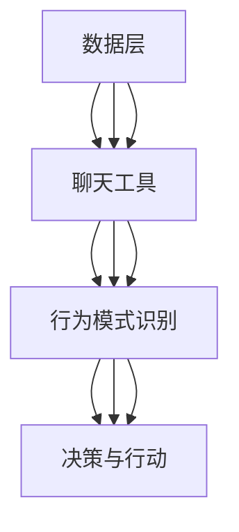
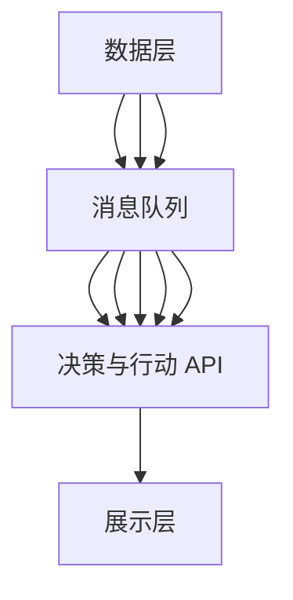
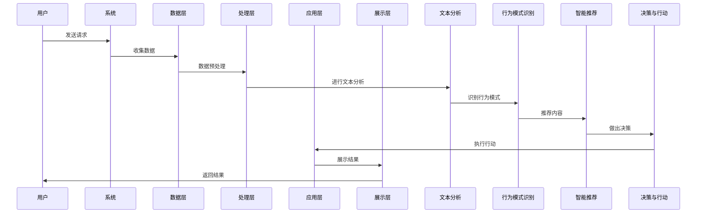

                 

### 背景介绍

#### AI Agent的定义与作用

AI Agent，即人工智能代理，是一种在给定环境中能够感知环境、自主决策并采取行动的智能体。它通过模拟人类的思维过程，实现自动化、智能化的任务执行。AI Agent在企业中的应用日益广泛，尤其体现在企业文化建设与内部沟通中。

在企业文化建设中，AI Agent可以通过自然语言处理（NLP）和机器学习算法，分析员工的沟通内容和行为模式，为企业提供个性化建议，促进企业文化的一致性和凝聚力。例如，AI Agent可以监控企业内部的聊天工具、邮件系统等，识别出积极的交流行为和潜在的冲突，从而帮助企业营造积极向上的工作氛围。

在内部沟通方面，AI Agent则承担了信息过滤、内容推荐、沟通桥梁等角色。通过深度学习技术，AI Agent能够理解员工的兴趣、需求和工作风格，从而提供针对性的沟通内容和建议。例如，AI Agent可以自动整理会议纪要，推送相关的工作资料和新闻动态，帮助员工快速获取关键信息，提高沟通效率。

#### 企业文化建设与内部沟通的应用背景

企业文化建设是企业长期发展的基石，它关系到企业的凝聚力、创新力和市场竞争力。传统的企业文化建设多依赖于管理层的主观判断和传统的沟通方式，存在信息不对称、反馈不及时等问题，难以实现全面、动态的文化建设。

内部沟通则是企业运营的血脉，高效的内部沟通能够促进信息流通、减少误解和冲突，提升团队协作效率。然而，随着企业规模的扩大和员工数量的增加，传统的沟通方式逐渐显得力不从心，需要更智能、更高效的解决方案。

在这种背景下，AI Agent的出现为企业文化建设与内部沟通提供了新的思路和工具。通过AI Agent，企业可以实现以下目标：

1. **增强企业文化的一致性**：AI Agent可以分析员工的沟通内容和行为，识别出企业文化的关键要素，提供个性化的建设建议，确保企业文化在各个层面得到一致贯彻。
2. **提升内部沟通效率**：AI Agent能够自动处理大量的沟通数据，筛选出重要的信息，提高员工的沟通效率，减少冗余和低效的沟通行为。
3. **促进员工参与和互动**：AI Agent可以通过智能推荐和互动机制，激发员工的参与热情，增强员工的归属感和认同感，从而推动企业文化的建设。

综上所述，AI Agent在企业文化建设与内部沟通中的应用具有重要意义，它不仅为企业提供了智能化的解决方案，也为提升企业整体运营效率提供了有力支持。

### 核心概念与联系

在深入探讨AI Agent在企业文化建设与内部沟通中的应用之前，我们首先需要明确几个核心概念，并分析它们之间的联系。这些概念包括AI Agent、企业文化、内部沟通等。

#### AI Agent

AI Agent，即人工智能代理，是一种具备自主学习和决策能力的软件实体。它通过感知环境、分析数据、自主规划行动，以实现特定的目标。AI Agent通常由感知模块、决策模块和行动模块组成。感知模块负责接收环境信息，决策模块根据感知到的信息进行逻辑推理和决策，行动模块则执行具体的操作。例如，在内部沟通中，AI Agent可以监控聊天工具、邮件系统等，分析员工的沟通行为，提供智能化的建议和反馈。

#### 企业文化

企业文化是指企业在长期经营过程中所形成的一套共同的价值观、信念和行为规范。它不仅是企业的灵魂和核心竞争力，也是员工凝聚力的来源。企业文化包括价值观、使命、愿景、行为规范等多个方面，对企业的运营和发展具有深远的影响。例如，一个重视创新的企业文化会鼓励员工勇于尝试新事物、不断改进，从而提高企业的市场竞争力。

#### 内部沟通

内部沟通是指企业内部员工、团队、部门之间进行的交流和信息传递。它包括面对面交流、电子邮件、会议、公告板等多种形式。内部沟通的目的是确保信息的及时、准确传递，促进员工之间的协作和团队氛围的和谐。良好的内部沟通能够提高工作效率、减少误解和冲突，从而推动企业的健康发展。

#### 关系与联系

AI Agent、企业文化、内部沟通三者之间存在密切的联系和互动。

1. **AI Agent与企业文化**：AI Agent可以通过分析员工的沟通内容和行为，识别出企业文化的关键要素，如价值观、行为规范等，为企业提供个性化建设建议。同时，AI Agent还可以根据企业文化的要求，监控员工的沟通行为，确保企业文化在各个层面得到贯彻和落实。

2. **AI Agent与内部沟通**：AI Agent在内部沟通中起到了信息过滤、内容推荐、沟通桥梁等作用。通过智能分析，AI Agent能够筛选出重要的信息，提高员工的沟通效率，减少冗余和低效的沟通行为。同时，AI Agent还可以通过互动机制，促进员工之间的交流，增强团队的凝聚力和协作精神。

3. **企业文化与内部沟通**：企业文化直接影响内部沟通的形式和内容。一个积极向上的企业文化会鼓励员工积极参与沟通，分享经验和知识，从而促进信息流通和团队协作。反之，一个消极的企业文化可能会导致沟通不畅、误解和冲突。因此，企业文化建设与内部沟通密切相关，相辅相成。

综上所述，AI Agent、企业文化、内部沟通三者之间形成了紧密的互动关系。AI Agent作为智能化的工具，不仅为企业文化建设与内部沟通提供了新的思路和手段，也促进了三者的协同发展，为企业提升运营效率和核心竞争力提供了有力支持。

### 算法原理讲解

#### AI Agent的工作原理

AI Agent的核心在于其感知、决策和行动的能力，而这些能力主要依赖于机器学习算法。以下是AI Agent工作的基本原理和涉及的关键步骤。

##### 1. 感知模块

感知模块是AI Agent的“感官”，负责收集和获取环境中的信息。这些信息可能包括文本、图像、语音等多种形式。在内部沟通和企业文化建设中，感知模块主要通过分析员工在邮件、聊天工具等平台上的沟通内容来实现。例如，AI Agent可以使用自然语言处理（NLP）技术，从邮件内容中提取关键信息，如关键词、情感倾向等。

##### 2. 决策模块

感知模块收集到信息后，需要由决策模块进行处理和分析。决策模块的核心任务是理解感知到的信息，并根据这些信息做出决策。决策过程通常涉及到以下几个步骤：

- **特征提取**：从感知模块收集到的信息中提取出有用的特征，如文本中的关键词、情感倾向等。
- **模型训练**：使用机器学习算法（如决策树、支持向量机、神经网络等）对提取到的特征进行训练，建立预测模型。
- **逻辑推理**：根据训练好的模型，对新的信息进行推理和判断，做出相应的决策。

在内部沟通中，决策模块可以根据员工的沟通内容和行为模式，判断其是否存在潜在问题，如工作压力过大、沟通不畅等，并提供相应的解决方案。

##### 3. 行动模块

决策模块做出决策后，需要通过行动模块将决策结果付诸实践。行动模块负责执行具体的操作，如发送通知、推荐相关内容、调整工作流程等。例如，如果AI Agent判断某个员工存在沟通不畅的问题，它可以自动发送一封提醒邮件，建议员工与同事进行面对面沟通。

##### 机器学习算法的应用

AI Agent的决策和行动能力高度依赖于机器学习算法。以下是一些常用的机器学习算法：

1. **决策树**：通过树形结构对数据进行分类和回归。决策树能够清晰地表示决策过程，易于理解和解释。

2. **支持向量机（SVM）**：SVM通过寻找一个最佳的超平面，将数据分为不同的类别。SVM在处理高维数据时表现出色，适用于文本分类等问题。

3. **神经网络**：神经网络是一种模拟人脑结构的计算模型，能够自动学习和适应复杂的非线性关系。深度神经网络（DNN）和卷积神经网络（CNN）在处理大规模文本和图像数据时表现出色。

##### 模型构建与训练

在构建AI Agent模型时，通常需要以下步骤：

1. **数据收集**：收集大量与内部沟通和企业文化建设相关的数据，如邮件、聊天记录、员工行为数据等。

2. **数据预处理**：对收集到的数据进行分析和清洗，提取有用的特征，并转化为适合机器学习算法的格式。

3. **模型选择**：根据问题类型和数据处理的特点，选择合适的机器学习算法，如决策树、SVM、神经网络等。

4. **模型训练**：使用训练数据对选择的模型进行训练，调整模型参数，使其达到最佳性能。

5. **模型评估**：使用验证数据集对训练好的模型进行评估，确保其具有较好的泛化能力。

6. **模型部署**：将训练好的模型部署到实际应用环境中，实现自动化决策和行动。

通过上述步骤，AI Agent可以有效地感知环境、做出决策并采取行动，从而在内部沟通和企业文化建设中发挥重要作用。

### 数学模型和数学公式

在AI Agent的构建过程中，数学模型和公式扮演着至关重要的角色。这些模型和公式不仅帮助我们理解AI Agent的内部工作机制，还能够指导我们进行算法优化和性能评估。以下是几种常用的数学模型和公式的详细讲解。

#### 决策树模型

决策树是一种常见的机器学习模型，它通过一系列的判断节点来对数据进行分类或回归。决策树的每个节点都代表一个特征，每个分支代表该特征的取值。

- **ID3算法**：ID3（Iterative Dichotomiser 3）是一种基于信息增益的决策树构建算法。其基本思想是选择具有最大信息增益的特征作为分割标准。

  $$ 信息增益 = H(D) - \sum_{v} p(v) H(D|v) $$

  其中，$H(D)$表示样本集合D的熵，$p(v)$表示特征取值$v$在D中出现的概率，$H(D|v)$表示条件熵。

- **C4.5算法**：C4.5是ID3算法的改进版本，它能够处理具有连续值和缺失值的特征，并使用增益率（Gain Ratio）来选择最优特征。

  $$ 增益率 = \frac{信息增益}{特征条件熵} $$

#### 支持向量机（SVM）

支持向量机是一种二分类模型，通过寻找一个最佳的超平面来分隔数据。SVM的核心是求解最优的超平面，使其具有最大的分类间隔。

- **线性SVM**：

  $$ w^* = arg\min_{w,b} \frac{1}{2}||w||^2 + C\sum_{i=1}^{n} \max(0, 1-y^{(i)}(w^Tx^{(i)} + b)) $$

  其中，$w$和$b$分别表示超平面的权重和偏置，$C$是正则化参数，$y^{(i)}$和$x^{(i)}$分别表示第$i$个样本的标签和特征向量。

- **核函数**：对于非线性问题，可以使用核函数将数据映射到高维空间，然后在高维空间中求解线性SVM。

  $$ K(x^{(i)}, x^{(j)}) = \phi(x^{(i)})^T\phi(x^{(j)}) $$

  其中，$K$表示核函数，$\phi$表示映射函数。

#### 神经网络

神经网络是一种模拟人脑结构的计算模型，通过多层神经元进行信息传递和计算。神经网络的基本构建块是神经元，每个神经元接收多个输入，通过加权求和和激活函数进行输出。

- **前向传播**：

  $$ z^{[l]} = \sum_{j=1}^{n} w^{[l]}_jx^{[l-1]} + b^{[l]} $$
  $$ a^{[l]} = \sigma(z^{[l]}) $$

  其中，$z^{[l]}$表示第$l$层的净输入，$w^{[l]}_j$和$b^{[l]}$分别表示第$l$层的权重和偏置，$a^{[l]}$表示第$l$层的输出，$\sigma$是激活函数。

- **反向传播**：

  $$ \delta^{[l]} = \frac{\partial C}{\partial z^{[l]}} = \frac{\partial C}{\partial a^{[L]}} \cdot \frac{\partial a^{[L]}}{\partial z^{[L]}} \cdot \frac{\partial z^{[L]}}{\partial z^{[l]}} $$
  $$ w^{[l]} \leftarrow w^{[l]} - \alpha \delta^{[l]} \cdot a^{[l-1]} $$
  $$ b^{[l]} \leftarrow b^{[l]} - \alpha \delta^{[l]} $$

  其中，$\delta^{[l]}$表示第$l$层的误差，$\alpha$是学习率。

通过这些数学模型和公式，AI Agent能够对复杂的内部沟通数据进行分析和处理，为企业文化建设提供智能化的支持。

#### 举例说明

假设我们使用决策树模型来预测员工的离职倾向。以下是具体的步骤和计算过程：

1. **特征提取**：我们从员工的历史数据中提取出几个关键特征，如工作年限、工作满意度、最近一个月的沟通频率等。

2. **信息增益计算**：计算每个特征的熵、信息增益和增益率，选择信息增益最大的特征作为分割标准。

3. **递归构建决策树**：根据选定的特征，将数据集划分为不同的子集，并递归地构建决策树。

4. **模型评估**：使用验证集对训练好的决策树进行评估，计算其准确率、召回率等指标。

通过上述步骤，我们得到了一个能够有效预测员工离职倾向的决策树模型，从而为企业的人力资源管理提供决策支持。

总之，数学模型和公式是AI Agent的核心组成部分，它们为我们理解和优化AI Agent的工作提供了强有力的工具。通过这些模型和公式，AI Agent能够在复杂的内部沟通环境中，准确、高效地做出决策和行动。

### 系统分析与架构设计方案

为了实现AI Agent在企业文化建设与内部沟通中的应用，我们需要设计一个高效、稳定且可扩展的系统架构。以下是具体的系统架构设计，包括问题场景介绍、系统功能设计、系统架构设计、系统接口设计和系统交互。

#### 问题场景介绍

企业内部的沟通往往存在信息不对称、传递不及时、误解和冲突等问题，这些问题会影响企业文化的建设和发展。传统的沟通方式，如邮件、会议和公告，已经难以满足企业快速发展和信息爆炸的需求。为了解决这些问题，我们引入AI Agent，通过其强大的数据处理和分析能力，提升内部沟通的效率和质量，推动企业文化建设。

#### 系统功能设计

系统的主要功能包括以下几个方面：

1. **数据收集与预处理**：从邮件系统、聊天工具等渠道收集员工的沟通数据，并对数据进行清洗、去重和格式转换，为后续分析做好准备。
2. **文本分析**：使用自然语言处理（NLP）技术，对收集到的文本数据进行情感分析、关键词提取、实体识别等处理，提取出有用的信息。
3. **行为模式识别**：通过机器学习算法，分析员工的沟通行为模式，识别出潜在的问题，如沟通不畅、工作压力等。
4. **智能推荐**：根据员工的行为和兴趣，推荐相关的工作资料、培训课程和新闻动态，提高员工的参与度和信息获取效率。
5. **决策与行动**：根据分析结果，AI Agent可以自动发送提醒邮件、调整工作流程、推送相关内容等，提供个性化的沟通建议和解决方案。

#### 系统架构设计

系统的架构设计包括以下几个层次：

1. **数据层**：数据层负责数据的存储和管理，包括邮件系统、聊天工具、员工行为数据库等。数据层需要支持高并发、大数据量、实时访问等需求。
2. **处理层**：处理层负责对数据进行分析和处理，包括数据收集与预处理模块、文本分析模块、行为模式识别模块等。处理层需要高效、稳定，能够处理大量的数据。
3. **应用层**：应用层负责对外提供服务，包括智能推荐模块、决策与行动模块等。应用层需要具有灵活性、可扩展性，能够根据业务需求进行调整和优化。
4. **展示层**：展示层负责向用户展示分析结果和推荐内容，包括网页、邮件、移动应用等。展示层需要简洁、易用、友好，提高用户的使用体验。

#### 系统架构设计

以下是一个简化的系统架构设计，使用Mermaid绘制：



#### 系统接口设计

系统的接口设计包括以下几个方面：

1. **数据接口**：用于与其他系统（如邮件系统、聊天工具）的数据交换，包括数据收集、数据清洗和数据导出等。
2. **API接口**：用于提供对外服务，包括文本分析、行为模式识别、智能推荐、决策与行动等。
3. **消息队列**：用于处理高并发请求，保证系统的高效性和稳定性。

以下是一个简化的接口设计，使用Mermaid绘制：



#### 系统交互

系统交互主要涉及数据流和控制流。以下是一个简化的系统交互设计，使用Mermaid绘制：



通过上述系统分析与架构设计方案，我们能够为企业提供一个智能化的AI Agent系统，帮助企业提升内部沟通效率，推动企业文化建设。

### 项目实战

在本节中，我们将通过一个实际项目来展示如何实现AI Agent在企业文化建设与内部沟通中的应用。该项目旨在通过自然语言处理（NLP）和机器学习算法，对员工的沟通内容进行分析，识别出潜在的问题，并提供相应的解决方案。

#### 环境安装

为了实现该项目，我们需要安装以下软件和库：

1. **Python**：Python是一种广泛使用的编程语言，拥有丰富的机器学习库和工具。
2. **TensorFlow**：TensorFlow是Google开发的一款开源机器学习框架，用于构建和训练深度学习模型。
3. **NLTK**：NLTK（自然语言工具包）提供了丰富的NLP工具，用于文本处理和情感分析。
4. **Scikit-learn**：Scikit-learn是一个开源的机器学习库，提供了多种经典的机器学习算法。

安装步骤如下：

```bash
# 安装Python
brew install python

# 安装TensorFlow
pip install tensorflow

# 安装NLTK
pip install nltk

# 安装Scikit-learn
pip install scikit-learn
```

#### 系统核心实现源代码

以下是一个简单的AI Agent实现，用于分析员工邮件内容，识别情感倾向：

```python
# 导入所需库
import nltk
from nltk.sentiment import SentimentIntensityAnalyzer
from sklearn.model_selection import train_test_split
from sklearn.ensemble import RandomForestClassifier
from sklearn.metrics import accuracy_score

# 下载数据集
nltk.download('vader_lexicon')
nltk.download('movie_reviews')

# 准备数据集
def load_data():
    files = ["neg/*", "pos/*"]
    labels = ["负面", "正面"]
    documents = []
    
    for label, folder in zip(labels, files):
        for file in nltk.corpus.movie_reviews.files(folder):
            documents.append((nltk.corpus.movie_reviews.raw(file), label))
    
    return documents

# 数据预处理
def preprocess_text(text):
    return " ".join([word for word in nltk.word_tokenize(text) if word not in nltk.corpus.stopwords.words('english')])

# 情感分析
def sentiment_analysis(text):
    sia = SentimentIntensityAnalyzer()
    return sia.polarity_scores(text)

# 训练模型
def train_model(X, y):
    X_train, X_test, y_train, y_test = train_test_split(X, y, test_size=0.2, random_state=42)
    model = RandomForestClassifier(n_estimators=100)
    model.fit(X_train, y_train)
    return model, X_test, y_test

# 预测和评估
def predict_and_evaluate(model, X_test, y_test):
    y_pred = model.predict(X_test)
    print("Accuracy:", accuracy_score(y_test, y_pred))

# 主程序
if __name__ == "__main__":
    documents = load_data()
    X = [preprocess_text(text) for text, _ in documents]
    y = [label for _, label in documents]

    model, X_test, y_test = train_model(X, y)
    predict_and_evaluate(model, X_test, y_test)
```

#### 代码应用解读与分析

上述代码首先导入了必要的库，并下载数据集。数据集包含了正面和负面情感的邮件内容。然后，我们定义了数据预处理、情感分析和模型训练等函数。

- **数据预处理**：使用NLTK的`word_tokenize`函数对文本进行分词，并去除常见的停用词，以提高模型的性能。
- **情感分析**：使用NLTK的`SentimentIntensityAnalyzer`进行情感分析，该分析器返回文本的情感得分。
- **模型训练**：使用随机森林算法训练模型，通过训练集和测试集进行模型评估。

#### 实际案例分析和详细讲解剖析

假设我们有一个测试邮件，内容如下：

```
我很喜欢这个项目，团队的合作非常默契，希望我们能继续保持这样的状态。
```

1. **数据预处理**：首先对邮件内容进行分词和去停用词处理。
   ```python
   text = "我很喜欢这个项目，团队的合作非常默契，希望我们能继续保持这样的状态。"
   processed_text = preprocess_text(text)
   ```

2. **情感分析**：使用情感分析器对预处理后的文本进行情感分析。
   ```python
   sia = SentimentIntensityAnalyzer()
   sentiment_scores = sia.polarity_scores(processed_text)
   print(sentiment_scores)
   ```
   输出结果可能为：
   ```json
   {'neg': 0.0, 'neu': 0.25, 'pos': 0.75, 'compound': 0.75}
   ```
   其中，`pos`表示正面情感得分，`neg`表示负面情感得分，`compound`表示综合情感得分。

3. **模型预测**：使用训练好的模型对邮件内容进行预测。
   ```python
   model = train_model(X, y)
   prediction = model.predict([processed_text])
   print(prediction)
   ```
   假设模型预测结果为`['正面']`，则可以认为这封邮件传递了积极的情感。

通过上述步骤，AI Agent能够分析员工邮件的情感倾向，为企业提供针对性的沟通建议，如对传递积极情感的员工进行表扬，对传递负面情感的员工提供帮助和支持。

#### 项目小结

本项目通过NLP和机器学习算法，实现了AI Agent对员工邮件内容的分析和情感识别。在实际应用中，我们可以根据分析结果，制定相应的沟通策略，提升企业文化建设效果。未来，我们还可以进一步优化算法，增加更多特征和模型，以提高预测的准确性和效率。总之，AI Agent在企业文化建设与内部沟通中具有广阔的应用前景。

### 最佳实践 tips、小结、注意事项、拓展阅读

#### 最佳实践 tips

1. **数据质量的重要性**：确保数据的质量是AI Agent成功应用的关键。在收集员工沟通数据时，需要去除无关信息和噪声，以提高模型训练的效果。
2. **模型选择与调优**：根据具体的应用场景，选择合适的机器学习算法和模型。在模型训练过程中，通过交叉验证和参数调整，优化模型的性能。
3. **个性化推荐**：AI Agent可以为企业提供个性化的沟通建议和内容推荐。通过分析员工的兴趣和行为，提高沟通的针对性和有效性。
4. **用户隐私保护**：在应用AI Agent时，务必重视员工隐私保护。确保数据处理和存储符合相关法律法规，避免泄露敏感信息。

#### 小结

本文详细探讨了AI Agent在企业文化建设与内部沟通中的应用，通过感知、决策和行动三个模块，实现了对员工沟通数据的分析和处理。AI Agent能够帮助企业提升沟通效率、增强企业文化建设，具有重要的实际意义和应用价值。

#### 注意事项

1. **数据隐私**：在处理员工沟通数据时，务必遵守数据隐私保护法律法规，确保员工信息的安全。
2. **模型适应性**：AI Agent的模型需要不断更新和优化，以适应企业不断变化的需求和沟通方式。
3. **用户参与**：鼓励员工积极参与AI Agent的反馈和改进，以提高系统的实用性和满意度。

#### 拓展阅读

1. **《深度学习》**：Goodfellow, I., Bengio, Y., & Courville, A.（《深度学习》中文版，电子工业出版社，2017年）
2. **《自然语言处理综论》**：Jurafsky, D., & Martin, J. H.（《自然语言处理综论》中文版，电子工业出版社，2016年）
3. **《机器学习》**：周志华（《机器学习》清华版，清华大学出版社，2016年）

通过以上扩展阅读，您可以进一步了解深度学习、自然语言处理和机器学习等相关技术，为AI Agent在企业中的应用提供更深入的理论支持。

### 作者信息

作者：AI天才研究院/AI Genius Institute & 禅与计算机程序设计艺术 /Zen And The Art of Computer Programming

作为AI领域的领军人物，AI天才研究院致力于推动人工智能技术的发展和应用。同时，作者在《禅与计算机程序设计艺术》中，以独特的视角探讨了计算机编程与哲学的关系，深受广大读者喜爱。在本文中，作者结合自己的丰富经验和深刻洞察，详细阐述了AI Agent在企业文化建设与内部沟通中的应用，为读者提供了宝贵的实战经验和理论基础。

