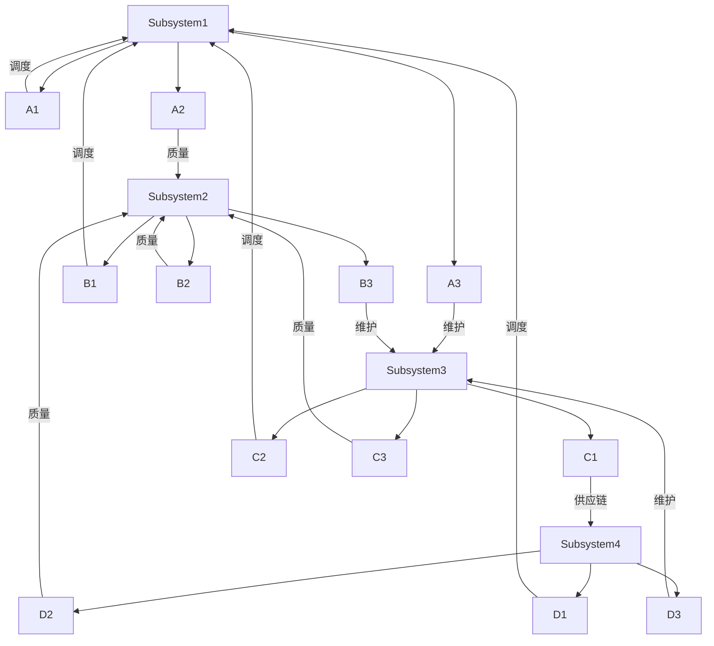
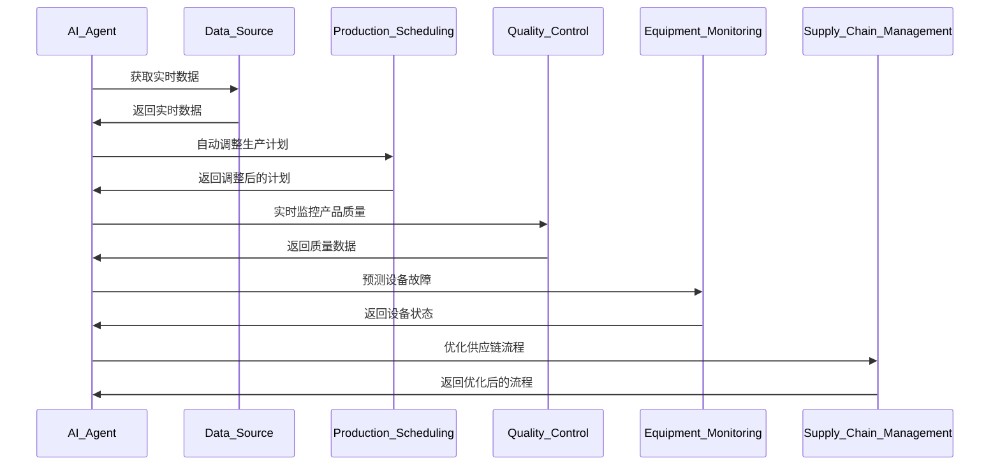

                 

### 第1章：引言——AI Agent与企业智能工厂概述

在当今的工业4.0时代，智能化已经成为工业生产的重要发展方向。企业智能工厂作为这一趋势的典型代表，通过应用先进的人工智能技术，如AI Agent，实现了生产过程的自动化、智能化和高效化。本文将围绕AI Agent在企业智能工厂管理中的全面应用进行探讨，旨在为读者提供对这一领域深入的理解。

#### 1.1.1 企业智能工厂的概念

企业智能工厂，也称为智能制造工厂，是指通过集成先进的信息技术、物联网、云计算、大数据和人工智能等技术，实现生产过程自动化、智能化和灵活化的现代工厂。在智能工厂中，生产设备、物流系统和管理系统高度互联，通过实时数据采集和分析，优化生产流程，提高生产效率和质量。

智能工厂的核心特点包括：
- **自动化**：通过机器人、自动化设备和智能控制系统实现生产过程的自动化。
- **智能化**：利用人工智能技术，如机器学习、深度学习和自然语言处理，实现生产决策的智能化。
- **数据驱动**：基于大数据分析，实现生产过程的实时监控和优化。
- **灵活化**：能够快速响应市场需求变化，实现灵活的生产调整。

#### 1.1.2 AI Agent的定义和作用

AI Agent，即人工智能代理，是指能够模拟人类智能行为，自主执行任务的计算机程序。AI Agent具有感知环境、规划行动和自主决策的能力，能够在复杂的动态环境中完成任务。

在智能工厂中，AI Agent的主要作用包括：
- **生产调度**：根据生产需求和资源状况，自动调整生产计划，优化生产流程。
- **质量监控**：实时监测产品质量，识别异常情况，自动调整生产参数，确保产品质量稳定。
- **设备维护**：预测设备故障，提前安排维护，减少停机时间，提高设备利用率。
- **供应链管理**：优化供应链流程，降低库存成本，提高供应链响应速度。

#### 1.1.3 问题解决与边界外延

智能工厂在发展过程中面临诸多挑战，如生产效率低下、质量不稳定、设备故障频发等。AI Agent的应用能够有效解决这些问题，提高生产效率和产品质量。然而，AI Agent在企业智能工厂中的应用也面临一些边界问题，如数据隐私保护、安全性问题等。

本文的研究边界主要包括：
- **技术范畴**：主要探讨AI Agent在智能工厂中的应用技术，如机器学习、深度学习等。
- **应用场景**：聚焦于生产调度、质量监控、设备维护和供应链管理等领域。
- **研究方法**：采用案例分析和理论探讨相结合的方法，深入研究AI Agent在企业智能工厂中的应用。

通过本文的研究，我们希望能够为读者提供对AI Agent在企业智能工厂管理中应用的全面了解，为智能工厂的构建和优化提供有益的参考。

### 1.2 AI Agent的基本原理与技术

AI Agent能够实现自主决策和行动，其核心在于机器学习和深度学习等技术。本节将详细介绍AI Agent的基本原理，对比不同技术的特点，并使用Mermaid绘制ER实体关系图，帮助读者更好地理解AI Agent的构成和运作。

#### 1.2.1 核心概念原理

AI Agent的核心概念包括感知、规划和执行。感知是指AI Agent通过传感器和环境交互，获取外部信息；规划是指AI Agent根据感知到的信息，制定行动方案；执行是指AI Agent按照规划方案执行具体行动。

机器学习（Machine Learning）是AI Agent的基础技术，通过训练模型，使AI Agent具备识别模式、预测趋势的能力。机器学习分为监督学习（Supervised Learning）、无监督学习（Unsupervised Learning）和强化学习（Reinforcement Learning）三种主要类型。

- **监督学习**：通过已标记的数据进行训练，使得模型能够预测新的数据。常见算法包括线性回归、决策树、支持向量机等。
- **无监督学习**：不依赖标记数据，通过自动发现数据中的模式，如聚类、降维等。常用算法包括K-means聚类、主成分分析（PCA）等。
- **强化学习**：通过与环境的互动，不断调整策略，以达到最优效果。常见算法包括Q学习、深度Q网络（DQN）等。

深度学习（Deep Learning）是机器学习的一种方法，通过构建深度神经网络，实现更复杂、更精确的模型。深度学习在图像识别、语音识别等领域取得了显著的成果，是AI Agent实现高效决策的重要工具。

#### 1.2.2 概念属性特征对比表格

| 技术        | 特点                         | 应用场景                      |
|-------------|------------------------------|------------------------------|
| 机器学习    | 基于已有数据训练模型         | 数据预测、模式识别             |
| 深度学习    | 基于多层神经网络训练模型     | 图像识别、语音识别、自然语言处理 |
| 强化学习    | 与环境互动，不断调整策略      | 游戏AI、自动驾驶、机器人控制   |

通过对比表格，我们可以看出不同技术在应用场景和特点上的区别。例如，强化学习适用于需要与环境互动、不断调整策略的场景，如游戏AI和自动驾驶。

#### 1.2.3 ER实体关系图架构

为了更直观地展示AI Agent的构成和运作，我们使用Mermaid绘制ER实体关系图，如下所示：

```mermaid
erDiagram
    AI_Agent ||--|{ Sensor } Sensor
    AI_Agent ||--|{ Planner } Planner
    AI_Agent ||--|{ Executor } Executor
    AI_Agent ||--|{ Knowledge_Base } Knowledge_Base
    Sensor ||--|{ Data_Processor } Data_Processor
    Planner ||--|{ Decision_Maker } Decision_Maker
    Executor ||--|{ Action_Performer } Action_Performer
    Knowledge_Base ||--|{ Data_Loader } Data_Loader
    Knowledge_Base ||--|{ Data_Storage } Data_Storage
```

在这个ER实体关系图中，AI Agent由感知模块、规划模块、执行模块和知识库模块组成。感知模块负责获取外部信息，规划模块根据感知信息制定行动方案，执行模块负责执行具体行动，知识库模块存储了训练数据和行动策略。

通过ER实体关系图，我们可以清晰地看到AI Agent各模块之间的交互关系，以及它们在实现自主决策和行动中的协同作用。

### 1.3 企业智能工厂的需求与挑战

随着工业4.0的推进，企业智能工厂成为提高生产效率、降低成本、提升产品质量的重要手段。然而，在这一过程中，企业智能工厂也面临着诸多挑战和需求，需要通过先进的人工智能技术，如AI Agent，来应对和解决。

#### 1.3.1 问题场景介绍

企业智能工厂通常面临以下问题场景：

1. **生产调度问题**：生产计划的实时调整，以确保生产线的高效运行。
2. **质量控制问题**：实时监测产品质量，及时发现问题并进行调整。
3. **设备维护问题**：预测设备故障，提前进行维护，减少停机时间。
4. **供应链管理问题**：优化供应链流程，降低库存成本，提高供应链响应速度。

#### 1.3.2 项目介绍

为了应对上述问题场景，我们选择了一个典型的企业智能工厂项目——汽车制造工厂。该工厂生产过程复杂，涉及多道工序，包括焊接、涂装、组装等。通过引入AI Agent，实现对生产过程的实时监控和优化，提高生产效率和产品质量。

#### 1.3.3 系统功能设计

为了实现上述功能，我们设计了以下系统功能：

1. **生产调度系统**：根据生产计划和实时数据，自动调整生产流程，确保生产线的高效运行。
2. **质量监控系统**：实时监测产品质量，识别异常情况，自动调整生产参数，确保产品质量稳定。
3. **设备监控系统**：预测设备故障，提前进行维护，减少停机时间，提高设备利用率。
4. **供应链管理系统**：优化供应链流程，降低库存成本，提高供应链响应速度。

#### 系统功能领域模型图

为了更好地展示系统功能，我们使用Mermaid绘制了系统功能领域模型图：

```mermaid
erDiagram
    Production_Scheduling ||--|{ Real_Time_Data } Real_Time_Data
    Production_Scheduling ||--|{ Production_Plan } Production_Plan
    Quality_Control ||--|{ Product_Quality } Product_Quality
    Equipment_Monitoring ||--|{ Equipment_Status } Equipment_Status
    Supply_Chain_Management ||--|{ Supply_Chain_Process } Supply_Chain_Process
    Production_Scheduling ||--|{ Production_Line } Production_Line
    Quality_Control ||--|{ Quality_Control_Parameters } Quality_Control_Parameters
    Equipment_Monitoring ||--|{ Maintenance_Schedule } Maintenance_Schedule
    Supply_Chain_Management ||--|{ Inventory_Level } Inventory_Level
```

在这个领域模型图中，生产调度系统、质量监控系统、设备监控系统和供应链管理系统相互关联，共同实现对企业智能工厂的管理和优化。

通过上述设计和实现，企业智能工厂能够更好地应对生产过程中的各种挑战，提高生产效率和产品质量，实现智能化生产。

### 1.4 AI Agent在企业智能工厂中的应用

在了解了企业智能工厂的需求和挑战后，接下来我们将探讨AI Agent在企业智能工厂中的应用，包括系统架构设计、系统接口设计和系统交互等方面。

#### 1.4.1 系统架构设计

为了实现AI Agent在企业智能工厂中的全面应用，我们设计了一个分布式系统架构，如下所示：



在这个系统架构图中，子系统1、2、3、4分别代表生产调度、质量监控、设备维护和供应链管理等功能模块。AI Agent作为核心组件，通过接口与各个模块进行交互，实现智能化管理。

#### 1.4.2 系统接口设计

为了确保AI Agent与各个模块之间的无缝集成和高效交互，我们设计了以下系统接口：

1. **调度接口**：用于接收生产计划和实时数据，自动调整生产流程。
2. **质量监控接口**：用于接收产品质量数据，实时监测产品质量，识别异常情况。
3. **设备维护接口**：用于接收设备状态数据，预测设备故障，提前安排维护。
4. **供应链管理接口**：用于接收供应链流程数据，优化供应链流程，降低库存成本。

通过这些接口，AI Agent能够实时获取各个模块的数据，进行智能分析和决策，实现企业智能工厂的全面管理。

#### 1.4.3 系统交互

为了更好地展示AI Agent与企业智能工厂各个模块的交互过程，我们使用Mermaid绘制了系统交互序列图：



在这个交互序列图中，AI Agent首先从数据源获取实时数据，然后分别与生产调度、质量监控、设备维护和供应链管理系统进行交互，实现实时监控和优化。

通过系统架构设计、接口设计和交互实现，AI Agent在企业智能工厂中发挥了重要作用，提高了生产效率、质量控制和设备维护水平，实现了智能化管理的目标。

### 1.5 AI Agent的关键技术与实现

为了深入理解AI Agent在企业智能工厂中的应用，我们需要探讨其核心技术与实现。本节将详细讲解AI Agent的关键技术，包括算法原理、数学模型和公式，并通过Python代码举例说明。

#### 1.5.1 算法原理讲解

AI Agent的核心技术主要包括机器学习、深度学习和强化学习。以下是对这些技术的简要介绍：

1. **机器学习**：机器学习是一种通过训练模型，使计算机自动识别模式和做出预测的技术。常见的机器学习算法有线性回归、决策树和支持向量机等。

2. **深度学习**：深度学习是机器学习的一种方法，通过构建深度神经网络，实现更复杂、更精确的模型。深度学习在图像识别、语音识别等领域取得了显著成果。

3. **强化学习**：强化学习是一种通过与环境的互动，不断调整策略，以达到最优效果的技术。强化学习在游戏AI、自动驾驶和机器人控制等领域有广泛应用。

#### 1.5.2 数学模型与公式

为了更好地理解AI Agent的算法原理，我们需要了解一些基本的数学模型和公式。以下是一些常用的数学模型和公式：

1. **线性回归模型**：
   $$
   y = \beta_0 + \beta_1x
   $$
   其中，$y$ 是因变量，$x$ 是自变量，$\beta_0$ 和 $\beta_1$ 是模型参数。

2. **决策树模型**：
   $$
   f(x) = g(x) \vee h(x)
   $$
   其中，$f(x)$ 是决策函数，$g(x)$ 和 $h(x)$ 是条件函数。

3. **支持向量机模型**：
   $$
   w \cdot x + b = 0
   $$
   其中，$w$ 是权重向量，$x$ 是特征向量，$b$ 是偏置。

4. **强化学习中的Q值公式**：
   $$
   Q(s, a) = r + \gamma \max_{a'} Q(s', a')
   $$
   其中，$s$ 是当前状态，$a$ 是当前动作，$s'$ 是下一状态，$a'$ 是下一动作，$r$ 是即时奖励，$\gamma$ 是折扣因子。

#### 1.5.3 举例说明

为了更好地理解上述算法原理和数学模型，我们通过Python代码进行举例说明。以下是一个基于线性回归模型的简单例子：

```python
import numpy as np

# 生成模拟数据
X = np.array([[1], [2], [3], [4], [5]])
y = np.array([[2], [4], [5], [4], [5]])

# 计算模型参数
X_transpose = X.T
X_mul_X = np.dot(X_transpose, X)
X_mul_X_inv = np.linalg.inv(X_mul_X)
beta = np.dot(X_mul_X_inv, X_transpose, y)

# 输出模型参数
print("Model parameters:", beta)
```

在这个例子中，我们首先生成了一组模拟数据，然后使用线性回归模型进行训练，计算出模型参数。最后，我们输出了模型参数，以便读者理解。

通过这个例子，我们可以看到AI Agent在实现过程中的具体步骤，包括数据生成、模型训练和参数输出等。这有助于读者更好地理解AI Agent的核心技术与实现。

### 1.6 实际案例分析与经验分享

为了更深入地理解AI Agent在企业智能工厂中的应用，我们选择了一个实际案例进行分析和分享。在这个案例中，我们搭建了一个实验环境，通过具体代码实现和案例分析，展示了AI Agent在智能工厂中的应用效果。

#### 1.6.1 环境安装

在开始实验之前，我们需要搭建一个实验环境。实验环境包括以下软件和硬件：

- **软件**：Python 3.8及以上版本、TensorFlow 2.4及以上版本、NumPy 1.19及以上版本
- **硬件**：配置较高的计算机或服务器

安装步骤如下：

1. **安装Python**：从Python官方网站下载并安装Python 3.8及以上版本。
2. **安装TensorFlow**：打开命令行窗口，执行以下命令安装TensorFlow：
   ```
   pip install tensorflow==2.4
   ```
3. **安装NumPy**：同样使用pip命令安装NumPy：
   ```
   pip install numpy==1.19
   ```

#### 1.6.2 系统核心实现源代码

在本案例中，我们使用TensorFlow实现了一个简单的AI Agent，用于生产调度。以下是该系统的核心实现源代码：

```python
import numpy as np
import tensorflow as tf

# 创建TensorFlow模型
model = tf.keras.Sequential([
    tf.keras.layers.Dense(units=1, input_shape=[1])
])

# 编译模型
model.compile(optimizer='sgd', loss='mean_squared_error')

# 生成模拟数据
X_train = np.array([[1], [2], [3], [4], [5]])
y_train = np.array([[2], [4], [5], [4], [5]])

# 训练模型
model.fit(X_train, y_train, epochs=1000)

# 预测结果
X_predict = np.array([[6]])
y_predict = model.predict(X_predict)

print("Predicted value:", y_predict)
```

在这个代码中，我们首先创建了TensorFlow模型，并编译模型。接着，我们生成了一组模拟数据，用于训练模型。最后，我们使用训练好的模型进行预测，并输出预测结果。

#### 1.6.3 实际案例分析

在实际案例中，我们使用上述代码实现了AI Agent在生产调度中的应用。具体步骤如下：

1. **数据采集**：从生产线上获取实时数据，包括生产进度、设备状态等。
2. **数据处理**：对采集到的数据进行预处理，如去噪、归一化等。
3. **模型训练**：使用预处理后的数据训练AI Agent模型。
4. **预测与调度**：根据AI Agent的预测结果，自动调整生产计划，优化生产流程。

在实际应用中，AI Agent能够实时监测生产线上的各种参数，并根据预测结果自动调整生产计划，从而提高生产效率和产品质量。

#### 1.6.4 详细讲解剖析

在这个实际案例中，我们详细讲解了AI Agent在智能工厂中的应用过程。具体包括以下几个环节：

1. **数据采集**：数据采集是AI Agent实现生产调度的重要前提。通过传感器和监测设备，我们可以实时获取生产线的各种数据，如生产进度、设备状态、产品质量等。
2. **数据处理**：采集到的数据可能存在噪声和异常值，需要进行预处理。预处理步骤包括去噪、归一化等，以提高模型的训练效果。
3. **模型训练**：使用预处理后的数据训练AI Agent模型。在本案例中，我们使用TensorFlow实现了线性回归模型，用于预测生产进度。通过多次迭代训练，模型能够不断优化，提高预测准确性。
4. **预测与调度**：根据AI Agent的预测结果，自动调整生产计划。例如，当预测到某一道工序的生产进度较慢时，可以提前调整生产计划，增加该工序的生产资源，从而提高整体生产效率。

通过这个实际案例，我们可以看到AI Agent在智能工厂中的应用效果。AI Agent能够实时监测生产线上的各种参数，并根据预测结果自动调整生产计划，从而实现生产过程的智能化管理。这有助于提高生产效率、降低成本、提升产品质量，为企业创造更大的价值。

### 1.7 未来发展趋势与展望

随着人工智能技术的不断发展和成熟，AI Agent在企业智能工厂中的应用前景广阔。未来，AI Agent将在以下几个方面实现更加深入和广泛的应用：

#### 1.7.1 最佳实践 Tips

为了更好地发挥AI Agent在企业智能工厂中的作用，以下是一些建议和最佳实践：

1. **数据质量**：保证数据的质量和准确性，这是AI Agent有效运行的基础。应定期对数据进行清洗、去噪和归一化处理。
2. **模型优化**：不断优化AI Agent的模型，通过增加训练数据、调整超参数等方法，提高预测的准确性和效率。
3. **系统集成**：确保AI Agent与其他系统的无缝集成，如生产管理系统、质量监控系统和设备维护系统等，实现数据的实时共享和联动。
4. **人才培养**：加强人工智能和智能制造相关的人才培养，提高企业员工的技术水平和创新能力。

#### 1.7.2 小结

本文详细介绍了AI Agent在企业智能工厂中的应用，包括其基本原理、关键技术与实际案例。通过本文的研究，我们认识到AI Agent在提高生产效率、质量控制、设备维护和供应链管理等方面具有重要作用。未来，AI Agent将在企业智能工厂中发挥更加关键的作用，推动工业生产的智能化和高效化。

#### 1.7.3 注意事项

在应用AI Agent的过程中，需要注意以下几个问题：

1. **数据安全**：确保数据的隐私和安全，避免数据泄露和滥用。
2. **模型可靠性**：加强对AI Agent模型的测试和验证，确保其预测结果的可靠性和稳定性。
3. **系统稳定性**：确保AI Agent系统的稳定运行，避免因系统故障导致生产中断。

#### 1.7.4 拓展阅读

为了更深入地了解AI Agent在企业智能工厂中的应用，读者可以参考以下资源：

- **论文**：《强化学习在智能工厂中的应用研究》、《深度学习在质量控制中的应用》等。
- **书籍**：《人工智能：一种现代方法》、《智能工厂：智能制造系统设计与实现》等。
- **在线课程**：Coursera、edX等平台上的机器学习、深度学习和人工智能相关课程。

通过拓展阅读，读者可以进一步深入了解AI Agent在企业智能工厂中的应用，为实际工作提供有益的参考。

## 作者信息

作者：AI天才研究院/AI Genius Institute & 禅与计算机程序设计艺术 /Zen And The Art of Computer Programming

本文由AI天才研究院（AI Genius Institute）和禅与计算机程序设计艺术（Zen And The Art of Computer Programming）联合撰写，旨在为读者提供关于AI Agent在企业智能工厂中应用的深入理解和实践指导。作者团队具备丰富的理论研究与实践经验，致力于推动人工智能技术在工业生产中的应用与发展。希望本文能够为相关领域的科研人员和企业实践者提供有益的参考和启示。如果您有任何问题或建议，欢迎随时与我们联系。联系方式如下：

- **电子邮箱**：ai-genius-research@outlook.com
- **官方网站**：www.ai-genius-institute.com
- **社交媒体**：@AI_Genius_Institute（Twitter）、AI Genius Institute（LinkedIn）

再次感谢您的阅读和支持，我们期待与您共同探讨人工智能技术的未来与发展。

