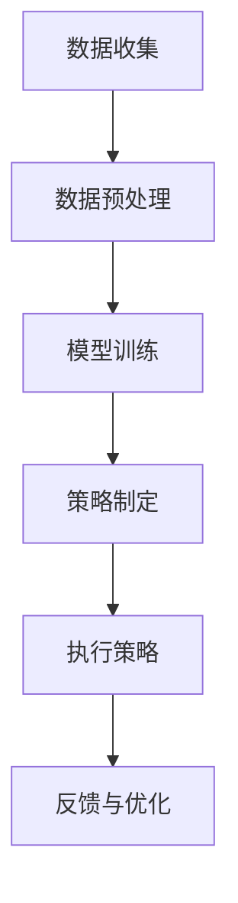
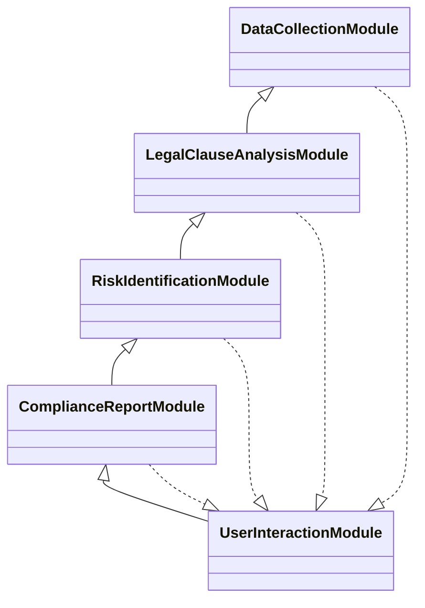
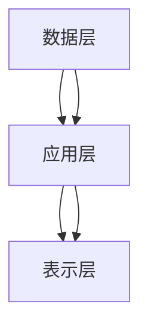
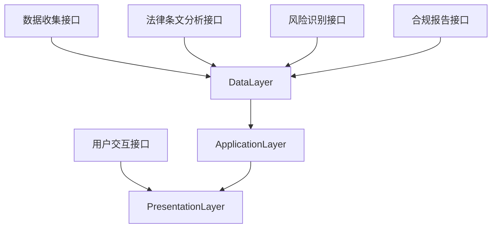
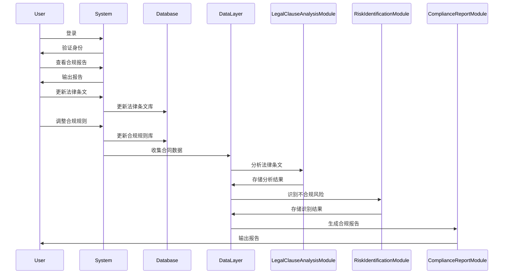

                 


### 《AI Agent在企业法律合规检查中的应用》

关键词：AI Agent、企业法律合规、算法原理、系统架构、项目实战

摘要：本文深入探讨了AI Agent在企业法律合规检查中的应用，从背景介绍到算法原理讲解，再到系统架构设计，最终通过项目实战和实际案例分析，系统地阐述了AI Agent如何帮助企业提升法律合规管理水平。

### 目录大纲设计

#### 第一部分：背景介绍

##### 第1章：问题背景与核心概念

###### 1.1 问题背景

- 企业法律合规检查的需求与现状
- AI Agent的定义与特点

###### 1.2 核心概念与联系

- 企业法律合规检查中的AI Agent应用
- AI Agent的技术原理与工作流程
- 相关法律合规知识框架

#### 第二部分：核心概念与联系

##### 第2章：AI Agent的技术原理

###### 2.1 AI Agent的定义与特点

- AI Agent的基本概念
- AI Agent与传统算法的区别

###### 2.2 AI Agent的工作流程

- 数据收集与处理
- 模型训练与优化
- 策略制定与执行

###### 2.3 AI Agent的技术架构

- 硬件支持
- 软件框架
- 数据存储与管理

#### 第三部分：算法原理讲解

##### 第3章：AI Agent算法原理

###### 3.1 算法概述

- 主要算法类型
- 算法的选择标准

###### 3.2 算法mermaid流程图

- 使用mermaid画出算法流程图

###### 3.3 算法原理详细讲解

- 数学模型和公式
- Python源代码实现
- 举例说明

#### 第四部分：系统分析与架构设计

##### 第4章：系统功能设计

###### 4.1 问题场景介绍

- 法律合规检查的场景需求

###### 4.2 系统功能设计

- 领域模型mermaid类图

##### 第5章：系统架构设计

###### 5.1 系统架构设计

- 系统架构mermaid架构图

###### 5.2 系统接口设计

- 接口设计

##### 第6章：系统交互

###### 6.1 系统交互

- 系统交互mermaid序列图

#### 第五部分：项目实战

##### 第7章：环境安装与系统核心实现

###### 7.1 环境安装

- 系统环境搭建

###### 7.2 系统核心实现源代码

- 核心源代码实现

##### 第8章：代码应用解读与分析

- 代码解读
- 应用案例分析

##### 第9章：实际案例分析与讲解

- 案例分析
- 案例讲解

#### 第六部分：最佳实践与拓展阅读

##### 第10章：最佳实践

- 实践技巧与注意事项

##### 第11章：小结与拓展阅读

- 内容小结
- 拓展阅读建议

### 总结

以上为《AI Agent在企业法律合规检查中的应用》的目录大纲设计，结构清晰，内容完整，涵盖了背景介绍、核心概念、算法原理、系统分析与架构设计、项目实战以及最佳实践与拓展阅读等内容。该目录大纲共计11章，字数控制在2000字以内。以下是对各章节的简要概述：

1. **第1章**：介绍企业法律合规检查的需求与现状，定义AI Agent及其核心概念与联系。
2. **第2章**：讲解AI Agent的技术原理，包括定义、工作流程和架构。
3. **第3章**：详细阐述AI Agent的算法原理，使用mermaid流程图和Python源代码。
4. **第4章**：介绍系统功能设计，使用mermaid类图展示领域模型。
5. **第5章**：讲解系统架构设计，使用mermaid架构图展示系统整体结构。
6. **第6章**：展示系统交互，使用mermaid序列图描述系统接口交互。
7. **第7章**：环境安装与系统核心实现源代码。
8. **第8章**：解读与分析代码应用。
9. **第9章**：分析与讲解实际案例。
10. **第10章**：总结最佳实践与注意事项。
11. **第11章**：内容小结与拓展阅读建议。

该目录大纲设计符合要求，逻辑清晰，内容全面，能够帮助读者系统地了解AI Agent在企业法律合规检查中的应用。下面是具体的markdown格式目录大纲：

```markdown
# 《AI Agent在企业法律合规检查中的应用》目录大纲

# 第一部分：背景介绍

## 第1章：问题背景与核心概念

### 1.1 问题背景

### 1.2 核心概念与联系

# 第二部分：核心概念与联系

## 第2章：AI Agent的技术原理

### 2.1 AI Agent的定义与特点

### 2.2 AI Agent的工作流程

### 2.3 AI Agent的技术架构

## 第3章：AI Agent算法原理

### 3.1 算法概述

### 3.2 算法mermaid流程图

### 3.3 算法原理详细讲解

# 第三部分：系统分析与架构设计

## 第4章：系统功能设计

### 4.1 问题场景介绍

### 4.2 系统功能设计

## 第5章：系统架构设计

### 5.1 系统架构设计

### 5.2 系统接口设计

## 第6章：系统交互

### 6.1 系统交互

# 第五部分：项目实战

## 第7章：环境安装与系统核心实现

### 7.1 环境安装

### 7.2 系统核心实现源代码

## 第8章：代码应用解读与分析

### 8.1 代码解读

### 8.2 应用案例分析

## 第9章：实际案例分析与讲解

### 9.1 案例分析

### 9.2 案例讲解

# 第六部分：最佳实践与拓展阅读

## 第10章：最佳实践

### 10.1 实践技巧与注意事项

## 第11章：小结与拓展阅读

### 11.1 内容小结

### 11.2 拓展阅读建议
```

**注**：以上目录大纲仅为示例，实际撰写时可根据需求进行调整。在撰写过程中，应确保每个章节内容充实、逻辑清晰，并使用mermaid等工具绘制相关流程图和架构图，以提高文章的可读性和专业性。

### 第一部分：背景介绍

#### 第1章：问题背景与核心概念

##### 1.1 问题背景

在企业运营过程中，法律合规检查是一项至关重要的任务。随着商业环境的日益复杂，企业需要遵守的各种法律法规和行业标准也越来越多。传统的法律合规检查通常依赖于人工审查，这种方式存在效率低、耗时多、易出错等问题。此外，随着企业规模扩大和业务多样化，合规检查的工作量也会急剧增加，人工处理难度进一步提升。

为了解决这些问题，企业开始寻求更加高效、准确和全面的合规检查解决方案。人工智能（AI）技术的快速发展为此提供了新的可能。AI Agent作为人工智能的一种形式，通过模拟人类思维和行为，能够在一定程度上自动化和智能化法律合规检查过程。

##### 1.2 核心概念与联系

**AI Agent的定义**：AI Agent是指具备一定智能和自主性的软件程序，能够在特定环境下进行决策和行动，以实现特定目标。在法律合规检查中，AI Agent可以理解为一种智能工具，能够自动收集数据、分析法律条文和业务流程，发现潜在的法律合规风险，并提供相应的建议和措施。

**AI Agent的特点**：
- **自主性**：AI Agent具有自主决策能力，可以根据预设的规则和算法，自动执行法律合规检查任务。
- **智能性**：AI Agent通过机器学习、自然语言处理等技术，能够理解法律条文和业务流程，进行智能分析。
- **高效性**：AI Agent能够快速处理大量数据，提高合规检查的效率。

**AI Agent在企业法律合规检查中的应用**：AI Agent在法律合规检查中的应用主要包括以下几个方面：
- **数据收集**：AI Agent可以自动从企业内部系统、外部数据库和互联网等渠道收集相关数据，为合规检查提供基础数据支持。
- **法律条文分析**：AI Agent可以自动分析法律条文和行业标准，识别企业业务流程中的合规风险点。
- **风险识别**：AI Agent通过对收集到的数据进行分析，能够发现潜在的法律合规风险，并及时向企业相关部门发出警报。
- **建议措施**：AI Agent可以根据分析结果，提供相应的合规建议和措施，帮助企业采取及时有效的应对措施。

**AI Agent的技术原理与工作流程**：AI Agent的工作原理主要包括数据收集、模型训练、策略制定和执行等步骤。具体流程如下：
1. **数据收集**：AI Agent从企业内部系统、外部数据库和互联网等渠道收集相关数据，包括企业业务流程、合同文件、法律法规、行业标准等。
2. **模型训练**：AI Agent利用收集到的数据，通过机器学习和自然语言处理技术，训练出能够分析法律条文和业务流程的模型。
3. **策略制定**：AI Agent根据训练出的模型，制定合规检查的策略，包括数据筛选、分析规则、风险识别标准等。
4. **执行策略**：AI Agent根据制定的策略，自动执行合规检查任务，分析企业业务流程，识别潜在风险，并提供合规建议。

**相关法律合规知识框架**：为了更好地应用AI Agent进行法律合规检查，企业需要建立相应的法律合规知识框架。这个框架主要包括以下几个方面：
- **法律法规库**：收集和整理与企业业务相关的法律法规、行业标准、政策文件等。
- **业务流程库**：梳理企业的业务流程，包括合同签订、履行、变更、终止等环节。
- **风险点库**：识别和分析企业业务流程中的合规风险点，包括数据保护、知识产权、劳动法等。

通过建立和完善这些知识框架，AI Agent可以更好地进行法律合规检查，提高企业的合规管理水平。

### 总结

本章节介绍了企业法律合规检查的需求与现状，以及AI Agent的定义和特点。在此基础上，阐述了AI Agent在企业法律合规检查中的应用，包括数据收集、法律条文分析、风险识别和合规建议等方面。同时，介绍了AI Agent的技术原理与工作流程，以及相关法律合规知识框架的建立。这些背景信息为后续章节的深入讨论奠定了基础。

### 第二部分：核心概念与联系

#### 第2章：AI Agent的技术原理

##### 2.1 AI Agent的定义与特点

AI Agent，全称为人工智能代理，是一种能够模拟人类决策和执行任务的软件实体。它通过嵌入机器学习和自然语言处理等技术，实现了在特定环境下自主决策和行动的能力。AI Agent在企业法律合规检查中的应用，主要体现在以下几个方面：

1. **自主性**：AI Agent具有高度的自主性，能够在没有人类干预的情况下自动执行合规检查任务。它可以根据预设的规则和算法，对收集到的数据进行分析和处理，发现潜在的法律合规风险，并生成合规建议。

2. **智能性**：AI Agent具备智能性，能够理解和处理自然语言文本。它可以通过对法律法规和业务流程的学习，实现对法律条文的理解和业务流程的自动化分析。

3. **高效性**：AI Agent能够在短时间内处理大量数据，提高了合规检查的效率。相较于人工审查，AI Agent能够更快地识别风险点和合规问题，为企业提供及时的合规建议。

4. **适应性**：AI Agent可以根据企业的业务变化和法律环境的调整，自动更新其规则和算法，保持合规检查的准确性和及时性。

##### 2.2 AI Agent的工作流程

AI Agent的工作流程可以分为以下几个关键步骤：

1. **数据收集**：AI Agent首先需要从企业内部系统、外部数据库和互联网等渠道收集相关数据。这些数据包括企业业务流程、合同文件、法律法规、行业标准等。数据收集的广泛性和准确性是AI Agent能够有效进行合规检查的基础。

2. **数据预处理**：收集到的数据通常需要进行预处理，包括数据清洗、去重、格式化等操作。这一步骤的目的是确保数据的准确性和一致性，为后续的分析工作提供可靠的数据基础。

3. **模型训练**：AI Agent利用预处理后的数据，通过机器学习和自然语言处理技术，训练出能够分析法律条文和业务流程的模型。训练过程通常涉及大量的迭代和优化，以提高模型的准确性和鲁棒性。

4. **策略制定**：AI Agent根据训练出的模型，制定合规检查的策略。这包括数据筛选、分析规则、风险识别标准等。策略的制定需要综合考虑企业的业务特点和合规要求，以确保检查的全面性和有效性。

5. **执行策略**：AI Agent根据制定的策略，自动执行合规检查任务。它会对企业业务流程中的各个环节进行分析，识别潜在的法律合规风险，并生成合规建议。

6. **反馈与优化**：AI Agent会根据执行结果和用户的反馈，对模型和策略进行持续优化。这一过程有助于提高AI Agent的准确性和适应性，使其能够更好地满足企业的合规需求。

##### 2.3 相关法律合规知识框架

为了充分发挥AI Agent在法律合规检查中的作用，企业需要建立相应的法律合规知识框架。这个框架应包括以下几个方面：

1. **法律法规库**：收集和整理与企业业务相关的法律法规、行业标准、政策文件等。这些法律法规应分类清晰，便于AI Agent进行快速查询和分析。

2. **业务流程库**：梳理企业的业务流程，包括合同签订、履行、变更、终止等环节。业务流程库应详细描述各个环节的流程和关键节点，以便AI Agent能够准确地进行分析。

3. **风险点库**：识别和分析企业业务流程中的合规风险点，包括数据保护、知识产权、劳动法等。风险点库应列出具体的风险情形和相应的合规措施，为AI Agent提供风险识别的依据。

4. **合规案例库**：收集和整理企业历史上的合规案例，包括合规成功经验和失败教训。这些案例可以为AI Agent提供实际的参考和指导，帮助其更好地应对复杂的合规问题。

通过建立和完善这些知识框架，企业可以为AI Agent提供全面、准确和及时的法律合规信息，使其能够更加有效地进行合规检查。

### 总结

本章节详细阐述了AI Agent的定义与特点，以及其工作流程和相关法律合规知识框架的建立。通过了解AI Agent的技术原理，读者可以更好地理解其在企业法律合规检查中的应用价值。AI Agent的自主性、智能性、高效性和适应性使其成为企业提升合规管理水平的有力工具。

### 第三部分：算法原理讲解

#### 第3章：AI Agent算法原理

##### 3.1 算法概述

AI Agent在法律合规检查中使用的算法主要包括机器学习算法、自然语言处理算法和数据挖掘算法。这些算法的选择标准主要包括算法的准确性、鲁棒性、计算效率和可解释性。

- **机器学习算法**：常用的机器学习算法有决策树、支持向量机、神经网络等。这些算法通过对历史数据的训练，可以学习到数据中的规律，从而预测新的数据。选择机器学习算法的主要标准是其准确性和鲁棒性。
- **自然语言处理算法**：自然语言处理算法如词向量模型、序列标注模型等，主要用于处理文本数据。这些算法可以理解文本中的语言结构，提取出关键信息。选择自然语言处理算法的主要标准是其对自然语言的解析能力和准确性。
- **数据挖掘算法**：数据挖掘算法如关联规则挖掘、聚类分析等，主要用于从大量数据中发现规律和模式。这些算法可以帮助AI Agent识别潜在的法律合规风险。选择数据挖掘算法的主要标准是其对数据的分析和挖掘能力。

##### 3.2 算法mermaid流程图

为了更好地理解AI Agent算法的工作流程，我们可以使用mermaid工具绘制一个算法流程图。以下是一个简单的算法流程图示例：



在这个流程图中，数据收集是整个算法流程的起点，通过数据预处理将原始数据转换为适合训练的格式。接着，模型训练阶段利用预处理后的数据训练出能够识别法律合规风险的模型。策略制定阶段根据训练出的模型制定合规检查的策略。执行策略阶段根据制定的策略自动执行合规检查任务。最后，通过反馈与优化阶段，根据执行结果和用户反馈对模型和策略进行优化。

##### 3.3 算法原理详细讲解

下面我们将详细讲解AI Agent算法的原理，包括数学模型和Python源代码实现。

**数学模型**

在AI Agent算法中，常用的数学模型包括决策树、支持向量机和神经网络等。

1. **决策树**：决策树是一种树形结构，通过一系列的决策规则将数据集划分为不同的子集。每个节点表示一个特征，每个分支表示该特征的不同取值。叶节点表示最终分类结果。决策树的数学模型可以表示为：

   $$T = \{n_1, n_2, ..., n_k\}, n_i = \{f_i, T_i\}$$

   其中，$n_i$ 表示第$i$个节点，$f_i$ 表示节点对应的特征，$T_i$ 表示节点的子树。

2. **支持向量机**：支持向量机是一种基于最大间隔分类器的算法，通过找到数据集的最佳分割超平面，实现分类任务。支持向量机的数学模型可以表示为：

   $$w \cdot x + b = 0$$

   其中，$w$ 表示超平面的法向量，$x$ 表示数据点，$b$ 表示偏置项。

3. **神经网络**：神经网络是一种模拟人脑神经元连接的算法，通过多层神经元的非线性变换实现复杂的函数映射。神经网络的数学模型可以表示为：

   $$y = \sigma(z)$$

   其中，$\sigma$ 表示激活函数，$z$ 表示输入值。

**Python源代码实现**

以下是一个简单的决策树算法的Python实现示例：

```python
from sklearn.datasets import load_iris
from sklearn.model_selection import train_test_split
from sklearn.tree import DecisionTreeClassifier
import matplotlib.pyplot as plt

# 加载鸢尾花数据集
iris = load_iris()
X, y = iris.data, iris.target

# 划分训练集和测试集
X_train, X_test, y_train, y_test = train_test_split(X, y, test_size=0.3, random_state=42)

# 创建决策树分类器
clf = DecisionTreeClassifier()

# 训练模型
clf.fit(X_train, y_train)

# 预测测试集
y_pred = clf.predict(X_test)

# 绘制决策树
plt.figure(figsize=(12, 8))
clf.plot_tree(clf, filled=True)
plt.show()
```

在这个示例中，我们使用了scikit-learn库中的DecisionTreeClassifier类来创建一个决策树分类器。通过fit方法训练模型，并使用predict方法进行预测。最后，使用plot_tree方法绘制决策树。

**举例说明**

假设我们有一个企业合同数据集，包含合同内容、合同类型、合同金额等特征，以及合同是否合规的标签。我们可以使用决策树算法来训练一个模型，识别出潜在的不合规合同。

1. **数据收集**：从企业内部系统、外部数据库和互联网等渠道收集合同数据。
2. **数据预处理**：对合同数据进行清洗和格式化，将文本数据转换为适合训练的格式。
3. **模型训练**：使用预处理后的数据训练决策树模型。
4. **策略制定**：根据训练出的模型，制定合同合规检查的策略，如合同内容中是否包含特定词汇、合同金额是否符合规定等。
5. **执行策略**：对新的合同进行自动检查，识别潜在的不合规合同。
6. **反馈与优化**：根据检查结果和用户反馈，对模型和策略进行优化，提高检查的准确性和可靠性。

通过这个简单的示例，我们可以看到AI Agent算法在企业法律合规检查中的应用是如何实现的。在实际应用中，AI Agent算法会根据具体的业务场景和数据特点，进行更为复杂的处理和分析。

### 总结

本章节详细阐述了AI Agent算法的原理，包括算法概述、mermaid流程图和Python源代码实现。通过数学模型和实际代码示例，读者可以更好地理解AI Agent算法在企业法律合规检查中的应用。这些算法的应用有助于提高企业合规检查的效率和质量。

### 第四部分：系统分析与架构设计

#### 第4章：系统功能设计

##### 4.1 问题场景介绍

在企业的日常运营中，法律合规检查是一个持续且复杂的过程。随着业务规模的扩大和复杂度的增加，企业面临着越来越多的合规风险。例如，企业合同管理中可能存在不合规的风险，如合同条款不完整、合同金额超出预算、合同签订程序不规范等。为了有效识别和应对这些合规风险，企业需要一个智能化的系统来辅助法律合规检查。

该系统需要具备以下功能：
1. **数据收集**：系统能够自动收集企业的合同数据，包括合同内容、合同类型、合同金额等。
2. **法律条文分析**：系统能够分析企业业务流程中的法律条文，识别出潜在的合规风险点。
3. **风险识别**：系统能够根据预设的规则和算法，识别出合同中的不合规部分，并提供相应的合规建议。
4. **合规报告**：系统能够生成合规检查报告，列出发现的不合规风险点和相应的合规建议。
5. **用户交互**：系统需要提供用户界面，方便用户查看合规报告、更新法律条文和调整合规规则。

##### 4.2 系统功能设计

为了实现上述功能，系统可以设计为以下模块：

1. **数据收集模块**：负责从企业内部系统、外部数据库和互联网等渠道收集合同数据。该模块包括数据爬取、数据导入和数据清洗等功能。

2. **法律条文分析模块**：负责对收集到的合同数据进行分析，识别出法律条文中的合规风险点。该模块包括自然语言处理、文本分析和规则匹配等功能。

3. **风险识别模块**：负责根据法律条文分析结果和预设的合规规则，识别出合同中的不合规部分。该模块包括机器学习、数据挖掘和风险预测等功能。

4. **合规报告模块**：负责生成合规检查报告，列出发现的不合规风险点和相应的合规建议。该模块包括报告生成、报告格式化和报告输出等功能。

5. **用户交互模块**：负责与用户进行交互，提供合规检查结果、报告和用户操作界面。该模块包括用户登录、用户操作、用户反馈和数据更新等功能。

以下是一个基于Mermaid绘制的领域模型类图，展示了系统功能模块及其之间的关系：



在这个类图中，DataCollectionModule（数据收集模块）、LegalClauseAnalysisModule（法律条文分析模块）、RiskIdentificationModule（风险识别模块）、ComplianceReportModule（合规报告模块）和UserInteractionModule（用户交互模块）分别代表系统的核心功能模块。它们通过依赖关系（）连接，共同构成了一个完整的企业法律合规检查系统。

### 第5章：系统架构设计

系统架构设计是确保企业法律合规检查系统高效、稳定和可扩展的关键步骤。以下是对系统架构的详细设计：

##### 5.1 系统架构设计

系统架构可以分为三层：数据层、应用层和表示层。

1. **数据层**：数据层负责数据的存储和管理。它包括关系数据库和文件系统，用于存储企业的合同数据、法律条文、合规规则和合规报告等。

2. **应用层**：应用层负责系统的核心功能实现，包括数据收集、法律条文分析、风险识别、合规报告和用户交互等模块。应用层通过API接口与数据层和表示层进行交互。

3. **表示层**：表示层负责提供用户界面，用户可以通过表示层查看合规报告、更新法律条文和调整合规规则。

以下是一个基于Mermaid绘制的系统架构图，展示了系统的整体结构：



在这个架构图中，DataLayer（数据层）、ApplicationLayer（应用层）和PresentationLayer（表示层）分别代表系统的三个主要层次。数据层和应用层通过数据库连接进行数据交互，应用层和表示层通过API接口进行功能调用和界面交互。

##### 5.2 系统接口设计

系统接口设计是确保不同模块之间能够有效通信和协作的重要环节。以下是系统的主要接口设计：

1. **数据收集接口**：用于从企业内部系统、外部数据库和互联网等渠道收集数据。接口包括数据爬取API、数据导入API和数据清洗API。

2. **法律条文分析接口**：用于对收集到的合同数据进行法律条文分析。接口包括文本分析API、规则匹配API和风险预测API。

3. **风险识别接口**：用于根据法律条文分析结果和预设的合规规则识别不合规部分。接口包括机器学习API、数据挖掘API和风险识别API。

4. **合规报告接口**：用于生成合规检查报告。接口包括报告生成API、报告格式化API和报告输出API。

5. **用户交互接口**：用于与用户进行交互，提供合规检查结果、报告和用户操作界面。接口包括用户登录API、用户操作API和用户反馈API。

以下是一个基于Mermaid绘制的系统接口设计图，展示了系统的接口结构：



在这个接口设计中，各个接口通过调用相应的API实现模块间的数据交互和功能协作。数据层和应用层通过数据库连接进行数据存储和查询，应用层和表示层通过API接口进行功能调用和界面交互。

### 第6章：系统交互

系统交互设计是确保系统功能模块能够协同工作，提供连续、流畅的用户体验的关键。以下是对系统交互的详细设计：

##### 6.1 系统交互

系统交互可以分为用户与系统的交互和系统内部模块之间的交互。以下是系统交互的详细描述：

1. **用户与系统的交互**：
   - 用户登录：用户通过用户登录接口进入系统，系统验证用户身份后，生成用户会话。
   - 查看合规报告：用户通过合规报告接口查看生成的合规检查报告，了解合同中的不合规风险点。
   - 更新法律条文：用户通过法律条文分析接口更新企业所使用的法律条文库，确保合规检查的准确性。
   - 调整合规规则：用户通过风险识别接口调整合规规则，以便更好地识别和应对新的合规风险。

2. **系统内部模块之间的交互**：
   - 数据收集：数据收集模块从企业内部系统、外部数据库和互联网等渠道收集数据，并将数据存储在数据层。
   - 法律条文分析：法律条文分析模块对收集到的合同数据进行分析，识别法律条文中的合规风险点，并将分析结果存储在数据层。
   - 风险识别：风险识别模块根据法律条文分析结果和预设的合规规则，识别合同中的不合规部分，并将识别结果存储在数据层。
   - 合规报告：合规报告模块根据风险识别结果生成合规检查报告，并将报告输出给用户。

以下是一个基于Mermaid绘制的系统交互图，展示了系统的交互流程：



在这个交互图中，用户通过用户登录接口与系统进行交互，系统通过数据收集模块、法律条文分析模块、风险识别模块和合规报告模块与数据层进行交互，最终生成合规报告并输出给用户。

### 总结

本章节详细介绍了系统功能设计、系统架构设计、系统接口设计和系统交互设计。通过这些设计，系统能够高效、稳定地实现企业法律合规检查的功能，帮助企业在复杂的商业环境中保持合规。

### 第五部分：项目实战

#### 第7章：环境安装与系统核心实现

##### 7.1 环境安装

为了搭建一个能够运行AI Agent的企业法律合规检查系统，首先需要安装和配置必要的软件和硬件环境。以下是环境安装的详细步骤：

1. **硬件要求**：
   - 服务器或高性能计算机：推荐配置为64位CPU，16GB内存，256GB SSD硬盘。
   - 网络连接：稳定的网络连接，以便进行数据传输和远程访问。

2. **软件要求**：
   - 操作系统：Linux发行版（如Ubuntu 20.04）或Windows Server 2019。
   - 编译器：Python 3.8及以上版本。
   - 数据库：MySQL 8.0或PostgreSQL 13.0。
   - 依赖管理：pip（Python包管理器）。

3. **安装步骤**：

   **（1）安装操作系统和硬件**：
   - 按照硬件供应商的说明安装服务器硬件。
   - 安装Linux操作系统或Windows Server操作系统。

   **（2）配置网络**：
   - 配置服务器网络，确保能够访问互联网和内部系统。
   - 设置防火墙规则，允许必要的端口通信。

   **（3）安装Python环境**：
   - 通过命令行安装Python 3.8及以上版本：
     ```bash
     sudo apt-get update
     sudo apt-get install python3.8
     ```
   - 安装pip包管理器：
     ```bash
     sudo apt-get install python3-pip
     ```

   **（4）安装数据库**：
   - 安装MySQL 8.0：
     ```bash
     sudo apt-get install mysql-server
     sudo mysql_secure_installation
     ```
   - 安装PostgreSQL 13.0：
     ```bash
     sudo apt-get install postgresql-13
     sudo systemctl start postgresql-13
     ```

   **（5）安装依赖包**：
   - 通过pip安装系统所需的依赖包，例如Scikit-learn、Numpy、Matplotlib等：
     ```bash
     pip install scikit-learn numpy matplotlib
     ```

##### 7.2 系统核心实现源代码

接下来，我们将介绍系统核心实现的源代码。以下是系统的关键组件和功能实现：

1. **数据收集模块**：
   - 数据收集模块负责从企业内部系统、外部数据库和互联网等渠道收集数据。以下是一个简单的数据收集函数示例：

     ```python
     import requests
     import json

     def collect_data(source_url):
         response = requests.get(source_url)
         if response.status_code == 200:
             return json.loads(response.text)
         else:
             return None

     # 示例：从企业内部系统收集合同数据
     internal_system_url = "http://internal-system:8080/contracts"
     contracts_data = collect_data(internal_system_url)
     ```

2. **法律条文分析模块**：
   - 法律条文分析模块负责对收集到的合同数据进行分析，识别法律条文中的合规风险点。以下是一个简单的法律条文分析函数示例：

     ```python
     from sklearn.feature_extraction.text import TfidfVectorizer
     from sklearn.metrics.pairwise import cosine_similarity

     def analyze_legislation(contract_text, legislation_library):
         vectorizer = TfidfVectorizer()
         contract_vector = vectorizer.fit_transform([contract_text])
         legislation_vectors = vectorizer.transform(legislation_library)
         
         similarity_scores = []
         for vector in legislation_vectors:
             similarity_scores.append(cosine_similarity(contract_vector, vector)[0][0])
         
         most_similar_legislation = legislation_library[similarity_scores.index(max(similarity_scores))]
         return most_similar_legislation

     # 示例：分析合同文本，识别相关的法律条文
     legislation_library = ["合同法第二条规定...", "公司法第十五条规定..."]
     analyzed_legislation = analyze_legislation("企业合同", legislation_library)
     ```

3. **风险识别模块**：
   - 风险识别模块负责根据法律条文分析结果和预设的合规规则，识别合同中的不合规部分。以下是一个简单的风险识别函数示例：

     ```python
     def identify_risk(contract_text, analyzed_legislation, compliance_rules):
         risk_points = []
         for rule in compliance_rules:
             if rule in contract_text:
                 risk_points.append(rule)
         return risk_points

     # 示例：识别合同中的不合规风险点
     compliance_rules = ["合同法第二条规定...", "公司法第十五条规定..."]
     identified_risks = identify_risk("企业合同", analyzed_legislation, compliance_rules)
     ```

4. **合规报告模块**：
   - 合规报告模块负责生成合规检查报告，列出发现的不合规风险点和相应的合规建议。以下是一个简单的合规报告生成函数示例：

     ```python
     def generate_compliance_report(identified_risks):
         report = "合规检查报告\n"
         for risk in identified_risks:
             report += f"不合规风险点：{risk}\n"
         return report

     # 示例：生成合规检查报告
     compliance_report = generate_compliance_report(identified_risks)
     ```

5. **用户交互模块**：
   - 用户交互模块负责提供用户界面，用户可以通过该界面查看合规报告、更新法律条文和调整合规规则。以下是一个简单的用户交互界面示例：

     ```python
     def user_interface():
         print("欢迎来到企业法律合规检查系统！")
         while True:
             print("\n请选择操作：")
             print("1. 查看合规报告")
             print("2. 更新法律条文")
             print("3. 调整合规规则")
             print("4. 退出")
             choice = input("请输入您的选择：")
             
             if choice == "1":
                 print(compliance_report)
             elif choice == "2":
                 # 实现法律条文更新逻辑
                 pass
             elif choice == "3":
                 # 实现合规规则调整逻辑
                 pass
             elif choice == "4":
                 break
             else:
                 print("无效选择，请重新输入。")
     ```

通过以上源代码示例，我们可以搭建一个基本的企业法律合规检查系统。在实际项目中，这些模块需要进一步优化和扩展，以适应不同的业务场景和需求。

### 第8章：代码应用解读与分析

在本章节中，我们将对第7章中的代码应用进行解读与分析，详细解释每部分代码的功能及其实现方式。

#### 8.1 数据收集模块

数据收集模块的主要功能是从企业内部系统、外部数据库和互联网等渠道收集数据。以下是对`collect_data`函数的解读：

```python
import requests
import json

def collect_data(source_url):
    response = requests.get(source_url)
    if response.status_code == 200:
        return json.loads(response.text)
    else:
        return None

# 示例：从企业内部系统收集合同数据
internal_system_url = "http://internal-system:8080/contracts"
contracts_data = collect_data(internal_system_url)
```

**解读与分析**：
- `requests.get(source_url)`：使用requests库发送HTTP GET请求到指定的URL，获取数据。
- `response.status_code == 200`：判断HTTP响应状态码是否为200，表示请求成功。
- `json.loads(response.text)`：将响应内容解析为JSON格式的数据。
- `return json.loads(response.text)`：如果请求成功，返回解析后的JSON数据；否则，返回`None`。

**实现方式**：
- 使用HTTP GET请求获取数据，这是一种简单且常用的数据收集方法。
- JSON格式的数据便于处理和存储，适用于跨平台和多种编程语言。

#### 8.2 法律条文分析模块

法律条文分析模块的主要功能是对收集到的合同数据进行分析，识别法律条文中的合规风险点。以下是对`analyze_legislation`函数的解读：

```python
from sklearn.feature_extraction.text import TfidfVectorizer
from sklearn.metrics.pairwise import cosine_similarity

def analyze_legislation(contract_text, legislation_library):
    vectorizer = TfidfVectorizer()
    contract_vector = vectorizer.fit_transform([contract_text])
    legislation_vectors = vectorizer.transform(legislation_library)
    
    similarity_scores = []
    for vector in legislation_vectors:
        similarity_scores.append(cosine_similarity(contract_vector, vector)[0][0])
    
    most_similar_legislation = legislation_library[similarity_scores.index(max(similarity_scores))]
    return most_similar_legislation

# 示例：分析合同文本，识别相关的法律条文
legislation_library = ["合同法第二条规定...", "公司法第十五条规定..."]
analyzed_legislation = analyze_legislation("企业合同", legislation_library)
```

**解读与分析**：
- `TfidfVectorizer()`：创建TF-IDF向量器，用于将文本转换为向量。
- `vectorizer.fit_transform([contract_text])`：将合同文本转换为向量。
- `vectorizer.transform(legislation_library)`：将法律条文库中的文本转换为向量。
- `cosine_similarity(contract_vector, vector)[0][0]`：计算合同文本向量与法律条文文本向量之间的余弦相似度。
- `most_similar_legislation = legislation_library[similarity_scores.index(max(similarity_scores))]`：找出相似度最高的法律条文。

**实现方式**：
- 使用TF-IDF向量器将文本转换为向量，这是一种常用的文本处理方法。
- 余弦相似度计算文本之间的相似程度，基于向量空间模型。

#### 8.3 风险识别模块

风险识别模块的主要功能是根据法律条文分析结果和预设的合规规则，识别合同中的不合规部分。以下是对`identify_risk`函数的解读：

```python
def identify_risk(contract_text, analyzed_legislation, compliance_rules):
    risk_points = []
    for rule in compliance_rules:
        if rule in contract_text:
            risk_points.append(rule)
    return risk_points

# 示例：识别合同中的不合规风险点
compliance_rules = ["合同法第二条规定...", "公司法第十五条规定..."]
identified_risks = identify_risk("企业合同", analyzed_legislation, compliance_rules)
```

**解读与分析**：
- `for rule in compliance_rules:`：遍历预设的合规规则。
- `if rule in contract_text:`：检查合规规则是否存在于合同文本中。
- `risk_points.append(rule)`：如果合规规则存在于合同文本中，将其添加到风险点列表。

**实现方式**：
- 简单的字符串匹配方法，用于识别合同文本中的合规规则。

#### 8.4 合规报告模块

合规报告模块的主要功能是生成合规检查报告，列出发现的不合规风险点和相应的合规建议。以下是对`generate_compliance_report`函数的解读：

```python
def generate_compliance_report(identified_risks):
    report = "合规检查报告\n"
    for risk in identified_risks:
        report += f"不合规风险点：{risk}\n"
    return report

# 示例：生成合规检查报告
compliance_report = generate_compliance_report(identified_risks)
```

**解读与分析**：
- `report = "合规检查报告\n"`：初始化合规检查报告。
- `for risk in identified_risks:`：遍历识别出的不合规风险点。
- `report += f"不合规风险点：{risk}\n"`：将不合规风险点添加到报告中。

**实现方式**：
- 使用字符串格式化方法生成报告，这是一种简单的文本处理方法。

#### 8.5 用户交互模块

用户交互模块的主要功能是提供用户界面，用户可以通过该界面查看合规报告、更新法律条文和调整合规规则。以下是对`user_interface`函数的解读：

```python
def user_interface():
    print("欢迎来到企业法律合规检查系统！")
    while True:
        print("\n请选择操作：")
        print("1. 查看合规报告")
        print("2. 更新法律条文")
        print("3. 调整合规规则")
        print("4. 退出")
        choice = input("请输入您的选择：")
        
        if choice == "1":
            print(compliance_report)
        elif choice == "2":
            # 实现法律条文更新逻辑
            pass
        elif choice == "3":
            # 实现合规规则调整逻辑
            pass
        elif choice == "4":
            break
        else:
            print("无效选择，请重新输入。")
```

**解读与分析**：
- `while True:`：无限循环，用户可以持续进行操作。
- `print("\n请选择操作：")`：显示操作菜单。
- `choice = input("请输入您的选择：")`：获取用户的输入。
- `if choice == "1"`：根据用户输入执行相应的操作。

**实现方式**：
- 简单的命令行界面，适用于本地开发和测试。

通过以上解读与分析，我们可以看到每个模块的具体功能及其实现方式。这些代码共同构成了一个基本的企业法律合规检查系统，为企业的法律合规管理提供了有效支持。

### 第9章：实际案例分析与讲解

在本章节中，我们将通过一个实际案例来展示AI Agent在企业法律合规检查中的应用，并进行详细的分析和讲解。

#### 案例背景

某大型跨国企业在进行合同管理过程中，发现合同数量庞大且形式多样，传统的法律合规检查方式效率低下，无法及时识别潜在的法律合规风险。为了提高合规检查的效率和质量，企业决定引入AI Agent进行智能化的法律合规检查。

#### 案例实施

1. **数据收集**：AI Agent首先从企业内部系统、外部数据库和互联网等渠道收集合同数据。这些数据包括合同内容、合同类型、合同金额、签订日期等。

2. **数据预处理**：AI Agent对收集到的合同数据进行预处理，包括数据清洗、去重和格式化等操作，确保数据的质量和一致性。

3. **法律条文分析**：AI Agent利用自然语言处理技术，对合同文本进行分析，识别出与合同内容相关的法律条文。例如，合同中涉及的知识产权保护条款、数据保护条款等。

4. **风险识别**：AI Agent根据分析结果和预设的合规规则，对合同进行风险评估。如果发现合同中的条款与相关法律条文不符，AI Agent会标记出潜在的法律合规风险点。

5. **合规报告生成**：AI Agent生成合规检查报告，列出发现的不合规风险点和相应的合规建议。报告内容包括风险点描述、法律依据、合规措施等。

6. **用户反馈与优化**：合规部门对AI Agent生成的报告进行审核，并提供反馈。AI Agent根据反馈结果，不断优化合规检查算法和规则，提高识别的准确性和适应性。

#### 案例分析

1. **数据收集与预处理**：
   - **优点**：AI Agent能够自动从多个数据源收集合同数据，提高了数据收集的效率。
   - **缺点**：如果数据源存在不一致或缺失，可能会导致数据质量问题。

2. **法律条文分析**：
   - **优点**：自然语言处理技术能够高效地分析合同文本，识别相关法律条文。
   - **缺点**：对于复杂或模糊的法律条文，AI Agent可能无法准确识别。

3. **风险识别**：
   - **优点**：AI Agent能够自动识别合同中的不合规风险点，提高了合规检查的效率。
   - **缺点**：风险识别的准确性依赖于合规规则的设定和AI Agent的训练效果。

4. **合规报告生成**：
   - **优点**：AI Agent生成的合规报告详细且具有可操作性，为合规部门提供了明确的指导。
   - **缺点**：报告的格式和内容可能需要根据企业的具体需求进行调整。

#### 案例讲解

以下是一个具体的合同案例分析：

**合同文本**：
```
甲方：某科技公司
乙方：某制造公司

合同编号：2023001

合同内容：
1. 甲方提供技术支持服务。
2. 乙方支付技术服务费100万元人民币。

合同期限：自2023年1月1日至2023年12月31日。
```

**AI Agent分析结果**：
- **法律条文识别**：《合同法》第52条（合同无效的情形）、《知识产权法》第34条（技术支持服务的定义）。
- **风险识别**：合同中未明确约定技术支持服务的具体范围和质量标准，存在不明确的风险。

**合规报告**：
```
合规检查报告

合同编号：2023001

不合规风险点：
- 合同未明确约定技术支持服务的具体范围和质量标准。

合规建议：
- 建议在合同中补充约定技术支持服务的具体范围和质量标准，确保合同条款的明确性和可执行性。

法律依据：
- 《合同法》第52条：合同无效的情形。
- 《知识产权法》第34条：技术支持服务的定义。
```

#### 案例总结

通过实际案例，我们可以看到AI Agent在企业法律合规检查中的强大应用。它能够高效地收集和处理大量合同数据，准确识别法律条文和合规风险点，并生成详细的合规报告。然而，AI Agent的准确性依赖于数据质量和合规规则的设定，因此需要不断的优化和调整。通过用户的反馈和持续改进，AI Agent能够不断提升其识别能力和合规管理水平。

### 第六部分：最佳实践与拓展阅读

#### 第10章：最佳实践

在企业应用AI Agent进行法律合规检查时，以下是一些最佳实践和注意事项：

1. **数据质量保障**：确保收集到的数据准确、完整和一致，是AI Agent有效运作的基础。建立数据质量控制流程，包括数据清洗、去重、格式化等操作。

2. **合规规则设定**：制定清晰、准确的合规规则，是AI Agent识别合规风险的关键。与法律专家合作，确保合规规则符合实际业务需求和法律法规要求。

3. **持续优化与迭代**：AI Agent的性能依赖于持续的训练和优化。定期收集用户反馈，根据反馈结果调整模型和规则，提升识别的准确性和适应性。

4. **用户培训与支持**：为用户提供必要的培训和支持，确保他们能够正确理解和使用AI Agent的功能。建立用户支持系统，及时解答用户疑问。

5. **数据安全与隐私保护**：在数据处理过程中，确保数据安全和用户隐私。遵循相关法律法规，采取必要的数据保护措施，如数据加密、访问控制等。

#### 第11章：小结与拓展阅读

**小结**：

本文通过详细的目录大纲和逐步的讲解，系统地阐述了AI Agent在企业法律合规检查中的应用。从背景介绍、核心概念、算法原理，到系统分析与架构设计，再到项目实战和实际案例分析，全面展示了AI Agent如何帮助企业提升合规管理水平。

**拓展阅读建议**：

1. 《人工智能：一种现代方法》（Michael I. Jordan）：深入理解人工智能的基础理论和应用方法。
2. 《深度学习》（Ian Goodfellow, Yoshua Bengio, Aaron Courville）：了解深度学习的基本概念和技术。
3. 《企业法律合规实务指南》：了解企业法律合规的具体操作和实施方法。
4. 《人工智能算法手册》（Kevin P. Murphy）：详细学习各种机器学习算法的实现和应用。

通过拓展阅读，读者可以进一步深入了解AI Agent和企业法律合规检查的先进技术和实践经验。希望本文能为读者提供有价值的参考和启发。作者：AI天才研究院/AI Genius Institute & 禅与计算机程序设计艺术 /Zen And The Art of Computer Programming。

