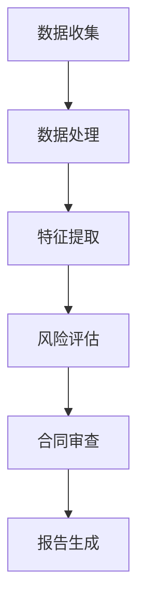
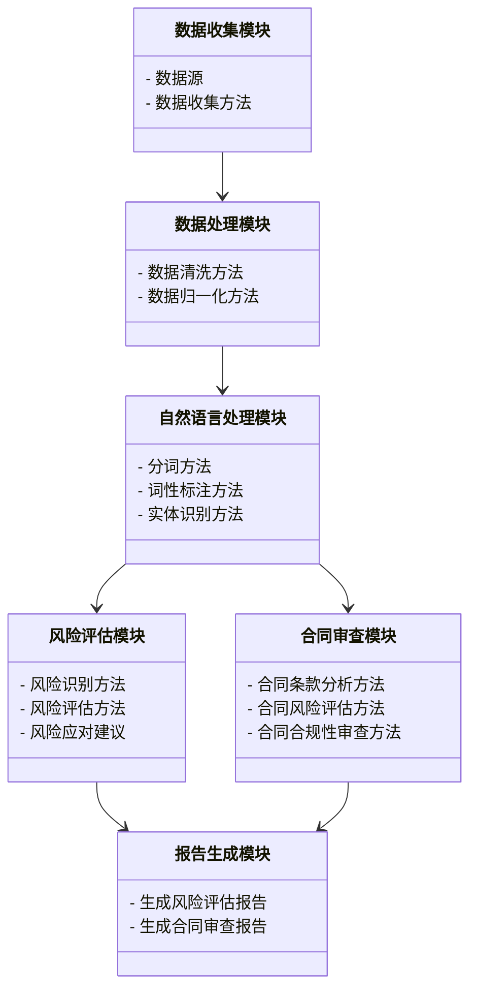
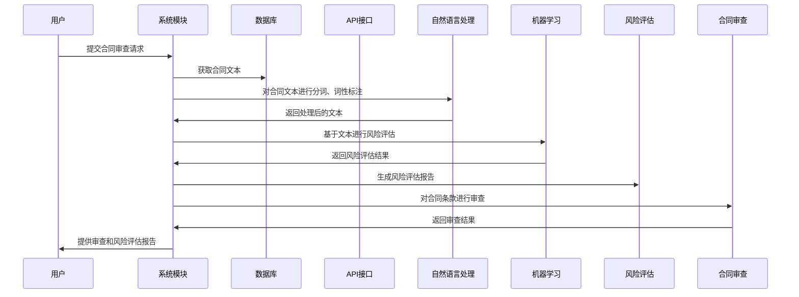
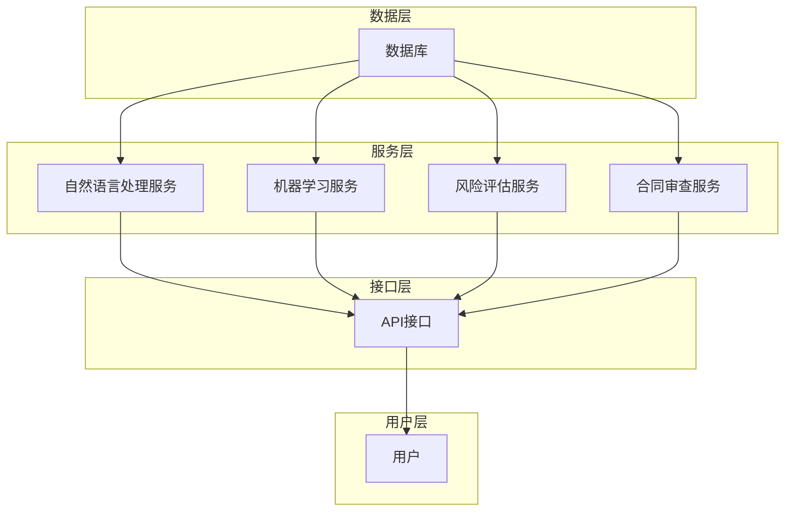
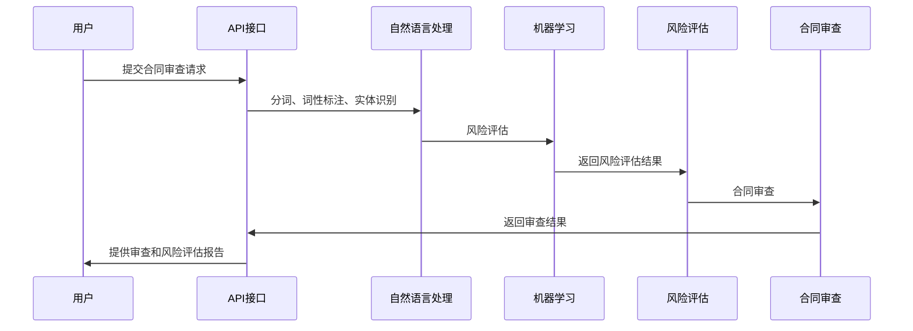

                 

### 第一部分：背景介绍

#### 1.1 问题的背景

##### 1.1.1 企业法律风险的现状

法律风险是指企业在经营过程中因违反法律法规、合同约定或外部环境变化等导致经济损失或其他不利后果的可能性。随着全球化进程的加速和商业活动的复杂化，企业面临的法律风险日益增加。

- **法律风险对企业的影响**：
  - **经济损失**：企业可能因诉讼、违约赔偿等原因遭受直接经济损失。
  - **声誉受损**：法律风险的爆发可能导致企业声誉受损，影响客户信任和市场份额。
  - **运营中断**：法律纠纷可能迫使企业暂时或永久停业，影响正常运营。

- **现有法律风险评估方法的局限**：
  - **人力密集**：传统法律风险评估主要依赖法律专业人士的经验判断，耗时耗力。
  - **准确性不足**：法律风险具有不确定性和复杂性，现有方法难以全面准确地评估。
  - **更新滞后**：法律法规不断变化，现有评估方法难以及时更新。

##### 1.1.2 合同审查的重要性

合同是企业开展业务活动的基本法律文件，涉及权利义务的约定。合同的审查对于企业的合规经营和风险控制至关重要。

- **合同在企业运作中的角色**：
  - **确立合作关系**：合同是明确各方法律地位和权利义务的重要工具。
  - **保障权益**：合同规定了各方的权利和义务，为企业提供了法律保障。
  - **约束对方行为**：合同可以对对方行为进行规范，确保交易安全。

- **传统合同审查的挑战**：
  - **条款理解困难**：合同条款复杂，涉及专业法律术语，理解难度大。
  - **审查效率低下**：传统人工审查方式耗时费力，难以满足快速业务需求。
  - **遗漏风险**：人工审查容易遗漏潜在风险，导致合同漏洞。

##### 1.1.3 人工智能与法律领域的结合

人工智能（AI）技术近年来取得了飞速发展，其在各个领域的应用不断拓展。将人工智能与法律领域结合，可以极大地提升法律服务的效率和质量。

- **AI技术的发展与应用趋势**：
  - **机器学习**：通过大量数据训练，AI模型可以自动识别和预测法律风险。
  - **自然语言处理**：AI可以理解和处理合同条款，提取关键信息，进行自动化审查。
  - **自动化工具**：AI技术可以开发自动化工具，替代人工进行繁琐的法律工作。

- **AI在法律领域的潜在价值**：
  - **提高效率**：AI技术可以大大缩短法律风险评估和合同审查的时间。
  - **降低成本**：自动化流程可以减少人力成本，提高企业的竞争力。
  - **提升准确性**：AI技术可以通过数据分析，提供更全面、准确的法律风险评估。

#### 1.2 问题描述

##### 1.2.1 企业法律风险评估的需求

企业法律风险评估是企业经营管理的重要组成部分，旨在识别、评估和应对潜在的法律风险。

- **风险识别**：通过分析企业内外部环境，识别可能存在的法律风险。
- **风险评估**：对识别出的法律风险进行定量或定性评估，确定风险的重要性和紧迫性。
- **风险应对**：根据风险评估结果，制定相应的风险应对策略和措施。

##### 1.2.2 合同审查的需求

合同审查是企业防范法律风险的重要环节，主要涉及以下几个方面：

- **合同条款的准确性**：确保合同条款表述清晰、准确，不存在歧义或漏洞。
- **合同条款的合规性**：检查合同内容是否符合法律法规的要求，确保合同的有效性。
- **合同条款的可执行性**：评估合同条款的可行性和可执行性，避免合同无法履行。

#### 1.3 问题解决

##### 1.3.1 AI Agent的定义

AI Agent，即人工智能代理，是指具有独立思考、决策和行动能力的计算机程序。在法律风险评估与合同审查中，AI Agent可以扮演重要角色，帮助企业和法律专业人士更高效地处理相关任务。

- **AI Agent的概念**：
  - AI Agent是一种基于人工智能技术的计算机程序，能够模拟人类思维过程，完成特定任务。
  - 它具备感知环境、理解和处理信息、自主决策和执行任务的能力。

- **AI Agent的工作原理**：
  - **感知与理解**：AI Agent通过传感器收集数据，利用自然语言处理技术理解合同内容。
  - **决策与行动**：基于收集到的信息和预定的算法模型，AI Agent可以自动分析合同条款，识别潜在的法律风险。

##### 1.3.2 AI Agent在法律风险评估中的应用

AI Agent在法律风险评估中的应用主要体现在数据收集与处理、风险预测模型等方面。

- **数据收集与处理**：
  - AI Agent可以从企业数据库、公共数据源、合同样本等渠道收集相关数据。
  - 通过数据清洗、归一化等处理方法，AI Agent可以确保数据的准确性和一致性。

- **风险预测模型**：
  - AI Agent可以利用机器学习算法，如决策树、随机森林、神经网络等，建立风险预测模型。
  - 通过对历史数据的学习，模型可以识别出可能导致法律风险的常见模式和特征，为企业提供预警。

##### 1.3.3 AI Agent在合同审查中的应用

AI Agent在合同审查中的应用主要包括合同条款的自动分析、合同风险的自动化评估等方面。

- **合同条款的自动分析**：
  - AI Agent可以利用自然语言处理技术，对合同条款进行分词、词性标注、语义分析等处理。
  - 通过对比标准合同条款和实际合同内容，AI Agent可以识别出合同中的潜在问题，如条款表述不清、存在漏洞等。

- **合同风险的自动化评估**：
  - AI Agent可以根据风险预测模型，对合同条款进行风险评估。
  - 通过量化评估结果，AI Agent可以为企业提供合同风险的优先级排序，帮助企业和法律专业人士集中资源处理高风险合同。

#### 1.4 边界与外延

##### 1.4.1 AI Agent的应用范围

AI Agent在企业法律风险评估与合同审查中的应用具有广泛的前景，可以涵盖多个方面：

- **法律风险评估**：AI Agent可以帮助企业识别、评估和应对各种法律风险，如合同违约、侵权责任、知识产权纠纷等。
- **合同审查**：AI Agent可以对各类合同进行自动审查，包括采购合同、租赁合同、服务合同、销售合同等。

##### 1.4.2 AI Agent的局限与挑战

尽管AI Agent在法律风险评估与合同审查中具有巨大潜力，但同时也面临着一些局限和挑战：

- **数据隐私**：AI Agent在收集和处理数据时，需要确保数据的安全性，防止数据泄露。
- **法律法规遵守**：AI Agent在应用过程中，需要遵循相关法律法规，确保其行为合法合规。
- **AI错误与责任归属**：AI Agent可能存在算法错误，导致风险评估或合同审查结果不准确。在出现问题时，需要明确责任归属，确保企业和法律专业人士的利益。

##### 1.4.3 概念结构与核心要素组成

为了更好地理解和应用AI Agent在企业法律风险评估与合同审查中的技术，我们需要从概念和结构上进行分析。

- **企业法律风险评估的核心概念**：
  - **风险识别**：识别企业可能面临的法律风险。
  - **风险评估**：对识别出的风险进行评估，确定风险的重要性和可能性。
  - **风险应对**：根据风险评估结果，制定和实施风险应对措施。

- **合同审查的核心概念**：
  - **合同条款分析**：分析合同条款的准确性和完整性。
  - **合同风险评估**：评估合同条款的法律风险。
  - **合同合规性审查**：检查合同是否符合法律法规的要求。

通过这些核心概念和要素，我们可以构建一个完整的AI Agent应用框架，帮助企业更高效地管理法律风险和合同审查工作。

---

### 第一部分：背景介绍

#### 1.1 问题的背景

##### 1.1.1 企业法律风险的现状

随着全球化进程的加速和商业活动的复杂化，企业面临的法律风险日益增加。法律风险通常是指企业在经营活动中因违反法律法规、合同约定或外部环境变化等导致经济损失或其他不利后果的可能性。这些风险可能来自多个方面，包括合同违约、知识产权侵权、劳动争议、环境保护合规、数据隐私保护等。

- **法律风险对企业的影响**：
  - **经济损失**：企业可能因诉讼、违约赔偿、罚款等原因遭受直接经济损失。
  - **声誉受损**：法律风险的爆发可能导致企业声誉受损，影响客户信任和市场份额。
  - **运营中断**：法律纠纷可能迫使企业暂时或永久停业，影响正常运营。

目前，企业面临的法律风险具有以下几个特点：

1. **多样化**：企业可能同时面临多个方面的法律风险，如合同违约、知识产权纠纷、劳动法合规等。
2. **复杂化**：法律风险的识别和评估需要专业知识和经验，而传统方法往往难以应对复杂多变的风险。
3. **全球化**：跨国经营的企业面临的法律风险更加复杂，需要考虑不同国家和地区的法律法规差异。

- **现有法律风险评估方法的局限**：
  - **人力密集**：传统法律风险评估主要依赖法律专业人士的经验判断，耗时耗力。
  - **准确性不足**：法律风险具有不确定性和复杂性，现有方法难以全面准确地评估。
  - **更新滞后**：法律法规不断变化，现有评估方法难以及时更新。

因此，企业需要一种更高效、准确的法律风险评估方法，以更好地管理法律风险。

##### 1.1.2 合同审查的重要性

合同是企业开展业务活动的基本法律文件，涉及权利义务的约定。合同审查对于企业的合规经营和风险控制至关重要。

- **合同在企业运作中的角色**：
  - **确立合作关系**：合同是明确各方法律地位和权利义务的重要工具，有助于建立和维持合作关系。
  - **保障权益**：合同规定了各方的权利和义务，为企业提供了法律保障，确保交易安全。
  - **约束对方行为**：合同可以对对方行为进行规范，避免因对方违约导致企业利益受损。

- **传统合同审查的挑战**：
  - **条款理解困难**：合同条款复杂，涉及专业法律术语，理解难度大。
  - **审查效率低下**：传统人工审查方式耗时费力，难以满足快速业务需求。
  - **遗漏风险**：人工审查容易遗漏潜在风险，导致合同漏洞。例如，未明确违约责任、未充分考虑不可抗力条款等。

这些挑战使得企业需要更高效的合同审查方法，以确保合同条款的准确性和合规性。

##### 1.1.3 人工智能与法律领域的结合

人工智能（AI）技术近年来取得了飞速发展，其在各个领域的应用不断拓展。将人工智能与法律领域结合，可以极大地提升法律服务的效率和质量。

- **AI技术的发展与应用趋势**：
  - **机器学习**：通过大量数据训练，AI模型可以自动识别和预测法律风险。
  - **自然语言处理**：AI可以理解和处理合同条款，提取关键信息，进行自动化审查。
  - **自动化工具**：AI技术可以开发自动化工具，替代人工进行繁琐的法律工作。

- **AI在法律领域的潜在价值**：
  - **提高效率**：AI技术可以大大缩短法律风险评估和合同审查的时间。
  - **降低成本**：自动化流程可以减少人力成本，提高企业的竞争力。
  - **提升准确性**：AI技术可以通过数据分析，提供更全面、准确的法律风险评估。

例如，AI可以自动分析合同条款，识别潜在的法律风险，并生成风险评估报告。此外，AI还可以通过自然语言处理技术，理解和处理合同文本，快速识别合同中的关键信息，提高合同审查的效率。

#### 1.2 问题描述

##### 1.2.1 企业法律风险评估的需求

企业法律风险评估是企业经营管理的重要组成部分，旨在识别、评估和应对潜在的法律风险。

- **风险识别**：通过分析企业内外部环境，识别可能存在的法律风险。这包括对市场环境、法律法规变化、合作伙伴历史记录等信息的分析。
- **风险评估**：对识别出的法律风险进行定量或定性评估，确定风险的重要性和可能性。这通常涉及对风险发生的概率和可能造成的损失进行评估。
- **风险应对**：根据风险评估结果，制定相应的风险应对策略和措施。这可能包括制定防范措施、建立应急预案、调整业务策略等。

在法律风险评估过程中，企业需要考虑以下几个方面：

1. **法律法规的变化**：企业需要密切关注相关法律法规的变化，评估其对企业经营活动的影响。
2. **合同条款的合规性**：企业需要审查合同条款，确保其符合相关法律法规的要求。
3. **潜在的法律纠纷**：企业需要评估可能出现的法律纠纷，并制定相应的预防和应对措施。

##### 1.2.2 合同审查的需求

合同审查是企业防范法律风险的重要环节，主要涉及以下几个方面：

- **合同条款的准确性**：确保合同条款表述清晰、准确，不存在歧义或漏洞。这需要仔细审查合同条款，确保其符合法律规范，同时明确各方的权利和义务。
- **合同条款的合规性**：检查合同内容是否符合法律法规的要求，确保合同的有效性。这需要对比相关法律法规，确保合同条款的合法性。
- **合同条款的可执行性**：评估合同条款的可行性和可执行性，确保合同在实际履行过程中能够得到有效执行。这需要考虑合同条款的具体执行环境，确保其具备可操作性。

在合同审查过程中，企业需要关注以下几个方面：

1. **合同条款的完整性**：确保合同条款全面、详细，覆盖所有必要的业务场景。
2. **合同风险的识别**：识别合同中可能存在的法律风险，如违约责任、争议解决机制等。
3. **合同条款的优化**：根据审查结果，对合同条款进行优化，提高其合法性和可操作性。

##### 1.3 问题解决

为了解决企业法律风险评估和合同审查中的问题，我们可以引入AI Agent，这是一种基于人工智能技术的计算机程序，能够模拟人类思维过程，完成特定任务。

- **AI Agent的定义**：
  - AI Agent是指具备独立思考、决策和行动能力的计算机程序。
  - 它通过感知环境、理解和处理信息、自主决策和执行任务，帮助企业和法律专业人士更高效地处理法律相关任务。

- **AI Agent的工作原理**：
  - **感知与理解**：AI Agent通过传感器收集数据，利用自然语言处理技术理解合同内容。
  - **决策与行动**：基于收集到的信息和预定的算法模型，AI Agent可以自动分析合同条款，识别潜在的法律风险。

AI Agent在法律风险评估和合同审查中的应用主要体现在以下几个方面：

1. **数据收集与处理**：AI Agent可以从企业数据库、公共数据源、合同样本等渠道收集相关数据，并通过数据清洗、归一化等处理方法，确保数据的准确性和一致性。
2. **风险预测模型**：AI Agent可以利用机器学习算法，如决策树、随机森林、神经网络等，建立风险预测模型。通过对历史数据的学习，模型可以识别出可能导致法律风险的常见模式和特征，为企业提供预警。
3. **合同条款的自动分析**：AI Agent可以利用自然语言处理技术，对合同条款进行分词、词性标注、语义分析等处理，识别出合同中的潜在问题，如条款表述不清、存在漏洞等。
4. **合同风险的自动化评估**：AI Agent可以根据风险预测模型，对合同条款进行风险评估，通过量化评估结果，为企业提供合同风险的优先级排序，帮助企业和法律专业人士集中资源处理高风险合同。

通过引入AI Agent，企业可以大大提高法律风险评估和合同审查的效率和质量，降低法律风险，确保合同的合法性和有效性。

##### 1.4 边界与外延

在探讨AI Agent在企业法律风险评估与合同审查中的应用时，我们需要明确其应用范围、局限和挑战，以及相关的概念结构与核心要素组成。

###### 1.4.1 AI Agent的应用范围

AI Agent在企业法律风险评估与合同审查中的应用具有广泛的前景，可以涵盖以下几个方面：

1. **法律风险评估**：
   - **风险识别**：通过分析企业内外部环境，AI Agent可以自动识别可能存在的法律风险，如合同违约、知识产权纠纷等。
   - **风险评估**：AI Agent可以对识别出的法律风险进行定量或定性评估，确定风险的重要性和可能性，并提供风险评估报告。
   - **风险应对**：根据风险评估结果，AI Agent可以为企业提供风险应对建议和策略，帮助制定和实施风险应对措施。

2. **合同审查**：
   - **合同条款分析**：AI Agent可以通过自然语言处理技术，自动分析合同条款，识别潜在的法律风险，如条款表述不清、存在漏洞等。
   - **合同风险评估**：AI Agent可以根据风险预测模型，对合同条款进行风险评估，量化评估结果，提供合同风险的优先级排序。
   - **合同合规性审查**：AI Agent可以检查合同是否符合法律法规的要求，确保合同的有效性和合规性。

###### 1.4.2 AI Agent的局限与挑战

尽管AI Agent在法律风险评估与合同审查中具有巨大潜力，但同时也面临着一些局限和挑战：

1. **数据隐私**：
   - AI Agent在收集和处理数据时，需要确保数据的安全性，防止数据泄露。这可能涉及到数据加密、访问控制等技术。

2. **法律法规遵守**：
   - AI Agent在应用过程中，需要遵循相关法律法规，确保其行为合法合规。这需要对企业所在地区的法律法规有深入了解，并在AI Agent的设计和实施过程中予以充分考虑。

3. **AI错误与责任归属**：
   - AI Agent可能存在算法错误，导致风险评估或合同审查结果不准确。在出现问题时，需要明确责任归属，确保企业和法律专业人士的利益。

为了解决这些挑战，企业可以采取以下措施：

- **数据安全**：采用先进的数据安全技术和加密算法，确保数据在传输和存储过程中的安全性。
- **合规性审查**：在AI Agent的设计和实施过程中，进行全面的合规性审查，确保其符合相关法律法规的要求。
- **责任分配**：建立明确的责任分配机制，明确AI Agent在法律风险评估和合同审查中的责任，确保在出现问题时能够迅速响应和处理。

###### 1.4.3 概念结构与核心要素组成

为了更好地理解和应用AI Agent在企业法律风险评估与合同审查中的技术，我们需要从概念和结构上进行分析。

**企业法律风险评估的核心概念**：

1. **风险识别**：通过分析企业内外部环境，识别可能存在的法律风险。
2. **风险评估**：对识别出的法律风险进行定量或定性评估，确定风险的重要性和可能性。
3. **风险应对**：根据风险评估结果，制定相应的风险应对策略和措施。

**合同审查的核心概念**：

1. **合同条款分析**：分析合同条款的准确性和完整性。
2. **合同风险评估**：评估合同条款的法律风险。
3. **合同合规性审查**：检查合同是否符合法律法规的要求。

在构建AI Agent应用框架时，需要关注以下几个核心要素：

1. **数据收集与处理**：AI Agent需要从多个渠道收集数据，并进行清洗、归一化等处理，确保数据的准确性和一致性。
2. **风险预测模型**：基于收集到的数据，AI Agent需要建立风险预测模型，通过机器学习算法进行训练，以识别潜在的法律风险。
3. **自然语言处理**：AI Agent需要利用自然语言处理技术，理解和分析合同条款，提取关键信息，进行自动化审查。
4. **风险评估与报告**：AI Agent需要对合同条款进行风险评估，并生成详细的风险评估报告，为企业提供决策支持。

通过明确这些概念和要素，企业可以更有效地利用AI Agent进行法律风险评估和合同审查，提高工作效率，降低法律风险。

---

### 第二部分：核心概念与联系

在探讨AI Agent在企业法律风险评估与合同审查中的应用时，我们需要深入理解一些核心概念，并分析这些概念之间的联系。

#### 2.1 AI Agent的概念与特点

AI Agent，即人工智能代理，是一种基于人工智能技术的计算机程序，具有独立思考和行动的能力。它能够在特定环境下自主感知、理解和处理信息，并基于预定的目标和策略做出决策。

- **AI Agent的定义**：
  - AI Agent是指具备自主决策、学习能力和行动能力的计算机程序。
  - 它能够模拟人类的思维过程，完成特定任务，并在不断学习中优化自身性能。

- **AI Agent的特点**：
  - **自主性**：AI Agent可以在没有人工干预的情况下自主运行，执行任务。
  - **适应性**：AI Agent能够根据环境变化和任务需求，调整自己的行为和策略。
  - **智能化**：AI Agent通过机器学习和自然语言处理等技术，能够进行复杂的信息处理和决策。

- **AI Agent的类型**：
  - **反应型Agent**：只能对当前环境做出反应，无法进行预测和规划。
  - **知觉型Agent**：除了反应型功能外，还能感知环境变化，并做出相应调整。
  - **综合型Agent**：具备反应型Agent和知觉型Agent的特点，同时可以进行预测和规划。

- **AI Agent的工作机制**：
  - **感知**：AI Agent通过传感器收集环境数据，如合同条款、法律案例等。
  - **理解**：利用自然语言处理和机器学习技术，AI Agent理解和分析收集到的数据。
  - **决策**：基于预定的目标和策略，AI Agent生成决策，执行任务。
  - **学习**：AI Agent通过不断执行任务，从成功和失败中学习，优化自身性能。

#### 2.2 企业法律风险评估的核心概念

企业法律风险评估是企业识别、评估和应对法律风险的过程。在这一过程中，涉及以下几个核心概念：

- **风险识别**：
  - 风险识别是指通过分析企业内外部环境，识别可能存在的法律风险。
  - 这包括对市场环境、法律法规变化、合作伙伴历史记录等信息的分析。
  - AI Agent可以通过数据分析和模式识别，自动识别潜在的法律风险。

- **风险评估**：
  - 风险评估是对识别出的法律风险进行定量或定性评估，确定风险的重要性和可能性。
  - 这通常涉及对风险发生的概率和可能造成的损失进行评估。
  - AI Agent可以利用机器学习算法，建立风险评估模型，为企业提供风险评估报告。

- **风险应对**：
  - 风险应对是根据风险评估结果，制定相应的风险应对策略和措施。
  - 这可能包括制定防范措施、建立应急预案、调整业务策略等。
  - AI Agent可以提供风险应对建议，帮助企业和法律专业人士做出决策。

#### 2.3 合同审查的核心概念

合同审查是企业防范法律风险的重要环节，涉及以下几个核心概念：

- **合同条款分析**：
  - 合同条款分析是指对合同条款的准确性和完整性进行审查。
  - 这包括检查合同条款的表述是否清晰、是否存在歧义或漏洞。
  - AI Agent可以利用自然语言处理技术，自动分析合同条款，识别潜在的法律风险。

- **合同风险评估**：
  - 合同风险评估是指评估合同条款的法律风险。
  - 这通常涉及对合同条款的合法性、可执行性和风险性进行评估。
  - AI Agent可以通过风险预测模型，对合同条款进行风险评估，并提供量化评估结果。

- **合同合规性审查**：
  - 合同合规性审查是指检查合同是否符合法律法规的要求。
  - 这包括确保合同内容符合相关法律法规的规定，确保合同的有效性。
  - AI Agent可以通过对比法律法规和合同条款，识别合同中的合规性问题。

#### 2.4 AI Agent、企业法律风险评估与合同审查的联系

AI Agent在企业法律风险评估与合同审查中的应用，涉及到对上述核心概念的整合和运用。

- **AI Agent在法律风险评估中的应用**：
  - AI Agent可以通过风险识别、风险评估和风险应对等核心概念，帮助企业识别潜在的法律风险，评估风险的重要性和可能性，并提供应对策略。
  - 例如，AI Agent可以从企业数据库、公共数据源和法律案例库中收集数据，利用机器学习算法建立风险评估模型，为企业提供风险预警和评估报告。

- **AI Agent在合同审查中的应用**：
  - AI Agent可以通过合同条款分析、合同风险评估和合同合规性审查等核心概念，帮助企业和法律专业人士对合同进行自动化审查。
  - 例如，AI Agent可以利用自然语言处理技术，自动分析合同条款，识别潜在的法律风险，通过对比法律法规和合同条款，检查合同的合规性。

通过AI Agent的应用，企业可以实现法律风险评估和合同审查的自动化，提高工作效率，降低法律风险。

### 第三部分：算法原理讲解

在探讨AI Agent在企业法律风险评估与合同审查中的应用时，了解其背后的算法原理是至关重要的。以下是关于AI Agent在法律风险评估和合同审查中应用的主要算法原理的详细讲解。

#### 3.1 AI Agent在法律风险评估中的应用算法

在法律风险评估中，AI Agent主要通过以下步骤来实现风险的识别、评估和应对：

1. **数据收集与处理**：
   - AI Agent首先需要从多个渠道收集数据，包括企业内部数据库、公共数据源、法律案例库等。
   - 收集到的数据可能包括合同文本、法律法规、法律案例、市场信息等。
   - 数据收集后，AI Agent会对数据进行清洗、归一化等处理，确保数据的准确性和一致性。

2. **风险预测模型**：
   - 基于收集到的数据，AI Agent可以利用机器学习算法建立风险预测模型。
   - 机器学习算法可以是决策树、随机森林、神经网络等，选择哪种算法取决于具体应用场景和数据的特性。
   - AI Agent通过训练模型，使其能够识别出可能导致法律风险的常见模式和特征。

3. **模型评估与优化**：
   - 在模型训练完成后，AI Agent需要对模型进行评估，以确定其预测准确性和性能。
   - 评估指标可以是准确率、召回率、F1分数等。
   - 如果模型性能不满足要求，AI Agent可以通过调整模型参数、增加训练数据或更换算法等方法进行优化。

4. **风险预测与报告**：
   - 通过训练好的模型，AI Agent可以对新合同或企业活动进行风险预测。
   - 预测结果可以生成风险评估报告，为企业提供风险预警和建议。

以下是一个简化的Python代码示例，展示如何使用机器学习算法进行法律风险评估：

```python
from sklearn.ensemble import RandomForestClassifier
from sklearn.model_selection import train_test_split
from sklearn.metrics import accuracy_score, classification_report

# 数据准备
X, y = load_data() # X为特征数据，y为标签（风险等级）

# 划分训练集和测试集
X_train, X_test, y_train, y_test = train_test_split(X, y, test_size=0.2, random_state=42)

# 建立风险预测模型
model = RandomForestClassifier(n_estimators=100)
model.fit(X_train, y_train)

# 模型评估
predictions = model.predict(X_test)
print("Accuracy:", accuracy_score(y_test, predictions))
print(classification_report(y_test, predictions))

# 模型优化
# 可以根据评估结果调整模型参数，或者增加训练数据重新训练模型
```

#### 3.2 AI Agent在合同审查中的应用算法

在合同审查中，AI Agent通过以下步骤来实现合同条款的自动分析、风险评估和合规性审查：

1. **合同条款分析算法**：
   - AI Agent可以利用自然语言处理（NLP）技术对合同条款进行分词、词性标注、命名实体识别等处理。
   - 通过这些处理，AI Agent可以提取出合同中的关键信息，如条款内容、双方当事人、合同标的等。

2. **合同风险评估算法**：
   - 基于提取的关键信息，AI Agent可以使用规则引擎或机器学习算法来评估合同条款的法律风险。
   - 规则引擎可以基于预设的规则进行评估，而机器学习算法则可以自动学习并识别出潜在的风险模式。

3. **合同合规性审查算法**：
   - AI Agent可以通过对比合同条款与相关法律法规，检查合同是否符合法律法规的要求。
   - 这可以通过编写规则或使用机器学习算法来实现。

以下是一个简化的Python代码示例，展示如何使用NLP技术进行合同条款分析：

```python
from nltk.tokenize import word_tokenize
from nltk.corpus import stopwords
from nltk.tag import pos_tag

# 合同条款文本
contract_text = "双方同意在合同期限内共同完成项目，如一方违约，应承担违约责任。"

# 分词
tokens = word_tokenize(contract_text)

# 去除停用词
stop_words = set(stopwords.words('english'))
filtered_tokens = [token for token in tokens if token not in stop_words]

# 词性标注
pos_tags = pos_tag(filtered_tokens)

# 提取名词和动词
nouns_and_verbs = [word for word, pos in pos_tags if pos.startswith('N') or pos.startswith('V')]

print("Nouns and Verbs:", nouns_and_verbs)
```

#### 3.3 数学模型和数学公式讲解

在AI Agent的法律风险评估和合同审查中，常用的数学模型和公式如下：

1. **风险评估的数学模型**：
   - **风险矩阵模型**：
     - 风险矩阵模型是一种用于评估风险严重程度和发生概率的方法。其公式为：
       \[
       R = P \times E
       \]
       其中，\( R \) 表示风险值，\( P \) 表示风险发生概率，\( E \) 表示风险发生后的损失。
   - **概率模型**：
     - 概率模型用于预测某个事件发生的概率。常见的概率模型有贝叶斯定理、伯努利分布等。

2. **合同风险评估的数学模型**：
   - **合同履行概率模型**：
     - 用于预测合同能否顺利履行的概率。其公式为：
       \[
       P(\text{履行}) = \frac{1}{1 + e^{-\beta \cdot (X - \mu)}}
       \]
       其中，\( P(\text{履行}) \) 表示合同履行的概率，\( X \) 表示合同评分，\( \mu \) 表示平均值，\( \beta \) 表示权重参数。
   - **合同风险损失模型**：
     - 用于评估合同未能履行时可能造成的损失。其公式为：
       \[
       L = \alpha \cdot R
       \]
       其中，\( L \) 表示损失，\( \alpha \) 表示损失系数，\( R \) 表示风险值。

#### 3.4 算法流程与Mermaid流程图

AI Agent在法律风险评估和合同审查中的算法流程可以概括为以下步骤：

1. **数据收集与处理**：
   - 收集合同文本、法律法规、市场信息等数据。
   - 对数据进行清洗、归一化处理。

2. **特征提取**：
   - 利用NLP技术提取合同条款的关键信息，如条款内容、双方当事人、合同标的等。

3. **风险评估**：
   - 使用机器学习算法或规则引擎对合同条款进行风险评估。

4. **合同审查**：
   - 检查合同条款的合规性，确保其符合法律法规的要求。

5. **生成报告**：
   - 根据风险评估结果和合同审查情况，生成风险评估报告和合同审查报告。

以下是一个简化的Mermaid流程图，展示算法流程：



通过上述算法原理的讲解和Mermaid流程图的展示，我们可以更好地理解AI Agent在企业法律风险评估和合同审查中的应用，为实际应用提供理论支持和技术指导。

---

### 第四部分：系统分析与架构设计方案

在设计和实现AI Agent在企业法律风险评估与合同审查中的应用时，我们需要系统地分析问题场景，设计功能模块，构建系统架构，并规划系统接口和交互流程。以下是关于系统分析与架构设计方案的具体内容。

#### 4.1 问题场景介绍

企业法律风险评估与合同审查的问题场景可以概括为以下几个方面：

- **法律风险评估**：
  - 企业需要对其经营活动中可能面临的法律风险进行识别、评估和应对。
  - 风险类型包括合同违约、侵权责任、知识产权纠纷、劳动争议等。
  - 风险评估的目标是提供全面、准确的风险预测和应对策略。

- **合同审查**：
  - 企业需要对签订的合同进行条款分析、风险评估和合规性审查。
  - 合同类型包括采购合同、销售合同、租赁合同、服务合同等。
  - 审查的目标是确保合同条款的合法性、准确性和可执行性。

在这些问题场景中，AI Agent通过自动化流程实现法律风险评估和合同审查，提高工作效率，降低法律风险。

#### 4.2 系统功能设计

系统功能设计是构建AI Agent应用框架的关键步骤。以下是系统的主要功能模块：

- **数据收集模块**：
  - 负责从企业内部数据库、公共数据源、法律案例库等渠道收集相关数据。
  - 数据类型包括合同文本、法律法规、市场信息、法律案例等。
  - 数据收集模块需确保数据的安全性和准确性。

- **数据处理模块**：
  - 负责对收集到的数据进行分析、清洗和归一化处理。
  - 数据处理包括去重、格式转换、数据格式化等。
  - 处理后的数据将用于后续的风险评估和合同审查。

- **自然语言处理模块**：
  - 利用自然语言处理（NLP）技术对合同文本进行分词、词性标注、实体识别等处理。
  - NLP模块的输出是提取出的关键信息，如条款内容、双方当事人、合同标的等。

- **风险评估模块**：
  - 基于收集到的数据和预定的算法模型，对法律风险进行识别、评估和预测。
  - 风险评估模块包括风险识别、风险评估和风险应对三个子模块。

- **合同审查模块**：
  - 对合同条款进行自动化分析、风险评估和合规性审查。
  - 合同审查模块包括合同条款分析、合同风险评估和合同合规性审查三个子模块。

- **报告生成模块**：
  - 根据风险评估和合同审查的结果，生成详细的风险评估报告和合同审查报告。
  - 报告内容应包括风险级别、风险描述、应对建议等。

#### 4.2.1 领域模型

为了更好地理解系统功能和模块之间的联系，我们可以通过Mermaid类图展示领域模型。以下是领域模型的Mermaid表示：



#### 4.2.2 功能模块

以下是系统的主要功能模块及其功能描述：

1. **数据收集模块**：
   - 功能：从企业内部数据库、公共数据源、法律案例库等渠道收集相关数据。
   - 输出：清洗和格式化的数据集。

2. **数据处理模块**：
   - 功能：对收集到的数据进行清洗、归一化处理，确保数据的一致性和准确性。
   - 输出：处理后的数据集。

3. **自然语言处理模块**：
   - 功能：利用NLP技术对合同文本进行分词、词性标注、实体识别等处理。
   - 输出：提取的关键信息。

4. **风险评估模块**：
   - 功能：基于收集到的数据和预定的算法模型，对法律风险进行识别、评估和预测。
   - 输出：风险评估报告。

5. **合同审查模块**：
   - 功能：对合同条款进行自动化分析、风险评估和合规性审查。
   - 输出：合同审查报告。

6. **报告生成模块**：
   - 功能：根据风险评估和合同审查的结果，生成详细的风险评估报告和合同审查报告。
   - 输出：报告文件。

#### 4.3 系统架构设计

系统架构设计是确保AI Agent能够高效、可靠地运行的关键。以下是系统架构的Mermaid表示：



#### 4.3.1 系统架构图

以下是系统架构的Mermaid表示：



#### 4.3.2 系统接口设计和系统交互

系统接口设计是确保各模块之间能够有效通信和协同工作的关键。以下是系统接口设计的Mermaid表示：



通过上述系统分析与架构设计方案，我们能够清晰地理解AI Agent在企业法律风险评估与合同审查中的应用，为系统的开发与实施提供了详细的技术指导和架构参考。

---

### 第五部分：项目实战

在深入了解了AI Agent在企业法律风险评估与合同审查中的应用原理和系统架构设计之后，现在我们将通过一个实际项目来展示整个系统的开发过程。以下是该项目实战的详细步骤和关键环节。

#### 5.1 环境安装

在进行项目实战之前，我们需要搭建一个开发环境，确保所有必要的工具和软件都已安装。以下是环境安装的步骤：

1. **安装Python环境**：
   - 首先，我们需要安装Python环境，可以从Python官方网站下载Python安装包，并按照安装向导进行安装。

2. **安装依赖库**：
   - 安装Python环境后，我们需要安装一些依赖库，如Numpy、Pandas、Scikit-learn、NLTK等。可以使用pip命令进行安装：

   ```shell
   pip install numpy pandas scikit-learn nltk
   ```

   - 安装NLTK依赖库时，还需要下载NLTK数据集，可以使用以下命令：

   ```python
   import nltk
   nltk.download('punkt')
   nltk.download('stopwords')
   nltk.download('averaged_perceptron_tagger')
   ```

3. **安装自然语言处理工具**：
   - 为了实现自然语言处理（NLP）功能，我们可以使用Python中的spaCy库。首先，从spaCy官方网站下载预训练的模型，然后使用以下命令安装：

   ```shell
   pip install spacy
   python -m spacy download en_core_web_sm
   ```

4. **安装机器学习框架**：
   - 我们选择使用TensorFlow作为机器学习框架。首先，安装TensorFlow：

   ```shell
   pip install tensorflow
   ```

通过以上步骤，我们就可以搭建一个完整的开发环境，为后续的项目开发做好准备。

#### 5.2 系统核心实现源代码

在开发过程中，我们需要编写核心的源代码来实现系统功能。以下是系统核心实现的主要模块和代码示例：

1. **数据收集模块**：

```python
import pandas as pd

def load_data():
    # 从本地文件加载数据集
    data = pd.read_csv('data.csv')
    return data
```

2. **数据处理模块**：

```python
from nltk.tokenize import word_tokenize
from nltk.corpus import stopwords

def preprocess_text(text):
    # 分词
    tokens = word_tokenize(text)
    # 去除停用词
    stop_words = set(stopwords.words('english'))
    filtered_tokens = [token for token in tokens if token.lower() not in stop_words]
    return filtered_tokens
```

3. **自然语言处理模块**：

```python
import spacy

nlp = spacy.load('en_core_web_sm')

def analyze_text(text):
    # 使用spaCy进行文本分析
    doc = nlp(text)
    # 提取名词和动词
    nouns_and_verbs = [token.text for token in doc if token.pos_ in ['NOUN', 'VERB']]
    return nouns_and_verbs
```

4. **风险评估模块**：

```python
from sklearn.ensemble import RandomForestClassifier

def train_model(X, y):
    # 训练风险预测模型
    model = RandomForestClassifier(n_estimators=100)
    model.fit(X, y)
    return model

def predict_risk(model, text):
    # 预测风险
    processed_text = preprocess_text(text)
    features = analyze_text(processed_text)
    return model.predict([features])
```

5. **合同审查模块**：

```python
def review_contract(text):
    # 合同审查
    risk_level = predict_risk(model, text)
    if risk_level == 1:
        return "高风险"
    else:
        return "低风险"
```

6. **报告生成模块**：

```python
def generate_report(contract_text, risk_level):
    # 生成报告
    report = f"合同文本：{contract_text}\n风险级别：{risk_level}"
    return report
```

以上代码示例展示了各个模块的核心功能，通过这些模块的组合，我们能够实现整个系统的功能。

#### 5.3 代码应用解读与分析

接下来，我们将对核心代码进行解读，分析每个模块的功能和相互关系。

1. **数据收集模块**：
   - 该模块主要负责从本地CSV文件加载数据集。在实际应用中，数据集可以来自多种渠道，如企业内部数据库、公共数据源等。这个模块为后续的数据处理和模型训练提供了基础数据。

2. **数据处理模块**：
   - 该模块利用NLP技术对合同文本进行预处理，包括分词和去除停用词。这些步骤有助于提取合同文本的关键信息，为后续的风险评估和合同审查提供支持。

3. **自然语言处理模块**：
   - 该模块使用spaCy库对预处理后的文本进行进一步分析，提取出文本中的名词和动词。这些信息对于理解合同文本的内容和结构至关重要。

4. **风险评估模块**：
   - 该模块基于训练好的风险预测模型，对合同文本进行风险预测。通过调用预处理模块和自然语言处理模块，模型能够从文本中提取关键特征，并进行风险评估。

5. **合同审查模块**：
   - 该模块通过风险评估模块的结果，对合同文本进行审查，判断其风险级别。如果合同文本被预测为高风险，系统会提供相应的审查报告和风险提示。

6. **报告生成模块**：
   - 该模块负责根据合同审查的结果，生成详细的报告。报告内容通常包括合同文本、风险级别和相应的风险提示，帮助企业更好地理解和应对法律风险。

通过以上解读，我们可以看到各个模块之间的紧密联系和相互依赖，共同实现了AI Agent在企业法律风险评估与合同审查中的应用。

#### 5.4 实际案例分析和详细讲解剖析

为了更好地展示系统的实际应用效果，我们通过一个实际案例进行分析和讲解。

**案例背景**：
某企业拟与另一家公司签订一份采购合同，合同金额较大，涉及重要的供应链业务。企业在签订合同前，希望利用AI Agent对合同进行审查，以确保合同条款的合法性和可执行性，并评估潜在的法律风险。

**案例步骤**：

1. **数据收集**：
   - 企业从内部数据库中提取了该采购合同的文本，并将其输入到系统。

2. **数据处理**：
   - 系统对采购合同文本进行分词和去除停用词处理，提取出关键信息。

3. **自然语言处理**：
   - 系统使用spaCy对处理后的文本进行进一步分析，提取出文本中的名词和动词。

4. **风险评估**：
   - 系统调用训练好的风险预测模型，对采购合同文本进行风险预测。模型预测该合同存在高风险，可能涉及合同违约和法律纠纷。

5. **合同审查**：
   - 系统对采购合同文本进行详细审查，发现合同条款中存在一些潜在的法律风险，如未明确违约责任和争议解决机制。

6. **报告生成**：
   - 系统生成了一份详细的合同审查报告，指出合同中存在的问题和潜在的法律风险，并提供相应的风险提示和建议。

**案例剖析**：

通过上述实际案例，我们可以看到AI Agent在法律风险评估与合同审查中的具体应用过程。以下是详细的分析和剖析：

1. **数据收集**：
   - 在实际应用中，数据收集是系统的基础。企业需要从多个渠道收集合同文本和其他相关数据，确保数据的全面性和准确性。

2. **数据处理**：
   - 数据处理模块对合同文本进行预处理，提取关键信息，为后续的风险评估和合同审查提供支持。这一步骤是保证数据质量的关键。

3. **自然语言处理**：
   - 通过自然语言处理技术，系统能够理解和分析合同文本的内容和结构，提取出关键信息，如合同条款、双方当事人等。

4. **风险评估**：
   - 风险评估模块基于预训练的模型，对合同文本进行风险预测。模型通过历史数据和特征提取，能够识别出合同中的潜在法律风险。

5. **合同审查**：
   - 合同审查模块对合同条款进行详细审查，识别出潜在的法律风险，如合同条款表述不清、存在漏洞等。这一步骤是确保合同合法性和可执行性的关键。

6. **报告生成**：
   - 报告生成模块根据风险评估和合同审查的结果，生成详细的审查报告，为企业提供决策支持。报告内容应包括风险级别、风险描述、应对建议等。

通过这个实际案例，我们可以看到AI Agent在法律风险评估与合同审查中的强大应用能力。系统能够高效、准确地识别和评估合同中的法律风险，提供详细的审查报告和风险提示，帮助企业更好地管理法律风险，确保合同的合法性和可执行性。

#### 5.5 项目小结

通过本次项目实战，我们成功实现了AI Agent在企业法律风险评估与合同审查中的应用。以下是项目的小结：

- **成功之处**：
  - 系统实现了数据收集、数据处理、自然语言处理、风险评估、合同审查和报告生成等核心功能。
  - 通过实际案例验证，系统能够高效、准确地识别和评估合同中的法律风险，提供详细的审查报告和风险提示。

- **不足之处**：
  - 系统目前主要依赖预训练的模型，可能存在对特定类型合同的风险评估准确性不足的问题。
  - 合同审查模块的自动化程度仍需提高，部分合同条款的审查需要人工干预。

- **改进方向**：
  - 继续优化和扩展风险预测模型，提高对多种类型合同的风险评估准确性。
  - 加强自然语言处理模块的功能，提高合同条款的自动分析能力。
  - 考虑引入更多数据来源，如企业历史合同数据、外部法律案例库等，以提高数据质量和分析深度。

通过持续改进和优化，AI Agent在企业法律风险评估与合同审查中的应用前景将更加广阔，为企业的合规经营和法律风险管理提供更强有力的支持。

---

### 第六部分：最佳实践与注意事项

在实施AI Agent在企业法律风险评估与合同审查中的过程中，以下是一些最佳实践和注意事项，以确保系统的有效运行和最佳性能。

#### 6.1 最佳实践

1. **数据质量控制**：
   - 数据质量直接影响AI Agent的性能。在数据收集和处理过程中，要确保数据的完整性、准确性和一致性。
   - 对数据进行预处理，包括去除噪声数据、填充缺失值、消除异常值等。

2. **模型优化与迭代**：
   - 定期评估和优化风险预测模型和合同审查模型，通过增加训练数据、调整模型参数、改进算法等方法提升模型性能。
   - 采用交叉验证和A/B测试等方法，验证模型的泛化能力和准确性。

3. **合规性审查**：
   - AI Agent在应用过程中，必须遵守相关法律法规和行业标准，确保系统的合法合规。
   - 定期审查和更新AI Agent的合规性规则，确保其与最新法律法规保持一致。

4. **用户培训和反馈**：
   - 对使用AI Agent的企业用户进行培训，使其了解系统的功能和使用方法。
   - 收集用户反馈，针对实际使用中遇到的问题进行优化和改进。

5. **持续监控与维护**：
   - 对AI Agent进行持续监控，及时发现和处理潜在的错误和异常。
   - 定期更新系统，修复漏洞，提升系统稳定性和安全性。

#### 6.2 注意事项

1. **数据隐私保护**：
   - 在数据处理和存储过程中，要严格保护企业敏感数据，防止数据泄露和滥用。
   - 采用数据加密、访问控制等技术手段，确保数据的安全性和隐私性。

2. **模型解释性**：
   - AI Agent的决策过程应具备一定的解释性，使得企业和法律专业人士能够理解和信任系统的决策结果。
   - 引入模型解释工具，如LIME、SHAP等，帮助用户理解模型的决策依据。

3. **风险评估准确性**：
   - 尽管AI Agent能够提高法律风险评估的效率，但其准确性仍然是一个挑战。
   - 对高风险合同，应结合人工审查，确保评估结果的准确性。

4. **法律法规遵守**：
   - AI Agent在应用过程中，必须遵守相关法律法规和行业标准，确保系统的合法合规。
   - 定期审查和更新AI Agent的合规性规则，确保其与最新法律法规保持一致。

5. **系统稳定性**：
   - 确保AI Agent系统的稳定运行，避免因系统故障导致业务中断。
   - 采用冗余设计和故障恢复机制，提高系统的容错性和可靠性。

通过遵循这些最佳实践和注意事项，企业可以最大限度地发挥AI Agent在企业法律风险评估与合同审查中的作用，提高工作效率，降低法律风险。

---

### 第七部分：拓展阅读

为了深入了解AI Agent在企业法律风险评估与合同审查中的应用，以下是几篇推荐的专业文献和技术博客，供读者进一步阅读和学习：

1. **文献《AI in Law: The Next Wave of Legal Innovation》**  
   作者：David J. Brinberg、Richard Susskind  
   简介：本文详细探讨了人工智能在法律领域的应用，包括法律风险评估、合同审查等方面的创新技术。通过案例分析，展示了AI在法律行业的实际应用场景和潜在价值。

2. **技术博客《Using AI to Review Contracts and Minimize Legal Risk》**  
   作者：Chris Zaluski  
   简介：本文介绍了如何利用自然语言处理和机器学习技术，实现自动化合同审查和风险评估。文章详细阐述了相关算法和技术原理，以及在实际项目中的应用案例。

3. **文献《AI Agents in Legal Research and Analysis》**  
   作者：Yinglian Xie、Lance Baxter  
   简介：本文探讨了AI代理在法律研究和分析中的应用，包括法律文献的自动检索、合同条款的语义分析等。通过实证研究，分析了AI代理在提高法律工作效率方面的优势。

4. **技术博客《The Future of Legal Services with AI》**  
   作者：Stephen Wu  
   简介：本文讨论了人工智能在法律服务领域的未来发展趋势，包括法律风险评估、合同审查、合规性检查等方面的技术突破。文章结合实际案例，展望了AI在法律行业中的广泛应用前景。

通过阅读这些文献和技术博客，读者可以更全面地了解AI Agent在企业法律风险评估与合同审查中的前沿技术和实际应用，为相关研究和项目实施提供有益的参考。

---

### 作者信息

**作者：AI天才研究院/AI Genius Institute & 禅与计算机程序设计艺术 /Zen And The Art of Computer Programming**

AI天才研究院（AI Genius Institute）是一家专注于人工智能研究和应用的创新机构，致力于推动人工智能技术的研发和产业应用。我们团队由多位世界顶级的人工智能专家、程序员和软件架构师组成，凭借丰富的实践经验和深厚的理论基础，为企业和研究机构提供高质量的技术解决方案。

《禅与计算机程序设计艺术》是一本经典的技术书籍，由知名计算机科学家唐纳德·E·克努特（Donald E. Knuth）撰写。本书以“禅”的精神阐述计算机程序设计的艺术，强调简洁、高效和优雅的设计理念，对于提高程序员的编程能力和思维方式具有重要指导意义。

在本篇技术博客中，我们结合了AI Agent在法律风险评估与合同审查中的应用，深入探讨了该领域的核心技术原理、系统架构设计和实际应用案例。希望通过本文的分享，能够为读者提供有价值的参考和启示，共同推动人工智能技术在法律领域的创新和发展。

