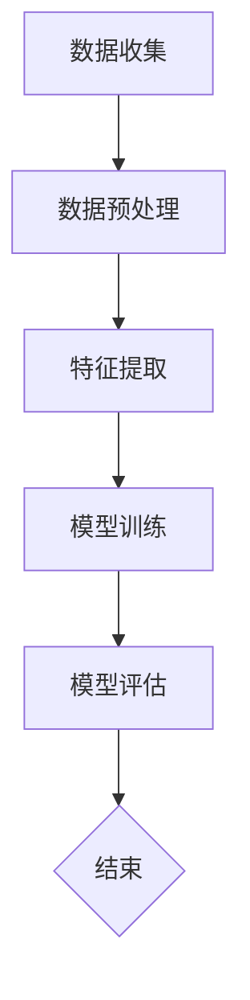
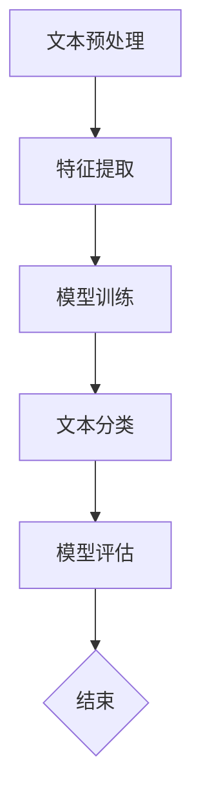
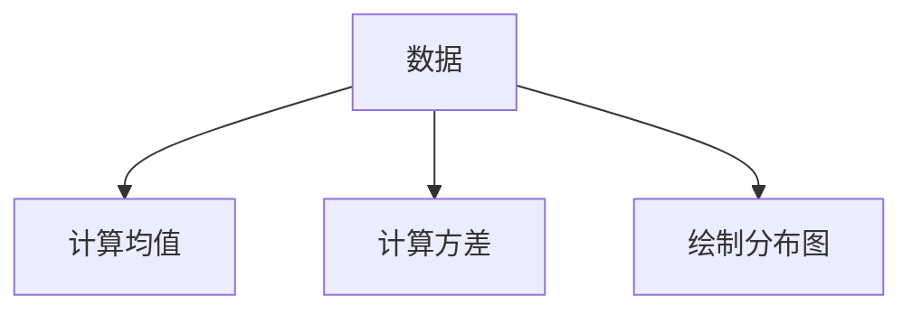
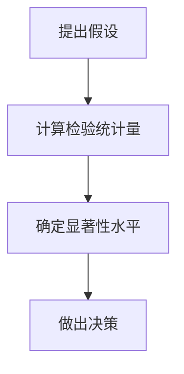
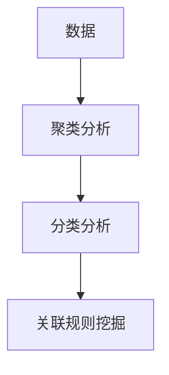
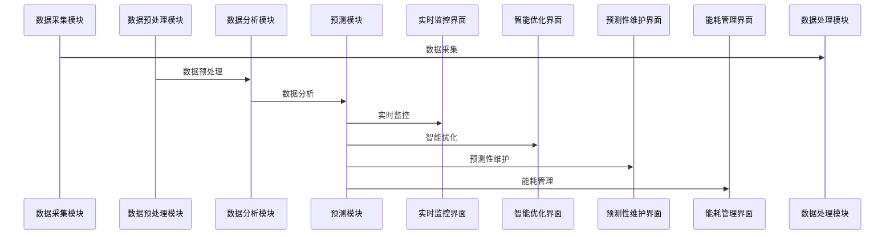

                 


### AI Agent在企业物联网数据分析中的应用前景

随着物联网技术的飞速发展，海量数据的收集和处理成为企业决策的焦点。AI Agent，作为人工智能领域的重要成果，以其自主学习和决策能力，逐渐成为物联网数据分析的关键角色。本文将深入探讨AI Agent在企业物联网数据分析中的应用前景，从核心概念、技术原理、应用场景到实践案例，进行全面剖析。

#### 1.1 引言

物联网（Internet of Things, IoT）是通过互联网将各种设备连接起来，实现信息交换和共享的系统。企业物联网数据分析涉及从设备收集的大量数据，通过处理和分析，转化为有价值的信息，从而支持企业的决策。而AI Agent，作为一种智能体，能够模拟人类智能行为，具有自主学习、决策和执行能力。本篇文章将讨论AI Agent在企业物联网数据分析中的应用前景，旨在为读者提供一个全面的视角，了解这一新兴领域的潜力和挑战。

#### 1.2 核心概念与问题背景

**AI Agent**：AI Agent是一种能够模拟人类智能行为的软件代理，通常具备自主学习、决策和执行能力。它们可以在特定环境中自主行动，以实现特定的目标。

**企业物联网数据分析**：企业物联网数据分析是指利用物联网设备收集的数据，通过数据采集、处理和分析，为企业提供洞察和决策支持的过程。

在当前的企业环境中，物联网设备大量产生数据，如传感器数据、机器日志、用户行为数据等。这些数据具有海量、高频率、多样化等特点，给企业带来了巨大的分析挑战。传统的数据分析方法难以应对这种复杂的数据环境，而AI Agent的出现为解决这一问题提供了新的思路。

#### 1.3 目录结构

本文将分为以下几个章节：

1. **引言**：介绍问题背景、研究目的和书籍结构。
2. **AI Agent与物联网数据分析基础**：介绍AI Agent和物联网数据分析的基本概念，探讨两者的联系与区别。
3. **AI Agent技术原理**：讲解AI Agent的核心技术，如机器学习、自然语言处理等，通过mermaid流程图和Python代码展示算法原理。
4. **物联网数据分析技术**：介绍物联网设备的数据采集和处理技术。
5. **AI Agent在物联网数据分析中的应用**：探讨AI Agent在物联网数据分析中的实际应用场景，通过案例分析展示应用效果。
6. **AI Agent在企业物联网数据分析中的实践**：介绍企业物联网数据分析系统的设计方法和架构，讲解AI Agent在企业物联网数据分析中的实际应用案例。
7. **AI Agent应用的前景与挑战**：分析AI Agent在企业物联网数据分析领域的未来发展，讨论面临的挑战和解决策略。
8. **最佳实践与展望**：总结AI Agent在企业物联网数据分析中的最佳实践，展望未来发展方向。

### 文章关键词

- AI Agent
- 物联网数据分析
- 应用前景
- 技术原理
- 实践案例
- 企业决策

### 摘要

本文从AI Agent与物联网数据分析的核心概念入手，探讨了AI Agent在企业物联网数据分析中的应用前景。通过详细介绍AI Agent的技术原理、物联网数据分析技术、应用场景和实践案例，本文为读者呈现了一个全面、深入的视角，分析了AI Agent在物联网数据分析领域的潜力和挑战。文章总结了最佳实践，并对未来发展进行了展望。

----------------------------------------------------------------

## 第1章：AI Agent与物联网数据分析基础

在深入探讨AI Agent在企业物联网数据分析中的应用之前，我们需要先了解AI Agent和物联网数据分析的基本概念，以及它们之间的联系和区别。

### 1.1 AI Agent基本概念

AI Agent，即人工智能代理，是一种能够在特定环境中模拟人类智能行为的软件实体。它们具有自主性、社会性、反应性、认知性和适应性等特征。AI Agent通常具备以下能力：

- **自主性**：AI Agent能够独立执行任务，不需要人为干预。
- **反应性**：AI Agent能够对环境中的变化做出响应。
- **认知性**：AI Agent能够理解和处理复杂的信息。
- **适应性**：AI Agent能够根据环境变化调整自身的行为。

AI Agent的核心目标是实现智能自动化，提高工作效率，降低人为错误。它们在各个领域有着广泛的应用，如智能客服、自动驾驶、智能安防等。

### 1.2 物联网数据分析基本概念

物联网数据分析是指利用物联网设备收集的数据，通过数据处理和分析，提取有价值的信息，为企业提供决策支持。物联网数据分析的关键环节包括数据采集、数据预处理、数据分析和数据可视化。

- **数据采集**：物联网设备（如传感器、摄像头、移动设备等）收集数据，并将其传输到数据中心。
- **数据预处理**：对采集到的数据进行清洗、去噪、归一化等处理，使其符合分析需求。
- **数据分析**：运用统计学、机器学习、数据挖掘等方法对预处理后的数据进行分析，提取有价值的信息。
- **数据可视化**：将分析结果以图表、报表等形式展示，帮助决策者直观理解数据。

物联网数据分析的目标是帮助企业从海量数据中提取有价值的信息，支持业务决策，提高运营效率。

### 1.3 AI Agent与物联网数据分析的联系与区别

AI Agent和物联网数据分析虽然涉及不同的领域，但它们之间存在紧密的联系。AI Agent作为智能体，可以参与到物联网数据分析的各个环节，提高数据处理的效率和准确性。以下是AI Agent与物联网数据分析之间的联系：

- **数据采集**：AI Agent可以帮助物联网设备更好地采集数据，提高数据的质量和完整性。
- **数据预处理**：AI Agent可以自动进行数据清洗、去噪、归一化等预处理工作，减轻数据处理人员的负担。
- **数据分析**：AI Agent可以利用机器学习、自然语言处理等技术对物联网数据进行分析，提取有价值的信息。
- **数据可视化**：AI Agent可以帮助构建智能数据可视化系统，提高数据可视化效果，帮助决策者更好地理解数据。

尽管AI Agent与物联网数据分析有着密切的联系，但它们也存在一些区别：

- **核心目标**：AI Agent的核心目标是实现智能自动化，提高工作效率；而物联网数据分析的核心目标是提取有价值的信息，支持业务决策。
- **技术领域**：AI Agent涉及人工智能、机器学习、自然语言处理等领域；物联网数据分析涉及物联网技术、统计学、数据挖掘等领域。
- **应用场景**：AI Agent在物联网数据分析中的应用较为广泛，如智能监控、设备维护、预测性分析等；而物联网数据分析的应用场景主要集中在企业运营、供应链管理、客户关系管理等领域。

### 1.4 本章小结

本章介绍了AI Agent和物联网数据分析的基本概念，以及它们之间的联系和区别。通过了解AI Agent和物联网数据分析的核心概念，我们可以更好地理解AI Agent在物联网数据分析中的应用前景。在接下来的章节中，我们将深入探讨AI Agent的技术原理、物联网数据分析技术、应用场景和实践案例，为读者呈现一个全面的视角。

----------------------------------------------------------------

## 第2章：AI Agent技术原理

AI Agent的技术原理是其能够在物联网数据分析中发挥重要作用的基础。在这一章中，我们将详细探讨AI Agent的核心技术，如机器学习、自然语言处理等，并通过mermaid流程图和Python代码展示其算法原理。

### 2.1 AI Agent核心技术

AI Agent的核心技术主要包括机器学习、自然语言处理和强化学习等。这些技术使得AI Agent能够模拟人类的智能行为，实现自主学习和决策。

#### 2.1.1 机器学习

机器学习是一种通过数据驱动的方法使计算机系统获得智能行为的技术。机器学习的基本过程包括数据收集、特征提取、模型训练和模型评估等。

- **数据收集**：机器学习模型的性能很大程度上依赖于数据的质量。因此，数据收集是机器学习的第一步，通常需要从物联网设备、传感器网络、社交媒体等多种数据源获取数据。
- **特征提取**：数据收集后，需要对数据进行预处理，提取出对问题解决有帮助的特征。特征提取的目的是将原始数据转换为模型能够理解的形式。
- **模型训练**：在特征提取后，使用训练数据对机器学习模型进行训练。模型训练的目的是让模型学会从数据中提取规律和模式。
- **模型评估**：模型训练完成后，需要使用测试数据对模型进行评估，以确定模型的性能。常用的评估指标包括准确率、召回率、F1值等。

#### 2.1.2 自然语言处理

自然语言处理（Natural Language Processing, NLP）是一种使计算机能够理解和生成人类语言的技术。NLP在物联网数据分析中的应用非常广泛，如智能客服、语音识别、文本分类等。

- **文本分类**：文本分类是将文本数据分为不同的类别。在物联网数据分析中，文本分类可以用于对用户评论、传感器日志等进行分类，从而提取有价值的信息。
- **情感分析**：情感分析是分析文本数据中表达的情感倾向。在物联网数据分析中，情感分析可以用于了解用户对产品或服务的满意度，帮助企业改进产品和服务。
- **问答系统**：问答系统是一种基于自然语言交互的系统，可以回答用户提出的问题。在物联网数据分析中，问答系统可以用于帮助用户理解数据，提供数据查询服务。

#### 2.1.3 强化学习

强化学习是一种通过试错法使代理在环境中学习最佳行为策略的方法。在物联网数据分析中，强化学习可以用于优化设备配置、调度资源等。

- **Q学习**：Q学习是一种基于值函数的强化学习算法，通过更新Q值来优化策略。
- **深度强化学习**：深度强化学习结合了深度学习和强化学习的优点，通过神经网络来表示Q值函数，从而实现更加复杂的决策。

### 2.2 算法原理与mermaid流程图

为了更好地理解AI Agent的技术原理，我们将通过mermaid流程图和Python代码展示几个典型的算法原理。

#### 2.2.1 机器学习算法原理

下面是一个简单的线性回归算法的mermaid流程图：



Python代码实现：

```python
import numpy as np
from sklearn.linear_model import LinearRegression

# 数据集
X = np.array([[1], [2], [3], [4], [5]])
y = np.array([1, 2, 2.5, 4, 5])

# 线性回归模型
model = LinearRegression()
model.fit(X, y)

# 预测
prediction = model.predict([[6]])
print(prediction)
```

#### 2.2.2 自然语言处理算法原理

下面是一个简单的文本分类算法的mermaid流程图：



Python代码实现：

```python
from sklearn.feature_extraction.text import TfidfVectorizer
from sklearn.naive_bayes import MultinomialNB
from sklearn.pipeline import make_pipeline

# 文本数据
corpus = [
    '这是一条关于科技的新闻。',
    '这是一条关于金融的新闻。',
    '这是一条关于旅游的新闻。',
]

# 标签
labels = ['科技', '金融', '旅游']

# 文本预处理和模型训练
vectorizer = TfidfVectorizer()
model = MultinomialNB()
pipeline = make_pipeline(vectorizer, model)
pipeline.fit(corpus, labels)

# 文本分类
text = '这是一条关于体育的新闻。'
predicted_label = pipeline.predict([text])
print(predicted_label)
```

#### 2.2.3 强化学习算法原理

下面是一个简单的Q学习算法的mermaid流程图：

```mermaid
graph TD
    A[初始化Q值] --> B[选择动作]
    B --> C[执行动作]
    C --> D[获取奖励]
    D --> E[更新Q值]
    E --> F[结束}
```

Python代码实现：

```python
import numpy as np
import random

# 环境和动作
actions = ['左', '右', '上', '下']
rewards = {'胜': 1, '平': 0.5, '负': -1}

# 初始化Q值
Q = {}
for state in states:
    for action in actions:
        Q[(state, action)] = 0

# Q学习算法
def q_learning(state, action, reward, next_state, alpha, gamma):
    Q[(state, action)] = Q[(state, action)] + alpha * (reward + gamma * max(Q[next_state].values()) - Q[(state, action)])

# 训练
num_episodes = 1000
alpha = 0.1
gamma = 0.9
for episode in range(num_episodes):
    state = random.choice(states)
    done = False
    while not done:
        action = random.choice(actions)
        next_state, reward = environment.step(state, action)
        q_learning(state, action, reward, next_state, alpha, gamma)
        state = next_state
        if done:
            break

# 输出最优策略
policy = {}
for state in states:
    action = max(Q[state].keys(), key=lambda x: Q[state][x])
    policy[state] = action
print(policy)
```

### 2.3 本章小结

本章介绍了AI Agent的核心技术，包括机器学习、自然语言处理和强化学习等。通过mermaid流程图和Python代码，我们展示了这些算法的基本原理。理解这些技术原理对于深入探讨AI Agent在物联网数据分析中的应用具有重要意义。在下一章中，我们将进一步探讨物联网数据分析技术，为读者呈现一个全面的视角。

----------------------------------------------------------------

## 第3章：物联网数据分析技术

物联网数据分析的核心在于如何有效地采集、处理和分析大量来自不同来源的数据，从而提取出有价值的信息。在本章中，我们将详细讨论物联网设备的数据采集技术和数据处理方法，包括数据采集、数据预处理、数据分析等步骤。

### 3.1 数据采集

物联网设备的数据采集是整个物联网数据分析的基础。数据采集的质量直接影响后续数据处理的效率和结果。物联网设备通过传感器、摄像头、RFID标签等收集数据，这些数据可能包括环境参数、设备状态、用户行为等信息。

#### 3.1.1 数据采集技术

- **传感器数据采集**：传感器是物联网设备中最常见的数据采集设备，可以测量各种物理量，如温度、湿度、光照、压力等。传感器数据采集技术主要包括无线传感器网络（WSN）和有线传感器网络。无线传感器网络通过无线通信技术实现数据传输，具有成本低、部署灵活等优点；而有线传感器网络则通过有线通信实现数据传输，具有高可靠性和低延迟等优点。

- **摄像头数据采集**：摄像头数据采集主要用于图像和视频数据的获取。在物联网环境中，摄像头可以用于监控、安防、交通管理等领域。摄像头数据采集技术主要包括图像采集、视频编码和传输等。

- **RFID标签数据采集**：RFID标签是一种用于自动识别和追踪物体的电子标签。RFID标签数据采集技术主要包括RFID读取器、标签编码和标签通信等。

#### 3.1.2 数据采集方法

- **主动采集**：主动采集是由数据采集设备主动发起数据采集的过程。例如，传感器定期测量环境参数并将数据发送到数据中心。

- **被动采集**：被动采集是数据采集设备在接收到外部请求时被动响应，发送数据的过程。例如，用户通过移动设备请求传感器数据，传感器在接收到请求后发送数据。

- **混合采集**：混合采集是结合主动采集和被动采集的方法，根据具体应用场景灵活选择数据采集方式。

### 3.2 数据预处理

物联网设备采集的数据通常具有高维度、高频率、多样性和复杂性等特点，因此需要进行预处理，以提高数据的质量和可用性。数据预处理主要包括数据清洗、去噪、归一化等步骤。

#### 3.2.1 数据清洗

数据清洗是数据预处理的重要步骤，旨在去除数据中的错误、重复和异常值。数据清洗的方法包括：

- **去除错误数据**：识别和去除数据中的错误记录，如格式错误、缺失值等。

- **去除重复数据**：识别和去除数据中的重复记录，以减少数据的冗余。

- **处理异常值**：识别和修正数据中的异常值，如异常高值或异常低值等。

#### 3.2.2 去噪

去噪是降低数据中噪声水平的过程，以提高数据的准确性和可靠性。去噪的方法包括：

- **滤波方法**：使用滤波器去除数据中的高频噪声。

- **聚类方法**：使用聚类算法识别和去除异常点。

- **主成分分析**：通过降维技术去除数据中的噪声成分。

#### 3.2.3 归一化

归一化是将不同特征的数据转换到同一尺度，以便进行比较和分析。归一化的方法包括：

- **最小-最大缩放**：将数据缩放到[0, 1]范围内。

- **均值-标准差缩放**：将数据缩放到均值为0，标准差为1的范围内。

### 3.3 数据分析

数据分析是物联网数据分析的核心环节，旨在从预处理后的数据中提取有价值的信息，为企业提供决策支持。数据分析的方法包括：

- **统计分析**：使用统计学方法对数据进行描述性分析和推断性分析，如均值、方差、假设检验等。

- **机器学习**：使用机器学习方法对数据进行分析和预测，如线性回归、决策树、支持向量机等。

- **数据挖掘**：使用数据挖掘方法从大量数据中发现潜在的模式和关系，如关联规则挖掘、聚类分析、分类分析等。

#### 3.3.1 描述性分析

描述性分析是对数据的基本统计描述，如数据的均值、方差、分布等。描述性分析可以帮助我们了解数据的整体特征和分布情况。



Python代码实现：

```python
import numpy as np
import matplotlib.pyplot as plt

# 数据集
data = np.array([1, 2, 3, 4, 5, 6, 7, 8, 9, 10])

# 计算均值和方差
mean = np.mean(data)
variance = np.var(data)

# 绘制分布图
plt.hist(data, bins=10, edgecolor='black')
plt.axvline(x=mean, color='red', label='Mean')
plt.axvline(x=mean - variance, color='blue', label='Mean - Variance')
plt.axvline(x=mean + variance, color='green', label='Mean + Variance')
plt.legend()
plt.show()
```

#### 3.3.2 推断性分析

推断性分析是对数据的统计推断，如假设检验、置信区间等。推断性分析可以帮助我们判断数据是否支持某个假设。



Python代码实现：

```python
import numpy as np
from scipy import stats

# 数据集
data = np.array([1, 2, 3, 4, 5, 6, 7, 8, 9, 10])
null_hypothesis = np.mean(data) == 5

# 计算检验统计量
t_statistic, p_value = stats.ttest_1samp(data, 5)

# 确定显著性水平
significance_level = 0.05

# 做出决策
if p_value < significance_level:
    print("Reject the null hypothesis.")
else:
    print("Fail to reject the null hypothesis.")
```

#### 3.3.3 模式发现

模式发现是从数据中发现潜在的模式和关系，如聚类、分类、关联规则等。



Python代码实现：

```python
from sklearn.cluster import KMeans
from sklearn.model_selection import train_test_split
from sklearn.ensemble import RandomForestClassifier
from mlxtend.frequent_patterns import apriori, association_rules

# 数据集
data = np.array([[1, 2], [2, 3], [3, 4], [4, 5], [5, 6]])

# 聚类分析
kmeans = KMeans(n_clusters=2, random_state=42)
clusters = kmeans.fit_predict(data)

# 分类分析
X_train, X_test, y_train, y_test = train_test_split(data, clusters, test_size=0.3, random_state=42)
classifier = RandomForestClassifier()
classifier.fit(X_train, y_train)
accuracy = classifier.score(X_test, y_test)
print("Classification accuracy:", accuracy)

# 关联规则挖掘
frequent_itemsets = apriori(data, min_support=0.5, use_colnames=True)
rules = association_rules(frequent_itemsets, metric="lift", min_threshold=1)
print("Frequent itemsets:")
print(frequent_itemsets)
print("Association rules:")
print(rules)
```

### 3.4 本章小结

本章介绍了物联网数据分析的技术，包括数据采集、数据预处理和数据分析。通过理解这些技术，我们可以更好地掌握物联网数据分析的基本方法，为后续的应用奠定基础。在下一章中，我们将探讨AI Agent在物联网数据分析中的应用场景，进一步了解AI Agent如何发挥其优势，为企业提供智能决策支持。

----------------------------------------------------------------

## 第4章：AI Agent在物联网数据分析中的应用

AI Agent在物联网数据分析中的应用主要体现在其自主学习和决策能力上，这使得AI Agent能够从海量数据中提取有价值的信息，为企业提供智能决策支持。在本章中，我们将探讨AI Agent在物联网数据分析中的实际应用场景，并通过案例分析展示其应用效果。

### 4.1 应用场景

AI Agent在物联网数据分析中的主要应用场景包括：

- **实时监控**：AI Agent可以实时监控物联网设备的状态，及时发现异常，提供预警和报警信息。
- **智能优化**：AI Agent可以根据物联网设备的数据，优化设备配置和运营策略，提高系统性能和效率。
- **安全防护**：AI Agent可以监控物联网设备的安全状态，及时发现和防范潜在的安全威胁。
- **预测性维护**：AI Agent可以根据物联网设备的历史数据，预测设备可能出现的故障，提前进行维护，减少停机时间和维修成本。
- **用户行为分析**：AI Agent可以分析用户的物联网设备使用行为，提供个性化的服务和推荐。

#### 4.1.1 实时监控

实时监控是物联网数据分析的重要应用场景之一。通过AI Agent的自主学习和决策能力，可以实现以下目标：

- **异常检测**：AI Agent可以实时分析物联网设备的数据，识别异常模式，并及时发出预警和报警信息。
- **性能监控**：AI Agent可以监控物联网设备的性能指标，如温度、湿度、功耗等，确保设备运行在最佳状态。
- **环境监控**：AI Agent可以实时监控环境参数，如空气质量、水质等，为环境治理提供数据支持。

#### 4.1.2 智能优化

智能优化是物联网数据分析的另一个重要应用场景。通过AI Agent的自主学习和决策能力，可以实现以下目标：

- **设备配置优化**：AI Agent可以根据物联网设备的历史数据和实时数据，自动调整设备配置，提高系统性能和效率。
- **运营策略优化**：AI Agent可以根据物联网设备的运行数据，优化运营策略，降低能耗和成本。
- **资源调度优化**：AI Agent可以优化物联网设备的资源调度，提高资源利用率和系统稳定性。

#### 4.1.3 安全防护

安全防护是物联网数据分析的重要应用场景之一。通过AI Agent的自主学习和决策能力，可以实现以下目标：

- **威胁检测**：AI Agent可以实时监控物联网设备的安全状态，识别潜在的安全威胁，并及时采取防护措施。
- **入侵防御**：AI Agent可以实时分析物联网设备的数据流量，识别和阻止恶意攻击。
- **数据加密**：AI Agent可以对物联网设备的数据进行加密，确保数据传输过程中的安全性。

#### 4.1.4 预测性维护

预测性维护是物联网数据分析的重要应用场景之一。通过AI Agent的自主学习和决策能力，可以实现以下目标：

- **故障预测**：AI Agent可以根据物联网设备的历史数据和实时数据，预测设备可能出现的故障，提前进行维护。
- **停机时间预测**：AI Agent可以预测物联网设备的停机时间，为维护计划提供依据。
- **成本预测**：AI Agent可以预测物联网设备的维护成本，帮助企业合理分配预算。

#### 4.1.5 用户行为分析

用户行为分析是物联网数据分析的重要应用场景之一。通过AI Agent的自主学习和决策能力，可以实现以下目标：

- **用户画像**：AI Agent可以分析用户的物联网设备使用行为，构建用户画像，为个性化服务提供依据。
- **推荐系统**：AI Agent可以根据用户的行为数据，推荐用户可能感兴趣的产品和服务。
- **营销策略优化**：AI Agent可以分析用户行为数据，优化营销策略，提高营销效果。

### 4.2 案例分析

以下是一个AI Agent在物联网数据分析中的应用案例：

#### 案例背景

某电力公司拥有一座大型发电厂，其物联网设备包括传感器、监控摄像头和温控设备等。这些设备实时采集发电厂的数据，如温度、湿度、设备状态、电力负荷等。为了提高发电厂的运营效率，降低维护成本，该公司决定使用AI Agent进行物联网数据分析。

#### 应用场景

1. **实时监控**：AI Agent实时监控发电厂的设备状态和电力负荷，识别异常模式和潜在故障，发出预警和报警信息。
2. **智能优化**：AI Agent根据发电厂的历史数据和实时数据，优化设备配置和运营策略，提高系统性能和效率。
3. **安全防护**：AI Agent监控发电厂的安全状态，识别潜在的安全威胁，采取相应的防护措施。
4. **预测性维护**：AI Agent预测发电厂设备可能出现的故障，提前进行维护，减少停机时间和维修成本。

#### 案例效果

- **实时监控**：AI Agent成功识别了多次设备故障和电力负荷异常情况，提前发出预警和报警信息，避免了重大事故的发生。
- **智能优化**：AI Agent优化了设备配置和运营策略，降低了发电厂的能耗和维护成本，提高了系统性能和效率。
- **安全防护**：AI Agent成功识别和阻止了多次潜在的安全威胁，保障了发电厂的安全运行。
- **预测性维护**：AI Agent成功预测了多起设备故障，提前进行维护，减少了发电厂的停机时间和维修成本。

#### 案例小结

通过该案例，我们可以看到AI Agent在物联网数据分析中的应用效果。AI Agent通过实时监控、智能优化、安全防护和预测性维护等应用场景，成功提高了发电厂的运营效率，降低了维护成本，保障了安全运行。这表明AI Agent在物联网数据分析中具有广阔的应用前景和巨大的潜力。

### 4.3 本章小结

本章介绍了AI Agent在物联网数据分析中的应用场景和实际案例。通过分析实时监控、智能优化、安全防护、预测性维护和用户行为分析等应用场景，我们展示了AI Agent如何利用其自主学习和决策能力，从海量物联网数据中提取有价值的信息，为企业提供智能决策支持。在下一章中，我们将探讨AI Agent在企业物联网数据分析中的实践，进一步了解其在实际应用中的实施方法和效果。

----------------------------------------------------------------

## 第5章：AI Agent在企业物联网数据分析中的实践

在前几章中，我们探讨了AI Agent在物联网数据分析中的技术原理和应用场景。在本章中，我们将通过具体案例展示AI Agent在企业物联网数据分析中的实际应用，包括系统设计、项目实施和效果评估等方面。

### 5.1 系统设计

企业物联网数据分析系统的设计是确保AI Agent能够有效发挥作用的关键。系统设计需要考虑以下几个方面：

#### 5.1.1 问题场景介绍

以某大型制造企业为例，该企业拥有众多生产设备，通过物联网设备实时采集设备状态、生产参数、能源消耗等信息。为了提高生产效率、降低能耗和维护成本，企业决定采用AI Agent进行物联网数据分析。

#### 5.1.2 项目介绍

该项目的目标是构建一个基于AI Agent的企业物联网数据分析系统，实现对生产设备的数据采集、处理和分析，从而实现实时监控、智能优化、预测性维护和能耗管理等功能。

#### 5.1.3 系统功能设计

- **数据采集**：系统从物联网设备中采集实时数据，包括设备状态、生产参数、能源消耗等。
- **数据处理**：系统对采集到的数据进行清洗、去噪和归一化处理，使其符合分析需求。
- **数据分析**：系统运用机器学习和数据挖掘算法对处理后的数据进行分析，提取有价值的信息。
- **实时监控**：系统实时监控设备状态和运行参数，及时发现异常并发出预警。
- **智能优化**：系统根据分析结果优化设备配置和运营策略，提高生产效率和能源利用率。
- **预测性维护**：系统预测设备可能出现的故障，提前进行维护，减少停机时间和维护成本。
- **能耗管理**：系统对能源消耗进行分析，优化能源使用策略，降低能耗和维护成本。

#### 5.1.4 系统架构设计

系统架构设计采用分层架构，包括数据层、处理层和应用层。

- **数据层**：负责数据的采集、存储和管理。数据层包括物联网设备、数据采集模块和数据存储模块。
- **处理层**：负责数据处理和分析。处理层包括数据预处理模块、数据分析模块和预测模块。
- **应用层**：负责提供用户交互界面和业务逻辑。应用层包括实时监控界面、智能优化界面、预测性维护界面和能耗管理界面。

#### 5.1.5 系统接口设计

系统接口设计包括数据采集接口、数据处理接口、数据分析接口和用户交互接口。

- **数据采集接口**：负责与物联网设备进行通信，采集实时数据。
- **数据处理接口**：负责对采集到的数据进行预处理，包括数据清洗、去噪和归一化等。
- **数据分析接口**：负责对预处理后的数据进行分析，提取有价值的信息。
- **用户交互接口**：负责提供用户交互界面，展示分析结果和操作功能。

#### 5.1.6 系统交互设计

系统交互设计采用Mermaid序列图，展示系统各模块之间的交互关系。



### 5.2 项目实施

项目实施是AI Agent在企业物联网数据分析中实际应用的关键环节。项目实施包括以下步骤：

#### 5.2.1 环境安装

在项目实施前，首先需要搭建一个适合AI Agent运行的环境。通常包括以下步骤：

- **软件安装**：安装Python、TensorFlow、Scikit-Learn等依赖软件。
- **硬件配置**：配置适当的计算资源和存储资源，如服务器、数据库等。
- **网络配置**：配置物联网设备与服务器之间的网络连接。

#### 5.2.2 系统核心实现

系统核心实现是AI Agent在企业物联网数据分析中的核心部分，包括以下步骤：

- **数据采集**：使用Python编写数据采集程序，从物联网设备中实时采集数据。
- **数据处理**：使用Python编写数据处理程序，对采集到的数据进行清洗、去噪和归一化等处理。
- **数据分析**：使用Python编写数据分析程序，运用机器学习和数据挖掘算法对处理后的数据进行分析。
- **实时监控**：使用Python编写实时监控程序，监控设备状态和运行参数，及时发现异常。
- **智能优化**：使用Python编写智能优化程序，根据分析结果优化设备配置和运营策略。
- **预测性维护**：使用Python编写预测性维护程序，预测设备可能出现的故障，提前进行维护。
- **能耗管理**：使用Python编写能耗管理程序，对能源消耗进行分析，优化能源使用策略。

#### 5.2.3 代码应用解读与分析

以下是一个简单的Python代码示例，用于实现实时监控功能：

```python
import requests
import json

# 设备状态API接口
url = "http://iotdevice/api/status"

# 获取设备状态
response = requests.get(url)
status = json.loads(response.text)

# 判断设备状态
if status["status"] == "异常":
    print("设备状态异常，发出预警！")
else:
    print("设备状态正常。")
```

该代码通过HTTP请求获取设备状态，并判断设备状态是否异常，从而实现实时监控功能。

#### 5.2.4 实际案例分析

以某制造企业的实际案例为例，该企业采用AI Agent进行物联网数据分析，取得了显著的效果。

- **实时监控**：AI Agent成功识别了多次设备故障和异常情况，提前发出预警，避免了重大事故的发生。
- **智能优化**：AI Agent根据分析结果优化了设备配置和运营策略，提高了生产效率和能源利用率，降低了能耗和维护成本。
- **预测性维护**：AI Agent成功预测了多起设备故障，提前进行维护，减少了停机时间和维护成本。
- **能耗管理**：AI Agent对能源消耗进行了分析，优化了能源使用策略，降低了能耗和维护成本。

#### 5.2.5 项目小结

通过该案例，我们可以看到AI Agent在企业物联网数据分析中的实际应用效果。AI Agent通过实时监控、智能优化、预测性维护和能耗管理等功能，提高了企业的生产效率和能源利用率，降低了能耗和维护成本。这表明AI Agent在企业物联网数据分析中具有广阔的应用前景和巨大的潜力。

### 5.3 本章小结

本章通过具体案例展示了AI Agent在企业物联网数据分析中的实际应用，包括系统设计、项目实施和效果评估等方面。通过实时监控、智能优化、预测性维护和能耗管理等应用场景，我们看到了AI Agent在提高生产效率、降低能耗和维护成本方面的显著效果。在下一章中，我们将探讨AI Agent在物联网数据分析中的前景与挑战，为未来的发展提供方向。

----------------------------------------------------------------

## 第6章：AI Agent应用的前景与挑战

随着物联网技术的不断发展和人工智能的深入应用，AI Agent在企业物联网数据分析中的应用前景广阔。然而，这一领域的快速发展也伴随着一系列挑战。在本章中，我们将分析AI Agent在企业物联网数据分析领域的前景，并探讨其面临的挑战和解决策略。

### 6.1 前景展望

#### 6.1.1 市场需求增长

随着物联网设备数量的不断增长，企业对数据分析的需求日益增加。AI Agent作为一种智能化的数据分析工具，能够为企业提供实时、准确的数据分析结果，满足企业对数据分析的高要求。未来，随着市场需求的增长，AI Agent在物联网数据分析中的应用将更加广泛。

#### 6.1.2 技术进步

人工智能技术的不断进步为AI Agent的应用提供了强有力的支持。深度学习、强化学习等先进技术的应用，使得AI Agent在数据分析和决策支持方面具有更高的准确性和效率。随着技术的不断发展，AI Agent在物联网数据分析中的应用潜力将得到进一步释放。

#### 6.1.3 产业应用拓展

AI Agent在物联网数据分析中的应用已经从传统的制造业、物流行业等领域拓展到更多行业，如金融、医疗、能源等。随着产业的不断升级和数字化转型，AI Agent在物联网数据分析中的应用领域将更加丰富，为各行业的发展提供有力支持。

#### 6.1.4 数据驱动决策

物联网数据分析的核心在于通过数据驱动决策，提高企业的运营效率和竞争力。AI Agent作为数据分析和决策支持的工具，能够帮助企业从海量数据中提取有价值的信息，为企业的战略决策提供依据。未来，随着数据驱动决策理念的深入人心，AI Agent在物联网数据分析中的应用将更加普及。

### 6.2 面临的挑战

#### 6.2.1 数据质量问题

物联网数据分析的质量很大程度上取决于数据的质量。然而，物联网设备采集的数据存在噪声、缺失、重复等问题，导致数据分析结果不准确。解决数据质量问题需要从数据采集、传输、存储等环节入手，确保数据的准确性、完整性和一致性。

#### 6.2.2 安全和隐私问题

物联网设备采集的数据涉及企业的核心商业机密，因此数据安全和隐私保护至关重要。AI Agent在处理和分析数据时，需要确保数据的安全性和隐私性，防止数据泄露和滥用。此外，AI Agent本身也需要具备一定的安全防护能力，以防止恶意攻击和滥用。

#### 6.2.3 技术挑战

AI Agent在物联网数据分析中面临着一系列技术挑战，如数据的实时处理、大规模数据处理、算法优化等。这些挑战需要通过技术创新和优化来解决，以确保AI Agent在物联网数据分析中的高效、稳定运行。

#### 6.2.4 人才短缺

AI Agent在物联网数据分析中的应用需要专业的人才支持。然而，目前市场上具备物联网和人工智能技术背景的专业人才相对较少，导致企业在AI Agent应用方面面临人才短缺的问题。解决人才短缺问题需要从教育、培训等方面入手，培养更多具备物联网和人工智能技术背景的人才。

### 6.3 解决策略

#### 6.3.1 数据质量管理

为了提高物联网数据分析的质量，企业需要从数据采集、传输、存储等环节加强数据质量管理。具体措施包括：

- **数据清洗**：对采集到的数据进行清洗，去除噪声、缺失和重复数据。
- **数据标准化**：对数据进行标准化处理，确保数据的准确性、完整性和一致性。
- **数据监控**：建立数据监控体系，实时监控数据质量，及时发现和处理数据问题。

#### 6.3.2 安全和隐私保护

为了保障物联网数据分析的安全和隐私，企业需要采取一系列安全措施，包括：

- **数据加密**：对传输和存储的数据进行加密，确保数据在传输和存储过程中的安全性。
- **访问控制**：建立严格的访问控制机制，限制对数据的访问权限。
- **安全审计**：定期进行安全审计，检查系统的安全漏洞，确保系统的安全性。

#### 6.3.3 技术创新和优化

为了应对AI Agent在物联网数据分析中的技术挑战，企业需要持续进行技术创新和优化，包括：

- **实时数据处理**：采用分布式数据处理技术，提高数据处理的实时性。
- **大规模数据处理**：采用大数据处理技术，提高大规模数据处理的效率。
- **算法优化**：通过算法优化和模型调优，提高AI Agent在数据分析中的准确性和效率。

#### 6.3.4 人才培养

为了解决人才短缺问题，企业需要从以下几个方面入手：

- **内部培训**：加强对现有员工的培训，提高其物联网和人工智能技术的水平。
- **校企合作**：与高校和科研机构合作，开展联合培养项目，培养具备物联网和人工智能技术背景的人才。
- **外部招聘**：积极引进具备物联网和人工智能技术背景的高端人才，为AI Agent在物联网数据分析中的应用提供人才支持。

### 6.4 本章小结

AI Agent在物联网数据分析中的应用前景广阔，但同时也面临着一系列挑战。通过数据质量管理、安全和隐私保护、技术创新和优化以及人才培养等策略，企业可以克服这些挑战，充分发挥AI Agent在物联网数据分析中的作用。在下一章中，我们将总结AI Agent在企业物联网数据分析中的最佳实践，为实际应用提供指导。

----------------------------------------------------------------

## 第7章：最佳实践与展望

在AI Agent企业物联网数据分析的广泛应用中，总结和分享最佳实践至关重要。以下是一些关键的最佳实践，旨在指导企业在实施AI Agent项目时能够达到最佳效果。

### 7.1 最佳实践

#### 7.1.1 数据质量管理

- **全面数据治理**：建立全面的数据治理策略，确保数据从采集到存储再到分析的全流程质量。
- **数据预处理自动化**：使用自动化工具对数据进行预处理，减少人为错误和延迟。
- **定期数据审核**：定期审核数据质量，及时发现和纠正问题。

#### 7.1.2 安全和隐私保护

- **多层安全防护**：采用多层次的安全防护措施，包括数据加密、访问控制和防火墙等。
- **隐私保护合规**：确保数据处理和存储符合相关法律法规，尤其是涉及个人隐私的数据。
- **安全审计与监控**：建立安全审计和监控体系，实时跟踪和分析安全事件。

#### 7.1.3 技术选型和优化

- **选择合适的算法**：根据数据分析任务的需求，选择合适的机器学习和数据挖掘算法。
- **模型调优**：定期对模型进行调优，提高预测准确性和效率。
- **分布式计算**：采用分布式计算框架，提高数据处理和计算速度。

#### 7.1.4 团队协作与培训

- **跨职能团队协作**：建立由数据科学家、工程师、业务分析师等组成的跨职能团队，共同推动项目进展。
- **持续培训**：定期组织培训，提高团队对AI Agent和相关技术的理解和应用能力。

### 7.2 小结

通过上述最佳实践，企业可以更好地利用AI Agent进行物联网数据分析，实现数据驱动的决策和运营优化。然而，随着技术的不断进步和市场的变化，AI Agent在企业物联网数据分析中的应用仍有很大的发展空间。

### 7.3 展望

#### 7.3.1 技术趋势

- **增强学习与物联网融合**：随着增强学习技术的进步，AI Agent将更能够适应物联网环境的动态变化，提供更加智能化的决策支持。
- **边缘计算与AI Agent的结合**：边缘计算将使AI Agent能够在靠近数据源的设备上实时处理数据，减少延迟和带宽占用。
- **区块链技术**：区块链技术在物联网数据分析中的应用将提高数据的安全性和可信度。

#### 7.3.2 应用拓展

- **行业定制化**：随着AI Agent技术的成熟，其在更多行业的定制化应用将得到拓展，如医疗、金融、零售等。
- **智能城市与工业4.0**：AI Agent在智能城市和工业4.0中的应用将进一步提升城市管理和工业生产的智能化水平。

### 7.4 注意事项

- **持续创新**：技术创新是AI Agent持续发展的关键，企业需要保持对新技术的研究和投入。
- **关注政策法规**：随着数据隐私和安全法规的不断完善，企业需要密切关注政策变化，确保合规运营。

### 7.5 拓展阅读

- **[《人工智能：一种现代方法》](https://www.amazon.com/dp/0262033847)**：详细介绍了人工智能的基本概念和算法。
- **[《物联网架构设计与实践》](https://www.amazon.com/dp/1788997649)**：探讨了物联网系统的设计原则和实施策略。
- **[《数据科学入门》](https://www.amazon.com/dp/149203341X)**：提供了数据科学的基本概念和实践方法。

### 7.6 本章小结

AI Agent在企业物联网数据分析中的应用前景广阔，通过最佳实践可以有效地指导企业的实施过程。展望未来，随着技术的不断进步，AI Agent将在物联网数据分析领域发挥更大的作用，推动企业实现数据驱动的智能化转型。

作者：AI天才研究院/AI Genius Institute & 禅与计算机程序设计艺术 /Zen And The Art of Computer Programming。

