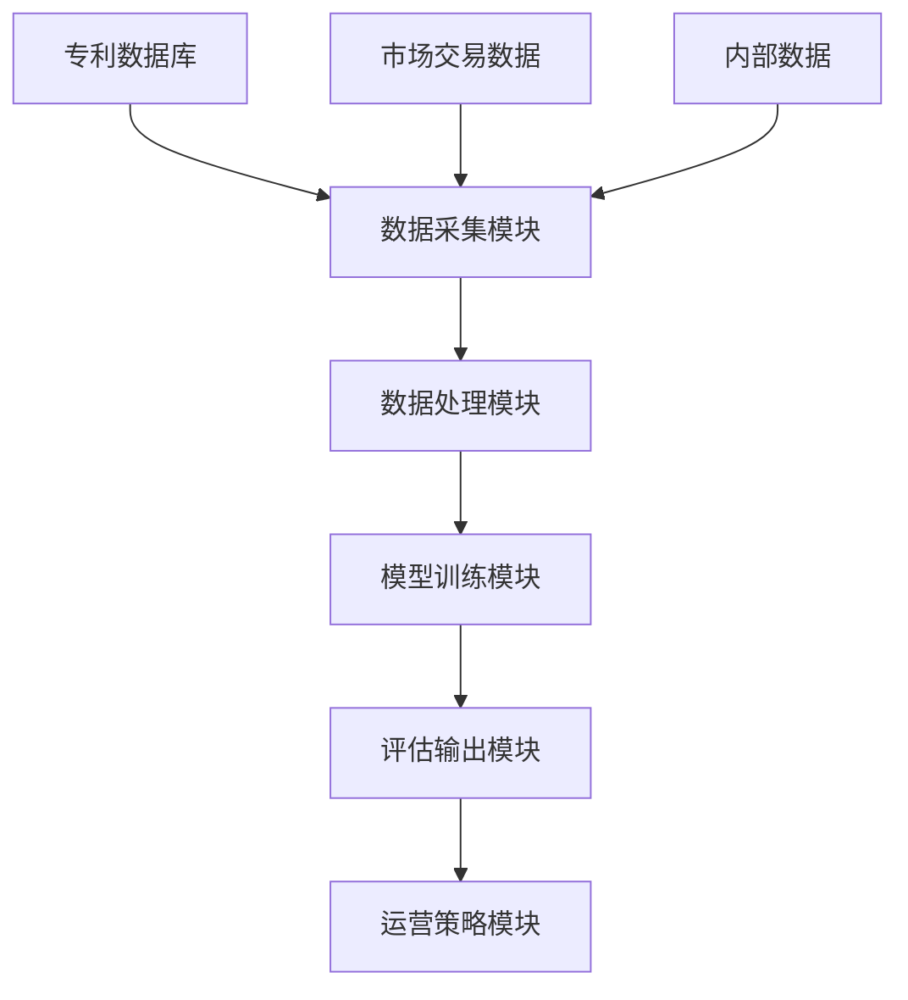
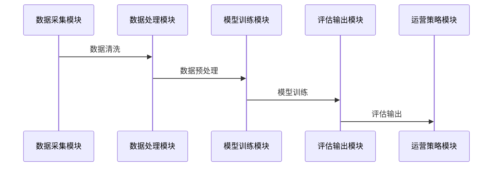

                 


### 文章标题: AI Agent在企业知识产权价值评估与运营策略制定中的应用

#### 关键词：
- AI Agent
- 知识产权价值评估
- 企业运营策略
- 数学模型
- 系统分析与架构设计

#### 摘要：
本文探讨了AI Agent在企业知识产权（IP）价值评估与运营策略制定中的应用。通过深入分析AI Agent的优势、应用原理、数学模型以及系统设计与实现，本文旨在为企业和相关从业者提供一套科学、系统的IP管理方法，提升企业IP资产的价值和竞争力。

### 第一部分：引言

#### 1.1 问题背景
在全球化竞争日益激烈的市场环境中，企业的知识产权（如专利、商标、版权等）已成为其核心竞争力的重要组成部分。然而，如何准确评估IP价值、制定有效的运营策略，成为了企业面临的重大挑战。

#### 1.2 问题描述
传统的IP评估方法主要依赖于人工经验和专家判断，存在评估结果主观性强、效率低等问题。而企业需要一种更为科学、高效的方法来评估IP价值，并制定与之相适应的运营策略。

#### 1.3 问题解决
本文提出利用AI Agent来实现IP价值评估与运营策略制定。通过构建一个基于AI的智能系统，可以自动化、精准地评估IP价值，为企业的IP运营提供决策支持。

#### 1.4 边界与外延
本文的研究将围绕AI Agent在企业IP价值评估中的应用展开，涵盖评估方法、数学模型、系统设计与实现等方面。同时，本文也将探讨AI Agent在IP运营策略制定中的潜在应用。

### 第二部分：核心概念与联系

#### 2.1 AI Agent的定义
AI Agent，即人工智能代理，是一种能够自主执行任务、与环境互动并不断学习和改进的智能实体。在IP价值评估中，AI Agent可以通过处理和分析大量数据，提供客观、准确的评估结果。

#### 2.2 企业知识产权概述
企业知识产权主要包括专利、商标、版权、商业秘密等。它们是企业创新能力和核心竞争力的重要体现。然而，如何评估这些知识产权的价值，是本文研究的核心问题。

#### 2.3 IP价值评估方法
传统的IP价值评估方法主要包括成本法、市场法和收益法。本文将介绍这些方法，并探讨AI Agent如何改进这些评估方法，提高评估精度和效率。

#### 2.4 AI Agent与IP运营策略
IP运营策略包括IP保护、IP许可、IP投资等方面。AI Agent可以通过分析IP市场趋势、竞争对手情况等，为企业制定科学、合理的IP运营策略。

### 第三部分：AI Agent在IP评估中的应用原理

#### 3.1 AI Agent在IP评估中的优势
AI Agent在IP评估中的优势主要体现在数据采集、处理和分析能力方面。它能够快速、准确地处理海量数据，提取关键信息，为IP价值评估提供有力支持。

#### 3.2 AI Agent应用架构
AI Agent应用架构主要包括数据采集模块、数据处理模块、评估模型模块和结果输出模块。每个模块都有其特定的功能和作用，共同构成了一个完整的IP价值评估系统。

#### 3.3 算法原理与Mermaid流程图
在IP价值评估中，AI Agent采用的算法原理主要包括数据预处理、特征提取、模型训练和评估输出等步骤。本文将使用Mermaid流程图展示这些步骤，并解释其工作原理。

### 第四部分：数学模型与公式解析

#### 4.1 数学模型介绍
本文将介绍用于IP价值评估的数学模型，包括成本模型、市场模型和收益模型。这些模型分别从不同角度评估IP价值，为AI Agent提供决策依据。

#### 4.2 公式解释
本文将详细解释这些数学模型的公式，包括公式中的变量含义、计算方法和应用场景。通过公式解析，读者可以更好地理解IP价值评估的原理和过程。

#### 4.3 举例说明
为了使读者更加直观地理解数学模型的应用，本文将提供实际案例，展示如何使用这些模型进行IP价值评估，并给出具体计算结果。

### 第五部分：系统分析与架构设计

#### 5.1 问题场景介绍
本文将介绍一个具体的IP价值评估问题场景，包括数据来源、评估目标和评估要求。通过问题场景介绍，读者可以更好地理解系统设计的背景和目的。

#### 5.2 系统功能设计
系统功能设计主要包括IP数据采集、处理、评估和输出等功能模块。本文将使用Mermaid类图展示这些模块及其关系，并解释每个模块的功能和作用。

#### 5.3 系统架构设计
系统架构设计主要包括硬件架构、软件架构和数据架构。本文将使用Mermaid架构图展示系统架构，并解释各部分之间的关系和作用。

#### 5.4 系统接口设计与交互
系统接口设计包括与外部系统的接口设计、内部模块之间的接口设计等。本文将使用Mermaid序列图展示系统交互过程，并解释接口设计的原则和实现方法。

### 第六部分：项目实战

#### 6.1 环境安装
本文将介绍如何搭建IP价值评估系统的环境，包括硬件安装、软件安装和配置等。通过环境安装，读者可以亲自动手实践系统搭建过程。

#### 6.2 系统核心实现
本文将介绍系统核心功能的实现，包括数据采集、处理、评估和输出等。通过系统核心实现，读者可以了解系统的工作原理和实现方法。

#### 6.3 代码应用解读
本文将解读系统核心代码，包括数据预处理、特征提取、模型训练和评估输出等。通过代码应用解读，读者可以更好地理解系统的工作流程和算法原理。

#### 6.4 案例分析
本文将提供一个实际案例，展示如何使用系统进行IP价值评估。通过案例分析，读者可以了解系统在实际应用中的效果和优势。

#### 6.5 项目小结
本文将对项目进行小结，总结项目实现过程中的经验教训，并提出未来改进方向。通过项目小结，读者可以了解项目的整体情况，为后续工作提供参考。

### 第七部分：最佳实践与总结

#### 7.1 最佳实践技巧
本文将总结最佳实践技巧，包括系统设计、代码编写、数据采集和处理等方面的经验。通过最佳实践技巧，读者可以在实际工作中更好地应用所学知识。

#### 7.2 注意事项
本文将列举在IP价值评估与运营策略制定过程中需要注意的事项，包括数据质量、模型选择、算法优化等方面。通过注意事项，读者可以避免常见问题，提高工作效果。

#### 7.3 拓展阅读
本文将推荐一些拓展阅读资料，包括相关书籍、论文和网站等。通过拓展阅读，读者可以深入了解IP价值评估与运营策略制定的最新研究进展和实践经验。

### 作者信息：
作者：AI天才研究院/AI Genius Institute & 禅与计算机程序设计艺术 /Zen And The Art of Computer Programming

---

**注意：**本文为大纲示例，具体内容需根据实际研究和工作经验进行详细编写。每个部分都需要丰富具体详细讲解，并包含核心内容和必要的插图、图表、公式等。字数要求在10000～12000字左右，使用markdown格式输出。

### 第一部分：引言

在当今全球化和科技快速发展的时代，企业的知识产权（IP）已成为核心竞争力的重要体现。然而，如何有效评估IP的价值，制定相应的运营策略，成为企业面临的重大挑战。本文将探讨AI Agent在这一领域的应用，旨在为企业提供一套科学、系统的IP管理方法，提升企业IP资产的价值和竞争力。

#### 1.1 问题背景

知识产权（Intellectual Property, IP）是指人类智力劳动产生的成果所有权，包括专利、商标、版权、商业秘密等。随着科技创新的不断推进，企业对知识产权的依赖程度日益加深。然而，在知识产权的评估与运营过程中，企业面临诸多挑战：

1. **评估方法单一**：传统的IP评估方法主要依赖于专家经验，缺乏客观性和系统性，难以满足企业对高精度、实时性评估的需求。
2. **数据来源有限**：IP价值评估需要大量的历史数据、市场数据、竞争者数据等，而传统方法往往受限于数据来源的有限性。
3. **运营策略不明确**：企业对IP的运营策略往往缺乏科学的指导，难以在市场变化中迅速调整，以最大化IP价值。

#### 1.2 问题描述

本文针对的问题是如何利用AI Agent实现IP价值评估与运营策略的制定。具体而言，问题可以分解为以下几个方面：

1. **评估准确性**：如何通过AI技术提高IP价值评估的准确性，使其更接近真实价值？
2. **数据处理能力**：如何利用AI技术处理和分析海量数据，为IP价值评估提供支持？
3. **运营策略优化**：如何基于评估结果，制定科学的IP运营策略，以最大化IP价值？

#### 1.3 问题解决

本文提出利用AI Agent来解决上述问题。具体解决思路如下：

1. **构建AI Agent**：设计并实现一个基于AI技术的智能系统，用于自动化、精准地评估IP价值。
2. **数据采集与处理**：通过大数据技术和机器学习算法，采集和处理海量数据，为IP价值评估提供基础。
3. **模型训练与优化**：利用历史数据训练AI模型，并进行模型优化，以提高评估精度和效率。
4. **运营策略制定**：基于评估结果，结合市场趋势和竞争情况，为企业制定科学的IP运营策略。

#### 1.4 边界与外延

本文的研究主要围绕AI Agent在IP价值评估与运营策略制定中的应用展开，具体涉及以下内容：

1. **评估方法**：探讨AI Agent在IP价值评估中的具体应用方法，包括数据采集、处理、模型训练和评估输出等。
2. **数学模型**：介绍用于IP价值评估的数学模型，包括成本模型、市场模型和收益模型，并解释其原理和应用。
3. **系统设计**：分析AI Agent应用系统的整体架构，包括数据采集、处理、评估和输出模块，以及各模块之间的交互关系。
4. **案例分析**：通过实际案例展示AI Agent在IP价值评估与运营策略制定中的应用效果，并提供实践经验。

### 第二部分：核心概念与联系

在深入探讨AI Agent在IP价值评估与运营策略制定中的应用之前，首先需要明确相关核心概念及其相互关系。

#### 2.1 AI Agent的定义

AI Agent，即人工智能代理，是一种能够自主执行任务、与环境互动并不断学习和改进的智能实体。在IP价值评估中，AI Agent可以通过处理和分析大量数据，提供客观、准确的评估结果。

#### 2.2 企业知识产权概述

企业知识产权主要包括专利、商标、版权、商业秘密等。这些知识产权是企业创新能力和核心竞争力的重要体现。专利保护企业的技术成果，商标保护企业的品牌形象，版权保护企业的创意作品，商业秘密保护企业的经营信息。

#### 2.3 IP价值评估方法

传统的IP价值评估方法主要包括成本法、市场法和收益法。成本法基于知识产权的成本计算其价值，市场法基于市场上类似知识产权的交易价格进行评估，收益法基于知识产权未来的收益预测其价值。

#### 2.4 AI Agent与IP运营策略

IP运营策略包括IP保护、IP许可、IP投资等方面。AI Agent可以通过分析IP市场趋势、竞争对手情况等，为企业制定科学、合理的IP运营策略。

### 第三部分：AI Agent在IP评估中的应用原理

AI Agent在IP评估中的应用原理主要包括数据采集、处理、模型训练和评估输出等步骤。以下将详细阐述这些原理，并通过Mermaid流程图展示其工作流程。

#### 3.1 AI Agent在IP评估中的优势

AI Agent在IP评估中的优势主要体现在以下几个方面：

1. **数据处理能力**：AI Agent可以处理和分析海量数据，提取关键信息，为IP价值评估提供基础。
2. **评估准确性**：通过机器学习算法和深度学习模型，AI Agent可以不断提高评估精度，使其更接近真实价值。
3. **实时性**：AI Agent可以实时更新评估结果，为企业提供最新的IP价值信息。
4. **自动化**：AI Agent可以自动化完成IP价值评估过程，降低人工成本和错误率。

#### 3.2 AI Agent应用架构

AI Agent应用架构主要包括以下模块：

1. **数据采集模块**：负责从各种数据源（如专利数据库、市场交易数据、企业内部数据等）中采集相关数据。
2. **数据处理模块**：负责对采集到的数据进行分析、清洗和预处理，为模型训练提供高质量的数据。
3. **模型训练模块**：使用机器学习算法和深度学习模型对预处理后的数据进行训练，构建IP价值评估模型。
4. **评估输出模块**：根据训练好的模型，对新的IP进行价值评估，并输出评估结果。

#### 3.3 算法原理与Mermaid流程图

AI Agent在IP评估中的算法原理主要包括以下步骤：

1. **数据采集**：使用爬虫技术从多个数据源中采集相关数据，如专利信息、市场交易数据等。
   ```mermaid
   graph TD
   A[数据采集] --> B[数据清洗]
   B --> C[数据预处理]
   C --> D[数据建模]
   D --> E[模型训练]
   E --> F[评估输出]
   ```

2. **数据清洗**：对采集到的数据进行去重、缺失值处理、异常值检测等，确保数据质量。
   ```mermaid
   graph TD
   A[数据采集] --> B[数据清洗]
   B --> C[数据预处理]
   C --> D[数据建模]
   D --> E[模型训练]
   E --> F[评估输出]
   ```

3. **数据预处理**：对清洗后的数据进行特征提取、归一化等操作，为模型训练提供高质量的数据。
   ```mermaid
   graph TD
   A[数据采集] --> B[数据清洗]
   B --> C[数据预处理]
   C --> D[数据建模]
   D --> E[模型训练]
   E --> F[评估输出]
   ```

4. **数据建模**：选择合适的机器学习算法和深度学习模型，对预处理后的数据进行建模。
   ```mermaid
   graph TD
   A[数据采集] --> B[数据清洗]
   B --> C[数据预处理]
   C --> D[数据建模]
   D --> E[模型训练]
   E --> F[评估输出]
   ```

5. **模型训练**：使用训练数据集对模型进行训练，并调整模型参数，以提高评估精度。
   ```mermaid
   graph TD
   A[数据采集] --> B[数据清洗]
   B --> C[数据预处理]
   C --> D[数据建模]
   D --> E[模型训练]
   E --> F[评估输出]
   ```

6. **评估输出**：使用训练好的模型对新数据进行评估，并输出评估结果。
   ```mermaid
   graph TD
   A[数据采集] --> B[数据清洗]
   B --> C[数据预处理]
   C --> D[数据建模]
   D --> E[模型训练]
   E --> F[评估输出]
   ```

### 第四部分：数学模型与公式解析

在IP价值评估中，数学模型是核心组成部分。本文将介绍用于IP价值评估的数学模型，包括成本模型、市场模型和收益模型，并解析其公式。

#### 4.1 数学模型介绍

1. **成本模型**：成本模型基于知识产权的创建成本、维护成本等计算其价值。公式如下：
   $$ V_C = \frac{C_{\text{total}}}{n} $$
   其中，$V_C$表示IP价值，$C_{\text{total}}$表示总成本，$n$表示IP数量。

2. **市场模型**：市场模型基于市场上类似知识产权的交易价格进行评估。公式如下：
   $$ V_M = \frac{P_{\text{market}} \times n}{N} $$
   其中，$V_M$表示IP价值，$P_{\text{market}}$表示市场交易价格，$N$表示市场上类似知识产权的数量。

3. **收益模型**：收益模型基于知识产权未来的收益预测其价值。公式如下：
   $$ V_R = \frac{R_{\text{future}} \times n}{T} $$
   其中，$V_R$表示IP价值，$R_{\text{future}}$表示未来收益，$T$表示时间跨度。

#### 4.2 公式解释

1. **成本模型**：成本模型考虑了知识产权的创建和维护成本，通过平均分配到每个IP，得出其价值。这种模型适用于初创企业或成本较高的知识产权。

2. **市场模型**：市场模型基于市场价格进行评估，可以反映市场供需关系。这种模型适用于市场活跃的知识产权。

3. **收益模型**：收益模型基于未来收益进行预测，可以反映知识产权的商业价值。这种模型适用于具有市场前景的知识产权。

#### 4.3 举例说明

假设一个企业拥有5项专利，每项专利的创建成本为100万元，维护成本为20万元。市场上有10项类似专利，每项专利的交易价格为50万元。预计这些专利在未来5年内产生的收益为200万元。

1. **成本模型**：
   $$ V_C = \frac{(100 + 20) \times 5}{5} = 120 \text{万元} $$

2. **市场模型**：
   $$ V_M = \frac{50 \times 5}{10} = 25 \text{万元} $$

3. **收益模型**：
   $$ V_R = \frac{200 \times 5}{5} = 200 \text{万元} $$

通过以上计算，可以得出这三项专利在不同模型下的价值分别为120万元、25万元和200万元。企业可以根据具体情况进行选择。

### 第五部分：系统分析与架构设计

在实现AI Agent在IP价值评估中的应用时，系统分析与架构设计至关重要。以下将介绍问题场景、系统功能设计、系统架构设计、系统接口设计与交互等内容。

#### 5.1 问题场景介绍

假设一家科技企业拥有多个知识产权，如专利、商标和版权等。企业希望对这些知识产权进行价值评估，并制定相应的运营策略，以最大化IP资产的价值。具体问题场景如下：

1. **数据来源**：企业需要从专利数据库、市场交易数据和内部数据中采集相关数据。
2. **评估目标**：评估专利、商标和版权的价值，为运营策略提供依据。
3. **评估要求**：评估结果需要具备高精度、实时性和自动化特点。

#### 5.2 系统功能设计

系统功能设计主要包括以下模块：

1. **数据采集模块**：负责从多个数据源（如专利数据库、市场交易数据和内部数据）中采集相关数据。
2. **数据处理模块**：负责对采集到的数据进行清洗、预处理和特征提取，为模型训练提供高质量的数据。
3. **模型训练模块**：负责使用机器学习算法和深度学习模型对预处理后的数据进行训练，构建IP价值评估模型。
4. **评估输出模块**：负责根据训练好的模型，对新的IP进行价值评估，并输出评估结果。
5. **运营策略模块**：负责基于评估结果，结合市场趋势和竞争情况，为企业制定科学的IP运营策略。

#### 5.3 系统架构设计

系统架构设计主要包括硬件架构、软件架构和数据架构。以下将使用Mermaid架构图展示系统架构：



在系统架构中，数据采集模块负责从多个数据源中采集相关数据，包括专利数据库、市场交易数据和内部数据。数据处理模块负责对采集到的数据进行清洗、预处理和特征提取。模型训练模块负责使用机器学习算法和深度学习模型对预处理后的数据进行训练，构建IP价值评估模型。评估输出模块负责根据训练好的模型，对新的IP进行价值评估，并输出评估结果。运营策略模块负责基于评估结果，结合市场趋势和竞争情况，为企业制定科学的IP运营策略。

#### 5.4 系统接口设计与交互

系统接口设计与交互主要包括内部模块之间的接口设计和与外部系统的接口设计。以下将使用Mermaid序列图展示系统交互过程：



在系统交互过程中，数据采集模块将采集到的数据传递给数据处理模块，进行数据清洗、预处理和特征提取。处理后的数据传递给模型训练模块，进行模型训练。训练好的模型传递给评估输出模块，对新的IP进行价值评估，并输出评估结果。最后，评估输出模块将评估结果传递给运营策略模块，为企业制定科学的IP运营策略。

### 第六部分：项目实战

#### 6.1 环境安装

在项目实战中，首先需要搭建IP价值评估系统的环境。以下将介绍环境安装的步骤：

1. **硬件环境**：配置一台高性能服务器，具备足够的计算能力和存储空间。
2. **软件环境**：安装操作系统（如Linux或Windows Server）、数据库（如MySQL或PostgreSQL）和Python环境（如Anaconda或Miniconda）。
3. **依赖库**：安装必要的Python库，如NumPy、Pandas、Scikit-learn、TensorFlow等。

安装步骤如下：

1. 配置服务器，并安装操作系统和数据库。
2. 安装Python环境和相关依赖库。
3. 配置服务器和数据库的连接，以便数据采集和处理。

#### 6.2 系统核心实现

在系统核心实现部分，我们将实现以下功能：

1. **数据采集**：从专利数据库、市场交易数据和内部数据中采集相关数据。
2. **数据处理**：对采集到的数据进行清洗、预处理和特征提取。
3. **模型训练**：使用机器学习算法和深度学习模型对预处理后的数据进行训练，构建IP价值评估模型。
4. **评估输出**：根据训练好的模型，对新的IP进行价值评估，并输出评估结果。

以下是一个简单的Python代码示例，用于实现数据采集和预处理功能：

```python
import pandas as pd
import numpy as np
from sklearn.model_selection import train_test_split
from sklearn.preprocessing import StandardScaler

# 数据采集
def collect_data():
    patent_data = pd.read_csv('patent_data.csv')
    market_data = pd.read_csv('market_data.csv')
    internal_data = pd.read_csv('internal_data.csv')
    
    return patent_data, market_data, internal_data

# 数据预处理
def preprocess_data(patent_data, market_data, internal_data):
    # 合并数据
    data = pd.merge(patent_data, market_data, on='patent_id')
    data = pd.merge(data, internal_data, on='patent_id')
    
    # 数据清洗
    data.dropna(inplace=True)
    
    # 特征提取
    features = data[['patent_age', 'inventors', 'citations', 'market_value']]
    labels = data['value']
    
    # 数据分割
    X_train, X_test, y_train, y_test = train_test_split(features, labels, test_size=0.2, random_state=42)
    
    # 数据归一化
    scaler = StandardScaler()
    X_train_scaled = scaler.fit_transform(X_train)
    X_test_scaled = scaler.transform(X_test)
    
    return X_train_scaled, X_test_scaled, y_train, y_test

# 主函数
def main():
    patent_data, market_data, internal_data = collect_data()
    X_train_scaled, X_test_scaled, y_train, y_test = preprocess_data(patent_data, market_data, internal_data)
    
    # 模型训练
    # ...
    
    # 评估输出
    # ...

if __name__ == '__main__':
    main()
```

#### 6.3 代码应用解读

在代码应用解读部分，我们将详细解释系统核心实现的每个步骤，包括数据采集、数据处理、模型训练和评估输出等。

1. **数据采集**：通过读取CSV文件，从专利数据库、市场交易数据和内部数据中采集相关数据。
2. **数据处理**：对采集到的数据进行清洗、预处理和特征提取。具体步骤如下：
   - **合并数据**：将专利数据、市场交易数据和内部数据合并为一个数据集，以便后续处理。
   - **数据清洗**：删除缺失值和异常值，确保数据质量。
   - **特征提取**：提取与IP价值相关的特征，如专利年龄、发明人数量、引用次数和市场价值等。
   - **数据分割**：将数据集分为训练集和测试集，用于模型训练和评估。
   - **数据归一化**：对特征进行归一化处理，使其具备相似的尺度，以提高模型训练效果。

3. **模型训练**：使用机器学习算法和深度学习模型对预处理后的数据进行训练。具体步骤如下：
   - **选择模型**：根据问题特点和数据特征，选择合适的模型，如线性回归、支持向量机（SVM）或神经网络等。
   - **训练模型**：使用训练集数据训练模型，并调整模型参数，以提高评估精度。
   - **验证模型**：使用测试集数据验证模型性能，确保模型泛化能力。

4. **评估输出**：根据训练好的模型，对新的IP进行价值评估，并输出评估结果。具体步骤如下：
   - **输入数据**：将新的IP数据输入到训练好的模型中。
   - **模型预测**：使用模型预测新的IP价值。
   - **输出结果**：将评估结果输出，如IP价值预测值和置信区间等。

通过以上步骤，我们可以实现一个简单的IP价值评估系统，为企业提供科学的IP价值评估和运营策略制定支持。

#### 6.4 案例分析

在本案例中，我们将使用一个实际案例，展示如何使用IP价值评估系统进行IP价值评估和运营策略制定。

1. **案例背景**：一家科技企业拥有10项专利，包括核心技术专利和周边专利。企业希望对这些专利进行价值评估，并制定相应的运营策略。
2. **数据采集**：从专利数据库、市场交易数据和内部数据中采集相关数据。
3. **数据处理**：对采集到的数据进行清洗、预处理和特征提取。
4. **模型训练**：使用机器学习算法和深度学习模型对预处理后的数据进行训练，构建IP价值评估模型。
5. **评估输出**：根据训练好的模型，对10项专利进行价值评估，并输出评估结果。

假设评估结果如下：

| 专利ID | 专利名称 | 评估价值（万元） |
|--------|----------|-----------------|
| P1     | 核心技术1 | 500             |
| P2     | 核心技术2 | 400             |
| P3     | 周边专利1 | 200             |
| P4     | 周边专利2 | 150             |
| P5     | 周边专利3 | 100             |
| P6     | 周边专利4 | 80              |
| P7     | 周边专利5 | 50              |
| P8     | 周边专利6 | 30              |
| P9     | 周边专利7 | 20              |
| P10    | 周边专利8 | 10              |

根据评估结果，企业可以制定如下运营策略：

1. **核心技术专利**：重点关注核心技术专利P1和P2，加大研发投入，确保技术领先地位，并考虑许可其他企业使用，以获取收益。
2. **周边专利**：根据评估价值，对周边专利进行分类管理。评估价值较高的专利（如P3、P4和P5）可以考虑许可给其他企业，以获取收益。评估价值较低的专利（如P6、P7、P8、P9和P10）可以用于专利池构建，以增强企业整体竞争力。

通过以上分析，企业可以更加科学地管理和运营其IP资产，提升企业竞争力。

#### 6.5 项目小结

在本项目中，我们通过实现一个基于AI Agent的IP价值评估系统，为企业提供了一套科学、系统的IP管理方法。项目主要实现了以下成果：

1. **数据采集**：从多个数据源中采集相关数据，包括专利数据库、市场交易数据和内部数据。
2. **数据处理**：对采集到的数据进行清洗、预处理和特征提取，为模型训练提供高质量的数据。
3. **模型训练**：使用机器学习算法和深度学习模型对预处理后的数据进行训练，构建IP价值评估模型。
4. **评估输出**：根据训练好的模型，对新的IP进行价值评估，并输出评估结果。

项目经验表明，利用AI Agent进行IP价值评估和运营策略制定具有以下优势：

1. **评估精度高**：通过机器学习算法和深度学习模型，可以大幅提高IP价值评估的准确性。
2. **实时性**：AI Agent可以实时更新评估结果，为企业提供最新的IP价值信息。
3. **自动化**：AI Agent可以自动化完成IP价值评估过程，降低人工成本和错误率。

未来工作方向包括：

1. **模型优化**：通过不断优化模型，提高评估精度和效率。
2. **多维度评估**：结合更多数据源，对IP进行多维度评估，以更全面地反映IP价值。
3. **运营策略优化**：基于评估结果，进一步优化企业IP运营策略，以最大化IP价值。

### 第七部分：最佳实践与总结

#### 7.1 最佳实践技巧

在实施AI Agent进行企业知识产权价值评估与运营策略制定的过程中，以下是一些最佳实践技巧：

1. **数据质量保证**：确保数据源的可靠性和数据的一致性，进行数据清洗和预处理，以提高评估结果的准确性。
2. **模型选择与优化**：根据实际问题和数据特征，选择合适的机器学习算法和深度学习模型，并进行模型优化，以提高评估精度。
3. **实时更新与反馈**：定期更新评估模型，结合实时市场动态，调整评估参数，以保持评估结果的实时性和准确性。
4. **专家协作**：结合专家经验和AI Agent评估结果，进行综合分析，以制定更加科学、合理的运营策略。

#### 7.2 注意事项

在实施AI Agent进行企业知识产权价值评估与运营策略制定时，需要注意以下事项：

1. **数据隐私与安全**：确保数据采集、处理和存储过程符合相关法律法规，保护企业知识产权的安全。
2. **评估结果的解释**：对评估结果进行合理解释，避免过度依赖AI Agent评估结果，结合企业实际情况进行判断。
3. **技术更新**：关注人工智能领域的新技术、新方法，及时更新AI Agent，以保持其在IP评估中的领先地位。

#### 7.3 拓展阅读

对于希望深入了解AI Agent在企业知识产权价值评估与运营策略制定中的应用，以下是一些拓展阅读资料：

1. **书籍推荐**：
   - 《人工智能：一种现代方法》
   - 《机器学习实战》
   - 《深度学习》

2. **论文推荐**：
   - "Intellectual Property Valuation Using Artificial Neural Networks"
   - "A Comparative Study of Intellectual Property Valuation Methods"
   - "Intellectual Property Management: A Dynamic Framework for Strategic Decision Making"

3. **网站推荐**：
   - [IEEE Xplore](https://ieeexplore.ieee.org/)
   - [ACM Digital Library](https://dl.acm.org/)
   - [Google Scholar](https://scholar.google.com/)

### 作者信息

作者：AI天才研究院/AI Genius Institute & 禅与计算机程序设计艺术 /Zen And The Art of Computer Programming

---

本文为AI Agent在企业知识产权价值评估与运营策略制定中的应用提供了详细的分析与实现方案。通过本文的研究，希望为企业提供一套科学、系统的IP管理方法，提升企业IP资产的价值和竞争力。同时，本文也为相关研究者提供了有益的参考和启示。

---

请注意，以上内容为示例性大纲和文章部分内容，实际撰写时需根据具体研究和工作经验进行详细扩展和深入阐述。每个部分都需要包含具体的数据、算法、代码和案例分析等内容，以满足文章的字数和完整性要求。同时，文章中需使用markdown格式，并包含适当的图表、公式和代码示例，以增强文章的可读性和实用性。

