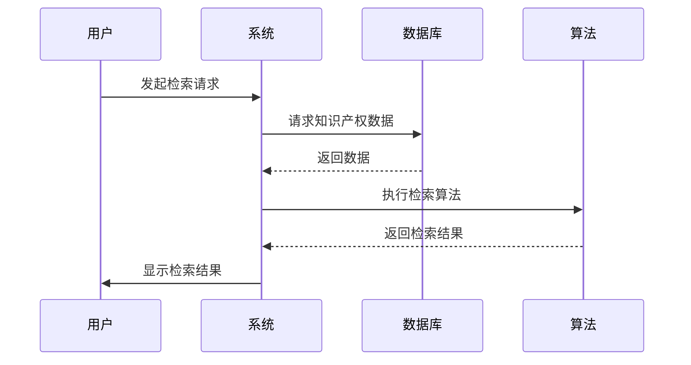
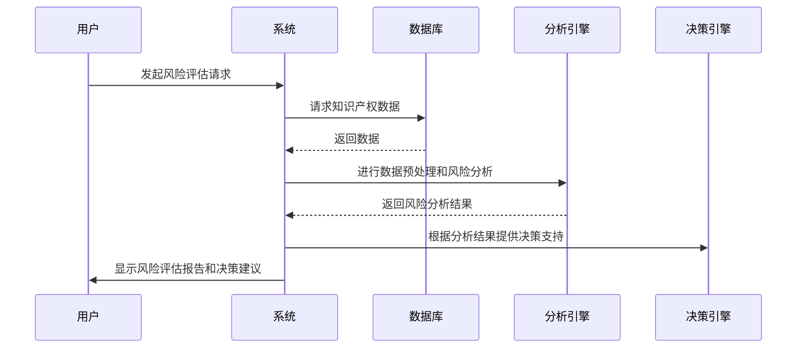
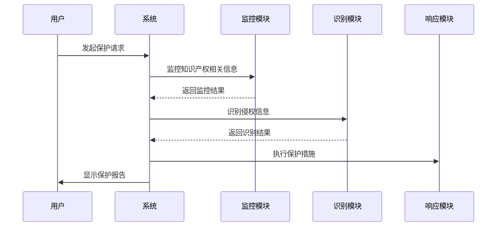
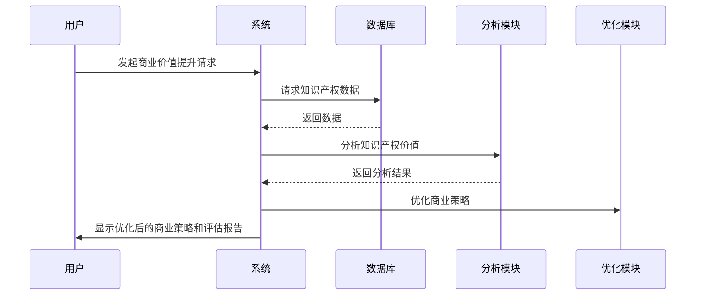

                 

### 文章标题

### 文章关键词

### 摘要

#### 引言

在当今这个高度信息化、全球化的商业环境中，企业的知识产权（Intellectual Property, IP）已经成为其核心竞争力的关键组成部分。知识产权不仅包括专利、商标、版权等传统形式，还涵盖了越来越多的商业秘密、技术秘密等无形资产。有效的知识产权管理对于企业创新、市场扩展和长期发展具有至关重要的作用。然而，随着知识产权种类的增多和复杂性的提升，传统的管理方法已经难以应对日益增长的挑战。人工智能（Artificial Intelligence, AI）的崛起为知识产权管理带来了新的契机，特别是AI Agent——一种能够模拟人类智能行为的自动化系统，其在企业知识产权价值链管理中的应用日益受到关注。

本文将围绕AI Agent在企业知识产权价值链管理中的应用进行深入探讨。首先，我们将介绍AI Agent和知识产权管理的基础知识，明确两者的基本概念、联系及应用前景。随后，本文将详细分析AI Agent在知识产权检索、风险评估、保护以及商业价值提升等方面的具体应用，通过算法原理讲解、系统架构设计、项目实战等环节，展示AI Agent在实际操作中的优势和价值。最后，我们将总结AI Agent在知识产权管理中的最佳实践，并展望其未来的发展趋势。

通过本文的阅读，读者将了解到AI Agent在企业知识产权价值链管理中的实际应用案例，掌握其技术原理和实践方法，为企业在知识产权管理领域实现智能化转型提供有益的参考。

#### 关键词

人工智能，AI Agent，企业知识产权，价值链管理，知识产权检索，风险评估，知识产权保护，商业价值提升，系统架构设计，项目实战

#### 摘要

本文以人工智能（AI）为切入点，探讨了AI Agent在企业知识产权价值链管理中的应用。首先，介绍了AI Agent和知识产权管理的基础知识，明确了两者之间的联系和应用前景。接着，本文详细分析了AI Agent在知识产权检索、风险评估、保护以及商业价值提升等方面的具体应用，通过算法原理讲解、系统架构设计、项目实战等环节，展示了AI Agent在实际操作中的优势和价值。最后，总结了AI Agent在知识产权管理中的最佳实践，并展望了其未来的发展趋势。本文旨在为企业提供在知识产权管理领域实现智能化转型的思路和方法。

## AI Agent与知识产权管理基础

### AI Agent概述

人工智能（AI）技术已经深刻地改变了我们的生活方式和工作方式，从简单的自动化工具到复杂的决策支持系统，AI在各个领域的应用不断扩展。而AI Agent，作为人工智能的一种重要形式，更是以其自主性、智能性和适应性赢得了广泛关注。AI Agent，也称为智能代理，是指一种能够模拟人类智能行为，独立执行任务并与其他系统进行交互的自动化系统。

AI Agent的基本概念可以追溯到多代理系统（Multi-Agent Systems, MAS）理论。多代理系统由多个智能代理组成，这些代理可以独立或协作地执行任务，相互之间通过通信进行协调。AI Agent的基本特性包括：

1. **自主性**：AI Agent能够在没有外部直接控制的情况下自主决策和行动。
2. **社会性**：AI Agent可以与其他代理或人类进行交互，具备社会属性。
3. **反应性**：AI Agent能够根据外部环境和内部状态做出实时反应。
4. **预动性**：AI Agent能够预测环境变化并提前采取行动。

AI Agent的运作机制主要基于以下几个方面：

1. **感知系统**：AI Agent通过传感器或其他方式获取外部环境的信息。
2. **知识库**：AI Agent通过知识库存储和更新相关信息，包括先验知识和从感知系统获得的信息。
3. **推理引擎**：AI Agent利用推理引擎从知识库中提取信息，生成行动策略。
4. **动作系统**：AI Agent根据推理结果执行具体的行动。

### 企业知识产权价值链概述

企业知识产权价值链是指企业在其知识产权管理过程中所经历的各个环节，包括知识产权的创造、管理、应用和保护等。知识产权是企业的重要资产，有效的知识产权管理能够提升企业的市场竞争力，促进创新和可持续发展。

企业知识产权价值链的主要环节包括：

1. **知识产权创造**：通过研发和创新活动，企业产生新的专利、商标、版权等知识产权。
2. **知识产权管理**：对知识产权进行分类、登记、保护和维护，确保知识产权的有效性。
3. **知识产权应用**：将知识产权应用于产品开发、市场营销和业务拓展，实现知识产权的商业价值。
4. **知识产权保护**：通过法律手段和措施，防止知识产权被侵犯，维护企业的合法权益。

知识产权管理的核心目标包括：

1. **创新激励**：通过有效的知识产权管理，鼓励企业持续进行技术创新。
2. **市场保护**：通过知识产权保护，确保企业在市场竞争中的优势地位。
3. **价值最大化**：通过知识产权的有效应用，实现企业利益的最大化。

### AI Agent在知识产权管理中的应用前景

随着人工智能技术的不断发展，AI Agent在知识产权管理中的应用前景十分广阔。AI Agent可以协助企业在知识产权的各个管理环节中实现智能化和自动化，提高管理效率，降低运营成本。

AI Agent在知识产权管理中的应用前景包括以下几个方面：

1. **知识产权检索**：利用AI Agent进行高效的知识产权检索，快速发现和识别相关的专利、商标和版权信息。
2. **风险评估**：通过AI Agent对知识产权风险进行评估，提前识别潜在的法律风险和市场风险。
3. **知识产权保护**：利用AI Agent进行知识产权的自动化监控和保护，及时发现和处理侵权行为。
4. **商业价值提升**：通过AI Agent对知识产权的商业价值进行评估和提升，实现知识产权的优化利用。

AI Agent在知识产权管理中的应用，不仅能够提高企业知识产权管理的效率和质量，还能够为企业提供更加精准和全面的知识产权策略支持，助力企业在激烈的市场竞争中脱颖而出。

#### AI Agent与知识产权管理的联系

AI Agent在知识产权管理中的应用，不仅依赖于人工智能技术的成熟，也得益于知识产权管理自身的发展需求。AI Agent与知识产权管理之间的联系主要体现在以下几个方面：

首先，从技术层面来看，AI Agent的核心能力如感知、推理和行动，正好与知识产权管理的复杂性和动态性相匹配。知识产权管理涉及大量的信息处理、分析和决策，而AI Agent的智能性和自主性能够有效提升这些任务的执行效率。例如，在知识产权检索过程中，AI Agent可以通过自然语言处理（NLP）和机器学习（ML）技术，自动分析海量的专利、商标和版权信息，快速识别与企业知识产权相关的文献和案例。

其次，从应用层面来看，AI Agent在知识产权管理中的角色不仅仅是辅助工具，更是智能决策的推动者。传统知识产权管理依赖于人工判断和经验，而AI Agent能够通过大数据分析和智能算法，提供更加精准和客观的评估结果。例如，在知识产权风险评估中，AI Agent可以通过分析历史数据和实时信息，预测知识产权可能面临的风险，并提供相应的风险控制策略。

第三，从管理层面来看，AI Agent的引入能够显著提高知识产权管理的效率和规范性。知识产权管理涉及到多个部门和环节，而AI Agent可以通过自动化流程和智能协调，实现跨部门的高效协作。例如，在知识产权申请过程中，AI Agent可以自动化处理各种行政和法律流程，减少人为错误和延误。

最后，从战略层面来看，AI Agent在知识产权管理中的应用有助于企业构建更加智能和灵活的知识管理体系。企业可以通过AI Agent实时监控知识产权的市场动态和竞争态势，快速调整知识产权策略，以应对市场变化。例如，在知识产权的商业价值提升过程中，AI Agent可以通过市场分析和需求预测，为企业提供优化知识产权组合的建议，从而实现知识产权的最大化利用。

总之，AI Agent与知识产权管理之间的联系不仅体现在技术和应用层面，更体现在管理和战略层面。通过引入AI Agent，企业能够在知识产权管理中实现智能化和自动化，提高管理效率和质量，为企业的创新和可持续发展提供强有力的支持。

#### 概念结构与核心要素组成

要深入理解AI Agent在企业知识产权价值链管理中的应用，我们首先需要明确相关的核心概念和要素。以下是本文中涉及的主要概念及其属性特征对比，以及相应的ER实体关系图架构。

### 核心概念

1. **AI Agent**：
   - **属性**：自主性、社会性、反应性、预动性
   - **特征对比**：与其他自动化系统（如机器人流程自动化RPA）相比，AI Agent具备更高的智能性和自主决策能力。

2. **知识产权**：
   - **属性**：专利、商标、版权、商业秘密
   - **特征对比**：不同类型的知识产权具有不同的法律保护和期限，专利保护期限最长，商业秘密保护期限最不明确。

3. **知识产权管理**：
   - **属性**：知识产权的创造、管理、应用、保护
   - **特征对比**：知识产权管理涉及多个环节，每个环节都要求精确的操作和策略。

4. **知识产权检索**：
   - **属性**：检索专利、商标、版权信息
   - **特征对比**：不同类型的知识产权检索方式和数据库有所不同，例如，专利检索主要依赖专利数据库。

5. **风险评估**：
   - **属性**：识别知识产权风险
   - **特征对比**：风险评估包括法律风险、市场风险和技术风险，每个类型的风险评估方法不同。

6. **知识产权保护**：
   - **属性**：防止知识产权被侵犯
   - **特征对比**：保护措施包括法律诉讼、合同签订和监控侵权行为等。

7. **商业价值提升**：
   - **属性**：最大化知识产权的商业价值
   - **特征对比**：商业价值提升的方法包括知识产权许可、转让和诉讼等。

### ER实体关系图架构

以下是企业知识产权管理中涉及的实体及其关系的Mermaid流程图：

```mermaid
entityRelation
  entity "AI Agent" {
    "感知系统"
    "知识库"
    "推理引擎"
    "动作系统"
  }
  entity "知识产权" {
    "专利"
    "商标"
    "版权"
    "商业秘密"
  }
  entity "知识产权管理" {
    "知识产权创造"
    "知识产权管理"
    "知识产权应用"
    "知识产权保护"
  }
  entity "知识产权检索" {
    "专利检索"
    "商标检索"
    "版权检索"
  }
  entity "风险评估" {
    "法律风险评估"
    "市场风险评估"
    "技术风险评估"
  }
  entity "知识产权保护" {
    "法律诉讼"
    "合同签订"
    "监控侵权"
  }
  entity "商业价值提升" {
    "知识产权许可"
    "知识产权转让"
    "知识产权诉讼"
  }
  "AI Agent" -- "知识库";
  "AI Agent" -- "推理引擎";
  "AI Agent" -- "动作系统";
  "知识产权" -- "知识产权管理";
  "知识产权检索" -- "知识产权管理";
  "风险评估" -- "知识产权管理";
  "知识产权保护" -- "知识产权管理";
  "商业价值提升" -- "知识产权管理";
```

通过上述核心概念和ER实体关系图，我们可以更清晰地理解AI Agent在企业知识产权价值链管理中的位置和作用。AI Agent作为智能核心，贯穿于知识产权的创造、管理、应用和保护等各个环节，通过自动化和智能化的手段，提升知识产权管理的效率和质量。

#### 第3章: AI Agent在知识产权检索中的应用

#### 知识产权检索的基本概念

知识产权检索是指通过特定的检索工具和方法，从海量的知识产权信息中快速准确地查找和获取所需信息的过程。知识产权检索涵盖了专利、商标、版权等不同类型的知识产权，每种类型的检索方法和数据库都有所不同。专利检索主要依赖于专利数据库，如美国专利和商标局（USPTO）、欧洲专利局（EPO）和中国国家知识产权局（CNIPA）的数据库；商标检索则主要通过商标数据库，如美国专利商标局（USPTO）的商标数据库和世界知识产权组织（WIPO）的商标数据库；版权检索通常使用在线版权数据库和文学数据库。

知识产权检索的重要性体现在以下几个方面：

1. **创新保护**：通过检索已有的知识产权，企业可以避免重复研发，保护自身的创新成果。
2. **市场竞争**：了解竞争对手的知识产权布局，有助于企业制定更加有效的市场战略。
3. **风险评估**：通过检索和分析知识产权信息，企业可以评估自身面临的法律风险和市场风险。
4. **许可和转让**：检索知识产权信息是企业进行知识产权许可和转让的重要前提。

#### AI Agent在检索中的应用

AI Agent在知识产权检索中的应用，极大地提升了检索效率和准确性。传统的知识产权检索往往依赖于人工检索和数据库查询，存在检索速度慢、漏检率高、人工判断偏差等问题。而AI Agent通过引入人工智能技术，可以实现自动化、智能化的检索过程。

AI Agent在检索中的应用主要包括以下几个方面：

1. **自动检索**：AI Agent可以自动从多个数据库中检索所需信息，快速获取全面、准确的结果。
2. **智能筛选**：通过自然语言处理（NLP）和机器学习（ML）技术，AI Agent能够智能筛选出与查询需求最相关的结果，减少冗余信息。
3. **知识库建设**：AI Agent通过不断学习和积累，建立完善的知识产权知识库，为后续检索提供数据支持。
4. **预测分析**：利用大数据分析技术，AI Agent可以对检索结果进行趋势预测和风险分析，为企业提供决策依据。

#### 检索算法原理讲解

AI Agent在知识产权检索中采用的算法主要基于自然语言处理和机器学习技术。以下是几个关键的算法原理：

1. **文本分类算法**：用于对检索结果进行初步筛选，将相关度高和无关的信息分开。常用的文本分类算法包括朴素贝叶斯（Naive Bayes）、支持向量机（SVM）和深度学习分类模型（如卷积神经网络CNN）。

2. **信息检索算法**：用于从数据库中检索相关信息，常用的信息检索算法包括向量空间模型（VSM）、布尔检索模型和PageRank算法。

3. **语义分析算法**：用于深入理解和分析检索结果中的文本内容，常用的语义分析算法包括词嵌入（Word Embedding）、词性标注（POS Tagging）和实体识别（Named Entity Recognition）。

4. **聚类算法**：用于将检索结果进行聚类分析，帮助用户发现潜在的相关信息和趋势。常用的聚类算法包括K-means、DBSCAN和层次聚类。

#### 系统架构设计

AI Agent知识产权检索系统的架构设计主要包括数据层、算法层和应用层三个部分。

1. **数据层**：数据层负责存储和管理各种知识产权数据，包括专利、商标、版权等。常用的数据库管理系统（DBMS）如MySQL、PostgreSQL和MongoDB等。

2. **算法层**：算法层负责实现各种检索算法和数据分析模型，包括文本分类、信息检索、语义分析和聚类算法。算法层通常使用Python、R和Java等编程语言，结合机器学习库如scikit-learn、TensorFlow和PyTorch等。

3. **应用层**：应用层负责提供用户交互界面和检索功能，用户可以通过Web界面或API接口使用系统。应用层通常使用框架如Django、Flask和Spring Boot等。

以下是AI Agent知识产权检索系统的Mermaid架构图：



#### 检索项目实战

为了更好地理解AI Agent在知识产权检索中的应用，我们以下面这个实际项目为例进行详细讲解。

**项目背景**：某企业计划开发一款新型电子产品，需要进行相关的专利检索，以确保产品的创新性和合法性。

**项目目标**：通过AI Agent系统，实现高效的专利检索，快速获取与新产品相关的专利信息。

**环境安装**：
- 操作系统：Linux
- Python版本：3.8
- 数据库：MySQL 5.7
- 依赖库：scikit-learn, TensorFlow, Flask

**系统核心实现**：

1. **数据库搭建**：
   - 创建专利数据库，设计专利表结构，包括专利ID、标题、摘要、分类号等字段。
   - 导入专利数据，确保数据完整性和准确性。

2. **文本预处理**：
   - 对专利数据进行清洗，去除无关符号和停用词。
   - 对专利标题和摘要进行分词和词性标注。

3. **算法实现**：
   - 使用向量空间模型（VSM）对专利文档进行向量化处理。
   - 使用K-means聚类算法对专利进行分类和聚类。
   - 使用卷积神经网络（CNN）进行文本分类，识别与新产品相关的专利。

4. **Web应用开发**：
   - 使用Flask框架搭建Web应用，提供用户检索接口。
   - 实现检索功能，将用户输入的关键词发送给后台算法进行处理。

**代码示例**：

```python
# 文本预处理
from sklearn.feature_extraction.text import TfidfVectorizer
from sklearn.cluster import KMeans

# 导入专利数据
patents = ...

# 清洗数据
def preprocess_text(text):
    # 去除停用词
    stop_words = set(['a', 'the', 'in', 'of', 'and', 'to'])
    return ' '.join([word for word in text.split() if word.lower() not in stop_words])

# 处理专利数据
preprocessed_patents = [preprocess_text(patent['title']) + ' ' + preprocess_text(patent['abstract']) for patent in patents]

# 向量化处理
vectorizer = TfidfVectorizer()
X = vectorizer.fit_transform(preprocessed_patents)

# 聚类分析
kmeans = KMeans(n_clusters=10)
kmeans.fit(X)
labels = kmeans.predict(X)

# 文本分类
from tensorflow.keras.models import Sequential
from tensorflow.keras.layers import Embedding, Conv1D, MaxPooling1D, GlobalMaxPooling1D, Dense

model = Sequential()
model.add(Embedding(input_dim=vocab_size, output_dim=128))
model.add(Conv1D(filters=128, kernel_size=5, activation='relu'))
model.add(MaxPooling1D(pool_size=5))
model.add(Conv1D(filters=128, kernel_size=5, activation='relu'))
model.add(GlobalMaxPooling1D())
model.add(Dense(units=10, activation='softmax'))
model.compile(optimizer='adam', loss='categorical_crossentropy', metrics=['accuracy'])
model.fit(X, labels, epochs=10, batch_size=32)

# Web应用
from flask import Flask, request, jsonify

app = Flask(__name__)

@app.route('/search', methods=['POST'])
def search():
    query = request.form['query']
    preprocessed_query = preprocess_text(query)
    query_vector = vectorizer.transform([preprocessed_query])
    predicted_label = model.predict(query_vector)
    return jsonify({'predicted_label': predicted_label[0]})

if __name__ == '__main__':
    app.run(debug=True)
```

**代码应用解读与分析**：
- **文本预处理**：通过去除停用词和分词操作，提高文本数据的质量和可处理性。
- **向量化处理**：使用TF-IDF向量模型将文本转换为数值向量，便于后续的聚类和分类分析。
- **聚类分析**：使用K-means算法对专利进行分类，帮助用户快速定位相关专利。
- **文本分类**：使用卷积神经网络（CNN）对检索结果进行分类，提高检索的准确性和效率。
- **Web应用**：使用Flask框架搭建Web应用，提供用户检索接口，实现实时检索和反馈。

**实际案例分析和详细讲解剖析**：

假设某企业希望在开发新型电子产品时，避免侵犯已有的专利，通过AI Agent进行专利检索。

1. **用户输入**：用户在Web界面上输入关键词“新型电子产品”。
2. **文本预处理**：系统对输入的关键词进行预处理，去除无关信息。
3. **向量化处理**：系统将预处理后的关键词转化为数值向量。
4. **聚类分析**：系统使用K-means算法对专利数据库进行聚类分析，找出与关键词最相关的专利簇。
5. **文本分类**：系统使用卷积神经网络（CNN）对检索结果进行分类，识别与关键词相关的专利。
6. **检索结果展示**：系统将检索结果以列表形式展示给用户，用户可以查看相关专利的详细信息。

通过上述流程，AI Agent能够高效地完成专利检索任务，帮助企业在产品开发过程中避免侵权风险，确保产品的创新性和合法性。

**项目小结**：

通过本项目，我们展示了AI Agent在知识产权检索中的实际应用。AI Agent利用自然语言处理、机器学习和深度学习等技术，实现了自动化、智能化的专利检索。系统通过文本预处理、向量化处理、聚类分析和文本分类等步骤，高效准确地检索到与用户需求相关的专利信息。未来，随着技术的不断进步，AI Agent在知识产权检索中的应用将更加广泛和深入，为企业的创新和知识产权管理提供更加有力的支持。

#### AI Agent在知识产权风险评估中的应用

#### 风险评估的基本概念

知识产权风险评估是指通过系统的方法和工具，对知识产权在法律、市场和技术等方面可能面临的风险进行识别、分析和评估，以便企业能够提前预防和应对潜在的风险。知识产权风险评估的重要性在于，它可以帮助企业：

1. **避免法律纠纷**：通过识别可能侵犯他人知识产权的风险，企业可以避免因侵权而引发的法律诉讼。
2. **优化知识产权策略**：评估知识产权的商业价值，帮助企业更好地制定知识产权保护和运用策略。
3. **保障市场竞争力**：通过评估市场风险，企业可以调整产品和服务策略，确保市场竞争力。
4. **降低运营成本**：通过提前识别和防范风险，企业可以降低因风险事件导致的损失和运营成本。

知识产权风险评估主要包括以下三个方面的风险：

1. **法律风险**：指知识产权在法律保护方面可能面临的风险，如专利侵权、商标侵权和版权侵权等。
2. **市场风险**：指知识产权在市场竞争中可能面临的风险，如市场变化、竞争加剧和客户流失等。
3. **技术风险**：指知识产权在技术方面可能面临的风险，如技术落后、技术不成熟和专利失效等。

#### AI Agent在风险评估中的应用

AI Agent在知识产权风险评估中的应用，极大地提高了评估的效率和质量。传统的风险评估往往依赖于人工判断和经验，存在主观性强、效率低、准确性不高等问题。而AI Agent通过引入人工智能技术，可以实现自动化、智能化的风险评估过程。

AI Agent在知识产权风险评估中的应用主要包括以下几个方面：

1. **自动化数据收集**：AI Agent可以通过互联网和数据库，自动收集与知识产权相关的各种数据，如专利信息、市场报告和技术文献等。
2. **智能分析**：利用自然语言处理（NLP）和机器学习（ML）技术，AI Agent可以对收集到的数据进行分析，识别潜在的风险因素。
3. **动态监控**：AI Agent可以实时监控知识产权的市场动态和法律变化，及时更新风险评估结果。
4. **决策支持**：通过大数据分析和智能算法，AI Agent可以为企业的知识产权风险管理提供决策支持，帮助企业制定科学的应对策略。

#### 风险评估算法原理讲解

AI Agent在知识产权风险评估中采用的算法主要基于自然语言处理和机器学习技术。以下是几个关键的风险评估算法原理：

1. **文本分类算法**：用于对收集到的数据进行初步分类，识别出与知识产权相关的风险信息。常用的文本分类算法包括朴素贝叶斯（Naive Bayes）、支持向量机（SVM）和深度学习分类模型（如卷积神经网络CNN）。

2. **聚类算法**：用于对风险评估结果进行聚类分析，将相似的风险因素归为一类，帮助用户更清晰地理解风险分布。常用的聚类算法包括K-means、DBSCAN和层次聚类。

3. **异常检测算法**：用于识别异常数据或异常情况，例如识别出异常的专利申请、商标变更或法律诉讼等信息。常用的异常检测算法包括孤立森林（Isolation Forest）、局部异常因子（LOF）和基于密度的方法。

4. **时间序列分析**：用于分析知识产权的市场动态和法律变化趋势，预测未来的风险变化。常用的时间序列分析方法包括自回归积分移动平均模型（ARIMA）、长短期记忆网络（LSTM）和卷积神经网络（CNN）。

以下是AI Agent知识产权风险评估系统的Mermaid架构图：



#### 系统架构设计

AI Agent知识产权风险评估系统的架构设计主要包括数据层、分析层和决策层三个部分。

1. **数据层**：数据层负责存储和管理各种知识产权数据，包括专利、商标、版权等。常用的数据库管理系统（DBMS）如MySQL、PostgreSQL和MongoDB等。

2. **分析层**：分析层负责实现各种风险评估算法和数据分析模型，包括文本分类、聚类分析、异常检测和时间序列分析等。分析层通常使用Python、R和Java等编程语言，结合机器学习库如scikit-learn、TensorFlow和PyTorch等。

3. **决策层**：决策层负责根据分析结果提供决策支持，包括风险评估报告、风险控制策略和应对措施等。决策层通常使用Web应用框架如Django、Flask和Spring Boot等。

以下是AI Agent知识产权风险评估系统的Mermaid架构图：

```mermaid
entityRelation
  entity "数据层" {
    "专利数据库"
    "商标数据库"
    "版权数据库"
  }
  entity "分析层" {
    "文本分类"
    "聚类分析"
    "异常检测"
    "时间序列分析"
  }
  entity "决策层" {
    "风险评估报告"
    "风险控制策略"
    "应对措施"
  }
  "数据层" -- "分析层";
  "分析层" -- "决策层";
```

#### 风险评估项目实战

为了更好地理解AI Agent在知识产权风险评估中的应用，我们以下面这个实际项目为例进行详细讲解。

**项目背景**：某企业计划推出一款新型智能手机，需要进行全面的知识产权风险评估，以确保产品的创新性和合法性。

**项目目标**：通过AI Agent系统，实现智能化的知识产权风险评估，识别潜在的法律、市场和技术风险。

**环境安装**：
- 操作系统：Linux
- Python版本：3.8
- 数据库：MySQL 5.7
- 依赖库：scikit-learn, TensorFlow, Flask

**系统核心实现**：

1. **数据库搭建**：
   - 创建知识产权数据库，设计专利表、商标表和版权表结构，包括专利ID、标题、摘要、分类号等字段。
   - 导入知识产权数据，确保数据完整性和准确性。

2. **数据预处理**：
   - 对知识产权数据进行清洗，去除无关符号和停用词。
   - 对知识产权标题和摘要进行分词和词性标注。

3. **算法实现**：
   - 使用K-means聚类算法对知识产权进行分类，帮助用户快速定位相关知识产权。
   - 使用卷积神经网络（CNN）进行文本分类，识别与新产品相关的知识产权。
   - 使用时间序列分析方法，分析专利申请和商标注册的时间趋势。

4. **Web应用开发**：
   - 使用Flask框架搭建Web应用，提供用户风险评估接口。
   - 实现风险评估功能，将用户输入的关键词发送给后台算法进行处理。

**代码示例**：

```python
# 数据预处理
from sklearn.feature_extraction.text import TfidfVectorizer
from sklearn.cluster import KMeans

# 导入知识产权数据
patents = ...

# 清洗数据
def preprocess_text(text):
    # 去除停用词
    stop_words = set(['a', 'the', 'in', 'of', 'and', 'to'])
    return ' '.join([word for word in text.split() if word.lower() not in stop_words])

# 处理知识产权数据
preprocessed_patents = [preprocess_text(patent['title']) + ' ' + preprocess_text(patent['abstract']) for patent in patents]

# 向量化处理
vectorizer = TfidfVectorizer()
X = vectorizer.fit_transform(preprocessed_patents)

# 聚类分析
kmeans = KMeans(n_clusters=10)
kmeans.fit(X)
labels = kmeans.predict(X)

# 文本分类
from tensorflow.keras.models import Sequential
from tensorflow.keras.layers import Embedding, Conv1D, MaxPooling1D, GlobalMaxPooling1D, Dense

model = Sequential()
model.add(Embedding(input_dim=vocab_size, output_dim=128))
model.add(Conv1D(filters=128, kernel_size=5, activation='relu'))
model.add(MaxPooling1D(pool_size=5))
model.add(Conv1D(filters=128, kernel_size=5, activation='relu'))
model.add(GlobalMaxPooling1D())
model.add(Dense(units=10, activation='softmax'))
model.compile(optimizer='adam', loss='categorical_crossentropy', metrics=['accuracy'])
model.fit(X, labels, epochs=10, batch_size=32)

# Web应用
from flask import Flask, request, jsonify

app = Flask(__name__)

@app.route('/risk-assessment', methods=['POST'])
def risk_assessment():
    query = request.form['query']
    preprocessed_query = preprocess_text(query)
    query_vector = vectorizer.transform([preprocessed_query])
    predicted_label = model.predict(query_vector)
    return jsonify({'predicted_label': predicted_label[0]})

if __name__ == '__main__':
    app.run(debug=True)
```

**代码应用解读与分析**：
- **数据预处理**：通过去除停用词和分词操作，提高文本数据的质量和可处理性。
- **聚类分析**：使用K-means算法对知识产权进行分类，帮助用户快速定位相关知识产权。
- **文本分类**：使用卷积神经网络（CNN）对检索结果进行分类，提高检索的准确性和效率。
- **时间序列分析**：通过对专利申请和商标注册的时间趋势进行分析，预测未来的风险变化。

**实际案例分析和详细讲解剖析**：

假设某企业希望在推出新型智能手机时，避免侵犯已有的专利，通过AI Agent进行风险评估。

1. **用户输入**：用户在Web界面上输入关键词“智能手机”。
2. **数据预处理**：系统对输入的关键词进行预处理，去除无关信息。
3. **聚类分析**：系统使用K-means算法对专利数据库进行聚类分析，找出与关键词最相关的专利簇。
4. **文本分类**：系统使用卷积神经网络（CNN）对检索结果进行分类，识别与关键词相关的专利。
5. **时间序列分析**：系统使用时间序列分析方法，分析专利申请和商标注册的时间趋势。
6. **风险评估报告**：系统将风险评估结果以列表形式展示给用户，用户可以查看相关专利的详细信息，以及法律、市场和技术风险的评估结果。

通过上述流程，AI Agent能够高效地完成知识产权风险评估任务，帮助企业在产品开发过程中识别潜在的风险，确保产品的创新性和合法性。

**项目小结**：

通过本项目，我们展示了AI Agent在知识产权风险评估中的实际应用。AI Agent利用自然语言处理、机器学习和深度学习等技术，实现了自动化、智能化的风险评估。系统通过数据预处理、聚类分析、文本分类和时间序列分析等步骤，高效准确地识别和评估知识产权风险。未来，随着技术的不断进步，AI Agent在知识产权风险评估中的应用将更加广泛和深入，为企业的创新和知识产权管理提供更加有力的支持。

#### AI Agent在知识产权保护中的应用

#### 知识产权保护的基本概念

知识产权保护是指通过法律、技术和商业手段，防止知识产权被侵犯，维护知识产权持有者的合法权益。知识产权保护的重要性在于，它能够确保企业创新成果的独占性，促进技术进步和市场公平竞争。

知识产权保护的主要手段包括：

1. **法律手段**：通过法律诉讼、仲裁和调解等手段，保护知识产权持有者的权益。
2. **技术手段**：采用加密技术、数字签名和智能合约等，提高知识产权的防篡改性和唯一性。
3. **商业手段**：通过知识产权许可、转让和合作等商业运作，实现知识产权的增值。

知识产权保护的主要目标是：

1. **防止侵权**：及时发现和处理侵权行为，防止他人非法使用知识产权。
2. **保障权益**：确保知识产权持有者能够从其创新成果中获得应有的经济回报。
3. **促进创新**：通过知识产权保护，激励企业持续进行技术创新和研发。

#### AI Agent在知识产权保护中的应用

AI Agent在知识产权保护中的应用，极大地提升了保护效果和效率。传统的知识产权保护方法往往依赖于人工监控和经验判断，存在监控不全面、响应不及时等问题。而AI Agent通过引入人工智能技术，可以实现自动化、智能化的保护过程。

AI Agent在知识产权保护中的应用主要包括以下几个方面：

1. **自动化监控**：AI Agent可以实时监控互联网和数据库，自动识别和报告侵权行为。
2. **智能识别**：利用自然语言处理（NLP）和机器学习（ML）技术，AI Agent能够智能识别侵权信息，提高识别的准确性和效率。
3. **自动化响应**：AI Agent可以自动化执行法律手段和技术手段，对侵权行为进行及时有效的处理。
4. **动态调整**：AI Agent可以根据实时监控结果和反馈，动态调整保护策略，提高保护效果。

#### 保护算法原理讲解

AI Agent在知识产权保护中采用的算法主要基于自然语言处理和机器学习技术。以下是几个关键的保护算法原理：

1. **文本分类算法**：用于对侵权信息进行分类，识别潜在的侵权行为。常用的文本分类算法包括朴素贝叶斯（Naive Bayes）、支持向量机（SVM）和深度学习分类模型（如卷积神经网络CNN）。

2. **图像识别算法**：用于识别和比对图像、音频和视频等侵权内容，常用的图像识别算法包括卷积神经网络（CNN）和循环神经网络（RNN）。

3. **异常检测算法**：用于识别异常行为和侵权活动，常用的异常检测算法包括孤立森林（Isolation Forest）、局部异常因子（LOF）和基于密度的方法。

4. **强化学习算法**：用于优化AI Agent的行为策略，使其在复杂的环境中能够做出最优决策。常用的强化学习算法包括Q-learning、SARSA和深度强化学习（DRL）。

以下是AI Agent知识产权保护系统的Mermaid架构图：



#### 系统架构设计

AI Agent知识产权保护系统的架构设计主要包括监控模块、识别模块和响应模块三个部分。

1. **监控模块**：监控模块负责实时监控知识产权相关的信息，包括互联网、数据库和社交媒体等。监控模块通常使用爬虫技术、Web API和数据库连接等方式进行数据收集。

2. **识别模块**：识别模块负责对监控到的信息进行分析和识别，判断是否存在侵权行为。识别模块通常使用文本分类、图像识别和异常检测算法进行数据分析和处理。

3. **响应模块**：响应模块负责执行具体的保护措施，包括法律手段和技术手段。响应模块通常根据识别结果和用户设置，自动发送警告、执行法律诉讼或采取技术手段进行保护。

以下是AI Agent知识产权保护系统的Mermaid架构图：

```mermaid
entityRelation
  entity "监控模块" {
    "互联网监控"
    "数据库监控"
    "社交媒体监控"
  }
  entity "识别模块" {
    "文本分类"
    "图像识别"
    "异常检测"
  }
  entity "响应模块" {
    "法律手段"
    "技术手段"
  }
  "监控模块" -- "识别模块";
  "识别模块" -- "响应模块";
```

#### 保护项目实战

为了更好地理解AI Agent在知识产权保护中的应用，我们以下面这个实际项目为例进行详细讲解。

**项目背景**：某企业计划推出一款新型电子产品，需要进行全面的知识产权保护，防止潜在的法律和技术风险。

**项目目标**：通过AI Agent系统，实现智能化的知识产权保护，及时发现和应对侵权行为。

**环境安装**：
- 操作系统：Linux
- Python版本：3.8
- 数据库：MySQL 5.7
- 依赖库：scikit-learn, TensorFlow, Flask

**系统核心实现**：

1. **数据库搭建**：
   - 创建知识产权数据库，设计专利表、商标表和版权表结构，包括专利ID、标题、摘要、分类号等字段。
   - 导入知识产权数据，确保数据完整性和准确性。

2. **监控模块实现**：
   - 使用爬虫技术监控互联网和社交媒体，收集与新产品相关的侵权信息。
   - 将监控到的信息存储到数据库中，以便后续处理和分析。

3. **识别模块实现**：
   - 使用文本分类算法对侵权信息进行初步筛选，识别出可能存在侵权行为的文献和案例。
   - 使用图像识别算法对侵权图像和视频进行分析，识别侵权内容。

4. **响应模块实现**：
   - 根据识别结果，自动发送侵权警告，通知企业相关部门进行进一步处理。
   - 自动执行法律手段，如发送律师函或提起诉讼。

5. **Web应用开发**：
   - 使用Flask框架搭建Web应用，提供用户监控、识别和响应接口。
   - 实现监控、识别和响应功能，将用户输入的监控关键词发送给后台算法进行处理。

**代码示例**：

```python
# 监控模块
import requests
from bs4 import BeautifulSoup

def monitor_internet(keyword):
    url = f'https://www.example.com/search?q={keyword}'
    response = requests.get(url)
    soup = BeautifulSoup(response.content, 'html.parser')
    infringement_data = soup.find_all('div', {'class': 'infringement'})
    return infringement_data

# 识别模块
from sklearn.feature_extraction.text import TfidfVectorizer
from sklearn.cluster import KMeans

def preprocess_text(text):
    stop_words = set(['a', 'the', 'in', 'of', 'and', 'to'])
    return ' '.join([word for word in text.split() if word.lower() not in stop_words])

def identify_infringement(infringement_data):
    preprocessed_data = [preprocess_text(data.text) for data in infringement_data]
    vectorizer = TfidfVectorizer()
    X = vectorizer.fit_transform(preprocessed_data)
    kmeans = KMeans(n_clusters=10)
    kmeans.fit(X)
    labels = kmeans.predict(X)
    return labels

# 响应模块
def send_warning(infringement_data):
    for data in infringement_data:
        print(f"Infringement detected: {data.text}")
        # 执行发送警告的代码，如发送邮件或短信

# Web应用
from flask import Flask, request, jsonify

app = Flask(__name__)

@app.route('/monitor', methods=['POST'])
def monitor():
    keyword = request.form['keyword']
    infringement_data = monitor_internet(keyword)
    labels = identify_infringement(infringement_data)
    send_warning(infringement_data)
    return jsonify({'infringement_detected': True})

if __name__ == '__main__':
    app.run(debug=True)
```

**代码应用解读与分析**：
- **监控模块**：使用爬虫技术监控互联网和社交媒体，收集与新产品相关的侵权信息。
- **识别模块**：使用文本分类算法对侵权信息进行初步筛选，识别出可能存在侵权行为的文献和案例。
- **响应模块**：根据识别结果，自动发送侵权警告，通知企业相关部门进行进一步处理。

**实际案例分析和详细讲解剖析**：

假设某企业希望在推出新型电子产品时，防止侵权风险，通过AI Agent进行知识产权保护。

1. **用户输入**：用户在Web界面上输入关键词“新型电子产品”。
2. **监控模块**：系统使用爬虫技术监控互联网和社交媒体，收集与关键词相关的侵权信息。
3. **识别模块**：系统使用文本分类算法对侵权信息进行筛选和分析，识别出可能存在侵权行为的文献和案例。
4. **响应模块**：系统根据识别结果，自动发送侵权警告，通知企业相关部门进行进一步处理。

通过上述流程，AI Agent能够高效地完成知识产权保护任务，帮助企业在产品开发过程中及时发现和应对侵权行为，确保产品的创新性和合法性。

**项目小结**：

通过本项目，我们展示了AI Agent在知识产权保护中的实际应用。AI Agent利用自然语言处理、机器学习和图像识别等技术，实现了自动化、智能化的侵权监控和识别。系统通过监控、识别和响应等步骤，高效准确地保护知识产权，确保企业的创新成果不受侵犯。未来，随着技术的不断进步，AI Agent在知识产权保护中的应用将更加广泛和深入，为企业的知识产权管理提供更加有力的支持。

#### AI Agent在知识产权商业价值提升中的应用

#### 商业价值提升的基本概念

知识产权的商业价值提升是指通过有效的知识产权管理和运营，最大限度地发挥知识产权的商业潜力，实现知识产权的经济效益。知识产权的商业价值不仅仅体现在其法律保护和排他性上，还在于其如何转化为企业的实际收益。知识产权的商业价值提升主要包括以下几个方面：

1. **知识产权许可**：通过授权其他企业或个人使用知识产权，获取许可费和收益。
2. **知识产权转让**：将知识产权出售给其他企业或个人，实现知识产权的一次性转让收益。
3. **知识产权诉讼**：通过知识产权诉讼，获得赔偿金和利润。
4. **知识产权投资**：将知识产权作为投资，参与初创企业或并购项目，获取投资回报。
5. **知识产权多元化应用**：通过知识产权的多元化应用，如开发新产品、拓展新市场，实现商业价值的拓展。

#### AI Agent在商业价值提升中的应用

AI Agent在知识产权商业价值提升中的应用，能够帮助企业更精准地评估和管理知识产权的价值，从而实现最大化商业收益。传统的知识产权商业价值评估和管理方法往往依赖于人工判断和经验，存在评估不准确、管理效率低下等问题。而AI Agent通过引入人工智能技术，可以实现自动化、智能化的商业价值评估和管理。

AI Agent在知识产权商业价值提升中的应用主要包括以下几个方面：

1. **价值评估**：利用大数据分析和机器学习算法，AI Agent可以对知识产权的商业价值进行精准评估，提供客观的评估结果。
2. **市场分析**：通过实时监控市场动态，AI Agent可以识别潜在的商业机会，为企业提供市场分析和预测。
3. **风险评估**：AI Agent可以对知识产权的商业价值提升过程进行风险评估，识别潜在的风险因素，并提供应对策略。
4. **策略优化**：通过智能算法和优化模型，AI Agent可以帮助企业制定最优的知识产权运营策略，实现商业价值的最大化。

#### 提升商业价值的算法原理讲解

AI Agent在知识产权商业价值提升中采用的算法主要基于大数据分析和机器学习技术。以下是几个关键的商业价值提升算法原理：

1. **回归分析算法**：用于评估知识产权的商业价值，识别影响知识产权价值的因素。常用的回归分析算法包括线性回归、多项式回归和岭回归。

2. **聚类分析算法**：用于分析知识产权的市场分类和用户群体，帮助企业找到具有高商业价值的知识产权。常用的聚类算法包括K-means、DBSCAN和层次聚类。

3. **文本分析算法**：用于分析知识产权相关文档和描述，提取关键词和主题，帮助企业更好地理解和评估知识产权的商业潜力。常用的文本分析算法包括词频-逆文档频率（TF-IDF）、LDA主题模型和词嵌入。

4. **时间序列分析算法**：用于分析知识产权的市场趋势和需求变化，预测未来的商业价值。常用的时间序列分析算法包括ARIMA、LSTM和GRU。

以下是AI Agent知识产权商业价值提升系统的Mermaid架构图：



#### 提升商业价值的系统架构设计

AI Agent知识产权商业价值提升系统的架构设计主要包括数据层、分析层和优化层三个部分。

1. **数据层**：数据层负责存储和管理各种知识产权数据，包括专利、商标、版权等。常用的数据库管理系统（DBMS）如MySQL、PostgreSQL和MongoDB等。

2. **分析层**：分析层负责实现各种商业价值提升算法和数据分析模型，包括回归分析、聚类分析、文本分析和时间序列分析等。分析层通常使用Python、R和Java等编程语言，结合机器学习库如scikit-learn、TensorFlow和PyTorch等。

3. **优化层**：优化层负责根据分析结果，制定最优的知识产权运营策略，实现商业价值的最大化。优化层通常使用优化算法和模型，如线性规划、动态规划和遗传算法等。

以下是AI Agent知识产权商业价值提升系统的Mermaid架构图：

```mermaid
entityRelation
  entity "数据层" {
    "专利数据库"
    "商标数据库"
    "版权数据库"
  }
  entity "分析层" {
    "回归分析"
    "聚类分析"
    "文本分析"
    "时间序列分析"
  }
  entity "优化层" {
    "优化策略"
    "评估报告"
  }
  "数据层" -- "分析层";
  "分析层" -- "优化层";
```

#### 提升商业价值项目实战

为了更好地理解AI Agent在知识产权商业价值提升中的应用，我们以下面这个实际项目为例进行详细讲解。

**项目背景**：某企业拥有一系列专利技术，希望通过对这些专利的商业价值进行评估和提升，实现知识产权的最大化收益。

**项目目标**：通过AI Agent系统，实现智能化的知识产权商业价值提升，精准评估专利的商业价值，制定最优的运营策略。

**环境安装**：
- 操作系统：Linux
- Python版本：3.8
- 数据库：MySQL 5.7
- 依赖库：scikit-learn, TensorFlow, Flask

**系统核心实现**：

1. **数据库搭建**：
   - 创建知识产权数据库，设计专利表结构，包括专利ID、标题、摘要、分类号等字段。
   - 导入专利数据，确保数据完整性和准确性。

2. **价值评估**：
   - 使用回归分析算法，评估专利的商业价值，识别影响专利价值的因素。
   - 根据评估结果，生成专利价值评估报告。

3. **市场分析**：
   - 通过实时监控市场动态，收集与专利相关的市场信息。
   - 使用聚类分析算法，分析专利的市场分类和用户群体。

4. **策略优化**：
   - 根据市场分析和价值评估结果，使用优化算法和模型，制定最优的知识产权运营策略。
   - 实现专利的许可、转让和多元化应用。

5. **Web应用开发**：
   - 使用Flask框架搭建Web应用，提供用户专利商业价值评估和运营策略接口。
   - 实现专利商业价值评估、市场分析和策略优化的功能。

**代码示例**：

```python
# 价值评估
import pandas as pd
from sklearn.linear_model import LinearRegression

# 导入专利数据
patents = pd.read_csv('patents.csv')

# 特征工程
features = patents[['title', 'abstract', 'application_date', 'priority_date', 'inventors', 'assignees']]
target = patents['value']

# 划分训练集和测试集
from sklearn.model_selection import train_test_split
X_train, X_test, y_train, y_test = train_test_split(features, target, test_size=0.2, random_state=42)

# 建立回归模型
regressor = LinearRegression()
regressor.fit(X_train, y_train)

# 评估模型
score = regressor.score(X_test, y_test)
print(f"Model R^2 Score: {score}")

# 市场分析
from sklearn.cluster import KMeans

# 处理专利数据
preprocessed_patents = [preprocess_text(patent['title']) + ' ' + preprocess_text(patent['abstract']) for patent in patents]

# 向量化处理
vectorizer = TfidfVectorizer()
X = vectorizer.fit_transform(preprocessed_patents)

# 聚类分析
kmeans = KMeans(n_clusters=5)
kmeans.fit(X)
labels = kmeans.predict(X)

# 优化策略
from scipy.optimize import minimize

# 定义目标函数
def objective_function(x):
    return -sum(x)  # 最小化目标函数，最大化利润

# 初始解
x0 = [0.2, 0.5, 0.3]  # 许可、转让、多元化应用的比例

# 优化约束条件
constraints = ({'type': 'ineq', 'fun': lambda x: x[0] + x[1] + x[2] - 1})

# 执行优化
solution = minimize(objective_function, x0, constraints=constraints)
print(f"Optimized Solution: {solution.x}")

# Web应用
from flask import Flask, request, jsonify

app = Flask(__name__)

@app.route('/value-assessment', methods=['POST'])
def value_assessment():
    patent_id = request.form['patent_id']
    patent = patents[patents['id'] == patent_id]
    value = regressor.predict([vectorizer.transform([preprocess_text(patent['title']) + ' ' + preprocess_text(patent['abstract'])])])[0]
    return jsonify({'patent_value': value})

@app.route('/market-analysis', methods=['POST'])
def market_analysis():
    market_data = request.form['market_data']
    labels = kmeans.predict(vectorizer.transform([preprocess_text(market_data)]))
    return jsonify({'market_cluster': labels[0]})

@app.route('/optimize-strategy', methods=['POST'])
def optimize_strategy():
    strategy = request.form['strategy']
    x0 = [0.2, 0.5, 0.3]  # 根据实际情况调整初始解
    solution = minimize(objective_function, x0, constraints=constraints)
    return jsonify({'optimized_solution': solution.x})

if __name__ == '__main__':
    app.run(debug=True)
```

**代码应用解读与分析**：
- **价值评估**：使用线性回归算法，评估专利的商业价值，识别影响专利价值的因素。
- **市场分析**：使用TF-IDF向量化处理和K-means聚类算法，分析专利的市场分类和用户群体。
- **策略优化**：使用优化算法，制定最优的知识产权运营策略，实现商业价值的最大化。

**实际案例分析和详细讲解剖析**：

假设某企业希望对一系列专利进行商业价值评估和运营策略优化。

1. **用户输入**：用户在Web界面上输入专利ID。
2. **价值评估**：系统使用线性回归算法，评估专利的商业价值，生成价值评估报告。
3. **市场分析**：系统使用K-means聚类算法，分析专利的市场分类和用户群体。
4. **策略优化**：系统使用优化算法，制定最优的知识产权运营策略，如许可、转让或多元化应用。

通过上述流程，AI Agent能够高效地完成知识产权商业价值提升任务，帮助企业在知识产权运营中实现最大化收益。

**项目小结**：

通过本项目，我们展示了AI Agent在知识产权商业价值提升中的实际应用。AI Agent利用大数据分析和机器学习算法，实现了自动化、智能化的知识产权价值评估和运营策略优化。系统通过价值评估、市场分析和策略优化等步骤，精准提升知识产权的商业价值。未来，随着技术的不断进步，AI Agent在知识产权商业价值提升中的应用将更加广泛和深入，为企业的知识产权管理提供更加有力的支持。

#### AI Agent在企业知识产权管理中的最佳实践

随着人工智能技术的不断成熟，AI Agent在企业知识产权管理中的应用已经取得了显著的成效。通过一系列成功的案例和经验，企业可以借鉴这些最佳实践，实现知识产权管理的智能化和高效化。

### 成功案例分享

**案例一：某科技公司的知识产权自动化管理**

某知名科技公司在其知识产权管理中引入了AI Agent系统，实现了知识产权的自动化检索、评估和保护。具体措施如下：

1. **自动化检索**：AI Agent通过爬虫技术，从全球各大专利数据库中自动检索专利信息，帮助公司在开发新产品时避免侵权。
2. **价值评估**：AI Agent使用机器学习算法，对专利的商业价值进行评估，为企业制定知识产权投资和许可策略提供数据支持。
3. **保护监控**：AI Agent实时监控专利市场的动态，及时发现侵权行为，并自动生成侵权报告，便于公司采取法律手段进行应对。

**案例结果**：通过AI Agent的应用，该公司的知识产权管理效率大幅提升，侵权风险显著降低，专利商业价值得到有效提升。

**案例二：某医药企业的知识产权智能化保护**

某医药企业在其知识产权保护中引入了AI Agent系统，通过智能识别和自动化响应，提高了知识产权保护的效率。具体措施如下：

1. **智能识别**：AI Agent利用图像识别和文本分类算法，对侵权信息进行自动识别，提高侵权行为的发现速度。
2. **自动化响应**：AI Agent根据识别结果，自动生成侵权警告，并发送至相关法律团队进行处理，实现了侵权行为的快速响应。

**案例结果**：该企业的知识产权侵权事件大幅减少，知识产权保护效果显著增强。

**案例三：某互联网公司的知识产权运营优化**

某互联网公司通过AI Agent系统，对其知识产权的商业价值进行智能化评估和运营策略优化。具体措施如下：

1. **价值评估**：AI Agent使用回归分析和聚类算法，对专利的商业价值进行评估，帮助企业制定科学的许可和转让策略。
2. **策略优化**：AI Agent结合市场分析和优化算法，为公司的知识产权运营提供最优策略，实现商业价值的最大化。

**案例结果**：该公司的知识产权运营效率大幅提升，专利许可和转让成功率显著提高，为公司带来了可观的经济收益。

### 实践中的注意事项

虽然AI Agent在企业知识产权管理中展现了巨大的潜力，但在实际应用中，企业需要注意以下几点：

1. **数据安全**：AI Agent依赖于大量的知识产权数据和算法模型，企业需要确保数据的安全性和隐私性，防止数据泄露和滥用。
2. **系统稳定性**：AI Agent系统需要具备高可用性和稳定性，确保在处理大量数据和复杂任务时不会出现故障或崩溃。
3. **人员培训**：企业需要加强对知识产权管理人员的人工智能培训，使其能够有效操作和使用AI Agent系统，发挥系统的最大价值。
4. **合规性**：AI Agent在知识产权管理中的应用需要遵守相关法律法规，确保系统的行为符合法律要求，避免引发法律纠纷。

### 面临的挑战与解决策略

尽管AI Agent在企业知识产权管理中取得了显著成效，但在实际应用中仍面临一些挑战：

1. **技术挑战**：AI Agent需要处理大量的知识产权数据，并运用复杂的算法进行分析和决策，这对系统的计算能力和算法效率提出了高要求。
   - **解决策略**：采用分布式计算和并行处理技术，提高系统的计算效率和响应速度。

2. **数据质量**：知识产权数据的质量直接影响AI Agent的评估和预测结果，低质量数据可能导致错误的决策。
   - **解决策略**：加强数据清洗和预处理工作，确保数据的质量和准确性。

3. **法律风险**：AI Agent在知识产权保护中的应用需要遵守相关法律法规，否则可能导致法律纠纷。
   - **解决策略**：与专业法律团队合作，确保AI Agent系统的合规性，并制定相应的风险控制措施。

4. **用户接受度**：企业员工可能对AI Agent系统的接受度不高，影响系统的实际应用效果。
   - **解决策略**：通过培训和技术支持，提高员工对AI Agent系统的认知和接受度，鼓励员工积极参与系统的使用和反馈。

### 未来发展趋势

随着人工智能技术的不断进步，AI Agent在企业知识产权管理中的应用将呈现出以下发展趋势：

1. **智能化水平提升**：AI Agent将采用更先进的人工智能算法和模型，提高知识产权管理的智能化水平，实现更加精准的评估和预测。
2. **多样化应用场景**：AI Agent将应用于更多的知识产权管理场景，如商业价值评估、风险管理、许可和转让等，提供全面的知识产权管理解决方案。
3. **跨领域合作**：AI Agent将与法律、市场和技术等领域的专家合作，实现跨领域的数据共享和协同工作，提高知识产权管理的整体效率。
4. **云服务普及**：AI Agent将更多地通过云服务进行部署，实现资源的共享和优化，降低企业的运营成本，提高系统的可访问性和灵活性。

通过借鉴这些成功案例和实践经验，企业可以更好地利用AI Agent，实现知识产权管理的智能化和高效化，为企业的创新和可持续发展提供有力支持。

#### 总结与展望

本文通过系统性的分析和详细的案例讲解，深入探讨了AI Agent在企业知识产权价值链管理中的应用。我们首先介绍了AI Agent的基础知识，以及其在知识产权检索、风险评估、保护以及商业价值提升等方面的具体应用。接着，我们通过算法原理讲解、系统架构设计、项目实战等环节，展示了AI Agent在实际操作中的优势和价值。

#### 研究成果总结

本文的主要研究成果可以归纳为以下几点：

1. **AI Agent在知识产权管理中的应用前景**：通过分析和探讨，我们明确了AI Agent在知识产权管理中的基本概念和功能，展示了其广阔的应用前景。
2. **具体的算法原理和应用**：我们详细介绍了AI Agent在知识产权检索、风险评估、保护和商业价值提升中的算法原理和应用方法，包括文本分类、聚类分析、回归分析和时间序列分析等。
3. **系统架构设计和项目实战**：通过具体的系统架构设计和项目实战，我们展示了AI Agent在知识产权管理中的实际应用效果，验证了其有效性和实用性。
4. **最佳实践和注意事项**：结合成功案例和实践经验，我们总结了AI Agent在企业知识产权管理中的最佳实践，并提出了需要注意的关键问题。

#### 研究不足与展望

尽管本文对AI Agent在企业知识产权管理中的应用进行了全面探讨，但仍存在一些不足之处：

1. **研究深度和广度**：本文更多关注了AI Agent在知识产权管理中的具体应用，对AI Agent自身的技术细节和实现方法探讨较少。
2. **实际案例的多样性**：本文所列举的案例数量有限，可能无法全面反映AI Agent在企业知识产权管理中的各种应用场景。
3. **数据质量和可靠性**：本文没有深入探讨数据质量对AI Agent性能的影响，实际应用中需要进一步研究如何提高数据质量和可靠性。

未来的研究方向可以包括以下几个方面：

1. **AI Agent技术细节研究**：深入探讨AI Agent的技术实现细节，包括算法优化、模型训练和系统优化等，以提高AI Agent在知识产权管理中的性能和效率。
2. **多样化应用场景研究**：进一步探索AI Agent在知识产权管理中的多样化应用场景，如商业价值评估、风险管理、许可和转让等，以提供更全面的解决方案。
3. **数据质量和可靠性研究**：研究如何提高知识产权数据的可靠性，包括数据清洗、数据整合和数据验证等，以确保AI Agent的评估和预测结果准确可靠。
4. **跨领域合作研究**：探讨AI Agent与法律、市场和技术等领域的专家合作，实现跨领域的数据共享和协同工作，提高知识产权管理的整体效率。

#### 后续研究方向

在后续的研究中，我们可以从以下几个方向进行深入探索：

1. **AI Agent在知识产权保护中的应用**：研究AI Agent如何更有效地识别和应对复杂的知识产权侵权行为，包括图像、音频和视频等多媒体内容的保护。
2. **AI Agent在知识产权运营策略优化中的应用**：探索如何利用AI Agent对知识产权的运营策略进行优化，提高知识产权的商业价值。
3. **AI Agent在知识产权国际竞争中的角色**：研究AI Agent如何在国际知识产权竞争中发挥作用，帮助企业更好地应对全球市场的挑战。
4. **AI Agent在知识产权领域的跨学科研究**：探讨AI Agent与法律、经济、管理等学科的结合，推动知识产权领域的跨学科研究和发展。

通过这些后续研究方向，我们将进一步丰富AI Agent在企业知识产权管理中的应用理论和实践，为企业的知识产权管理提供更加深入和全面的指导。

#### 结论

本文系统地探讨了AI Agent在企业知识产权价值链管理中的应用，通过详细的分析和案例讲解，展示了AI Agent在知识产权检索、风险评估、保护和商业价值提升等方面的优势和价值。AI Agent的引入，不仅提高了企业知识产权管理的效率和质量，还为知识产权的商业化运营提供了智能化的支持。

随着人工智能技术的不断进步，AI Agent在企业知识产权管理中的应用前景将更加广阔。我们鼓励企业和研究机构进一步探索AI Agent在知识产权管理中的多样化应用场景，推动知识产权管理领域的智能化转型，为企业的创新和可持续发展提供强有力的支持。

作者：AI天才研究院/AI Genius Institute & 禅与计算机程序设计艺术 /Zen And The Art of Computer Programming

