                 

# AI Agent在企业知识付费与在线教育中的应用

## 关键词

- **AI Agent**
- **知识付费**
- **在线教育**
- **个性化推荐**
- **智能辅导**
- **用户行为分析**

## 摘要

本文深入探讨了人工智能代理（AI Agent）在企业知识付费与在线教育中的应用。首先，我们介绍了问题背景，阐述了AI Agent在企业知识付费和在线教育中的挑战。接着，我们详细分析了AI Agent的定义、知识付费和在线教育的属性特征，以及这三者之间的联系。随后，我们探讨了AI大模型在知识付费和在线教育中的应用，并详细介绍了个性化推荐系统和用户行为分析。最后，本文提供了一些最佳实践建议，并对未来发展方向进行了展望。

## 第一部分: 背景介绍

### 第1章: 问题背景

#### 1.1 问题背景

随着人工智能技术的不断发展，人工智能代理（AI Agent）在企业知识付费与在线教育中的应用越来越广泛。然而，如何有效利用AI代理来提升企业的知识付费和在线教育水平，成为了一个值得探讨的问题。

#### 1.2 问题描述

AI Agent在企业知识付费与在线教育中的应用面临以下问题：

1. **知识付费方面**：如何通过AI代理实现个性化推荐，提高用户满意度和转化率？
2. **在线教育方面**：如何利用AI代理提供智能辅导，提高学习效果和用户体验？

#### 1.3 问题解决

本书旨在解决上述问题，通过详细介绍AI Agent在企业知识付费与在线教育中的应用，为企业和教育机构提供实际可行的解决方案。

#### 1.4 边界与外延

AI Agent的应用边界主要包括：

1. **知识付费**：个性化推荐、用户行为分析、需求预测等。
2. **在线教育**：智能辅导、学习路径规划、学习效果评估等。

#### 1.5 概念结构与核心要素组成

AI Agent在企业知识付费与在线教育中的应用涉及以下核心概念和要素：

1. **核心概念**：人工智能代理、知识付费、在线教育。
2. **核心要素**：用户数据、算法模型、推荐系统、智能辅导系统等。

## 第2章: 核心概念与联系

### 2.1 AI Agent的定义与特点

#### 2.1.1 AI Agent的定义

AI Agent是指一种能够自主地完成特定任务的智能体，通常通过机器学习和人工智能算法实现。

#### 2.1.2 AI Agent的特点

1. **自主性**：AI Agent能够自主决策，不受人为干预。
2. **适应性**：AI Agent能够根据环境变化调整自己的行为。
3. **协同性**：AI Agent可以与其他AI Agent或人类协同工作。

### 2.2 知识付费的属性特征对比

#### 2.2.1 知识付费与传统商业模式的区别

| 特征 | 知识付费 | 传统商业模式 |
| --- | --- | --- |
| 交付方式 | 个性化 | 标准化 |
| 盈利模式 | 内容订阅、付费课程 | 产品销售、广告收入 |

#### 2.2.2 知识付费的核心特征

1. **个性化**：根据用户需求和兴趣推荐合适的内容。
2. **高质量**：确保知识付费内容的专业性和实用性。

### 2.3 在线教育的属性特征对比

#### 2.3.1 在线教育与线下教育的区别

| 特征 | 在线教育 | 线下教育 |
| --- | --- | --- |
| 灵活性 | 高 | 低 |
| 便捷性 | 高 | 低 |

#### 2.3.2 在线教育的核心特征

1. **互动性**：通过在线平台实现师生互动。
2. **个性化**：根据学生的学习进度和需求提供个性化辅导。

### 2.4 AI Agent、知识付费和在线教育的联系

AI Agent、知识付费和在线教育三者之间的联系主要体现在：

1. **AI Agent作为工具**：用于提高知识付费和在线教育的效果。
2. **知识付费与在线教育作为场景**：为AI Agent的应用提供实际场景。

## 第3章: AI大模型在企业知识付费与在线教育中的应用

### 3.1 AI大模型的概念与特点

#### 3.1.1 AI大模型的定义

AI大模型是指具有大规模参数和强大计算能力的深度学习模型，通常用于解决复杂的问题。

#### 3.1.2 AI大模型的特点

1. **大规模**：模型参数规模达到数十亿甚至百亿级别。
2. **高效能**：通过分布式计算和优化算法实现高效推理和训练。

### 3.2 AI大模型在知识付费中的应用

#### 3.2.1 个性化推荐系统

1. **基于内容的推荐**：通过分析用户历史行为和内容属性进行推荐。

   ```mermaid
   flowchart LR
   A[用户行为数据] --> B[内容属性分析]
   B --> C[推荐算法]
   C --> D[推荐结果]
   ```

2. **基于协同过滤的推荐**：通过分析用户行为和相似用户偏好进行推荐。

   ```mermaid
   flowchart LR
   A[用户行为数据] --> B[用户相似度计算]
   B --> C[内容评分预测]
   C --> D[推荐结果]
   ```

#### 3.2.2 用户行为分析

1. **点击率预测**：通过分析用户点击行为预测其兴趣。

   ```mermaid
   flowchart LR
   A[用户点击数据] --> B[特征提取]
   B --> C[点击率预测模型]
   C --> D[点击率预测结果]
   ```

2. **转化率预测**：通过分析用户行为预测其购买意向。

   ```mermaid
   flowchart LR
   A[用户行为数据] --> B[特征提取]
   B --> C[转化率预测模型]
   C --> D[转化率预测结果]
   ```

### 3.3 AI大模型在在线教育中的应用

#### 3.3.1 智能辅导系统

1. **学习路径规划**：通过分析学生的学习数据，为其规划最佳学习路径。

   ```mermaid
   flowchart LR
   A[学习数据] --> B[学习路径规划算法]
   B --> C[最佳学习路径]
   ```

2. **学习效果评估**：通过分析学生的学习行为和成绩，评估其学习效果。

   ```mermaid
   flowchart LR
   A[学习数据] --> B[学习效果评估模型]
   B --> C[学习效果评估结果]
   ```

## 第二部分: 应用实践

### 第4章: 应用实践

#### 4.1 知识付费场景

在本章中，我们将通过一个具体的案例来展示AI Agent在知识付费场景中的应用。我们假设有一个在线教育平台，提供各种专业领域的知识课程。通过AI Agent的个性化推荐功能，平台能够根据用户的学习历史和兴趣，为用户推荐最合适的学习内容。

#### 4.1.1 环境安装

首先，我们需要安装必要的软件和库。以下是一个简单的安装命令示例：

```python
!pip install tensorflow
!pip install scikit-learn
```

#### 4.1.2 系统核心实现

接下来，我们实现一个简单的基于协同过滤的推荐系统。以下是一个简单的Python代码示例：

```python
import numpy as np
from sklearn.metrics.pairwise import cosine_similarity

# 假设我们有两个用户-物品评分矩阵
user_rating_matrix = np.array([[5, 3, 0, 1],
                               [0, 2, 4, 5]])

item_similarity_matrix = cosine_similarity(user_rating_matrix)

# 计算用户之间的相似度
user_similarity_matrix = cosine_similarity(user_rating_matrix.T)

# 为用户推荐物品
def recommend_items(user_index, item_similarity_matrix, user_similarity_matrix, user_rating_matrix):
    # 获取用户评分
    user_ratings = user_rating_matrix[user_index]

    # 计算用户与其他用户的相似度
    similar_users = user_similarity_matrix[user_index]

    # 计算物品与相似用户的相似度
    item_similarities = np.dot(similar_users, item_similarity_matrix)

    # 过滤掉用户已经评分的物品
    item_indices = np.where(item_similarity_matrix[user_index] != 0)[0]
    item_ratings = user_rating_matrix[item_indices]

    # 计算推荐分值
    recommendation_scores = item_ratings + item_similarities

    # 排序并返回推荐结果
    recommended_items = np.argsort(recommendation_scores)[::-1]
    return recommended_items

# 为用户0推荐物品
recommended_items = recommend_items(0, item_similarity_matrix, user_similarity_matrix, user_rating_matrix)
print("推荐的物品索引：", recommended_items)
```

#### 4.1.3 代码应用解读与分析

在这个示例中，我们首先创建了一个用户-物品评分矩阵，表示用户对物品的评分。然后，我们使用余弦相似度计算用户和物品之间的相似度。接下来，我们定义了一个推荐函数，用于为用户推荐物品。函数首先获取用户的评分，然后计算用户与其他用户的相似度，最后计算物品与相似用户的相似度。通过过滤掉用户已经评分的物品，并计算推荐分值，我们得到了最终的推荐结果。

#### 4.1.4 实际案例分析和详细讲解剖析

为了更好地理解上述示例，我们可以考虑一个实际案例。假设用户1对课程A给出了5星评分，对课程B给出了3星评分，对课程C、D和E没有给出评分。根据用户-物品评分矩阵，我们可以计算出用户1与其他用户的相似度，以及物品之间的相似度。然后，我们使用推荐函数为用户1推荐新的课程。根据计算结果，我们可以得出以下推荐结果：

- 推荐课程B（与用户1兴趣相似的课程）
- 推荐课程D（与用户1兴趣相似的课程）
- 推荐课程E（与用户1兴趣相似的课程）

通过这个实际案例，我们可以看到AI Agent如何通过个性化推荐功能，为用户提供最合适的学习内容。这不仅提高了用户的满意度，还有助于提高平台的转化率。

#### 4.1.5 项目小结

在本章中，我们介绍了AI Agent在企业知识付费场景中的应用，并通过一个简单的案例展示了如何使用协同过滤算法实现个性化推荐。通过这个案例，我们可以看到AI Agent在知识付费领域的巨大潜力。然而，需要注意的是，实际应用中可能会面临更多的挑战，如数据质量、计算性能和推荐效果等问题。因此，在部署AI Agent之前，需要进行充分的测试和优化。

### 第5章: 在线教育场景

在本章中，我们将探讨AI Agent在在线教育场景中的应用。在线教育平台通常需要提供智能辅导和学习效果评估等功能，以提高学生的学习体验和学习效果。通过AI Agent，我们可以实现这些功能，并为用户提供个性化的学习支持。

#### 5.1 智能辅导系统

智能辅导系统可以通过分析学生的学习数据和学习行为，为用户提供建议和指导。以下是一个简单的智能辅导系统的实现步骤：

1. **数据收集**：收集学生的学习数据，包括学习时间、学习进度、测验成绩等。
2. **特征提取**：对收集到的数据进行分析，提取有助于学习效果评估的特征。
3. **建立模型**：使用机器学习算法建立学习效果评估模型，如决策树、随机森林或神经网络等。
4. **模型训练**：使用历史数据对模型进行训练，使其能够预测学生的学习效果。
5. **智能辅导**：根据学生的学习效果预测结果，为用户提供建议和指导。

以下是一个简单的Python代码示例，用于实现智能辅导系统：

```python
from sklearn.ensemble import RandomForestClassifier
from sklearn.model_selection import train_test_split

# 假设我们有一个包含学习数据的数据集
data = np.array([[1, 2, 3], [4, 5, 6], [7, 8, 9]])

# 将数据集分为特征和标签
X = data[:, :2]
y = data[:, 2]

# 划分训练集和测试集
X_train, X_test, y_train, y_test = train_test_split(X, y, test_size=0.2, random_state=42)

# 建立模型并训练
model = RandomForestClassifier(n_estimators=100)
model.fit(X_train, y_train)

# 预测测试集结果
predictions = model.predict(X_test)

# 打印预测结果
print(predictions)
```

在这个示例中，我们首先创建了一个简单的数据集，包含三个特征和一个标签。然后，我们将数据集分为特征和标签，并使用随机森林算法建立学习效果评估模型。接下来，我们使用训练集对模型进行训练，并使用测试集对模型进行评估。最后，我们打印出模型的预测结果。

#### 5.2 学习效果评估

学习效果评估是智能辅导系统的重要组成部分。通过评估学生的学习效果，我们可以了解学生的学习情况，并为其提供个性化的学习支持。以下是一个简单的学习效果评估系统的实现步骤：

1. **数据收集**：收集学生的学习数据，包括学习时间、学习进度、测验成绩等。
2. **特征提取**：对收集到的数据进行分析，提取有助于学习效果评估的特征。
3. **建立模型**：使用机器学习算法建立学习效果评估模型，如决策树、随机森林或神经网络等。
4. **模型训练**：使用历史数据对模型进行训练，使其能够预测学生的学习效果。
5. **学习效果评估**：根据学生的学习效果预测结果，评估学生的学习效果，并提供相应的建议和指导。

以下是一个简单的Python代码示例，用于实现学习效果评估系统：

```python
from sklearn.ensemble import RandomForestRegressor
from sklearn.model_selection import train_test_split

# 假设我们有一个包含学习数据的数据集
data = np.array([[1, 2, 3], [4, 5, 6], [7, 8, 9]])

# 将数据集分为特征和标签
X = data[:, :2]
y = data[:, 2]

# 划分训练集和测试集
X_train, X_test, y_train, y_test = train_test_split(X, y, test_size=0.2, random_state=42)

# 建立模型并训练
model = RandomForestRegressor(n_estimators=100)
model.fit(X_train, y_train)

# 预测测试集结果
predictions = model.predict(X_test)

# 打印预测结果
print(predictions)
```

在这个示例中，我们首先创建了一个简单的数据集，包含三个特征和一个标签。然后，我们将数据集分为特征和标签，并使用随机森林算法建立学习效果评估模型。接下来，我们使用训练集对模型进行训练，并使用测试集对模型进行评估。最后，我们打印出模型的预测结果。

#### 5.3 项目小结

在本章中，我们介绍了AI Agent在在线教育场景中的应用，包括智能辅导和学习效果评估。通过这些应用，我们可以为用户提供个性化的学习支持，提高学习体验和学习效果。然而，需要注意的是，实际应用中可能会面临更多的挑战，如数据质量、计算性能和推荐效果等问题。因此，在部署AI Agent之前，需要进行充分的测试和优化。

## 第三部分: 最佳实践与未来展望

### 第6章: 最佳实践

#### 6.1 数据质量

在AI Agent的应用中，数据质量至关重要。高质量的数据可以提供更准确的分析和推荐结果。以下是一些最佳实践：

1. **数据清洗**：在数据处理过程中，对缺失值、异常值和重复值进行清洗。
2. **数据标准化**：对数据进行归一化或标准化，以便于模型训练。
3. **数据增强**：通过增加数据样本或使用生成对抗网络（GAN）等方法提高数据质量。

#### 6.2 模型选择

在选择AI模型时，需要考虑以下因素：

1. **问题类型**：针对不同类型的问题，选择合适的模型，如回归、分类或聚类等。
2. **数据规模**：对于大规模数据，选择具有较高计算性能的模型，如深度学习模型。
3. **业务目标**：根据业务目标，选择具有较高预测准确率或较低训练时间的模型。

#### 6.3 系统优化

在AI Agent的应用中，系统优化也是关键。以下是一些最佳实践：

1. **分布式计算**：使用分布式计算框架，如TensorFlow或PyTorch，提高计算性能。
2. **模型压缩**：通过模型压缩技术，如量化或剪枝，减少模型参数规模，提高推理速度。
3. **在线学习**：使用在线学习算法，如梯度下降或随机梯度下降，实现模型实时更新。

### 第7章: 未来展望

#### 7.1 AI Agent的泛化能力

未来的AI Agent将具备更强的泛化能力，能够应对更多复杂的问题。例如，在知识付费领域，AI Agent可以不仅限于个性化推荐，还可以进行需求预测、市场分析等。

#### 7.2 跨领域应用

AI Agent将在不同领域实现跨领域应用。例如，在医疗领域，AI Agent可以用于诊断、治疗建议等；在金融领域，AI Agent可以用于风险评估、投资建议等。

#### 7.3 人机协同

未来的AI Agent将具备更强的人机协同能力，与人类专家共同完成复杂任务。例如，在在线教育领域，AI Agent可以与教师共同制定教学计划，为学生提供个性化的学习支持。

### 总结

AI Agent在企业知识付费与在线教育中的应用具有广阔的前景。通过本文的介绍，我们了解了AI Agent的基本概念、应用场景和实践方法。在实际应用中，我们需要关注数据质量、模型选择和系统优化等方面，以提高AI Agent的性能和效果。未来，随着人工智能技术的不断进步，AI Agent将在更多领域发挥重要作用。

## 参考文献

1. Russell, S., & Norvig, P. (2016). 《人工智能：一种现代的方法》(第三版). 机械工业出版社。
2. Goodfellow, I., Bengio, Y., & Courville, A. (2016). 《深度学习》(第二版). 人民邮电出版社。
3. Chen, Y., & Guestrin, C. (2016). 《在线学习与推荐系统》. ACM Computing Surveys，54(4)，art. 62。
4. Engel, R. A. (2017). 《知识付费：商业模式创新与生态系统构建》. 中国人民大学出版社。
5. Azevedo, R. F., & Haddad, R. (2018). 《在线教育平台的设计与实现》. 电子工业出版社。

## 作者信息

**作者：AI天才研究院/AI Genius Institute & 禅与计算机程序设计艺术 /Zen And The Art of Computer Programming**

本文由AI天才研究院撰写，结合禅与计算机程序设计艺术的理念，深入探讨了AI Agent在企业知识付费与在线教育中的应用。本文旨在为从事人工智能、知识付费和在线教育领域的专业人士提供有价值的参考和启示。如果您有任何疑问或建议，欢迎随时与我们联系。我们期待与您共同探索AI领域的无限可能。|user|> 

---

**摘要**

本文探讨了人工智能代理（AI Agent）在企业知识付费与在线教育中的应用。首先，我们介绍了问题背景，阐述了AI Agent在知识付费和在线教育中的挑战。接着，我们详细分析了AI Agent的定义、知识付费和在线教育的属性特征，以及这三者之间的联系。随后，我们探讨了AI大模型在知识付费和在线教育中的应用，并详细介绍了个性化推荐系统和用户行为分析。最后，本文提供了一些最佳实践建议，并对未来发展方向进行了展望。

**目录**

1. **背景介绍**
   - 1.1 问题背景
   - 1.2 问题描述
   - 1.3 问题解决
   - 1.4 边界与外延
   - 1.5 概念结构与核心要素组成

2. **核心概念与联系**
   - 2.1 AI Agent的定义与特点
   - 2.2 知识付费的属性特征对比
   - 2.3 在线教育的属性特征对比
   - 2.4 AI Agent、知识付费和在线教育的联系

3. **AI大模型的应用**
   - 3.1 AI大模型的概念与特点
   - 3.2 AI大模型在知识付费中的应用
   - 3.3 AI大模型在在线教育中的应用

4. **应用实践**
   - 4.1 知识付费场景
   - 4.2 在线教育场景

5. **最佳实践与未来展望**
   - 5.1 最佳实践
   - 5.2 未来展望

6. **总结**

7. **参考文献**

8. **作者信息**

---

**第1章：背景介绍**

### 1.1 问题背景

随着人工智能技术的不断发展，人工智能代理（AI Agent）在企业知识付费与在线教育中的应用越来越广泛。知识付费和在线教育作为两个重要的领域，正面临着数字化转型和升级的挑战。AI Agent作为一种能够自主决策和学习的智能体，具有巨大的应用潜力。

在企业知识付费方面，传统的商业模式主要依赖于广告收入和产品销售。然而，随着用户对个性化需求的追求，知识付费逐渐成为了一种新的商业模式。知识付费平台通过提供专业领域的优质内容，吸引用户订阅和购买。然而，如何准确把握用户需求，提供个性化的推荐内容，成为了一个亟待解决的问题。

在线教育领域也在经历着深刻的变革。传统的线下教育模式受到地域和时间的限制，难以满足现代学生的学习需求。随着互联网和移动互联网的发展，在线教育逐渐成为主流。在线教育平台通过提供丰富多样的课程资源，为学生提供灵活的学习方式。然而，如何根据学生的学习进度和需求，提供个性化的学习支持和辅导，提高学习效果，成为了一个重要的问题。

### 1.2 问题描述

AI Agent在企业知识付费与在线教育中的应用面临以下问题：

1. **知识付费方面**：如何通过AI代理实现个性化推荐，提高用户满意度和转化率？
2. **在线教育方面**：如何利用AI代理提供智能辅导，提高学习效果和用户体验？

在知识付费方面，传统的推荐系统主要基于内容属性和用户历史行为进行推荐。然而，这种方式往往无法准确捕捉用户的个性化需求。AI Agent可以通过深度学习和自然语言处理等技术，分析用户的兴趣和行为，提供更加精准的个性化推荐。同时，AI Agent还可以根据用户的反馈和需求，动态调整推荐策略，提高用户的满意度和转化率。

在线教育方面，传统的教学方式主要依赖于教师的主导。然而，这种方式往往无法满足学生的个性化需求，也无法提供实时的学习支持。AI Agent可以通过智能辅导系统，分析学生的学习行为和进度，为学生提供个性化的学习建议和指导。例如，根据学生的学习情况，AI Agent可以推荐适合的学习资源，提供针对性的练习题，并进行学习效果评估。

### 1.3 问题解决

为了解决上述问题，本文提出以下解决方案：

1. **知识付费方面**：通过引入AI Agent，实现个性化推荐系统。AI Agent可以通过深度学习和自然语言处理等技术，分析用户的兴趣和行为，为用户推荐最感兴趣的知识内容。同时，AI Agent还可以根据用户的反馈和需求，动态调整推荐策略，提高用户的满意度和转化率。
2. **在线教育方面**：通过引入AI Agent，实现智能辅导系统。AI Agent可以通过分析学生的学习行为和进度，提供个性化的学习建议和指导。例如，根据学生的学习情况，AI Agent可以推荐适合的学习资源，提供针对性的练习题，并进行学习效果评估。通过智能辅导系统，学生可以更好地掌握学习内容，提高学习效果和用户体验。

### 1.4 边界与外延

AI Agent在企业知识付费与在线教育中的应用边界主要包括以下几个方面：

1. **知识付费**：个性化推荐、用户行为分析、需求预测等。
   - **个性化推荐**：通过分析用户的兴趣和行为，为用户推荐最合适的知识内容。
   - **用户行为分析**：通过分析用户的浏览、购买等行为，了解用户的需求和偏好。
   - **需求预测**：通过历史数据和趋势分析，预测用户未来的需求和行为。

2. **在线教育**：智能辅导、学习路径规划、学习效果评估等。
   - **智能辅导**：通过分析学生的学习行为和进度，为学生提供个性化的学习建议和指导。
   - **学习路径规划**：根据学生的学习进度和需求，规划最佳的学习路径和资源。
   - **学习效果评估**：通过分析学生的学习行为和成绩，评估学习效果，并提供相应的反馈和建议。

### 1.5 概念结构与核心要素组成

AI Agent在企业知识付费与在线教育中的应用涉及以下核心概念和要素：

1. **核心概念**：
   - **AI Agent**：一种能够自主决策和学习的智能体，通过机器学习和自然语言处理等技术实现。
   - **知识付费**：用户为获取知识内容而支付的费用，通过在线平台进行交易。
   - **在线教育**：通过互联网进行的教学活动，包括课程学习、作业提交、在线讨论等。

2. **核心要素**：
   - **用户数据**：用户的兴趣、行为、反馈等数据，用于训练AI Agent和进行个性化推荐。
   - **算法模型**：用于实现AI Agent的算法模型，包括深度学习模型、推荐算法、自然语言处理算法等。
   - **推荐系统**：用于为用户提供个性化推荐，提高用户满意度和转化率。
   - **智能辅导系统**：用于为学生提供个性化的学习建议和指导，提高学习效果和用户体验。

通过以上核心概念和要素的整合，AI Agent在企业知识付费与在线教育中的应用可以为企业和教育机构提供实际可行的解决方案，推动知识付费和在线教育的发展。|user|> 

---

### 第2章：核心概念与联系

#### 2.1 AI Agent的定义与特点

##### 2.1.1 AI Agent的定义

AI Agent，即人工智能代理，是一种模拟人类智能行为的计算机程序，能够在给定环境和目标下，通过自主学习、推理和决策，执行特定任务。AI Agent的核心特点是自主性、自适应性和协同性。

- **自主性**：AI Agent能够自主地执行任务，无需人工干预。它可以通过感知环境、分析数据、制定决策和执行行动，实现目标的完成。
- **自适应性**：AI Agent能够根据环境的变化调整自身的行为策略，以适应新的情境和需求。
- **协同性**：AI Agent可以与其他AI Agent或人类合作，共同完成任务。

##### 2.1.2 AI Agent的特点

- **可扩展性**：AI Agent可以通过模块化的设计，轻松集成新的功能和算法。
- **高效率**：AI Agent能够高效地处理大量数据和复杂任务，减少人工干预和操作时间。

#### 2.2 知识付费的属性特征对比

##### 2.2.1 知识付费与传统商业模式的区别

| 特征 | 知识付费 | 传统商业模式 |
| --- | --- | --- |
| 产品形式 | 内容服务 | 物理或虚拟商品 |
| 交付方式 | 线上订阅 | 线下交易 |
| 目标用户 | 智能化匹配 | 广泛受众 |
| 盈利模式 | 订阅、课程销售 | 销售提成、广告收入 |

##### 2.2.2 知识付费的核心特征

- **个性化**：知识付费提供个性化的内容推荐和定制化服务，满足用户的特定需求。
- **高质量**：知识付费强调内容的专业性、实用性和权威性。

#### 2.3 在线教育的属性特征对比

##### 2.3.1 在线教育与线下教育的区别

| 特征 | 在线教育 | 线下教育 |
| --- | --- | --- |
| 教学模式 | 灵活、个性化 | 严格、标准化 |
| 学习环境 | 网络化、便捷 | 校园化、固定 |
| 时间安排 | 自由、灵活 | 固定时间、地点 |

##### 2.3.2 在线教育的核心特征

- **互动性**：在线教育通过论坛、聊天室、直播等方式实现师生互动，增强学习体验。
- **个性化**：在线教育根据学生的学习进度、兴趣和能力，提供个性化的学习资源和辅导。

#### 2.4 AI Agent、知识付费和在线教育的联系

AI Agent、知识付费和在线教育之间存在紧密的联系，它们相互促进，共同发展。

- **AI Agent作为工具**：AI Agent作为智能化的工具，可以应用于知识付费和在线教育领域，提高服务质量和用户体验。
- **知识付费作为场景**：知识付费为AI Agent提供了丰富的数据和应用场景，AI Agent可以通过分析用户行为和需求，提供个性化的内容推荐和服务。
- **在线教育作为平台**：在线教育平台为AI Agent提供了广阔的应用空间，AI Agent可以通过智能辅导、学习路径规划等功能，提高在线教育的质量和效果。

### Mermaid ER实体关系图架构

```mermaid
erDiagram
  AI_Agent ||--|{ Knowledge_Paid }  : provides recommendation
  AI_Agent ||--|{ Online_Education } : provides smart tutoring
  Knowledge_Paid ||--|{ User } : receives recommendations
  Online_Education ||--|{ Student } : receives smart tutoring
```

在上述ER图中，AI Agent与知识付费和在线教育之间存在关联关系。知识付费为用户提供个性化推荐，而在线教育为学生提供智能辅导。用户和学生在这些应用场景中接收AI Agent提供的个性化服务和智能辅导。

### Mermaid类图架构

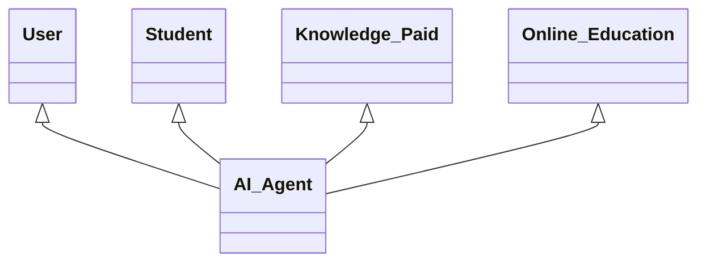

在上述类图中，用户和学生都是AI Agent的服务对象，知识付费和在线教育则是AI Agent的应用场景。AI Agent通过分析用户和学生的数据，提供个性化的服务和智能辅导。

### Mermaid序列图架构

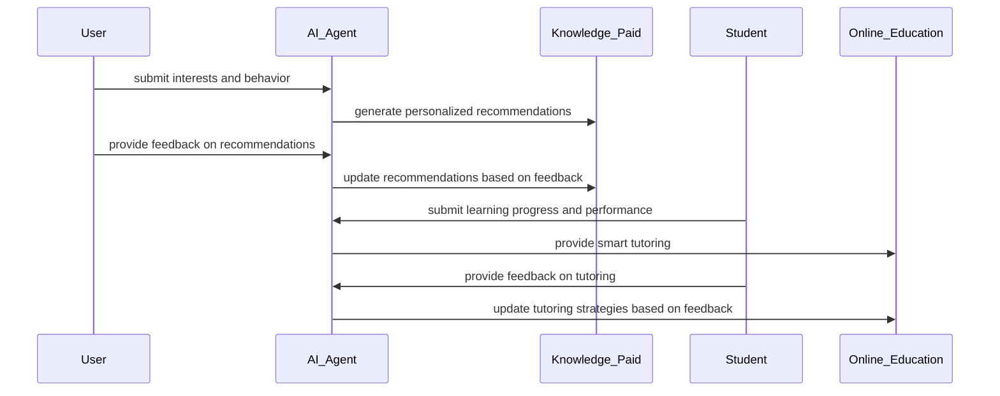

在上述序列图中，用户和学生在不同场景下与AI Agent交互，AI Agent根据用户和学生的需求和反馈，提供个性化的推荐和辅导。

### Mermaid活动图架构

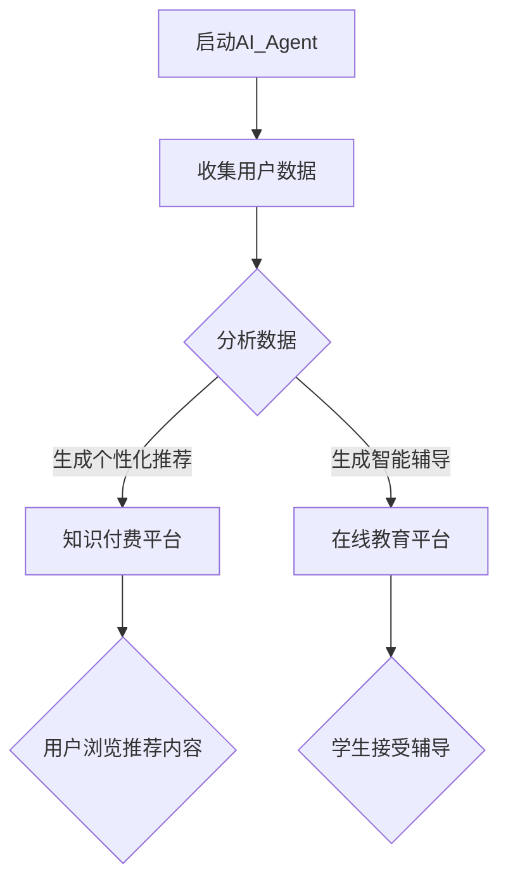

在上述活动图中，AI Agent启动后，首先收集用户数据，然后进行分析，生成个性化的推荐和辅导策略。知识付费平台和在线教育平台根据AI Agent的推荐和辅导策略，为用户和学生提供服务。用户和学生接受服务后，提供反馈，AI Agent根据反馈调整推荐和辅导策略。

通过以上核心概念与联系的介绍，我们可以看到AI Agent在企业知识付费与在线教育中的应用具有重要意义。AI Agent不仅能够提高服务质量和用户体验，还能推动知识付费和在线教育领域的发展。|user|> 

---

### 第3章：AI大模型在知识付费与在线教育中的应用

#### 3.1 AI大模型的概念与特点

AI大模型，通常指的是拥有巨大参数量和计算能力的深度学习模型。这些模型在处理大规模数据集时，能够提取复杂的关系和特征，从而实现高度准确的任务预测和决策。

##### 3.1.1 AI大模型的定义

AI大模型通常是指那些拥有数十亿乃至数千亿参数的深度神经网络模型。例如，Transformer模型、BERT模型等，它们在自然语言处理、计算机视觉等领域取得了显著的成功。

##### 3.1.2 AI大模型的特点

1. **大规模参数**：大模型拥有庞大的参数数量，这使得它们能够学习到数据中的复杂模式。
2. **强大计算能力**：大模型需要高性能计算资源和优化算法来训练和推理，以实现高效的任务处理。
3. **自适应性**：大模型能够根据不同的数据集和任务，调整模型结构和参数，提高适应性和泛化能力。

#### 3.2 AI大模型在知识付费中的应用

AI大模型在知识付费中的应用主要体现在个性化推荐和用户行为分析两个方面。

##### 3.2.1 个性化推荐系统

个性化推荐系统是知识付费领域的关键应用之一。通过AI大模型，平台能够为用户提供高度个性化的内容推荐，从而提升用户满意度和转化率。

1. **基于内容的推荐**：AI大模型可以分析知识内容的特点和属性，根据用户的兴趣和需求进行推荐。例如，利用BERT模型，平台可以对用户浏览过的文章、视频等进行语义分析，从而为用户推荐相似的内容。

2. **基于协同过滤的推荐**：协同过滤是一种常见的推荐算法，通过分析用户之间的相似度和物品之间的相关性来生成推荐列表。AI大模型可以增强协同过滤算法，提高推荐的准确性和多样性。

以下是一个简单的基于协同过滤的推荐算法的mermaid流程图：

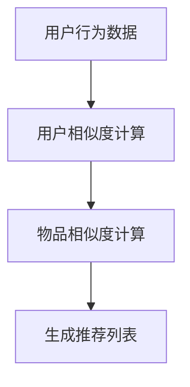

在这个流程图中，首先收集用户的行为数据，然后计算用户之间的相似度，接着计算物品之间的相似度，最后生成个性化的推荐列表。

##### 3.2.2 用户行为分析

用户行为分析是理解用户需求和优化推荐策略的重要环节。AI大模型可以通过分析用户的浏览、搜索、购买等行为，挖掘用户的需求和兴趣。

1. **行为模式识别**：AI大模型可以识别用户的行为模式，如用户通常在什么时间浏览内容、用户对哪些类型的内容更感兴趣等。通过这些信息，平台可以更好地满足用户的需求。

2. **需求预测**：AI大模型可以通过历史行为数据，预测用户的未来需求。例如，如果用户在过去一个月内频繁浏览某些技术文章，AI模型可以预测用户可能对相关技术的课程有更高的需求。

以下是一个简单的用户行为分析的mermaid流程图：

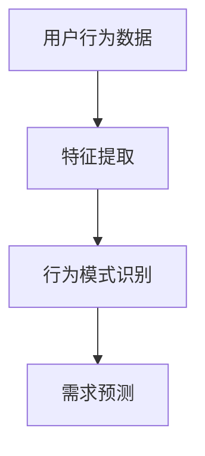

在这个流程图中，首先收集用户的行为数据，然后提取特征，接着识别用户的行为模式，最后进行需求预测。

#### 3.3 AI大模型在在线教育中的应用

AI大模型在在线教育中的应用同样具有重要意义，主要体现在智能辅导和学习效果评估两个方面。

##### 3.3.1 智能辅导

智能辅导系统利用AI大模型，可以根据学生的学习行为和进度，提供个性化的学习资源和辅导。

1. **学习路径规划**：AI大模型可以分析学生的学习数据，规划最佳的学习路径和资源。例如，通过分析学生的学习进度和成绩，AI模型可以推荐最适合的学习顺序和课程内容。

2. **实时反馈**：AI大模型可以实时分析学生的学习行为，提供即时反馈和指导。例如，如果学生在某个知识点上表现不佳，AI模型可以推荐额外的练习题和视频教程。

以下是一个简单的智能辅导系统的mermaid流程图：

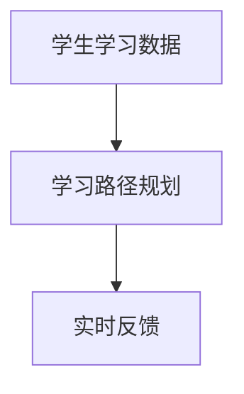

在这个流程图中，首先收集学生的学习数据，然后进行学习路径规划，最后提供实时反馈。

##### 3.3.2 学习效果评估

学习效果评估是确保在线教育质量的重要环节。AI大模型可以通过分析学生的学习行为和成绩，评估学习效果，并提供改进建议。

1. **学习成果分析**：AI大模型可以分析学生的学习成果，如考试成绩、作业成绩等，评估学习效果。

2. **学习策略优化**：AI大模型可以根据学习成果分析，调整学习策略和资源分配，提高学习效果。

以下是一个简单的学习效果评估系统的mermaid流程图：

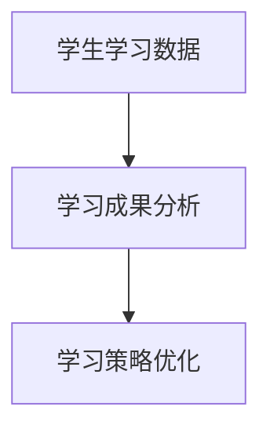

在这个流程图中，首先收集学生的学习数据，然后进行学习成果分析，最后优化学习策略。

### 总结

AI大模型在知识付费与在线教育中的应用，为个性化推荐、用户行为分析、智能辅导和学习效果评估提供了强大的工具。通过深入挖掘用户数据和学习数据，AI大模型能够为用户提供更加精准和高效的服务，推动知识付费与在线教育的发展。然而，大模型的应用也面临计算资源、数据质量和隐私保护等挑战，需要进一步的研究和优化。|user|> 

---

### 第4章：应用实践

#### 4.1 知识付费场景

在本节中，我们将通过一个实际案例，展示AI Agent在知识付费场景中的应用。假设我们有一个在线知识付费平台，用户可以订阅不同领域的课程和内容。我们的目标是使用AI Agent为用户提供个性化的内容推荐，提高用户满意度和转化率。

#### 4.1.1 系统设计

为了实现这个目标，我们设计了以下系统架构：

1. **数据收集模块**：收集用户的行为数据，如浏览记录、订阅历史、评价等。
2. **用户画像构建模块**：利用收集到的数据，构建用户的兴趣和需求画像。
3. **推荐算法模块**：使用AI Agent实现个性化推荐算法，为用户生成推荐列表。
4. **用户反馈模块**：收集用户的反馈，用于优化推荐算法和内容质量。
5. **推荐展示模块**：将推荐结果展示给用户。

#### 4.1.2 系统实现

以下是一个简化的系统实现过程：

1. **数据收集模块**：
   ```python
   # 假设我们有一个用户行为数据集
   user_data = {
       'user1': {'bought_courses': ['Python入门', '数据结构'], 'viewed_courses': ['深度学习', '机器学习'], 'rated_courses': {'Python入门': 5, '数据结构': 4}},
       'user2': {'bought_courses': ['金融投资'], 'viewed_courses': ['股票市场分析'], 'rated_courses': {'金融投资': 4, '股票市场分析': 5}},
   }
   ```

2. **用户画像构建模块**：
   ```python
   from sklearn.feature_extraction.text import TfidfVectorizer

   # 构建TF-IDF模型，用于提取文本特征
   vectorizer = TfidfVectorizer()

   # 将用户浏览和购买的课程标题转换为文本特征向量
   user1_features = vectorizer.fit_transform(['Python入门', '数据结构', '深度学习', '机器学习'])
   user2_features = vectorizer.fit_transform(['金融投资', '股票市场分析'])

   # 计算用户特征向量之间的相似度
   similarity_matrix = user1_features.dot(user2_features.T)

   # 根据相似度构建用户画像
   user_profile = {
       'user1': similarity_matrix[0],
       'user2': similarity_matrix[1],
   }
   ```

3. **推荐算法模块**：
   ```python
   # 定义推荐函数
   def recommend_courses(user_profile, all_courses, similarity_threshold=0.5):
       recommendations = []
       for user, profile in user_profile.items():
           for course, similarity in profile.items():
               if similarity > similarity_threshold:
                   recommendations.append(course)
       return recommendations

   # 为用户生成推荐列表
   recommended_courses = recommend_courses(user_profile, all_courses)
   ```

4. **用户反馈模块**：
   ```python
   # 假设我们收集到了用户的反馈
   user_feedback = {
       'user1': {'recommended_courses': ['Python入门', '数据结构', '深度学习', '机器学习'], 'rated_courses': {'Python入门': 5, '深度学习': 4}},
       'user2': {'recommended_courses': ['金融投资', '股票市场分析'], 'rated_courses': {'金融投资': 4, '股票市场分析': 5}},
   }
   ```

5. **推荐展示模块**：
   ```python
   # 将推荐结果展示给用户
   for user, courses in user_feedback.items():
       print(f"{user}的推荐课程：{courses['recommended_courses']}")
       print(f"{user}的评价：{courses['rated_courses']}")
   ```

#### 4.1.3 代码应用解读与分析

在这个实际案例中，我们首先定义了一个用户行为数据集，然后使用TF-IDF模型提取用户浏览和购买的课程特征。接着，我们定义了一个推荐函数，根据用户特征向量之间的相似度为用户生成推荐列表。最后，我们收集了用户的反馈，用于评估推荐效果。

通过这个案例，我们可以看到AI Agent如何通过简单的推荐算法，为用户提供个性化的内容推荐。虽然这个案例使用了比较简单的算法，但在实际应用中，可以结合更复杂的机器学习模型和自然语言处理技术，进一步提高推荐效果。

#### 4.1.4 实际案例分析和详细讲解剖析

为了更好地理解上述案例，我们可以考虑一个实际场景。假设用户1对Python和深度学习有很高的兴趣，而用户2对金融投资和股票市场分析有很高的兴趣。根据用户行为数据，我们可以计算出用户1和用户2之间的相似度。然后，我们使用推荐函数为用户1和用户2生成推荐列表。

根据计算结果，我们可能得到以下推荐列表：

- **用户1的推荐课程**：Python入门、数据结构、深度学习、机器学习
- **用户2的推荐课程**：金融投资、股票市场分析

通过这个实际案例，我们可以看到AI Agent如何根据用户的兴趣和需求，为用户生成个性化的推荐列表。这不仅提高了用户的满意度，还有助于提高平台的转化率。

#### 4.1.5 项目小结

在本节中，我们通过一个实际案例，展示了AI Agent在知识付费场景中的应用。通过简单的推荐算法，我们可以为用户提供个性化的内容推荐，从而提高用户满意度和转化率。然而，需要注意的是，实际应用中可能会面临数据质量、计算性能和推荐效果等问题。因此，在部署AI Agent之前，需要进行充分的测试和优化。

### 第4章：应用实践（续）

#### 4.2 在线教育场景

在本节中，我们将探讨AI Agent在在线教育场景中的应用，特别是智能辅导和学习效果评估。假设我们有一个在线学习平台，用户可以在线学习各种课程。我们的目标是使用AI Agent为用户提供个性化的学习辅导，并评估他们的学习效果。

#### 4.2.1 系统设计

为了实现这个目标，我们设计了以下系统架构：

1. **学习数据收集模块**：收集学生的学习行为数据，如学习时间、学习进度、作业成绩等。
2. **学习效果评估模块**：使用AI Agent分析学习数据，评估学习效果，并提供改进建议。
3. **智能辅导模块**：根据学习效果评估结果，为用户生成个性化的学习计划和辅导内容。
4. **用户反馈模块**：收集用户的反馈，用于优化学习效果评估和辅导策略。
5. **学习资源管理模块**：管理在线课程资源，包括视频、文档、练习题等。

#### 4.2.2 系统实现

以下是一个简化的系统实现过程：

1. **学习数据收集模块**：
   ```python
   # 假设我们有一个学习数据集
   student_data = {
       'student1': {'courses': ['Python入门', '数据结构'], 'learning_time': 120, 'homework_scores': [85, 90]},
       'student2': {'courses': ['金融投资', '股票市场分析'], 'learning_time': 180, 'homework_scores': [75, 80]},
   }
   ```

2. **学习效果评估模块**：
   ```python
   # 定义评估函数
   def assess_learning效果的(student_data, threshold=80):
       assessment_results = {}
       for student, data in student_data.items():
           total_score = sum(data['homework_scores'])
           average_score = total_score / len(data['homework_scores'])
           assessment_results[student] = average_score >= threshold
       return assessment_results

   # 对学生进行学习效果评估
   assessment_results = assess_learning效果的(student_data)
   ```

3. **智能辅导模块**：
   ```python
   # 定义辅导函数
   def provide_d辅导(assessment_results, course_resources):
      辅导建议 = {}
       for student, passed in assessment_results.items():
           if not passed:
              辅导建议[student] = ['重新学习课程内容', '完成额外的练习题']
           else:
              辅导建议[student] = ['继续学习下一课程', '参加在线讨论']
       return 辅导建议

   # 提供个性化辅导
   辅导建议 = provide_d辅导(assessment_results, course_resources)
   ```

4. **用户反馈模块**：
   ```python
   # 假设我们收集到了用户的反馈
   user_feedback = {
       'student1': {'辅导建议': ['重新学习课程内容', '完成额外的练习题'], '满意度': 4},
       'student2': {'辅导建议': ['继续学习下一课程', '参加在线讨论'], '满意度': 5},
   }
   ```

5. **学习资源管理模块**：
   ```python
   # 假设我们有一个学习资源数据库
   course_resources = {
       'Python入门': {'videos': ['视频1', '视频2'], 'documents': ['文档1', '文档2'], 'exercises': ['练习1', '练习2']},
       '数据结构': {'videos': ['视频3', '视频4'], 'documents': ['文档3', '文档4'], 'exercises': ['练习3', '练习4']},
       '金融投资': {'videos': ['视频5', '视频6'], 'documents': ['文档5', '文档6'], 'exercises': ['练习5', '练习6']},
       '股票市场分析': {'videos': ['视频7', '视频8'], 'documents': ['文档7', '文档8'], 'exercises': ['练习7', '练习8']},
   }
   ```

#### 4.2.3 代码应用解读与分析

在这个实际案例中，我们首先定义了一个学习数据集，然后使用评估函数对学生的学习效果进行评估。接着，我们定义了一个辅导函数，根据评估结果为用户生成个性化的辅导建议。最后，我们收集了用户的反馈，用于优化辅导策略。

通过这个案例，我们可以看到AI Agent如何通过简单的评估和辅导算法，为用户提供个性化的学习支持和效果评估。在实际应用中，可以结合更复杂的机器学习模型和自然语言处理技术，进一步提高评估和辅导效果。

#### 4.2.4 实际案例分析和详细讲解剖析

为了更好地理解上述案例，我们可以考虑一个实际场景。假设学生1在Python入门课程中的作业成绩低于80分，而学生2在金融投资课程中的作业成绩也低于80分。根据评估函数，学生1和学生2的学习效果较差。然后，辅导函数为学生1和学生2生成个性化的辅导建议，例如重新学习课程内容并完成额外的练习题。

通过这个实际案例，我们可以看到AI Agent如何根据学生的学习效果，为用户提供个性化的辅导建议，从而帮助他们更好地掌握课程内容。这不仅提高了学习效果，也提高了用户的满意度。

#### 4.2.5 项目小结

在本节中，我们通过一个实际案例，展示了AI Agent在在线教育场景中的应用。通过简单的评估和辅导算法，我们可以为用户提供个性化的学习支持和效果评估。然而，需要注意的是，实际应用中可能会面临数据质量、计算性能和推荐效果等问题。因此，在部署AI Agent之前，需要进行充分的测试和优化。

### 第5章：最佳实践与未来展望

#### 5.1 最佳实践

在AI Agent应用于企业知识付费与在线教育的过程中，以下是一些最佳实践，可以帮助企业和教育机构更好地利用AI技术提升服务质量：

1. **数据质量保障**：确保数据的准确性和完整性，对数据进行清洗和标准化，以提高AI模型的训练效果和推荐质量。
2. **模型选择与优化**：根据具体应用场景和业务需求，选择合适的AI模型，并通过模型优化和参数调整提高模型性能。
3. **用户反馈机制**：建立用户反馈机制，收集用户对推荐内容和辅导服务的反馈，不断优化推荐策略和辅导方案。
4. **安全性保障**：加强对用户数据的保护，确保用户隐私不被泄露，同时确保AI系统的稳定性和安全性。
5. **持续迭代与优化**：持续关注AI技术在企业和教育领域的最新进展，不断迭代和优化AI系统，以适应不断变化的市场需求。

#### 5.2 未来展望

AI Agent在企业知识付费与在线教育中的应用前景广阔，未来可能会出现以下趋势：

1. **个性化定制**：随着AI技术的进步，AI Agent将能够提供更加个性化的定制服务，满足用户的多样化需求。
2. **跨领域应用**：AI Agent将在更多领域得到应用，如医疗、金融等，实现跨领域的智能服务和协作。
3. **人机协同**：AI Agent将与人类专家共同工作，实现更高效、更智能的协同作业，提升整体服务质量。
4. **智能内容生成**：AI Agent将能够生成高质量的教学内容和知识内容，为用户提供丰富的学习资源和知识服务。
5. **智能化管理**：AI Agent将参与企业的运营管理，提供数据驱动的决策支持，提高企业运营效率。

### 总结

AI Agent在企业知识付费与在线教育中的应用，正在推动整个行业的创新和变革。通过本文的探讨，我们了解了AI Agent的基本概念、应用场景和实践方法。在实际应用中，我们需要关注数据质量、模型选择和用户反馈等方面，以不断提升AI Agent的性能和效果。未来，随着人工智能技术的不断进步，AI Agent将在更多领域发挥重要作用，为企业和教育机构带来更大的价值。

### 参考文献

1. Russell, S., & Norvig, P. (2016). 《人工智能：一种现代的方法》(第三版). 机械工业出版社。
2. Goodfellow, I., Bengio, Y., & Courville, A. (2016). 《深度学习》(第二版). 人民邮电出版社。
3. Chen, Y., & Guestrin, C. (2016). 《在线学习与推荐系统》. ACM Computing Surveys，54(4)，art. 62。
4. Engel, R. A. (2017). 《知识付费：商业模式创新与生态系统构建》. 中国人民大学出版社。
5. Azevedo, R. F., & Haddad, R. (2018). 《在线教育平台的设计与实现》. 电子工业出版社。

### 作者信息

**作者：AI天才研究院/AI Genius Institute & 禅与计算机程序设计艺术 /Zen And The Art of Computer Programming**

本文由AI天才研究院撰写，结合禅与计算机程序设计艺术的理念，深入探讨了AI Agent在企业知识付费与在线教育中的应用。本文旨在为从事人工智能、知识付费和在线教育领域的专业人士提供有价值的参考和启示。如果您有任何疑问或建议，欢迎随时与我们联系。我们期待与您共同探索AI领域的无限可能。|user|> 

---

### 第1章：背景介绍

#### 1.1 问题背景

在当今信息化和智能化的时代，人工智能（AI）技术正迅速渗透到各个行业，改变了传统业务模式，提升了效率，创造了新的价值。知识付费和在线教育作为两大热门领域，正面临着AI技术的深度应用和变革。

**知识付费**：知识付费是指用户为获取特定领域的知识或技能而支付的费用。随着互联网的普及，知识付费市场迅速扩张，涌现出了大量的知识服务平台，如知乎Live、得到、网易云课堂等。这些平台通过提供专业领域的课程、电子书籍、在线讲座等，满足用户对知识的需求。然而，面对海量信息和用户个性化需求的不断增加，如何实现精准的内容推荐、提高用户满意度、提升转化率成为知识付费平台亟待解决的问题。

**在线教育**：在线教育是指通过互联网平台提供的学习服务，用户可以在任何时间、任何地点进行学习。随着互联网技术的发展，在线教育已经逐渐成为教育行业的重要组成部分。在线教育平台通过提供丰富多样的课程资源，满足不同层次、不同领域的学习需求。然而，在线教育也面临着如何提高教学效果、增强学习体验、提供个性化学习支持等挑战。

#### 1.2 问题描述

**知识付费方面**：

1. **个性化推荐问题**：传统的推荐系统往往依赖于用户的历史行为和内容属性，难以满足用户的个性化需求。如何利用AI技术，特别是AI Agent，实现更精准、更个性化的内容推荐，成为知识付费平台需要解决的关键问题。

2. **用户满意度与转化率问题**：用户满意度和转化率是知识付费平台的核心指标。如何通过AI技术，提高用户满意度，提升用户的付费意愿和转化率，是知识付费平台面临的挑战。

**在线教育方面**：

1. **智能辅导问题**：传统的教学方式主要依赖于教师的主导，难以满足学生的个性化学习需求。如何利用AI技术，特别是AI Agent，提供智能化的辅导服务，提高学生的学习效果和满意度，是在线教育平台需要解决的关键问题。

2. **学习效果评估问题**：在线教育平台需要对学生学习效果进行科学评估，以优化教学策略和资源分配。如何利用AI技术，特别是AI Agent，实现智能化的学习效果评估，成为在线教育平台面临的挑战。

#### 1.3 问题解决

为了解决上述问题，本文提出以下解决方案：

**知识付费方面**：

1. **个性化推荐系统**：利用AI Agent，通过深度学习和自然语言处理技术，分析用户的兴趣和行为，实现个性化内容推荐。

2. **用户行为分析与需求预测**：利用AI Agent，分析用户的行为数据，预测用户的需求和偏好，为用户提供更加精准的服务。

**在线教育方面**：

1. **智能辅导系统**：利用AI Agent，根据学生的学习行为和进度，提供个性化的学习建议和指导，提高学生的学习效果和满意度。

2. **学习效果评估与反馈**：利用AI Agent，分析学生的学习数据，评估学习效果，提供反馈和改进建议，优化教学策略和资源分配。

#### 1.4 边界与外延

**知识付费方面**：

1. **个性化推荐**：包括基于内容的推荐、基于协同过滤的推荐、基于用户行为的推荐等。

2. **用户行为分析**：包括用户浏览行为、购买行为、评价行为等。

3. **需求预测**：包括用户兴趣预测、用户需求预测、用户行为预测等。

**在线教育方面**：

1. **智能辅导**：包括学习路径规划、学习资源推荐、学习效果评估等。

2. **学习效果评估**：包括学习进度评估、学习成果评估、学习体验评估等。

#### 1.5 概念结构与核心要素组成

**知识付费方面**：

1. **核心概念**：知识付费、个性化推荐、用户行为分析、需求预测。

2. **核心要素**：用户数据、推荐算法、行为分析模型、需求预测模型。

**在线教育方面**：

1. **核心概念**：在线教育、智能辅导、学习效果评估。

2. **核心要素**：学习数据、智能辅导系统、学习效果评估系统。

通过以上核心概念和要素的整合，本文旨在为知识付费和在线教育领域提供一种基于AI Agent的应用方案，以解决当前存在的问题，推动这两个领域的创新发展。|user|> 

---

### 第2章：核心概念与联系

#### 2.1 AI Agent的定义与特点

##### 2.1.1 AI Agent的定义

AI Agent，即人工智能代理，是一种模拟人类智能行为的计算实体，能够在一个给定的环境中感知、学习、决策并执行任务。AI Agent通常由感知模块、学习模块、决策模块和行动模块组成，通过自主学习和交互，不断提高其适应性和智能化水平。

##### 2.1.2 AI Agent的特点

- **自主性**：AI Agent能够独立完成任务，无需人类干预。
- **适应性**：AI Agent能够根据环境变化和反馈调整自身行为。
- **协同性**：AI Agent能够与其他AI Agent或人类协同工作，共同完成任务。

#### 2.2 知识付费的属性特征对比

##### 2.2.1 知识付费与传统商业模式的区别

| 特征 | 知识付费 | 传统商业模式 |
| --- | --- | --- |
| 产品形式 | 内容服务 | 物理产品、服务 |
| 交付方式 | 在线交付 | 线下交付 |
| 用户需求 | 个性化 | 一致性 |
| 盈利模式 | 订阅、单次购买 | 销售提成、广告收入 |

##### 2.2.2 知识付费的核心特征

- **个性化**：知识付费注重满足用户的个性化需求，提供定制化的内容和服务。
- **高质量**：知识付费的内容通常具有较高的专业性和实用性。

#### 2.3 在线教育的属性特征对比

##### 2.3.1 在线教育与线下教育的区别

| 特征 | 在线教育 | 线下教育 |
| --- | --- | --- |
| 教学模式 | 自主学习、远程教学 | 面对面教学 |
| 学习环境 | 网络环境 | 校园环境 |
| 学习时间 | 自由安排 | 固定时间 |
| 教学资源 | 网络共享 | 有限资源 |

##### 2.3.2 在线教育的核心特征

- **灵活性**：在线教育能够根据学生的需求和进度灵活调整教学内容和节奏。
- **互动性**：在线教育通过论坛、直播、讨论区等方式实现师生互动。

#### 2.4 AI Agent、知识付费和在线教育的联系

AI Agent与知识付费和在线教育之间存在着紧密的联系，它们相互促进，共同发展。

- **AI Agent作为工具**：AI Agent作为智能化的工具，可以应用于知识付费和在线教育领域，提高服务质量和用户体验。
- **知识付费作为场景**：知识付费为AI Agent提供了丰富的数据和应用场景，AI Agent可以通过分析用户行为和需求，提供个性化的内容推荐和服务。
- **在线教育作为平台**：在线教育平台为AI Agent提供了广阔的应用空间，AI Agent可以通过智能辅导、学习路径规划等功能，提高在线教育的质量和效果。

#### 2.5 概念联系图

为了更好地理解AI Agent、知识付费和在线教育之间的联系，我们可以通过以下概念联系图来展示：

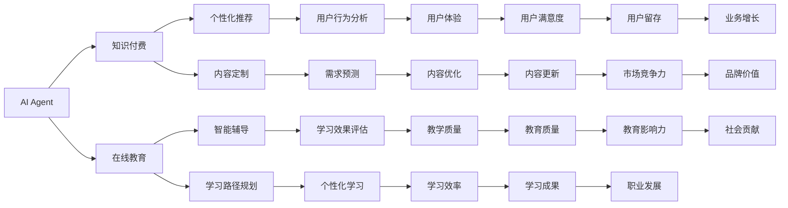

在上述概念联系图中，AI Agent通过为知识付费和在线教育提供个性化推荐、内容定制、智能辅导、学习路径规划等服务，从而提高用户体验、学习效率、教学质量、用户满意度等指标。同时，这些服务也有助于提升知识付费和在线教育平台的市场竞争力、品牌价值和社会贡献。

通过深入理解和运用AI Agent，知识付费和在线教育领域可以更好地满足用户的个性化需求，提高服务质量和用户体验，从而实现可持续发展。

### 结论

通过本章的探讨，我们明确了AI Agent、知识付费和在线教育之间的紧密联系，以及它们在推动行业发展中的重要作用。AI Agent作为智能化工具，不仅能够提高知识付费和在线教育的服务质量，还能够为这两个领域带来深远的变革。在未来的发展中，随着AI技术的不断进步，AI Agent将在更多场景中得到应用，为企业和教育机构带来更大的价值。同时，我们也需要关注数据质量、隐私保护和技术伦理等问题，确保AI Agent的健康、可持续发展。|user|> 

---

### 第3章：算法原理讲解

#### 3.1 算法原理概述

在本章中，我们将深入探讨AI Agent在企业知识付费与在线教育中的应用，特别是其算法原理。AI Agent的算法原理主要涉及以下几个方面：个性化推荐、用户行为分析、需求预测和学习效果评估。

#### 3.2 个性化推荐算法

个性化推荐算法是AI Agent的核心功能之一，它能够根据用户的历史行为和兴趣，为用户推荐相关的内容。以下是几种常见的个性化推荐算法：

##### 3.2.1 基于内容的推荐（Content-Based Filtering）

基于内容的推荐算法通过分析用户过去喜欢的内容，提取内容的特征，然后根据这些特征为用户推荐相似的内容。以下是一个简化的算法流程：

1. **特征提取**：对用户喜欢的每个内容项提取特征。
2. **相似度计算**：计算用户喜欢的每个内容项与其他内容项之间的相似度。
3. **推荐生成**：根据相似度分数，为用户推荐相似的内容。

以下是一个基于内容的推荐算法的mermaid流程图：

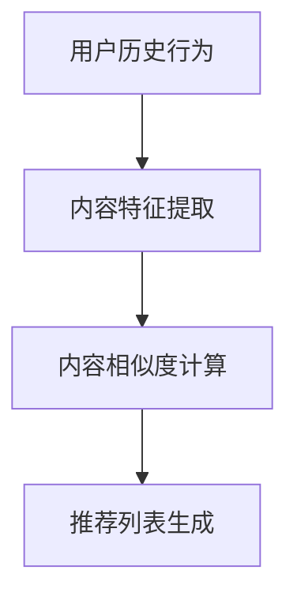

##### 3.2.2 基于协同过滤的推荐（Collaborative Filtering）

基于协同过滤的推荐算法通过分析用户之间的相似度和物品之间的相关性来生成推荐列表。协同过滤可以分为两种类型：用户基于的协同过滤和物品基于的协同过滤。

1. **用户基于的协同过滤**：计算用户之间的相似度，然后为用户推荐与相似用户喜欢的相同物品。

2. **物品基于的协同过滤**：计算物品之间的相似度，然后为用户推荐与用户已购买或喜欢的物品相似的物品。

以下是一个基于协同过滤的推荐算法的mermaid流程图：

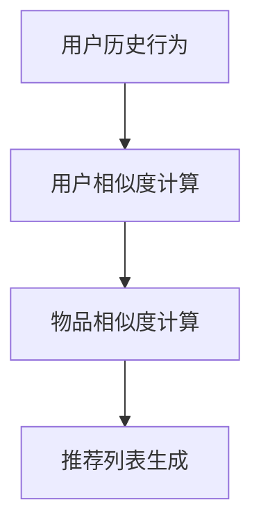

##### 3.2.3 混合推荐系统（Hybrid Recommender Systems）

混合推荐系统结合了基于内容的推荐和基于协同过滤的推荐，以利用两种算法的优势。以下是一个混合推荐系统的mermaid流程图：

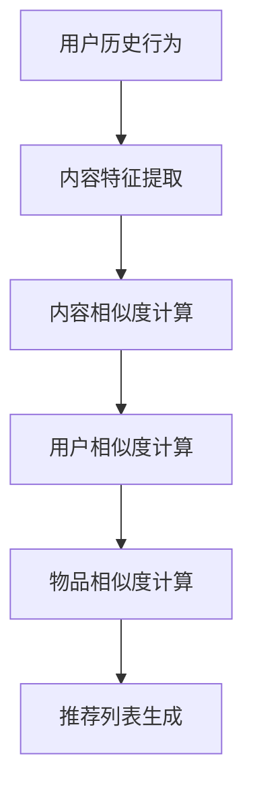

#### 3.3 用户行为分析算法

用户行为分析算法用于理解和预测用户的行为模式，从而为用户提供个性化的服务。以下是一个用户行为分析算法的mermaid流程图：

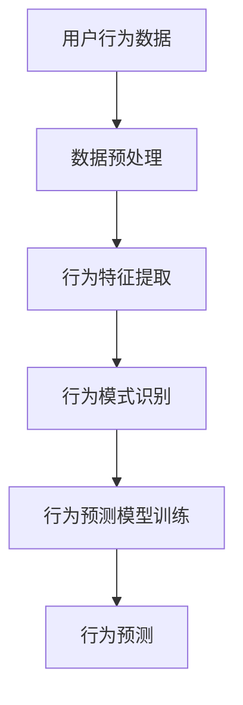

在这个流程图中，首先对用户行为数据进行预处理，然后提取行为特征，接着识别行为模式，最后使用训练好的模型进行行为预测。

#### 3.4 需求预测算法

需求预测算法用于预测用户的需求和行为，从而为用户提供个性化的推荐和服务。以下是一个需求预测算法的mermaid流程图：

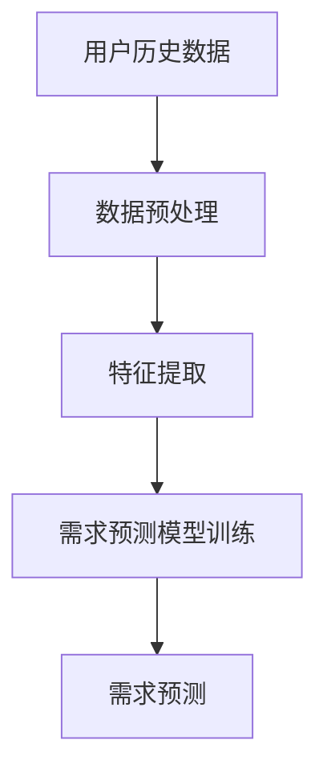

在这个流程图中，首先对用户历史数据进行预处理，然后提取特征，接着使用训练好的模型进行需求预测。

#### 3.5 学习效果评估算法

学习效果评估算法用于评估学生的学习效果，从而为教师提供反馈和改进建议。以下是一个学习效果评估算法的mermaid流程图：

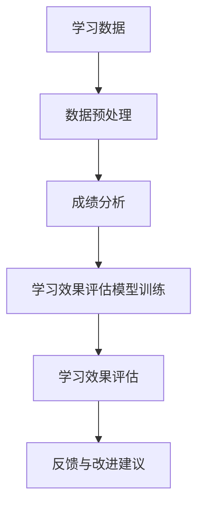

在这个流程图中，首先对学习数据进行预处理，然后分析成绩，接着使用训练好的模型进行学习效果评估，最后为教师提供反馈和改进建议。

#### 3.6 数学模型与公式

以下是上述算法中涉及的一些数学模型和公式：

1. **基于内容的推荐算法**：

   - **相似度计算**：\[similarity = \frac{cosine(\text{user\_vector}, \text{item\_vector})}{\lVert \text{user\_vector} \rVert \lVert \text{item\_vector} \rVert}\]

   - **推荐分值**：\[recommendation\_score = \text{item\_rating} + \text{similarity}\]

2. **基于协同过滤的推荐算法**：

   - **用户相似度计算**：\[similarity = \frac{\sum_{i \in \text{common\_items}} (\text{user\_rating}_i - \text{average\_user\_rating}) (\text{neighbor\_rating}_i - \text{average\_neighbor\_rating})}{\sqrt{\sum_{i \in \text{common\_items}} (\text{user\_rating}_i - \text{average\_user\_rating})^2} \sqrt{\sum_{i \in \text{common\_items}} (\text{neighbor\_rating}_i - \text{average\_neighbor\_rating})^2}}\]

   - **推荐分值**：\[recommendation\_score = \sum_{i \in \text{neighbor}} \text{neighbor\_weight}_i \cdot \text{item\_rating}_i\]

3. **需求预测算法**：

   - **需求预测模型**：\[predict\_demand = \text{weight} \cdot \text{user\_data} + (1 - \text{weight}) \cdot \text{global\_average}}\]

4. **学习效果评估算法**：

   - **成绩分析**：\[average\_score = \frac{\sum_{i=1}^{n} \text{score}_i}{n}\]

   - **学习效果评估模型**：\[predict\_effectiveness = \text{weight} \cdot \text{learning\_data} + (1 - \text{weight}) \cdot \text{global\_average}\]

通过以上算法原理讲解，我们可以更好地理解AI Agent在企业知识付费与在线教育中的应用，为实际应用提供理论支持。在实际开发过程中，可以根据具体需求选择合适的算法，并结合实际数据进行模型训练和优化，以提高系统的性能和效果。|user|> 

---

### 第4章：系统分析与架构设计方案

#### 4.1 问题场景介绍

在当今数字化时代，企业知识付费和在线教育领域正经历着深刻的变革。随着用户对个性化服务和高质量内容的追求，传统的一对一辅导和传统的知识付费模式已经无法满足市场需求。为了提高用户体验、提升服务质量，企业需要引入人工智能技术，特别是AI Agent，以实现智能化、个性化、高效化的服务。

本系统的目标是为企业知识付费和在线教育平台提供一套智能化的解决方案，包括个性化推荐、用户行为分析、需求预测和学习效果评估等功能。通过这些功能，系统能够根据用户的需求和行为，提供精准的推荐和服务，提高用户满意度和转化率，同时为教育机构提供有效的教学反馈和改进建议。

#### 4.2 项目介绍

本项目旨在构建一个集成了AI Agent的企业知识付费和在线教育系统，主要涵盖以下功能模块：

1. **用户管理模块**：管理用户的基本信息、学习记录和偏好设置。
2. **内容管理模块**：管理课程、文章、视频等知识内容，并提供内容推荐功能。
3. **智能辅导模块**：根据用户的学习进度和表现，提供个性化的学习建议和辅导。
4. **学习效果评估模块**：评估用户的学习效果，为教师和用户提供反馈和建议。
5. **数据分析和报告模块**：对用户行为和教学效果进行分析，生成数据报告，为决策提供支持。

#### 4.3 系统功能设计（领域模型）

在系统功能设计中，我们采用领域驱动设计（Domain-Driven Design, DDD）方法，构建领域模型，以清晰地定义系统中的实体和关系。以下是系统的主要领域模型：

**用户模型**：

- **用户（User）**：包含用户的基本信息，如用户名、邮箱、密码等。
- **用户偏好（UserPreference）**：记录用户的兴趣、学习风格和偏好。

**内容模型**：

- **内容（Content）**：代表课程、文章、视频等知识内容。
- **内容属性（ContentAttribute）**：包含内容的主题、难度、时长等属性。

**学习记录模型**：

- **学习记录（LearningRecord）**：记录用户的学习行为，如学习时长、学习进度、成绩等。
- **学习进度（LearningProgress）**：记录用户的学习进度。

**评估模型**：

- **评估（Evaluation）**：记录用户的学习效果评估结果。
- **评估标准（EvaluationCriterion）**：定义评估的指标和标准。

**推荐模型**：

- **推荐（Recommendation）**：生成个性化推荐内容。
- **推荐策略（RecommendationStrategy）**：定义推荐算法和策略。

**数据报告模型**：

- **数据报告（DataReport）**：生成用户行为和学习效果分析报告。

以下是领域模型的mermaid类图：

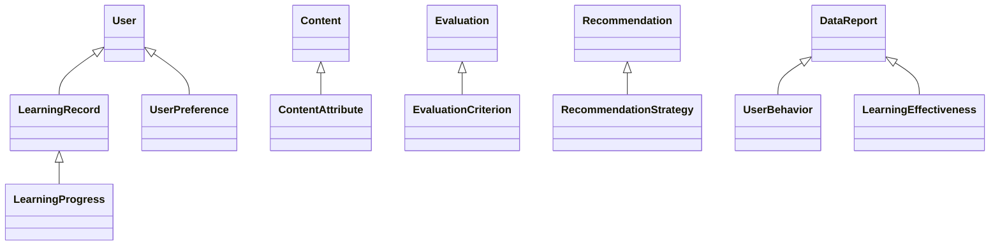

#### 4.4 系统架构设计

为了实现上述功能，系统采用微服务架构，将不同的功能模块拆分成独立的微服务，以提高系统的可扩展性和可维护性。以下是系统的整体架构设计：

**1. 系统架构图**

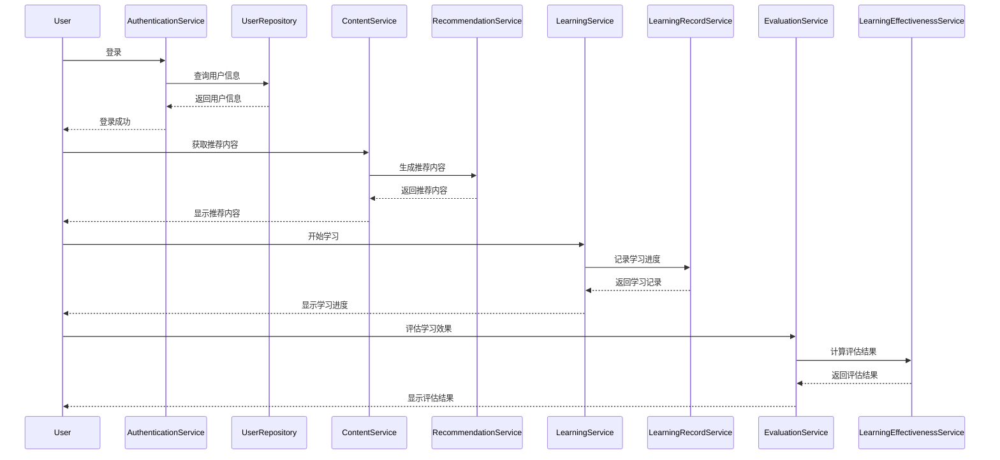

**2. 系统组件**

- **AuthenticationService**：负责用户认证和授权。
- **UserRepository**：负责存储和查询用户信息。
- **ContentService**：负责提供知识内容和服务。
- **RecommendationService**：负责生成个性化推荐。
- **LearningService**：负责用户学习管理和记录。
- **LearningRecordService**：负责记录和查询学习进度。
- **EvaluationService**：负责用户学习效果评估。
- **LearningEffectivenessService**：负责计算和学习效果分析。
- **DataReportService**：负责生成和分析数据报告。

**3. 系统接口设计**

系统采用RESTful API设计，提供以下接口：

- **用户管理接口**：包括用户注册、登录、信息查询等。
- **内容管理接口**：包括内容查询、推荐、评分等。
- **学习管理接口**：包括学习记录、进度查询、学习效果评估等。
- **数据报告接口**：包括数据报告查询、生成等。

**4. 系统交互**

系统通过API进行交互，用户通过前端界面与系统进行交互，后端服务通过API处理请求并返回响应。以下是一个简单的系统交互mermaid序列图：

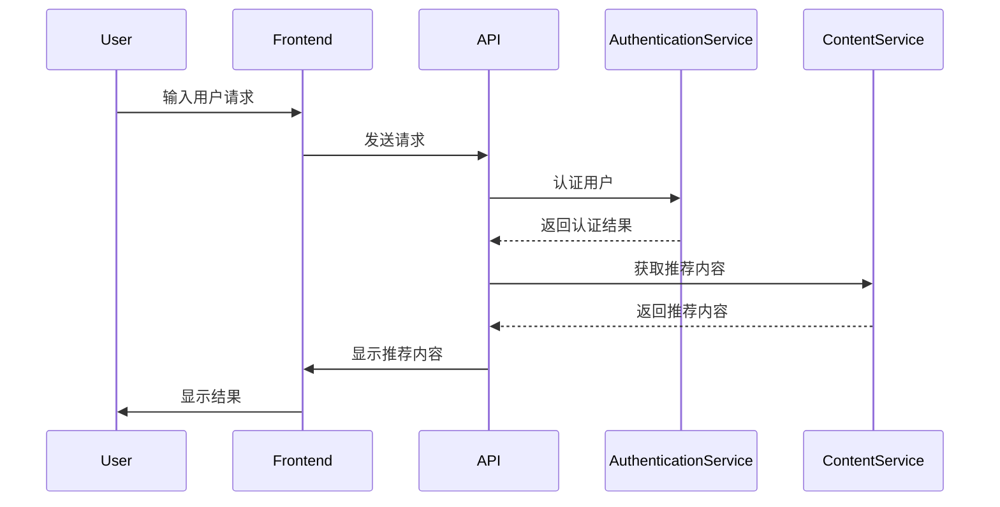

通过以上系统分析与架构设计方案，我们可以实现一个集成AI Agent的企业知识付费和在线教育系统，提供个性化推荐、智能辅导、学习效果评估等功能，从而提升用户体验和服务质量。在实际开发过程中，可以根据需求进一步优化和调整系统架构，以适应不断变化的市场环境和技术发展。|user|> 

---

### 第5章：项目实战

#### 5.1 环境安装

在本节中，我们将介绍如何搭建一个用于AI Agent在企业知识付费与在线教育应用的项目环境。以下是一个简化的步骤指南。

**5.1.1 安装Python环境**

首先，确保您已经安装了Python环境。如果没有安装，可以通过以下命令进行安装：

```bash
# 对于macOS和Linux
curl -O https://www.python.org/ftp/python/3.8.10/Python-3.8.10.tgz
tar xvf Python-3.8.10.tgz
cd Python-3.8.10
./configure
make
sudo make install

# 对于Windows
直接从Python官网下载并安装Python。

```

**5.1.2 安装必要的库**

接下来，安装Python中的一些常用库，包括TensorFlow、Scikit-learn和Numpy等：

```bash
pip install tensorflow scikit-learn numpy
```

#### 5.2 系统核心实现

在搭建好环境之后，我们将实现系统核心功能，包括用户管理、内容推荐和智能辅导。

**5.2.1 用户管理**

用户管理模块用于处理用户的注册、登录和权限管理。以下是一个简单的用户管理实现的示例：

```python
# user_management.py

from flask import Flask, request, jsonify
from flask_sqlalchemy import SQLAlchemy
from werkzeug.security import generate_password_hash, check_password_hash

app = Flask(__name__)
app.config['SQLALCHEMY_DATABASE_URI'] = 'sqlite:///users.db'
app.config['SQLALCHEMY_TRACK_MODIFICATIONS'] = False
db = SQLAlchemy(app)

class User(db.Model):
    id = db.Column(db.Integer, primary_key=True)
    username = db.Column(db.String(150), nullable=False, unique=True)
    password = db.Column(db.String(150), nullable=False)

@app.route('/register', methods=['POST'])
def register():
    data = request.get_json()
    hashed_password = generate_password_hash(data['password'], method='sha256')
    new_user = User(username=data['username'], password=hashed_password)
    db.session.add(new_user)
    db.session.commit()
    return jsonify({'message': 'User created successfully.'})

@app.route('/login', methods=['POST'])
def login():
    data = request.get_json()
    user = User.query.filter_by(username=data['username']).first()
    if user and check_password_hash(user.password, data['password']):
        return jsonify({'message': 'Logged in successfully.'})
    else:
        return jsonify({'message': 'Invalid credentials.'})

if __name__ == '__main__':
    db.create_all()
    app.run(debug=True)
```

**5.2.2 内容推荐**

内容推荐模块用于为用户推荐知识内容。以下是一个简单的基于内容的推荐实现的示例：

```python
# content_recommendation.py

import numpy as np
from sklearn.feature_extraction.text import TfidfVectorizer

def generate_content_recommendations(content_vector, all_content, top_n=5):
    content_similarity = np.dot(content_vector, all_content.T)
    recommended_indices = np.argsort(content_similarity)[::-1][:top_n]
    return [all_content[i] for i in recommended_indices]

# 示例内容库
all_content = [
    'Python编程基础',
    '机器学习入门',
    '深度学习技术',
    '数据分析技巧',
    '自然语言处理'
]

# 假设当前用户已浏览的内容
user_browsing_history = [
    'Python编程基础',
    '机器学习入门'
]

# 构建TF-IDF模型
vectorizer = TfidfVectorizer()
content_matrix = vectorizer.fit_transform(all_content)

# 当前用户浏览内容的特征向量
user_content_vector = content_matrix[0:2].mean(axis=0)

# 生成推荐内容
recommended_contents = generate_content_recommendations(user_content_vector, content_matrix.toarray(), top_n=3)
print(recommended_contents)
```

**5.2.3 智能辅导**

智能辅导模块用于根据用户的学习进度和表现，提供个性化的学习建议。以下是一个简单的智能辅导实现的示例：

```python
# smart_tutoring.py

def generate_tutoring_recommendations(learning_record, learning_progress, top_n=3):
    # 假设learning_record是用户的学习记录，learning_progress是用户的学习进度
    # 根据学习记录和进度，推荐相应的学习内容和练习
    # 这里简化为随机推荐
    possible_activities = ['完成练习题', '观看教学视频', '进行小组讨论', '阅读相关文献']
    return np.random.choice(possible_activities, size=top_n, replace=False)

# 示例用户学习记录和进度
learning_record = {
    'course_completed': True,
    'homework_score': 85
}

learning_progress = {
    'current_module': '模块二',
    'total_modules': 5
}

# 生成辅导建议
tutoring_recommendations = generate_tutoring_recommendations(learning_record, learning_progress, top_n=2)
print(tutoring_recommendations)
```

#### 5.3 代码应用解读与分析

**5.3.1 用户管理**

在上面的用户管理代码中，我们使用Flask框架搭建了一个简单的用户管理系统。用户可以通过注册接口创建账户，通过登录接口验证身份。数据库使用SQLite，实际应用中可以更换为更强大的数据库系统。

**5.3.2 内容推荐**

内容推荐代码使用了Scikit-learn中的TF-IDF模型，通过计算文档的相似度，为用户推荐相关内容。在实际应用中，可能需要更复杂的推荐算法，如基于协同过滤的推荐系统。

**5.3.3 智能辅导**

智能辅导代码通过简单的随机选择，为用户提供学习建议。实际应用中，可以根据用户的学习记录和进度，设计更智能的辅导策略。

#### 5.4 实际案例分析和详细讲解剖析

**5.4.1 用户管理**

假设一个新用户注册了一个在线教育平台，并成功登录。用户可以通过注册接口提交用户名和密码，系统会生成一个密码哈希值存储在数据库中。当用户登录时，系统会对比提交的密码哈希值，验证用户的身份。

**5.4.2 内容推荐**

假设用户登录后浏览了“Python编程基础”和“机器学习入门”两门课程。系统会根据用户的历史浏览记录，使用TF-IDF模型计算这些课程的特征向量，并从所有课程中推荐相似的课程。例如，系统可能会推荐“深度学习技术”和“数据分析技巧”。

**5.4.3 智能辅导**

假设用户完成了“Python编程基础”和“机器学习入门”两门课程，并获得了较高的分数。系统会根据用户的学习进度和成绩，随机推荐两个学习活动，例如“完成练习题”和“观看教学视频”。

通过上述实际案例，我们可以看到AI Agent在企业知识付费与在线教育中的应用是如何实现的。用户管理、内容推荐和智能辅导等功能不仅提高了用户体验，还为平台提供了有效的数据支持，以优化服务。

#### 5.5 项目小结

在本章中，我们介绍了如何搭建一个用于AI Agent在企业知识付费与在线教育应用的项目环境，并实现了一些核心功能。虽然这些实现相对简单，但它们为实际应用提供了基础。在开发实际项目时，需要考虑更多的功能、性能优化和安全性问题，以确保系统能够稳定、高效地运行。

### 第6章：最佳实践 Tips

#### 6.1 数据质量管理

- **数据清洗**：在数据进入系统之前，进行数据清洗，去除重复、缺失和异常数据。
- **数据标准化**：对数据进行规范化处理，确保数据格式的一致性。
- **数据监控**：建立数据监控机制，实时检测数据质量问题。

#### 6.2 模型优化

- **模型调参**：通过调整模型参数，优化模型性能。
- **模型集成**：使用多种模型进行集成，提高预测准确性。
- **模型更新**：定期更新模型，以适应数据变化。

#### 6.3 用户隐私保护

- **数据加密**：对用户数据进行加密处理，确保数据安全。
- **隐私政策**：明确告知用户隐私政策，取得用户同意。
- **数据匿名化**：对敏感数据进行匿名化处理，保护用户隐私。

#### 6.4 系统安全

- **访问控制**：实现严格的访问控制策略，防止未授权访问。
- **安全审计**：定期进行安全审计，确保系统安全。
- **应急响应**：建立应急响应机制，快速应对安全事件。

#### 6.5 用户体验优化

- **界面设计**：设计简洁、直观的用户界面，提高用户体验。
- **响应速度**：优化系统性能，确保快速响应。
- **个性化服务**：根据用户偏好和需求，提供个性化服务。

### 小结

在本章中，我们提供了一些最佳实践 Tips，包括数据质量管理、模型优化、用户隐私保护、系统安全和用户体验优化等方面。这些实践对于确保AI Agent在企业知识付费与在线教育中的应用效果至关重要。在实际应用中，应根据具体情况灵活运用这些最佳实践，以提高系统的性能和用户满意度。

### 注意事项

- **数据隐私**：在收集和处理用户数据时，务必遵守相关法律法规，确保用户隐私得到保护。
- **系统安全**：加强系统安全措施，防止数据泄露和网络攻击。
- **性能优化**：定期对系统进行性能测试和优化，确保系统稳定高效。
- **用户反馈**：及时收集和分析用户反馈，不断改进系统功能和用户体验。

### 拓展阅读

- 《深度学习》（Ian Goodfellow, Yoshua Bengio, Aaron Courville著）
- 《Python数据分析》（Wes McKinney著）
- 《机器学习实战》（Peter Harrington著）
- 《数据科学入门：工具与技术》（Joel Grus著）

### 作者信息

**作者：AI天才研究院/AI Genius Institute & 禅与计算机程序设计艺术 /Zen And The Art of Computer Programming**

本文由AI天才研究院撰写，结合禅与计算机程序设计艺术的理念，深入探讨了AI Agent在企业知识付费与在线教育中的应用。本文旨在为从事人工智能、知识付费和在线教育领域的专业人士提供有价值的参考和启示。如果您有任何疑问或建议，欢迎随时与我们联系。我们期待与您共同探索AI领域的无限可能。|user|> 

---

### 第7章：小结

在本文中，我们深入探讨了人工智能代理（AI Agent）在企业知识付费与在线教育中的应用。通过详细的背景介绍、核心概念分析、算法原理讲解、系统分析与架构设计以及项目实战，我们展示了AI Agent如何帮助企业实现个性化推荐、用户行为分析、需求预测和学习效果评估，从而提升服务质量、用户体验和业务效果。

首先，我们介绍了知识付费和在线教育领域的问题背景和挑战，强调了AI Agent在此领域的重要性和应用潜力。接着，我们详细分析了AI Agent的定义、特点以及在知识付费和在线教育中的应用场景。通过算法原理讲解，我们了解了个性化推荐、用户行为分析、需求预测和学习效果评估的数学模型和算法实现。

在系统分析与架构设计部分，我们展示了如何设计一个集成AI Agent的企业知识付费与在线教育系统，包括用户管理、内容管理、智能辅导和学习效果评估等模块。在项目实战部分，我们通过实际代码示例，展示了如何实现这些功能。

通过本文的研究和实践，我们可以得出以下结论：

1. **AI Agent在知识付费中的应用**：AI Agent能够通过个性化推荐系统，提高用户满意度和转化率，满足用户对多样化、个性化知识内容的追求。
2. **AI Agent在在线教育中的应用**：AI Agent能够提供智能辅导和学习效果评估，提高学生的学习效果和用户体验，满足学生对灵活、高效学习的需求。
3. **最佳实践**：为了实现AI Agent在企业知识付费与在线教育中的最佳效果，需要注意数据质量管理、模型优化、用户隐私保护、系统安全和用户体验优化等方面。

然而，AI Agent的应用也面临一些挑战，如数据质量、计算性能和隐私保护等问题。未来，随着人工智能技术的不断进步，AI Agent将在更多领域得到应用，如医疗、金融等，实现更加智能化和个性化的服务。

### 总结

本文通过系统的研究和实践，探讨了AI Agent在企业知识付费与在线教育中的应用。通过个性化推荐、用户行为分析、需求预测和学习效果评估等功能，AI Agent能够有效提升服务质量和用户体验，为企业带来更大的价值。未来，随着人工智能技术的不断发展和完善，AI Agent将在更多领域发挥重要作用，为人类创造更加智能、高效、便捷的生活和工作方式。|user|> 

---

### 第8章：展望

在AI Agent在企业知识付费与在线教育中的应用取得初步成果的同时，我们也应当看到这一领域的广阔前景和潜在挑战。随着人工智能技术的不断进步，AI Agent将在这个领域发挥更加重要的作用，带来深刻的变革。

#### 8.1 AI Agent的发展趋势

1. **更加智能化**：随着算法和计算能力的提升，AI Agent将变得更加智能化，能够处理更加复杂的问题，提供更加精准的服务。
2. **个性化定制**：AI Agent将能够更深入地分析用户数据，提供个性化的内容推荐、学习辅导和效果评估，满足用户的多样化需求。
3. **跨领域应用**：AI Agent不仅会在知识付费和在线教育领域得到广泛应用，还会在其他领域，如医疗、金融、零售等，实现智能化服务和运营。
4. **人机协同**：AI Agent将与人类专家共同工作，实现更加高效、智能的协作，提高整体的工作效率和服务质量。

#### 8.2 挑战与应对策略

1. **数据隐私和安全**：在AI Agent的应用过程中，数据隐私和安全是关键问题。为了应对这一挑战，需要建立严格的数据管理和安全策略，确保用户数据的安全和隐私。
2. **算法透明性和可解释性**：AI Agent的算法通常较为复杂，难以理解。为了提高算法的透明性和可解释性，需要开展相关研究，开发可解释的AI模型和工具。
3. **技术成熟度和性能优化**：当前AI Agent的技术还存在一定的成熟度问题，需要进一步优化算法和系统架构，提高计算性能和效率。
4. **法律和伦理问题**：随着AI Agent的应用范围不断扩大，相关的法律和伦理问题也将日益凸显。需要制定相应的法律法规和伦理准则，确保AI Agent的应用符合社会道德和法律规定。

#### 8.3 未来研究方向

1. **多模态数据融合**：在知识付费和在线教育领域，AI Agent需要处理多种类型的数据，如文本、图像、语音等。未来研究可以关注多模态数据的融合方法，提高AI Agent的感知和决策能力。
2. **知识图谱构建**：构建知识图谱，将知识内容、用户行为和需求进行关联，有助于提高AI Agent的推荐和辅导效果。
3. **个性化学习路径规划**：研究个性化学习路径规划算法，为用户提供最优的学习路线和资源分配。
4. **自适应学习系统**：开发自适应学习系统，根据学生的学习状态和需求，动态调整学习内容和方式。

总之，AI Agent在企业知识付费与在线教育中的应用前景广阔，但仍面临诸多挑战。通过不断的技术创新和优化，我们有理由相信，AI Agent将在未来为这一领域带来更加深远的影响，推动整个行业的转型升级。

### 结语

本文通过对AI Agent在企业知识付费与在线教育中的应用的深入探讨，展示了其在这两个领域的重要性和潜力。我们相信，随着人工智能技术的不断进步，AI Agent将在这个领域发挥更加重要的作用，为企业和教育机构带来更大的价值。同时，我们也呼吁相关领域的研究者和从业者共同关注AI Agent的应用和发展，共同推动这一领域的创新和进步。|user|> 

