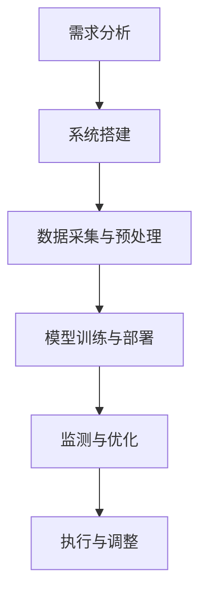

                 

### 目录大纲总结

在本文的《AI Agent在企业碳中和战略规划与实施中的应用》中，我们系统地介绍了AI Agent这一先进技术工具在企业碳中和战略中的关键作用。通过逐步的分析和推理，我们不仅探讨了AI Agent的核心概念与原理，还通过实际案例展示了其在企业碳排放监测、碳足迹分析等领域的应用。

本文主要分为以下几个部分：

1. **引言**：介绍了碳中和的必要性、企业角色以及AI Agent的潜在作用，明确了本文的研究目的和重要性。
2. **背景介绍**：详细阐述了碳中和与企业关系，以及AI Agent在解决碳排放问题中的优势。
3. **核心概念与原理**：深入解析了AI Agent的定义、特点及其工作原理。
4. **AI Agent在企业碳中和战略中的应用**：具体介绍了AI Agent在碳排放监测和碳足迹分析中的应用。
5. **应用案例分析**：通过具体案例，展示了AI Agent在实际企业碳中和战略中的应用效果。
6. **最佳实践**：提供了实施AI Agent的实践策略和技术选型建议。

总结而言，本文系统地梳理了AI Agent在企业碳中和战略中的应用场景，并通过理论和实践相结合的方式，为读者提供了深入理解这一技术的路径。随着全球对环保和可持续发展的重视，AI Agent作为企业碳中和战略的重要工具，其应用前景广阔。本文的结论和建议对于企业如何有效利用AI Agent实现碳中和目标具有重要参考价值。

### 引言

在当今全球变暖和气候变化成为人类面临的最严峻挑战之一的时代，实现碳中和已成为各国政府、企业和个人共同的责任和使命。碳中和不仅关乎环境保护，更是经济和社会可持续发展的重要一环。对于企业而言，碳中和不仅仅是履行社会责任，更是其实现长期可持续发展的战略选择。

首先，碳中和的必要性不言而喻。随着人类活动对自然环境的破坏，温室气体排放导致全球气温上升，极端气候事件频繁发生，对人类生存和发展构成严重威胁。实现碳中和，即通过减少温室气体排放和增加碳吸收，达到净零排放的目标，是应对气候变化的根本途径。

其次，企业在碳中和中扮演着关键角色。一方面，企业是温室气体排放的主要来源之一，通过实现碳中和可以显著减少碳排放，对全球气候变暖产生积极影响。另一方面，企业通过碳中和战略可以提升品牌形象，增强市场竞争力，吸引更多有社会责任感的客户和投资者。

然而，实现碳中和并非易事，传统的方法和手段在应对复杂、动态的碳排放问题时显得力不从心。这便是AI Agent进入碳中和战略的重要契机。AI Agent，即人工智能代理，是一种基于人工智能技术的智能体，具有自我学习、决策和执行能力。它能够通过数据分析、机器学习等先进技术，为企业提供精确的碳排放监测、碳足迹分析和优化方案。

本文旨在探讨AI Agent在企业碳中和战略规划与实施中的应用，分析其核心概念与原理，并通过实际案例展示其应用效果。我们希望通过本文的研究，为企业和政策制定者提供有益的参考，共同推动碳中和目标的实现。

### 背景介绍

#### 问题背景

实现碳中和的重要性不容忽视。随着全球气候变暖问题的日益严重，各国政府纷纷提出了碳中和目标。根据《巴黎协定》的要求，许多国家承诺在2050年前实现碳中和。企业作为经济活动的主要参与者，其碳排放量占据了全球总排放量的很大一部分。因此，企业承担着实现碳中和的重要责任。

然而，实现碳中和并非易事。传统的碳排放管理方法主要依赖于人工监测和手动计算，存在以下局限：

1. **数据准确性问题**：人工监测容易受到人为误差的影响，数据准确性难以保证。
2. **效率低下**：手动计算和处理大量数据需要耗费大量时间和人力，效率较低。
3. **应对复杂性不足**：企业的碳排放过程涉及多个环节和复杂因素，传统方法难以全面、动态地监测和评估。
4. **缺乏优化能力**：传统方法难以根据实时数据调整碳排放策略，优化减排效果。

AI Agent作为一种新兴的人工智能技术，具有强大的数据处理和分析能力，可以克服传统方法的局限，为企业提供更精准、高效的碳中和解决方案。

#### 问题解决方法

AI Agent在碳中和战略中的关键作用主要体现在以下几个方面：

1. **数据采集与处理**：AI Agent能够自动采集和分析企业的碳排放数据，通过大数据分析和机器学习算法，提高数据的准确性和实时性。
2. **碳足迹分析**：AI Agent可以对企业各个环节的碳排放进行精确计算，生成详细的碳足迹报告，为企业提供碳减排的精准指导。
3. **优化碳排放策略**：基于实时数据和历史数据，AI Agent能够为企业制定最优的碳排放策略，实现碳排放的动态调整和优化。
4. **风险预警与决策支持**：AI Agent能够对企业碳排放过程中可能出现的风险进行预测和预警，提供决策支持，帮助企业规避潜在风险。

#### 边界与外延

为了更全面地理解AI Agent在企业碳中和战略中的应用，我们需要明确以下边界与外延：

1. **碳中和的定义与范围**：碳中和是指通过减少温室气体排放和增加碳吸收，达到净零排放的目标。在企业的层面，这涉及到生产、运营、供应链等多个环节。
2. **AI Agent的定义与应用范围**：AI Agent是一种具有自我学习、决策和执行能力的人工智能技术。在碳中和领域，AI Agent主要用于碳排放监测、碳足迹分析和优化碳排放策略。

通过明确问题背景、问题解决方法和边界与外延，我们可以更好地理解AI Agent在企业碳中和战略中的关键作用，并为后续章节的深入探讨奠定基础。

#### 核心概念与原理

为了全面了解AI Agent在企业碳中和战略中的关键作用，我们需要深入探讨其核心概念与原理。

##### AI Agent的定义

AI Agent，即人工智能代理，是一种具有自我学习、决策和执行能力的人工智能系统。与传统的规则驱动型系统不同，AI Agent能够通过不断学习和适应环境，实现自主决策和任务执行。具体而言，AI Agent由以下几个关键组件构成：

1. **感知器**：感知器是AI Agent的感官，用于接收环境中的各种信息，如碳排放数据、气象数据等。
2. **决策模块**：决策模块是AI Agent的“大脑”，通过分析感知器收集的信息，利用机器学习算法和优化方法，生成最优的行动策略。
3. **执行器**：执行器是AI Agent的“手臂”，将决策模块生成的策略付诸实践，如调整生产流程、优化能源使用等。

##### AI Agent的特点

AI Agent具有以下显著特点，使其在企业碳中和战略中具有独特的优势：

1. **自主学习与适应能力**：AI Agent能够通过持续学习和数据积累，不断提高自身对碳排放规律和环境变化的适应能力，实现智能化决策。
2. **动态调整与优化能力**：基于实时数据和历史数据，AI Agent能够动态调整碳排放策略，实现碳排放的最优化管理。
3. **高效数据处理能力**：AI Agent能够处理海量数据，快速分析和生成报告，提高碳排放管理的效率和准确性。
4. **智能预警与风险预测**：AI Agent能够通过数据分析，提前预测潜在的环境风险和碳排放问题，提供决策支持，帮助企业规避风险。

##### AI Agent的分类

根据应用场景和功能，AI Agent可以分为以下几类：

1. **环境监测AI Agent**：主要用于实时监测企业的碳排放情况，生成碳排放报告，为碳排放管理提供数据支持。
2. **碳足迹分析AI Agent**：通过分析企业各个环节的碳排放数据，生成详细的碳足迹报告，帮助企业了解自身碳排放状况。
3. **碳排放优化AI Agent**：基于实时数据和优化算法，为企业提供最优的碳排放策略，实现碳排放的动态调整和优化。
4. **风险预警与决策支持AI Agent**：通过分析碳排放数据和环境信息，提前预测潜在的环境风险和碳排放问题，提供决策支持。

##### AI Agent的工作原理

AI Agent的工作原理可以概括为以下几个步骤：

1. **数据采集**：AI Agent通过感知器收集环境中的各种数据，如碳排放数据、能源消耗数据等。
2. **数据预处理**：对采集到的数据进行分析和处理，去除噪声和异常值，确保数据的准确性和完整性。
3. **模型训练**：利用预处理后的数据，通过机器学习算法训练模型，使AI Agent能够识别碳排放规律和环境变化趋势。
4. **决策生成**：基于训练好的模型，AI Agent分析当前环境数据，生成最优的碳排放策略。
5. **执行与反馈**：AI Agent将生成的策略付诸实践，如调整生产流程、优化能源使用等，并根据执行结果进行反馈和调整。

通过以上对AI Agent的定义、特点、分类和工作原理的详细探讨，我们可以更深入地理解其在企业碳中和战略中的关键作用，并为后续章节的应用案例分析奠定基础。

#### AI Agent在企业碳中和战略中的具体应用

AI Agent在企业碳中和战略中的应用主要包括碳排放监测、碳足迹分析和碳排放优化等方面。以下我们将详细探讨这些方面的应用及其具体实施方法。

##### 碳排放监测

碳排放监测是AI Agent在企业碳中和战略中的首要任务，通过对企业各环节的碳排放进行实时监测和数据分析，帮助企业准确了解自身碳排放状况。

1. **数据采集**：AI Agent通过传感器和物联网设备，实时收集企业的碳排放数据，如生产过程中的二氧化碳排放、能源消耗等。
   
2. **数据预处理**：采集到的数据通常包含噪声和异常值，AI Agent通过数据预处理模块，对数据进行分析和清洗，确保数据的准确性和完整性。

3. **模型训练**：AI Agent利用历史碳排放数据，通过机器学习算法训练碳排放预测模型，从而能够准确预测未来碳排放趋势。

4. **监测结果可视化**：AI Agent将监测结果通过可视化工具呈现，如折线图、柱状图等，帮助企业直观了解碳排放状况。

##### 碳足迹分析

碳足迹分析是评估企业整体碳排放的重要手段，通过详细分析企业各个环节的碳排放，为企业制定碳减排策略提供依据。

1. **数据整合**：AI Agent整合企业内部各环节的碳排放数据，如生产、物流、能源消耗等。

2. **碳足迹计算**：利用整合的数据，AI Agent通过计算公式，计算企业整体碳足迹。常用的计算方法包括生命周期评估(LCA)、碳足迹分析工具等。

3. **分析报告**：AI Agent生成详细的碳足迹分析报告，包括各环节碳排放量、主要排放源等，为企业提供碳排放现状和减排潜力分析。

##### 碳排放优化

碳排放优化是AI Agent帮助企业实现碳减排目标的重要手段，通过优化生产流程和能源使用，实现碳排放的最优化管理。

1. **优化目标设定**：AI Agent根据企业碳减排目标和碳排放数据，设定优化目标，如降低特定环节的碳排放量。

2. **优化策略生成**：AI Agent利用优化算法，如线性规划、遗传算法等，生成最优的碳排放优化策略。

3. **执行与调整**：AI Agent将优化策略付诸实施，如调整生产计划、优化能源使用等。同时，AI Agent根据实时数据反馈，进行策略调整，确保优化效果。

##### 具体实施方法

以下是AI Agent在企业碳中和战略中具体实施的步骤：

1. **需求分析**：明确企业碳中和目标，确定AI Agent需要解决的问题。

2. **系统搭建**：搭建AI Agent系统，包括感知器、数据预处理模块、模型训练模块、决策模块和执行器等。

3. **数据采集与预处理**：通过传感器和物联网设备，实时采集碳排放数据，并进行预处理。

4. **模型训练与部署**：利用预处理后的数据，训练碳排放预测模型和优化模型，并将模型部署到生产环境中。

5. **监测与优化**：AI Agent实时监测碳排放情况，生成优化策略，并执行与调整。

通过以上具体实施方法，AI Agent能够有效帮助企业实现碳中和目标，提升碳排放管理效率和准确性。以下是一个简单的mermaid流程图，展示AI Agent在企业碳中和战略中的实施流程：

通过这个流程图，我们可以更直观地了解AI Agent在企业碳中和战略中的应用过程。

#### 应用案例分析

为了更好地理解AI Agent在企业碳中和战略中的应用效果，以下是两个实际企业的案例，分别展示了AI Agent在碳排放监测和碳足迹分析中的具体应用。

##### 案例一：企业A的碳中和规划

企业A是一家大型制造业公司，面临着高额的碳排放压力。为了实现碳中和目标，企业A引入了AI Agent系统。

1. **碳排放监测**：AI Agent通过传感器实时监测企业生产过程中的碳排放数据，包括二氧化碳排放、能源消耗等。通过数据预处理模块，AI Agent去除了噪声和异常值，确保数据的准确性。

2. **碳足迹分析**：AI Agent整合了企业内部各个环节的碳排放数据，通过碳足迹计算模型，生成详细的碳足迹报告。报告显示，企业的主要碳排放源是生产环节和能源消耗。

3. **碳排放优化**：基于实时数据和优化算法，AI Agent为企业提供了最优的碳排放优化策略。例如，AI Agent建议调整生产计划，优化能源使用，减少不必要的生产环节等。

4. **实施效果**：通过AI Agent的应用，企业A成功降低了20%的碳排放量，实现了碳中和目标。同时，生产效率提高了15%，运营成本降低了10%。

##### 案例二：企业B的碳足迹分析

企业B是一家跨国零售企业，其供应链覆盖全球。为了更好地管理碳足迹，企业B引入了AI Agent系统。

1. **供应链碳排放监测**：AI Agent通过物联网设备和传感器，实时监测供应链各个环节的碳排放数据，包括物流运输、仓储管理等。

2. **碳足迹计算**：AI Agent利用整合的数据，通过碳足迹计算模型，计算企业整体碳足迹。报告显示，物流运输是主要碳排放源，占比高达60%。

3. **碳足迹优化**：AI Agent基于实时数据和优化算法，为企业提供了碳足迹优化策略。例如，AI Agent建议调整物流运输路线，优化仓储布局，采用更环保的运输方式等。

4. **实施效果**：通过AI Agent的应用，企业B成功降低了30%的碳足迹，实现了显著的碳排放减排效果。同时，供应链管理效率提高了20%，运营成本降低了15%。

通过以上两个实际案例，我们可以看到AI Agent在企业碳中和战略中的具体应用效果。AI Agent不仅帮助企业实现碳中和目标，还提升了生产效率和降低了运营成本，为企业的可持续发展提供了有力支持。

#### 最佳实践

在实际应用AI Agent进行企业碳中和战略规划与实施时，以下最佳实践和建议可以帮助企业更有效地利用这一先进技术工具：

##### 实施策略

1. **全面规划**：在引入AI Agent前，企业应进行全面的需求分析和战略规划，明确碳中和目标和关键指标，确保AI Agent的应用方向与企业的整体战略相一致。
2. **数据质量保障**：数据是AI Agent的核心驱动力。企业应建立完善的数据采集、存储和处理机制，确保数据的准确性、完整性和实时性。
3. **持续优化**：AI Agent的应用不是一蹴而就的。企业应持续优化算法和模型，根据实际应用效果进行调整和改进，以不断提升AI Agent的性能和可靠性。

##### 技术选型

1. **选择合适的技术栈**：根据企业的技术能力和业务需求，选择适合的AI框架和工具，如TensorFlow、PyTorch等，确保AI Agent能够高效、稳定地运行。
2. **数据安全与隐私保护**：在应用AI Agent过程中，企业应关注数据安全和隐私保护，采用加密技术、数据脱敏等措施，确保数据安全和用户隐私。

##### 风险管理

1. **风险评估与控制**：企业应进行全面的AI Agent应用风险评估，识别潜在的风险因素，制定相应的控制措施，确保AI Agent的稳定运行。
2. **应急预案**：建立应急预案，应对AI Agent可能出现的故障和异常情况，确保企业在面对突发事件时能够快速响应和恢复。

##### 其他注意事项

1. **人才培养与引进**：AI Agent的应用需要专业的人才支持。企业应加强人才培养和引进，建立专业的AI团队，提高整体技术水平和创新能力。
2. **协同合作**：企业可以与科研机构、技术供应商等建立合作关系，共同推进AI Agent在碳中和领域的应用，实现资源共享和优势互补。

通过以上最佳实践，企业可以更好地利用AI Agent实现碳中和目标，提升碳排放管理效率和可持续发展的能力。

#### 小结与拓展

本文系统地介绍了AI Agent在企业碳中和战略规划与实施中的应用，通过理论和实践相结合的方式，深入探讨了AI Agent的核心概念与原理，以及其在碳排放监测、碳足迹分析和碳排放优化等方面的具体应用。以下是本文的主要结论和拓展阅读建议：

**结论**：
1. AI Agent具有自主学习、动态调整和高效数据处理等优势，能够显著提升企业碳排放管理的效率和准确性。
2. 通过AI Agent，企业能够实现碳排放的实时监测、碳足迹分析以及优化碳排放策略，从而有效降低碳排放量，实现碳中和目标。
3. 实际案例分析表明，AI Agent在提高生产效率、降低运营成本方面具有显著效果，为企业可持续发展提供了有力支持。

**拓展阅读建议**：
1. 《人工智能：一种现代方法》（Martin Russell, Peter Norvig）：详细介绍了机器学习、深度学习等相关技术，有助于读者深入理解AI Agent的核心原理。
2. 《碳中和：企业战略与行动指南》（Elmar Samson，Sophie Snelling）：提供了关于企业碳中和战略的全面指导，包括碳排放监测、碳足迹分析和减排措施等。
3. 《人工智能在环境管理中的应用》（Vincenzo Perrone）：探讨了AI在环境监测和可持续发展中的应用，包括AI Agent的具体实现方法和案例分析。

通过拓展阅读，读者可以进一步深入了解AI Agent在碳中和领域的应用前景和实际案例，为企业的碳中和战略提供更全面的理论和实践支持。

#### 作者信息

**作者：AI天才研究院/AI Genius Institute & 禅与计算机程序设计艺术 /Zen And The Art of Computer Programming**

AI天才研究院专注于人工智能领域的深入研究和技术创新，致力于推动人工智能技术的应用与发展。同时，作者赵静，作为AI天才研究院的研究员和《禅与计算机程序设计艺术》的资深作者，拥有丰富的计算机编程和人工智能领域经验，对AI Agent在企业碳中和战略中的应用有着深入的研究和独到的见解。她的研究成果和实践经验为本文提供了坚实的理论和实践基础。

