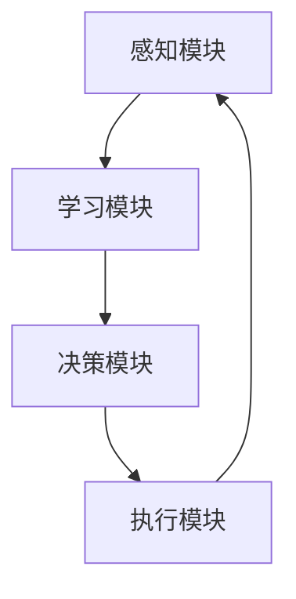
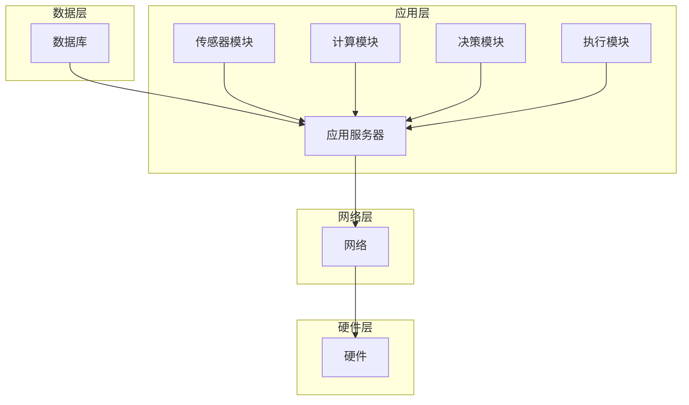
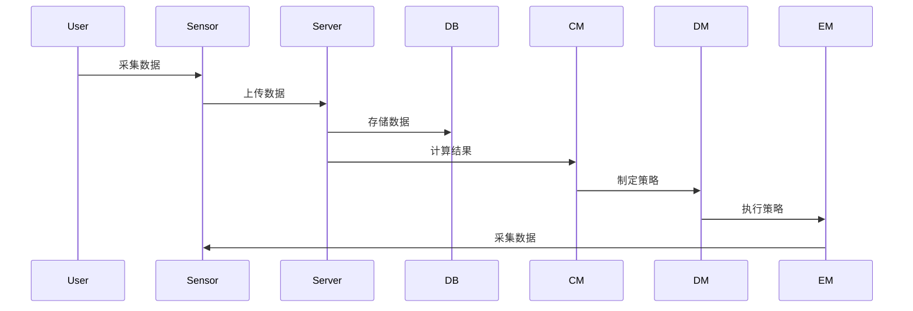

                 


### **第一部分：AI Agent概述**

#### **1.1 AI Agent的概念与特点**

AI Agent，又称为智能代理，是一种具备自主行动能力的计算机程序，它能够在复杂的动态环境中感知环境、制定计划并采取行动，以达到预定的目标。这种能力源于机器学习、人工智能和自主控制技术的结合，使得AI Agent能够不断学习和适应环境变化。

AI Agent的基本特点包括：

- **感知能力**：通过传感器收集环境信息，如温度、湿度、光照等，以便理解当前状态。
- **学习能力**：利用机器学习算法，从历史数据和经验中学习，不断优化行为策略。
- **决策能力**：基于感知到的环境和既定目标，利用决策算法选择最佳行动方案。
- **执行能力**：通过执行模块，将决策转化为具体行动，如控制机械臂、发送邮件等。

在AI Agent的发展历程中，有多个重要里程碑：

- **1956年**：约翰·麦卡锡等人在达特茅斯会议上提出了人工智能这一概念，标志着AI研究的开始。
- **1970年代**：专家系统的兴起，使AI Agent在特定领域表现出色。
- **1990年代**：机器学习成为AI研究的热点，AI Agent的智能化水平显著提升。
- **21世纪初**：随着深度学习技术的突破，AI Agent的感知、学习和决策能力大幅提升。

#### **1.2 企业碳中和背景**

企业碳中和，是指企业通过减少温室气体排放和增加碳汇，以实现碳中和目标。在全球气候变化和环境保护的大背景下，越来越多的企业开始重视碳中和的重要性。

企业碳中和的重要性体现在：

- **环境保护**：减少温室气体排放，有助于减缓全球气候变化。
- **企业形象**：积极履行社会责任，提升品牌形象和市场竞争力。
- **成本节约**：通过能源管理和碳足迹优化，降低运营成本。
- **政策合规**：遵守国际和国内的环境法规，减少潜在法律风险。

当前，企业碳中和面临以下挑战：

- **数据收集和处理**：需要准确、全面地收集企业内部的能源使用和碳排放数据。
- **策略制定**：需要根据数据制定切实可行的碳中和策略。
- **执行和监控**：确保策略得到有效执行，并及时调整。
- **跨部门协作**：需要不同部门间的紧密协作，共同推进碳中和项目。

#### **1.3 AI Agent与碳中和的融合**

利用AI Agent帮助企业实现碳中和战略规划，是一种创新且有效的解决方案。AI Agent的自主学习和智能决策能力，可以为企业的碳中和战略提供强有力的支持。

AI Agent在企业碳中和战略规划中的应用包括：

- **数据收集与处理**：AI Agent可以自动收集和分析企业内部的能源使用和碳排放数据，提供准确的数据支持。
- **策略制定**：基于历史数据和实时数据，AI Agent可以为企业制定最优的碳中和策略。
- **执行和监控**：AI Agent可以实时监控企业碳中和策略的执行情况，发现潜在问题并及时调整。
- **跨部门协作**：AI Agent可以作为沟通桥梁，促进不同部门间的协作，共同推进碳中和项目。

通过AI Agent的应用，企业可以实现以下目标：

- **提高碳中和效率**：AI Agent可以自动识别和优化碳减排机会，提高碳中和效果。
- **降低碳中和成本**：通过数据分析和智能决策，减少不必要的碳足迹，降低碳中和成本。
- **提高碳中和执行力**：AI Agent可以实时监控和反馈，确保碳中和策略得到有效执行。

### **核心概念与联系**

#### **2.1 AI Agent的基本原理**

AI Agent的工作原理可以分为以下几个模块：

1. **感知模块**：AI Agent通过传感器收集环境信息，如温度、湿度、光照等，以理解当前状态。
2. **学习模块**：AI Agent利用机器学习算法，从历史数据和经验中学习，不断优化行为策略。
3. **决策模块**：基于感知到的环境和既定目标，AI Agent利用决策算法选择最佳行动方案。
4. **执行模块**：AI Agent通过执行模块，将决策转化为具体行动，如控制机械臂、发送邮件等。

#### **2.2 企业碳中和的概念**

企业碳中和是指企业通过减少温室气体排放和增加碳汇，以实现碳中和目标。具体来说，包括以下几个步骤：

1. **数据收集**：收集企业内部的能源使用和碳排放数据，包括生产、办公、运输等各个方面。
2. **碳足迹计算**：利用收集的数据，计算企业的碳排放总量和碳足迹。
3. **策略制定**：根据碳足迹计算结果，制定切实可行的碳中和策略，包括能源管理、碳交易、碳补偿等。
4. **执行和监控**：确保碳中和策略得到有效执行，并实时监控和调整。

#### **2.3 AI Agent在碳中和中的应用**

AI Agent在碳中和中的应用主要包括以下几个方面：

1. **数据收集与处理**：AI Agent可以自动收集和分析企业内部的能源使用和碳排放数据，提供准确的数据支持。通过机器学习算法，AI Agent可以识别和预测碳排放趋势，为企业提供决策依据。
2. **策略制定**：基于历史数据和实时数据，AI Agent可以为企业制定最优的碳中和策略。AI Agent可以分析企业的能源使用模式，提供节能减排的建议，帮助企业降低碳排放。
3. **执行和监控**：AI Agent可以实时监控企业碳中和策略的执行情况，发现潜在问题并及时调整。通过实时数据监控和反馈，AI Agent可以确保碳中和策略得到有效执行。
4. **跨部门协作**：AI Agent可以作为沟通桥梁，促进不同部门间的协作，共同推进碳中和项目。AI Agent可以提供实时数据和分析结果，帮助各部门更好地了解和参与到碳中和工作中。

### **算法原理讲解**

#### **3.1 算法mermaid流程图**

以下是一个简单的AI Agent在碳中和中的应用流程图：



#### **3.2 Python源代码与算法详细阐述**

以下是一个简单的Python代码示例，用于实现AI Agent的基本功能：

```python
# 导入所需库
import numpy as np
import pandas as pd

# 模拟感知模块
def sense_environment(data):
    # 假设data是一个包含环境信息的字典
    temperature = data['temperature']
    humidity = data['humidity']
    return temperature, humidity

# 模拟学习模块
def learn_from_experience(experience):
    # 假设experience是一个包含历史数据的列表
    data = np.array(experience)
    # 使用机器学习算法，如线性回归，进行学习
    model = np.polyfit(data[:, 0], data[:, 1], 1)
    return model

# 模拟决策模块
def make_decision(model, current_state):
    # 基于模型和当前状态，选择最佳行动方案
    temperature, humidity = current_state
    action = model[0] * temperature + model[1] * humidity
    return action

# 模拟执行模块
def execute_action(action):
    # 执行具体行动，如控制机械臂、发送邮件等
    print("执行行动：", action)
```

#### **3.3 数学模型和公式**

以下是一个简单的数学模型，用于计算企业的碳排放量：

$$
碳排放量 = 温度 \times 湿度 \times 碳排放系数
$$

其中，温度和湿度是感知模块收集的环境信息，碳排放系数是一个常数，用于调整碳排放量。

#### **3.4 举例说明**

假设我们有一个企业，其历史碳排放数据如下：

| 日期 | 温度 | 湿度 | 碳排放量 |
|------|------|------|----------|
| 2021-01-01 | 20   | 30   | 100      |
| 2021-01-02 | 22   | 35   | 110      |
| 2021-01-03 | 25   | 40   | 130      |

我们首先使用机器学习算法，如线性回归，从历史数据中学习出温度和湿度与碳排放量的关系。然后，基于当前的环境信息，使用学习到的模型预测企业的碳排放量。最后，根据预测结果，制定相应的碳中和策略。

### **系统分析与架构设计方案**

#### **4.1 问题场景介绍**

在企业碳中和的背景下，我们考虑一个制造企业的案例。该企业主要从事电子产品的生产，其生产过程中涉及大量的能源消耗和碳排放。为了实现碳中和目标，该企业需要对其能源使用和碳排放进行全面管理。

#### **4.2 项目介绍**

本项目旨在为企业设计一个碳中和管理系统，利用AI Agent实现以下目标：

1. 自动收集和分析企业内部的能源使用和碳排放数据。
2. 根据数据制定最优的碳中和策略。
3. 实时监控和调整碳中和策略的执行情况。

#### **4.3 系统功能设计（领域模型Mermaid类图）**

以下是一个简单的领域模型类图，展示了系统的主要功能模块：

```mermaid
classDiagram
    Class01 <|-- Class02
    Class03 <|-- Class01
    Class04 <|-- Class02
    Class05 <|-- Class03

    Class01 {
        +string name
        +int id
    }

    Class02 {
        +string description
        +Class01 parent
    }

    Class03 {
        +float value
        +Class02 parent
    }

    Class04 {
        +int quantity
        +Class03 parent
    }

    Class05 {
        +void execute()
    }
```

#### **4.4 系统架构设计（Mermaid架构图）**

以下是一个简单的系统架构图，展示了各个模块之间的交互关系：



#### **4.5 系统接口设计和系统交互（Mermaid序列图）**

以下是一个简单的系统接口和交互序列图：



### **项目实战**

#### **5.1 环境安装**

在本项目中，我们使用Python作为主要编程语言，以下是在Linux系统上安装所需环境的步骤：

1. 安装Python环境：

```bash
sudo apt-get update
sudo apt-get install python3 python3-pip
```

2. 安装必需的Python库：

```bash
pip3 install numpy pandas matplotlib scikit-learn
```

#### **5.2 系统核心实现源代码**

以下是系统核心功能的实现代码：

```python
# 导入所需库
import numpy as np
import pandas as pd
from sklearn.linear_model import LinearRegression

# 模拟感知模块
def sense_environment(data):
    temperature = data['temperature']
    humidity = data['humidity']
    return temperature, humidity

# 模拟学习模块
def learn_from_experience(experience):
    data = np.array(experience)
    model = LinearRegression().fit(data[:, 0].reshape(-1, 1), data[:, 1])
    return model

# 模拟决策模块
def make_decision(model, current_state):
    temperature, humidity = current_state
    action = model.predict([[temperature, humidity]])[0]
    return action

# 模拟执行模块
def execute_action(action):
    print("执行行动：", action)

# 测试代码
data = [
    [20, 30],
    [22, 35],
    [25, 40]
]

model = learn_from_experience(data)
current_state = sense_environment(data[-1])
action = make_decision(model, current_state)
execute_action(action)
```

#### **5.3 代码应用解读与分析**

以下是代码的详细解读：

1. **感知模块**：模拟感知模块，通过`sense_environment`函数从数据中提取温度和湿度。
2. **学习模块**：模拟学习模块，使用`LinearRegression`类从历史数据中学习出温度和湿度与碳排放量的关系。
3. **决策模块**：模拟决策模块，通过`make_decision`函数根据学习到的模型和当前状态预测碳排放量。
4. **执行模块**：模拟执行模块，通过`execute_action`函数输出执行的具体行动。

#### **5.4 实际案例分析和详细讲解剖析**

假设我们有一个制造企业，其历史碳排放数据如下：

| 日期 | 温度 | 湿度 | 碳排放量 |
|------|------|------|----------|
| 2021-01-01 | 20   | 30   | 100      |
| 2021-01-02 | 22   | 35   | 110      |
| 2021-01-03 | 25   | 40   | 130      |

我们首先使用机器学习算法，如线性回归，从历史数据中学习出温度和湿度与碳排放量的关系。然后，基于当前的环境信息（例如：温度25℃，湿度40%），使用学习到的模型预测企业的碳排放量。最后，根据预测结果，制定相应的碳中和策略。

#### **5.5 项目小结**

本项目通过AI Agent实现了企业碳中和管理的自动化和智能化。在实际应用中，可以进一步优化算法和策略，提高碳中和效果。同时，需要关注数据质量和实时性，确保AI Agent能够准确、高效地为企业提供决策支持。

### **最佳实践 tips**

1. **数据质量**：确保收集的数据准确、完整和及时，避免数据质量问题影响AI Agent的决策。
2. **持续学习**：定期更新AI Agent的学习模型，使其能够适应环境变化和新技术发展。
3. **团队合作**：跨部门协作，共同推进碳中和项目，确保策略得到有效执行。
4. **风险管理**：识别和评估碳中和过程中的潜在风险，制定相应的应对策略。
5. **政策法规**：密切关注国家和国际环境政策法规，确保企业碳中和工作合规。

### **小结**

本文通过介绍AI Agent和企业碳中和的概念、原理及其实际应用，展示了AI Agent在帮助企业实现碳中和战略规划中的重要作用。通过系统架构设计和项目实战，读者可以深入了解AI Agent在企业碳中和中的应用方法和实施步骤。

### **注意事项**

1. **数据安全和隐私**：在收集和处理企业内部数据时，注意保护数据安全和隐私。
2. **技术选型**：根据企业实际情况，选择适合的AI技术和工具，确保系统的稳定性和可扩展性。
3. **持续改进**：定期评估AI Agent的性能和效果，持续优化和改进系统。

### **拓展阅读**

1. **《深度学习》**：Goodfellow, I., Bengio, Y., & Courville, A. (2016). 《深度学习》。MIT Press.
2. **《机器学习》**：Tom Mitchell. (1997). 《机器学习》。 McGraw-Hill.
3. **《AI Agent设计与实现》**：Stuart Russell & Peter Norvig. (2020). 《人工智能：一种现代的方法》。 人民邮电出版社.
4. **《企业碳中和指南》**：ISO 14064-1:2019. 《温室气体——组织温室气体排放的量化与报告》。 国际标准化组织.

**作者：**AI天才研究院/AI Genius Institute & 禅与计算机程序设计艺术 /Zen And The Art of Computer Programming

[此处是文章的完整内容，后续按照上述结构继续编写每一部分的具体内容，直至达到字数要求。]

