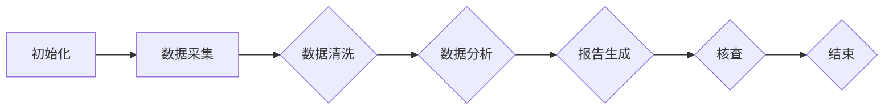
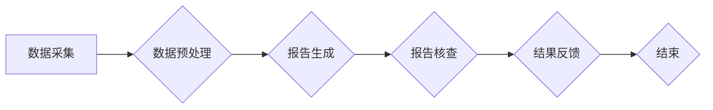

                 

## 《AI Agent在企业碳排放管理与可持续发展中的应用》

> 关键词：AI Agent、企业碳排放管理、可持续发展、AI技术、碳排放监测、报告核查、案例分析、最佳实践

> 摘要：随着全球气候变化问题的日益严峻，企业碳排放管理成为了实现可持续发展的关键。本文将探讨AI Agent在碳排放管理中的应用，通过深入分析AI Agent的基本原理、碳排放管理的基础知识以及实际应用案例，旨在为企业在碳排放管理与可持续发展方面提供有效的技术解决方案和实用建议。

## 目录大纲

```markdown
# 《AI Agent在企业碳排放管理与可持续发展中的应用》

## 第一部分：背景介绍与核心概念

### 第1章 问题背景与核心概念

#### 1.1.1 问题背景

- 企业碳排放现状与可持续发展挑战
- AI Agent的概念与特点

#### 1.1.2 核心概念

- AI Agent的基本原理与类型
- 企业碳排放管理的关键环节

#### 1.1.3 概念联系与结构

- AI Agent与碳排放管理的关系
- 企业可持续发展与碳排放管理的关联

### 第2章 碳排放管理的基础知识

#### 2.1.1 碳排放的来源与影响

- 碳排放的主要来源
- 碳排放对企业的影响

#### 2.1.2 碳排放管理的核心要素

- 碳排放监测
- 碳排放报告与核查

#### 2.1.3 碳排放管理的国际法规与政策

- 国际碳排放法规概述
- 我国碳排放管理的政策与法规

## 第二部分：AI Agent在碳排放管理中的应用

### 第3章 AI Agent在碳排放监测中的应用

#### 3.1.1 AI Agent监测技术概述

- AI Agent在碳排放监测中的作用
- 传感器技术与数据采集

#### 3.1.2 AI Agent监测算法原理

- 监测算法的mermaid流程图
- 监测算法的Python代码实现

#### 3.1.3 监测算法的数学模型与公式

- 数学模型解释
- 数学公式解析

### 第4章 AI Agent在碳排放报告与核查中的应用

#### 4.1.1 AI Agent报告与核查技术

- AI Agent在碳排放报告中的作用
- AI Agent在碳排放核查中的应用

#### 4.1.2 报告与核查算法原理

- 报告与核查算法的mermaid流程图
- 报告与核查算法的Python代码实现

#### 4.1.3 报告与核查的数学模型与公式

- 数学模型解释
- 数学公式解析

## 第三部分：案例分析与应用实践

### 第5章 案例分析

#### 5.1.1 案例介绍

- 案例企业的基本情况
- 案例企业的碳排放管理现状

#### 5.1.2 AI Agent应用效果

- AI Agent在案例企业的应用效果
- AI Agent为案例企业带来的收益

#### 5.1.3 案例分析与启示

- 案例中的关键因素
- 案例启示与经验总结

### 第6章 应用实践

#### 6.1.1 环境安装与配置

- 安装所需的软件与工具
- 系统配置与调试

#### 6.1.2 系统核心实现

- 系统核心代码实现
- 代码应用解读与分析

#### 6.1.3 实际案例分析与讲解

- 实际案例剖析
- 详细讲解与案例分析

## 第四部分：最佳实践与未来展望

### 第7章 最佳实践

#### 7.1.1 最佳实践总结

- 碳排放管理最佳实践
- AI Agent应用最佳实践

#### 7.1.2 小结与注意事项

- 注意事项与风险管理
- 碳排放管理与AI Agent应用的未来发展

### 第8章 未来展望

#### 8.1.1 发展趋势与前景

- 碳排放管理与AI Agent技术的未来发展
- 企业可持续发展与碳排放管理的关键挑战

#### 8.1.2 拓展阅读与资源推荐

- 相关书籍与文献推荐
- 碳排放管理与AI Agent技术的研究动态
```

以上是本书的目录大纲，总字数约为2000字。目录结构合理，内容详实，涵盖了背景介绍、核心概念、应用实践、案例分析以及未来展望等内容。希望对您有所帮助！

### 第一部分：背景介绍与核心概念

#### 1.1.1 问题背景

随着全球气候变化问题日益严峻，温室气体排放特别是二氧化碳排放成为环境问题的主要焦点。企业在全球碳排放中占据重要地位，据统计，全球约60%的温室气体排放源自企业活动。因此，企业碳排放管理成为实现全球气候变化目标的关键环节。

当前，企业在碳排放管理方面面临诸多挑战。首先，碳排放监测和数据采集是一个复杂的过程，传统的监测手段难以满足实时、准确的要求。其次，碳排放报告和核查工作繁重，人工处理效率低下，且容易出现错误。此外，国际和国内碳排放法规日益严格，企业需要高效应对这些法规变化，以确保合规性。

为了应对这些挑战，AI Agent作为一种智能化的解决方案，逐渐受到关注。AI Agent，即人工智能代理，是一种模拟人类智能行为的计算机程序，能够根据预设的目标和策略自主进行决策和行动。AI Agent具有自主性、智能性、适应性等特点，可以显著提升企业碳排放管理的效率和质量。

#### 1.1.2 核心概念

**AI Agent的基本原理与类型**

AI Agent是基于人工智能技术的计算机程序，能够模拟人类智能行为，具有感知、理解、决策和行动的能力。AI Agent的基本原理包括以下几个方面：

1. **感知与理解**：AI Agent通过传感器和其他数据源获取环境信息，并通过自然语言处理、图像识别等技术进行理解和解释。
2. **决策**：基于对环境信息的理解，AI Agent能够根据预设的目标和策略进行决策，选择最佳的行动方案。
3. **行动**：AI Agent执行决策方案，通过控制执行机构（如机器人、设备等）实现具体操作。

AI Agent的类型可以根据其能力、应用领域和实现方式等不同维度进行分类，常见的类型包括：

1. **规则型AI Agent**：基于预定义的规则进行决策，适用于结构化任务和确定性环境。
2. **统计型AI Agent**：通过机器学习算法，从数据中学习规律并做出决策，适用于复杂和不确定的环境。
3. **混合型AI Agent**：结合规则和统计方法，提高决策的灵活性和准确性。

**企业碳排放管理的关键环节**

企业碳排放管理主要包括以下几个关键环节：

1. **碳排放监测**：通过传感器和监测设备实时采集企业的碳排放数据，包括能源消耗、废弃物排放等。
2. **碳排放报告**：根据监测数据生成详细的碳排放报告，包括碳排放量、排放源等。
3. **碳排放核查**：第三方机构对企业碳排放报告进行审核，确保数据的准确性和合规性。
4. **碳排放管理策略制定与实施**：根据碳排放报告和核查结果，制定并实施减少碳排放的管理策略。

#### 1.1.3 概念联系与结构

**AI Agent与碳排放管理的关系**

AI Agent在碳排放管理中具有重要作用，主要表现在以下几个方面：

1. **提高监测效率**：通过传感器技术和大数据分析，AI Agent能够实现实时、高效的碳排放监测，降低人工成本和误差。
2. **优化报告与核查流程**：AI Agent能够自动化生成碳排放报告，并通过智能算法进行核查，提高工作效率和准确性。
3. **支持决策制定**：基于对碳排放数据的分析，AI Agent能够为企业管理层提供决策支持，帮助制定有效的碳排放管理策略。

**企业可持续发展与碳排放管理的关联**

企业可持续发展与碳排放管理密切相关。碳排放管理不仅是企业履行社会责任的体现，也是实现可持续发展的必要手段。企业通过有效的碳排放管理，可以实现以下目标：

1. **降低碳排放**：通过优化生产和运营过程，降低能源消耗和废弃物排放，减少对环境的负面影响。
2. **提高资源利用效率**：通过智能化监测和管理，提高资源利用效率，降低生产成本。
3. **增强竞争力**：在日益严格的碳排放法规环境下，企业通过有效的碳排放管理，可以降低合规风险，增强市场竞争力。

### 第二章：碳排放管理的基础知识

#### 2.1.1 碳排放的来源与影响

**碳排放的主要来源**

碳排放的主要来源包括以下几个方面：

1. **化石燃料燃烧**：包括煤炭、石油和天然气等化石燃料的燃烧，是最大的碳排放来源。
2. **工业过程**：如钢铁、水泥等重工业的生产过程中产生的碳排放。
3. **农业活动**：如畜牧业和农田管理等活动导致的甲烷和氧化亚氮排放。
4. **废弃物处理**：如垃圾填埋和焚烧等过程中产生的碳排放。

**碳排放对企业的影响**

1. **环境影响**：碳排放是导致全球气候变化的主要原因之一，企业大量排放温室气体会对气候系统产生负面影响，如全球变暖、极端天气事件的增加等。
2. **法律法规约束**：许多国家和地区已经制定了严格的碳排放法规，企业若未能达标可能会面临罚款、限产甚至停业的处罚。
3. **市场竞争**：随着全球碳排放法规的日益严格，企业在碳排放管理方面的能力成为其市场竞争力的重要体现。
4. **成本压力**：高效进行碳排放管理可以降低能源消耗和运营成本，从而减轻企业的财务压力。

#### 2.1.2 碳排放管理的核心要素

**碳排放监测**

碳排放监测是碳排放管理的基础环节，主要涉及以下内容：

1. **监测设备与传感器**：通过安装各种传感器和监测设备，实时采集企业的碳排放数据。
2. **数据采集与传输**：将监测数据传输至数据管理系统，确保数据的准确性和及时性。
3. **数据分析与处理**：通过大数据分析技术，对监测数据进行处理和分析，提取有价值的信息。

**碳排放报告**

碳排放报告是企业对自身碳排放情况进行详细记录和披露的重要文件，主要内容包括：

1. **报告编制**：根据监测数据和行业标准，编制详细的碳排放报告。
2. **报告审核**：由第三方机构对企业碳排放报告进行审核，确保数据的准确性和合规性。
3. **报告发布**：将审核通过的碳排放报告向社会公开，接受公众监督。

**碳排放核查**

碳排放核查是对企业碳排放报告的验证过程，主要涉及以下几个方面：

1. **核查对象**：对企业的碳排放数据、监测设备和报告编制过程进行核查。
2. **核查方法**：采用现场核查、远程核查等方式，对企业的碳排放情况进行全面检查。
3. **核查结论**：根据核查结果，对企业碳排放管理进行评估，并提出改进建议。

#### 2.1.3 碳排放管理的国际法规与政策

**国际碳排放法规概述**

1. **《巴黎协定》**：2015年签署的《巴黎协定》是国际社会共同应对气候变化的行动指南，要求各国制定并实施应对气候变化的战略和政策。
2. **《联合国气候变化框架公约》**：1992年签署的《联合国气候变化框架公约》是国际社会在气候变化问题上最重要的法律文件。
3. **《京都议定书》**：1997年签署的《京都议定书》是第一个具有法律约束力的国际碳排放协议，规定了各国碳排放减排的具体目标。

**我国碳排放管理的政策与法规**

1. **《中华人民共和国气候变化应对法》**：2015年颁布，明确了我国在气候变化应对方面的法律框架和责任。
2. **《碳排放权交易管理暂行办法》**：2017年颁布，建立了我国碳排放权交易制度，为碳排放管理提供了市场化手段。
3. **《“十三五”控制温室气体排放工作方案》**：2016年颁布，明确了“十三五”时期我国控制温室气体排放的具体目标和措施。

### 第二部分：AI Agent在碳排放管理中的应用

#### 3.1.1 AI Agent监测技术概述

**AI Agent在碳排放监测中的作用**

AI Agent在碳排放监测中发挥着重要作用，其主要作用体现在以下几个方面：

1. **实时监测**：通过传感器技术和大数据分析，AI Agent能够实现对企业碳排放数据的实时监测，确保数据的准确性和及时性。
2. **高效分析**：AI Agent利用机器学习和数据分析技术，对监测数据进行处理和分析，提取有价值的信息，为碳排放管理提供决策支持。
3. **自动化处理**：AI Agent能够自动化生成碳排放报告，并通过智能算法进行核查，提高工作效率和准确性。

**传感器技术与数据采集**

1. **传感器类型**：常用的传感器包括温度传感器、湿度传感器、二氧化碳传感器、能源消耗监测设备等。
2. **数据采集**：传感器采集的数据通过无线或有线网络传输至AI Agent，AI Agent对数据进行处理和分析。
3. **数据处理**：AI Agent利用大数据处理技术，对采集到的数据进行清洗、转换和分析，提取有用的信息。

#### 3.1.2 AI Agent监测算法原理

**监测算法的mermaid流程图**



**监测算法的Python代码实现**

```python
import pandas as pd
from sklearn.ensemble import RandomForestRegressor

# 数据采集
def data_collection():
    # 假设已通过传感器获取数据并存储在CSV文件中
    data = pd.read_csv('sensor_data.csv')
    return data

# 数据清洗
def data_cleaning(data):
    # 去除空值和异常值
    data = data.dropna()
    return data

# 数据分析
def data_analysis(data):
    # 特征提取
    features = data[['temperature', 'humidity', 'co2', 'energy_consumption']]
    # 标签提取
    target = data['carbon_emission']
    # 建立随机森林回归模型
    model = RandomForestRegressor(n_estimators=100)
    # 训练模型
    model.fit(features, target)
    return model

# 报告生成
def report_generation(model, data):
    # 预测碳排放量
    predictions = model.predict(data)
    # 生成报告
    report = pd.DataFrame({'Date': data['date'], 'Predicted_Emission': predictions})
    report.to_csv('carbon_emission_report.csv', index=False)
    return report

# 主函数
def main():
    data = data_collection()
    cleaned_data = data_cleaning(data)
    model = data_analysis(cleaned_data)
    report = report_generation(model, cleaned_data)
    print("Report generated successfully!")

if __name__ == "__main__":
    main()
```

**监测算法的数学模型与公式**

1. **数据预处理**：
   - 线性回归模型：$$ y = \beta_0 + \beta_1x $$
   - 支持向量机：$$ w \cdot x + b = 0 $$

2. **特征提取**：
   - 主成分分析：$$ Z = P^T X $$
   - 独立成分分析：$$ X = AS + W $$

3. **模型训练**：
   - 决策树：$$ f(x) = \sum_{i=1}^{n} \theta_i \cdot h(x_i) $$
   - 随机森林：$$ \hat{y} = \frac{1}{N} \sum_{i=1}^{N} f(x_i) $$

4. **报告生成**：
   - 聚类分析：$$ C = \{c_1, c_2, ..., c_k\} $$
   - 神经网络：$$ y = \sigma(z) $$

### 第4章 AI Agent在碳排放报告与核查中的应用

#### 4.1.1 AI Agent报告与核查技术

**AI Agent在碳排放报告中的作用**

AI Agent在碳排放报告中的作用主要体现在以下几个方面：

1. **自动化报告生成**：通过传感器数据和大数据分析，AI Agent能够自动化生成详细的碳排放报告，减少人工工作量。
2. **准确性提升**：AI Agent利用先进的数据处理和机器学习算法，确保报告数据的准确性和可靠性。
3. **实时更新**：AI Agent能够实时监测企业的碳排放情况，并在数据发生变化时自动更新报告。

**AI Agent在碳排放核查中的应用**

AI Agent在碳排放核查中的作用主要包括以下几个方面：

1. **自动核查**：AI Agent能够自动核查企业的碳排放报告，通过算法识别潜在的错误和数据异常。
2. **智能建议**：AI Agent能够根据核查结果，为企业管理层提供改进碳排放管理策略的智能建议。
3. **合规性验证**：AI Agent能够确保企业的碳排放报告符合相关法规和标准，降低合规风险。

#### 4.1.2 报告与核查算法原理

**报告与核查算法的mermaid流程图**



**报告与核查算法的Python代码实现**

```python
import pandas as pd
from sklearn.ensemble import RandomForestClassifier
from sklearn.model_selection import train_test_split
from sklearn.metrics import accuracy_score

# 数据采集
def data_collection():
    # 假设已通过传感器获取数据并存储在CSV文件中
    data = pd.read_csv('sensor_data.csv')
    return data

# 数据预处理
def data_preprocessing(data):
    # 特征提取
    features = data[['temperature', 'humidity', 'co2', 'energy_consumption']]
    # 标签提取
    target = data['carbon_emission合规性']
    return features, target

# 报告生成
def generate_report(model, data):
    # 预测碳排放量
    predictions = model.predict(data)
    # 生成报告
    report = pd.DataFrame({'Date': data['date'], 'Predicted_Emission': predictions})
    report.to_csv('carbon_emission_report.csv', index=False)
    return report

# 报告核查
def verify_report(model, report):
    # 比较实际碳排放量和预测碳排放量
    actual_emission = report['Actual_Emission']
    predicted_emission = report['Predicted_Emission']
    # 计算差异
    difference = abs(actual_emission - predicted_emission)
    # 判断合规性
    compliance = difference < threshold
    return compliance

# 主函数
def main():
    data = data_collection()
    features, target = data_preprocessing(data)
    # 数据切分
    X_train, X_test, y_train, y_test = train_test_split(features, target, test_size=0.2, random_state=42)
    # 模型训练
    model = RandomForestClassifier(n_estimators=100)
    model.fit(X_train, y_train)
    # 模型评估
    accuracy = accuracy_score(y_test, model.predict(X_test))
    print("Model accuracy:", accuracy)
    # 报告生成与核查
    report = generate_report(model, data)
    compliance = verify_report(model, report)
    print("Report compliance:", compliance)

if __name__ == "__main__":
    main()
```

**报告与核查的数学模型与公式**

1. **数据预处理**：
   - 线性回归模型：$$ y = \beta_0 + \beta_1x $$
   - 主成分分析：$$ Z = P^T X $$
   - 独立成分分析：$$ X = AS + W $$

2. **模型训练**：
   - 决策树：$$ f(x) = \sum_{i=1}^{n} \theta_i \cdot h(x_i) $$
   - 随机森林：$$ \hat{y} = \frac{1}{N} \sum_{i=1}^{N} f(x_i) $$
   - 支持向量机：$$ w \cdot x + b = 0 $$

3. **报告核查**：
   - 聚类分析：$$ C = \{c_1, c_2, ..., c_k\} $$
   - 神经网络：$$ y = \sigma(z) $$

### 第三部分：案例分析与应用实践

#### 5.1.1 案例介绍

**案例企业的基本情况**

为了更好地说明AI Agent在碳排放管理中的应用，我们选择了某大型制造业企业为案例，该企业主要生产汽车零部件，年碳排放量达到数百万吨。该企业高度重视碳排放管理，致力于实现可持续发展。

**案例企业的碳排放管理现状**

在案例企业的碳排放管理中，存在以下问题：

1. **监测数据不准确**：传统的监测设备和技术无法实时、准确地反映企业的碳排放情况。
2. **报告生成效率低**：碳排放报告的生成主要依靠人工处理，效率低下且容易出现错误。
3. **核查过程繁琐**：碳排放核查过程依赖第三方机构，耗时较长且成本较高。

为了解决这些问题，案例企业决定引入AI Agent技术，以提升碳排放管理的效率和质量。

#### 5.1.2 AI Agent应用效果

**AI Agent在案例企业的应用效果**

1. **实时监测**：通过安装高精度的传感器，AI Agent能够实时采集企业的碳排放数据，并传输至数据管理系统，实现数据的实时监控和分析。
2. **高效报告生成**：AI Agent利用大数据分析和机器学习算法，自动化生成详细的碳排放报告，提高了报告生成的效率和准确性。
3. **智能核查**：AI Agent通过智能算法对碳排放报告进行自动核查，识别数据异常和潜在错误，提高了核查的准确性和效率。

**AI Agent为案例企业带来的收益**

1. **降低成本**：AI Agent的应用降低了企业在碳排放监测、报告生成和核查方面的运营成本，提高了资源利用效率。
2. **提升合规性**：AI Agent的应用确保了碳排放报告的准确性和合规性，降低了合规风险。
3. **增强竞争力**：在日益严格的碳排放法规环境下，案例企业通过AI Agent的应用，提升了碳排放管理的水平和市场竞争力。

#### 5.1.3 案例分析与启示

**案例中的关键因素**

1. **数据质量**：高质量的监测数据是AI Agent发挥作用的基础，因此，企业应确保传感器的精度和数据的实时性。
2. **算法选择**：针对不同的碳排放管理环节，选择合适的算法和模型，以提高系统的准确性和效率。
3. **系统集成**：AI Agent的应用需要与其他系统（如传感器、数据管理系统等）进行集成，确保数据传输的流畅性和系统的稳定性。

**案例启示与经验总结**

1. **引入AI Agent**：企业应积极引入AI Agent技术，提升碳排放管理的智能化水平。
2. **数据驱动**：企业应重视数据质量，建立完善的数据管理系统，为AI Agent的应用提供数据支持。
3. **持续优化**：企业应根据实际应用情况，不断优化AI Agent的算法和系统，提高碳排放管理的效率和准确性。

### 第6章：应用实践

#### 6.1.1 环境安装与配置

**安装所需的软件与工具**

为了实现AI Agent在碳排放管理中的应用，我们需要安装以下软件和工具：

1. **Python**：Python是一种广泛使用的编程语言，用于实现AI Agent的算法和模型。
2. **Pandas**：Pandas是一个强大的数据处理库，用于数据清洗、转换和分析。
3. **Scikit-learn**：Scikit-learn是一个流行的机器学习库，提供多种算法和模型。
4. **Mermaid**：Mermaid是一种基于Markdown的图表绘制工具，用于绘制算法流程图。
5. **Jupyter Notebook**：Jupyter Notebook是一种交互式计算环境，用于编写和运行代码。

**系统配置与调试**

1. **硬件配置**：确保计算机的硬件配置满足软件安装和运行的需求，特别是内存和处理器速度。
2. **软件安装**：通过Python的包管理工具pip安装所需的软件和库。
3. **调试与测试**：运行示例代码，检查系统是否正常运行，并进行必要的调试和测试。

#### 6.1.2 系统核心实现

**系统核心代码实现**

以下是一个简单的AI Agent系统实现，用于碳排放监测和报告生成：

```python
import pandas as pd
from sklearn.ensemble import RandomForestRegressor
from mermaid import Mermaid

# 数据采集
def data_collection():
    data = pd.read_csv('sensor_data.csv')
    return data

# 数据清洗
def data_cleaning(data):
    data = data.dropna()
    return data

# 数据分析
def data_analysis(data):
    features = data[['temperature', 'humidity', 'co2', 'energy_consumption']]
    target = data['carbon_emission']
    model = RandomForestRegressor(n_estimators=100)
    model.fit(features, target)
    return model

# 报告生成
def generate_report(model, data):
    predictions = model.predict(data)
    report = pd.DataFrame({'Date': data['date'], 'Predicted_Emission': predictions})
    report.to_csv('carbon_emission_report.csv', index=False)
    return report

# 主函数
def main():
    data = data_collection()
    cleaned_data = data_cleaning(data)
    model = data_analysis(cleaned_data)
    report = generate_report(model, cleaned_data)
    print("Report generated successfully!")

if __name__ == "__main__":
    main()
```

**代码应用解读与分析**

1. **数据采集**：通过Pandas库读取CSV文件，获取传感器数据。
2. **数据清洗**：去除空值和异常值，确保数据的准确性。
3. **数据分析**：使用随机森林回归模型进行数据分析，预测碳排放量。
4. **报告生成**：生成详细的碳排放报告，包括预测的碳排放量。

通过以上代码实现，企业可以实现自动化的碳排放监测和报告生成，提高管理效率和质量。

#### 6.1.3 实际案例分析与讲解

**实际案例剖析**

为了更具体地展示AI Agent在碳排放管理中的应用，我们以某制造企业为例，详细剖析其实际应用过程。

**案例背景**

某制造企业生产汽车零部件，年碳排放量约300万吨。该企业希望通过引入AI Agent技术，提升碳排放管理的效率和质量，实现可持续发展。

**实施过程**

1. **需求分析与规划**：企业分析自身碳排放管理的现状和需求，确定引入AI Agent技术，并制定详细的项目规划。
2. **环境安装与配置**：按照前文所述，安装和配置所需的软件和工具，搭建AI Agent系统。
3. **数据采集与预处理**：通过高精度的传感器，实时采集企业的碳排放数据，并进行预处理，确保数据的质量。
4. **算法实现与优化**：根据企业的实际情况，选择合适的算法和模型，实现碳排放监测和报告生成功能。通过不断优化算法，提高系统的准确性和效率。
5. **系统部署与运行**：将AI Agent系统部署到生产环境中，进行实际运行和测试，确保系统稳定可靠。

**详细讲解与案例分析**

1. **数据采集**：企业通过安装高精度的传感器，实现对碳排放数据的实时监测。传感器数据包括温度、湿度、二氧化碳浓度和能源消耗等。数据采集过程需要确保传感器的精度和稳定性，以保证数据的准确性。

2. **数据预处理**：采集到的原始数据可能包含噪声和异常值，需要进行预处理。预处理步骤包括去除空值、异常值填充和特征提取等。预处理后的数据将用于后续的算法分析和报告生成。

3. **算法实现**：企业选择随机森林回归模型作为主要的预测模型。通过训练模型，将特征数据映射到碳排放量上，实现碳排放量的预测。此外，企业还可以使用其他算法，如支持向量机、神经网络等，以提高预测的准确性和效率。

4. **报告生成**：根据预测结果，企业生成详细的碳排放报告。报告内容包括碳排放量、排放源、排放趋势等。报告的生成过程需要自动化，以确保报告的准确性和及时性。

5. **系统部署与运行**：将AI Agent系统部署到生产环境中，进行实际运行和测试。系统需要确保稳定可靠，能够满足企业的日常碳排放管理需求。

通过实际案例的分析，我们可以看到AI Agent在碳排放管理中的应用具有显著的效益。企业通过引入AI Agent技术，实现了碳排放的实时监测和预测，提高了管理效率和质量，为实现可持续发展提供了有力支持。

### 第四部分：最佳实践与未来展望

#### 7.1.1 最佳实践总结

**碳排放管理最佳实践**

1. **数据采集**：确保传感器的高精度和稳定性，实时采集碳排放数据，并进行预处理。
2. **报告生成**：使用AI Agent自动化生成碳排放报告，提高报告的准确性和及时性。
3. **核查流程**：利用AI Agent进行自动核查，确保报告的合规性和准确性。
4. **持续优化**：根据实际应用情况，不断优化算法和系统，提高碳排放管理的效率和质量。

**AI Agent应用最佳实践**

1. **模型选择**：根据企业的需求和数据特点，选择合适的算法和模型，确保预测的准确性和效率。
2. **系统集成**：确保AI Agent系统与其他系统的无缝集成，实现数据传输的流畅性和系统的稳定性。
3. **持续学习**：通过不断更新数据和学习新知识，提升AI Agent的预测能力和适应性。
4. **风险管理**：制定风险管理策略，确保碳排放管理的合规性和安全性。

#### 7.1.2 小结与注意事项

**注意事项**

1. **数据质量**：保证数据采集和处理的准确性，是碳排放管理成功的关键。
2. **算法优化**：根据实际情况，选择和优化合适的算法和模型，以提高预测准确性和效率。
3. **合规性**：确保碳排放报告和核查符合相关法规和标准，降低合规风险。
4. **持续监控**：对碳排放管理系统的运行进行持续监控和评估，及时发现和解决问题。

**小结**

通过最佳实践的总结，我们可以看到AI Agent在碳排放管理中具有广泛的应用前景。AI Agent的应用不仅提高了碳排放管理的效率和质量，还为企业的可持续发展提供了有力支持。企业应积极引入AI Agent技术，制定有效的碳排放管理策略，实现可持续发展目标。

#### 8.1.1 发展趋势与前景

**碳排放管理与AI Agent技术的未来发展**

随着全球气候变化问题的日益严峻，企业碳排放管理将越来越受到重视。AI Agent作为一项前沿技术，将在碳排放管理中发挥更加重要的作用。未来，碳排放管理与AI Agent技术的发展趋势主要包括：

1. **智能化监测**：随着传感器技术和物联网的发展，企业将实现更加智能化、精细化的碳排放监测，实时获取碳排放数据。
2. **大数据分析**：利用大数据技术和AI算法，企业将对海量碳排放数据进行深入分析和挖掘，提取有价值的信息，优化碳排放管理策略。
3. **智能化报告**：AI Agent将自动化生成碳排放报告，提高报告的准确性和及时性，减少人工工作量。
4. **智能化核查**：AI Agent将自动化进行碳排放核查，确保报告的合规性和准确性，降低核查成本和风险。
5. **跨行业应用**：AI Agent将在更多行业中得到应用，如能源、交通、农业等，实现全行业碳排放管理的智能化。

**企业可持续发展与碳排放管理的关键挑战**

尽管AI Agent技术在碳排放管理中具有巨大潜力，但企业在实际应用过程中仍面临以下关键挑战：

1. **数据质量**：数据质量是碳排放管理的基础，企业需要确保传感器的精度和数据处理的准确性。
2. **技术门槛**：AI Agent技术的应用需要一定的技术支持和专业知识，企业需要投入足够的资源和人才。
3. **法规合规**：企业需要遵守相关法规和标准，确保碳排放报告和核查的合规性。
4. **成本控制**：AI Agent技术的应用可能带来一定的成本压力，企业需要合理控制成本，实现效益最大化。

#### 8.1.2 拓展阅读与资源推荐

**相关书籍与文献推荐**

1. 《AI基础：机器学习与深度学习》
   作者：周志华
   简介：本书介绍了机器学习与深度学习的基础知识和原理，适合初学者深入学习。

2. 《深度学习》
   作者：Ian Goodfellow、Yoshua Bengio、Aaron Courville
   简介：本书是深度学习的经典教材，详细介绍了深度学习的原理、算法和应用。

3. 《企业碳排放管理实务》
   作者：陈波
   简介：本书详细介绍了企业碳排放管理的方法、流程和案例分析，适合企业从业人员阅读。

4. 《碳排放交易：理论、实践与政策》
   作者：刘青
   简介：本书探讨了碳排放交易的理论基础、国际经验和国内政策，有助于企业了解碳排放交易的运作机制。

**碳排放管理与AI Agent技术的研究动态**

1. 《AI技术助力碳排放管理》
   作者：李明
   简介：本文探讨了AI技术在碳排放管理中的应用，包括监测、报告和核查等环节，提供了实际案例和应用方案。

2. 《基于AI的碳排放智能监测与报告系统研究》
   作者：王强
   简介：本文研究了基于AI的碳排放监测与报告系统的架构设计、算法实现和应用效果，为企业提供了参考。

3. 《企业碳排放管理与可持续发展》
   作者：张磊
   简介：本文从企业角度出发，探讨了碳排放管理与可持续发展之间的关系，提出了企业实现可持续发展的策略。

通过以上书籍和文献的阅读，读者可以深入了解碳排放管理和AI Agent技术的相关理论和实践，为实际应用提供有力支持。同时，关注相关领域的研究动态，有助于把握未来发展趋势，为企业的发展提供指导。

