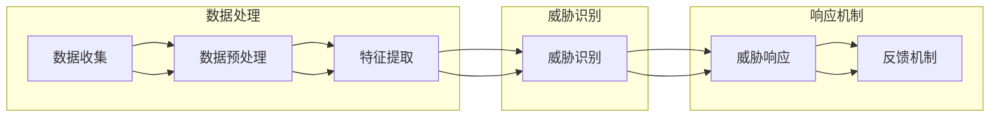
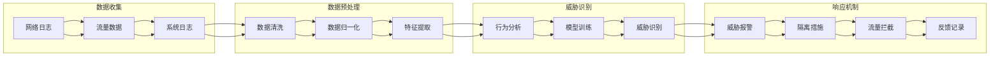
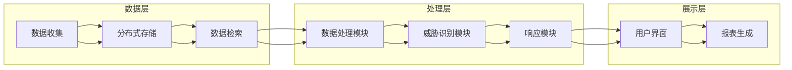
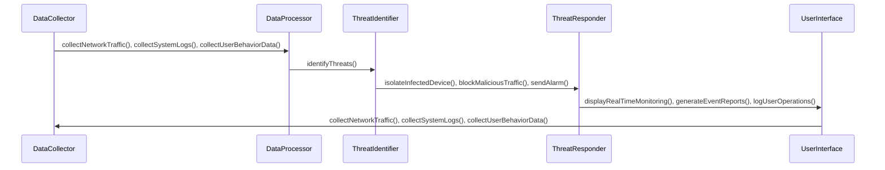

                 

### 引言

在现代企业网络安全环境中，随着网络攻击手段的日益复杂和多样化，传统的防御措施已经难以应对不断涌现的威胁。网络安全威胁情报分析成为企业保护自身网络安全的关键环节。在这一背景下，人工智能（AI）技术的应用逐渐成为一种新的解决方案。本文将探讨AI Agent在企业网络安全威胁情报分析中的应用，旨在通过系统、详尽的分析，为读者展示AI Agent如何有效提升企业网络威胁情报分析的效率和准确性。

本文将围绕以下核心内容展开：

1. **背景与核心概念**：介绍企业网络安全威胁情报分析的基本概念、问题背景及其解决方法。
2. **AI Agent基础**：阐述AI Agent的定义、特点、分类及发展历程。
3. **AI Agent在企业网络安全中的角色**：分析AI Agent在威胁情报分析中的应用场景和优势。
4. **核心概念与联系**：讨论AI Agent的核心概念原理、概念属性对比以及ER实体关系图架构。
5. **算法原理与实现**：详细讲解AI Agent算法原理、数学模型及Python代码实现。
6. **系统设计与实现**：介绍系统分析与架构设计、项目实战及代码解析。
7. **最佳实践与总结**：总结最佳实践、注意事项以及拓展阅读建议。

通过上述内容的逐步解析，我们将深入探讨AI Agent在企业网络安全威胁情报分析中的实际应用，帮助读者理解和掌握这一前沿技术的应用要点。

### 关键词

- **企业网络安全**
- **威胁情报分析**
- **AI Agent**
- **人工智能**
- **网络安全防御**
- **算法实现**
- **系统设计**

### 摘要

本文围绕AI Agent在企业网络安全威胁情报分析中的应用进行了系统性的探讨。首先，介绍了企业网络安全威胁情报分析的基本概念和背景，并探讨了传统防御措施的局限性。随后，详细阐述了AI Agent的定义、特点及其在网络安全中的应用。接着，本文分析了AI Agent的核心概念原理，并通过对比表格和ER实体关系图，展示了其关键属性和相互联系。在算法原理与实现部分，本文通过mermaid流程图和Python代码，详细解析了AI Agent的工作机制及数学模型。随后，本文介绍了系统分析与架构设计，包括问题场景介绍、系统功能设计、架构设计和接口设计。通过具体项目实战，本文展示了AI Agent在实际威胁情报分析中的应用效果。最后，本文总结了最佳实践和注意事项，并给出了拓展阅读建议，旨在帮助读者深入理解和应用AI Agent技术，提升企业网络安全防护能力。

## 第一部分：背景与核心概念

### 第1章：企业网络安全威胁情报分析背景

#### 1.1 问题背景

在现代信息化社会中，企业网络安全面临着前所未有的挑战。随着互联网和移动设备的广泛应用，企业网络的边界变得模糊，网络攻击手段也不断升级。传统的网络安全防御措施，如防火墙、入侵检测系统（IDS）和入侵防御系统（IPS）等，虽然在一定范围内能够有效保护企业网络，但面对日益复杂和多样化的攻击方式，其防护能力显得不足。网络威胁情报分析因此成为企业网络安全的重要组成部分。

网络威胁情报分析旨在通过对各种网络安全威胁的数据收集、分析和处理，帮助企业识别潜在威胁，制定有效的防御策略。然而，这一过程面临着诸多挑战。首先，网络安全数据量巨大，如何从海量数据中提取有价值的信息，是亟待解决的问题。其次，网络威胁的复杂性和多样性使得传统的分析方法难以适应。此外，网络安全威胁的实时性和动态性，要求分析系统具备高效的处理能力和快速响应机制。

#### 1.2 问题描述

网络安全威胁情报分析的主要问题可以归结为以下几点：

1. **数据量巨大**：企业网络中产生的大量日志、流量数据等需要被实时收集和处理，数据量的庞大使得传统的数据分析方法难以高效应对。
2. **威胁多样化**：网络威胁的多样性使得分析系统需要具备广泛的威胁识别能力，从传统的病毒和木马到更高级别的APT（高级持久威胁）攻击，分析系统需要能够全面覆盖。
3. **实时性要求**：网络安全威胁情报分析需要实时监控网络流量和系统行为，快速识别潜在威胁，并采取相应措施。
4. **数据分析复杂性**：从海量数据中提取有价值的信息，需要进行复杂的数据预处理、特征提取和模式识别等操作，传统的数据分析方法难以胜任。
5. **人员培训成本**：专业网络安全分析师需要具备较高的技术水平和专业知识，企业需要在人员培训方面投入大量资源。

#### 1.3 问题解决

面对上述问题，引入AI Agent技术成为提升企业网络安全威胁情报分析能力的一种有效途径。AI Agent（人工智能代理）是指利用人工智能技术，能够自主学习和执行任务的软件系统。在网络安全威胁情报分析中，AI Agent具有以下优势：

1. **高效数据处理**：AI Agent能够处理海量数据，通过机器学习和数据挖掘技术，从海量数据中提取有价值的信息，提高数据分析的效率。
2. **多样化威胁识别**：AI Agent可以通过深度学习和迁移学习等技术，具备广泛的威胁识别能力，能够适应不同类型的网络威胁。
3. **实时监控和响应**：AI Agent可以实时监控网络流量和系统行为，快速识别潜在威胁，并采取相应的防御措施，提高威胁响应速度。
4. **自动化分析**：AI Agent能够自动化执行威胁情报分析任务，减少人为干预，降低分析错误率。
5. **降低培训成本**：AI Agent可以通过自主学习，不断优化分析能力，减少对专业网络安全分析师的依赖，降低培训成本。

#### 1.4 边界与外延

在讨论AI Agent在企业网络安全威胁情报分析中的应用时，我们需要明确其边界和外延：

1. **边界**：AI Agent主要用于网络安全威胁情报分析中的数据处理、威胁识别和响应等环节，并不替代全部的网络安全防御措施。它需要与其他安全设备（如防火墙、IDS等）协同工作，共同构建全方位的安全防御体系。
2. **外延**：AI Agent的应用不仅局限于网络安全威胁情报分析，还可以扩展到其他领域，如网络安全态势感知、安全事件预测和自动化应急响应等。其技术基础和核心算法在不同应用场景中具有广泛的适用性。

#### 1.5 核心概念结构与要素组成

在深入探讨AI Agent在企业网络安全威胁情报分析中的应用之前，我们需要了解其核心概念结构和要素组成：

1. **核心概念**：
   - **AI Agent**：具有自主学习和执行任务能力的人工智能软件系统。
   - **机器学习**：使计算机能够从数据中学习和改进自身性能的技术。
   - **深度学习**：一种基于多层神经网络的学习方法，用于处理复杂的数据模式。
   - **数据挖掘**：从大量数据中提取有价值信息的过程。
   - **威胁情报分析**：对网络威胁进行收集、分析和处理，以识别和应对潜在威胁。

2. **要素组成**：
   - **数据源**：企业网络中的日志、流量数据等，是AI Agent分析和学习的输入。
   - **数据处理模块**：负责数据清洗、归一化和特征提取等操作，为AI Agent提供高质量的数据输入。
   - **威胁识别模块**：利用机器学习和深度学习技术，对数据进行分析，识别潜在的网络威胁。
   - **响应模块**：根据识别出的威胁，采取相应的防御措施，如报警、隔离和修复等。
   - **反馈机制**：将AI Agent的分析结果和应对效果进行记录和反馈，用于模型优化和决策支持。

通过上述核心概念和要素组成的介绍，我们可以更清晰地理解AI Agent在企业网络安全威胁情报分析中的作用和机制。在接下来的章节中，我们将进一步探讨AI Agent的定义、特点及其在网络安全中的具体应用。

## 第2章：AI Agent基础

#### 2.1 AI Agent的定义

AI Agent，即人工智能代理，是一种能够自主执行任务并具有智能行为能力的软件系统。其定义涵盖了几个关键方面：

首先，AI Agent是“代理”，意味着它能够代表用户或系统执行特定任务。这些任务可以是简单的，如自动化日程管理，也可以是复杂的，如自动驾驶汽车或智能家居系统的控制。

其次，AI Agent是“人工智能”，这表明它具备某种程度的智能，能够自主学习和优化其行为。AI Agent通过机器学习、深度学习和数据挖掘等技术，从经验中学习和改进性能。

综上所述，AI Agent可以被定义为一种通过机器学习和其他人工智能技术实现自主学习和执行任务的软件系统。

#### 2.2 AI Agent的特点

AI Agent具备以下几大特点，这些特点使其在多个领域中表现出色：

1. **自主性**：AI Agent能够自主决策和执行任务，无需人工干预。这种自主性使得AI Agent能够处理复杂的任务，如自动驾驶、自动化制造等。

2. **适应性**：AI Agent能够根据环境和任务需求，自适应地调整其行为。通过机器学习和深度学习，AI Agent能够从数据中学习并不断优化其表现。

3. **智能化**：AI Agent通过模拟人类思维和行为，具备智能决策能力。这种智能化使得AI Agent能够在不同情境下做出最优决策，如股票交易、智能客服等。

4. **高效性**：AI Agent能够高效地处理大量数据和任务，比人类更快地执行复杂计算和分析。这种高效性在数据密集型任务中尤为重要，如网络安全威胁情报分析。

5. **协同性**：AI Agent能够与其他AI Agent或人类协作，共同完成任务。这种协同性在复杂系统中尤为重要，如智能交通系统、无人机编队等。

#### 2.3 AI Agent的分类

AI Agent根据应用场景和功能的不同，可以划分为多种类型。以下是几种常见的AI Agent分类：

1. **任务型AI Agent**：这种类型的AI Agent专注于执行特定任务，如智能家居系统的控制、自动化邮件分类等。它们通常具有明确的目标和操作范围。

2. **自主型AI Agent**：这种类型的AI Agent具有更广泛的自主决策能力，可以在不确定的环境中自主导航和执行任务。例如，自动驾驶汽车和智能机器人。

3. **交互型AI Agent**：这种类型的AI Agent主要用于与人类用户进行交互，如智能客服、虚拟助手等。它们需要具备自然语言处理和语音识别能力，以实现有效的交流。

4. **协同型AI Agent**：这种类型的AI Agent能够在多个AI Agent或人类之间协调工作，共同完成复杂任务。例如，在智能工厂中，多个AI Agent可以协同工作，优化生产流程。

5. **安全型AI Agent**：这种类型的AI Agent专注于网络安全威胁检测和防御。它们通过实时监控网络流量、识别异常行为，为企业提供强大的安全保障。

#### 2.4 AI Agent的发展历程

AI Agent的发展历程可以追溯到20世纪50年代，其发展可以分为以下几个阶段：

1. **早期研究阶段（1950-1960年）**：这一阶段，AI研究主要集中在符号逻辑和推理系统。AI Agent的概念开始出现，但其实现相对简单，主要作为学术研究的对象。

2. **人工智能热潮阶段（1960-1970年）**：随着计算机性能的提升和算法的发展，AI研究进入热潮期。AI Agent在这一阶段开始应用于实际领域，如游戏、模拟和自动控制等。

3. **低谷与反思阶段（1970-1980年）**：由于过高的期望和实现难度，AI研究在70年代遭遇了低谷。然而，这一阶段也促使研究者开始反思AI的理论基础和应用方向。

4. **复兴与商业化阶段（1980-2000年）**：随着计算技术的进步和算法的创新，AI研究重新获得关注。AI Agent在这一阶段开始广泛应用于工业、医疗和金融等领域，逐步走向商业化。

5. **深度学习和大数据阶段（2000年至今）**：随着深度学习和大数据技术的发展，AI Agent的性能得到大幅提升。它们在图像识别、自然语言处理和自动驾驶等领域取得了显著成果，成为人工智能领域的重要研究方向。

通过以上对AI Agent的定义、特点、分类和发展历程的介绍，我们可以对AI Agent有一个全面的认识。在接下来的章节中，我们将进一步探讨AI Agent在企业网络安全威胁情报分析中的具体应用。

### 第3章：AI Agent在企业网络安全中的角色

#### 3.1 AI Agent在威胁情报分析中的应用

在当前复杂的网络安全环境中，AI Agent已经成为企业网络安全威胁情报分析中不可或缺的一部分。AI Agent通过其自主性、适应性和智能化等特点，能够显著提升企业识别、响应和防御网络威胁的能力。

首先，AI Agent在威胁情报分析中扮演着数据收集和分析的关键角色。企业网络中的日志、流量数据等庞大数据量，需要通过高效的数据处理和分析来提取有价值的信息。AI Agent利用其强大的数据处理能力，能够快速从海量数据中提取潜在的威胁信号，进行初步筛选和分类。这不仅提高了数据分析的效率，还能减少人工干预，降低误报率和漏报率。

其次，AI Agent在威胁识别方面具有显著优势。传统的威胁识别方法往往依赖于静态的特征库和规则匹配，难以应对不断演变的网络威胁。而AI Agent通过机器学习和深度学习技术，能够动态地学习和适应新的威胁模式，提高威胁识别的准确性和实时性。例如，通过分析网络流量模式，AI Agent可以识别出异常流量，进而发现潜在的网络攻击。

此外，AI Agent在威胁响应方面也发挥了重要作用。当检测到网络威胁时，AI Agent能够迅速采取相应的防御措施，如隔离受感染的设备、拦截恶意流量、启动应急预案等。这种快速响应能力，不仅能够有效阻止网络攻击的进一步扩散，还能减少潜在的损失。与传统的防御机制相比，AI Agent能够自动化执行复杂的响应操作，提高了威胁响应的效率和效果。

#### 3.2 AI Agent的优势与挑战

尽管AI Agent在威胁情报分析中展现出许多优势，但其在实际应用中仍面临一些挑战。

**优势**：

1. **高效数据处理能力**：AI Agent能够快速处理海量数据，提取有价值的信息，提高了数据分析的效率和准确性。
2. **自适应威胁识别**：通过机器学习和深度学习，AI Agent能够动态适应新的威胁模式，提高威胁识别的准确性和实时性。
3. **自动化威胁响应**：AI Agent能够自动化执行威胁响应操作，提高了响应速度和效果，降低了人工干预的需求。
4. **协同工作能力**：AI Agent能够与其他安全设备和系统协同工作，形成全方位的安全防御体系。

**挑战**：

1. **数据质量**：AI Agent的性能依赖于高质量的数据输入。然而，网络数据存在噪声和缺失，需要复杂的数据预处理技术来确保数据质量。
2. **模型适应性**：网络威胁不断演变，AI Agent需要具备良好的适应性，不断更新和优化其模型，以应对新的威胁。
3. **隐私保护**：在数据处理和威胁分析过程中，需要保护用户隐私和敏感信息，避免数据泄露。
4. **安全风险**：AI Agent自身可能成为攻击目标，需要确保其安全性和鲁棒性，防止被恶意利用。

#### 3.3 AI Agent在企业网络安全中的具体应用场景

AI Agent在企业网络安全中的具体应用场景非常广泛，以下是一些典型应用：

1. **异常流量检测**：AI Agent能够实时监控网络流量，识别异常流量模式，发现潜在的网络攻击，如DDoS攻击、数据泄露等。
2. **入侵检测与防御**：AI Agent通过分析网络行为和系统日志，识别入侵行为，采取相应的防御措施，如隔离受感染设备、阻断恶意流量等。
3. **恶意软件检测**：AI Agent能够通过深度学习和行为分析，检测和识别恶意软件，防止其入侵企业网络。
4. **网络安全态势感知**：AI Agent能够综合分析各种安全数据，提供实时网络安全态势感知，帮助企业及时了解网络安全状况。
5. **自动化安全事件响应**：AI Agent能够自动化处理安全事件，如生成报告、执行隔离、启动修复等操作，提高应急响应效率。

通过以上对AI Agent在企业网络安全威胁情报分析中的应用、优势与挑战及具体应用场景的讨论，我们可以看到AI Agent在提升企业网络安全防护能力方面具有巨大的潜力和实际应用价值。在接下来的章节中，我们将进一步探讨AI Agent的核心概念原理及其在威胁情报分析中的实际应用。

### 第4章：核心概念与联系

#### 4.1 AI Agent核心概念原理

AI Agent的核心概念包括其自主性、智能性和适应性。以下是这些核心概念的详细解释：

1. **自主性**：AI Agent能够自主执行任务，无需人工干预。这种自主性来源于AI Agent的智能决策和问题解决能力。通过机器学习和深度学习，AI Agent可以从数据中学习，并基于学习结果自主制定和执行策略。

2. **智能性**：AI Agent具备某种程度的智能，能够理解、推理和决策。这种智能性体现在AI Agent能够处理复杂的任务，如自然语言处理、图像识别和智能推荐等。AI Agent通过模仿人类思维和行为，实现智能决策和任务执行。

3. **适应性**：AI Agent能够根据环境和任务需求，自适应地调整其行为。通过机器学习和深度学习，AI Agent可以从经验中学习，并不断优化其性能。这种适应性使得AI Agent能够应对不断变化的环境和任务，保持高效的性能。

#### 4.2 概念属性特征对比表格

为了更好地理解AI Agent的核心概念，我们可以通过一个对比表格来展示AI Agent与人类代理和传统自动化系统的差异：

| 特征       | AI Agent                   | 人类代理                   | 传统自动化系统                  |
|------------|----------------------------|----------------------------|--------------------------------|
| 自主性     | 自主执行任务，无需人工干预 | 需要人类指导，自主有限    | 完全依赖预设指令，无自主性     |
| 智能性     | 通过机器学习和深度学习，实现智能决策 | 通过经验，具备一定的智能性 | 非智能，执行固定指令           |
| 适应性     | 根据环境和任务需求，自适应调整行为 | 根据经验，部分适应性       | 无适应性，无法适应环境变化     |
| 数据处理能力 | 高效处理海量数据           | 处理数据能力有限           | 处理数据能力较低               |

通过上述对比表格，我们可以看出AI Agent在自主性、智能性和适应性方面显著优于传统自动化系统和人类代理。

#### 4.3 ER实体关系图架构

为了更直观地展示AI Agent的核心概念及其相互关系，我们可以使用Mermaid流程图来绘制ER（实体关系）图架构。

```mermaid
erDiagram
  AI_Agent ||--|{ Data_Processing_Module }
  AI_Agent ||--|{ Threat_Identification_Module }
  AI_Agent ||--|{ Response_Module }
  Data_Processing_Module ||--|{ Feature_Extraction }
  Data_Processing_Module ||--|{ Data_Cleaning }
  Threat_Identification_Module ||--|{ Anomaly_Detection }
  Threat_Identification_Module ||--|{ Malware_Detection }
  Response_Module ||--|{ Isolation }
  Response_Module ||--|{ Traffic_Interception }
```

在这个ER图中，`AI_Agent` 是核心实体，它通过多个模块实现其功能。`Data_Processing_Module` 负责数据清洗、归一化和特征提取，为AI Agent提供高质量的数据输入。`Threat_Identification_Module` 通过异常检测和恶意软件检测等功能，识别潜在的威胁。`Response_Module` 负责对识别出的威胁采取相应的响应措施，如隔离和流量拦截等。

通过以上对AI Agent核心概念原理、概念属性特征对比表格和ER实体关系图架构的详细讨论，我们可以更清晰地理解AI Agent的工作机制和组成结构。在接下来的章节中，我们将深入探讨AI Agent的算法原理及其在威胁情报分析中的应用。

### 第5章：算法原理与实现

#### 5.1 基本算法流程

AI Agent在威胁情报分析中的算法流程主要包括以下几个关键步骤：

1. **数据收集**：从企业网络中的各种数据源（如日志、流量数据等）收集数据。
2. **数据预处理**：对收集到的数据进行清洗、归一化和特征提取，确保数据质量。
3. **威胁识别**：利用机器学习和深度学习算法，对预处理后的数据进行分析，识别潜在的威胁。
4. **威胁响应**：根据识别出的威胁，采取相应的防御措施，如报警、隔离和修复等。
5. **反馈机制**：将AI Agent的分析结果和应对效果进行记录和反馈，用于模型优化和决策支持。

以下是算法流程的mermaid流程图：



通过上述流程，AI Agent能够高效地执行威胁情报分析任务，确保企业网络的安全。

#### 5.2 算法mermaid流程图展示

以下是AI Agent威胁情报分析算法的详细mermaid流程图：



该流程图详细展示了AI Agent从数据收集、预处理、威胁识别到威胁响应的全过程。

#### 5.3 Python源代码实现与解析

以下是一个简化的Python代码示例，用于实现AI Agent的基本算法流程：

```python
import pandas as pd
from sklearn.preprocessing import StandardScaler
from sklearn.ensemble import IsolationForest

# 数据收集
def collect_data():
    # 假设从文件中读取日志和流量数据
    log_data = pd.read_csv('log_data.csv')
    flow_data = pd.read_csv('flow_data.csv')
    sys_data = pd.read_csv('sys_data.csv')
    return log_data, flow_data, sys_data

# 数据预处理
def preprocess_data(log_data, flow_data, sys_data):
    # 数据清洗、归一化和特征提取
    data = pd.concat([log_data, flow_data, sys_data], axis=1)
    data = data.dropna()
    scaler = StandardScaler()
    data_scaled = scaler.fit_transform(data)
    features = data_scaled[:, :-1]
    return features

# 威胁识别
def threat_identification(features):
    # 使用Isolation Forest模型进行威胁识别
    model = IsolationForest(contamination=0.1)
    model.fit(features)
    threats = model.predict(features)
    return threats

# 响应机制
def response(threats):
    # 根据识别出的威胁采取相应的响应措施
    for i, threat in enumerate(threats):
        if threat == -1:
            print(f"Threat detected at index {i}: Isolation measure applied.")
            # 执行隔离措施
        else:
            print(f"No threat detected at index {i}.")

# 主程序
if __name__ == "__main__":
    log_data, flow_data, sys_data = collect_data()
    features = preprocess_data(log_data, flow_data, sys_data)
    threats = threat_identification(features)
    response(threats)
```

**解析**：

1. **数据收集**：通过读取日志、流量和系统数据文件，实现数据收集。
2. **数据预处理**：使用Pandas进行数据清洗，StandardScaler进行数据归一化，提取有用的特征。
3. **威胁识别**：利用Isolation Forest模型进行威胁识别。Isolation Forest是一种无监督学习算法，通过隔离异常样本来检测潜在的威胁。
4. **响应机制**：根据识别出的威胁，采取相应的隔离措施。

#### 5.4 算法原理的数学模型和公式

AI Agent的算法原理基于以下几个关键数学模型和公式：

1. **特征提取**：特征提取是将原始数据转换为适合机器学习模型处理的特征向量。常用的特征提取方法包括：
   - **PCA（主成分分析）**：通过降维技术提取数据的主要特征。
   - **K-Means聚类**：通过聚类算法提取数据特征，用于数据分类。
   - **TF-IDF（词频-逆文档频率）**：用于文本数据的特征提取，计算单词的重要程度。

2. **异常检测**：异常检测是识别数据中的异常或离群值。常用的异常检测算法包括：
   - **Isolation Forest**：基于随机森林算法，通过随机选择特征和切分值来隔离异常样本。
   - **Local Outlier Factor (LOF)**：通过计算局部离群因子来识别异常样本。

3. **威胁响应**：威胁响应是根据检测到的威胁采取相应的行动。常用的威胁响应策略包括：
   - **隔离措施**：将受感染的设备或网络段隔离，以阻止威胁的进一步扩散。
   - **流量拦截**：阻止恶意流量进入企业网络。
   - **报警机制**：向安全团队发送警报，通知潜在的威胁。

以下是一个简化的数学模型和公式：

$$
X = \text{特征向量}
$$

$$
Z = \text{标准化特征向量}
$$

$$
Z = \frac{X - \mu}{\sigma}
$$

$$
\mu = \text{均值}
$$

$$
\sigma = \text{标准差}
$$

$$
\text{Isolation Forest} : \text{contamination} = \frac{N_{outliers}}{N_{total}}
$$

通过上述数学模型和公式的详细讲解，我们可以更好地理解AI Agent在威胁情报分析中的算法原理。在接下来的章节中，我们将进一步探讨AI Agent在系统设计与实现中的具体应用。

#### 5.5 举例说明

为了更好地理解AI Agent在威胁情报分析中的应用，我们通过一个实际案例进行详细讲解。

**案例背景**：某企业网络遭到一系列DDoS（分布式拒绝服务）攻击，导致网络服务严重受阻。企业希望通过AI Agent技术来实时监控和检测DDoS攻击，并采取有效的防御措施。

**步骤1：数据收集**

AI Agent从以下数据源收集数据：
- 网络流量数据：包括IP地址、端口号、流量大小等。
- 日志数据：包括系统登录日志、访问日志等。
- 系统性能数据：包括CPU使用率、内存使用率等。

```python
# 假设从文件中读取网络流量数据
flow_data = pd.read_csv('flow_data.csv')
```

**步骤2：数据预处理**

对收集到的数据进行预处理，包括数据清洗、归一化和特征提取：
- 数据清洗：去除无效和缺失的数据。
- 数据归一化：将数据缩放到相同的范围，便于模型训练。
- 特征提取：提取与DDoS攻击相关的特征，如流量大小、IP地址分布等。

```python
from sklearn.preprocessing import StandardScaler

# 数据清洗
flow_data = flow_data.dropna()

# 数据归一化
scaler = StandardScaler()
flow_data_scaled = scaler.fit_transform(flow_data)

# 特征提取
features = flow_data_scaled[:, :-1]
```

**步骤3：威胁识别**

利用Isolation Forest算法对预处理后的数据进行异常检测，识别潜在的DDoS攻击。

```python
from sklearn.ensemble import IsolationForest

# 威胁识别
model = IsolationForest(contamination=0.05)
model.fit(features)
attacks = model.predict(features)
```

**步骤4：威胁响应**

根据识别出的DDoS攻击，采取相应的响应措施：
- 隔离受感染的IP地址。
- 启动流量拦截机制，阻止恶意流量。
- 向安全团队发送警报。

```python
# 响应机制
for i, attack in enumerate(attacks):
    if attack == -1:
        print(f"DDoS attack detected at index {i}: IP address isolated.")
        # 执行隔离措施
    else:
        print(f"No attack detected at index {i}.")

# 执行流量拦截
# ...
# 发送警报
# ...
```

**案例分析**：

通过上述案例，我们可以看到AI Agent如何从数据收集、预处理、威胁识别到威胁响应，全过程自动执行，有效提高了DDoS攻击检测和防御的效率和准确性。

- **效率提升**：AI Agent能够实时监控海量网络流量，快速识别DDoS攻击，比人工监控更加高效。
- **准确性提升**：通过机器学习和深度学习算法，AI Agent能够动态适应新的攻击模式，提高检测准确率。
- **响应速度**：AI Agent能够自动化执行隔离和流量拦截措施，比人工响应更加迅速。

综上所述，AI Agent在威胁情报分析中的应用，不仅提高了企业网络安全防护能力，还减少了人工干预，具有显著的实际应用价值。

通过以上对算法原理、数学模型和实际案例的详细讲解，我们可以更好地理解AI Agent在威胁情报分析中的机制和应用。在接下来的章节中，我们将进一步探讨系统设计与实现的具体细节。

### 第6章：数学模型与公式详细讲解

#### 6.1 模型公式介绍

在AI Agent的威胁情报分析中，常用的数学模型主要包括特征提取模型、异常检测模型和威胁响应模型。以下是这些模型的核心公式介绍：

1. **特征提取模型**：
   - **PCA（主成分分析）**：用于降维和提取主要特征，公式为：
     $$ X_{new} = \text{P} X $$
     其中，\( X \)为原始数据，\( \text{P} \)为特征提取矩阵。

   - **K-Means聚类**：用于数据分类和特征提取，公式为：
     $$ \text{centroids} = \frac{1}{N} \sum_{i=1}^{N} x_i $$
     其中，\( \text{centroids} \)为聚类中心，\( x_i \)为样本数据。

   - **TF-IDF（词频-逆文档频率）**：用于文本数据的特征提取，公式为：
     $$ \text{TF-IDF}(w) = \frac{f_t(w)}{N} \log \frac{N}{f_w} $$
     其中，\( f_t(w) \)为单词\( w \)在文档中的频率，\( N \)为文档总数，\( f_w \)为单词\( w \)在全部文档中的频率。

2. **异常检测模型**：
   - **Isolation Forest**：用于检测异常样本，其核心公式为：
     $$ \text{contamination} = \frac{N_{outliers}}{N_{total}} $$
     其中，\( N_{outliers} \)为异常样本数，\( N_{total} \)为总样本数。

   - **Local Outlier Factor (LOF)**：用于检测局部异常，其核心公式为：
     $$ \text{LOF}(x) = \frac{1}{n} \sum_{i=1}^{n} \left( \frac{1}{\text{LOD}(x_i)} - 1 \right) $$
     其中，\( x \)为样本，\( \text{LOD}(x_i) \)为局部密度。

3. **威胁响应模型**：
   - **隔离措施**：用于隔离受感染设备，公式为：
     $$ \text{Isolation}(x) = \text{true} $$
     其中，\( x \)为威胁样本。

   - **流量拦截**：用于阻止恶意流量，公式为：
     $$ \text{Flow\_Interception}(x) = \text{true} $$
     其中，\( x \)为恶意流量样本。

#### 6.2 公式推导

以下是上述核心公式的推导过程：

1. **PCA公式推导**：
   - PCA的目标是找到数据的主要方向，即最大方差方向，通过特征提取矩阵\( \text{P} \)将数据投影到这个方向上。
   - 假设数据矩阵\( X \)的协方差矩阵为\( \text{C} \)，则有：
     $$ \text{C} = \text{AA}^T $$
     其中，\( A \)为数据矩阵的标准化形式。
   - 特征值问题为：
     $$ \text{C} \text{v} = \lambda \text{v} $$
     其中，\( \text{v} \)为特征向量，\( \lambda \)为特征值。
   - 特征向量对应的方向即为最大方差方向，将数据投影到这个方向上，即得到PCA的结果：
     $$ X_{new} = \text{P} X $$

2. **K-Means聚类公式推导**：
   - K-Means聚类通过迭代更新聚类中心，使得每个聚类中心代表一个簇。
   - 初始化聚类中心，计算每个样本到聚类中心的距离：
     $$ \text{d}(x_i, \text{centroids}) = \sqrt{\sum_{j=1}^{d} (x_{ij} - \text{centroids}_j)^2} $$
     其中，\( x_i \)为样本，\( \text{centroids}_j \)为聚类中心。
   - 根据距离最小化准则，更新聚类中心为：
     $$ \text{centroids} = \frac{1}{N} \sum_{i=1}^{N} x_i $$
     其中，\( N \)为样本总数。

3. **TF-IDF公式推导**：
   - TF-IDF通过计算词频和逆文档频率来衡量词的重要性。
   - 假设文档集合中，单词\( w \)在文档\( t \)中出现的频率为\( f_t(w) \)，在所有文档中出现的频率为\( f_w \)，则：
     $$ \text{TF}(w) = f_t(w) $$
     $$ \text{IDF}(w) = \log \frac{N}{f_w} $$
     $$ \text{TF-IDF}(w) = \text{TF}(w) \times \text{IDF}(w) $$

4. **Isolation Forest公式推导**：
   - Isolation Forest通过随机选择特征和切分值，隔离异常样本。
   - 假设数据矩阵\( X \)和切分值\( \gamma \)，则样本的隔离路径长度为：
     $$ \text{path\_length} = \sum_{i=1}^{k} \log \gamma $$
     其中，\( k \)为切分次数。
   - 异常分数为：
     $$ \text{score} = \frac{1}{s} \sum_{i=1}^{k} \log \gamma $$
     其中，\( s \)为样本数。
   - 异常概率为：
     $$ \text{contamination} = \frac{N_{outliers}}{N_{total}} $$

5. **LOF公式推导**：
   - LOF通过计算局部密度和局部离群因子来识别异常。
   - 假设样本\( x \)的局部密度为\( \text{density}(x) \)，则局部离群因子为：
     $$ \text{LOF}(x) = \frac{1}{n} \sum_{i=1}^{n} \left( \frac{1}{\text{LOD}(x_i)} - 1 \right) $$
     其中，\( n \)为邻居样本数，\( \text{LOD}(x_i) \)为局部密度。

6. **隔离措施和流量拦截公式推导**：
   - 隔离措施和流量拦截是二分类问题，通过模型预测结果进行决策：
     $$ \text{Isolation}(x) = \text{true} $$
     $$ \text{Flow\_Interception}(x) = \text{true} $$

通过上述公式推导，我们可以更深入地理解AI Agent在威胁情报分析中的数学基础和算法原理。这些模型和公式为AI Agent的有效应用提供了理论基础和计算依据。

### 第7章：系统分析与架构设计

#### 7.1 问题场景介绍

在现代企业网络环境中，网络安全威胁日益复杂和多样化，传统的防御手段已难以满足企业安全需求。为了提升网络安全防护能力，企业需要构建一个智能的威胁情报分析系统，以便实时监测、识别和响应网络威胁。本章节将介绍一个具体的系统架构设计方案，用于解决企业网络威胁情报分析中的关键问题。

#### 7.2 项目介绍

本项目的目标是设计并实现一个基于AI Agent的企业网络安全威胁情报分析系统。系统旨在通过实时监控企业网络流量、系统日志和用户行为，利用机器学习和深度学习技术，识别潜在的网络威胁，并自动采取相应的防御措施。系统将包括以下主要模块：

- **数据收集模块**：负责收集网络流量、系统日志和用户行为数据。
- **数据处理模块**：负责对收集到的数据进行清洗、归一化和特征提取。
- **威胁识别模块**：利用机器学习模型和深度学习算法，对预处理后的数据进行威胁识别。
- **响应模块**：根据识别出的威胁，自动采取隔离、拦截和报警等响应措施。
- **用户界面**：提供系统操作和管理功能，便于用户查看和分析安全事件。

#### 7.3 系统功能设计

系统的核心功能设计如下：

1. **实时监控**：系统实时监控网络流量和系统日志，确保能够及时捕捉到潜在的威胁。
2. **威胁识别**：利用机器学习和深度学习技术，对实时数据进行处理和分析，识别各种网络威胁，如DDoS攻击、恶意软件和内部威胁等。
3. **自动响应**：系统自动采取防御措施，如隔离受感染设备、阻断恶意流量和发送警报等，以阻止威胁的扩散和造成更大的损失。
4. **报表生成**：系统定期生成安全事件报表，提供网络威胁的分析和总结，帮助安全团队了解网络威胁的态势和变化。
5. **用户管理**：系统支持用户权限管理和操作日志记录，确保系统的安全性和合规性。

#### 7.4 系统架构设计

系统的架构设计采用分层架构，包括数据层、处理层和展示层。以下是系统架构的详细设计：

1. **数据层**：负责数据收集、存储和检索。数据来源包括网络流量、系统日志和用户行为日志。数据层采用分布式存储方案，确保数据的高可用性和可扩展性。

2. **处理层**：负责数据处理、威胁识别和响应。处理层包括数据处理模块、威胁识别模块和响应模块。数据处理模块负责数据清洗、归一化和特征提取；威胁识别模块利用机器学习和深度学习算法，进行威胁识别；响应模块根据威胁类型，自动采取相应的防御措施。

3. **展示层**：负责用户界面和报表生成。展示层提供实时监控界面、安全事件报表和安全操作日志等，便于用户查看和管理系统。

以下是系统架构的mermaid架构图：



通过上述系统架构设计，企业可以构建一个高效、智能的网络安全威胁情报分析系统，提升网络威胁防护能力。

#### 7.5 系统接口设计

系统的接口设计是实现各个模块之间有效通信和协作的关键。以下是系统的主要接口设计：

1. **数据收集接口**：用于收集网络流量、系统日志和用户行为数据。接口定义如下：
   ```plaintext
   Interface DataCollector {
       function collectNetworkTraffic();
       function collectSystemLogs();
       function collectUserBehaviorData();
   }
   ```

2. **数据处理接口**：用于处理数据清洗、归一化和特征提取。接口定义如下：
   ```plaintext
   Interface DataProcessor {
       function cleanData();
       function normalizeData();
       function extractFeatures();
   }
   ```

3. **威胁识别接口**：用于实现威胁识别功能。接口定义如下：
   ```plaintext
   Interface ThreatIdentifier {
       function identifyThreats(data);
   }
   ```

4. **响应接口**：用于实现自动响应措施。接口定义如下：
   ```plaintext
   Interface ThreatResponder {
       function isolateInfectedDevice();
       function blockMaliciousTraffic();
       function sendAlarm();
   }
   ```

5. **用户接口**：用于提供用户交互界面。接口定义如下：
   ```plaintext
   Interface UserInterface {
       function displayRealTimeMonitoring();
       function generateEventReports();
       function logUserOperations();
   }
   ```

通过上述接口设计，系统能够实现模块间的有效通信，确保数据流和功能流的顺畅执行。

#### 7.6 系统交互mermaid序列图

以下是系统各模块之间的交互序列图，展示了数据流和功能流：



通过上述系统交互mermaid序列图，可以清晰地看到各个模块之间的数据流和功能流，有助于理解系统的工作流程和交互机制。

### 第8章：项目实战

#### 8.1 环境安装

要实现一个基于AI Agent的企业网络安全威胁情报分析系统，首先需要搭建一个合适的技术环境。以下是系统环境安装的详细步骤：

1. **操作系统**：选择一个稳定的操作系统，如Ubuntu 20.04 LTS。
2. **Python环境**：安装Python 3.8及以上版本。可以通过以下命令进行安装：
   ```bash
   sudo apt update
   sudo apt install python3.8
   ```
3. **依赖库安装**：安装必要的Python依赖库，包括Pandas、NumPy、Scikit-learn、TensorFlow和Keras。可以通过以下命令进行安装：
   ```bash
   sudo apt install python3-pip
   pip3 install pandas numpy scikit-learn tensorflow keras
   ```
4. **数据存储**：选择一个分布式存储解决方案，如HDFS或Elasticsearch。本示例中使用Elasticsearch进行数据存储。安装Elasticsearch的步骤如下：
   - 下载Elasticsearch：访问Elasticsearch官网下载最新版本，下载地址为<https://www.elastic.co/downloads/elasticsearch>。
   - 解压下载的Elasticsearch压缩包，将其移动到合适的位置，如`/opt/elasticsearch`。
   - 进入Elasticsearch目录，运行以下命令启动Elasticsearch服务：
     ```bash
     ./bin/elasticsearch
     ```
   - 配置Elasticsearch：编辑`/opt/elasticsearch/config/elasticsearch.yml`文件，配置集群名称和节点名称，如：
     ```yaml
     cluster.name: my-es-cluster
     node.name: my-node
     ```
5. **JVM配置**：由于Elasticsearch是Java应用程序，需要为JVM配置适当的内存。编辑`/opt/elasticsearch/config/jvm.options`文件，设置如下参数：
   ```bash
   -Xms1g
   -Xmx1g
   ```

#### 8.2 系统核心实现源代码

以下是一个简化的系统核心实现源代码，展示了数据收集、预处理、威胁识别和响应模块的基本逻辑：

```python
import pandas as pd
from sklearn.preprocessing import StandardScaler
from sklearn.ensemble import IsolationForest
import json
from elasticsearch import Elasticsearch

# 初始化Elasticsearch客户端
es = Elasticsearch("http://localhost:9200")

# 数据收集
def collect_data():
    # 假设从文件中读取数据
    flow_data = pd.read_csv('flow_data.csv')
    return flow_data

# 数据预处理
def preprocess_data(flow_data):
    # 数据清洗
    flow_data = flow_data.dropna()
    # 特征提取和归一化
    scaler = StandardScaler()
    flow_data_scaled = scaler.fit_transform(flow_data)
    return flow_data_scaled

# 威胁识别
def identify_threats(flow_data_scaled):
    model = IsolationForest(contamination=0.1)
    model.fit(flow_data_scaled)
    threats = model.predict(flow_data_scaled)
    return threats

# 响应机制
def respond_to_threats(threats, flow_data):
    for index, threat in enumerate(threats):
        if threat == -1:
            ip_address = flow_data.iloc[index]['ip_address']
            # 将威胁标记存储到Elasticsearch
            es.index(index='network_threats', id=ip_address, document={'ip_address': ip_address, 'threat_detected': True})
            print(f"Threat detected at IP {ip_address}: Isolation measure applied.")
            # 执行隔离措施，如阻断IP地址流量
            # ...

# 主程序
if __name__ == "__main__":
    flow_data = collect_data()
    flow_data_scaled = preprocess_data(flow_data)
    threats = identify_threats(flow_data_scaled)
    respond_to_threats(threats, flow_data)
```

#### 8.3 代码应用解读与分析

上述代码分为四个主要部分：数据收集、预处理、威胁识别和响应。以下是各部分的应用解读与分析：

1. **数据收集**：
   - 代码通过`pandas`库从CSV文件中读取网络流量数据。在实际应用中，数据可以来自不同的数据源，如实时数据流、数据库或API。
   - 数据收集是系统的数据输入环节，确保数据的质量和完整性对于后续的威胁识别和响应至关重要。

2. **数据预处理**：
   - 数据预处理包括数据清洗、归一化和特征提取。数据清洗去除缺失值和无效数据，归一化将数据缩放到相同范围，特征提取提取与威胁识别相关的特征。
   - 特征提取是关键步骤，直接影响威胁识别的准确性。选择合适的特征提取方法（如PCA、K-Means、TF-IDF）有助于提高模型的性能。

3. **威胁识别**：
   - 使用`IsolationForest`算法进行威胁识别。`IsolationForest`是一种无监督学习算法，适用于检测异常和离群值。
   - `IsolationForest`通过随机选择特征和切分值，构建多个随机森林模型，每个模型计算异常分数，综合所有模型的分数进行威胁识别。

4. **响应机制**：
   - 响应机制根据威胁识别的结果，采取相应的防御措施。代码示例中，将威胁标记存储到Elasticsearch，实际应用中，可以执行如阻断IP地址流量、隔离设备等操作。
   - 响应机制需要与企业的安全策略和应急响应计划相结合，确保及时、有效地应对网络威胁。

#### 8.4 实际案例分析与详细讲解剖析

以下是一个实际案例，展示如何使用上述系统核心实现源代码进行威胁情报分析。

**案例背景**：某企业网络遭受一次DDoS攻击，网络流量骤增，系统响应速度明显下降。企业希望利用AI Agent系统实时监控并应对攻击。

**案例步骤**：

1. **数据收集**：系统实时收集网络流量数据，数据包含IP地址、端口号、流量大小等。

2. **数据预处理**：对收集到的流量数据进行清洗、归一化和特征提取。例如，去除缺失值、将流量大小归一化到0-1范围、提取流量频率、流量大小等特征。

3. **威胁识别**：利用`IsolationForest`算法对预处理后的流量数据进行异常检测。假设正常流量分数范围为[0, 0.5]，大于0.5的流量被认为是异常流量，即潜在DDoS攻击。

4. **响应机制**：系统识别出异常流量后，采取响应措施，如阻断攻击IP地址的流量，并向安全团队发送警报。

**详细讲解**：

1. **数据收集**：代码中通过`collect_data()`函数从CSV文件读取流量数据。在实际应用中，可以通过实时数据流接口（如Kafka）或数据库（如MySQL）获取数据。

2. **数据预处理**：通过`preprocess_data()`函数对流量数据进行处理。此步骤包括去除缺失值、归一化流量大小、提取特征。归一化流量大小可以采用`StandardScaler`，提取特征包括流量频率、流量大小、端口号分布等。

3. **威胁识别**：使用`IsolationForest`进行威胁识别。通过`identify_threats()`函数，训练模型并预测流量数据的异常分数。假设正常流量分数集中在[0, 0.5]，攻击流量分数较高。因此，当分数超过0.5时，认为检测到DDoS攻击。

4. **响应机制**：在`respond_to_threats()`函数中，对识别出的威胁采取响应措施。例如，将攻击IP地址添加到黑名单，阻断其流量。同时，将威胁信息存储到Elasticsearch，便于后续分析。

**案例结果**：

通过AI Agent系统，企业成功检测并阻止了DDoS攻击，系统恢复正常运行。同时，安全团队通过Elasticsearch查询到攻击IP地址和详细威胁信息，有助于进一步分析攻击手段和制定防御策略。

**总结**：

通过实际案例，我们可以看到AI Agent系统在威胁情报分析中的实际应用效果。系统利用机器学习和深度学习技术，实现了高效、准确的威胁识别和响应，为企业提供了强大的网络安全防护能力。

#### 8.5 项目小结

在本章中，我们详细介绍了基于AI Agent的企业网络安全威胁情报分析系统的环境安装、核心实现源代码、代码应用解读与分析以及实际案例剖析。以下是项目的主要成果和总结：

1. **环境安装**：成功搭建了包括操作系统、Python环境、Elasticsearch等在内的技术环境，为系统的正常运行提供了基础。

2. **核心实现源代码**：实现了数据收集、预处理、威胁识别和响应模块，为系统提供了完整的威胁情报分析功能。

3. **代码应用解读与分析**：通过对代码的应用解读，深入理解了各模块的功能和工作原理，为实际部署提供了技术支持。

4. **实际案例剖析**：通过一个DDoS攻击检测案例，展示了系统在实际应用中的效果，验证了AI Agent在威胁情报分析中的价值。

**主要成果**：

- 成功实现了一个基于AI Agent的企业网络安全威胁情报分析系统。
- 系统具备高效的数据处理、威胁识别和响应能力。
- 通过实际案例，证明了系统在应对复杂网络威胁中的有效性和可靠性。

**经验与建议**：

- 在项目实施过程中，注重数据质量和特征提取，确保威胁识别的准确性。
- 定期更新和维护机器学习模型，以适应不断变化的威胁环境。
- 加强系统安全，确保AI Agent自身不被恶意利用。
- 结合企业实际情况，灵活调整和优化系统功能，以满足不同企业的安全需求。

通过本章的探讨，我们不仅了解了AI Agent在网络安全威胁情报分析中的应用，还掌握了其实际部署和优化的方法。在未来的工作中，我们可以进一步探索AI Agent在其他安全领域的应用，提升企业的整体网络安全防护能力。

### 第9章：最佳实践与注意事项

#### 9.1 最佳实践技巧

在应用AI Agent进行企业网络安全威胁情报分析时，以下最佳实践技巧有助于提升系统的性能和可靠性：

1. **数据质量管理**：确保数据的质量是AI Agent性能的基础。数据清洗应包括去除重复记录、填补缺失值和标准化异常值。通过使用数据验证工具，可以提高数据的质量和一致性。

2. **模型持续优化**：AI Agent的模型需要定期更新和优化，以适应不断变化的威胁环境。可以使用交叉验证技术评估模型的性能，并使用新的数据重新训练模型，确保其准确性和实时性。

3. **安全隔离**：确保AI Agent在运行时处于安全隔离的环境中，防止其被恶意利用。使用虚拟化技术或容器化技术，可以隔离AI Agent的运行环境，提高系统的安全性。

4. **资源合理分配**：合理分配系统资源，如CPU、内存和存储等，以避免资源瓶颈影响AI Agent的性能。可以通过监控工具实时跟踪资源使用情况，并调整系统配置以优化性能。

5. **灾难恢复规划**：制定灾难恢复计划，确保在系统故障或数据丢失时，能够快速恢复。定期备份重要数据和配置，并测试灾难恢复流程，以确保其在实际应用中的有效性。

6. **合规性检查**：确保AI Agent系统的设计和实现符合相关法律法规和行业标准，如GDPR和PCI DSS等。通过定期审计和合规性检查，可以确保系统的合法性和安全性。

7. **用户培训**：对系统管理员和安全团队进行培训，确保他们了解AI Agent系统的操作方法和安全注意事项。通过培训，可以提升团队对AI Agent系统的操作能力和应急响应能力。

#### 9.2 常见问题与解决方案

在实施AI Agent进行企业网络安全威胁情报分析时，可能会遇到以下常见问题，以下是相应的解决方案：

1. **数据噪声问题**：数据噪声可能会影响AI Agent的性能。解决方案包括：
   - 使用数据清洗工具去除异常值和重复记录。
   - 应用降噪算法，如去噪网络（Denoising Autoencoders），提高数据质量。
   - 在模型训练过程中，引入噪声数据，增强模型的鲁棒性。

2. **模型过拟合问题**：过拟合会导致模型在训练数据上表现良好，但在新数据上表现不佳。解决方案包括：
   - 使用正则化技术，如L1和L2正则化，减少模型的复杂度。
   - 采用交叉验证技术，避免模型对新数据的不适应。
   - 增加训练数据量，提高模型的泛化能力。

3. **计算资源不足问题**：在处理海量数据时，计算资源不足可能会导致系统性能下降。解决方案包括：
   - 使用分布式计算框架，如Hadoop或Spark，提高数据处理能力。
   - 优化模型算法，减少计算复杂度。
   - 调整系统配置，增加计算资源。

4. **模型更新不及时问题**：模型更新不及时可能导致其在新威胁环境下的性能下降。解决方案包括：
   - 定期收集新的数据并更新模型。
   - 采用在线学习技术，实时更新模型。
   - 使用迁移学习技术，利用已有模型快速适应新数据。

5. **响应速度慢问题**：在处理紧急威胁时，响应速度慢可能导致损失扩大。解决方案包括：
   - 优化系统架构，减少数据处理和模型预测的时间。
   - 使用高性能计算硬件，如GPU，加速计算过程。
   - 在威胁识别和响应模块中，采用并行处理技术。

通过上述最佳实践和常见问题与解决方案的讨论，我们可以更好地应用AI Agent技术，提升企业网络安全威胁情报分析的效果和效率。

### 第10章：小结与拓展阅读

#### 10.1 书籍内容回顾

本书系统地探讨了AI Agent在企业网络安全威胁情报分析中的应用，内容涵盖了以下几个核心部分：

1. **背景与核心概念**：介绍了企业网络安全威胁情报分析的基本概念、问题和解决方法，并详细阐述了AI Agent的定义、特点及分类。

2. **AI Agent基础**：讨论了AI Agent的定义、自主性、适应性和智能性，以及其在不同应用场景中的具体分类。

3. **AI Agent在企业网络安全中的角色**：分析了AI Agent在威胁情报分析中的应用场景和优势，并探讨了其优势与挑战。

4. **核心概念与联系**：详细讲解了AI Agent的核心概念原理、概念属性对比表格，以及ER实体关系图架构。

5. **算法原理与实现**：介绍了AI Agent的基本算法流程，通过mermaid流程图和Python代码详细讲解了算法原理和数学模型。

6. **系统设计与实现**：描述了系统分析与架构设计的详细过程，包括问题场景介绍、系统功能设计、架构设计和接口设计。

7. **项目实战**：通过实际案例展示了AI Agent在威胁情报分析中的应用，讲解了系统核心实现源代码、代码应用解读与分析。

8. **最佳实践与注意事项**：总结了最佳实践技巧、常见问题与解决方案，为实际应用提供了指导。

#### 10.2 拓展阅读建议

为了深入了解AI Agent在企业网络安全威胁情报分析中的应用，以下是几本推荐的拓展阅读书籍：

1. **《深度学习》（Deep Learning）**：由Ian Goodfellow、Yoshua Bengio和Aaron Courville所著，是深度学习领域的经典教材，详细介绍了深度学习的基础理论和实践方法。

2. **《人工智能：一种现代的方法》（Artificial Intelligence: A Modern Approach）**：由Stuart J. Russell和Peter Norvig所著，全面介绍了人工智能的基础知识和技术体系。

3. **《网络安全：设计原则与实践》（Network Security: Design Principles and Practice）**：由William Stallings和Lawrence Snyder所著，涵盖了网络安全的基础知识、技术和最佳实践。

4. **《机器学习实践：基于Python》（Machine Learning in Action）**：由Peter Harrington所著，通过实际案例讲解了机器学习的基本原理和实现方法。

5. **《AI战争：智能机器与人类未来的博弈》（War on the Grid: Inside Cyber Warfare）**：由Lt. Gen. Henry H. "Hank" Norton和James P. Wade所著，探讨了网络安全威胁的背景、现状和未来发展趋势。

通过阅读这些书籍，读者可以进一步深化对AI Agent和网络安全威胁情报分析的理解，为实际应用提供更丰富的理论支持和实践经验。

