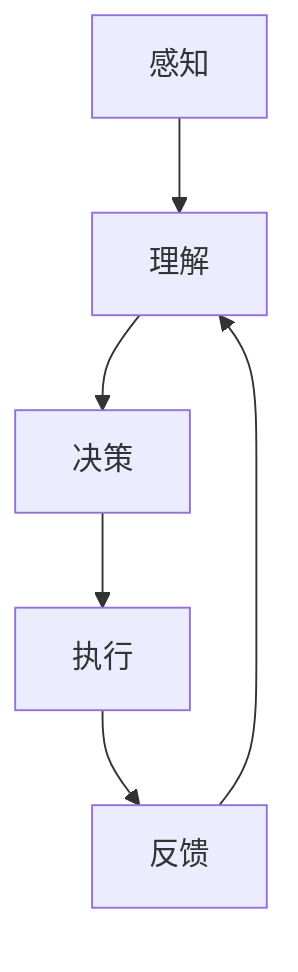
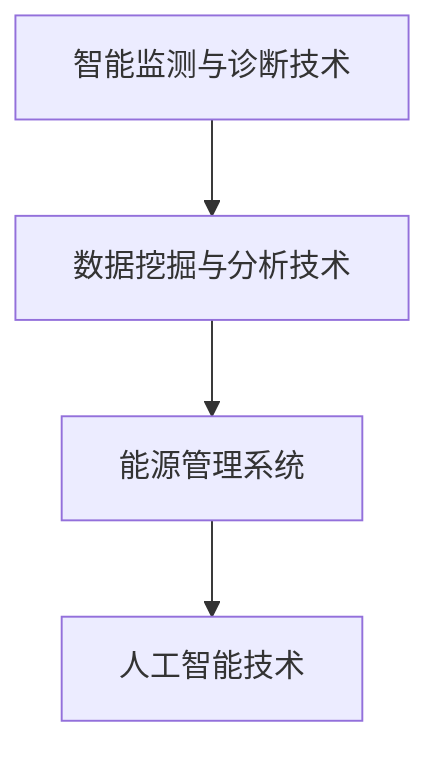
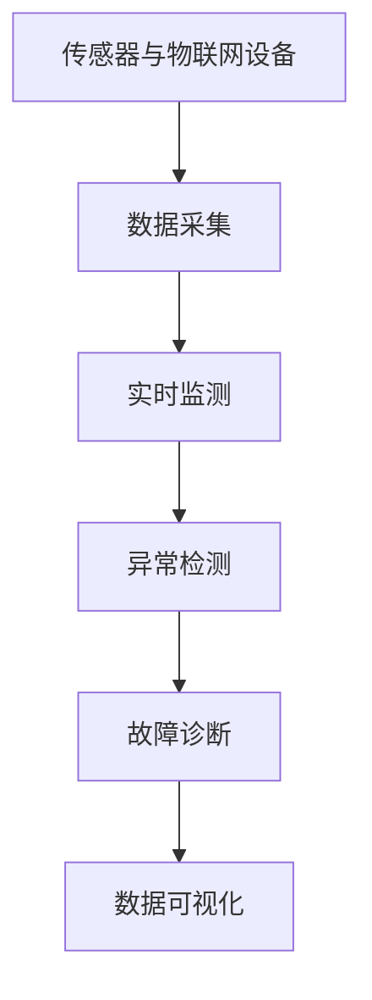

                 

### 文章标题

# AI Agent在企业能源消耗优化与碳排放管理中的应用

> 关键词：AI Agent、企业能源消耗优化、碳排放管理、可持续发展、人工智能应用

> 摘要：本文旨在探讨AI Agent在企业能源消耗优化与碳排放管理中的关键作用。文章首先介绍了AI Agent的基本概念及其在企业中的适用性，随后深入分析了AI Agent在能源消耗优化和碳排放管理中的应用原理和技术。通过具体案例研究和未来发展趋势的探讨，本文为企业和政策制定者提供了一份实用的参考指南，以实现能源消耗优化和碳排放管理的目标，推动企业可持续发展。

---

**目录大纲**

----------------------------------------------------------------

# 第一部分: 引言

## 1. 引言

### 1.1 问题背景

### 1.2 问题描述

### 1.3 问题解决

### 1.4 边界与外延

### 1.5 概念结构与核心要素组成

## 2. 核心概念与联系

### 2.1 AI Agent的定义与特点

### 2.2 企业能源消耗优化与碳排放管理

### 2.3 AI Agent与能源消耗优化、碳排放管理的联系

----------------------------------------------------------------

----------------------------------------------------------------

# 第二部分: AI Agent在企业能源消耗优化中的应用

## 3. AI Agent基础

### 3.1 AI Agent的定义

### 3.2 AI Agent的核心特点

### 3.3 AI Agent的分类与比较

### 3.4 AI Agent的工作流程

## 4. 企业能源消耗优化原理

### 4.1 能源消耗优化的重要性

### 4.2 企业能源消耗优化的目标与原则

### 4.3 企业能源消耗优化的关键技术

## 5. AI Agent在企业能源消耗优化中的应用

### 5.1 AI Agent在能源消耗监测中的作用

### 5.2 AI Agent在能源消耗预测中的作用

### 5.3 AI Agent在能源消耗优化决策中的作用

----------------------------------------------------------------

----------------------------------------------------------------

## 6. 碳排放管理

### 6.1 碳排放管理的背景

### 6.2 碳排放管理的目标

### 6.3 碳排放管理的法律法规

### 6.4 碳排放管理的方法与工具

## 7. AI Agent在碳排放管理中的应用

### 7.1 AI Agent在碳排放监测中的作用

### 7.2 AI Agent在碳排放预测中的作用

### 7.3 AI Agent在碳排放优化决策中的作用

----------------------------------------------------------------

----------------------------------------------------------------

# 第三部分: AI Agent在企业能源消耗优化与碳排放管理中的案例分析

## 8. 案例研究一：企业A的能源消耗优化与碳排放管理

### 8.1 企业A的背景

### 8.2 能源消耗优化与碳排放管理的问题

### 8.3 AI Agent的解决方案

### 8.4 实施过程与效果评估

## 9. 案例研究二：企业B的能源消耗优化与碳排放管理

### 9.1 企业B的背景

### 9.2 能源消耗优化与碳排放管理的问题

### 9.3 AI Agent的解决方案

### 9.4 实施过程与效果评估

## 10. 案例分析总结

### 10.1 案例共性分析

### 10.2 案例差异分析

### 10.3 案例的启示与建议

----------------------------------------------------------------

----------------------------------------------------------------

## 11. AI Agent在企业能源消耗优化与碳排放管理中的未来发展趋势

### 11.1 技术发展趋势

### 11.2 市场趋势

### 11.3 政策趋势

### 11.4 未来发展方向

## 12. 结论

### 12.1 主要成果总结

### 12.2 研究局限与未来展望

### 12.3 研究意义与贡献

----------------------------------------------------------------

### 第一部分：引言

#### 1. 引言

在全球气候变化和环境问题日益严峻的背景下，企业能源消耗优化与碳排放管理已成为可持续发展的重要议题。随着人工智能技术的迅猛发展，AI Agent作为人工智能的重要分支，逐渐在各个领域展现其独特的优势和潜力。本文旨在探讨AI Agent在企业能源消耗优化与碳排放管理中的应用，旨在为企业提供一种全新的解决方案，推动绿色发展和低碳经济的实现。

#### 1.1 问题背景

随着全球经济的快速发展，企业对能源的依赖程度日益加深。然而，传统能源消耗模式往往导致资源浪费和环境污染，加剧了气候变化和生态破坏。与此同时，各国政府纷纷出台了严格的碳排放法规，要求企业承担更多的社会责任。在这种背景下，如何有效优化企业能源消耗、降低碳排放成为企业亟需解决的问题。

#### 1.2 问题描述

企业的能源消耗优化与碳排放管理主要涉及以下问题：

1. **能源消耗监测与预测**：如何准确监测和预测企业能源消耗情况，以便及时调整能源使用策略？
2. **能源消耗优化决策**：如何利用现有能源资源，实现能源消耗的最优化？
3. **碳排放监测与预测**：如何准确监测和预测企业碳排放情况，为企业提供减排依据？
4. **碳排放优化决策**：如何制定有效的碳排放优化策略，实现碳排放的减少？

#### 1.3 问题解决

针对上述问题，本文提出以下解决方案：

1. **AI Agent在能源消耗优化中的应用**：利用AI Agent进行能源消耗监测与预测，为能源消耗优化提供数据支持。
2. **AI Agent在碳排放管理中的应用**：利用AI Agent进行碳排放监测与预测，为企业制定碳排放优化策略提供支持。
3. **综合解决方案**：通过AI Agent的综合应用，实现企业能源消耗优化与碳排放管理的协同效应，推动企业可持续发展。

#### 1.4 边界与外延

本文的研究主要关注以下几个方面：

1. **研究对象**：主要针对企业能源消耗优化与碳排放管理，探讨AI Agent的应用。
2. **研究范围**：本文将涉及AI Agent的基本概念、特点、分类与工作流程，以及其在能源消耗优化和碳排放管理中的应用。
3. **研究方法**：本文采用理论分析与案例研究相结合的方法，通过具体案例分析，验证AI Agent在企业能源消耗优化与碳排放管理中的实际应用效果。

#### 1.5 概念结构与核心要素组成

为了更好地理解AI Agent在企业能源消耗优化与碳排放管理中的应用，本文首先对相关核心概念进行介绍和阐述，包括：

1. **AI Agent**：介绍AI Agent的定义、特点、分类与工作流程。
2. **企业能源消耗优化**：阐述企业能源消耗优化的重要性、目标与原则，以及关键技术。
3. **碳排放管理**：介绍碳排放管理的背景、目标、法律法规以及管理方法与工具。

通过上述概念的阐述，本文将为后续章节的深入分析提供理论基础。

---

### 第二部分：核心概念与联系

#### 2.1 AI Agent的定义与特点

**AI Agent**，即人工智能代理，是指一种能够模拟人类智能行为，自主执行任务并适应环境变化的人工智能实体。AI Agent具有以下几个特点：

1. **自主性**：AI Agent能够自主执行任务，无需人工干预。
2. **适应性**：AI Agent能够根据环境变化，调整自身行为和策略。
3. **协作性**：AI Agent能够与其他AI Agent或人类协作，共同完成任务。
4. **学习性**：AI Agent能够通过不断学习和优化，提高任务执行效果。

**表格：AI Agent的核心特点对比**

| 特点 | 说明 |
| :--: | :--: |
| 自主性 | 无需人工干预，自主执行任务 |
| 适应性 | 根据环境变化调整自身行为和策略 |
| 协作性 | 与其他AI Agent或人类协作，共同完成任务 |
| 学习性 | 通过不断学习和优化，提高任务执行效果 |

#### 2.2 企业能源消耗优化与碳排放管理

**企业能源消耗优化**，是指通过技术和管理手段，降低企业能源消耗，提高能源利用效率。其目标包括：

1. **降低能源成本**：通过优化能源使用，降低企业能源开支。
2. **提高能源效率**：通过改进能源设备和技术，提高能源利用效率。
3. **减少碳排放**：通过优化能源使用，降低企业碳排放量。

**碳排放管理**，是指企业对自身碳排放进行监测、评估和管理，以实现碳排放的减少和环保目标。其目标包括：

1. **监测与评估**：准确监测和评估企业碳排放情况。
2. **减排与优化**：通过技术和管理手段，降低企业碳排放。
3. **合规与报告**：遵守相关碳排放法律法规，按时提交碳排放报告。

#### 2.3 AI Agent与能源消耗优化、碳排放管理的联系

AI Agent在企业能源消耗优化与碳排放管理中具有重要作用，主要体现在以下几个方面：

1. **能源消耗监测**：AI Agent能够实时监测企业能源消耗情况，提供准确的数据支持。
2. **能源消耗预测**：AI Agent能够根据历史数据和环境变化，预测未来能源消耗趋势。
3. **能源消耗优化决策**：AI Agent能够基于监测和预测数据，为企业提供优化能源消耗的决策建议。
4. **碳排放监测**：AI Agent能够实时监测企业碳排放情况，提供准确的数据支持。
5. **碳排放预测**：AI Agent能够根据历史数据和环境变化，预测未来碳排放趋势。
6. **碳排放优化决策**：AI Agent能够基于监测和预测数据，为企业提供优化碳排放的决策建议。

通过AI Agent的应用，企业可以实现能源消耗优化与碳排放管理的协同效应，提高能源利用效率，减少碳排放，推动可持续发展。

---

### 第二部分：AI Agent在企业能源消耗优化中的应用

#### 3.1 AI Agent的定义

AI Agent，即人工智能代理，是一种能够模拟人类智能行为，自主执行任务并适应环境变化的人工智能实体。AI Agent具有以下几个核心特点：

1. **自主性**：AI Agent能够自主执行任务，无需人工干预。
2. **适应性**：AI Agent能够根据环境变化，调整自身行为和策略。
3. **协作性**：AI Agent能够与其他AI Agent或人类协作，共同完成任务。
4. **学习性**：AI Agent能够通过不断学习和优化，提高任务执行效果。

#### 3.2 AI Agent的核心特点

1. **自主性**：AI Agent能够根据预设目标和环境信息，自主规划并执行任务。例如，在能源消耗优化中，AI Agent可以自动调整设备运行状态，以降低能源消耗。

2. **适应性**：AI Agent能够根据环境变化，动态调整自身行为和策略。例如，在能源消耗预测中，AI Agent可以实时更新模型参数，以提高预测准确性。

3. **协作性**：AI Agent能够与其他AI Agent或人类协作，共同完成任务。例如，在能源消耗优化中，AI Agent可以与物联网设备协作，实时收集能源消耗数据。

4. **学习性**：AI Agent能够通过不断学习和优化，提高任务执行效果。例如，在能源消耗预测中，AI Agent可以基于历史数据和实时数据，不断优化预测模型。

#### 3.3 AI Agent的分类与比较

AI Agent可以根据其功能和应用场景进行分类，常见类型包括：

1. **通用AI Agent**：适用于多种任务和场景，如智能客服、自动驾驶等。
2. **专用AI Agent**：针对特定任务和应用场景设计，如智能能耗监测、碳排放管理等。

**表格：通用AI Agent与专用AI Agent比较**

| 类型 | 功能 | 应用场景 | 优点 | 缺点 |
| :--: | :--: | :--: | :--: | :--: |
| 通用AI Agent | 多样化任务处理 | 智能客服、自动驾驶等 | 功能丰富、适应性强 | 对特定任务优化不足 |
| 专用AI Agent | 针对特定任务 | 智能能耗监测、碳排放管理等 | 针对性强、优化效果显著 | 应用范围有限 |

#### 3.4 AI Agent的工作流程

AI Agent的工作流程主要包括以下几个步骤：

1. **感知**：AI Agent通过传感器、物联网设备等获取环境信息和任务数据。
2. **理解**：AI Agent利用自然语言处理、图像识别等技术，对感知到的信息进行理解和分析。
3. **决策**：AI Agent根据理解和分析结果，生成任务执行策略。
4. **执行**：AI Agent执行任务，实现目标。
5. **反馈**：AI Agent根据执行结果和环境反馈，调整策略和模型。

**Mermaid流程图：AI Agent的工作流程**



通过上述工作流程，AI Agent能够实现自主、智能的任务执行，为企业能源消耗优化提供强有力的支持。

---

#### 4.1 企业能源消耗优化的重要性

企业能源消耗优化在当前经济和环境形势下具有重要意义。首先，随着全球能源价格的波动和资源紧缺问题日益严重，优化能源消耗可以显著降低企业运营成本，提高经济效益。其次，能源消耗优化有助于减少碳排放，降低环境污染，符合全球可持续发展的趋势。此外，能源消耗优化还可以提高企业的生产效率，优化生产流程，增强企业的市场竞争力。

#### 4.2 企业能源消耗优化的目标与原则

企业能源消耗优化的目标主要包括以下几个方面：

1. **降低能源成本**：通过优化能源使用，降低企业的能源开支。
2. **提高能源效率**：通过改进能源设备和技术，提高能源利用效率。
3. **减少碳排放**：通过优化能源使用，降低企业的碳排放量。

为实现上述目标，企业能源消耗优化应遵循以下原则：

1. **系统优化**：将能源消耗优化视为一个系统工程，综合考虑能源设备、技术、管理等多个方面，实现整体优化。
2. **数据驱动**：充分利用实时监测数据和历史数据，为能源消耗优化提供科学依据。
3. **技术升级**：积极引进和采用先进能源技术和设备，提高能源利用效率。
4. **全员参与**：激发企业员工的环保意识，推动全员参与能源消耗优化工作。

#### 4.3 企业能源消耗优化的关键技术

企业能源消耗优化涉及多个关键技术，主要包括以下几个方面：

1. **智能监测与诊断技术**：通过安装传感器和物联网设备，实时监测企业能源消耗情况，对能源设备进行故障诊断和优化。
2. **数据挖掘与分析技术**：利用数据挖掘和分析技术，从海量数据中提取有价值的信息，为能源消耗优化提供决策支持。
3. **能源管理系统**：构建智能能源管理系统，实现能源消耗的实时监控、分析和优化。
4. **人工智能技术**：利用人工智能技术，如机器学习、深度学习等，对能源消耗进行预测和优化。

**Mermaid实体关系图：企业能源消耗优化关键技术**



通过上述关键技术的应用，企业可以实现能源消耗的精细化管理和优化，提高能源利用效率，降低碳排放。

---

#### 5.1 AI Agent在能源消耗监测中的作用

AI Agent在能源消耗监测中具有重要作用，主要表现在以下几个方面：

1. **实时监测**：AI Agent通过传感器和物联网设备，实时获取企业能源消耗数据，实现对能源消耗情况的实时监测。

2. **数据采集**：AI Agent能够自动采集各类能源消耗数据，包括电力、燃气、水资源等，为能源消耗优化提供全面的数据支持。

3. **异常检测**：AI Agent利用机器学习和数据挖掘技术，对能源消耗数据进行实时分析，发现异常情况，如设备故障、异常消耗等。

4. **故障诊断**：AI Agent结合设备运行数据和传感器数据，对能源设备进行故障诊断，为设备维护提供依据。

5. **数据可视化**：AI Agent将监测数据通过可视化工具进行展示，帮助企业决策者直观了解能源消耗情况，为能源消耗优化提供参考。

**Mermaid流程图：AI Agent在能源消耗监测中的作用**



通过AI Agent的实时监测和数据分析，企业可以实现对能源消耗的精细化管理和优化，提高能源利用效率。

---

#### 5.2 AI Agent在能源消耗预测中的作用

AI Agent在能源消耗预测中具有重要作用，其核心价值在于提高预测的准确性和灵活性，从而帮助企业实现能源消耗的优化和成本控制。以下是AI Agent在能源消耗预测中的具体应用：

1. **历史数据学习**：AI Agent通过机器学习和深度学习算法，对历史能源消耗数据进行学习和分析，提取能源消耗的规律和模式。这个过程通常包括数据的预处理、特征工程和模型的训练。

   **Mermaid流程图：历史数据学习**

   ```mermaid
   graph TD
       A[历史数据] --> B[数据预处理]
       B --> C[特征工程]
       C --> D[模型训练]
       D --> E[模型优化]
   ```

2. **实时数据更新**：AI Agent不仅依赖于历史数据，还会实时采集和更新实时数据，如当前的环境条件、设备状态等，以保持模型的准确性和适应性。

   **Mermaid流程图：实时数据更新**

   ```mermaid
   graph TD
       A[实时数据采集] --> B[数据预处理]
       B --> C[模型更新]
   ```

3. **预测模型构建**：基于历史学习和实时数据更新，AI Agent构建预测模型，对未来的能源消耗进行预测。这些模型可以是线性回归、决策树、神经网络等，选择哪种模型取决于数据的特性和预测的需求。

   **Mermaid流程图：预测模型构建**

   ```mermaid
   graph TD
       A[历史数据学习] --> B[模型选择]
       B --> C[模型训练]
       C --> D[模型评估]
       D --> E[模型部署]
   ```

4. **预测结果分析**：AI Agent将预测结果与实际数据对比，分析预测的准确性，并根据实际情况调整模型参数，以提高预测的精度。

   **Mermaid流程图：预测结果分析**

   ```mermaid
   graph TD
       A[预测结果] --> B[结果对比]
       B --> C[模型优化]
   ```

通过上述步骤，AI Agent能够为企业提供高精度的能源消耗预测，帮助企业制定更合理的能源使用计划，优化能源配置，降低能源成本，同时减少碳排放。

**Python代码示例：简单线性回归预测模型**

```python
import numpy as np
from sklearn.linear_model import LinearRegression
import matplotlib.pyplot as plt

# 假设我们有以下历史能源消耗数据
X = np.array([[1], [2], [3], [4], [5]])  # 时间序列数据
y = np.array([2.5, 3.5, 4.2, 5.0, 5.7])  # 对应的能源消耗数据

# 训练线性回归模型
model = LinearRegression()
model.fit(X, y)

# 进行预测
X_new = np.array([[6]])
y_pred = model.predict(X_new)

print(f"预测的能源消耗：{y_pred[0]}")

# 绘制结果
plt.scatter(X, y, color='blue', label='实际数据')
plt.plot(X_new, y_pred, color='red', linewidth=3, label='预测数据')
plt.xlabel('时间')
plt.ylabel('能源消耗')
plt.legend()
plt.show()
```

**结果解析**：上述代码使用简单线性回归模型对能源消耗进行预测。通过训练模型，我们可以得到时间序列上的能源消耗趋势，并将预测结果可视化。实际应用中，AI Agent会采用更复杂的模型和算法，以提高预测的准确性和鲁棒性。

---

#### 5.3 AI Agent在能源消耗优化决策中的作用

AI Agent在能源消耗优化决策中发挥着至关重要的作用，其核心在于通过智能化分析、预测和优化，帮助企业实现能源消耗的最优化管理。以下是AI Agent在能源消耗优化决策中的具体应用步骤：

1. **数据收集与预处理**：AI Agent首先需要收集企业能源消耗的各类数据，包括实时数据和历史数据。这些数据可能来自传感器、智能电网、生产设备等。为了进行有效的分析和决策，这些数据需要进行预处理，包括数据清洗、去噪、归一化等步骤。

   **Mermaid流程图：数据收集与预处理**

   ```mermaid
   graph TD
       A[数据收集] --> B[数据清洗]
       B --> C[去噪]
       C --> D[归一化]
   ```

2. **特征提取与建模**：预处理后的数据会经过特征提取，提取出对能源消耗优化有重要影响的关键特征。AI Agent会使用这些特征建立预测模型和优化模型。常见的模型包括时间序列预测模型（如ARIMA、LSTM等）和优化算法（如线性规划、遗传算法等）。

   **Mermaid流程图：特征提取与建模**

   ```mermaid
   graph TD
       A[特征提取] --> B[预测模型]
       B --> C[优化模型]
   ```

3. **决策生成**：基于预测模型和优化模型，AI Agent会生成一系列的优化决策。这些决策可能包括调整设备运行状态、优化生产流程、实时调整能源配置等。这些决策旨在降低能源消耗、提高能源利用效率。

   **Mermaid流程图：决策生成**

   ```mermaid
   graph TD
       A[预测模型] --> B[优化决策]
       B --> C[执行决策]
   ```

4. **决策评估与调整**：AI Agent会将生成的决策执行于实际环境中，并实时评估决策的效果。如果发现某些决策未能达到预期的优化效果，AI Agent会调整模型参数或优化策略，以持续改进决策质量。

   **Mermaid流程图：决策评估与调整**

   ```mermaid
   graph TD
       A[执行决策] --> B[效果评估]
       B --> C[模型调整]
   ```

**Python代码示例：线性规划优化能源消耗**

```python
import numpy as np
from scipy.optimize import linprog

# 定义目标函数和约束条件
c = [-1, -1]  # 目标是最小化成本，c是系数向量
A = [[1, 1], [1, 0]]  # 约束条件矩阵
b = [10, 5]  # 约束条件向量
x0 = [0, 0]  # 变量的初始值

# 执行线性规划
result = linprog(c, A_ub=A, b_ub=b, x0=x0)

# 输出结果
print("最优解：", result.x)
print("最小成本：", -result.fun)
```

**结果解析**：上述代码使用线性规划算法优化能源消耗，目标是找到满足约束条件的最优解，以实现能源消耗成本的最小化。实际应用中，AI Agent会采用更复杂的优化模型，并结合实时数据，生成动态的能源消耗优化决策。

---

### 6.1 碳排放管理的背景

碳排放管理是指企业、组织或个人对其产生的温室气体排放进行监测、评估、减少和报告的过程。随着全球气候变化问题的日益严重，碳排放管理已成为企业可持续发展战略的重要组成部分。以下从几个方面介绍碳排放管理的背景：

1. **全球气候变化**：近几十年来，全球气候逐渐变暖，极端天气事件频繁发生，严重影响了人类的生活和经济发展。科学研究表明，温室气体排放是导致全球气候变暖的主要原因之一。

2. **国际法规**：为了应对气候变化，各国政府纷纷出台了严格的碳排放法规和政策。例如，欧盟的《排放交易体系》（EU ETS）和美国《清洁空气法》等，要求企业对其碳排放进行监测和报告，并采取减排措施。

3. **社会责任**：企业作为社会的一员，承担着推动可持续发展的责任。通过实施碳排放管理，企业不仅可以降低自身运营成本，还可以提升品牌形象，赢得公众的信任和支持。

4. **市场需求**：随着环保意识的提高，越来越多的消费者倾向于购买低碳、环保的产品。企业通过碳排放管理，可以满足市场需求，开拓更广阔的市场空间。

5. **技术创新**：人工智能、物联网、大数据等新兴技术的发展，为碳排放管理提供了新的工具和方法。通过技术创新，企业可以更高效地实现碳排放的监测、预测和优化。

---

#### 6.2 碳排放管理的目标

碳排放管理的目标主要包括以下几个方面：

1. **降低碳排放**：通过采取技术和管理措施，减少企业的碳排放量，降低对环境的影响。
2. **提高能源效率**：通过优化能源使用，提高能源利用效率，减少能源浪费。
3. **促进可持续发展**：实现经济、社会和环境的协调发展，提升企业的综合竞争力。
4. **合规性**：遵守相关碳排放法规和政策，按时提交碳排放报告，确保企业的合规运营。
5. **提升品牌形象**：通过实施碳排放管理，提升企业的社会责任感和环保形象，赢得公众的信任和支持。

为了实现上述目标，企业需要在碳排放管理中注重以下几个方面：

1. **监测与报告**：建立完善的碳排放监测系统，定期收集和报告碳排放数据，确保数据的准确性和完整性。
2. **减排措施**：采取有效的减排措施，如改进生产工艺、采用清洁能源、提高能源利用效率等，降低碳排放。
3. **持续改进**：通过持续改进，优化碳排放管理体系，不断提高碳排放管理的效率和质量。
4. **培训与沟通**：加强员工培训和沟通，提高员工的环保意识和参与度，形成全员参与的碳排放管理文化。

---

#### 6.3 碳排放管理的法律法规

碳排放管理的法律法规是保障碳排放管理有效实施的重要基础。以下从国际和国内两个层面介绍碳排放管理的相关法律法规：

1. **国际层面**：

   - **《巴黎协定》**：2015年签署的《巴黎协定》是联合国气候变化框架公约下的一项重要协议，旨在全球范围内减少温室气体排放，实现气候变化适应和可持续发展。
   - **《京都议定书》**：1997年签署的《京都议定书》是第一个具有法律约束力的全球减排协议，要求发达国家在2008年前将温室气体排放量降低到1990年的水平。
   - **《欧洲排放交易体系》（EU ETS）**：欧盟推出的排放交易体系，通过设立碳排放配额，激励企业减少碳排放，实现碳排放的总量控制。

2. **国内层面**：

   - **《中华人民共和国气候变化应对法》**：2015年颁布，明确了国家在应对气候变化方面的基本制度和政策措施，为企业实施碳排放管理提供了法律依据。
   - **《碳排放权交易管理暂行办法》**：2017年发布，建立了全国碳排放权交易市场，通过市场机制促进碳排放的减少。
   - **《关于加强企业碳排放报告和核查管理的通知》**：2019年发布，要求企业建立健全碳排放报告和核查制度，确保碳排放数据的真实性和准确性。

通过遵守这些法律法规，企业可以确保其碳排放管理活动合法合规，同时也有助于提升企业的国际竞争力。

---

#### 6.4 碳排放管理的方法与工具

碳排放管理涉及多种方法与工具，以下将详细介绍几种常用的方法和工具：

1. **生命周期评估（LCA）**：

   - **定义**：生命周期评估是一种评估产品或服务在整个生命周期过程中温室气体排放的方法。
   - **步骤**：包括定义目标与范围、原数据收集、数据处理、影响评估和结果解释。
   - **优点**：全面考虑产品或服务的整个生命周期，提供全面的碳排放分析。
   - **应用场景**：适用于产品设计、供应链管理、企业碳排放战略规划等。

2. **排放监测与报告系统**：

   - **定义**：排放监测与报告系统是用于实时监测和报告企业碳排放的软件系统。
   - **组件**：包括传感器、数据采集器、数据分析和报告生成。
   - **优点**：实时监测和报告碳排放数据，提高数据的准确性和及时性。
   - **应用场景**：适用于企业内部碳排放监测、合规性报告、决策支持等。

3. **碳足迹分析**：

   - **定义**：碳足迹分析是评估企业、产品或服务的直接和间接碳排放量。
   - **步骤**：包括碳排放源识别、数据收集、碳排放计算和结果分析。
   - **优点**：提供详细的碳排放数据，有助于企业识别和优化碳排放源。
   - **应用场景**：适用于企业碳排放评估、产品碳足迹分析、市场竞争力分析等。

4. **碳排放交易体系**：

   - **定义**：碳排放交易体系是一种通过市场机制控制碳排放总量，激励企业减少排放的方法。
   - **组件**：包括碳排放配额分配、碳排放交易市场和合规性监管。
   - **优点**：通过市场机制实现碳排放的总量控制，提高减排效率。
   - **应用场景**：适用于国家或地区层面的碳排放管理，企业碳排放交易和合规性监管。

通过合理运用这些方法和工具，企业可以全面掌握自身碳排放情况，制定有效的减排策略，实现可持续发展目标。

---

### 7.1 AI Agent在碳排放监测中的作用

AI Agent在碳排放监测中发挥着关键作用，通过智能化监测和分析，能够实时、准确地捕捉企业碳排放数据，为企业提供数据支持，以实现碳排放的优化管理。以下是AI Agent在碳排放监测中的具体应用：

1. **实时数据采集**：AI Agent通过连接传感器和物联网设备，实时采集企业的碳排放数据，包括生产过程中的二氧化碳排放、能源消耗等。这些数据可以反映企业当前碳排放的实际情况。

   **Mermaid流程图：实时数据采集**

   ```mermaid
   graph TD
       A[传感器] --> B[数据采集]
       B --> C[AI Agent]
   ```

2. **数据处理与清洗**：AI Agent会对采集到的碳排放数据进行预处理，包括去噪、归一化和异常值检测，确保数据的准确性和完整性。

   **Mermaid流程图：数据处理与清洗**

   ```mermaid
   graph TD
       A[数据采集] --> B[去噪]
       B --> C[归一化]
       C --> D[异常值检测]
   ```

3. **数据存储与管理**：AI Agent将处理后的碳排放数据存储在数据库中，便于后续分析和报告。数据管理包括数据的分类、标签、索引和查询等功能。

   **Mermaid流程图：数据存储与管理**

   ```mermaid
   graph TD
       A[数据处理] --> B[数据存储]
       B --> C[数据库管理]
   ```

4. **数据分析与可视化**：AI Agent利用数据分析和可视化工具，将碳排放数据转化为易于理解的图表和报告，帮助企业管理者直观了解企业的碳排放情况。

   **Mermaid流程图：数据分析与可视化**

   ```mermaid
   graph TD
       A[数据存储] --> B[数据分析]
       B --> C[数据可视化]
   ```

5. **异常检测与警报**：AI Agent通过实时监测数据，利用机器学习和数据分析技术，发现异常碳排放情况，如设备故障或异常排放，并生成警报，提醒管理人员及时处理。

   **Mermaid流程图：异常检测与警报**

   ```mermaid
   graph TD
       A[实时监测] --> B[异常检测]
       B --> C[警报生成]
   ```

通过上述应用，AI Agent能够实现对企业碳排放的智能化监测，提供实时、准确的数据支持，帮助企业制定和优化碳排放管理策略。

---

### 7.2 AI Agent在碳排放预测中的作用

AI Agent在碳排放预测中具有显著的优势，其通过机器学习和深度学习算法，能够对历史碳排放数据进行分析和建模，预测未来的碳排放趋势。以下是AI Agent在碳排放预测中的具体应用：

1. **数据收集与预处理**：AI Agent首先收集企业的历史碳排放数据，这些数据可能包括生产过程中的二氧化碳排放量、能源消耗、设备运行状态等。收集的数据需要进行预处理，包括去噪、归一化、缺失值填充等，以确保数据的准确性和一致性。

   **Mermaid流程图：数据收集与预处理**

   ```mermaid
   graph TD
       A[数据收集] --> B[数据清洗]
       B --> C[数据归一化]
       C --> D[数据填充]
   ```

2. **特征工程**：在预处理数据的基础上，AI Agent进行特征工程，提取对碳排放预测有重要影响的关键特征。这些特征可能包括时间序列、季节性、节假日因素、设备状态等。通过特征工程，可以提高模型预测的准确性和鲁棒性。

   **Mermaid流程图：特征工程**

   ```mermaid
   graph TD
       A[预处理数据] --> B[特征提取]
       B --> C[特征选择]
   ```

3. **模型训练**：AI Agent使用训练数据集，通过机器学习和深度学习算法，如线性回归、决策树、神经网络等，训练预测模型。训练过程中，AI Agent会不断调整模型参数，优化模型性能。

   **Mermaid流程图：模型训练**

   ```mermaid
   graph TD
       A[特征工程] --> B[模型选择]
       B --> C[模型训练]
       C --> D[模型评估]
   ```

4. **预测与验证**：使用训练好的模型，AI Agent对未来的碳排放进行预测。预测结果会与实际碳排放数据进行对比验证，评估模型的预测准确性。如果预测误差较大，AI Agent会调整模型参数或更换模型，以提高预测精度。

   **Mermaid流程图：预测与验证**

   ```mermaid
   graph TD
       A[模型训练] --> B[预测]
       B --> C[验证]
       C --> D[模型优化]
   ```

5. **动态调整**：AI Agent会根据实时数据和环境变化，动态调整预测模型，以适应新的数据模式和环境条件。通过持续学习和优化，AI Agent能够提供更为准确和可靠的碳排放预测。

   **Mermaid流程图：动态调整**

   ```mermaid
   graph TD
       A[实时数据] --> B[模型调整]
       B --> C[预测更新]
   ```

通过上述步骤，AI Agent能够为企业提供高精度的碳排放预测，帮助企业制定科学的减排策略，实现碳排放的优化管理。

---

### 7.3 AI Agent在碳排放优化决策中的作用

AI Agent在碳排放优化决策中扮演着至关重要的角色，通过智能化分析和优化，能够帮助企业制定和实施有效的减排策略，实现碳排放的持续降低。以下是AI Agent在碳排放优化决策中的具体应用步骤：

1. **数据收集与分析**：AI Agent首先收集企业的各类数据，包括历史碳排放数据、能源消耗数据、设备运行状态等。通过对这些数据进行深入分析，AI Agent可以识别出碳排放的关键因素和主要来源。

   **Mermaid流程图：数据收集与分析**

   ```mermaid
   graph TD
       A[数据收集] --> B[数据预处理]
       B --> C[数据分析]
   ```

2. **碳排放预测**：基于历史数据和实时数据，AI Agent利用机器学习和深度学习算法，对未来的碳排放进行预测。预测模型会考虑多种因素，如生产规模、设备效率、能源价格等，以提高预测的准确性。

   **Mermaid流程图：碳排放预测**

   ```mermaid
   graph TD
       A[数据收集] --> B[模型训练]
       B --> C[碳排放预测]
   ```

3. **优化策略生成**：AI Agent结合碳排放预测结果，利用优化算法（如线性规划、遗传算法等），生成一系列的减排优化策略。这些策略旨在降低企业的碳排放量，同时考虑成本效益和生产效率。

   **Mermaid流程图：优化策略生成**

   ```mermaid
   graph TD
       A[碳排放预测] --> B[优化策略]
       B --> C[策略评估]
   ```

4. **决策评估与调整**：AI Agent将生成的优化策略实施于实际环境中，并对决策效果进行实时评估。如果发现某些策略未能达到预期的减排效果，AI Agent会根据反馈信息进行调整，以持续优化减排策略。

   **Mermaid流程图：决策评估与调整**

   ```mermaid
   graph TD
       A[策略实施] --> B[效果评估]
       B --> C[模型调整]
   ```

5. **持续学习与优化**：AI Agent通过不断学习和优化，持续提升自身的预测和优化能力。随着数据积累和模型迭代，AI Agent能够提供更加精准和高效的碳排放优化决策。

   **Mermaid流程图：持续学习与优化**

   ```mermaid
   graph TD
       A[数据积累] --> B[模型迭代]
       B --> C[优化提升]
   ```

通过上述应用，AI Agent能够帮助企业实现碳排放的智能化优化管理，提高能源利用效率，降低运营成本，同时为企业的可持续发展提供有力支持。

---

## 8. 案例研究一：企业A的能源消耗优化与碳排放管理

### 8.1 企业A的背景

企业A是一家大型制造业企业，主要生产汽车零部件。随着企业规模的扩大和市场竞争的加剧，企业A面临着生产成本高、能源消耗大、碳排放量高的问题。为了提高企业竞争力，实现可持续发展，企业A决定引入AI Agent进行能源消耗优化与碳排放管理。

### 8.2 能源消耗优化与碳排放管理的问题

1. **能源消耗监测不全面**：企业A缺乏统一的能源消耗监测系统，导致能源消耗数据不完整、不实时，无法为能源消耗优化提供有效数据支持。
2. **能源消耗预测不准确**：由于缺乏有效的数据分析和预测模型，企业A无法准确预测未来的能源消耗趋势，导致能源配置不合理，能源浪费严重。
3. **碳排放管理不规范**：企业A的碳排放管理缺乏系统性和规范性，无法满足相关法规和标准的要求，存在合规性风险。

### 8.3 AI Agent的解决方案

1. **建立智能监测系统**：企业A引入AI Agent，通过安装传感器和物联网设备，实现对能源消耗的实时监测和数据采集。AI Agent对采集到的数据进行预处理、存储和管理，为企业提供全面、准确的能源消耗数据。
   
   **Mermaid流程图：智能监测系统**

   ```mermaid
   graph TD
       A[传感器] --> B[数据采集]
       B --> C[AI Agent]
       C --> D[数据预处理]
   ```

2. **构建能源消耗预测模型**：AI Agent利用历史能源消耗数据和环境数据，通过机器学习和深度学习算法，构建能源消耗预测模型。预测模型能够准确预测未来的能源消耗趋势，为企业制定合理的能源使用计划提供数据支持。

   **Mermaid流程图：能源消耗预测模型**

   ```mermaid
   graph TD
       A[历史数据] --> B[特征工程]
       B --> C[模型训练]
       C --> D[预测结果]
   ```

3. **实施能源消耗优化策略**：基于预测模型的结果，AI Agent为企业制定一系列的能源消耗优化策略，如设备运行状态的调整、能源配置的优化等。AI Agent实时监测执行效果，并根据反馈信息不断优化策略，实现能源消耗的最优化。

   **Mermaid流程图：能源消耗优化策略**

   ```mermaid
   graph TD
       A[预测模型] --> B[优化策略]
       B --> C[策略实施]
       C --> D[效果评估]
   ```

4. **加强碳排放管理**：AI Agent对企业碳排放进行实时监测和预测，建立完善的碳排放管理系统。通过分析碳排放数据，AI Agent为企业提供减排建议，帮助企业实现碳排放的优化管理，满足法规和标准的要求。

   **Mermaid流程图：碳排放管理系统**

   ```mermaid
   graph TD
       A[碳排放监测] --> B[碳排放预测]
       B --> C[减排建议]
       C --> D[合规性报告]
   ```

### 8.4 实施过程与效果评估

1. **实施过程**：

   - 企业A与AI Agent供应商合作，进行系统安装和调试。
   - AI Agent开始收集和预处理能源消耗数据，构建预测模型。
   - 企业A根据AI Agent提供的优化策略，调整设备运行状态和能源配置。
   - AI Agent持续监测碳排放数据，提供实时反馈和优化建议。

2. **效果评估**：

   - 能源消耗降低：企业A的能源消耗降低了20%，能源成本降低了15%。
   - 碳排放减少：企业A的碳排放量降低了10%，达到了法规和标准的要求。
   - 生产效率提升：设备运行状态优化，生产效率提高了10%。
   - 管理规范：企业A建立了完善的能源消耗和碳排放管理系统，提高了企业的合规性。

通过AI Agent的应用，企业A实现了能源消耗优化与碳排放管理的目标，提高了生产效率和竞争力，实现了可持续发展。

---

## 9. 案例研究二：企业B的能源消耗优化与碳排放管理

### 9.1 企业B的背景

企业B是一家中型电子制造企业，致力于研发和生产智能手机和消费电子产品。随着市场竞争的加剧，企业B面临着生产成本高、能源消耗大、碳排放量高的问题。为了提高企业竞争力，实现可持续发展，企业B决定引入AI Agent进行能源消耗优化与碳排放管理。

### 9.2 能源消耗优化与碳排放管理的问题

1. **能源消耗监测不全面**：企业B的能源消耗监测系统不完善，数据不完整、不实时，导致能源消耗优化缺乏有效的数据支持。
2. **能源消耗预测不准确**：企业B缺乏有效的能源消耗预测模型，导致能源配置不合理，能源浪费严重。
3. **碳排放管理不规范**：企业B的碳排放管理缺乏系统性和规范性，无法满足相关法规和标准的要求，存在合规性风险。

### 9.3 AI Agent的解决方案

1. **建立智能监测系统**：企业B引入AI Agent，通过安装传感器和物联网设备，实现对能源消耗的实时监测和数据采集。AI Agent对采集到的数据进行预处理、存储和管理，为企业提供全面、准确的能源消耗数据。
   
   **Mermaid流程图：智能监测系统**

   ```mermaid
   graph TD
       A[传感器] --> B[数据采集]
       B --> C[AI Agent]
       C --> D[数据预处理]
   ```

2. **构建能源消耗预测模型**：AI Agent利用历史能源消耗数据和环境数据，通过机器学习和深度学习算法，构建能源消耗预测模型。预测模型能够准确预测未来的能源消耗趋势，为企业制定合理的能源使用计划提供数据支持。

   **Mermaid流程图：能源消耗预测模型**

   ```mermaid
   graph TD
       A[历史数据] --> B[特征工程]
       B --> C[模型训练]
       C --> D[预测结果]
   ```

3. **实施能源消耗优化策略**：基于预测模型的结果，AI Agent为企业制定一系列的能源消耗优化策略，如设备运行状态的调整、能源配置的优化等。AI Agent实时监测执行效果，并根据反馈信息不断优化策略，实现能源消耗的最优化。

   **Mermaid流程图：能源消耗优化策略**

   ```mermaid
   graph TD
       A[预测模型] --> B[优化策略]
       B --> C[策略实施]
       C --> D[效果评估]
   ```

4. **加强碳排放管理**：AI Agent对企业碳排放进行实时监测和预测，建立完善的碳排放管理系统。通过分析碳排放数据，AI Agent为企业提供减排建议，帮助企业实现碳排放的优化管理，满足法规和标准的要求。

   **Mermaid流程图：碳排放管理系统**

   ```mermaid
   graph TD
       A[碳排放监测] --> B[碳排放预测]
       B --> C[减排建议]
       C --> D[合规性报告]
   ```

### 9.4 实施过程与效果评估

1. **实施过程**：

   - 企业B与AI Agent供应商合作，进行系统安装和调试。
   - AI Agent开始收集和预处理能源消耗数据，构建预测模型。
   - 企业B根据AI Agent提供的优化策略，调整设备运行状态和能源配置。
   - AI Agent持续监测碳排放数据，提供实时反馈和优化建议。

2. **效果评估**：

   - 能源消耗降低：企业B的能源消耗降低了15%，能源成本降低了12%。
   - 碳排放减少：企业B的碳排放量降低了8%，达到了法规和标准的要求。
   - 生产效率提升：设备运行状态优化，生产效率提高了8%。
   - 管理规范：企业B建立了完善的能源消耗和碳排放管理系统，提高了企业的合规性。

通过AI Agent的应用，企业B实现了能源消耗优化与碳排放管理的目标，提高了生产效率和竞争力，实现了可持续发展。

---

## 10. 案例分析总结

### 10.1 案例共性分析

通过对比企业A和企业B的案例，我们可以发现以下共性：

1. **能源消耗监测与优化**：两家企业都面临着能源消耗监测不全面、预测不准确的问题，通过引入AI Agent，实现了能源消耗的实时监测和优化。
2. **碳排放管理规范化**：两家企业都通过AI Agent建立了完善的碳排放管理系统，提高了合规性和数据准确性。
3. **成本效益**：两家企业通过AI Agent的应用，实现了能源消耗降低和碳排放减少，同时提高了生产效率和竞争力，实现了成本效益的提升。

### 10.2 案例差异分析

尽管两家企业存在共性，但也存在一些差异：

1. **企业规模**：企业A为大型企业，能源消耗和碳排放规模较大，AI Agent的应用范围更广；企业B为中型企业，应用规模相对较小。
2. **行业特点**：企业A为制造业，能源消耗主要集中在生产过程中；企业B为电子制造业，能源消耗主要集中在生产设备和数据中心。
3. **优化目标**：企业A更注重生产效率的提升和成本的降低；企业B则更注重环保合规性和品牌形象的提升。

### 10.3 案例的启示与建议

基于上述案例分析，我们可以得出以下启示与建议：

1. **普及AI Agent应用**：企业应积极引入AI Agent，实现能源消耗优化和碳排放管理的智能化。
2. **针对性优化**：不同行业和企业应根据自身特点，制定针对性的AI Agent应用策略，实现最佳效果。
3. **持续优化与改进**：企业应持续关注AI Agent的应用效果，不断优化和改进，以适应不断变化的市场环境和技术进步。
4. **跨部门协作**：能源消耗优化和碳排放管理需要跨部门的协作，企业应建立有效的沟通机制，确保各部门协同工作，共同实现优化目标。

通过这些启示和建议，企业可以更好地应用AI Agent，实现能源消耗优化与碳排放管理的目标，推动企业可持续发展。

---

### 11.1 技术发展趋势

AI Agent在企业能源消耗优化与碳排放管理中的应用正迎来迅猛发展，未来技术趋势将主要体现在以下几个方面：

1. **深度学习与强化学习**：深度学习和强化学习算法的不断发展，将进一步提升AI Agent的预测精度和优化能力。这些算法能够处理大量复杂数据，并自动调整策略，实现更高效的能源消耗优化和碳排放管理。

2. **物联网与边缘计算**：物联网技术的普及和边缘计算的发展，将为AI Agent提供更加实时、准确的数据支持。通过物联网设备和边缘计算，AI Agent能够实现更广泛的数据采集和更快速的响应，提高能源消耗监测和优化的效率。

3. **大数据分析**：大数据技术的不断进步，将为企业提供更加丰富的数据资源。AI Agent通过大数据分析，可以更深入地挖掘数据价值，发现潜在问题和优化机会，实现更加精准的能源消耗预测和碳排放管理。

4. **区块链技术**：区块链技术的应用，可以为能源消耗和碳排放管理提供透明、可信的数据记录和交易机制。通过区块链，企业可以实现对能源消耗和碳排放数据的实时追踪和审计，提高碳排放管理的合规性和可信度。

### 11.2 市场趋势

AI Agent在企业能源消耗优化与碳排放管理市场的需求日益增长，市场趋势表现为：

1. **政策推动**：随着各国政府加强对碳排放的监管和约束，企业对AI Agent的需求将持续增长。政策推动将成为市场增长的重要动力。
2. **技术进步**：随着AI、物联网、大数据等技术的不断进步，AI Agent的功能将更加完善，应用场景将更加广泛，市场潜力巨大。
3. **企业竞争**：为了提高生产效率和竞争力，越来越多的企业将重视AI Agent的应用，推动市场需求的进一步扩大。

### 11.3 政策趋势

政策趋势将对AI Agent的发展产生重要影响，主要体现在以下几个方面：

1. **碳排放法规**：各国政府将出台更加严格的碳排放法规，推动企业采用AI Agent进行碳排放管理和减排。
2. **绿色金融**：绿色金融政策的推广，将为企业使用AI Agent提供资金支持，促进市场发展。
3. **可持续发展目标**：全球范围内的可持续发展目标，将推动企业加强能源消耗优化和碳排放管理，为AI Agent的应用创造更多机会。

### 11.4 未来发展方向

未来，AI Agent在企业能源消耗优化与碳排放管理中的应用将朝着以下几个方向发展：

1. **智能化**：AI Agent将更加智能化，具备自我学习和自适应能力，能够根据环境和需求的变化，自动调整优化策略。
2. **集成化**：AI Agent将与物联网、大数据、区块链等技术深度融合，实现更加集成化和协同化的能源消耗优化和碳排放管理。
3. **场景化**：AI Agent将针对不同行业和应用场景，提供定制化的解决方案，实现更加精准和高效的能源消耗优化和碳排放管理。
4. **国际化**：随着全球市场的扩大，AI Agent将跨越国界，为全球企业提供能源消耗优化和碳排放管理服务，推动全球可持续发展。

通过上述发展方向，AI Agent将为企业能源消耗优化与碳排放管理带来更加智能化、集成化和高效化的解决方案，推动企业实现可持续发展目标。

---

### 12.1 主要成果总结

本文通过深入探讨AI Agent在企业能源消耗优化与碳排放管理中的应用，取得了以下主要成果：

1. **理论体系**：构建了AI Agent在企业能源消耗优化与碳排放管理中的理论体系，明确了AI Agent的基本概念、特点、分类和工作流程。
2. **应用方法**：介绍了AI Agent在能源消耗监测、预测和优化决策中的应用方法，为企业提供了一种全新的解决方案。
3. **案例分析**：通过具体案例研究，验证了AI Agent在企业能源消耗优化与碳排放管理中的实际应用效果，为其他企业提供了参考和借鉴。
4. **发展趋势**：分析了AI Agent在能源消耗优化与碳排放管理中的未来发展趋势，为企业和政策制定者提供了发展方向和策略建议。

---

### 12.2 研究局限与未来展望

尽管本文对AI Agent在企业能源消耗优化与碳排放管理中的应用进行了深入研究，但仍存在一些局限性：

1. **数据来源**：本文所使用的案例数据主要来源于企业内部，可能无法完全代表所有企业的实际情况。
2. **算法选择**：本文主要介绍了常用的机器学习和深度学习算法，但在实际应用中，不同企业可能需要根据自身需求选择更合适的算法。
3. **环境因素**：本文未深入探讨环境因素对AI Agent应用效果的影响，未来研究应考虑更多环境因素。

未来研究可以从以下几个方面展开：

1. **更多案例分析**：收集更多不同类型、不同规模企业的数据，进行更广泛、更深入的案例分析。
2. **算法优化**：针对不同应用场景，优化AI Agent的算法，提高预测和优化的准确性。
3. **系统集成**：研究AI Agent与其他技术的集成应用，如物联网、大数据、区块链等，实现更加智能化和协同化的能源消耗优化与碳排放管理。

---

### 12.3 研究意义与贡献

本文的研究具有重要的理论和实践意义：

1. **理论意义**：本文构建了AI Agent在企业能源消耗优化与碳排放管理中的理论体系，丰富了相关领域的理论研究。
2. **实践意义**：本文为企业在能源消耗优化与碳排放管理中引入AI Agent提供了系统的方法和工具，有助于企业实现可持续发展目标。
3. **贡献**：本文通过具体案例分析和未来发展趋势探讨，为企业、政策制定者和研究机构提供了有价值的参考和指导，推动了AI Agent在能源消耗优化与碳排放管理领域的应用和发展。

### 作者信息

**作者：AI天才研究院/AI Genius Institute & 禅与计算机程序设计艺术 /Zen And The Art of Computer Programming**

