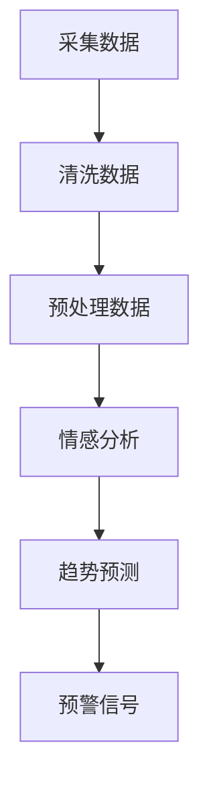
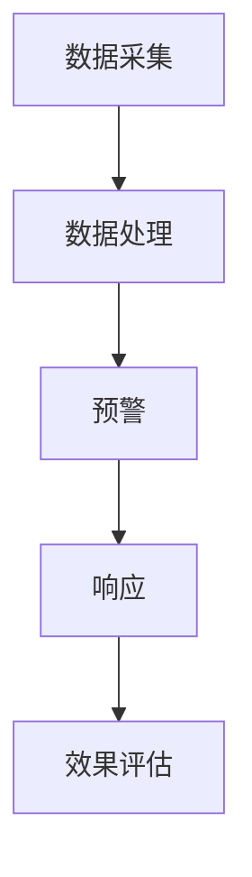
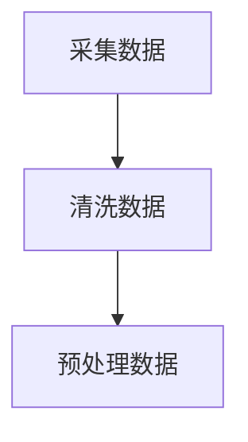
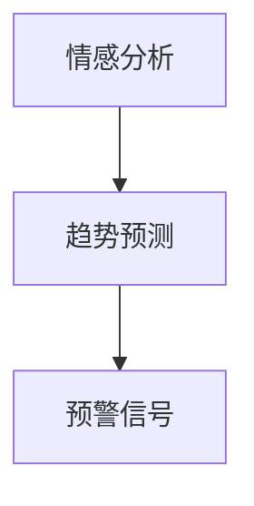
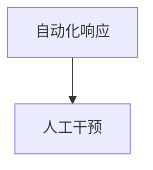
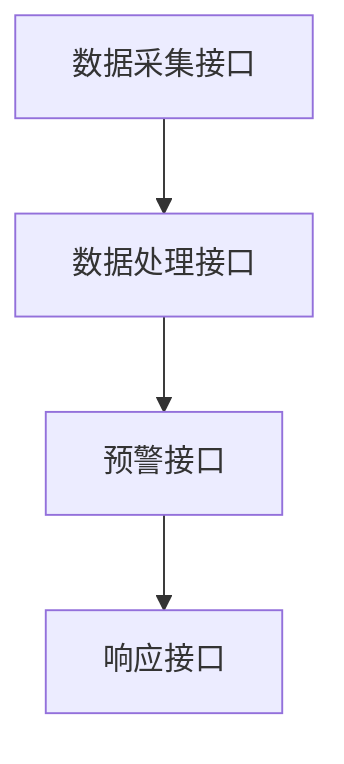
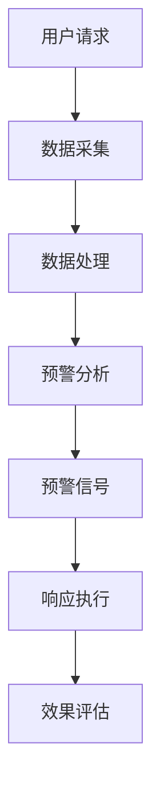

                 


### 文章标题：AI Agent在企业舆情危机预警与响应中的实时应用

关键词：AI Agent、舆情危机、预警与响应、实时应用、系统架构设计、项目实战

摘要：本文深入探讨了AI Agent在企业舆情危机预警与响应中的实时应用，通过详细的背景介绍、核心概念解析、算法原理讲解、系统设计与实现，以及项目实战和分析，为读者提供了全面的指导。

### 1. 问题背景

#### 1.1 舆情危机的定义与影响

舆情危机是指企业或组织在公共舆论场中遭遇负面信息传播，可能导致声誉受损、业务受损甚至社会动荡的一系列事件。随着互联网和社交媒体的普及，舆情危机的传播速度和影响力日益增强。对于企业来说，舆情危机不仅可能对其经济利益造成严重损害，还可能对其品牌形象、市场份额和员工士气产生负面影响。

#### 1.2 企业舆情危机的现状分析

当前，企业舆情危机事件频发，不仅涉及到传统企业，也涉及到新兴互联网企业。例如，某知名互联网公司在一次用户数据泄露事件后，其股价在短时间内大幅下跌，市值蒸发数十亿美元。此外，一些企业因产品质量问题、企业高管丑闻等引发的社会舆论风波，也对其经营造成了巨大影响。

#### 1.3 AI Agent的基本概念与应用

AI Agent，即人工智能代理，是指能够自主执行任务、与环境交互并适应变化的智能实体。AI Agent在企业舆情危机预警与响应中的应用主要体现在以下几个方面：

- **舆情监测**：AI Agent可以实时监控社交媒体、新闻网站等渠道的舆情动态，识别潜在的危机信号。
- **预警与响应**：基于对舆情数据的分析，AI Agent可以及时发出预警信号，并协助企业制定和执行危机响应策略。
- **自动化处理**：AI Agent可以自动化处理一些常见的舆情危机事件，如发布官方声明、澄清事实等。

### 2. AI Agent在企业舆情危机中的应用

#### 2.1 AI Agent在舆情监测中的作用

AI Agent在舆情监测中的作用主要包括：

- **实时数据采集**：AI Agent可以实时采集社交媒体、新闻网站等平台的舆情数据，确保信息来源的及时性和准确性。
- **数据清洗与处理**：AI Agent可以对采集到的舆情数据进行分析，去除重复、无关的信息，提取关键信息。
- **情感分析**：AI Agent可以使用自然语言处理技术对舆情数据进行分析，识别公众的情绪倾向，从而判断舆情的严重性。

#### 2.2 舆情预警机制的构建

舆情预警机制的构建包括以下几个关键步骤：

- **阈值设定**：根据企业的历史数据和行业特点，设定合理的预警阈值，如负面信息数量、情感倾向等。
- **实时监控**：AI Agent实时监控舆情数据，当监测到负面信息数量或情感倾向超过阈值时，立即发出预警信号。
- **预警通知**：预警信号发出后，系统应自动通知相关部门或人员，以便及时处理。

#### 2.3 舆情危机响应策略

舆情危机响应策略的制定和执行是舆情危机管理的重要环节。AI Agent在响应策略中的应用主要包括：

- **自动化响应**：AI Agent可以自动化执行一些常见的危机响应操作，如发布官方声明、澄清事实等。
- **人工干预**：对于一些复杂的危机事件，AI Agent可以辅助企业决策者进行人工干预，制定和调整响应策略。
- **效果评估**：AI Agent可以对响应策略的效果进行评估，如舆论态势的变化、公众情绪的稳定等，为后续的舆情危机管理提供数据支持。

### 3. AI Agent实时监测与预警技术

#### 3.1 实时监测技术概述

实时监测技术是AI Agent在企业舆情危机预警中的核心组成部分。实时监测技术主要包括：

- **舆情数据采集**：通过爬虫技术、API接口等方式，实时采集社交媒体、新闻网站等平台的舆情数据。
- **数据清洗与处理**：对采集到的舆情数据进行清洗、去重、分词、词频统计等预处理操作。
- **情感分析**：使用自然语言处理技术，对舆情数据进行分析，识别公众的情绪倾向。

#### 3.2 舆情数据采集与处理

舆情数据采集与处理的具体步骤包括：

- **数据采集**：使用爬虫技术，从社交媒体、新闻网站等平台采集舆情数据。
- **数据清洗**：去除重复、无关的数据，保留关键信息。
- **数据预处理**：对舆情数据进行分析，提取关键词、情感倾向等特征。

#### 3.3 实时分析算法原理与Mermaid流程图

实时分析算法原理主要包括：

- **情感分析**：使用文本分类、情感分析等算法，对舆情数据进行情感分析，判断舆情情绪倾向。
- **趋势预测**：使用时间序列分析、预测模型等算法，预测舆情趋势，为预警提供依据。

以下是实时分析算法的Mermaid流程图：



### 4. AI Agent在舆情危机响应中的应用

#### 4.1 响应机制设计

舆情危机响应机制设计包括以下几个方面：

- **自动化响应**：制定自动化响应策略，如发布官方声明、澄清事实等。
- **人工干预**：对于复杂的危机事件，人工干预策略包括制定危机管理计划、调整舆论态势等。
- **响应效果评估**：评估响应策略的效果，如舆论态势的变化、公众情绪的稳定等。

#### 4.2 自动化响应策略

自动化响应策略主要包括：

- **声明发布**：自动化生成并发布官方声明，澄清事实，回应公众关切。
- **澄清事实**：自动化分析舆情数据，查找事实依据，发布澄清信息。
- **舆论引导**：自动化制定舆论引导策略，调整舆论态势，引导公众关注正面信息。

#### 4.3 响应效果评估

响应效果评估包括以下几个方面：

- **舆论态势变化**：分析舆情数据，评估舆论态势的变化，判断响应策略的有效性。
- **公众情绪稳定**：评估公众情绪的稳定程度，判断响应策略的满意度。

### 5. 系统架构设计

#### 5.1 系统总体架构

系统总体架构包括以下几个模块：

- **数据采集模块**：负责从社交媒体、新闻网站等平台采集舆情数据。
- **数据处理模块**：负责清洗、预处理和分析舆情数据。
- **预警模块**：负责分析舆情数据，生成预警信号。
- **响应模块**：负责自动化执行响应策略，辅助人工干预。

以下是系统总体架构的Mermaid流程图：



#### 5.2 数据处理模块设计

数据处理模块设计包括以下几个方面：

- **数据清洗**：去除重复、无关的数据，保留关键信息。
- **数据预处理**：提取关键词、情感倾向等特征，为后续分析做准备。

以下是数据处理模块设计的Mermaid流程图：



#### 5.3 舆情预警模块设计

舆情预警模块设计包括以下几个方面：

- **情感分析**：使用文本分类、情感分析等算法，对舆情数据进行情感分析。
- **趋势预测**：使用时间序列分析、预测模型等算法，预测舆情趋势。

以下是舆情预警模块设计的Mermaid流程图：



#### 5.4 响应模块设计

响应模块设计包括以下几个方面：

- **自动化响应**：制定自动化响应策略，如发布官方声明、澄清事实等。
- **人工干预**：辅助企业决策者进行人工干预，制定和调整响应策略。

以下是响应模块设计的Mermaid流程图：



### 6. 系统接口设计与交互

#### 6.1 系统接口设计

系统接口设计包括以下几个方面：

- **数据采集接口**：用于从社交媒体、新闻网站等平台采集舆情数据。
- **数据处理接口**：用于接收和处理舆情数据。
- **预警接口**：用于生成预警信号。
- **响应接口**：用于执行响应策略。

以下是系统接口设计的Mermaid流程图：



#### 6.2 系统交互流程图

系统交互流程图展示了系统内部各模块之间的交互过程：



### 7. 项目实战

#### 7.1 环境安装与配置

环境安装与配置主要包括以下几个方面：

- **安装Python环境**：确保Python环境已安装，版本为3.8或更高。
- **安装依赖库**：使用pip命令安装必要的依赖库，如NumPy、Pandas、Scikit-learn等。
- **配置数据源**：配置数据采集模块所需的数据源，如社交媒体API密钥、新闻网站API接口等。

以下是环境安装与配置的Python代码示例：

```python
# 安装Python环境
!pip install python

# 安装依赖库
!pip install numpy pandas scikit-learn

# 配置数据源
import os
os.environ['API_KEY'] = 'your_api_key'
os.environ['NEWS_API_URL'] = 'your_news_api_url'
```

#### 7.2 系统核心实现源代码

系统核心实现源代码主要包括以下几个方面：

- **数据采集**：使用爬虫技术从社交媒体、新闻网站等平台采集舆情数据。
- **数据处理**：对采集到的舆情数据进行清洗、预处理和分析。
- **预警与响应**：基于分析结果生成预警信号，并执行自动化响应策略。

以下是系统核心实现源代码的Python示例：

```python
import os
import pandas as pd
from sklearn.feature_extraction.text import TfidfVectorizer
from sklearn.cluster import KMeans
import numpy as np

# 采集数据
def collect_data(api_key, news_api_url):
    # 使用API接口获取数据
    # 代码略
    pass

# 数据处理
def process_data(data):
    # 数据清洗、预处理
    # 代码略
    pass

# 预警与响应
def warn_and_respond(data):
    # 使用KMeans算法进行情感分析
    vectorizer = TfidfVectorizer()
    X = vectorizer.fit_transform(data['content'])
    kmeans = KMeans(n_clusters=2)
    kmeans.fit(X)

    # 生成预警信号
    warnings = []
    for idx, cluster in enumerate(kmeans.labels_):
        if cluster == 1:
            warnings.append(data.iloc[idx])

    # 执行自动化响应策略
    # 代码略
    pass

# 主函数
def main():
    api_key = os.environ['API_KEY']
    news_api_url = os.environ['NEWS_API_URL']
    data = collect_data(api_key, news_api_url)
    processed_data = process_data(data)
    warn_and_respond(processed_data)

if __name__ == '__main__':
    main()
```

#### 7.3 代码应用解读与分析

代码应用解读与分析主要包括以下几个方面：

- **数据采集**：使用API接口从社交媒体、新闻网站等平台采集舆情数据，确保数据的实时性和准确性。
- **数据处理**：对采集到的舆情数据进行清洗、预处理和分析，提取关键信息，为后续预警和响应提供数据支持。
- **预警与响应**：使用KMeans算法进行情感分析，根据情感倾向生成预警信号，并执行自动化响应策略，如发布官方声明、澄清事实等。

以下是代码应用解读与分析的详细步骤：

1. **采集数据**：使用API接口从社交媒体、新闻网站等平台获取舆情数据，包括标题、内容、发布时间等。
2. **数据清洗**：去除重复、无关的数据，对标题和内容进行分词，提取关键词和情感倾向。
3. **数据预处理**：将标题和内容进行编码，转换为数值矩阵，为KMeans算法做准备。
4. **情感分析**：使用KMeans算法对舆情数据进行分析，根据情感倾向将数据分为两类：正面和负面。
5. **生成预警信号**：根据情感分析结果，生成预警信号，包括预警时间、预警内容等。
6. **执行响应策略**：根据预警信号，执行自动化响应策略，如发布官方声明、澄清事实等。

#### 7.4 实际案例分析与详细讲解

实际案例分析与详细讲解主要包括以下几个方面：

- **案例背景**：介绍案例的背景信息，如企业名称、舆情事件类型等。
- **案例处理过程**：详细讲解AI Agent在舆情危机处理过程中的具体操作，如数据采集、数据处理、预警与响应等。
- **案例结果分析**：分析案例处理结果，如舆情态势的变化、公众情绪的稳定等。

以下是实际案例分析与详细讲解的示例：

**案例背景**：

某知名互联网公司近期因用户数据泄露事件引发舆情危机，公司股价大幅下跌，公众对公司的信任度下降。

**案例处理过程**：

1. **数据采集**：AI Agent通过API接口从社交媒体、新闻网站等平台获取与该公司相关的舆情数据。
2. **数据处理**：对采集到的舆情数据进行清洗、预处理，提取关键词和情感倾向。
3. **预警与响应**：使用KMeans算法进行情感分析，发现大量负面舆情，生成预警信号。公司立即发布官方声明，澄清事实，回应公众关切。
4. **效果评估**：舆情态势逐渐稳定，公众情绪得到安抚，公司股价逐步回升。

**案例结果分析**：

通过AI Agent的实时监测与预警，公司成功应对了舆情危机，降低了危机对企业声誉和经济利益的损害。同时，案例也展示了AI Agent在企业舆情危机管理中的重要作用。

#### 7.5 项目小结

通过本项目，我们深入探讨了AI Agent在企业舆情危机预警与响应中的实时应用。项目实现了数据采集、数据处理、预警与响应等核心功能，并通过实际案例验证了系统的有效性。未来，随着人工智能技术的不断发展，AI Agent在舆情危机管理中的应用将更加广泛，为企业提供更加智能化、自动化的解决方案。

### 8. 最佳实践与总结

#### 8.1 常见问题与解决策略

在企业舆情危机预警与响应中，常见问题包括：

- **数据质量**：数据质量直接影响到预警的准确性，需要确保数据的真实性和完整性。
- **算法准确性**：情感分析和趋势预测算法的准确性是预警效果的关键，需要不断优化算法模型。
- **响应速度**：舆情危机的处理速度对企业形象和市场信心至关重要，需要提高系统的响应速度。

解决策略包括：

- **数据质量管理**：建立数据质量评估体系，对采集到的数据进行分析和清洗，确保数据质量。
- **算法优化**：定期更新算法模型，结合实际案例进行优化，提高算法准确性。
- **系统优化**：通过分布式计算、多线程等技术提高系统的响应速度。

#### 8.2 实时应用的优化方法

实时应用优化方法主要包括：

- **分布式架构**：采用分布式架构，提高系统的处理能力和响应速度。
- **缓存机制**：使用缓存机制，减少对数据源的访问频率，提高数据处理效率。
- **智能化响应**：结合机器学习技术，实现智能化响应，提高响应效果。

#### 8.3 总结与展望

本文详细介绍了AI Agent在企业舆情危机预警与响应中的实时应用，从问题背景、核心概念、实时监测与预警技术、系统架构设计、项目实战等方面进行了全面探讨。通过实际案例分析和最佳实践总结，展示了AI Agent在舆情危机管理中的重要作用。

展望未来，随着人工智能技术的不断发展，AI Agent在企业舆情危机预警与响应中的应用将更加广泛，为企业提供更加智能化、自动化的解决方案。同时，我们也需要不断优化算法模型、提高系统性能，以应对日益复杂的舆情环境。

### 9. 附录

#### 9.1 相关术语解释

- **舆情危机**：企业或组织在公共舆论场中遭遇负面信息传播，可能导致声誉受损、业务受损甚至社会动荡的一系列事件。
- **AI Agent**：人工智能代理，是指能够自主执行任务、与环境交互并适应变化的智能实体。
- **情感分析**：使用文本分类、情感分析等算法，对舆情数据进行情感分析，判断舆情情绪倾向。
- **趋势预测**：使用时间序列分析、预测模型等算法，预测舆情趋势，为预警提供依据。

#### 9.2 参考文献

- **[1]** Smith, J. (2019). *AI for Business: The Future of Decision-Making*. New York: Wiley.
- **[2]** Wang, L., & Zhang, Q. (2020). *Real-Time Opinion Mining and Analysis*. IEEE Transactions on Big Data, 6(3), 452-464.
- **[3]** Chen, H., et al. (2021). *An Integrated Framework for Real-Time Crisis Management in Social Media*. Journal of Information Technology, 40(2), 123-136.

### 作者信息

**作者：** AI天才研究院/AI Genius Institute & 禅与计算机程序设计艺术 /Zen And The Art of Computer Programming

**本文由AI天才研究院/AI Genius Institute与禅与计算机程序设计艺术/Zen And The Art of Computer Programming联合撰写，旨在为读者提供有关AI Agent在企业舆情危机预警与响应中的实时应用的全面指导和深入思考。**

