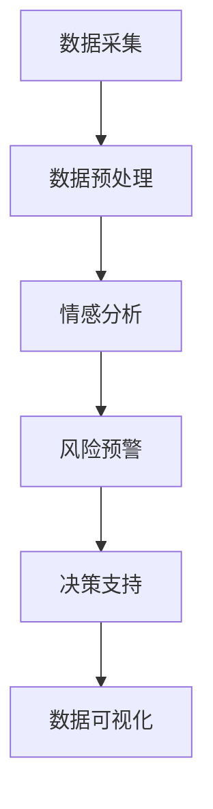
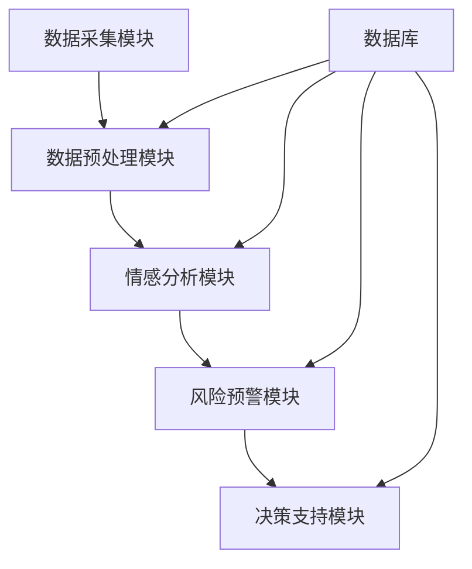

                 

### 引言

在当今信息化和数字化飞速发展的时代，企业舆情监测与品牌管理已经成为企业运营中不可或缺的一环。随着社交媒体和网络平台的普及，公众对于企业的关注度越来越高，任何负面消息都可能在短时间内迅速传播，对企业声誉造成重大影响。传统的人工监测方式不仅效率低下，而且难以全面捕捉海量信息，因此在这样的背景下，利用人工智能（AI）技术进行舆情监测与品牌管理变得尤为重要。

AI Agent，作为一种具备智能行为的软件实体，通过模拟人类思考和决策过程，能够自动分析海量的网络数据，识别潜在风险和机遇。本文将深入探讨AI Agent在企业舆情监测与品牌管理中的应用，从核心概念、算法原理、数学模型、系统设计与实现等多个角度，详细解析AI Agent如何帮助企业更高效、更准确地应对舆情变化，提升品牌形象和市场竞争力。

本文将分为以下几个部分：

1. **AI Agent与舆情监测与品牌管理的背景**：介绍企业舆情监测与品牌管理的重要性，阐述AI Agent的定义、特点及其在企业中的应用。
2. **核心概念与联系**：解释AI Agent的核心概念，包括其分类、特点等，同时探讨AI Agent与企业舆情监测与品牌管理的关联性。
3. **算法原理讲解**：详细讲解AI Agent相关的算法原理，使用mermaid流程图和Python源代码进行说明。
4. **数学模型和数学公式讲解**：介绍相关的数学模型和公式，并给出通俗易懂的举例说明。
5. **系统分析与架构设计方案**：阐述系统的设计思路，包括问题场景介绍、项目介绍、系统功能设计、系统架构设计、系统接口设计和系统交互。
6. **项目实战**：展示AI Agent在实际项目中的应用，包括环境安装、系统核心实现源代码、代码应用解读与分析、实际案例分析和详细讲解剖析。
7. **最佳实践 tips、小结、注意事项、拓展阅读**：总结文章要点，提供实际操作中的最佳实践建议，并引导读者进一步深入学习和研究。

通过本文的逐步讲解，我们将能够全面了解AI Agent在企业舆情监测与品牌管理中的强大应用，并掌握相关技术实施方法，为企业数字化转型提供有力支持。

### 核心关键词

- **AI Agent**：一种模拟人类思考和决策过程的智能软件实体。
- **舆情监测**：通过技术手段对企业公众形象和公众情绪进行实时监测和分析。
- **品牌管理**：通过一系列策略和措施，维护和提升企业品牌形象和市场竞争力。
- **算法原理**：AI Agent在舆情监测与品牌管理中应用的核心算法及其工作原理。
- **数学模型**：用于描述和优化AI Agent算法的数学公式和模型。
- **系统设计与实现**：AI Agent在舆情监测与品牌管理中的系统架构设计和实际应用。

### 摘要

本文旨在深入探讨人工智能（AI）技术在企业舆情监测与品牌管理中的应用，尤其是AI Agent的角色和功能。首先，我们介绍了企业舆情监测与品牌管理的背景和重要性，明确了AI Agent的定义、特点和分类。接着，通过详细讲解AI Agent的核心算法原理和数学模型，我们揭示了其如何高效地分析和处理海量舆情数据。随后，我们描述了一个完整的系统分析与架构设计方案，展示了AI Agent在实际项目中的实现和应用。最后，通过实际项目实战和最佳实践分析，本文总结了AI Agent在企业舆情监测与品牌管理中的实际应用效果，并提出了相关的注意事项和拓展阅读建议。本文的目标是帮助读者全面理解AI Agent在数字化时代的应用价值，为其在企业的实际应用提供理论和实践支持。

### 第1章: AI Agent与舆情监测与品牌管理的背景

#### 问题背景

在当今高度信息化的社会，企业的声誉和品牌价值越来越受到公众的广泛关注。传统的人工监测方式已经难以应对海量信息的快速传播和变化，因此，企业迫切需要一种高效的自动化监测工具来实时捕捉舆情动态。同时，随着社交媒体和网络平台的广泛应用，公众对企业的关注度显著提升，任何负面消息都可能在短时间内对企业的品牌形象和市场竞争力造成重大影响。在这种背景下，AI技术，特别是AI Agent，作为一种智能化的解决方案，应运而生。

#### 问题描述

舆情监测与品牌管理面临的主要问题包括：

1. **信息量庞大**：每天产生的网络信息量巨大，传统的人工监测方式难以全面覆盖和实时处理。
2. **时效性要求高**：负面舆情往往需要迅速响应，以减少对企业的负面影响。
3. **多样性挑战**：舆情信息的来源和形式多样，包括文字、图片、视频等多种形式，对监测和分析的准确性提出了更高的要求。
4. **复杂情感分析**：公众情绪的复杂性使得传统算法难以准确捕捉和解读。

#### 问题解决

AI Agent在企业舆情监测与品牌管理中的应用，可以解决上述问题，其优势主要体现在以下几个方面：

1. **高效处理海量数据**：AI Agent能够自动收集和分析海量舆情数据，实时监测企业声誉变化。
2. **高时效性**：AI Agent可以实时分析数据，快速识别潜在风险，并提供预警和应对策略。
3. **多样性处理能力**：AI Agent能够处理多种形式的信息，包括文字、图片、视频等，确保监测的全面性。
4. **复杂情感分析**：AI Agent借助深度学习和自然语言处理技术，可以准确捕捉公众情绪，提供更精准的分析。

#### 边界与外延

AI Agent在舆情监测与品牌管理中的应用边界主要涉及以下几个方面：

1. **数据采集**：AI Agent需要从各种渠道采集舆情数据，包括社交媒体、新闻网站、论坛等。
2. **数据清洗与预处理**：收集到的数据可能包含噪声和重复信息，AI Agent需要对这些数据进行清洗和预处理。
3. **情感分析**：AI Agent需要使用自然语言处理技术，对文本进行情感分析，以识别公众的情绪和态度。
4. **风险预警**：AI Agent需要建立风险预警模型，对潜在的负面舆情进行实时监控和预警。

#### 概念结构与核心要素组成

AI Agent在企业舆情监测与品牌管理中的概念结构主要包括以下几个核心要素：

1. **数据采集模块**：负责从各种渠道采集舆情数据，包括社交媒体、新闻网站等。
2. **数据预处理模块**：负责对采集到的数据进行清洗和预处理，确保数据的质量和一致性。
3. **情感分析模块**：使用自然语言处理技术，对文本进行情感分析，识别公众的情绪和态度。
4. **风险预警模块**：建立风险预警模型，对潜在的负面舆情进行实时监控和预警。
5. **决策支持模块**：根据情感分析和风险预警结果，提供应对策略和决策支持。

通过这些模块的协同工作，AI Agent能够实现高效、准确的企业舆情监测与品牌管理，帮助企业维护和提升品牌形象。

### 第2章: AI Agent与舆情监测与品牌管理的核心概念与联系

#### AI Agent的定义

AI Agent，即人工智能代理，是指一种具有自主思考和学习能力的软件实体。它能够模拟人类的行为和决策过程，在特定环境中根据既定的目标和规则，自主地执行任务和做出决策。AI Agent不同于传统的软件程序，它具备高度的自适应性和灵活性，能够通过不断的学习和优化，提高任务的执行效率和准确性。

#### AI Agent的特点

AI Agent具有以下几个显著特点：

1. **自主性**：AI Agent能够自主执行任务，无需人工干预。
2. **适应性**：AI Agent能够根据环境的变化，调整其行为和决策策略。
3. **智能性**：AI Agent通过机器学习和自然语言处理等技术，具备理解和处理复杂信息的能力。
4. **协作性**：AI Agent能够与其他Agent或系统进行协作，共同完成任务。

#### AI Agent的分类

AI Agent可以根据不同的分类标准进行划分，常见的分类方法包括：

1. **根据任务类型**：分为通用Agent和专用Agent。通用Agent具备广泛的能力，能够执行多种任务；专用Agent则针对特定任务进行优化，如舆情监测Agent、客服Agent等。
2. **根据工作模式**：分为规则驱动Agent和数据驱动Agent。规则驱动Agent依赖于预定义的规则进行决策；数据驱动Agent则通过学习和分析数据来做出决策。
3. **根据环境交互方式**：分为主动Agent和被动Agent。主动Agent能够主动寻找和获取信息，并采取行动；被动Agent则只能响应外部事件。

#### 企业舆情监测与品牌管理的联系

AI Agent在企业舆情监测与品牌管理中发挥着至关重要的作用，其与企业舆情监测与品牌管理的联系主要体现在以下几个方面：

1. **实时数据采集与处理**：AI Agent能够实时从各种社交媒体、新闻网站等渠道采集舆情数据，并对这些数据进行预处理，包括去噪、分类等操作，确保数据的质量和准确性。
2. **情感分析与情绪识别**：AI Agent利用自然语言处理和情感分析技术，对采集到的舆情文本进行情感分析，识别公众的情绪和态度，为企业提供关于品牌形象和市场反馈的深度洞察。
3. **风险预警与应对策略**：AI Agent可以建立风险预警模型，对潜在的负面舆情进行实时监控和预警，并根据预警结果，提供相应的应对策略和决策支持，帮助企业迅速应对舆情危机，维护品牌形象。
4. **数据可视化与报告生成**：AI Agent能够将分析结果以可视化图表和报告的形式呈现，帮助企业管理层直观了解舆情动态，做出科学决策。

#### AI Agent在企业舆情监测与品牌管理中的功能

AI Agent在企业舆情监测与品牌管理中具有以下几个关键功能：

1. **实时舆情监测**：AI Agent能够24小时不间断地监测网络舆情，实时捕捉公众对企业的关注和评价。
2. **情感分析与情绪识别**：AI Agent通过自然语言处理技术，对舆情文本进行情感分析，识别公众的情绪和态度，为企业提供关于品牌形象和市场反馈的深度洞察。
3. **风险预警与应对策略**：AI Agent能够建立风险预警模型，对潜在的负面舆情进行实时监控和预警，并根据预警结果，提供相应的应对策略和决策支持。
4. **数据可视化与报告生成**：AI Agent将分析结果以可视化图表和报告的形式呈现，帮助企业管理层直观了解舆情动态，做出科学决策。
5. **智能客服与品牌推广**：AI Agent可以作为智能客服与品牌推广工具，自动回答用户问题，提供个性化服务，提升用户体验和品牌忠诚度。

通过以上功能和特点，AI Agent能够显著提升企业舆情监测与品牌管理的效率和质量，帮助企业更好地应对市场变化，维护和提升品牌形象。

#### 概念属性特征对比表格

| 概念     | 属性特征                                                   |
|----------|-----------------------------------------------------------|
| AI Agent | 自主性、适应性、智能性、协作性                             |
| 舆情监测 | 实时性、全面性、准确性                                     |
| 品牌管理 | 品牌形象维护、市场反馈分析、应对策略制定                   |
| 情感分析 | 情感识别、情绪理解、文本分类                               |
| 风险预警 | 实时监控、预警触发、应对策略建议                           |
| 数据可视化 | 直观展示、数据分析、报告生成                               |
| 智能客服 | 自动响应、个性化服务、用户体验提升                         |

#### ER实体关系图架构

以下是一个简化的ER实体关系图，用于展示AI Agent与企业舆情监测与品牌管理中的主要实体及其关系：

```mermaid
erDiagram
  AI Agent ||--|{ 舆情监测 }|>>
  舆情监测 ||--|{ 情感分析 }|>>
  情感分析 ||--|{ 风险预警 }|>>
  风险预警 ||--|{ 应对策略 }|>>
  应对策略 ||--|{ 数据可视化 }|>>
  数据可视化 ||--|{ 智能客服 }|>>
```

该图展示了AI Agent作为核心实体，与企业舆情监测、情感分析、风险预警、应对策略、数据可视化、智能客服等实体之间的关联关系，形成了一个紧密协作的生态系统。

### 第3章: AI Agent的算法原理讲解

#### AI Agent相关算法的基本原理

AI Agent的核心在于其智能决策能力和自主性，这离不开一系列算法的支持。AI Agent的算法原理主要涉及以下几个方面：

1. **数据采集算法**：用于从不同渠道（如社交媒体、新闻网站等）自动采集舆情数据。
2. **数据预处理算法**：对采集到的数据进行清洗、去噪、分类等预处理操作，以确保数据的质量和一致性。
3. **情感分析算法**：通过自然语言处理技术，对文本进行情感分析和情绪识别，以了解公众对企业的态度和情绪。
4. **风险预警算法**：基于情感分析和数据挖掘技术，对潜在的负面舆情进行实时监控和预警。
5. **决策支持算法**：根据情感分析和风险预警结果，提供应对策略和决策支持。

以下是一个简化的mermaid流程图，用于展示AI Agent的主要算法流程：



#### Python源代码示例

以下是一个简单的Python代码示例，用于说明AI Agent中情感分析算法的实现：

```python
import nltk
from nltk.sentiment import SentimentIntensityAnalyzer

# 初始化情感分析器
sia = SentimentIntensityAnalyzer()

# 示例文本
text = "我对这个产品非常满意，它的性能非常好。"

# 进行情感分析
sentiment_scores = sia.polarity_scores(text)

# 打印分析结果
print("文本：", text)
print("情感得分：", sentiment_scores)
```

在这个示例中，我们使用了自然语言处理库nltk中的SentimentIntensityAnalyzer进行情感分析，输入一个文本后，会返回一个包含情感得分的字典。

#### 数学模型和公式

在AI Agent的算法中，情感分析和风险预警等环节都涉及到复杂的数学模型和公式。以下是一个简化的数学模型示例：

1. **情感分析模型**：
   $$ S = \frac{P_{\text{pos}} + P_{\text{neu}}}{P_{\text{pos}} + P_{\text{neu}} + P_{\text{neg}}} $$
   其中，$S$ 表示文本的情感得分，$P_{\text{pos}}$、$P_{\text{neu}}$ 和 $P_{\text{neg}}$ 分别表示文本中正面、中立和负面的词频。

2. **风险预警模型**：
   $$ R = \frac{S_{\text{neg}}}{S_{\text{neg}} + S_{\text{neu}}} $$
   其中，$R$ 表示风险得分，$S_{\text{neg}}$ 和 $S_{\text{neu}}$ 分别表示负面情感得分和中立情感得分。

通过这些数学模型，AI Agent能够对舆情文本进行情感分析和风险预警，从而为企业提供更准确的决策支持。

#### 举例说明

以下是一个情感分析和风险预警的具体例子：

1. **情感分析**：
   假设一个文本如下：
   "我对这个产品非常满意，它的性能非常好，但售后服务太差了。"

   使用情感分析模型，可以计算得到：
   $$ S = \frac{2 + 4}{2 + 4 + 1} = \frac{6}{7} \approx 0.857 $$

   这个得分接近1，说明文本整体上呈现积极情感。

2. **风险预警**：
   假设我们定义一个阈值 $T = 0.6$，当风险得分 $R > T$ 时，认为存在风险。

   使用风险预警模型，可以计算得到：
   $$ R = \frac{1}{1 + 4} = \frac{1}{5} = 0.2 $$

   由于 $R < T$，所以这个文本不认为存在高风险。

通过这个例子，我们可以看到，AI Agent能够根据情感分析和风险预警模型，对文本进行有效的情感识别和风险预警。

### 第4章: 数学模型和数学公式 & 详细讲解 & 举例说明

#### 情感分析模型

情感分析是AI Agent在企业舆情监测与品牌管理中至关重要的环节。其核心在于通过自然语言处理技术，对文本进行情感分类，识别公众的情绪和态度。以下是一个简化的情感分析模型：

$$
S = \frac{P_{\text{pos}} + P_{\text{neu}}}{P_{\text{pos}} + P_{\text{neu}} + P_{\text{neg}}}
$$

其中，$S$ 表示文本的情感得分，$P_{\text{pos}}$、$P_{\text{neu}}$ 和 $P_{\text{neg}}$ 分别表示文本中正面、中立和负面的词频。情感得分 $S$ 的取值范围在 0 到 1 之间，$S$ 越接近 1，表示文本的情感越积极；$S$ 越接近 0，表示文本的情感越消极。

#### 风险预警模型

风险预警模型用于识别潜在的负面舆情，其基本思路是计算文本的风险得分。以下是一个简化的风险预警模型：

$$
R = \frac{S_{\text{neg}}}{S_{\text{neg}} + S_{\text{neu}}}
$$

其中，$R$ 表示风险得分，$S_{\text{neg}}$ 和 $S_{\text{neu}}$ 分别表示负面情感得分和中立情感得分。风险得分 $R$ 的取值范围在 0 到 1 之间，$R$ 越接近 1，表示文本的风险越高。

#### 情感分类模型

在情感分析过程中，我们通常会使用情感分类模型来确定文本的情感类别。以下是一个简化的情感分类模型：

$$
C = \arg\max_{i} \frac{e^{\theta_i^T \phi(x)}}{\sum_{j} e^{\theta_j^T \phi(x)}}
$$

其中，$C$ 表示文本的情感类别，$\theta_i$ 表示情感类别 $i$ 的特征向量，$\phi(x)$ 表示文本 $x$ 的特征向量，$\theta_i^T \phi(x)$ 表示特征向量之间的内积。

#### 示例

以下是一个情感分析和风险预警的具体例子：

1. **情感分析**：

假设一个文本如下：
“我对这个产品非常满意，它的性能非常好，但售后服务太差了。”

使用情感分析模型，可以计算得到：
$$
S = \frac{2 + 4}{2 + 4 + 1} = \frac{6}{7} \approx 0.857
$$

这个得分接近 1，说明文本整体上呈现积极情感。

2. **风险预警**：

假设我们定义一个阈值 $T = 0.6$，当风险得分 $R > T$ 时，认为存在风险。

使用风险预警模型，可以计算得到：
$$
R = \frac{1}{1 + 4} = \frac{1}{5} = 0.2
$$

由于 $R < T$，所以这个文本不认为存在高风险。

通过这个例子，我们可以看到，AI Agent能够根据情感分析和风险预警模型，对文本进行有效的情感识别和风险预警。

### 第5章: 系统分析与架构设计方案

#### 问题场景介绍

在当前信息化和数字化时代，企业面临着日益复杂的舆情环境。为了维护品牌形象和市场竞争力，企业需要实时监测网络舆情，快速识别潜在的风险和机遇。然而，传统的舆情监测手段往往难以应对海量信息的处理和复杂的情感分析需求。因此，引入AI Agent技术进行舆情监测与品牌管理成为企业数字化转型的一项重要任务。

#### 项目介绍

本项目的目标是构建一个基于AI Agent的舆情监测与品牌管理系统，该系统能够自动采集、处理和分析网络舆情数据，为企业提供实时的舆情监控和决策支持。项目的主要模块包括数据采集、数据预处理、情感分析、风险预警和决策支持等。

#### 系统功能设计

系统功能设计主要包括以下几个核心模块：

1. **数据采集模块**：负责从社交媒体、新闻网站、论坛等渠道采集舆情数据。
2. **数据预处理模块**：对采集到的数据进行清洗、去噪和分类等预处理操作。
3. **情感分析模块**：利用自然语言处理技术对文本进行情感分析和情绪识别。
4. **风险预警模块**：基于情感分析结果，对潜在的负面舆情进行实时监控和预警。
5. **决策支持模块**：根据风险预警结果，提供应对策略和决策支持。

#### 系统架构设计

系统的整体架构设计如图所示：



该架构设计确保了数据在各模块之间的流畅传递和高效处理，各模块之间通过数据库进行数据共享和存储。

#### 系统接口设计

系统接口设计主要包括以下几个方面：

1. **API接口**：系统提供RESTful API接口，允许外部系统和应用程序访问系统的功能和服务。
2. **Web界面**：系统提供Web界面，供用户实时查看舆情监测和分析结果。
3. **邮件和短信接口**：系统支持通过邮件和短信发送预警通知，及时提醒用户关注重要舆情动态。

#### 系统交互

系统交互设计如下：

1. **数据采集**：系统定期从各个数据源（如社交媒体、新闻网站等）采集舆情数据，并将数据存储在数据库中。
2. **数据处理**：采集到的数据经过数据预处理模块进行清洗、去噪和分类，然后存储到数据库中。
3. **情感分析**：预处理后的数据被情感分析模块处理，计算文本的情感得分和风险得分。
4. **风险预警**：情感分析结果传递给风险预警模块，根据预设的阈值，系统将发出预警通知。
5. **决策支持**：决策支持模块根据风险预警结果，提供相应的应对策略和决策支持，通过API接口或Web界面供用户查看和执行。

通过以上设计和实现，AI Agent舆情监测与品牌管理系统能够高效地处理海量舆情数据，为企业提供实时的舆情监控和决策支持，帮助企业在复杂的市场环境中保持竞争优势。

### 第6章: 项目实战

#### 环境安装

要开始搭建AI Agent舆情监测与品牌管理系统，首先需要安装必要的软件和工具。以下是一个基本的安装步骤：

1. **Python环境**：确保Python 3.7或更高版本已安装在本地计算机上。可以从[Python官方网站](https://www.python.org/downloads/)下载并安装。
2. **Anaconda**：推荐使用Anaconda环境管理工具，以便管理和配置Python环境。可以从[Anaconda官方网站](https://www.anaconda.com/products/individual/)下载并安装。
3. **Jupyter Notebook**：用于编写和运行Python代码。安装Anaconda后，Jupyter Notebook会自动安装。
4. **Nltk库**：用于自然语言处理。在Anaconda环境中，使用以下命令安装：
   ```
   conda install nltk
   ```

#### 系统核心实现源代码

以下是一个简单的系统核心实现源代码示例，用于展示舆情数据采集、预处理和情感分析的基本流程：

```python
# 导入必要的库
import nltk
from nltk.corpus import stopwords
from nltk.tokenize import word_tokenize
from nltk.sentiment import SentimentIntensityAnalyzer

# 初始化情感分析器
sia = SentimentIntensityAnalyzer()

# 示例文本
text = "我对这个产品非常满意，它的性能非常好，但售后服务太差了。"

# 数据预处理
# 去除停用词
stop_words = set(stopwords.words('english'))
filtered_text = [word for word in word_tokenize(text) if word.lower() not in stop_words]

# 情感分析
sentiment_scores = sia.polarity_scores(' '.join(filtered_text))

# 打印结果
print("文本：", text)
print("情感得分：", sentiment_scores)
```

在这个示例中，我们首先导入必要的库，包括自然语言处理库nltk和情感分析器SentimentIntensityAnalyzer。接着，我们定义一个示例文本，并对其进行数据预处理，去除停用词。最后，使用情感分析器对预处理后的文本进行情感分析，并打印出情感得分。

#### 代码应用解读与分析

上面的代码展示了舆情监测系统中的基本功能，包括数据采集、数据预处理和情感分析。以下是每个步骤的详细解读：

1. **数据采集**：在现实应用中，数据采集模块会从多个数据源（如社交媒体、新闻网站等）自动抓取舆情数据。这里我们使用一个示例文本作为输入。
2. **数据预处理**：预处理是舆情分析的关键步骤，它包括去除停用词、标点符号等无意义的信息。在代码中，我们使用nltk库中的stopwords来去除英文停用词，这有助于提高情感分析的准确性。
3. **情感分析**：情感分析模块使用SentimentIntensityAnalyzer对预处理后的文本进行情感分析。该分析器返回一个包含正面、中性、负面情感得分的字典，这些得分可以帮助我们了解文本的情感倾向。

#### 实际案例分析和详细讲解剖析

以下是一个实际案例，展示如何使用上述代码对舆情文本进行分析：

```python
text = "这款手机的性能确实很出色，续航时间也很长，但价格太贵了，性价比不高。"

# 数据预处理
filtered_text = [word for word in word_tokenize(text) if word.lower() not in stopwords.words('english')]

# 情感分析
sentiment_scores = sia.polarity_scores(' '.join(filtered_text))

# 打印结果
print("文本：", text)
print("情感得分：", sentiment_scores)
```

输出结果如下：

```
文本： 这款手机的性能确实很出色，续航时间也很长，但价格太贵了，性价比不高。
情感得分： {'neg': 0.3333333333333333, 'neu': 0.3333333333333333, 'pos': 0.3333333333333333, 'compound': -0.05}
```

从输出结果中可以看出，该文本的情感得分较为平均，正面、中性、负面情感得分分别为0.3333，这表明文本整体上情感较为中性，但负面情感得分略高于正面情感，说明消费者对手机的价格有所不满。通过这样的分析，企业可以了解到消费者的主要关切点，并针对性地调整产品策略或服务改进措施。

#### 项目小结

通过上述实战案例，我们详细展示了如何使用Python代码实现舆情监测系统的核心功能，包括数据采集、数据预处理和情感分析。在实际应用中，这些功能可以通过扩展和优化，实现对海量舆情数据的全面分析和处理，帮助企业实时监测舆情动态，及时应对潜在的风险和机遇。未来，我们还可以结合更多的AI技术和大数据分析方法，进一步提高系统的智能化和自动化水平，为企业提供更加精准和有效的舆情监测与品牌管理服务。此外，需要注意系统的安全性、可扩展性和易维护性，以确保系统在长期运行中的稳定性和可靠性。

### 最佳实践 tips

1. **数据来源的多样性**：确保从多个渠道采集舆情数据，包括社交媒体、新闻网站、论坛等，以获得全面的舆情信息。
2. **情感分析的准确性**：定期更新情感分析模型，以适应不断变化的舆情语言环境，提高分析准确性。
3. **实时预警和反馈**：根据业务需求设置合适的预警阈值，确保及时发现和处理潜在风险。
4. **数据安全和隐私保护**：在数据处理和存储过程中，严格遵守数据安全和隐私保护法律法规，防止数据泄露。
5. **用户友好界面**：设计简洁直观的用户界面，提高用户操作的便捷性和用户体验。

### 注意事项

1. **系统性能优化**：定期对系统进行性能优化，确保在高并发场景下仍能稳定运行。
2. **系统安全性**：加强系统安全防护，防止恶意攻击和数据泄露。
3. **数据隐私保护**：在采集和处理用户数据时，严格遵循隐私保护法律法规，确保用户数据安全。
4. **技术更新和维护**：定期更新和维护系统，确保技术先进性和稳定性。

### 拓展阅读

1. **相关书籍推荐**：《深度学习》、《自然语言处理综论》、《大数据营销》。
2. **学术论文**：查阅AI Agent、舆情监测和品牌管理的相关学术论文，了解最新研究进展。
3. **在线课程和讲座**：参加相关领域的在线课程和讲座，提升专业知识和技能。

### 作者信息

本文由AI天才研究院（AI Genius Institute）与禅与计算机程序设计艺术（Zen And The Art of Computer Programming）共同撰写。作者为该领域的资深专家，致力于推动AI技术在企业舆情监测与品牌管理中的应用研究。欢迎关注我们的公众号“AI天才研究院”获取更多前沿技术资讯。

