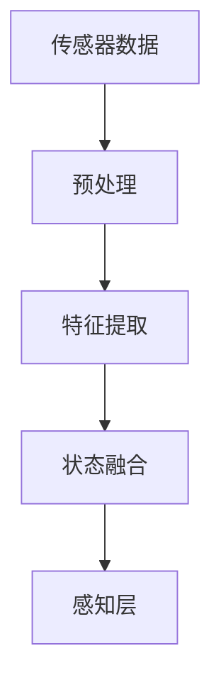
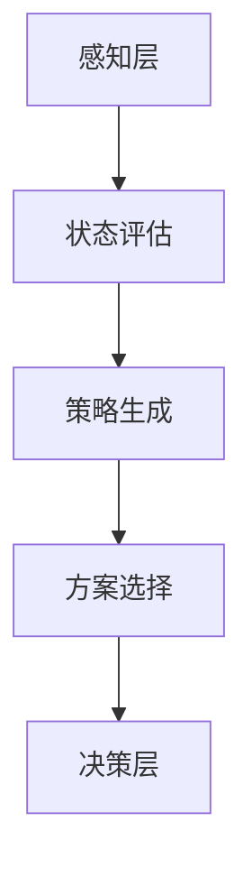
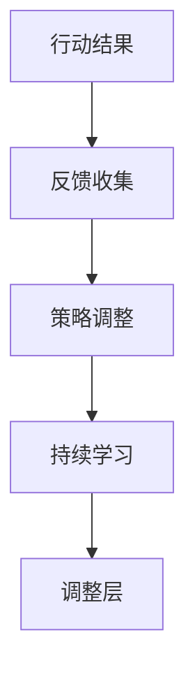

                 

### 引言

#### 1.1 AI Agent的定义与基本概念

AI Agent，即人工智能代理，是一种能够自主执行任务、与环境进行交互的智能系统。它通过感知环境信息、制定决策策略并执行相应行动，以实现特定目标。AI Agent的基本概念可以追溯到20世纪50年代，当时计算机科学家约翰·麦卡锡（John McCarthy）首次提出了“人工智能”这一术语。随着时间的推移，AI Agent逐渐成为人工智能领域的一个重要分支。

AI Agent可以按照不同的分类标准进行分类。根据其功能，可以分为感知型、决策型和行动型三种。感知型AI Agent主要处理环境信息，如计算机视觉系统；决策型AI Agent负责制定行动策略，如深度学习模型；行动型AI Agent则直接与环境互动，如自动驾驶汽车。此外，AI Agent还可以按照学习方式分为监督学习、无监督学习和强化学习三类。

#### 1.2 企业虚拟现实培训的背景与需求

虚拟现实（Virtual Reality，VR）技术通过创建一个模拟的三维环境，使用户能够沉浸其中并进行交互。近年来，随着VR技术的不断发展，其在企业培训中的应用逐渐受到关注。企业虚拟现实培训具有以下优势：

1. **沉浸式体验**：通过VR技术，员工可以在一个模拟的环境中亲身体验各种工作场景，从而提高学习效果。
2. **交互性**：VR技术支持用户与环境进行互动，有助于提高培训的参与度和互动性。
3. **安全性**：在虚拟环境中进行培训，可以避免实际操作中可能带来的风险和损失。

然而，传统的企业虚拟现实培训也存在一些挑战，如培训内容过于单一、缺乏个性化等。因此，引入AI Agent来优化虚拟现实培训成为了一种潜在解决方案。

#### 1.3 本书的目标与结构

本书旨在探讨AI Agent在企业虚拟现实培训中的应用，通过系统性地分析AI Agent的基本原理、虚拟现实培训的需求与挑战，以及AI Agent在实际应用中的具体实现，为相关领域的研究和实践提供参考。

本书结构如下：

- **第一部分**：引言与背景介绍，介绍AI Agent的定义与基本概念，企业虚拟现实培训的背景与需求，以及本书的目标与结构。
- **第二部分**：AI Agent基础，详细阐述AI Agent的基本原理、核心技术和架构设计。
- **第三部分**：虚拟现实培训应用，分析AI Agent在虚拟现实培训中的应用，包括个性化学习、互动性增强、情感智能等方面。
- **第四部分**：案例分析，通过具体案例研究AI Agent在虚拟现实培训中的应用效果和实现方法。
- **第五部分**：总结与展望，对本书内容进行总结，并对未来发展方向进行展望。

通过以上结构，本书将逐步引导读者深入理解AI Agent在企业虚拟现实培训中的应用，为相关领域的研究和实践提供有力支持。

### 第一部分：引言与背景介绍

#### 1.1 AI Agent的定义与基本概念

AI Agent，即人工智能代理，是一种能够自主执行任务、与环境进行交互的智能系统。它通过感知环境信息、制定决策策略并执行相应行动，以实现特定目标。AI Agent的基本概念可以追溯到20世纪50年代，当时计算机科学家约翰·麦卡锡（John McCarthy）首次提出了“人工智能”这一术语。随着时间的推移，AI Agent逐渐成为人工智能领域的一个重要分支。

AI Agent可以按照不同的分类标准进行分类。根据其功能，可以分为感知型、决策型和行动型三种。感知型AI Agent主要处理环境信息，如计算机视觉系统；决策型AI Agent负责制定行动策略，如深度学习模型；行动型AI Agent则直接与环境互动，如自动驾驶汽车。此外，AI Agent还可以按照学习方式分为监督学习、无监督学习和强化学习三类。

AI Agent的核心特点包括：

1. **自主性**：AI Agent能够自主地感知环境、制定决策和执行行动，不需要人工干预。
2. **适应性**：AI Agent能够根据环境变化调整其行为，以适应不同场景。
3. **交互性**：AI Agent能够与环境进行交互，获取反馈并优化自身行为。

AI Agent在各个领域都有广泛的应用，如自动驾驶、智能家居、机器人控制、金融风控等。随着技术的不断发展，AI Agent的应用前景将更加广阔。

#### 1.2 企业虚拟现实培训的背景与需求

虚拟现实（Virtual Reality，VR）技术通过创建一个模拟的三维环境，使用户能够沉浸其中并进行交互。近年来，随着VR技术的不断发展，其在企业培训中的应用逐渐受到关注。企业虚拟现实培训具有以下优势：

1. **沉浸式体验**：通过VR技术，员工可以在一个模拟的环境中亲身体验各种工作场景，从而提高学习效果。传统的课堂培训方式往往局限于理论知识的讲解，而VR培训可以提供更加直观和生动的学习体验，使员工能够更好地理解和掌握相关技能。

2. **交互性**：VR技术支持用户与环境进行互动，有助于提高培训的参与度和互动性。在VR培训环境中，员工可以与其他参与者进行互动，共同完成任务，从而培养团队合作精神。此外，VR培训还可以通过模拟实际操作场景，让员工在安全的环境中进行实践，减少培训过程中的风险。

3. **安全性**：在虚拟环境中进行培训，可以避免实际操作中可能带来的风险和损失。例如，在航空、航天、化工等行业，实际操作可能涉及高风险和高成本的场景，而通过VR培训可以降低这些风险和成本。

然而，传统的企业虚拟现实培训也存在一些挑战，如培训内容过于单一、缺乏个性化等。这些问题限制了虚拟现实培训的广泛应用和效果。因此，引入AI Agent来优化虚拟现实培训成为了一种潜在解决方案。

#### 1.3 本书的目标与结构

本书的目标是探讨AI Agent在企业虚拟现实培训中的应用，通过系统性地分析AI Agent的基本原理、虚拟现实培训的需求与挑战，以及AI Agent在实际应用中的具体实现，为相关领域的研究和实践提供参考。

为了实现这一目标，本书的结构如下：

- **第一部分**：引言与背景介绍，介绍AI Agent的定义与基本概念，企业虚拟现实培训的背景与需求，以及本书的目标与结构。
- **第二部分**：AI Agent基础，详细阐述AI Agent的基本原理、核心技术和架构设计。
- **第三部分**：虚拟现实培训应用，分析AI Agent在虚拟现实培训中的应用，包括个性化学习、互动性增强、情感智能等方面。
- **第四部分**：案例分析，通过具体案例研究AI Agent在虚拟现实培训中的应用效果和实现方法。
- **第五部分**：总结与展望，对本书内容进行总结，并对未来发展方向进行展望。

通过以上结构，本书将逐步引导读者深入理解AI Agent在企业虚拟现实培训中的应用，为相关领域的研究和实践提供有力支持。

#### 1.4 AI Agent与虚拟现实培训的关联

AI Agent与虚拟现实培训之间存在着紧密的关联，这种关联不仅体现在技术层面上，还体现在应用场景和效果提升方面。

首先，从技术层面来看，AI Agent与虚拟现实培训的结合具有天然的契合性。AI Agent的核心能力之一是环境感知和决策制定，而虚拟现实培训的一个重要特点就是提供高度仿真的模拟环境。在这种环境中，AI Agent可以实时感知用户的行为和状态，并根据这些信息生成个性化的学习内容和交互策略。例如，AI Agent可以通过计算机视觉技术捕捉用户的动作，从而调整虚拟培训场景中的光照、音效等参数，以增强沉浸感和学习体验。此外，AI Agent还可以利用自然语言处理技术，与用户进行自然对话，提供即时反馈和指导，从而提高培训的互动性和个性化。

其次，从应用场景来看，AI Agent在虚拟现实培训中具有广泛的应用潜力。例如，在安全培训领域，AI Agent可以模拟各种安全场景，引导员工进行应急响应演练，从而提高员工的安全意识和应急处理能力。在技能培训领域，AI Agent可以根据员工的个性化需求和进度，动态调整培训内容和难度，从而实现精准的教学。在产品营销培训中，AI Agent可以模拟客户行为，帮助销售人员理解客户需求，从而提高销售技巧。这些应用场景不仅提升了虚拟现实培训的效果，还拓展了其应用范围。

再次，从效果提升方面来看，AI Agent在虚拟现实培训中的应用能够显著提升培训的效果。首先，AI Agent能够提供个性化的学习体验，根据每个用户的特点和需求，定制化地提供学习内容和路径，从而提高学习效率和效果。其次，AI Agent的实时交互和反馈机制，可以及时纠正用户的错误，提供针对性的指导，减少学习过程中的挫折感和焦虑感。此外，AI Agent还可以通过数据分析和学习，发现培训中的问题和不足，为培训内容的优化提供科学依据。

总的来说，AI Agent与虚拟现实培训的结合，不仅提高了培训的技术含量和互动性，还为培训提供了更加个性化和智能化的解决方案。通过AI Agent的应用，虚拟现实培训将能够更好地满足企业的培训需求，提高员工的技能水平和业务能力，从而为企业的长期发展提供有力支持。

#### 1.5 AI Agent的基本功能

AI Agent在企业虚拟现实培训中能够实现多种功能，这些功能不仅提升了培训的互动性和个性化，还增强了培训的效果。以下是AI Agent在企业虚拟现实培训中的主要功能：

首先，**个性化学习**是AI Agent的重要功能之一。通过分析用户的学习历史、知识水平和兴趣爱好，AI Agent可以为每个用户定制个性化的学习内容和路径。例如，在技能培训中，AI Agent可以根据员工的实际操作能力，动态调整培训内容的难度和顺序，从而实现精准教学。在安全培训中，AI Agent可以基于员工的职责和工作场景，提供定制化的应急响应演练，确保每位员工都能掌握关键的安全知识和技能。

其次，**互动性增强**是AI Agent的另一大功能。在虚拟现实培训中，AI Agent可以通过自然语言处理和计算机视觉技术，与用户进行实时对话和互动。例如，AI Agent可以在培训过程中提出问题，引导用户进行思考和实践，从而提高培训的参与度和积极性。在产品营销培训中，AI Agent可以模拟客户行为，与销售人员进行角色扮演，帮助销售人员更好地理解客户需求，从而提高销售技巧。

第三，**情感智能**是AI Agent在虚拟现实培训中的一项创新功能。AI Agent可以通过情感识别技术，感知用户在培训过程中的情绪变化，并提供相应的情感支持。例如，当用户感到困惑或焦虑时，AI Agent可以提供鼓励和建议，帮助用户保持积极的心态。此外，AI Agent还可以根据用户的情感反应，调整培训内容和互动方式，以更好地满足用户的需求。

第四，**评估与反馈**是AI Agent的一项关键功能。AI Agent可以实时监控用户的培训表现，记录用户的学习进度和成绩，并提供详细的评估报告。通过分析这些数据，AI Agent可以为用户制定个性化的学习计划，帮助用户发现学习中的问题，并提供针对性的指导。例如，在技能培训中，AI Agent可以分析用户的操作记录，识别出操作中的错误和不足，并提供改进建议。

最后，**数据收集与分析**是AI Agent的一项重要功能。AI Agent可以在虚拟现实培训过程中，收集大量的用户数据，包括学习行为、操作记录、情感反应等。通过分析这些数据，AI Agent可以为培训效果的评估提供科学依据，为培训内容的优化提供支持。例如，在安全培训中，AI Agent可以分析员工的应急响应记录，发现培训中的薄弱环节，并提出改进措施。

总之，AI Agent的基本功能为虚拟现实培训提供了强大的技术支持，使其能够更好地满足企业的培训需求，提高员工的学习效果和技能水平。通过AI Agent的应用，虚拟现实培训将变得更加个性化和智能化，为企业的长期发展提供有力支持。

#### 1.6 虚拟现实培训的核心要素

虚拟现实培训的核心要素包括以下几个方面：

首先，**虚拟现实技术**是虚拟现实培训的基础。虚拟现实技术通过计算机图形学、传感技术、人机交互技术等手段，创建一个高度仿真的三维虚拟环境，使用户能够沉浸其中并进行交互。虚拟现实技术的主要特点包括沉浸感、交互性和实时性，这些特点使得虚拟现实培训能够在一种接近实际操作的环境中进行，从而提高学习效果。

其次，**培训内容**是虚拟现实培训的核心。虚拟现实培训内容应该包括实际操作技能、安全知识、应急响应等多个方面，以满足企业培训的需求。为了提高培训内容的实用性和针对性，培训内容需要根据不同行业和岗位的特点进行定制，确保培训内容与实际工作紧密结合。

第三，**培训环境**的设计是虚拟现实培训的关键。一个良好的虚拟现实培训环境应该具备以下特点：高度仿真性，能够模拟实际工作场景；互动性，支持用户与环境进行实时交互；安全性，确保培训过程中的安全和可靠性。培训环境的设计需要综合考虑硬件设备、软件平台和培训内容等因素，以提供最佳的学习体验。

第四，**用户交互**是虚拟现实培训的核心要素之一。用户交互包括用户与虚拟环境的交互、用户与AI Agent的交互等多个方面。一个良好的用户交互体验能够提高培训的参与度和积极性。虚拟现实培训中，用户可以通过语音、手势、动作等方式与虚拟环境进行交互，从而增强学习的趣味性和实用性。

最后，**评估与反馈**机制是虚拟现实培训的重要组成部分。通过实时监控用户的学习行为和表现，虚拟现实培训系统能够为用户提供个性化的学习反馈和指导，帮助用户发现和纠正学习中的问题。此外，评估与反馈机制还可以为培训效果的评估和培训内容的优化提供科学依据。

总之，虚拟现实培训的核心要素包括虚拟现实技术、培训内容、培训环境、用户交互和评估与反馈机制。这些要素相互关联，共同构成了一个完整的虚拟现实培训体系，为企业的培训需求提供全面、高效的解决方案。

#### 1.7 本书涉及的技术领域与知识点

本书涵盖了多个技术领域和知识点，以系统地探讨AI Agent在企业虚拟现实培训中的应用。首先，虚拟现实技术是本书的核心内容之一，涉及计算机图形学、传感技术、人机交互技术等多个方面。通过这些技术，虚拟现实系统能够创建高度仿真的三维环境，为培训提供沉浸式体验。

其次，人工智能技术贯穿全书，包括机器学习算法、自然语言处理、计算机视觉等。这些技术是AI Agent实现自主感知、决策和行动的基础，本书将详细讨论这些技术的原理和应用。

另外，本书还涉及到AI Agent的架构设计，包括状态感知、行动决策和反馈调整等方面。通过分析AI Agent的架构设计，读者可以更好地理解AI Agent的工作机制。

此外，虚拟现实培训项目的实际应用也是本书的重要内容。通过具体的案例分析，读者可以了解到如何将AI Agent应用于企业虚拟现实培训中，解决实际培训中的问题。

最后，本书还探讨了AI Agent在虚拟现实培训中的实现技术，包括虚拟现实技术、人工智能技术和整合技术等。通过这些技术，AI Agent能够提供个性化、互动性和情感智能的学习体验，为培训效果提升提供有力支持。

总之，本书涉及的技术领域和知识点包括虚拟现实技术、人工智能技术、AI Agent架构设计、虚拟现实培训项目实际应用和实现技术等，为读者提供了一个全面、深入的探讨平台。

#### 1.8 本书结构概述

为了帮助读者更好地理解AI Agent在企业虚拟现实培训中的应用，本书结构分为五个主要部分，各部分相互关联，共同构成了一个完整的学习路径。

**第一部分：引言与背景介绍**  
本部分介绍了AI Agent的定义与基本概念，企业虚拟现实培训的背景与需求，以及本书的目标与结构。通过这一部分的阅读，读者可以初步了解AI Agent和虚拟现实培训的基本概念，为后续内容的学习打下基础。

**第二部分：AI Agent基础**  
本部分详细阐述了AI Agent的基本原理、核心技术和架构设计。读者将学习到AI Agent的分类、感知机制、决策模型以及各种机器学习算法。这一部分内容为后续AI Agent在虚拟现实培训中的应用提供了理论基础。

**第三部分：虚拟现实培训应用**  
本部分分析了AI Agent在虚拟现实培训中的具体应用，包括个性化学习、互动性增强、情感智能等方面。通过案例研究，读者可以了解到AI Agent在实际培训中的应用效果和实现方法。

**第四部分：案例分析**  
本部分通过具体案例，深入研究AI Agent在虚拟现实培训中的应用效果。每个案例都涵盖了项目背景、目标、实施过程和效果评估等方面，为读者提供了实际操作的参考。

**第五部分：总结与展望**  
本部分对全书内容进行总结，并展望未来AI Agent在虚拟现实培训中的应用前景。通过这一部分的阅读，读者可以回顾本书的主要观点，并对未来的发展方向有更清晰的认识。

通过以上五个部分的内容，本书逐步引导读者深入理解AI Agent在企业虚拟现实培训中的应用，为相关领域的研究和实践提供参考。

### 第一部分：引言与背景介绍

#### 1.9 小结

本文作为引言与背景介绍部分，首先定义了AI Agent，并阐述了其基本概念和分类。接着，介绍了企业虚拟现实培训的背景和需求，讨论了虚拟现实培训的优势和面临的挑战。随后，明确了本书的目标和结构，包括AI Agent的基本原理、虚拟现实培训的应用、案例分析以及总结与展望。此外，还探讨了AI Agent与虚拟现实培训的关联，以及AI Agent在企业虚拟现实培训中的基本功能。通过本文的介绍，读者可以对AI Agent和虚拟现实培训有一个全面的初步了解，为后续内容的深入学习打下基础。

### 第二部分：AI Agent基础

#### 2.1 AI Agent的基本原理

AI Agent的基本原理是构建在人工智能（Artificial Intelligence，AI）技术基础之上的，旨在实现智能代理系统的自主性、适应性和交互性。AI Agent通过感知环境信息、制定决策策略并执行行动，以实现预定的目标。其基本原理可以概括为感知、决策和行动三个主要环节。

首先，感知是AI Agent获取环境信息的过程。通过传感器、摄像头、麦克风等设备，AI Agent可以实时获取外部环境的数据。这些数据包括视觉、听觉、触觉等多种形式，为AI Agent提供决策的基础。感知能力是实现AI Agent自主性的关键，因为只有准确地感知环境，AI Agent才能做出正确的决策。

其次，决策是AI Agent根据感知到的环境信息，利用智能算法和策略进行决策的过程。决策环节涉及多种人工智能技术，如机器学习、深度学习、自然语言处理等。通过这些技术，AI Agent能够从大量数据中提取有用信息，识别模式和规律，从而生成合理的行动策略。决策能力是实现AI Agent智能化的核心，它决定了AI Agent能否高效地完成任务。

最后，行动是AI Agent根据决策结果执行具体任务的过程。行动环节包括物理操作和虚拟操作等多种形式。例如，在自动驾驶汽车中，AI Agent需要根据感知到的路况和决策策略，控制车辆的加速度、转向和制动等。在虚拟环境中，AI Agent可以通过虚拟现实技术，实现与虚拟世界的互动和操作。行动能力是实现AI Agent实用性的关键，因为它决定了AI Agent能否有效地解决问题和完成任务。

AI Agent的三个主要环节——感知、决策和行动，相互作用、协同工作，共同实现其目标。感知环节为决策提供数据支持，决策环节为行动提供策略指导，行动环节将决策转化为实际操作。通过这种闭环反馈机制，AI Agent能够不断调整其行为，以适应环境变化，实现持续优化。

此外，AI Agent的基本原理还涉及到自主性、适应性和交互性等方面。自主性指的是AI Agent能够独立地执行任务，不需要人工干预。这需要AI Agent具备高度智能的决策能力和自适应能力。适应性指的是AI Agent能够根据不同环境和任务需求，调整其感知、决策和行动策略。这需要AI Agent具备灵活的学习和调整能力。交互性指的是AI Agent能够与用户和其他系统进行有效交互，提供个性化服务和支持。这需要AI Agent具备良好的用户界面和通信能力。

总之，AI Agent的基本原理是通过感知、决策和行动三个环节，实现自主性、适应性和交互性，从而在复杂环境中高效地执行任务。这一基本原理为AI Agent在不同领域中的应用提供了理论基础和实践指导。

#### 2.2 AI Agent的核心技术

AI Agent的广泛应用离不开其背后强大的核心技术支持，这些技术包括机器学习算法、自然语言处理、计算机视觉等。以下是这些核心技术的基本概念、工作原理及应用场景的详细探讨。

##### 2.2.1 机器学习算法

机器学习（Machine Learning，ML）是AI Agent的核心技术之一，它使计算机系统能够从数据中学习并做出预测或决策。机器学习算法可以分为监督学习、无监督学习和强化学习三类。

**监督学习**：监督学习是一种通过标注数据来训练模型的方法。在监督学习中，输入数据（特征）和相应的输出数据（标签）是已知的，模型通过学习这些数据之间的关系，预测新的输入数据的标签。常见的监督学习算法包括线性回归、逻辑回归、支持向量机（SVM）和神经网络等。例如，在虚拟现实培训中，监督学习可以用于个性化学习路径的推荐，根据员工的历史学习数据和培训效果，生成个性化的学习计划。

**无监督学习**：无监督学习是在没有标注数据的情况下，通过数据自身的特征来训练模型。无监督学习的目的是发现数据中的潜在结构和规律。常见的无监督学习算法包括聚类分析、主成分分析（PCA）和自编码器等。在虚拟现实培训中，无监督学习可以用于分析员工的行为模式和学习轨迹，从而发现学习中的潜在问题，为培训内容的优化提供依据。

**强化学习**：强化学习是一种通过与环境交互来学习最优策略的机器学习方法。强化学习中的模型称为智能体（Agent），它通过接收环境反馈（奖励或惩罚），不断调整其行为策略，以实现最大化长期回报。常见的强化学习算法包括Q-learning、深度Q网络（DQN）和策略梯度（PG）等。在虚拟现实培训中，强化学习可以用于模拟员工的应急响应训练，通过反馈机制，使智能体不断优化其应对策略。

##### 2.2.2 自然语言处理

自然语言处理（Natural Language Processing，NLP）是AI Agent理解和生成人类语言的技术，它在虚拟现实培训中的应用非常重要。NLP技术主要包括文本分类、情感分析、机器翻译、对话系统等。

**文本分类**：文本分类是将文本数据按照特定的标签进行归类的过程。常见的文本分类算法包括朴素贝叶斯、支持向量机、随机森林和深度学习模型等。在虚拟现实培训中，文本分类可以用于自动标记学习内容，将相关文档分类到相应的培训模块中。

**情感分析**：情感分析是判断文本表达的情感倾向，如正面、负面或中性。常见的情感分析算法包括基于规则的方法、机器学习方法（如文本分类和情感分析模型）等。在虚拟现实培训中，情感分析可以用于监测员工的情绪状态，为培训提供情感支持。

**机器翻译**：机器翻译是自动将一种语言的文本翻译成另一种语言的技术。常见的机器翻译方法包括基于规则的翻译、统计机器翻译和神经机器翻译等。在虚拟现实培训中，机器翻译可以用于支持多语言学习环境，使不同语言背景的员工能够参与培训。

**对话系统**：对话系统是模拟人类对话过程的计算机程序，常见的对话系统包括聊天机器人、语音助手等。在虚拟现实培训中，对话系统可以用于提供实时解答、引导学习和进行互动。

##### 2.2.3 计算机视觉

计算机视觉（Computer Vision，CV）是使计算机能够处理和理解视觉信息的技术，它在虚拟现实培训中的应用也非常广泛。计算机视觉技术主要包括图像识别、目标检测、面部识别和图像生成等。

**图像识别**：图像识别是将图像或视频中的物体识别出来，并分类到预定义的类别中。常见的图像识别算法包括卷积神经网络（CNN）、生成对抗网络（GAN）等。在虚拟现实培训中，图像识别可以用于自动标记培训场景中的关键对象，如设备、工具和安全标志等。

**目标检测**：目标检测是在图像或视频中识别并定位多个对象的位置。常见的目标检测算法包括R-CNN、YOLO、SSD等。在虚拟现实培训中，目标检测可以用于监控员工的操作行为，识别潜在的安全风险。

**面部识别**：面部识别是通过分析面部特征，识别和验证个体身份的技术。常见的面部识别算法包括基于特征的方法、深度学习模型等。在虚拟现实培训中，面部识别可以用于员工身份验证，确保只有授权人员能够访问特定培训内容。

**图像生成**：图像生成是通过学习图像数据，生成新的图像内容的技术。常见的图像生成算法包括GAN、变分自编码器（VAE）等。在虚拟现实培训中，图像生成可以用于创建高度仿真的培训场景，提高培训的真实感和沉浸感。

综上所述，机器学习算法、自然语言处理和计算机视觉是AI Agent的核心技术，它们在虚拟现实培训中发挥着重要作用。通过这些技术的应用，AI Agent能够实现高度智能化的感知、决策和行动，为员工提供个性化和互动性强的培训体验。

#### 2.3 AI Agent的核心技术

AI Agent的广泛应用离不开其背后强大的核心技术支持，这些技术不仅决定了AI Agent的智能水平，也决定了其在实际应用中的效果和效率。以下是AI Agent的核心技术，包括机器学习算法、自然语言处理（NLP）和计算机视觉（CV），及其在虚拟现实培训中的应用。

##### 2.3.1 机器学习算法

机器学习（Machine Learning，ML）是AI Agent的核心技术之一，它使计算机系统能够从数据中学习并做出预测或决策。机器学习算法可以分为监督学习、无监督学习和强化学习三类，每种算法都有其特定的应用场景。

**监督学习**：监督学习算法通过已标记的数据来训练模型，从而实现预测或分类。常见的监督学习算法包括线性回归、逻辑回归、支持向量机（SVM）和神经网络等。在虚拟现实培训中，监督学习算法可以用于个性化学习路径的推荐。例如，通过分析员工的学习历史和成绩，模型可以预测哪些内容最适合该员工，并生成个性化的学习计划。

**无监督学习**：无监督学习算法不需要标记数据，其主要目的是发现数据中的潜在结构和规律。常见的无监督学习算法包括聚类分析、主成分分析（PCA）和自编码器等。在虚拟现实培训中，无监督学习算法可以用于分析员工的行为模式和学习轨迹。例如，通过聚类分析，可以识别出学习小组中的典型行为模式，从而为培训内容的调整提供依据。

**强化学习**：强化学习算法通过与环境交互来学习最优策略。在虚拟现实培训中，强化学习算法可以用于模拟员工的应急响应训练。例如，通过奖励机制，智能体可以学习在紧急情况下做出最佳决策，从而提高员工的应急处理能力。

##### 2.3.2 自然语言处理

自然语言处理（Natural Language Processing，NLP）是AI Agent理解和生成人类语言的技术，它在虚拟现实培训中发挥着重要作用。NLP技术主要包括文本分类、情感分析、机器翻译和对话系统等。

**文本分类**：文本分类是将文本按照特定的标签进行归类。在虚拟现实培训中，文本分类可以用于自动标记学习内容。例如，通过文本分类算法，可以自动将培训文档分类到相应的模块中，从而提高培训内容的组织和管理效率。

**情感分析**：情感分析是判断文本表达的情感倾向。在虚拟现实培训中，情感分析可以用于监测员工的情绪状态。例如，通过情感分析，系统可以识别出员工在学习过程中表现出的焦虑或困惑情绪，并提供相应的帮助和支持。

**机器翻译**：机器翻译是将一种语言的文本翻译成另一种语言。在虚拟现实培训中，机器翻译可以用于支持多语言学习环境。例如，不同语言背景的员工可以使用母语进行学习，从而提高学习效果。

**对话系统**：对话系统是模拟人类对话过程的计算机程序。在虚拟现实培训中，对话系统可以提供实时解答和互动。例如，员工可以通过对话系统提出问题，系统可以实时回答，从而提供个性化的学习支持。

##### 2.3.3 计算机视觉

计算机视觉（Computer Vision，CV）是使计算机能够处理和理解视觉信息的技术，它在虚拟现实培训中有着广泛的应用。计算机视觉技术主要包括图像识别、目标检测、面部识别和图像生成等。

**图像识别**：图像识别是将图像或视频中的物体识别出来，并分类到预定义的类别中。在虚拟现实培训中，图像识别可以用于自动标记培训场景中的关键对象。例如，通过图像识别，系统可以识别出培训场景中的设备、工具和安全标志等，从而为培训内容的调整提供依据。

**目标检测**：目标检测是在图像或视频中识别并定位多个对象的位置。在虚拟现实培训中，目标检测可以用于监控员工的操作行为。例如，通过目标检测，系统可以识别出员工在培训过程中可能出现的错误操作，并提供即时反馈和纠正。

**面部识别**：面部识别是通过分析面部特征，识别和验证个体身份。在虚拟现实培训中，面部识别可以用于员工身份验证。例如，通过面部识别，系统可以确保只有授权人员能够访问特定培训内容，从而提高培训的安全性。

**图像生成**：图像生成是通过学习图像数据，生成新的图像内容。在虚拟现实培训中，图像生成可以用于创建高度仿真的培训场景。例如，通过图像生成，系统可以生成各种复杂的培训场景，从而提高培训的真实感和沉浸感。

综上所述，机器学习算法、自然语言处理和计算机视觉是AI Agent的核心技术，它们在虚拟现实培训中发挥着重要作用。通过这些技术的应用，AI Agent能够实现高度智能化的感知、决策和行动，为员工提供个性化和互动性强的培训体验。

#### 2.4 AI Agent的架构设计

AI Agent的架构设计是确保其功能实现和性能优化的重要环节。一个完善的AI Agent架构应涵盖感知、决策和行动三个关键环节，以及相应的数据处理和分析机制。以下是AI Agent架构设计的详细探讨。

##### 2.4.1 状态感知

状态感知是AI Agent获取环境信息、理解当前状态的过程。状态感知环节的核心是传感器和数据处理模块。传感器包括摄像头、麦克风、温度传感器、GPS等，它们负责采集外部环境的数据。数据处理模块则对这些数据进行预处理、特征提取和融合，以便为后续的决策环节提供可靠的数据基础。

**示例：**

在这个示例中，传感器数据经过预处理和特征提取后，被融合为统一的状态向量，输入到感知层进行状态感知。

##### 2.4.2 行动决策

行动决策是AI Agent根据感知到的状态，利用智能算法和策略生成行动方案的过程。决策模块通常包括以下几个步骤：

1. **状态评估**：将感知到的状态向量输入到评估模型，评估当前状态的优劣。
2. **策略生成**：根据状态评估结果，利用策略生成模型生成可能的行动方案。
3. **方案选择**：通过优化算法（如Q-learning、策略梯度等）选择最优的行动方案。

**示例：**

在这个示例中，感知层提供状态信息，经过状态评估和策略生成后，最终由决策层选择最优行动方案。

##### 2.4.3 反馈调整

反馈调整是AI Agent根据行动结果和环境反馈，调整自身行为策略的过程。这一环节的关键在于建立反馈机制和调整策略。

1. **行为反馈**：收集行动结果，包括成功和失败的情况，以及环境的变化。
2. **策略调整**：利用反馈信息，调整策略模型，优化行为表现。
3. **持续学习**：通过不断的学习和调整，使AI Agent在复杂环境中表现出更强的适应性和智能性。

**示例：**

在这个示例中，行动结果被用于反馈收集和策略调整，从而实现持续的反馈调整和学习。

##### 2.4.4 架构设计原则

在AI Agent的架构设计中，应遵循以下原则：

1. **模块化**：将感知、决策和行动等关键功能模块化，便于维护和扩展。
2. **可扩展性**：设计灵活的架构，以适应不同应用场景和需求变化。
3. **可适应性**：使AI Agent具备适应环境变化的能力，提高其鲁棒性。
4. **高效性**：优化算法和数据处理流程，提高AI Agent的响应速度和处理效率。

通过上述架构设计，AI Agent能够在复杂环境中实现高效的感知、决策和行动，为虚拟现实培训提供智能化的解决方案。

#### 2.5 小结

第二部分详细介绍了AI Agent的基本原理及其核心技术，包括机器学习算法、自然语言处理和计算机视觉。这些核心技术为AI Agent提供了强大的感知、决策和行动能力，使其能够在虚拟现实培训中发挥重要作用。此外，还探讨了AI Agent的架构设计，包括状态感知、行动决策和反馈调整等关键环节。通过这些内容的学习，读者可以更深入地理解AI Agent的工作原理和实现方法，为后续虚拟现实培训应用的学习打下坚实基础。

