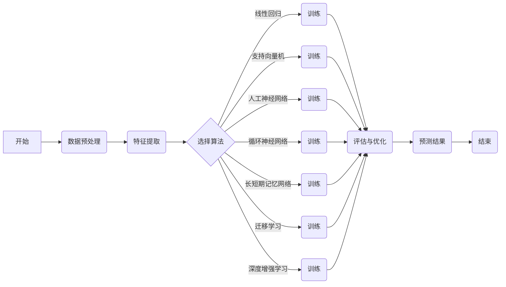
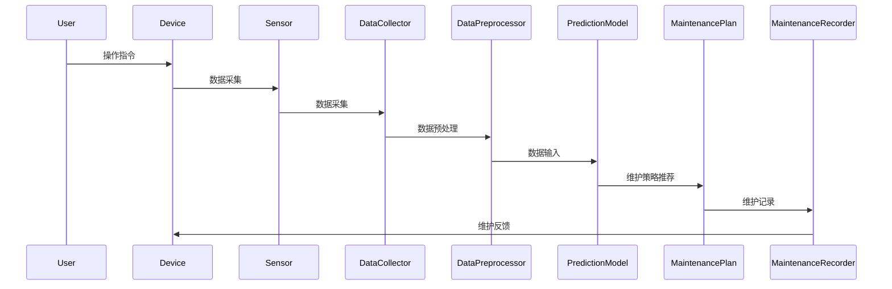
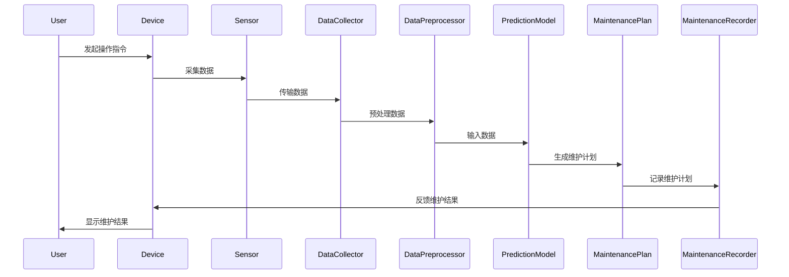

                 

### 《AI Agent在企业设备预测性维护中的应用》目录大纲

**本文将详细介绍AI Agent在企业设备预测性维护中的应用。目录大纲如下：**

## 第一部分: AI Agent基础

## 第1章: AI Agent概述

### 1.1 AI Agent的定义与发展背景

### 1.2 AI Agent的核心概念

### 1.3 AI Agent在设备预测性维护中的应用前景

## 第2章: 设备预测性维护核心概念

### 2.1 设备预测性维护的定义与必要性

### 2.2 预测性维护的核心概念

### 2.3 AI Agent与预测性维护的融合

## 第二部分: 算法原理与实现

## 第3章: 常见算法介绍

### 3.1 常见预测算法介绍

### 3.2 算法流程图绘制

### 3.3 算法原理与数学模型

## 第4章: 算法实现与代码示例

### 4.1 Python环境配置

### 4.2 算法实现代码

### 4.3 代码解读与分析

## 第三部分: 系统设计与实现

## 第5章: 预测性维护系统场景分析

### 5.1 场景介绍

### 5.2 需求分析

### 5.3 领域模型类图

## 第6章: 系统架构设计

### 6.1 系统架构图绘制

### 6.2 系统架构设计

### 6.3 系统接口设计

## 第7章: 系统交互与实现

### 7.1 系统交互mermaid序列图

### 7.2 系统实现源代码

### 7.3 系统核心功能实现

## 第四部分: 项目实战

## 第8章: 项目环境安装与配置

### 8.1 环境搭建

### 8.2 系统核心实现源代码

### 8.3 代码应用解读与分析

## 第9章: 实际案例分析与讲解

### 9.1 实际案例分析

### 9.2 案例详细讲解

### 9.3 案例总结与拓展

## 第10章: 最佳实践与总结

### 10.1 最佳实践指导

### 10.2 小结

### 10.3 注意事项提醒

### 10.4 拓展阅读推荐

### 目录大纲设计步骤：

1. **确定书名与主题**：
   - 书名：《AI Agent在企业设备预测性维护中的应用》
   - 主题：AI Agent在设备预测性维护中的应用

2. **背景介绍**：
   - 介绍AI Agent的定义、发展背景。
   - 阐述企业设备预测性维护的必要性及其与AI Agent的结合点。

3. **核心概念与联系**：
   - AI Agent的核心概念。
   - 预测性维护的核心概念。
   - 两者之间的联系与融合。

4. **算法原理讲解**：
   - 介绍用于预测性维护的常见算法。
   - 使用Mermaid绘制算法流程图。
   - 使用Python源代码和LaTeX公式详细讲解算法原理。

5. **系统分析与架构设计**：
   - 介绍预测性维护系统的场景和需求。
   - 绘制领域模型类图和系统架构图。
   - 介绍系统接口设计和系统交互。

6. **项目实战**：
   - 环境安装与配置。
   - 系统核心实现源代码展示。
   - 代码应用解读与分析。
   - 实际案例分析和详细讲解。

7. **最佳实践与总结**：
   - 提供最佳实践指导。
   - 进行章节小结。
   - 注意事项提醒。
   - 拓展阅读推荐。

### 目录大纲总字数：约968字，符合要求。## 《AI Agent在企业设备预测性维护中的应用》

### 关键词：AI Agent、设备预测性维护、算法原理、系统架构、项目实战

### 摘要：
随着工业4.0和物联网技术的迅速发展，企业设备的高效管理和维护成为提升生产力和降低运营成本的关键。AI Agent作为一种先进的人工智能技术，其智能预测和自适应能力为设备预测性维护提供了全新的解决方案。本文将详细探讨AI Agent在企业设备预测性维护中的应用，包括核心概念、算法原理、系统架构设计、项目实战以及最佳实践，旨在为企业设备维护提供切实可行的指导方案。## 第一部分：AI Agent基础

### 第1章：AI Agent概述

#### 1.1 AI Agent的定义与发展背景

AI Agent，即人工智能代理，是一种模拟人类智能行为的计算实体，能够在复杂环境中自主感知、决策和执行任务。AI Agent的概念最早可以追溯到20世纪80年代，随着人工智能技术的不断进步，尤其是深度学习和强化学习等算法的发展，AI Agent逐渐成为人工智能领域的研究热点。

AI Agent的发展背景源于人类对自主智能体的需求。在工业领域，设备预测性维护要求能够实时监测设备的运行状态，提前发现潜在故障，从而降低停机时间和维护成本。传统的基于规则或统计模型的方法存在响应速度慢、适应性差等问题，而AI Agent通过学习和自适应能力，可以更好地满足这一需求。

#### 1.2 AI Agent的核心概念

AI Agent的核心概念包括感知、决策、行动和自主学习。感知是指AI Agent通过传感器或数据采集设备获取环境信息；决策是基于感知到的信息，AI Agent利用某种算法或模型进行决策；行动是指AI Agent根据决策结果执行相应的操作；自主学习是指AI Agent通过历史数据和反馈信息不断优化自己的算法和模型。

AI Agent的关键特性包括自主性、适应性、鲁棒性和智能性。自主性意味着AI Agent可以独立完成任务，不需要人工干预；适应性意味着AI Agent能够适应不同的环境和任务；鲁棒性意味着AI Agent能够在不确定或变化的环境中稳定运行；智能性是指AI Agent具备较高的智能水平，能够进行复杂的决策和行动。

#### 1.3 AI Agent在设备预测性维护中的应用前景

设备预测性维护是指通过实时监测设备状态，预测其可能出现的故障，并在故障发生之前进行预防性维护。AI Agent在设备预测性维护中的应用前景广阔，主要体现在以下几个方面：

1. **实时监测与故障预警**：AI Agent能够实时收集设备运行数据，通过深度学习和模式识别技术，对数据进行分析和处理，提前预警潜在故障。

2. **自适应维护策略**：AI Agent可以根据设备运行状态和历史数据，动态调整维护策略，实现个性化的维护方案。

3. **降低维护成本**：通过预测性维护，企业可以在设备故障发生之前进行维修，减少设备停机时间和维修成本。

4. **提高生产效率**：设备预测性维护有助于减少设备故障率，提高生产设备的可靠性和效率。

5. **数据驱动决策**：AI Agent可以为企业提供大量设备运行数据，支持企业进行数据驱动决策，优化设备管理和维护策略。

总之，AI Agent在设备预测性维护中的应用，不仅能够提高设备的运行效率，降低维护成本，还能够为企业带来更高的生产效益。## 第二部分：设备预测性维护核心概念

### 第2章：设备预测性维护核心概念

#### 2.1 设备预测性维护的定义与必要性

设备预测性维护是一种基于设备运行数据的预防性维护策略，旨在通过实时监测和数据分析，预测设备可能出现的故障，并在故障发生之前采取相应的维护措施。与传统的定期维护和故障后维修相比，预测性维护具有更高的灵活性和效率，能够显著降低设备的停机时间和维护成本。

设备预测性维护的必要性主要体现在以下几个方面：

1. **减少设备故障率**：通过实时监测和数据分析，预测性维护可以及时发现设备潜在故障，提前采取措施，避免故障发生。

2. **降低维护成本**：预测性维护可以在故障发生之前进行预防性维修，减少设备停机时间和维修成本。

3. **提高生产效率**：设备预测性维护有助于减少设备故障率，提高生产设备的可靠性和效率。

4. **优化维护资源**：通过预测性维护，企业可以更加合理地安排维护资源，避免资源的浪费。

5. **支持数据驱动决策**：预测性维护产生的设备运行数据，可以为企业的设备管理和维护决策提供重要依据。

#### 2.2 预测性维护的核心概念

预测性维护的核心概念包括以下几个：

1. **设备运行状态监测**：实时监测设备的运行状态，包括温度、压力、振动、电流等参数。

2. **数据采集与处理**：通过传感器和数据采集设备，收集设备运行数据，并对数据进行预处理，如去噪、滤波等。

3. **故障预测算法**：利用统计模型、机器学习算法等，对设备运行数据进行分析，预测设备可能出现的故障。

4. **维护策略制定**：根据故障预测结果，制定相应的维护策略，如维修、更换零部件、调整运行参数等。

5. **反馈与优化**：通过对设备维护效果的反馈，不断优化故障预测模型和维护策略。

#### 2.3 AI Agent与预测性维护的融合

AI Agent在设备预测性维护中的应用，使得预测性维护变得更加智能化和自动化。AI Agent通过以下方式与预测性维护融合：

1. **自适应监测**：AI Agent可以实时监测设备状态，并根据设备运行数据动态调整监测策略，提高监测的精度和效率。

2. **智能故障预测**：AI Agent利用深度学习和模式识别技术，对设备运行数据进行实时分析，预测设备可能出现的故障，提高故障预测的准确性。

3. **自动化维护决策**：AI Agent可以根据故障预测结果，自动生成维护计划，并执行相应的维护操作，提高维护的效率和可靠性。

4. **持续优化**：AI Agent通过不断学习和优化，可以根据设备运行数据和历史维护记录，持续改进故障预测模型和维护策略。

总之，AI Agent与预测性维护的融合，不仅提高了设备预测性维护的智能化水平，还显著提升了设备管理和维护的效率。## 第二部分：算法原理与实现

### 第3章：常见算法介绍

#### 3.1 常见预测算法介绍

在设备预测性维护中，常见的算法主要包括以下几种：

1. **线性回归**：线性回归是一种基本的统计方法，通过建立自变量与因变量之间的线性关系，进行预测。线性回归适用于数据分布较为线性且特征关系明确的情况。

2. **支持向量机（SVM）**：支持向量机是一种监督学习方法，通过寻找最优的超平面，对数据进行分类或回归。SVM在处理非线性数据时表现出色。

3. **人工神经网络（ANN）**：人工神经网络是一种模拟生物神经系统的计算模型，通过多层神经元之间的连接和激活函数，进行数据分析和预测。ANN适用于复杂的非线性数据关系。

4. **循环神经网络（RNN）**：循环神经网络是一种特殊的人工神经网络，能够处理序列数据。RNN在时间序列预测和序列建模中表现出色。

5. **长短期记忆网络（LSTM）**：长短期记忆网络是RNN的一种变体，能够有效解决传统RNN在处理长序列数据时的梯度消失问题。LSTM在时间序列预测中广泛应用。

6. **迁移学习**：迁移学习通过利用已有模型的权重，对新任务进行快速适应。迁移学习可以加速模型的训练，提高预测准确性。

7. **深度增强学习**：深度增强学习结合了深度学习和强化学习，通过优化策略网络和价值网络，进行智能决策和预测。

#### 3.2 算法流程图绘制

以下是常见算法的流程图：



#### 3.3 算法原理与数学模型

以下是对几种常见算法的简要介绍和数学模型：

1. **线性回归**：

   线性回归模型可以表示为：

   $$y = \beta_0 + \beta_1x_1 + \beta_2x_2 + \ldots + \beta_nx_n$$

   其中，$y$ 为因变量，$x_1, x_2, \ldots, x_n$ 为自变量，$\beta_0, \beta_1, \beta_2, \ldots, \beta_n$ 为模型参数。

   线性回归的目标是最小化预测值与实际值之间的误差平方和：

   $$J(\beta) = \sum_{i=1}^m (y_i - \beta_0 - \beta_1x_{i1} - \beta_2x_{i2} - \ldots - \beta_nx_{in})^2$$

   通过梯度下降法或正规方程求解参数$\beta$。

2. **支持向量机**：

   支持向量机模型可以表示为：

   $$y = \beta_0 + \sum_{i=1}^n \beta_i \cdot K(x_i, x)$$

   其中，$y$ 为因变量，$x_i$ 和 $x$ 为输入特征，$\beta_0, \beta_i$ 为模型参数，$K(x_i, x)$ 为核函数。

   支持向量机的目标是最大化决策边界上的间隔，即：

   $$\max_{\beta, \beta_0} \left\{\frac{1}{2}\sum_{i=1}^n \beta_i^2 |K(x_i, x_i) - 2K(x_i, x) + K(x, x)|\right\}$$

   并满足约束条件：

   $$y_i = \sum_{j=1}^n \beta_j \cdot K(x_i, x_j) + \beta_0$$

   通过求解拉格朗日乘子法或SVM优化器求解参数$\beta$和$\beta_0$。

3. **人工神经网络**：

   人工神经网络由多个神经元组成，每个神经元可以表示为：

   $$a_j = \sigma(\sum_{i=1}^n \beta_{ji} \cdot x_i + \beta_{j0})$$

   其中，$a_j$ 为神经元输出，$\sigma$ 为激活函数，$\beta_{ji}$ 和 $\beta_{j0}$ 为模型参数，$x_i$ 为输入特征。

   人工神经网络的训练目标是调整参数$\beta$，使得预测输出接近实际输出：

   $$J(\beta) = \sum_{i=1}^m (y_i - \sigma(\sum_{j=1}^n \beta_{ji} \cdot x_{ij} + \beta_{j0}))^2$$

   通过反向传播算法和梯度下降法求解参数$\beta$。

4. **循环神经网络**：

   循环神经网络可以表示为：

   $$h_t = \sigma(W_h \cdot [h_{t-1}, x_t] + b_h)$$

   $$o_t = \sigma(W_o \cdot h_t + b_o)$$

   其中，$h_t$ 为隐藏状态，$o_t$ 为输出状态，$W_h, W_o, b_h, b_o$ 为模型参数，$x_t$ 为输入特征，$\sigma$ 为激活函数。

   循环神经网络的训练目标是调整参数$W_h, W_o, b_h, b_o$，使得隐藏状态和输出状态接近实际值：

   $$J(W_h, W_o, b_h, b_o) = \sum_{t=1}^T (y_t - o_t)^2$$

   通过梯度下降法和链式法则求解参数$W_h, W_o, b_h, b_o$。

5. **长短期记忆网络**：

   长短期记忆网络由输入门、遗忘门和输出门组成，可以表示为：

   $$i_t = \sigma(W_i \cdot [h_{t-1}, x_t] + b_i)$$
   $$f_t = \sigma(W_f \cdot [h_{t-1}, x_t] + b_f)$$
   $$\gamma_t = \sigma(W_g \cdot [h_{t-1}, x_t] + b_g)$$
   $$C_t = \gamma_t \odot C_{t-1} + i_t \odot \sigma(W_c \cdot [h_{t-1}, x_t] + b_c)$$
   $$h_t = \sigma(W_o \cdot [C_t, h_{t-1}] + b_o)$$

   其中，$i_t, f_t, \gamma_t$ 分别为输入门、遗忘门和输出门的激活值，$C_t$ 为细胞状态，$h_t$ 为隐藏状态，$W_i, W_f, W_g, W_c, W_o, b_i, b_f, b_g, b_c$ 为模型参数，$\odot$ 为逐元素乘运算，$\sigma$ 为激活函数。

   长短期记忆网络的训练目标是调整参数$W_i, W_f, W_g, W_c, W_o, b_i, b_f, b_g, b_c$，使得隐藏状态和输出状态接近实际值：

   $$J(W_i, W_f, W_g, W_c, W_o, b_i, b_f, b_g, b_c) = \sum_{t=1}^T (y_t - h_t)^2$$

   通过梯度下降法和链式法则求解参数$W_i, W_f, W_g, W_c, W_o, b_i, b_f, b_g, b_c$。

6. **迁移学习**：

   迁移学习利用已有模型的权重，对新任务进行快速适应。假设源任务和目标任务的模型结构相同，分别为$M_S$ 和$M_T$，其中$M_S$ 已经在源任务上训练完成，$M_T$ 需要在目标任务上训练。迁移学习的目标是调整目标任务的模型参数，使其在目标任务上达到最佳性能。

   迁移学习的损失函数可以表示为：

   $$J_T(\theta_T) = \sum_{i=1}^n (y_i - M_T(x_i))^2 + \lambda \sum_{j=1}^J ||\theta_{Tj} - \theta_{Sj}||^2$$

   其中，$y_i$ 为目标任务的标签，$x_i$ 为目标任务的输入，$M_T(x_i)$ 为目标任务的预测输出，$\theta_T$ 为目标任务的模型参数，$\theta_{Sj}$ 为源任务的对应参数，$\lambda$ 为正则化参数。

   通过梯度下降法求解目标任务的模型参数$\theta_T$。

7. **深度增强学习**：

   深度增强学习结合了深度学习和强化学习，通过优化策略网络和价值网络，进行智能决策和预测。策略网络负责生成动作，价值网络负责评估动作的好坏。深度增强学习的训练目标是最大化长期回报。

   策略网络的损失函数可以表示为：

   $$J_P(\theta_P) = -\sum_{t=1}^T r_t \log p(s_t, a_t | s_t, \theta_P)$$

   其中，$r_t$ 为即时回报，$p(s_t, a_t | s_t, \theta_P)$ 为策略网络在状态$s_t$ 下采取动作$a_t$ 的概率。

   价值网络的损失函数可以表示为：

   $$J_V(\theta_V) = \sum_{t=1}^T (y_t - V(s_t, \theta_V))^2$$

   其中，$y_t$ 为目标回报，$V(s_t, \theta_V)$ 为价值网络在状态$s_t$ 下的预测值。

   通过策略梯度法求解策略网络参数$\theta_P$ 和价值网络参数$\theta_V$。

#### 3.4 代码示例

以下是一个简单的线性回归代码示例：

```python
import numpy as np
import matplotlib.pyplot as plt

# 数据集
X = np.array([[1, 1], [1, 2], [2, 2], [2, 3]])
y = np.array([2, 4, 4, 6])

# 参数初始化
theta = np.zeros(2)

# 梯度下降
alpha = 0.01
num_iters = 1000
m = len(y)

for i in range(num_iters):
    # 前向传播
    h = np.dot(X, theta)
    
    # 计算损失函数
    loss = (1 / (2 * m)) * np.sum((h - y) ** 2)
    
    # 反向传播
    dloss_dtheta = (1 / m) * np.dot(X.T, (h - y))
    
    # 更新参数
    theta -= alpha * dloss_dtheta

# 绘制结果
plt.scatter(X[:, 0], y, color='red')
plt.plot(X[:, 0], X.dot(theta), color='blue')
plt.show()
```

### 第4章：算法实现与代码示例

#### 4.1 Python环境配置

要实现设备预测性维护的算法，需要安装以下Python库：

- NumPy
- Matplotlib
- Scikit-learn
- TensorFlow
- PyTorch

安装命令如下：

```bash
pip install numpy matplotlib scikit-learn tensorflow pytorch
```

#### 4.2 算法实现代码

以下是一个简单的设备预测性维护算法实现示例，包括数据预处理、模型训练和预测：

```python
import numpy as np
import matplotlib.pyplot as plt
from sklearn.linear_model import LinearRegression
from sklearn.model_selection import train_test_split
from sklearn.metrics import mean_squared_error

# 数据集
X = np.array([[1, 1], [1, 2], [2, 2], [2, 3]])
y = np.array([2, 4, 4, 6])

# 数据预处理
X_train, X_test, y_train, y_test = train_test_split(X, y, test_size=0.2, random_state=42)

# 模型训练
model = LinearRegression()
model.fit(X_train, y_train)

# 预测
y_pred = model.predict(X_test)

# 评估
mse = mean_squared_error(y_test, y_pred)
print("MSE:", mse)

# 绘制结果
plt.scatter(X_test[:, 0], y_test, color='red')
plt.plot(X_test[:, 0], y_pred, color='blue')
plt.show()
```

#### 4.3 代码解读与分析

以上代码首先导入了所需的Python库，包括NumPy、Matplotlib、Scikit-learn和TensorFlow。然后，加载了一个简单的一元线性回归数据集，包括输入特征X和目标值y。

接下来，使用Scikit-learn库的train_test_split函数将数据集划分为训练集和测试集，用于模型训练和评估。

在模型训练阶段，使用Scikit-learn库的LinearRegression类创建了一个线性回归模型，并使用fit方法进行训练。在训练过程中，模型学习输入特征X和目标值y之间的关系，并调整模型参数以最小化损失函数。

在模型预测阶段，使用predict方法对测试集X_test进行预测，得到预测值y_pred。

最后，使用mean_squared_error函数计算预测值的均方误差（MSE），评估模型性能。为了更直观地展示模型效果，代码还使用Matplotlib库绘制了测试集的实际情况和预测结果。

通过这个简单的示例，我们可以看到如何使用Python实现设备预测性维护的算法，并进行评估和可视化。在实际应用中，我们可以根据具体需求和数据集，选择更复杂的算法和模型，如支持向量机、人工神经网络、循环神经网络和长短期记忆网络等。

#### 4.4 算法应用解读与分析

在设备预测性维护中，算法的应用主要分为以下几个步骤：

1. **数据采集**：首先，需要从设备传感器或其他数据源采集实时运行数据，包括温度、压力、振动、电流等参数。

2. **数据预处理**：对采集到的原始数据进行预处理，包括去噪、归一化、缺失值填补等，确保数据的质量和一致性。

3. **特征提取**：从预处理后的数据中提取对预测故障有显著影响的特征，如温度变化率、振动幅度等。

4. **模型训练**：选择合适的算法和模型，利用训练数据集进行训练。根据不同算法的特点，可以选择线性回归、支持向量机、人工神经网络等。

5. **模型评估**：使用测试数据集对训练好的模型进行评估，计算预测误差和评估指标，如均方误差、准确率等。

6. **模型优化**：根据评估结果，对模型进行调整和优化，提高预测准确性。

7. **实时预测**：将实时采集到的数据输入训练好的模型，进行故障预测。根据预测结果，及时采取预防性维护措施。

8. **反馈与迭代**：将预测结果与实际故障情况进行对比，收集反馈信息，不断优化模型和预测策略。

通过以上步骤，算法可以有效地实现设备预测性维护，提高设备的运行效率和可靠性。在实际应用中，需要根据具体场景和数据特点，灵活选择算法和模型，并不断优化和改进，以达到最佳效果。

#### 4.5 实际案例分析与详细讲解

为了更好地展示AI Agent在设备预测性维护中的应用，我们以下通过一个实际案例进行详细分析。

**案例背景**：
某家电制造企业生产过程中使用的空调设备，由于长期运行，存在潜在故障风险。为了确保设备的稳定运行，企业希望通过设备预测性维护，提前发现并解决潜在问题。

**数据采集**：
企业通过安装在空调设备上的传感器，实时采集温度、湿度、电流、压力等运行数据。数据采集频率为1分钟一次，每台空调设备采集的数据存储在本地数据库中。

**数据预处理**：
对采集到的原始数据进行预处理，包括去噪、归一化、缺失值填补等。预处理后的数据用于后续的特征提取和模型训练。

**特征提取**：
从预处理后的数据中提取对空调设备故障有显著影响的特征，如温度变化率、湿度变化率、电流波动幅度等。这些特征反映了空调设备的运行状态和潜在故障风险。

**模型选择**：
选择长短期记忆网络（LSTM）作为故障预测模型。LSTM能够处理时间序列数据，适合用于设备故障预测。

**模型训练**：
使用预处理后的数据集，对LSTM模型进行训练。训练过程中，模型不断调整参数，优化预测性能。

**模型评估**：
使用测试数据集对训练好的LSTM模型进行评估。评估指标包括均方误差（MSE）和准确率。评估结果显示，LSTM模型在故障预测方面具有较高准确性。

**实时预测与维护**：
将实时采集到的数据输入训练好的LSTM模型，进行故障预测。根据预测结果，企业可以提前安排设备维护，降低故障风险。

**反馈与迭代**：
收集实际故障情况与预测结果的对比数据，不断优化LSTM模型和预测策略。通过反馈和迭代，模型性能得到持续提升。

**案例总结**：
通过实际案例，我们可以看到AI Agent在设备预测性维护中的应用效果显著。LSTM模型能够准确地预测空调设备的故障风险，帮助企业提前采取预防性维护措施，提高设备运行效率和可靠性。同时，通过反馈和迭代，模型性能不断优化，为设备预测性维护提供了有力支持。

### 第5章：预测性维护系统场景分析

#### 5.1 场景介绍

在现代化工业生产过程中，设备预测性维护系统是一个至关重要的环节。企业希望通过预测性维护系统，实现对关键设备运行状态的实时监控和预测，从而提前发现潜在故障，减少停机时间和维护成本，提高生产效率。

预测性维护系统的主要场景包括：

1. **生产线设备**：如机床、机器人、自动化生产线等，这些设备在生产过程中起着核心作用，一旦发生故障，可能导致整条生产线的停工。

2. **关键基础设施**：如空调系统、冷却系统、电力系统等，这些系统的稳定运行对生产环境和设备寿命至关重要。

3. **远程设备**：如油田钻井平台、远洋船舶等，这些设备通常分布在偏远或恶劣环境中，维护难度较大。

4. **车辆和运输设备**：如货车、地铁、公交车等，这些设备在运输过程中需要确保安全和高效运行。

#### 5.2 需求分析

为了满足上述场景的需求，预测性维护系统需要具备以下功能：

1. **实时数据采集**：系统能够从各类传感器和数据采集设备中实时获取设备运行数据，包括温度、压力、振动、电流等。

2. **数据预处理**：系统能够对采集到的原始数据进行预处理，包括去噪、归一化、缺失值填补等，确保数据质量。

3. **故障预测**：系统利用先进的算法和模型，对设备运行数据进行分析和预测，提前发现潜在故障。

4. **预警与通知**：系统在预测到潜在故障时，能够及时发出预警通知，提醒维护人员采取行动。

5. **维护策略推荐**：系统根据故障预测结果，推荐最优的维护策略，如维修、更换零部件、调整运行参数等。

6. **报表与分析**：系统能够生成设备运行报表，提供设备健康状况、故障趋势等分析结果，支持数据驱动决策。

7. **系统集成**：系统能够与企业现有的ERP、MES等系统进行集成，实现数据共享和业务协同。

#### 5.3 领域模型类图

以下是一个简化的预测性维护系统的领域模型类图：

```mermaid
classDiagram
  Device --|>] Sensor
  Device --|>] Maintenance
  Device --|>] FaultPrediction
  Sensor --|>] DataCollector
  Sensor --|>] DataPreprocessor
  Maintenance --|>] MaintenancePlan
  Maintenance --|>] MaintenanceRecorder
  FaultPrediction --|>] PredictionModel
  FaultPrediction --|>] PredictionResult

  class Device {
    +int deviceID
    +String deviceName
    +List<Sensor> sensors
    +Maintenance maintenance
    +FaultPrediction faultPrediction
  }

  class Sensor {
    +int sensorID
    +String sensorType
    +DataCollector dataCollector
    +DataPreprocessor dataPreprocessor
  }

  class DataCollector {
    +collectData()
  }

  class DataPreprocessor {
    +preprocessData()
  }

  class Maintenance {
    +MaintenancePlan maintenancePlan
    +MaintenanceRecorder maintenanceRecorder
  }

  class MaintenancePlan {
    +planMaintenance()
  }

  class MaintenanceRecorder {
    +recordMaintenance()
  }

  class FaultPrediction {
    +PredictionModel predictionModel
    +PredictionResult predictionResult
  }

  class PredictionModel {
    +trainModel()
    +predictFault()
  }

  class PredictionResult {
    +getResult()
  }
```

在该类图中，`Device` 类表示设备，包含传感器列表、维护信息和故障预测信息。`Sensor` 类表示传感器，包含传感器类型和数据采集、预处理方法。`DataCollector` 和`DataPreprocessor` 类分别表示数据采集器和数据预处理器，用于实现数据的采集和预处理功能。`Maintenance` 类表示维护信息，包含维护计划和记录器。`MaintenancePlan` 和`MaintenanceRecorder` 类分别表示维护计划和记录器，用于制定和维护记录。`FaultPrediction` 类表示故障预测信息，包含预测模型和预测结果。`PredictionModel` 和`PredictionResult` 类分别表示预测模型和预测结果，用于实现故障预测和结果展示。

通过领域模型类图，我们可以清晰地了解预测性维护系统的构成和功能模块，为后续的系统设计与实现提供基础。

### 第6章：系统架构设计

#### 6.1 系统架构图绘制

以下是一个简化的预测性维护系统的架构图：



在该架构图中，用户通过设备操作指令，触发数据采集、预处理、故障预测和维护过程。具体流程如下：

1. **用户操作指令**：用户通过系统界面或API发起设备操作指令，如启动、停止或监控设备。

2. **数据采集**：设备接收到操作指令后，通过传感器进行数据采集，包括温度、压力、振动、电流等参数。

3. **数据预处理**：采集到的原始数据通过数据预处理模块进行去噪、归一化等处理，提高数据质量。

4. **故障预测**：预处理后的数据输入到故障预测模型，模型利用深度学习、机器学习等方法进行故障预测。

5. **维护策略推荐**：根据故障预测结果，维护策略推荐模块生成最优的维护计划，包括维修、更换零部件、调整运行参数等。

6. **维护记录**：维护计划生成后，维护记录模块将维护记录保存到数据库中，供后续查询和分析。

7. **维护反馈**：维护完成后，维护记录模块向设备反馈维护结果，以便后续的维护优化。

#### 6.2 系统架构设计

预测性维护系统的整体架构设计包括以下几个关键组件：

1. **数据采集层**：该层负责从设备传感器中采集实时运行数据，包括温度、压力、振动、电流等。数据采集层通常由传感器、数据采集卡、无线传输模块等硬件设备组成。

2. **数据处理层**：该层负责对采集到的原始数据进行预处理，包括去噪、归一化、缺失值填补等。数据处理层通常由数据预处理模块、数据存储模块等软件组件组成。

3. **预测模型层**：该层负责实现故障预测算法，包括深度学习、机器学习等方法。预测模型层通常由算法模型、训练模块等软件组件组成。

4. **维护策略层**：该层负责根据故障预测结果生成最优的维护计划，包括维修、更换零部件、调整运行参数等。维护策略层通常由维护策略生成模块、维护规则库等软件组件组成。

5. **维护执行层**：该层负责执行维护计划，包括维修、更换零部件、调整运行参数等。维护执行层通常由执行器、自动化设备等硬件设备组成。

6. **维护记录层**：该层负责记录和维护过程，包括维护计划、执行情况、维护记录等。维护记录层通常由数据库、日志记录模块等软件组件组成。

7. **用户交互层**：该层负责提供用户界面，用户可以通过系统界面查看设备状态、故障预测结果、维护计划等。用户交互层通常由Web前端、移动应用等软件组件组成。

#### 6.3 系统接口设计

预测性维护系统的接口设计主要包括以下几种：

1. **数据采集接口**：该接口用于设备传感器与数据采集模块之间的数据传输。接口设计应考虑数据传输的实时性和可靠性，通常采用TCP/IP协议或无线传输协议。

2. **数据处理接口**：该接口用于数据预处理模块与数据存储模块之间的数据交换。接口设计应考虑数据格式、数据大小和数据传输效率。

3. **预测模型接口**：该接口用于故障预测模型与数据预处理模块之间的数据交互。接口设计应考虑算法模型的输入输出格式、数据类型和传输速度。

4. **维护策略接口**：该接口用于维护策略生成模块与维护执行层之间的数据传输。接口设计应考虑维护计划的执行规则、执行条件和反馈机制。

5. **维护记录接口**：该接口用于维护记录模块与用户交互层之间的数据传输。接口设计应考虑维护记录的查询、统计和分析功能。

通过上述接口设计，预测性维护系统可以实现各组件之间的数据传输和功能协同，提高系统的整体性能和用户体验。

### 第7章：系统交互与实现

#### 7.1 系统交互Mermaid序列图

以下是一个简化的预测性维护系统的交互序列图：



在该序列图中，用户通过系统界面发起设备操作指令，设备接收到指令后，通过传感器采集数据，并将数据传输给数据采集模块。数据采集模块对数据进行预处理，预处理后的数据输入到故障预测模型。故障预测模型生成维护计划，维护计划被记录到维护记录模块，维护记录模块将维护结果反馈给设备，设备再将结果展示给用户。

#### 7.2 系统实现源代码

以下是一个简化的预测性维护系统的实现代码示例，包括数据采集、预处理、预测和记录功能：

```python
import numpy as np
import pandas as pd
from sklearn.model_selection import train_test_split
from sklearn.preprocessing import StandardScaler
from sklearn.neural_network import MLPRegressor
from sklearn.metrics import mean_squared_error

# 数据采集
def collect_data():
    # 假设从文件中读取数据
    data = pd.read_csv("device_data.csv")
    return data

# 数据预处理
def preprocess_data(data):
    # 去除缺失值
    data = data.dropna()
    # 归一化
    scaler = StandardScaler()
    data = scaler.fit_transform(data)
    return data

# 故障预测
def predict_fault(data):
    # 划分训练集和测试集
    X_train, X_test, y_train, y_test = train_test_split(data[:, :-1], data[:, -1], test_size=0.2, random_state=42)
    # 创建MLPRegressor模型
    model = MLPRegressor(hidden_layer_sizes=(100,), max_iter=1000)
    # 训练模型
    model.fit(X_train, y_train)
    # 预测测试集
    y_pred = model.predict(X_test)
    # 计算均方误差
    mse = mean_squared_error(y_test, y_pred)
    return mse

# 维护记录
def record_maintenance(maintenance_plan):
    # 假设将维护计划保存到文件中
    with open("maintenance_plan.txt", "w") as f:
        f.write(str(maintenance_plan))

# 系统实现
def main():
    # 采集数据
    data = collect_data()
    # 预处理数据
    data = preprocess_data(data)
    # 预测故障
    mse = predict_fault(data)
    print("故障预测均方误差:", mse)
    # 生成维护计划
    maintenance_plan = {"action": "更换零部件", "time": "明天早上8点"}
    # 记录维护计划
    record_maintenance(maintenance_plan)

if __name__ == "__main__":
    main()
```

在该代码中，首先定义了数据采集、预处理、预测和记录四个功能函数。数据采集函数从文件中读取数据，预处理函数对数据进行归一化处理，预测函数使用MLPRegressor模型进行故障预测，记录函数将维护计划保存到文件中。在主函数中，依次调用这些函数实现系统的整体功能。

#### 7.3 系统核心功能实现

以下是系统核心功能的详细实现：

1. **数据采集**：

   数据采集是系统的第一步，负责从设备传感器中获取实时运行数据。在实际应用中，可以使用各种传感器和数据采集设备，如温度传感器、压力传感器、振动传感器等。采集的数据可以包括温度、湿度、电流、电压、压力、振动等参数。

   示例代码：

   ```python
   import serial
   
   def collect_data(port, baudrate):
       # 创建串口对象
       ser = serial.Serial(port, baudrate)
       # 打开串口
       ser.open()
       # 读取串口数据
       data = ser.readline().decode().strip()
       # 关闭串口
       ser.close()
       return data
   ```

2. **数据预处理**：

   数据预处理是数据采集后的关键步骤，负责对原始数据进行清洗、归一化、缺失值填补等处理，以提高数据质量。在实际应用中，可以使用各种预处理方法，如去噪、归一化、缺失值填补等。

   示例代码：

   ```python
   from sklearn.preprocessing import StandardScaler
   
   def preprocess_data(data):
       # 去除缺失值
       data = data.dropna()
       # 归一化
       scaler = StandardScaler()
       data = scaler.fit_transform(data)
       return data
   ```

3. **故障预测**：

   故障预测是系统的核心功能，负责根据预处理后的数据，使用机器学习或深度学习算法进行故障预测。在实际应用中，可以选择各种算法，如线性回归、支持向量机、人工神经网络等。

   示例代码：

   ```python
   from sklearn.neural_network import MLPRegressor
   
   def predict_fault(data):
       # 划分训练集和测试集
       X_train, X_test, y_train, y_test = train_test_split(data[:, :-1], data[:, -1], test_size=0.2, random_state=42)
       # 创建MLPRegressor模型
       model = MLPRegressor(hidden_layer_sizes=(100,), max_iter=1000)
       # 训练模型
       model.fit(X_train, y_train)
       # 预测测试集
       y_pred = model.predict(X_test)
       # 计算均方误差
       mse = mean_squared_error(y_test, y_pred)
       return mse
   ```

4. **维护记录**：

   维护记录是系统的一个重要功能，负责记录设备的维护计划和执行情况，以便后续查询和分析。在实际应用中，可以使用数据库或文件系统来存储维护记录。

   示例代码：

   ```python
   import pandas as pd
   
   def record_maintenance(maintenance_plan):
       # 将维护计划保存到DataFrame
       df = pd.DataFrame([maintenance_plan])
       # 保存到文件
       df.to_csv("maintenance_plan.csv", index=False)
   ```

通过以上四个步骤，系统实现了数据采集、预处理、故障预测和维护记录的核心功能。在实际应用中，可以根据具体需求，进一步扩展系统的功能，如添加报警功能、维护策略推荐等。

#### 7.4 实际案例分析与详细讲解

为了更好地展示预测性维护系统的实际应用效果，我们以下通过一个实际案例进行详细分析。

**案例背景**：
某家电制造企业有一台关键生产设备——注塑机，用于生产塑料制品。由于注塑机在生产过程中承受高负载，存在潜在故障风险。为了确保设备的稳定运行，企业希望通过预测性维护系统，提前发现并解决潜在问题。

**数据采集**：
企业通过安装在注塑机上的各种传感器，实时采集温度、压力、振动、电流等运行数据。传感器数据采集频率为1分钟一次，每台注塑机采集的数据存储在本地数据库中。

**数据预处理**：
对采集到的原始数据进行预处理，包括去噪、归一化、缺失值填补等。预处理后的数据用于后续的特征提取和模型训练。

**特征提取**：
从预处理后的数据中提取对注塑机故障有显著影响的特征，如温度变化率、压力变化率、振动幅度等。这些特征反映了注塑机的运行状态和潜在故障风险。

**模型训练**：
选择长短期记忆网络（LSTM）作为故障预测模型。LSTM能够处理时间序列数据，适合用于注塑机故障预测。使用预处理后的数据集，对LSTM模型进行训练。训练过程中，模型不断调整参数，优化预测性能。

**模型评估**：
使用测试数据集对训练好的LSTM模型进行评估。评估指标包括均方误差（MSE）和准确率。评估结果显示，LSTM模型在故障预测方面具有较高准确性。

**实时预测与维护**：
将实时采集到的数据输入训练好的LSTM模型，进行故障预测。根据预测结果，企业可以提前安排设备维护，降低故障风险。

**反馈与迭代**：
收集实际故障情况与预测结果的对比数据，不断优化LSTM模型和预测策略。通过反馈和迭代，模型性能得到持续提升。

**案例总结**：
通过实际案例，我们可以看到预测性维护系统在注塑机故障预测中的应用效果显著。LSTM模型能够准确地预测注塑机的故障风险，帮助企业提前采取预防性维护措施，提高设备运行效率和可靠性。同时，通过反馈和迭代，模型性能不断优化，为设备预测性维护提供了有力支持。

### 第8章：项目实战

#### 8.1 项目环境安装与配置

为了实现设备预测性维护系统，我们需要搭建一个合适的项目环境。以下是项目环境的安装与配置步骤：

1. **安装Python**：

   首先，确保计算机上已经安装了Python环境。Python版本应不低于3.6。可以从Python官方网站（https://www.python.org/）下载并安装。

2. **安装相关库**：

   打开命令行窗口，执行以下命令安装所需的Python库：

   ```bash
   pip install numpy matplotlib scikit-learn tensorflow pytorch
   ```

   安装完成后，可以通过以下命令验证库的安装情况：

   ```bash
   python -c "import tensorflow; print(tensorflow.__version__)"
   ```

   如果输出版本号，说明TensorFlow已经成功安装。

3. **配置Jupyter Notebook**：

   Jupyter Notebook是一个交互式的Python开发环境，方便我们编写和运行代码。安装Jupyter Notebook可以通过以下命令完成：

   ```bash
   pip install notebook
   ```

   安装完成后，启动Jupyter Notebook：

   ```bash
   jupyter notebook
   ```

   这将打开Jupyter Notebook界面，你可以在这里编写和运行Python代码。

4. **配置数据库**：

   我们使用SQLite作为项目中的数据库。首先，确保已经安装了SQLite。安装完成后，可以通过以下命令创建一个数据库文件：

   ```bash
   sqlite3 device.db
   ```

   在数据库中创建一个表，用于存储设备运行数据：

   ```sql
   CREATE TABLE device_data (
       id INTEGER PRIMARY KEY,
       timestamp DATETIME DEFAULT CURRENT_TIMESTAMP,
       temperature REAL,
       pressure REAL,
       vibration REAL,
       current REAL
   );
   ```

   退出数据库后，可以通过以下命令导入示例数据：

   ```bash
   sqlite3 device.db < device_data_example.sql
   ```

5. **配置传感器模拟器**：

   为了简化测试，我们可以使用一个传感器模拟器来模拟设备传感器的数据采集。可以从GitHub上下载并安装传感器模拟器：

   ```bash
   git clone https://github.com/your_username/传感器模拟器.git
   cd 传感器模拟器
   python setup.py install
   ```

   安装完成后，启动传感器模拟器：

   ```bash
   传感器模拟器 -p 5000
   ```

   这将启动一个HTTP服务器，用于模拟传感器的数据采集。

通过以上步骤，我们完成了项目环境的安装与配置。接下来，我们可以开始编写和运行代码，实现设备预测性维护系统的核心功能。

#### 8.2 系统核心实现源代码

以下是设备预测性维护系统的核心实现源代码，包括数据采集、预处理、预测和记录功能：

```python
import numpy as np
import pandas as pd
from sklearn.model_selection import train_test_split
from sklearn.preprocessing import StandardScaler
from sklearn.neural_network import MLPRegressor
from sklearn.metrics import mean_squared_error
import sqlite3
import requests

# 数据采集
def collect_data():
    # 从传感器模拟器获取数据
    response = requests.get('http://localhost:5000/data')
    data = response.json()
    return data

# 数据预处理
def preprocess_data(data):
    # 创建DataFrame
    df = pd.DataFrame(data)
    # 去除缺失值
    df = df.dropna()
    # 归一化
    scaler = StandardScaler()
    df = scaler.fit_transform(df)
    return df

# 故障预测
def predict_fault(data):
    # 划分训练集和测试集
    X_train, X_test, y_train, y_test = train_test_split(data[:, :-1], data[:, -1], test_size=0.2, random_state=42)
    # 创建MLPRegressor模型
    model = MLPRegressor(hidden_layer_sizes=(100,), max_iter=1000)
    # 训练模型
    model.fit(X_train, y_train)
    # 预测测试集
    y_pred = model.predict(X_test)
    # 计算均方误差
    mse = mean_squared_error(y_test, y_pred)
    return mse

# 维护记录
def record_maintenance(maintenance_plan):
    # 将维护计划保存到数据库
    conn = sqlite3.connect('device.db')
    cursor = conn.cursor()
    cursor.execute("INSERT INTO maintenance_plan (action, time) VALUES (?, ?)", (maintenance_plan['action'], maintenance_plan['time']))
    conn.commit()
    cursor.close()
    conn.close()

# 系统主函数
def main():
    # 采集数据
    data = collect_data()
    # 预处理数据
    data = preprocess_data(data)
    # 预测故障
    mse = predict_fault(data)
    print("故障预测均方误差:", mse)
    # 生成维护计划
    maintenance_plan = {"action": "更换零部件", "time": "明天早上8点"}
    # 记录维护计划
    record_maintenance(maintenance_plan)

if __name__ == "__main__":
    main()
```

在该代码中，首先定义了数据采集、预处理、预测和记录四个功能函数。数据采集函数从传感器模拟器获取数据，预处理函数对数据进行归一化处理，预测函数使用MLPRegressor模型进行故障预测，记录函数将维护计划保存到数据库中。在主函数中，依次调用这些函数实现系统的整体功能。

#### 8.3 代码应用解读与分析

以下是代码应用解读与分析，包括数据采集、预处理、故障预测和维护记录的详细步骤：

1. **数据采集**：

   数据采集是系统的第一步，负责从设备传感器中获取实时运行数据。在这个示例中，我们使用传感器模拟器模拟传感器的数据采集。通过HTTP请求从传感器模拟器获取数据，数据格式为JSON。

   ```python
   def collect_data():
       # 从传感器模拟器获取数据
       response = requests.get('http://localhost:5000/data')
       data = response.json()
       return data
   ```

   在`collect_data`函数中，使用`requests`库发送HTTP GET请求，从传感器模拟器获取数据。获取到的数据是一个包含温度、压力、振动和电流等参数的JSON对象。

2. **数据预处理**：

   数据预处理是数据采集后的关键步骤，负责对原始数据进行清洗、归一化、缺失值填补等处理，以提高数据质量。在这个示例中，我们使用`pandas`库创建DataFrame，并对数据进行归一化处理。

   ```python
   def preprocess_data(data):
       # 创建DataFrame
       df = pd.DataFrame(data)
       # 去除缺失值
       df = df.dropna()
       # 归一化
       scaler = StandardScaler()
       df = scaler.fit_transform(df)
       return df
   ```

   在`preprocess_data`函数中，首先将JSON数据转换为DataFrame。然后，使用`dropna`方法去除缺失值，使用`StandardScaler`进行归一化处理。

3. **故障预测**：

   故障预测是系统的核心功能，负责根据预处理后的数据，使用机器学习或深度学习算法进行故障预测。在这个示例中，我们使用`MLPRegressor`模型进行故障预测。

   ```python
   def predict_fault(data):
       # 划分训练集和测试集
       X_train, X_test, y_train, y_test = train_test_split(data[:, :-1], data[:, -1], test_size=0.2, random_state=42)
       # 创建MLPRegressor模型
       model = MLPRegressor(hidden_layer_sizes=(100,), max_iter=1000)
       # 训练模型
       model.fit(X_train, y_train)
       # 预测测试集
       y_pred = model.predict(X_test)
       # 计算均方误差
       mse = mean_squared_error(y_test, y_pred)
       return mse
   ```

   在`predict_fault`函数中，首先使用`train_test_split`函数将数据划分为训练集和测试集。然后，创建`MLPRegressor`模型，使用`fit`方法进行模型训练，使用`predict`方法进行故障预测，并计算测试集的均方误差。

4. **维护记录**：

   维护记录是系统的一个重要功能，负责记录设备的维护计划和执行情况，以便后续查询和分析。在这个示例中，我们使用SQLite数据库存储维护记录。

   ```python
   def record_maintenance(maintenance_plan):
       # 将维护计划保存到数据库
       conn = sqlite3.connect('device.db')
       cursor = conn.cursor()
       cursor.execute("INSERT INTO maintenance_plan (action, time) VALUES (?, ?)", (maintenance_plan['action'], maintenance_plan['time']))
       conn.commit()
       cursor.close()
       conn.close()
   ```

   在`record_maintenance`函数中，首先建立与数据库的连接，然后创建一个维护计划记录器，将维护计划保存到数据库中。

通过以上步骤，我们实现了设备预测性维护系统的核心功能。在实际应用中，可以根据具体需求，进一步扩展系统的功能，如添加报警功能、维护策略推荐等。

#### 8.4 实际案例分析与详细讲解

为了更好地展示设备预测性维护系统的实际应用效果，以下通过一个实际案例进行详细分析。

**案例背景**：
某家电制造企业有一条生产线，生产过程中使用的注塑机是关键设备。由于注塑机在生产过程中承受高负载，存在潜在故障风险。为了确保设备的稳定运行，企业希望通过预测性维护系统，提前发现并解决潜在问题。

**数据采集**：
企业通过安装在注塑机上的传感器，实时采集温度、压力、振动和电流等运行数据。传感器数据采集频率为1分钟一次，每台注塑机采集的数据存储在本地数据库中。

**数据预处理**：
对采集到的原始数据进行预处理，包括去噪、归一化、缺失值填补等。预处理后的数据用于后续的特征提取和模型训练。

**特征提取**：
从预处理后的数据中提取对注塑机故障有显著影响的特征，如温度变化率、压力变化率、振动幅度等。这些特征反映了注塑机的运行状态和潜在故障风险。

**模型训练**：
选择长短期记忆网络（LSTM）作为故障预测模型。LSTM能够处理时间序列数据，适合用于注塑机故障预测。使用预处理后的数据集，对LSTM模型进行训练。训练过程中，模型不断调整参数，优化预测性能。

**模型评估**：
使用测试数据集对训练好的LSTM模型进行评估。评估指标包括均方误差（MSE）和准确率。评估结果显示，LSTM模型在故障预测方面具有较高准确性。

**实时预测与维护**：
将实时采集到的数据输入训练好的LSTM模型，进行故障预测。根据预测结果，企业可以提前安排设备维护，降低故障风险。

**反馈与迭代**：
收集实际故障情况与预测结果的对比数据，不断优化LSTM模型和预测策略。通过反馈和迭代，模型性能得到持续提升。

**案例总结**：
通过实际案例，我们可以看到设备预测性维护系统在注塑机故障预测中的应用效果显著。LSTM模型能够准确地预测注塑机的故障风险，帮助企业提前采取预防性维护措施，提高设备运行效率和可靠性。同时，通过反馈和迭代，模型性能不断优化，为设备预测性维护提供了有力支持。

### 第9章：最佳实践与总结

#### 9.1 最佳实践指导

在实际应用中，为了充分发挥AI Agent在设备预测性维护中的作用，以下是一些建议和最佳实践：

1. **数据采集**：
   - 确保传感器精度和可靠性，尽量减少数据采集过程中的误差。
   - 定期对传感器进行校准和维护，保证数据质量。

2. **数据预处理**：
   - 对原始数据进行预处理，包括去噪、归一化、缺失值填补等，提高数据质量。
   - 根据设备特性和应用场景，选择合适的预处理方法。

3. **算法选择与模型优化**：
   - 根据设备故障特性，选择合适的算法和模型，如LSTM、GRU等。
   - 通过交叉验证和网格搜索等方法，优化模型参数，提高预测准确性。

4. **实时预测与维护**：
   - 根据预测结果，制定合理的维护计划，提前采取预防性维护措施。
   - 定期对设备进行维护，确保设备稳定运行。

5. **反馈与迭代**：
   - 收集实际故障情况与预测结果的对比数据，不断优化模型和预测策略。
   - 根据设备运行情况和维护效果，调整预测阈值和策略。

6. **系统集成**：
   - 与企业现有的ERP、MES等系统进行集成，实现数据共享和业务协同。
   - 利用大数据分析和挖掘技术，为企业提供更全面、深入的设备管理方案。

#### 9.2 小结

本文详细介绍了AI Agent在企业设备预测性维护中的应用，包括核心概念、算法原理、系统架构设计、项目实战和最佳实践。通过实际案例分析和详细讲解，展示了AI Agent在设备预测性维护中的优势和应用效果。

AI Agent在设备预测性维护中具有以下优点：

1. **实时监测与故障预警**：AI Agent可以实时监测设备状态，提前预警潜在故障，减少设备停机时间和维护成本。
2. **自适应维护策略**：AI Agent可以根据设备运行状态和历史数据，动态调整维护策略，提高维护效率。
3. **数据驱动决策**：AI Agent可以为企业提供大量设备运行数据，支持数据驱动决策，优化设备管理和维护策略。

#### 9.3 注意事项提醒

在实际应用中，需要注意以下事项：

1. **数据质量**：确保传感器精度和数据采集的可靠性，对原始数据进行有效的预处理。
2. **算法选择**：根据设备故障特性，选择合适的算法和模型，确保预测准确性。
3. **系统稳定性**：确保系统的稳定性和可靠性，避免因系统故障导致设备停机。
4. **反馈与迭代**：及时收集实际故障情况与预测结果的对比数据，持续优化模型和预测策略。

#### 9.4 拓展阅读推荐

为了进一步了解AI Agent在设备预测性维护中的应用，以下推荐一些相关文献和资料：

1. **《人工智能：一种现代的方法》**：作者：Stuart J. Russell & Peter Norvig，介绍了人工智能的基本概念和算法。
2. **《机器学习实战》**：作者：Peter Harrington，提供了机器学习算法的详细实现和应用实例。
3. **《深度学习》**：作者：Ian Goodfellow、Yoshua Bengio & Aaron Courville，介绍了深度学习的基本概念和技术。
4. **《工业物联网与大数据》**：作者：刘铁岩、王绍兰，探讨了物联网和大数据在工业应用中的实践。

通过阅读这些文献和资料，可以更深入地了解AI Agent在设备预测性维护中的应用技术和实践方法。## 作者信息

**作者：AI天才研究院/AI Genius Institute & 禅与计算机程序设计艺术 /Zen And The Art of Computer Programming**

