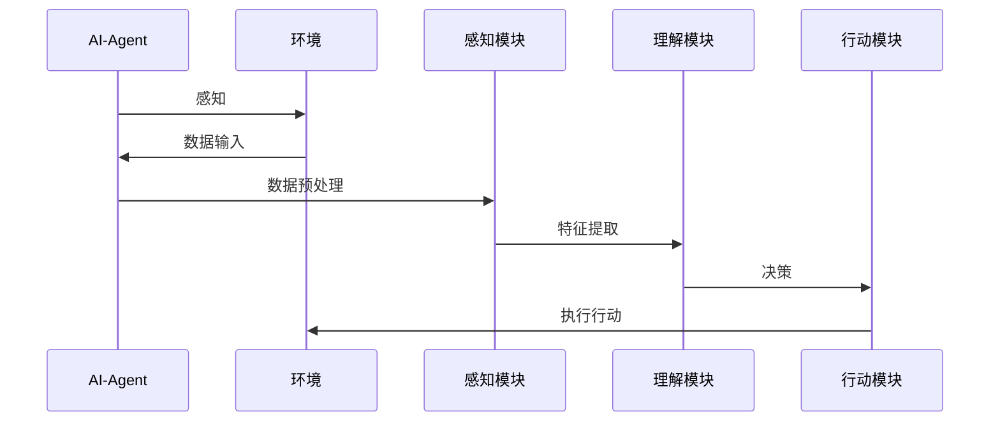
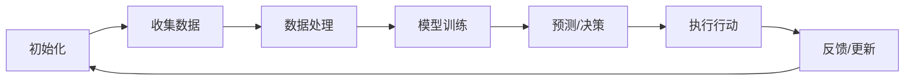
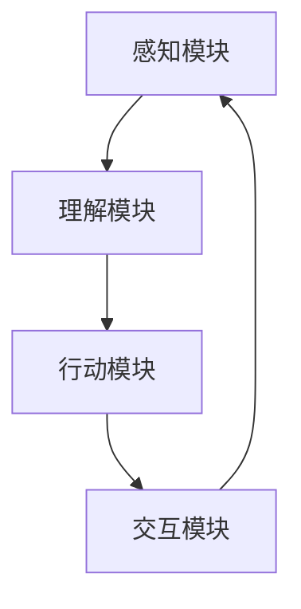
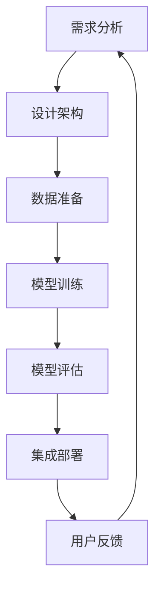
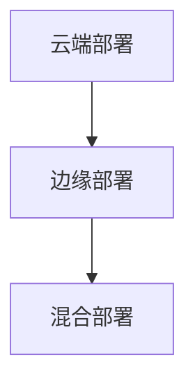
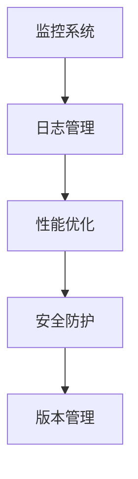

                 

### 第一部分: 引言与背景

#### 1. 引言

在当今高度信息化和全球化的商业环境中，企业面临着复杂多变的竞争格局和市场环境，如何在激烈的竞争中保持优势，实现可持续发展，成为企业亟需解决的问题。预算管理和成本控制作为企业运营的核心环节，直接关系到企业的财务健康和长远发展。然而，传统的预算管理和成本控制方法往往存在数据准确性低、实时性差、人工干预多等问题，难以满足现代企业高效、智能化的管理需求。随着人工智能技术的迅猛发展，AI Agent作为一种智能体技术，开始逐渐在企业预算管理和成本控制中展现出其独特优势。

本文将围绕AI Agent在企业预算管理与成本控制中的应用展开讨论。首先，我们将介绍AI Agent的定义、特点及其与传统算法的对比，并详细阐述AI Agent的类型与分类、技术框架与应用场景。接下来，我们将深入探讨AI Agent在预算管理和成本控制中的具体应用，包括其实际案例和协同应用机制。最后，我们将通过几个实践案例，展示AI Agent在企业预算管理和成本控制中的实际效果，并总结本章内容。

#### 1.1 问题背景

企业的预算管理和成本控制是一项复杂且重要的工作。传统的预算管理和成本控制主要依赖于人工编制和审核，存在着数据不准确、分析不全面、调整不及时等问题。具体表现为：

1. **数据准确性问题**：由于人工录入和处理的误差，预算数据和实际运营数据之间存在较大的差异，导致决策依据不准确。
2. **实时性差**：传统预算管理和成本控制往往滞后，不能及时响应市场变化和企业需求，影响企业的灵活性和竞争力。
3. **人工干预多**：预算编制和成本控制过程中，需要大量的人工参与，导致效率低下，且容易出现人为错误。

这些问题的存在，使得企业难以实现高效、精准的预算管理和成本控制，进而影响企业的整体运营和发展。因此，如何利用先进的技术手段，提高预算管理和成本控制的效率和质量，成为企业亟待解决的问题。

#### 1.2 问题描述

在当前的商业环境中，企业面临以下主要挑战：

1. **预算编制不科学**：传统的预算编制方法缺乏科学性，容易出现不合理分配和重复投入，导致资源浪费。
2. **成本控制不精准**：传统成本控制方法难以准确预测和评估各项成本的实际情况，导致成本超支或浪费。
3. **数据分析和决策支持不足**：预算管理和成本控制过程中，缺乏有效的数据分析和决策支持系统，难以提供准确的决策依据。

这些挑战使得企业难以实现高效的预算管理和成本控制，影响了企业的运营效率和财务健康。因此，需要找到一种有效的方法来提升预算管理和成本控制的科学性、精准性和实时性。

#### 1.3 问题解决

AI Agent作为一种智能体技术，具有自主决策、学习优化和实时响应等特点，可以有效解决企业预算管理和成本控制中面临的挑战。具体来说，AI Agent在以下几个方面具有显著优势：

1. **数据准确性**：AI Agent可以通过机器学习算法，自动收集、清洗和分析大量数据，提高数据的准确性和完整性。
2. **实时性**：AI Agent可以实时监控和更新企业的财务数据，快速响应市场变化和企业需求，提高决策的实时性。
3. **自动化和智能化**：AI Agent可以实现预算编制和成本控制的自动化，减少人工干预，提高工作效率和准确性。

通过引入AI Agent，企业可以实现以下目标：

- 提高预算编制的科学性和合理性，优化资源配置。
- 提高成本控制的精准性，减少浪费和超支。
- 提供有效的数据分析和决策支持，支持企业做出更明智的决策。

#### 1.4 边界与外延

本文的研究主要关注AI Agent在企业预算管理和成本控制中的应用，具体范围包括：

- **研究对象**：AI Agent及其在企业预算管理和成本控制中的具体应用。
- **研究范围**：预算编制、预算执行、预算调整、成本分析、成本控制等环节。

同时，本文还将探讨AI Agent在协同机制、实践案例等方面的应用，以期为企业在预算管理和成本控制中提供有益的参考和借鉴。

#### 1.5 概念结构与核心要素组成

为了更好地理解AI Agent在企业预算管理和成本控制中的应用，我们首先需要明确相关概念和结构。以下是本文涉及的核心概念和要素组成：

1. **AI Agent**：一种具备自主决策能力的智能体，能够模拟人类思维和行为，进行目标导向的自主行动。
2. **预算管理**：企业根据战略目标和财务状况，对收入和支出进行计划、执行和监督的过程。
3. **成本控制**：企业通过制定和实施成本预算，控制各项成本支出，确保成本合理性和效率。
4. **数据分析和决策支持**：利用大数据和人工智能技术，对财务数据进行分析和挖掘，为企业提供科学的决策依据。
5. **协同机制**：企业内外部各相关方在预算管理和成本控制中的协作机制，包括信息共享、流程优化等。

通过以上概念和结构的梳理，我们可以更清晰地理解AI Agent在预算管理和成本控制中的应用场景和作用机制。

### 第二部分: 核心概念与联系

#### 2.1 AI Agent的定义

AI Agent，即人工智能代理，是一种能够模拟人类智能行为，具备自主决策能力、适应环境变化和自我学习优化的计算实体。AI Agent通常由感知器、执行器和控制器组成，能够通过感知环境信息、理解目标、制定行动策略并执行相应动作，从而实现自主决策和行动。

#### 2.2 AI Agent的特点

AI Agent具有以下主要特点：

1. **自主决策能力**：AI Agent能够根据环境信息和预设目标，自主制定行动策略，进行决策。
2. **适应性**：AI Agent能够适应不断变化的环境，通过学习和调整策略，优化行为。
3. **自我学习**：AI Agent可以通过机器学习和深度学习等技术，从数据中学习规律，不断提升决策能力和效率。
4. **灵活性**：AI Agent能够处理多种类型的任务和数据，具备跨领域的应用能力。
5. **实时响应**：AI Agent能够实时感知环境变化，快速响应并采取行动。

#### 2.3 AI Agent与传统算法对比

AI Agent与传统算法在以下几个方面存在显著差异：

1. **自主性**：传统算法依赖于人类设定规则和参数，执行固定的操作；而AI Agent具备自主决策能力，能够自主制定行动策略。
2. **适应性**：传统算法通常难以适应环境变化，而AI Agent可以通过学习和调整策略，提高适应性。
3. **学习与优化**：传统算法缺乏自我学习和优化能力，而AI Agent可以通过机器学习和深度学习技术，从数据中学习，不断提升性能。
4. **应用范围**：传统算法应用范围有限，而AI Agent具有广泛的应用潜力，能够在多个领域发挥作用。

#### 2.4 相关概念的联系与区别

AI Agent与其他相关概念，如人工智能（AI）、机器学习（ML）、深度学习（DL）等，存在密切的联系和区别。

1. **人工智能（AI）**：AI是研究、开发用于模拟、延伸和扩展人类智能的理论、方法、技术及应用系统的科学。AI Agent是AI的一种具体实现形式。
2. **机器学习（ML）**：ML是AI的一个重要分支，研究如何让计算机从数据中学习，自动改进性能。AI Agent的核心算法通常基于ML技术。
3. **深度学习（DL）**：DL是ML的一种特殊形式，基于人工神经网络，通过多层神经网络模型进行数据分析和预测。深度学习是AI Agent实现自我学习和优化的重要技术。

三者之间的区别主要体现在技术层面，AI Agent是AI的具体实现形式，ML和DL是AI Agent实现自我学习和优化的重要技术手段。

#### 2.5 ER实体关系图

为了更直观地展示AI Agent在企业预算管理和成本控制中的相关实体和关系，我们使用ER实体关系图进行描述。以下是AI Agent在企业预算管理和成本控制中的ER实体关系图：

```mermaid
erDiagram
    Budget : "预算" {
        ID { primary key }
        Name
        Description
        StartDate
        EndDate
    }
    CostControl : "成本控制" {
        ID { primary key }
        BudgetID
        CostItem
        Amount
        StartTime
        EndTime
    }
    AI-Agent : "AI代理" {
        ID { primary key }
        Type
        Role
        Status
    }
    Budget ||--|{ AI-Agent }| AI-Agent : "由" <<participant>>
    CostControl ||--|{ AI-Agent }| AI-Agent : "由" <<participant>>
```

在上述ER实体关系图中，Budget（预算）、CostControl（成本控制）和AI-Agent（AI代理）是三个主要的实体。Budget与AI-Agent之间存在"由"关系，表示AI代理负责预算的编制和执行；CostControl与AI-Agent也存在"由"关系，表示AI代理负责成本控制。通过这样的关系定义，我们可以清晰地看到AI Agent在企业预算管理和成本控制中的具体应用场景和角色。

### 第三部分: AI Agent在企业预算管理与成本控制中的应用

#### 3.1 AI Agent在预算管理中的应用

AI Agent在预算管理中的应用主要体现在以下几个方面：

1. **预算编制**：AI Agent可以通过分析历史数据和市场趋势，为企业制定合理的预算计划。具体步骤如下：

   - 数据收集：AI Agent从企业内部数据库、外部市场数据源等渠道收集相关数据。
   - 数据分析：AI Agent使用机器学习算法，对收集的数据进行预处理和统计分析，挖掘出数据中的规律和趋势。
   - 预算生成：根据分析结果，AI Agent自动生成预算计划，包括收入预测、支出预测、利润预测等。

2. **预算调整**：在预算执行过程中，AI Agent可以根据实际情况，动态调整预算计划，确保预算的合理性和有效性。具体步骤如下：

   - 实时监控：AI Agent实时监控企业的财务状况和业务活动，收集实时数据。
   - 预测调整：AI Agent根据实时数据，使用预测模型进行预算调整，确保预算计划的实时性和准确性。
   - 决策支持：AI Agent为企业提供决策支持，帮助管理层做出合理的预算调整决策。

3. **预算执行与监控**：AI Agent可以自动化执行预算计划，并对预算执行情况进行实时监控和分析。具体步骤如下：

   - 自动执行：AI Agent根据预算计划，自动执行各项财务活动，如支付、采购等。
   - 实时监控：AI Agent实时监控预算执行情况，确保各项支出在预算范围内。
   - 异常检测：AI Agent使用异常检测算法，及时发现并预警预算执行中的异常情况，如超支、违规支出等。

通过以上应用，AI Agent能够大幅提升企业预算管理的效率和质量，为企业提供科学、准确的决策依据。

#### 3.2 AI Agent在成本控制中的应用

AI Agent在成本控制中的应用同样具有显著优势，主要体现在以下几个方面：

1. **成本预测**：AI Agent可以通过分析历史数据和市场信息，预测未来各项成本的变化趋势，为企业制定合理的成本控制策略。具体步骤如下：

   - 数据收集：AI Agent从企业内部成本数据库、外部市场数据源等渠道收集相关数据。
   - 数据分析：AI Agent使用机器学习算法，对收集的数据进行预处理和统计分析，挖掘出数据中的规律和趋势。
   - 成本预测：根据分析结果，AI Agent生成未来成本的预测报告，包括成本增长率、成本结构等。

2. **成本优化**：AI Agent可以通过优化算法，自动调整企业的成本结构，降低成本支出。具体步骤如下：

   - 成本结构分析：AI Agent对企业的成本结构进行详细分析，识别出高成本领域和优化潜力。
   - 优化策略生成：AI Agent根据成本结构分析结果，生成优化策略，如减少冗余支出、优化供应链等。
   - 成本调整：AI Agent根据优化策略，自动调整企业的成本结构，降低成本支出。

3. **成本监控与预警**：AI Agent可以实时监控企业的成本支出情况，及时发现并预警超支和违规支出情况。具体步骤如下：

   - 实时监控：AI Agent实时收集企业的财务数据，对成本支出情况进行监控。
   - 异常检测：AI Agent使用异常检测算法，对成本支出数据进行分析，识别出异常情况。
   - 预警通知：AI Agent将异常情况及时通知相关管理人员，提醒其采取相应措施。

通过以上应用，AI Agent能够帮助企业实现高效、精准的成本控制，降低成本支出，提高企业盈利能力。

#### 3.3 AI Agent的优势

AI Agent在企业预算管理和成本控制中具有以下显著优势：

1. **数据驱动**：AI Agent基于大数据和机器学习技术，能够从海量数据中提取有价值的信息，提供科学、准确的决策支持。
2. **自动化与智能化**：AI Agent可以实现预算编制、成本控制等过程的自动化，减少人工干预，提高工作效率。
3. **实时性与适应性**：AI Agent可以实时监控企业财务状况和业务活动，快速响应市场变化和企业需求，提高决策的实时性和适应性。
4. **灵活性与扩展性**：AI Agent具有灵活的架构设计，可以根据企业需求进行定制化开发，支持跨领域应用。

通过以上优势，AI Agent能够显著提升企业预算管理和成本控制的效率和质量，为企业创造更大的价值。

#### 3.4 AI Agent面临的挑战

尽管AI Agent在预算管理和成本控制中具有显著优势，但其在实际应用中也面临一些挑战：

1. **数据质量和可靠性**：AI Agent的性能高度依赖于数据质量和可靠性。如果数据存在噪声、缺失或偏差，可能会导致模型预测不准确。
2. **算法透明性和解释性**：AI Agent的决策过程通常较为复杂，算法透明性和解释性较差，难以被企业内部人员理解和信任。
3. **隐私保护和数据安全**：AI Agent在处理企业财务数据时，需要确保数据隐私和安全性，防止数据泄露和滥用。
4. **技术和管理人才短缺**：AI Agent的开发和运维需要专业技术人员，企业可能面临人才短缺的挑战。

为了应对这些挑战，企业需要加强数据管理和治理，提高算法透明性和可解释性，确保数据隐私和安全，同时加大人才培养和引进力度。

### 4. 本章小结

本文介绍了AI Agent在企业预算管理和成本控制中的应用，包括其在预算编制、预算调整、成本预测、成本优化等方面的具体应用。通过AI Agent的数据驱动、自动化与智能化、实时性与适应性等优势，企业能够实现高效的预算管理和成本控制。然而，AI Agent在实际应用中也面临数据质量和可靠性、算法透明性和解释性、隐私保护和数据安全、技术和管理人才短缺等挑战。企业需要采取相应措施，充分发挥AI Agent的优势，解决面临的挑战，实现预算管理和成本控制的现代化、智能化。

---

### 第二部分: AI Agent基础知识

#### 4.1 AI Agent的基本原理

AI Agent是一种具备自主决策能力的计算实体，其核心在于模拟人类智能行为，实现自主行动和目标导向。AI Agent的基本原理可以概括为感知、理解和行动。

1. **感知**：AI Agent通过传感器或数据接口，收集环境信息，如视觉、听觉、触觉等。感知模块负责将感知到的信息进行预处理，提取关键特征，为后续理解和行动提供基础。

2. **理解**：AI Agent利用机器学习、自然语言处理等技术，对感知到的信息进行理解和分析。理解模块负责解析信息内容，提取有用知识，形成对环境的认知。

3. **行动**：AI Agent根据理解结果，制定行动策略并执行相应动作。行动模块负责将决策转化为具体操作，实现目标导向的自主行动。

AI Agent的基本原理示意图如下：



#### 4.2 AI Agent的核心算法

AI Agent的核心算法主要包括机器学习、深度学习、强化学习等。这些算法使AI Agent能够从数据中学习规律，实现自主决策和优化。

1. **机器学习**：机器学习是一种通过训练模型，使计算机具备预测和决策能力的技术。常见的机器学习算法包括线性回归、决策树、支持向量机等。机器学习算法适用于处理结构化数据，能够自动提取特征和模式，为AI Agent提供决策依据。

2. **深度学习**：深度学习是机器学习的一种特殊形式，基于多层神经网络模型。深度学习通过训练大量的神经网络，实现自动特征提取和复杂模式的识别。常见的深度学习算法包括卷积神经网络（CNN）、循环神经网络（RNN）等。深度学习在图像识别、自然语言处理等领域取得了显著的成果。

3. **强化学习**：强化学习是一种通过试错和反馈，使计算机在环境中学习最优策略的技术。强化学习通过奖励机制，引导AI Agent不断优化决策和行为。常见的强化学习算法包括Q学习、深度Q网络（DQN）等。强化学习适用于复杂、动态的环境，能够实现自主决策和策略优化。

以下是一个简单的AI Agent算法流程：



#### 4.3 AI Agent的技术发展历程

AI Agent技术的发展经历了几个重要阶段：

1. **早期探索**（20世纪50-70年代）：人工智能概念诞生，研究者开始探索如何让计算机模拟人类思维。这个阶段的代表性工作是程序控制的机器人，如IBM的Shakey机器人。

2. **专家系统**（20世纪80年代）：专家系统成为一种重要的AI技术，通过编码领域专家的知识，实现自动推理和决策。专家系统在医疗诊断、财务分析等领域取得了一定的成功。

3. **机器学习和深度学习**（20世纪90年代至今）：随着计算机性能的提升和数据量的增加，机器学习和深度学习技术得到快速发展。这一阶段，AI Agent的核心算法逐渐从规则驱动转向数据驱动，实现了更加智能的自主决策。

4. **多模态感知和增强学习**（近年来）：AI Agent开始融合多种感知模态（如视觉、听觉、触觉），实现更加全面的环境感知。同时，增强学习技术的发展，使得AI Agent在复杂、动态环境中具备更强的自主决策能力。

AI Agent的技术发展历程示意图如下：

```mermaid
gantt
    dateFormat  YYYY-MM-DD
    title AI Agent技术发展历程
    section 早期探索
    A1[感知与理解] :start||1956
    A2[行动与交互] :after A1 6month
    
    section 专家系统
    B1[知识表示] :start||1980
    B2[推理与决策] :after B1 4month
    
    section 机器学习和深度学习
    C1[机器学习] :start||1990
    C2[深度学习] :start||2012
    
    section 多模态感知和增强学习
    D1[多模态感知] :start||2015
    D2[增强学习] :start||2015
```

#### 4.4 AI Agent的类型与分类

AI Agent可以根据不同的分类标准，分为多种类型。以下是几种常见的AI Agent分类：

1. **反应型Agent**：反应型Agent根据当前感知到的环境信息，直接生成响应动作，不考虑历史信息和长期目标。反应型Agent适用于环境变化较为简单和稳定的场景。

2. **目标导向型Agent**：目标导向型Agent具有明确的目标，通过感知、理解和决策，实现目标的逐步实现。目标导向型Agent适用于具有明确目标导向的复杂环境。

3. **学习型Agent**：学习型Agent通过不断学习环境信息和行为结果，优化自身的决策策略。学习型Agent适用于动态变化和不确定性的环境。

4. **社交型Agent**：社交型Agent能够与其他Agent或人类进行交互，共享信息和知识。社交型Agent适用于需要协作和沟通的场景。

以下是一个简单的AI Agent分类表格：

| 类别       | 特点                                       | 适用场景                           |
| ---------- | ----------------------------------------- | ---------------------------------- |
| 反应型Agent | 根据当前感知直接生成响应动作           | 环境变化简单、稳定的场景           |
| 目标导向型Agent | 具有明确目标，通过感知、理解和决策实现目标 | 复杂环境、需要长期目标的场景     |
| 学习型Agent | 通过学习环境信息和行为结果优化决策策略 | 动态变化和不确定性的环境           |
| 社交型Agent | 能够与其他Agent或人类进行交互          | 需要协作和沟通的场景               |

#### 4.5 AI Agent的技术框架与应用场景

AI Agent的技术框架主要包括感知模块、理解模块、行动模块和交互模块。以下是一个典型的AI Agent技术框架：



**感知模块**：感知模块负责收集和处理环境信息，如图像、声音、文本等。感知模块可以使用多种传感器和数据接口，实现对环境的全面感知。

**理解模块**：理解模块负责对感知模块收集的信息进行理解和分析，提取有用知识。理解模块通常采用机器学习、自然语言处理、计算机视觉等技术。

**行动模块**：行动模块负责根据理解模块的结果，生成具体的行动策略并执行。行动模块可以控制执行器，实现自主行动。

**交互模块**：交互模块负责与其他Agent或人类进行信息交换和协作。交互模块可以使用通信协议、接口标准等，实现跨平台、跨语言的交互。

AI Agent的应用场景非常广泛，以下是一些典型的应用场景：

1. **智能制造**：AI Agent可以用于生产线的自动化控制、设备故障诊断、质量控制等，提高生产效率和产品质量。

2. **智能交通**：AI Agent可以用于交通信号控制、路况预测、车辆导航等，提高交通效率和安全性。

3. **金融领域**：AI Agent可以用于风险管理、投资决策、客户服务等领域，提供智能化的金融服务。

4. **医疗健康**：AI Agent可以用于疾病诊断、治疗方案推荐、患者管理等领域，提高医疗质量和效率。

5. **智慧城市**：AI Agent可以用于城市管理、环境监测、公共安全等领域，提高城市管理的智能化水平。

#### 4.6 AI Agent在实际企业中的应用案例

AI Agent在众多企业中已经得到广泛应用，以下是一些典型应用案例：

1. **某制造业公司**：该企业引入AI Agent进行生产调度和设备维护。AI Agent通过感知模块实时监控设备状态，理解模块分析设备数据，行动模块自动安排维护计划，提高了生产效率，降低了设备故障率。

2. **某金融公司**：该企业使用AI Agent进行风险管理和投资决策。AI Agent通过收集和分析市场数据，利用机器学习和深度学习技术，预测市场走势和风险，为投资决策提供支持，提高了投资收益。

3. **某物流公司**：该企业利用AI Agent进行物流调度和运输规划。AI Agent通过感知模块获取实时交通信息，理解模块分析运输路线，行动模块优化运输计划，提高了运输效率和准确性。

4. **某医疗公司**：该企业使用AI Agent进行疾病诊断和治疗方案推荐。AI Agent通过分析患者病历和医疗数据，利用机器学习和深度学习技术，为医生提供诊断和治疗方案建议，提高了医疗质量和效率。

通过以上应用案例，我们可以看到AI Agent在提升企业效率和降低成本方面的显著优势。未来，随着AI技术的发展，AI Agent将在更多行业和领域得到广泛应用，为企业创造更多价值。

### 7. AI Agent的开发与部署

#### 7.1 AI Agent的开发流程

AI Agent的开发流程可以分为以下几个步骤：

1. **需求分析**：明确AI Agent的目标和应用场景，确定其功能需求、性能指标和用户体验要求。
2. **设计架构**：根据需求分析，设计AI Agent的架构，包括感知模块、理解模块、行动模块和交互模块等。
3. **数据准备**：收集和准备训练数据，包括结构化数据、非结构化数据等。对数据进行预处理，如数据清洗、特征提取等。
4. **模型训练**：选择合适的机器学习、深度学习或强化学习算法，对模型进行训练和优化，使其能够在目标应用场景中表现出良好的性能。
5. **模型评估**：使用验证集或测试集对模型进行评估，调整模型参数，提高模型性能。
6. **集成部署**：将训练好的模型集成到AI Agent中，进行系统集成和测试，确保AI Agent在各种环境下稳定运行。
7. **用户反馈与迭代**：收集用户反馈，不断优化AI Agent的功能和性能，提高用户体验。

以下是一个AI Agent开发流程的示意图：



#### 7.2 AI Agent的部署策略

AI Agent的部署策略可以分为以下几种：

1. **云端部署**：将AI Agent部署在云端服务器上，通过互联网提供服务。云端部署具有高可扩展性、高可用性和低成本的优势，适用于大规模、分布式应用场景。
2. **边缘部署**：将AI Agent部署在边缘设备（如智能传感器、无人机等）上，实现实时数据处理和决策。边缘部署可以降低网络延迟、减少带宽占用，提高系统的实时性和响应速度。
3. **混合部署**：结合云端部署和边缘部署的优势，将AI Agent部署在云端和边缘设备之间。在云端进行大规模数据处理和模型训练，在边缘设备上进行实时决策和响应。

以下是一个AI Agent部署策略的示意图：



#### 7.3 AI Agent的运维与管理

AI Agent的运维与管理包括以下几个方面：

1. **监控系统**：监控AI Agent的运行状态、性能指标和资源使用情况，及时发现和解决异常问题。
2. **日志管理**：记录AI Agent的运行日志，包括错误日志、警告日志等，便于问题追踪和故障排除。
3. **性能优化**：定期对AI Agent进行性能评估和优化，调整模型参数、优化算法等，提高系统性能和效率。
4. **安全防护**：确保AI Agent的数据安全和系统安全，防止数据泄露、攻击和恶意行为。
5. **版本管理**：管理和控制AI Agent的版本更新，确保系统稳定性和兼容性。

以下是一个AI Agent运维与管理的示意图：



#### 7.4 本章小结

本章介绍了AI Agent的开发与部署流程、部署策略和运维管理方法。AI Agent的开发流程包括需求分析、设计架构、数据准备、模型训练、模型评估、集成部署和用户反馈等步骤。AI Agent的部署策略包括云端部署、边缘部署和混合部署等。AI Agent的运维与管理包括监控系统、日志管理、性能优化、安全防护和版本管理等方面。通过了解AI Agent的开发与部署流程，企业可以更好地实现AI Agent的实际应用，提高效率和竞争力。

---

### 第三部分: 企业预算管理与成本控制中的AI Agent应用

#### 9.1 预算管理的现状与挑战

预算管理是企业财务管理的重要环节，它涉及收入预测、支出计划、预算编制、执行监控和调整等多个方面。然而，在当前的预算管理过程中，企业面临着以下现状与挑战：

1. **数据准确性问题**：传统预算管理主要依赖于手工录入和数据处理，容易出现数据不准确、不完整等问题。这导致预算编制和执行过程中，决策依据不足，影响预算管理的科学性和有效性。

2. **实时性差**：传统预算管理往往存在滞后性，预算编制和调整过程耗时较长，难以及时响应市场变化和企业需求。这导致企业在面对突发情况时，难以迅速调整预算，影响企业的灵活性和竞争力。

3. **人工干预多**：预算管理过程中，需要大量的人工参与，如数据录入、分析、调整等。这导致预算管理效率低下，且容易出现人为错误。此外，人工干预还可能导致决策过程缺乏透明度和一致性。

4. **预算执行监控不足**：传统预算管理难以实现对预算执行的实时监控，往往在预算执行结束后，才能发现超支、浪费等问题。这导致企业难以及时采取措施，降低预算管理的有效性。

5. **预算调整困难**：在市场环境和内部业务发生变化时，传统预算管理难以快速调整预算计划，导致预算与实际需求不符，影响企业的资源配置和运营效率。

为了解决上述问题，企业需要引入先进的技术手段，提高预算管理的效率和准确性，实现预算管理的现代化和智能化。AI Agent作为一种智能体技术，具有自主决策、实时响应和数据驱动的特点，可以为企业预算管理提供有力支持。

#### 9.2 AI Agent在预算管理中的应用场景

AI Agent在预算管理中的应用场景主要包括以下几个方面：

1. **预算编制**：AI Agent可以通过机器学习和数据挖掘技术，分析历史数据和业务趋势，自动生成预算计划。具体应用场景如下：

   - **收入预测**：AI Agent可以分析市场数据、客户行为和企业历史收入数据，预测未来收入趋势，为企业制定合理的收入预算。
   - **支出预测**：AI Agent可以分析历史支出数据、采购订单和市场价格信息，预测未来各项支出的金额和结构，为企业制定详细的支出预算。
   - **预算调整**：AI Agent可以根据实时数据和市场变化，动态调整预算计划，确保预算与实际需求相符。

2. **预算执行监控**：AI Agent可以实时监控预算执行情况，提供实时数据分析和预警功能。具体应用场景如下：

   - **超支预警**：AI Agent可以监控各项支出的金额和结构，及时发现超支情况，向管理层发出预警通知，提醒其采取措施。
   - **合规性检查**：AI Agent可以检查预算执行过程中的合规性，识别违规支出或异常情况，为企业提供合规性保障。
   - **实时数据报告**：AI Agent可以生成实时数据报告，展示预算执行情况和关键指标，帮助企业及时了解预算执行情况。

3. **预算调整与优化**：AI Agent可以根据实时数据和市场变化，自动调整预算计划，实现预算优化。具体应用场景如下：

   - **成本控制**：AI Agent可以分析成本数据和市场信息，识别成本控制的关键领域和优化潜力，制定成本控制策略。
   - **资源优化**：AI Agent可以分析企业资源分配情况，优化资源配置，提高资源利用率。
   - **预算反馈与改进**：AI Agent可以根据预算执行结果和用户反馈，持续优化预算模型和算法，提高预算管理的准确性和效率。

#### 9.3 AI Agent在预算管理中的实际案例

以下是一个AI Agent在预算管理中的实际案例：

某大型制造企业面临着预算管理效率低下、数据准确性差和调整不及时等问题。为了解决这些问题，该企业引入了AI Agent进行预算管理。

1. **需求分析**：该企业明确了AI Agent在预算管理中的应用需求，包括收入预测、支出预测、预算执行监控和预算调整等。

2. **设计架构**：企业设计了一个基于AI Agent的预算管理架构，包括数据收集模块、数据分析模块、决策支持模块和执行监控模块。

3. **数据准备**：企业收集了大量的历史预算数据、收入数据、支出数据和市场数据，对数据进行了预处理，如数据清洗、归一化等。

4. **模型训练**：企业选择了一种基于机器学习的算法，对预算模型进行训练和优化，使其能够准确预测收入和支出，并提供实时的预算执行监控。

5. **集成部署**：将训练好的模型集成到AI Agent中，部署在企业的服务器上，实现了预算管理的自动化和智能化。

6. **应用效果**：

   - **收入预测**：AI Agent能够根据历史收入数据和当前市场趋势，准确预测未来收入，为企业的预算编制提供了科学依据。
   - **支出预测**：AI Agent能够根据历史支出数据和市场价格信息，预测未来各项支出的金额和结构，帮助企业制定详细的支出预算。
   - **预算执行监控**：AI Agent能够实时监控预算执行情况，及时发现超支和合规性问题，为管理层提供预警通知。
   - **预算调整**：AI Agent可以根据实时数据和市场变化，动态调整预算计划，优化资源配置，提高预算管理的准确性和效率。

通过引入AI Agent，该企业的预算管理效率显著提升，数据准确性提高，预算调整更加及时和准确，为企业创造了显著的经济效益。

#### 10.1 成本控制的现状与挑战

成本控制是企业运营过程中的一项关键任务，它关系到企业的盈利能力和市场竞争力。然而，在当前的成本控制过程中，企业面临着以下现状与挑战：

1. **成本控制意识不足**：许多企业对成本控制的重要性认识不足，缺乏有效的成本控制策略和制度，导致成本控制工作流于形式。

2. **成本数据不完整**：企业成本数据往往存在缺失、错误或不一致等问题，导致成本控制缺乏准确的数据支持。

3. **成本分析不够深入**：传统成本控制方法主要依赖于人工分析，难以深入挖掘成本结构中的潜在问题和优化潜力。

4. **成本控制不及时**：传统成本控制方法存在滞后性，往往在成本发生后再进行控制，难以及时发现问题并采取措施。

5. **成本管理手段落后**：许多企业的成本管理手段仍停留在手工阶段，缺乏自动化和智能化手段，导致成本控制效率低下。

6. **成本控制执行难度大**：成本控制涉及多个部门和环节，协调难度较大，容易出现执行不到位或执行偏差的问题。

为了解决上述问题，企业需要引入先进的技术手段，提高成本控制的效率和质量，实现成本控制的现代化和智能化。AI Agent作为一种智能体技术，具有自主决策、实时响应和数据驱动的特点，可以为企业成本控制提供有力支持。

#### 10.2 AI Agent在成本控制中的应用场景

AI Agent在成本控制中的应用场景主要包括以下几个方面：

1. **成本预测**：AI Agent可以通过机器学习和数据挖掘技术，分析历史成本数据、市场信息和业务活动，预测未来成本变化趋势。具体应用场景如下：

   - **成本趋势分析**：AI Agent可以分析历史成本数据，识别成本变化趋势和周期性规律，为企业的成本规划提供参考。
   - **成本预测**：AI Agent可以基于当前的市场状况和业务活动，预测未来各项成本的金额和结构，为企业的成本预算提供支持。

2. **成本优化**：AI Agent可以通过优化算法，分析成本结构，识别成本控制的关键领域和优化潜力，提供优化方案。具体应用场景如下：

   - **成本削减**：AI Agent可以分析企业的成本数据，识别成本过高的领域，提出削减成本的措施和方案。
   - **成本分配**：AI Agent可以优化成本分配策略，确保各项成本合理分配，提高资源利用率。

3. **成本监控与预警**：AI Agent可以实时监控成本支出情况，提供实时数据分析和预警功能。具体应用场景如下：

   - **超支预警**：AI Agent可以监控各项支出的金额和结构，及时发现超支情况，向管理层发出预警通知。
   - **合规性检查**：AI Agent可以检查成本执行过程中的合规性，识别违规支出或异常情况，为企业提供合规性保障。
   - **实时数据报告**：AI Agent可以生成实时数据报告，展示成本执行情况和关键指标，帮助企业及时了解成本控制情况。

4. **成本分析与管理**：AI Agent可以通过数据分析和挖掘技术，深入分析成本数据，为企业的成本管理提供科学依据。具体应用场景如下：

   - **成本结构分析**：AI Agent可以分析企业的成本结构，识别成本分布和占比，帮助企业优化成本结构。
   - **成本驱动因素分析**：AI Agent可以分析成本与业务活动之间的关系，识别成本的主要驱动因素，为企业的成本控制提供参考。
   - **成本效益分析**：AI Agent可以分析成本与效益的关系，评估成本控制措施的有效性，为企业的决策提供支持。

#### 10.3 AI Agent在成本控制中的实际案例

以下是一个AI Agent在成本控制中的实际案例：

某大型零售企业面临着成本控制难度大、成本数据不准确和成本控制不及时等问题。为了提高成本控制的效率和质量，该企业引入了AI Agent进行成本控制。

1. **需求分析**：该企业明确了AI Agent在成本控制中的应用需求，包括成本预测、成本优化、成本监控和预警等。

2. **设计架构**：企业设计了一个基于AI Agent的成本控制架构，包括数据收集模块、数据分析模块、决策支持模块和执行监控模块。

3. **数据准备**：企业收集了大量的历史成本数据、采购订单、销售数据和市场信息，对数据进行了预处理，如数据清洗、归一化等。

4. **模型训练**：企业选择了一种基于机器学习的算法，对成本模型进行训练和优化，使其能够准确预测成本变化趋势，并提供实时的成本监控和预警。

5. **集成部署**：将训练好的模型集成到AI Agent中，部署在企业的服务器上，实现了成本控制的自动化和智能化。

6. **应用效果**：

   - **成本预测**：AI Agent能够根据历史成本数据和市场信息，准确预测未来各项成本的变化趋势，为企业的预算编制提供了科学依据。
   - **成本优化**：AI Agent能够分析成本数据，识别成本控制的关键领域和优化潜力，提出削减成本的措施和方案，帮助企业降低成本支出。
   - **成本监控与预警**：AI Agent能够实时监控成本支出情况，及时发现超支和违规支出情况，向管理层发出预警通知，帮助企业及时采取措施。
   - **成本分析与管理**：AI Agent能够深入分析成本数据，为企业的成本管理提供科学依据，帮助企业优化成本结构和降低成本。

通过引入AI Agent，该企业的成本控制效率显著提升，成本数据准确性提高，成本控制更加及时和准确，为企业创造了显著的经济效益。

### 11. AI Agent在预算管理与成本控制中的协同应用

#### 11.1 AI Agent在预算管理与成本控制中的协同机制

AI Agent在预算管理和成本控制中的协同应用，通过集成不同模块的功能，实现了跨部门、跨环节的协同控制，从而提高了整体管理效率和效果。协同机制的核心在于：

1. **数据共享与同步**：AI Agent通过建立统一的数据平台，实现预算管理和成本控制数据的实时共享和同步。这样，各部门和环节可以及时获取最新的数据，确保决策的准确性和及时性。

2. **任务分工与协作**：AI Agent根据企业业务流程和职责分工，明确各模块的任务和责任，实现任务分工与协作。例如，预算编制模块负责收入和支出的预测和规划，成本控制模块负责成本监控和优化。

3. **策略优化与调整**：AI Agent通过实时数据分析和预测，动态调整预算和成本控制策略，确保各项预算和成本计划的合理性和有效性。例如，当市场变化导致成本上升时，AI Agent可以及时调整预算计划，优化资源配置。

4. **决策支持与反馈**：AI Agent为企业提供实时的决策支持，根据数据分析结果和预警信息，为管理层提供决策依据。同时，AI Agent收集用户反馈，不断优化自身性能和算法，提高决策准确性。

#### 11.2 AI Agent在协同应用中的优势

AI Agent在预算管理和成本控制中的协同应用具有以下优势：

1. **提高决策效率**：AI Agent可以自动化处理大量数据，实时分析市场变化和企业运营情况，提供快速、准确的决策支持，提高决策效率。

2. **降低人工干预**：AI Agent通过自动化和智能化手段，减少人工干预，降低人为错误和操作风险，提高管理效率和准确性。

3. **实现实时监控**：AI Agent可以实时监控预算和成本执行情况，及时发现异常和问题，提供预警通知，帮助企业迅速采取应对措施。

4. **优化资源配置**：AI Agent通过数据分析和预测，优化预算和成本结构，提高资源配置效率，降低浪费和成本超支。

5. **提升协同效应**：AI Agent通过协同机制，实现跨部门、跨环节的协同控制，提升整体管理效率和效果，增强企业的竞争力。

#### 11.3 AI Agent在协同应用中的挑战

尽管AI Agent在预算管理和成本控制中具有显著优势，但在协同应用中也面临以下挑战：

1. **数据质量与可靠性**：AI Agent的决策依赖于数据质量，如果数据存在噪声、缺失或偏差，可能会影响决策的准确性。因此，确保数据质量是AI Agent应用的关键。

2. **算法透明性与可解释性**：AI Agent的决策过程往往较为复杂，算法透明性和可解释性较差，难以被企业内部人员理解和信任。这可能导致管理层对AI Agent的决策产生质疑，影响其应用效果。

3. **系统集成与兼容性**：AI Agent需要与企业现有的信息系统和业务流程进行集成，实现数据共享和协同控制。然而，不同系统和模块之间的集成可能存在兼容性问题，影响系统的稳定性和效率。

4. **人才与技术支持**：AI Agent的开发和运维需要专业人才和技术支持，企业可能面临人才短缺和技术障碍。此外，AI Agent的应用需要不断优化和更新，企业需要投入持续的人力、物力和财力。

5. **法律法规与伦理问题**：AI Agent在预算管理和成本控制中的应用可能涉及隐私保护、数据安全、算法透明性等法律法规和伦理问题。企业需要确保AI Agent的应用符合相关法律法规，维护用户权益。

为了应对上述挑战，企业需要采取以下措施：

- 加强数据管理和治理，提高数据质量与可靠性。
- 优化算法设计，提高算法透明性和可解释性。
- 加大人才培养和引进力度，提升技术支持能力。
- 实现系统集成与兼容，确保系统稳定性和效率。
- 遵循法律法规和伦理准则，确保AI Agent的应用合规。

通过采取上述措施，企业可以充分发挥AI Agent在预算管理和成本控制中的协同应用优势，实现企业管理的现代化和智能化。

### 12. 本章小结

本章详细探讨了AI Agent在预算管理和成本控制中的应用，包括其在预算编制、预算执行监控、预算调整和成本预测、成本优化等方面的应用场景和实际案例。通过AI Agent的协同应用，企业可以实现数据共享、任务分工与协作、策略优化与调整、决策支持与反馈等目标，提高预算管理和成本控制的效率和质量。尽管AI Agent在协同应用中面临数据质量、算法透明性、系统集成、人才支持等挑战，但通过采取相应措施，企业可以充分发挥AI Agent的优势，实现预算管理和成本控制的现代化和智能化。

### 第四部分: AI Agent在企业预算管理与成本控制中的实践案例

#### 13. 实践案例1：某制造企业的AI Agent预算管理与成本控制应用

**13.1 企业背景与需求**

某大型制造企业（以下简称“企业”）在运营过程中面临着预算管理和成本控制难度大的问题。传统的预算管理和成本控制方法主要依赖于手工操作和人工干预，存在数据准确性低、实时性差、调整不及时等问题，导致企业的预算编制和成本控制效果不佳。为了提高预算管理和成本控制的效率和质量，企业决定引入AI Agent技术，实现预算管理和成本控制的智能化。

**13.2 AI Agent的架构设计与实现**

企业设计了基于AI Agent的预算管理和成本控制架构，包括数据收集模块、数据分析模块、决策支持模块和执行监控模块。

1. **数据收集模块**：该模块负责从企业内部数据库、外部市场数据源等渠道收集相关数据，包括历史财务数据、采购订单、销售数据、市场价格等。

2. **数据分析模块**：该模块利用机器学习和数据挖掘技术，对收集的数据进行预处理、特征提取和统计分析，挖掘出数据中的规律和趋势。

3. **决策支持模块**：该模块根据数据分析结果，生成预算计划和成本控制策略，为企业提供科学的决策支持。

4. **执行监控模块**：该模块实时监控预算执行情况和成本支出情况，提供实时数据分析和预警功能，确保预算和成本计划的合理性和有效性。

**13.3 应用效果评估**

AI Agent在企业的预算管理和成本控制中取得了显著的应用效果：

1. **提高预算编制的科学性和准确性**：通过AI Agent的预算编制功能，企业能够根据历史数据和当前市场趋势，准确预测未来收入和支出，提高了预算编制的科学性和准确性。

2. **实时监控预算执行情况**：AI Agent可以实时监控预算执行情况，及时发现超支和违规支出情况，向管理层发出预警通知，帮助企业迅速采取措施，降低了预算执行过程中的风险。

3. **优化成本结构**：AI Agent能够分析成本数据，识别成本控制的关键领域和优化潜力，提出削减成本的措施和方案，帮助企业优化成本结构，降低成本支出。

4. **提高成本控制效率**：AI Agent实现了成本控制的自动化和智能化，减少了人工干预，降低了人为错误，提高了成本控制效率。

通过引入AI Agent，企业的预算管理和成本控制水平显著提升，实现了预算编制的科学化、成本控制的智能化，为企业创造了显著的经济效益。

#### 14. 实践案例2：某互联网公司的AI Agent预算管理与成本控制应用

**14.1 企业背景与需求**

某知名互联网公司（以下简称“公司”）在快速发展的过程中，面临着预算管理和成本控制难度大的问题。公司业务范围广泛，涉及多个业务板块和部门，预算编制和成本控制过程复杂，传统方法难以满足公司高效、精准的管理需求。为了提升预算管理和成本控制的效率，公司决定引入AI Agent技术，实现预算管理和成本控制的智能化。

**14.2 AI Agent的架构设计与实现**

公司设计了基于AI Agent的预算管理和成本控制架构，包括数据收集模块、数据分析模块、决策支持模块和执行监控模块。

1. **数据收集模块**：该模块负责从公司内部数据库、外部市场数据源等渠道收集相关数据，包括历史财务数据、订单数据、用户行为数据、市场信息等。

2. **数据分析模块**：该模块利用机器学习和数据挖掘技术，对收集的数据进行预处理、特征提取和统计分析，挖掘出数据中的规律和趋势。

3. **决策支持模块**：该模块根据数据分析结果，生成预算计划和成本控制策略，为企业提供科学的决策支持。

4. **执行监控模块**：该模块实时监控预算执行情况和成本支出情况，提供实时数据分析和预警功能，确保预算和成本计划的合理性和有效性。

**14.3 应用效果评估**

AI Agent在公司的预算管理和成本控制中取得了显著的应用效果：

1. **优化预算编制流程**：通过AI Agent的预算编制功能，公司能够根据历史数据和当前市场趋势，准确预测未来收入和支出，优化了预算编制流程，提高了预算编制的科学性和准确性。

2. **实时监控预算执行**：AI Agent可以实时监控预算执行情况，及时发现超支和违规支出情况，向管理层发出预警通知，帮助企业迅速采取措施，降低了预算执行过程中的风险。

3. **提高成本控制效率**：AI Agent实现了成本控制的自动化和智能化，减少了人工干预，降低了人为错误，提高了成本控制效率。

4. **提升数据分析和决策支持能力**：AI Agent能够深入分析各种数据，提供实时的决策支持，为公司管理层提供了有力支持，帮助企业做出更科学的决策。

通过引入AI Agent，公司的预算管理和成本控制水平显著提升，实现了预算编制的科学化、成本控制的智能化，为公司创造了显著的经济效益。

#### 15. 实践案例3：某服务公司的AI Agent预算管理与成本控制应用

**15.1 企业背景与需求**

某知名服务公司（以下简称“公司”）在快速发展的过程中，面临着预算管理和成本控制难度大的问题。公司业务范围广泛，涉及多个业务板块和部门，预算编制和成本控制过程复杂，传统方法难以满足公司高效、精准的管理需求。为了提升预算管理和成本控制的效率，公司决定引入AI Agent技术，实现预算管理和成本控制的智能化。

**15.2 AI Agent的架构设计与实现**

公司设计了基于AI Agent的预算管理和成本控制架构，包括数据收集模块、数据分析模块、决策支持模块和执行监控模块。

1. **数据收集模块**：该模块负责从公司内部数据库、外部市场数据源等渠道收集相关数据，包括历史财务数据、订单数据、服务数据、市场信息等。

2. **数据分析模块**：该模块利用机器学习和数据挖掘技术，对收集的数据进行预处理、特征提取和统计分析，挖掘出数据中的规律和趋势。

3. **决策支持模块**：该模块根据数据分析结果，生成预算计划和成本控制策略，为企业提供科学的决策支持。

4. **执行监控模块**：该模块实时监控预算执行情况和成本支出情况，提供实时数据分析和预警功能，确保预算和成本计划的合理性和有效性。

**15.3 应用效果评估**

AI Agent在公司的预算管理和成本控制中取得了显著的应用效果：

1. **优化预算编制流程**：通过AI Agent的预算编制功能，公司能够根据历史数据和当前市场趋势，准确预测未来收入和支出，优化了预算编制流程，提高了预算编制的科学性和准确性。

2. **实时监控预算执行**：AI Agent可以实时监控预算执行情况，及时发现超支和违规支出情况，向管理层发出预警通知，帮助企业迅速采取措施，降低了预算执行过程中的风险。

3. **提高成本控制效率**：AI Agent实现了成本控制的自动化和智能化，减少了人工干预，降低了人为错误，提高了成本控制效率。

4. **提升数据分析和决策支持能力**：AI Agent能够深入分析各种数据，提供实时的决策支持，为公司管理层提供了有力支持，帮助企业做出更科学的决策。

通过引入AI Agent，公司的预算管理和成本控制水平显著提升，实现了预算编制的科学化、成本控制的智能化，为公司创造了显著的经济效益。

### 16. 本章小结

本章通过三个实际案例，详细介绍了AI Agent在制造企业、互联网公司和服务公司中的预算管理和成本控制应用。通过AI Agent的自动化和智能化功能，企业能够优化预算编制流程、实时监控预算执行情况、提高成本控制效率，并提升数据分析和决策支持能力。实践证明，AI Agent在预算管理和成本控制中具有显著的优势，能够有效提高企业的管理效率和经济效益。未来，随着AI技术的不断发展和应用，AI Agent将在更多行业和领域中发挥重要作用，为企业创造更大的价值。

---

## 总结与展望

本文详细探讨了AI Agent在企业预算管理与成本控制中的应用，从核心概念、技术原理到具体实践案例，全面阐述了AI Agent在提升企业预算管理和成本控制效率和质量方面的显著优势。通过AI Agent的自动化、智能化和数据驱动的特性，企业能够实现预算编制的科学化、实时监控的精确化和成本控制的精细化。

首先，我们介绍了AI Agent的定义、特点、与传统算法的对比及其在预算管理和成本控制中的应用场景。随后，我们深入分析了AI Agent的基础知识，包括基本原理、核心算法、技术框架、类型与分类以及实际应用案例。在此基础上，我们探讨了AI Agent在预算管理和成本控制中的协同应用，分析了其优势与挑战，并通过具体实践案例展示了AI Agent在提升企业预算管理和成本控制效率方面的实际效果。

然而，AI Agent在企业预算管理和成本控制中的应用仍然面临数据质量、算法透明性、系统集成、人才支持等挑战。未来，企业需要加强数据管理和治理，提高算法透明性和可解释性，实现系统集成与兼容，加大人才培养和引进力度，确保AI Agent的应用符合法律法规和伦理准则。

展望未来，AI Agent在预算管理和成本控制中的应用将不断拓展和深化。随着人工智能技术的不断进步，AI Agent将具备更高的自主决策能力、适应能力和学习能力，能够在更复杂的业务场景中发挥更大的作用。同时，AI Agent将与其他前沿技术如区块链、物联网等相结合，推动企业数字化转型和智能化升级。通过持续创新和实践，AI Agent将为企业在预算管理和成本控制中创造更大的价值，助力企业实现可持续发展。

### 作者信息

**作者：AI天才研究院/AI Genius Institute & 禅与计算机程序设计艺术 /Zen And The Art of Computer Programming**

