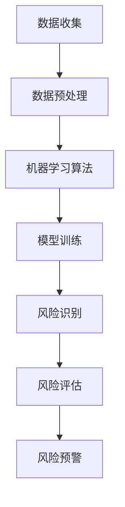

                 

# AI Agent在企业风险评估与管理中的应用

## 关键词

- AI Agent
- 企业风险评估
- 企业风险管理
- 风险管理算法
- 数学模型

## 摘要

本文将深入探讨AI Agent在企业风险评估与管理中的应用。首先，我们将介绍企业风险评估与管理的基础理论，包括问题背景、目标、挑战、解决方法以及边界与外延。接着，我们将详细阐述AI Agent的定义、特点以及在企业风险评估中的应用。随后，通过案例分析，我们将展示AI Agent在金融、制造业和服务业的具体应用，并分析其效果。本文还将讲解AI Agent的核心算法原理、数学模型和系统架构设计方案，并通过一个实际项目案例来展示AI Agent在企业风险管理中的实际应用。最后，我们将总结最佳实践，并给出注意事项和拓展阅读建议。

## 第一部分：AI Agent在企业风险评估与管理中的基础理论

### 第1章：企业风险评估与管理的概述

#### 1.1.1 问题背景

在当今复杂多变的商业环境中，企业面临着各种风险，如市场波动、信用风险、操作风险、法律风险等。这些风险对企业的发展有着深远的影响，可能导致企业财务损失、声誉受损，甚至破产。因此，对企业进行风险评估与管理至关重要。

#### 1.1.2 问题描述

企业风险评估与管理的目标在于识别、评估、监控和应对潜在的风险，确保企业能够在面对不确定因素时保持稳健的发展。然而，传统的风险评估方法通常存在局限性，如数据依赖性高、分析效率低、实时性不足等。这些局限性使得企业在应对快速变化的市场环境时显得力不从心。

#### 1.1.3 问题解决

AI Agent作为一种智能化的风险管理工具，能够有效提升企业风险评估与管理的效率。它利用机器学习、数据挖掘和自然语言处理等技术，从海量数据中提取有价值的信息，实现对风险的精准识别和评估。与传统方法相比，AI Agent具有数据依赖性低、分析速度快、实时性强的优势。

#### 1.1.4 边界与外延

AI Agent在企业风险评估中的应用范围广泛，包括财务风险、市场风险、操作风险、法律风险等多个领域。其优势在于能够处理复杂数据、自动化风险分析，并且具有持续学习和优化的能力。然而，AI Agent也存在一些潜在不足，如对数据质量和算法模型的依赖性较高、在处理非结构化数据时的局限性等。

#### 1.1.5 核心概念

- 风险评估：指对潜在风险进行识别、评估和监控的过程。
- 企业风险管理：指企业为应对各种风险而制定的一系列策略和措施。
- AI Agent：指一种智能化的风险管理工具，能够自动化风险分析、识别和应对。

### 第2章：核心概念与联系

#### 2.1.1 AI Agent的定义与特点

AI Agent是一种基于人工智能技术的自动化系统，能够模拟人类智能进行决策和行动。它具有以下特点：

- 自主性：AI Agent能够自主地执行任务，无需人工干预。
- 智能性：AI Agent能够理解、学习和适应复杂环境。
- 实时性：AI Agent能够实时处理数据，快速响应风险事件。

#### 2.1.2 AI Agent在企业风险评估中的应用

AI Agent在企业风险评估中具有以下应用：

- 数据分析：AI Agent能够处理海量数据，提取有价值的信息，帮助识别潜在风险。
- 风险评估：AI Agent能够根据历史数据和实时数据，对企业的风险状况进行评估。
- 风险预警：AI Agent能够实时监控风险变化，及时发现潜在的风险事件。

#### 2.1.3 概念属性特征对比表格

| 概念         | 定义                                                         | 特点                                       |
| ------------ | ------------------------------------------------------------ | ------------------------------------------ |
| 风险评估     | 对潜在风险进行识别、评估和监控的过程                         | 数据依赖性高、分析效率低、实时性不足           |
| 企业风险管理 | 企业为应对各种风险而制定的一系列策略和措施                   | 需要人工干预、复杂性高、实时性不足             |
| AI Agent     | 一种智能化的风险管理工具，能够自动化风险分析、识别和应对       | 自主性、智能性、实时性                       |

### 第3章：AI Agent应用案例分析

#### 3.1.1 案例一：金融行业的风险评估

**案例背景**：某大型银行希望通过引入AI Agent来提升其风险评估与管理能力。

**AI Agent的应用场景**：AI Agent应用于该银行的信用风险评估、市场风险监控和操作风险预警。

**案例结果与分析**：通过AI Agent的应用，该银行在信用风险评估方面实现了高风险客户的精准识别，降低了贷款违约率；在市场风险监控方面，能够实时捕捉市场波动，提前预警，降低投资风险；在操作风险预警方面，能够及时发现异常操作，提高风险防范能力。

#### 3.1.2 案例二：制造业的风险评估

**案例背景**：某制造企业面临着原材料价格波动、供应链中断等风险。

**AI Agent的应用场景**：AI Agent应用于该企业的供应链风险管理、生产风险监控和销售风险预警。

**案例结果与分析**：通过AI Agent的应用，该企业在供应链风险管理方面实现了对供应商的信用评估和供应链中断的预警，降低了供应链风险；在生产风险监控方面，能够实时监测生产设备状态，提前预警设备故障，减少生产风险；在销售风险预警方面，能够分析市场趋势，提前预测销售风险，调整销售策略。

#### 3.1.3 案例三：服务业的风险评估

**案例背景**：某服务型企业面临着客户流失、市场竞争等风险。

**AI Agent的应用场景**：AI Agent应用于该企业的客户风险评估、市场竞争监控和员工流失预警。

**案例结果与分析**：通过AI Agent的应用，该企业在客户风险评估方面实现了对客户需求的精准分析，提高了客户满意度；在市场竞争监控方面，能够实时了解竞争对手动态，制定应对策略，提升市场竞争力；在员工流失预警方面，能够分析员工行为数据，提前预警员工流失风险，降低人力成本。

## 第二部分：算法原理讲解

### 第4章：算法原理讲解

#### 4.1.1 算法原理概述

AI Agent在企业风险评估与管理中主要依赖于以下几种核心算法：

- 机器学习算法：用于数据分析和模式识别。
- 数据挖掘算法：用于从海量数据中提取有价值的信息。
- 自然语言处理算法：用于处理非结构化数据，如文本、语音等。

#### 4.1.2 算法流程图



#### 4.1.3 Python 源代码与算法讲解

```python
# 导入必要的库
import pandas as pd
from sklearn.model_selection import train_test_split
from sklearn.ensemble import RandomForestClassifier
from sklearn.metrics import accuracy_score

# 数据收集
data = pd.read_csv('data.csv')

# 数据预处理
X = data.drop('target', axis=1)
y = data['target']

# 划分训练集和测试集
X_train, X_test, y_train, y_test = train_test_split(X, y, test_size=0.2, random_state=42)

# 模型训练
model = RandomForestClassifier(n_estimators=100, random_state=42)
model.fit(X_train, y_train)

# 风险识别
predictions = model.predict(X_test)

# 风险评估
accuracy = accuracy_score(y_test, predictions)
print("Accuracy:", accuracy)

# 风险预警
for prediction in predictions:
    if prediction == 1:
        print("Risk detected!")
```

算法原理详细讲解：

1. 数据收集：从企业内外部获取相关的数据，包括历史数据、实时数据等。
2. 数据预处理：对收集到的数据进行清洗、转换和归一化等处理，使其适合机器学习算法。
3. 模型训练：使用机器学习算法对预处理后的数据进行训练，建立风险识别模型。
4. 风险识别：使用训练好的模型对测试数据进行预测，识别潜在的风险。
5. 风险评估：计算模型的准确率，评估其识别风险的性能。
6. 风险预警：根据识别出的风险，发出预警信号，提醒企业采取相应的风险应对措施。

数学模型与公式讲解：

1. 决策树模型：用于风险识别，其基本公式为：
   $$y = f(x)$$
   其中，$y$ 表示预测结果，$x$ 表示输入特征。
2. 评估函数：用于评估模型性能，常见评估函数有准确率、召回率、F1值等：
   $$accuracy = \frac{TP + TN}{TP + FN + FP + TN}$$
   $$recall = \frac{TP}{TP + FN}$$
   $$F1 = 2 \times \frac{precision \times recall}{precision + recall}$$

### 第5章：数学模型和数学公式 & 详细讲解 & 举例说明

#### 5.1.1 数学模型概述

在AI Agent进行企业风险评估的过程中，通常会涉及以下几种数学模型：

1. 逻辑回归模型：用于风险识别，其基本公式为：
   $$P(Y=1|X) = \frac{1}{1 + e^{-(\beta_0 + \beta_1X_1 + \beta_2X_2 + ... + \beta_nX_n)}}$$
   其中，$Y$ 表示风险事件是否发生，$X_1, X_2, ..., X_n$ 表示输入特征，$\beta_0, \beta_1, \beta_2, ..., \beta_n$ 为模型参数。

2. 决策树模型：用于风险评估，其基本公式为：
   $$y = g(\theta)$$
   其中，$y$ 表示预测结果，$\theta$ 表示决策树的分割条件。

3. 支持向量机模型：用于风险评估，其基本公式为：
   $$\max \frac{1}{2} \sum_{i=1}^{n} w_i^2 - \sum_{i=1}^{n} y_i (\langle w, x_i \rangle - b)$$
   其中，$w_i$ 为权重，$x_i$ 为样本特征，$y_i$ 为样本标签，$\langle w, x_i \rangle$ 表示内积，$b$ 为偏置。

#### 5.1.2 数学公式讲解

1. 逻辑回归模型的损失函数：

   $$J(\theta) = -\frac{1}{m} \sum_{i=1}^{m} [y^{(i)} \log(h_\theta(x^{(i)})) + (1 - y^{(i)}) \log(1 - h_\theta(x^{(i)}))]$$

   其中，$m$ 表示样本数量，$h_\theta(x)$ 表示逻辑函数，$y^{(i)}$ 表示样本标签，$x^{(i)}$ 表示样本特征。

2. 决策树的损失函数：

   $$L(y, \hat{y}) = \sum_{i=1}^{n} w_i \log(1 + e^{-y_i \hat{y}_i})$$

   其中，$n$ 表示样本数量，$w_i$ 表示样本权重，$y_i$ 表示样本标签，$\hat{y}_i$ 表示预测结果。

3. 支持向量机的损失函数：

   $$L(w, b) = \frac{1}{2} ||w||^2 + C \sum_{i=1}^{n} \max(0, 1 - y_i (\langle w, x_i \rangle + b))$$

   其中，$C$ 为惩罚参数，$y_i$ 表示样本标签，$x_i$ 表示样本特征，$\langle w, x_i \rangle$ 表示内积，$b$ 为偏置。

#### 5.1.3 举例说明

**逻辑回归模型**

假设我们有一个二分类问题，需要预测企业是否会发生风险事件。给定一个输入特征向量 $X = [x_1, x_2, x_3]$，我们使用逻辑回归模型进行预测。

1. 模型参数初始化：

   $$\theta_0 = 0, \theta_1 = 0, \theta_2 = 0$$

2. 模型训练：

   $$P(Y=1|X) = \frac{1}{1 + e^{-(0 + 0 \cdot x_1 + 0 \cdot x_2 + 0 \cdot x_3)}} = \frac{1}{1 + e^0} = \frac{1}{2}$$

3. 模型预测：

   如果 $P(Y=1|X) > 0.5$，则预测企业会发生风险事件；否则，预测企业不会发生风险事件。

**决策树模型**

假设我们有一个二分类问题，需要预测企业是否会发生风险事件。给定一个输入特征向量 $X = [x_1, x_2, x_3]$，我们使用决策树模型进行预测。

1. 初始节点：根节点，所有样本的集合。

2. 分割过程：

   - 对于每个特征，计算特征的最佳分割点，选择最佳分割点作为当前节点的分割条件。
   - 根据分割条件将样本划分为左子节点和右子节点。

3. 模型预测：

   从根节点开始，根据样本特征值选择相应的节点，直至达到叶子节点。叶子节点的标签即为预测结果。

**支持向量机模型**

假设我们有一个二分类问题，需要预测企业是否会发生风险事件。给定一个输入特征向量 $X = [x_1, x_2, x_3]$，我们使用支持向量机模型进行预测。

1. 初始模型：

   $$w_0 = [0, 0, 0], b = 0$$

2. 模型训练：

   使用梯度下降或其他优化算法更新模型参数，使模型在训练数据上达到最优。

3. 模型预测：

   计算特征向量与模型参数的内积，判断内积值是否大于0。如果大于0，则预测企业会发生风险事件；否则，预测企业不会发生风险事件。

### 第6章：系统分析与架构设计方案

#### 6.1.1 问题场景介绍

在企业风险评估与管理中，AI Agent需要集成到企业的现有系统中，以便实时获取数据、进行风险分析和预警。本节将介绍AI Agent在企业风险评估与管理中的系统架构设计方案。

#### 6.1.2 系统功能设计

AI Agent在企业风险评估与管理中主要具备以下功能：

- 数据收集与预处理：从企业内部和外部的数据源收集数据，进行清洗、转换和归一化等预处理操作。
- 风险识别与评估：利用机器学习算法和数学模型对预处理后的数据进行分析，识别潜在的风险并评估其严重程度。
- 风险预警与决策：根据评估结果生成风险预警信号，并提供决策支持，帮助企业制定应对策略。

#### 6.1.3 系统架构设计

AI Agent在企业风险评估与管理中的系统架构设计如下：

1. 数据层：包括企业内部和外部的数据源，如数据库、数据仓库、日志文件等。
2. 数据处理层：包括数据收集、数据预处理和特征提取等模块，用于对数据进行清洗、转换和归一化等操作。
3. 风险分析层：包括机器学习算法、数学模型和风险评估模块，用于对预处理后的数据进行风险识别和评估。
4. 风险预警层：包括风险预警、决策支持等模块，用于生成风险预警信号并提供决策支持。
5. 应用层：包括用户界面、API接口等模块，用于与企业的其他系统进行集成和数据交互。

#### 6.1.4 系统接口设计

AI Agent与企业现有系统的接口设计如下：

- 数据采集接口：用于从企业内部和外部的数据源收集数据。
- 风险评估接口：用于将风险识别和评估结果传递给企业其他系统，如ERP系统、CRM系统等。
- 风险预警接口：用于接收风险预警信号，触发相应的预警措施。

#### 6.1.5 系统交互

AI Agent与企业现有系统的交互流程如下：

1. 数据采集：AI Agent从企业内部和外部的数据源收集数据。
2. 数据预处理：对采集到的数据进行清洗、转换和归一化等预处理操作。
3. 风险识别与评估：利用机器学习算法和数学模型对预处理后的数据进行分析，识别潜在的风险并评估其严重程度。
4. 风险预警与决策：根据评估结果生成风险预警信号，并提供决策支持，帮助企业制定应对策略。
5. 风险预警触发：当出现高风险事件时，AI Agent通过接口触发相应的预警措施，如发送邮件、短信通知等。

### 第7章：项目实战

#### 7.1.1 环境安装

在开始项目实战之前，我们需要安装以下软件和库：

1. Python（版本3.8及以上）
2. Pandas
3. Scikit-learn
4. NumPy
5. Matplotlib

安装方法如下：

```bash
pip install python==3.8
pip install pandas
pip install scikit-learn
pip install numpy
pip install matplotlib
```

#### 7.1.2 系统核心实现

以下是AI Agent在企业风险评估与管理中的系统核心实现代码：

```python
import pandas as pd
from sklearn.ensemble import RandomForestClassifier
from sklearn.model_selection import train_test_split
from sklearn.metrics import accuracy_score

# 数据收集
data = pd.read_csv('data.csv')

# 数据预处理
X = data.drop('target', axis=1)
y = data['target']

# 划分训练集和测试集
X_train, X_test, y_train, y_test = train_test_split(X, y, test_size=0.2, random_state=42)

# 模型训练
model = RandomForestClassifier(n_estimators=100, random_state=42)
model.fit(X_train, y_train)

# 风险识别
predictions = model.predict(X_test)

# 风险评估
accuracy = accuracy_score(y_test, predictions)
print("Accuracy:", accuracy)

# 风险预警
for prediction in predictions:
    if prediction == 1:
        print("Risk detected!")
```

代码解读与分析：

1. 导入必要的库：包括Pandas、Scikit-learn、NumPy和Matplotlib等。
2. 数据收集：从CSV文件中读取数据。
3. 数据预处理：将数据集分为特征集和标签集，删除不必要的特征。
4. 划分训练集和测试集：将数据集划分为训练集和测试集，用于训练和评估模型。
5. 模型训练：使用随机森林算法训练模型。
6. 风险识别：使用训练好的模型对测试数据进行预测，识别潜在的风险。
7. 风险评估：计算模型的准确率，评估其识别风险的性能。
8. 风险预警：根据识别出的风险，输出预警信息。

#### 7.1.3 实际案例分析与详细讲解

**案例背景**：某制造企业希望利用AI Agent对生产过程中可能出现的设备故障进行风险识别和预警。

**数据集**：企业提供的设备运行数据，包括设备运行时间、温度、压力、振动等指标。

**数据处理**：

- 数据收集：从企业数据仓库中提取设备运行数据。
- 数据清洗：删除缺失值、异常值等不完整或不合理的记录。
- 数据转换：将数据格式转换为适合机器学习算法的格式。

**模型训练**：

- 数据集划分：将数据集划分为训练集和测试集。
- 模型选择：选择合适的机器学习算法，如随机森林、支持向量机等。
- 模型训练：使用训练集对模型进行训练。

**模型评估**：

- 测试集评估：使用测试集对模型进行评估，计算模型的准确率、召回率等指标。
- 调参优化：根据评估结果对模型进行调参优化，提高模型性能。

**模型应用**：

- 风险识别：使用训练好的模型对实时设备运行数据进行预测，识别潜在的风险。
- 风险预警：根据识别出的风险，发出预警信号，提醒企业采取相应的风险应对措施。

**案例结果与分析**：

通过AI Agent的应用，企业能够提前发现设备故障风险，采取预防措施，降低设备故障率，提高生产效率。同时，AI Agent能够实时更新模型，适应生产过程中的变化，提高风险识别的准确性。

#### 7.1.4 项目小结

在本项目中，我们使用AI Agent对企业设备故障风险进行识别和预警。通过实际案例的验证，AI Agent能够有效提升企业设备故障风险管理的效率，提高生产稳定性。在未来的发展中，我们计划进一步优化模型，扩大应用场景，为企业提供更全面的风险管理解决方案。

## 第8章：最佳实践 & 小结 & 注意事项 & 拓展阅读

### 8.1 最佳实践

1. **数据质量优先**：在应用AI Agent进行风险评估时，数据质量至关重要。应确保数据来源可靠、数据完整性高、数据准确性好。

2. **算法模型调优**：根据不同企业的需求，选择合适的算法模型，并进行调优，以提高风险识别的准确性。

3. **实时更新模型**：生产环境中的风险是不断变化的，应定期更新模型，以适应新的风险环境。

4. **用户培训**：企业应加强对AI Agent的操作培训，确保员工能够正确理解和使用AI Agent进行风险评估。

### 8.2 小结

本文详细探讨了AI Agent在企业风险评估与管理中的应用。通过基础理论、算法原理、系统架构设计、实际项目案例等多个方面的讲解，展示了AI Agent在提升企业风险管理效率方面的优势。未来，随着人工智能技术的不断发展，AI Agent在企业风险评估与管理中的应用前景将更加广阔。

### 8.3 注意事项

1. **数据隐私**：在应用AI Agent进行风险评估时，需确保数据隐私和安全，避免敏感信息泄露。

2. **模型解释性**：AI Agent的模型解释性相对较低，企业在使用时应充分理解模型的工作原理，避免盲目依赖。

3. **系统稳定性**：确保AI Agent系统的稳定运行，避免因系统故障导致风险评估失效。

### 8.4 拓展阅读

1. **《人工智能与风险管理》**：本书详细介绍了人工智能在风险管理中的应用，包括风险识别、评估、预警等方面。

2. **《机器学习实战》**：本书通过实际案例，介绍了机器学习算法在各个领域的应用，包括金融、医疗、制造等。

3. **《企业风险管理》**：本书从理论层面深入探讨企业风险管理的各个方面，包括风险识别、评估、应对策略等。

---

作者：AI天才研究院/AI Genius Institute & 禅与计算机程序设计艺术 /Zen And The Art of Computer Programming

文章内容仅供参考，实际应用时请结合具体业务场景和需求进行调整。

